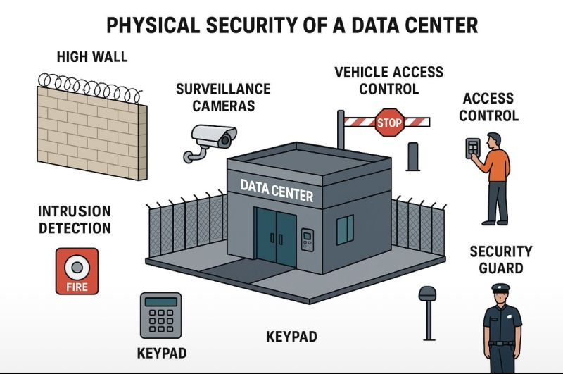
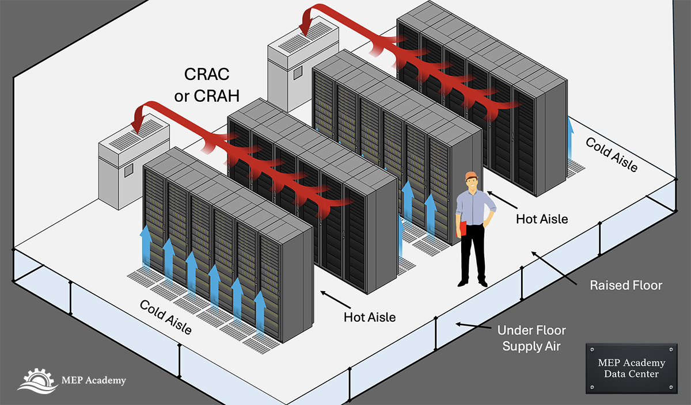
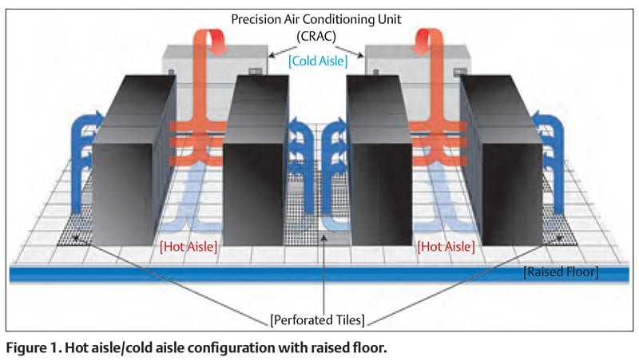

# Fiziksel Çevre, Tesis ve Veri Merkezi (Data Center) Güvenliği

Siber güvenliğin en dış savunma katmanı her zaman fiziksel güvenliktir. Bir saldırganın veri merkezine, sistem odasına veya kritik sunucu kabinine fiziksel erişim sağlaması durumunda; güvenlik duvarları, EDR, şifreleme ve zero-trust mikro-segmentasyon gibi yazılımsal kontrollerin büyük bir kısmı etkisiz hale gelebilir. Bu vektör, **MITRE ATT&CK** çerçevesinde evil maid saldırıları, donanım implantı yerleştirme, cold boot, doğrudan disk çalma veya konsol erişimi gibi taktiklerle zincirleme bir ihlale dönüşebilir.

Fortune 500 ölçeğindeki kurumsal topolojilerde veri merkezi genellikle **Tier III veya Tier IV** (Uptime Institute) seviyesinde tasarlanır. Fiziksel güvenlik; çevre (perimeter), bina girişi, kat/salon girişi ve rack/sistem odası olmak üzere **katmanlı savunma (defense in depth)** anlayışıyla konumlandırılır. Her katman, bir önceki katmanın ihlalini varsayarak tasarlanır ve operasyonel olarak **PSOC/SOC** (Physical Security Operations Center / Security Operations Center) ile entegre izlenir. Bu bölümde uluslararası standartlar (**NIST SP 800-53 PE**, **ISO 27001:2022 A.7**, **CIS Controls**, **ASHRAE TC 9.9**) ile Türkiye özelindeki yasal çerçeveler (**KVKK**, **BDDK**, **5651**) ışığında bütünsel bir fiziksel güvenlik mimarisi ele alınacaktır.


*Veri merkezi fiziksel güvenlik*

---

## §2.1.1. Katmanlı Fiziksel Güvenlik ve CPTED

Tesis güvenliği, merkeze yaklaştıkça güvenlik seviyesinin ve kontrol yoğunluğunun arttığı **savunma derinliği** prensibiyle tasarlanır. Saldırganın hedefe ulaşana kadar aşması gereken engeller artırılarak tespit kolaylaştırılır ve olay müdahale ekiplerine kritik zaman kazandırılır.

### Fiziksel Güvenlik Katmanları

Kurumsal veri merkezleri ve idari tesislerde tipik katman yapısı şu şekildedir:

| Katman | Kapsam | Tipik Kontroller |
| :---- | :---- | :---- |
| **1. Çevre (Perimeter)** | Tesis dış sınırları | Çit, crash-rated bariyerler, araç erişim kontrolü, fiber optik/mikrodalga izinsiz giriş dedektörleri, dış aydınlatma |
| **2. Bina Girişi** | Ana giriş ve resepsiyon | Güvenlik kulübesi, ziyaretçi yönetim sistemi, tam boy turnike/mantrap, CCTV + AI analitiği |
| **3. Kat / Salon Girişi** | Veri merkezi katı veya bölümü | Kart + PIN + biyometrik MFA, anti-passback, escort zorunluluğu |
| **4. Sistem Odası / Rack** | Sunucu ve ağ donanımı | Kabin kilitleri, rack-level biyometrik, tamper detection, ayrı izleme |

Her katman, bir sonrakine göre daha sıkı kontroller içermeli ve **NIST SP 800-53 Rev. 5** `PE (Physical and Environmental Protection)` ailesi ile **ISO 27001:2022 Annex A.7** kontrolleriyle uyumlu olmalıdır.

### CPTED: Çevresel Tasarım Yoluyla Suçun Önlenmesi

**CPTED (Crime Prevention Through Environmental Design)**, mimari ve çevresel özelliklerin stratejik kullanımıyla suç davranışını caydırmayı, engellemeyi ve tespit etmeyi amaçlar. Veri merkezi tasarımında CPTED ilkeleri, pasif güvenlik önlemleri oluşturarak aktif güvenlik sistemlerinin yükünü hafifletir.

*   **Doğal Gözetim (Natural Surveillance):** Kör noktaların giderilmesi, homojen aydınlatma (koridorlarda minimum 50–100 lux), şeffaf cepheler veya aynalarla görünürlüğün artırılması. Peyzaj düzenlemeleri güvenlik kameralarının görüş alanını kapatmamalıdır.
*   **Doğal Erişim Kontrolü (Natural Access Control):** Giriş-çıkışların belirli noktalara kanalize edilmesi; yönlendirici peyzaj, kıvrımlı yollar (araçla ramming saldırısını yavaşlatmak için) ve tek yönlü akış.
*   **Bölgesel Pekiştirme (Territorial Reinforcement):** Kamu alanları ile özel mülk alanlarının net ayrılması; "Yetkisiz Giriş Yasaktır" tabelaları ve düzenli bakım (broken windows theory'yi önlemek).
*   **Hedef Sertleştirme (Target Hardening):** CPTED ile birleştirilen mekanik/elektronik kontroller (çelik kapılar, zırhlı cam, bariyerler).

> [!NOTE]
> CPTED yalnızca yeni tesis inşaatında değil; mevcut binalarda aydınlatma optimizasyonu, peyzaj düzenlemesi ve kör nokta analizi ile de uygulanabilir. Düşük maliyetli CPTED iyileştirmeleri, yüksek maliyetli biyometrik sistemlerin etkinliğini önemli ölçüde artırır.

### Tailgating ve Piggybacking: İnsan Faktörü Zafiyeti

Fiziksel erişim kontrollerindeki en zayıf halkalardan biri insan faktörüdür. Bu vektörler, özellikle vardiya değişimlerinde veya ziyaretçi yoğunluğunda etkilidir.

*   **Tailgating (Kuyruğa Takılma):** Yetkisiz bir kişinin, yetkili bir çalışanın arkasından, onun fark etmeden veya dikkatsizlikten faydalanarak kapıdan geçmesidir.
*   **Piggybacking (Sırtına Binme):** Yetkisiz kişinin, yetkili çalışanı "ellerim dolu, kapıyı tutar mısın?" gibi sosyal mühendislik taktikleriyle kandırarak kapıyı onunla birlikte geçmesidir.

Saldırgan tesise sızdıktan sonra uygulayabileceği **fizikselden sibere geçiş senaryoları**:

*   **USB Zararlı Yazılım Entegrasyonu (T1091):** Kilitlenmemiş iş istasyonuna zararlı USB cihazı takılması.
*   **Kimlik Bilgisi Sızdırma (T1003.001):** Sunucu başında credential dumping veya yerel parola sıfırlama.
*   **Rogue Device Kurulumu (T1200):** Ağ dolaplarına veya masa altlarına Raspberry Pi benzeri sahte cihaz yerleştirilmesi.

**Savunma mekanizmaları:**

*   **Mantrap (Çift Kapılı Güvenlik Geçidi / Airlock):** İki kapı arasında küçük bir oda. İlk kapıdan giren kişi kimlik doğrulaması yapar; ikinci kapı ancak ilk kapı kilitlendikten sonra açılır. IR ışık perdeleri veya ağırlık sensörleri ile birden fazla kişinin geçişi tespit edilir.
*   **Full-height Turnike / Revolving Door:** Tek kişi geçişini mekanik olarak zorlar.
*   **Prosedürel Katman:** İki kişilik kural (sensitive zone'lara yalnız giriş yasağı), "challenge culture" (her çalışanın yetkisiz kişiyi sorgulama sorumluluğu), ziyaretçi yönetim sistemi (fotoğraflı geçici badge + escort + zaman sınırlı erişim).
*   **Anti-passback:** Aynı kimlik bilgisinin kısa sürede tekrar kullanılmasını engeller.

> [!WARNING]
> Mantrap sistemleri yalnızca teknik olarak yeterli değildir. Personel eğitimi, "challenge culture" kültürü ve düzenli red team tatbikatları olmadan tailgating/piggybacking saldırıları yüksek oranda başarılı olmaya devam eder.

### Biyometrik Geçiş Kontrolleri

Yüksek güvenlikli alanlara erişimde, bilgiye (şifre, kart) veya sahipliğe (anahtar) dayalı geleneksel yöntemlerin ötesine geçilmelidir. **Biyometrik sistemler**, kişinin eşsiz fiziksel özelliklerini kullanarak en üst düzey kimlik doğrulama sağlar.

| Modalite | Güçlü Yön | Zayıf Yön / Risk |
| :---- | :---- | :---- |
| **Parmak İzi** | Yaygın, düşük maliyet | Sahte parmak kalıbı (presentation attack) |
| **Damar İzi (Palm Vein)** | Canlılık testi dahili, yüksek güvenlik | Daha yüksek maliyet |
| **İris Tarama** | Çok yüksek doğruluk | Kullanıcı deneyimi, gözlük/lenste sorun |
| **Yüz Tanıma (3D + Liveness)** | Temassız, hızlı | Fotoğraf/video bypass riski (PAD gerekli) |

Yüksek güvenlikli ortamlarda (Tier III/IV veya kritik finansal sistemler) **çok faktörlü fiziksel kimlik doğrulama** (badge + PIN + biyometrik) ve **ISO/IEC 30107** uyumlu Presentation Attack Detection (PAD) kullanılması standarttır.

### Uluslararası Standartlar ve Kontrol Eşleştirmesi

Kuruluşların fiziksel güvenlik kontrollerini denetlenebilir kılmak adına uluslararası standartlarla eşleştirmesi kritik önem taşır.

| ISO 27001:2022 | NIST SP 800-53 Rev. 5 | CIS Controls v8 | Operasyonel Karşılık |
| :---- | :---- | :---- | :---- |
| **A.7.1** Physical security perimeters | **PE-3** Physical Access Control | Safeguard 1.1 / 1.2 | Çitler, bariyerler, mantrap, giriş noktası sınırlandırma |
| **A.7.2** Physical entry | **PE-2** Physical Access Authorizations | Safeguard 5.1 / 5.4 | Kart, geçiş izinleri, biyometrik yetkilendirme |
| **A.7.3** Securing offices, rooms, facilities | **PE-3(1)** System Access | Safeguard 4.1 / 4.3 | Kritik odaların izolasyonu, ek kilit sistemleri |
| **A.7.4** Physical security monitoring | **PE-6** Monitoring Physical Access | Safeguard 8.1 / 8.2 | CCTV, hareket dedektörleri, alarm izleme |
| **A.7.5** Protecting against physical threats | **PE-13** Fire Protection | Safeguard 14.1 | Yangın algılama ve söndürme sistemleri |
| **A.7.11** Supporting utilities | **PE-9** Power Equipment | Safeguard 14.2 | Enerji hatlarının fiziksel koruması |
| **A.7.12** Cabling security | **PE-4** Transmission Access Control | Safeguard 1.1 | Kilitli kanallar, zırhlı borular |

NIST SP 800-53 kapsamında **PE-3(4) Lockable Casings** ve **PE-3(5) Tamper Protection** gibi kontrol geliştirmeleri, sunucu kabin kapaklarının kilitlenmesi ve şasi açılma sensörlerinin aktif hale getirilmesi gibi derinlemesine koruma önlemlerini zorunlu kılar.

**NIST PE ailesinin temel kontrolleri:**

| Kontrol | Açıklama |
| :---- | :---- |
| **PE-2** | Fiziksel erişim yetkilendirmelerinin tanımlanması ve yönetimi |
| **PE-3** | Fiziksel erişim kontrolü (kilitler, turnikeler, biyometrik) |
| **PE-6** | Fiziksel erişimin izlenmesi ve kayıt altına alınması |
| **PE-8** | Ziyaretçi erişim kayıtlarının tutulması |
| **PE-9** | Güç ekipmanı ve kablolama koruması |
| **PE-11** | Acil durum güç kaynağı (UPS, jeneratör) |
| **PE-13** | Yangın koruma sistemleri |
| **PE-14** | Çevresel kontroller (sıcaklık, nem) |

**CIS Controls v8** kapsamında fiziksel güvenlik; Safeguard 1 (Enterprise Asset Inventory), Safeguard 4 (Secure Configuration), Safeguard 5 (Account Management) ve Safeguard 8 (Audit Log Management) ile doğrudan ilişkilidir. Özellikle CIS Control 8.4 (Standardize Time Synchronization), fiziksel ve siber logların korelasyonu için kritiktir.

### Fiziksel Erişim Logları ve SIEM Entegrasyonu

Fiziksel erişim kontrol sistemlerinin (PACS) SOC süreçlerine dahil edilmesi, birleşik siber-fiziksel olay tespit kabiliyetini artırır. PACS logları syslog veya API üzerinden SIEM platformuna (Wazuh, Splunk, QRadar vb.) beslenmelidir.

**Wazuh syslog dinleme konfigürasyonu** (`/var/ossec/etc/ossec.conf`):

```xml
<!-- Wazuh Sunucu Syslog Dinleme Konfigürasyonu -->
<remote>
  <connection>syslog</connection>
  <port>514</port>
  <protocol>tcp</protocol>
  <allowed-ips>192.168.10.50/32</allowed-ips>
  <local_ip>192.168.10.100</local_ip>
</remote>
```

**Örnek PACS syslog formatı (kapı zorlama olayı):**

```
2025-02-14T12:34:56.001Z pacs-controller-01 lenel_pacs 1024 ID99 -
[SecurityEvent@41058 DeviceId="PACS_CONTROLLER_01" DoorName="DataCenter_ZoneA_MainDoor"
EventType="DOOR_FORCED_OPEN" CardId="N/A"] Physical access violation detected.
```

**Wazuh özel kural tanımı** (`/var/ossec/etc/rules/local_rules.xml`):

```xml
<!-- Fiziksel Sızma ve Zorlama Olayları Kural Grubu -->
<group name="pacs_security_alerts,">
  <rule id="110100" level="5">
    <decoded_as>syslog</decoded_as>
    <match>lenel_pacs</match>
    <description>PACS: Fiziksel geçiş kontrol sistemi logu alındı.</description>
  </rule>

  <rule id="110101" level="12">
    <if_sid>110100</if_sid>
    <match>DOOR_FORCED_OPEN</match>
    <description>PACS: Kritik sistem odası kapısı zorlanarak açıldı! Fiziksel sızma ihlali şüphesi.</description>
    <mitre>
      <id>T1200</id>
    </mitre>
  </rule>
</group>
```

---

## §2.1.2. Veri Merkezi İklimlendirme (HVAC) ve Koridor Mimarisi

Sunucular ve depolama sistemleri yüksek miktarda ısı üretir. Isı yönetiminin başarısız olması donanım arızası, termal throttling, ani kapanma ve availability kaybına yol açar. İklimlendirme, fiziksel güvenliğin ayrılmaz bir parçasıdır; çünkü çevresel tehditler (aşırı ısınma, nem anomalisi) doğrudan veri bütünlüğünü ve iş sürekliliğini etkiler.

### ASHRAE TC 9.9 Termal Yönergeleri

Dünya genelinde veri merkezi termal çevre yönetimi, **ASHRAE TC 9.9** komitesi tarafından yayınlanan kılavuzlara dayanır. NIST SP 800-53 **PE-14 (Environmental Controls)** kontrolü, sıcaklık ve nemin tanımlı aralıklarda tutulmasını ve sürekli izlenmesini zorunlu kılar.

| Parametre | Önerilen Aralık | Açıklama |
| :---- | :---- | :---- |
| **Sunucu Giriş Sıcaklığı** | 18°C – 27°C | Rack ön yüzündeki hava girişi |
| **Bağıl Nem (RH)** | %40 – %60 | Optimum çalışma aralığı |
| **Çiğ Noktası (DP)** | –9°C ile 15°C | Yoğuşma ve korozyon kontrolü |

**ASHRAE termal sınıfları (A1–A4, H1):**

| Sınıf | Soğutma Tipi | İzin Verilen Sıcaklık | Tipik Kullanım |
| :---- | :---- | :---- | :---- |
| **A1** | Hava | 15°C – 32°C | Kurumsal sunucular, legacy mainframe |
| **A2** | Hava | 10°C – 35°C | Genel amaçlı sunucular, orta seviye HPC |
| **A3** | Hava | 5°C – 40°C | Bulut bilişim, depolama sistemleri |
| **A4** | Hava | 5°C – 45°C | Hyperscale serbest hava soğutmalı |
| **H1** | Sıvı | Tesis ortamına göre | AI kümeleri, süper bilgisayarlar |

#### Nem Seviyelerinin Donanımsal Riskleri

*   **Düşük Nem (%20'nin altı):** Elektrostatik deşarj (ESD) riskini artırır. Antistatik zemin, ayakkabı ve bileklik prosedürleri zorunludur.
*   **Yüksek Nem (%60'ın üzeri):** Metal yüzeylerde yoğuşma ve korozyon; devre kartlarında iyon migrasyonu riski.

> [!CAUTION]
> **Termal DoS Saldırısı:** Saldırgan fiziksel erişim sağladıktan sonra HVAC setpoint'ini değiştirerek veya fanları durdurarak termal denial-of-service yaratabilir. HVAC üniteleri fiziksel olarak korunmalı (kilitli odalar, erişim logu), redundant tasarım (N+1 veya 2N) uygulanmalı ve sensör verilerinde anomali tespiti yapılmalıdır.

### Sıcak/Soğuk Koridor (Hot/Cold Aisle) Mimarisi

Soğutma verimliliğini maksimize eden ve enerji tüketimini azaltan temel yerleşim stratejisidir.

*   **Soğuk Koridor (Cold Aisle):** Sunucu kabinlerinin ön yüzleri birbirine bakacak şekilde dizilir. HVAC sisteminden gelen soğuk hava bu koridora verilir ve sunucuların ön tarafından emilir.
*   **Sıcak Koridor (Hot Aisle):** Kabinlerin arka yüzleri (egzoz tarafları) birbirine bakar. Sunuculardan atılan sıcak hava bu koridorda toplanır ve tavandaki dönüş kanalları aracılığıyla HVAC sistemine yönlendirilir.

Bu yapılandırma, sıcak ve soğuk havanın birbirine karışmasını (bypass airflow + recirculation) engelleyerek soğutma verimliliğini **%30–50** oranında artırır.


*Sıcak/soğuk koridor mimarisi*

### Containment (Koridor Kapatma) Sistemleri

Modern uygulamada **Cold Aisle Containment (CAC)** veya **Hot Aisle Containment (HAC)** kullanılır:

*   **CAC:** Soğuk koridor kapı, perde veya panel ile kapatılır; soğuk havanın dağılması engellenir.
*   **HAC:** Sıcak koridor tavan veya baca (chimney) ile kapatılır; sıcak hava doğrudan CRAC/CRAH ünitelerine yönlendirilir.


*Soğuk koridor containment*

Tasarım doğrulaması için **CFD (Computational Fluid Dynamics)** modellemesi kullanılır. Raised floor (yükseltilmiş döşeme) soğuk hava dağıtımı için klasik yöntemdir; bazı modern tasarımlarda overhead (tavan) dağıtım tercih edilir.

### Operasyonel İzleme ve DCIM Entegrasyonu

*   Rack inlet/outlet sıcaklık sensörleri, koridor sensörleri ve CRAC/CRAH ünitelerinden veri toplanır (Modbus TCP, BACnet, SNMP).
*   DCIM araçları (Nlyte, Modius) veya açık kaynak Zabbix/Prometheus + Grafana ile görselleştirilir.
*   Eşik değer aşımı (örneğin inlet > 27°C ve 5 dakika süre) → otomatik alarm SIEM'e iletilir → SOC ticket + NOC müdahalesi tetiklenir.

**Wazuh çevresel anomali kuralı örneği:**

```xml
<group name="environmental_alerts,">
  <rule id="110300" level="8">
    <decoded_as>json</decoded_as>
    <field name="sensor_type">rack_inlet_temp</field>
    <field name="value" type="pcre2">^([3-9][0-9]|2[8-9])</field>
    <description>ENV: Rack giriş sıcaklığı 27°C üzerinde - termal risk!</description>
  </rule>

  <rule id="110301" level="10">
    <if_sid>110300</if_sid>
    <frequency>3</frequency>
    <timeframe>300</timeframe>
    <description>ENV: Kritik - 5 dakikada 3 kez sıcaklık eşiği aşıldı. HVAC arızası veya sabotaj şüphesi.</description>
  </rule>
</group>
```

---

## §2.1.3. Güç Sürekliliği ve Yangın Söndürme Sistemleri

Bir veri merkezinin kesintisiz çalışması, şebeke kesintilerinden etkilenmeyen yedekli güç mimarileri ve donanıma zarar vermeyen yangın bastırma teknolojileri ile mümkündür.

### Uptime Institute Tier Standartları

Veri merkezleri, altyapı yedeklilik seviyeleri, hata toleransları ve eşzamanlı bakım yapılabilirlik yeteneklerine göre **Uptime Institute** tarafından dört sınıfa ayrılır.

| Tier | Hedef Uptime | Yıllık Maks. Kesinti | Dağıtım Yolu | Yedeklilik | Eşzamanlı Bakım | Hata Toleransı |
| :---- | :---- | :---- | :---- | :---- | :---- | :---- |
| **I** | %99.671 | 28,8 saat | Tek yol | Yok (N) | Yok | Yok |
| **II** | %99.741 | 22 saat | Tek yol | Bileşen (N+1) | Yok | Sınırlı |
| **III** | %99.982 | 1,6 saat | Çift yol (1 aktif, 1 pasif) | N+1 | Var | Kısmi |
| **IV** | %99.995 | 26,3 dakika | Çift yol (eşzamanlı aktif) | 2N / 2(N+1) | Var | Tam |

> [!NOTE]
> **Tier III** çoğu kurumsal veri merkezi için maliyet-etkinlik dengesinin optimum noktasıdır. Eşzamanlı bakım yapılabilirliği sayesinde planlı bakımlar sırasında iş yükü etkilenmez. **Tier IV** ise finansal kurumlar, telekom operatörleri ve kritik altyapı için tercih edilir; herhangi bir bileşen arızasında sistem kesintisiz çalışmaya devam eder.

### Güç Sürekliliği Sistemleri

NIST SP 800-53 **PE-9 (Power Equipment and Cabling)** ve **PE-11 (Emergency Power)** kontrolleri ile doğrudan ilişkilidir. BDDK iş sürekliliği düzenlemeleri de UPS + jeneratör + düzenli test zorunluluğu getirir.

#### UPS (Uninterruptible Power Supply)

*   **Online double-conversion** tip tercih edilir; şebeke dalgalanmalarından tam izolasyon sağlar.
*   Otonomi süresi genellikle **10–30 dakika**; jeneratör devreye girene kadar köprü görevi görür.
*   Geleneksel kurşun-asit (VRLA) piller yerine, BMS ile donatılmış **lityum-iyon** piller tercih edilmektedir (daha hızlı şarj, daha uzun ömür).

#### Jeneratörler

*   Dizel veya doğalgazlı üniteler; **ATS (Automatic Transfer Switch)** ile otomatik devreye girer.
*   Tier III/IV'de redundant (N+1 veya 2N) ve farklı yangın zonlarında konumlandırılır.
*   **Test protokolü:** Haftalık görsel kontrol, aylık yük altında test (NFPA 110), yıllık tam yük bank testi.
*   Yakıt kalitesi (polishing), seviye sensörleri ve fiziksel güvenlik (çit, kamera, kilitli vanalar) kritiktir.

#### Güç Dağıtım Mimarisi

```
Şebeke → ATS → UPS (N+1) → PDU (Power Distribution Unit) → Rack PDU → Sunucu
                ↓
            Jeneratör (N+1, ayrı yangın zonu)
```

### Yangın Söndürme Sistemleri

Su bazlı yangın söndürme sistemleri (sprinkler), elektronik cihazlara onarılamaz zarar vereceğinden veri merkezlerinde **temiz gazlı (clean agent)** sistemler kullanılır. NIST SP 800-53 **PE-13 (Fire Protection)** ve **NFPA 75 / NFPA 2001** standartları geçerlidir.

| Parametre | FM-200 (HFC-227ea) | Novec 1230 (FK-5-1-12) | IG-541 (Inergen) |
| :---- | :---- | :---- | :---- |
| **Söndürme Mekanizması** | Isı emilimi (kimyasal + fiziksel) | Isı emilimi (fiziksel) | Oksijen boğma (%12'ye düşürme) |
| **Tasarım Konsantrasyonu** | %6,25 – 9 | %4 – 6 | %37,5 – 52 |
| **Toksisite (NOAEL)** | ~9% (tasarım değerine yakın) | ~10% (güvenli) | Güvenli (düşük O₂'de dahi) |
| **Deşarj Süresi** | 10 saniye | 10 saniye | 60 saniye |
| **GWP** | ~3200 (F-Gas kısıtlaması) | ~1 (çevre dostu) | 0 (doğal gazlar) |
| **Akustik HDD Riski** | Düşük | Düşük | Yüksek (~130 dB) |
| **Depolama Alanı** | Düşük (sıvılaştırılmış) | Düşük (sıvılaştırılmış) | Yüksek (çok sayıda silindir) |

#### FM-200 ve Novec 1230 Detayları

*   **FM-200 (HFC-227ea):** Yangını ısıyı hızla emerek ve kimyasal reaksiyonu kırarak söndürür. İnsanlar için güvenli, ozon tabakasına zararı yoktur. **TS EN 15004** standardına uygundur. Dezavantaj: Yüksek GWP (~3200), F-Gas/Kigali düzenlemeleri kapsamında phasedown sürecindedir.
*   **Novec 1230 (FK-5-1-12):** FM-200'e alternatif, çok düşük GWP (~1) sıvı floroketondur. Yangına anında tepki verir, kalıntı bırakmaz, iletken değildir. Düşük toksisiteye sahiptir ve geleceğe hazır çevre dostu alternatiftir.

**Tipik tasarım akışı:**

1. Erken tespit: **VESDA** (aspirating smoke detection) ile duman algılama
2. Ön-alarm ve personel tahliyesi
3. BMS entegrasyonu ile HVAC otomatik kapanır (duman yayılımını önlemek)
4. Gecikme süresi sonrası otomatik gaz deşarjı
5. En az 10 dakika hedef konsantrasyonun korunması

> [!WARNING]
> **Akustik Şok ve HDD Koruması:** Inergen ve Argonite gibi inert gaz sistemleri yüksek basınçta (~200 bar) deşarj edildiğinde yaklaşık 130 dB ses enerjisi üretir. Bu akustik dalga, manyetik HDD'lerin okuma-yazma kafalarını rezonansa sokarak head crash ve kalıcı veri bozulmasına neden olabilir. FM Global Data Sheet 5-32 standartları, **akustik susturuculu nozulların (silent/acoustic nozzles)** kullanılmasını zorunlu kılar. SSD'ler bu akustik dalgalardan etkilenmez.

#### Oda Sızdırmazlık Testi (Door Fan Test)

Gazlı söndürme ajanının yangının yeniden başlamasını engellemesi için odanın sızdırmaz olması gerekir. **NFPA 2001 Annex C** uyarınca, gaz deşarjından sonra en az 10 dakika boyunca hedeflenen konsantrasyonun en az %85'inin korunması gerekir. **Kapı Fanı Testi (Door Fan Test)** ile sızıntı alanı (ELA) ölçülür ve simülasyonla gaz tutma süresi hesaplanır. Testler yılda en az bir kez veya odada yapılan her tadilat sonrası tekrarlanmalıdır.

---

## §2.1.4. Yerel Mevzuat, Uyum ve Siber-Fiziksel SOC Entegrasyonu

Fiziksel çevre güvenliği yalnızca mühendislik kararları ile değil; yasal yükümlülükler ve düzenleyici kurumların zorunlu standartları doğrultusunda şekillendirilir. Türkiye'de faaliyet gösteren kurumsal yapılar; **KVKK**, **BDDK** ve **5651 Sayılı Kanun** çerçevesinde fiziksel altyapılarını tasarlamakla yükümlüdür.

### BDDK Bilgi Sistemleri Yönetmeliği

**BDDK Bilgi Sistemleri ve Elektronik Bankacılık Hizmetleri Hakkında Yönetmelik** gereğince:

*   **Yerel Lokalizasyon:** Bankacılık verilerini işleyen birincil ve ikincil (Disaster Recovery) sistemlerin coğrafi olarak **Türkiye sınırları içinde** fiziksel olarak barındırılması zorunludur.
*   **Coğrafi Yedeklilik:** İkincil veri merkezi, birincil merkezi etkileyecek majör doğal afet (deprem, yangın) ve siber-fiziksel saldırılardan etkilenmeyecek farklı bir coğrafi risk bölgesinde konumlandırılmalıdır.
*   **Fiziksel Güvenlik Beklentileri:** Biyometrik + mantrap + CCTV + loglama kombinasyonu denetim beklentisidir. Çevre koşulları (sıcaklık, nem), iş sürekliliği ve loglama kayıtları denetim kapsamında tutulmak zorundadır.
*   **Failback Prosedürleri:** Felaket senaryosu sona erdikten sonra ikincil merkezden birincil merkeze sorunsuz geri dönüş prosedürleri hazırlanmalı ve **her yıl test edilmelidir**.

### KVKK Kapsamında Fiziksel Tedbirler

**6698 Sayılı Kişisel Verilerin Korunması Kanunu (KVKK)** uyarınca veri sorumluları, kişisel verilerin hukuka aykırı olarak işlenmesini ve erişilmesini önlemekle yükümlüdür. **KVKK Madde 12** ve **Kişisel Veri Güvenliği Rehberi** kapsamında fiziksel olarak şu önlemler alınmalıdır:

| Tedbir Kategorisi | Uygulama |
| :---- | :---- |
| **Fiziksel Erişim Kontrolü** | Biyometrik ve kartlı geçiş sistemleri, ziyaretçi kayıtları, escort zorunluluğu |
| **Çevresel Koruma** | Yangın/sel koruması, iklimlendirme, fiziksel bariyerler |
| **Cihaz Şifreleme** | Hassas kişisel veri barındıran sunucu diskleri, dizüstü bilgisayarlar ve taşınabilir medyaların tam disk şifrelemesi (FDE) |
| **Ağ Dışı Yedekleme** | Fidye yazılımına karşı LTO bantlar vb. yedeklerin ağ bağlantısı olmayan, yangına dayanıklı kasalarda saklanması |
| **Erişim Kayıtları** | Kişisel verilerin bulunduğu fiziksel ortamlara giriş-çıkış loglarının tutulması |

> [!CAUTION]
> **Biyometrik Veri İşleme:** KVKK kapsamında parmak izi, iris ve yüz tanıma gibi biyometrik veriler **özel nitelikli kişisel veri** statüsündedir. Biyometrik sistemlerin kurulumunda açık rıza, aydınlatma yükümlülüğü ve veri minimizasyonu ilkeleri titizlikle uygulanmalıdır.

### 5651 Sayılı Kanun ve Loglama Yükümlülükleri

**5651 Sayılı Kanun** kapsamında, iç ağdan internete çıkan tüm kullanıcıların ve sistemlerin IP dağıtım, DHCP ve NAT loglarının yasal olarak imzalanması ve saklanması zorunludur. Fiziksel güvenlik açısından kritik noktalar:

*   **Zaman Senkronizasyonu:** Logların mahkemelerde delil niteliği taşıyabilmesi için tüm sistemlerin (sunucular, PACS, CCTV, siber güvenlik donanımları) tek bir kaynaktan zaman senkronizasyonu yapması şarttır. Bu, **CIS Control 8.4** ile tam uyumludur.
*   **NTP Yapılandırması:** Kriptografik olarak doğrulanmış güvenilir yerel NTP sunucularıyla senkronizasyon. Zaman kaymaları (>1 saniye) siber-fiziksel olay analitiğinde delil bütünlüğünü bozar.
*   **Altyapı Güvenliği:** Veri merkezi fiziksel güvenliği, 5651 kapsamındaki loglama altyapısının bütünlüğünü korumak için kritik öneme sahiptir.

### Siber-Fiziksel Birleşik SOC Operasyonları

Fiziksel güvenlik olaylarının (kart okumaları, kapı alarmları) siber olaylarla (VPN oturumları, Active Directory logları) birleştirilerek tek bir SOC olay kuyruğunda korelasyona tabi tutulması, karmaşık saldırıların tespiti için devrimsel bir yaklaşımdır.

#### Korelasyon Senaryosu: İmkansız Seyahat (Impossible Travel)

Bir çalışanın kimlik bilgileri ve geçiş kartı çalınmış olabilir. Birleşik SOC altyapısı bu durumu şu şekilde tespit eder:

1. **Fiziksel Olay (PACS):** Çalışanın geçiş kartı saat 14:00:00'da Ankara Veri Merkezi giriş kapısında doğrulanır.
2. **Siber Olay (VPN/AD):** Aynı kullanıcı hesabı saat 14:02:15'te harici bir IP üzerinden kurumsal VPN ağında oturum açar.
3. **Korelasyon:** Fiziksel olarak Ankara'da bulunan bir kişinin 2 dakika sonra farklı coğrafyadan VPN bağlantısı fiziksel olarak imkansızdır.

**Wazuh siber-fiziksel korelasyon kuralı:**

```xml
<!-- Siber-Fiziksel İmkansız Seyahat Korelasyon Kuralı -->
<group name="converged_soc_alerts,">
  <rule id="110200" level="3">
    <decoded_as>syslog</decoded_as>
    <match>lenel_pacs</match>
    <field name="event_type">PHYSICAL_ENTRY_GRANTED</field>
    <description>PACS: Kullanıcı fiziksel alana giriş yaptı.</description>
  </rule>

  <rule id="110201" level="3">
    <decoded_as>json</decoded_as>
    <field name="win.system.providerName">Microsoft-Windows-Security-Auditing</field>
    <field name="win.system.eventID">4624</field>
    <match>VPN_Gateways</match>
    <description>AD: Kullanıcı VPN üzerinden oturum açtı.</description>
  </rule>

  <rule id="110202" level="14">
    <if_sid>110201</if_sid>
    <if_matched_sid>110200</if_matched_sid>
    <same_user />
    <frequency>2</frequency>
    <timeframe>300</timeframe>
    <description>CRITICAL: Siber-Fiziksel İmkansız Seyahat Tespit Edildi! Kart kopyalama veya hesap ele geçirme şüphesi.</description>
    <mitre>
      <id>T1110</id>
      <id>T1200</id>
    </mitre>
  </rule>
</group>
```

#### Ek Korelasyon Senaryoları

| Senaryo | Fiziksel Olay | Siber Olay | Risk |
| :---- | :---- | :---- | :---- |
| **İşten Ayrılan Çalışan** | HR sisteminde termination | PACS'ta geçiş denemesi | Yetkisiz erişim |
| **Mesai Dışı Erişim** | Gece 03:00 PACS girişi | Aynı anda dosya sunucusuna toplu indirme | Veri sızıntısı |
| **Kapı Zorlama + Ağ Anomalisi** | DOOR_FORCED_OPEN | 5 dk içinde yeni MAC adresi ağda | Fiziksel sızma + rogue device |
| **HVAC Anomalisi + Fiziksel Erişim** | Sıcaklık eşiği aşımı | Yetkisiz HVAC odası girişi | Termal DoS / sabotaj |

#### Otomatik Müdahale (SOAR Playbook)

Korelasyon kuralı tetiklendiğinde SOAR platformu otomatik olarak:

*   Kullanıcının AD hesabını dondurur ve aktif VPN/bulut oturumlarını sonlandırır.
*   PACS üzerinden fiziksel geçiş yetkilerini askıya alır.
*   CCTV API'si ile kapıdaki canlı görüntü ve yüz tanıma eşleşme skorunu SOC ekranına yansıtır.
*   Fiziksel güvenlik devriyesine sistem odasına intikal talimatı iletir.

### Uyum Kontrol Listesi

| Gereksinim | Kaynak | Kontrol |
| :---- | :---- | :---- |
| Fiziksel erişim yetkilendirme | NIST PE-2, ISO A.7.2 | Rol bazlı erişim matrisi |
| Erişim izleme ve loglama | NIST PE-6, ISO A.7.4 | 24/7 CCTV, PACS logları, SIEM entegrasyonu |
| Çevresel kontroller | NIST PE-14, ASHRAE TC 9.9 | Sıcaklık/nem izleme, alarm eşikleri |
| Acil durum gücü | NIST PE-11, BDDK | UPS + jeneratör, düzenli test |
| Yangın koruma | NIST PE-13, NFPA 2001 | Temiz gazlı sistem, VESDA, Door Fan Test |
| Zaman senkronizasyonu | CIS 8.4, 5651 | NTP, tüm sistemlerde UTC+3 |
| Veri lokalizasyonu | BDDK Yönetmelik | TR sınırları içinde birincil + ikincil DC |
| Kişisel veri koruması | KVKK Madde 12 | Fiziksel + teknik + idari tedbirler |

---

## §2.1.5. Sonuç ve Mimari Tavsiyeler

Fiziksel güvenlik, siber güvenliğin çevresine örülmüş statik bir duvar değil; sürekli değişen, siber tehditlerle iç içe geçmiş dinamik bir koruma katmanıdır. Kurumsal yapıların siber-fiziksel güvenlik olgunluğunu artırmak amacıyla aşağıdaki stratejik adımlar önerilmektedir.

### Stratejik Öncelikler

1. **Siber-Fiziksel Yakınsama (Convergence):** Fiziksel erişim sistemleri, CCTV altyapıları ve SIEM arasındaki veri akışını çift yönlü hale getirerek impossible travel, terminated employee geçiş anomalileri ve kapı zorlama + ağ anomalisi senaryolarını otomatik izleyin.

2. **Katmanlı Savunma Mimarisi:** Her katmanda (çevre → bina → kat → rack) bir önceki katmanın ihlalini varsayan kontroller uygulayın. CPTED ilkelerini pasif güvenlik katmanı olarak entegre edin; mantrap ve biyometrik sistemleri aktif katman olarak konumlandırın.

3. **ASHRAE Standartlarına Uygun İklimlendirme:** Aşırı soğutmadan kaçınarak PUE değerlerini düşürün; ancak düşük nemde ESD risklerini minimize etmek için antistatik zemin ve ekipman standartlarını karşılayın. Cold/Hot aisle containment ile soğutma verimliliğini %30–50 artırın.

4. **Tier Uyumlu Güç ve Yangın Altyapısı:** İş sürekliliği gereksinimlerine göre Tier III veya IV hedefleyin. FM-200 veya Novec 1230 temiz gazlı sistemlerde HDD akustik riskini göz önünde bulundurun; Door Fan Test ile oda sızdırmazlığını yıllık doğrulayın.

5. **Yerel Mevzuat Uyumu:** BDDK ve KVKK gereksinimleri doğrultusunda altyapıların Türkiye sınırları içinde yedekli çalışmasını sağlayın. Air-gapped yedekleme medyalarının fiziksel odalarını en üst seviye biyometrik sistemlerle donatın. 5651 kapsamında tüm sistemlerde zaman senkronizasyonunu zorunlu kılın.

### Mimari Referans Modeli

```
┌─────────────────────────────────────────────────────────────────┐
│                    KATMAN 1: ÇEVRE (Perimeter)                  │
│  Çit + Bariyer + Dış Aydınlatma + CPTED + İzinsiz Giriş Sensör │
├─────────────────────────────────────────────────────────────────┤
│                    KATMAN 2: BİNA GİRİŞİ                        │
│  Mantrap + Turnike + Ziyaretçi Yönetimi + CCTV/AI Analitiği   │
├─────────────────────────────────────────────────────────────────┤
│                    KATMAN 3: KAT / SALON                        │
│  Kart + PIN + Biyometrik MFA + Anti-passback + Escort           │
├─────────────────────────────────────────────────────────────────┤
│                    KATMAN 4: SİSTEM ODASI / RACK                │
│  Kabin Kilitleri + Tamper Detection + Rack PDU İzleme           │
├─────────────────────────────────────────────────────────────────┤
│                    ÇEVRESEL ALTYAPI                             │
│  HVAC (ASHRAE) + UPS/Jeneratör (Tier) + FM-200/Novec 1230     │
├─────────────────────────────────────────────────────────────────┤
│                    SİBER-FİZİKSEL SOC                           │
│  PACS + CCTV + SIEM (Wazuh) + SOAR + Korelasyon + 5651/NTP     │
├─────────────────────────────────────────────────────────────────┤
│                    UYUM KATMANI                                 │
│  NIST PE + ISO 27001 A.7 + CIS Controls + KVKK + BDDK          │
└─────────────────────────────────────────────────────────────────┘
```

### Operasyonel Olgunluk Seviyeleri

| Seviye | Özellikler | Hedef Kurum |
| :---- | :---- | :---- |
| **Temel** | Fiziksel erişim kontrolü, temel CCTV, manuel log inceleme | KOBİ, küçük IT odaları |
| **Gelişmiş** | Biyometrik MFA, PACS-SIEM entegrasyonu, HVAC izleme, Tier II/III | Orta ölçekli kurumlar |
| **İleri** | Siber-fiziksel korelasyon, SOAR playbook, impossible travel tespiti | Finans, telekom, büyük kurumlar |
| **Optimize** | AI tabanlı anomali tespiti, otomatik müdahale, sürekli red team | Tier IV DC, kritik altyapı |

### Son Söz

Veri merkezi fiziksel güvenliği; çevre bariyerlerinden rack seviyesi tamper detection'a, ASHRAE uyumlu iklimlendirmeden FM-200/Novec 1230 yangın sistemlerine, KVKK/BDDK/5651 mevzuat uyumundan Wazuh tabanlı siber-fiziksel SOC entegrasyonuna kadar uzanan bütünsel bir disiplindir. Teknoloji yatırımları tek başına yeterli değildir — prosedürler, personel eğitimi, düzenli testler ve sürekli iyileştirme kültürü, en gelişmiş biyometrik sistemlerin bile etkinliğini belirleyen asıl faktörlerdir.

> [!NOTE]
> Bu bölümde ele alınan fiziksel sızma vektörlerinin (tailgating, piggybacking, RFID klonlama) pratik testleri **§2.3 Sosyal Mühendislik ve Red Team** bölümünde; cihaz imhası ve veri yok etme konuları ise **§2.2 Cihaz İmhası ve Veri Yok Etme** bölümünde detaylandırılmıştır.