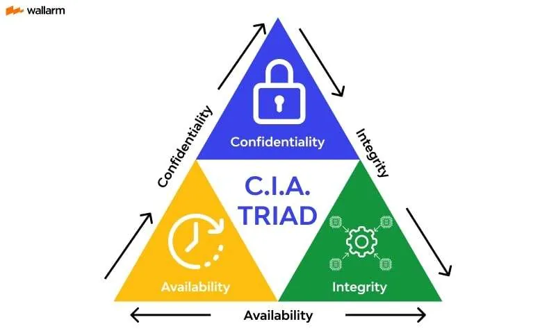
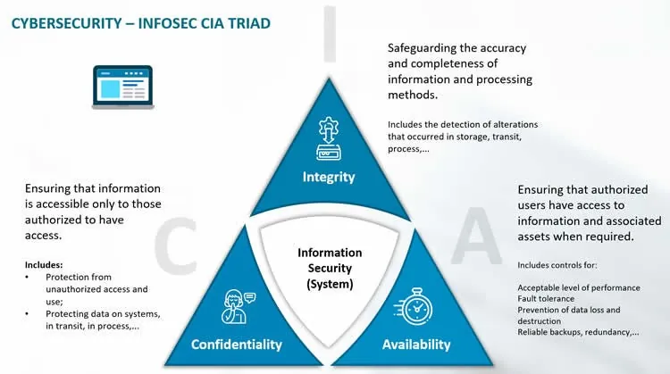
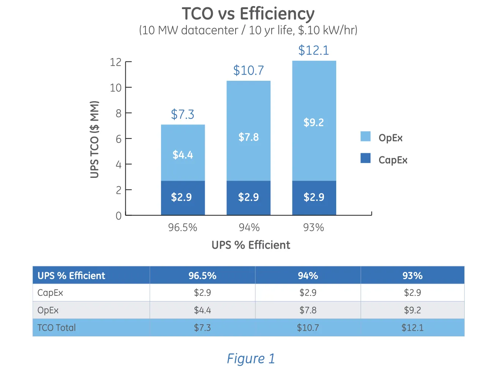
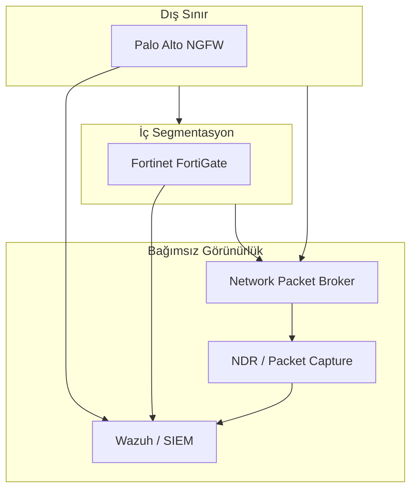

# Bilgi Güvenliği Stratejisi, Temelleri (CIA) ve Maliyet Yönetimi (TCO)

Bilgi güvenliği, günümüzde yalnızca teknik bir gereklilik değil; kurumların hayatta kalmasını, dijital dönüşümünü ve regülasyon uyumunu doğrudan etkileyen stratejik bir yönetim fonksiyonudur. Fortune 500 ölçeğindeki kurumsal topolojilerde savunma derinliği (defense in depth) mimarisi; perimeter, network, endpoint, application, data, identity ve SOC/monitoring katmanlarının uyumlu çalışmasını gerektirir. Her kontrolün **CIA Üçlüsü** (Confidentiality–Integrity–Availability) üzerindeki etkisi, iş hedefleriyle hizalanması ve toplam sahip olma maliyeti (TCO) üzerindeki yansıması, mimari kararların temelini oluşturur.

Bu bölümde CIA üçlüsü teknik kontrollere eşlenerek incelenecek; Parkerian Hexad, STRIDE ve Zero Trust genişlemeleri ele alınacak; NIST SP 800-53, NIST CSF 2.0, ISO 27001:2022 ve CIS Controls v8.1 ile entegrasyon gösterilecek; KVKK, 5651, BDDK ve 7545 sayılı Siber Güvenlik Kanunu yükümlülükleri metne yedirilecek; TCO, CapEx/OpEx ve üretici konsolidasyonu kararları operasyonel örneklerle desteklenecektir.


*CIA Üçlüsü — bilgi güvenliği stratejisinin evrensel çerçevesi*

---

## §1.1.1. CIA Üçlüsü: Derinlemesine Analiz ve Teknik Karşılıkları

CIA Üçlüsü (Gizlilik, Bütünlük, Kullanılabilirlik), 1970'lerden bu yana bilgi güvenliğinin merkezî dayanağıdır. ISO/IEC 27000 serisi bu üç prensibin korunmasını bilgi güvenliğinin tanımlayıcı unsuru olarak kabul eder. Modern tehdit ortamında CIA tek başına yetersiz kalsa da, tüm saldırı ve savunma değerlendirmeleri bu üçlü bağlamında yapılır; FIPS 199 ve NIST SP 800-53, her bileşeni düşük/orta/yüksek olarak derecelendirerek kontrol baseline'ını belirler.

### Gizlilik (Confidentiality)

Gizlilik, yetkisiz kişilerin, süreçlerin veya sistemlerin verilere erişememesini ve verilerin yetkisiz şekilde ifşa edilmemesini garanti eder. Kurumsal bağlamda yalnızca şifreleme değil; IAM, veri sınıflandırması, ağ segmentasyonu ve DLP'yi kapsar.

| Katman | Kontrol Mekanizması | Örnek Uygulama |
| :---- | :---- | :---- |
| **Veri** | Şifreleme (AES-256, TLS 1.3) | Veritabanı TDE, dosya düzeyinde şifreleme |
| **Uygulama** | RBAC / ABAC | OAuth 2.0, SAML, OpenID Connect |
| **Ağ** | Mikro-segmentasyon, ZTNA | NGFW App-ID, Zero Trust erişim |
| **Fiziksel** | Biyometrik erişim, CCTV | Veri merkezi fiziksel kontroller |

**Saldırı ve savunma dengesi:** MITRE ATT&CK **TA0010 (Exfiltration)** kapsamındaki veri sızdırma vektörlerine karşı DLP, NTA ve SIEM korelasyonu uygulanır. Credential stuffing veya insider threat senaryosunda Palo Alto NGFW + Wazuh korelasyonu ile "brute-force + anomalous geo-location" kuralı tetiklenir; KVKK m.12 gereği erişim logları adli incelemeye hazır tutulur.

### Bütünlük (Integrity)

Bütünlük, verinin yaşam döngüsü boyunca yetkisiz değiştirilmemesini, silinmemesini veya tahrif edilmemesini sağlar.

- **Hash doğrulama:** SHA-256 özetleme ile dosya bütünlüğü kontrolü
- **Dijital imza:** PKI tabanlı belge ve yazılım bütünlüğü
- **FIM (File Integrity Monitoring):** Wazuh Syscheck modülü ile kritik dosya değişikliklerinin gerçek zamanlı izlenmesi
- **Zaman damgası:** 5651 ve KVKK kapsamında logların TÜBİTAK Kamu SM ile mühürlenmesi

**Ransomware** en yaygın bütünlük ihlalidir: veriler şifrelenerek erişilemez/değiştirilmiş hale gelir; çift gasp modelinde gizlilik de ihlal edilir. Savunma: immutable backup (WORM), FIM + SIEM korelasyonu ve değişiklik yönetimi süreçleri.

### Kullanılabilirlik (Availability)

Kullanılabilirlik, yetkili kullanıcıların ihtiyaç anında sistemlere ve verilere kesintisiz erişebilmesini garanti eder.

| Kontrol Alanı | Teknoloji | Konfigürasyon Örneği |
| :---- | :---- | :---- |
| **Yük dengeleme** | F5 BIG-IP, HAProxy | Active-Active küme |
| **Felaket kurtarma** | Site Recovery Manager | RPO < 15 dk, RTO < 1 saat |
| **DDoS koruması** | Cloudflare, AWS Shield | Rate limiting, SYN flood koruması |
| **Yedekleme** | Veeam, Commvault | 3-2-1-1-0 kuralı |

**DDoS** (MITRE ATT&CK T1498/T1499) saf kullanılabilirlik ihlalidir. Anycast mimarisi, otomatik ölçekleme ve bulut tabanlı DDoS koruması birlikte uygulanmalıdır.

:::note
OT/ICS ortamlarında öncelik sırası genellikle **kullanılabilirlik → güvenlik (safety) → bütünlük → gizlilik** şeklindedir. Stuxnet (2010) sonrası NIST SP 800-53 ICS/SCADA rehberliği bu tersine dönüşü dikkate alır.
:::

### CIA ↔ Standart Eşleştirmesi

| CIA Bileşeni | NIST SP 800-53 Rev. 5 | ISO 27001:2022 | CIS Controls v8.1 |
| :---- | :---- | :---- | :---- |
| **Gizlilik** | AC, IA, MP | A.5, A.8 (erişim) | Control 6, 3 |
| **Bütünlük** | AU, CM, SI | A.8.19, A.8.24 | Control 3, 8 |
| **Kullanılabilirlik** | CP, PE | A.8.13, A.8.14 | Control 11 |

CIS Controls v8.1'de **153 safeguard**, üç Implementation Group: IG1 = 56 safeguard (asgari baseline). Verizon DBIR verisine göre ilk beş temel kontrol yaygın saldırıların ~%85'ini azaltır; Community Defense Model tüm kontrollerin MITRE ATT&CK tekniklerinin ~%86'sına karşı savunma sağladığını gösterir.

### Gerçek Saldırı Senaryolarıyla CIA İhlalleri

| Saldırı Türü | CIA İhlali | STRIDE Karşılığı |
| :---- | :---- | :---- |
| **Ransomware** | Bütünlük + Kullanılabilirlik (+ Gizlilik) | Tampering, DoS |
| **SQL Injection** | Bütünlük + Gizlilik | Tampering, Information Disclosure |
| **DDoS** | Kullanılabilirlik | Denial of Service |
| **Credential theft** | Gizlilik + Yetkilendirme | Spoofing, Elevation of Privilege |

### Wazuh FIM: Bütünlük Kontrolünün Operasyonel Uygulaması

Bütünlük ilkesinin uç noktalarda izlenmesi için Wazuh Syscheck modülü, izlenen dosyaların MD5/SHA-256 özetlerini hesaplayarak baseline ile karşılaştırır. Kritik Linux dizinleri için örnek `ossec.conf` yapılandırması:

```xml
<syscheck>
  <disabled>no</disabled>
  <frequency>21600</frequency>
  <scan_on_start>yes</scan_on_start>
  <alert_new_files>yes</alert_new_files>
  <process_priority>10</process_priority>

  <directories realtime="yes" whodata="yes" check_all="yes" report_changes="yes">/etc,/usr/bin,/usr/sbin</directories>

  <windows_registry recursion_level="3" report_changes="yes">HKEY_LOCAL_MACHINE\Software\Microsoft\Windows\CurrentVersion\Run</windows_registry>

  <synchronization>
    <enabled>yes</enabled>
    <interval>10m</interval>
    <max_interval>2h</max_interval>
    <response_timeout>45s</response_timeout>
    <queue_size>32768</queue_size>
  </synchronization>

  <max_files_per_second>150</max_files_per_second>
  <ignore type="sregex">\.log$|\.tmp$|\.swp$</ignore>
</syscheck>
```

**SSH yapılandırma manipülasyonu senaryosu:** Saldırgan `/etc/ssh/sshd_config` dosyasında `PermitRootLogin yes` yaparak kalıcılık sağlar ve timestomping uygular. `whodata="yes"` ile auditd entegrasyonu sayesinde değişikliği yapan kullanıcı ve süreç yakalanır. Özel Wazuh kuralı:

```xml
<group name="syscheck,critical_audit">
  <rule id="100105" level="12">
    <if_sid>550</if_sid>
    <field name="file">^/etc/ssh/sshd_config$</field>
    <field name="changed_fields">^content$|^permission$</field>
    <description>Kritik SSH yapılandırma dosyasında değişiklik! Kullanıcı: $(audit.login_user.name), Süreç: $(audit.process.name)</description>
    <mitre>
      <id>T1098</id>
      <id>T1565.001</id>
    </mitre>
  </rule>
</group>
```

Tetiklenen alarm örneği SIEM paneline şu JSON ile aktarılır:

```json
{
  "timestamp": "2026-03-22T10:14:22.512+0300",
  "agent": { "id": "104", "name": "linux-prod-web-01", "ip": "10.150.12.30" },
  "rule": { "id": "100105", "level": 12, "mitre": { "id": ["T1098", "T1565.001"] } },
  "syscheck": {
    "path": "/etc/ssh/sshd_config",
    "mode": "whodata",
    "sha256_before": "c71a39fa2236de9038ba986e06b9b32e6ba727a2e8b2b621e25e36f019b88451",
    "sha256_after": "85a1a1f33fcd98fc1c149afbf4c8996fb92427ae41e4649b934ca495991b7852b",
    "diff": "--- /etc/ssh/sshd_config\n-PermitRootLogin no\n+PermitRootLogin yes",
    "audit": {
      "login_user": { "name": "saldirgan_kullanici" },
      "process": { "name": "/usr/bin/nano" }
    }
  }
}
```

---

## §1.1.2. CIA Üçlüsünün Ötesi: Genişletilmiş Güvenlik Modelleri

Modern kurumsal ortamda CIA tek başına yetersizdir. STRIDE, Parkerian Hexad ve AAA modelleri; kimlik doğrulama, hesap verebilirlik ve inkâr edilemezlik boyutlarını stratejik planlamaya dahil eder.

### Parkerian Hexad

Donn B. Parker'ın (1998) modeli CIA'ya üç ek nitelik ekler:

| Nitelik | Tanım | Örnek |
| :---- | :---- | :---- |
| **Possession/Control** | Sahiplik/kontrol kaybı | Şifreli ama çalınmış yedek bant |
| **Authenticity** | Köken/yazarlık doğruluğu | Sahte dijital sertifika |
| **Utility** | Verinin kullanılabilir/anlamlı olması | Anahtarı kaybolmuş şifreli veri |

Fortune 1000 ölçeğinde GRC, red-team modelleme ve olay müdahale planlaması için daha yüksek granülerlik sağlar; ancak teknik olmayan paydaşlar için fazla soyut kalabilir.

### STRIDE Tehdit Modelleme

Microsoft STRIDE (Loren Kohnfelder & Praerit Garg, 1999), saldırgan perspektifinden tehdit kategorilerini sınıflandırır:

| Kategori | İhlal Ettiği Özellik | Savunma Kontrolü |
| :---- | :---- | :---- |
| **S**poofing | Kimlik doğrulama | MFA, mTLS, sertifika pinning |
| **T**ampering | Bütünlük | FIM, TLS 1.3, dijital imza |
| **R**epudiation | İnkâr edilemezlik | SIEM, zaman damgası, WORM |
| **I**nformation Disclosure | Gizlilik | Şifreleme, DLP, ZTNA |
| **D**enial of Service | Kullanılabilirlik | Rate limiting, anycast, yedeklilik |
| **E**levation of Privilege | Yetkilendirme | PoLP, PAM, EDR |

STRIDE-per-Element ve STRIDE-per-Interaction varyantları tasarım aşamasında OWASP Threat Dragon veya Microsoft Threat Modeling Tool ile uygulanır. Her STRIDE kategorisi CIA + Authentication/Non-repudiation/Authorization'a eşlenerek SIEM kural boşlukları belirlenmelidir.

### AAA (Authentication, Authorization, Accounting)

Kimlik doğrulama, yetkilendirme ve hesap verebilirlik — özellikle RADIUS/TACACS+ ve IAM mimarilerinde CIA'yı operasyonel hale getirir. Zero Trust mimarisinde her erişim isteğinde kimlik, cihaz duruşu ve bağlam doğrulaması zorunludur.

### Zero Trust (NIST SP 800-207)

Geleneksel perimeter modeli "kale ve hendek" mantığıyla ağ içini güvenli varsayar; perimeter aşıldığında yanal hareket engelsiz kalır. Zero Trust — **"asla güvenme, her zaman doğrula"** — güveni ağ konumuna değil, sürekli kanıtlanan kimlik ve cihaz duruşuna bağlar. Koruma odağı ağ segmentlerinden **kaynaklara** (varlık, servis, iş akışı) kayar.


*Savunma derinliği: her katman CIA bileşenlerine katkı sağlar*

---

## §1.1.3. İş Hedefleriyle Siber Güvenlik Stratejisinin Hizalanması

Siber güvenlik, iş operasyonlarına engel olan bir "maliyet merkezi" değil; iş sürekliliğini sağlayan stratejik bir fonksiyon olarak konumlandırılmalıdır. NIST CSF 2.0'ın **Govern** fonksiyonu (GV.RM-02), risk iştahı ve tolerans ifadelerinin oluşturulmasını, iletilmesini ve sürdürülmesini açıkça gerektirir.

### Risk İştahı ve Risk Toleransı

NISTIR 8286A ayrımı:

- **Risk iştahı:** Kurumun stratejik hedefleri peşinde kabul etmeye istekli olduğu **toplam, kurum-geneli, niteliksel** risk seviyesi; board tarafından beyan edilir.
- **Risk toleransı:** Belirli bir risk kategorisi için kabul edilebilir **ölçülebilir, niceliksel** sapma (dolar eşiği, kesinti penceresi).

Pratik örnek: İştah = "Dijital dönüşümü mümkün kılmak için orta düzey siber risk kabul ederiz"; tolerans = "Hiçbir tek siber olay 4 saatten fazla müşteri-yüzlü kesintiye yol açamaz."

### NIST CSF 2.0 Fonksiyonları

| Fonksiyon | Açıklama |
| :---- | :---- |
| **Govern** | Yönetişim, risk iştahı, board hesap verebilirliği |
| **Identify** | Varlık envanteri, risk değerlendirmesi |
| **Protect** | CIA odaklı kontroller |
| **Detect** | Anomali ve olay tespiti |
| **Respond** | Olay müdahale |
| **Recover** | İş sürekliliği ve kurtarma |

### İş Hizalama Örneği: Finans Kurumu

| İş Hedefi | Güvenlik Gereksinimi | NIST CSF | Teknik Çözüm |
| :---- | :---- | :---- | :---- |
| Müşteri verisi gizliliği | Uçtan uca şifreleme | PR.DS-1 | TLS 1.3, AES-256, HSM |
| 7/24 erişilebilirlik | %99.99 uptime SLA | PR.IP-1 | Multi-AZ, DDoS koruması |
| KVKK uyumu | Log tutma ve denetim | DE.AE-3 | SIEM, 5651 uyumlu loglama |
| Müşteri güveni | Sertifikasyon | GV.PO-1 | ISO 27001, SOC 2 Tip II |

### Board-Level KPI/KRI Metrikleri

- **MTTD** (Mean Time to Detect) ve **MTTR** (Mean Time to Respond/Recover)
- Patch compliance rate, vulnerability density
- CIS IG1 safeguard kapsama oranı

IBM Cost of a Data Breach Report 2025'e göre ortalama ihlal yaşam döngüsü **241 güne** düştü (~158 gün tespit + ~83 gün kapsama). Teknik metrikler board'a "X saatlik müşteri kesintisi riski" veya "düzenleyici ceza maruziyeti" olarak çevrilmelidir.

### Türkiye Mevzuat Entegrasyonu

**KVKK m.12:** Veri sorumlusu uygun güvenlik düzeyini temin etmeye yönelik teknik ve idari tedbirleri almak zorundadır. Kurul, MFA, EDR, SIEM yokluğunu "ağır kusur" sayabilir. İhlal bildirimi **72 saat** içinde yapılmalıdır. 2024'te 862 veri sorumlusuna toplam ~552,7 milyon TL idari para cezası uygulanmıştır.

**5651 sayılı Kanun:** Erişim sağlayıcıları trafik bilgilerini saklamakla yükümlüdür. Logların bütünlüğü HASH + TÜBİTAK Kamu SM zaman damgası ile sağlanmalıdır. KVKK erişim logları ile 5651 trafik logları karıştırılmamalıdır.

**BDDK BSEBY:** Yönetim kurulu bilgi varlıklarının gizliliği, bütünlüğü ve erişilebilirliği için etkin kontrollerden sorumludur. Kimlik doğrulama, işlem güvenliği ve inkâr edilemezlik (md. 34-35) düzenlenir.

**7545 sayılı Siber Güvenlik Kanunu (Mart 2025):** Siber Güvenlik Başkanlığı (SGB) kurulmuş; BTK/USOM yetkileri devredilmektedir. Kritik altyapılar için sertifikalı/yerli tedarikçi yükümlülükleri ve kademeli yaptırımlar getirilir.

:::caution
IBM Cost of a Data Breach Report Türkiye'yi ayrı ülke olarak ölçmez; "Orta Doğu" örneklemi yalnızca Suudi Arabistan ve BAE'den oluşur. Türkiye için yerel referans olarak KVKK ceza istatistikleri kullanılmalıdır.
:::

---

## §1.1.4. Güvenlik Yatırımlarında TCO, CapEx/OpEx ve Yatırım Ekonomisi

Güvenlik bütçesi planlanırken yalnızca lisans veya donanım maliyeti değil, çözümün tüm yaşam döngüsü boyunca getireceği mali yük hesaplanmalıdır.

### CapEx ve OpEx

| Model | Tanım | Örnekler |
| :---- | :---- | :---- |
| **CapEx** | Tek seferlik sermaye harcaması | NGFW appliance, SIEM sunucu kümeleri, kalıcı lisanslar |
| **OpEx** | Düzenli işletme giderleri | SaaS abonelikleri, MDR/MSSP, bulut tüketimi, personel |

Açık kaynak çözümlerde lisans CapEx'i sıfırdır; ancak mühendis emeği doğrudan **OpEx'e dönüşür** — bu, açık kaynak TCO'sunun en sık göz ardı edilen gerçeğidir.

### TCO Bileşenleri

```
TCO = Doğrudan Maliyetler + Dolaylı Maliyetler + Fırsat Maliyetleri
```

- **Doğrudan:** Donanım, lisans, kurulum, bakım, eğitim
- **Dolaylı:** Personel maaşları, entegrasyon, enerji/soğutma, yama yönetimi
- **Fırsat:** Kesinti maliyeti, uyumluluk cezaları, ihlal maliyeti


*TCO: lisans maliyetinin ötesindeki gizli kalemler*

### Açık Kaynak vs Ticari SIEM TCO

| Maliyet Kalemi | Wazuh (self-managed) | Splunk (ticari) |
| :---- | :---- | :---- |
| Lisans | $0 | ~$1.800/GB/gün/yıl |
| Altyapı (yıllık) | ~$15.000–40.000 | Dahil veya bulut |
| Mühendis (1 FTE) | ~$130.000–160.000 | ~$140.000 (azaltılmış) |
| Ticari destek | ~$16.234/yıl | Dahil |

**Pratik kural:** ~200 GB/gün üzerinde güçlü iç mühendislik kapasitesi varsa self-managed açık kaynak ekonomik avantajlı hale gelir; aksi halde "ücretsiz lisansın" zımni maliyeti açık tasarrufu aşar.

### Gordon-Loeb Modeli ve ROSI

**Gordon-Loeb (2002):** Optimal güvenlik yatırımı (z*), beklenen kaybın **1/e ≈ %37**'sini aşmamalıdır.

Örnek: 1.000.000 € veri, %15 saldırı olasılığı, %80 başarı → beklenen kayıp 120.000 €; maksimum yatırım ≈ 44.000 €.

**ROSI (Return on Security Investment):**

```
ROSI = ((ALE × m) - Maliyet) / Maliyet × 100
```

ALE = SLE × ARO (Yıllık Kayıp Beklentisi = Tekil Kayıp × Yıllık Gerçekleşme Oranı)

| Risk Vektörü | ALE (USD) | Çözüm Maliyeti | Azaltma (m) | ROSI |
| :---- | :---- | :---- | :---- | :---- |
| Ransomware | 600.000 | 225.000 | 0,85 | ~%127 |
| Phishing & veri ihlali | 400.000 | 85.000 | 0,70 | ~%229 |
| DDoS | 500.000 | 120.000 | 0,90 | ~%275 |

### IBM Cost of a Data Breach 2025 Özet

- Küresel ortalama **4,44 milyon USD** (önceki yıl 4,88 milyon; beş yıldaki ilk düşüş)
- ABD ortalaması rekor **10,22 milyon USD**; sağlık sektörü **7,42 milyon USD**
- AI ve otomasyonu yaygın kullanan kurumlar ~1,9 milyon USD daha az ihlal maliyetine maruz kalmıştır

Gartner'a göre küresel bilgi güvenliği harcaması 2025'te **213 milyar USD**, 2026'da ~240 milyar USD'ye ulaşacaktır.

:::danger
Gordon-Loeb statik bir modeldir; risk bağımlılıklarını ve dinamik tehdit ortamını ihmal eder. Tavan yol göstericisi olarak kullanılmalı, mutlak kural olarak değil.
:::

---

## §1.1.5. Üretici Konsolidasyonu: Avantajlar, Riskler ve Dengeli Mimari

Gartner araştırmasına göre kurumlar ortalama **45 siber güvenlik aracı** yönetiyor; sektörde 3.000'den fazla üretici mevcut. Kurumların %75'i konsolidasyon peşindeyken, %65'i temel motivasyonu maliyet değil **risk duruşunu iyileştirmek** olarak belirtmiştir.

### Konsolidasyon Avantajları

- **Tek cam panel (single pane of glass):** Düşük MTTD/MTTR, otomatik korelasyon
- **Single-pass TLS inspection:** Çoklu vendor'da tekrarlanan deşifre/şifreleme gecikmesi ortadan kalkar
- **Operasyonel basitlik:** Daha az eğitim, basitleşmiş satın alma
- **Entegre telemetri:** SIEM-XDR-SOAR yakınsaması

Platform örnekleri: Palo Alto Cortex XSIAM, CrowdStrike Falcon, Microsoft Security Suite, Fortinet Security Fabric.

### Konsolidasyon Riskleri

| Risk | Açıklama | Örnek |
| :---- | :---- | :---- |
| **Vendor lock-in** | Geçiş maliyeti çok yüksek | XSIAM geceden kurulamaz |
| **Single point of failure** | Tek üretici hatası tüm stack'i etkiler | CrowdStrike Temmuz 2024 kesintisi |
| **Modül kalitesi** | Platform modülü best-of-breed kadar olgun olmayabilir | E-posta güvenliği zayıflığı |

**CrowdStrike Temmuz 2024 kesintisi**, tek bir EDR ajanı güncellemesinin küresel operasyonel kesintiye yol açabileceğini gösterdi; kurumlar EPP/EDR yedekliliğini yeniden değerlendirdi.

### Mimari Karşılaştırma

| Parametre | Single-Vendor SASE | Dual-Vendor / Best-of-Breed |
| :---- | :---- | :---- |
| Yönetim konsolu | Tek arayüz | Ayrı paneller |
| Politika tutarlılığı | Native | API senkronizasyonu gerekir |
| Latency | Düşük (single-pass) | Yüksek (tekrarlı deşifre) |
| SPOF dayanıklılığı | Düşük | Yüksek |
| TCO | Düşük operasyonel | Yüksek entegrasyon |

### Hibrit Mimari Tavsiyesi

Konsolidasyon faydalarından yararlanırken SPOF riskini minimize etmek için:

1. **Olgun alanlarda konsolide ol** (endpoint, SOC tooling)
2. **Kritik noktalarda kasıtlı çeşitlilik koru:** immutable backup, ikinci bağımsız tespit kaynağı, farklı üreticiden e-posta güvenliği
3. **Görünürlük katmanını bağımsız kıl:** Bypass TAP + Network Packet Broker ile out-of-band NDR/packet capture
4. **CISA Vendor SCRM Template** ile tedarikçi değerlendirmesi; 7545 sayılı Kanun sertifikalı/yerli tedarikçi gerekliliklerine hazırlık



:::note
Palo Alto (edge) + Fortinet (iç segmentasyon) + bağımsız Wazuh SIEM hibrit modeli, konsolidasyon verimliliği ile savunma derinliği arasında dengeli bir örnek sunar.
:::

---

## Özet ve Mimari Tavsiyeler

Bilgi güvenliği stratejisi CIA üçlüsü temelinde inşa edilmeli; STRIDE, Parkerian Hexad ve Zero Trust ile genişletilmelidir. Teknik kontroller NIST SP 800-53, CIS Controls IG1 ve ISO 27001:2022 ile eşleştirilmeli; Türkiye mevzuatı (KVKK, 5651, BDDK, SGB) mimarinin ayrılmaz parçası olmalıdır.

**Aşama 1 — Temel (0–3 ay):**
1. Her kritik varlık için FIPS 199 mantığıyla CIA derecelendirmesi; **CIS IG1'in 56 safeguard'ını** asgari baseline olarak uygulayın
2. STRIDE tehdit modellemesini kurumsallaştırın; SIEM kural boşluklarını belirleyin
3. KVKK m.12 tedbirleri (MFA, EDR, SIEM), 72 saatlik ihlal bildirimi, 5651 zaman damgalı loglama

**Aşama 2 — Hizalama ve Ekonomi (3–9 ay):**
4. Risk iştahı/tolerans ifadelerini NIST CSF 2.0 Govern altında yazılı hale getirin
5. TCO modelinde gizli emek maliyetini hesaplayın; Gordon-Loeb ile yatırım tavanını belirleyin
6. Veri hacmine göre açık kaynak vs ticari karar verin (<100 GB/gün → ticari/MDR; >200 GB/gün + güçlü mühendislik → self-managed)

**Aşama 3 — Konsolidasyon ve Dayanıklılık (9–18 ay):**
7. Olgun alanlarda konsolide olun; immutable backup ve ikinci tespit kaynağını farklı üreticilerde tutun
8. CISA Vendor SCRM Template ile stratejik tedarikçileri değerlendirin

**Kararı değiştirecek eşikler:** Veri hacmi 200 GB/gün eşiğini aşarsa TCO yeniden hesaplanmalı; konsolide platform tek hata noktası riski tolerans ifadesini tehdit ediyorsa multi-vendor yedeklilik şart olur; KVKK/SGB ceza maruziyeti Gordon-Loeb yatırım tavanını yukarı revize etmelidir.