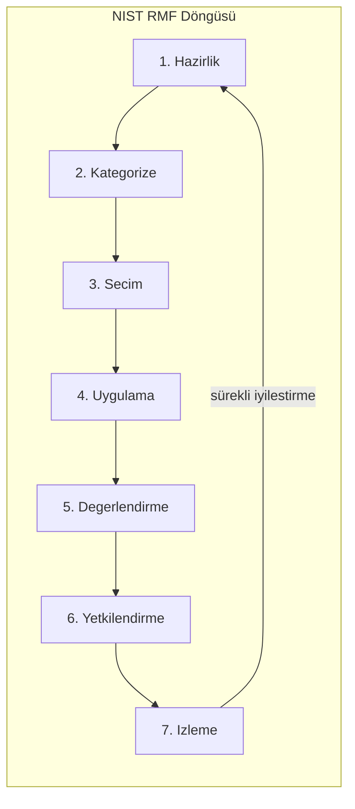

# Yönetişim, Risk, Uyumluluk (GRC) ve İş Sürekliliği Planlaması (BCP/BIA)

Yönetişim, risk yönetimi ve uyumluluk (GRC), organizasyonun güvenlik hedeflerinin yasal ve operasyonel çerçevede yönetilmesini sağlar. İş sürekliliği planlaması (BCP) ve iş etki analizi (BIA) ise olağanüstü durumlarda kurumun faaliyetlerini sürdürebilme yeteneğini belirler. Fortune 500 ölçeğinde GRC ve BCP, salt "denetim yükümlülüğü" değil; operasyonel devamlılığın, itibarın ve yasal varlığın teminatıdır.

**§1.1** bölümünde tanımlanan CIA üçlüsü ve risk iştahı ifadeleri, bu bölümde operasyonel GRC süreçlerine dönüşür. NIST RMF ve ISO 27005 risk çerçeveleri, STRIDE tehdit modellemesi, KVKK/GDPR/5651 uyumluluğu, BIA metrikleri (RTO, RPO, MTD) ve Hot/Warm/Cold DR site tasarımları; Wazuh SIEM entegrasyonu, RFC 3161 zaman damgası ve Proxmox/Ceph DR mimarisi örnekleriyle birlikte incelenir.

---

## §1.2.1. Risk Değerlendirme Çerçeveleri ve Tehdit Modelleme

Kurumsal siber güvenlik programının ilk adımı, "neye karşı korunuyoruz?" ve "hangi varlıklarımız ne kadar kritik?" sorularının sistematik metodolojiyle yanıtlanmasıdır.

### NIST Risk Management Framework (RMF)

NIST SP 800-37 Rev. 2, sistem yaşam döngüsüne entegre yedi aşamalı bir döngü sunar:

| Adım | Açıklama | Operasyonel Karşılık |
| :---- | :---- | :---- |
| **1. Prepare** | Risk yönetimi stratejisi, roller, risk iştahı | GRC platformu, politika kütüphanesi |
| **2. Categorize** | CIA'ya göre sistem/veri sınıflandırması | Varlık envanteri, CMDB |
| **3. Select** | NIST SP 800-53 kontrol seçimi ve tailoring | Kontrol kataloğu eşlemesi |
| **4. Implement** | Kontrollerin mimariye entegrasyonu | Teknik dağıtım, yapılandırma |
| **5. Assess** | Kontrol etkinliğinin test edilmesi | Pentest, otomatik değerlendirme |
| **6. Authorize** | ATO (Authority to Operate) kararı | Risk komitesi onayı |
| **7. Monitor** | Sürekli izleme ve güncelleme | SIEM metrikleri, değişiklik yönetimi |



RMF, kritik altyapı kuruluşlarında ve kamu sektöründe zorunlu olup ISO 27001 ile uyumlu çalışabilir. SOC analisti "Monitor" adımında SIEM alert'lerini risk skoru ile ilişkilendirerek önceliklendirir.

### ISO/IEC 27005:2022

ISO 27005, ISO 31000 ilkelerini bilgi güvenliğine uyarlar. 2022 revizyonunun en büyük yeniliği, **varlık tabanlı** (asset-based) yaklaşımın yanı sıra **olay tabanlı** (event-based) senaryo analizlerinin eşit ağırlıkla entegre edilmesidir.

| Boyut | NIST RMF | ISO 27005:2022 |
| :---- | :---- | :---- |
| **Temel odak** | Sistem yetkilendirmesi (ATO), teknik kontrol | ISMS bağlamında risk analizi |
| **Yapı** | 7 adımlı doğrusal süreç | Yinelemeli 5 aşama |
| **Analiz metodu** | Nitel/yarı-nicel tehdit-zafiyet | Varlık + olay tabanlı hibrit |
| **Entegrasyon** | NIST SP 800-53 kataloğu | ISO 27001 Ek A kontrolleri |

Kurumsal mimaride NIST RMF'in katı teknik kontrol disiplini ile ISO 27005'in iş odaklı bağlam analizi birleştirilerek optimize sonuç üretilir.

### Risk Değerlendirme Matrisi

ISO 27005 tipik 5×5 risk matrisi:

| Olasılık \ Etki | Düşük (1) | Orta (2) | Yüksek (3) | Kritik (4) | Felaket (5) |
| :---- | :---- | :---- | :---- | :---- | :---- |
| **Neredeyse kesin (5)** | Orta | Yüksek | Kritik | Felaket | Felaket |
| **Olası (4)** | Düşük | Orta | Yüksek | Kritik | Felaket |
| **Mümkün (3)** | Düşük | Orta | Yüksek | Yüksek | Kritik |
| **Düşük (2)** | Düşük | Düşük | Orta | Orta | Yüksek |
| **Çok düşük (1)** | Düşük | Düşük | Düşük | Orta | Orta |

Risk skoru yüksek olan varlıklar için tedavi planı (kontrol uygulama, transfer, kabul veya kaçınma) GRC risk kaydına işlenir.

### STRIDE Tehdit Modelleme

Microsoft STRIDE, DFD (Data Flow Diagram) üzerinden tehditleri altı kategoride sınıflandırır:

| Kategori | Ofansif Vektör | Defansif Kontrol | MITRE ATT&CK |
| :---- | :---- | :---- | :---- |
| **Spoofing** | Pass-the-Hash, Kerberoasting | FIDO2 MFA, mTLS | T1110, T1556 |
| **Tampering** | MITM, SQL injection, FIM bypass | TLS 1.3, Wazuh FIM | T1565 |
| **Repudiation** | Log silme/manipülasyon | SIEM, zaman damgası, WORM | T1070 |
| **Information Disclosure** | SQLi, açık S3 bucket | DLP, şifreleme, ZTNA | T1530 |
| **Denial of Service** | DDoS, SYN flood, ransomware | Rate limiting, anycast | T1498 |
| **Elevation of Privilege** | Sudo exploit, DLL hijacking | PoLP, PAM, EDR | T1068 |

**Mimari konumlandırma:** STRIDE yalnızca SDL sürecinde değil; ağ segmentasyonu, DLP politikaları ve IR playbook tasarımında da kullanılır. Repudiation tehdidine karşı 5651 zaman damgası ve immutable log storage kritiktir.

```
[ OFANSİF TEHDİT ]                    [ DEFANSİF KONTROL ]
Spoofing (T1110)          ──────►     FIDO2 MFA & mTLS
Tampering (T1565)         ──────►     TLS 1.3 & SHA-256 HMAC & FIM
Repudiation (T1070)       ──────►     SIEM + RFC 3161 Zaman Damgası
```

SOC mimarı, STRIDE çıktısını risk kaydına işler, NIST 800-53 AU ve CP kontrollerini seçer ve düzenli threat modeling workshop'ları ile yeni sistemlerde açıkları tasarım aşamasında kapatır.

**NIST SP 800-53 AU (Audit and Accountability) ailesi — Repudiation savunması:**

| Kontrol | Açıklama | Operasyonel Karşılık |
| :---- | :---- | :---- |
| **AU-2** | Denetlenebilir olay türlerinin tanımı | SIEM use-case kataloğu |
| **AU-3** | Olay içeriği (kim, ne, ne zaman, nereden) | Normalized log şeması |
| **AU-9** | Denetim bilgilerinin korunması | WORM depolama, RBAC |
| **AU-11** | Denetim kayıtlarının saklanması | 5651: 1–2 yıl; BDDK: 5–10 yıl |
| **AU-12** | Denetim üretimi | Tüm kritik sistemlerden log toplama |

**NIST SP 800-53 CP (Contingency Planning) ailesi — Kullanılabilirlik savunması:**

| Kontrol | Açıklama | BIA Bağlantısı |
| :---- | :---- | :---- |
| **CP-2** | İş sürekliliği planı | BIA çıktıları → BCP dokümanı |
| **CP-4** | BCP testi | Yıllık DR tatbikatı kanıtı |
| **CP-6** | Alternatif depolama sitesi | Hot/Warm/Cold site seçimi |
| **CP-9** | Sistem yedekleme | RPO ≤ yedekleme periyodu |
| **CP-10** | Sistem kurtarma | RTO hedefi ile eşleşme |

---

## §1.2.2. Yasal Uyumluluk: KVKK, GDPR ve 5651 Sayılı Kanun

Kurumsal ölçekte GRC'nin olmazsa olmazı, uluslararası ve yerel mevzuata tam uyumdur.

### KVKK (6698 Sayılı Kanun)

Kişisel verilerin korunması etrafında şekillenen KVKK, veri sorumlularına şu yükümlülükleri getirir:

- **Veri sınıflandırması:** Hassas veri taşıyan sistemler ayrı segmentte (DMZ/özel VLAN)
- **Erişim logları:** Kim, ne zaman, hangi veriye erişti — değiştirilemez şekilde loglanmalı
- **Veri minimizasyonu:** Test/geliştirme ortamlarında gerçek kişisel veri kullanılmamalı
- **İhlal bildirimi:** Kurula **72 saat** içinde bildirim zorunluluğu
- **VERBİS kaydı** ve açık rıza metinleri

KVKK m.12, "uygun güvenlik düzeyini temin etmeye yönelik her türlü teknik ve idari tedbir" yükümlülüğü getirir. 2024'te 862 veri sorumlusuna toplam ~552,7 milyon TL idari para cezası uygulanmıştır.

### GDPR

Avrupa Birliği vatandaşlarının verilerini işleyen tüm kurumları kapsar. KVKK ile paralel yürütülür; "unutulma hakkı", veri taşınabilirliği ve ağır para cezaları (ciro bazlı) içerir. Çok uluslu kurumlarda birleşik uyum programı (unified compliance) tercih edilir.

### 5651 Sayılı Kanun ve Loglama Mimarisi

5651, internet erişim sağlayıcıları, yer sağlayıcıları ve toplu kullanım sağlayıcılarını log tutmaya zorunlu kılar.

**Temel gereksinimler:**
- IP adresi, MAC adresi, port bilgisi, bağlantı başlangıç/bitiş zamanı
- Saklama: kanun md. 6/b — "altı aydan az ve iki yıldan fazla olmamak üzere" yönetmelikle belirlenen süre (pratikte genellikle 1-2 yıl)
- Bütünlük: SHA-256 hash + **TÜBİTAK Kamu SM** zaman damgası
- Log tutmama cezası: 10.000–100.000 TL (md. 6/3)

| Log Tipi | Kaynak | Zorunlu Alanlar | Yasal Geçerlilik |
| :---- | :---- | :---- | :---- |
| **DHCP dağıtım** | DHCP sunucu / FW | IP, kiralama baş/bitiş, MAC, hostname | Kamu SM zaman damgası, 2 yıl saklama |
| **Hotspot oturum** | Gateway | Tarih-saat, kullanıcı kimliği, kaynak MAC, atanan IP | Kimlik doğrulama logu ile eşleştirme |
| **URL/web trafik** | Proxy / DPI FW | Kaynak/hedef IP-port, protokol, URL/domain | NTP senkronizasyonu, imzalı arşiv |

:::caution
KVKK erişim logları (kimin/ne zaman/ne amaçla eriştiği) ile 5651 trafik logları farklı amaçlara hizmet eder; karıştırılmamalıdır.
:::

### Wazuh ile 5651 Uyumlu Log Toplama

Syslog alıcı yapılandırması (`ossec.conf`):

```xml
<ossec_config>
  <remote>
    <connection>syslog</connection>
    <port>514</port>
    <protocol>udp</protocol>
    <allowed-ips>192.168.10.0/24</allowed-ips>
    <local_ip>192.168.10.50</local_ip>
  </remote>
</ossec_config>
```

Özel dekoder (`local_decoder.xml`):

```xml
<decoder name="compliance_5651">
  <prematch>^\d+-\d+-\d+ \d+:\d+:\d+ \w+ LOG:</prematch>
</decoder>

<decoder name="compliance_5651_dhcp">
  <parent>compliance_5651</parent>
  <regex>(\d+.\d+.\d+.\d+)\s+(\d+/\d+/\d+ \d+:\d+:\d+)\s+(\d+/\d+/\d+ \d+:\d+:\d+)\s+([a-fA-F0-9:]+)\s+(\S+)</regex>
  <order>assigned_ip, lease_start, lease_end, srcmac, hostname</order>
</decoder>
```

5651 korelasyon kuralları (`local_rules.xml`):

```xml
<group name="syslog,5651_compliance,">
  <rule id="110000" level="0">
    <decoded_as>compliance_5651</decoded_as>
    <description>5651 Sayılı Kanun Kapsamındaki Ağ Erişim İzleri</description>
  </rule>

  <rule id="110001" level="3">
    <if_sid>110000</if_sid>
    <match>DHCP LOG</match>
    <description>5651: Yeni DHCP IP Adresi Ataması</description>
    <group>5651_dhcp,network_access</group>
  </rule>

  <rule id="110002" level="5">
    <if_sid>110000</if_sid>
    <match>HOTSPOT LOG</match>
    <description>5651/KVKK: Hotspot Kimlik Doğrulama Başarılı</description>
    <group>authentication_success,5651_hotspot</group>
  </rule>

  <rule id="110003" level="12">
    <if_sid>110000</if_sid>
    <match>failed to write log|log service stopped|audit log cleared</match>
    <description>KRİTİK: 5651 Log Servisi Durduruldu veya Log Silinmeye Çalışılıyor!</description>
    <group>service_failure,compliance_breach,tampering</group>
  </rule>
</group>
```

### RFC 3161 Zaman Damgası Süreci

Logların değiştirilemezliğini kanıtlamak için RFC 3161 uyumlu dijital zaman damgalama uygulanır. TSQ (TimeStamp Query) üretiminde OpenSSL otomatik olarak 64-bit rastgele **nonce** ekler; bu değer replay saldırılarını ve sahte mühür üretimini engeller.

```bash
# 1. Log hash'i ve zaman damgası talebi (TSQ) üretimi
openssl ts -query -data /var/log/5651/dhcp_leases_20261026.log \
  -sha256 -cert -out /var/log/5651/dhcp_leases_20261026.tsq

# 2. TSA'ya gönderim ve imzalı yanıt (TSR) alma
curl -s -H "Content-Type: application/timestamp-query" \
  --data-binary "@/var/log/5651/dhcp_leases_20261026.tsq" \
  http://tsa.kamusm.gov.tr -o /var/log/5651/dhcp_leases_20261026.tsr

# 3. Doğrulama
openssl ts -verify \
  -in /var/log/5651/dhcp_leases_20261026.tsr \
  -data /var/log/5651/dhcp_leases_20261026.log \
  -CAfile /etc/ssl/certs/kamusm_root_ca.pem
```

Başarılı doğrulama `Verification: OK` döner; tek karakter değişikliği bile doğrulamayı başarısız kılar.

TSR paketinin içeriğini (sertifika zinciri, tescil zamanı, hash algoritması) incelemek için:

```bash
openssl ts -reply -in /var/log/5651/dhcp_leases_20261026.tsr -text
```

:::note
TÜBİTAK Kamu SM MA3 API ve Zamane/İmzager uygulamalarının lisans süreleri periyodik olarak yenilenmelidir; aksi halde imzalama süreçleri durur ve loglar yasal geçerliliğini yitirir.
:::

### BDDK Düzenlemeleri

**BSEBY** (Bankaların Bilgi Sistemleri Yönetmeliği): Yönetim kurulu bilgi varlıklarının CIA'sı için etkin kontrollerden sorumludur. Bağımsız denetim (BSD), log bütünlüğü, BCP/DR test kanıtları ve dış hizmet sağlayıcı log erişilebilirliği denetlenir.

Elektronik bankacılık güvenlik kontrolleri: anti-keylogging, device-binding, runtime integrity verification, jailbreak/rooting tespiti ve OTP için zaman damgası zorunludur.

---

## §1.2.3. İş Etki Analizi (BIA) ve Kritik Metrikler

BCP'nin temeli BIA ile atılır. BIA, hangi iş süreçlerinin ne kadar kritik olduğunu ve kesintinin finansal, operasyonel, itibar ve yasal maliyetini ortaya koyar.

### Temel Metrikler

| Metrik | Tanım | İlişki |
| :---- | :---- | :---- |
| **RPO** (Recovery Point Objective) | Kabul edilebilir maksimum veri kaybı süresi | Yedekleme sıklığını belirler |
| **RTO** (Recovery Time Objective) | Sistemin tekrar çalışır hale gelmesi için hedef süre | DR mimarisini belirler |
| **WRT** (Work Recovery Time) | RTO sonrası operasyonel normalleşme süresi | Manuel işlemler, veri doğrulama |
| **MTD/MAO** (Maximum Tolerable Downtime) | Telafi edilemez zarar öncesi azami kesinti | RTO + WRT ≤ MTD |

```
RPO ≤ Yedekleme Periyodu (Δt)
RTO + WRT ≤ MTD
```

### Kritiklik Katmanları (Tiering)

| Katman | İş Süreçleri | Örnek Sistemler | RTO | RPO | DR Stratejisi |
| :---- | :---- | :---- | :---- | :---- | :---- |
| **Tier 0** | Anında finansal/yasal çöküş | Çekirdek bankacılık, ödeme switch | Dakika | ~0 | Active-Active, stretched cluster |
| **Tier 1** | Kısa kesinti ciddi aksama | E-posta, CRM, dijital bankacılık | Saat | Dakika | Active-Passive asenkron replikasyon |
| **Tier 2** | Günlük operasyon etkilenir | ERP, İK, dosya sunucuları | Saat | Saat | Proxmox Backup Server (PBS) günlük artımlı yedek |
| **Tier 3** | Destek süreçleri | Arşiv, analitik raporlama | Gün | Gün | Cold site, haftalık yedek |

### Kurumsal Senaryo: Banka Çekirdek Sistemleri

| Sistem | MTD | RTO | RPO | Gerekçe |
| :---- | :---- | :---- | :---- | :---- |
| Çekirdek bankacılık | 4 saat | ≤ 2 saat | ≤ 15 dk | BDDK ceza + müşteri kaybı |
| Müşteri portalı | 8 saat | 4 saat | 1 saat | Gelir etkisi orta |
| İç raporlama/BI | 24 saat | 12 saat | 4 saat | Operasyonel etki düşük |

BIA çıktıları DR tier'lamasını ve kontrol yatırım önceliklerini belirler. GRC risk kaydında "Sistem X'in RTO'su MTD'yi aşıyor" riski açılır ve tedavi planı izlenir.

**Saldırı-savunma:** Ransomware grupları yüksek MTD'li sistemleri hedefleyerek uzun süreli kesinti yaratır. Savunma: BIA-driven otomatik failover, geo-redundant hot site ve yıllık tam ölçekli DR tatbikatı.

---

## §1.2.4. Felaket Kurtarma (DR) Stratejileri: Hot, Warm ve Cold Site

BIA metrikleri belirlendikten sonra DR stratejisi bu metriklerle eşleştirilir.

### Soğuk Site (Cold Site)

- **Tanım:** Yalnızca fiziksel altyapı (elektrik, soğutma, ağ bağlantısı) hazır; donanım felaket anında temin edilir
- **RTO:** Günler–haftalar
- **RPO:** Yedekleme stratejisine bağlı (günlük yedekler)
- **Maliyet:** En düşük
- **Kullanım:** Arşiv sistemleri, yasal zorunluluk yedekleri
- **Bulut karşılığı:** IaC ile anında provizyon (Terraform/Pulumi)

### Ilık Site (Warm Site)

- **Tanım:** Donanım kurulu, OS/uygulamalar yüklü; veriler periyodik/asenkron replike
- **RTO:** Saatler–bir gün
- **RPO:** Replikasyon sıklığına bağlı (ör. 1 saat)
- **Maliyet:** Orta
- **Kullanım:** Çoğu kurumsal uygulama için ideal denge
- **Mimari:** PostgreSQL streaming replication, pasif Kubernetes cluster, manuel/yarı-otomatik DNS failover

### Sıcak Site (Hot Site)

- **Tanım:** Üretim ortamının birebir kopyası; veriler anlık replike, failover otomatik
- **RTO:** Dakikalar
- **RPO:** Sıfıra yakın
- **Maliyet:** Soğuk sitenin 5-10 katı
- **Kullanım:** Tier 0 kritik altyapılar (borsa, ödeme, acil sağlık)
- **Risk:** Configuration drift — düzenli failover testleri zorunlu

### Strateji Seçimi Matrisi

| Senaryo | Önerilen Site | Gerekçe |
| :---- | :---- | :---- |
| Kurumsal e-posta (4 saat tolere) | Warm | Maliyet/performans dengesi |
| Müşteri veritabanı (sıfır veri kaybı) | Hot | RPO=0 zorunluluğu |
| Arşiv depoları | Cold | Düşük maliyet, uzun RTO kabul edilebilir |
| Bulut-native mikroservis | Hot (Multi-Region) | Otomatik failover + yük dengeleme |

### Modern Hibrit/Cloud Karşılıkları

| Model | Açıklama | RTO/RPO |
| :---- | :---- | :---- |
| **Pilot Light** (AWS) | Temel altyapı çalışır, failover'da ölçeklenir | Orta RTO, düşük maliyet |
| **Warm Standby** | Küçültülmüş replika sürekli çalışır | Düşük RTO |
| **Multi-Site Active/Active** | İki site eş zamanlı trafik alır | En düşük RTO/RPO |

### Olağanüstü Durum Merkezi (ODM) Seçim Kriterleri

BDDK ve GRC en iyi pratiklerine göre DR lokasyonu seçiminde:

- **Sismik/doğal afet güvenliği:** Ana merkezle aynı fay hattı/sel yatağında olmamalı
- **Telekomünikasyon:** Bağımsız operatör omurgaları, düşük gecikmeli dark fiber
- **Demografik:** Nitelikli teknik personel konuşlandırma imkânı
- **Ulaşım:** Havalimanı, otoyol erişimi; barınma/lojistik olanakları

### Proxmox VE ve Ceph Tabanlı DR Mimarisi

Modern veri merkezlerinde açık kaynak Proxmox VE + Ceph, esnek yedekleme ve replikasyon sunar:

```
+------------------------------------+             +------------------------------------+
|  PROXMOX CLUSTER A (Ana Merkez)    |             |    PROXMOX CLUSTER B (DR Merkez)   |
|  [Node 1]   [Node 2]   [Node 3]    |             |  [Node 4]   [Node 5]   [Node 6]    |
|  +------------------------------+  |             |  +------------------------------+  |
|  |       Ceph Pool (Primary)    |  |             |  |      Ceph Pool (Secondary)   |  |
|  +------------------------------+  |             |  +------------------------------+  |
+------------------------------------+             +------------------------------------+
                 |                                                   |
                 +===========> [ Asenkron WAN Replikasyonu ] =======>+
                              (rbd-mirror daemon / mTLS)
```

**Hot Site — Stretched Ceph Cluster (RTT < 5ms):**

Lokasyon A'da 3 node, Lokasyon B'de 3 node; split-brain önleme için bağımsız üçüncü lokasyonda Witness monitor zorunludur.

**Warm Site — Ceph RBD Asenkron Mirroring:**

```bash
# Havuz seviyesinde mirroring etkinleştirme
rbd mirror pool enable pve-storage image

# Bootstrap token üretimi (ana küme)
rbd mirror pool peer bootstrap create pve-storage > /etc/pve/priv/ceph_mirror_token.txt

# DR kümesine token import
rbd mirror pool peer bootstrap import --direction rx-only pve-storage /etc/pve/priv/ceph_mirror_token.txt

# Kritik VM disk imajını aynalama
rbd mirror image enable pve-storage/vm-200-disk-0
```

### Saldırı-Savunma: DR Hedefli Ransomware

Saldırgan hem primary hem DR site'yi veya yedekleri hedefler (double extortion). Savunma katmanları:

1. **Immutable/air-gapped yedekler** — Object Lock, WORM NAS
2. **Site'ler arası zero-trust** — ayrı kimlik/erişim kontrolü
3. **Replikasyon trafiği anomaly tespiti** — Wazuh/SIEM
4. **Restore testlerinde clean-room** — EDR taraması dahil
5. **Cyber DR playbook'ları** — hızlı izolasyon + temiz restore

:::danger
Yılda en az bir tam restore testi (üretim trafiğinin belirli yüzdesinin yedek siteye yönlendirildiği canlı test) BDDK denetimlerinde kanıt olarak istenir. Test yalnızca checklist değil, gerçek failover olmalıdır.
:::

### GRC Platformu Entegrasyonu

Fortune 500 ölçeğinde GRC platformu (ServiceNow GRC, MetricStream veya entegre SIEM+GRC), risk kaydını, kontrol kütüphanesini ve uyum kanıtlarını merkezi yönetir:

| GRC Modülü | Veri Kaynağı | Çıktı |
| :---- | :---- | :---- |
| **Risk Register** | BIA, pentest, threat intel | Risk skoru, tedavi planı |
| **Control Library** | NIST 800-53, ISO Ek A | Kontrol eşlemesi, SoA |
| **Evidence Collection** | SIEM, log arşivi, test raporları | Denetim kanıtı |
| **Compliance Dashboard** | 5651/KVKK metrikleri | Uyum skoru |

SIEM'den GRC'ye akan gerçek zamanlı metrikler (log volume drop, FIM alert, patch compliance) "Monitor" adımını otomatikleştirir. SOC dashboard'unda "5651/KVKK Uyum Skoru" ve "Log Tampering Alert" kuralları bulunmalıdır.

### FAIR Modeli ile Nicel Risk

FAIR (Factor Analysis of Information Risk), riski finansal verilere döker:

- **Loss Event Frequency (LEF):** Tehdidin yıllık gerçekleşme sıklığı
- **Loss Magnitude (LM):** Olay gerçekleştiğinde finansal zarar

Bu model, board'un risk iştahını dolar bazlı ifade etmesini sağlar ve BIA metrikleriyle (RTO/RPO ihlali maliyeti) entegre edilir.

<details>
<summary>FAIR modeli: LEF ve LM bileşenleri (derinlemesine)</summary>

FAIR, riski iki ana bileşene ayırır:

```
Risk = Loss Event Frequency (LEF) × Loss Magnitude (LM)
```

**LEF hesabı:**
```
LEF = Threat Event Frequency (TEF) × Vulnerability (V)
```
- **TEF:** Tehdit aktörünün yılda kaç kez saldırı girişiminde bulunduğu (threat intel + pentest verisi)
- **V:** Saldırının başarı olasılığı (0–1); zafiyet yoğunluğu ve kontrol etkinliğinden türetilir

**LM hesabı:**
```
LM = Primary Loss + Secondary Loss
```
- **Primary Loss:** Doğrudan gelir kaybı, kurtarma maliyeti, yasal ceza
- **Secondary Loss:** İtibar kaybı, müşteri kaybı, hisse değer düşüşü

Örnek: TEF = 4/yıl, V = 0,25 → LEF = 1/yıl. LM = 2M USD → beklenen yıllık kayıp = 2M USD. Gordon-Loeb tavanı ≈ 736K USD (%37).
</details>

---

## Özet ve Mimari Tavsiyeler

GRC katmanı riski görünür kılar ve kararları yönlendirirken; BIA/DR katmanı riskin gerçekleşmesi durumunda işletmenin hayatta kalmasını sağlar. Her iki katman da SIEM, immutable logging, zero-trust segmentasyonu ve düzenli tatbikatlarla savunma derinliğinin operasyonel omurgasını oluşturur.

**Aşama 1 — Risk Temeli (0–3 ay):**
1. NIST RMF Prepare + Categorize adımlarını tamamlayın; varlık envanterini CMDB ile eşleştirin
2. ISO 27005 risk matrisi ile top 10 riski belirleyin; STRIDE workshop'u başlatın
3. 5651 loglama altyapısını Wazuh + Kamu SM zaman damgası ile kurun

**Aşama 2 — Uyumluluk ve BIA (3–9 ay):**
4. KVKK/GDPR birleşik uyum matrisi oluşturun; VERBİS ve 72 saatlik ihlal bildirim sürecini test edin
5. BIA ile tüm kritik süreçler için RTO/RPO/MTD belirleyin; tier ataması yapın
6. DR stratejisini BIA metrikleriyle eşleştirin; ODM lokasyon kriterlerini dokümante edin

**Aşama 3 — Operasyonel Dayanıklılık (9–18 ay):**
7. Hot/Warm/Cold site mimarisini uygulayın; Proxmox/Ceph veya bulut-native DR çözümü devreye alın
8. Yıllık tam ölçekli DR tatbikatı planlayın; ransomware senaryosu dahil cyber DR playbook'u yazın
9. GRC dashboard'unda DR Site Health Score ve 5651/KVKK Uyum Skoru kartlarını izleyin

Bu yaklaşım, hem uluslararası standartlara (NIST, ISO) hem de KVKK, 5651 ve BDDK yükümlülüklerine tam uyumlu, ölçülebilir ve sürekli iyileştirilen bir GRC-BCP ekosistemi yaratır.