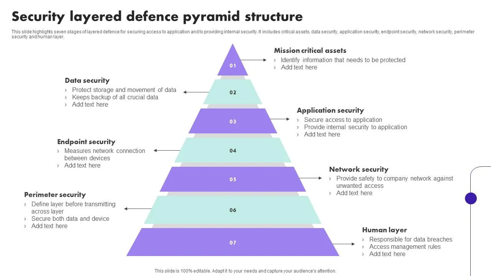
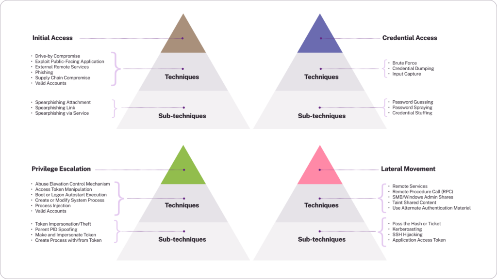

# Güvenlik Politikaları, Farkındalık Eğitimleri ve Oltalama Simülasyonları

Siber güvenliğin en zayıf halkası genellikle teknoloji değil, insandır. Verizon DBIR verilerine göre veri ihlallerinin **%82'sinde** insan faktörü rol oynar. Saldırganlar giderek artan oranda güvenlik duvarlarını ve EDR'ı aşmak yerine çalışan davranışlarını istismar eder. Bu bölümde Kabul Edilebilir Kullanım Politikası (AUP), güvenlik farkındalığı eğitim programları ve oltalama simülasyonları; NIST SP 800-53 AT ailesi, CIS Control 14, ISO 27001 A.6.3 ve MITRE ATT&CK T1566 ışığında mimari ve operasyonel derinlikte ele alınacaktır.


*Savunma derinliği: insan katmanı teknik kontrollerin tamamlayıcısıdır*

---

## §1.3.1. Kabul Edilebilir Kullanım Politikası (AUP) ve İnsan Güvenlik Duvarı

### AUP'nin Tanımı ve Kurumsal Konumlandırma

Kabul Edilebilir Kullanım Politikası (Acceptable Use Policy — AUP), kurum bilgi varlıklarının (sistemler, veriler, cihazlar, ağ kaynakları) kim tarafından, nasıl ve hangi amaçla kullanılabileceğini tanımlayan temel yönetimsel kontroldür.

**Standart eşlemesi:**

| Standart | Kontrol | Açıklama |
| :---- | :---- | :---- |
| **NIST SP 800-53 Rev. 5** | PL-4 (Rules of Behavior) | Davranış kuralları ve imza zorunluluğu |
| **ISO 27001:2022** | A.5.10, A.6.3 | Kabul edilebilir kullanım ve farkındalık |
| **CIS Controls v8** | Control 14 | Politika temeli + eğitim entegrasyonu |

AUP hiyerarşisi:

```
Kurumsal Güvenlik Politikası
    └── Bilgi Güvenliği Politikası
         └── Kabul Edilebilir Kullanım Politikası (AUP)
              ├── İnternet Kullanımı Eki
              ├── E-posta Kullanımı Eki
              ├── Mobil Cihaz / BYOD Eki
              └── Uzaktan Erişim Eki
```

### AUP'nin Teknik Katmanlarla Eşleştirilmesi

Statik politika metni, teknik bileşenler aracılığıyla dinamik olarak zorunlu kılınmalıdır:

| Katman | Bileşen | AUP Yansıması |
| :---- | :---- | :---- |
| **Governance** | GRC platformu, HRIS | Versiyonlu, dijital imzalı, onboarding'de zorunlu kabul |
| **Network** | 802.1X NAC, NGFW | BYOD engelleme, URL kategorisi filtreleme |
| **Email** | Secure Email Gateway | SPF/DKIM/DMARC, link analizi |
| **Endpoint** | EDR, DLP | USB kısıtlaması, uygulama beyaz listesi |
| **Identity** | Conditional Access (Entra ID) | Eğitim/AUP tamamlanmamış → erişim kısıtı |
| **Monitoring** | Wazuh SIEM | 5651 logları, erişim ihlali tespiti |

```
[Kullanıcı Cihazı] → [802.1X NAC] → [SEG] → [NGFW] → [SIEM/Wazuh]
                         │              │        │
                    Kimlik doğrulama   DMARC    SSL/TLS deşifre
                    & profilleme       analizi  & web filtreleme
```

### İnsan Güvenlik Duvarı (Human Firewall)

"İnsan Güvenlik Duvarı", çalışanların pasif kullanıcı olmaktan çıkarılıp tehditleri aktif tespit eden ve raporlayan ilk savunma hattı haline getirilmesidir. Üç temel prensip:

1. **Bilinçli farkındalık** — Tehditleri tanıma yeteneği
2. **Doğru davranış** — Şüpheli e-postayı raporlama, link tıklamama
3. **Kurumsal kültür** — Güvenli davranışın norm haline gelmesi

SOC mimarisinde insan güvenlik duvarı, teknik kontrollerin atlatıldığı zero-day phishing, CEO fraud ve vishing vektörlerinde **son savunma hattı** işlevini görür.

### Örnek AUP Maddeleri

- Kurum cihazları yalnızca iş amaçlı kullanılır; kişisel dosya saklanmaz
- Şüpheli e-posta/link/ek tıklanmaz; "Report Phish" butonu kullanılır
- Kişisel veriler (KVKK) yalnızca yetkili sistemlerde, need-to-know prensibiyle işlenir
- Kayıp/çalıntı cihaz **1 saat** içinde IT'ye bildirilir
- Harici USB ve sosyal medya kullanımı AUP kurallarına tabidir
- Yıllık AUP kabulü zorunludur; ihlal disiplin sürecine tabidir

### Saldırı-Savunma Senaryosu: BEC (Business Email Compromise)

**Ofansif:** Saldırgan OSINT ile finans müdürünü hedefler; spoofed mail ile "acil fatura onayı" talep eder (MITRE ATT&CK **T1566.001**). Thread hijacking veya display name impersonation ile güvenilirlik artırılır.

**Defansif:**
1. Kullanıcı hover ile link kontrolü yapar, "Report Phish" ile SOC'a ticket açar
2. Wazuh kuralı DMARC fail + şüpheli URL reputation'ı korele eder
3. SOAR playbook mail campaign'i quarantine'e alır, kullanıcıyı izole eder

:::caution
Teknik kontrollerle desteklenmeyen idari politikalar kurumu siber tehditlere ve yasal yaptırımlara karşı korumasız bırakır. KVKK idari tedbirler arasında çalışan eğitimi birinci sırada yer alır.
:::

---

## §1.3.2. Etkili Güvenlik Farkındalığı Eğitimi Tasarımı ve Metrik Ölçümü

Etkili farkındalık programı "yılda bir slayt izletme" yaklaşımının çok ötesine geçmeli; **davranış değişikliği** hedeflemelidir.

### SANS Olgunluk Modeli

| Seviye | Tanım | KPI |
| :---- | :---- | :---- |
| **1 — Mevcut değil** | Planlı eğitim yok | Ölçülebilir veri yok |
| **2 — Uyum odaklı** | Yılda bir statik eğitim (KVKK/BDDK) | Tamamlama oranı, sınav skoru |
| **3 — Aktif teşvik** | Oltalama simülasyonu, interaktif materyal | Click rate, raporlama oranı |
| **4 — Kültür entegrasyonu** | Güvenlik kurum kültürünün parçası | İhlal sıklığı azalması, tutum anketleri |
| **5 — Metrik odaklı** | Sürekli optimize edilen program | ROI, MTTD/MTTR iyileşme |

Seviye 3 ve üzerine geçiş için NIST SP 800-53 **AT-3 (Role-Based Training)** mimarisine geçilmelidir.

### Rol Tabanlı Eğitim

| Rol Grubu | Eğitim Odağı | Tehdit Vektörü |
| :---- | :---- | :---- |
| **C-Suite / Yönetim** | Whaling, BEC, OSINT riski | Finansal transfer, kritik veri |
| **BT / Sistem Yöneticileri** | Credential dumping, AD güvenliği, MFA bypass | Privilege escalation |
| **Yazılım Geliştiriciler** | OWASP Top 10, Secure SDLC, API güvenliği | Kod enjeksiyonu, supply chain |
| **Finans / İK** | Sahte fatura, veri sızdırma, onay süreçleri | Sosyal mühendislik |
| **Genel Kullanıcılar** | Oltalama, parola hijyeni, KVKK temelleri | Phishing, tailgating |

### Eğitim Tasarım Prensipleri

**Mikro-öğrenme:** 5-15 dakikalık modüller; uzun sunumlar yerine interaktif quiz ve video harmanı.

**Aralıklı tekrar:** NIST AT ailesi periyodik tekrarı önerir; spaced repetition ile bilgi kalıcılığı artırılır.

**Gerçek senaryo tabanlı:** Soyut kavramlar yerine gerçek kimlik avı e-postası analizi, CEO fraud simülasyonu ve ransomware IR senaryosu.

**Güncelleme döngüsü:** MITRE ATT&CK, ISAC threat intelligence ve mevzuat değişiklikleri (KVKK rehber, BDDK genelge, 7545 sayılı Kanun) ile yılda en az bir kez + olay sonrası acil güncelleme.

### Uluslararası Standart Gereksinimleri

**ISO 27001:2022:**
- **Clause 7.3 (Awareness):** Tüm çalışanlar politika, rol katkısı ve ihlal sonuçlarını bilmeli
- **A.6.3:** Rol bazlı farkındalık, eğitim ve öğretim; yılda en az bir kez tekrar

**NIST SP 800-53 Rev. 5 AT ailesi:**
- **AT-2:** Temel farkındalık eğitimi (şüpheli e-posta, çıkarılabilir ortam, insider threat)
- **AT-3:** Rol tabanlı eğitim
- **AT-4:** Eğitim kayıtlarının tutulması

**CIS Control 14:** İşe alım anında ve sonrasında düzenli eğitim; hassas veri yönetimi; düzenli oltalama testleri.

### Türkiye Mevzuatı

- **KVKK:** Çalışan eğitimi idari tedbirler arasında; eğitim kayıtları denetimde ibraz edilmeli
- **5651:** İnternet kullanımı sırasında yasal yükümlülük ihlalini önleyici eğitim
- **BDDK:** Yıllık güncellenen eğitim programları; finans sektöründe yıllık minimum 8 saat siber güvenlik eğitimi en iyi pratik

### Metrik Ölçümü ve Olgunluk Panosu

| Metrik | Tanım | Hedef (Olgun Kurum) |
| :---- | :---- | :---- |
| **Phishing Click Rate** | Simülasyonda tıklama oranı | < %5 |
| **Phishing Report Rate** | Şüpheli e-postayı raporlama oranı | > %80 |
| **Training Completion Rate** | Zorunlu eğitim tamamlama | > %95 |
| **Mean Time to Report** | Fark etmeden raporlamaya kadar süre | < 15 dk |
| **Knowledge Retention Score** | Eğitim sonrası bilgi kalıcılığı | > %85 |
| **Incident Reduction Rate** | İnsan kaynaklı olaylarda yıllık azalma | > %30 |

Metrikler GRC dashboard'unda ve board raporlamasına entegre edilmelidir.


*MITRE ATT&CK: T1566 Initial Access — oltalama ve sosyal mühendislik*

---

## §1.3.3. Oltalama Kampanyaları Planlama ve Sosyal Mühendislik Savunması

### Oltalama Simülasyonlarının Stratejik Önemi

Oltalama simülasyonları, çalışanların gerçek saldırı anında nasıl tepki vereceğini ölçen kontrollü saldırı senaryolarıdır. CIS Control 14, düzenli oltalama testlerini zorunlu kılar.

### Kampanya Türleri ve Sıklığı

| Tür | Açıklama | Sıklık |
| :---- | :---- | :---- |
| **Genel oltalama** | Standart kimlik avı e-postası | Aylık |
| **Spear phishing** | Departman/rol bazlı özelleştirilmiş | 3 ayda bir |
| **Whaling (CEO fraud)** | Üst yönetim taklidi, finansal talep | Yılda 1-2 |
| **Smishing** | SMS üzerinden oltalama | 6 ayda bir |
| **Vishing** | Telefon ile sosyal mühendislik | Yılda 1 |

### Kampanya Yaşam Döngüsü

```
Planlama → Uygulama → Ölçüm & Analiz → İyileştirme
    │           │              │              │
 Hedef kitle  Platform      Click/Report    Anlık eğitim
 Senaryo      yapılandırma   oranları       modülü
 Onay         Launch         Departman      Senaryo
                              karşılaştırma  iyileştirme
```

### Çok Katmanlı Savunma Mimarisi

| Katman | Kontrol | Açıklama |
| :---- | :---- | :---- |
| **1. Email Authentication** | SPF, DKIM, DMARC p=reject | RFC 7208, 6376, 7489 |
| **2. Gateway** | FortiMail / Defender / Proofpoint | URL rewriting, sandbox detonation |
| **3. Endpoint** | Wazuh EDR kuralları | Şüpheli process, C2 beacon |
| **4. İnsan** | Eğitim + simülasyon + Report Phish | Human firewall |
| **5. SOC/IR** | Wazuh + SOAR | Otomatik triage, izolasyon |

**Saldırgan (T1566):** Reconnaissance sonrası spear mail; spoofing, thread hijacking, aciliyet/otorite psikolojisi.

**Savunma:** DMARC enforced → gateway quarantine → kullanıcı raporlama → SIEM korelasyon → IR playbook.

### GoPhish: Açık Kaynak Simülasyon Platformu

GoPhish, kurum içi oltalama simülasyonları için yaygın açık kaynak araçtır. İzole lab ortamında (Proxmox LXC/VM) çalıştırılmalıdır:

```bash
wget https://github.com/gophish/gophish/releases/download/v0.12.1/gophish-v0.12.1-linux-64bit.zip
unzip gophish-v0.12.1-linux-64bit.zip
./gophish
```

**OPSEC yapılandırması:** GoPhish header imzaları (`X-Gophish-*`) temizlenmeli; yönetim arayüzü (port 3333) dış dünyaya açılmamalıdır. Nginx reverse proxy ile TLS sonlandırma ve Let's Encrypt sertifikası önerilir.

**Kampanya akışı:**
1. Hedef grup seçimi (yüksek risk departmanlar)
2. Template + landing page (tıklayan → anında eğitim modülüne yönlendirme)
3. Launch ve gerçek zamanlı izleme
4. Click %, submitted %, reported % analizi

:::note
KVKK/Privacy: Gerçek kimlik bilgileri toplanmaz; sonuçlar agregate veya pseudonymized raporlanır.
:::

### SEG İstisnaları ve False Click Önleme

Simülasyon e-postalarının inbox'a ulaşması için SEG beyaz listesi gerekir:

| Platform | Yapılandırma |
| :---- | :---- |
| **Microsoft Defender** | Advanced Delivery + `X-MS-Exchange-Organization-SkipSafeLinksProcessing: 1` |
| **FortiMail** | IP Safelist + Antispam Bypass |
| **Mimecast** | Permitted Senders + URL Protection muafiyeti |

**Yapay tıklama (false click) önleme:**
1. Görünmez honeypot link (`display:none`) — botlar tıklar, insanlar görmez
2. User-Agent analizi — güvenlik tarayıcı botları filtrelenir
3. Zaman aralığı filtresi — e-posta ulaştıktan ilk 3 saniyedeki tıklamalar bot olarak etiketlenir

### Evilginx3 ve AiTM Tehdit Emülasyonu

Modern saldırganlar MFA kodlarını ve oturum çerezlerini ele geçiren **Adversary-in-the-Middle (AiTM)** mimarileri kullanır. İleri düzey simülasyonlarda GoPhish + Evilginx3 entegrasyonu ile MFA bypass senaryoları test edilir:

```
[Hedef Kullanıcı] --link--> [Evilginx3 Proxy] --istek--> [Özgün IdP (M365)]
       ^                           |
       +------- MFA + Session ------+
                    |
            [GoPhish Sunucusu]
```

Bu test, yalnızca yetkili red team çalışmalarında ve yönetim onayıyla gerçekleştirilmelidir.

### SOC Tespit: Sysmon ve Wazuh ile Makro Saldırıları

Oltalama sonrası makrolu belge açılması **T1204.002 (User Execution: Malicious File)** kapsamındadır. Sysmon konfigürasyonu:

```xml
<Sysmon schemaversion="4.30">
  <EventFiltering>
    <ProcessCreate onmatch="include">
      <ParentImage condition="image">excel.exe</ParentImage>
      <ParentImage condition="image">winword.exe</ParentImage>
      <ParentImage condition="image">outlook.exe</ParentImage>
    </ProcessCreate>
  </EventFiltering>
</Sysmon>
```

Wazuh kuralı — Office uygulamasından PowerShell/CMD başlatılması:

```xml
<group name="windows,sysmon,office_exploitation,">
  <rule id="100600" level="3">
    <if_sid>61603</if_sid>
    <field name="win.eventdata.parentImage">excel\.exe|winword\.exe|outlook\.exe|powerpnt\.exe</field>
    <description>Microsoft Office uygulaması yeni alt süreç tetikledi</description>
  </rule>

  <rule id="100601" level="12">
    <if_sid>100600</if_sid>
    <field name="win.eventdata.image">powershell\.exe|cmd\.exe|wscript\.exe|cscript\.exe</field>
    <description>KRİTİK: Office belgesinden şüpheli süreç başlatıldı — olası makro saldırısı</description>
    <mitre><id>T1204.002</id><id>T1059</id></mitre>
  </rule>
</group>
```

### Kaspersky ASAP: Ticari Farkındalık Platformu

Kaspersky Automated Security Awareness Platform (ASAP), çalışanın bilgi seviyesine göre otomatik öğrenme yolları çizer:

- 5-10 dakikalık mikro-öğrenme modülleri ve anlık testler
- Entegre phishing simülasyonları ve grup bazlı ilerleme dashboard'u
- Click rate trendleri ve önce/sonra karşılaştırması
- LMS/HRIS entegrasyonu ile otomatik atama ve tamamlama takibi

Finans sektöründe BDDK uyumlu yıllık minimum 8 saat eğitim + 3 ayda bir simülasyon gereksinimlerini karşılamak için ticari alternatif olarak değerlendirilir.

### Vishing ve Fiziksel Sosyal Mühendislik

Oltalama yalnızca e-posta ile sınırlı değildir:

| Vektör | Teknik | Savunma |
| :---- | :---- | :---- |
| **Vishing** | Sahte IT destek araması, OTP talebi | Callback verification, resmi numara listesi |
| **Smishing** | Sahte kargo/banka SMS'i | URL kısaltma analizi, resmi uygulama kullanımı |
| **Tailgating** | Fiziksel tesis sızma | Mantrap, challenge culture, escort zorunluluğu |
| **USB drop** | Park alanına bırakılan zararlı USB | USB port disable, autorun engelleme |

MITRE ATT&CK **T1566.003 (Spearphishing via Service)** ve fiziksel vektörler birleşik senaryolarda test edilmelidir.

### Wazuh SIEM Entegrasyonu: Phishing Detection Kuralları

E-posta gateway ve endpoint telemetrisini korele eden örnek kurallar:

```xml
<group name="phishing,detection,">
  <rule id="120001" level="8">
    <if_sid>5710</if_sid>
    <field name="win.eventdata.subject">urgent|invoice|password reset|verify account</field>
    <description>Potansiyel oltalama e-postası: aciliyet içeren konu satırı</description>
    <group>phishing_suspect</group>
  </rule>

  <rule id="120002" level="12">
    <if_group>phishing_suspect</if_group>
    <field name="win.eventdata.image">powershell\.exe|mshta\.exe</field>
    <timeframe>120</timeframe>
    <description>KRİTİK: Şüpheli e-posta sonrası script çalıştırma — olası oltalama başarılı</description>
    <mitre><id>T1566</id><id>T1059.001</id></mitre>
  </rule>
</group>
```

SOC playbook'u: Kullanıcı raporu veya otomatik kural tetiklendiğinde → mail quarantine → endpoint izolasyon → credential reset → campaign analizi → hedefli eğitim ataması.

### Sosyal Mühendislik Savunma Protokolleri

- **Doğrulama protokolü:** Olağandışı talepler (para transferi, şifre sıfırlama) ikincil kanaldan (yüz yüze, bilinen resmi numara) doğrulanmalı
- **Challenge culture:** Her çalışan yetkisiz kişiyi sorgulama sorumluluğu taşır
- **Report Phishing:** E-posta istemcisine tek tıkla SOC/IR bildirim butonu
- **Vishing savunması:** Arayanın kimliği doğrulanmadan hassas bilgi paylaşılmaz; IT destek numarası yalnızca resmi kanallardan alınır

---

## Özet ve Mimari Tavsiyeler

Güvenlik politikaları, farkındalık eğitimleri ve oltalama simülasyonları; savunma derinliğinin insan katmanını teknolojik katmanlarla entegre ederek "Human Firewall"ı kurumsal yetkinlik haline getirir.

**Aşama 1 — Politika ve Temel (0–3 ay):**
1. AUP'yi güncelleyin; HRIS entegrasyonu ile dijital kabul sürecini zorunlu hale getirin
2. Rol tabanlı eğitim programı tasarlayın (NIST SP 800-50 Rev.1 lifecycle)
3. Phishing Report butonunu e-posta istemcisine entegre edin; SOC ticket akışını kurun

**Aşama 2 — Eğitim ve Simülasyon (3–9 ay):**
4. SANS olgunluk değerlendirmesi yapın; Seviye 3+ hedefleyin
5. GoPhish (lab) veya Kaspersky ASAP (prod) ile aylık simülasyon döngüsü başlatın
6. Metrik panosunu kurun: click rate, report rate, completion rate, MTTR

**Aşama 3 — Olgunluk ve Otomasyon (9–18 ay):**
7. Wazuh + SOAR entegrasyonu ile detection, response ve metrik otomasyonu
8. Evilginx3/AiTM testleri ile MFA dayanıklılığını doğrulayın (yönetim onaylı red team)
9. Metrikleri GRC ve board raporlamasına besleyin; sürekli iyileştirme (PDCA) döngüsü

**Kararı değiştirecek eşikler:** Phishing click rate %15'i aşarsa hedefli departman eğitimi zorunlu olur; report rate %50'nin altına düşerse "challenge culture" programı başlatılır; gerçek oltalama incident sayısı simülasyon sonrası artmıyorsa program etkinliği kanıtlanmış sayılır.

Bu yaklaşım ile insan kaynaklı risk ölçülebilir, yönetilebilir ve sürekli azaltılabilir hale gelir; KVKK idari tedbirleri, 5651 loglama yükümlülükleri ve BDDK eğitim gereksinimleri eksiksiz karşılanır.