# Standartlar, Organizasyonlar ve Sertifikalar

Bilgi güvenliği disiplini, ulusal ve uluslararası standartlar ile bu standartları geliştiren kuruluşlar etrafında şekillenir. **§1.1** bölümündeki CIA üçlüsü ve **§1.2** bölümündeki GRC/uyumluluk süreçleri, bu bölümde ele alınan ISO 27001, NIST CSF, KVKK ve PCI-DSS gibi çerçevelere somut karşılık bulur.

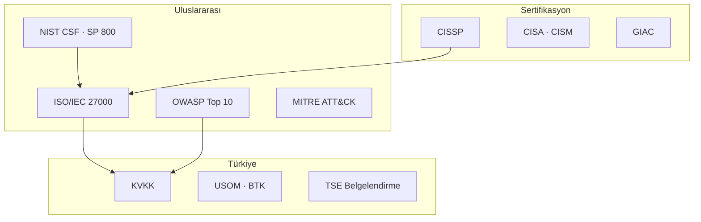

📋 Standart Seçim Hızlı Rehberi

| Kurum tipi | Birincil çerçeve | Destekleyici |
| :---- | :---- | :---- |
| Kamu / kritik altyapı | NIST RMF + SP 800-53 | ISO 27001, 7545 |
| Özel sektör (TR) | ISO 27001 + KVKK | CIS Controls, OWASP |
| Ödeme / finans | PCI-DSS + ISO 27001 | BDDK, COBIT |
| SaaS / bulut | SOC 2 + ISO 27001 | CSA CCM, NIST CSF |

**Not:** Çok uluslu kurumlarda GDPR + KVKK birleşik uyum matrisi için **§1.2.2** bölümüne bakın.

---

## §1.4.1. Bilgi Güvenliği Organizasyonları

Bilgi teknolojileri ve güvenliği organizasyonlarının temel amacı, bilgi varlıklarını koruyarak yetkisiz erişimi engellemek, bütünlük ve doğruluğu sağlamak ve yetkili kullanıcıların ihtiyaç duyduklarında erişimini temin etmektir. Aşağıdaki tablo hızlı referans sunar; her kuruluşun rolü ve kitap içi bağlantıları alt başlıklarda açıklanmıştır.

| Kuruluş | Rol | Kitap içi bağlantı |
| :---- | :---- | :---- |
| **ISO / IEC** | ISO/IEC 27000 serisi; bilgi güvenliği yönetim sistemleri | §1.2.1 RMF, §1.4.2 |
| **ISACA** | COBIT, CISA/CISM sertifikaları; BT yönetişimi | §1.2 GRC |
| **ITU** | Telekomünikasyon ve dijital altyapı standartları | §6 Ağ güvenliği |
| **NSA** | SIGINT, kriptoloji (AES); kritik altyapı rehberleri | §5 Veri güvenliği |
| **ENISA** | AB siber güvenlik ajansı; tehdit istihbaratı koordinasyonu | §1.2.2 GDPR |
| **ETSI** | GSM, 5G, IoT ve telekom güvenlik protokolleri | §6.4 Kablosuz |
| **NIST** | CSF, SP 800 serisi; küresel referans | §1.1, §1.2 |
| **IEEE** | Elektrik/elektronik teknik standartları | §3 Donanım |
| **IETF** | TCP/IP, TLS, DNS, HTTP standartları (RFC) | §6.1 OSI/TCP-IP |
| **ISC²** | CISSP ve güvenlik etiği; profesyonel standartlar | §1.4.3 |
| **OWASP** | Web Top 10, ASVS, Privacy Top 10 | §10 Uygulama güvenliği |
| **FIRST** | Olay müdahale ekipleri uluslararası ağı | §14 SOC/IR |
| **MITRE** | ATT&CK, D3FEND tehdit bilgi tabanı | Tüm bölümler |

### Uluslararası Kuruluşlar

#### ISO ve IEC

**ISO** (International Organization for Standardization), bilgi teknolojileri ve güvenliği için uluslararası standartlar geliştiren önde gelen bir kuruluştur. Bu standartlar, kuruluşların bilgi varlıklarını korumasına yardımcı olur. **IEC** (International Electrotechnical Commission) ise elektrik, elektronik ve ilgili teknolojiler için standartlar geliştirir; ISO ile iş birliği yaparak siber güvenlik ve bilişim teknolojileri alanındaki standartları oluşturur. ISO/IEC 27000 serisi bu iş birliğinin somut ürünüdür.

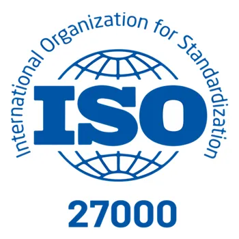
*ISO ve IEC iş birliğiyle yayımlanan ISO/IEC 27000 serisi — ISMS temel referansı*

#### ISACA

**ISACA**, bilgi sistemleri denetimi, güvenliği ve yönetişimi konularında uzmanlaşmış uluslararası bir profesyonel organizasyondur. 1969'da kurulan kuruluş, COBIT gibi BT yönetişim çerçeveleri geliştirir; CISA ve CISM sertifikasyonlarıyla profesyonellerin yetkinliğini artırır. İşletmelerin teknoloji risklerini yönetmesine ve siber güvenlik standartlarını uygulamasına yardımcı olan ISACA, teorik ve pratik bilgi birikimini bir araya getirerek sektörde önemli bir konuma sahiptir.

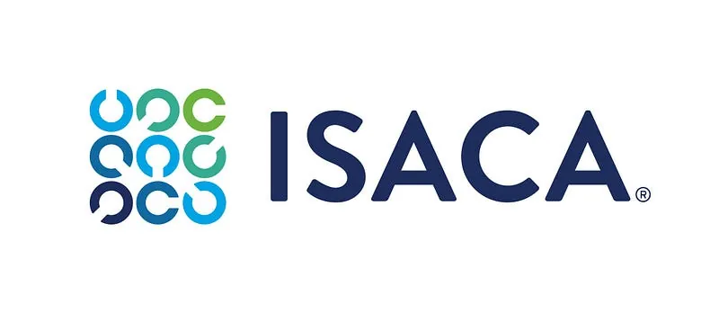
*ISACA — COBIT çerçevesi ve CISA/CISM sertifikasyon otoritesi*

#### ITU

Birleşmiş Milletler'e bağlı **ITU** (International Telecommunication Union), telekomünikasyon ve bilgi teknolojileri alanında standartlar belirleyerek siber güvenlik stratejilerini koordine eder. Üye ülkelerle iş birliği yaparak dijital altyapıların korunmasını ve siber tehditlere karşı dirençli hale gelmesini hedefler. İnternetin yaygınlaşması ve iletişim ağlarının güvenliği gibi konularda liderlik yapan ITU, küresel çapta teknoloji politikalarının şekillenmesine katkıda bulunur.

*ITU — Birleşmiş Milletler telekomünikasyon birimi*

#### NSA

ABD merkezli **NSA** (National Security Agency), 1952'de kurulan ve ulusal güvenliği korumak için sinyal istihbaratı (SIGINT) toplama, siber güvenlik sağlama ve kriptoloji alanında faaliyet gösteren bir organizasyondur. Kritik altyapıları siber tehditlere karşı korurken AES gibi şifreleme standartlarının geliştirilmesine katkıda bulunur. Hem savunma hem de istihbarat toplama kapasitesiyle bilgi teknolojileri ve güvenliği alanında küresel bir etkiye sahiptir; **§5** bölümündeki kriptografi tartışmalarında AES referansı bu bağlamda anlam kazanır.

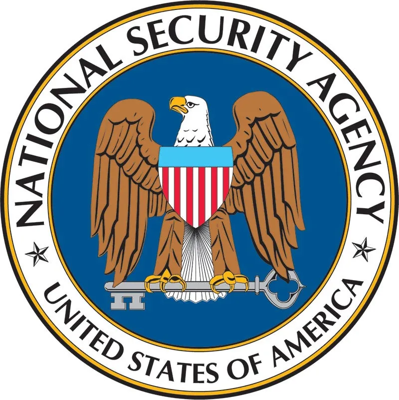
*NSA — ulusal güvenlik, SIGINT ve şifreleme standartları (AES)*

#### ENISA

Avrupa Birliği'nin siber güvenlik ajansı **ENISA** (European Union Agency for Cybersecurity), üye ülkelerde siber güvenlik kapasitesini artırmak ve ortak tehditlere karşı iş birliğini güçlendirmek için 2004'te kurulmuştur. Risk analizleri, eğitim programları ve standart geliştirme çalışmalarıyla Avrupa'nın dijital güvenliğini destekler. Tehdit istihbaratı paylaşımı ve kriz yönetimi alanlarında faaliyet gösteren ENISA, **§1.2.2** bölümündeki GDPR uyumluluk süreçleriyle doğrudan ilişkilidir.

#### ETSI

**ETSI** (European Telecommunications Standards Institute), 1988'de kurulan ve telekomünikasyon, bilgi teknolojileri ve siber güvenlik alanlarında standartlar geliştiren bir Avrupa organizasyonudur. GSM, 5G ve Nesnelerin İnterneti (IoT) gibi teknolojilerin standartlarını oluştururken siber güvenlik protokolleri ve veri koruma sistemleri üzerinde de çalışır. Avrupa odaklı olsa da standartları uluslararası düzeyde benimsenir; **§6.4** bölümündeki kablosuz ağ güvenliği tartışmalarında referans alınır.

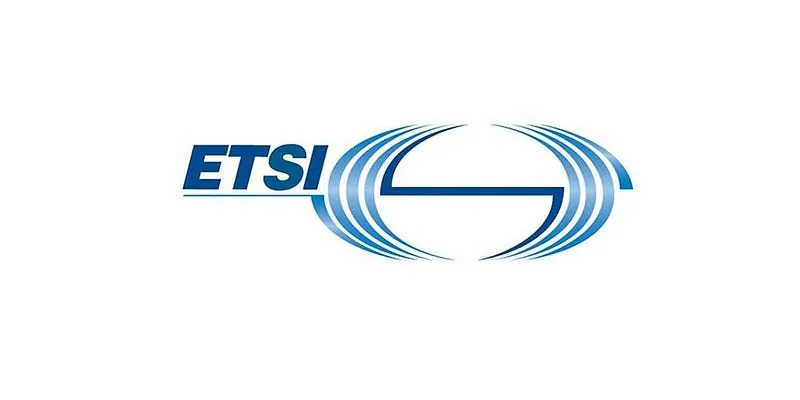
*ETSI — 5G, IoT ve iletişim güvenliği protokolleri*

#### NIST

ABD merkezli **NIST** (National Institute of Standards and Technology), bilgi teknolojileri ve siber güvenlik alanında standartlar ve rehberler geliştiren önde gelen bir kuruluştur. NIST Cybersecurity Framework ve SP 800 serisi gibi kaynaklar dünya genelinde kuruluşlar tarafından referans alınır. Teknolojik yenilikleri desteklerken siber tehditlere karşı pratik çözümler sunan NIST, hem kamu hem de özel sektörde güvenliğin artırılmasına katkıda bulunur; **§1.2.1** bölümündeki RMF döngüsü bu kuruluşun çıktılarına dayanır.

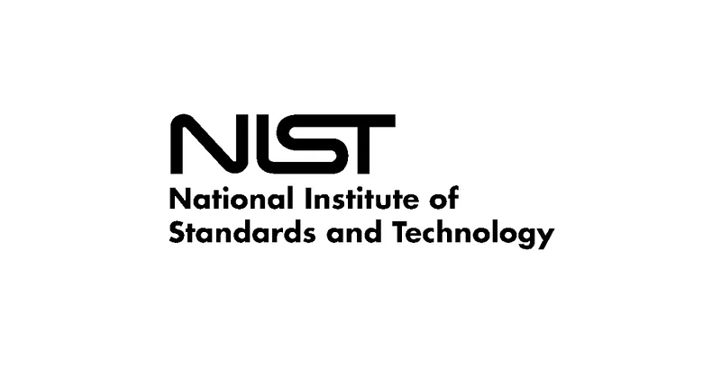
*NIST — CSF ve SP 800 serisi ile risk yönetimi*

#### IEEE

**IEEE** (Institute of Electrical and Electronics Engineers), bilgi teknolojisi, telekomünikasyon ve siber güvenlik gibi alanlarda standartlar geliştiren; özellikle teknik yenilikler ve uygulamalar konusunda küresel bir otoritedir. Donanım güvenliği ve ağ protokolleri standartlaştırmasında **§3** ve **§6** bölümleriyle kesişir.

#### IETF

İnternetin teknik altyapısını geliştiren **IETF** (Internet Engineering Task Force), ağ protokolleri ve güvenlik standartları üzerinde çalışır. Açık bir topluluk olarak faaliyet gösterir; TCP/IP, TLS, DNS ve HTTP gibi RFC standartları internetin güvenliğini artırmayı hedefler. **§6.1** bölümündeki OSI/TCP-IP katman modeli bu kuruluşun çıktılarıyla doğrudan ilişkilidir.

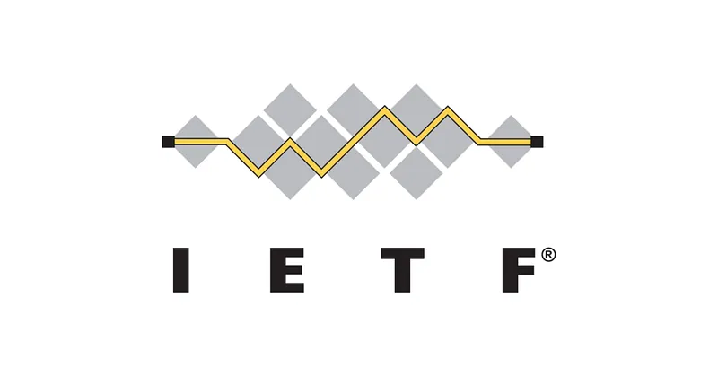
*IETF — açık RFC standartları (TCP/IP, TLS, DNS)*

#### ISC²

**ISC²** (International Information System Security Certification Consortium), bilgi güvenliği profesyonelleri için uluslararası geçerliliği olan sertifikalar sunan kar amacı gütmeyen bir kuruluştur. CISSP gibi sektörde saygın sertifikalarıyla tanınan ISC², bilgi güvenliği alanında standartları belirlemekte ve profesyonel gelişimi desteklemektedir. Etik kurallara bağlılık ve sürekli eğitim (CPE) gereklilikleriyle uzmanların yetkinliklerini güncel tutmayı amaçlar.

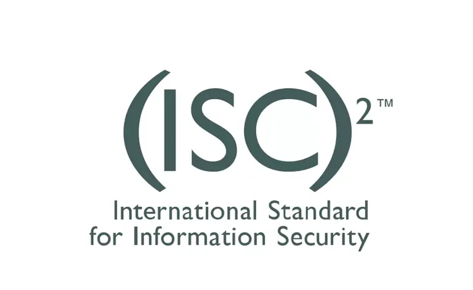
*ISC² — CISSP ve etik kurallar*

#### OWASP

**OWASP** (Open Web Application Security Project), web uygulama güvenliği alanında dünya genelinde faaliyet gösteren açık kaynaklı ve kar amacı gütmeyen bir organizasyondur. Yazılım geliştiricilere, güvenlik uzmanlarına ve kurumlara daha güvenli uygulamalar geliştirmeleri için rehberlik ve araçlar sunar. Her birkaç yılda bir güncellenen **OWASP Top 10** raporu en yaygın web uygulama güvenlik açıklarını sıralar; Privacy Top 10 (2021) regülasyon eşlemesi **§1.2.2** bölümünde detaylandırılmıştır.

#### FIRST

Siber olaylara müdahale ekiplerinin uluslararası ağı olan **FIRST** (Forum of Incident Response and Security Teams), güvenlik olaylarına hızlı yanıt verilmesini ve bilgi paylaşımını teşvik eder. TR-CERT/USOM gibi ulusal CSIRT'ler bu ağın parçasıdır; **§14** bölümündeki olay müdahale süreçleriyle doğrudan ilişkilidir.

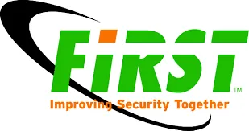
*FIRST — CSIRT'ler arası tehdit ve olay bilgisi paylaşımı*

#### MITRE

**MITRE**, ATT&CK ve D3FEND gibi tehdit bilgi tabanlarını geliştiren kar amacı gütmeyen bir araştırma kuruluşudur. Gerçek dünya gözlemlerine dayanan bu çerçeveler, saldırgan taktik ve tekniklerini detaylandırarak SOC, red team ve threat intel ekiplerinin savunma stratejilerini optimize etmesine yardımcı olur. Kitap genelinde tehdit eşlemesi için referans alınır.

### Türkiye'deki Kuruluşlar

| Kuruluş | Görev |
| :---- | :---- |
| **BTK / USOM** | Siber olay müdahale, tehdit istihbaratı, TR-CERT koordinasyonu |
| **TÜBİTAK BİLGEM** | Yerli kriptoloji, siber güvenlik Ar-Ge, kamu projeleri |
| **TSE** | ISO 27001 belgelendirme, ürün güvenilirlik testleri |
| **Siber Güvenlik Kümelenmesi** | Yerli ürün ekosistemi, kamu-özel-akademi iş birliği |
| **BGD** | Bilgi güvenliği farkındalığı, eğitim ve politika katkısı |
| **TBD** | Bilişim sektörü, siber güvenlik ve hukuk politikaları |

#### BTK ve USOM

**BTK** (Bilgi Teknolojileri ve İletişim Kurumu), Türkiye'de telekomünikasyon ve bilişim sektörünü düzenleyen ve denetleyen temel kamu kuruluşudur. 2000'de Telekomünikasyon Kurumu olarak kurulmuş, 2008'de bugünkü adını almıştır. BTK, elektronik haberleşme sektöründe rekabeti teşvik ederken siber güvenlik politikalarını koordine eder ve **USOM** (Ulusal Siber Olaylara Müdahale Merkezi — TR-CERT) gibi birimleri bünyesinde barındırarak ulusal çapta siber tehditlere karşı mücadele yürütür.

BTK bünyesinde faaliyet gösteren **USOM**, Türkiye'nin siber güvenlik kalesi olarak tanımlanır. Siber olaylara hızlı müdahale, tehdit istihbaratı toplama ve kamu ile özel sektör arasında koordinasyon sağlama görevlerini üstlenir. Türkiye'ye yönelik siber saldırıların tespiti ve önlenmesi için 7/24 çalışan bu merkez, kritik altyapıların güvenliğini artırmayı hedefler.

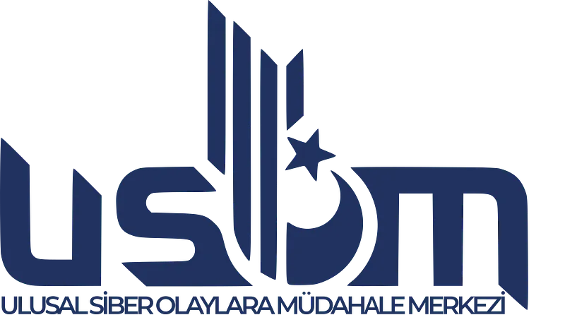
*USOM (TR-CERT) — BTK bünyesinde 7/24 siber tehdit müdahalesi*

#### TÜBİTAK BİLGEM

TÜBİTAK'a bağlı **BİLGEM** (Bilişim ve Bilgi Güvenliği İleri Teknolojiler Araştırma Merkezi), bilişim ve siber güvenlik teknolojileri alanında Ar-Ge faaliyetleri yürütür. Ulusal güvenlik projeleri için yazılım, donanım ve kriptoloji çözümleri geliştiren merkez, özellikle savunma sanayi ve kamu kurumları için yenilikçi teknolojiler üretir. Siber güvenlik testleri, yerli yazılım geliştirme ve bilgi güvenliği sistemleri konularında Türkiye'nin önde gelen kuruluşlarından biridir.

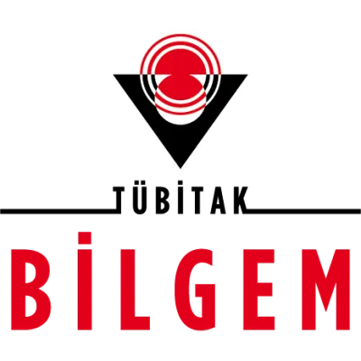
*BİLGEM — bilişim ve bilgi güvenliği ileri teknolojiler Ar-Ge merkezi*

#### TSE

**TSE** (Türk Standartları Enstitüsü), 1954'te kurulan ve Türkiye'de standart geliştirme, belgelendirme ve denetim faaliyetleri yürüten ulusal bir organizasyondur. Bilgi teknolojileri ve güvenliği alanında özellikle ISO/IEC 27001 gibi uluslararası standartların Türkiye'de uygulanmasını destekler ve siber güvenlik yönetim sistemlerinin belgelendirilmesine katkıda bulunur. BT ürünlerinin güvenilirliğini test eder, yerli firmaların standartlara uygunluğunu denetler.

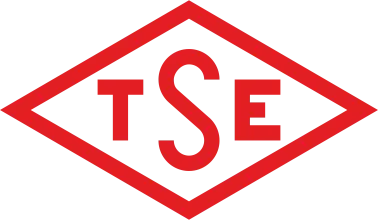
*TSE — ISO 27001 belgelendirme ve uygunluk denetimi*

#### Türkiye Siber Güvenlik Kümelenmesi

**Türkiye Siber Güvenlik Kümelenmesi**, 2017'de Savunma Sanayii Başkanlığı ve Dijital Dönüşüm Ofisi'nin öncülüğünde kamu kurumları, özel sektör ve akademi temsilcilerinin katkılarıyla kurulmuştur. Yerli ve milli siber güvenlik ürünlerinin geliştirilmesini teşvik etmek, siber güvenlik ekosistemini güçlendirmek ve uluslararası rekabet gücünü artırmak temel amaçlarıdır.

*Yerli ve milli siber güvenlik ürün ekosistemi*

#### Bilgi Güvenliği Derneği (BGD)

2007'de kurulan **BGD**, akademisyenler, kamu görevlileri ve özel sektör uzmanlarının katılımıyla bilgi güvenliği alanında farkındalık oluşturmak, eğitimler düzenlemek ve ulusal politikalara katkı sağlamak amacıyla faaliyet gösterir. Kamu ve özel sektöre yönelik seminerler ve çalıştaylar düzenleyerek bilgi paylaşımını teşvik eder.

*BGD — akademi, kamu ve özel sektör iş birliği*

#### Türkiye Bilişim Derneği (TBD)

1971'de kurulan **TBD**, bilişim sektörünü geliştirmeyi amaçlayan ve bu alandaki paydaşları bir araya getiren köklü bir sivil toplum kuruluşudur. Bilgi teknolojileri, yazılım, siber güvenlik ve bilişim hukuku gibi alanlarda kamuoyu oluşturma, seminerler düzenleme ve kamu politikalarına katkı sağlama görevini üstlenir.

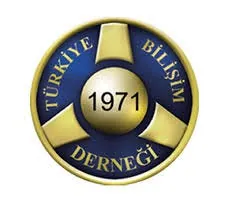
*TBD — bilişim politikaları ve sektör koordinasyonu*

---

## §1.4.2. Bilgi Güvenliği Standartları ve Çerçeveleri

Standartların temel amacı dijital varlıkları korumak, siber tehditlere karşı önlem almak ve yasal düzenlemelere uyum sağlamaktır. Verilerin gizliliği, bütünlüğü ve erişilebilirliğini sağlamak; riskleri minimize etmek ve en iyi uygulamaları teşvik etmek bu çerçevelerin ortak hedefidir.

### Yönetim ve Uyumluluk Standartları

| Standart | Kapsam | Operasyonel karşılık |
| :---- | :---- | :---- |
| **ISO/IEC 27001** | ISMS kurulumu, risk tabanlı kontrol | GRC platformu, iç denetim |
| **NIST SP 800-53** | Federal/kritik sistem kontrol kataloğu | SIEM, IAM, ağ segmentasyonu |
| **NIST CSF 2.0** | Identify–Protect–Detect–Respond–Recover | SOC metrikleri, olay müdahale |
| **COBIT** | BT yönetişimi ve süreç kontrolü | Denetim, KPI/KRI |
| **ITIL** | BT hizmet yönetimi | Change/incident süreçleri |
| **CIS Controls v8** | Öncelikli teknik kontroller | Hardening, patch, loglama |

#### ISO/IEC 27000 Serisi

**ISO/IEC 27000** serisi, bilgi güvenliği yönetim sistemlerinin oluşturulması, uygulanması ve sürdürülmesi için uluslararası kabul görmüş bir dizi standarttır. **ISO/IEC 27001** serinin temel standardıdır ve bir bilgi güvenliği yönetim sistemi (ISMS) kurma gereksinimlerini belirler. **ISO/IEC 27002** ise bu sistemin uygulanmasında kullanılan güvenlik kontrollerine ilişkin en iyi uygulama önerileri sunar. Risk yönetimi, veri koruma, erişim kontrolü ve iş sürekliliği gibi alanlarda organizasyonlara rehberlik ederek güvenlik süreçlerini standardize eder.

*ISO/IEC 27001 + 27002 — ISMS kurulumu ve kontrol kataloğu*

#### NIST SP 800-53

NIST tarafından geliştirilen **SP 800-53**, federal hükümet ve diğer organizasyonlar için bilgi sistemlerinin güvenliğini sağlamaya yönelik geniş kapsamlı kontrol ve yönergeler sunar. **§1.2.1** bölümündeki RMF "Select" adımında bu katalogdan kontrol seçimi yapılır; SIEM, IAM ve ağ segmentasyonu gibi operasyonel karşılıkları vardır.

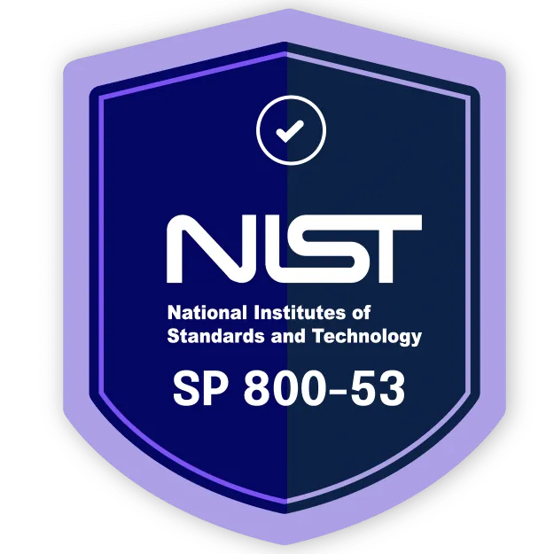
*NIST SP 800-53 — teknik ve idari kontrol referans kataloğu*

#### NIST Cybersecurity Framework

**NIST CSF**, kuruluşların siber güvenlik risklerini yönetmek ve iyileştirmek için bir rehber sunar. Identify–Protect–Detect–Respond–Recover döngüsü sürekli iyileştirmeyi teşvik eder; SOC metrikleri ve olay müdahale süreçleri bu çerçeveye hizalanır.

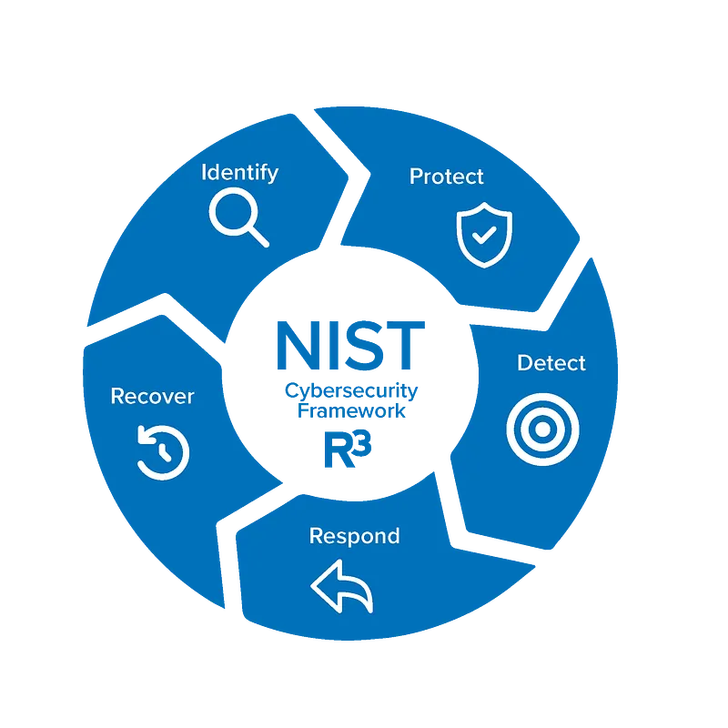
*NIST CSF — sürekli iyileştirme döngüsü*

#### COBIT

**COBIT** (Control Objectives for Information Technologies), BT yönetişimi ve yönetimi için bir çerçeve sunar. Organizasyonların bilgi teknolojilerini etkin yönetmesini ve güvenliğini sağlamasını destekler; süreçlerin kontrol edilmesi ve izlenmesi ISACA'nın yönetişim yaklaşımının temelidir.

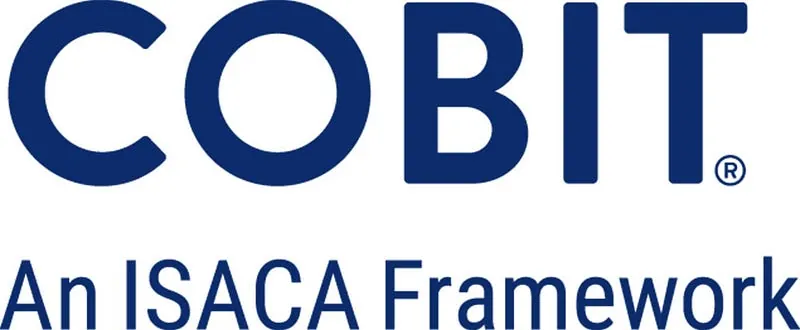
*COBIT — iş hedefleri ile BT kontrollerinin hizalanması*

#### ITIL

**ITIL** (Information Technology Infrastructure Library), BT hizmet yönetimi için bir çerçeve sunar. Organizasyonların BT hizmetlerini verimli, güvenli ve uyumlu yönetmesine yardımcı olur; incident, change ve süreç olgunluğu **§14** bölümündeki operasyonel güvenlik süreçleriyle örtüşür.

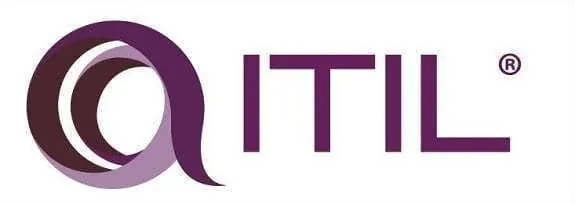
*ITIL — incident, change ve süreç olgunluğu*

#### CIS Controls

**CIS Controls** (Center for Internet Security), organizasyonların siber güvenliklerini güçlendirmeleri için en iyi uygulama rehberleri sunar. Saldırılara karşı savunma duvarı oluşturarak bilgi güvenliğini artırmayı amaçlar; hardening, yama yönetimi ve loglama gibi öncelikli teknik kontrolleri özel sektör kuruluşları için pratik bir başlangıç noktası sağlar.

### Regülasyon ve Sektörel Standartlar

| Standart / Kanun | Odak | Kitap bölümü |
| :---- | :---- | :---- |
| **KVKK** | Kişisel veri koruma (TR) | §1.2.2 |
| **GDPR** | AB veri koruma | §1.2.2 |
| **PCI-DSS** | Ödeme kartı verisi | §5, §9 |
| **HIPAA** | ABD sağlık verisi | — |
| **Common Criteria** | Ürün güvenlik değerlendirmesi (EAL) | §7 Endpoint |

#### KVKK

Türkiye'de kişisel verilerin korunmasını düzenleyen **KVKK** (Kişisel Verilerin Korunması Kanunu), kurumların kişisel verileri işlerken uyması gereken kuralları belirler ve veri ihlallerine karşı önlemler alınmasını zorunlu kılar. m.12 kapsamındaki teknik ve idari tedbirler **§1.2.2** bölümünde OWASP Privacy Top 10 eşlemesiyle detaylandırılmıştır.

*KVKK — kişisel veri işleme kuralları ve ihlal bildirimi yükümlülükleri*

#### GDPR

Avrupa Birliği **GDPR** (General Data Protection Regulation), kişisel verilerin korunması ve gizliliği için bir dizi düzenleme getirir. Veri sahibi hakları, ihlal bildirimi süreleri ve veri işleme kayıtları bilgi güvenliği uygulamalarının kişisel veri süreçlerine entegrasyonunu gerektirir.

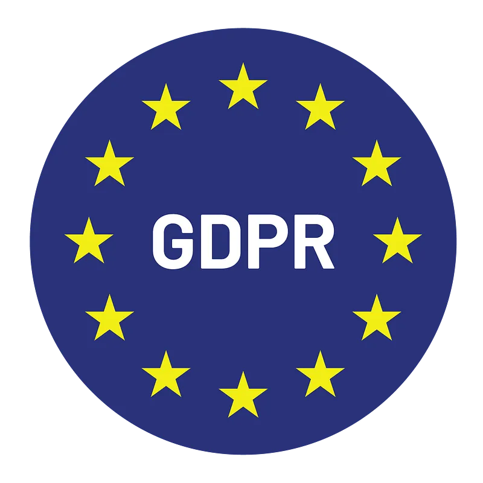
*GDPR — veri sahibi hakları ve 72 saat ihlal bildirimi*

#### PCI-DSS

**PCI-DSS** (Payment Card Industry Data Security Standard), ödeme kartı bilgilerini korumaya yönelik zorunlu güvenlik gereksinimlerini tanımlar. Ödeme kartı bilgilerini işleyen organizasyonların uyumlu olmasını sağlar; **§5** veri güvenliği ve **§9** e-posta güvenliği bölümlerindeki şifreleme ve erişim kontrolleriyle ilişkilidir.

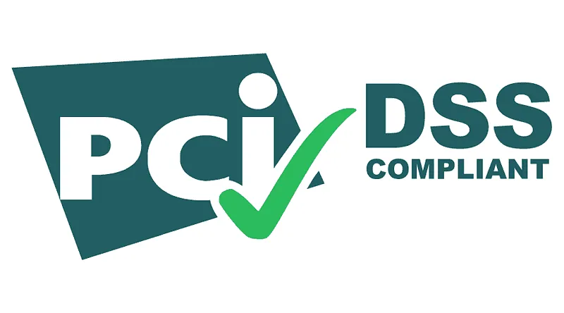
*PCI-DSS — kart verisi işleme ve depolama gereksinimleri*

#### HIPAA

ABD'de sağlık hizmetleriyle ilgili kişisel sağlık bilgilerini korumak amacıyla oluşturulan **HIPAA** (Health Insurance Portability and Accountability Act), sağlık sektörü için bilgi güvenliği ve gizliliği gereksinimlerini belirler. Sağlık verisi işleyen kuruluşlar için sektörel uyumluluk çerçevesi sunar.

#### Common Criteria

**Common Criteria** (Ortak Kriterler), ISO/IEC 15408 olarak da bilinen ve BT ürünlerinin güvenlik özelliklerini değerlendirmek için uluslararası kabul görmüş bir standarttır. Ürünlerin güvenlik seviyelerini değerlendirmek için **EAL** (Evaluation Assurance Level) kullanır; kamu, savunma ve finans sektörlerinde yaygındır.

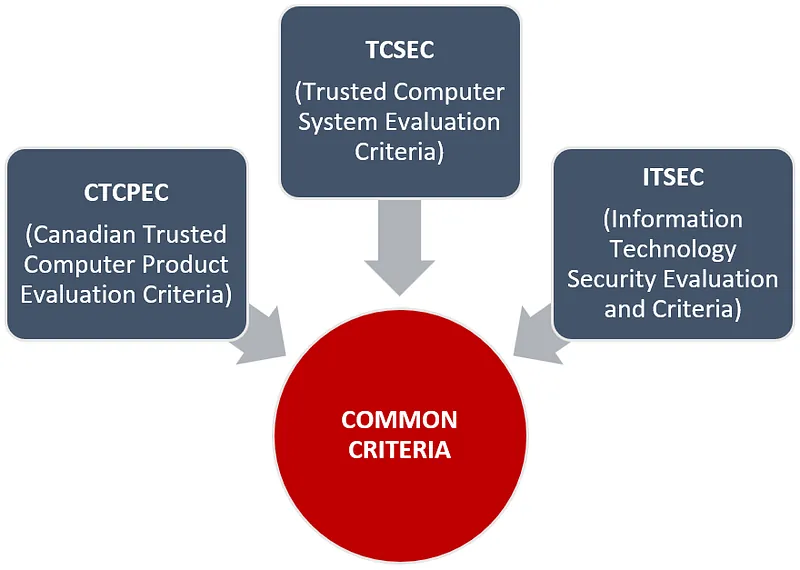
*ISO/IEC 15408 — EAL seviyeli ürün sertifikasyonu*

### Tehdit Modelleme ve Saldırı Çerçeveleri

#### MITRE ATT&CK

**MITRE ATT&CK**, gerçek dünya gözlemlerine dayanan, siber saldırgan taktiklerinin ve tekniklerinin küresel olarak erişilebilir bir bilgi tabanıdır. Saldırganların saldırı yaşam döngüsü boyunca kullandıkları taktikleri ve teknikleri detaylandırır. Kuruluşların saldırıları daha iyi anlamalarına, tehdit istihbaratını geliştirmelerine ve savunma stratejilerini optimize etmelerine yardımcı olur; SOC, red team ve detection engineering ekipleri için ortak dil sağlar.

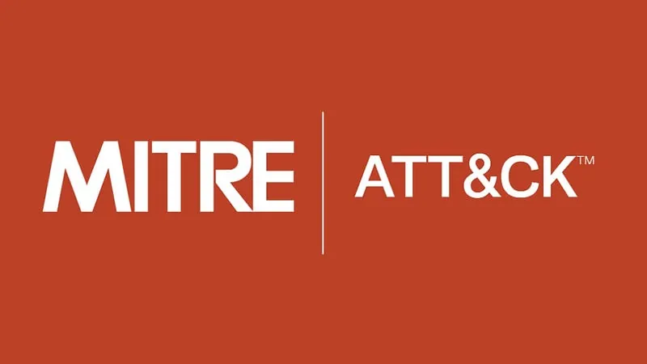
*MITRE ATT&CK — taktik, teknik ve prosedür (TTP) referansı*

#### Cyber Kill Chain

Lockheed Martin tarafından geliştirilen **Cyber Kill Chain**, bir siber saldırının aşamalarını tanımlayan bir modeldir. Saldırganların hedeflerine ulaşmak için izledikleri yedi aşamalı yolu anlamaya ve savunma stratejileri geliştirmeye yardımcı olur; **§14** bölümündeki olay müdahale playbook'ları bu modelle hizalanabilir.

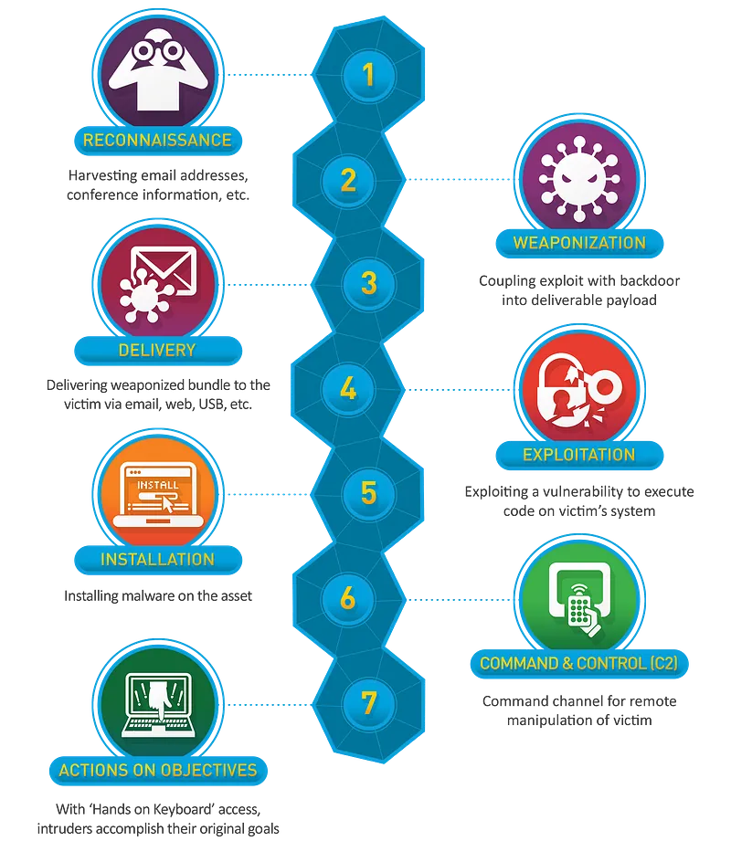
*Kill Chain — keşiften eyleme kadar saldırı yaşam döngüsü aşamaları*

OWASP Privacy Top 10 (2021) ile regülasyon eşlemesi **§1.2.2** altında detaylandırılmıştır.

---

## §1.4.3. Sertifikasyon Kuruluşları ve Kariyer Yolu

Siber güvenlik sertifikaları, işverenlerin aday yetkinliğini ölçmek için yaygın kullanılan kriterlerdir. Bilgi teknolojileri ve güvenliği alanında uluslararası geçerliliği olan sertifikalar, adayların bilgi düzeyini ve deneyimini belgelemek için önemli bir ölçüt olarak kabul edilir.

| Seviye | Sertifika | Kuruluş | Odak |
| :---- | :---- | :---- | :---- |
| Giriş | **Security+** | CompTIA | Temel güvenlik kavramları |
| Orta | **CEH** | EC-Council | Etik hacking, penetrasyon |
| Orta | **CISA** | ISACA | BT denetimi |
| İleri | **CISSP** | ISC² | Yönetim ve mimari (8 domain) |
| İleri | **CISM** | ISACA | Güvenlik yönetimi |
| Uzman | **GIAC (SANS)** | SANS | Derin teknik (DFIR, ICS, cloud) |

#### ISC² ve CISSP

**ISC²**, bilgi güvenliği profesyonelleri için uluslararası geçerliliği olan sertifikalar sunan kar amacı gütmeyen bir kuruluştur. **CISSP** (Certified Information Systems Security Professional), yönetim düzeyi bilgi güvenliği referans sertifikasıdır; sekiz domain kapsamında mimari, risk yönetimi ve operasyonel güvenlik yetkinliğini belgeler. CISSP domain'leri ISO 27001 ve NIST CSF kontrolleriyle örtüşür.

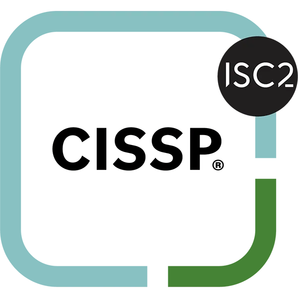
*CISSP — yönetim düzeyi bilgi güvenliği referans sertifikası*

#### ISACA — CISA ve CISM

**ISACA**, bilgi sistemleri denetimi, kontrolü, güvenliği ve yönetişimi alanlarında uzmanlaşmış bir kuruluştur. **CISA** (Certified Information Systems Auditor) BT denetimi, **CISM** (Certified Information Security Manager) güvenlik yönetimi odaklıdır; **CRISC** risk yönetimi alanında tamamlayıcı bir sertifikadır. COBIT ve GRC süreçleriyle doğrudan ilişkilidir.

#### CompTIA Security+

**CompTIA**, bilgi teknolojileri alanında geniş bir yelpazede sertifikalar sunan bir kuruluştur. **Security+**, siber güvenlik alanında temel bilgi ve becerileri belgeleyen bir sertifikadır; kariyerine yeni başlayanlar için uygun bir giriş noktası sağlar.

*CompTIA Security+ — kariyer başlangıcı için temel sertifika*

#### SANS / GIAC

**SANS Enstitüsü**, siber güvenlik eğitimleri ve sertifikasyonları konusunda dünya çapında tanınmış bir kuruluştur. Uygulamalı teknik eğitimler ve **GIAC** sertifikaları (GCIA, GCIH, GNFA vb.) DFIR, ICS ve bulut güvenliği gibi uzmanlık alanlarında endüstri standardı haline gelmiştir.

*SANS — uygulamalı teknik eğitim ve GIAC sertifikaları*

#### EC-Council CEH

**EC-Council**, etik hackerlık ve siber güvenlik alanında sertifikalar sunan bir kuruluştur. **CEH** (Certified Ethical Hacker), etik hackerlık alanında bilgi ve becerileri belgeleyen önemli bir sertifikadır; penetrasyon testi ve zafiyet değerlendirme süreçlerinde referans alınır.

*CEH — etik hackerlık ve penetrasyon testi*

#### Cloud Security Alliance (CSA)

**CSA** (Cloud Security Alliance), bulut güvenliği konusunda uzmanlaşmış bir organizasyondur. **CCSK** (Certificate of Cloud Security Knowledge) bulut tabanlı altyapıların güvenliği konusunda bilgi ve beceri kazandırır; **§11** bölümündeki bulut güvenliği tartışmalarıyla ilişkilidir.

### Sertifika Seçim Kriterleri

- **Rol uyumu:** SOC analisti → GIAC GCIA/GCIH; mimar → CISSP; denetçi → CISA
- **Sürekli eğitim:** ISC² CPE, ISACA CPE — sertifika geçerliliği için zorunlu
- **Pratik deneyim:** Sertifika, laboratuvar ve gerçek olay müdahale deneyimiyle desteklenmelidir
- **Standart hizalama:** CISSP domain'leri ISO 27001 ve NIST CSF kontrolleriyle örtüşür

---

## Özet

Bilgi güvenliği programı kurarken standartlar bir "checklist" değil, **risk iştahı ve iş hedefleriyle hizalanmış kontrol kataloğu** olarak kullanılmalıdır. Türkiye'deki kuruluşlar için **KVKK + 5651 + (sektöre göre) BDDK/7545** üçlüsü; uluslararası operasyonlar için **ISO 27001 + NIST CSF + GDPR** kombinasyonu pratik bir başlangıç noktasıdır. Teknik derinlik için MITRE ATT&CK ve OWASP; süreç olgunluğu için COBIT ve ITIL; operasyonel uygulama için CIS Controls referans alınmalıdır.

:::note
Standart uyumu ile sertifika sahipliği farklı kavramlardır: ISO 27001 belgesi kurumsal ISMS'i, CISSP bireysel yetkinliği gösterir. İkisi birbirini tamamlar; biri diğerinin yerine geçmez.
:::