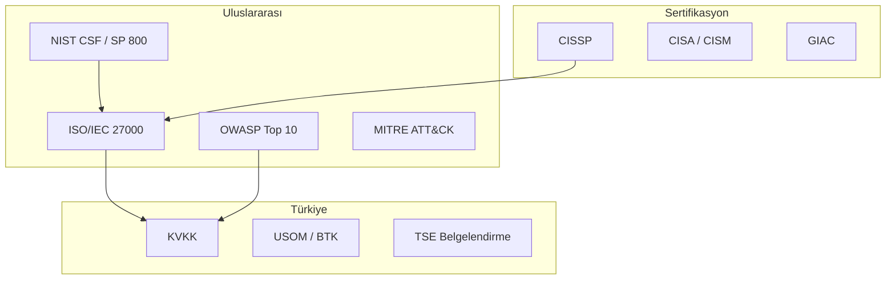

# Standartlar, Organizasyonlar ve Sertifikalar

Bilgi güvenliği disiplini, ulusal ve uluslararası standartlar ile bu standartları geliştiren kuruluşlar etrafında şekillenir. **§1.1** bölümündeki CIA üçlüsü ve **§1.2** bölümündeki GRC/uyumluluk süreçleri, bu bölümde ele alınan ISO 27001, NIST CSF, KVKK ve PCI-DSS gibi çerçevelere somut karşılık bulur.

📋 Standart Seçim Hızlı Rehberi

| Kurum tipi | Birincil çerçeve | Destekleyici |
| :---- | :---- | :---- |
| Kamu / kritik altyapı | NIST RMF + SP 800-53 | ISO 27001, 7545 |
| Özel sektör (TR) | ISO 27001 + KVKK | CIS Controls, OWASP |
| Ödeme / finans | PCI-DSS + ISO 27001 | BDDK, COBIT |
| SaaS / bulut | SOC 2 + ISO 27001 | CSA CCM, NIST CSF |

**Not:** Çok uluslu kurumlarda GDPR + KVKK birleşik uyum matrisi için **§1.2.2** bölümüne bakın.

---

## §1.4.1. Bilgi Güvenliği Organizasyonları

Bilgi teknolojileri ve güvenliği organizasyonlarının temel amacı, bilgi varlıklarını koruyarak yetkisiz erişimi engellemek, bütünlük ve doğruluğu sağlamak ve yetkili kullanıcıların ihtiyaç duyduklarında erişimini temin etmektir.

### Uluslararası Kuruluşlar

| Kuruluş | Rol | Kitap içi bağlantı |
| :---- | :---- | :---- |
| **ISO / IEC** | ISO/IEC 27000 serisi; bilgi güvenliği yönetim sistemleri | §1.2.1 RMF, §1.4.2 |
| **ISACA** | COBIT, CISA/CISM sertifikaları; BT yönetişimi | §1.2 GRC |
| **ITU** | Telekomünikasyon ve dijital altyapı standartları | §6 Ağ güvenliği |
| **NSA** | SIGINT, kriptoloji (AES); kritik altyapı rehberleri | §5 Veri güvenliği |
| **ETSI** | GSM, 5G, IoT ve telekom güvenlik protokolleri | §6.4 Kablosuz |
| **NIST** | CSF, SP 800 serisi; küresel referans | §1.1, §1.2 |
| **IETF** | TCP/IP, TLS, DNS, HTTP standartları (RFC) | §6.1 OSI/TCP-IP |
| **ISC²** | CISSP ve güvenlik etiği; profesyonel standartlar | §1.4.3 |
| **OWASP** | Web Top 10, ASVS, Privacy Top 10 | §8 Uygulama güvenliği |
| **MITRE** | ATT&CK, D3FEND tehdit bilgi tabanı | Tüm bölümler |

*ISO/IEC 27001 — ISMS kurulum ve belgelendirme standardı*

*NIST — CSF ve SP 800 serisi ile risk yönetimi*

*ISACA — COBIT ve CISA/CISM sertifikasyon otoritesi*

*ITU — Birleşmiş Milletler telekomünikasyon birimi*

*NSA — ulusal güvenlik ve şifreleme standartları (AES)*

*ETSI — 5G, IoT ve iletişim güvenliği*

*IETF — açık RFC standartları (TCP/IP, TLS, DNS)*

*ISC² — CISSP ve etik kurallar*

### Türkiye'deki Kuruluşlar

| Kuruluş | Görev |
| :---- | :---- |
| **BTK / USOM** | Siber olay müdahale, tehdit istihbaratı, TR-CERT koordinasyonu |
| **TÜBİTAK BİLGEM** | Yerli kriptoloji, siber güvenlik Ar-Ge, kamu projeleri |
| **TSE** | ISO 27001 belgelendirme, ürün güvenilirlik testleri |
| **Siber Güvenlik Kümelenmesi** | Yerli ürün ekosistemi, kamu-özel-akademi iş birliği |
| **BGD** | Bilgi güvenliği farkındalığı, eğitim ve politika katkısı |
| **TBD** | Bilişim sektörü, siber güvenlik ve hukuk politikaları |

*USOM (TR-CERT) — 7/24 siber tehdit müdahalesi*

*BİLGEM — bilişim ve bilgi güvenliği ileri teknolojiler*

*TSE — belgelendirme ve uygunluk denetimi*

*Yerli ve milli siber güvenlik ürün ekosistemi*

*BGD — akademi, kamu ve özel sektör iş birliği*

*TBD — bilişim politikaları ve sektör koordinasyonu*

---

## §1.4.2. Bilgi Güvenliği Standartları ve Çerçeveleri

Standartların temel amacı dijital varlıkları korumak, siber tehditlere karşı önlem almak ve yasal düzenlemelere uyum sağlamaktır.

### Yönetim ve Uyumluluk Standartları

| Standart | Kapsam | Operasyonel karşılık |
| :---- | :---- | :---- |
| **ISO/IEC 27001** | ISMS kurulumu, risk tabanlı kontrol | GRC platformu, iç denetim |
| **NIST SP 800-53** | Federal/kritik sistem kontrol kataloğu | SIEM, IAM, ağ segmentasyonu |
| **NIST CSF 2.0** | Identify–Protect–Detect–Respond–Recover | SOC metrikleri, olay müdahale |
| **COBIT** | BT yönetişimi ve süreç kontrolü | Denetim, KPI/KRI |
| **ITIL** | BT hizmet yönetimi | Change/incident süreçleri |
| **CIS Controls v8** | Öncelikli teknik kontroller | Hardening, patch, loglama |

*ISO/IEC 27001 + 27002 — ISMS ve kontrol kataloğu*

*NIST SP 800-53 — teknik ve idari kontrol referansı*

*NIST CSF — sürekli iyileştirme döngüsü*

*COBIT — iş hedefleri ile BT kontrollerinin hizalanması*

*ITIL — incident, change ve süreç olgunluğu*

### Regülasyon ve Sektörel Standartlar

| Standart / Kanun | Odak | Kitap bölümü |
| :---- | :---- | :---- |
| **KVKK** | Kişisel veri koruma (TR) | §1.2.2 |
| **GDPR** | AB veri koruma | §1.2.2 |
| **PCI-DSS** | Ödeme kartı verisi | §5, §9 |
| **HIPAA** | ABD sağlık verisi | — |
| **Common Criteria** | Ürün güvenlik değerlendirmesi (EAL) | §7 Endpoint |

*KVKK m.12 — teknik ve idari tedbirler*

*GDPR — veri sahibi hakları ve ihlal bildirimi*

*PCI-DSS — kart verisi işleme gereksinimleri*

*ISO/IEC 15408 — EAL seviyeli ürün sertifikasyonu*

### Tehdit Modelleme ve Saldırı Çerçeveleri

*MITRE ATT&CK — SOC, red team ve threat intel referansı*

*Kill Chain — saldırı yaşam döngüsü aşamaları*

OWASP Privacy Top 10 (2021) ile regülasyon eşlemesi **§1.2.2** altında detaylandırılmıştır.

---

## §1.4.3. Sertifikasyon Kuruluşları ve Kariyer Yolu

Siber güvenlik sertifikaları, işverenlerin aday yetkinliğini ölçmek için yaygın kullanılan kriterlerdir. Aşağıdaki tablo, tipik kariyer aşamalarına göre önerilen sertifikaları özetler.

| Seviye | Sertifika | Kuruluş | Odak |
| :---- | :---- | :---- | :---- |
| Giriş | **Security+** | CompTIA | Temel güvenlik kavramları |
| Orta | **CEH** | EC-Council | Etik hacking, penetrasyon |
| Orta | **CISA** | ISACA | BT denetimi |
| İleri | **CISSP** | ISC² | Yönetim ve mimari (8 domain) |
| İleri | **CISM** | ISACA | Güvenlik yönetimi |
| Uzman | **GIAC (SANS)** | SANS | Derin teknik (DFIR, ICS, cloud) |

*CISSP — yönetim düzeyi bilgi güvenliği referans sertifikası*

*CompTIA — kariyer başlangıcı için temel sertifika*

*SANS — uygulamalı teknik eğitim ve GIAC sertifikaları*

*CEH — etik hackerlık ve penetrasyon testi*

### Sertifika Seçim Kriterleri

- **Rol uyumu:** SOC analisti → GIAC GCIA/GCIH; mimar → CISSP; denetçi → CISA
- **Sürekli eğitim:** ISC² CPE, ISACA CPE — sertifika geçerliliği için zorunlu
- **Pratik deneyim:** Sertifika, laboratuvar ve gerçek olay müdahale deneyimiyle desteklenmelidir
- **Standart hizalama:** CISSP domain'leri ISO 27001 ve NIST CSF kontrolleriyle örtüşür

---

## Özet

Bilgi güvenliği programı kurarken standartlar bir "checklist" değil, **risk iştahı ve iş hedefleriyle hizalanmış kontrol kataloğu** olarak kullanılmalıdır. Türkiye'deki kuruluşlar için **KVKK + 5651 + (sektöre göre) BDDK/7545** üçlüsü; uluslararası operasyonlar için **ISO 27001 + NIST CSF + GDPR** kombinasyonu pratik bir başlangıç noktasıdır. Teknik derinlik için MITRE ATT&CK ve OWASP; süreç olgunluğu için COBIT ve ITIL; operasyonel uygulama için CIS Controls referans alınmalıdır.

:::note
Standart uyumu ile sertifika sahipliği farklı kavramlardır: ISO 27001 belgesi kurumsal ISMS'i, CISSP bireysel yetkinliği gösterir. İkisi birbirini tamamlar; biri diğerinin yerine geçmez.
:::