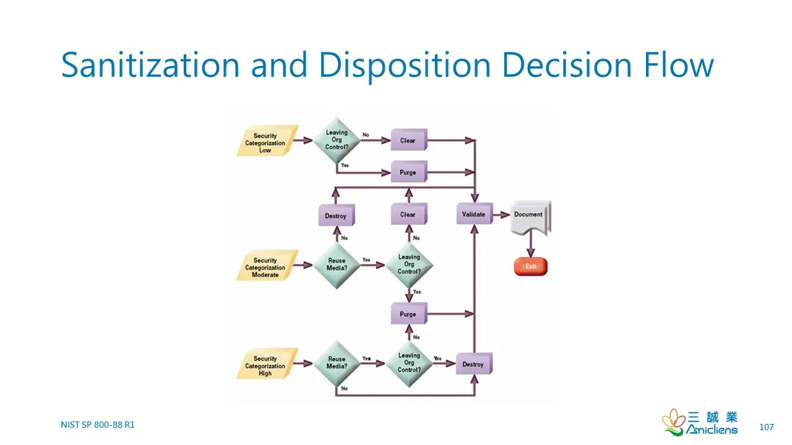
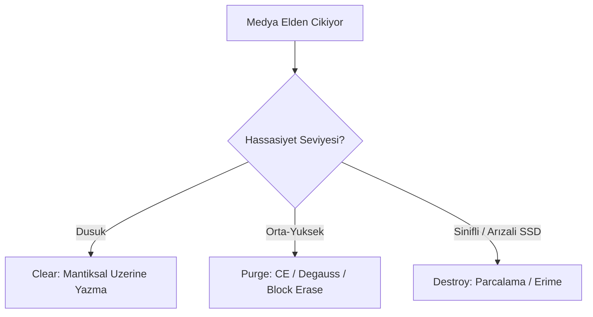
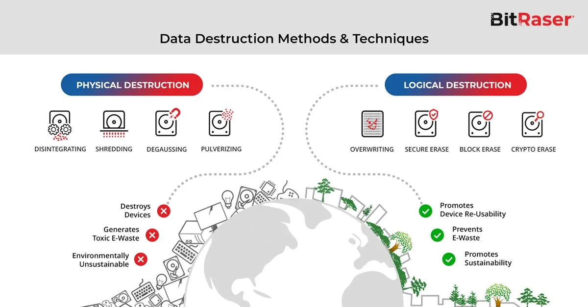
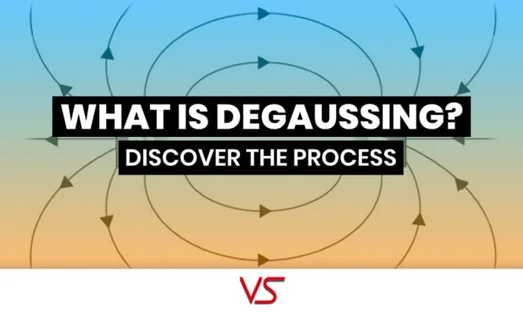
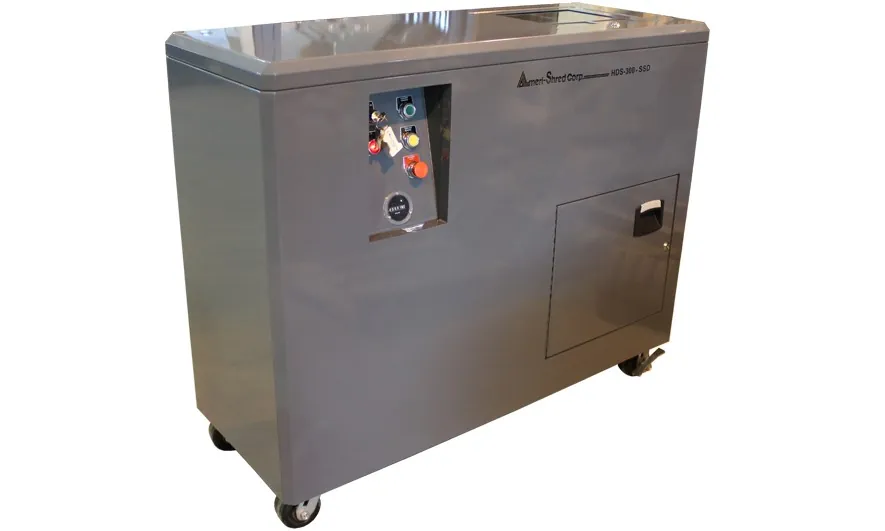
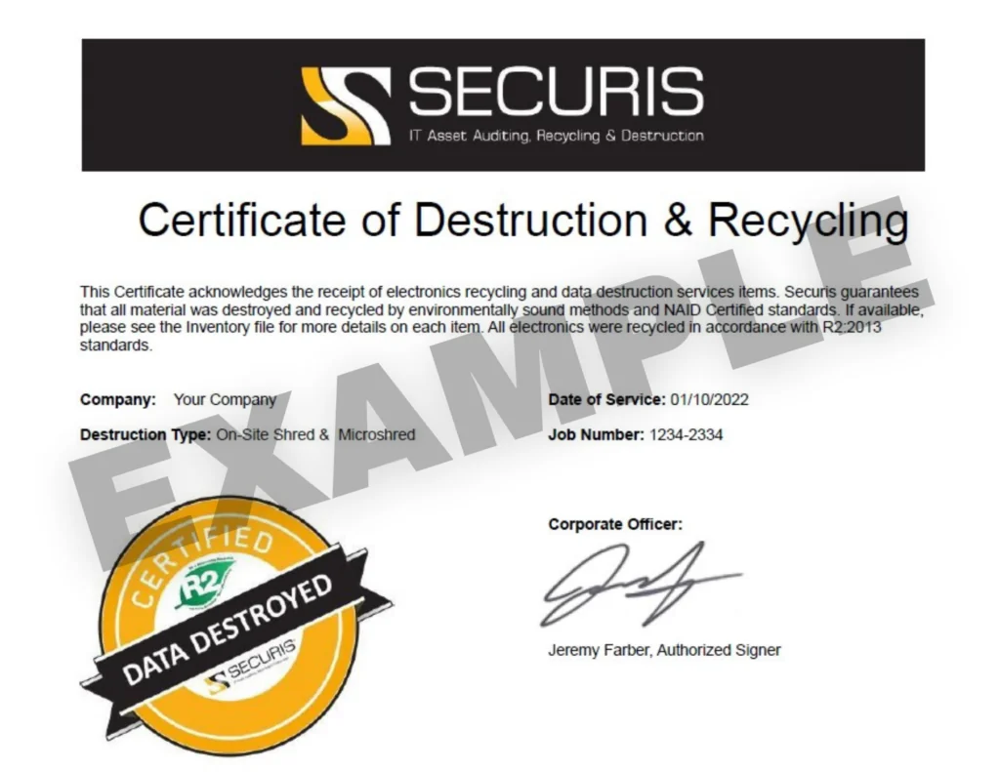
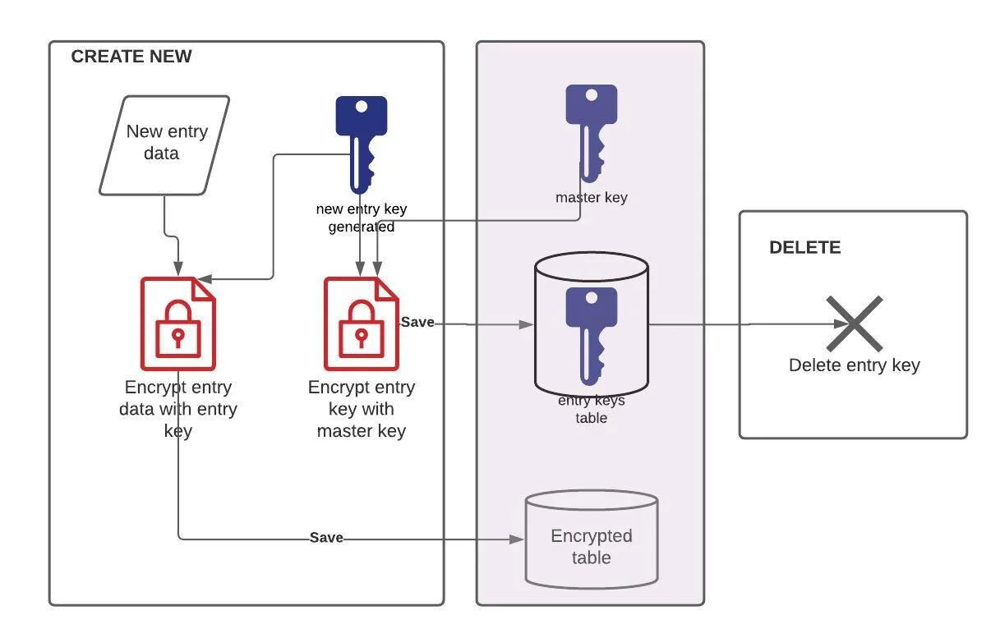

# Güvenli Cihaz İmhası ve Veri Yok Etme (Degaussing / Crypto-shredding / Shredding)

Veri yaşam döngüsünün (data lifecycle) son halkası — üretim, iletim, depolama ve kullanım sonrası **güvenli sanitizasyon** — Savunma Derinliği (Defense in Depth) mimarisinin en kritik ve en çok ihmal edilen katmanlarından biridir. Kurumsal topolojide bu kontrol, **Veri Koruma** (Data Protection) ve **Varlık Yönetimi** (Asset Management) katmanlarının kesişiminde yer alır. Yanlış veya eksik uygulanan bir imha işlemi, tüm öncelikli kontrolleri — şifreleme, DLP, erişim kontrolü, perimeter güvenliği — bypass ederek saldırganın eline somut veri sızıntısı fırsatı verir.

Fortune 500 ölçeğindeki bir ağ topolojisinde her gün yüzlerce sabit disk, SSD, ağ cihazı ve mobil terminal aktif kullanım dışı kalmaktadır. Bu cihazların kurumsal ağ sınırlarının dışına çıkarılmadan veya üçüncü taraf geri dönüşüm süreçlerine tabi tutulmadan önce veri barındırma yeteneklerinin tamamen sıfırlanması, bilgi güvenliğinin temel taşlarından biridir. Bu bölüm, uluslararası standartlar, teknolojiye özgü yöntemler, fiziksel imha prosedürleri, operasyonel entegrasyon ve Türkiye mevzuatını (KVKK, BDDK) bir sistem mimarı ve SOC analisti perspektifiyle ele alır. Fiziksel depolama güvenliği **§2.1** bölümündeki veri merkezi kontrolleriyle; donanım kökü güvenliği **§3.1** bölümündeki TPM/firmware katmanıyla ilişkilidir.



---

## §2.2.1. Veri Sanitizasyon Standartları

Veri sanitizasyonu, bir depolama medyasındaki verinin belirli bir çaba seviyesi dahilinde erişilemez kılınması sürecidir. Bu sürecin endüstriyel olarak kabul görmüş standartlara göre yürütülmesi, hem güvenlik garantisi hem de yasal ve denetimsel yükümlülüklerin yerine getirilmesi açısından zorunludur. NIST SP 800-88 Rev. 2 (Eylül 2025) ile güncellenen yaklaşım, artık tekil medya kararlarından ziyade **kurumsal bir Medya Sanitizasyon Programı** kurulmasını zorunlu kılar. Bu program; politika, roller ve sorumluluklar, karar akışı, sanitizasyon güvencesi, doğrulama ve sürekli iyileştirme döngüsünden oluşur.

### NIST SP 800-88 Rev. 2: Güncel Küresel Standart

NIST (ABD Ulusal Standartlar ve Teknoloji Enstitüsü) tarafından yayımlanan **SP 800-88 "Guidelines for Media Sanitization"**, medya sanitizasyonunda dünya çapında en yaygın kabul gören rehberdir. Revizyon 2, Rev. 1'i (2014) tamamen yürürlükten kaldırmış; odak noktasını "elle karar verme"den "kurumsal program yönetişimi"ne kaydırmıştır. Rev. 2, IEEE 2883-2022'yi teknik yöntemler için referans gösterir ve kriptografik silme (Cryptographic Erase) ile modern flaş tabanlı medyaya özel vurgu yapar.

NIST SP 800-88, sanitizasyon kararlarını medyanın türünden ziyade **medyada depolanmış olabilecek bilginin hassasiyetine** odaklanarak almayı önerir. Standart üç ana sanitizasyon yöntemi tanımlar:



| Yöntem | Tanım | Kurtarma Direnci | Medya Yeniden Kullanımı | Uygulama Alanı |
|--------|-------|------------------|------------------------|----------------|
| **Clear** | Standart mantıksal okuma/yazma komutlarıyla verinin üzerine hassas olmayan veri yazılması | Basit, invaziv olmayan araçlara karşı | Mümkün | Düşük hassasiyetli veriler, kurum içi yeniden tahsis |
| **Purge** | Veri kurtarmanın laboratuvar koşullarında dahi imkânsız hale getirilmesi | State-of-the-art lab | Mümkün (fiziksel hasar yoksa) | Orta-yüksek hassasiyetli veriler, üçüncü tarafa çıkış |
| **Destroy** | Fiziksel imha yöntemleriyle veri kurtarmanın ve medyanın yeniden kullanımının imkânsız hale getirilmesi | Her türlü lab saldırısına karşı | Mümkün değil | En yüksek hassasiyetli veriler, arızalı medyalar |

`Destroy` yöntemi, ileri düzey laboratuvar teknikleri kullanılarak dahi hedef verinin kurtarılmasının imkânsız hale getirilmesini gerektirir. Bu, yalnızca cihaz arayüzü üzerinden okunamaz olmayı değil, fiziksel olarak medyanın parçalanmasını veya dönüştürülmesini şart koşar.

**Risk Temelli Karar Matrisi (KVKK Eşleşmesi):**

| Kategori | Örnek Kullanım | Medya Önerisi | KVKK Eşleşmesi |
|----------|----------------|---------------|----------------|
| **Clear** | Düşük riskli, kurum içi redeploy | HDD/SSD (dikkatli) | Silme (kullanıcı erişimi engelleme) |
| **Purge** | Orta/yüksek hassasiyet, üçüncü taraf ITAD | SSD → CE veya Block Erase; HDD → CE veya degauss | Yok etme (çoğu durumda) |
| **Destroy** | Çok yüksek hassasiyet, sınıflı veri | Tüm medya (özellikle SSD) | Yok etme + fiziksel kanıt |

### DoD 5220.22-M: Tarihsel Standart ve Güncel Durumu

**DoD 5220.22-M** (National Industrial Security Program Operating Manual — NISPOM), 1990'lı yıllarda manyetik sabit diskler için geliştirilmiş **üç geçişli (3-pass) üzerine yazma** metodolojisiyle "devlet sınıfı veri silme" standardı olarak ün kazanmıştır. Standart prosedür şu şekildedir:

- **1. Geçiş:** Tüm sektörlere `0x00` (tüm sıfırlar) yazılır
- **2. Geçiş:** Tüm sektörlere `0xFF` (tüm birler) yazılır
- **3. Geçiş:** Tüm sektörlere rastgele veri yazılır, ardından doğrulama yapılır

Bazı satıcılar tarafından referans verilen **7-pass (DoD 5220.22-M-ECE)** varyantı da mevcuttur; ancak bu yöntem de güncel DoD veya NIST gereksinimlerinde yer almamaktadır.

:::danger
**DoD 5220.22-M artık geçerli bir federal standart değildir.** ABD Savunma Bakanlığı 2001'de 3-pass zorunluluğunu kaldırmış; güncel NISPOM (**32 CFR Part 117**) eski üç geçişli yöntemi içermemektedir. NIST SP 800-88 r2 bu yöntemi federal standart olarak geçersiz kılmıştır. SSD'lerde 3-pass overwrite yöntemi etkisizdir; wear-leveling ve over-provisioning nedeniyle tüm adreslenebilir alanlara erişemez. Kurumların sanitizasyon stratejilerinde **NIST SP 800-88 r2** ve **IEEE 2883-2022**'yi referans alması zorunludur.
:::

DoD 5220.22-M'nin terk edilme nedenleri:

1. **Bilimsel araştırmalar**, modern HDD'lerde tek bir geçişin veri kurtarmayı engellemek için yeterli olduğunu göstermiştir
2. **SSD'lerde** aşınma dengeleme (wear-leveling) ve yedek blok mekanizmaları nedeniyle üzerine yazma yöntemleri tüm adreslenebilir alanlara erişemez
3. Çok geçişli üzerine yazma, modern sürücülerde **ek güvenlik sağlamaz** ancak **zaman ve kaynak israfına** neden olur

### IEEE 2883-2022: Teknolojiye Özgü Sanitizasyon

**IEEE 2883-2022 (Standard for Sanitizing Storage)**, NIST'in bıraktığı boşluğu doldurur; mantıksal ve fiziksel depolama için teknolojiye özgü (HDD, SSD, NVMe, flash, manyetik bant) gereksinimler tanımlar. Clear, purge, cryptographic erase, degauss, destruct ve sanitizasyon prosedürlerinin uygulanmasını standartlaştırır. IEEE 2883, kriptografik silmeyi `Clear` ve `Purge` yöntemleri kapsamında değerlendirir.

### ISO 27001:2022 ve ISO/IEC 21964

**ISO 27001:2022** kapsamında sanitizasyon doğrudan denetim kriteridir:

- **Kontrol A.7.14 (Ekipmanların Elden Çıkarılması veya Yeniden Kullanımı):** Cihazların elden çıkarılmadan önce üzerlerindeki tüm hassas bilgilerin güvenli yöntemlerle arındırıldığının doğrulanmasını zorunlu kılar
- **Kontrol A.8.10 (Bilgilerin Silinmesi):** Bilgilerin silinmesine yönelik standart prosedürlerin bulunmasını ve bu silme operasyonlarının takip edilebilir olmasını şart koşar

**ISO/IEC 21964**, fiziksel veri taşıyıcılarının güvenli imhası için 7 güvenlik seviyesi ve 3 koruma sınıfı tanımlar; DIN 66399'un yerini almaktadır.

### Standartlar Karşılaştırma Tablosu

| Parametre / Kriter | DoD 5220.22-M | NIST SP 800-88 r2 | IEEE 2883-2022 | ISO/IEC 21964 |
| :---- | :---- | :---- | :---- | :---- |
| **Güncellik Durumu** | Geçersiz (tarihsel) | Güncel (Eylül 2025) | Güncel (2022) | Güncel (DIN 66399'un yerini aldı) |
| **Temel Metodoloji** | Çoklu üstüne yazma (3-pass) | Risk odaklı: Clear, Purge, Destroy | Teknolojiye özgü mantıksal ve fiziksel arındırma | Fiziksel imha cihazları için 7 güvenlik seviyesi |
| **SSD / Flaş Uyumu** | Uyumsuz | Tam uyumlu (CE, Block Erase) | Tam uyumlu (NVMe, FTL katmanı dahil) | E sınıfı (SSD) için özel partikül boyutları |
| **Gizli / Yedek Sektör Erişimi** | Yetersiz (HPA, DCO, FTL) | Başarılı (kontrolcü komutları) | En üst düzey (tüm adreslenebilir alanlar) | Fiziksel imha ile tam erişim |
| **Doğrulama** | Son yazma adımının okunması | %100 tarama veya örneklem analizi | Mantıksal ve fiziksel bütünlük doğrulama | Partikül boyutu ve sertifika doğrulaması |
| **Kurumsal Program** | Yok | Zorunlu (Rev. 2) | Teknik uygulama rehberi | Fiziksel imha ekipmanı sınıflandırması |

### NIST SP 800-53 ve CIS Controls Entegrasyonu

**NIST SP 800-53 Rev. 5** MP (Media Protection) ailesi kontrolleri — özellikle MP-7 ve ilgili enhancement'lar — ile CM-8 (Information System Component Inventory) birleştirilerek uygulanır. SP 800-88 r2, bu kontrollerin uygulama rehberidir.

| NIST Kontrol | Açıklama | Operasyonel Karşılık |
| :---- | :---- | :---- |
| **MP-6** | Medya sanitizasyonu | Clear/Purge/Destroy karar matrisi |
| **MP-6(1)** | İnceleme ve onay | Security Officer tanıklığı |
| **MP-6(2)** | Ekipman testi | Doğrulama taraması (örneklem) |
| **MP-6(3)** | Nondestructive sanitizasyon | Crypto-shredding, nvme-cli |
| **MP-7** | Medya kullanımı kısıtlaması | Hassas veri taşıyan medya envanteri |
| **CM-8** | Bileşen envanteri | CMDB ↔ sanitizasyon ticket eşlemesi |

**CIS Controls v8** Control 3.5 "Securely Dispose of Data", veri hassasiyetine orantılı imha yönteminin veri yönetimi sürecinin parçası olarak zorunlu olduğunu belirtir. Tüm imha süreçlerinin merkezi bir varlık yönetim sistemiyle (CMDB) ilişkilendirilmesi ve imha kayıtlarının otomatik olarak güncellenmesi gereklidir.

:::caution
KVKK "silme" (erişimi engelleme) ile "yok etme" (geri getirilemez kılma) ayrımına dikkat edin. Çoğu kurumsal medya için **Purge** veya **Destroy** yöntemi yok etme yükümlülüğünü karşılar; yalnızca Clear yöntemi çoğu senaryoda yetersiz kalır.
:::



---

## §2.2.2. Veri Yok Etme Teknikleri

Veri sanitizasyonunda kullanılacak yöntem, medyanın teknolojisine (manyetik HDD, flash tabanlı SSD, hibrit, optik, manyetik bant) ve verinin hassasiyet seviyesine göre belirlenmelidir. Manyetik tabanlı geleneksel diskler ile yarı iletken flaş belleklerin fiziksel yapıları taban tabana zıt olduğundan, her iki kategori için ayrı metodolojiler geliştirilmiştir.

### Degaussing (Manyetik Silme)

**Degaussing**, manyetik medya (HDD ve manyetik teyp kartuşları) üzerindeki veriyi, çok güçlü bir manyetik alan uygulayarak yok etme işlemidir. Bu işlem, diskin üzerindeki manyetik düzeni tamamen bozarak veriyi fiziksel düzeyde anlamsız hale getirir; ancak bunun bedeli, medyanın bir daha asla kullanılamaz hale gelmesidir.



Bir malzemenin manyetik giderime karşı gösterdiği direnç gücü **koersivite (coercivity)** olarak tanımlanır ve birimi Oersted (Oe) cinsinden ifade edilir. Fiziksel prensipler gereğidir ki, bir depolama medyasındaki verinin tamamen sıfırlanabilmesi için uygulanması gereken asgari manyetik alan gücü, hedef medyanın koersivite değerinin en az iki katı olmak zorundadır. Günümüz modern kurumsal manyetik diskleri yaklaşık 5.000 Oe koersivite değerine sahiptir; kurumsal degaussing cihazlarının anlık üreteceği manyetik alan şiddetinin asgari 10.000 Gauss gücünde olması gerekir. NSA onaylı degausser cihazları 20.000 ila 40.000 Gauss seviyesinde manyetik darbe uygulayabilir.

#### Degaussing Teknik Gereksinimleri

Bir degausser'ın etkinliği, **koersivite (coercivity)** değeriyle ölçülür. NSA/CSS, degausser'ları değerlendirirken, cihazın Oe değerinin sanitize edilecek manyetik depolama aygıtının Oe değerine **eşit veya daha büyük** olmasını şart koşar. NSA/CSS, manyetik alanı **30.000 Gauss'tan** daha düşük olan degausser'ları artık değerlendirmeye kabul etmemektedir.

:::danger
**SSD ve Degaussing:** SSD'ler (Solid State Drives) veriyi manyetik plakalar yerine NAND flaş yongalarda depolar; manyetik alan bu yongalar üzerinde **hiçbir etki yaratmaz**. Degaussing yöntemi SSD'lerde kesinlikle işe yaramaz. SSD'ler için Kriptografik Silme (Crypto-shredding) veya Fiziksel İmha (Shredding) yöntemleri tercih edilmelidir. Ayrıca HAMR (Heat Assisted Magnetic Recording) medyalar için onaylı hiçbir degausser bulunmamaktadır.
:::

Degaussing işlemi, diskin üzerindeki fabrikasyon "servo izlerini" de kalıcı olarak yok eder. Bu nedenle degausse edilmiş bir hard disk bir daha formatlanamaz veya çalıştırılamaz. NSA/CSS, degaussing işleminin ardından **tüm HDD'lerin fiziksel olarak imha edilmesini** (plakaların deforme edilmesini) zorunlu kılmaktadır.

**Degaussing Operasyonel Prosedürü:**

1. Medya koersivite değerinin belirlenmesi (ürün dokümantasyonundan)
2. NSA/CSS Evaluated Products List'te yer alan uygun degausser'ın seçilmesi
3. Degaussing işleminin uygulanması
4. Manyetik alan doğrulama cihazı ile etkinlik doğrulaması
5. NSA/CSS gerekliliği üzerine fiziksel imha ile takip
6. İmha Sertifikası düzenlenmesi

### Kriptografik Silme (Crypto-shredding / Cryptographic Erase)

**Kriptografik silme**, verinin kendisini silmek yerine, o veriyi çözen **şifreleme anahtarının (encryption key)** güvenli bir şekilde yok edilmesi prensibine dayanır. Anahtar kaybolduğunda, diskteki tüm veri anında çözülemez, anlamsız bir gürültüye (rasgele veri) dönüşür.

#### Self-Encrypting Drives (SED'ler)

Birçok modern depolama aygıtı, **daima açık (always-on)** şifreleme özelliğine sahip SED'ler olarak üretilmektedir. Mimaride veri güvenliği hiyerarşik bir anahtar yapısıyla sağlanır:

1. **Medya Şifreleme Anahtarı (MEK):** Sürücü denetleyicisi tarafından üretilen ve verinin AES-256 ile şifrelenmesini sağlayan birincil anahtar
2. **Anahtar Şifreleme Anahtarı (KEK):** Kullanıcı parolası veya KMS üzerinden sağlanan, MEK'in kendisini şifreleyen koruyucu üst katman anahtarı

Crypto-shredding işlemi tetiklendiğinde, disk içindeki Secure Enclave üzerinde yer alan MEK ve KEK fiziksel olarak sıfırlanır (zeroization). Bu işlem milisaniyeler seviyesinde tamamlanır ve disk kapasitesinden bağımsız olarak en hızlı Purge yöntemidir.

**Kriptografik Silme Ön Koşulları (NIST r2):**

- Hedef verilerin tamamı şifreli olmalı (plaintext kalıntı olmamalı)
- Şifreleme FIPS 140-3 / güçlü algoritma (≥ AES-128/256) ile yapılmış olmalı
- Anahtarlar doğru seviyede yönetilmeli ve zeroization ile silinmeli
- Harici yedek/escrow anahtarlar kurtarılamamalı

**Kriptografik Silme'nin Avantajları:**

| Özellik | Açıklama |
|---------|----------|
| **Hız** | Terabaytlarca veri saniyeler içinde "yok" edilir |
| **Medya yeniden kullanımı** | SED'ler yeniden kullanılabilir |
| **SSD uyumluluğu** | Aşınma dengeleme sorunlarından etkilenmez |
| **Bulut uyumluluğu** | Fiziksel medyaya erişimin olmadığı ortamlarda çalışır |

**Riskleri:** Anahtarın herhangi bir kopyasının (yedek, bellek dökümü, swap, snapshot, bulut KMS yedeği) kalması yöntemi etkisiz kılar. Bu nedenle kurumsal KMS (HashiCorp Vault, AWS KMS, Azure Key Vault) ile entegrasyon ve anahtar silme işleminin immutable loglanması kritiktir.

#### SSD'lere Özel Uyarı

SSD'lerde wear-leveling, over-provisioning ve TRIM nedeniyle klasik overwrite yöntemleri (hatta çoklu pass) yetersiz kalır. Flaş kontrolcülerinin (FTL) dinamik adres haritalama ve yedekleme işlemleri, standart yazılımların tüm fiziksel hücrelere erişmesini engeller. Tercih sırası:

1. **Cryptographic Erase** (varsa)
2. Üretici Block Erase / Sanitize komutu
3. Fiziksel imha (Destroy)

### nvme-cli ile Linux Altında Güvenli Silme

Kurumsal veri merkezi altyapılarında NVMe SSD sürücülerin güvenli imhası için `nvme-cli` yardımcı programı kullanılır.

**1. Sürücü Yeteneklerinin Analizi:**

```bash
# Sürücünün desteklediği sanitizasyon komutlarını kontrol et
sudo nvme id-ctrl /dev/nvme0 | grep sanicap

# sanicap bit değerleri: 0x3 = Block Erase + Crypto Erase destekli
```

**2. Kriptografik Silme (Crypto Erase):**

```bash
# Crypto Erase — en hızlı Purge yöntemi (destekliyse)
sudo nvme sanitize /dev/nvme0n1 -a 0x04 --force

# Alternatif: format komutu ile Crypto Erase
sudo nvme format /dev/nvme0n1 --ses=1
```

**3. Blok Temizleme (Block Erase):**

```bash
# Crypto Erase desteği olmayan sürücüler için
sudo nvme sanitize /dev/nvme0n1 -a 0x02 --force

# Sanitize action varyantı
sudo nvme sanitize /dev/nvme0n1 --sanact=0x02
```

**4. Süreç Takibi ve Log Doğrulama:**

```bash
# Sanitizasyon durumunu izle
sudo nvme sanitize-log /dev/nvme0n1

# 0x102 = başarıyla tamamlandı
# Başarısız durumlarda diski fiziksel imha sürecine sevk edin
```

**5. ATA HDD/SSD için hdparm:**

```bash
# ATA HDD/SSD için Enhanced Secure Erase
sudo hdparm --security-set-pass p /dev/sdX
sudo hdparm --security-erase-enhanced p /dev/sdX
```

#### Kurumsal Yazılım Şifreleme ile Crypto-shredding

BitLocker veya LUKS kullanan sistemlerde crypto-shredding, tüm protector'ların (TPM, PIN, Recovery Key) güvenli şekilde silinmesiyle gerçekleştirilir. Recovery Key'ler Azure AD, on-prem AD veya HSM'den kalıcı olarak kaldırılır ve işlem loglanır. Anahtar materyali swap veya hibernation dosyalarında kalmamalıdır.

---

## §2.2.3. Fiziksel Donanım İmhası ve E-Atık Yönetimi

Yazılımsal silme işlemlerinin yeterli görülmediği, medyanın arızalı olduğu veya en yüksek güvenlik gereksinimlerinin söz konusu olduğu durumlarda, **fiziksel imha (Destroy)** en garantili yöntemdir.

### Fiziksel İmha Teknikleri

NIST SP 800-88 r2, aşağıdaki fiziksel imha tekniklerini tanımlar:

| Teknik | Açıklama |
|--------|----------|
| **Disintegrate** | Medyayı parçalarına ayırarak veya asitle çözerek tamamen yok etme |
| **Incinerate** | Medyayı yakarak küle çevirme |
| **Melt** | Aşırı ısı uygulayarak medyayı sıvılaştırma |
| **Pulverize** | Ezme, öğütme veya diğer mekanik yollarla medyayı toz haline getirme |
| **Shred** | Medyayı keserek veya parçalayarak küçük partiküllere ayırma |

NIST, `Pulverize` ve `Shred` tekniklerinin **en düşük güvenlik kategorileri dışında kullanılmamasını** önermektedir. ITU-T L.1081 standardı da bu teknikleri, olumsuz çevresel etkileri nedeniyle **önerilmez (deprecated)** olarak sınıflandırmaktadır.



### DIN 66399 / ISO/IEC 21964 Sınıflandırması

Fiziksel imha cihazları ve hizmetleri için **DIN 66399** (yerini **ISO/IEC 21964'e** bırakmaktadır) standardı, üç boyutlu bir sınıflandırma sistemi sunar:

1. **Materyal Sınıfı (Harfler):** Hangi veri taşıyıcı türü için tasarlandığı
   - `H` = Manyetik sabit diskler (HDD)
   - `E` = Elektronik veri taşıyıcılar (SSD, SD kart, USB bellek, akıllı telefon)
   - `T` = Manyetik bantlar (LTO)
   - `O` = Optik veri taşıyıcılar (CD, DVD, Blu-ray)

2. **Güvenlik Seviyesi (1-7):** Verinin hassasiyetine göre belirlenir
3. **Koruma Sınıfı:** 7 güvenlik seviyesini 3 ana kategoriye ayırır

**DIN 66399 Partikül Boyutları:**

| Medya Türü / Sınıfı | Güvenlik Seviyesi | Azami Partikül Boyutu | Uygulama |
| :---- | :---- | :---- | :---- |
| **HDD (H Sınıfı)** | H-4 | ≤ 26 mm | Standart kurumsal veriler |
| | H-5 | ≤ 16 mm | Gizli ticari ve finansal veriler |
| | H-6 | ≤ 6 mm | Çok gizli devlet ve askeri sırlar |
| | H-7 | ≤ 2 mm | En üst düzey stratejik istihbarat |
| **SSD / Flaş (E Sınıfı)** | E-4 | ≤ 10 mm | Standart kullanıcı depolama |
| | E-5 | ≤ 6 mm | Kurumsal sunucu ve veritabanı sürücüleri |
| | E-6 | ≤ 2 mm | Çok gizli kurumsal ve askeri flaş medyalar |
| | E-7 | Kum benzeri partiküller | Adli tıp analizlerini imkânsız kılan imha |

SSD yongalarının fiziksel boyutu genellikle 12×18 mm veya daha küçüktür. Standart HDD parçalayıcılar 20 mm boyutundaki parçalara ayırabilir; ancak bir NAND yongası bu bıçak aralığından hasar almadan geçebilir. SSD parçalayıcıların bıçak açıklıklarının **en fazla 2 mm** olması şarttır.

### İmha Sertifikası (Certificate of Destruction — CoD)

NIST SP 800-88 r2, her sanitize edilen bilgi depolama medyası (ISM) için bir **Medya İmha Sertifikası** düzenlenmesini öngörür.



| Alan | Açıklama |
|------|----------|
| Üretici | Medyanın üretici firması |
| Model | Medya model numarası |
| Seri Numarası | Medyanın seri numarası |
| Kurum İçi Numarası | Varsa kurumun atadığı demirbaş numarası |
| Medya Türü | Manyetik, flash bellek, hibrit vb. |
| Sanitizasyon Yöntemi | Clear, Purge, Destroy |
| Sanitizasyon Tekniği | Degauss, overwrite, block erase, crypto erase |
| Kullanılan Araç ve Versiyonu | Kullanılan donanım/yazılım ve sürümü |
| Doğrulama Yöntemi | Tam, örneklem tarama vb. |
| İşlemi Gerçekleştiren Kişi | Ad, unvan, tarih, lokasyon, imza |

Sertifikanın fiziksel veya elektronik bir kayıt olarak saklanması ve denetimlerde ibraz edilebilir olması zorunludur.

### Güvenli E-Atık Yönetimi

Fiziksel imha süreci, çevresel sorumluluklarla birlikte yürütülmelidir. E-atıklar kurşun, civa ve kadmiyum gibi tehlikeli maddeler içerir.

**Türkiye'de E-Atık Yönetimi:**

- E-atık yönetimi **Çevre, Şehircilik ve İklim Değişikliği Bakanlığı** tarafından denetlenir
- E-atıkların toplanması ve ayrıştırılması **lisanslı geri dönüşüm firmaları** aracılığıyla yapılmalıdır
- Downstream due diligence: ikincil işleyicilerin de veri sızıntısı riski taşımadığının denetlenmesi şarttır

**Kurumsal E-Atık Yönetiminde Olgunluk Seviyeleri:**

| Seviye | Açıklama |
|--------|----------|
| **Seviye 1 — Kontrolsüz** | Cihazlar standart atık akışına bırakılır; veri güvenliği riski yüksek |
| **Seviye 2 — Dahili İmha** | Kurum bünyesinde shredder/degausser ile imha; sertifikalı personel eksik olabilir |
| **Seviye 3 — Sertifikalı Hizmet** | ISO 14001 ve ISO 27001 sertifikalı firma ile imha; İmha Sertifikası düzenlenir |
| **Seviye 4 — Zincirli Güvence** | Teslimattan imhaya kadar tüm süreç kayıt altında; değişmez kayıt (WORM) |



---

## §2.2.4. Saldırı ve Savunma Dengesi / Operasyonel Entegrasyon

### Ofansif Perspektif: Veri Kurtarma Saldırıları

Bir saldırganın perspektifinden, düzgün imha edilmemiş kurumsal depolama medyaları, hassas verilere, ağ topoloji şemalarına, parola veri tabanlarına ve fikri mülkiyete ulaşmanın en zahmetsiz yoludur.

| Saldırı Tekniği | Hedef | Risk Seviyesi |
|-----------------|-------|---------------|
| **Manyetik Kuvvet Mikroskobu (MFM)** | Yetersiz üzerine yazılmış HDD'lerden veri kurtarma | Yüksek (eski HDD'ler) |
| **Flash Yonga Okuma (Chip-off)** | SSD/NAND flash yongalarının sökülüp doğrudan okunması | Çok Yüksek |
| **Firmware Manipülasyonu** | SSD'nin aşınma dengeleme algoritmalarını atlatarak veri okuma | Yüksek |
| **Kısmi Fiziksel Hasar** | Sadece delik açılmış veya bükülmüş medyadan veri kurtarma | Orta-Yüksek |
| **Mantıksal Veri Kazıma (Data Carving)** | Formatlanmış medyadan magic bytes ile dosya yeniden inşası | Yüksek |
| **SED Hot-plug Saldırısı** | Uyku modunda RAM'de aktif kalan şifreleme anahtarının ele geçirilmesi | Yüksek |

Saldırganlar, kurumsal açık artırma, eBay, liquidation firmaları veya yetersiz sertifikalı geri dönüşümcüler üzerinden "temizlenmiş" HDD/SSD'leri satın alır. Chip-off forensics, JTAG, NAND mirroring veya profesyonel veri kurtarma laboratuvarları ile basit overwrite veya yetersiz CE uygulanmış medyalardan PII, kimlik bilgileri, finansal kayıtlar ve kimlik doğrulama materyali kurtarılabilir. Bu veriler dark web'de satılır veya hedefli saldırıların (credential stuffing, BEC, supply-chain) ilk basamağı olur.

### Defansif Perspektif: Savunma Derinliği Önlemleri

Mavi takımın bu tehditlere karşı alması gereken önlemler:

1. **Katmanlı Sanitizasyon:** Tek bir yönteme güvenmeyin. Örn: Crypto-shredding + Fiziksel İmha kombinasyonu
2. **Doğrulama ve Test:** Her sanitizasyon işlemini rastgele örneklemler üzerinden doğrulayın
3. **NSA/CSS Onaylı Ekipman:** Degaussing için NSA EPL listesinde yer alan cihazları kullanın
4. **Zincirli Kanıt (Chain of Custody):** Cihazın kurumdan çıkışından imhasına kadar her aşamayı kayıt altına alın
5. **Personel Eğitimi:** Sanitizasyon prosedürleri konusunda düzenli eğitim ve farkındalık
6. **Red Team tatbikatları:** Yasal sınırlar içinde media recovery testleri

### Sorumluluk Zinciri (Chain of Custody) Prosedürü

1. **Güvenli Depolama:** Kullanım dışı diskler, imha anına kadar biyometrik erişim kontrollü depolarda saklanır
2. **Kilitli Taşıma:** GPS vericili ve kilit sistemi SOC tarafından izlenen özel taşıma çantaları
3. **Mühür ve Teslim Tutanağı:** Tek kullanımlık güvenlik mühürleri ve teslimat tutanakları
4. **Tanıklı İmha:** Kurum yetkilisinin gözlemi altında sertifikalı imha
5. **Sertifika ve Kayıt:** CoD düzenlenmesi, CMDB + SIEM + KVKK kayıt sistemine yükleme

### SOC / SIEM Entegrasyonu

Veri sanitizasyonu ve cihaz imha işlemlerinin izlenebilir olması için uç noktalardaki sanitizasyon betikleri veya donanımsal imha aparatları, gerçekleştirdikleri işlemlerin sonuçlarını şifreli kanallar üzerinden merkezi log sunucusuna iletir.

**Örnek JSON Log Çıktısı (Wazuh / SIEM):**

```json
{
  "timestamp": "2026-06-17T10:30:00+03:00",
  "event_type": "media_sanitization",
  "event_source": "firmware_sanitizer_daemon",
  "asset_id": "AST-HDD-004521",
  "asset_type": "NVMe_Enterprise_SSD",
  "manufacturer": "Samsung",
  "model": "PM981_1TB",
  "serial_number": "SN-MZVLB1T0HALR-00000",
  "sanitization_method": "Purge",
  "sanitization_technique": "Cryptographic_Erase",
  "cli_command": "nvme sanitize /dev/nvme0n1 -a 0x04 --force",
  "degausser_model": null,
  "shredder_model": null,
  "verification_method": "Full - sanitize-log status 0x102",
  "verification": {
    "sectors_scanned": 1953525168,
    "readable_data_found": false,
    "ftl_map_check": "key_zeroization_verified",
    "integrity_check": "passed"
  },
  "status": "success",
  "performed_by": "SYS-ADMIN-104",
  "witnessed_by": "Security Officer",
  "certificate_id": "CRT-2026-06-17-0421",
  "ewaste_disposal_partner": "Lisanslı E-Atık Geri Dönüşüm A.Ş.",
  "kvkk_compliance": true,
  "kvkk_policy": "KVKK-Imha-POL-003",
  "bddk_audit_ref": "BDDK-2025-112"
}
```

**SIEM Korelasyon Uyarıları:**

```bash
# Örnek log satırı (text format)
[2026-06-17 14:22:15] [ASSET-ID: SRV-FIN-0482] [SERIAL: ABCD1234EFGH]
[ACTION: PURGE] [METHOD: Cryptographic Erase - Blancco v7.2.1]
[OPERATOR: it-sec-ops@kurum.com] [CERT-ID: CERT-2026-0617-0042]
[VALIDATION: PASSED] [DESTINATION: Certified Recycler]
[KVKK_POLICY: KVKK-Imha-POL-003] [BDDK_AUDIT_REF: BDDK-2025-112]
```

SOC analistleri için kritik SIEM korelasyon kuralları:

- **Asset disposal ticket var ama sanitization sertifikası yüklenmemiş** → Uyarı
- **Sanitizasyon başarısız** → Kritik alarm, fiziksel izolasyon ve Destroy sürecine yönlendirme
- **Doğrulama taramasında okunabilir veri tespit edildi** → Olay müdahale sürecini başlat

### Olay Müdahalesi Perspektifi

Bir veri ihlali veya kayıp cihaz olayında SOC analistinin yapması gerekenler:

1. **Etkilenen medyanın tespiti:** Hangi cihazların, hangi verileri içerdiğinin belirlenmesi
2. **Sanitizasyon durumunun doğrulanması:** İmha Sertifikası kayıtlarının incelenmesi
3. **Risk değerlendirmesi:** Verinin kurtarılma olasılığı ve olası etki analizi
4. **Yasal yükümlülüklerin değerlendirilmesi:** KVKK ve BDDK kapsamında bildirim zorunlulukları

SOC, kritik bir sunucunun veya SAN/NAS biriminin çevrimdışı olması durumunda anlık alarm mekanizmaları çalıştırmalıdır. Varlığın yetkili bir decommissioning sürecinde olup olmadığı, ITIL uyumlu biletleme sistemleri ve SIEM entegrasyonu üzerinden otomatik doğrulanır. Yetkisiz disk sökme, fiziksel sızma veya veri hırsızlığı olayı olarak sınıflandırılarak olay müdahale prosedürleri tetiklenir.

### Türkiye Mevzuatı: KVKK ve BDDK

**KVKK (6698 Sayılı Kanun):**

KVKK'nın 7. maddesi ve "Kişisel Verilerin Silinmesi, Yok Edilmesi veya Anonim Hale Getirilmesi Hakkında Yönetmelik" (RG 28.10.2017), veri sorumlusuna işleme şartları ortadan kalktığında kişisel verileri **silme** (kullanıcılar için erişilemez hale getirme) veya **yok etme** (hiç kimse için geri getirilemez hale getirme) yükümlülüğü getirir.

- **Periyodik İmha:** Kişisel veri içeren medyalar en geç **6 ayda bir** periyodik imha sürecine tabi tutulmalıdır
- **Özel Nitelikli Veriler:** Biyometrik, sağlık, ceza mahkûmiyeti bilgileri için süre en geç **3 ayda bir**
- **İspat Yükümlülüğü:** Tüm silme ve imha kayıtları en az **3 yıl** boyunca güvenli ortamlarda saklanmalıdır
- Veri sorumluları "Kişisel Verilerin Saklanması ve İmha Politikası" hazırlamak ve VERBİS'e uygun şekilde uygulamakla yükümlüdür
- Uyumsuzluk durumunda idari para cezaları **₺13,6 milyona** varan tutarlara ulaşabilir

**BDDK (Bankacılık Düzenleme ve Denetleme Kurumu):**

BDDK düzenlemeleri finansal kurumlar için KVKK'nın ötesinde daha sıkı yaşam döngüsü kontrolleri ve denetim izlenebilirliği talep eder:

- **Erişim ve İşlem İz Kayıtları:** Müşteri sırrı veya hassas finansal veri barındıran sistemlerde erişim, kopyalama, değiştirme ve silme operasyonlarına ait audit loglar **en az 5 yıl** boyunca korunmalıdır
- **Hizmet Dışı Bırakma Protokolü:** Bankacılık verisi taşımış depolama üniteleri veri merkezinden çıkarılmadan önce mutlaka degausse edilmeli veya yerinde (on-site) parçalanarak fiziksel bütünlüğü bozulmalıdır
- Bağımsız denetçiler tarafından periyodik denetim zorunluluğu

**5651 Sayılı Kanun:** Kurumsal iç ağlarda internet erişim trafik verileri (DHCP logları, NAT kayıtları) en az **2 yıl** süreyle zaman damgasıyla saklanmak zorundadır. Saklama süresinin dolmasının ardından ilgili logların barındığı disk bölümleri KVKK ilkelerine uygun olarak güvenli biçimde silinmelidir.

### Mimari Konumlandırma

Bu kontrol, ITIL Service Transition → Decommissioning sürecinin parçasıdır. CMDB (ServiceNow, GLPI), Change Management, Physical Security ve GRC araçları ile entegre çalışır. Wazuh / EDR (Palo Alto Cortex XDR, FortiEDR) endpoint'lerde wipe script'lerini izleyebilir veya FIM ile politika dosyalarını koruyabilir.

<details>
<summary>KAPE triage ve şüpheli donanım adli analizi (derinlemesine)</summary>

Sanitizasyon öncesi veya olay müdahalesinde şüpheli eski donanım analizi için **KAPE (Kroll Artifact Parser and Extractor)** kullanılır:

```powershell
# Hedef diskten hızlı triage (salt okunur)
kape.exe --tsource E: --tdest C:\triage\case-2026-001 --target BasicCollection
```

KAPE, `$MFT`, `Registry Hives`, `Event Logs` ve `Prefetch` gibi kritik artefaktları dakikalar içinde çıkarır. Sanitizasyon kararı verilmeden önce diskte beklenmeyen hassas veri kalıntısı olup olmadığı doğrulanmalı; ardından NIST 800-88 karar ağacına göre Clear/Purge/Destroy uygulanmalıdır. Tüm adımlar **Certificate of Data Destruction** ile belgelenir.
</details>

**Kurumsal İmha Akış Diyagramı:**

```
[Cihazın Kullanım Ömrü Sona Erdi]
            ↓
[Veri Hassasiyet Sınıflandırması]
            ↓
    ┌───────┴───────┐
    ↓               ↓
[Düşük Hassasiyet]  [Yüksek Hassasiyet]
    ↓               ↓
[Clear - Overwrite] [Purge / Destroy]
    ↓               ↓
[Yeniden Kullanım]  [İmha Sertifikası]
                    ↓
              [Crypto-shredding + Shredding]
                    ↓
              [E-Atık Geri Dönüşüm]
```

---

## §2.2.5. Özet ve Mimari Tavsiyeler

Fortune 500 ölçeğinde bir kurumda güvenli cihaz imha programı tasarlarken aşağıdaki mimari adımlar izlenmelidir:

### 1. Standart ve Program Yönetişimi

- **NIST SP 800-88 r2**'yi birincil referans olarak benimseyin; DoD 5220.22-M'yi yalnızca tarihsel bağlamda değerlendirin
- Kurumsal bir **Medya Sanitizasyon Programı** oluşturun: politika, roller, karar akışı, doğrulama ve sürekli iyileştirme
- IEEE 2883-2022 ve ISO/IEC 21964'ü teknik uygulama rehberi olarak entegre edin
- ISO 27001:2022 A.7.14 ve A.8.10 kontrollerini ISMS kapsamında denetlenebilir hale getirin

### 2. Teknolojiye Özgü Yöntem Seçimi

| Medya Türü | Önerilen Yöntem | Alternatif |
|------------|-----------------|------------|
| **HDD (manyetik)** | Degauss + Fiziksel İmha | Crypto-shredding (SED ise) + Fiziksel İmha |
| **SSD / NVMe** | Crypto-shredding (nvme-cli) + Fiziksel İmha | Block Erase + Fiziksel İmha |
| **Manyetik bant** | Degauss + Fiziksel İmha | — |
| **Optik medya** | Fiziksel İmha (öğütme/yakma) | — |
| **Arızalı medya** | Fiziksel İmha (Destroy) | — |
| **Bulut / sanal** | Kriptografik silme (KMS anahtar yok etme) | — |

### 3. SED ve Anahtar Yönetimi Standardizasyonu

- Satın alınacak tüm sunucu ve uç nokta donanımlarında **SED** desteği aranmalı
- Anahtar yönetimi merkezi bir KMIP uyumlu KMS/HSM mimarisine bağlanmalıdır
- TCG Opal uyumluluğu ve FIPS 140-3 sertifikasyonu tercih edilmelidir

### 4. Fiziksel İmha ve Sertifikasyon

- Kritik tüm medyalar DIN 66399 / ISO/IEC 21964 standartlarına uygun olarak en fazla **2 mm** boyutunda parçalanmalıdır
- NSA/CSS onaylı ekipman kullanın ve düzenli kalibrasyon/doğrulama yapın
- **İmha Sertifikası** sürecini otomatize edin; tüm kayıtları en az 5 yıl saklayın
- Üçüncü taraf ITAD firmaları için SLA, liability clause ve periyodik audit zorunlu tutun

### 5. Operasyonel Entegrasyon ve SOC

- Tüm sanitizasyon işlemleri otomatize edilmeli; yazılımsal doğrulama raporları ve imha sertifikaları merkezi SIEM sistemine aktarılmalıdır
- CMDB + SIEM + KVKK politikası üçlüsü ile zincirleme kayıt oluşturun
- Immutable log (WORM) ile KVKK ve BDDK denetim izlenebilirliğini sağlayın
- "Disposal ticket var, sertifika yok" gibi korelasyon uyarıları tanımlayın

### 6. Türkiye Mevzuat Uyumu

- **KVKK:** Periyodik imha (6 ay / 3 ay), ispat yükümlülüğü (3 yıl kayıt), İmha Politikası ve VERBİS uyumu
- **BDDK:** Finansal kurumlar için 5 yıllık audit log saklama, on-site imha protokolü
- **5651:** Log saklama süreleri dolan medyaların güvenli sanitizasyonu
- Lisanslı e-atık firmaları ile çalışın; downstream due diligence uygulayın

### 7. Savunma Derinliği ve Sürekli İyileştirme

- Katmanlı sanitizasyon: Crypto-shredding + Fiziksel İmha kombinasyonu
- Red Team "media recovery" tatbikatları (yasal sınırlar içinde)
- Düzenli denetim ve doğrulama ile sürecin etkinliğini sürekli test edin
- Personel eğitimi ve farkındalık programları

Güvenli cihaz imhası, "yapıldı" demekle bitmez. Gerçek savunma derinliği; **program** seviyesinde yönetişim, teknolojiye özgü doğru yöntem seçimi (özellikle SSD'ler için CE öncelikli), zincirleme kayıt (CMDB + SIEM + KVKK politikası) ve periyodik doğrulama ile sağlanır. Aksi takdirde en güçlü şifreleme bile, çöp tenekesinden çıkan bir diskle delinir. Bu kontrolün olgunluk seviyesi, kurumun genel veri koruma olgunluğunun en somut göstergelerinden biridir.