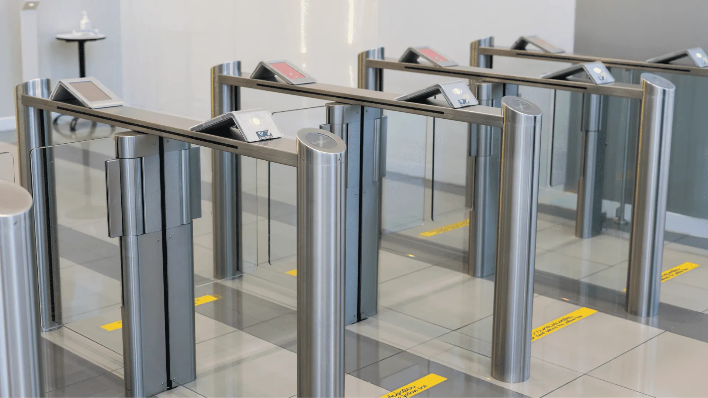
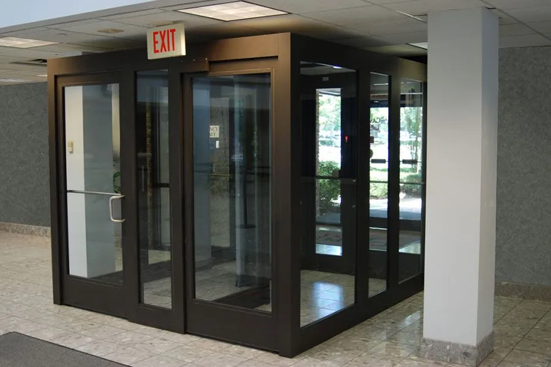
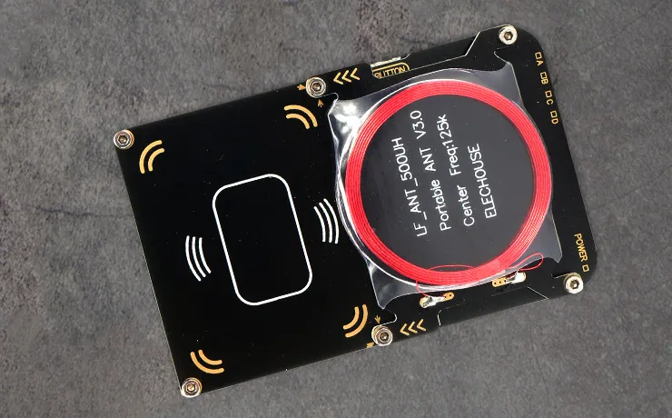
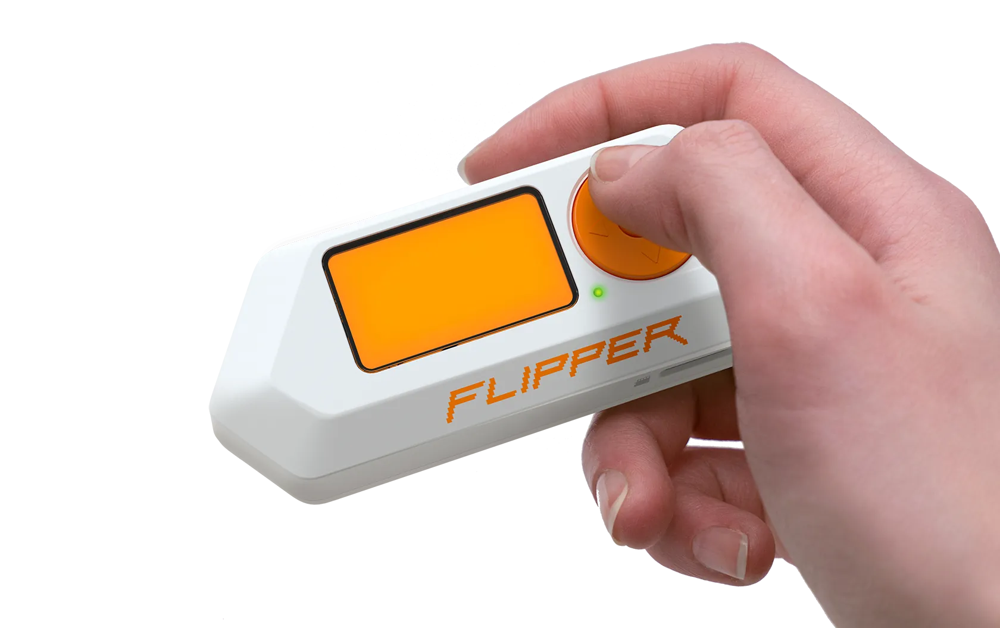
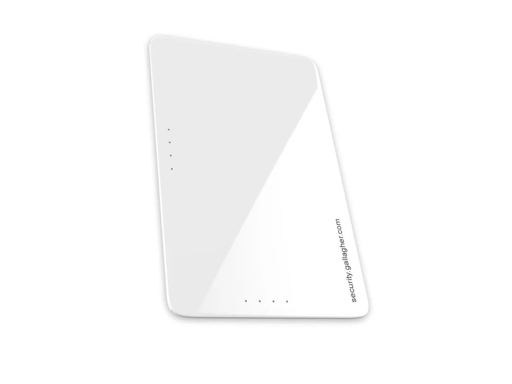

# Sosyal Mühendislik ile Fiziksel Sızma ve Red Team Operasyonları

Kurumsal güvenlik mimarisinde en ileri teknolojik kontroller bile, insan faktörü nedeniyle etkisiz kalabilir. Pinkerton'ın penetrasyon testi verilerine göre fiziksel sızma testlerinin yaklaşık **%80'i insan unsuruna bağlı olarak başarılı** olmakta; yalnızca %8'i etkisiz güvenlik önlemlerinden kaynaklanmaktadır. Bu veri, fiziksel güvenliğin en zayıf halkasının teknoloji değil, personel olduğunu açıkça ortaya koymaktadır.

Fiziksel güvenlik, kurumsal yapılarda **Savunma Derinliği** (Defense in Depth) stratejisinin en dış katmanını oluşturur; ancak bu katman çoğu zaman teknoloji değil, insan faktörü nedeniyle ihlal edilir. Sosyal mühendislik (SE) saldırıları, teknik kontroller ne kadar güçlü olursa olsun personelin psikolojik ve davranışsal zafiyetlerini — kibarlık, yardımseverlik, acele, otoriteye itaat — sömürerek yetkisiz fiziksel erişim sağlar.

Red Team operasyonları, bu tehdidi NIST SP 800-53, ISO 27001 ve CIS Controls ile uyumlu, gerçekçi tatbikatlarla test eder; mavi takım (SOC) ise tespit, korelasyon ve müdahale yeteneğini olgunlaştırır. Modern bilgi güvenliği mimarilerinde mantıksal ve ağ seviyesindeki güvenlik önlemleri ne kadar gelişmiş olursa olsun, fiziksel çevre korumasının yetersiz kaldığı senaryolarda tüm altyapının çökeceği gerçeği kabul edilmelidir. Veri merkezlerine, sistem odalarına ve Ar-Ge laboratuvarlarına yetkisiz fiziksel erişim sağlayan bir saldırgan; **cold boot** saldırıları düzenleyebilir, ağ anahtarlarına hardware tap yerleştirebilir veya yerel ağ üzerinden doğrudan sızma gerçekleştirebilir.

Bu bölümde kurumsal binalara fiziksel sızma yöntemleri, RFID/badging kopyalama araçları, güvenli geçiş kartı teknolojileri, Türkiye mevzuatı ve SOC entegrasyonu hem ofansif hem defansif perspektiften ele alınmaktadır.

---

## §2.3.1. Kurumsal Binalara Fiziksel Sızma Yöntemleri

Fiziksel penetrasyon testleri (Physical Penetration Testing), saldırganların gerçek dünyada kullandığı teknikleri simüle eder. Bu testler yalnızca kilit açma ve güvenlik sistemlerini bypass etmekten ibaret değildir; operasyonun büyük bir kısmı sosyal mühendislik taktiklerine dayanır.

:::caution
Fiziksel sızma testleri yalnızca yazılı **Rules of Engagement (RoE)** — Angajman Kuralları — belgesiyle gerçekleştirilmelidir. RoE olmaksızın yapılan testler yerel ceza kanunları kapsamında suç teşkil eder; yetkisiz testler hem hukuki ve cezai sorumluluk doğurur hem de kurumun güvenlik duruşuna ilişkin yanlış sonuçlara yol açar. RoE belgesinde kapsam, saatler, yöntemler, iletişim prosedürleri ve acil durum kodları açıkça tanımlanmalıdır.
:::

### Saldırı Vektörleri Özeti

| Saldırı Vektörü | Temel Hedef ve Psikolojik Tetikleyici | Operasyonel Senaryo ve Gerçekleştirme Biçimi |
| :---- | :---- | :---- |
| **Tailgating** | Sosyal uyum, dikkat dağınıklığı, turnike/kapı mekaniği sınırları | Saldırgan, elinde ağır kurumsal kargo kolileri veya kahve tepsileri taşıyan bir teslimatçı kılığına girer. Kartını okutup turnikeden geçen personelin hemen arkasından, turnike mekanizmasının kapanma süresi dolmadan içeri sızar |
| **Piggybacking** | Yardımseverlik, nezaket güdüsü, sosyal baskı | Saldırgan, kapı önünde "Kartımı ofiste unuttum" veya "Geçici kartım aktif edilmemiş" gibi bahaneler üretir. Yetkili personel nezaket göstererek kendi kartını okutup saldırganın da geçmesine izin verir |
| **Pretexting** | Otoriteye itaat, resmiyet algısı, güven oluşturma | Saldırgan, taşeron temizlik firmasının üniformasını giyer veya yangın sistemleri teknisyeni kimliğine bürünür. Sahte kimlik kartları ve profesyonel ekipman çantalarıyla resepsiyondaki personeli ikna ederek refakatsiz geçiş hakkı kazanır |
| **Baiting** | Merak, açgözlülük, yardım etme arzusu | "Yönetim Kurulu Maaş Planlaması Q3" veya "Gizli Ar-Ge Şemaları" yazılı, içine BadUSB veya Rubber Ducky gömülmüş USB bellekler otopark, dinlenme alanları veya tuvaletlere bırakılır |
| **Reverse Social Engineering** | Sorun çözücü güvenilirliği, muhtaçlık ilişkisi | Saldırgan önce bir yazıcının kablosunu çıkararak veya ağ anahtarındaki bir portu devre dışı bırakarak hafif bir teknik sorun yaratır. Kısa süre sonra "tesadüfen" oradan geçen bir IT destek elemanı olarak ortaya çıkar, sorunu çözer ve kritik sistemlere refakatsiz erişim izni alır |

### Tailgating ve Piggybacking

**Tailgating** (kuyruk takibi), yetkili bir kişinin hemen arkasından turnike veya kapıdan sızmadır. Saldırgan genellikle meşgul görünür — koli, kutu, kahve tepsisi taşır — ve "kapıyı tutar mısınız?" veya "acelem var" diyerek sosyal normu istismar eder. **Piggybacking** ise tailgating'ten farklı olarak mağdurun sızma girişiminden haberdar olduğu; ancak kibarlık, yardımseverlik veya aciliyet güdüsüyle kapıyı tuttuğu varyanttır.

**Mimari konumlandırma ve operasyonel etki:** Bu vektör, PACS'in (Physical Access Control System) en dış katmanını — perimeter entry / lobby turnikeleri — hedef alır. Modern turnikelerde anti-tailgating sensörleri (IR beam, weight sensor, 3D video analytics) yoksa veya devre dışıysa, tek bir geçerli kartla birden fazla kişi içeri girebilir. İç zonlara (ofis katları, server room, data center) ulaşmak için zincirleme kullanılır: önce lobby'den tailgate, sonra iç kapılarda pretexting veya cloned badge ile ilerleme.



**Canlı senaryo örnekleri (Red Team tatbikatı):**

- **Sabah 08:40 – Yoğun giriş saati (İstanbul merkez holding binası):** Red Team operatörü kırmızı kurye çantası ve şirket logosu taşıyan yelek ile "Acil teslimat, 3. kat" diyerek giriş turnikesinde kapıyı tutan çalışanı takip eder. Anti-tailgating sensörü yoksa veya alarm bastırılmışsa tespit edilmez. SOC'a iletilen PACS logunda yalnızca tek kart kaydı görünür.
- **Öğle 12:15 – Teslimat kılığı:** İki operatörden biri "koli" taşır, diğeri "yardımcı" rolünde kapıyı tutturur. CCTV operatörü meşgulse veya guard rutin kontrol yapmıyorsa başarı oranı yükselir.
- **Akşam 19:30 – Mesai sonrası:** Temizlik firması üniforması (önceden OSINT ile firma adı ve vardiya saati öğrenilmiş) ile "acil temizlik" pretext'iyle giriş. Personel "zaten biliyoruz" diyerek sorgusuz içeri alır.

Rapid7'nin bir ilaç firmasında gerçekleştirdiği fiziksel sosyal mühendislik testinde, test ekibi bir çalışanın ardından tailgating yaparak tesise girmiş; ardından birden fazla katı yine tailgating yöntemiyle dolaşarak geçerli bir RFID kartı olmadan ofis içinde hareket edebilmiştir.

**Savunma katmanları (Defense in Depth):**

- **Politika ve eğitim:** "Kapı tutma" kuralı, zorunlu escort politikası, ziyaretçi yönetimi (geçici badge + expiry + fotoğraf). Düzenli SE farkındalık eğitimleri ve simüle tailgating tatbikatları.
- **Teknik kontroller:** Mantrap/vestibül (NIST SP 800-53 PE-3(8) enhancement), turnike + anti-tailgating sensörleri + AI video analytics (tailgate detection, multiple persons/single credential).
- **İzleme ve korelasyon:** PACS logları + CCTV timestamp + AI alert'leri SIEM'e iletilir. "Aynı kapıdan 5 saniye arayla iki hareket – tek kart" kuralı yüksek öncelikli alert üretir.



### Sosyal Mühendislik Döngüsü ve Senaryolar

Sosyal mühendislik döngüsü dört aşamadan oluşur:

1. **Bilgi Toplama ve Gözetleme (Information Gathering & Surveillance):** OSINT yoluyla çalışan isimleri, unvanları, e-posta adresleri, güvenlik kartı görselleri toplanır. Bina planları, güvenlik görevlisi vardiyaları ve yoğun giriş-çıkış saatleri fiziksel keşifle tespit edilir.
2. **Rapport Kurma (Building Rapport):** Toplanan bilgilerle saldırgan güvenilir bir kişi gibi davranarak hedefle ilişki kurar.
3. **Bilgi veya Eylem Talebi:** Güven tesis edildikten sonra hedef hassas bilgi vermeye veya bir eylem gerçekleştirmeye manipüle edilir.
4. **Sonuç:** Hedef tuzağa düşerse saldırgan amacına ulaşır.

#### Pretexting (Bahane Üretme)

Saldırgan sahte kimlik, üniforma veya iş emriyle — IT destek, yangın müfettişi, HVAC teknisyeni, temizlik personeli — kendini tanıtır. Reconnaissance (LinkedIn, şirket web sitesi, ziyaretçi politikası) kritik öneme sahiptir. Oneconsult'un Physical Access Assessment hizmetinde kullanılan yöntemler arasında tailgating, piggybacking, priming ve elicitation gibi taktiklerin yanı sıra **ses emülasyonu ve deepfake teknolojileri** de yer almaktadır.

#### Baiting (Yemleme)

USB bellekler veya CD'ler otopark, lobi veya ortak alanlara bırakılır; meraklanan çalışan bunları iş bilgisayarına takar ve kötü amaçlı yazılımın kurumsal ağa sızması sağlanır. Ardından lateral movement ile cyber kill chain tamamlanır.

#### Reverse Social Engineering (Ters Sosyal Mühendislik)

Saldırgan önce küçük bir teknik arıza yaratır (örneğin bir yazıcıyı bloke eder veya asansör sorunu simüle eder), ardından bu arızayı çözen uzman olarak karşısına çıkar ve yetkili personelin güvenini kazanarak hassas alanlara erişim elde eder.

**Red Team uygulaması:** Multi-operator, phased approach (recon → entry → objective). Her zaman RoE'ye sadık kalınır. Başarılı sızma sonrası "plant" (USB drop veya rogue device) yapılarak cyber kill chain tamamlanır.

**Savunma:** Tüm ziyaretçiler için zorunlu kayıt + kimlik doğrulama, USB policy (DLP + endpoint control), "şüpheli durumda IT/Security'yi ara" kültürü. SIEM kuralları ile "bilinmeyen cihaz USB takma" + fiziksel erişim korelasyonu.

### Saldırı Zinciri ve MITRE ATT&CK Perspektifi

Fiziksel sızma operasyonları, MITRE ATT&CK çerçevesinde **Initial Access (TA0001)** taktiği altında değerlendirilir. Özellikle **Hardware Additions (T1200)** tekniği, fiziksel erişim sonrası ağa kötü amaçlı donanım eklenmesini kapsar.

| MITRE ATT&CK Öğesi | Kimlik | Açıklama |
| :---- | :---- | :---- |
| Taktik | TA0001 – Initial Access | Saldırganın hedef ağa veya sisteme ilk erişimini elde etmesi |
| Teknik | T1200 – Hardware Additions | Fiziksel erişim sonrası rogue cihaz, hardware tap veya kötü amaçlı USB yerleştirme |
| İlişkili Teknikler | T1078 – Valid Accounts | Klonlanmış veya ele geçirilmiş geçiş kartı ile yetkili erişim |
| İlişkili Teknikler | T1091 – Replication Through Removable Media | Baiting ile USB üzerinden malware bulaştırma |

Rapid7 testinde, test ekibi tailgating ile konferans odasına eriştikten sonra ağa laptop bağlayarak **Responder.py** ile LLMNR/NBNS zehirleme saldırısı gerçekleştirmiş; çok sayıda çalışanın kullanıcı adı ve parola hash'lerini toplamıştır. Bu senaryo, fiziksel erişimin siber saldırıya nasıl dönüştüğünü açıkça göstermektedir.

**Savunma önerileri:**

- Fiziksel erişim sonrası ağa erişim engellenmelidir: **802.1X** port tabanlı kimlik doğrulama ve **NAC** (Network Access Control) zorunlu tutulmalıdır.
- Konferans odaları ve ortak alanlardaki ağ portları varsayılan olarak devre dışı bırakılmalıdır.
- LLMNR/NBNS protokolleri kurumsal ağlarda kapatılmalıdır.

---

## §2.3.2. RFID/Badging Kopyalama ve Güvenli Kart Teknolojileri

Kurumsal PACS'lerde kullanılan RFID kartlar zayıf yapılandırıldığında veya güvensiz teknolojiler kullanıldığında kolayca kopyalanabilir. Geçiş kontrol sistemlerinde kullanılan kart teknolojileri, fiziksel güvenliğin temel kimlik doğrulama katmanıdır; ancak eski nesil kartlardaki zayıf tasarımlar, saldırganların bu kartları saniyeler içinde kopyalamasına olanak tanımaktadır.

### Saldırı Araçları: Proxmark3 ve Flipper Zero

#### Proxmark3

Proxmark3, profesyonel RFID/NFC kart okuyucu/yazıcı cihazdır. 125 kHz (EM4100, HID Prox) ve 13.56 MHz (Mifare Classic, DESFire) frekanslarında çalışır. Proxmark3 RDV4, uzun menzilli anten ile **133 mm'ye kadar** mesafeden kart klonlaması yapabilmektedir. Donanımsal FPGA mimarisi sayesinde Hard-nested ve Darkside saldırılarını bağımsız yürütebilir.



**Örnek Proxmark3 komutları (yalnızca yetkili testlerde):**

```bash
# LF HID Prox okuma
lf hid read

# LF EM4100 okuma ve klonlama
lf em 410x read
lf em 410x clone --id <hedef_uid>

# HF anten ayarı ve sinyal kararlılığı kontrolü
hf tune
hf 14a reader

# Mifare Classic autopwn (anahtar çıkarma)
hf mifare autopwn

# Mifare Classic hardnested saldırısı (EV1 kartlar için)
hf mifare hardnested --blk 0 -k <bilinen_anahtar>

# DESFire bilgi ve sniff (güvenli kartlarda sınırlı)
hf desfire info
hf desfire sniff
```

:::caution
**Mifare Classic Açığı:** Milyonlarca tesiste kullanılmaya devam eden Mifare Classic kartlar, tescilli ve gizli tutulan **CRYPTO1** akış şifreleme algoritmasını kullanır. Güvenliğini gizlilik esasına (security by obscurity) dayandıran bu algoritma tersine mühendislikle tamamen deşifre edilmiştir. Proxmark3 ile bir Mifare Classic 1K kartın tam klonlanması birkaç dakika içinde mümkündür. iCOPY-X gibi kullanıcı dostu cihazlar 32 anahtar bloğunu saniyeler içinde çıkarıp hedef karta aktarabilmektedir. **Mifare Classic kullanan sistemler ivedilikle DESFire EV2/EV3 veya eşdeğer güvenli teknolojilere yükseltilmelidir.**
:::

**CRYPTO1 saldırı tipleri:**

| Saldırı | Ön Koşul | Süre / Etki |
| :---- | :---- | :---- |
| **MFCUK (Darkside)** | Hiçbir sektör anahtarı bilinmiyor | PRNG zayıflıkları ve hatalı parite yanıtları analiz edilerek en az bir sektör anahtarı elde edilir |
| **MFOC (Nested)** | En az bir sektör anahtarı biliniyor | Saniyeler içinde tüm sektör anahtarları ele geçirilir |
| **Hard-nested** | MIFARE Classic EV1 (iyileştirilmiş PRNG) | 1600–2200 şifreli oturum ile en zorlu anahtarlar kırılabilir |
| **Static Nested** | Uyumlu klon kartlardaki backdoor | Ön koşul olmaksızın tüm anahtarlar birkaç dakikada deşifre edilir |

#### Flipper Zero

Flipper Zero, taşınabilir çok amaçlı güvenlik test cihazıdır. 125 kHz EM kartları okuyup kopyalayabilir; Sub-GHz, NFC, IR ve Bluetooth sinyallerini test edebilir. Red Team saha operasyonları için idealdir; ancak gelişmiş kripto saldırıları için yetersiz kalır.



**Unleashed Firmware:** Flipper Zero'un yeteneklerini genişleten bu özel yazılım, BadUSB script'leri, Sub-GHz analizörü, NFC eklentileri ve kısıtlamaları kaldıran ek özellikler sunar.

#### HID Prox ve Brute Force Saldırıları

HID Prox gibi düşük frekanslı, şifreleme kullanmayan kartlar **düz metin (plaintext)** olarak tesis kodu ve kart numarası iletir. Bir Red Team operasyonunda saldırgan, temizlik kartı ve düşük güvenlik seviyesindeki bir çalışan kartını klonladıktan sonra kart ID'lerinin ardışık olduğunu fark ederek **brute force** saldırısıyla sunucu odası erişim kartını bulmuştur.

### Proxmark3 vs Flipper Zero Karşılaştırması

| Özellik / Kriter | Proxmark3 (Professional / RDV4) | Flipper Zero |
| :---- | :---- | :---- |
| **Çalışma Frekansları** | 125 kHz (LF) ve 13.56 MHz (HF) | 125 kHz, 13.56 MHz, Sub-GHz, NFC, IR, Bluetooth, GPIO |
| **Kriptografik Kırma Kapasitesi** | Son derece yüksek; FPGA mimarisi ile Hard-nested ve Darkside saldırılarını bağımsız yürütebilir | Düşük; gelişmiş kripto analizleri için FPGA yok. Basit okuma, simülasyon ve bilinen anahtarlarla yazma |
| **Mifare Classic** | `hf mifare autopwn` ile tam klonlama (dakikalar) | Sınırlı destek; gelişmiş kripto saldırıları için yetersiz |
| **DESFire EV2/EV3** | Sniffing mümkün; tam klonlama pratikte imkânsız | Tam klonlama yapamaz; recon ve hızlı LF kopyalama aracı |
| **Donanımsal Sınırlamalar** | Easy modelinin 256K flash versiyonları Hard-nested için yetersiz; 512K AVR modelleri şart | Sınırlı RFID anten gücü; kartın cihaza tam temas ve 15 saniyeye kadar bekleme gerekebilir |
| **Anten ve Menzil** | RDV4 ile 133 mm'ye kadar uzaktan okuma; `hf tune` ile sinyal optimizasyonu | Kompakt anten; tam temas ve doğru açı gerekir |
| **Saha Kullanımı** | Profesyonel penetrasyon testleri, kripto analiz laboratuvarı | Hızlı saha operasyonları, tailgating ile birleştirilmiş LF kopyalama |
| **Maliyet / Erişilebilirlik** | Daha yüksek maliyet, uzman bilgi gerektirir | Daha düşük maliyet, daha geniş erişilebilirlik |

**Saldırgan senaryosu:** Red Team, legacy Mifare Classic kartı Proxmark3 ile ofis içinde 5–10 dakikada kopyalar → mesai dışı saatlerde dener. Veya Flipper ile hızlı LF kopyası alıp tailgating ile birleştirir.

### Güvenli Geçiş Kartı Teknolojileri

#### MIFARE DESFire EV2 / EV3

MIFARE DESFire EV3 (NXP), günümüzde piyasadaki **en güvenli NFC etiketleri** arasında kabul edilmektedir. AES-128 donanım kriptosu, karşılıklı üç geçişli kimlik doğrulama (mutual three-pass authentication – ISO/IEC 7816-4), esnek anahtar yönetimi ve Common Criteria **EAL5+** (HW+SW) sertifikası ile tasarlanmıştır.



**Kritik güvenlik özellikleri:**

- **AES-128 Şifreleme:** Tüm işlemler 128-bit AES ile uçtan uca şifrelenir.
- **AuthenticateEV2First:** Kart ve okuyucu arasında AES-CBC ile şifrelenmiş el sıkışma gerçekleştirilir. Kart, okuyucuya şifrelenmiş rastgele sayı (RndB) gönderir; okuyucu doğru yanıt üretemediği takdirde oturum sonlandırılır.
- **Anahtar çeşitlendirme (diversified keys):** UID'den türetilen anahtarlar → kopyalanmış kart mutual authentication'da başarısız olur.
- **Secure Messaging:** Plain, MAC korumalı ve şifreli iletişim modları.
- **Rastgele UID ve SUN (Secure Unique NFC):** Her okumada benzersiz kod üretir → anti-cloning.
- **Proximity Check:** Relay attack önleme.
- **Originality Check:** ECC imza ile orijinallik doğrulama.
- **Oturum anahtarı türetimi (KDF):** NIST SP 800-108 standardına uygun Counter Mode ve CMAC ile geçici oturum anahtarları türetilir; replay ve MitM saldırıları engellenir.

**Üç Adımlı Karşılıklı Kimlik Doğrulama (Mutual 3-Pass Authentication):**

1. **Oturum Başlatma:** Okuyucu (PCD), karta (PICC) belirli bir uygulama anahtarı numarasıyla kimlik doğrulama isteği gönderir (0x71 APDU).
2. **Kart Yanıtı (Adım 1):** Kart, 16-baytlık kriptografik olarak güvenli rastgele sayı (RndB) üretir ve AES-CBC-128 ile şifreleyerek okuyucuya iletir.
3. **Okuyucu Doğrulaması (Adım 2):** Okuyucu RndB'yi deşifre eder, 1 bayt sola kaydırarak RndB' oluşturur; kendi RndA'sını üretir ve ikisini birleştirip şifreleyerek karta gönderir (0xAF APDU).
4. **Kart Doğrulaması (Adım 3):** Kart, RndB'nin kaydırılmış halini teyit ederek okuyucunun meşruiyetini doğrular; RndA'yı kaydırıp şifreleyerek okuyucuya gönderir. Gizli anahtar hiçbir zaman havaya maruz kalmaz.

EV1'de bazı saldırılar raporlanmış olsa da EV2/EV3, doğru implementasyonla Proxmark3/Flipper Zero ile saha klonlamasına karşı son derece dirençlidir.

#### HID SEOS (Secure Identity Object)

HID Global'in SEOS teknolojisi, kimlik verilerini kartın ham sektörlerinde saklamak yerine, ISO/IEC 14443 standartlarına dayalı şifrelenmiş ve dijital olarak imzalanmış **Secure Identity Object (SIO)** içinde barındırır.

**Mimari avantajları:**

- **Privacy Mode:** Statik ve izlenebilir UID yayınlamaz; her okuma seansında kimlik tanımlayıcıları şifrelenir.
- **Çoklu form faktörü:** Plastik kart, akıllı telefon (NFC/Bluetooth) ve giyilebilir cihazlarda aynı güvenlik standardı.
- **TÜV SEAL-5 sertifikasyonu:** Yaşam döngüsü yönetimi, güvenli anahtar dağıtımı ve donanımsal sızıntı korumaları en yüksek IT güvenlik seviyesinde.

#### Çok Katmanlı Doğrulama (MFA)

Tek başına kart bazlı erişim yeterli değildir. **Kart + PIN** kombinasyonu veya **kart + biyometrik** (iris tarama gibi erişim kontrolü amaçlı biyometri) zorunlu tutulmalıdır. NIST SP 800-53, PE-3 kontrolü kapsamında fiziksel erişim yetkilendirmelerinin uygulanmasını ve kamuya açık alanlarda kamera, gözetleme gibi güvenlik önlemlerinin alınmasını önermektedir.

### Okuyucu ↔ Kontrolcü İletişimi: Wiegand vs OSDP

| Özellik | Wiegand (Legacy) | OSDP Secure Channel (Modern) |
| :---- | :---- | :---- |
| **Şifreleme** | Yok (plaintext) | AES-128 |
| **Replay / Tamper** | Kolay — sinyal sniff ve replay mümkün | Önlenir — secure channel ve supervision |
| **Çift yönlü iletişim** | Yok (tek yönlü) | Var (gerçek zamanlı yönetim, firmware update) |
| **Tamper & Supervision** | Yok | Var (okuyucü kapağı açılma, kablo kesilme alarmı) |
| **Standart** | 1980'ler, tescilli | IEC 60839-11-5, açık standart |
| **Mesafe** | Kısa (yaklaşık 150 m) | Daha uzun, RS-485 tabanlı |
| **Tavsiye** | Hemen terk edin | Yeni kurulum ve migration için standart |

Wiegand protokolü, okuyucü ile kontrol paneli arasında kart UID'sini şifrelenmeden iletir. Saldırgan, okuyucü ile panel arasındaki kabloya tap yaparak veya Proxmark3 ile sniff ederek kart verisini yakalayabilir ve T5577 veya magic card ile klonlayabilir. **OSDP Secure Channel** bu riski ortadan kaldırır.

**Mimari öneri – Defense in Depth:**

- **Kart:** DESFire EV3 veya HID SEOS / iCLASS Seos
- **Okuyucü ↔ Kontrolcü:** OSDP Secure Channel (AES-128 şifreli, çift yönlü, tamper detection)
- **Hassas zonlar:** Kart + PIN veya kart + biyometrik zorunlu
- **Provisioning:** PACS ↔ IAM/HR entegrasyonu (işten ayrılmada anında badge disable)
- **Segmentasyon:** PACS yönetim ağı ayrı VLAN'da, sıfır güven mimarisi

---

## Standartlar ve Türkiye Mevzuatı

Fiziksel güvenliğin tasarlanması ve işletilmesi süreçleri, hem uluslararası siber güvenlik çerçeveleriyle hem de Türkiye Cumhuriyeti'ndeki yasal düzenlemelerle doğrudan ilişkilidir.

### Uluslararası Standartlar ve Kontrol Eşleşmeleri

| Standart / Çerçeve | İlgili Kontroller | Uygulama Alanı |
| :---- | :---- | :---- |
| **NIST SP 800-53 Rev. 5** | PE-2 (Physical Access Authorizations), PE-3 (Physical Access Control), PE-6 (Monitoring Physical Access), IA-2, AU-2/3/6 | Fiziksel erişim yetkilendirmeleri, PACS, log tutma, audit events |
| **NIST SP 800-98** | RFID Sistemleri için Güvenlik Rehberi | RFID güvenlik riskleri ve mitigasyonları |
| **ISO/IEC 27001:2022** | Annex A 7.1–7.3 (Physical Security), A.11.1–A.11.2 | Fiziksel güvenlik çevreleri, giriş kontrolleri, ziyaretçi yönetimi |
| **CIS Controls v8.1** | Control 6 (Access Control Management), Control 14 (Security Awareness) | Erişim kimlik bilgileri yönetimi, sosyal mühendislik farkındalık eğitimi |
| **MITRE ATT&CK** | TA0001 (Initial Access), T1200 (Hardware Additions) | Fiziksel erişim ve donanım ekleme teknikleri |

**NIST SP 800-53 PE ailesi** tesislerin kritik noktalarına yapılan tüm girişlerin doğrulanabilir kimlikler üzerinden kayıt altına alınmasını, yetkisiz geçiş denemelerinin anında alarm üretmesini ve bu verilerin mantıksal ağ loglarıyla ilişkilendirilmesini zorunlu kılar.

**ISO/IEC 27001 Annex A (Kontrol A.11):** Fiziksel ve çevresel güvenlik sınırlarının belirlenmesini, fiziksel giriş kontrollerinin uygulanmasını, ofislerin ve odaların güvenliğini şart koşar. Tesislerin ve hassas alanların giriş loglarının tutulması ve periyodik olarak incelenmesi bu standardın temel gereksinimlerindendir.

### Türkiye Mevzuatı

#### KVKK (6698 Sayılı Kişisel Verilerin Korunması Kanunu)

Kişisel veri içeren fiziksel ortamlara giriş-çıkışların kontrol altına alınması, bu ortamların güvenlik kamerası ile izlenmesi ve erişim kayıtlarının tutulması zorunludur. Geçiş kontrol sistemlerinden elde edilen biyometrik veriler ve erişim logları, KVKK kapsamında **özel nitelikli kişisel veri** olarak değerlendirilir ve ek koruma önlemleri gerektirir.

KVKK Madde 12 teknik ve idari tedbir yükümlülüğü, fiziksel erişim kayıtlarının (kişisel veri niteliğindeki loglar) korunmasını, erişim kontrolünü ve saklama sürelerini zorunlu kılar. Erişim logları kişisel veridir; teknik tedbirler (erişim kontrolü, log koruma, şifreleme), idari tedbirler (politika, eğitim), saklama süreleri ve VERBİS yükümlülüğü geçerlidir.

#### KVKK 2026/921 Sayılı İlke Kararı — Biyometrik Mesai Takibi

Kişisel Verileri Koruma Kurulu'nun **29.04.2026 tarihli ve 2026/921 sayılı İlke Kararı** uyarınca, çalışanların mesai takibi (PDKS) amacıyla parmak izi, yüz tanıma, el geometrisi, iris veya retina gibi biyometrik verilerinin işlenmesi, çalışanın **açık rızası alınmış olsa dahi** ölçülülük, gereklilik ve veri minimizasyonu ilkelerine aykırıdır.

| Konu | 2026/921 Kararı Gerekliliği |
| :---- | :---- |
| **Mesai takibi amacı** | Parmak izi, yüz tanıma, el geometrisi, iris, retina → **yasak** (rıza dahi olsa) |
| **Alternatif yöntemler** | Şifreli kart, PIN veya RFID tabanlı kart sistemleri → **zorunlu** |
| **Erişim kontrolü amaçlı biyometri** | Farklı amaç; ayrı değerlendirme gerekir ancak mesai takibi ile birleştirilmemeli |
| **Uzaktan erişim** | Biyometrik verilere uzaktan erişim zorunluysa en az iki kademeli doğrulama (MFA) |
| **Personel ayrılışı** | Ayrılan personelin yetkileri derhal kaldırılmalı |
| **Log saklama** | Geçmiş kapı geçiş logları en az **2 yıl** süreyle saklanmalı |

Biyometrik verilerin geri döndürülemez ve taklit edilemez niteliği nedeniyle, mesai takibi amacıyla bu yöntemlerin kullanılması yasal bir zorunluluk haline getirilmiştir. Kurumlar, PDKS sistemlerini DESFire EV3 + PIN veya benzeri daha az müdahaleci alternatiflere geçirmelidir.

#### CCTV (Kamera Kayıt) Muhafaza Süreleri

CCTV kamera kayıtlarının muhafaza süresi, KVKK'nın "amaçla sınırlılık" ilkesi kapsamında belirlenmelidir. Genel kurumsal binalarda CCTV kayıtlarının **15 ila 30 gün** arasında tutulması genel teamül olarak makul kabul edilirken, bu sürenin ardından kayıtların üzerine otomatik olarak yazılması (overwrite) teknik olarak tanımlanmalı ve imha politikası belgelerine eklenmelidir. Bankalar ve finansal kuruluşlar için BDDK/özel mevzuatlar gereği bu sürelerin daha uzun tutulması zorunlu kılınabilir.

#### BDDK Siber Güvenlik Düzenlemeleri

Bankalar ve finans kuruluşları, fiziksel erişim kontrolleri dahil olmak üzere kapsamlı sızma testleri yapmakla yükümlüdür. Bilgi Sistemleri Yönetmeliği Madde 17, kritik bilgi sistemleri için fiziksel engeller, giriş kontrolleri ve yetki gözden geçirmelerini şart koşar.

**Sistem odası standartları:**

- Yedekli enerji hattı, sıcaklık, nem ve duman takibi
- Jeneratör ve UPS bakımlarının periyodik raporlanması
- Sistem odası kapıları yalnızca çift katmanlı doğrulama (kart + PIN veya kart + yetkili personel refakati) ile açılmalı
- Tüm erişim olayları saniye hassasiyetinde merkezi log sunucusuna iletilmeli

#### 5651 Sayılı Kanun ve Zaman Damgası Entegrasyonu

5651 sayılı Kanun, internet ortamında işlenen suçların önlenmesi ve tespiti için loglama yükümlülükleri getirir. Erişim kontrol sistemlerine ait syslog kayıtlarının ve geçiş olaylarının bütünlüğü, olası bir adli soruşturmada delil niteliği taşıması açısından **zaman damgasıyla imzalanmalıdır**. Altyapıdaki tüm PACS kontrol panelleri, kameralar ve SIEM sunucuları ortak bir NTP sunucusu üzerinden senkronize edilmeli; logların zaman damgası tutarlılığı garanti altına alınmalıdır.

---

## Savunma Stratejileri ve SOC Entegrasyonu

Bir fiziksel sızma girişiminin veya klon kart kullanımının gerçek zamanlı tespiti, Fiziksel Erişim Kontrol Sisteminin (PACS) merkezi Güvenlik Operasyon Merkezi (SOC) ve SIEM altyapısına entegre edilmesiyle mümkündür. Sosyal mühendislik ve RFID kopyalama, tek başına değil **katmanlı savunma** ile etkisiz hale getirilir.

### Teknik Kontroller

1. **Geçiş Kartı Altyapısının Güçlendirilmesi:**
   - Tüm Mifare Classic ve 125 kHz HID Prox kartlar ivedilikle DESFire EV2/EV3 veya SEOS'a yükseltilmelidir.
   - Wiegand protokolünden OSDP Secure Channel'a geçiş tamamlanmalıdır.
   - Kart + PIN veya kart + biyometrik çok faktörlü doğrulama zorunlu kılınmalıdır.

2. **Ağ Tabanlı Tespit:**
   - Tüm geçiş olayları (başarılı/başarısız denemeler) SIEM sistemine iletilmelidir.
   - Mesai dışı saatlerdeki erişim denemeleri, ardışık başarısız denemeler ve anormal geçiş paternleri için anında uyarı kuralları oluşturulmalıdır.
   - Fiziksel erişim sonrası ağa erişim engellenmelidir: 802.1X ve NAC zorunlu tutulmalıdır.

3. **Video Analitiği:**
   - Geçiş noktalarında AI destekli video analizi entegre edilmelidir.
   - Tailgate detection, multiple persons/single credential ve anormallik tespiti.
   - PACS logları ile CCTV timestamp korelasyonu.

4. **Kart Yaşam Döngüsü Yönetimi:**
   - PACS ↔ IAM/HR entegrasyonu ile işten ayrılmada anında badge disable.
   - Periyodik yetki gözden geçirmesi (access review).
   - Kayıp/çalıntı kart bildiriminde anında blacklist.

### İdari ve Prosedürel Kontroller

1. **Personel Farkındalık Eğitimi:**
   - Düzenli sosyal mühendislik farkındalık eğitimi; NIST SP 800-50 ve SP 800-16 rehberliğinde programlar.
   - Tailgating riskine karşı "kapıyı tanımadığın kişiye tutma" politikası.
   - Şüpheli fiziksel hareketlerin raporlanması için kurumsal süreç.

2. **Ziyaretçi Yönetimi:**
   - Tüm ziyaretçiler önceden onaylanmalı, girişte kimlik doğrulaması yapılmalı ve refakatçi eşliğinde hareket etmelidir.
   - Geçici badge + expiry + fotoğraf zorunluluğu.

3. **Red Team Tatbikatları:**
   - Yılda en az bir kez kapsamlı fiziksel sızma testi gerçekleştirilmelidir.
   - Testler yalnızca yazılı RoE ile; sonuçlar PDCA döngüsüne entegre edilmelidir.

### PACS Log Formatı ve SIEM Entegrasyonu

PACS kontrol üniteleri ve yönetim sunucuları (Lenel OnGuard, Honeywell Pro-Watch vb.), geçiş hareketlerini, kapı açık kalma alarmlarını ve zorlama (duress) kodlarını Syslog protokolü üzerinden dışarı aktarabilir.

**Örnek normalize edilmiş PACS log formatı (JSON):**

```json
{
  "timestamp": "2026-06-17T14:23:45+03:00",
  "event_type": "access_attempt",
  "card_id": "A4B3C2D1E5F6",
  "card_type": "MIFARE_DESFire_EV3",
  "reader_id": "RD-07-B1",
  "location": "DataCenter_Entrance",
  "gate": "Gate_Sistem_Odasi",
  "result": "granted",
  "auth_method": "card_pin",
  "employee_id": "E-4521",
  "employee_name": "ahmet.yilmaz",
  "department": "ResearchAndDev",
  "direction": "entry",
  "video_reference": "CAM-12_FRAME-887234",
  "geo_lat": 41.0082,
  "geo_lon": 28.9784,
  "source": "PHYSICAL"
}
```

**Olay müdahale senaryosu:**

- Mesai saatleri dışında (22:00–06:00) sunucu odasına yapılan her erişim **kritik** olarak etiketlenmeli ve SOC ekibine anında bildirim gönderilmelidir.
- Aynı kart ID'si ile 5 dakika içinde 3'ten fazla başarısız deneme tespit edildiğinde brute force saldırısı olarak değerlendirilmeli ve ilgili kart otomatik olarak **blacklist**'e alınmalıdır.
- Aynı kapıdan 5 saniye arayla iki hareket – tek kart kaydı → tailgating alarmı.

### Wazuh SIEM Kuralları

PACS sunucusunun ürettiği ham log formatı:

```
Jun 10 14:23:45 pacs-srv01 PACS_EVENT: BADGE_ACCEPTED - User: ahmet.yilmaz - CardID: 94C20C2 - Gate: Gate_04_ArGe - Dept: ResearchAndDev
```

**Dekoder yapılandırması (`/var/ossec/etc/decoders/pacs_decoders.xml`):**

```xml
<decoder name="pacs-custom">
  <prematch>^PACS_EVENT: </prematch>
</decoder>

<decoder name="pacs-fields">
  <parent>pacs-custom</parent>
  <regex>^PACS_EVENT:\s+(\S+)\s+-\s+User:\s+(\S+)\s+-\s+CardID:\s+(\S+)\s+-\s+Gate:\s+(\S+)\s+-\s+Dept:\s+(\S+)</regex>
  <order>pacs_action, pacs_user, pacs_card_id, pacs_gate, pacs_dept</order>
</decoder>
```

**Güvenlik kuralları (`/var/ossec/etc/rules/local_rules.xml`):**

```xml
<group name="pacs,physical_security,">
  <!-- Temel Kural: Herhangi bir PACS Olayı -->
  <rule id="110100" level="0">
    <decoded_as>pacs-custom</decoded_as>
    <description>PACS: Geçiş kontrol sistemi olayı algılandı.</description>
  </rule>

  <!-- Şüpheli Durum: Reddedilen Geçiş Kartı -->
  <rule id="110101" level="5">
    <if_sid>110100</if_sid>
    <field name="pacs_action">BADGE_REJECTED</field>
    <description>PACS: Yetkisiz veya geçersiz kart geçiş denemesi reddedildi.</description>
    <group>access_control,pci_dss_10.2.4,</group>
  </rule>

  <!-- Kritik: Aynı Kapıda Arka Arkaya Başarısız Denemeler -->
  <rule id="110102" level="9">
    <if_sid>110101</if_sid>
    <frequency>3</frequency>
    <timeframe>60</timeframe>
    <description>PACS: Aynı geçiş noktasında 1 dakika içinde 3 kez geçersiz kart denendi! Olası klon denemesi veya kaba kuvvet saldırısı.</description>
    <group>reconnaissance,attack_pattern,</group>
  </rule>

  <!-- Kritik: Mesai Dışı Sistem Odası Erişimi -->
  <rule id="110103" level="8">
    <if_sid>110100</if_sid>
    <field name="pacs_action">BADGE_ACCEPTED</field>
    <field name="pacs_gate">Gate_Sistem_Odasi</field>
    <time>18:00 - 08:00</time>
    <description>PACS: Kritik sistem odasına mesai saatleri dışında fiziksel erişim sağlandı!</description>
    <group>security_anomaly,privilege_abuse,</group>
  </rule>

  <!-- Yüksek: Aynı UID'nin kısa sürede farklı kapılarda kullanımı -->
  <rule id="110104" level="10">
    <if_sid>110100</if_sid>
    <field name="pacs_action">BADGE_ACCEPTED</field>
    <same_field>pacs_card_id</same_field>
    <different_field>pacs_gate</different_field>
    <frequency>2</frequency>
    <timeframe>30</timeframe>
    <description>PACS: Aynı kart 30 saniye içinde farklı kapılarda kullanıldı! Olası kart klonlama veya paylaşım.</description>
    <group>impossible_travel,attack_pattern,</group>
  </rule>
</group>
```

**Wazuh Manager Syslog Listener yapılandırması (`/var/ossec/etc/ossec.conf`):**

```xml
<ossec_config>
  <remote>
    <connection>syslog</connection>
    <port>514</port>
    <protocol>tcp</protocol>
    <allowed-ips>192.168.20.10/32</allowed-ips>
    <local_ip>192.168.10.15</local_ip>
  </remote>
</ossec_config>
```

### Gelişmiş Tehdit Algılama: Impossible Travel Korelasyonu

**Impossible Travel** (İmkansız Seyahat) analitiği, fiziksel güvenlik ile mantıksal (siber) güvenliği birleştiren en gelişmiş korelasyon senaryolarından biridir. Aynı kullanıcı hesabının fiziksel olarak seyahat edilmesi imkansız olan iki farklı coğrafi konumdan çok kısa zaman aralıklarıyla hem fiziksel geçiş kartını kullanmasını hem de mantıksal ağda (VPN, Cloud Portal vb.) oturum açmasını tespit etmeyi amaçlar.

**Tespit pipeline aşamaları:**

1. **Olay çiftlerinin oluşturulması:** Başarılı fiziksel kart geçiş olayları (PACS) ile VPN/bulut portalı bağlantı olayları kullanıcı adı bazında gruplanır.
2. **Örtük hızın hesaplanması:** İki olay arasındaki coğrafi mesafe (km) ve zaman farkı (saat) hesaplanır; teorik hız (km/saat) elde edilir.
3. **Fiziksel seyahat limitlerinin kontrolü:** Hesaplanan hız ticari uçak hızı limitlerini (örneğin saatte 800 km) aşarsa olay "fiziki olarak imkansız" kabul edilir.
4. **False positive süzgeci:** Uçak içi Wi-Fi, mobil hücresel ağlar ve kurumsal proxy/VPN IP'leri elenir.
5. **Risk puanlaması:** Coğrafi mesafe, zaman farkı ve kaynak çeşitliliğine göre dinamik risk skoru atanır.

**Örnek senaryo:** Bir saldırgan, Proxmark3 ile kopyaladığı RFID geçiş kartıyla Ankara'daki Ar-Ge merkezine fiziksel olarak giriş yaptığı sırada, aynı personelin kullanıcı hesabıyla İstanbul lokasyonlu kurumsal VPN sunucusundan başarılı kimlik doğrulaması gerçekleştirilirse, SOC analistlerinin ekranına anında en yüksek ciddiyet seviyesinde (Level 12) alarm düşer.

Wazuh'un stateless kural motoru, geçmiş olaylarla yeni olayları ilişkilendirmek için harici bir durum takibi veri katmanına (SQLite veritabanı + Python entegrasyon betiği) ihtiyaç duyar. Bu mimari, PACS ve VPN loglarını birleştirerek impossible travel tespitini mümkün kılar.

### Video Analytics Entegrasyonu

AI destekli video analitiği, PACS loglarıyla korelasyon için kritik bir katmandır:

| Analitik Türü | Tespit Edilen Olay | SIEM Korelasyonu |
| :---- | :---- | :---- |
| **Tailgate Detection** | Tek kartla birden fazla kişinin geçişi | PACS'ta tek BADGE_ACCEPTED + video'da 2+ kişi |
| **Loitering Detection** | Geçiş noktasında uzun süre bekleyen kişi | Mesai dışı saatlerde şüpheli davranış |
| **Object Left Behind** | Bırakılan paket veya cihaz | Baiting veya rogue device yerleştirme |
| **Facial Recognition** | Bilinmeyen yüz tespiti | Ziyaretçi kaydı olmayan kişi + başarılı geçiş |
| **Duress Detection** | Zorlama altında geçiş (PIN + alarm) | Anında SOC alarmı ve güvenlik müdahalesi |

**Korelasyon kuralı örneği:** PACS logunda `Gate_01_Lobby` kapısından `BADGE_ACCEPTED` olayı ile aynı timestamp'te video analytics'ten `TAILGATE_DETECTED` alert'i geldiğinde → Level 12 alarm, guard'a anlık yönlendirme, ilgili kart geçici olarak disable.

### Olay Müdahale Playbook'u

| Alarm Seviyesi | Olay Tipi | Müdahale Adımları |
| :---- | :---- | :---- |
| **Level 5** | Tek başarısız kart denemesi | Log kaydı; 3. denemede eskalasyon |
| **Level 8** | Mesai dışı kritik alan erişimi | SOC operatörü guard'a yönlendirme; CCTV canlı izleme |
| **Level 9** | Ardışık başarısız denemeler (brute force) | Kart blacklist; fiziksel müdahale |
| **Level 10** | Aynı kart, farklı kapılar (30 sn) | Kart disable; güvenlik ekibi alarm |
| **Level 12** | Impossible travel + tailgate korelasyonu | Tam güvenlik protokolü; incident response team |

---

## Sonuç

Kurumsal fiziksel güvenlik, teknolojik kontroller (şifreli geçiş kartları, biyometrik sistemler, SIEM entegrasyonu) ile insan odaklı kontrollerin (farkındalık eğitimi, prosedürler, Red Team tatbikatları) harmonik bir bütününü gerektirir. Fiziksel sınırların ve mantıksal varlıkların korunması, birbirinden izole süreçler olarak değil, birbirini tamamlayan koruma katmanları olarak tasarlanmalıdır.

**Stratejik aksiyonlar:**

| Öncelik | Aksiyon | Hedef |
| :---- | :---- | :---- |
| **Acil** | Mifare Classic ve HID Prox kartların DESFire EV3 / SEOS'a yükseltilmesi | Klonlama riskinin ortadan kaldırılması |
| **Acil** | Wiegand → OSDP Secure Channel migrasyonu | Okuyucü-panel iletişiminin şifrelenmesi |
| **Yüksek** | PACS loglarının SIEM'e entegrasyonu | Gerçek zamanlı tespit ve korelasyon |
| **Yüksek** | KVKK 2026/921 uyumu — PDKS biyometri kaldırılması | Yasal uyumluluk |
| **Orta** | AI video analytics + tailgate detection | İnsan faktörü zafiyetinin telafisi |
| **Orta** | Yıllık RoE'li fiziksel sızma testleri | Savunma olgunluğunun ölçülmesi |
| **Sürekli** | Sosyal mühendislik farkındalık eğitimleri | En zayıf halkanın güçlendirilmesi |

Mifare Classic gibi güvensiz teknolojilerin ivedilikle DESFire EV2/EV3 gibi AES-128 tabanlı sistemlerle değiştirilmesi, personelin düzenli sosyal mühendislik testlerine tabi tutulması ve tüm erişim olaylarının SIEM üzerinden merkezi olarak izlenmesi, Fortune 500 ölçeğindeki kurumlar için **asgari** güvenlik gereklilikleridir.

Red Team periyodik olarak test ederken, mavi takım (SOC) bu test sonuçlarını sürekli iyileştirme döngüsüne (PDCA) entegre etmelidir. Sosyal mühendislik ve RFID kopyalama tehditleri, insan faktörünü eğitimle, teknik zafiyetleri EV3 + OSDP ile, tespit yeteneğini SIEM + video analytics ile güçlendirerek etkisiz hale getirilebilir. Bu yaklaşım hem NIST/ISO/CIS standartlarını hem de KVKK/BDDK yükümlülüklerini karşılar; gerçek savunma derinliği sağlar.

Unutulmamalıdır ki fiziksel sızma testleri yalnızca yazılı yetkilendirme ve açık Rules of Engagement ile gerçekleştirilmelidir. Yetkisiz testler, hem hukuki sorumluluk doğurur hem de kurumun güvenlik duruşuna ilişkin yanlış sonuçlara yol açar.