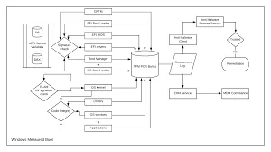
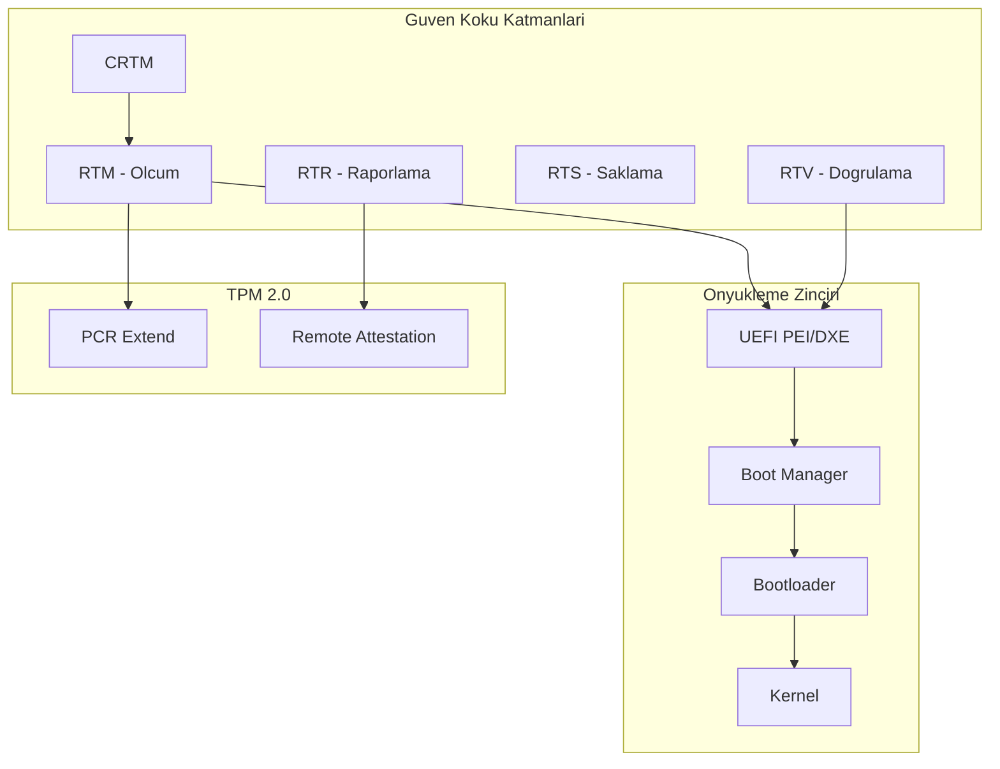
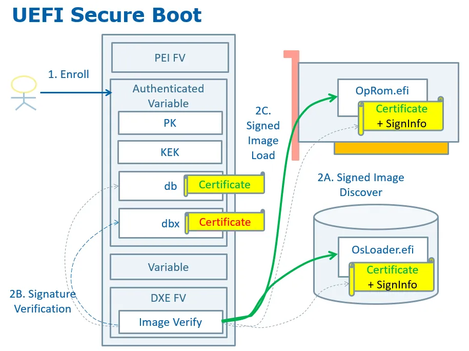

# Çip (TPM), Anakart ve Firmware (Secure Boot) Güvenliği

Donanım güvenliği, savunma derinliği piramidinin en alt katmanıdır. İşletim sistemi, EDR, zero-trust ağ erişimi veya uygulama katmanındaki kontroller ne kadar gelişmiş olursa olsun, altındaki donanım ve firmware (bellenim) tehlikeye girerse tüm güven zinciri çöker. **MITRE ATT&CK** çerçevesinde bu vektör **T1542 (Pre-OS Boot)** ve **T1495 (Firmware Corruption)** teknikleriyle modellenir; **NIST SP 800-193** ise bu katman için koruma, tespit ve kurtarma üçlüsünü tanımlar.

Fortune 500 ölçeğindeki kurumsal topolojilerde bu bileşenler uç noktalar (TPM 2.0 + UEFI Secure Boot + Measured Boot), sunucular (Intel Boot Guard / AMD PSP, discrete TPM), sanallaştırma host'ları (vTPM passthrough) ve ağ cihazları (imzalı firmware + güvenli önyükleme) seviyesinde konumlanır. Bu bölüm, donanımsal güven kökü, TPM 2.0 mimarisi, UEFI Secure Boot mekanizması, firmware dirençliliği, gerçek dünya APT örnekleri ve SOC entegrasyonunu kapsar. Tedarik zinciri riskleri **§3.2** bölümünde; yan kanal saldırıları **§3.3** bölümünde genişletilir. **§4.1** bölümündeki kimlik katmanı, bu donanım köküne dayanır.


*Donanımsal güven kökünden işletim sistemine uzanan güven zinciri*

---

## §3.1.1. Donanımsal Güven Kökü (Hardware Root of Trust)

Donanımsal Güven Kökü (Hardware Root of Trust — RoT), bir bilişim sistemindeki güvenli işlemlerin dayandığı, kendisinden önce hiçbir bileşene güvenmek zorunda olmayan başlangıç noktasıdır. **NIST** tanımıyla: *"Highly reliable hardware, firmware, and software components that perform specific, critical security functions. Because roots of trust are inherently trusted, they must be secure by design."*

Ölçüm zinciri bir yerden başlamalıdır; bu başlangıç **CRTM (Core Root of Trust for Measurement)** olarak adlandırılır — çünkü kendisinden önce ölçülecek bir bileşen yoktur ve doğası gereği güvenilir kabul edilir.

### Güven Zinciri Akışı

Sistem açıldığında güven zinciri şu sırayla ilerler:

1. **CRTM** — CPU veya erken firmware'de; ilk kod bloğu doğrulanır.
2. **RTM (Root of Trust for Measurement)** — Her boot bileşeninin hash'i alınır ve TPM PCR'larına extend edilir.
3. **RTV (Root of Trust for Verification)** — Dijital imzalar doğrulanır; başarısızsa boot durur.
4. **RTS (Root of Trust for Storage)** — Ölçümler ve anahtarlar TPM NVRAM/PCR'da saklanır.
5. **RTR (Root of Trust for Reporting)** — İmzalı quote ve event log üretilir.
6. **RTU / RTRec** — Firmware güncelleme imza doğrulaması ve otomatik kurtarma.

```
CRTM → UEFI PEI/DXE → Boot Manager → Bootloader → Kernel → Sürücüler
         ↓ her adımda hash extend
      TPM PCR[0-7, 4-11, ...]
```



**NIST SP 800-193** bu yapıyı üç ilke etrafında kurar: **Koruma (Protection)**, **Tespit (Detection)**, **Kurtarma (Recovery)**. Tespit mekanizması ayrı bir katman olmalıdır; ele geçirilmiş kod kendisini test etmek için güvenilir değildir.

### Verified Boot ve Measured Boot Karşılaştırması

| Özellik | Verified Boot | Measured Boot |
| :---- | :---- | :---- |
| **Mekanizma** | Her aşama çalıştırılmadan önce imza kontrolü | Hash'ler PCR'lara extend edilir |
| **Hata tepkisi** | Boot derhal durur | Boot devam eder; PCR değişince sealing kırılır |
| **Raporlama** | Yerel doğrulama | Remote attestation (TPM Quote) |
| **Standartlar** | UEFI Secure Boot | TCG PC Client, NIST SP 800-155 |

### Kurumsal Konumlandırma

| Katman | RoT Bileşeni | Operasyonel Kontrol |
| :---- | :---- | :---- |
| Uç nokta | TPM 2.0 + Intel PTT / AMD fTPM | Intune DHA, Conditional Access |
| Sunucu | Intel Boot Guard, AMD PSB | Dell OpenManage, HP SUM, Lenovo XClarity |
| Sanallaştırma | Host UEFI + vTPM | Proxmox/ESXi measured boot |
| Ağ cihazı | İmzalı firmware + TPM/HSM | Firmware drift izleme, CMDB |

:::caution
Platform yalnızca CPU/BIOS değildir. Depolama denetleyicileri, GPU'lar, BMC (Baseboard Management Controller) ve NIC firmware'leri de yüksek ayrıcalıklı kod barındırır. NIST SP 800-193 tüm bu bileşenleri kapsar.
:::

---

## §3.1.2. TPM 2.0 Mimarisi ve Kriptografik Anahtar Hiyerarşisi

**Trusted Platform Module (TPM) 2.0**, anakart üzerinde (discrete) veya işlemci içinde (fTPM — Intel PTT, AMD PSP) çalışan, ana CPU ve bellekten yalıtılmış kriptografik bir işlemcidir. **TCG (Trusted Computing Group)** spesifikasyonuna göre tasarlanmıştır.

### Anahtar Hiyerarşisi

TPM 2.0, her biri benzersiz bir Primary Seed'den türetilen bağımsız hiyerarşiler üzerinden çalışır:

| Anahtar / Hiyerarşi | İşlev | Konum |
| :---- | :---- | :---- |
| **EK (Endorsement Key)** | Cihaz kimliği; üretimde oluşur, TPM'i terk etmez | Endorsement Hierarchy |
| **SRK (Storage Root Key)** | Child key'leri ve hassas verileri şifreler | Storage Hierarchy |
| **AIK / AK (Attestation Identity Key)** | PCR değerlerini imzalar | Storage Hierarchy |
| **Platform Hierarchy** | UEFI/OEM firmware güncellemeleri | Platform Hierarchy |

### Platform Configuration Registers (PCR)

PCR'lar yalnızca **hash extend** ile değiştirilebilir:

```
PCR_yeni = Hash(PCR_eski || yeni_ölçüm)
```

| PCR | Ölçülen Bileşen | SOC Önemi |
| :---- | :---- | :---- |
| **PCR 0** | CRTM + BIOS/UEFI firmware | Firmware implant tespiti |
| **PCR 1** | Platform konfigürasyonu | Anakart değişimi |
| **PCR 2** | Option ROM'lar | PCIe/RAID kart tehditleri |
| **PCR 4** | Boot Manager (bootmgfw.efi, grubx64.efi) | Bootkit tespiti |
| **PCR 5** | GPT/MBR bölüm tablosu | Disk manipülasyonu |
| **PCR 7** | Secure Boot durumu (PK/KEK/db/dbx) | Secure Boot kapatma |
| **PCR 11** | VBS, BitLocker erişim kontrolleri | Credential Guard bütünlüğü |
| **PCR 12-13** | Kernel parametreleri, erken sürücüler | Çekirdek manipülasyonu |

### dTPM ve fTPM Karşılaştırması

| Özellik | dTPM (Discrete) | fTPM (Firmware) |
| :---- | :---- | :---- |
| **Donanım** | Anakart üzerinde ayrı çip | CPU içinde (ME/PSP) |
| **Güvenlik** | Fiziksel saldırılara daha dayanıklı | İşlemci zafiyetlerinden etkilenebilir |
| **Esneklik** | Sabit donanım | Firmware güncellemesiyle esnek |
| **Kullanım** | Kritik sunucular, HSM host'ları | Tüketici cihazları, dizüstü |

### Remote Attestation (Uzaktan Tasdik)

1. Doğrulayıcı, cihazın EK ve AK sertifikalarını ister ve Kurumsal Kök CA'ya karşı doğrular.
2. Challenge oluşturulur: anahtar kimliği, PCR seçimi, rastgele nonce.
3. Tasdikleyici `TPM2_Quote` komutu verir; TPM PCR'lar geçerliyse `TPMS_ATTEST` imzalar.
4. Doğrulayıcı Event Log'u golden baseline ile karşılaştırır.

**Privacy CA modeli:** EK benzersiz olduğundan doğrudan imzalama mahremiyeti bozar; AIK'lar Privacy CA üzerinden EK'ye bağlanır.

### BitLocker ve Linux LUKS Entegrasyonu

Windows'ta Volume Master Key (VMK), TPM + PCR değerlerine mühürlenir. Boot bileşenleri değişirse TPM anahtarı serbest bırakmaz ve recovery key istenir.

```bash
# LUKS2 anahtarını TPM2'ye, PCR 7 (Secure Boot) ve PCR 0'a (UEFI firmware) bağla
systemd-cryptenroll --tpm2-device=auto --tpm2-pcrs=0+7 /dev/sda2

# Manuel mühürleme
tpm2_createprimary -C o -g sha256 -G rsa -c primary.ctx
tpm2_create -C primary.ctx -i secret.dat -u key.pub -r key.priv -L pcr.policy
tpm2_pcrread sha256:0,7
```

### Örnek Measured Boot Event Log

```
PCR-00: 3D 45 8C FE 55 CC 03 EA 1F 44 3F 15 62 BE EC 8D ...  [UEFI firmware/CRTM]
PCR-04: 6A 2E 95 ...  [Bootloader/shim]
PCR-07: 8B 1A ...      [Secure Boot state - PK/KEK/db/dbx]
```

### vTPM ve Sanallaştırma

EVE-OS gibi platformlarda her VM'e izole vTPM 2.0 sunulur. vTPM durum dosyaları host'un fiziksel TPM'inde saklanan AES anahtarıyla şifrelenir; bu anahtar host PCR politikasına bağlıdır. Host firmware manipüle edilirse sanal makineler açılamaz.

:::danger
ROCA (CVE-2017-15361) gibi TPM firmware zafiyetleri, FIPS 140-2 sertifikalı cihazları bile etkileyebilir. Infineon RSALib "Fast Primes" üretimi, küresel TPM'lerin yaklaşık dörtte birini etkilemiştir. Tüm TPM'lerde NSA `Detect-CVE-2017-15361-TPM` aracı çalıştırılmalıdır.
:::

---

## §3.1.3. UEFI Secure Boot Mekanizması ve Anahtar Hiyerarşisi

**UEFI Secure Boot**, her EFI uygulamasının (bootloader, sürücü, OS loader) dijital imza ile doğrulanmasını zorunlu kılar. Anahtarlar NVRAM'de hiyerarşik olarak saklanır.

### Anahtar Veritabanları

| Değişken | Yetkili Güncelleyici | İçerik |
| :---- | :---- | :---- |
| **PK (Platform Key)** | Sistem sahibi / OEM | Güven zincirinin kökü; PK yoksa Setup Mode |
| **KEK (Key Exchange Key)** | PK sahibi | db ve dbx güncelleme yetkisi |
| **db (Allow DB)** | KEK sahibi | İzin verilen yükleyici hash ve sertifikaları |
| **dbx (Disallow DB)** | KEK sahibi | İptal edilmiş/zararlı hash ve sertifikalar |

**dbx her zaman önceliklidir:** Bir dosya db'de olsa bile dbx'te eşleşmesi varsa çalıştırılmaz.

### Boot Akışı

```
PEI (Pre-EFI Init — RoT başlar) → DXE (imzalı sürücüler) → BDS → Boot Manager → Signed OS Loader → Kernel
```

Önyükleme sırasında `efi_load_pe` → `efi_image_authenticate` → `pkcs7_verify_one` zinciri çalışır. İmza db'deki meşru anahtarla doğrulanır ve dbx'te yoksa yürütme devam eder.

### Linux Shim ve MOK

Distrolar, Microsoft 3rd Party UEFI CA tarafından imzalanmış **shim** kullanır; shim kendi gömülü sertifikasıyla GRUB2'yi doğrular. **MOK (Machine Owner Key)** veritabanı, kullanıcı yönetimli kernel modülü imzalamaya izin verir — ancak root erişimi olan saldırgan kalıcı MOK anahtarı kaydedebilir.

```bash
fwupdmgr get-updates | grep -i "dbx\|revocation"
fwupdmgr update
mokutil --sb-state
grub-install --version   # GRUB 2.06+ (post-BootHole) olmalı
```


*UEFI Secure Boot doğrulama akışı ve TPM PCR zinciri*

---

## §3.1.4. Firmware Güncelleme, Dirençlilik ve Donanımsal Koruma

Firmware güncellemeleri güvenlik yamaları için hayati öneme sahiptir; aynı zamanda kritik bir saldırı vektörüdür.

### Güvenli Güncelleme Süreçleri

| Mekanizma | Açıklama |
| :---- | :---- |
| **UEFI Capsule Update** | İmzalı firmware capsule'ları OS üzerinden teslim |
| **Intel Boot Guard** | CPU OTP fuse'larında BIOS imza hash'i; uyuşmazsa boot durur |
| **AMD Platform Secure Boot** | PSP, SEC/PEI fazlarını doğrular |
| **Intel PFR** | CPLD/FPGA ile NIST 800-193 PFR mimarisi; rollback koruması |
| **Winbond TrustME / Dual Image** | Birincil + kurtarma imajı; otomatik geçiş |

**NIST SP 800-147** (istemci) ve **SP 800-147B** (sunucu) standartları, yalnızca üretici imzalı güncellemeleri zorunlu kılar.

### SPI Flash Yazma Koruması

Anakart SPI flash çipi, UEFI kodlarını barındırır. Üç kritik kilit mekanizması:

| Register | Güvenli Değer | Fonksiyon |
| :---- | :---- | :---- |
| **BIOSWE** | 0 (Disabled) | BIOS bölgesine doğrudan yazmayı kapatır |
| **BLE** | 1 (Enabled) | BIOSWE tetiklendiğinde SMI üretir |
| **SMM_BWP** | 1 (Enabled) | Yazma yetkisini yalnızca SMM kodlarına kilitler |
| **FLOCKDN** | 1 (Locked) | SPI Protected Range kayıtlarını kilitle |

```bash
# CHIPSEC ile BIOS yazma koruması testi
python chipsec_main.py -m common.bios_wp
python chipsec_main.py -m common.spi_lock
python chipsec_main.py -m common.smm
python chipsec_util.py spi dump verified_bios_backup.bin
```

Güvenli yapılandırmada çıktı: `BIOSWE=0`, `BLE=1`, `SMM_BWP=1`, `FLOCKDN=1` — tüm testler PASSED.

<details>
<summary>NIST SP 800-155 MAA mimarisi ve Winbond dual image kurtarma (derinlemesine)</summary>

NIST SP 800-155 çerçevesinde istemci bütünlüğü merkezi **Measurement Assessment Authority (MAA)** ile doğrulanır:

```
Collection Agent → Transmission Agent → MAA → Golden Measurements karsilastirma
                                              ↓ (basarisiz)
                                    Remediation Agent → NAC/MDM karantina
```

**Winbond W77Q Secure Flash** gibi çift imaj (dual image) mimarilerinde birincil bellenim bozulduğunda BMC/CPLD, işletim sisteminden bağımsız olarak kurtarma imajına (golden image) otomatik geçiş yapar. Bu "unattended automatic recovery" mekanizması kalıcı hizmet dışı bırakma (PDOS) saldırılarını engeller.

**vTPM** ortamlarında her VM izole bir sanal TPM alır; vTPM durum dosyaları host fiziksel TPM'inde saklanan AES-256 anahtarıyla şifrelenir ve host PCR politikasına bağlanır — host bellenimi manipüle edilirse VM'ler açılamaz.
</details>

### OEM Kurumsal Özellikleri

- **Dell BIOSConnect** — Uzaktan imzalı firmware güncelleme
- **HP Sure Start (4. nesil)** — Sürekli firmware doğrulama ve otomatik kurtarma; LoJax analizine göre UEFI rootkit'lere karşı tasarlandı
- **Lenovo ThinkShield** — Platform bütünlüğü ve attestation

---

## §3.1.5. Firmware Seviyesinde Gelişmiş Tehditler

Geleneksel EDR/AV çözümleri firmware katmanını göremez. Saldırganlar bu alanı kalıcılık ve savunma atlatma için kullanır.

### LoJax (APT28/Fancy Bear, 2018)

Vahşi ortamda tespit edilen ilk UEFI rootkit. Meşru LoJack (Computrace) anti-hırsızlık yazılımının trojanize türevidir.

- Kötücül DXE modülü her boot'ta çalışır, Windows payload'ı diske bırakır.
- SPI flash yazma için `RwDrv.sys` çekirdek sürücüsünü kullanır.
- CVE-2014-8273 yarış koşulu açığını istismar eder.
- OS yeniden kurulumu ve disk değişimi atlatılır; temizleme firmware reflash gerektirir.

Diğer firmware APT'leri: **MosaicRegressor**, **CosmicStrand**, **MoonBounce** (Winnti/APT41).

### BootHole (CVE-2020-10713)

GRUB2 `grub.cfg` ayrıştırıcısındaki buffer overflow. `grub.cfg` genellikle imzalanmaz; imzalı GRUB binary geçerli kalırken keyfi kod çalıştırılır. CVSS 8.2; 80'den fazla shim etkilendi. Ek CVE'ler: CVE-2020-15705, CVE-2020-15706, CVE-2020-15707, CVE-2020-7205.

### BlackLotus (CVE-2022-21894 — Baton Drop)

UEFI Secure Boot'u tamamen devre dışı bırakabilen bootkit. Saldırı adımları:

1. ESP'ye imzalı ama zafiyetli eski `bootmgfw.efi` kopyalanır (downgrade).
2. Baton Drop sömürülerek runtime Secure Boot politikaları bellekten temizlenir.
3. NVRAM'e saldırgan MOK sertifikası enjekte edilir.
4. Her boot'ta DSE, Windows Defender ve HVCI devre dışı bırakılır.

### LogoFAIL (CVE-2023-5058, CVE-2023-39538/39, CVE-2023-40238)

DXE fazında çalışan görsel ayrıştırıcıları (BMP/JPEG/GIF) hedef alır. ESP'ye yerleştirilen kötücül logo dosyası imza gerektirmez; buffer overflow ile SMM (Ring -2) seviyesinde kod çalıştırılır. Disk formatlansa bile temizlenemez.

:::caution
LoJax, BlackLotus ve LogoFAIL türü tehditler, işletim sistemi yeniden kurulumunu atlatır. Şüpheli cihazda: izole et → CHIPSEC tam audit → SPI programmer ile recovery veya anakart değişimi planla.
:::

---

## §3.1.6. Savunma Araçları ve SOC Entegrasyonu

### Platform Güvenlik Araçları

| Araç | İşlev |
| :---- | :---- |
| **CHIPSEC** | SPI flash erişim, BIOS WP, Secure Boot, SMRAM, Boot Guard testleri |
| **fwupd/LVFS** | Firmware envanteri; HSI (Host Security ID) seviyeleri |
| **UEFITool / FwHunt** | Firmware imaj analizi |
| **EMBA / FACT** | Firmware güvenlik taraması |
| **VirusTotal firmware** | Bilinen implant IOC taraması |

```bash
python chipsec_main.py                    # otomatik güvenlik test paketi
python chipsec_main.py -m common.bios_wp  # BIOS yazma koruması
python chipsec_main.py -m common.secureboot.variables
```

:::note
CHIPSEC bazı modülleri Secure Boot kapatma ve imzasız kernel modülü yüklemesini gerektirir. Üretim sistemlerinde izole test ortamı kullanın.
:::

### Windows Event ID'leri

| Event ID | Kaynak | SOC Anlamı |
| :---- | :---- | :---- |
| **1033** | Kernel-Boot | Secure Boot imza doğrulama hatası |
| **153** | Kernel-Boot | VBS devre dışı — bootkit göstergesi |
| **292** | Kernel-Boot | SBAT güncellenemedi — downgrade saldırısı |
| **812** | BitLocker-API | Secure Boot değişkeni okunamadı — PCR 7 bozulması |
| **1794** | TPM-WMI | ROCA zafiyetli TPM firmware |
| **1801** | TPM-WMI | Sertifika güncelleme (normal) / persistent hata (alarm) |

```json
{
  "System": {
    "EventID": 1033,
    "Provider": { "@Name": "Microsoft-Windows-Kernel-Boot" }
  },
  "EventData": {
    "Data": [
      { "@Name": "BootMgr", "#text": "Secure Boot failed to validate a file with signature: ..." },
      { "@Name": "ErrorCode", "#text": "0xC0000428" }
    ]
  }
}
```

### Wazuh / SIEM Konfigürasyonu

```xml
<localfile>
  <location>Microsoft-Windows-TPM-WMI/Operational</location>
  <log_format>eventchannel</log_format>
</localfile>
```

```xml
<agent_config>
  <syscheck>
    <directories realtime="yes" check_all="yes">C:\Windows\Boot\EFI</directories>
    <directories realtime="yes" check_all="yes">/boot/efi</directories>
  </syscheck>
</agent_config>
```

**Intune Conditional Access:** Device Health Attestation (DHA) sonucu — Secure Boot enabled, BitLocker enabled, PCR mismatch → erişim reddi.

### MITRE ATT&CK Eşlemesi

| Teknik | Kod | Açıklama |
| :---- | :---- | :---- |
| System Firmware | T1542.001 | BIOS/UEFI firmware manipülasyonu |
| Bootkit | T1542.003 | Bootloader/MBR manipülasyonu |
| Firmware Corruption | T1495 | Firmware bozma |

---

## §3.1.7. Standartlar, Mevzuat ve Uyum

### Uluslararası Standart Eşlemesi

| ISO 27001:2022 | NIST SP 800-53 Rev. 5 | CIS Controls v8 | Operasyonel Karşılık |
| :---- | :---- | :---- | :---- |
| **A.8.9** Configuration Management | **SI-7** Software/Firmware Integrity | Control 4 | Firmware versiyon envanteri |
| **A.8.7** Malware Protection | **SC-51** Hardware-based Protection | Control 2 | Secure Boot + TPM zorunluluğu |
| **A.8.8** Vulnerability Management | **SA-22** Unsupported Components | Control 7 | EOL firmware takibi |

Temel referanslar: **NIST SP 800-193** (firmware dirençlilik), **SP 800-155** (BIOS bütünlük ölçümü), **SP 800-147/147B** (BIOS koruma).

**NIST SP 800-193 — Koruma, Tespit, Kurtarma matrisi:**

| İlke | NIST 800-193 Gereksinimi | Operasyonel Kontrol |
| :---- | :---- | :---- |
| **Protection** | İmzalı firmware, yazma koruması | SPI lock, Boot Guard, SMM_BWP |
| **Detection** | Bütünlük ölçümü, anomali tespiti | TPM PCR, FIM, CHIPSEC audit |
| **Recovery** | Otomatik kurtarma imajı | HP Sure Start, Dual Image BIOS |

**NIST SP 800-53 SI (System Integrity) ailesi — firmware bağlantısı:**

| Kontrol | Açıklama | MITRE Karşılığı |
| :---- | :---- | :---- |
| **SI-7** | Yazılım/firmware bütünlüğü | T1542.001 System Firmware |
| **SI-7(1)** | Bütünlük kontrolleri | Measured Boot, Secure Boot |
| **SI-7(9)** | Otomatik kurtarma | Dual BIOS, Intel PFR |
| **SI-16** | Bellek koruması | SMEP/SMAP, HVCI |

### Türkiye Mevzuatı

**KVKK (6698) — Kişisel Veri Güvenliği Rehberi:**
- Disk şifreleme (md. 25): BitLocker/LUKS + TPM mühürleme zorunlu.
- Donanım imhası (md. 33): Arızalı cihazlarda veri saklama ortamının sökülmesi.
- Fiziksel güvenlik (md. 23): Sunucu/yedekleme cihazlarının kilitli odada tutulması.

**BDDK Yönetmeliği (RG 15.03.2020, Sayı 31069):**
- **MADDE 9:** Kriptografik kontroller; uç nokta şifreleme; güvenli imha.
- **MADDE 16:** EOL sistemlerin kullanımdan kaldırılması.
- **MADDE 25:** Birincil/ikincil sistemlerin yurt içinde bulundurulması.

**5651 Sayılı Kanun:** Log bütünlüğü için measured boot ile PCR değerleri kanıt olarak kullanılabilir.

**7545 Sayılı Siber Güvenlik Kanunu (RG 19.03.2025):** Yerli/milli ürün önceliği; yetkilendirilmiş tedarik (MADDE 7/c); yaşam döngüsü ilkesi (7/ç).

---

## §3.1.8. Sonuç ve Mimari Tavsiyeler

TPM 2.0, UEFI Secure Boot ve donanımsal güven kökü, kurumsal güvenlik mimarisinin olmazsa olmaz temel taşlarıdır. Bu teknolojiler NIST, CIS ve MITRE ATT&CK çerçeveleriyle uyumlu, yasal mevzuatların gerektirdiği ve saldırı zincirinin en başında savunma sağlayan kritik kontrollerdir.

### Operasyonel Öncelikler

| Aşama | Süre | Eylem |
| :---- | :---- | :---- |
| **0 — Görünürlük** | 0-30 gün | CHIPSEC + fwupd envanteri; HSI:1 altı cihazlar acil listeye |
| **1 — Sertleştirme** | 30-90 gün | dbx güncellemesi; BitLocker PCR 0+7; ROCA testi; GRUB 2.06+ |
| **2 — Mimari** | 90-180 gün | Pluton/Titan M2/T2 tercihi; remote attestation zorunluluğu |
| **3 — Yönetişim** | Sürekli | Firmware IOC takibi; golden PCR baseline; CMDB drift izleme |

### Mimari Referans Modeli

```
┌─────────────────────────────────────────────────────────────────┐
│  KATMAN 0: DONANIMSAL GÜVEN KÖKÜ (CRTM / Boot Guard / PSP)     │
├─────────────────────────────────────────────────────────────────┤
│  KATMAN 1: TPM 2.0 (PCR, Sealing, Remote Attestation)          │
├─────────────────────────────────────────────────────────────────┤
│  KATMAN 2: UEFI SECURE BOOT (PK/KEK/db/dbx)                   │
├─────────────────────────────────────────────────────────────────┤
│  KATMAN 3: MEASURED BOOT + FIRMWARE RESILIENCY (800-193)      │
├─────────────────────────────────────────────────────────────────┤
│  KATMAN 4: RUNTIME (HVCI, VBS, WDAC, Credential Guard)        │
├─────────────────────────────────────────────────────────────────┤
│  KATMAN 5: SOC İZLEME (Wazuh, DHA, Event ID korelasyonu)      │
├─────────────────────────────────────────────────────────────────┤
│  UYUM: NIST 800-193/155/147 + KVKK + BDDK + 7545 Sayılı Kanun │
└─────────────────────────────────────────────────────────────────┘
```

### Tetikleyici Eşikler

- Yeni transient-execution CVE'si → mikrokod + OS yamalarını eşzamanlı uygula.
- Firmware APT IOC yayını (LoJax/MoonBounce) → remote attestation zorunlu kıl.
- Yeni dbx revokasyon listesi (UEFI Forum) → `fwupdmgr update` fleet-wide dağıt.

:::note
TPM PCR mühürleme, meşru firmware güncellemeleri sonrası PCR değişiminden etkilenir. Recovery key yönetimi operasyonel olarak kritiktir; merkezi escrow ve break-glass prosedürleri tanımlanmalıdır.
:::

Bu katman doğru kurgulandığında, üst katmanlardaki tüm savunma mekanizmalarının üzerine sağlam bir güven kökü inşa edilmiş olur. Aksi takdirde en gelişmiş EDR bile pre-boot bir implant karşısında kör kalır.