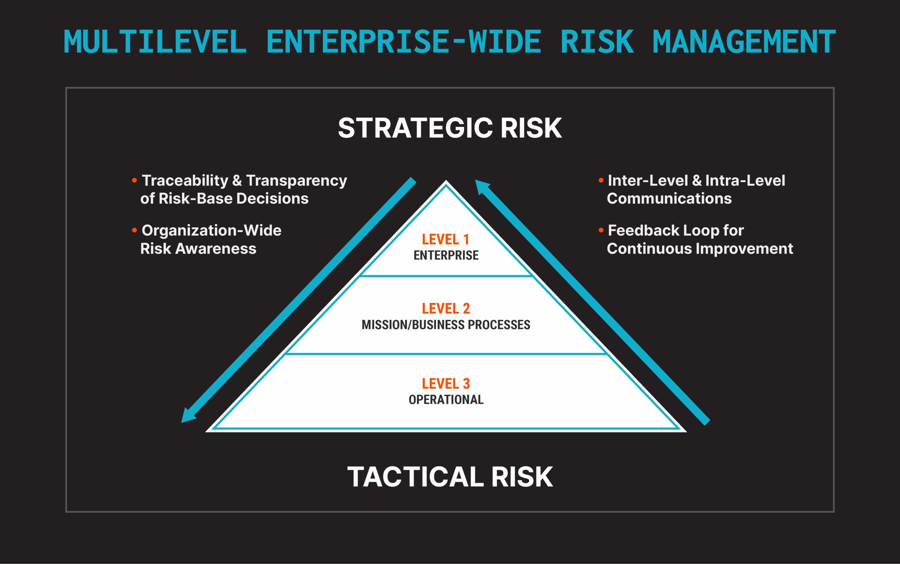
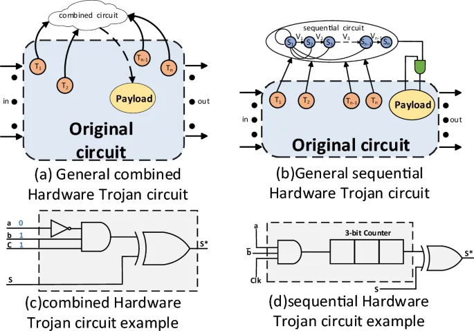
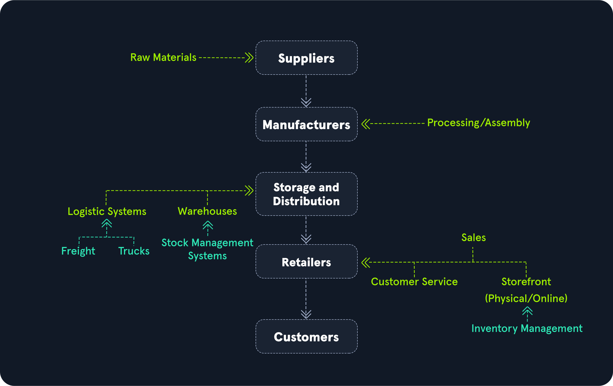
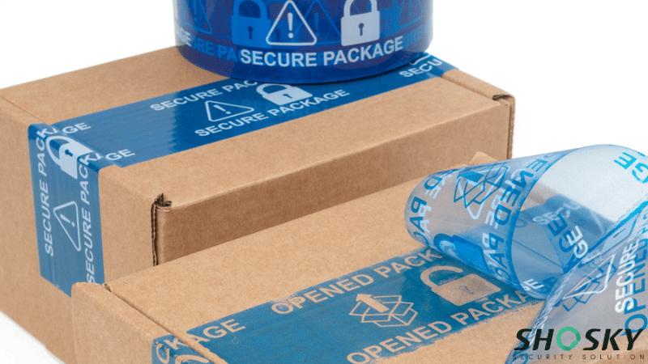
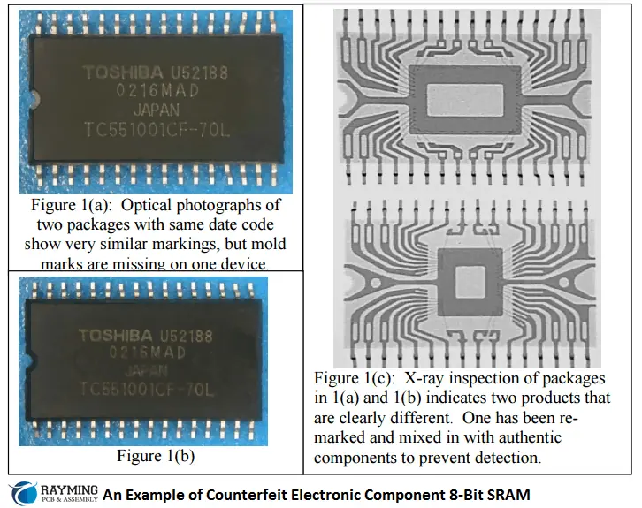

# Donanım Tedarik Zinciri Riskleri ve Sahte Bileşenler

Bir kurum ağını ve yazılımlarını kusursuz korusa bile, satın aldığı donanımın üretim veya nakliye aşamasında tehlikeye atılmış olma ihtimali modern siber savaşın en sinsi yönlerinden biridir. Bu riskler savunma derinliği mimarisinin en alt katmanını — güvenilir donanım kökünü — doğrudan tehdit eder. Yazılımsal kontroller, EDR/XDR, segmentasyon ve izleme katmanları, kök donanım (CPU, BMC, NIC, firmware) güvenliği ihlal edildiğinde bypass edilebilir.

**MITRE ATT&CK T1195 (Supply Chain Compromise)** bu tehditleri modeller; **NIST SP 800-161 Rev. 1** (C-SCRM) sistematik risk yönetimi çerçevesi sunar. Küreselleşmiş yarı iletken ekosisteminde tek bir çip bile tasarım, üretim, montaj ve lojistik aşamalarında dört farklı kıtada onlarca kuruluşun elinden geçebilir — bu dağıtık yapı, saldırganlara her aşamada müdahale imkânı sunarken kurumların görünürlüğünü ciddi ölçüde azaltır.


*NIST SP 800-161 çok seviyeli siber tedarik zinciri risk yönetimi çerçevesi*

---

## §3.2.1. Donanımsal Truva Atları (Hardware Trojans)

Yazılımsal Truva atlarının aksine, **Donanımsal Truva Atları (HT)**, entegre devrenin tasarım veya üretim aşamasında silikona kasıtlı olarak eklenen kötü niyetli fiziksel modifikasyonlardır. Boyutları çok küçük (%0,1-1 alan) olabilir ve normal test vektörlerini geçmek için "uyku" modunda kalırlar.

### Sınıflandırma

| Eksen | Kategoriler |
| :---- | :---- |
| **Fiziksel Konum** | Çip içi (on-chip) / Çip dışı (off-chip) / PCB seviyesi |
| **Ekleme Aşaması** | Tasarım (RTL/Netlist) / Üretim (Maske/Foundry) / Montaj (OSAT) |
| **Aktivasyon** | Sürekli aktif / Koşullu (nadir sinyal) / Harici tetiklemeli |

### Tetikleyici ve Payload Mekanizmaları

HT anatomisi iki bileşenden oluşur:

- **Tetikleyici:** Nadir Boolean kombinasyonları, ardışık sayaçlar (%0,001 ihtimal), ortam sıcaklığı veya güç hattı voltaj dalgalanmaları. ATE (otomatik test ekipmanı) testlerinde uyku modunda kalır.
- **Payload:** Şifreleme anahtarı sızıntısı (yan kanal), kill-switch, yetki yükseltme kapısı, RNG zayıflatma, SMRAM ihlali.

```
[Tetikleyici Girişleri] → [Nadir Olay Sayacı] → [Zararlı Yük Devresi] → [Manipüle Çıktı / Bilgi Sızıntısı]
         ↑
[Asıl Entegre Devre — Benign Circuitry]
```


*Donanımsal Truva Atı mantıksal aktivasyon akışı ve ekleme noktaları*

### S3 Boot Script Manipülasyonu

İleri düzey saldırı yöntemi: Sistem S3 uyku modundan uyandığında RAM'deki **S3 Boot Script Table** opkodları yürütülür. Saldırgan bu tabloya SPI Flash yazma kilidini (FLOCKDN, SMM_BWP) devre dışı bırakan MMIO yazma opkodları enjekte eder. Sistem uykudan uyandığında donanımsal kilitler açılır ve kalıcı firmware rootkit yazılabilir.

### Tespit Yöntemleri

| Yöntem | Açıklama | Ölçeklenebilirlik |
| :---- | :---- | :---- |
| **Yan-kanal analizi (SCA)** | Güç/EM profili sapması; GMM, STFT, Siamese NN | Yüksek (tahribatsız) |
| **Fonksiyonel test** | Tüm giriş kombinasyonları; spesifik tetikleyicileri kaçırabilir | Orta |
| **Tasarım incelemesi** | Netlist/GDSII karşılaştırması; ML destekli otomatik araçlar | Düşük (pre-silicon) |
| **X-ray / SEM** | Die seviyesi inceleme | Düşük (yıkıcı, pahalı) |

Gelişmiş tespit çerçeveleri, EM ve güç izlerini STFT ile zaman-frekans düzlemine aktarır; Gauss Karışım Modelleri (GMM) ve Bayesian Bilgi Kriteri (BIC) ile always-on Truva devrelerinin parazitik spektral izini tespit eder. Siamese Neural Network modelleri, altın referans çip ihtiyacını ortadan kaldırarak %97+ doğrulukla anomali raporlar.

### Savunma Stratejileri

- **Güvenilir dökümhane:** ABD ve müttefik "Trusted Foundry" programlarına dahil üreticiler.
- **Çift kaynaklı tedarik (dual-sourcing):** İki üreticiden karşılaştırmalı analiz.
- **Design-for-Trust (DFT):** Dummy logic, camouflaging, formal doğrulama.
- **Run-time izleme:** Beklenmedik güç/ısı/network davranışı; TPM measured boot + attestation.

:::caution
Donanımsal Truva atları firmware güncellemesi veya OS formatlamasıyla ortadan kaldırılamaz. Önleme (güvenilir tedarik + doğrulama) tespitten önce gelir.
:::

---

## §3.2.2. Tedarik Zincirine Müdahale (Supply Chain Interdiction)

**Interdiction**, ürünün üreticiden kuruma ulaşana kadar geçen lojistik süreçte — nakliye, ara depolama, gümrükleme — fiziksel olarak ele geçirilerek içine casus donanım veya değiştirilmiş firmware yüklenmesidir.

### Müdahale Yöntemleri

| Yöntem | Açıklama | Tespit Zorluğu |
| :---- | :---- | :---- |
| **Paket açma** | Fiziksel paket açılarak ek modül/yonga yerleştirilir | Yüksek (miligram ağırlık kontrolü) |
| **Firmware yeniden programlama** | Flash belleğe kötü niyetli firmware | Orta (hash doğrulama) |
| **Yan kanallı müdahale** | Kasa içine EM verici yerleştirme | Çok yüksek (RF dedektörü) |

Microsoft tanımı: **Interdiction** — transit sırasında fiziksel müdahale; **Seeding** — üretim bandında kötü niyetli ekleme.

### Gerçek Dünya Senaryosu

Bir finans kurumu 500 adet ağ anahtarı sipariş eder. Ürünler Asya'dan çıkar, Singapur lojistik merkezinde 48 saat bekler. APT grubu paketleri açarak her anahtarın yönetim kartına gizli arka kapı yongası ekler. Cihazlar test edilir, çalışır görünür ve üretime alınır. Altı ay sonra gizli komutla tüm anahtarlar aynı anda devre dışı bırakılır.

### NSA/TAO ANT Katalog Sızıntısı (2013)

Devlet seviyesinde donanım implantlarının **kanıtlanmış** gerçekliği (EFF tarafından yayımlanan orijinal katalog):

| Kod Adı | Hedef | Mekanizma | Maliyet |
| :---- | :---- | :---- | :---- |
| **DEITYBOUNCE** | Dell PowerEdge | BIOS + SMM implantı; ARKSTREAM ile uzaktan flash | $0 (devlet içi) |
| **IRONCHEF** | HP Proliant | BIOS + SMM; iki yönlü RF iletişim | $0 |
| **COTTONMOUTH-I** | USB konnektör | HOWLERMONKEY RF transceiver | ~$1M / 50 birim |
| **COTTONMOUTH-II** | USB soket | TRINITY dijital çekirdek | $200K / 50 birim |
| **IRATEMONK** | HDD firmware | Maxtor/Samsung/Seagate/WD | — |
| **FEEDTROUGH** | Juniper Netscreen | Firewall implantı | — |
| **JETPLOW** | Cisco PIX/ASA | Firewall implantı | — |

ANT implantları açıkça *"Through remote access or interdiction"* yoluyla yerleştirir — sevkiyat bütünlüğü ve tamper-evident ambalaj kontrollerini kritik kılar.


*Donanım tedarik zinciri yaşam döngüsü ve müdahale risk noktaları*

### "The Big Hack" Değerlendirmesi

Bloomberg Businessweek (4 Ekim 2018), Supermicro anakartlarına pirinç tanesi büyüklüğünde casus çipler yerleştirildiğini iddia etti. **Reddedişler:** Apple CEO Tim Cook *"100 percent a lie"* dedi; Amazon, Supermicro, DHS ve NSA reddetti; Nardello & Co bağımsız soruşturması *"absolutely no evidence of malicious hardware"* buldu. Hiçbir fiziksel casus çip kamuya çıkmadı.

:::note
"Big Hack" iddiası kanıtlanamamıştır ve bu kitapta doğrulanmış bir olay değil, tehdit modeli örneği olarak ele alınmaktadır. Ancak NSA ANT kataloğu, devlet düzeyinde donanım implantlarının gerçekliğini kanıtlar.
:::

### Savunma Kontrolleri

- **Fiziksel güvenlik zinciri:** Lojistik sağlayıcı denetimi, güvenli bölge konsepti, ara duraklarda kamera ve erişim kontrolü.
- **Tamper-evident mühürler:** Açıldığında VOID ibaresi bırakan holografik etiketler; teslim anında kontrol.
- **Ağırlık ve boyut metrolojisi:** OEM spesifikasyonuyla miligram sapma = kırmızı bayrak.
- **Firmware bütünlük doğrulaması:** Üretici resmi hash değerleriyle karşılaştırma.
- **Escorted transport:** Kritik sevkiyatlar için güvenli lojistik.


*Kurcalamaya karşı hassas güvenlik mührü (tamper-evident seal)*

---

## §3.2.3. Sahte (Counterfeit) Bileşenler

Sahte elektronik bileşen, orijinal üretici tarafından üretilmemiş, yetkisiz kopyalanmış, yeniden işaretlenmiş veya hurda/atıktan sökülmüş parçalardır. Sadece ani arıza değil; içinde gizli açıklar ve arka kapılar barındırma riski taşır.

### SAE AS6171 Sınıflandırması

| Kategori | Açıklama | Risk |
| :---- | :---- | :---- |
| **Remarked** | Düşük özellikli bileşen yüksek segment gibi işaretlenir | Orta |
| **Recycled** | E-atıktan sökülüp "sıfır" gibi satılır | Yüksek |
| **Overproduced** | Lisans kotası üzerinde kaçak üretim | Yüksek |
| **Out-of-Spec** | Kalite kontrolü geçememiş bileşenler | Kritik |
| **Clone/Counterfeit** | Tamamen kopya, düşük kaliteli malzeme | Kritik |

### Tespit Metodolojisi

**A. Görsel ve Optik İnceleme (IDEA-STD-1010)**
- Lazer işaretli logo vs. mürekkep baskı
- Pin oksidasyonu, yeniden lehimleme izleri
- Boyut toleranslarından sapma

**B. X-Işını ve Ultrasonik Muayene (AS6171/5)**
- İç yapı, die boyutu, wire bond geometrisi
- BGA reballing tespiti
- Taramalı Akustik Mikroskopi (SAM) — delaminasyon

**C. Kimyasal Test (AS6171/2)**
- Aseton/Dynasolve ile blacktopping tespiti
- Sahte kaplama çözünür, orijinal marka ortaya çıkar

**D. XRF Spektroskopisi (AS6171/3)**
- Bacak kaplama malzemesi analizi
- RoHS uyumluluk doğrulama


*Orijinal ve sahte bileşenin X-ray tomografi karşılaştırması*

### Örnekleme İstatistiği (LTPD)

SAE AS6171, Lot Tolerans Yüzdesi Defektif (LTPD) modeli kullanır. %5 maksimum hata oranı ve %10 tüketici riski (Beta) için gerekli minimum test örneklemi binom dağılımıyla hesaplanır. Kritik finansal ve askeri altyapılarda Series 2/3 planları (daha düşük hata toleransı) zorunludur.

### Standartlar

| Standart | Kapsam |
| :---- | :---- |
| **SAE AS6081** | Distribütörler için sahte parça önleme ve tespit |
| **SAE AS6171** | Akredite laboratuvar test yöntemleri |
| **SAE AS5553** | Üretici/entegratör için sahte bileşen önleme |
| **IDEA-STD-1010** | Açık pazar bileşenleri görsel kabul kriterleri |
| **CCAP-101** | Distribütör kalite yönetim sistemi denetimi |

---

## §3.2.4. Güvenli Donanım Satın Alma ve OEM Doğrulama

Riski minimize etmek için **C-SCRM Programı** kurulmalıdır (NIST 800-161 strateji + uygulama planı).

### Tedarik Zinciri Yaşam Döngüsü

```
İhtiyaç Tanımı → Tedarikçi Değerlendirme → Sözleşme/Satın Alma → Teslim Kabul → İşletim/İzleme
      ↓                  ↓                        ↓                    ↓              ↓
 Güvenlik Gereks.    Risk Skorlaması         Güvenlik Şartları    Fiziksel/FW      Sürekli Bütünlük
```

### Tedarikçi Risk Skorlaması

| Kriter | Değerlendirme | Puan |
| :---- | :---- | :---- |
| Coğrafi risk | Ülke siber olgunluğu, yasal çerçeve | 1-10 |
| Sertifikasyon | ISO 27001, ISO 28000, NIST uyumu | 1-10 |
| Üretim güvenliği | Fiziksel güvenlik, erişim kontrolleri | 1-10 |
| Tedarik zinciri görünürlüğü | Alt tedarikçi bilinirliği, menşei takibi | 1-10 |
| Olay müdahale geçmişi | Güvenlik olayları ve müdahale süreleri | 1-10 |
| Ürün bütünlüğü | Firmware imzalama, Secure Boot, kimlik doğrulama | 1-10 |

**Toplam < 25:** Düşük risk (onay) | **25-50:** Orta risk (ek kontroller) | **> 50:** Yüksek risk (alternatif ara)

### Teslim Alma Kontrol Listesi

```
TESLİM ALMA KONTROL LİSTESİ
├── 1. AMBALAJ BÜTÜNLÜĞÜ
│   ├── Dış ambalaj hasar/yırtık kontrolü
│   ├── Tamper-evident mühür sağlamlığı
│   └── Koli ağırlığı sevk irsaliyesiyle karşılaştırma
├── 2. DOKÜMANTASYON
│   ├── OEM sertifikaları, Uygunluk Beyanı (DoC)
│   └── Test raporları ve kalite dokümantasyonu
├── 3. FİZİKSEL İNCELEME
│   ├── Seri numarası OEM veritabanı çapraz doğrulama
│   └── Pin/ray yapısı aşınma, oksidasyon kontrolü
├── 4. FONKSİYONEL DOĞRULAMA
│   ├── Firmware sürümü ve hash bütünlüğü
│   ├── Secure Boot zinciri kontrolü
│   └── Performans testleri
└── 5. KRİTİK BİLEŞENLER İÇİN İLERİ ANALİZ
    ├── X-Ray / SAM muayenesi
    └── Bağımsız laboratuvar testi (şüpheli durumlarda)
```

### Sözleşme Güvenlik Maddeleri

1. **Malzeme Bilgi Formu:** Menşei, üretim tarihi, parti numarası, alt tedarikçi beyanı.
2. **Firmware imzalama:** Tüm güncellemelerin tedarikçi özel anahtarıyla imzalanması.
3. **Güvenlik açığı bildirim politikası:** Keşfedilen zafiyetlerin belirli sürede bildirilmesi.
4. **Denetim hakkı:** Üretim tesislerinin ve güvenlik süreçlerinin denetlenmesi.
5. **Yaşam döngüsü desteği:** Minimum güvenlik güncellemesi ve yedek parça garantisi.

### OEM Doğrulama Teknolojileri

- **Dell Secured Component Verification (SCV):** Fabrikada şifrelenmiş bileşen verileri; teslimatta orijinallik sorgulama.
- **TPM Endorsement Key:** Benzersiz donanım kimliği, üretici imzalı sertifika.
- **Intel Boot Guard / AMD PSB:** OTP fuse'larda BIOS imza hash'i; sahte işlemci tedarikini engeller.

:::danger
AMD PSB "Vendor Locking": İlk çalıştırmada işlemci, anakart üreticisinin anahtarını OTP sigortalarına yazar. Fuse edilen işlemci başka üretici anakartında çalışmaz — yedek parça esnekliğini azaltır.
:::

---

## §3.2.5. Kurumsal Güvenilir Donanım Kökleri

Modern OEM'ler, tedarik zinciri risklerini azaltmak için entegre güven kökleri sunar:

| Teknoloji | Üretici | Özellik |
| :---- | :---- | :---- |
| **Microsoft Pluton** | Microsoft/AMD | TPM 2.0'ı CPU die'ına entegre eder; bus-MITM yüzeyini kapatır; Windows Update üzerinden firmware |
| **Google Titan M2** | Google | Pixel'lerde HRoT; izole boot, bootloader doğrulama; CC sertifikalı |
| **Apple T2 / Secure Enclave** | Apple | Bağımsız coprocessor; UID fuse'a yazılır; FileVault anahtarı SE içinde |
| **Intel Boot Guard** | Intel | OTP FPF sigortalarında BIOS hash; imza uyuşmazsa boot durur |
| **AMD Platform Secure Boot** | AMD | PSP, SEC/PEI fazlarını doğrular; vendor locking |

Yeni donanım alımlarında discrete TPM'in bus-MITM yüzeyini kapatan entegre güven köklerine öncelik verilmelidir.

---

## §3.2.6. Operasyonel Güvence ve SOC Entegrasyonu

### Kurumsal Topoloji Konumlandırması

Tedarik zinciri güvenliği, varlık yaşam döngüsünün **Edinim** ve **Alma/Doğrulama** aşamalarında yer alır:

```
Satın Alma → Lojistik → Güvenli Alma Alanı → CMDB → İzole Test Ortamı → Üretim
                                              ↓
                                    CHIPSEC audit + baseline profiling
                                              ↓
                                    SOC (Wazuh FIM + EDR + anomali tespiti)
```

### CHIPSEC ile Gelen Donanım Doğrulama

```bash
sudo python3 chipsec_main.py -m common.bios_wp -m common.spi_lock -m common.smm
sudo chipsec_util spi dump verified_bios_backup.bin
sudo chipsec_util uefi var-list
```

Dump dosyası `uefi-firmware-parser` veya `binwalk` ile parse edilerek gizli DXE sürücüleri aranır.

### Wazuh / SIEM Entegrasyonu

- **FIM:** `/boot/efi`, `C:\Windows\Boot\EFI` gerçek zamanlı izleme.
- **Syscollector:** Donanım/firmware envanteri.
- **Davranışsal kurallar:** Beklenmedik outbound trafik, BMC log anomalisi → quarantine.

### Operasyonel Senaryo (Finans Kurumu)

1. **Satın alma:** Authorized channel + NIST 800-161 / AS6081 sözleşme şartı.
2. **Teslimat:** Tamper-evident + ağırlık/seri no + görsel kontrol.
3. **Alma laboratuvarı:** Sampling X-ray + elektriksel test.
4. **Onboarding:** TPM measured boot + baseline profiling.
5. **Üretim:** Wazuh + mikro-segmentasyon + anomali detection.
6. **Olay:** İzolasyon → KAPE forensic → BDDK/KVKK bildirimi.

---

## §3.2.7. Standartlar, MITRE ATT&CK ve Türkiye Mevzuatı

### MITRE ATT&CK T1195

| Alt Teknik | Kod | Açıklama |
| :---- | :---- | :---- |
| Compromise Software Supply Chain | T1195.002 | Yazılım güncellemeleri üzerinden saldırı |
| Compromise Hardware Supply Chain | T1195.003 | Donanım bileşenlerine Truva eklenmesi |

### Uluslararası Standart Eşlemesi

| ISO 27001:2022 | NIST SP 800-53 Rev. 5 | CIS Controls v8 |
| :---- | :---- | :---- |
| **A.5.19-5.20** Tedarikçi ilişkileri | **SR-2, SR-3, SR-5, SR-6** C-SCRM | Control 1, 15 |
| **A.8.9** Konfigürasyon yönetimi | **SR-10, SR-11** Inspection, Authenticity | Control 2, 4 |
| **A.8.1** Varlık envanteri | **CM-8** Component Inventory | Control 1 |

**NIST SP 800-161** C-SCRM olgunluk modeli: **foundational → sustaining → enhancing**.

**CMMC (Cybersecurity Maturity Model Certification):** ABD DoD C-SCRM programının alt bileşeni; GSA OASIS+ J-3 teslimatları 800-161 R1 uyumu gerektirir.

### Türkiye Mevzuatı

**7545 Sayılı Siber Güvenlik Kanunu (RG 19.03.2025, Sayı 32846):**
- Yerli/milli ürün önceliği ilkesi.
- **MADDE 7(c):** Kritik altyapı/kamu için yetkilendirilmiş tedarik zorunluluğu.
- **MADDE 7/ç:** Siber güvenlik tedbirlerinin tüm yaşam döngüsü boyunca uygulanması.
- **MADDE 18:** Donanım dahil siber güvenlik ürünlerinin yurt dışı satışı Başkanlık onayına tabi.

**BİGR (Bilgi ve İletişim Güvenliği Rehberi):** Kritik altyapılar için ISO/IEC 27001 uyumlu BGYS; yerli/milli ürün teşviki.

**USOM (TR-CERT):** 7/24 olay müdahalesi; 2025-2026'da Siber Güvenlik Başkanlığı'na devredildi.

**TSE / Common Criteria (TS EN ISO/IEC 15408):** Donanım/yazılım değerlendirmesi; EAL1-EAL7; TÜBİTAK BİLGEM OKTEM test laboratuvarı.

**KVKK (6698):**
- **MADDE 12:** Kişisel veri güvenliği; tedarik zinciri ihlali ciddi idari para cezası doğurur.
- Donanım tedarik zincirinde güvenliği ihlal edilmiş bileşen, kişisel verilerin izinsiz sızdırılmasına neden olabilir.

**BDDK Yönetmeliği:**
- **MADDE 9:** Kriptografik kontroller; güvenli imha.
- **MADDE 16:** EOL sistemlerin kullanımdan kaldırılması.
- **MADDE 17:** Veri merkezi fiziksel güvenlik; kamera kayıtları.
- **MADDE 25:** Birincil/ikincil sistemlerin yurt içinde bulundurulması.

**5651 Sayılı Kanun:** Ağ cihazları log kayıtları; firmware sürümü ve yapılandırma değişiklikleri kanunun öngördüğü süre boyunca saklanmalıdır.

---

## §3.2.8. Sonuç ve Mimari Tavsiyeler

Donanım tedarik zinciri riskleri, modern kurumların karşı karşıya olduğu en sinsi ve tespiti en zor tehditler arasındadır. Tek bir güvenlik ihlali milyonlarca dolarlık kayıp, itibar kaybı ve operasyonel felakete yol açabilir.

### Stratejik Öncelikler

1. **Zero Trust donanım katmanı:** Her cihazın sürekli doğrulama prensibiyle yönetilmesi.
2. **Tedarik zinciri görünürlüğü:** NIST 800-161 risk değerlendirmesi; kritik ürünler için dijital ikiz.
3. **Gelen kontrol standardizasyonu:** SAE AS6171 referanslı IQC süreçleri.
4. **Mevzuat uyumu:** 7545, KVKK, BDDK, 5651 politikaların ayrılmaz parçası.
5. **Red team tatbikatları:** Tedarik zinciri saldırı senaryolarının test edilmesi.

### Mimari Referans Modeli

```
┌─────────────────────────────────────────────────────────────────┐
│  KATMAN 1: TEDARİKÇİ DUE DILIGENCE (NIST 800-161, AS6081)    │
├─────────────────────────────────────────────────────────────────┤
│  KATMAN 2: LOJİSTİK GÜVENLİĞİ (Tamper-evident, escort)        │
├─────────────────────────────────────────────────────────────────┤
│  KATMAN 3: TESLİM KABUL (Ağırlık, X-ray, firmware hash)       │
├─────────────────────────────────────────────────────────────────┤
│  KATMAN 4: OEM GÜVEN KÖKÜ (Boot Guard, PSB, Pluton, Titan)    │
├─────────────────────────────────────────────────────────────────┤
│  KATMAN 5: RUN-TIME İZLEME (CHIPSEC, Wazuh, davranışsal analiz)│
├─────────────────────────────────────────────────────────────────┤
│  UYUM: 7545 + KVKK + BDDK + 5651 + ISO 27001 A.5.19-5.20      │
└─────────────────────────────────────────────────────────────────┘
```

### Operasyonel Olgunluk Seviyeleri

| Seviye | Özellikler | Hedef Kurum |
| :---- | :---- | :---- |
| **Temel** | Yetkili distribütör, ambalaj kontrolü | KOBİ |
| **Gelişmiş** | Risk skorlaması, firmware hash, CMDB | Orta ölçekli kurumlar |
| **İleri** | X-ray sampling, CHIPSEC audit, SOC korelasyon | Finans, telekom |
| **Optimize** | %100 laboratuvar testi, C-SCRM enhancing, red team | Kritik altyapı, savunma |

:::note
Donanım güvenliği yalnızca satın alma aşamasında bitmez; cihazın kurum içindeki tüm yaşam döngüsü boyunca — konfigürasyon, işletim, bakım ve elden çıkarma — sürekli güvenlik yönetimi gerektirir. En gelişmiş yazılım güvenliği önlemleri bile güvenilmeyen bir donanım temeli üzerinde inşa edildiğinde çöker.
:::
