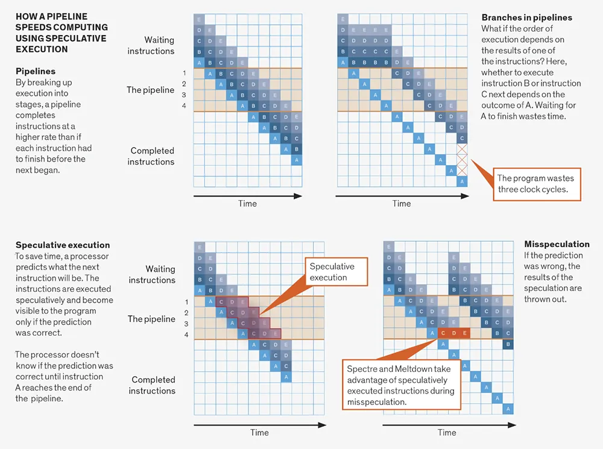
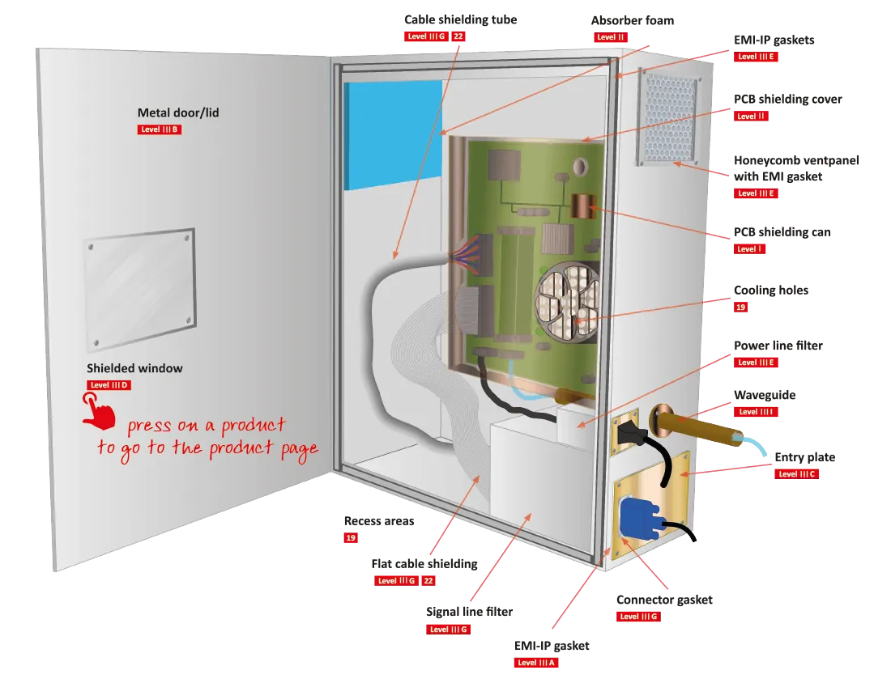
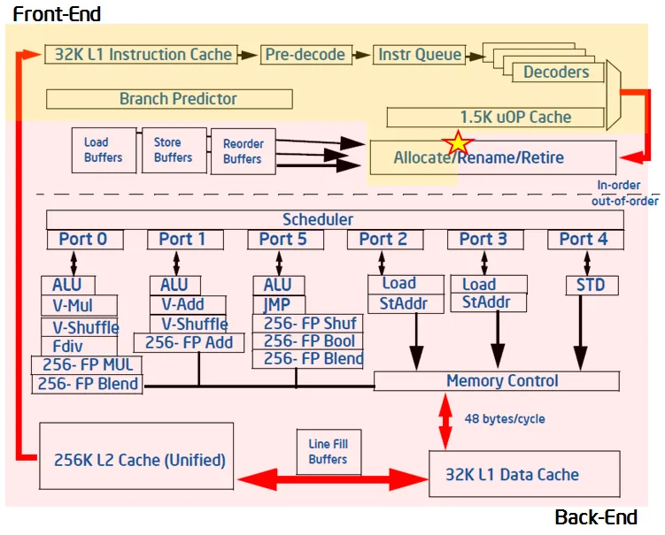
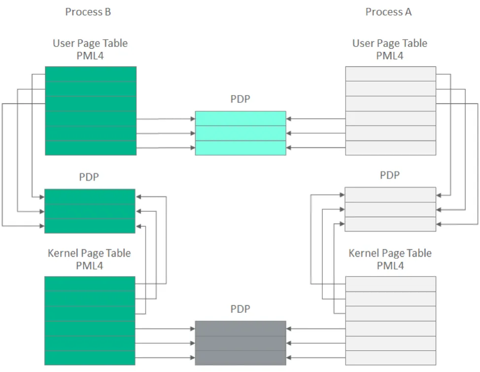
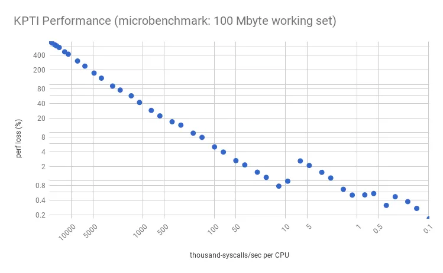

# Yan Kanal Saldırıları ve Donanımsal Sıkılaştırma

Yan kanal saldırıları (Side-Channel Attacks — SCA), kriptografik sistemin matematiksel zayıflığını değil; enerji tüketimi, elektromanyetik yayılım, zamanlama veya mikro-mimari durum değişimleri gibi fiziksel yan etkilerini analiz ederek gizli bilgileri elde etmeyi hedefler. Modern CPU'ların spekülatif yürütme optimizasyonları (Spectre, Meltdown ve türevleri) bu tehdit sınıfını yazılım katmanına taşımıştır.

Fortune 500 ölçeğindeki kurumsal yapılarda bu katman; veri merkezi fiziksel güvenlik zonları (Red/Black ayrımı), HSM cluster'ları, kripto işlem sunucuları ve çok-kiracılı bulut host'ları üzerinde konumlanır. Üst katmanlardaki (uygulama, ağ, kimlik) kontroller atlatıldığında son savunma hattı görevi görür. Bu bölümde fiziksel yan kanal teorisi, transient execution zafiyetleri, mikrokod/çekirdek mitigasyonları, HSM sıkılaştırması ve SOC entegrasyonu ele alınacaktır.


*Yan kanal saldırı vektörleri ve çok katmanlı savunma mimarisi*

---

## §3.3.1. Güç Analizi ve Elektromanyetik Yayılım

### Fiziksel Sızıntı Teorisi

CMOS entegre devreler, lojik geçişlerde parazit kapasitörlerin şarj/deşarj olmasıyla akım çeker. Bu dinamik güç tüketimi, işlenen verinin yapısına göre mikroskobik düzeyde değişir.

**Hamming Weight (HW) modeli:** Bir veri yolundaki lojik 1 bit sayısı güç tüketimiyle doğru orantılıdır:

```
P(t) = α · HW(data) + β
```

**Hamming Distance (HD) modeli:** Yazmaç durum geçişlerindeki bit farkları (XOR Hamming ağırlığı) güç tüketimini belirler; paralel veri yollarında HW'den daha doğrudur.

### Güç Analizi Saldırıları

| Saldırı | Mekanizma | Hedef |
| :---- | :---- | :---- |
| **SPA (Simple Power Analysis)** | Tek güç izinde RSA üs alma adımlarını görsel ayırt etme | RSA, ECC |
| **DPA (Differential Power Analysis)** | Binlerce izin istatistiksel korelasyonu | AES-128/256 |
| **CPA (Correlation Power Analysis)** | Pearson/Hamming distance korelasyonu | Genel simetrik şifreler |

DPA, "Ortalamaların Farkı" yöntemini kullanır: tahmin edilen anahtar adayları için güç izleri iki kümeye ayrılır; doğru anahtar zaman alanında belirgin DPA tepe noktaları oluşturur. ~500.000 güç izi ile AES anahtarı kurtarılabilir.

### Yazılım Tabanlı Modern Varyant: PLATYPUS

Fiziksel erişim olmadan **Intel RAPL (Running Average Power Limit)** arayüzü üzerinden güç telemetrisi okunarak AES-NI, SGX enclave veya kernel anahtarları sızdırılabilir. Co-located VM veya process senaryolarında (cloud/multi-tenant) ciddi tehdit oluşturur.


*Güç analizi saldırı düzeneği: hedef cihaz, osiloskop ve diferansiyel prob*

### Elektromanyetik Analiz (EMA)

Entegre devreler her clock cycle için karakteristik EM alan yayar. Near-field anten + osiloskop veya SDR ile 1-2 metre mesafeden kayıt mümkündür (**van Eck phreaking**). EMA, güç hattına fiziksel müdahale gerektirmez; belirli bir alt birime (kripto hızlandırıcı) odaklanabilir.

2025'te yayınlanan **PhaseSCA** çalışması, EM yayılımlarda faz modülasyonlu sızıntıları keşfetmiş; ucuz SDR donanımıyla tam AES anahtar kurtarma mümkün hale gelmiştir.

### Savunma Stratejileri

**1. Sabit Zamanlı (Constant-Time) Kriptografi**

```c
// Timing-safe karşılaştırma
int constant_time_memcmp(const void *a, const void *b, size_t n) {
    const unsigned char *ca = a, *cb = b;
    unsigned char result = 0;
    for (size_t i = 0; i < n; i++)
        result |= ca[i] ^ cb[i];
    return result;
}
```

**2. Maskeleme (Masking) ve Gizleme (Hiding)**
- Birinci mertebe maskeleme: DPA'ya karşı etkili; yüksek mertebe ikinci/üçüncü mertebe saldırılara direnç.
- Rastgele jitter, yapay gürültü jeneratörleri, dual-rail dynamic logic.

**3. Donanım Hızlandırma**
- **AES-NI:** Tablo aramaları yerine sabit-zamanlı yürütme; cache-timing saldırılarına avantaj.

OpenSSL, libsodium, BearSSL gibi sabit-zamanlı kütüphaneler tercih edilmelidir.

---

## §3.3.2. TEMPEST ve Fiziksel Ekranlama

**TEMPEST** (Telecommunications Electronics Materials Protected from Emanating Spurious Transmissions), NSA/CSS ve NATO'nun istenmeyen EM yayılımlara karşı koruma standartlarının genel adıdır. **Red/Black** konseptinde hassas (Red) sinyaller normal (Black) sinyallerden fiziksel ve elektriksel olarak izole edilir.

### NATO SDIP-27 Seviyeleri

| Seviye | NATO Karşılığı | Zone | Mesafe Varsayımı | Mühendislik Gereksinimi |
| :---- | :---- | :---- | :---- | :---- |
| **Level A** | FULMAR / NSTISSAM I | Zone 0 | ~1 m (komşu oda) | Tam ekranlı cihaz, güç filtresi |
| **Level B** | BREVEL / NSTISSAM II | Zone 1 | ~20 m | Ferrit nüveli kablolar, filtrelenmiş güç |
| **Level C** | CONUS / NSTISSAM III | Zone 2 | ~100 m (taktik) | Endüstriyel metal kasa, topraklama |

Deklasifiye NSA spesifikasyonu: 1 kHz–10 GHz arası minimum 100 dB ekleme kaybı (insertion loss). Emisyon limitlerinin gerçek değerleri gizlidir.

### Fiziksel Koruma Yöntemleri

- **Faraday kafesi:** Şasi tasarımında EM dalga sızmasını engeller.
- **Ferrit halkalar (beads):** Yüksek frekanslı parazitleri sönümler.
- **LC güç filtreleri:** Conducted emissions önleme.
- **Absorber foam, masking noise jeneratörleri:** SNR düşürme.


*TEMPEST koruma seviyeleri ve fiziksel zone sınıflandırması*

:::danger
Zırhlama cihaz tasarım aşamasında planlanmazsa sonradan uygulanması çok maliyetlidir. Kritik kripto donanımları için TEMPEST Level A/B gereksinimleri proje başında tanımlanmalıdır.
:::

---

## §3.3.3. Transient Execution Zafiyetleri (Spectre, Meltdown ve Türevleri)

2018'de Google Project Zero tarafından açıklanan **Meltdown** ve **Spectre**, modern CPU'ların spekülatif yürütme ve out-of-order execution optimizasyonlarını istismar eder. Yanlış tahmin sonuçları geri alınır (retire edilmez) ama **L1 veri cache'indeki mikro-mimari yan etkiler geri alınmaz**.

### Temel Mekanizma

```
CPU Branch → Spekülatif Tahmin → Out-of-Order Exec → Yetki kontrolünden önce bellek oku
                                                          ↓
                                              Tahmin yanlış → İptal
                                                          ↓
                                              Mikro-mimari iz kalır (cache)
                                                          ↓
                                              Flush+Reload → Veri sızdırma
```

### Zafiyet Tablosu

| Saldırı | CVE | Hedef | Mikro-mimari Nedeni |
| :---- | :---- | :---- | :---- |
| **Meltdown** | CVE-2017-5754 | Intel (6-11. Nesil), bazı ARM | Gecikmeli user/supervisor yetki kontrolü |
| **Spectre v1** | CVE-2017-5753 | Intel, AMD, ARM, RISC-V | Bounds check bypass (BPU) |
| **Spectre v2** | CVE-2017-5715 | Intel, AMD, ARM | Branch target injection (BTB) |
| **Foreshadow/L1TF** | CVE-2018-3615/3620/3646 | Intel SGX, kernel, VMM | L1 terminal fault |
| **MDS (ZombieLoad/RIDL/Fallout)** | CVE-2018-12126/30/27 | Intel | Store/Fill/Load buffer sızıntısı |
| **TAA (ZombieLoad v2)** | CVE-2019-11135 | Intel TSX | TSX Async Abort |
| **Retbleed** | CVE-2022-29900/01 | Intel 6-8, AMD Zen 1-2 | RSB boşalması, Retpoline bypass |
| **Downfall (GDS)** | CVE-2022-40982 | Intel Gather (Skylake-Tiger Lake) | Vektör register sızıntısı; SGX bypass |
| **Inception (SRSO)** | CVE-2023-20569 | Tüm AMD Zen (Zen 4 dahil) | Phantom jumps, RET tahmin manipülasyonu |
| **Zenbleed** | CVE-2023-20593 | AMD Zen 2 | Vector register sızıntısı |
| **Hertzbleed** | CVE-2022-24436/23823 | Intel, AMD, Ampere | DVFS frekans yan kanalı |
| **Collide+Power** | CVE-2023-20583 | Tüm CPU | Paylaşımlı güç hattı |
| **LVI, RETBleed, BHI** | CVE-2020-0551 / CVE-2022-0001 | Intel | Load value injection, branch history |


*Spekülatif yürütme sırasında önbellek yan etkilerinin kalıcılığı*

### Flush+Reload Sömürme Metodolojisi

1. **Flush:** `clflush` ile paylaşım dizisinin tüm satırları cache'den temizlenir.
2. **Tetikleme:** Hedef spekülatif yürütmeye zorlanır; gizli veri `paylaşım_dizisi[veri * 4096]` ile cache'e yüklenir.
3. **Reload:** Her sayfa elemanına erişim süresi `rdtscp` ile ölçülür; hızlı erişim (< 50 döngü) = veri cache'de = sızan veri.

```c
unsigned long long t1, t2;
volatile unsigned char *addr = &shared_array[index * 4096];
t1 = __rdtscp(&aux);
*addr;  // cache hit test
t2 = __rdtscp(&aux);
// (t2 - t1) < 50 → cache hit → secret byte = index
```

### Downfall ve Inception Derinlemesi

**Downfall (Daniel Moghimi, Google):** Gather komutu spekülatif yürütme sırasında iç vektör register dosyasını sızdırır. Skylake'ten Tiger Lake'e kadar etkiler; Intel SGX'i baltalar. Intel'e Ağustos 2022'de bildirildi, kamu açıklaması 9 Ağustos 2023.

**Inception (ETH Zurich):** RET dönüş adresi tahminini manipüle eder; Phantom speculation (CVE-2022-23825) + Training in Transient Execution (TTE) kombinasyonu. Tüm AMD Zen CPU'larda keyfi kernel belleği sızdırır.

**Hertzbleed:** DVFS güç tüketimine bağlı frekans değişimini uzaktan timing'e çevirir. Intel "tüm işlemciler etkilenmiştir" dedi; ne Intel ne AMD yama yayımladı — savunma uygulama/kripto kütüphane seviyesindedir (masking, key rotation, Turbo devre dışı).


*2018'den bu yana ortaya çıkan transient execution zafiyet ailesi*

:::caution
Mimari yeniden tasarım olmadan tam çözüm yoktur. Yeni transient-execution CVE'si yayınlandığında mikrokod + OS + hipervizör yamalarını eşzamanlı uygulayın. `Mitigation: None` görülen host'ları acil işaretleyin.
:::

---

## §3.3.4. Mikrokod Güncellemeleri ve Çekirdek Seviyesi İzolasyon

### Mikrokod Dağıtımı

Intel `intel-microcode` ve AMD mikrokod paketleri OS seviyesinde dağıtılır; kalıcı yamalar UEFI/AGESA üzerinden gelir. Çoğu Spectre v2 ve MDS düzeltmesi mikrokod + OS + hipervizör birlikte gerektirir.

```bash
grep . /sys/devices/system/cpu/vulnerabilities/*
dmesg | grep -i microcode
```

Örnek çıktı:
```
spectre_v2:     Mitigation: Enhanced IBRS, IBPB: conditional, RSB filling
meltdown:       Mitigation: PTI
mds:            Mitigation: Clear CPU buffers; SMT disabled
downfall:       Mitigation: Clear CPU buffers
```

### Kernel İzolasyon Mekanizmaları

| Mekanizma | Hedef | Açıklama | Performans |
| :---- | :---- | :---- | :---- |
| **KPTI (PTI)** | Meltdown | Kernel/user sayfa tablolarını ayırır | %5-30 (I/O yoğun) |
| **Retpoline** | Spectre v2 | Indirect call/jump → return trampoline | Düşük |
| **IBRS/IBPB** | Spectre v2 | Mikrokod MSR: SPEC_CTRL | Orta |
| **eIBRS** | Spectre v2 | Boot'ta bir kez set; modern Intel'de düşük overhead | Düşük |
| **STIBP** | Cross-thread | SMT üzerinden branch predictor izolasyonu | Orta-yüksek |
| **SSBD** | Speculative Store Bypass | Store bypass devre dışı | Düşük |
| **SMEP/SMAP** | Execution/Access | Supervisor mode koruması | Minimal |
| **CET** | ROP/JOP | Shadow stack + indirect branch tracking | Düşük |


*KPTI: kernel ve user-space sayfa tablolarının ayrılması*

PCID/INVPCID (Westmere 2010 / Haswell 2013) KPTI overhead'ini önemli ölçüde azaltır. eIBRS destekli modern CPU'larda retpoline çalışma zamanında otomatik devre dışı kalır.

### SMT (Hyper-Threading) Yönetimi

MDS CVE'leri için SMT devre dışı bırakma tam mitigasyon gerektirebilir; ciddi performans etkisi taşır. Hassas workload'larda (HSM host, kripto sunucu, çok-kiracılı bulut) SMT kapatılması önerilir.

```bash
cat /sys/devices/system/cpu/smt/active
# 0 = SMT disabled
```

### Sanallaştırma Ortamları

- **AMD SEV (Secure Encrypted Virtualization):** VM bellek şifreleme; cross-VM Spectre yüzeyini daraltır.
- **Intel TDX (Trust Domain Extensions):** İzole trust domain'ler; bulut ortamında bellek koruması.
- **Proxmox/KVM:** `kvm_intel` / `kvm_amd` modül parametreleri ile mitigations zorunlu; nested virtualization'da IBPB on VMEXIT.

:::note
BHI gibi açıklar unprivileged eBPF ile istismar edilebildiğinden, unprivileged eBPF'in kapatılması bir mitigasyondur.
:::

---

## §3.3.5. Kriptografik Donanım Sıkılaştırması ve HSM

### HSM (Hardware Security Module)

Thales Luna, Entrust nShield (nCipher), AWS CloudHSM. Finansal/ödeme HSM'leri ve CA özel anahtarları tipik olarak **FIPS 140-3 Level 3** hedefler.

### FIPS 140-3 Seviyeleri

| Seviye | Gereksinimler |
| :---- | :---- |
| **Level 3** | Tamper-detection ve tepki (CSP zeroization); identity-based auth; fiziksel/mantıksal arayüz ayrımı; EFP/EFT |
| **Level 4** | Her yönden tamper tespiti; çevresel arıza koruması; fault injection koruması; çok faktörlü kimlik doğrulama |

FIPS 140-3'te yan kanal testi (non-invasive security) opsiyonel gereksinim olarak eklendi. Level 4 bile yüksek-mertebeli yan kanal veya lazer fault injection'ı kapsamaz; düzenli güvenlik değerlendirmesi şarttır.

### ROCA (CVE-2017-15361) — Infineon TPM

Infineon RSALib 1.02.013 "Fast Primes" RSA asal üretimi, Coppersmith saldırısıyla genel anahtardan özel anahtar hesaplanmasına izin verir. 512, 1024 ve 2048-bit anahtarlar etkilenir.

- Küresel TPM'lerin yaklaşık dörtte biri etkilendi.
- Estonya ~750.000 e-kimlik kartı askıya alındı/yenilendi.
- 1024-bit: ~97 vCPU günü ($40-80); 2048-bit: ~51.400 vCPU günü ($20.000-40.000).
- Windows TPM.MSC Event ID 1794; NSA aracı: `nsacyber/Detect-CVE-2017-15361-TPM`.

---

## §3.3.6. Savunma Araçları ve SOC Entegrasyonu

### Zafiyet Tarama ve Test

```bash
# spectre-meltdown-checker
sudo ./spectre-meltdown-checker.sh

# Kernel mitigation durumu
for f in /sys/devices/system/cpu/vulnerabilities/*; do
    echo "$f: $(cat $f)"
done

# Retpoline kontrolü
grep CONFIG_MITIGATION_RETPOLINE /boot/config-$(uname -r)
```

| Araç | İşlev |
| :---- | :---- |
| **spectre-meltdown-checker** | CPU zafiyet/mitigasyon fleet-wide compliance |
| **ChipWhisperer** | DPA/EMA saldırı simülasyonu ve donanım dayanıklılık testi |
| **Wazuh SCA** | Kernel vulnerability telemetry + compliance skorları |

### Wazuh / SIEM Kuralı Örneği

```xml
<group name="hardware,vulnerability,">
  <rule id="100501" level="12">
    <decoded_as>json</decoded_as>
    <field name="vulnerability">Mitigation: None</field>
    <description>CRITICAL: CPU transient execution zafiyeti için mitigasyon uygulanmamış</description>
    <mitre><id>T1622</id></mitre>
  </rule>
</group>
```

### Altyapı Sıkılaştırma Kontrol Listesi

| Kontrol | Komut / Eylem | Hedef |
| :---- | :---- | :---- |
| Mikrokod güncel | `dmesg \| grep microcode` | En son sürüm |
| KPTI aktif | `grep meltdown /sys/.../vulnerabilities/meltdown` | Mitigation: PTI |
| Retpoline/eIBRS | `grep spectre_v2 /sys/.../vulnerabilities/spectre_v2` | Enhanced IBRS |
| SMT durumu | `cat /sys/devices/system/cpu/smt/active` | Kritik host'ta 0 |
| ROCA testi | `Detect-CVE-2017-15361-TPM` | Tüm TPM'ler |
| Constant-time crypto | OpenSSL/BearSSL build doğrulama | Üretim uygulamaları |

---

## §3.3.7. Standartlar, Mevzuat ve Uyum

### Uluslararası Standart Eşlemesi

| ISO 27001:2022 | NIST SP 800-53 Rev. 5 | CIS Controls v8 |
| :---- | :---- | :---- |
| **A.8.24** Use of cryptography | **SC-12/13** Key establishment/management | Control 3 |
| **A.11.1** Physical security perimeter | **PE-18** Location of components | Control 5 |
| **A.8.8** Vulnerability management | **SC-39** Process isolation | Control 7 |
| **A.8.24** Cryptography | **SC-28** Protection at rest | Control 3 |

**MITRE ATT&CK:** T1600 (Weaken Encryption), T1622 (Debugger Evasion).

### Türkiye Mevzuatı

**KVKK (6698) — MADDE 12:** Kişisel verilerin korunması için donanım seviyesinde yeterli güvenlik önlemleri. Yan kanal ile anahtar sızıntısı veri ihlali olarak değerlendirilir; 72 saat içinde bildirim zorunluluğu.

**5651 Sayılı Kanun:** Erişim/hosting sağlayıcı log tutma yükümlülüğü (1-2 yıl). Donanım güvenlik olaylarına ilişkin loglar bu kapsamdadır.

**BDDK Yönetmeliği:** Kripto anahtar yönetimi, HSM prosedürleri, fiziksel güvenlik (MADDE 17), loglama ve olay yönetimi zorunludur.

**7545 Sayılı Siber Güvenlik Kanunu (2025):** Kritik altyapı koruması; ulusal siber savunma yükümlülükleri güçlendirildi.

---

## §3.3.8. Sonuç ve Mimari Tavsiyeler

Yan kanal saldırıları kriptografik algoritmaların matematiksel gücünü değil, donanımın fiziksel ve mikro-mimari zaaflarını hedef alır. Savunma derinliği yaklaşımı üç katmanlı strateji gerektirir.

### Üç Katmanlı Savunma

| Katman | Kontroller |
| :---- | :---- |
| **Donanım** | TEMPEST zırhlama, mikrokod güncellemeleri, SMT yönetimi, FIPS 140-3 HSM |
| **İşletim Sistemi** | KPTI, Retpoline, eIBRS/STIBP/SSBD, CET |
| **Uygulama** | Sabit-zamanlı kriptografi, maskeleme, AES-NI, key rotation |

### Operasyonel Öncelikler

| Aşama | Süre | Eylem |
| :---- | :---- | :---- |
| **0 — Envanter** | 0-30 gün | `grep vulnerabilities/*` fleet taraması; `Mitigation: None` host'ları işaretle |
| **1 — Yamalama** | 30-90 gün | Mikrokod + OS + hipervizör eşzamanlı; ROCA testi tüm TPM'lerde |
| **2 — Mimari** | 90-180 gün | Kripto operasyonlarını FIPS 140-3 L3 HSM'e taşı; SEV/TDX değerlendir |
| **3 — Sürekli** | Devam | spectre-meltdown-checker compliance; yeni CVE tetikleyicileri |

### Saldırı-Savunma Dengesi

| Ofansif (Saldırgan) | Defansif (Mavi Takım) |
| :---- | :---- |
| SDR + osiloskop ile EM toplar | TEMPEST Level A/B zırhlama (100 dB) |
| 500K güç izi ile DPA uygular | Yüksek mertebe maskeleme |
| Spectre v2 ile kernel verisi okur | Retpoline + eIBRS |
| RAPL ile güç telemetrisi sızdırır | RAPL erişimini kısıtla / izole et |
| SMT üzerinden yan kanal oluşturur | Hassas workload'da SMT kapat |
| Mikrokod yamalı olmayan host hedefler | Otomatik güncelleme politikası |

### Mimari Referans Modeli

```
┌─────────────────────────────────────────────────────────────────┐
│  KATMAN 1: FİZİKSEL (TEMPEST, Faraday, HSM Level 3/4)          │
├─────────────────────────────────────────────────────────────────┤
│  KATMAN 2: MİKROKOD + CPU (IBRS, eIBRS, SSBD, SMT policy)     │
├─────────────────────────────────────────────────────────────────┤
│  KATMAN 3: ÇEKİRDEK (KPTI, Retpoline, CET, SMEP/SMAP)         │
├─────────────────────────────────────────────────────────────────┤
│  KATMAN 4: SANALLAŞTIRMA (SEV, TDX, dedicated host)           │
├─────────────────────────────────────────────────────────────────┤
│  KATMAN 5: UYGULAMA (Constant-time crypto, AES-NI, masking)    │
├─────────────────────────────────────────────────────────────────┤
│  KATMAN 6: SOC (spectre-meltdown-checker, Wazuh, compliance)   │
├─────────────────────────────────────────────────────────────────┤
│  UYUM: NIST SC/PE + ISO A.8.24 + KVKK + BDDK + 7545           │
└─────────────────────────────────────────────────────────────────┘
```

### Performans ve Risk Dengesi

KPTI ve SMT disable gibi mitigations performans kaybına yol açar. Risk assessment (NIST RA-5, ISO 27001 A.8.8) ile kritik workload'lar (kripto, PII işleme) için tam mitigation, genel workload'lar için dengeli konfigürasyon uygulanır. Staging ortamında tam test + phased rollout şarttır.

:::note
Hertzbleed ve ROCA türü açıklarda OS/mikrokod yaması yoktur veya sınırlıdır. Hertzbleed için savunma uygulama/kripto kütüphane seviyesindedir: masking, key rotation, Turbo/Precision Boost devre dışı bırakma — yüksek performans maliyetiyle.
:::

Bu katman doğru kurgulandığında, üst katmanlardaki kontrollerin atlatılması durumunda bile kriptografik materyal ve hassas bellek içeriği korunur. SOC operasyonlarında bu zafiyetler "patch compliance" ve "physical security event correlation" use-case'leri olarak kalıcı izlenmelidir.