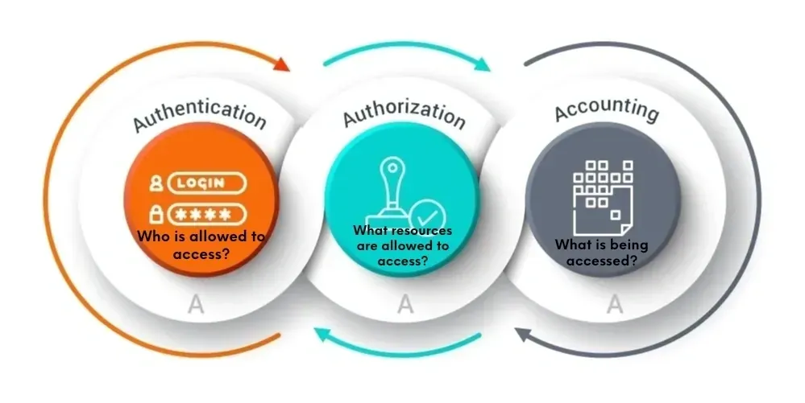
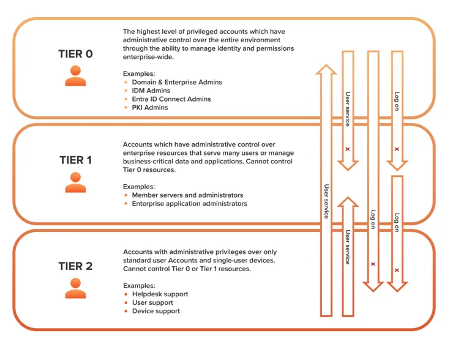
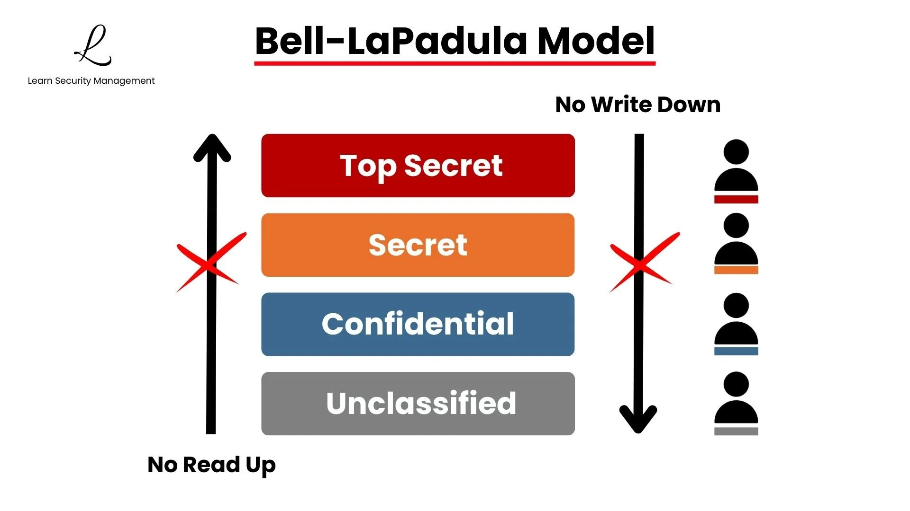
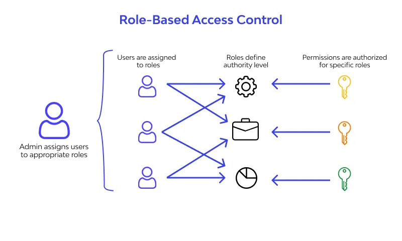
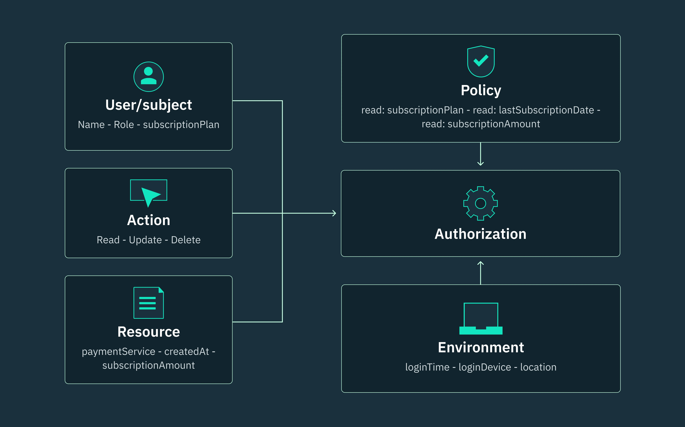

# Kimlik Yönetimi (IAM) ve Formel Erişim Kontrol Modelleri

Kimlik ve Erişim Yönetimi (Identity and Access Management — IAM), modern siber güvenlik mimarisinin **yeni çevre güvenliği (new perimeter)** katmanıdır. Geleneksel ağ sınırları (firewall, DMZ, VPN) hibrit ve bulut ortamlarında giderek anlamını yitirirken; **doğru özneye, doğru kaynağa, doğru zamanda ve doğru gerekçeyle** erişim sağlamak kurumsal savunmanın merkezine taşınmıştır. Fortune 500 ölçeğindeki kurumlarda IAM; on-prem Active Directory, Microsoft Entra ID, bulut IAM (AWS IAM, Azure RBAC), ağ erişim kontrolü (NAC) ve SIEM/SOAR entegrasyonunun kesişim noktasında konumlanır.

Bu bölüm, IAM'ın üç temel direği olan **AAA (Authentication, Authorization, Accounting)** çerçevesini; kurumsal kimlik omurgası **Active Directory/LDAP** güvenlik tasarımını; ve yetkilendirme kararlarının mantıksal temelini oluşturan **formel erişim kontrol modellerini** (MAC, DAC, RBAC, ABAC) SOC analistleri ve güvenlik mimarları için operasyonel derinlikte ele alır. Standart referansları **NIST SP 800-53 Rev. 5**, **ISO/IEC 27001:2022**, **CIS Controls v8** ve **MITRE ATT&CK** ile eşleştirilir; Türkiye özelinde **KVKK**, **5651 Sayılı Kanun** ve **BDDK BSEBY** yükümlülükleri işlenir.

---

## §4.1.1. AAA Çerçevesi: RADIUS ve TACACS+

Tüm IAM sistemleri, **AAA** olarak bilinen üç aşamalı model üzerine inşa edilir. Bu model, kimlik merkezli güvenliğin operasyonel omurgasıdır ve ağ erişiminden cihaz yönetimine, bulut konsol oturumlarından uygulama API'lerine kadar her erişim katmanında tekrarlanır.


*AAA (Doğrulama, Yetkilendirme, Hesap Verebilirlik) döngüsü: Kimlik kanıtı → yetki kararı → denetim kaydı*

### Doğrulama (Authentication) — "Sen kimsin?"

Doğrulama, bir özne (kullanıcı, cihaz, servis hesabı) tarafından sunulan **kimlik iddiasının (credential claim)** güvenilir bir kaynak tarafından doğrulanması sürecidir. Modern kurumsal ortamlarda doğrulama katmanları şu şekilde yapılandırılır:

| Katman | Mekanizma | Güvence Seviyesi |
| :---- | :---- | :---- |
| **Bilgi faktörü** | Parola, PIN, güvenlik sorusu | Düşük (phishing/sızıntı riski) |
| **Sahip olma faktörü** | TOTP, SMS OTP, push notification | Orta (OTP fatigue, SIM swap) |
| **Varlık faktörü** | FIDO2/WebAuthn, akıllı kart, sertifika | Yüksek (origin binding) |
| **Bağlam faktörü** | Konum, cihaz duruşu, davranış biyometrisi | Tamamlayıcı (risk skoru) |

**NIST SP 800-53 IA-2** kapsamında tüm kurumsal hesaplar için çok faktörlü kimlik doğrulama (MFA) zorunluluğu; ayrıcalıklı hesaplar için **IA-2(1)** (MFA — ağ erişimi) ve **IA-2(2)** (MFA — ayrıcalıklı erişim) kontrol geliştirmeleri uygulanmalıdır. **CIS Controls v8 Safeguard 6.3** tüm yönetici hesaplarında MFA kullanımını en iyi uygulama olarak tanımlar.

:::note
AAA sunucusu (Microsoft NPS, Cisco ISE, FreeRADIUS, Palo Alto User-ID) kurumsal topolojide merkezi bir hizmet olarak konumlanır. **NAS (Network Access Server)** cihazları — 802.1X switch'ler, VPN gateway'leri, firewall'lar, kablosuz controller'lar — AAA protokolü üzerinden merkezi sunucuya istek gönderir.
:::

### Yetkilendirme (Authorization) — "Ne yapabilirsin?"

Kimliği doğrulanan öznenin hangi kaynaklara, hangi işlemler için erişebileceğine karar verilir. Yetkilendirme, bu bölümün §4.1.3 kısmında detaylandırılacak **formel erişim kontrol modelleri** (MAC, DAC, RBAC, ABAC) aracılığıyla uygulanır. AAA bağlamında yetkilendirme genellikle şu bileşenlerle gerçekleştirilir:

- **PEP (Policy Enforcement Point):** Erişim talebini yakalar ve kararı uygular (switch ACL, firewall policy, uygulama gateway).
- **PDP (Policy Decision Point):** Politika motoru; Allow/Deny kararı üretir (RADIUS attribute, AD grup üyeliği, ABAC motoru).
- **PIP (Policy Information Point):** Karar için öznitelik değerlerini sağlar (dizin, CMDB, tehdit istihbaratı).

**ISO/IEC 27001:2022 A.5.15** kontrolü, bilgiye erişimin iş ve güvenlik gereksinimlerine uygun olarak yalnızca yetkili öznelerle sınırlandırılmasını şart koşar.

### Hesap Verebilirlik (Accounting) — "Ne yaptın?"

Tüm kimlik doğrulama, yetkilendirme ve kaynak erişim olayları **zaman damgalı, değiştirilemez** log kayıtları olarak saklanır. **NIST SP 800-53 AU-2/AU-3** kapsamında denetlenebilir olay türleri tanımlanmalı; **AU-12** kapsamında bu olaylar SIEM platformuna aktarılmalıdır.

**Türkiye mevzuatı bağlamında:**

- **KVKK Madde 12:** Veri sorumlusu, kişisel verilerin hukuka aykırı işlenmesini ve erişilmesini önlemek için uygun güvenlik düzeyini sağlayan teknik tedbirleri almakla yükümlüdür. Kişisel Veri Güvenliği Rehberi; **erişim logları**, **yetki matrisi** ve **kullanıcı işlem hareket logları**nı açık teknik tedbir olarak listeler.
- **5651 Sayılı Kanun:** İnternet erişim loglarının zaman damgalı, değiştirilemez şekilde tutulması ve IP-kullanıcı eşlemesinin saklanması zorunludur (tipik saklama süresi 1–2 yıl).
- **BDDK BSEBY (Bankaların Bilgi Sistemleri ve Elektronik Bankacılık Hizmetleri Hakkında Yönetmelik):** Finansal kuruluşlarda güçlü kimlik doğrulama, ayrıcalıklı erişim kontrolü ve detaylı loglama yükümlülüğü getirir.

### RADIUS (RFC 2865) ve TACACS+ (RFC 8907)

Kurumsal AAA altyapısının omurgasını oluşturan iki protokol, farklı kullanım senaryolarına optimize edilmiştir:

| Kriter | RADIUS (RFC 2865, 3579) | TACACS+ (RFC 8907) |
| :---- | :---- | :---- |
| **Taşıma katmanı** | UDP (1812 auth, 1813 accounting) | TCP (49) |
| **AAA ayrımı** | Auth + Authz birleşik (Access-Request/Accept) | Üç faz bağımsız (START/CONTINUE/REPLY) |
| **Şifreleme kapsamı** | Yalnızca `User-Password` obfuscate | Tüm paket gövdesi (MD5 tabanlı) |
| **Komut yetkilendirme** | Yok | Var (CLI komut bazında) |
| **Tipik kullanım** | Son kullanıcı (Wi-Fi, VPN, 802.1X) | Ağ cihazı yönetimi (router/switch/firewall) |
| **Hata tespiti** | UDP retransmission timer | TCP connection reset |
| **Modern güvenlik** | RadSec (RADIUS over TLS) | RFC 9887 (TACACS+ over TLS 1.3, TCP 300) |

**RADIUS** protokolü, kimlik doğrulama ve yetkilendirmeyi tek bir istek-yanıt değişiminde birleştirir. Öznitelikler **Attribute-Value Pair (AVP)** yapısındadır; örneğin bir AVP kullanıcının VLAN ID'sini veya ayrıcalık seviyesini taşıyabilir. **EAP (Extensible Authentication Protocol — RFC 3748)** RADIUS üzerinden 802.1X kimlik doğrulamasını destekler.

**TACACS+** protokolü, Cisco tasarımı olup her AAA fazını bağımsız değişim olarak ele alır. En kritik özelliği **komut yetkilendirmesidir (command authorization)**: yönetici her CLI komutunu girdiğinde cihaz bu komutu TACACS+ sunucusuna gönderir; sunucu komutu yetkilendirir veya reddeder. Bu, ağ cihazı yönetiminde **en düşük ayrıcalık (least privilege)** ilkesinin granüler uygulanmasını sağlar.

:::caution
RFC 8907'nin MD5 tabanlı paket gizleme yöntemi kriptografik şifreleme **değildir** ve MD5'in bilinen zayıflıklarını taşır. Yüksek güvence ortamlarında **RFC 9887 (TACACS+ over TLS 1.3)** veya **RadSec** değerlendirilmelidir.
:::

### Mimari Konumlandırma ve Operasyonel Senaryo

Fortune 500 hibrit banka senaryosu:

1. Kullanıcı kurumsal laptop'undan VPN'e bağlanır.
2. FortiGate/FortiClient **RADIUS Access-Request** gönderir → NPS/Entra ID MFA doğrular.
3. Kullanıcı `Finance-Read` grubundaysa `Core-Banking` segmentine erişim yetkisi verilir (VLAN attribute).
4. Ağ yöneticisi switch'e SSH ile bağlanır → **TACACS+** komut yetkilendirmesi devreye girer; `configure terminal` izinli, `reload` reddedilir.
5. Tüm adımlar (başarılı/başarısız login, kaynak erişimi, oturum süresi, CLI komutları) Wazuh/Sentinel'e loglanır.

### Yapılandırma Örnekleri

**FreeRADIUS — `clients.conf` (NAS entegrasyonu):**

```ini
client core-switch-01 {
    ipaddr          = 10.0.10.2
    secret          = 'S3cr3t!Pre$haredKey'
    nas_type        = cisco
    require_message_authenticator = yes
}

client vpn-gateway-01 {
    ipaddr          = 10.0.20.5
    secret          = 'VpnR@d1usK3y!'
    nas_type        = other
    limit_proxy_state = yes
}
```

**FreeRADIUS — `users` dosyası (grup bazlı yetkilendirme):**

```
"jsmith" Cleartext-Password := "TempP@ss2026!"
    Tunnel-Type = VLAN,
    Tunnel-Medium-Type = IEEE-802,
    Tunnel-Private-Group-Id = "100",
    Reply-Message = "Finance VLAN assigned"
```

**Cisco IOS — TACACS+ ile AAA:**

```cisco
aaa new-model
!
tacacs server ISE-PRIMARY
 address ipv4 10.0.20.10
 key 7 <encrypted-key>
!
tacacs server ISE-SECONDARY
 address ipv4 10.0.20.11
 key 7 <encrypted-key>
!
aaa group server tacacs+ ISE-TACACS
 server name ISE-PRIMARY
 server name ISE-SECONDARY
!
aaa authentication login default group ISE-TACACS local
aaa authentication enable default group ISE-TACACS enable
aaa authorization exec default group ISE-TACACS local
aaa authorization commands 15 default group ISE-TACACS local
aaa accounting exec default start-stop group ISE-TACACS
aaa accounting commands 15 default start-stop group ISE-TACACS
!
line vty 0 15
 authorization commands 15 ISE-TACACS
 accounting commands 15 ISE-TACACS
```

**Cisco ISE — TACACS+ komut seti profili (JSON export):**

```json
{
  "name": "Network-Ops-ReadOnly",
  "permitCommands": [
    "show .*",
    "ping .*",
    "traceroute .*"
  ],
  "denyCommands": [
    "configure .*",
    "reload",
    "write .*",
    "copy .*"
  ],
  "shellProfile": "NOC-ReadOnly-Shell"
}
```

### Saldırı ve Savunma Dengesi

Saldırgan, AAA akışını istismar etmek için şu teknikleri kullanır:

| MITRE ATT&CK Tekniği | Açıklama | AAA Bağlamı |
| :---- | :---- | :---- |
| **T1110.001** | Password Spraying | Tek parola, çok hesap |
| **T1110.003** | Password Spraying (cloud) | Bulut IdP hedefli |
| **T1550.002** | Pass the Hash | NTLM hash ile oturum |
| **T1558.003** | Kerberoasting | SPN biletlerinin offline kırılması |
| **T1078** | Valid Accounts | Ele geçirilmiş meşru kimlik bilgileri |

**Savunma kontrolleri:**

- MFA zorunluluğu (NIST IA-2(1), IA-2(2))
- Brute-force throttling + account lockout politikası
- Anomali tabanlı accounting log analizi (UEBA)
- Just-In-Time (JIT) erişim (Entra ID PIM)
- RADIUS `Message-Authenticator` attribute zorunluluğu (BlastRADIUS mitigasyonu)

**Wazuh SIEM — başarısız kimlik doğrulama korelasyon kuralı:**

```xml
<group name="iam,authentication,">
  <rule id="100801" level="10" frequency="10" timeframe="120">
    <if_matched_sid>60103</if_matched_sid>
    <same_source_ip />
    <description>IAM: Aynı kaynak IP'den 2 dakikada 10+ başarısız oturum açma (olası password spray)</description>
    <mitre>
      <id>T1110</id>
    </mitre>
    <group>authentication_failed,</group>
  </rule>
</group>
```

**Splunk SPL — RADIUS/TACACS+ anomali tespiti:**

```spl
index=radius OR index=tacacs
| stats count(eval(status="Reject")) as rejects,
        count(eval(status="Accept")) as accepts
        by src_ip, user, _time span=5m
| where rejects > 20 AND accepts == 0
| eval risk_score=case(rejects>50, "critical", rejects>20, "high")
| table _time, src_ip, user, rejects, risk_score
```

### Standart Eşleştirmesi

| ISO 27001:2022 | NIST SP 800-53 Rev. 5 | CIS Controls v8 | Operasyonel Karşılık |
| :---- | :---- | :---- | :---- |
| **A.5.15** Access control | **AC-2** Account Management | Safeguard 5.1 | Hesap yaşam döngüsü |
| **A.8.5** Secure authentication | **IA-2** Identification and Authentication | Safeguard 6.3, 6.4 | MFA zorunluluğu |
| **A.8.15** Logging | **AU-2/AU-3** Audit Events | Safeguard 8.2 | AAA accounting logları |
| **A.8.16** Monitoring | **AU-6** Audit Review | Safeguard 8.11 | SIEM korelasyonu |

:::danger
RADIUS protokolünde yalnızca parola alanı gizlenir; kullanıcı adı ve diğer AVP'ler açık metin olarak iletilir. Ağ segmentasyonu ve RadSec/TLS kullanımı, AAA trafiğinin dinlenmesine karşı zorunlu savunma katmanıdır.
:::

---

## §4.1.2. Active Directory ve LDAP Mimarilerinde Güvenlik

Kurumsal ağların büyük çoğunluğu kimlik yönetimi için **Microsoft Active Directory Domain Services (AD DS)** veya **LDAP (Lightweight Directory Access Protocol)** kullanır. AD DS, Kerberos tabanlı kimlik doğrulama ve LDAP tabanlı dizin sorgularının merkezi deposudur; Domain Controller (DC) sunucuları ağın kimlik kalbidir.


*Katmanlı (Tier) Erişim Kontrol Modeli — Tier 0, Tier 1 ve Tier 2 ayrıcalık seviyeleri ve logon kısıtlamaları*

### Tiered Administration Model (Katmanlı Yönetim)

Microsoft **Enterprise Access Model (EAM)**, eski ESAE (Enhanced Security Administrative Environment) modelinin yerini almıştır. Savunma derinliği için üç katman tanımlar:

| Katman | Kapsam | Örnek Hesaplar / Varlıklar | Logon Kısıtı |
| :---- | :---- | :---- | :---- |
| **Tier 0** | Kimlik altyapısı | DC, AD CS, AD FS, Entra Connect, Domain/Enterprise Admins | Yalnızca Tier 0 sistemlerine |
| **Tier 1** | Üretim sunucuları | Uygulama sunucuları, veritabanları, dosya sunucuları | Tier 0'a logon **yasak** |
| **Tier 2** | Uç noktalar | Kullanıcı iş istasyonları, helpdesk cihazları | Tier 0/1'e logon **yasak** |

**Temel kurallar:**

1. Yüksek tier kimlik bilgileri düşük tier sistemlere **asla** expose edilmemelidir.
2. Düşük tier hesapları yüksek tier kaynaklara logon edemez.
3. Tier 0 yöneticileri yalnızca **PAW (Privileged Access Workstation)** veya bastion host'lardan çalışır.
4. Her yönetici için **dört ayrı hesap** modeli önerilir (ör. `ADMIN-T0-jsmith`, `ADMIN-T1-jsmith`).

:::caution
Tier 0 hesabının bir Tier 2 iş istasyonuna logon etmesi, Kerberos biletlerinin (TGT/TGS) bellekte ve LSASS sürecinde kalmasına neden olur. Saldırgan bu iş istasyonunu ele geçirdiğinde **Pass-the-Hash**, **Pass-the-Ticket** veya **Mimikatz** ile Tier 0 kimlik bilgilerine erişebilir. Bu, **MITRE ATT&CK T1550** ailesinin en yaygın lateral movement vektörlerinden biridir.
:::

### Kerberos Protokolü ve Saldırı Teknikleri

Kerberos akışı:

```
İstemci ──AS-REQ──► KDC (AS) ──TGT──► İstemci
İstemci ──TGS-REQ──► KDC (TGS) ──TGS (servis bileti)──► İstemci ──► Servis
```

| Saldırı | MITRE ATT&CK | Mekanizma | Tespit Göstergesi |
| :---- | :---- | :---- | :---- |
| **Golden Ticket** | T1558.001 | KRBTGT hash'i ile sahte TGT üretimi | Event 4768 (RC4 şifreleme, anormal ömür) |
| **Silver Ticket** | T1558.002 | Servis hesabı hash'i ile sahte TGS | Event 4624 (KDC bypass, yalnızca servis logu) |
| **Kerberoasting** | T1558.003 | SPN TGS biletlerinin offline kırılması | Event 4769 RC4 seli, anormal SPN sorguları |
| **AS-REP Roasting** | T1558.004 | Pre-auth devre dışı hesaplardan hash çalma | Event 4768 (pre-auth olmadan TGT) |
| **DCSync** | T1003.006 | Replication API ile hash çekme | Event 4662 (DS-Replication-Get-Changes) |

**Golden Ticket üretimi (yalnızca yetkili red team ortamında):**

```
# Mimikatz — Golden Ticket (OFANSİF)
kerberos::golden /domain:corp.local /sid:S-1-5-21-XXXXXXXXXX \
  /aes256:<KRBTGT-AES256-hash> /user:Administrator /id:500 \
  /groups:512 /ptt /startoffset:0 /endin:600 /renewmax:10080
```

:::danger
KRBTGT parolasının **iki kez** döndürülmesi (double rotation), aktif bir Golden Ticket'ı geçersiz kılmak için zorunludur. Tek döndürme yeterli değildir; eski ve yeni anahtarların her ikisi de geçerli kalır. Periyodik döndürme takvimi: 6–12 ay.
:::

### Savunma Kontrolleri

**Protected Users Security Group:**

Üyeler için NTLM, DES/RC4, Kerberos delegation ve cleartext credential caching devre dışı kalır; TGT ömrü 4 saate iner. Tier 0 hesapları bu gruba dahil edilmelidir.

**Authentication Policies ve Authentication Policy Silos:**

```powershell
# Tier 0 için Authentication Policy ve Silo oluşturma
New-ADAuthenticationPolicy -Name "Tier0_Policy" `
  -UserTGTLifetimeMins 240 `
  -EnforceKerberosArmoring $true `
  -ProtectedAccounts $true

New-ADAuthenticationPolicySilo -Name "Tier0_Silo" `
  -UserAuthenticationPolicy "Tier0_Policy" `
  -Enforced $true

Grant-ADAuthenticationPolicySiloAccess -Identity "Tier0_Silo" `
  -Account "ADMIN-T0-jsmith"

Set-ADUser -Identity "ADMIN-T0-jsmith" `
  -AuthenticationPolicySilo "Tier0_Silo"
```

**AdminSDHolder ve SDProp:**

`AdminSDHolder` nesnesi, korunan grupların (Domain Admins, Enterprise Admins vb.) ACL'lerini her 60 dakikada bir **SDProp** süreci ile zorla geri uygular. `AdminSDHolder` üzerindeki `WriteDACL` veya `GenericAll` izinleri "shadow admin" yollarını doğurur.

```powershell
# AdminSDHolder ACL denetimi (DEFANSİF)
$acl = Get-Acl "AD:\CN=AdminSDHolder,CN=System,DC=corp,DC=local"
$acl.Access | Where-Object {
  $_.IdentityReference -notmatch "SYSTEM|Domain Admins|Enterprise Admins"
} | Format-Table IdentityReference, ActiveDirectoryRights, AccessControlType
```

### LDAP Güvenliği: İmzalama, Kanal Bağlama ve CVE-2017-8563

**CVE-2017-8563** (Windows Elevation of Privilege), LDAPS'nin kimlik bilgisi yönlendirmesine (credential forwarding) karşı korumasız olmasından kaynaklanır. SYSTEM ayrıcalığına sahip bir saldırgan, gelen NTLM oturumlarını LDAP sunucusuna aktararak (LDAP relay) ayrıcalık yükseltme gerçekleştirebilir.

**Zorunlu kontroller:**

| Kontrol | Açıklama | Uygulama |
| :---- | :---- | :---- |
| **LDAP Signing** | LDAP mesajlarının bütünlük koruması | GPO: Domain controller: LDAP server signing requirements = Require signing |
| **LDAP Channel Binding** | TLS kanalı ile NTLM bağlantısının eşleştirilmesi | Registry: `LdapEnforceChannelBinding = 2` |
| **LDAPS (TCP 636)** | Şifreli LDAP iletişimi | Tüm LDAP client'lar TLS kullanmalı |
| **LDAPS Channel Binding** | LDAPS üzerinde ek bağlama | Windows Server 2025'te varsayılan |

```powershell
# LDAP Signing ve Channel Binding zorunlu kılma (DC registry)
Set-ItemProperty -Path "HKLM:\SYSTEM\CurrentControlSet\Services\NTDS\Parameters" `
  -Name "LdapEnforceChannelBinding" -Value 2 -Type DWord

# GPO ile LDAP signing (Group Policy Management)
# Computer Configuration → Policies → Windows Settings →
# Security Settings → Local Policies → Security Options →
# "Domain controller: LDAP server signing requirements" = Require signing
```

:::caution
LDAP signing ve channel binding etkinleştirilmeden önce, tüm LDAP client uygulamalarının (monitoring araçları, üçüncü parti IAM entegrasyonları, eski uygulamalar) uyumluluğu test edilmelidir. Uyumsuz client'lar dizin sorgularını tamamen kaybedebilir.
:::

### BloodHound ile Saldırı Yolu Analizi

**SharpHound**, AD ilişkilerini (grup üyelikleri, oturumlar, ACL'ler, SPN'ler) toplar; **BloodHound** graf veritabanında en kısa saldırı yollarını hesaplar.

```cypher
// BloodHound — Domain Admins'e en kısa yol (DEFANSİF analiz)
MATCH p=shortestPath(
  (u:User {owned:true})-[*1..]->(g:Group {name:"DOMAIN ADMINS@CORP.LOCAL"})
)
RETURN p

// Kerberoastable hesaplar
MATCH (u:User) WHERE u.hasspn=true AND u.enabled=true
RETURN u.name, u.serviceprincipalnames
```

**Savunma hedefi:** BloodHound analizi sonrası Domain Admins'e **beş adımdan az, aktif sömürü gerektirmeyen sıfır doğrudan yol** hedeflenmelidir.

### SIEM Entegrasyonu ve Kritik Event ID'ler

| Event ID | Açıklama | SOC Önceliği |
| :---- | :---- | :---- |
| **4624** | Başarılı oturum açma | Logon Type 3/10 izleme |
| **4625** | Başarısız oturum açma | Brute-force tespiti |
| **4648** | Açık kimlik bilgisiyle oturum | Lateral movement |
| **4768** | Kerberos TGT istendi | Golden Ticket / AS-REP Roast |
| **4769** | Kerberos TGS istendi | Kerberoasting (RC4 seli) |
| **4662** | Dizin servisi erişimi | DCSync tespiti |
| **4728/4732/4756** | Grup üyelik değişikliği | Yetki yükseltme |
| **5136** | Dizin nesnesi değiştirildi | AD persistence |

**Wazuh — Kerberoasting tespit kuralı:**

```xml
<rule id="100820" level="12">
  <if_sid>60103</if_sid>
  <field name="win.system.eventID">^4769$</field>
  <field name="win.eventdata.ticketEncryptionType">0x17</field>
  <description>AD: Kerberoasting göstergesi — RC4 şifreli TGS talebi (T1558.003)</description>
  <mitre><id>T1558.003</id></mitre>
  <group>active_directory,kerberos,</group>
</rule>
```

**Wazuh — DCSync tespit kuralı:**

```xml
<rule id="100821" level="14">
  <if_sid>60103</if_sid>
  <field name="win.system.eventID">^4662$</field>
  <field name="win.eventdata.properties">DS-Replication-Get-Changes</field>
  <description>AD: Olası DCSync saldırısı — replication API erişimi (T1003.006)</description>
  <mitre><id>T1003.006</id></mitre>
  <group>active_directory,critical,</group>
</rule>
```

### Standart Eşleştirmesi

| ISO 27001:2022 | NIST SP 800-53 Rev. 5 | CIS Controls v8 | Operasyonel Karşılık |
| :---- | :---- | :---- | :---- |
| **A.5.16** Identity management | **AC-2** Account Management | Safeguard 5.1 | Hesap yaşam döngüsü |
| **A.8.2** Privileged access rights | **AC-6** Least Privilege | Safeguard 5.4 | Tier model, PAW |
| **A.8.3** Information access restriction | **AC-5** Separation of Duties | Safeguard 6.8 | Rol ayrımı |
| **A.8.5** Secure authentication | **IA-5** Authenticator Management | Safeguard 4.7 | KRBTGT rotation, gMSA |

---

## §4.1.3. Formel Erişim Kontrol Modelleri

Yetkilendirme kararlarının hangi mantıksal çerçevede alınacağını belirleyen dört temel model, kurumsal güvenlik politikalarının matematiksel ve operasyonel temelini oluşturur. Her model farklı güvenlik gereksinimlerine optimize edilmiştir; pratikte çoğu kurum **hibrit** bir yaklaşım (RBAC + ABAC) benimser.

### Zorunlu Erişim Kontrolü (MAC — Mandatory Access Control)

Sistem genelinde merkezi olarak tanımlanan ve kullanıcıların değiştiremeyeceği kurallara dayalı erişim kontrolüdür. Kaynak sahibinin erişim kararında söz hakkı yoktur.


*Bell-LaPadula Modeli: No Read Up (Simple Security Property) ve No Write Down (*-Property) kuralları*

#### Bell-LaPadula Modeli (Gizlilik Odaklı)

ABD Savunma Bakanlığı için geliştirilmiş formel durum-makinesi modelidir. İki temel kural:

- **Simple Security Property ("no read up"):** Özne, kendi güvenlik seviyesinin **üzerindeki** nesneyi okuyamaz.
- **\*-Property ("no write down"):** Özne, kendi güvenlik seviyesinin **altındaki** nesneye yazamaz.

Askeri sınıflandırma hiyerarşisi: **TS (Top Secret) > S (Secret) > C (Confidential) > U (Unclassified)**. Tranquility (durağanlık) özellikleri, güvenlik etiketlerinin işlem sırasında değişmemesini garanti eder.

#### Biba Modeli (Bütünlük Odaklı)

Bell-LaPadula'nın **tersi**dir:

- **"No read down":** Düşük bütünlük seviyesindeki veriden okuma yapılamaz.
- **"No write up":** Düşük bütünlük seviyesindeki veriye yazılamaz.

Finansal sistemlerde, güvenilmez kaynakların güvenilir veriyi bozmasını engeller. **NIST SP 800-53 AC-4** (Information Flow Enforcement) bu tür akış kontrollerini kapsar.

#### Clark-Wilson ve Lipner Modelleri

- **Clark-Wilson:** Ticari bütünlük modeli; iyi biçimlendirilmiş işlemler (well-formed transactions), dönüşüm prosedürleri (TP) ve görevler ayrılığı (SoD) ile veri bütünlüğünü korur. ERP ve muhasebe sistemlerinde uygulanabilir.
- **Lipner Integrity Matrix:** Bell-LaPadula gizlilik kurallarını Biba bütünlük kurallarıyla **ikili etiketler (dual labels)** kullanarak birleştirir.

**Pratik uygulama — SELinux (Type Enforcement + MLS):**

```bash
# SELinux — MAC politika örneği
# httpd yalnızca httpd_sys_content_t etiketli dosyaları okuyabilir
semanage fcontext -a -t httpd_sys_content_t "/var/www/html(/.*)?"
restorecon -Rv /var/www/html

# MLS seviyesi atama (Bell-LaPadula uygulaması)
chcon -l s0-s15:c0.c1023 /data/classified/report.pdf
```

```apparmor
# AppArmor — profil örneği
/usr/sbin/nginx {
  /var/www/html/** r,
  /etc/nginx/** r,
  /var/log/nginx/** w,
  deny /etc/shadow rwx,
  deny /root/** rwklx,
}
```

### İsteğe Bağlı Erişim Kontrolü (DAC — Discretionary Access Control)

Kaynağın sahibi veya yaratıcısı, erişim izinlerini kendi takdirine göre belirler. **NIST SP 800-53 AC-3(4)** bu modeli tanımlar.

| Özellik | Açıklama |
| :---- | :---- |
| **Esneklik** | Yüksek — kaynak sahibi izinleri serbestçe değiştirir |
| **Uygulama** | Windows NTFS DACL, Linux POSIX ACL (`chmod`/`chown`) |
| **Zafiyetler** | Confused Deputy, Trojan Horse, privilege creep |
| **Tipik kullanım** | Dosya paylaşımları, bireysel iş istasyonları |

```bash
# POSIX ACL (DAC) örneği
setfacl -m u:analyst:r-- /data/reports/q3-financial.csv
setfacl -m g:auditors:r-x /data/reports/
getfacl /data/reports/q3-financial.csv

# Windows NTFS — icacls ile DAC yönetimi
icacls "D:\Shared\Finance" /grant "CORP\Finance-Analysts:(OI)(CI)(R)"
icacls "D:\Shared\Finance" /deny "CORP\Contractors:(W)"
```

:::note
DAC modeli kurumsal dosya paylaşımlarında yaygındır ancak **"izin verilmedikçe her şey yasaktır" (default deny)** prensibiyle birleştirilmediğinde privilege creep riski yüksektir. KVKK Kişisel Veri Güvenliği Rehberi, erişim yetki ve kontrol matrisinin düzenli gözden geçirilmesini teknik tedbir olarak zorunlu kılar.
:::

### Rol Tabanlı Erişim Kontrolü (RBAC — Role-Based Access Control)

Erişim izinleri bireysel kullanıcılara değil, **roller** aracılığıyla atanır. En yaygın kurumsal erişim kontrol modelidir.


*RBAC modelinde kullanıcılar rollere atanır, roller yetki seviyelerini tanımlar ve izinler rollere göre yetkilendirilir*

#### NIST RBAC Modeli — Dört Seviye

NIST tarafından standartlaştırılan RBAC modeli (ANSI/INCITS 359-2012) dört bileşen seviyesine ayrılır:

| Seviye | Ad | Özellik |
| :---- | :---- | :---- |
| **RBAC0 — Flat** | Temel RBAC | Kullanıcı → Rol → İzin ataması |
| **RBAC1 — Hierarchical** | Hiyerarşik RBAC | Rol kalıtımı (Admin > Manager > Employee) |
| **RBAC2 — Constrained** | Kısıtlı RBAC | Görevler ayrılığı (SoD) kuralları |
| **RBAC3 — Symmetric** | Simetrik RBAC | İzin-rol gözden geçirme ve role mining |

**RBAC avantajları:**

- Yetkilendirme karmaşıklığını basitleştirir (N kullanıcı × M izin yerine N kullanıcı × R rol + R rol × M izin).
- Çalışan onboarding/offboarding süreçlerini hızlandırır.
- **CIS Controls v8 Safeguard 6.8** tutarlı erişim hakları geliştirilmesini en iyi uygulama olarak tanımlar.

**Active Directory'de RBAC uygulaması:**

```powershell
# RBAC — Security Group tabanlı rol ataması
New-ADGroup -Name "G-RBAC-Finance-Analyst" -GroupScope Global `
  -Description "Finans analisti rolü — RBAC2 SoD uyumlu"

Add-ADGroupMember -Identity "G-RBAC-Finance-Analyst" -Members "jsmith"
Add-ADGroupMember -Identity "G-RBAC-Finance-Approver" -Members "mjones"

# SoD kontrolü: Aynı kullanıcı hem oluşturma hem onay rolünde olmamalı
$conflict = Get-ADUser -Filter * -Properties MemberOf | Where-Object {
  ($_.MemberOf -match "Finance-Analyst") -and ($_.MemberOf -match "Finance-Approver")
}
if ($conflict) { Write-Warning "SoD ihlali tespit edildi: $($conflict.SamAccountName)" }
```

**Azure / Entra ID — özel rol tanımı:**

```json
{
  "Name": "Fatura Okuyucu (SoD Uyumlu)",
  "Description": "Fatura okuma yetkisi — yazma yetkisi açıkça reddedilir",
  "Actions": ["Microsoft.Billing/invoices/read"],
  "NotActions": [
    "Microsoft.Billing/invoices/write",
    "Microsoft.Billing/invoices/delete"
  ],
  "AssignableScopes": ["/subscriptions/xxxxxxxx-xxxx-xxxx-xxxx-xxxxxxxxxxxx"],
  "Condition": null
}
```

### Öznitelik Tabanlı Erişim Kontrolü (ABAC — Attribute-Based Access Control)

Erişim kararları; **özne (subject)**, **nesne (object)**, **eylem (action)** ve **ortam (environment)** özniteliklerinin Boolean kombinasyonuna dayanır. **NIST SP 800-162** bu modeli tanımlar.


*ABAC modelinde kullanıcı, eylem, kaynak ve ortam öznitelikleri politika kurallarıyla değerlendirilerek yetkilendirme kararı üretilir*

#### XACML 3.0 Referans Mimarisi

**XACML (eXtensible Access Control Markup Language) 3.0**, ABAC politikalarının standart dilidir. Dört temel bileşen:

| Bileşen | Kısaltma | Görev |
| :---- | :---- | :---- |
| **Policy Enforcement Point** | PEP | Erişim talebini yakalar, kararı uygular |
| **Policy Decision Point** | PDP | Permit/Deny/NotApplicable/Indeterminate kararı verir |
| **Policy Administration Point** | PAP | Politikaları yönetir |
| **Policy Information Point** | PIP | Karar için öznitelik değerlerini sağlar |

**Politika kombinasyon algoritmaları:** `deny-overrides` (herhangi bir Deny → Deny), `permit-overrides`, `first-applicable`.

**XACML 3.0 politika örneği:**

```xml
<Policy PolicyId="Finance-Access-Policy" RuleCombiningAlgId="deny-overrides">
  <Target>
    <AnyOf>
      <AllOf>
        <Match MatchId="urn:oasis:names:tc:xacml:1.0:function:string-equal">
          <AttributeValue DataType="http://www.w3.org/2001/XMLSchema#string">Finance</AttributeValue>
          <AttributeDesignator AttributeId="department" Category="urn:oasis:names:tc:xacml:1.0:subject-category:access-subject"/>
        </Match>
      </AllOf>
    </AnyOf>
  </Target>
  <Rule RuleId="Business-Hours-Only" Effect="Permit">
    <Condition>
      <Apply FunctionId="urn:oasis:names:tc:xacml:1.0:function:time-in-range">
        <AttributeValue DataType="http://www.w3.org/2001/XMLSchema#time">09:00:00</AttributeValue>
        <AttributeValue DataType="http://www.w3.org/2001/XMLSchema#time">17:00:00</AttributeValue>
        <AttributeDesignator AttributeId="current-time" Category="urn:oasis:names:tc:xacml:3.0:attribute-category:environment"/>
      </Apply>
    </Condition>
  </Rule>
</Policy>
```

**AWS IAM — ABAC Condition (etiket tabanlı):**

```json
{
  "Version": "2012-10-17",
  "Statement": [
    {
      "Sid": "ABACDepartmentAccess",
      "Effect": "Allow",
      "Action": "s3:GetObject",
      "Resource": "arn:aws:s3:::corp-data/*",
      "Condition": {
        "StringEquals": {
          "aws:PrincipalTag/department": "${s3:ExistingObjectTag/department}"
        },
        "Bool": {
          "aws:MultiFactorAuthPresent": "true"
        }
      }
    }
  ]
}
```

**Microsoft Entra ID Conditional Access (ABAC benzeri):**

```json
{
  "displayName": "Finance-Office-Hours-Policy",
  "state": "enabled",
  "conditions": {
    "applications": { "includeApplications": ["<app-id>"] },
    "users": { "includeGroups": ["Finance-Analysts"] },
    "locations": { "includeLocations": ["Trusted-Office-IPs"] },
    "times": { "includeTimeSlots": [{ "startTime": "09:00", "endTime": "17:00" }] }
  },
  "grantControls": {
    "operator": "AND",
    "builtInControls": ["mfa", "compliantDevice"]
  }
}
```

### Modellerin Karşılaştırması

| Özellik | MAC | DAC | RBAC | ABAC |
| :---- | :---- | :---- | :---- | :---- |
| **Kontrol odağı** | Sistem (merkezi politika) | Kaynak sahibi | Rol | Öznitelikler |
| **Esneklik** | Düşük | Yüksek | Orta | Çok yüksek |
| **Yönetim karmaşıklığı** | Yüksek | Düşük | Orta | Yüksek |
| **Ölçeklenebilirlik** | Düşük | Düşük | Yüksek | Çok yüksek |
| **Sıfır Güven uyumu** | Orta | Düşük | Yüksek | Çok yüksek |
| **NIST SP 800-53** | AC-3(3) | AC-3(4) | AC-2, AC-5 | AC-3, AC-4 |
| **Tipik kullanım** | Askeri, SELinux | Dosya paylaşımı | Kurumsal BT | Bulut, dinamik |

### Hibrit Mimari: RBAC + ABAC

Modern Fortune 500 ortamlarında önerilen yaklaşım:

```
Kullanıcı → Kimlik Sağlayıcı (AD/Entra ID)
         → PEP (OS, App Gateway, Firewall, API Gateway)
         → PDP (RBAC: AD grup üyeliği + ABAC: Conditional Access / OPA)
         → Allow/Deny + Obligation (MFA step-up, session timeout)
         → SIEM (immutable audit log)
```

**Kurumsal topolojide konumlandırma:**

- **RBAC:** Temel rol atamaları (departman, iş fonksiyonu) — AD Security Groups, Azure RBAC.
- **ABAC:** Dinamik koşullar (saat, konum, cihaz uyumu, risk skoru) — Entra Conditional Access, AWS IAM Conditions, OPA/Gatekeeper (Kubernetes).
- **MAC:** Hassas/sınıflandırılmış veriler — SELinux MLS, veri etiketleme (Microsoft Purview Sensitivity Labels).

:::danger
ABAC modelinde **attribute spoofing** riski vardır: saldırgan veya kötü niyetli iç tehdit, öznitelik değerlerini manipüle ederek erişim kazanmaya çalışabilir. Savunma: güvenilir öznitelik kaynakları (MDM, CMDB, IdP), sürekli cihaz duruşu doğrulaması ve öznitelik değerlerinin imzalanması.
:::

---

## Özet, Öneriler ve Uygulama Kontrol Listesi

Kimlik Yönetimi ve Formel Erişim Kontrol Modelleri, savunma derinliğinin (Defense in Depth) en kritik katmanlarından birini oluşturur. AAA çerçevesi doğrulama, yetkilendirme ve hesap verebilirliğin entegre ele alınmasını sağlarken; MAC, DAC, RBAC ve ABAC modelleri farklı güvenlik gereksinimlerine uygun esneklik sunar. Pratikte **Active Directory Tier Model + AAA + RBAC/ABAC hibriti + SIEM entegrasyonu**, Fortune 500 hibrit ortamlarında en etkili savunma katmanını oluşturur.

### Mimari Referans Modeli

```
┌─────────────────────────────────────────────────────────────────┐
│                    KATMAN 1: KİMLİK (Tier 0 Koruma)             │
│  AD/Entra ID + MFA/FIDO2 + Protected Users + Auth Policy Silos  │
├─────────────────────────────────────────────────────────────────┤
│                    KATMAN 2: AAA ALTYAPISI                      │
│  RADIUS (802.1X/VPN) + TACACS+ (cihaz yönetimi) + RadSec/TLS   │
├─────────────────────────────────────────────────────────────────┤
│                    KATMAN 3: YETKİLENDİRME                      │
│  RBAC (AD grupları) + ABAC (Conditional Access / XACML / OPA) │
├─────────────────────────────────────────────────────────────────┤
│                    KATMAN 4: DİZİN GÜVENLİĞİ                    │
│  LDAP Signing + Channel Binding + LDAPS + gMSA/LAPS             │
├─────────────────────────────────────────────────────────────────┤
│                    KATMAN 5: İZLEME VE TESPİT                   │
│  SIEM (Wazuh/Splunk) + UEBA + BloodHound + MITRE ATT&CK mapping │
├─────────────────────────────────────────────────────────────────┤
│                    UYUM KATMANI                                 │
│  NIST AC/IA/AU + ISO 27001 A.5/A.8 + CIS 5/6 + KVKK + BDDK     │
└─────────────────────────────────────────────────────────────────┘
```

### Stratejik Öneriler

1. **En Düşük Ayrıcalık + Sürekli Doğrulama:** Statik rol atamalarını (RBAC) dinamik koşullarla (ABAC/Conditional Access) birleştirin. "Bir kez doğrula, her yere eriş" yerine "her oturumda, her kaynakta doğrula" prensibini benimseyin.

2. **Tier 0 İzolasyonu:** Domain Controller, PKI ve federasyon sunucularını Tier 0 olarak koruyun. PAW kullanımını zorunlu kılın; Tier 0 kimlik bilgilerinin alt katmanlara sızmasını engelleyin.

3. **Değiştirilemez Loglama:** Tüm AAA ve AD olaylarını SIEM'e aktarın. 5651 ve KVKK gereksinimleriyle uyumlu, zaman damgalı ve bütünlüğü korunan log saklama politikası oluşturun.

4. **Düzenli Saldırı Yolu Analizi:** BloodHound/SharpHound ile üç ayda bir saldırı yolu analizi yapın. Domain Admins'e kısa yol hedefini sıfıra indirin.

5. **Protokol Sertleştirme:** RADIUS için `Message-Authenticator` zorunluluğu; TACACS+ için TLS (RFC 9887); LDAP için signing + channel binding (CVE-2017-8563 mitigasyonu).

### Uygulama Kontrol Listesi

- [ ] Ağ cihazları için **TACACS+** (komut yetkilendirme + accounting), son kullanıcı/802.1X/VPN için **RADIUS** konumlandırıldı; mümkünse RadSec/TACACS+ over TLS (RFC 9887).
- [ ] AD **Tier 0/1/2** modeli uygulandı; her yöneticiye katman bazlı ayrı hesaplar tanımlandı; Tier 0 için **PAW** zorunlu.
- [ ] **Protected Users** grubu, **Authentication Policy Silos**, **LDAP signing + channel binding** (CVE-2017-8563) etkinleştirildi.
- [ ] **KRBTGT** parolası periyodik (6–12 ay) **iki kez** döndürülüyor; servis hesapları **gMSA**'ya geçiriliyor.
- [ ] **BloodHound** ile düzenli saldırı yolu analizi yapılıyor; Domain Admins'e beş adımdan kısa yol hedefi: **sıfır**.
- [ ] Hassas/sınıflandırılmış kaynaklarda **MAC/ABAC**, genel yönetimde **RBAC** uygulanıyor; **SoD** kuralları enforce edildi.
- [ ] **KVKK Madde 12** uyumlu **yetki matrisi** (erişim yetki ve kontrol matrisi) oluşturuldu — "izin verilmedikçe her şey yasaktır" prensibi.
- [ ] **5651** kapsamında kimlik doğrulama ve erişim logları zaman damgalı, değiştirilemez şekilde saklanıyor.
- [ ] **BDDK BSEBY** gereksinimleri: ayrıcalıklı erişim kontrolü, görev ayrımı, çok bileşenli kimlik doğrulama ve detaylı loglama karşılanıyor.
- [ ] SIEM'de **T1110**, **T1550**, **T1558**, **T1003.006** MITRE ATT&CK teknikleri için tespit kuralları devrede.
- [ ] Periyodik **erişim gözden geçirmesi** (access review) süreci tanımlandı; CIS Safeguard 6.8 uyumlu.

### Operasyonel Olgunluk Seviyeleri

| Seviye | Özellikler | Hedef Kurum |
| :---- | :---- | :---- |
| **Temel** | Parola politikası, temel AD grupları, manuel log inceleme | KOBİ, küçük IT ekipleri |
| **Gelişmiş** | MFA, RBAC, LDAPS, temel SIEM entegrasyonu | Orta ölçekli kurumlar |
| **İleri** | Tier model, TACACS+ komut auth, BloodHound analizi, ABAC/Conditional Access | Finans, telekom, büyük kurumlar |
| **Optimize** | Sıfır Güven hibrit RBAC+ABAC, UEBA/ITDR, otomatik yanıt, sürekli red team | Fortune 500, kritik altyapı |

### Son Söz

Kimlik katmanı, modern siber güvenlik mimarisinin omurgasıdır. Formel erişim modelleri matematiksel kesinlik sağlarken, operasyonel gerçeklik **Active Directory sertleştirmesi**, **AAA protokol güvenliği** ve **SIEM entegrasyonu** ile şekillenir. Teknoloji yatırımları tek başına yeterli değildir — prosedürler (tier model disiplini, erişim gözden geçirmesi), personel eğitimi (sosyal mühendislik farkındalığı) ve düzenli saldırı simülasyonları (red team/purple team), en gelişmiş IAM kontrollerinin bile etkinliğini belirleyen asıl faktörlerdir.

:::note
Bu bölümde ele alınan ayrıcalıklı erişim yönetimi (PAM), MFA/SSO ve parolasız kimlik doğrulama konuları **§4.2 Ayrıcalıklı Erişim Yönetimi (PAM) ve Modern Doğrulama** bölümünde; Sıfır Güven mimarisi ve cihaz izolasyonu ise **§4.3 Sıfır Güven (Zero Trust) Mimarisi** bölümünde detaylandırılmıştır.
:::
