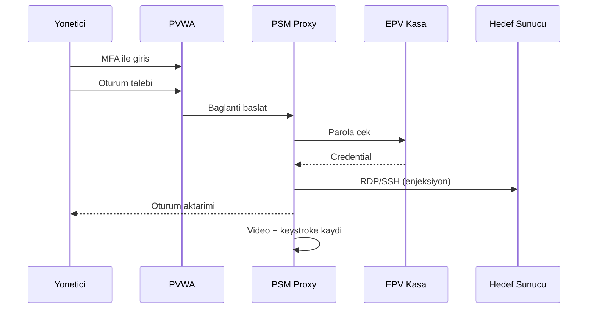
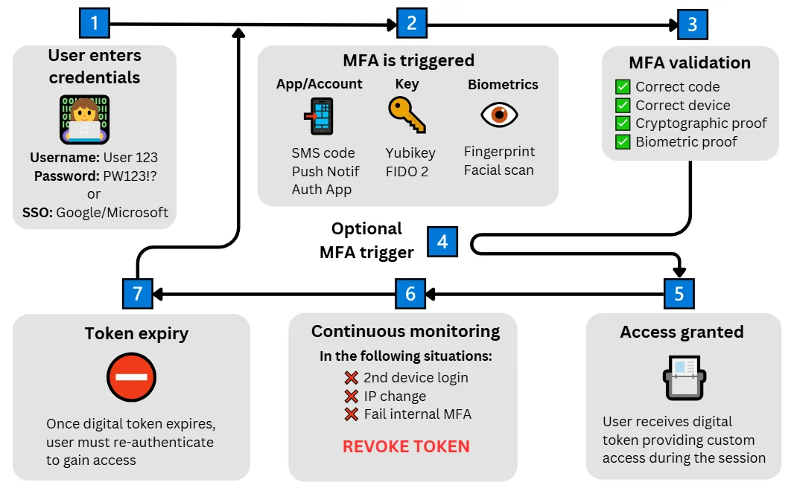
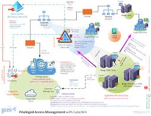
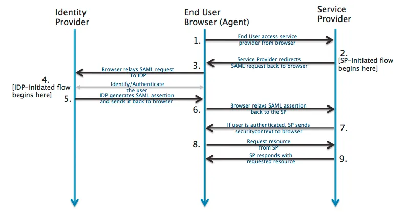
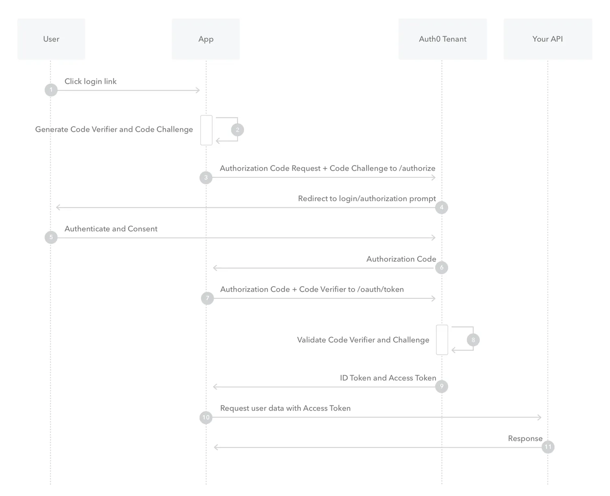

# Ayrıcalıklı Erişim Yönetimi (PAM) ve Modern Doğrulama (MFA/SSO)

Sıradan kullanıcı kimliklerinin korunması temel bir gereklilik olsa da, sistem yöneticilerine ait **ayrıcalıklı** kimlikler saldırganların bir numaralı hedefidir. Bir yöneticinin hesabı ele geçirildiğinde saldırgan tüm ağı kontrol edebilir; veritabanlarını silebilir, şifreleme anahtarlarını çalabilir veya federasyon altyapısı üzerinden tüm bulut ekosistemine erişim sağlayabilir. Bu bölüm, ayrıcalıklı erişimin yaşam döngüsünü (PAM), modern çok faktörlü doğrulama mekanizmalarını (MFA) ve kurumsal tekil oturum açma (SSO) federasyon protokollerini derinlemesine ele alır. **§4.1** bölümündeki AAA ve AD Tier modeli bu bölümün ön koşuludur; parolasız kimlik **§4.4** bölümünde genişletilir.

> **Kontrol Eşlemesi (Bölüm Geneli):** NIST SP 800-53 **AC-2, AC-6, IA-2, AU-2**; CIS Controls v8 **5.4, 6.3–6.5**; ISO/IEC 27001:2022 **A.8.2, A.8.5, A.8.18**; MITRE ATT&CK **T1078, T1548, T1606, T1550**.

---

## §4.2.1. Ayrıcalıklı Erişim Yönetimi (PAM)

**Ayrıcalıklı Erişim Yönetimi (Privileged Access Management — PAM)**, kurumun "krallığın anahtarlarını" — domain admin, bulut kök hesabı, veritabanı süper kullanıcısı, ağ cihazı enable parolası — merkezi olarak keşfeden, kasalayan, döndüren, izleyen ve gerektiğinde anında geri alan mimaridir. Verizon DBIR verilerine göre ihlallerin önemli bir kısmında insan unsuru ve çalınmış kimlik bilgileri rol oynar; ele geçirilmiş ayrıcalıklı kimlik bilgisi saldırganın elde edebileceği en değerli varlıktır.

### Ayrıcalıklı Hesap Yaşam Döngüsü

PAM olgunluğu, hesapların dört aşamalı yaşam döngüsü üzerinden ölçülür:

| Aşama | Açıklama | Tipik Araçlar |
| :---- | :------- | :------------ |
| **Discovery (Keşif)** | Ağ, bulut ve uygulamalardaki yerel/yerleşik admin hesaplarının envanteri | CyberArk PTA, Delinea Discovery, Microsoft Defender for Identity |
| **Onboarding (Kasaya Alma)** | Keşfedilen hesapların parolasının kasaya taşınması; düz metin erişimin kaldırılması | Vault CPM, Secret Server RPC |
| **Rotation (Döndürme)** | Periyodik veya oturum sonrası otomatik parola yenileme | CPM politikaları, gMSA, HashiCorp dynamic secrets |
| **Decommission (Devre Dışı)** | Ayrılan personel, kapatılan sistem veya artık gerekmeyen hesapların kalıcı silinmesi | IAM offboarding + PAM reconciliation |

:::note
PAM yalnızca "parola kasası" değildir. Oturum proxy'si, onay iş akışı, JIT ayrıcalık ve SIEM entegrasyonu birlikte çalışmadığında mimari yarım kalır.
:::

### JIT, JEA ve Zero Standing Privileges (ZSP)

Modern PAM'in üç taşı şunlardır:

1. **Just-in-Time (JIT — İhtiyaç Anında):** Ayrıcalık yalnızca talep anında, belirli bir süre için verilir; süre dolunca otomatik geri alınır. Kalıcı `Domain Admins` üyeliği yerine "4 saatlik etkinleştirme" modeli uygulanır.
2. **Just-Enough-Access (JEA — Yeterli Kadar Erişim):** Yöneticiye tam root/admin yerine görevin gerektirdiği minimum komut kümesi verilir. PowerShell JEA endpoint'leri, RBAC scope'ları ve komut filtreleri bu prensibi uygular.
3. **Zero Standing Privileges (ZSP — Sıfır Kalıcı Ayrıcalık):** Hiçbir kullanıcının sürekli ayrıcalıklı rolü yoktur; tüm atamalar "eligible" (uygun) statüsündedir ve her kullanımda yeniden etkinleştirme gerekir.

```powershell
# PowerShell JEA — kısıtlı endpoint örneği (DEFANSİF)
New-PSSessionConfigurationFile -Path .\JEA-DNSAdmin.pssc -SessionType RestrictedRemoteServer `
  -RoleDefinitions @{
    'CORP\DNS-Admins-Eligible' = @{
      RoleCapabilities = 'DnsServer-JEA-Role'
    }
  }
Register-PSSessionConfiguration -Name 'JEA-DNSAdmin' -Path .\JEA-DNSAdmin.pssc
```

**PEDM ile PIM Ayrımı:** **PEDM (Privilege Elevation and Delegation Management)** uç noktada yerel admin haklarını kaldırıp uygulama bazlı yükseltme yapar (ör. BeyondTrust, Admin By Request). **PIM (Privileged Identity Management)** ise kimlik sağlayıcı seviyesinde rol etkinleştirmesini yönetir (ör. Entra ID PIM, AWS IAM Identity Center). İkisi birbirini tamamlar: PEDM uç nokta, PIM bulut/kimlik katmanıdır.

### Parola Kasaları: CyberArk, Delinea ve HashiCorp Vault Karşılaştırması

| Kriter | CyberArk PAS | Delinea Secret Server | HashiCorp Vault |
| :----- | :----------- | :-------------------- | :-------------- |
| **Temel odak** | Kurumsal PAM (tam yaşam döngüsü) | Hızlı kasalama + kullanım kolaylığı | Dinamik gizli + makine kimlikleri |
| **Oturum kaydı** | PSM (Privileged Session Manager) — video + keystroke | Session monitoring modülü | Yok (tam PAM değil) |
| **Onay iş akışı** | PVWA üzerinden çok aşamalı | Secret Server workflow | Policy-based (sınırlı) |
| **Dinamik parola** | CPM ile hedef sistemde döndürme | RPC/heartbeat ile döndürme | TTL tabanlı dinamik secret |
| **Kurulum süresi** | 3–6 ay (karmaşık hibrit) | 1–2 hafta (temel kasa) | Günler (altyapı ekibi) |
| **Tipik konumlandırma** | Tier 0 + uyumluluk ağır ortamlar | Orta-büyük ölçek kurumsal | CI/CD, Kubernetes, bulut native |

**CyberArk PAS bileşenleri:**

| Bileşen | İşlev | Konum | Port/Protokol |
| :---- | :---- | :---- | :---- |
| **EPV (Enterprise Password Vault)** | Şifreli kasa, politika yönetimi | Yalıtılmış LAN | TCP 1858 |
| **PVWA** | Web arayüzü, onay iş akışı | DMZ / erişim segmenti | HTTPS 443 |
| **CPM** | Parola rotasyonu, reconciliation | Yönetim segmenti | LDAP 389/636, SSH 22, RDP 3389 |
| **PSM** | Oturum izolasyonu, credential injection | Yönetim segmenti | HTTPS 443, RDP 3389, SSH 22 |
| **PTA** | Ayrıcalıklı hesap anomali tespiti | Analitik segment | Syslog UDP 514 / TCP 6514 |

- **PVWA (Password Vault Web Access):** Web arayüzü ve API katmanı.
- **CPM (Central Policy Manager):** Hedef sistemlerde parola döndürme motoru.
- **PSM (Privileged Session Manager):** RDP/SSH/DB oturumlarını proxy'ler; video ve komut kaydı tutar.

**HashiCorp Vault** tam bir PAM çözümü değildir; oturum kaydı ve insan onay iş akışı sunmaz. Ancak Kubernetes, Terraform ve CI/CD pipeline'larında TTL tabanlı dinamik kimlik bilgileri üretmek için idealdir. Tipik Fortune 500 mimarisinde CyberArk/Delinea (insan ayrıcalığı) + Vault (makine ayrıcalığı) birlikte konuşlandırılır.

```hcl
# HashiCorp Vault — dinamik PostgreSQL kimlik bilgisi (DEFANSİF)
resource "vault_database_secret_backend_role" "app_role" {
  backend             = "database"
  name                = "app-dynamic"
  db_name             = "postgres"
  creation_statements = ["CREATE ROLE \"{{name}}\" WITH LOGIN PASSWORD '{{password}}' VALID UNTIL '{{expiration}}';"]
  default_ttl         = 3600
  max_ttl             = 86400
}
```

### Oturum İzolasyonu, Kayıt ve Proxy Mimarisi

PAM'in en kritik savunma katmanı, yöneticinin hedef sisteme **doğrudan** bağlanmasını engellemektir:

```
Kullanıcı → PAM Jump Server / PSM Proxy → Hedef Sunucu
              ↓
         Kasadan parola enjeksiyonu (kullanıcı parolayı görmez)
              ↓
         Video + keystroke + komut logu → SIEM (5651 uyumlu arşiv)
```



**Oturum izolasyonu** şu kontrolleri sağlar:
- Yönetici gerçek parolayı asla görmez; PAM arka planda enjekte eder.
- Clipboard, dosya transferi ve USB yönlendirme politikalarla kısıtlanır.
- Şüpheli oturum canlı izlenebilir ve anında sonlandırılabilir (session shadowing).
- Tüm oturumlar zaman damgalı olarak arşivlenir; BDDK ve 5651 sayılı Kanun kapsamında denetim izi oluşturur.

:::caution
Oturum kaydı olmadan PAM yalnızca "parola saklama" seviyesinde kalır. İç tehdit (insider threat) senaryolarında video ve komut düzeyinde kayıt, hesap verebilirliğin tek kanıtıdır.
:::

### Microsoft Entra ID PIM

**Entra ID PIM**, Azure AD / Microsoft 365 / Azure kaynak rolleri için JIT ayrıcalık yönetimi sağlar. **Entra ID Premium P2** lisansı gerektirir.

| Atama Türü | Davranış |
| :--------- | :------- |
| **Eligible (Uygun)** | Rol atanmış ancak etkin değil; kullanıcı talep ile aktive eder |
| **Active (Aktif)** | Rol sürekli etkindir (ZSP hedefinde minimize edilmeli) |
| **Expired (Süresi Dolmuş)** | Aktivasyon süresi doldu; otomatik geri alındı |

Yapılandırılabilir kontroller:
- **Onay iş akışı (approval workflow):** Aktivasyon için ikinci onaylayıcı zorunluluğu.
- **MFA zorunluluğu:** Conditional Access authentication context + Authentication Strengths ile FIDO2 şartı.
- **İş gerekçesi (justification):** Ticket numarası veya bakım penceresi referansı.
- **Maksimum aktivasyon süresi:** 1–24 saat arası (Tier 0 için 4 saat önerilir).

```http
# Entra PIM — rol aktivasyon onayı (Microsoft Graph API)
PATCH https://graph.microsoft.com/beta/roleManagement/directory/roleAssignmentApprovals/<approval-id>/steps/<step-id>
Content-Type: application/json

{
  "reviewResult": "Approve",
  "justification": "Onaylı bakım penceresi — CHG0012345"
}
```

```json
// Conditional Access — PIM aktivasyonunda FIDO2 zorunluluğu (kavramsal)
{
  "displayName": "PIM-Activation-Require-FIDO2",
  "state": "enabled",
  "conditions": {
    "applications": { "includeApplications": ["MicrosoftAdminPortals"] },
    "authenticationContext": { "includeAuthenticationContextClassReferences": ["c1"] }
  },
  "grantControls": {
    "operator": "AND",
    "builtInControls": [],
    "authenticationStrength": { "allowedStrengths": ["fido2-strength-id"] }
  }
}
```

### MITRE ATT&CK: T1078.003 ve T1548

PAM savunması, aşağıdaki saldırı tekniklerine doğrudan karşılık verir:

| Teknik | Açıklama | PAM Savunması |
| :----- | :------- | :------------ |
| **T1078.003** (Valid Accounts: Local Accounts) | Yerel admin ve servis hesaplarıyla kalıcı erişim | Keşif + kasalama + JIT; yerel admin kaldırma (PEDM) |
| **T1548** (Abuse Elevation Control Mechanism) | UAC bypass, sudo abuse, token manipulation | JEA endpoint'leri; PSM komut filtreleme |
| **T1550** (Use Alternate Authentication Material) | Pass-the-Hash, Pass-the-Ticket, API token | Oturum proxy; kısa ömürlü credential; sürekli rotation |

```yaml
# Sigma — yerel admin ile anormal oturum (DEFANSİF kavramsal)
title: Local Admin Interactive Logon Outside PAM
logsource:
  product: windows
  service: security
detection:
  selection:
    EventID: 4624
    LogonType: 10
    TargetUserName|endswith: '-adm'
  filter_pam:
    IpAddress|startswith: '10.0.50.'  # PAM jump subnet
  condition: selection and not filter_pam
level: high
```

:::tip
BloodHound ile "Shortest Paths to Domain Admins" analizi PAM öncesi keşif aşamasında yapılmalıdır. PAM sonrası hedef: Domain Admins'e sıfır kısa yol.
:::

### Türkiye Uyumluluk: KVKK, BDDK ve 5651

| Çerçeve | PAM ile İlişki |
| :------ | :------------- |
| **KVKK Madde 12** | Teknik ve idari tedbirler; ayrıcalıklı erişim logları kişisel veri işleme kaydına dahil edilmeli |
| **BDDK BSEBY** | Bilgi sistemleri yönetimi; yönetici erişimlerinde çok bileşenli kimlik doğrulama ve işlem güvenliği |
| **5651 sayılı Kanun** | Oturum kayıtlarının zaman damgalı, bütünlüğü korunmuş şekilde 2 yıl saklanması |

KVKK kapsamında biyometrik veri ve erişim loglarındaki kullanıcı kimlikleri **veri minimizasyonu** ilkesiyle işlenmeli; PAM oturum kayıtlarına erişim ayrı bir yetki matrisiyle sınırlandırılmalıdır.

> **Kontrol Eşlemesi:** NIST SP 800-53 **AC-6(1..5), AC-2(7), AU-2, AU-12**; CIS Controls v8 **5.4, 6.8**; ISO 27001:2022 **A.8.2, A.8.18**.

---

## §4.2.2. Modern Çok Faktörlü Doğrulama (MFA)

Sadece kullanıcı adı ve parola (Single Factor) ile doğrulama dönemi sona ermiştir. NIST SP 800-63B, kimlik kanıtı gücünü **Authenticator Assurance Level (AAL)** olarak sınıflandırır: AAL1 (parola), AAL2 (MFA), AAL3 (donanım kriptografik kanıt). Kurumsal ve ayrıcalıklı erişimde minimum hedef **AAL2**; Tier 0 ve finansal sistemlerde **AAL3** olmalıdır.

| AAL | Kimlik Kanıtı | Örnek Authenticator | Phishing Dirençli? |
| :---- | :---- | :---- | :---- |
| **AAL1** | Tek faktör | Parola, OTP (SMS) | Hayır |
| **AAL2** | İki faktör | TOTP + parola, push MFA | Kısmen (TOTP: hayır) |
| **AAL3** | Donanım kriptografik | FIDO2/WebAuthn, PIV, smart card | Evet (origin binding) |

CISA ve NIST, workforce erişiminde minimum **phishing-resistant MFA** (AAL3 eşdeğeri FIDO2) önerir. CIS Controls v8 **6.4**, ayrıcalıklı erişimde phishing-resistant MFA'yı zorunlu kılar.



### TOTP: RFC 6238 Mekanizması

**TOTP (Time-Based One-Time Password)**, HOTP'nin (RFC 4226) zaman tabanlı türevidir. Formül:

```
TOTP = Truncate(HMAC-SHA1(K, T)) mod 10^d
T = floor((Unixtime - T0) / X)
```

| Parametre | Varsayılan Değer |
| :-------- | :---------------- |
| HMAC algoritması | SHA-1 (SHA-256/512 opsiyonel) |
| Zaman adımı (X) | 30 saniye |
| Basamak sayısı (d) | 6 |
| Gizli anahtar uzunluğu | 160 bit (Base32 kodlanmış) |
| Tolerans penceresi | ±1 adım (sunucu tarafı) |

```python
import hmac, hashlib, struct, time

def totp(secret: bytes, step: int = 30, digits: int = 6) -> str:
    counter = struct.pack(">Q", int(time.time() // step))
    digest = hmac.new(secret, counter, hashlib.sha1).digest()
    offset = digest[-1] & 0x0F
    code = (struct.unpack(">I", digest[offset:offset + 4])[0] & 0x7FFFFFFF) % (10 ** digits)
    return str(code).zfill(digits)
```

:::caution
TOTP **phishable** (oltalanabilir) bir faktördür. Kod 30 saniye geçerlidir ve gerçek zamanlı AiTM proxy (EvilGinx) ile yakalanıp anında kullanılabilir. TOTP, ayrıcalıklı erişimde birincil MFA olarak değil; FIDO2'nin yedek faktörü olarak konumlandırılmalıdır.
:::

### FIDO2/WebAuthn: Oltalamaya Yapısal Direnç

FIDO2 = **WebAuthn** (W3C tarayıcı API'si) + **CTAP2** (Client to Authenticator Protocol). Kimlik bilgisi **origin'e bağlıdır (origin binding)**; sahte alan adına kriptografik imza üretilemez.

<details>
<summary>FIDO2 origin binding: kriptografik menşe doğrulama (derinlemesine)</summary>

Origin binding, `clientDataJSON` içindeki `origin` alanının authenticator tarafından imzalanmasıyla çalışır:

```
rpIdHash = SHA-256("company.com")
signature = Sign(privateKey, challenge || rpIdHash || clientData)
```

Saldırgan `evil-company.com` üzerinde AiTM proxy kursa bile authenticator yalnızca kayıtlı RP ID için imza üretir; sahte origin'e kriptografik kanıt oluşturulamaz. Bu, TOTP/SMS OTP'nin AiTM saldırılarına karşı yapısal üstünlüğüdür.
</details>



**Kayıt akışı:**
1. `navigator.credentials.create()` → tarayıcı challenge gönderir.
2. Authenticator açık/gizli anahtar çifti üretir; gizli anahtar cihazda kalır.
3. Sunucuya **attestation object** (AAGUID + attestation statement) döner.

**Kimlik doğrulama akışı:**
1. `navigator.credentials.get()` → challenge authenticator'a iletilir.
2. Gizli anahtarla imzalanmış **assertion** döner.
3. Sunucu kayıtlı genel anahtarla imzayı doğrular.

```javascript
// WebAuthn — kimlik doğrulama talebi (DEFANSİF)
const credential = await navigator.credentials.get({
  publicKey: {
    challenge: new Uint8Array(serverChallenge),
    rpId: "corp.example.com",
    allowCredentials: [{
      type: "public-key",
      id: credentialId,
      transports: ["usb", "nfc", "internal"]
    }],
    userVerification: "required",
    timeout: 60000
  }
});
```

| Özellik | Platform Authenticator | Roaming Authenticator |
| :------ | :--------------------- | :-------------------- |
| Örnek | Windows Hello, Touch ID, Face ID | YubiKey, Titan Key |
| Taşınabilirlik | Cihaza bağlı | USB/NFC/BLE |
| Kurumsal AAL3 | Senkronize passkey (dikkatli) | Donanım anahtarı (tercih) |
| AAGUID allowlist | Evet | Evet (enterprise attestation) |

**UV/UP bayrakları:** **User Presence (UP)** fiziksel dokunmayı, **User Verification (UV)** PIN veya biyometri ile kimlik kanıtını gösterir. Kurumsal politikada `userVerification: "required"` zorunlu tutulmalıdır.

### Biyometrik Doğrulama ve KVKK Uyumu

Biyometrik veriler KVKK Madde 6 kapsamında **özel nitelikli kişisel veri**dir. İşleme için açık rıza veya kanunda öngörülme şartı aranır.

| Prensip | Uygulama |
| :------ | :------- |
| **On-device processing** | FIDO2 ile biyometrik şablon cihazda kalır; sunucuya gitmez |
| **Liveness detection** | Sunum saldırılarına (fotoğraf, deepfake) karşı canlılık tespiti |
| **Template protection** | Cancelable biometrics; şablon çalınsa bile yeniden türetilebilir |
| **Veri minimizasyonu** | Sunucuda yalnızca "doğrulama başarılı" bayrağı saklanır |

:::note
Biyometrik MFA, KVKK açısından en güvenli modelde **sunucuya biyometrik veri aktarmayan** FIDO2 platform authenticator mimarisidir. Merkezi biyometrik veritabanı kullanımı ayrı DPIA (veri koruma etki değerlendirmesi) gerektirir.
:::

### SMS OTP Zafiyetleri

SMS tabanlı OTP, NIST SP 800-63B revizyonlarında **AAL2'yi karşılamaz** olarak sınıflandırılmıştır. CISA SMS'i "phishable" kategorisinde listeler.

| Saldırı Vektörü | Mekanizma |
| :-------------- | :-------- |
| **SIM swapping** | Operatör sosyal mühendisliği ile numara başka SIM'e taşınır |
| **SS7 protokol açıkları** | Telekom omurga ağında SMS yönlendirme |
| **Malware (Android)** | Cihazda SMS okuma izni ile OTP çalma |
| **AiTM relay** | Proxy üzerinden SMS kodunun gerçek zamanlı aktarımı |

SMS OTP yalnızca düşük riskli tüketici hesapları veya **kurtarma kanalı** olarak kabul edilebilir; workforce ve ayrıcalıklı erişimde birincil faktör olarak kullanılmamalıdır.

### EvilGinx, AiTM ve OTP Fatigue Savunması

**EvilGinx2 / Modlishka** gibi araçlar, ters proxy (reverse-proxy AiTM) ile kullanıcıyı gerçek giriş sayfasına yönlendirirken oturum çerezi ve OTP'yi yakalar:

```
Kullanıcı → Sahte Alan (evilginx) → Gerçek IdP (Microsoft/Google)
                ↓
         Cookie + OTP yakalanır → Saldırgan oturumu devralır
```

**OTP Fatigue (MFA Bombing):** Saldırgan, kurbanın telefonuna dakikalarca push bildirimi göndererek kazara "Onayla" tıklamasını sağlar. Uber ve Cisco ihlallerinde bu teknik kullanılmıştır.

| Saldırı | Savunma |
| :------ | :------ |
| EvilGinx / AiTM | FIDO2 (origin binding); Conditional Access — compliant device |
| OTP Fatigue | Number matching; coğrafi/kayıtlı cihaz kısıtı; push rate limiting |
| TOTP relay | FIDO2 birincil; risk tabanlı step-up |
| MFA bypass genel | Phishing-resistant MFA politikası (CISA); authentication strength |

```json
// Entra ID — number matching ve coğrafi kısıt (kavramsal)
{
  "displayName": "Block-MFA-Fatigue",
  "state": "enabled",
  "conditions": {
    "signInRiskLevels": ["high"],
    "locations": { "excludeLocations": ["AllTrusted"] }
  },
  "grantControls": {
    "operator": "AND",
    "builtInControls": ["mfa"],
    "authenticationStrength": { "allowedStrengths": ["fido2-strength-id"] }
  }
}
```

:::caution
"MFA etkin" ile "phishing-resistant MFA" aynı şey değildir. CIS Controls v8 **6.3** tüm harici erişimde MFA, **6.4** ayrıcalıklı erişimde phishing-resistant MFA gerektirir.
:::

> **Kontrol Eşlemesi:** NIST SP 800-63B (AAL1/2/3); NIST SP 800-53 **IA-2(1)(2)**; CIS Controls v8 **6.3, 6.4, 6.5**; ISO 27001:2022 **A.8.5**.

---

## §4.2.3. Tekil Oturum Açma (SSO) ve Federasyon Protokolleri

Kullanıcıların her uygulama için ayrı parola ezberlemesi zayıf parola kullanımına yol açar. **SSO (Single Sign-On)**, kullanıcının bir kez doğrulandıktan sonra yetkili tüm uygulamalara otomatik erişmesini sağlar. **Federasyon**, iki farklı kurumun kimlik sistemlerine karşılıklı güvenmesini mümkün kılar.

### SAML 2.0 ve XML Signature Wrapping (XSW)

**SAML 2.0 (Security Assertion Markup Language)**, kurumsal B2B web uygulamalarında yaygın XML tabanlı federasyon protokolüdür. Assertion üç tip ifade taşır: **Authentication**, **Attribute**, **Authorization Decision**.



**Akış türleri:**
- **SP-initiated:** Servis sağlayıcı (SP) kullanıcıyı kimlik sağlayıcıya (IdP) yönlendirir.
- **IdP-initiated:** IdP doğrudan SP'ye assertion gönderir (daha yüksek risk; CSRF ve hedef doğrulama zorunlu).

**XML Signature Wrapping (XSW):** En yaygın SAML zafiyeti sınıfıdır. Saldırgan, imzalı XML öğesinin yapısını manipüle ederek imzasız bir bölümün kimlik olarak yorumlanmasını sağlar. GitHub Enterprise SAML bypass ve ruby-saml "sign in as anyone" zafiyetleri bu sınıftandır.

Savunma kontrolleri:
- Katı XML şema doğrulama (strict schema validation).
- İmza kapsamı kontrolü: yalnızca beklenen öğe imzalanmış mı?
- Canonicalization (C14N) tutarlılığı.
- SAML kütüphane sürümlerinin güncel tutulması.
- IdP-initiated akışta `RelayState` ve hedef URL allowlist doğrulaması.

```xml
<!-- SAML Response — imza doğrulama kontrol noktaları (DEFANSİF) -->
<!-- 1. Signature Reference URI yalnızca Assertion ID'ye işaret etmeli -->
<!-- 2. Duplicate Assertion veya wrapped Assertion reddedilmeli -->
<!-- 3. NotBefore / NotOnOrAfter zaman penceresi ±5 dk tolerans -->
<samlp:Response xmlns:samlp="urn:oasis:names:tc:SAML:2.0:protocol"
                Destination="https://app.corp.example.com/acs"
                IssueInstant="2026-06-18T10:00:00Z">
  <saml:Issuer>https://idp.corp.example.com</saml:Issuer>
  <ds:Signature xmlns:ds="http://www.w3.org/2000/09/xmldsig#">...</ds:Signature>
  <samlp:Status><samlp:StatusCode Value="urn:oasis:names:tc:SAML:2.0:status:Success"/></samlp:Status>
  <saml:Assertion ID="_assertion-id" IssueInstant="2026-06-18T10:00:00Z" Version="2.0">...</saml:Assertion>
</samlp:Response>
```

### OAuth 2.0 ve Authorization Code + PKCE

**OAuth 2.0 (RFC 6749)** bir **yetkilendirme** protokolüdür; kimlik doğrulama değildir. Modern istemciler için **Authorization Code + PKCE (RFC 7636)** zorunlu standarttır. OAuth 2.1, Implicit grant'ı tamamen kaldırır.



**PKCE mekanizması:**
1. İstemci `code_verifier` (43–128 karakter rastgele) üretir.
2. `code_challenge = BASE64URL(SHA256(code_verifier))` hesaplanır.
3. Yetkilendirme isteğinde `code_challenge` gönderilir.
4. Token değişiminde `code_verifier` sunulur; sunucu eşleşmeyi doğrular.

```http
# PKCE — yetkilendirme isteği (DEFANSİF)
GET /authorize?
  response_type=code
  &client_id=mobile-app-client
  &redirect_uri=https://app.example.com/callback
  &scope=openid%20profile
  &state=random-csrf-token
  &code_challenge=E9Melhoa2OwvFrEMTJguCHaoeK1t8URWbuGJSstw-cM
  &code_challenge_method=S256
  &nonce=random-nonce-value
```

| OAuth Tehdidi | Savunma |
| :------------ | :------ |
| Authorization code injection | `redirect_uri` tam string eşleşmesi (wildcard yasak) |
| Implicit grant token sızıntısı | OAuth 2.1 ile kaldırıldı; Code+PKCE kullan |
| SSRF ile token çalma | Token endpoint ağ segmentasyonu |
| Refresh token theft | Rotation + reuse detection |

:::caution
`redirect_uri` için `https://*.app.com` gibi wildcard kullanmayın. Tam string eşleşmesi şarttır; aksi halde authorization code injection mümkün olur.
:::

### OpenID Connect ve Algorithm Confusion

**OIDC**, OAuth 2.0 üzerine kimlik katmanı ekler. **ID Token** JWT formatındadır; varsayılan imza algoritması **RS256** (asimetrik) olmalıdır.

**Algorithm confusion saldırısı:** Sunucu RS256 beklerken saldırgan `alg: HS256` gönderir ve sunucunun RSA public key'ini HMAC secret olarak kullanarak sahte token imzalar.

Savunma:
- `alg` allowlist: yalnızca RS256/ES256 kabul et.
- JWKS endpoint'inden anahtar doğrulama; `kid` header injection'a karşı dikkat.
- `iss` (issuer), `aud` (audience), `nonce`, `exp` claim'lerini her zaman doğrula.
- `state` parametresi ile CSRF koruması.

```python
# OIDC ID Token doğrulama — alg allowlist (DEFANSİF)
import jwt
from jwt import PyJWKClient

ALLOWED_ALGORITHMS = ["RS256", "ES256"]
jwks_client = PyJWKClient("https://idp.corp.example.com/.well-known/jwks.json")

def verify_id_token(token: str, audience: str, issuer: str, nonce: str) -> dict:
    signing_key = jwks_client.get_signing_key_from_jwt(token)
    payload = jwt.decode(
        token,
        signing_key.key,
        algorithms=ALLOWED_ALGORITHMS,
        audience=audience,
        issuer=issuer,
        options={"require": ["exp", "iat", "nonce", "sub"]}
    )
    if payload.get("nonce") != nonce:
        raise ValueError("Nonce mismatch — olası replay saldırısı")
    return payload
```

### Golden SAML Tespiti ve Wazuh Kuralları

**Golden SAML (MITRE ATT&CK T1606.002)**, saldırganın AD FS token imzalama sertifikasını ve DKM (Distributed Key Manager) anahtarını çalarak sahte SAML assertion üretmesidir. SolarWinds saldırı zincirinde bu teknik kullanılmıştır.

**Tespit göstergeleri:**
- AD FS token signing sertifikasının dışa aktarılması (Event ID 501 + PowerShell).
- Normal dışı SAML token üretim hacmi.
- AD FS sunucusundan beklenmeyen ağ bağlantıları.
- IdP olarak bilinmeyen kaynaktan gelen SAML assertion'lar.

```xml
<!-- Wazuh local_rules.xml — Golden SAML göstergeleri (DEFANSİF) -->
<group name="saml,golden_saml,">

  <!-- AD FS token signing sertifika dışa aktarımı -->
  <rule id="100501" level="12">
    <if_sid>18100</if_sid>
    <field name="win.system.eventID">^501$</field>
    <field name="win.system.providerName">AD FS</field>
    <description>AD FS: Token signing certificate export detected — Golden SAML riski</description>
    <group>golden_saml,adfs,certificate_export,</group>
  </rule>

  <!-- PowerShell ile AD FS yapılandırma erişimi -->
  <rule id="100502" level="12">
    <if_sid>18100</if_sid>
    <field name="win.system.eventID">^4104$</field>
    <field name="win.eventdata.scriptBlockText">Get-AdfsCertificate|Export-AdfsCertificate|ADFS</field>
    <description>PowerShell: AD FS sertifika komutu — Golden SAML hazırlığı</description>
    <group>golden_saml,powershell,adfs,</group>
  </rule>

  <!-- DKM master key erişim anomalisi -->
  <rule id="100503" level="14">
    <if_sid>18100</if_sid>
    <field name="win.system.eventID">^4662$</field>
    <field name="win.eventdata.objectName">ADFS|PrivateKey|Certificate</field>
    <description>AD: ADFS nesnesine anormal erişim — T1606 Golden SAML</description>
    <group>golden_saml,ldap_enumeration,</group>
  </rule>

</group>
```

```xml
<!-- Wazuh decoders.xml — AD FS Event Channel (DEFANSİF) -->
<decoder name="adfs-event">
  <prematch>AD FS</prematch>
  <plugin_decoder>windows_eventchannel</plugin_decoder>
</decoder>
```

**Wazuh agent konfigürasyonu** (`ossec.conf`):

```xml
<localfile>
  <location>Microsoft-Windows-ADFS/Admin</location>
  <log_format>eventchannel</log_format>
</localfile>
<localfile>
  <location>Microsoft-Windows-ADFS/Operational</location>
  <log_format>eventchannel</log_format>
</localfile>
```

**Korelasyon senaryoları:**
- Kural 100501 + 100502 aynı host'ta 15 dakika içinde → Seviye 15 (kritik) eskalasyon.
- Golden SAML şüphesi + SIEM'de o host'tan dışa SAML trafiği → IR playbook tetikle.
- 5651 uyumu: AD FS ve IdP logları zaman damgalı arşivlenmeli.

| MITRE Tekniği | SSO Bağlamı | Tespit Kaynağı |
| :------------ | :---------- | :------------- |
| **T1606.002** | Golden SAML — sahte federation token | AD FS Admin log, Wazuh 100501–100503 |
| **T1550.001** | Application Access Token — OAuth token replay | IdP sign-in logs, token introspection |
| **T1556** | Modify Authentication Process — SAML parser manipülasyonu | SP assertion log, WAF |

:::tip
AD FS ortamında token signing sertifikası yılda bir planlı döndürülmeli; DKM master key erişimi Tier 0 PAW üzerinden kısıtlanmalıdır. Sertifika dışa aktarımı yalnızca HSM üzerinden yapılmalıdır.
:::

### Federasyon Mimarileri ve Türkiye Senaryoları

| Mimari | Kullanım Alanı |
| :----- | :------------- |
| **Azure AD B2B** | İş ortağı ve tedarikçi federasyonu |
| **Azure AD B2C** | Müşteri kimliği (e-ticaret, mobil uygulama) |
| **Shibboleth** | Akademik SAML federasyonu (ULAKBİM) |
| **AD FS + Entra ID** | Hibrit kurumsal SSO |

BDDK lisanslı kurumlarda uzaktan erişim SSO'su, çok bileşenli kimlik doğrulama ve oturum kaydı ile birlikte değerlendirilir. 5651 sayılı Kanun kapsamında IdP ve SP logları bütünlük kontrolü ile arşivlenmelidir.

> **Kontrol Eşlemesi:** NIST SP 800-53 **IA-8, SC-23**; CIS Controls v8 **6.3, 6.5**; ISO 27001:2022 **A.8.5, A.8.26** (Uygulama güvenlik gereksinimleri).

---

## Temel Çıkarımlar ve Uygulama Kontrol Listesi — §4.2

### PAM
- [ ] Tüm ayrıcalıklı hesaplar keşfedildi ve PAM kasasına alındı; yönetici düz metin parola erişimi kaldırıldı.
- [ ] ZSP/JIT hedefi tanımlandı; kalıcı Active atamalar Eligible'a dönüştürüldü.
- [ ] Oturum proxy (PSM) üzerinden RDP/SSH/DB erişimi zorunlu; video + komut kaydı SIEM'e akıyor.
- [ ] Entra PIM: eligible atama + onay iş akışı + aktivasyonda FIDO2 MFA.
- [ ] PowerShell JEA veya eşdeğeri ile Just-Enough-Access uygulandı.
- [ ] MITRE T1078.003 ve T1548 için Sigma/Wazuh korelasyon kuralları devrede.

### MFA
- [ ] Yönetici ve yüksek değerli hesaplar için phishing-resistant FIDO2 birincil MFA.
- [ ] TOTP yalnızca tüketici düzeyi yedek faktör; ayrıcalıklı erişimde birincil değil.
- [ ] SMS OTP birincil kimlik doğrulamadan kaldırıldı (yalnızca kurtarma kanalı).
- [ ] AiTM/OTP fatigue savunması: number matching + push rate limiting + FIDO2.
- [ ] Biyometrik veri KVKK Madde 6 uyumlu; on-device processing tercih edildi.
- [ ] Authentication Strength politikaları Conditional Access ile enforce edildi.

### SSO ve Federasyon
- [ ] OAuth 2.1 / Authorization Code + PKCE; Implicit grant kaldırıldı.
- [ ] `redirect_uri` tam string eşleşmesi; wildcard yasak.
- [ ] OIDC: `iss`, `aud`, `nonce`, `state` doğrulaması; alg allowlist (RS256/ES256).
- [ ] SAML kütüphaneleri güncel; XSW'ye karşı katı şema + imza kapsamı doğrulaması.
- [ ] Golden SAML tespiti: Wazuh kuralları 100501–100503 + AD FS log toplama aktif.
- [ ] AD FS token signing sertifikası planlı döndürme takvimi; DKM erişimi Tier 0 kısıtlı.
- [ ] IdP/SP logları 5651 uyumlu arşiv; BDDK denetim izi gereksinimleri karşılandı.

### Olgunluk Hedefi

| Alan | Geleneksel | Hedef (İleri) |
| :--- | :--------- | :------------ |
| Ayrıcalıklı erişim | Kalıcı admin hesapları | ZSP + JIT + oturum kaydı |
| MFA | SMS/TOTP | FIDO2 AAL3 (ayrıcalıklı), passkey (genel) |
| SSO | SAML Implicit, OAuth Implicit | Code+PKCE, OIDC strict validation |
| İzleme | Manuel log inceleme | Wazuh + Golden SAML korelasyon |

:::note
Bu bölümdeki kontroller, §4.1 IAM temelleri ve §4.3 Sıfır Güven mimarisi ile birlikte uygulandığında kimlik güvenliği katmanı tamamlanır. Conditional Access (cihaz duruşu + risk sinyali) ve PAM oturum kaydı birlikte çalıştığında "kimlik avı → ayrıcalık yükseltme → yanal hareket" zinciri kırılır.
:::
