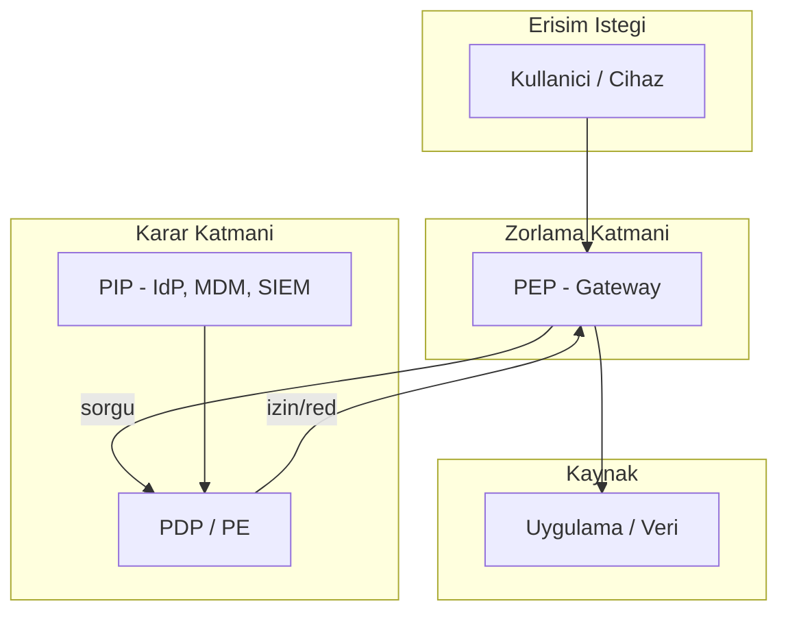
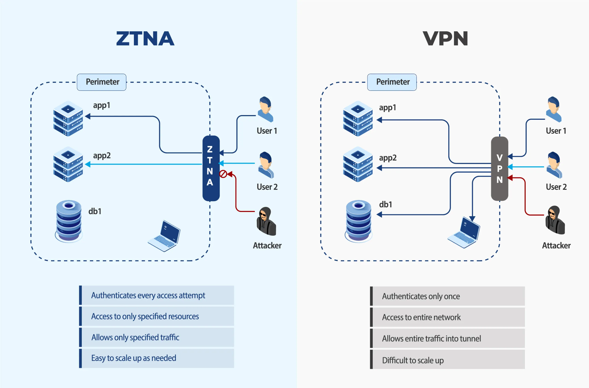
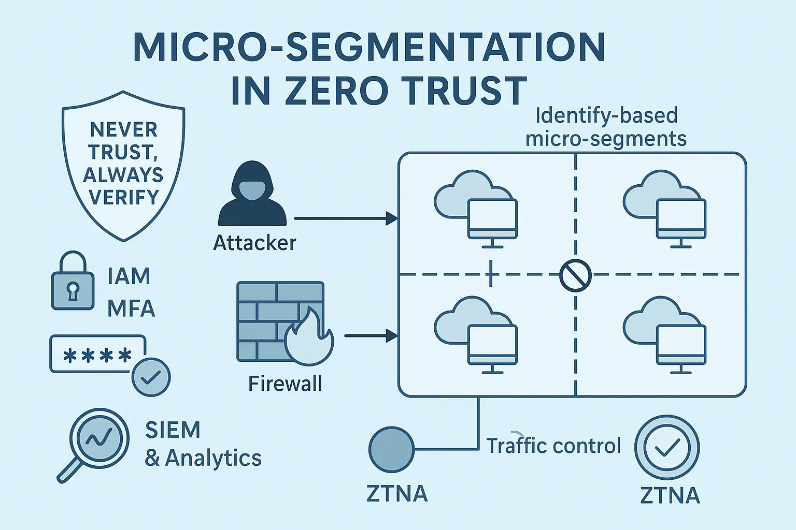

# Sıfır Güven (Zero Trust) Mimarisi ve Cihaz İzolasyonu

Geleneksel **kale-hendek** (Castle-and-Moat) modeli, kurumsal LAN'ı güvenli, interneti tehlikeli kabul eder. Bulut bilişim, hibrit çalışma, BYOD ve SaaS yayılımı bu varsayımı geçersiz kılmıştır: saldırgan bir kez iç ağa sızdığında, düz ağ topolojisinde yanal hareket (lateral movement) neredeyse engellenemez. **Sıfır Güven (Zero Trust Architecture — ZTA)**, NIST SP 800-207'nin tanımıyla *"kaynakları korumaya odaklanan, ağ konumuna dayalı örtük güveni reddeden"* bir paradigmadır. Temel ilke nettir: **asla güvenme, daima doğrula** (*never trust, always verify*).

Bu bölüm; NIST mantıksal bileşenleri, CISA Zero Trust Maturity Model (ZTMM) v2 sütunları, mikro-segmentasyon, sürekli kimlik doğrulama, cihaz duruşu (device posture), ZTNA/SSE/SASE, MITRE ATT&CK savunma eşlemesi, Türkiye mevzuatı (KVKK, BDDK, 5651) ve Wazuh Active Response ile dinamik cihaz izolasyonunu operasyonel derinlikte ele alır. **§1.1** bölümündeki Zero Trust genel çerçevesi burada mimari bileşenlere indirgenir; **§4.1** ve **§4.2** bölümlerindeki IAM/PAM kontrolleri PDP/PEP katmanının temelini oluşturur.

---

## §4.3.1. NIST SP 800-207 Mantıksal Mimari ve CISA ZTMM v2

### 4.3.1.1. NIST SP 800-207 Bileşenleri

NIST SP 800-207 (Ağustos 2020), ZTA'yı soyut bir mimari olarak tanımlar. Politika kararı ile zorlama noktası ayrıştırılır; veri akışı her oturumda yeniden değerlendirilir.


| Bileşen | Kısaltma | Rol | Teknik İşlev |
|---|---|---|---|
| **Policy Decision Point** | PDP | Karar motoru | Kimlik, cihaz duruşu, tehdit istihbaratı ve bağlam sinyallerini birleştirerek **izin / red / kısıtlı erişim** kararı üretir |
| **Policy Engine** | PE | PDP'nin karar alt birimi | Politika kurallarını değerlendirir; risk skoru hesaplar; ABAC özniteliklerini işler |
| **Policy Administrator** | PA | PDP kararını uygular | PEP ile oturum kurar; kimlik bilgisi/token üretir; ağ yolunu açar veya kapatır |
| **Policy Enforcement Point** | PEP | Zorlama noktası | Tüm trafik PEP üzerinden geçer; karar uygulanmadan kaynağa erişim verilmez |
| **Policy Information Point** | PIP | Veri besleme kaynağı | IAM, MDM/UEM, SIEM, tehdit istihbaratı, varlık envanteri (CMDB) ve UEBA'dan öznitelik sağlar |



**Kavramsal veri akışı:**

```
Subject (Kullanıcı/Cihaz/Uygulama)
    │
    ▼
┌─────────────┐     sorgu      ┌──────────────────────────────────┐
│     PEP     │ ─────────────► │  PDP (PE + PIP entegrasyonu)   │
│ (Gateway/   │                │  • Kimlik doğrulama              │
│  Agent/     │ ◄───────────── │  • Cihaz duruşu                  │
│  Proxy)     │     karar      │  • Bağlam (konum, saat, risk)    │
└──────┬──────┘                └──────────────────────────────────┘
       │                                    ▲
       │ oturum/token                       │ öznitelik
       ▼                                    │
┌─────────────┐                      ┌──────┴──────┐
│     PA      │                      │     PIP     │
│ (Oturum     │                      │ IdP, MDM,   │
│  yönetimi)  │                      │ SIEM, TI, CMDB│
└──────┬──────┘                      └─────────────┘
       │
       ▼
   Kaynak (Uygulama / Veri / İş Yükü)
```

> **NIST SP 800-207 Yedi Temel İlke (Tenets):** (1) Tüm veri kaynakları ve bilişim servisleri "kaynak" olarak kabul edilir. (2) Ağ konumundan bağımsız iletişim güvenli olmalıdır. (3) Erişim **oturum bazlı** (per-session) verilir. (4) Karar **dinamik politika** ile belirlenir. (5) Tüm varlıkların bütünlüğü sürekli izlenir. (6) Kimlik doğrulama ve yetkilendirme **katı ve dinamik** uygulanır. (7) Toplanan telemetri ile politika sürekli iyileştirilir.

**NIST SP 800-207 ile NIST CSF 2.0 eşlemesi:**

| NIST 800-207 Bileşeni | NIST CSF 2.0 Fonksiyonu | Operasyonel Örnek |
| :---- | :---- | :---- |
| PDP (Policy Decision) | **Govern** + **Identify** | Risk iştahı, varlık envanteri |
| PEP (Policy Enforcement) | **Protect** | ZTNA gateway, mikro-segmentasyon |
| PIP (Policy Information) | **Detect** | SIEM, UEBA, tehdit istihbaratı |
| Sürekli izleme | **Detect** + **Respond** | Active Response izolasyon |
| Kurtarma | **Recover** | Temizlenmiş cihazın yeniden kaydı |

### 4.3.1.2. PDP/PEP Yerleşim Modelleri

NIST SP 800-207 üç deployment senaryosu tanımlar:

| Model | PEP Konumu | Avantaj | Dezavantaj |
|---|---|---|---|
| **Kaynak tarafı (Resource Portal)** | Uygulama önünde reverse proxy | Merkezi politika; hızlı devreye alma | Legacy uygulamalarda entegrasyon zorluğu |
| **Ağ tabanlı (Network PEP)** | SDN controller, firewall, ZTNA gateway | Tüm trafik görünürlüğü | Performans ve ölçekleme maliyeti |
| **Uç nokta tabanlı (Device Agent)** | Host agent (FortiClient, Prisma Agent) | Granüler cihaz kontrolü | Ajan yönetimi ve BYOD karmaşıklığı |

Kurumsal Fortune 500 ortamlarında genellikle **hibrit model** tercih edilir: uzaktan erişim için bulut ZTNA PEP, veri merkezi içi için mikro-segmentasyon PEP, uç nokta için MDM/EDR agent.

### 4.3.1.3. CISA Zero Trust Maturity Model (ZTMM) v2 — Beş Sütun

CISA ZTMM v2, federal kurumlar için olgunluk değerlendirme çerçevesi sunar; özel sektörde de yaygın benchmark olarak kullanılır. Her sütun **Traditional → Initial → Advanced → Optimal** dört seviyede ölçülür.

<details>
<summary>CISA ZTMM v2 beş sütun olgunluk değerlendirmesi (derinlemesine)</summary>

| Sütun | Traditional | Initial | Advanced | Optimal |
| :---- | :---- | :---- | :---- | :---- |
| **Identity** | Statik parola | MFA (TOTP) | FIDO2 + Conditional Access | Sürekli doğrulama, ZSP |
| **Devices** | Envanter yok | MDM temel | Duruş değerlendirme | Otomatik karantina |
| **Networks** | Flat ağ | VLAN segmentasyon | Mikro-segmentasyon | Software-defined perimeter |
| **Apps & Workloads** | Perimeter güven | SSO + RBAC | API gateway + ABAC | Workload identity |
| **Data** | Sınıflandırma yok | DLP pilot | Şifreleme + DLP | Veri egemenliği + CASB |

Her sütun için yıllık self-assessment yapılmalı; board raporlamasına ZTMM skoru entegre edilmelidir.
</details>



| Sütun | Traditional | Initial | Advanced | Optimal |
|---|---|---|---|---|
| **1. Identity** | Statik kullanıcı/parola | MFA (bazı sistemler) | FIDO2/phish-resistant MFA, SSO federasyonu | Sürekli kimlik doğrulama, JIT/JEA, ITDR |
| **2. Devices** | Envanter listesi | MDM kaydı | Otomatik duruş değerlendirmesi, uyumsuz cihaz izolasyonu | Gerçek zamanlı duruş, davranışsal anomali, otomatik iyileştirme |
| **3. Networks** | Makro VLAN segmentasyonu | Temel firewall kuralları | Mikro-segmentasyon, SDP, east-west kontrol | Tam dinamik segmentasyon, policy-as-code, sıfır yanal hareket |
| **4. Applications & Workloads** | Perimeter firewall | WAF, temel uygulama kontrolü | Uygulama seviyesi ZTNA, API güvenliği | Her iş yükü izole; mTLS servis mesh; runtime koruma |
| **5. Data** | Sınıflandırma politikası | DLP (temel) | Veri etiketleme, şifreleme, erişim loglama | Veri odaklı PEP; dinamik maskeleme; sıfır güven veri akışı |

> **Kontrol Eşlemesi:** NIST SP 800-53 **AC-3** (Access Enforcement), **AC-4** (Information Flow Enforcement), **IA-2** (Identification and Authentication), **CA-7** (Continuous Monitoring); CIS Controls v8 **Control 6** (Access Control), **Control 12** (Network Infrastructure), **Control 13** (Network Monitoring); ISO/IEC 27001:2022 **A.5.15** (Access Control), **A.8.20** (Networks Security).

### 4.3.1.4. Assume Breach ve Blast Radius

Sıfır Güven, **ihlal varsayımı** (*assume breach*) ile çalışır: saldırgan zaten içeride olabilir. Amaç, ihlalin etki alanını (blast radius) minimize etmektir. PDP her istekte yeniden değerlendirme yapar; PEP default-deny uygular; PIP anomali sinyali ürettiğinde oturum sonlandırılır veya cihaz izole edilir.

---

## §4.3.2. Mikro-Segmentasyon, SDP ve Doğu-Batı Trafik Kontrolü

### 4.3.2.1. Makro Segmentasyondan Mikro-Segmentasyona

Geleneksel segmentasyon VLAN + perimeter firewall ile sınırlı kalır. Saldırgan bir subnet'e sızdığında aynı segmentteki tüm sunuculara erişebilir. **Mikro-segmentasyon**, iş yükü (workload), uygulama veya veri bazında izolasyon sağlar; politika her sanal NIC, pod veya process seviyesinde uygulanır.



| Özellik | Geleneksel Segmentasyon | Mikro-Segmentasyon |
|---|---|---|
| Segment büyüklüğü | /24 subnet, VLAN | Tek iş yükü, pod veya uygulama |
| Politika noktası | Ağ sınırı (north-south) | Her iş yükü arayüzü (east-west) |
| Lateral movement | Subnet içinde serbest | Her hareket kontrollü, default-deny |
| Politika değişikliği | Haftalar/aylar | Dakikalar (policy-as-code, GitOps) |
| Görünürlük | IP/port logları | Uygulama akışı, process, identity-aware log |

### 4.3.2.2. Doğu-Batı (East-West) Trafiği

Veri merkezlerinin trafiğinin **%70–80'i** artık doğu-batı yönündedir: web sunucusu → uygulama sunucusu → veritabanı. Perimeter firewall bu trafiği göremez. Mikro-segmentasyon east-west akışını her hop'ta denetler.

```
┌─────────────────────────────────────────────────────────────────┐
│                    VERİ MERKEZİ / BULUT                          │
│                                                                  │
│  [Internet] ──► [WAF/ZTNA PEP] ──► [Web Tier]                 │
│                         │ north-south                            │
│                         ▼                                        │
│                   [App Tier] ◄──── east-west ────► [DB Tier]    │
│                         │              (kontrollü, mTLS)         │
│                         ▼                                        │
│                   [Cache/Queue]                                    │
│                                                                  │
│  Her ok: PEP politikası + kimlik + duruş + uygulama kimliği     │
└─────────────────────────────────────────────────────────────────┘
```

### 4.3.2.3. Software Defined Perimeter (SDP)

SDP, NIST ZTA'nın erken uygulama modellerinden biridir. Üç bileşen:

1. **SDP Controller (PA/PDP):** Kimlik doğrulama ve yetkilendirme kararı
2. **SDP Gateway (PEP):** Tünel uç noktası; yalnızca yetkili oturumlara kapı açar
3. **SDP Client/Initiating Host:** SPA (Single Packet Authorization) ile "knock" gönderir

**SPA (Single Packet Authorization):** İstemci, önceden paylaşılan kriptografik anahtarla imzalanmış tek bir UDP paketi gönderir. Gateway paketi doğrular; geçerliyse geçici olarak istemci IP'sine tünel portu açar. Servisler dış dünyaya **görünmez** (black cloud / dark cloud).

```
# SDP SPA Kavramsal Akış (HPN/SPA protokolü)
1. Client → Controller: Kimlik doğrulama (MFA + cihaz sertifikası)
2. Controller → Client: SPA anahtarı + gateway bilgisi
3. Client → Gateway: SPA paketi (HMAC-SHA256 imzalı, tek kullanımlık)
4. Gateway: Paket doğrulandı → geçici firewall kuralı (5–60 sn)
5. Client ↔ Gateway: mTLS tünel → hedef uygulama
6. Süre doldu / oturum kapandı → kural otomatik silindi
```

### 4.3.2.4. Illumio Core — Agent Tabanlı Mikro-Segmentasyon

Illumio, host üzerinde lightweight agent çalıştırarak **iş yükü etiketleme (workload labeling)** ve **illumination** (trafik haritalama) sağlar. Politika kernel seviyesinde (iptables/nftables, Windows Filtering Platform) uygulanır.

```yaml
# Illumio Policy-as-Code Örneği (kavramsal YAML)
policy:
  rules:
    - name: "web-to-app-only"
      src_labels:
        - env:production
        - role:web-frontend
        - app:payment-portal
      dst_labels:
        - env:production
        - role:app-backend
        - app:payment-portal
      services:
        - proto: tcp
          port: 8443
      action: allow

    - name: "deny-db-from-web"
      src_labels:
        - role:web-frontend
      dst_labels:
        - role:database
      action: deny

  default_action: deny_log  # Default-deny + log
```

**Illumio operasyonel akış:**
1. Agent dağıtımı → otomatik trafik haritalama (illumination)
2. Etiket atama (env, app, role, loc)
3. Haritadan politika önerisi → onay → enforcement
4. Anomali trafik (etiketlenmemiş bağlantı) → SIEM alarmı

### 4.3.2.5. VMware NSX — Hypervisor Tabanlı Segmentasyon

NSX, vSphere hypervisor katmanında **Distributed Firewall (DFW)** ile mikro-segmentasyon uygular. Her VM vNIC'ine politika bağlanır; trafik hypervisor'da filtrelenir — fiziksel ağa çıkmadan önce.

```
# NSX-T Distributed Firewall Kural Örneği (NSX Manager API / CLI)
# Kaynak: SG-Web-Prod → Hedef: SG-App-Prod, Servis: HTTPS-8443

nsxcli -c "get firewall rules" | grep -A5 "Web-to-App"

# Politika grubu tanımı
# SG-Web-Prod:    VM etiketi app=web, env=prod
# SG-App-Prod:    VM etiketi app=backend, env=prod
# SG-DB-Prod:     VM etiketi app=database, env=prod

# Kural sırası (öncelik):
# 1. ALLOW  SG-Web-Prod  → SG-App-Prod   TCP/8443
# 2. ALLOW  SG-App-Prod  → SG-DB-Prod    TCP/5432
# 3. DENY   ANY          → SG-DB-Prod    ANY        (log=yes)
# 4. DENY   ANY          → ANY           ANY        (default)
```

**NSX vs Illumio karşılaştırması:**

| Kriter | VMware NSX | Illumio Core |
|---|---|---|
| Dağıtım modeli | Hypervisor/SDN | Host agent |
| Bulut desteği | NSX Cloud (AWS/Azure) | Multi-cloud agent |
| OT/IoT | Sınırlı | Agent destekleyen OS'ler |
| Trafik haritalama | Flow monitoring | Illumination (otomatik) |
| Kubernetes | NSX Container Plug-in, Antrea | CNI entegrasyonu |

### 4.3.2.6. Kubernetes Ortamında Mikro-Segmentasyon

Container ortamlarında **NetworkPolicy** (Calico, Cilium) pod seviyesinde east-west kontrol sağlar:

```yaml
# Cilium NetworkPolicy — Sadece frontend → backend:8080
apiVersion: cilium.io/v2
kind: CiliumNetworkPolicy
metadata:
  name: frontend-to-backend
  namespace: payment-prod
spec:
  endpointSelector:
    matchLabels:
      app: frontend
  egress:
    - toEndpoints:
        - matchLabels:
            app: backend
      toPorts:
        - ports:
            - port: "8080"
              protocol: TCP
  ingress: []  # Gelen trafik default-deny
```

> **Saldırı/Savunma Dengesi:** MITRE ATT&CK **T1021** (Remote Services) ve **T1570** (Lateral Tool Transfer) teknikleri, düz ağda domain controller veya finans veritabanına doğrudan erişim sağlar. Mikro-segmentasyon + default-deny, bu tekniklerin blast radius'unu tek iş yükü ile sınırlar.

---

## §4.3.3. Sürekli Kimlik Doğrulama, UEBA/ITDR ve Cihaz Duruşu

### 4.3.3.1. Tek Seferlik Doğrulamadan Sürekli Doğrulamaya

Geleneksel IAM'de kullanıcı bir kez doğrulanır; oturum süresi boyunca güven varsayılır. Sıfır Güven'de doğrulama **süreklidir**: oturum açıldıktan sonra bile kimlik, cihaz duruşu, IP itibarı, davranış ve erişim deseni yeniden değerlendirilir.

| Sinyal | Kaynak | Tetiklenen Aksiyon |
|---|---|---|
| MFA başarılı → 10 dk sonra AV kapatıldı | EDR/MDM | Oturum sonlandır, cihaz karantinaya al |
| Normal saat dışı toplu dosya indirme | UEBA | Ek MFA, DLP kısıtlaması |
| Impossible travel (İstanbul → Tokyo, 5 dk) | IdP + UEBA | Oturum bloke, ITDR playbook |
| LSASS bellek okuma girişimi | EDR/SIEM | Active Response izolasyon |
| Admin hesabı yeni ülkeden giriş | ITDR | PAM oturum kaydı + onay akışı |

### 4.3.3.2. UEBA (User and Entity Behavior Analytics)

UEBA, kullanıcı ve varlık (cihaz, servis hesabı, API) davranışının **baz çizgisini (baseline)** öğrenir; sapmaları risk skoru olarak PDP'ye besler.

```
# UEBA Risk Skoru Hesaplama (kavramsal)
risk_score = (
    w1 * identity_anomaly      # Yeni cihaz, yeni konum, credential stuffing
  + w2 * device_posture_fail   # Eksik yama, jailbreak, AV kapalı
  + w3 * access_pattern        # Olağandışı saat, veri hacmi, privilege escalation
  + w4 * threat_intel_match    # Bilinen kötü IP, Tor çıkışı, C2 imzası
  + w5 * peer_group_deviation  # Aynı roldeki kullanıcılardan sapma
)

if risk_score >= 80:  action = DENY + ISOLATE
elif risk_score >= 50: action = STEP_UP_MFA
else:                  action = ALLOW (sürekli izleme)
```

### 4.3.3.3. ITDR (Identity Threat Detection and Response)

ITDR, kimlik altyapısına (AD, Entra ID, Okta) yönelik saldırıları tespit eder:

| MITRE ATT&CK Tekniği | ITDR Tespiti | Sıfır Güven Yanıtı |
|---|---|---|
| T1558.001 Golden Ticket | Anormal TGT ömrü, bilinmeyen encryption type | Tier 0 hesap bloke, KRBTGT rotation |
| T1556.006 MFA Bypass | MFA fatigue, push bombing | FIDO2 zorunluluğu, coğrafi kısıtlama |
| T1484 Domain Policy Modification | GPO/Conditional Access değişikliği | PEP politika değişikliği bloke, SIEM alarm |
| T1078 Valid Accounts | Impossible travel, anomalous admin | JIT erişim iptali, PAM oturum sonlandırma |

### 4.3.3.4. Cihaz Duruşu (Device Posture) Bileşenleri

CISA ZTMM **Devices** sütununda duruş değerlendirmesi merkezi yer tutar. Kontrol edilen öznitelikler:

| Öznitelik | Kontrol Yöntemi | Red Kriteri Örneği |
|---|---|---|
| Kurumsal sahiplik | MDM kaydı, Intune compliance | Kişisel cihaz (BYOD) politikaya aykırı |
| OS yama seviyesi | MDM, Wazuh SCA, Qualys | Kritik CVE açık (ör. 30 günden eski) |
| Disk şifreleme | BitLocker/FileVault durumu | Şifreleme kapalı |
| Antivirüs/EDR | EDR heartbeat, FortiClient tag | AV devre dışı veya tanımsız |
| Güvenlik duvarı | Host firewall durumu | Giden/gelen kurallar devre dışı |
| Jailbreak/Root | Mobile threat defense | Root tespit edildi |
| Sertifika varlığı | mTLS client cert | Kurumsal sertifika yok veya süresi dolmuş |

### 4.3.3.5. Microsoft Intune — Compliance Policy

```json
// Intune Device Compliance Policy (kavramsal REST API gövdesi)
{
  "displayName": "ZT-Windows-Compliance",
  "passwordRequired": true,
  "passwordMinimumLength": 12,
  "bitLockerEnabled": true,
  "secureBootEnabled": true,
  "osMinimumVersion": "10.0.19045",
  "defenderEnabled": true,
  "defenderVersion": "1.0.28000.0",
  "activeFirewallRequired": true,
  "deviceThreatLevel": "secured",
  "scheduledActionsForRule": [
    {
      "ruleName": "NonCompliance",
      "scheduledActionConfigurations": [
        {
          "actionType": "block",
          "gracePeriodHours": 4
        }
      ]
    }
  ]
}
```

Intune uyumsuzluk durumunda Conditional Access ile Entra ID oturumu bloke edilir; PDP'ye `deviceComplianceStatus: nonCompliant` özniteliği akar.

### 4.3.3.6. Palo Alto Prisma Access — Host Information Profile (HIP)

Prisma Access, GlobalProtect agent üzerinden **HIP (Host Information Profile)** toplar:

```
# Prisma Access HIP Objesi (Panorama / Strata Cloud Manager)
HIP Object: "ZT-Windows-HIP"
  Criteria:
    - OS Version: Windows 10/11, minimum build 19045
    - Patch Management: Critical patches < 14 days old
    - Antivirus: CrowdStrike Falcon running, signature < 24h
    - Disk Encryption: BitLocker enabled on system drive
    - Domain Join: CORP.LOCAL
    - Certificate: Valid machine cert from corp-CA

HIP Profile: "ZT-Compliant-Profile"
  Match: ALL of above HIP objects

Security Policy:
  Source: GP-VPN-Users
  HIP Profile: ZT-Compliant-Profile
  Application: sap-erp, internal-portal
  Action: Allow

  Source: GP-VPN-Users
  HIP Profile: NOT ZT-Compliant-Profile
  Action: Deny + Notify SOC + Quarantine VLAN
```

### 4.3.3.7. FortiClient EMS — ZTNA Tags

Fortinet ekosisteminde cihaz duruşu **ZTNA Tags** ile PEP'e iletilir:

```
# FortiClient EMS — ZTNA Tag Tanımları
config endpoint-policy
    edit "ZT-Compliant-Windows"
        set os "Windows"
        set av enable
        set av-signature-updated enable
        set firewall enable
        set disk-encryption enable
        set vulnerability-scan enable
        set minimum-vuln-severity medium
    next
end

# FortiGate ZTNA Access Proxy Politikası
config firewall policy
    edit 10
        set name "ZTNA-Finance-App"
        set srcintf "ssl.root"
        set dstintf "port3"
        set action accept
        set ztna-status enable
        set ztna-ems-tag "ZT-Compliant-Windows"
        set ztna-policy-redirect enable
        set groups "Finance-Users"
        set service "HTTPS"
    next
    edit 11
        set name "ZTNA-Deny-NonCompliant"
        set srcintf "ssl.root"
        set action deny
        set ztna-status enable
        set ztna-ems-tag "!ZT-Compliant-Windows"
    next
end
```

> **KVKK Uyarısı:** Cihaz duruşu değerlendirmesinde toplanan telemetri (yüklü yazılım listesi, konum, donanım kimliği) kişisel veri niteliğinde olabilir. Veri minimizasyonu, amaç sınırlaması ve saklama süresi politikaları PEP/PIP entegrasyonunda zorunludur.

---

## §4.3.4. ZTNA vs VPN, SSE/SASE ve Türkiye Senaryoları

### 4.3.4.1. Geleneksel VPN'in Yapısal Yetersizliği

IPsec veya SSL VPN, kullanıcıyı kimlik doğruladıktan sonra **tüm iç ağa** bağlar. Bu model:

- Tek seferlik doğrulama → oturum boyunca güven varsayımı
- Geniş saldırı yüzeyi → lateral movement mümkün
- Granüler görünürlük yok → hangi uygulamaya erişildiği belirsiz
- Backhaul performans sorunu → tüm trafik DC'ye yönlendirilir

### 4.3.4.2. ZTNA (Zero Trust Network Access)

ZTNA, **uygulamaya erişim** modelini benimser. Kullanıcı ağın kendisini değil, yalnızca yetkili uygulamayı görür (dark cloud). Her bağlantı broker üzerinden kurulur; PDP kararı anlıktır.

| Özellik | Geleneksel VPN | ZTNA |
|---|---|---|
| Erişim modeli | Ağa erişim (network-level) | Uygulamaya erişim (app-level) |
| Doğrulama | Oturum açılışında tek sefer | Her oturum + sürekli duruş |
| Görünürlük | IP/port trafik logu | Kullanıcı + uygulama + karar nedeni |
| Lateral movement | Yüksek risk | Engellenir (1:1 app tunnel) |
| Cihaz duruşu | Sınırlı veya yok | Sürekli HIP/tag değerlendirmesi |
| Sıfır Güven uyumu | Düşük | Yüksek |

### 4.3.4.3. SSE (Security Service Edge) ve SASE (Secure Access Service Edge)

Gartner terminolojisinde:

- **SSE:** ZTNA + SWG (Secure Web Gateway) + CASB + FWaaS — güvenlik servislerinin bulut kenarında birleşimi
- **SASE:** SSE + SD-WAN — ağ optimizasyonu ile güvenliğin birleşimi

```
┌──────────────────────────────────────────────────────────────────┐
│                     SASE / SSE BULUT KATMANI                    │
│  ┌─────────┐  ┌─────────┐  ┌─────────┐  ┌─────────┐           │
│  │  ZTNA   │  │   SWG   │  │  CASB   │  │  FWaaS  │           │
│  │ Broker  │  │  Proxy  │  │  Shadow │  │  NGFW   │           │
│  │         │  │         │  │  IT     │  │         │           │
│  └────┬────┘  └────┬────┘  └────┬────┘  └────┬────┘           │
│       └────────────┴────────────┴────────────┘                 │
│                         │ Unified Policy (PDP)                   │
└─────────────────────────┼────────────────────────────────────────┘
                          │
        ┌─────────────────┼─────────────────┐
        │                 │                 │
   [Uzaktan User]   [Şube SD-WAN]    [Bulut SaaS]
   FortiClient/    FortiGate         API CASB
   Prisma Agent     Edge CPE          kontrolü
```

**Kurumsal SASE sağlayıcı örnekleri:** Palo Alto Prisma SASE, Fortinet FortiSASE, Zscaler Zero Trust Exchange, Netskope Security Cloud, Cisco Secure Access.

### 4.3.4.4. ZTNA Connector Mimarisi (On-Prem Uygulama Erişimi)

```
# Prisma Access ZTNA Connector Dağıtım Akışı
1. Connector VM → vSphere / AWS / Azure (uygulama subnet'ine yakın)
2. Outbound-only TLS 443 → Prisma Access Cloud (inbound port gerekmez)
3. Uygulama tanımı: FQDN veya IP:Port (ör. erp.corp.local:443)
4. Erişim politikası: Grup + HIP + coğrafi kısıtlama
5. Kullanıcı → GlobalProtect/Prisma Client → Cloud Broker → Connector → App
6. Kullanıcı uygulama IP'sini görmez; yalnızca published URL erişir
```

### 4.3.4.5. Türkiye Mevzuat Senaryoları

#### KVKK (6698 Sayılı Kanun)

Kişisel veri barındıran sistemlere erişimde teknik tedbirler zorunludur:

- **Erişim yetkilerinin sınırlandırılması:** ZTNA per-app erişim + JIT/JEA
- **Erişim loglarının tutulması:** PEP düzeyinde kullanıcı + uygulama + karar logu
- **Veri minimizasyonu:** Loglarda TCKN/telefon maskeleme; PIP'te gereksiz öznitelik toplamama
- **Veri ihlali bildirimi:** Uyumsuz cihazın kişisel veriye erişimi engellenerek ihlal riski azaltılır

#### 5651 Sayılı Kanun

İnternet ortamında yayın yapan işletmeciler ve yer sağlayıcılar için trafik kayıtları zorunludur:

| Gereksinim | ZTA Karşılığı |
|---|---|
| Kullanıcı işlem logları (kim, ne zaman, nereden) | ZTNA/SWG oturum logları: kullanıcı, kaynak IP, hedef uygulama, zaman damgası |
| En az 2 yıl saklama | SIEM/WORM depolama, immutable log (S3 Object Lock, Azure Immutable Blob) |
| Log bütünlüğü | Merkezi SIEM, hash zinciri, ayrıcalıklı erişim kontrolü |
| Zaman damgası | NTP senkronizasyonu, RFC 3161 TSA entegrasyonu |

```xml
<!-- 5651 Uyumlu ZTNA Oturum Log Şeması (kavramsal) -->
<session_log>
  <timestamp>2026-06-18T14:32:01+03:00</timestamp>
  <user_id>ahmet.yilmaz@kurum.com.tr</user_id>
  <source_ip>185.x.x.x</source_ip>
  <source_port>49152</source_port>
  <destination_app>erp-internal.corp.local</destination_app>
  <destination_port>443</destination_port>
  <action>ALLOW</action>
  <policy_id>ZTNA-Finance-001</policy_id>
  <device_posture>compliant</device_posture>
  <mfa_method>FIDO2</mfa_method>
  <bytes_in>45230</bytes_in>
  <bytes_out>128400</bytes_out>
</session_log>
```

#### BDDK Siber Güvenlik Düzenlemeleri

Bankacılık sektöründe BDDK Bilgi Sistemleri ve Elektronik Bankacılık Hizmetleri Yönetmeliği kapsamında:

| BDDK Beklentisi | Sıfır Güven Uygulaması |
|---|---|
| Ağ segmentasyonu ve erişim kontrolü | Mikro-segmentasyon + ZTNA; finans iş yükleri izole segment |
| Uzaktan erişim güvenliği | VPN yerine ZTNA; MFA + cihaz duruşu zorunlu |
| Olay tespit ve müdahale | SIEM + SOAR + Active Response izolasyon |
| Üçüncü taraf erişimi | SDP/ZTNA ile zaman sınırlı, uygulama kapsamlı erişim |
| Penetrasyon testi ve zafiyet yönetimi | Duruş kontrolünde patch compliance; red team ile ZTA doğrulama |

> **Türkiye Bankacılık Senaryosu:** Bir bankanın uzaktan çalışanları VPN ile tüm iç ağa erişiyorsa, ele geçirilmiş bir laptop fidye yazılımını DC segmentine yayabilir. ZTNA + mikro-segmentasyon ile çalışan yalnızca yetkili core banking terminal sunucusuna erişir; veritabanı segmentine yanal hareket PEP tarafından reddedilir. 5651 logları ZTNA broker'dan SIEM'e akar; BDDK denetiminde granüler erişim kanıtı sunulur.

---

## §4.3.5. Wazuh Active Response ile Dinamik Cihaz İzolasyonu

Sıfır Güven mimarisinde tespit sonrası **otomatik containment** kritiktir. Wazuh SIEM/XDR **Active Response** modülü, SOC müdahale süresini saniyelere indirerek tehlike altındaki uç noktayı ağdan izole eder.

### 4.3.5.1. Sunucu Tarafı Yapılandırma

```xml
<!-- /var/ossec/etc/ossec.conf — Wazuh Manager -->
<ossec_config>
  <!-- Dinamik İzolasyon Komutu -->
  <command>
    <name>host-isolate</name>
    <executable>isolate_host.py</executable>
    <timeout_allowed>yes</timeout_allowed>
  </command>

  <!-- Tetikleyici Kurallar -->
  <active-response>
    <disabled>no</disabled>
    <command>host-isolate</command>
    <location>local</location>
    <rules_id>100085,100090,5503</rules_id>
    <timeout>1800</timeout>
  </active-response>
</ossec_config>
```

| Parametre | Açıklama |
|---|---|
| `executable` | Uç nokta agent'ında çalıştırılacak betik |
| `location: local` | Alarm üreten agent üzerinde yerel çalıştırma |
| `rules_id` | Tetikleyici kurallar (100085: ransomware, 100090: LSASS okuma, 5503: brute-force) |
| `timeout` | 1800 sn (30 dk) sonra otomatik rollback |

### 4.3.5.2. Stateful JSON Handshake Protokolü

Wazuh, active-response betikleriyle çift yönlü JSON el sıkışması yapar:

```json
// 1. Manager → Agent (STDIN): Tetikleme mesajı
{
  "version": 1,
  "command": "add",
  "parameters": {
    "alert": {
      "rule": {
        "id": "100085",
        "level": 12,
        "description": "Critical Ransomware Activity Detected"
      }
    },
    "program": "active-response"
  }
}

// 2. Betik → Execd (STDOUT): check_keys onayı
{
  "version": 1,
  "origin": {"name": "isolate_host", "module": "active-response"},
  "command": "check_keys",
  "parameters": {"keys": ["100085"]}
}

// 3. Execd → Betik (STDIN): continue komutu
{
  "version": 1,
  "origin": {"name": "wazuh-manager", "module": "wazuh-execd"},
  "command": "continue",
  "parameters": {}
}
```

### 4.3.5.3. Windows İzolasyon Betiği (isolate_host.py)

```python
# C:\Program Files (x86)\ossec-agent\active-response\bin\isolate_host.py
import sys, json, subprocess

WAZUH_SERVER = "192.168.10.50"
CORP_DNS     = "192.168.10.10"

def write_stdout(msg):
    sys.stdout.write(json.dumps(msg) + "\n")
    sys.stdout.flush()

def ps(cmd):
    subprocess.run(["powershell", "-Command", cmd],
                   capture_output=True, text=True, check=True)

def main():
    raw = sys.stdin.readline()
    if not raw:
        return
    data = json.loads(raw)
    action = data.get("command")

    if action == "add":
        rule_id = data["parameters"]["alert"]["rule"]["id"]
        write_stdout({
            "version": 1,
            "origin": {"name": "isolate_host", "module": "active-response"},
            "command": "check_keys",
            "parameters": {"keys": [rule_id]}
        })
        confirm = json.loads(sys.stdin.readline())
        if confirm.get("command") != "continue":
            return

        # Varsayılan: tüm trafik bloke
        ps("Set-NetFirewallProfile -Profile Domain,Private,Public "
           "-DefaultInboundAction Block -DefaultOutboundAction Block")

        # Wazuh iletişim kanalı açık kalsın
        ps(f"New-NetFirewallRule -DisplayName 'Wazuh_Out' -Direction Outbound "
           f"-Action Allow -Protocol TCP -RemoteAddress '{WAZUH_SERVER}' "
           f"-RemotePort 1514,1515")
        ps(f"New-NetFirewallRule -DisplayName 'Wazuh_In' -Direction Inbound "
           f"-Action Allow -Protocol TCP -RemoteAddress '{WAZUH_SERVER}' "
           f"-LocalPort 1514,1515")

        # DNS (opsiyonel — forensik için)
        ps(f"New-NetFirewallRule -DisplayName 'DNS_Out' -Direction Outbound "
           f"-Action Allow -Protocol UDP -RemoteAddress '{CORP_DNS}' -RemotePort 53")

    elif action == "delete":
        # Timeout sonrası rollback
        for rule in ["Wazuh_Out", "Wazuh_In", "DNS_Out"]:
            ps(f"Remove-NetFirewallRule -DisplayName '{rule}' -ErrorAction SilentlyContinue")
        ps("Set-NetFirewallProfile -Profile Domain,Private,Public "
           "-DefaultInboundAction Block -DefaultOutboundAction Allow")

if __name__ == "__main__":
    main()
```

### 4.3.5.4. Linux İzolasyon Betiği (nftables)

```bash
#!/bin/bash
# /var/ossec/active-response/bin/isolate_host.sh
ACTION=$(echo "$1" | jq -r '.command')
WAZUH_IP="192.168.10.50"

if [ "$ACTION" = "add" ]; then
    nft flush ruleset
    nft add table inet isolate
    nft add chain inet isolate input  { type filter hook input priority 0 \; policy drop \; }
    nft add chain inet isolate output { type filter hook output priority 0 \; policy drop \; }
    nft add rule inet isolate output ip daddr $WAZUH_IP tcp dport {1514,1515} accept
    nft add rule inet isolate input  ip saddr $WAZUH_IP tcp sport {1514,1515} accept
    nft add rule inet isolate output ip daddr 127.0.0.1 accept
    nft add rule inet isolate input  ip saddr 127.0.0.1 accept
elif [ "$ACTION" = "delete" ]; then
    nft flush ruleset
fi
```

### 4.3.5.5. SIEM Entegrasyonu ve SOAR Playbook

```
# Wazuh Active Response → SOAR Playbook (kavramsal akış)
1. Wazuh Rule 100085 tetiklendi (ransomware dosya uzantısı değişimi)
2. Active Response: host-isolate (local, timeout=1800)
3. SOAR webhook: SOC ticket oluştur (P1 — Otomatik İzolasyon)
4. Entra ID: Kullanıcı oturumlarını sonlandır (revoke-all-sessions)
5. ZTNA Broker: Kullanıcı app tünellerini kes
6. SOC analisti: Wazuh Dashboard + KAPE triage başlat
7. Temizlik onayı sonrası: active-response delete (manuel veya timeout)
```

**Log takibi:**
- Windows: `C:\Program Files (x86)\ossec-agent\active-response\active-responses.log`
- Linux: `/var/ossec/logs/active-responses.log`

> **Operasyonel Uyarı:** Active Response izolasyonu üretim ortamında yanlış pozitif tetiklenirse iş sürekliliğini etkiler. Önce `location: server` ile merkezi test, sonra `location: local` ile kademeli devreye alma önerilir. Timeout değeri IR playbook SLA'sı ile uyumlu olmalıdır.

---

## §4.3.6. MITRE ATT&CK Perspektifinden Saldırı-Savunma Dengesi

| ATT&CK Taktik/Teknik | Saldırı Senaryosu | Sıfır Güven Savunması |
|---|---|---|
| TA0001 Initial Access — T1566 Phishing | Kullanıcı makinesine malware | Cihaz duruşu + EDR; uyumsuz cihaz PEP reddi |
| TA0008 Lateral Movement — T1021 Remote Services | RDP/SMB ile DC'ye sıçrama | Mikro-segmentasyon default-deny; RDP yalnızca PAM üzerinden |
| TA0006 Credential Access — T1003 LSASS Memory | Mimikatz ile hash çalma | Wazuh rule 100090 → Active Response izolasyon |
| TA0005 Defense Evasion — T1556.006 MFA Bypass | MFA fatigue saldırısı | FIDO2 zorunluluğu; ITDR anomali tespiti |
| TA0005 Defense Evasion — T1070 Log Clearing | Yerel log silme | Merkezi SIEM (WORM); PEP logları bağımsız |
| TA0004 Privilege Escalation — T1484 Policy Modification | Conditional Access/GPO değişikliği | Policy-as-code + ayrı onay akışı; PAM |
| TA0010 Exfiltration — T1048 Exfil Over Alternative | DNS/HTTPS tünelleme ile veri sızdırma | SWG/CASB + UEBA anomali; izole cihazda outbound deny |

---

## §4.3.7. Sıfır Güvene Geçiş Yol Haritası

| Faz | Süre | Hedef | Çıktı |
|---|---|---|---|
| **Faz 1** | 0–3 ay | Kimlik olgunlaştırma | MFA (tüm kullanıcılar), SSO, PAM Tier 0 |
| **Faz 2** | 3–6 ay | Görünürlük | Varlık envanteri, trafik haritalama (Illumio/NSX illumination) |
| **Faz 3** | 6–9 ay | Kritik uygulama ZTNA | VPN'den ZTNA'ya geçiş (finans, İK, ERP) |
| **Faz 4** | 9–12 ay | Mikro-segmentasyon | DC içi east-west default-deny; DB segment izolasyonu |
| **Faz 5** | 12–18 ay | Sürekli doğrulama | UEBA/ITDR, cihaz duruşu otomasyonu, Active Response |
| **Faz 6** | 18+ ay | Optimal olgunluk | CISA ZTMM v2 tüm sütunlarda Advanced/Optimal; red team doğrulama |

---

## §4.3.8. Bölüm Sonu Kontrol Listesi

Aşağıdaki kontrol listesi, kurumun Sıfır Güven olgunluğunu değerlendirmek için operasyonel bir çerçeve sunar.

### Kimlik (Identity)

- [ ] Tüm kullanıcılar için MFA etkin (phish-resistant: FIDO2/WebAuthn tercih)
- [ ] SSO federasyonu tüm kritik uygulamalarda devrede
- [ ] PAM ile Tier 0/1 ayrıcalıklı hesaplar kasada ve oturum kayıtlı
- [ ] JIT/JEA ile geçici yetki yükseltme uygulanıyor
- [ ] ITDR çözümü AD/Entra ID anomalilerini izliyor

### Cihazlar (Devices)

- [ ] MDM/UEM (Intune vb.) tüm kurumsal cihazlarda aktif
- [ ] Device compliance policy tanımlı ve Conditional Access ile bağlı
- [ ] Uyumsuz cihazlar otomatik karantinaya alınıyor
- [ ] EDR/Wazuh agent tüm uç noktalarda yüklü ve merkezi yönetiliyor
- [ ] BYOD politikası açık; kişisel cihazlar sınırlı ZTNA erişimi ile kısıtlı

### Ağlar (Networks)

- [ ] Mikro-segmentasyon kritik segmentlerde (finans, DC, DB) uygulanıyor
- [ ] East-west trafik default-deny; yalnızca tanımlı akışlar izinli
- [ ] SDP/ZTNA ile servisler dış dünyaya görünmez (black cloud)
- [ ] Ağ trafik haritalaması güncel (illumination / flow monitoring)
- [ ] VPN kullanımı kademeli olarak ZTNA ile değiştiriliyor

### Uygulamalar ve İş Yükleri (Applications & Workloads)

- [ ] Kritik uygulamalar ZTNA arkasında; kullanıcılar backend IP görmüyor
- [ ] API'ler mTLS veya OAuth 2.0 ile korunuyor
- [ ] Container ortamında NetworkPolicy/Cilium politikaları uygulanıyor
- [ ] Legacy uygulamalar için reverse proxy PEP devrede

### Veri (Data)

- [ ] Veri sınıflandırma etiketleri (gizli, kişisel, genel) tanımlı
- [ ] DLP politikaları kişisel veri akışlarını izliyor
- [ ] Şifreleme: transit (TLS 1.3) ve rest (AES-256) zorunlu
- [ ] Loglarda kişisel veri maskeleme (KVKK) uygulanıyor

### İzleme, Müdahale ve Uyumluluk

- [ ] PDP/PEP karar logları merkezi SIEM'e akıyor
- [ ] Wazuh Active Response izolasyon playbook'u test edildi
- [ ] 5651 uyumlu oturum logları en az 2 yıl WORM depoda saklanıyor
- [ ] BDDK/KVKK denetim kanıtları (erişim matrisi, log örnekleri) hazır
- [ ] Yıllık red team ile ZTA kontrolleri doğrulanıyor
- [ ] CISA ZTMM v2 self-assessment yılda bir güncelleniyor

### Politika ve Yönetişim

- [ ] Sıfır Güven politika dokümanı yönetim tarafından onaylı
- [ ] Policy-as-code (GitOps) ile firewall/ZTNA kuralları sürüm kontrollü
- [ ] Üçüncü taraf erişimi zaman sınırlı ve uygulama kapsamlı
- [ ] Olay müdahale playbook'ları ZTA logları ile entegre
- [ ] Personel farkındalık eğitimi: VPN'den ZTNA'ya geçiş iletişimi tamamlandı

---

**Özet:** Sıfır Güven mimarisi tek bir ürün değil, NIST SP 800-207 bileşenleri (PDP, PE, PA, PEP, PIP), CISA ZTMM v2 beş sütunu, mikro-segmentasyon, sürekli kimlik doğrulama, cihaz duruşu, ZTNA/SSE/SASE ve otomatik izolasyonun birleşiminden oluşan bir **güvenlik paradigmasıdır**. Türkiye'de KVKK, 5651 ve BDDK gereksinimleri bu mimariyi zorunlu kılmaz; ancak uyumluluğu operasyonel olarak kolaylaştırır ve ihlal sonrası etkiyi minimize eder. *Asla güvenme, daima doğrula.*