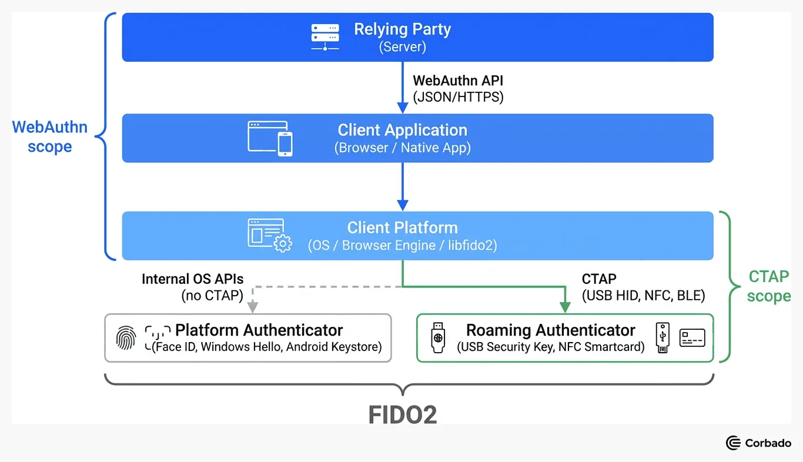
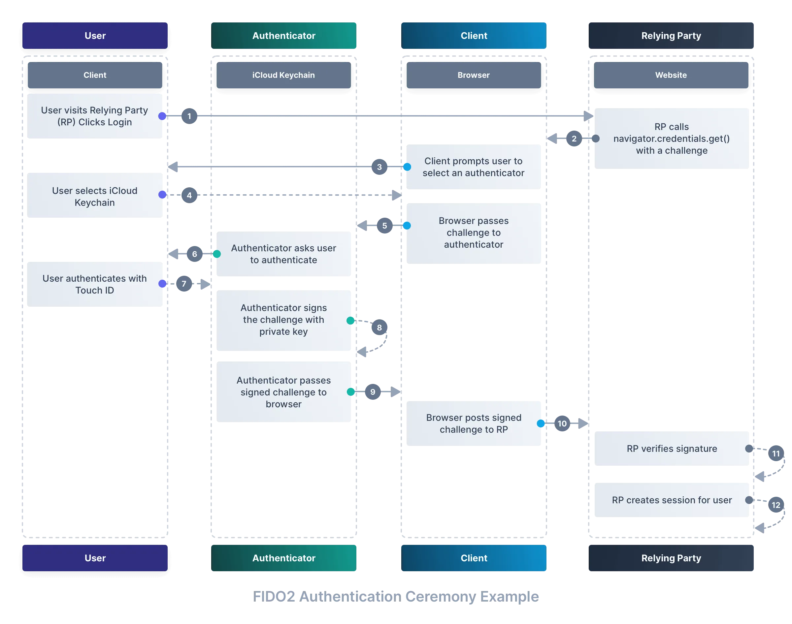
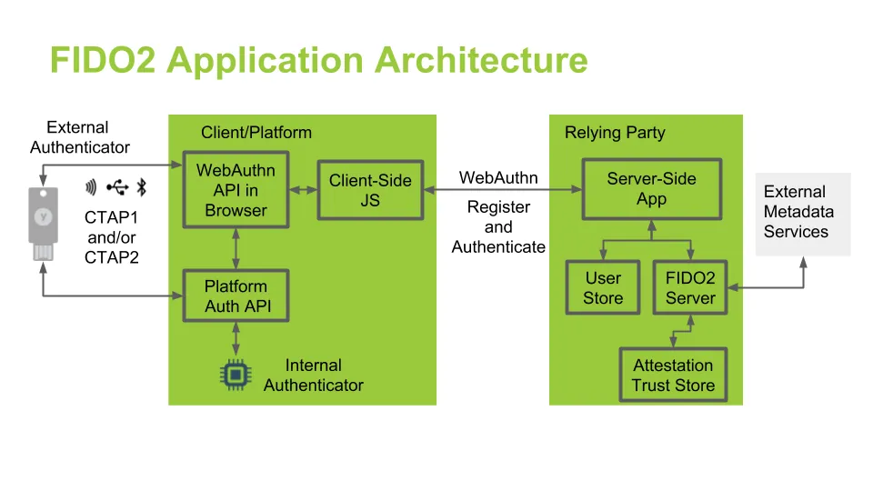
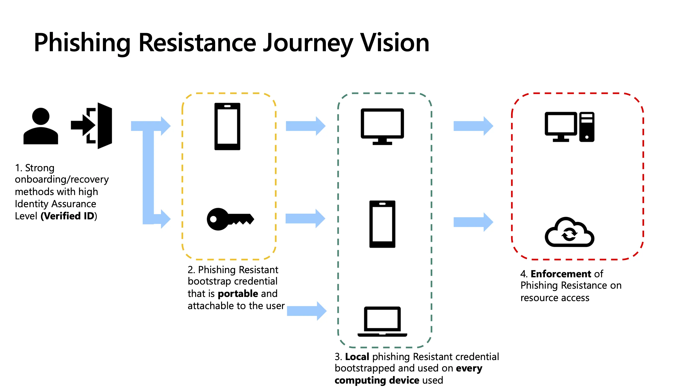

# Merkeziyetsiz Kimlik (DID) ve Parolasız (Passwordless) Gelecek

Parolalar; kimlik avı (phishing), credential stuffing, kaba kuvvet ve veri ihlali sonrası yeniden kullanım saldırılarına karşı yapısal olarak savunmasızdır. Paylaşılan sırlar (shared secrets) sunucu tarafında depolandığı sürece, tek bir veri sızıntısı milyonlarca hesabı aynı anda tehlikeye atar. FIDO2, WebAuthn ve Passkey standartları bu modeli tersine çevirir: kimlik doğrulama, sunucuda saklanan **genel anahtar** ile cihazda kilitli kalan **özel anahtar** arasındaki kriptografik kanıta dayanır. Özel anahtar asla ağ üzerinden iletilmez; sunucu tarafında parola hash'i tutma zorunluluğu ortadan kalkar.

Parolasız kimlik doğrulama yalnızca kullanıcı deneyimini iyileştirmekle kalmaz; MITRE ATT&CK perspektifinden **T1110 (Brute Force)**, **T1078 (Valid Accounts)** ve **T1539 (Steal Web Session Cookie)** gibi tekniklerin etkinliğini kökten azaltır. Ancak saldırı yüzeyi kaybolmaz — **T1556 (Modify Authentication Process)**, bootstrap zayıflıkları ve anormal credential kayıtları yeni izleme gereksinimleri doğurur. Bu bölümde FIDO2/WebAuthn/CTAP mekaniği, Passkey ekosistemi, donanımsal güvenlik anahtarları, DID/Verifiable Credentials ve SOC perspektifinden log analizi ele alınmaktadır.

---

## §4.4.1. FIDO2/WebAuthn/CTAP Derin Mekaniği

### Mimari Katmanlar ve Sorumluluklar

FIDO2, iki birbirini tamamlayan spesifikasyondan oluşur:

| Katman | Spesifikasyon | Sorumluluk | Taşıma |
|--------|---------------|------------|--------|
| **Relying Party (RP) Katmanı** | WebAuthn Level 2 (W3C) | Challenge üretimi, credential kaydı, assertion doğrulama, origin kontrolü | HTTPS |
| **İstemci Katmanı** | WebAuthn Client (tarayıcı/OS) | RP ile authenticator arasında köprü; `clientDataJSON` oluşturma | Platform API |
| **Authenticator Katmanı** | CTAP2 / CTAP2.1 (FIDO Alliance) | Anahtar üretimi, imzalama, UV/UP uygulaması | USB HID, NFC, BLE, internal |

**WebAuthn**, tarayıcının JavaScript API'sidir (`navigator.credentials.create()` / `get()`). **CTAP2 (Client to Authenticator Protocol 2)**, tarayıcı ile fiziksel veya platform kimlik doğrulayıcısı arasındaki ikili (binary) protokoldür. Platform authenticator (Windows Hello, Touch ID, Android Credential Manager) doğrudan OS API'leri üzerinden çalışır; roaming authenticator (YubiKey, Feitian) CTAP2 üzerinden USB HID, NFC veya BLE ile iletişim kurar.



### Credential Oluşturma Seremonisi (Registration)

Kayıt akışı dört aşamada gerçekleşir:

1. **RP → Client:** `PublicKeyCredentialCreationOptions` nesnesi döner. İçerir: `challenge` (32+ byte rastgele nonce), `rp` (id + name), `user` (id, name, displayName), `pubKeyCredParams` (tercih edilen algoritmalar: ES256=-7, RS256=-257), `authenticatorSelection` (residentKey, userVerification, authenticatorAttachment), `attestation` (none/direct/indirect/enterprise).
2. **Client → Authenticator:** CTAP2 `authenticatorMakeCredential()` komutu gönderilir. CBOR kodlamalı istek içerir.
3. **Authenticator:** ECDSA P-256 veya RSA anahtar çifti üretir. Özel anahtar güvenli depoda (TEE, Secure Enclave, SE) kalıcı olarak saklanır. `attestationObject` döner: `authData` + `fmt` + `attStmt`.
4. **RP:** Attestation doğrulanır; `credentialPublicKey` (COSE formatında) ve `credentialId` veritabanına kaydedilir.

```javascript
// RP tarafı kayıt isteği (kavramsal)
const options = await fetch('/webauthn/register/options', { method: 'POST' }).then(r => r.json());
const credential = await navigator.credentials.create({
  publicKey: PublicKeyCredential.parseCreationOptionsFromJSON(options)
});
await fetch('/webauthn/register/verify', {
  method: 'POST',
  body: JSON.stringify(credential.toJSON())
});
```

**Authenticator Data (`authData`) yapısı** — 37 byte sabit başlık + değişken alanlar:

| Alan | Boyut | Açıklama |
|------|-------|----------|
| `rpIdHash` | 32 byte | SHA-256(RP ID); origin binding'in temeli |
| `flags` | 1 byte | UP, UV, AT, ED, BE, BS bitleri |
| `signCount` | 4 byte | Klonlama tespiti için monoton sayaç |
| `aaguid` | 16 byte | Authenticator model tanımlayıcısı |
| `credIdLen` + `credId` | değişken | Credential benzersiz kimliği |
| `credentialPublicKey` | değişken | COSE_Key (CBOR) |



### Doğrulama Seremonisi (Authentication)

1. **RP → Client:** `PublicKeyCredentialRequestOptions` — `challenge`, `allowCredentials` (veya discoverable credential için boş), `userVerification`.
2. **Client → Authenticator:** CTAP2 `authenticatorGetAssertion()`.
3. **Authenticator:** Challenge'ı özel anahtarla imzalar; `authenticatorData` + `signature` + `userHandle` (discoverable credential'larda) döner.
4. **RP:** `signature` doğrulanır; `signCount` önceki değerden büyük mü kontrol edilir (klonlama alarmı).

> **Önemli:** RP, `clientDataJSON` içindeki `origin` ve `type` alanlarını **mutlaka** doğrulamalıdır. `origin` beklenen alan adıyla eşleşmezse assertion reddedilir — bu, FIDO2'nin phishing'e yapısal direncinin temelidir. AiTM (Adversary-in-the-Middle) proxy'leri bile kullanıcının gerçek RP'ye değil saldırgan origin'ine imza attırır; sunucu bu imzayı kabul etmez.

### UV ve UP Bayrakları

**User Presence (UP)** — `flags` bit 0: Kullanıcının fiziksel etkileşimi (dokunma, anahtar takma) kanıtlanmıştır. Güvenlik anahtarına dokunmak UP sağlar; PIN veya biyometri gerekmez.

**User Verification (UV)** — `flags` bit 2: Kullanıcı kimliği PIN, biyometri veya güvenlik anahtarı PIN'i ile doğrulanmıştır. Yüksek güvence senaryolarında UV zorunludur.

| `userVerification` Değeri | Davranış |
|---------------------------|----------|
| `required` | UV olmadan işlem reddedilir |
| `preferred` | UV mümkünse uygulanır; değilse UP yeterli |
| `discouraged` | Yalnızca UP yeterli (düşük riskli senaryolar) |

CTAP2.1'de eski `uv` option key kaldırılmıştır. Bunun yerine `pinUvAuthToken` mekanizması kullanılır: PIN veya biyometri doğrulaması sonrası authenticator, `pinUvAuthParam` (HMAC-SHA256 tabanlı) üretir; bu token sonraki işlemlerde UV kanıtı olarak sunulur.

```python
# authData flags bit çözümleme (kavramsal)
def parse_flags(flags_byte):
    return {
        "UP": bool(flags_byte & 0x01),   # User Present
        "UV": bool(flags_byte & 0x04),   # User Verified
        "AT": bool(flags_byte & 0x40),   # Attestation included
        "ED": bool(flags_byte & 0x80),   # Extension data present
    }
```

### CTAP2 Uzantıları (Extensions)

| Uzantı | Amaç | Kullanım Senaryosu |
|--------|------|-------------------|
| **largeBlob** | Credential'a 2 KB'a kadar şifreli veri depolama | PIV sertifika referansı, uygulama meta verisi |
| **hmac-secret (PRF)** | Challenge + salt ile simetrik anahtar türetme | Dosya şifreleme, oturum anahtarı türetme |
| **credProtect** | Credential'ın discoverable olma düzeyini kısıtlama | Kurumsal cihaz politikaları |
| **minPinLength** | Minimum PIN uzunluğu zorunluluğu | FIPS/NIST uyumu |
| **hybrid (caBLE)** | Telefonu roaming authenticator olarak kullanma | Cross-device passkey (QR + BLE proximity) |

**Large Blob** akışı: Kayıt sırasında `largeBlobKey` türetilir ve RP tarafında saklanır. Okuma/yazma işlemlerinde authenticator, `largeBlobKey` ile şifrelenmiş veriyi döner. Veri authenticator içinde değil, RP veritabanında tutulur; authenticator yalnızca şifreleme anahtarını yönetir.

**PRF (Pseudo-Random Function)** uzantısı, WebAuthn üzerinden deterministik simetrik anahtar türetmeyi mümkün kılar. RP bir `eval` isteği gönderir; authenticator `HMAC-SHA256(privateKey, salt || input)` hesaplar. Bu, parolasız kimlik doğrulamayı şifreleme anahtarı yönetimine bağlar.

**caBLE (Cross-Device BLE)** — Hybrid transport: Masaüstü tarayıcı QR kod gösterir; mobil cihaz QR'ı okur ve BLE proximity kanıtı sağlar. Gerçek kriptografik yük, BLE üzerinden değil şifreli bulut tüneli (CTAP tunnel) üzerinden aktarılır. Bu, telefonun güvenlik anahtarı gibi davranmasını sağlar.

> **Uyarı:** `attestation: "none"` kullanımı, RP'nin authenticator modelini doğrulamasını engeller. Tüketici uygulamalarında gizlilik için yaygındır; kurumsal ortamlarda `direct` veya `enterprise` attestation ile AAGUID allowlist zorunlu tutulmalıdır.

---

## §4.4.2. Passkey Ekosistemi

Passkey, FIDO2 discoverable credential'larının OS seviyesi credential provider ile senkronize edilebilir hale getirilmiş halidir. Kullanıcı deneyimi parola girişine benzer basitlikte; arka planda kriptografik kanıt çalışır.



### Senkronize vs Cihaza Bağlı (Device-Bound) Passkey

| Özellik | Synced Passkey | Device-Bound Passkey |
|---------|----------------|----------------------|
| **Depolama** | iCloud Keychain, Google Password Manager, Windows Hello | Yalnızca tek cihaz/anahtar (YubiKey, TPM) |
| **Kurtarma** | Bulut hesabı ile yeni cihaza aktarım | Fiziksel yedek anahtar gerekir |
| **NIST AAL** | AAL2 (tek faktör sayılır) | AAL3 (donanım kriptografik authenticator) |
| **AAGUID** | Platform sağlayıcı AAGUID'i | Üretici AAGUID'i (ör. Yubico) |
| **Kullanım** | Tüketici, orta riskli kurumsal | Yönetici, finans, kritik altyapı |

**Synced passkey** hesap kurtarma problemini çözer: kullanıcı telefonunu kaybettiğinde iCloud veya Google hesabıyla yeni cihaza credential geri yüklenir. Ancak bu, bulut hesabının güvenliğine bağımlılık yaratır — iCloud hesabı ele geçirilirse passkey'ler de risk altındadır.

**Device-bound passkey** (roaming authenticator), özel anahtarı yalnızca fiziksel cihazda tutar. Senkronizasyon yoktur; kayıp durumunda önceden kayıtlı ikinci bir anahtar gerekir.

> **Önemli:** RP tarafında synced/device-bound ayrımı yalnızca **AAGUID** (Authenticator Attestation Globally Unique Identifier) üzerinden yapılabilir. Apple, Google ve Microsoft kendi AAGUID değerlerini FIDO Metadata Service (MDS) üzerinden yayınlar. Conditional Access politikalarında AAGUID allowlist ile yalnızca onaylı authenticator modellerine izin verilir.

### AAGUID ve FIDO Metadata Service

AAGUID, 128-bit (16 byte) authenticator model tanımlayıcısıdır. Her üretici/model kombinasyonu benzersiz bir AAGUID'e sahiptir.

| Sağlayıcı | Örnek AAGUID Kullanımı |
|-----------|------------------------|
| Apple (iCloud Keychain) | Platform synced passkey |
| Google (Password Manager) | Cross-platform synced |
| Microsoft (Windows Hello) | TPM-backed platform |
| Yubico (YubiKey 5) | Roaming hardware key |

FIDO MDS, AAGUID → authenticator metadata eşlemesini JSON formatında sunar. Metadata içerir: desteklenen algoritmalar, UV/UP yetenekleri, sertifika zinciri, kullanım kısıtlamaları. Kurumsal IdP'ler (Entra ID, Okta) bu metadata'yı kayıt sırasında doğrular.

### Kurumsal Passkey Dağıtımı

Kurumsal ortamda passkey dağıtımı aşağıdaki bileşenleri gerektirir:

1. **Roaming authenticator + AAGUID allowlist:** Yalnızca kurum tarafından tedarik edilen YubiKey modelleri kabul edilir.
2. **Minimum iki kayıtlı anahtar:** Birincil + yedek; kayıp senaryosunda self-service kurtarma.
3. **Bootstrap koruması:** Yeni FIDO2 kaydı için mevcut MFA (telefon OTP değil, mevcut anahtar veya PIM onayı) zorunlu.
4. **MDM politikaları:** Platform passkey senkronizasyonunu kurumsal hesapla sınırlama; kişisel iCloud/Google hesabıyla passkey oluşturmayı engelleme.
5. **Conditional UI (autofill):** `mediation: 'conditional'` ile passkey keşfi giriş formunda otomatik sunulur; kullanıcı adı alanına odaklanınca passkey seçeneği belirir.

```javascript
// Conditional UI ile passkey otomatik keşfi
const credential = await navigator.credentials.get({
  publicKey: requestOptions,
  mediation: 'conditional'  // Autofill entegrasyonu
});
```

### Entra ID Passkey Yapılandırması

Microsoft Entra ID'de passkey desteği şu bileşenlerle yönetilir:

| Ayar | Değer | Etki |
|------|-------|------|
| FIDO2 security key | Enabled | Roaming authenticator kaydı |
| Passkey (FIDO2) | Enabled | Platform passkey kaydı |
| Enforce attestation | Yes | AAGUID doğrulama zorunlu |
| Key restriction policy | Allowlist | Yalnızca belirtilen AAGUID'ler |

Authentication Methods Policy üzerinden passkey, SMS OTP'nin yerine birincil yöntem olarak atanabilir. Conditional Access'te `authenticationStrength` gereksinimi ile phishing-resistant MFA zorunlu kılınır.

---

## §4.4.3. YubiKey/PIV/HSM ve Enterprise Attestation

Donanımsal güvenlik anahtarları, parolasız kimlik doğrulamanın en yüksek güvence katmanını temsil eder. Yazılım tabanlı authenticator'ların aksine, özel anahtar güvenli donanım modülünden (HSM-lite) çıkarılamaz.

### YubiKey Çok Protokollü Mimarisi

YubiKey 5 serisi, tek fiziksel cihazda birden fazla kimlik protokolünü barındırır:

| Protokol | Standart | Kullanım |
|----------|----------|----------|
| **FIDO2/WebAuthn** | CTAP2/CTAP2.1 | Passkey, parolasız giriş |
| **FIDO U2F** | CTAP1/U2F | Legacy iki faktörlü |
| **PIV** | FIPS 201-3 / SP 800-73-4 | Akıllı kart emülasyonu, PKI |
| **OpenPGP** | RFC 4880 | E-posta imzalama/şifreleme |
| **OATH (TOTP/HOTP)** | RFC 6238/4226 | OTP üretimi (YubiKey Authenticator) |
| **Yubico OTP** | Yubico proprietary | RADIUS/VPN entegrasyonu |

Firmware 5.7 ile: 100 discoverable credential, RSA-3072/4096, Ed25519, X25519 desteği. FIDO Level 2 sertifikası ile attestable hardware-bound credential üretimi.

### PIV (Personal Identity Verification)

PIV, akıllı kart PKI altyapısının USB/NFC form faktörüne taşınmış halidir:

```
PIV Slot Yapısı (YubiKey):
├── Slot 9a: PIV Authentication (X.509 sertifika)
├── Slot 9c: Digital Signature
├── Slot 9d: Key Management (şifreleme)
├── Slot 9e: Card Authentication
└── Slot 82/83: Retired key slots
```

**Sertifika doğrulama zinciri:** RP/CA → OCSP yanıtı veya CRL kontrolü → sertifika geçerliliği. CCID (Chip Card Interface Device) protokolü, kart okuyucu iletişimini standartlaştırır. PIN kilitleme: 3 yanlış PIN sonrası PUK gerekir; 3 yanlış PUK sonrası slot kalıcı olarak kilitlenir.

PIV kullanım senaryoları: Windows Smart Card Logon, VPN (IKEv2/EAP-TLS), RDP, e-posta imzalama (S/MIME), disk şifreleme (BitLocker with TPM+PIN).

### Enterprise Attestation (EA)

Varsayılan FIDO2 attestation, authenticator modelini (AAGUID) ifşa eder ancak **seri numarasını gizler** (gizlilik koruması). Enterprise Attestation, IdP'nin kayıt sırasında cihaz seri numarasını okumasına izin verir:

| Attestation Türü | AAGUID | Seri Numarası | Kullanım |
|------------------|--------|---------------|----------|
| `none` | Gizli | Gizli | Tüketici uygulamalar |
| `direct` | Açık | Gizli | Genel kurumsal |
| `enterprise` | Açık | Açık | Tam envanter kontrolü |

EA ile kurum, yalnızca kendi tedarik ettiği YubiKey'lerin kayıt olmasını garanti eder. Seri numarası envanter sistemiyle eşleştirilir; kayıp/çalıntı anahtar anında revoke edilir.

```bash
# YubiKey seri numarası okuma (kavramsal)
ykman fido info
# Serial: 12345678, FIDO version: 2.1, AAGUID: xxxxxxxx-xxxx-xxxx-xxxx-xxxxxxxxxxxx
```

### HSM ve Kök Güven

HSM (Hardware Security Module), kurumsal PKI'nın kök anahtarlarını FIPS 140-2/140-3 onaylı donanımda korur:

| HSM Türü | Örnek | Rol |
|----------|-------|-----|
| **Donanım HSM** | Thales Luna, Entrust nShield | CA private key, KEK |
| **Bulut HSM** | AWS CloudHSM, Azure Dedicated HSM | Bulut PKI kökü |
| **Yazılım HSM** | SoftHSM (test), HashiCorp Vault | Geliştirme/test ortamı |

PIV/akıllı kart PKI zincirinde: HSM → Offline Root CA → Issuing CA → PIV sertifika. Kök anahtar HSM'den asla çıkarılmaz; sertifika imzalama HSM içinde gerçekleşir. YubiKey FIPS serisi (CMVP #3914), kriptografik modülün FIPS 140-2/140-3 doğrulamasına sahiptir.

> **Kontrol Eşlemesi:** NIST SP 800-63B AAL3 — donanım kriptografik authenticator zorunlu; NIST SP 800-53 **IA-5** (Authenticator Management), **SC-12** (Cryptographic Key Establishment); FIPS 201-3 PIV gereksinimleri.

---

## §4.4.4. DID, Verifiable Credentials ve Entra Verified ID

Merkezi kimlik sağlayıcılar (Google, Microsoft, Meta) kullanıcı kimliğini kontrol eder. DID (Decentralized Identifier) modeli, kimlik tanımlayıcısının kontrolünü kullanıcıya veya kuruma geri verir.

### DID Yapısı ve DID Document

DID formatı: `did:[method]:[method-specific-id]`

```
did:web:verifiedid.contoso.com
did:key:z6MkhaXgBZDvotDkL5257faiztiGiC2QtKLGpbnnEGta2doK
did:ion:EiClkZ... (Microsoft 2023 sonunda kaldırdı)
```

Bir DID, **DID Document (DDO)**'a çözümlenir. DDO içerir:

| Alan | İçerik |
|------|--------|
| `@context` | JSON-LD bağlam |
| `id` | DID tanımlayıcısı |
| `verificationMethod` | Public key materyali, imzalama anahtarları |
| `authentication` | Kimlik doğrulama yöntemleri |
| `assertionMethod` | VC imzalama yetkisi |
| `service` | Endpoint'ler (issuer, resolver) |

**did:web** yöntemi: DID, HTTPS URL'ye çözümlenir. `https://verifiedid.contoso.com/.well-known/did.json` adresinde DDO barındırılır. Alan adı kontrolü (DNS/HTTPS), DID sahipliğinin kanıtıdır. Pratik ve "sıkıcı" ama kurumsal ortamlarda en yaygın yöntemdir.

### Verifiable Credentials (VC) ve Presentations

VC modeli üç aktörlü bir güven üçgeni oluşturur:

```
Issuer (Veren)  ──VC──►  Holder (Sahip/Cüzdan)  ──VP──►  Verifier (Doğrulayan)
     │                          │                              │
     └── DID + imza ────────────┴── Seçici açıklama ──────────┘
```

| Kavram | Açıklama |
|--------|----------|
| **Verifiable Credential (VC)** | Issuer tarafından imzalanmış, holder'a verilen dijital kanıt |
| **Verifiable Presentation (VP)** | Holder'ın verifier'a sunduğu VC paketi; selective disclosure mümkün |
| **Selective Disclosure** | Yalnızca gerekli alanların paylaşılması (yaş kanıtı, diploma) |
| **Self-Sovereign Identity (SSI)** | Kullanıcı kendi kimlik verisini taşır; merkezi veritabanına bağımlılık yok |

VC yapısı (W3C): `@context`, `type`, `issuer`, `issuanceDate`, `credentialSubject`, `proof` (dijital imza).

### Microsoft Entra Verified ID

Entra Verified ID, kurumsal VC ihraç ve doğrulama hizmetidir:

| Bileşen | Rol |
|---------|-----|
| **DID** | Kurumun did:web tanımlayıcısı |
| **Trust System** | Issuer/verifier güven ağı |
| **Microsoft Authenticator** | Holder cüzdanı (VC depolama) |
| **Verified ID Service** | REST API — VC issue/verify |
| **Microsoft Resolver** | DID → DDO çözümleme |

**did:web güven sistemi:** Kurum, alan adına bağlı DID oluşturur. Well-Known DID Configuration (`/.well-known/did-configuration.json`) ile domain ownership kanıtlanır. did:ion seçeneği Aralık 2023'te kaldırılmıştır.

**VC yaşam döngüsü kontrolleri:**

1. **İhraç (Issuance):** Admin, credential template tanımlar; kullanıcıya QR/link ile VC verilir.
2. **Saklama:** Microsoft Authenticator cüzdanında şifreli depolama.
3. **Sunum (Presentation):** Verifier, presentation request gönderir; holder onaylar.
4. **İptal (Revocation):** Issuer, VC'yi Status List 2021 ile iptal eder.
5. **Süre dolumu:** `expirationDate` ile otomatik geçersizlik.

```json
// Entra Verified ID issuance request (kavramsal)
{
  "includeQRCode": true,
  "authority": "did:web:verifiedid.contoso.com",
  "registration": {
    "clientName": "Contoso HR Portal"
  },
  "callback": {
    "url": "https://hr.contoso.com/api/verifiedid/callback",
    "state": "session-uuid",
    "headers": { "api-key": "..." }
  },
  "requestedCredentials": [{
    "type": "VerifiedEmployee",
    "acceptedIssuers": ["did:web:verifiedid.contoso.com"],
    "configuration": {
      "validation": { "allowRevoked": false, "validateLinkedDomain": true }
    }
  }]
}
```

**Kullanım senaryoları:** Çalışan onboarding (işveren kanıtı), iş ortağı doğrulama (tedarikçi sertifikası), e-devlet entegrasyonu (nitelikli elektronik sertifika), üniversite diploma doğrulama.

> **Türkiye Mevzuatı Notu:** VC tabanlı kimlik doğrulama, KVKK kapsamında kişisel veri işleme faaliyetidir. Selective disclosure ile veri minimizasyonu ilkesi (Madde 4) desteklenir; ancak issuer/verifier arasındaki işlem logları 5651 kapsamında saklanmalıdır.

---

## §4.4.5. Parolasız Ortamda Log Analizi ve Anomali Tespiti

Parolasız kimlik doğrulamaya geçiş, SOC ekiplerinin izleme paradigmalarını değiştirir. Saldırı yüzeyi parola hırsızlığından **kimlik doğrulama sürecinin manipülasyonuna** (MITRE **T1556 — Modify Authentication Process**) ve **anormal credential kaydına** kayar.



### Kritik Log Kaynakları

| Kaynak | Kanal/API | İçerik |
|--------|-----------|--------|
| **Windows** | `Microsoft-Windows-WebAuthN/Operational` | FIDO2 kayıt, doğrulama, kaldırma |
| **Windows** | `Microsoft-Windows-HelloForBusiness/Operational` | WHfB provisioning, key rollover |
| **Windows Security** | Event ID 4624/4625/4672 | Oturum açma (FIDO2 ayrımı yapmaz!) |
| **Entra ID** | Sign-in logs | `Authentication method: Passkey/FIDO2` |
| **Entra ID** | Audit logs | `Add/Delete FIDO2 security key` |
| **Entra ID** | `fido2AuthenticationMethod` | Kayıtlı anahtar envanteri |

> **Önemli:** Standart Windows Event ID 4624/4625, FIDO2 güvenlik anahtarının kullanılıp kullanılmadığını **göstermez**. Bu bilgi `Microsoft-Windows-WebAuthN/Operational` kanalında bulunur ve Security log ile korelasyon gerektirir. Entra ID'de FIDO2 anahtarı `fido2AuthenticationMethod` kaynağı olarak saklanır; audit olayında `KeyIdentifier` Base64 kodlu tutulur.

### Windows WebAuthN Olayları

| Event ID | Açıklama | SOC Önemi |
|----------|----------|-----------|
| 1001 | Credential oluşturuldu | Yeni passkey kaydı — bootstrap kontrolü |
| 1002 | Credential silindi | Toplu silme = insider threat |
| 2001 | Assertion başarılı | Normal doğrulama |
| 2002 | Assertion başarısız | UV/UP bayrak hatası, brute force |
| 3001 | Authenticator bağlandı | Yeni cihaz tanıma |

### Entra ID Audit ve Sign-in Olayları

| Operation | Category | Risk Göstergesi |
|-----------|----------|-----------------|
| `Add FIDO2 security key` | UserManagement | Bilinmeyen AAGUID ile kayıt |
| `Delete FIDO2 security key` | UserManagement | Toplu kaldırma (5+ / 1 saat) |
| `Sign-in` + `AuthenticationMethod: Passkey` | SignInLogs | Coğrafi anomali |
| `Sign-in` + `AuthenticationRequirement: singleFactor` | SignInLogs | Synced passkey tek faktör uyarısı |

### Anomali Tespit Senaryoları

| Senaryo | Gösterge | MITRE Teknik | Öncelik |
|---------|----------|--------------|---------|
| Hesap ele geçirme bootstrap | Yeni FIDO2 kaydı + 5 dk içinde ayrıcalıklı oturum | T1556.004 | Kritik |
| Impossible travel | 2 saat içinde 5000+ km mesafe passkey doğrulama | T1078 | Yüksek |
| Toplu passkey kaldırma | 1 saatte 10+ Delete FIDO2 audit | T1556 | Yüksek |
| UV/UP bayrak anomalisi | 3+ ardışık assertion UV=false | T1110 | Orta |
| Bilinmeyen AAGUID | Kayıt sırasında allowlist dışı AAGUID | T1556.004 | Kritik |
| SignCount gerilemesi | Önceki değerden düşük signCount | T1556 | Kritik (klonlama) |

### Wazuh SIEM Kuralları

```xml
<!-- FIDO2: Anormal cihazdan yeni passkey kaydı -->
<rule id="100850" level="12">
  <if_group>authentication</if_group>
  <field name="win.system.channel">Microsoft-Windows-WebAuthN/Operational</field>
  <field name="win.system.eventID">1001</field>
  <description>FIDO2: Yeni credential kaydı tespit edildi - bootstrap kontrolü gerekli</description>
  <mitre>
    <id>T1556</id>
    <id>T1556.004</id>
  </mitre>
  <group>authentication,fido2,passkey,</group>
</rule>

<!-- FIDO2: Toplu credential silme -->
<rule id="100851" level="14" frequency="5" timeframe="3600">
  <if_matched_sid>100852</if_matched_sid>
  <description>FIDO2: 1 saat içinde 5+ passkey kaldırma - olası hesap ele geçirme</description>
  <mitre><id>T1556</id></mitre>
  <group>authentication,fido2,insider_threat,</group>
</rule>

<rule id="100852" level="8">
  <if_group>authentication</if_group>
  <field name="win.system.channel">Microsoft-Windows-WebAuthN/Operational</field>
  <field name="win.system.eventID">1002</field>
  <description>FIDO2: Credential silindi</description>
  <group>authentication,fido2,</group>
</rule>

<!-- FIDO2: UV/UP bayrak başarısızlığı -->
<rule id="100853" level="10" frequency="3" timeframe="300">
  <if_matched_sid>100854</if_matched_sid>
  <description>FIDO2: 5 dakikada 3+ UV/UP başarısız doğrulama</description>
  <mitre><id>T1110</id></mitre>
  <group>authentication,fido2,brute_force,</group>
</rule>

<rule id="100854" level="5">
  <if_group>authentication</if_group>
  <field name="win.system.channel">Microsoft-Windows-WebAuthN/Operational</field>
  <field name="win.system.eventID">2002</field>
  <description>FIDO2: Assertion başarısız</description>
  <group>authentication,fido2,</group>
</rule>

<!-- Entra ID: Bilinmeyen AAGUID ile kayıt -->
<rule id="100855" level="12">
  <decoded_as>json</decoded_as>
  <field name="OperationName">Add FIDO2 security key</field>
  <field name="AAGUID" negate="yes">ALLOWED_AAGUID_LIST</field>
  <description>Entra ID: Allowlist dışı AAGUID ile FIDO2 kaydı</description>
  <mitre><id>T1556.004</id></mitre>
  <group>authentication,entra_id,fido2,</group>
</rule>
```

### Splunk SPL Sorguları

```spl
# Yeni FIDO2 kaydı + ardından ayrıcalıklı oturum korelasyonu
index=wineventlog OR index=entra_audit
| eval event_type=case(
    EventCode=4624, "logon",
    EventCode=4672, "privileged",
    match(source, "WebAuthN"), "fido2_register",
    OperationName="Add FIDO2 security key", "entra_fido2_add"
  )
| transaction user maxspan=5m
| where mvcount(event_type) >= 2
  AND (match(event_type, "fido2") OR match(event_type, "entra_fido2"))
  AND match(event_type, "privileged")
| table _time, user, src_ip, event_type, AAGUID

# UV/UP bayrak anomalisi - başarısız assertion analizi
index=webauthn OR source="*WebAuthN/Operational*"
| search EventCode=2002 OR assertion_result="failed"
| eval uv_fail=if(uv_flag="false" OR flags_up="0", 1, 0)
| stats count, latest(_time) as last_attempt by user, authenticator_aaguid, src_ip, uv_fail
| where count > 3 AND uv_fail > 0
| sort - count

# Toplu passkey kaldırma tespiti
index=entra_audit OperationName="Delete FIDO2 security key"
| stats count by ActorUPN, bin(_time, 1h) as hour
| where count >= 5
| table hour, ActorUPN, count

# Impossible travel - passkey ile giriş
index=entra_signin AuthenticationMethod="Passkey"
| iplocation Location
| sort 0 user, _time
| streamstats current=f last(City) as prev_city, last(_time) as prev_time by user
| eval time_diff=(_time - prev_time) / 60
| where prev_city != City AND time_diff < 120
| table _time, user, prev_city, City, time_diff, IPAddress

# SignCount gerileme tespiti (klonlama göstergesi)
index=webauthn EventCode=2001
| sort 0 credential_id, _time
| streamstats current=f last(sign_count) as prev_count by credential_id
| where sign_count < prev_count
| table _time, user, credential_id, prev_count, sign_count, authenticator_aaguid
```

### Log Korelasyon Hattı

```
┌─────────────────────┐     ┌─────────────────────┐     ┌─────────────────────┐
│ Windows WebAuthN/   │     │ Windows Security    │     │ Entra ID Audit +    │
│ Operational         │────►│ (4624/4625/4672)    │────►│ Sign-in Logs        │
└─────────────────────┘     └─────────────────────┘     └─────────────────────┘
           │                          │                          │
           └──────────────────────────┼──────────────────────────┘
                                      ▼
                          ┌─────────────────────┐
                          │ SIEM (Wazuh/Splunk) │
                          │ Korelasyon Motoru   │
                          └─────────────────────┘
                                      │
                    ┌─────────────────┼─────────────────┐
                    ▼                 ▼                 ▼
            ┌─────────────┐   ┌─────────────┐   ┌─────────────┐
            │ T1556 Alarm │   │ T1110 Alarm │   │ SOC Playbook│
            │ (Auth Mod)  │   │ (Brute Force)│   │ (IR Triage) │
            └─────────────┘   └─────────────┘   └─────────────┘
```

> **Türkiye Mevzuatı Notu:** FIDO2/WebAuthn olay loglarının merkezi SIEM'de toplanması, **KVKK Madde 12** (veri güvenliği yükümlülüğü) ve **5651 Sayılı Kanun** (zaman damgalı, değiştirilemez log) gereksinimleriyle uyumlu olmalıdır. KVKK Kişisel Veri Güvenliği Rehberi; erişim loglarını, yetki matrisini ve kullanıcı hesap yönetimini açıkça teknik tedbir olarak listeler. **BDDK BSEBY** (Bankaların Bilgi Sistemleri ve Elektronik Bankacılık Hizmetleri Hakkında Yönetmelik), uzaktan ve ayrıcalıklı erişimde çok bileşenli kimlik doğrulama ile iz kaydı tutmayı zorunlu kılar. Log saklama süreleri: 5651 için minimum 2 yıl; BDDK için işlem kayıtları 10 yıl.

> **Kontrol Eşlemesi:** NIST SP 800-53 **IA-5** (Authenticator Management), **IA-2(1)** (MFA), **AU-6** (Audit Review/Analysis), **SI-4** (System Monitoring); NIST SP 800-63B AAL3 (donanım kriptografik authenticator); CIS Controls v8 **8.5** (Detailed audit logs), **8.11** (Audit log review); ISO 27001:2022 **A.8.15** (Logging), **A.8.16** (Monitoring activities).

---

## Uygulama Kontrol Listesi — §4.4

Parolasız ve merkeziyetsiz kimlik altyapısının güvenli devreye alınması için aşağıdaki kontrol listesi kullanılmalıdır:

**FIDO2/WebAuthn Temel Kontroller:**
- [ ] RP tarafında `origin` ve `rpIdHash` doğrulaması uygulanıyor
- [ ] Yüksek güvence senaryolarında `userVerification: required` zorunlu
- [ ] `signCount` monotonluk kontrolü aktif (klonlama tespiti)
- [ ] Attestation politikası tanımlı (kurumsal: `direct` veya `enterprise`)

**Passkey ve Kurumsal Dağıtım:**
- [ ] Yönetici/ayrıcalıklı erişimde donanım FIDO2 (roaming + AAGUID allowlist + EA)
- [ ] Her kullanıcıda minimum iki kayıtlı anahtar (birincil + yedek)
- [ ] Synced passkey yalnızca tüketici/orta riskli senaryolarda; AAL3 için device-bound
- [ ] Yeni FIDO2 kaydı için mevcut MFA doğrulaması zorunlu (bootstrap koruması)
- [ ] Conditional Access'te `authenticationStrength` ile phishing-resistant MFA

**Donanım ve PKI:**
- [ ] PIV/akıllı kart PKI'da OCSP/CRL doğrulama zinciri aktif
- [ ] Kök CA anahtarları HSM içinde (FIPS 140-2/140-3)
- [ ] YubiKey envanteri seri numarası ile takip ediliyor
- [ ] Kayıp/çalıntı anahtar revoke prosedürü tanımlı

**DID ve Verifiable Credentials:**
- [ ] Entra Verified ID (did:web) ile VC ihraç/doğrulama pilotu
- [ ] VC iptal (revocation) ve süre dolumu kontrolleri tanımlı
- [ ] Selective disclosure ile KVKK veri minimizasyonu uygulanıyor

**İzleme ve Uyumluluk:**
- [ ] `Microsoft-Windows-WebAuthN/Operational` logları SIEM'e besleniyor
- [ ] Yeni credential kaydı alarmı aktif (T1556.004)
- [ ] UV/UP bayrak başarısızlığı korelasyonu tanımlı
- [ ] Toplu passkey kaldırma alarmı aktif (insider threat)
- [ ] FIDO2 log korelasyonu KVKK Madde 12, 5651 ve BDDK yükümlülükleriyle uyumlu
- [ ] Loglar zaman damgalı ve değiştirilemez (WORM depolama)

**Olay Müdahale:**
- [ ] T1556 tespit playbook'u hazır (bootstrap saldırısı müdahalesi)
- [ ] SignCount gerileme alarmı → klonlama araştırma prosedürü
- [ ] Bilinmeyen AAGUID kaydı → otomatik credential revoke