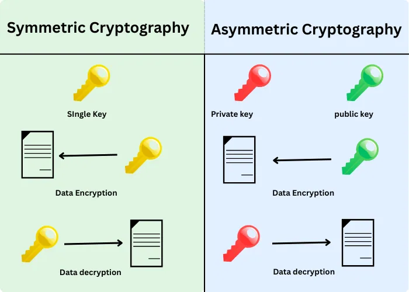
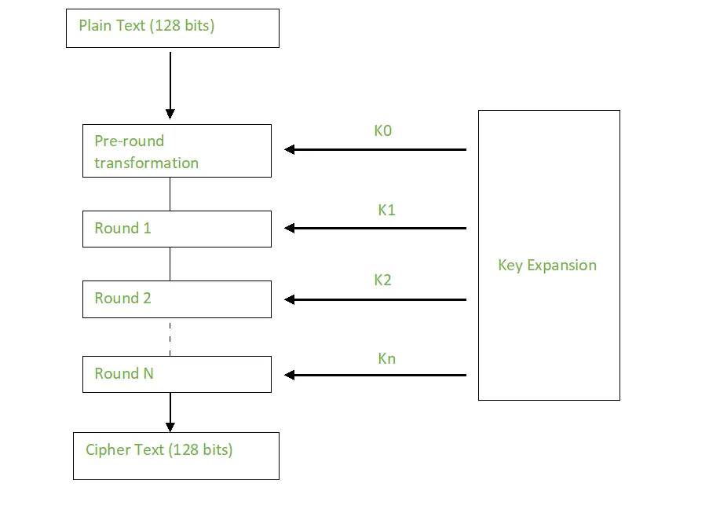
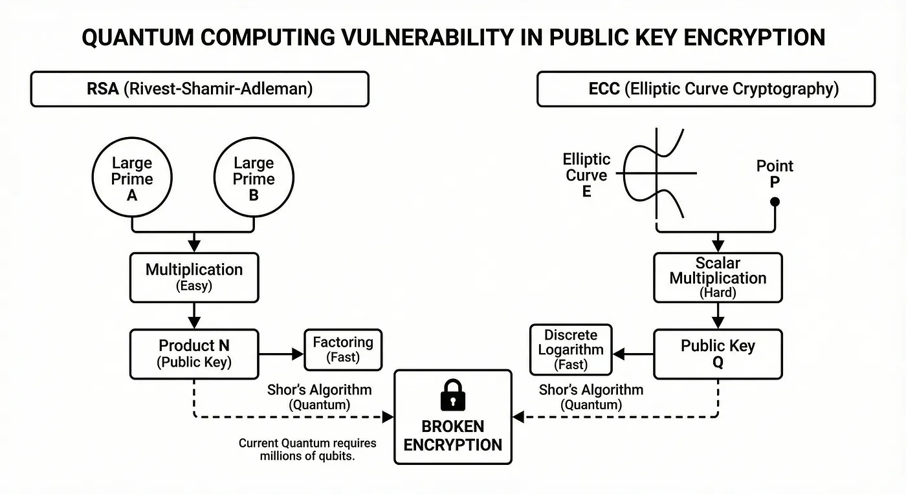
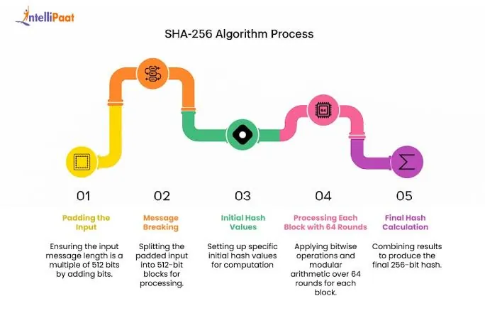
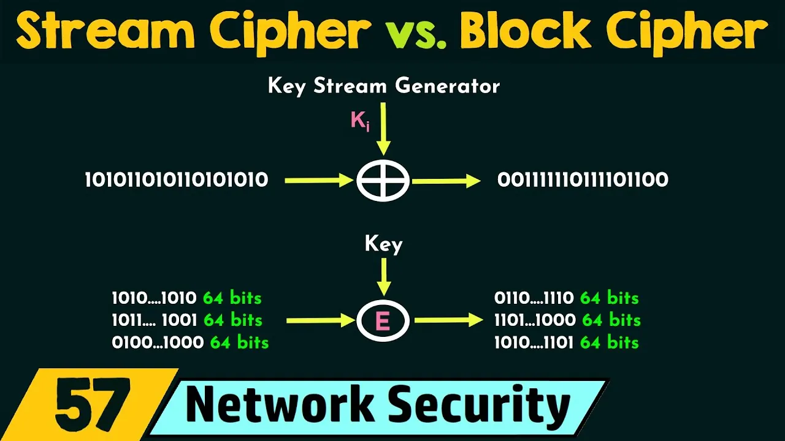
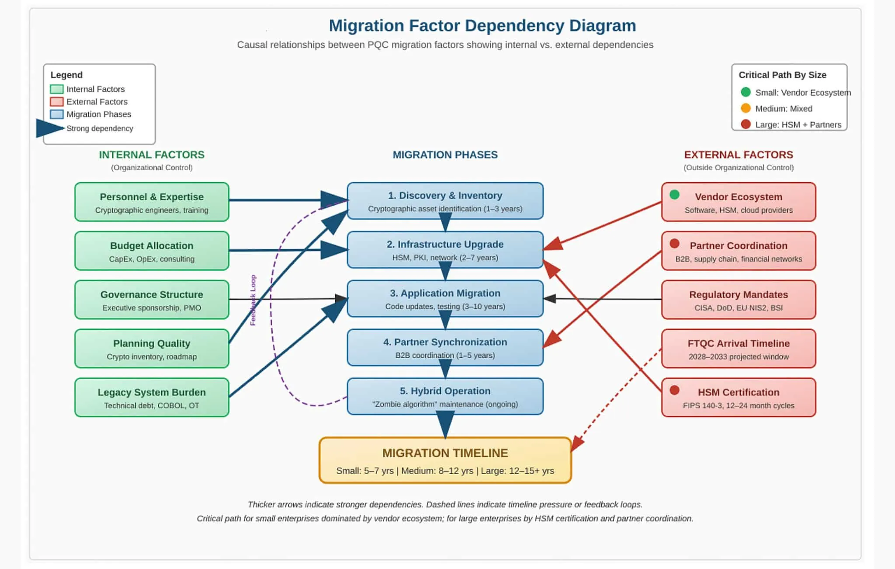

# Kriptografi, Şifreleme Algoritmaları ve Kriptografik Özetleme (Hash)

Kriptografi, bilginin gizliliğini (confidentiality), bütünlüğünü (integrity), kaynağının doğrulanmasını (authenticity) ve inkâr edilemezliğini (non-repudiation) matematiksel yöntemlerle sağlayan disiplindir. Kurumsal siber güvenlik mimarisinde kriptografi; TLS iletişim kanallarının korunmasından disk şifrelemesine, parola saklama politikalarından dijital imza ve PKI altyapısına kadar her katmanda temel bir kontrol mekanizmasıdır. Yanlış algoritma seçimi, zayıf anahtar yönetimi veya mod (mode) hataları; güçlü güvenlik duvarları ve EDR çözümlerinin atlayabileceği yapısal zafiyetlere dönüşebilir. **MITRE ATT&CK** çerçevesinde bu zafiyetler; T1557 (Adversary-in-the-Middle), T1600 (Weaken Encryption), T1552 (Unsecured Credentials) ve T1003 (OS Credential Dumping) gibi taktiklerle zincirleme saldırılara zemin hazırlar.

Bu bölümde simetrik ve asimetrik şifreleme, blok/akış şifreleyiciler, kriptografik özetleme (hash), açık anahtar altyapısı (PKI), kuantum sonrası kriptografi (PQC) ve Türkiye özelindeki uyumluluk gereksinimleri (**KVKK**, **BDDK**, **5651**) ile uluslararası standartlar (**NIST SP 800-57**, **NIST SP 800-131A**, **ISO 27001:2022 A.8/A.10**, **CIS Controls v8**) ışığında bütünsel bir kriptografik savunma mimarisi ele alınacaktır.


*Simetrik ve asimetrik şifreleme karşılaştırması*

---

## §5.1.1. Simetrik ve Asimetrik Şifreleme

Şifreleme algoritmaları, anahtar yönetim modeline göre iki temel sınıfa ayrılır: simetrik (tek paylaşımlı gizli anahtar) ve asimetrik (açık/gizli anahtar çifti). Gerçek dünya mimarilerinde bu iki yaklaşım birbirini tamamlar; asimetrik kriptografi anahtar değişimi ve kimlik doğrulama için, simetrik kriptografi ise yüksek hacimli veri şifrelemesi için kullanılır.

### Simetrik Şifreleme: AES ve Çalışma Modları

**Advanced Encryption Standard (AES)**, NIST tarafından 2001'de standartlaştırılan ve günümüzde hem durağan veri (data-at-rest) hem de iletim halindeki veri (data-in-transit) korumasının altın standardı kabul edilen blok şifreleyicidir. AES, Galois alanı GF(2⁸) üzerinde SubBytes, ShiftRows, MixColumns ve AddRoundKey dönüşümlerini 10 (AES-128), 12 (AES-192) veya 14 (AES-256) tur boyunca uygular.

Blok şifreleyicinin güvenliği yalnızca algoritmaya değil, seçilen **çalışma moduna (mode of operation)** bağlıdır:

| Mod | Tam Adı | Paralel Şifreleme | Bütünlük | Güvenlik Durumu | Tipik Kullanım |
| :---- | :---- | :---- | :---- | :---- | :---- |
| **ECB** | Electronic Codebook | Evet | Hayır | **Güvensiz** — aynı blok aynı şifreli metin | Kullanılmamalı |
| **CBC** | Cipher Block Chaining | Hayır | Hayır | Orta — Padding Oracle riski | Eski disk şifreleme, legacy |
| **CTR** | Counter | Evet | Hayır | İyi — nonce tekrarı kritik | Paralel akış şifreleme |
| **GCM** | Galois/Counter Mode | Evet | Evet (AEAD) | **Önerilen** | TLS 1.3, IPsec, bulut depolama |

**ECB modu**, aynı düz metin bloğunun her zaman aynı şifreli metin bloğunu üretmesi nedeniyle veri desenlerini ifşa eder. Kurumsal ortamlarda kesinlikle kullanılmamalıdır.

**CBC modu**, her bloğu bir önceki şifreli blok ile XOR'layarak zincirleme bağımlılık oluşturur. İlk blok için kriptografik olarak güvenli rastgele bir **IV (Initialization Vector)** zorunludur. CBC, bütünlük doğrulaması sunmadığından Padding Oracle saldırılarına (ör. CVE-2016-2107) karşı savunmasızdır.

**CTR modu**, bir sayaç değerini şifreleyerek keystream üretir ve düz metin ile XOR'lar. Paralel işlemeye izin verir; ancak aynı anahtar+nonce çiftinin tekrar kullanılması tamamen güvensizdir.

**GCM modu**, CTR'nin şifreleme yapısını Galois alanı üzerinde GHASH bütünlük doğrulaması ile birleştiren bir **AEAD (Authenticated Encryption with Associated Data)** protokolüdür. Şifreleme ve kimlik doğrulama tek geçişte gerçekleşir; TLS 1.3, AWS S3 istemci tarafı şifreleme ve modern VPN çözümlerinde standarttır.


*AES blok şifreleme yapısı ve tur işlemleri*

**Python ile AES-GCM şifreleme örneği:**

```python
from cryptography.hazmat.primitives.ciphers.aead import AESGCM
import os

# 256-bit anahtar ve 96-bit nonce (her mesaj için benzersiz olmalı)
key = AESGCM.generate_key(bit_length=256)
nonce = os.urandom(12)
aesgcm = AESGCM(key)

plaintext = b"Hassas musteri verisi - KVKK kapsami"
associated_data = b"metadata:hesap-no-12345"

# AEAD: hem sifreleme hem butunluk etiketi
ciphertext = aesgcm.encrypt(nonce, plaintext, associated_data)

# Cozme — butunluk dogrulamasi basarisizsa InvalidTag firlatir
decrypted = aesgcm.decrypt(nonce, ciphertext, associated_data)
assert decrypted == plaintext
```

### 3DES ve Sweet32 Saldırısı

**Triple DES (3DES / TDEA)**, DES algoritmasının üç kez ardışık uygulanmasıyla oluşturulmuş eski nesil bir blok şifreleyicidir. NIST SP 800-131A Rev. 2 uyarınca 3DES, 2023 itibarıyla **deprecated** statüsündedir ve yeni sistemlerde kullanılmamalıdır.

3DES'in iki temel zafiyeti vardır:

*   **Meet-in-the-Middle saldırısı:** Üç anahtarlı yapıda bile efektif güvenlik yalnızca ~112 bit seviyesindedir.
*   **Sweet32 (CVE-2016-2183):** 64 bitlik blok boyutu, yüksek hacimli trafikte doğum günü paradoksu ile çarpışma saldırısına izin verir. Yaklaşık 2³² blok (~32 GB) trafikte gizli veri sızıntısı mümkündür.

:::caution
PCI-DSS, BDDK ve NIST SP 800-131A uyumlu ortamlarda 3DES, RC4 ve DES kullanımı derhal sonlandırılmalıdır. TLS yapılandırmalarında `DES-CBC3-SHA` ve benzeri cipher suite'ler kaldırılmalıdır.
:::

### Asimetrik Şifreleme: RSA, ECC ve Anahtar Değişimi

Asimetrik kriptografi, anahtar dağıtım problemini çözen matematiksel çiftler üzerine kuruludur. Açık anahtar (public key) herkese dağıtılabilir; gizli anahtar (private key) yalnızca sahibinde kalır.

| Algoritma | Matematiksel Temel | Tipik Anahtar Boyutu | Performans | Kuantum Dayanıklılığı |
| :---- | :---- | :---- | :---- | :---- |
| **RSA** | Tamsayı çarpanlara ayırma | 2048–4096 bit | Yavaş | **Güvensiz** (Shor) |
| **ECC (P-256, P-384)** | Eliptik eğri ayrık logaritma (ECDLP) | 256–384 bit | Orta | **Güvensiz** (Shor) |
| **X25519 / ECDHE** | Curve25519 anahtar değişimi | 256 bit | Hızlı | **Güvensiz** (Shor) |
| **Ed25519** | Edwards eğrisi dijital imza | 256 bit | Hızlı | **Güvensiz** (Shor) |

**RSA**, iki büyük asal sayının çarpımının çarpanlarına ayrılmasının hesaplama açısından zor olmasına dayanır. NIST SP 800-57 Part 1 Rev. 5'e göre RSA-2048, 2030'a kadar kabul edilebilir güvenlik sunar; ancak yeni sistemlerde RSA-3072 veya ECC tercih edilmelidir.

**ECC (Elliptic Curve Cryptography)**, çok daha kısa anahtarlarla RSA eşdeğeri güvenlik sağlar. P-256 (secp256r1) ve Curve25519, TLS ve kod imzalama altyapılarında yaygın kullanılır.

**Diffie-Hellman (DH) ve ECDHE (Elliptic Curve Diffie-Hellman Ephemeral)**, iki tarafın güvensiz bir kanal üzerinde ortak gizli anahtar üzerinde uzlaşmasını sağlar. **ECDHE**'nin ephemeral (geçici) anahtar kullanımı, **Perfect Forward Secrecy (PFS)** sağlar: sunucunun uzun ömürlü gizli anahtarı ele geçirilse bile geçmiş oturum trafiği deşifre edilemez.

:::note
TLS 1.3, PFS'yi zorunlu kılar; statik RSA anahtar değişimi (RSA key transport) desteklenmez. Tüm modern TLS el sıkışmaları ECDHE tabanlıdır.
:::

**OpenSSL ile ECDHE parametre doğrulama:**

```bash
# Sunucunun destekledigi cipher suite'leri ve PFS durumunu kontrol
openssl s_client -connect www.ornek-kurum.com.tr:443 -tls1_3 2>/dev/null \
  | openssl x509 -noout -text \
  | grep -A2 "Public Key Algorithm"

# Testssl.sh ile zayif cipher taramasi
testssl.sh --cipher-per-proto --severity HIGH www.ornek-kurum.com.tr
```

---

## §5.1.2. Blok ve Akış Şifreleme

Simetrik şifreleme algoritmaları, veriyi işleme biçimine göre **blok şifreleyici (block cipher)** ve **akış şifreleyici (stream cipher)** olarak ikiye ayrılır.

### Blok Şifreleme

Blok şifreleyiciler, düz metni sabit boyutlu bloklara (AES: 128 bit) bölerek işler. Dosya şifreleme (BitLocker, LUKS), veritabanı TDE (Transparent Data Encryption) ve paket şifreleme (IPsec ESP) uygulamalarında tercih edilir.

| Algoritma | Blok Boyutu | Durum | Notlar |
| :---- | :---- | :---- | :---- |
| **AES-256-GCM** | 128 bit | **Aktif** | TLS, disk, bulut — birincil tercih |
| **AES-256-XTS** | 128 bit | **Aktif** | Disk şifreleme modu (IEEE P1619) |
| **3DES** | 64 bit | **Deprecated** | Sweet32 riski |
| **Blowfish** | 64 bit | **Legacy** | Yeni projelerde kullanılmamalı |

### Akış Şifreleme

Akış şifreleyiciler, düz metni bit veya bayt düzeyinde sürekli bir keystream ile XOR'layarak şifreler. Düşük gecikme gerektiren gerçek zamanlı iletişim, VoIP ve mobil uygulamalarda tercih edilir.

**RC4 (Rivest Cipher 4)**, tarihsel olarak TLS ve WEP protokollerinde yaygın kullanılmıştır. RC4'teki istatistiksel önyargılar (bias) nedeniyle NIST ve IETF tarafından **tamamen yasaklanmıştır**. RFC 7465, TLS'de RC4 kullanımını yasaklar.

**ChaCha20-Poly1305**, Daniel J. Bernstein tarafından tasarlanan modern bir AEAD kombinasyonudur:

*   **ChaCha20:** 256 bit anahtar, 96 bit nonce ve 20 tur ARX (Add-Rotate-XOR) operasyonu ile keystream üretir.
*   **Poly1305:** Tek kullanımlık anahtar ile MAC tabanlı bütünlük doğrulaması sağlar.

ChaCha20-Poly1305, donanımsal AES-NI desteği olmayan mobil cihazlarda ve IoT uç birimlerinde AES-GCM'e göre üstün performans sunar. Google, Cloudflare ve WireGuard VPN protokolü bu kombinasyonu varsayılan olarak kullanır.


*Blok ve akış şifreleme mimarisi*

**Nginx TLS cipher suite yapılandırması (modern profil):**

```nginx
# /etc/nginx/conf.d/tls-modern.conf
ssl_protocols TLSv1.2 TLSv1.3;
ssl_prefer_server_ciphers off;

# TLS 1.3 cipher'lar (otomatik: TLS_AES_256_GCM_SHA384, TLS_CHACHA20_POLY1305_SHA256)
ssl_ciphers 'ECDHE-ECDSA-AES256-GCM-SHA384:ECDHE-RSA-AES256-GCM-SHA384:
             ECDHE-ECDSA-CHACHA20-POLY1305:ECDHE-RSA-CHACHA20-POLY1305';

# PFS zorunlu — statik RSA key exchange devre disi
ssl_ecdh_curve X25519:secp384r1:secp256r1;

# OCSP Stapling (§5.1.4'te detaylandirilir)
ssl_stapling on;
ssl_stapling_verify on;
resolver 8.8.8.8 1.1.1.1 valid=300s;
```

:::danger
`ssl_ciphers ALL` veya `HIGH` gibi geniş cipher listeleri RC4, 3DES ve export-grade şifrelemeyi yeniden etkinleştirebilir. Cipher listeleri açıkça tanımlanmalı ve düzenli olarak `testssl.sh` veya SSL Labs ile denetlenmelidir.
:::

---

## §5.1.3. Kriptografik Özetleme (Hash) Fonksiyonları

Kriptografik hash fonksiyonları, herhangi bir boyuttaki girdiyi sabit uzunlukta, tek yönlü ve çarpışmaya dirençli bir özet değerine (digest) dönüştürür. Hash fonksiyonları şifreleme değildir; geri döndürülemez özet üretir.

### Hash Algoritmaları Karşılaştırması

| Algoritma | Çıktı Boyutu | Yapı | Durum | Tipik Kullanım |
| :---- | :---- | :---- | :---- | :---- |
| **MD5** | 128 bit | Merkle-Damgård | **Kırılmış** | Kullanılmamalı |
| **SHA-1** | 160 bit | Merkle-Damgård | **Kırılmış** | Kullanılmamalı |
| **SHA-256** | 256 bit | Merkle-Damgård | **Güvenli** | TLS, Bitcoin, genel amaçlı |
| **SHA-384/512** | 384/512 bit | Merkle-Damgård | **Güvenli** | Yüksek güvenlik gereksinimleri |
| **SHA-3 (Keccak)** | Değişken | Sponge | **Güvenli** | Alternatif, NIST FIPS 202 |
| **BLAKE2b/2s** | Değişken | HAIFA | **Güvenli** | Yüksek performans uygulamaları |

### Çarpışma, Doğum Günü Paradoksu ve SHAttered

**Çarpışma (collision)**, iki farklı girdinin aynı hash değerini üretmesidir. Güçlü bir hash fonksiyonunda, çarpışma bulma maliyeti brute-force arama uzayının yarısına (2^(n/2)) yakın olmalıdır.

**Doğum günü paradoksu (birthday paradox)**, n bitlik hash çıktısında çarpışma bulma karmaşıklığının 2^n değil yaklaşık 2^(n/2) olduğunu gösterir:

*   **MD5 (128 bit):** Pratik çarpışma saniyeler içinde bulunabilir.
*   **SHA-1 (160 bit):** Google'ın **SHAttered** projesi (2017), iki farklı PDF dosyasının aynı SHA-1 özetini üretmesini kanıtladı.
*   **SHA-256 (256 bit):** Teorik çarpışma sınırı 2^128 — klasik ve kuantum bilgisayarlar için pratik olarak ulaşılamaz.

**HMAC (Hash-based Message Authentication Code)**, hash fonksiyonunu paylaşımlı gizli anahtar ile birleştirerek hem bütünlük hem de kimlik doğrulama sağlar. API token doğrulama, JWT imzalama (HS256) ve IPsec AH protokolünde kullanılır.

:::caution
Parolalar doğrudan SHA-256 ile hash'lenmemelidir. Parola saklama için **Argon2id**, **bcrypt** veya **scrypt** gibi bellek-sert (memory-hard) anahtar türetme fonksiyonları (KDF) kullanılmalıdır. NIST SP 800-63B, parola hash'leme için PBKDF2-HMAC-SHA256 minimum 600.000 iterasyon önerir.
:::


*Hash fonksiyonu çarpışma analizi ve doğum günü paradoksu*

**Bash ile dosya bütünlüğü doğrulama:**

```bash
# SHA-256 ile dosya butunlugu kontrolu
sha256sum /etc/ssl/certs/kurumsal-ca.pem

# Birden fazla algoritma ile karsilastirma
md5sum /etc/ssl/certs/kurumsal-ca.pem    # SADECE legacy uyumluluk — guvenlik icin kullanilmamali
sha1sum /etc/ssl/certs/kurumsal-ca.pem   # Deprecated
sha256sum /etc/ssl/certs/kurumsal-ca.pem # Onerilen

# HMAC ile API imza dogrulama
echo -n "payload" | openssl dgst -sha256 -hmac "gizli-anahtar"
```

**Wazuh FIM (File Integrity Monitoring) ile hash tabanlı denetim:**

```xml
<!-- /var/ossec/etc/ossec.conf — Kritik kriptografik dosya izleme -->
<syscheck>
  <disabled>no</disabled>
  <frequency>43200</frequency>
  <scan_on_start>yes</scan_on_start>
  <directories check_all="yes" report_changes="yes" realtime="yes" whodata="yes">/etc/ssl</directories>
  <directories check_all="yes" report_changes="yes" realtime="yes" whodata="yes">/etc/pki</directories>
  <directories check_all="yes" report_changes="yes" realtime="yes">/etc/ssh</directories>
  <whodata>
    <provider>audit</provider>
  </whodata>
</syscheck>
```

**Wazuh özel kural tanımı** (`/var/ossec/etc/rules/local_rules.xml`):

```xml
<group name="crypto_integrity,">
  <rule id="120100" level="12">
    <if_sid>550</if_sid>
    <field name="file">/etc/ssl/certs</field>
    <description>CRITICAL: SSL/TLS sertifika dosyasi degistirildi!</description>
    <mitre>
      <id>T1552</id>
      <id>T1600</id>
    </mitre>
  </rule>
</group>
```

---

## §5.1.4. Açık Anahtar Altyapısı (PKI) ve Dijital Sertifikalar

**PKI (Public Key Infrastructure)**, dijital sertifikaların oluşturulması, dağıtılması, doğrulanması ve iptal edilmesi için gereken politika, prosedür, donanım ve yazılım bütünüdür. PKI, asimetrik kriptografinin "Bu açık anahtar gerçekten kime ait?" sorusunu yanıtlar.

### İki Katmanlı CA Mimarisi (Two-Tier PKI)

Kurumsal PKI, güvenlik ve operasyonel esneklik için genellikle iki katmanlı yapılandırılır:

| Katman | Rol | Anahtar Depolama | İnternet Erişimi |
| :---- | :---- | :---- | :---- |
| **Root CA** | Güven zincirinin tepesi | Offline HSM | Hayır (air-gapped) |
| **Intermediate CA (Issuing CA)** | Günlük sertifika üretimi | Online HSM | Sınırlı (CRL/OCSP) |
| **End-Entity Certificate** | Sunucu, istemci, kod imzalama | Sunucu keystore / TPM | Evet |

Root CA'nın offline tutulması, kök anahtarın ele geçirilmesi durumunda tüm güven zincirinin çökmesini önler. Intermediate CA compromise edilse bile Root CA yeniden imzalayarak yeni bir ara CA oluşturabilir.


*İki katmanlı PKI mimarisi ve güven zinciri*

### X.509 Dijital Sertifikalar

**X.509** standardı (RFC 5280), dijital sertifikaların yapısını tanımlar. Bir sertifika şu temel alanları içerir:

*   **Subject:** Sertifika sahibi (CN, O, OU, C)
*   **Issuer:** İmzalayan CA
*   **Validity:** Geçerlilik başlangıç ve bitiş tarihi
*   **Subject Public Key Info:** Açık anahtar ve algoritma
*   **Extensions:** keyUsage, extendedKeyUsage, subjectAltName (SAN), basicConstraints

**Kritik sertifika uzantıları:**

| Uzantı | Değer | Açıklama |
| :---- | :---- | :---- |
| **basicConstraints** | CA:FALSE | Uç nokta sertifikası — alt CA imzalayamaz |
| **keyUsage** | digitalSignature, keyEncipherment | İzin verilen kriptografik işlemler |
| **extendedKeyUsage** | serverAuth (1.3.6.1.5.5.7.3.1) | TLS sunucu kimlik doğrulama |
| **subjectAltName** | DNS:www.ornek.com.tr | Hostname doğrulama (CN yerine SAN zorunlu) |

### Sertifika İptal Mekanizmaları: CRL, OCSP ve OCSP Stapling

Sertifika iptal edildiğinde (anahtar ihlali, çalışan ayrılışı, CA compromise), geçerlilik süresi dolmadan önce güvensiz olarak işaretlenmelidir.

| Mekanizma | Protokol | Avantaj | Dezavantaj |
| :---- | :---- | :---- | :---- |
| **CRL** | LDAP/HTTP indirme | Basit | Büyük dosya, gecikme, ölçeklenme sorunu |
| **OCSP** | HTTP gerçek zamanlı sorgu | Hızlı, hafif | Gizlilik riski (sorgulanan hostname ifşası) |
| **OCSP Stapling** | TLS el sıkışmasında gömülü | Gizlilik + performans | Sunucu yapılandırması gerekli |
| **CRLite** | Bloom filter tabanlı | CRL boyutunu küçültür | Henüz yaygın değil |

**OCSP Stapling**, sunucunun CA'den aldığı imzalı OCSP yanıtını TLS ServerHello mesajına eklemesidir. İstemci harici OCSP sorgusu yapmak zorunda kalmaz; hem gizlilik korunur hem de el sıkışma gecikmesi azalır.

**OpenSSL OCSP sorgulama:**

```bash
# Sertifika iptal durumu sorgulama
openssl ocsp -issuer intermediate_ca.pem \
             -cert sunucu_sertifikasi.pem \
             -url http://ocsp.kurumsalca.local:8080 \
             -CAfile root_ca_chain.pem \
             -nonce -resp_text

# Sertifika zinciri dogrulama
openssl verify -CAfile root_ca_chain.pem \
               -untrusted intermediate_ca.pem \
               -x509_strict sunucu_sertifikasi.pem
```

### Certificate Transparency (CT)

**Certificate Transparency (CT)**, CA'lar tarafından verilen tüm sertifikaların halka açık, değiştirilemez loglara kaydedilmesini zorunlu kılar. Chrome ve Firefox, EV ve DV sertifikaları için CT SCT (Signed Certificate Timestamp) gerektirir. Yanlış veya yetkisiz sertifika tespiti, `crt.sh` gibi CT arama motorları ile yapılabilir.

### HSM ve FIPS 140-3

**HSM (Hardware Security Module)**, kriptografik anahtarların yazılım ortamından izole edilerek donanım içinde üretilmesi, saklanması ve kullanılması için tasarlanmış güvenli cihazlardır. Kurumsal Root CA ve Intermediate CA anahtarları HSM'de tutulmalıdır.

**FIPS 140-3**, kriptografik modüllerin güvenlik gereksinimlerini tanımlayan NIST standardıdır. Finans sektörü (**BDDK**), kamu kurumları ve yüksek güvenlikli ortamlarda FIPS 140-3 Level 3 veya üzeri HSM kullanımı zorunlu veya şiddetle önerilir.

:::danger
Yazılım tabanlı keystore'larda (Java JKS, PKCS#12 dosyaları) saklanan CA özel anahtarları, sunucu ele geçirildiğinde doğrudan sızdırılabilir. **MITRE ATT&CK T1552.004** (Private Keys) kapsamında bu vektör aktif olarak exploit edilmektedir.
:::

---

## §5.1.5. TLS, SSH ve Uygulama Katmanı Kriptografik Yapılandırma

Kriptografik algoritmaların teorik güvenliği, doğru protokol yapılandırması ve sürdürülebilir anahtar yönetimi olmadan anlamsızdır. TLS ve SSH, kurumsal iletişimin en kritik kriptografik sarmalayıcılarıdır.

### TLS 1.3 El Sıkışma Akışı

TLS 1.3 (RFC 8446), önceki sürümlere göre önemli güvenlik iyileştirmeleri getirir:

*   0-RTT ve 1-RTT el sıkışma modları (düşük gecikme)
*   PFS zorunlu (ECDHE)
*   Zayıf cipher suite'lerin kaldırılması (RC4, 3DES, CBC+HMAC-SHA1)
*   Şifreli el sıkışma (Encrypted Extensions)
*   Certificate Transparency zorunluluğu

**TLS 1.3 cipher suite'leri (yalnızca AEAD):**

| Cipher Suite | Şifreleme | Hash |
| :---- | :---- | :---- |
| TLS_AES_256_GCM_SHA384 | AES-256-GCM | SHA-384 |
| TLS_AES_128_GCM_SHA256 | AES-128-GCM | SHA-256 |
| TLS_CHACHA20_POLY1305_SHA256 | ChaCha20-Poly1305 | SHA-256 |


*TLS el sıkışma akışı ve kriptografik katmanlar*

### SSH Kriptografik Sertleştirme

SSH sunucularında zayıf algoritmaların devre dışı bırakılması kritik önem taşır:

```bash
# /etc/ssh/sshd_config — Guclendirilmis kriptografik profil
KexAlgorithms curve25519-sha256,curve25519-sha256@libssh.org,ecdh-sha2-nistp521
Ciphers chacha20-poly1305@openssh.com,aes256-gcm@openssh.com,aes128-gcm@openssh.com
MACs hmac-sha2-512-etm@openssh.com,hmac-sha2-256-etm@openssh.com
HostKeyAlgorithms ssh-ed25519,ecdsa-sha2-nistp384,rsa-sha2-512
```

**SSH host key rotasyonu:**

```bash
# Yeni Ed25519 host key uretimi
ssh-keygen -t ed25519 -f /etc/ssh/ssh_host_ed25519_key -N "" -C "host-$(hostname)"

# Eski RSA host key'i kademeli olarak devre disi birak
# sshd_config: HostKey /etc/ssh/ssh_host_rsa_key satirini yorumla
systemctl reload sshd
```

:::note
**5651 sayılı Kanun** kapsamında TLS ve SSH oturum loglarının zaman damgalı ve bütünlük korumalı saklanması zorunludur. Log bütünlüğü için SHA-256 veya SHA-512 hash zinciri veya RFC 3161 zaman damgası (timestamp) kullanılmalıdır.
:::

---

## §5.1.6. Kuantum Sonrası Kriptografi (PQC)

Kuantum bilgisayarların olgunlaşması, RSA, ECC ve DH gibi asimetrik algoritmaların temelini oluşturan matematiksel zorlukları tehdit etmektedir. NIST, 2024 Ağustos'ta ilk resmi PQC standartlarını yayımlamıştır.

### Kuantum Tehdit Modeli

| Algoritma | Klasik Saldırı | Kuantum Saldırı | Etkilenen Kuantum Algoritma |
| :---- | :---- | :---- | :---- |
| RSA, DH, ECC, DSA | Alt-üstel süre | **Polinom süre** | Shor algoritması |
| AES-128 | 2^128 brute-force | 2^64 (Grover) | Grover algoritması |
| AES-256 | 2^256 brute-force | 2^128 (Grover) | Grover algoritması |
| SHA-256 | 2^128 çarpışma | 2^85 (Grover) | Grover algoritması |

**Harvest Now, Decrypt Later (HNDL):** Saldırganlar, bugün yeterli kuantum kapasitesine sahip olmasalar bile şifreli trafiği toplayıp gelecekte deşifre etmeyi planlayabilir. Uzun ömürlü devlet sırları, sağlık kayıtları (**KVKK** kapsamındaki özel nitelikli kişisel veriler) ve finansal işlem kayıtları (**BDDK**) bu tehdide karşı bugünden korunmalıdır.

### NIST PQC Standartları (FIPS)

| FIPS | Algoritma | Eski Ad | Tür | Kullanım Alanı |
| :---- | :---- | :---- | :---- | :---- |
| **FIPS 203** | **ML-KEM** | Kyber | KEM (Key Encapsulation) | TLS, IPsec anahtar değişimi |
| **FIPS 204** | **ML-DSA** | Dilithium | Dijital İmza | Kod imzalama, sertifika |
| **FIPS 205** | **SLH-DSA** | SPHINCS+ | Hash-tabanlı İmza | Uzun vadeli arşiv imzası |

**ML-KEM (Module-Lattice-Based Key Encapsulation Mechanism)**, kafes (lattice) tabanlı matematiksel zorluklara dayanır. Üç güvenlik seviyesi sunar: ML-KEM-512, ML-KEM-768 (önerilen) ve ML-KEM-1024.

**ML-DSA (Module-Lattice-Based Digital Signature Algorithm)**, Dilithium'un standartlaştırılmış halidir. ML-DSA-65 (Level 3) çoğu kurumsal uygulama için yeterlidir.

**SLH-DSA (Stateless Hash-Based Digital Signature Algorithm)**, SPHINCS+ tabanlıdır. Kafes problemlerinden bağımsız güvenlik temeli sunar; ancak imza boyutları ve üretim süreleri ML-DSA'ya göre daha büyüktür.


*Kurumsal PQC geçiş mimarisi ve yol haritası*

### Kriptografik Çeviklik (Crypto-Agility) ve Hibrit TLS

**Crypto-agility**, bir kuruluşun kriptografik algoritmalarını merkezi olarak envanterleyebilme, zafiyet tespit edildiğinde hızla değiştirebilme ve yeni standartlara geçiş yapabilme kabiliyetidir. NIST SP 800-208 ve CISA PQC geçiş rehberi, crypto-agility'yi zorunlu bir mimari özellik olarak tanımlar.

**Hibrit TLS**, geçiş döneminde hem klasik hem PQC algoritmalarını birlikte kullanır:

```
Hibrit Anahtar Değişimi = X25519 (klasik) + ML-KEM-768 (PQC)
Hibrit İmza = ECDSA P-384 (klasik) + ML-DSA-65 (PQC)
```

Bu yaklaşım, PQC algoritmalarındaki potansiyel keşfedilmemiş zafiyetlere karşı klasik güvenliği korurken, kuantum saldırılarına karşı da koruma sağlar.

**Kurumsal PQC geçiş yol haritası:**

| Faz | Süre | Eylemler |
| :---- | :---- | :---- |
| **1. Envanter** | 0–6 ay | Tüm asimetrik algoritmaların, sertifikaların ve kütüphanelerin envanteri |
| **2. Risk Analizi** | 6–12 ay | HNDL tehdidi altındaki veri sınıflandırması, önceliklendirme |
| **3. Pilot** | 12–18 ay | Test ortamında hibrit TLS, PQC kod imzalama, HSM uyumluluk testi |
| **4. Üretim** | 18–36 ay | Kademeli üretim geçişi, PKI yenileme, vendor güncellemeleri |
| **5. Tam Geçiş** | 36+ ay | Klasik asimetrik algoritmaların emekliye ayrılması |

:::caution
PQC geçişi yalnızca IT ekibinin sorumluluğunda değildir. **ISO 27001:2022 A.8.24** (Use of cryptography) kapsamında kriptografik politika, algoritma onay listesi (approved algorithm list) ve geçiş planı üst yönetim tarafından onaylanmalı ve yıllık gözden geçirilmelidir.
:::

---

## §5.1.7. Uyumluluk, Regülasyon ve Kontrol Eşleştirmesi

Kriptografik kontrollerin seçimi ve uygulanması, hem uluslararası standartlara hem de Türkiye özelindeki mevzuata uyumlu olmalıdır.

### Uluslararası Standart Eşleştirmesi

| ISO 27001:2022 | NIST | CIS Controls v8 | Kriptografik Karşılık |
| :---- | :---- | :---- | :---- |
| **A.8.24** Use of cryptography | SP 800-57 (Key Management) | Safeguard 3.10 | Onaylı algoritma listesi, anahtar yönetimi |
| **A.8.11** Data masking | SP 800-111 (Storage Encryption) | Safeguard 3.11 | TDE, disk şifreleme |
| **A.8.12** Data leakage prevention | SP 800-52 Rev. 2 (TLS) | Safeguard 13.6 | TLS 1.3, sertifika yönetimi |
| **A.10.1** Cryptographic controls | SP 800-131A (Transition) | Safeguard 16.11 | Algoritma geçiş planı, PQC hazırlığı |

### Türkiye Mevzuat Gereksinimleri

| Mevzuat | Madde / Gereksinim | Kriptografik Yükümlülük |
| :---- | :---- | :---- |
| **KVKK** | Madde 12 — Kişisel verilerin güvenliği | Kişisel verilerin şifrelenmesi (AES-256), aktarımda TLS 1.3, anahtar yönetimi |
| **KVKK** | Madde 6 — Özel nitelikli kişisel veriler | Sağlık, biyometrik veriler için ek şifreleme ve erişim kontrolü |
| **BDDK** | Bilgi Sistemleri Yönetmeliği | Finansal verilerin şifrelenmesi, HSM kullanımı, kriptografik anahtar yönetimi |
| **BDDK** | BS Yönetmeliği — Veri lokalizasyonu | Türkiye sınırları içinde şifreleme anahtarlarının yönetimi |
| **5651** | İnternet ortamında yapılan yayınların düzenlenmesi | Log bütünlüğü (hash), zaman damgası, TLS trafik kayıtları |

### Uyum Kontrol Listesi

| Gereksinim | Kaynak | Kontrol | Doğrulama Yöntemi |
| :---- | :---- | :---- | :---- |
| Onaylı algoritma listesi | NIST SP 800-131A, ISO A.8.24 | AES-256-GCM, SHA-256+, ECDHE, Ed25519 | Yapılandırma denetimi |
| Zayıf algoritma yasağı | CIS 16.11, PCI-DSS 4.0 | RC4, 3DES, MD5, SHA-1, export cipher yok | `testssl.sh`, SSL Labs |
| Anahtar yönetimi | NIST SP 800-57, BDDK | HSM, anahtar rotasyonu, separation of duties | HSM audit log, key ceremony |
| Sertifika yönetimi | ISO A.8.12, CIS 16.7 | İki katmanlı CA, OCSP Stapling, CT | `openssl verify`, crt.sh |
| PQC hazırlığı | NIST SP 800-208, CISA | Kriptografik envanter, geçiş planı | Envanter raporu, pilot test |
| Log bütünlüğü | 5651, ISO A.8.15 | SHA-256 hash zinciri, RFC 3161 timestamp | Log doğrulama scripti |
| Parola politikası | NIST SP 800-63B, KVKK | Argon2id/bcrypt, minimum 12 karakter | Uygulama kodu denetimi |

:::note
**CIS Controls v8 Safeguard 16.11** (Encrypt Sensitive Data at Rest), hassas verilerin durağan halde AES-256 ile şifrelenmesini zorunlu kılar. Safeguard 13.6 (Encrypt Network Traffic), TLS 1.2+ ile tüm ağ trafiğinin şifrelenmesini gerektirir.
:::

---

## §5.1.8. Sonuç ve Mimari Tavsiyeler

Kriptografi, siber güvenlik mimarisinin görünmez ama en kritik katmanıdır. Yanlış algoritma seçimi veya zayıf anahtar yönetimi; en gelişmiş SOC, SIEM ve EDR altyapısının atlayabileceği yapısal bir çöküş noktası oluşturur. Kurumsal kriptografik olgunluğu artırmak için aşağıdaki stratejik adımlar önerilmektedir.

### Stratejik Öncelikler

1. **Algoritma Sertleştirme:** Tüm sistemlerde AES-256-GCM, ChaCha20-Poly1305, SHA-256+, ECDHE ve Ed25519 kullanın. RC4, 3DES, MD5, SHA-1 ve export-grade cipher'ları derhal kaldırın.

2. **PKI Modernizasyonu:** İki katmanlı CA mimarisi kurun; Root CA'yı offline HSM'de tutun. OCSP Stapling, Certificate Transparency ve otomatik sertifika yenileme (ACME) uygulayın.

3. **Anahtar Yönetimi:** FIPS 140-3 uyumlu HSM kullanın. Anahtar rotasyonu, separation of duties ve key ceremony prosedürlerini dokümante edin. Yazılım keystore'larında CA özel anahtarı saklamayın.

4. **PQC Hazırlığı:** Kriptografik envanter çıkarın, HNDL risk analizi yapın ve hibrit TLS pilot uygulaması başlatın. OpenSSL 3.x, BoringSSL ve vendor PQC güncellemelerini takip edin.

5. **Crypto-Agility:** Merkezi onaylı algoritma listesi (approved algorithm list) oluşturun. Yapılandırma yönetimi (Ansible, Puppet) ile cipher suite'leri merkezi olarak denetleyin ve zayıf algoritma tespitinde otomatik uyarı üretin.

6. **Uyumluluk Entegrasyonu:** KVKK Madde 12, BDDK BS Yönetmeliği ve 5651 gereksinimlerini kriptografik politika belgesine yansıtın. ISO 27001 A.8.24 ve CIS Controls v8 Safeguard 16.11 ile eşleştirin.

### Mimari Referans Modeli

```
┌─────────────────────────────────────────────────────────────────┐
│                    KATMAN 1: VERİ (Data-at-Rest)                  │
│  AES-256-XTS (Disk) + AES-256-GCM (DB TDE) + HSM Anahtar Yönetimi│
├─────────────────────────────────────────────────────────────────┤
│                    KATMAN 2: İLETİM (Data-in-Transit)           │
│  TLS 1.3 (ECDHE + AES-GCM/ChaCha20) + IPsec + SSH Ed25519       │
├─────────────────────────────────────────────────────────────────┤
│                    KATMAN 3: KİMLİK (PKI)                       │
│  Two-Tier CA + X.509 + OCSP Stapling + CT + FIPS 140-3 HSM     │
├─────────────────────────────────────────────────────────────────┤
│                    KATMAN 4: BÜTÜNLÜK (Hash/MAC)                │
│  SHA-256/SHA-3 + HMAC + Argon2id (Parola) + FIM (Wazuh)        │
├─────────────────────────────────────────────────────────────────┤
│                    KATMAN 5: PQC GEÇİŞ                          │
│  ML-KEM-768 + ML-DSA-65 + Hibrit TLS + Crypto-Agility          │
├─────────────────────────────────────────────────────────────────┤
│                    İZLEME VE UYUM                               │
│  testssl.sh + SSL Labs + SIEM + 5651 Log Hash + KVKK + BDDK    │
└─────────────────────────────────────────────────────────────────┘
```

### Operasyonel Olgunluk Seviyeleri

| Seviye | Özellikler | Hedef Kurum |
| :---- | :---- | :---- |
| **Temel** | TLS 1.2+, AES-256, Let's Encrypt, temel cipher hardening | KOBİ, küçük web uygulamaları |
| **Gelişmiş** | TLS 1.3, iki katmanlı CA, HSM, OCSP Stapling, FIM | Orta ölçekli kurumlar |
| **İleri** | Crypto-agility, PQC pilot, otomatik sertifika yönetimi, CT izleme | Finans, telekom, büyük kurumlar |
| **Optimize** | Tam hibrit PQC, FIPS 140-3 Level 3 HSM, sürekli cipher denetimi | Kritik altyapı, kamu, savunma |

### Son Söz

Kriptografik güvenlik, bir kerelik yapılandırma değil; sürekli izleme, algoritma güncelleme ve tehdit ortamına uyum gerektiren dinamik bir süreçtir. Kuantum bilgisayarların gelişimi, 3DES ve SHA-1'in emekliye ayrılması ve TLS 1.3'ün yaygınlaşması; kuruluşların kriptografik envanterlerini bugünden gözden geçirmelerini zorunlu kılmaktadır. Teknoloji yatırımları tek başına yeterli değildir — kriptografik politika belgesi, anahtar yönetimi prosedürleri, düzenli penetrasyon testleri ve PQC geçiş planı, en güçlü algoritmaların bile etkinliğini belirleyen asıl faktörlerdir.

:::note
Bu bölümde ele alınan veri maskeleme ve anonimleştirme teknikleri **§5.4 Veri Maskeleme ve Anonimleştirme** bölümünde; ağ katmanı şifreleme ve VPN topolojileri ise **§4 Ağ Güvenliği** bölümünde detaylandırılmıştır.
:::
