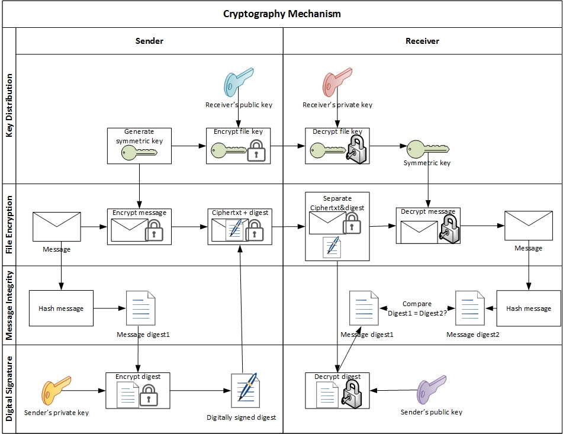
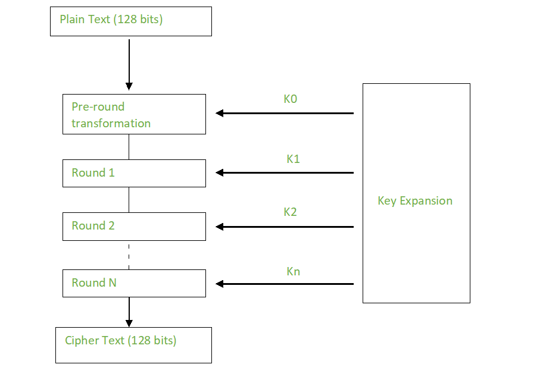
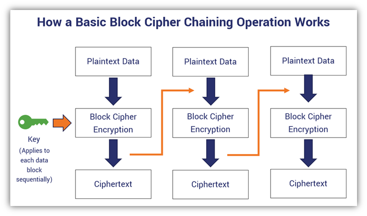
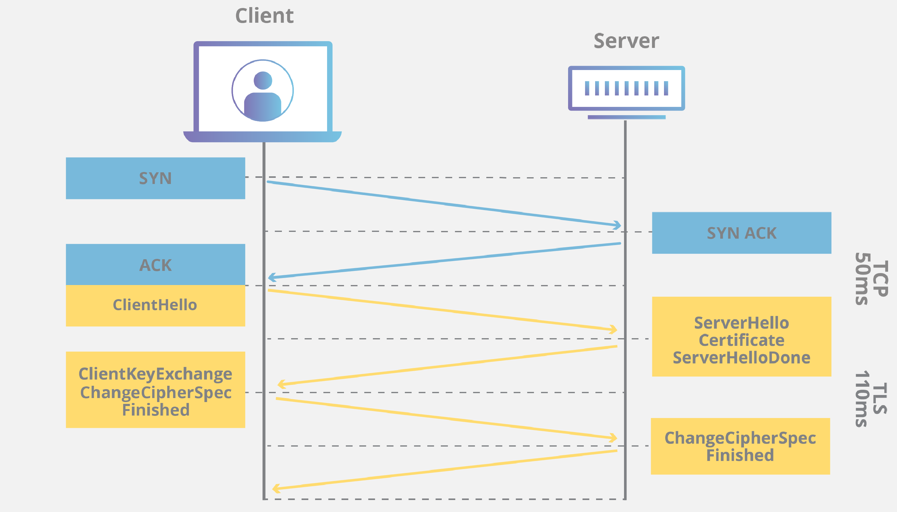

# Kriptanaliz, Şifre Kırma ve Hash Kırma

Kriptanaliz, şifreleme sistemlerinin zafiyetlerini analiz ederek gizli anahtarları, düz metinleri veya hash değerlerini elde etmeyi amaçlayan şifre biliminin saldırı koludur. Kurumsal güvenlik mimarisinde kriptanaliz bilgisi yalnızca kırmızı takımın değil, mavi takımın ve SOC analistlerinin de temel yetkinliğidir: bir kontrolün etkinliğini ancak ona karşı hangi saldırının nasıl işlediğini bilerek değerlendirebilirsiniz. **MITRE ATT&CK** çerçevesinde bu faaliyetler; T1110 (Brute Force), T1552 (Unsecured Credentials), T1600 (Weaken Encryption), T1040 (Network Sniffing) ve T1557 (Adversary-in-the-Middle) gibi tekniklerle eşleşir.

Bu bölüm, §5.1'de ele alınan kriptografik algoritmaların *saldırı perspektifinden* incelenmesine odaklanır: parola/hash kırma yöntemleri, key stretching savunmaları, protokol düşürme saldırıları, padding oracle sınıfı, PKI ihlalleri ve SOC katmanında tespit/engelleme mekanizmaları. Uluslararası referanslar (**NIST SP 800-63B**, **SP 800-52 Rev.2**, **ISO 27001:2022 A.8.24**, **CIS Controls v8**) ile Türkiye mevzuatı (**KVKK**, **5651**, **BDDK**) birlikte ele alınır.


*Simetrik ve asimetrik kriptografi mekanizması — saldırganın hedeflediği katmanlar*

---

## §5.2.1. Kriptanalize Giriş ve Saldırı-Savunma Dengesi

Kriptoloji iki ana daldan oluşur: **kriptografi** (sistem tasarımı) ve **kriptanaliz** (sistem kırma). Fortune 500 ölçeğindeki kurumlarda bu ayrım operasyonel olarak şu şekilde yansır:

| Perspektif | Rol | Temel Soru |
| :---- | :---- | :---- |
| **Kırmızı takım** | Zafiyet keşfi, penetrasyon testi | "Bu hash ne kadar sürede kırılır?" |
| **Mavi takım / SOC** | Tespit, engelleme, olay müdahale | "Hashcat çalıştırıldığını nasıl görürüz?" |
| **Güvenlik mimarı** | Kontrol tasarımı, politika | "Argon2id parametreleri yeterli mi?" |

### Temel Saldırı Vektörleri

| Saldırı Türü | Mantık | MITRE ATT&CK |
| :---- | :---- | :---- |
| **Kaba kuvvet (Brute Force)** | Tüm olası kombinasyonları dener | T1110.001 |
| **Sözlük saldırısı** | Yaygın parola listelerini dener | T1110.001 |
| **Gökkuşağı tablosu (Rainbow Table)** | Önceden hesaplanmış hash tabloları | T1110.002 |
| **Parola püskürtme (Password Spraying)** | Az sayıda yaygın parolayı çok hesapta dener | T1110.003 |
| **Frekans analizi** | Klasik şifrelerde karakter dağılımı | T1557 |
| **Yan kanallı saldırı** | Zamanlama, güç tüketimi, EM yayılım | T1600 |
| **Çarpışma saldırısı** | İki farklı girdinin aynı hash'i üretmesi | T1600 |

> [!NOTE]
> Modern kurumsal tehdit modelinde kriptanaliz çoğunlukla *çevrimdışı* (offline) gerçekleşir: saldırgan NTDS.dit, `/etc/shadow`, veritabanı dökümü veya yedek dosyalarını ele geçirir, ardından kendi GPU kümesinde hash kırma işlemini başlatır. Bu nedenle ağ tabanlı IDS/IPS tek başına yeterli değildir; güçlü parola politikası ve key stretching zorunludur.

---

## §5.2.2. Parola ve Hash Kırma Saldırıları

Parola saklama, kriptanalizin en yaygın kurumsal hedefidir. Zayıf uygulamada düz metin SHA-256 veya MD5 hash'i kullanılır; saldırgan bu veritabanını ele geçirdiğinde milyarlarca deneme/saniye hızıyla kırma işlemine başlar.

### Tuzlama (Salting) ve Biber (Peppering)

**Salt (tuz):** Her parolaya benzersiz, rastgele bir değer eklenerek hash'lenir. Aynı parola farklı hash üretir; önceden hesaplanmış rainbow table'lar işe yaramaz.

**Pepper (biber):** Tüm parolalar için paylaşılan, veritabanı *dışında* tutulan gizli değer (HSM veya uygulama konfigürasyonunda). Veritabanı sızsa bile ek koruma katmanı sağlar.

```python
import hashlib
import os
import hmac

# YANLIŞ — düz SHA-256 parola saklama (GPU ile saniyede milyarlarca deneme)
def weak_hash(password: str) -> str:
    return hashlib.sha256(password.encode()).hexdigest()

# DOĞRU — tuz + HMAC-SHA-256 (hâlâ key stretching yerine geçmez, PBKDF2/Argon2 tercih edin)
def salted_hmac(password: str, salt: bytes, pepper: bytes) -> str:
    key = pepper + salt
    return hmac.new(key, password.encode(), hashlib.sha256).hexdigest()

salt = os.urandom(16)
pepper = b"pepper-degeri-hsm-veya-vaultta-saklanir"
```

### Saldırı Türleri Karşılaştırması

| Saldırı | Önkoşul | Hız (tipik GPU) | Savunma |
| :---- | :---- | :---- | :---- |
| **Brute force** | Hash + algoritma bilinir | Yüksek (mask ile optimize) | Uzun parola, key stretching |
| **Dictionary** | Sözlük dosyası (rockyou.txt vb.) | Çok yüksek | Yaygın parola engelleme (NIST SP 800-63B) |
| **Rainbow table** | Tuzsuz hash | Anında (tablo varsa) | **Salting zorunlu** |
| **Credential stuffing** | Başka sızıntıdan parola çifti | API hızına bağlı | MFA, rate limiting |
| **Password spraying** | Kullanıcı listesi | Orta (kilitleme riski) | Hesap kilitleme + MFA |

> [!WARNING]
> **KVKK Kurulu**, tek kademeli kimlik doğrulama eksikliğini teknik tedbir eksikliği saymıştır. Parola politikası yalnızca "uzunluk" değil; sızıntı sonrası hash kırılabilirliği ve MFA zorunluluğu birlikte değerlendirilmelidir.

---

## §5.2.3. Key Stretching ve Güvenli Parola Saklama

Düz SHA-256, kasıtlı olarak hızlı tasarlanmıştır; parola saklama için **uygun değildir**. Key stretching algoritmaları hash işlemini kasıtlı olarak yavaş ve bellek-yoğun yaparak GPU/ASIC paralel saldırılarını ekonomik olarak imkânsız kılar.

### Algoritma Karşılaştırması

| Algoritma | Bellek-zorlu? | OWASP 2024 Parametreleri | Durum |
| :---- | :---- | :---- | :---- |
| **Argon2id** (önerilen) | Evet | m=19 MiB, t=2, p=1 (asgari) | Varsayılan seçim |
| **scrypt** | Evet | N=2¹⁷, r=8, p=1 | Kabul edilebilir |
| **bcrypt** | Hayır | work factor ≥12 | Legacy uyumluluk |
| **PBKDF2** | Hayır | 600.000+ iterasyon (HMAC-SHA-256) | FIPS gereken yerlerde |

**Argon2id** çıktı formatı (self-describing):

```
$argon2id$v=19$m=65536,t=3,p=4$c29tZXNhbHQ$RdescHkacUOqUe1LIrsksw...
```

Hedef: üretim donanımında doğrulama süresi **250–400 ms** olacak şekilde parametre ayarlamak.

```python
# Python — Argon2id ile parola hash (argon2-cffi)
from argon2 import PasswordHasher

ph = PasswordHasher(
    time_cost=3,       # iterasyon (t)
    memory_cost=65536,   # KiB (m = 64 MiB)
    parallelism=4,       # thread (p)
    hash_len=32,
    salt_len=16
)
hash_string = ph.hash("GucluParola!2026")
ph.verify(hash_string, "GucluParola!2026")  # doğrulama
```

> [!CAUTION]
> bcrypt'in **72 bayt** girdi sınırı vardır; uzun parolalar sessizce kesilir. Argon2id bu sınırlamadan muaf olduğu için yeni uygulamalarda tercih edilmelidir.

### NIST SP 800-63B Parola Politikası Özeti

- Minimum **8 karakter** (önerilen 15+); maksimum uzunluk en az 64 karakter desteklenmeli
- Yaygın parola listeleri (breached password) reddedilmeli
- Periyodik zorunlu değişim *şart değil*; ancak ihlal sonrası rotasyon zorunlu
- MFA, parola gücünden bağımsız ikinci faktör olarak zorunlu tutulmalı

---

## §5.2.4. Şifre Kırma Araçları: Hashcat ve John the Ripper

Saldırganlar ve kırmızı takımlar, ele geçirilen hash'leri kırmak için GPU hızlandırmalı araçlar kullanır. Mavi takım bu araçların komut satırı imzalarını tanıyarak SOC'ta tespit edebilir.

### Hashcat

Dünyanın en hızlı parola kurtarma aracı; binlerce hash modunu destekler:

| Mod (-m) | Hash Türü | Kurumsal Bağlam |
| :---- | :---- | :---- |
| 1000 | NTLM | Active Directory NTDS.dit |
| 1800 | sha512crypt | Linux `/etc/shadow` |
| 3200 | bcrypt | Web uygulamaları |
| 10900 | PBKDF2-HMAC-SHA256 | Kurumsal uygulamalar |

```bash
# Saldırgan perspektifi — NTLM sözlük saldırısı (kırmızı takım / savunma doğrulama)
hashcat -m 1000 -a 0 ntlm_hashes.txt /usr/share/wordlists/rockyou.txt

# Maske saldırısı — ?u?l?l?l?l?l?d?d?d?d (büyük harf + 5 küçük + 4 rakam)
hashcat -m 1000 -a 3 ntlm_hashes.txt ?u?l?l?l?l?l?d?d?d?d

# Kurallı saldırı — best64.rule ile sözlük varyasyonları
hashcat -m 1000 -a 0 ntlm_hashes.txt rockyou.txt -r rules/best64.rule
```

### John the Ripper

Çok platformlu, esnek; hash formatlarını otomatik tanır:

```bash
# Otomatik format tespiti
john --wordlist=rockyou.txt shadow_dump.txt

# Belirli format ile
john --format=sha512crypt --wordlist=rockyou.txt linux_shadow.txt
```

### GPU Hızı ve Savunma Etkisi

Modern GPU'lar (NVIDIA RTX 4090 sınıfı) zayıf algoritmalara karşı **saniyede milyarlarca** NTLM denemesi yapabilir. Argon2id'in yüksek bellek tüketimi (64+ MiB/deneme), GPU'ların binlerce paralel thread'ini verimsiz kılar — bu, bellek-zorlu algoritmaların tercih edilme nedenidir.

---

## §5.2.5. Kriptografik Saldırı Teknikleri

Parola kırmanın ötesinde, kriptanaliz protokol ve uygulama katmanındaki zafiyetleri hedefler.

### Bilinen Metin ve Seçilmiş Metin Saldırıları

| Saldırı | Önkoşul | Örnek Senaryo |
| :---- | :---- | :---- |
| **Known-plaintext** | Düz metin + şifreli metin çifti bilinir | Eski DES analizi |
| **Chosen-plaintext** | Saldırgan düz metin seçip şifrelettirir | Padding oracle tetikleme |
| **Ciphertext-only** | Yalnızca şifreli metin | Frekans analizi (klasik) |

### Yan Kanallı Saldırılar (Side-Channel)

Algoritmanın matematiğine değil, **uygulamasına** saldırır:

- **Timing attack:** İşlem süresindeki farklardan anahtar bilgisi sızıntısı (RSA, AES tabloları)
- **Power analysis (DPA/SPA):** Güç tüketimi ölçümüyle anahtar çıkarma (HSM/smartcard)
- **Cache timing:** Paylaşımlı CPU önbelleğinden anahtar sızıntısı (AES T-table)

**Savunma:** Constant-time implementasyon, HSM kullanımı, Argon2id'in "id" varyantı (side-channel dirençli hibrit).

### Çarpışma ve Doğum Günü Saldırısı

n-bit hash için çarpışma bulma maliyeti kaba kuvvetin karekökü kadardır: **2^(n/2)**. SHA-256 için teorik sınır 2¹²⁸ işlem — pratikte ulaşılamaz. MD5 için saniyeler içinde çarpışma üretilebilir.

**SHAttered (2017):** Google ve CWI Amsterdam, SHA-1 için ilk pratik çarpışmayı üretti — aynı hash'e sahip iki farklı PDF. SHA-1 dijital imza ve sertifika kullanımından tamamen kaldırılmalıdır.

**Flame (2012):** MD5 çarpışması kullanılarak sahte Microsoft kod imzalama sertifikası üretildi — supply chain saldırısı örneği.

```bash
# Dosya bütünlük doğrulama (SHA-256 — savunma tarafı)
sha256sum kritik_konfig.conf
# Beklenen: a3b1c9...  kritik_konfig.conf
```

---

## §5.2.6. Protokol Saldırıları: Düşürme, Padding Oracle ve TLS

Blok şifreleme modları ve TLS protokol geçmişi, kriptanalizin en verimli hedef alanlarından biridir.


*AES blok şifreleme yapısı — mod seçimi saldırı yüzeyini belirler*

### Blok Şifreleme Modları ve Saldırı Yüzeyi


*Blok şifre zincirleme işleyişi — CBC padding oracle riski*

| Mod | AEAD? | Birincil Risk | Durum (2026) |
| :---- | :---- | :---- | :---- |
| **ECB** | Hayır | Desen sızıntısı ("ECB penguen") | **Yasak** |
| **CBC** | Hayır | Padding oracle (POODLE, Lucky13, BEAST) | Legacy only |
| **CTR** | Hayır | Nonce reuse → tam anahtar kaybı | AEAD ile birlikte |
| **GCM** | **Evet** | Nonce reuse | **TLS 1.3 standardı** |

### Düşürme Saldırıları (Downgrade)

| Saldırı | CVE | Mekanizma | Etki |
| :---- | :---- | :---- | :---- |
| **POODLE** | CVE-2014-3566 | SSL 3.0 + CBC padding oracle | Bayt bayt çözme |
| **BEAST** | CVE-2011-3389 | TLS 1.0 CBC + chosen-boundary | Cookie çalma |
| **FREAK** | CVE-2015-0204 | Export-grade RSA (512-bit) | Zayıf anahtar |
| **Logjam** | CVE-2015-4000 | DH 512-bit export-grade | Oturum anahtarı |
| **ROBOT** | CVE-2017-6168 | RSA PKCS#1 v1.5 padding oracle | Oturum anahtarı |

### Mavi Takım Savunması: TLS 1.3 Zorlama

TLS 1.3, protokol seviyesinde CBC modunu, RC4'ü, export şifrelerini, RSA anahtar değişimini ve sıkıştırmayı kaldırarak bu saldırı sınıflarının büyük çoğunluğunu ortadan kaldırır:

```nginx
# Nginx — TLS 1.3 + AEAD-only (NIST SP 800-52 Rev.2 uyumlu)
ssl_protocols TLSv1.3;
ssl_ciphers 'TLS_AES_256_GCM_SHA384:TLS_CHACHA20_POLY1305_SHA256';
ssl_prefer_server_ciphers on;

# ECDHE zorlama — Perfect Forward Secrecy
ssl_ecdh_curve X25519:secp384r1:prime256v1;
```

```bash
# Savunma doğrulama — zayıf cipher taraması
nmap --script ssl-enum-ciphers -p 443 portal.kurum.com.tr
testssl.sh --severity HIGH https://portal.kurum.com.tr
```


*TLS 1.3 el sıkışma — ECDHE + AEAD hibrit yapı*

> [!WARNING]
> TLS 1.0/1.1 ve 3DES/RC4 kullanan sistemler, POODLE ve Sweet32 saldırılarına açıktır. PCI DSS 4.0 ve NIST SP 800-52 Rev.2 bu protokolleri açıkça yasaklar. SOC'ta zayıf TLS tespiti için SIEM kuralı zorunludur.

### Örnek Wazuh SIEM Uyarısı (Zayıf TLS)

```
** Alert 1718745632.4521: - tls,protocol_anomaly,pci_dss_4.1,
Rule: 100515 (level 10) -> 'Zayif SSL/TLS protokolu tespit edildi: TLSv1.0'
Src IP: 10.20.4.55  Dst Port: 443
full_log: "SSL_connect: protocol=TLSv1.0 cipher=DES-CBC3-SHA (Sweet32/POODLE riski)"
MITRE ATT&CK: T1040 (Network Sniffing), T1557 (Adversary-in-the-Middle)
```

---

## §5.2.7. PKI Saldırıları ve Sertifika Güvenliği

Açık anahtar altyapısı (PKI), dijital kimlik katmanının temelidir; CA ihlalleri tüm güven zincirini çökertebilir.


*PKI güven zinciri — Root CA çevrimdışı tutulmalıdır*

### Tarihsel CA İhlalleri

| Olay | Yıl | Mekanizma | Ders |
| :---- | :---- | :---- | :---- |
| **DigiNotar** | 2011 | CA özel anahtarı ele geçirildi | Offline root + CT zorunlu |
| **Comodo** | 2011 | Partner RA ihlali | RA güvenlik denetimi |
| **Flame** | 2012 | MD5 çarpışması ile sahte MS sertifikası | MD5 imza yasağı |
| **Superfish** | 2015 | OEM'e gömülü rogue CA | Trust store denetimi |

### Saldırı Vektörleri ve Savunma

| Saldırı | Savunma |
| :---- | :---- |
| Rogue CA / sahte sertifika | Certificate Transparency (CT) log izleme |
| Sertifika pinning bypass | HPKP/HSTS + CT + kısa ömürlü sertifikalar |
| CRL/OCSP atlatma | OCSP Stapling + Must-Staple |
| Özel anahtar sızıntısı | HSM (FIPS 140-3 Level 3), anahtar asla plaintext çıkmaz |
| MD5/SHA-1 imzalı sertifika | Otomatik reddetme politikası |

```xml
<!-- Wazuh — rogue sertifika / zayıf imza tespiti (custom rule örneği) -->
<rule id="100520" level="12">
  <decoded_as>json</decoded_as>
  <field name="tls.signature_algorithm">MD5|SHA1</field>
  <description>Kriptografik zafiyet: Zayif sertifika imza algoritmasi (MD5/SHA-1)</description>
  <mitre><id>T1600</id></mitre>
</rule>
```

---

## §5.2.8. SOC Entegrasyonu: Hash Kırma ve Kripto Zafiyet Tespiti

SOC analistleri, kriptanaliz faaliyetlerini uç nokta telemetrisi ve ağ trafiğinden tespit edebilir.

### Hashcat/John Tespit Göstergeleri

| IoC | Kaynak | Wazuh/Sysmon |
| :---- | :---- | :---- |
| `hashcat.exe` / `hashcat` process | Sysmon Event 1 | Process creation rule |
| `--wordlist` / `-a 0` argümanları | Komut satırı | CommandLine match |
| `john` + `shadow` dosya erişimi | auditd / Sysmon 11 | File access + process |
| Yüksek GPU kullanımı (anomali) | EDR telemetrisi | UEBA korelasyonu |

```xml
<!-- Wazuh custom rule — hashcat tespiti -->
<rule id="100610" level="12">
  <if_group>sysmon_event1</if_group>
  <field name="win.eventdata.commandLine">hashcat</field>
  <description>Olası parola kirma: Hashcat calistirildi</description>
  <mitre><id>T1110.002</id></mitre>
</rule>
```

### SIEM Korelasyon Senaryosu

1. **T1003.001** — LSASS dump veya NTDS.dit erişimi tespit edilir
2. **T1110.002** — Dakikalar içinde hashcat/john process başlatılır
3. **SOAR** — Otomatik host izolasyonu + incident ticket
4. **Threat intel** — Kırılan hash'lerin dark web'de satılıp satılmadığı izlenir

### Palo Alto / Fortinet Cipher Enforcement

Ağ kenarında SSL Forward Proxy veya decryption politikaları ile zayıf cipher suite'ler engellenir:

- SSLv3, TLS 1.0/1.1 → **block**
- RC4, 3DES, NULL, EXPORT → **block**
- Yalnızca AEAD (AES-GCM, ChaCha20-Poly1305) → **allow**

---

## §5.2.9. Uyumluluk ve Mevzuat Eşleştirmesi

| Standart / Mevzuat | İlgili Gereksinim | Kriptanaliz Bağlantısı |
| :---- | :---- | :---- |
| **NIST SP 800-63B** | Parola politikası, MFA | Key stretching, breached password check |
| **NIST SP 800-52 Rev.2** | TLS yapılandırması | Downgrade/padding oracle savunması |
| **NIST SP 800-53 SC-8/SC-12/SC-13** | İletim gizliliği, anahtar yönetimi | TLS 1.3, HSM, rotasyon |
| **ISO 27001:2022 A.8.24** | Kriptografi kullanımı | Algoritma seçimi, zayıf crypto yasağı |
| **CIS Controls v8** | 4.x yapılandırma, 6.x erişim | Cipher suite hardening |
| **MITRE ATT&CK** | T1110, T1552, T1600, T1040, T1557 | Tespit kuralı eşlemesi |
| **KVKK** | Teknik tedbirler, 2FA | Zayıf parola = ihlal riski |
| **5651** | Log bütünlüğü (hash + zaman damgası) | SHA-256 log integrity |
| **BDDK** | AES-256, HSM, penetrasyon testi | Sürekli kripto denetimi |

> [!NOTE]
> **5651 Sayılı Kanun** kapsamında internet trafik loglarının hash değeri ve RFC 3161 zaman damgası ile bütünlüğü korunmalıdır. Log tampering tespiti için Wazuh FIM + SHA-256 checksum periyodik doğrulaması önerilir.

---

## §5.2.10. Özet ve Mimari Tavsiyeler

Kriptanaliz perspektifi, savunma mimarisinin "test edilebilirliğini" sağlar. Aşağıdaki kontrol listesi, §5.1 kriptografi temellerinin saldırıya dayanıklılığını doğrular.

### Savunma Kontrol Matrisi

| Katman | Saldırı | Savunma | Doğrulama |
| :---- | :---- | :---- | :---- |
| **Parola** | Hashcat NTLM | Argon2id + salt + pepper | Kırmızı takım hash crack testi |
| **TLS** | POODLE/Logjam | TLS 1.3 + AEAD only | `testssl.sh` taraması |
| **Hash** | MD5 collision | SHA-256 + HMAC | Sertifika imza algoritması denetimi |
| **PKI** | Rogue CA | CT logs + HSM + offline root | Sertifika envanteri |
| **SOC** | Offline crack | Sysmon hashcat rule | Tabletop exercise |

### Aşamalı Uygulama Planı

**Aşama 1 — Hemen (0–3 ay):**
1. Tüm parola hash'lerini envanterleyin; MD5/SHA-1/düz SHA-256 tespit edilenleri **Argon2id**'ye migrate edin
2. TLS 1.3 zorlayın; `testssl.sh` ile HIGH severity bulguları kapatın
3. Wazuh/SIEM'e hashcat, john, LSASS dump kurallarını ekleyin

**Aşama 2 — Kısa vade (3–12 ay):**
4. NIST SP 800-63B parola politikası + breached password API entegrasyonu
5. PKI'da CT log izleme ve kısa ömürlü sertifika (≤90 gün) geçişi
6. Yıllık kırmızı takım hash crack tatbikatı (NTDS.dit simülasyonu)

**Aşama 3 — Sürekli:**
7. Argon2id parametrelerini donanım benchmark ile yıllık gözden geçirin
8. Yeni CVE'ler (padding oracle, side-channel) için cipher suite güncellemesi
9. KVKK/5651/BDDK denetimlerinde kripto zafiyet raporlaması

### Mimari Referans Modeli

```
SALDIRI KATMANI (Kırmızı)          SAVUNMA KATMANI (Mavi)
─────────────────────────          ─────────────────────────
Hashcat / John ──────────────────► Argon2id + MFA
TLS downgrade  ──────────────────► TLS 1.3 + AEAD only
MD5 collision  ──────────────────► SHA-256 + CT logs
Rogue CA       ──────────────────► HSM + offline root
GPU cluster    ──────────────────► Memory-hard KDF

İZLEME: [Wazuh T1110] [testssl.sh] [CT monitor] [FIM SHA-256]
```

> *"Bir güvenlik mimarı, saldırganın hashcat komut satırını bilmeden parola politikasını tasarlayamaz. Kriptanaliz bilgisi, savunmanın mühendislik doğrulamasıdır."*

---

*Bu bölüm §5.1 (Kriptografi) ile birlikte okunmalıdır: algoritma tanımları §5.1'de, saldırı vektörleri ve SOC tespiti bu bölümde ele alınmıştır.*