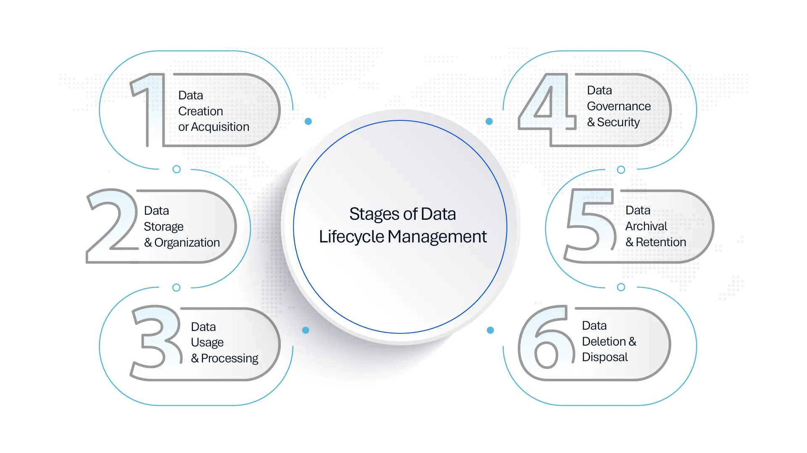
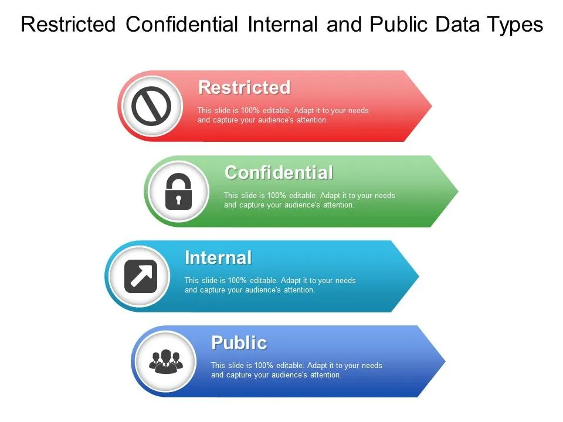
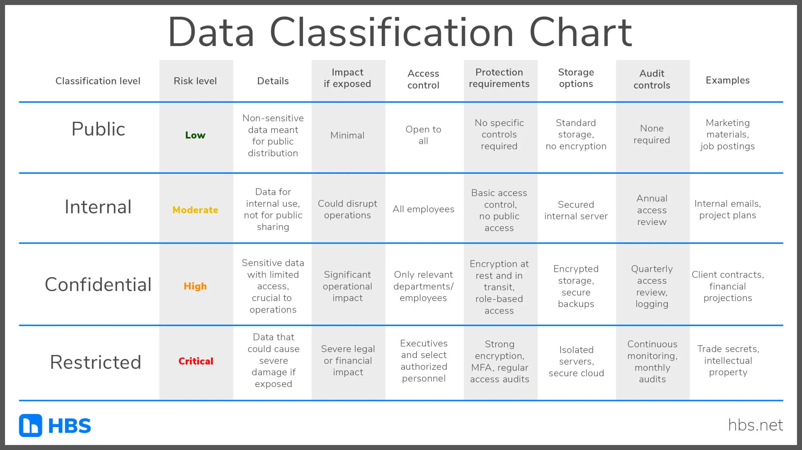
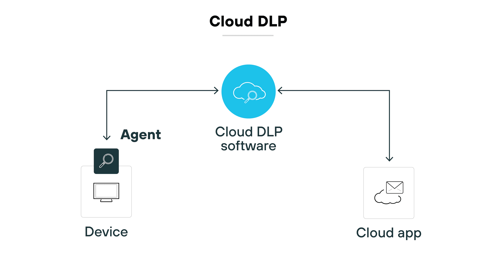
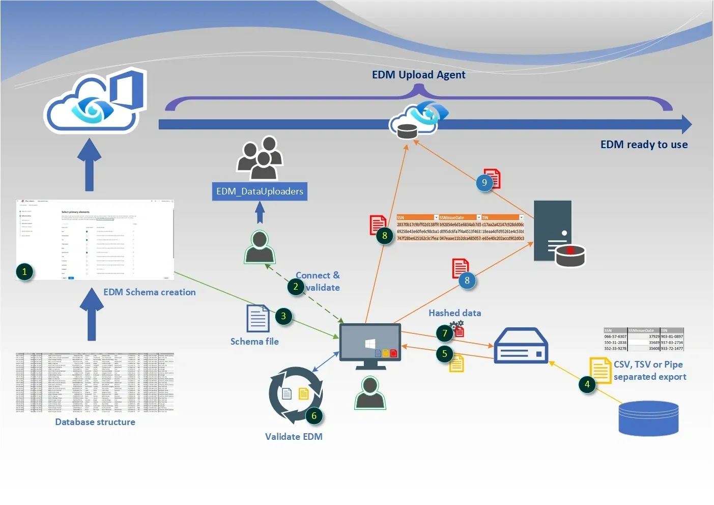
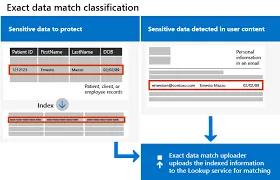
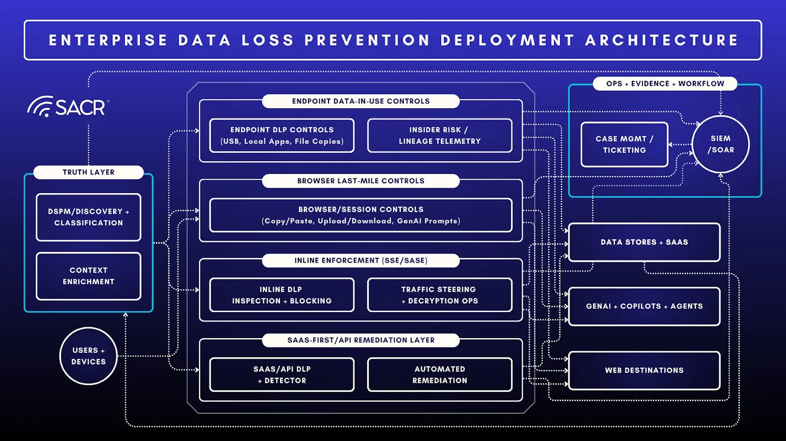

# Veri Yaşam Döngüsü, Sınıflandırma ve Sızıntı Önleme (DLP)

Veri, kurumların en değerli varlığıdır; ancak hibrit çalışma, bulut SaaS kullanımı ve yapay zeka destekli araçların yaygınlaşmasıyla veri sızıntısı riski katlanarak artmaktadır. Kurumlar veriyi korumak için öncelikle **verinin nerede olduğunu**, **hangi gizlilik seviyesinde sınıflandırıldığını** ve **hangi kanallardan dışarı çıkabileceğini** bilmelidir. Veri Kaybı Önleme (Data Loss Prevention — DLP), salt bir içerik tarama aracı değil; **veri keşfi**, **sınıflandırma**, **politika uygulama** ve **olay müdahale** süreçlerini entegre eden çok katmanlı bir mimari bileşenidir.

Bu bölüm; verinin üç temel durumunu (durağan, hareket halinde, kullanımda), sınıflandırma etiketlerini, maskeleme ve anonimleştirme pratiklerini, ağ ve uç nokta DLP mimarilerini, MITRE ATT&CK sızıntı savunmasını ve **NIST SP 800-53**, **ISO/IEC 27001:2022**, **CIS Controls v8**, **KVKK**, **GDPR** ile **BDDK** uyum gereksinimlerini operasyonel derinlikte ele alır.

---

## §5.3.1. Veri Yaşam Döngüsü ve Veri Durumları

Veri, üretildiği andan yok edildiği ana kadar sürekli form değiştirir. Güvenlik önlemleri, verinin içinde bulunduğu duruma göre şekillenmelidir. Modern DLP stratejileri bu üç durumu birlikte ele alır; tek katmanlı koruma yeterli değildir.


*Veri yaşam döngüsü: üretim → sınıflandırma → depolama → paylaşım → arşivleme → imha*

### Durağan Veri (Data at Rest)

Sunucularda, veritabanlarında, dosya paylaşımlarında (SMB/NFS), nesne depolamada (S3, Azure Blob), USB belleklerde veya yedekleme havuzlarında saklanan, aktif olarak işlenmeyen veridir.

| Tehdit Vektörü | Koruma Mekanizması | Standart Eşleşmesi |
| :---- | :---- | :---- |
| Fiziksel disk hırsızlığı | AES-256 FDE (BitLocker, LUKS, FileVault) | NIST SC-28, ISO A.8.24 |
| Yetkisiz dosya erişimi | RBAC/ABAC, NTFS/ACL, JIT erişim | NIST AC-3, AC-6 |
| Veritabanı sızıntısı | TDE + kolon bazlı şifreleme | CIS 3.11 |
| Ransomware | Immutable/WORM yedekler, şifreleme | CIS 11.2 |
| Gölge veri (shadow data) | DLP discovery taramaları | NIST CM-12 |

**Koruma katmanları:**

- **Disk/dosya şifreleme:** AES-256 ile tam disk şifreleme (FDE) veya hassas klasör şifrelemesi.
- **Veritabanı TDE:** SQL Server, Oracle, PostgreSQL pgcrypto ile şeffaf veri şifreleme.
- **Anahtar yönetimi:** Kurumsal KMS/HSM; anahtar rotasyonu ve erişim denetimi.
- **Veri keşfi:** Periyodik DLP discovery taramaları (dosya paylaşımları, DB kolonları, bulut bucket'ları).
- **Saklama politikaları:** WORM/immutable storage + retention policy'leri.

**KVKK Madde 12(1):** Veri sorumlusu, kişisel verilerin hukuka aykırı işlenmesini ve erişilmesini önlemek için uygun güvenlik düzeyini sağlayan teknik tedbirleri almakla yükümlüdür. Durağan veri şifrelemesi bu yükümlülüğün temel bileşenidir.

### Hareket Halindeki Veri (Data in Transit)

Ağ üzerinden, e-postayla, anlık mesajlaşmayla, API çağrılarıyla veya dosya transferi (SFTP, OneDrive sync) ile iki nokta arasında iletilen veridir. Sızıntı riskinin en yoğun olduğu vektörlerden biridir.

| Kanal | Koruma | Mimari Konum |
| :---- | :---- | :---- |
| Web/API | TLS 1.3, mTLS, cert pinning | API Gateway, WAF, SWG |
| E-posta | SMTP TLS, S/MIME, DLP inline | Email Security Gateway |
| Site-to-site | IPsec (ESP-GCM), SD-WAN | WAN edge, SASE PoP |
| Bulut egress | CASB inline proxy | Cloud DLP, ZTNA |

**Kontroller:**

- **TLS 1.3 zorunluluğu:** TLS 1.0/1.1 tamamen devre dışı; Perfect Forward Secrecy (ECDHE) kullanımı.
- **DLP inline inspection:** Şifre çözme (SSL inspection) + içerik tarama; ECH ve cert pinning zorluklarına karşı agent tabanlı veya cloud proxy çözümleri.
- **Bilgi akışı enforcement:** NIST AC-4 kapsamında yetkilendirilmiş kurallara göre veri akışı kontrolü.
- **Protokol farkındalığı:** SMTP, HTTP/S, FTP, SMB protokollerinin derinlemesine analizi.

**Kapattığı açık:** Man-in-the-middle, şifreli tüneller üzerinden exfiltration (DNS tunneling, C2 over HTTPS), gölge IT trafiği.

### Kullanımdaki Veri (Data in Use)

Bir uygulama tarafından aktif olarak okunan, CPU kayıtlarında, önbellekte ve RAM üzerinde işlenen veridir. Geleneksel DLP'nin en zorlandığı alandır; çünkü işlemci veriyi işleyebilmek için bellekte açık metin (plaintext) haline getirmek zorundadır.

**Koruma mekanizmaları:**

- **Uç nokta DLP:** Kopyala-yapıştır, ekran görüntüsü, yazdırma, USB transfer izleme.
- **Bellek izolasyonu:** İşlemler arası veri sızıntısını önlemek için process sandboxing.
- **Uygulama kontrolleri:** Hassas verilere erişen uygulamaların beyaz listelenmesi.
- **Davranışsal analiz (UEBA):** Anormal veri erişim desenlerinin tespiti.

### Sırdaş Hesaplama (Confidential Computing)

Kullanımdaki verinin en kritik zafiyet penceresi, RAM üzerindeki plaintext durumudur. İşletim sistemi çekirdeğine sızan bir saldırgan, hipervizör yöneticisinin veya bellek dump analizi yapan (Cold Boot saldırısı) bir iç tehdidin veriyi doğrudan sızdırmasına olanak tanır. Bu açığı kapatmak için **Confidential Computing** ve donanım tabanlı **Güvenilir Yürütme Ortamları (TEE)** kullanılır.

| Teknoloji | Üretici | Koruma Kapsamı | Kullanım Senaryosu |
| :---- | :---- | :---- | :---- |
| **Intel SGX** | Intel | Bellek enclave'leri (kod + veri izolasyonu) | Hassas hesaplama, anahtar işleme |
| **Intel TDX** | Intel | Tam VM izolasyonu (Trust Domain) | Çok kiracılı bulut iş yükleri |
| **AMD SEV-SNP** | AMD | VM bellek şifreleme + bütünlük | Bulut VM kiracı izolasyonu |
| **ARM CCA** | ARM | Realm tabanlı izolasyon | Mobil/edge güvenli işlem |

**Intel SGX (Software Guard Extensions):** Bellekte "Enclave" adı verilen donanımsal olarak izole edilmiş bölgeler oluşturur. Bu alandaki kod ve veri, işletim sistemi çekirdeği, hipervizör veya BIOS dahil tüm dış bileşenlerden şifrelenmiş olarak yalıtılır. Veri bellek veri yoluna (bus) çıktığı an otomatik şifrelenir.

**Intel TDX (Trust Domain Extensions):** SGX'in ötesine geçerek tüm sanal makineyi (VM) donanımsal olarak izole eder. Hipervizör ve aynı fiziksel sunucudaki diğer kiracı VM'ler, Trust Domain bellek alanına erişemez. Özellikle çok kiracılı (multi-tenant) genel bulut ortamlarında kurumsal iş yüklerinin güvenliğini sağlar.

:::note
Confidential Computing, DLP'nin yerine geçmez; **tamamlayıcı** bir katmandır. DLP verinin *nereye gittiğini* izlerken, TEE verinin *işlenirken* kimlerin görebileceğini donanım düzeyinde sınırlar.
:::

### Veri Durumları Özet Tablosu

| Veri Durumu | Tehdit Vektörleri | Teknik Savunma | NIST Kontrolü |
| :---- | :---- | :---- | :---- |
| **At Rest** | Disk hırsızlığı, yetkisiz erişim, ransomware | AES-256, TDE, KMS, DLP discovery | SC-28, MP-7 |
| **In Transit** | MitM, paket sniffing, DNS tunneling | TLS 1.3, IPsec, DLP inline, CASB | SC-8, AC-4 |
| **In Use** | Bellek dump, insider threat, clipboard exfil | Endpoint DLP, TEE (SGX/TDX), UEBA | AC-3, SI-4 |

---

## §5.3.2. Veri Sınıflandırma Etiketleri ve Politika Uygulama

Bütün verileri aynı seviyede korumak hem maliyetli hem de operasyonel olarak imkansızdır. Sınıflandırılmamış veri, DLP projelerinin başarısız olmasının en temel nedenidir. Veri, değerine ve gizlilik ihtiyacına göre sınıflandırılmalı; etiket, DLP politika motorunu tetiklemelidir.


*Standart kurumsal sınıflandırma hiyerarşisi: Halka Açık → Kuruma Özel → Gizli → Kısıtlı*

### Dört Katmanlı Sınıflandırma Modeli

| Seviye | Tanım | Örnek Veri Türleri | Koruma Gereksinimleri |
| :---- | :---- | :---- | :---- |
| **Halka Açık (Public)** | Serbestçe paylaşılabilir; gizlilik gerektirmez | Basın bültenleri, web sitesi içeriği, kamuya açık raporlar | Bütünlük koruması; şifreleme zorunlu değil |
| **Kuruma Özel (Internal)** | Sadece kurum içi kullanım; yetkisiz ifşası itibar kaybı | İç politikalar, organizasyon şeması, proje planları | Erişim kontrolü, şifreleme önerilir, DLP izleme |
| **Gizli (Confidential)** | Yetkisiz ifşası ciddi zarar; yasal yükümlülük doğurur | Müşteri PII, finansal veriler, kaynak kodlar, ticari sırlar | Güçlü şifreleme, sıkı erişim, 7×24 DLP, denetim logları |
| **Kısıtlı (Restricted)** | En yüksek koruma; ifşası felaket düzeyinde sonuç | KVKK özel nitelikli veriler (sağlık, biyometrik), M&A planları, sıfır gün zafiyetleri | E2E şifreleme, need-to-know, EDM, watermarking |


*Sınıflandırma matrisi: veri türü × gizlilik seviyesi × koruma kontrolü eşlemesi*

### Etiketleme Stratejileri

Sınıflandırma otomatik, kullanıcı tabanlı veya bağlam tabanlı yapılabilir:

1. **İçerik tabanlı:** Regex, anahtar kelime, imza tabanlı tespit (TC Kimlik, kredi kartı, IBAN desenleri).
2. **Bağlam tabanlı:** Verinin oluşturulduğu/işlendiği konuma göre (Finans departmanı → Confidential).
3. **Kullanıcı tabanlı:** Veriyi oluşturan kullanıcının rolüne göre (CISO → Restricted varsayılan).
4. **Makine öğrenimi:** Yapay zeka destekli modellerle otomatik ve sürekli sınıflandırma.

Etiketler dosya metadata'sına, görünür başlığa veya içerik damgasına (watermark) uygulanabilir. Tüm kurumun etiketleme sistemi ile uyumlu olmalıdır.

### Microsoft Purview ile Otomatik Sınıflandırma

Microsoft Purview Information Protection, kurumsal ölçekte otomatik sınıflandırma ve etiketleme sağlar:

```powershell
# Purview — Hassas bilgi türü tanımlama (TC Kimlik No)
New-DlpSensitiveInformationTypeRulePackage -Name "TCKimlikNo" `
    -Description "Türkiye Cumhuriyeti Kimlik Numarası" `
    -Locale "en-US" `
    -Pattern @{
        confidencelevel = "High"
        patterndef = @{
            primaryelement = @{
                pattern = '\b[1-9][0-9]{10}\b'
                matchstyle = @{
                    matchstyle = "Word"
                }
            }
        }
    }
```

**Purview iş akışı:**

1. **Keşif (Discovery):** SharePoint, OneDrive, Exchange, Teams, SQL veritabanları taranır.
2. **Sınıflandırma:** Hassas bilgi türleri (SIT) ve eğitimli sınıflandırıcılar eşleşme yapar.
3. **Etiketleme:** Otomatik veya öneri tabanlı sensitivity label uygulanır.
4. **Politika:** DLP kuralları etikete göre tetiklenir (ör. "Restricted" etiketli dosya USB'ye kopyalanamaz).

:::caution
Sınıflandırma yapılmadan DLP politikası oluşturmak, ya aşırı engelleme (false positive) ya da kritik verinin korunmaması (false negative) ile sonuçlanır. **Önce keşif ve sınıflandırma, sonra DLP** sırası zorunludur.
:::

**ISO/IEC 27001:2022 A.5.12** kontrolü, bilginin sınıflandırılmasını ve etiketlenmesini şart koşar. **CIS Controls v8 Safeguard 3.12**, veri sınıflandırma şemasının oluşturulmasını ve uygulanmasını önerir.

---

## §5.3.3. Veri Maskeleme, Anonimleştirme ve Pseudonymization

Kişisel verilerin korunması, yalnızca erişim kontrolüyle sınırlı değildir. Geliştirme/test ortamlarında gerçek veri kullanımı, analitik paylaşımları ve saklama süresi sonlandırma süreçlerinde **maskeleme** ve **anonimleştirme** kritik teknik tedbirlerdir.

### Statik Veri Maskeleme (Static Data Masking)

Orijinal veri kümesinin kalıcı olarak maskelenmiş bir kopyasını oluşturur. Geri döndürülemez; orijinal veri ile bağlantı kesilir.

**Kullanım senaryoları:**

- Test ve geliştirme ortamlarında gerçek veri kullanımının önlenmesi
- Analiz ve raporlama amaçlı veri setlerinin güvenli hale getirilmesi
- Üçüncü taraflarla paylaşılacak verilerin anonimleştirilmesi

**Statik maskeleme teknikleri:**

| Teknik | Açıklama | Örnek |
| :---- | :---- | :---- |
| **Substitution** | Gerçek değerlerin rastgele ama gerçekçi değerlerle değiştirilmesi | `Ahmet Yılmaz` → `Mehmet Kaya` |
| **Shuffling** | Bir sütundaki değerlerin rastgele yeniden dağıtılması | TC No sütunu karıştırılır |
| **Redaction** | Hassas verilerin tamamen kaldırılması veya `***` ile değiştirilmesi | `4111-1111-1111-1111` → `****-****-****-1111` |
| **Tokenization** | Gerçek değerin token ile değiştirilmesi; eşleme tablosu ayrı KMS'de | PAN → `TOK-7f3a9b2c` |
| **Nulling** | Hassas alanın NULL yapılması | `email` → `NULL` |

**PostgreSQL statik maskeleme örneği:**

```sql
-- Test ortamı için müşteri verisi maskeleme
CREATE TABLE musteri_test AS
SELECT
    id,
    md5(ad_soyad) AS ad_soyad,
    'test_' || id || '@example.com' AS email,
    '5XX XXX ' || right(telefon, 4) AS telefon,
    'XXX-XX-' || right(tc_no, 4) AS tc_no,
    '****-****-****-' || right(kredi_karti, 4) AS kredi_karti
FROM musteri_prod;

-- Maskeleme sonrası doğrulama
SELECT count(*) AS toplam,
       count(DISTINCT tc_no) AS benzersiz_tc
FROM musteri_test;
```

### Dinamik Veri Maskeleme (Dynamic Data Masking)

Üretim ortamında runtime'da, kullanıcı rolüne göre maskeleme uygulanır. Orijinal veri depoda değişmeden kalır; maskeleme sorgu anında gerçekleşir.

**Avantajları:**

- **Gerçek zamanlı:** Depolama katmanında veri açığa çıkmadan sorgu anında maskeleme.
- **Bağlam duyarlı:** Kullanıcı rolü, görevi ve sorgu senaryosuna göre dinamik maskeleme.
- **Geri dönüşümlü:** Yetkili kullanıcılar (KVKK yetkilisi, DBA) maskelenmemiş veriye erişebilir.

**SQL Server Dynamic Data Masking örneği:**

```sql
-- Dinamik maskeleme politikası oluşturma
CREATE TABLE dbo.Musteri (
    MusteriID    INT PRIMARY KEY,
    AdSoyad      NVARCHAR(100),
    TCNo         NVARCHAR(11),
    Email        NVARCHAR(100),
    Telefon      NVARCHAR(15),
    KrediKarti   NVARCHAR(19)
);

-- Maskeleme kuralları tanımlama
ALTER TABLE dbo.Musteri
ALTER COLUMN TCNo ADD MASKED WITH (FUNCTION = 'partial(0,"XXX-XX-",4)');

ALTER TABLE dbo.Musteri
ALTER COLUMN Email ADD MASKED WITH (FUNCTION = 'email()');

ALTER TABLE dbo.Musteri
ALTER COLUMN Telefon ADD MASKED WITH (FUNCTION = 'partial(1,"XXX-XX-",4)');

ALTER TABLE dbo.Musteri
ALTER COLUMN KrediKarti ADD MASKED WITH (FUNCTION = 'partial(0,"XXXX-XXXX-XXXX-",4)');

-- Destek ekibine maskeleme uygula
CREATE USER DestekEkibi WITHOUT LOGIN;
GRANT SELECT ON dbo.Musteri TO DestekEkibi;

-- KVKK denetçisine tam erişim
GRANT UNMASK TO kvkk_auditor;
```

### Anonimleştirme vs Pseudonymization (KVKK Perspektifi)

KVKK ve GDPR, veri koruma kavramlarını farklı düzeylerde tanımlar. Bu ayrım, DLP ve maskeleme stratejisinin temelini oluşturur.

| Kavram | KVKK Tanımı | GDPR Karşılığı | Geri Dönüşüm | DLP Gereksinimi |
| :---- | :---- | :---- | :---- | :---- |
| **Anonimleştirme** | Madde 3: Başka verilerle eşleştirilse dahi kimlik belirlenemez hale getirme | Art. 4(5): Artık kişisel veri değil | Geri döndürülemez | DLP kapsamı dışı |
| **Pseudonymization** | Dolaylı tanımlama (GDPR kavramı KVKK'da açık tanımlı değil) | Art. 4(5): Ek bilgiyle yeniden tanımlanabilir | Geri döndürülebilir (anahtar ile) | DLP kapsamında |
| **Maskeleme** | Teknik uygulama (anonimleştirme veya pseudonymization aracı) | Teknik tedbir (Art. 32) | Tekniğe bağlı | DLP + erişim kontrolü |

**KVKK Madde 7:** Kişisel verilerin işlenmesini gerektiren sebeplerin ortadan kalkması halinde, veri sorumlusu kişisel verileri **silmek**, **yok etmek** veya **anonim hale getirmek**le yükümlüdür.

**KVKK Madde 6:** Özel nitelikli kişisel veriler (sağlık, biyometrik, din, sendika üyeliği vb.) için ek tedbirler zorunludur → DLP + sınıflandırma (Restricted) + masking kritik.

:::danger
Pseudonymization, veriyi kişisel veri statüsünden çıkarmaz. Tokenization veya hash tabanlı maskeleme uygulandığında, eşleme anahtarı güvenli KMS'de saklanmalı ve DLP bu veriyi hâlâ hassas olarak izlemelidir. Yalnızca geri döndürülemez anonimleştirme DLP kapsamından çıkarır.
:::

**GDPR Art. 32:** Veri sorumluları, uygun teknik tedbirler (şifreleme, pseudonymization) almakla yükümlüdür. Privacy by Design/Default ilkesi, maskeleme ve sınıflandırmanın varsayılan olarak uygulanmasını gerektirir.

---

## §5.3.4. Sızıntı Önleme Sistemleri (DLP) Mimarileri

DLP, kuruma ait hassas verilerin yetkisiz şekilde şirket dışına çıkarılmasını engelleyen teknolojik çözümler bütünüdür. Modern mimariler tek bir DLP türüne değil, **katmanlı savunma** yaklaşımına dayanır.


*Bulut DLP: CASB + SASE + inline proxy ile SaaS trafiği koruması*

### Ağ Tabanlı DLP (Network DLP)

Şirket ağından dışarı çıkan tüm trafiği (Web, E-posta, FTP) "In Transit" durumundayken izler ve kuralları ihlal eden dosyaların dışarı çıkmasını engeller.

**Mimari bileşenleri:**

1. **Ağ geçidi (Gateway):** E-posta, web ve FTP trafiğini inceleyen merkezi cihazlar.
2. **Protokol çözümleyicileri:** SMTP, HTTP/S, FTP, SMB protokollerinin derinlemesine analizi.
3. **SSL/TLS şifre çözümü:** Şifrelenmiş trafiğin incelenebilmesi için decryption yeteneği.
4. **İçerik filtreleme motoru:** Regex, imzalar ve EDM ile içerik analizi.

| Güçlü Yön | Zayıf Yön |
| :---- | :---- |
| Merkezi yönetim, tüm egress trafiği görünürlüğü | Cihazda gerçekleşen eylemlere (USB) kör |
| E-posta ve web sızıntılarının etkin önlenmesi | TLS decryption performans maliyeti |
| Yeni politikaların anında tüm ağa yayılması | Offline çalışmada koruma sağlamaz |

**Mimari konumlandırma:** Egress noktaları (NGFW, Secure Web Gateway, Email Security Gateway, CASB, SASE PoP).

### Uç Nokta Tabanlı DLP (Endpoint DLP)

Kullanıcıların bilgisayarlarına kurulan ajanlar aracılığıyla çalışır. Verinin üç durumunu da (At Rest, In Transit, In Use) koruyabilir.

**Mimari bileşenleri:**

1. **Ajan (Agent):** Windows, macOS ve Linux cihazlara yüklenen hafif yazılım.
2. **Cihaz kontrol motoru:** USB, Bluetooth, CD/DVD gibi çevre birimlerinin kontrolü.
3. **Uygulama kontrolü:** Hassas verilere erişen uygulamaların izlenmesi.
4. **Kullanıcı davranış analizi:** Anomali tespiti için davranışsal analiz.

| Güçlü Yön | Zayıf Yön |
| :---- | :---- |
| USB, clipboard, print, offline koruma | Her uç noktaya ajan dağıtımı karmaşık |
| Bağlam farkındalığı (kullanıcı + dosya yolu + uygulama) | Performans etkisi (eski donanım) |
| Ekran görüntüsü ve yazdırma engelleme | Ajan atlatma veya devre dışı bırakma riski |

### Hibrit DLP: CASB + SASE + Endpoint

Modern Fortune 500 mimarilerinde önerilen yaklaşım, üç katmanın birlikte çalışmasıdır:


*Katmanlı DLP: Uç Nokta → Ağ → Bulut (CASB/SASE) → Merkezi Politika Motoru*

| Katman | Bileşen | Koruma Kapsamı |
| :---- | :---- | :---- |
| **Katman 1: Uç Nokta** | Endpoint DLP agent + EDR/XDR | USB, clipboard, print, offline |
| **Katman 2: Ağ** | NGFW DLP + SWG + Email Gateway | Egress trafik, e-posta, web upload |
| **Katman 3: Bulut** | CASB (inline + API mode) + SASE | SaaS uygulamaları, shadow IT, bulut depolama |
| **Merkezi** | DLP Policy Engine + SIEM/SOAR | Politika yönetimi, olay korelasyonu, uyum raporlama |

**CASB (Cloud Access Security Broker) modları:**

- **Inline (Forward Proxy):** Tüm bulut trafiği CASB üzerinden geçer; gerçek zamanlı engelleme.
- **API (Out-of-band):** SaaS uygulamasının API'si üzerinden tarama; geçmiş veri keşfi.
- **Reverse Proxy:** Kurumsal uygulamalara dış erişim kontrolü.

**SASE (Secure Access Service Edge):** Ağ ve güvenlik fonksiyonlarını bulut tabanlı tek platformda birleştirir. SWG + CASB + ZTNA + FWaaS bileşenlerini içerir; uzaktan çalışan kullanıcılar için ideal DLP konumlandırması sağlar.

### EDM (Exact Data Match) Teknolojisi

DLP sistemlerinde yanlış alarmları (false positive) en aza indirmek için kullanılan gelişmiş tespit yöntemidir. Kurumun veritabanındaki "gerçek" hassas veriler hashlenerek DLP'ye beslenir; yalnızca bu veritabanında gerçekten var olan kayıtların dışarı çıkması engellenir.


*EDM iş akışı: veri kaynağı → hash indeksleme → trafik eşleştirme → engelleme/alarm*

**EDM süreci (adım adım):**

1. **Veri keşfi:** Hassas verilerin bulunduğu yapılandırılmış kaynakların belirlenmesi (DB export → CSV/TSV).
2. **Şema tanımı:** Primary element + supporting elements, proximity, multi-token yapılandırması.
3. **Hash indeksleme:** Hassas veri değerlerinin salted one-way cryptographic hash ile indekslenmesi.
4. **Güvenli yükleme:** Hash'lenmiş indeks DLP çözümüne yüklenir (orijinal veri DLP sağlayıcısına gitmez).
5. **Trafik eşleştirme:** DLP içerik tararken primary element tespit edilince EDM lookup yapılır.
6. **Müdahale:** Supporting element'ler proximity içinde eşleşirse yüksek güvenle alarm/block tetiklenir.

**EDM vs Geleneksel DLP karşılaştırması:**

| Özellik | Geleneksel DLP (Regex) | EDM ile DLP |
| :---- | :---- | :---- |
| Tespit yöntemi | Desen eşleştirme | Tam değer eşleşmesi |
| False positive oranı | Yüksek | Neredeyse sıfır |
| Örnek | `4111-xxxx-xxxx-xxxx` desenine uyan tüm kartlar alarm | Yalnızca müşteri DB'deki kartlar alarm |
| Güncelleme | Manuel regex güncellemesi | Otomatik DB senkronizasyonu |

### DLP Politika JSON Örneği

```json
{
  "policyName": "KVKK_Confidential_Data_Protection",
  "description": "KVKK kapsamında hassas veri transferlerini engelle",
  "priority": "High",
  "mode": "Enable",
  "rules": [
    {
      "ruleName": "Block_TCKN_Exfiltration",
      "conditions": {
        "contentContains": ["TC Kimlik No", "TCKimlikNo"],
        "edmMatch": "CustomerPII_Index",
        "sensitivityLabel": ["Confidential", "Restricted"],
        "minConfidence": 85
      },
      "actions": {
        "primary": "BlockAccess",
        "notifyUser": true,
        "notifyAdmin": true,
        "generateIncidentReport": true
      },
      "locations": ["Endpoint", "Exchange", "SharePoint", "Teams", "CloudStorage"]
    },
    {
      "ruleName": "Alert_Large_Data_Export",
      "conditions": {
        "contentSize": { "operator": "greaterThan", "value": "50MB" },
        "destination": { "type": "external", "excludeDomains": ["partner.com"] }
      },
      "actions": {
        "primary": "AuditAndAlert",
        "siemForward": true
      },
      "locations": ["Network", "Endpoint"]
    }
  ],
  "exceptions": [
    {
      "name": "Authorized_DBA_Export",
      "users": ["dba-team@corp.com"],
      "justification": "Required",
      "approvalWorkflow": "ManagerApproval"
    }
  ]
}
```

:::note
DLP politikaları **NIST AC-4 (Information Flow Enforcement)** kontrolünün teknik uygulamasıdır. Politika motoru, bilgi akışını yetkilendirilmiş kurallara göre zorunlu kılar.
:::

---

## §5.3.5. MITRE ATT&CK Exfiltration Savunması ve SIEM Entegrasyonu

Veri sızıntısı, saldırganların en sık hedeflediği son aşamadır (TA0010 — Exfiltration). DLP, MITRE ATT&CK mitigation **M1057 (Data Loss Prevention)** ile doğrudan eşleşir.


*MITRE ATT&CK TA0010 Exfiltration teknikleri ve DLP karşı önlemleri*

### Saldırgan Perspektifi (Offensive)

| Teknik ID | Teknik Adı | Saldırı Yöntemi | DLP Savunması |
| :---- | :---- | :---- | :---- |
| **T1567** | Exfiltration to Cloud Storage | OneDrive/Dropbox/Google Drive'a hassas dosya yükleme | CASB inline + Endpoint DLP cloud sync engelleme |
| **T1041** | Exfiltration Over C2 Channel | Malware ile veriyi C2 sunucusuna sızdırma | Network DLP + EDR C2 trafik korelasyonu |
| **T1048** | Exfiltration Over Alternative Protocol | DNS tunneling, ICMP, SMTP ile veri kaçırma | Protokol analizi, anormal trafik tespiti |
| **T1020** | Automated Exfiltration | Scheduled task ile periyodik dosya transferi | UEBA + anomali tespiti, FIM izleme |
| **T1030** | Data Transfer Size Limits | Büyük dosyayı parçalara bölerek DLP'den kaçınma | Toplam egress hacmi izleme, parça birleştirme |
| **T1005** | Data from Local System | Yerel sistemden hassas dosya toplama | Endpoint DLP dosya erişim izleme |
| **T1074** | Data Staged | Geçici klasörlere veri biriktirme | FIM + staging dizin izleme |
| **T1567.002** | Exfiltration to Cloud Storage — Exfiltration to Cloud Storage | Bulut depolamaya toplu yükleme | CASB API mode tarama + inline engelleme |

**Kaçınma teknikleri:** Steganografi, veri parçalama (T1030), şifreleme kötüye kullanımı ve LOLBin exfiltration (PowerShell, certutil, bitsadmin).

### Savunma Perspektifi (Defensive — Mavi Takım)

**Katmanlı savunma stratejisi:**

1. **Önleme (Prevention):** Veri sınıflandırma, AES-256 şifreleme, RBAC/ABAC, uç nokta ve ağ DLP politikaları.
2. **Tespit (Detection):** EDM ile hassas veri transfer tespiti, UEBA, anomali tabanlı davranış analizi.
3. **Müdahale (Response):** Otomatik engelleme, karantina, SOAR playbook, kullanıcı izolasyonu.

### SIEM Entegrasyonu ve Korelasyon Kuralları

DLP olaylarının SIEM platformuna aktarılması, tekil alarmların anlamlı olaylara dönüştürülmesini sağlar. **NIST SP 800-53 SI-4** ve **AU-6** kapsamında denetim ve alarm yönetimi zorunludur.

**Splunk DLP korelasyon kuralı:**

```spl
index=dlp sourcetype="dlp:alert"
| eval severity=case(
    match(action, "Block"), "critical",
    match(action, "Alert"), "high",
    1=1, "medium"
)
| stats count AS alert_count,
        values(file_name) AS files,
        values(destination) AS destinations,
        values(sensitive_type) AS data_types
        BY user, src_ip, _time
| where alert_count > 3
| lookup user_risk_score user OUTPUT risk_score, department
| where risk_score > 70 OR match(department, "Finance|HR|Legal")
| eval incident_title="Potansiyel Veri Sızıntısı: ".user
| table _time, user, src_ip, files, destinations, data_types, alert_count, risk_score
```

**Wazuh SIEM — Hassas veri sızıntısı tespit kuralı:**

```xml
<!-- Wazuh custom rule — DLP + FIM korelasyonu -->
<group name="dlp,exfiltration,">
  <rule id="100100" level="12">
    <if_sid>807</if_sid>
    <match>credit card|TC Kimlik|IBAN|passport</match>
    <description>Hassas veri içeren dosya erişimi tespit edildi</description>
    <group>gdpr,pci_dss,</group>
  </rule>

  <rule id="100101" level="14">
    <if_sid>100100</if_sid>
    <field name="win.eventdata.destination">\.usb|removable</field>
    <description>CRITICAL: Hassas veri USB cihazına kopyalanmaya çalışıldı</description>
    <group>exfiltration,insider_threat,</group>
  </rule>

  <rule id="100102" level="14">
    <if_sid>100100</if_sid>
    <field name="win.eventdata.image">powershell.exe|certutil.exe|bitsadmin.exe</field>
    <description>CRITICAL: Hassas veri LOLBin aracılığıyla transfer edilmeye çalışıldı</description>
    <group>exfiltration,lolbas,</group>
  </rule>
</group>
```

**Wazuh FIM — Hassas dizin izleme:**

```xml
<syscheck>
  <directories check_all="yes" whodata="yes" realtime="yes">
    /var/data/confidential
  </directories>
  <directories check_all="yes" whodata="yes">
    /var/data/restricted
  </directories>
  <ignore type="sregex">.log$|.tmp$</ignore>
</syscheck>
```

### Örnek Olay Müdahale Senaryosu

**Senaryo:** Finans departmanı çalışanı, KVKK özel nitelikli müşteri finansal verilerini içeren Excel dosyasını USB'ye kopyalamaya ve şahsi Gmail'e göndermeye çalışır.

| Adım | Olay | Sistem Tepkisi |
| :---- | :---- | :---- |
| 1 | Çalışan `Musteri_Finans_Q4.xlsx` dosyasını açar | Endpoint DLP dosya etiketini okur: `Restricted` |
| 2 | USB'ye kopyalama girişimi | Endpoint DLP: EDM match (müşteri TC + IBAN) → **Block** + log |
| 3 | Gmail'e e-posta eki olarak gönderme | Network DLP (Email Gateway): içerik tarama → **Block** + quarantine |
| 4 | Alarm SIEM'e akar | Splunk korelasyon: 2 block event + Finance dept + high risk score → **P1 incident** |
| 5 | SOAR playbook tetiklenir | Kullanıcı oturumu sonlandırılır, yönetici bilgilendirilir, ticket oluşturulur |
| 6 | KVKK değerlendirmesi | Veri dışarı çıkmadı → ihlal bildirimi gerekmez; önleyici kontrol kanıtı loglarda |

:::caution
KVKK Madde 12(5) kapsamında veri ihlali gerçekleşmişse, veri sorumlusu **en kısa sürede** Kurul'a ve ilgili kişiye bildirim yapmakla yükümlüdür. DLP logları, ihlalin gerçekleşip gerçekleşmediğinin kanıtı ve bildirim sürecinin temel girdisidir.
:::

---

## §5.3.6. Standart ve Mevzuat Uyumu

DLP ve veri sınıflandırma uygulamaları, ulusal ve uluslararası standartlar ile mevzuat gereksinimleriyle birebir örtüşür.

### NIST SP 800-53 Rev. 5 Kontrol Eşleşmesi

| Kontrol ID | Kontrol Adı | DLP/Sınıflandırma İlişkisi |
| :---- | :---- | :---- |
| **AC-4** | Information Flow Enforcement | DLP politika motoru — bilgi akışı kontrolü |
| **AC-16** | Security and Privacy Attributes | Sensitivity label, veri etiketleme |
| **CM-12** | Information Location | DLP discovery — veri envanteri ve konum tespiti |
| **MP-5** | Media Transport | Endpoint DLP — USB/removable media kontrolü |
| **MP-7** | Media Use | Cihaz kontrol politikaları |
| **SC-8** | Transmission Confidentiality | TLS şifreleme + Network DLP |
| **SC-13** | Cryptographic Protection | Maskeleme ve şifreleme standartları |
| **SC-28** | Protection of Information at Rest | Disk/DB şifreleme, TDE |
| **SI-4** | System Monitoring | DLP alert → SIEM entegrasyonu |

### ISO 27001:2022 ve CIS Controls v8 Eşleşmesi

| Standart | Kontrol | Uygulama |
| :---- | :---- | :---- |
| ISO **A.5.12–13** | Sınıflandırma ve etiketleme | Dört katmanlı şema, sensitivity label |
| ISO **A.8.10–12** | Silme, maskeleme, DLP | Anonimleştirme pipeline, katmanlı DLP mimarisi |
| ISO **A.8.15/24** | Loglama ve kriptografi | DLP denetim izi, AES-256, TLS 1.3 |
| CIS **3.2–3.3** | Veri envanteri ve erişim | DLP discovery, RBAC/ABAC entegrasyonu |
| CIS **3.11–3.13** | Şifreleme ve DLP | TDE/FDE, sınıflandırma segmentasyonu, DLP dağıtımı |
| CIS **13.2** | DLP çözümü | Network + Endpoint + Cloud katmanlı mimari |

### Türkiye Mevzuatı

:::note
**Uyum Kutusu — Türkiye Mevzuatı Özeti**
:::

| Mevzuat | İlgili Madde/Düzenleme | DLP/Sınıflandırma Yükümlülüğü |
| :---- | :---- | :---- |
| **KVKK (6698)** | Madde 6 | Özel nitelikli kişisel veriler için ek tedbirler (Restricted sınıflandırma + EDM) |
| **KVKK (6698)** | Madde 7 | Saklama süresi sonunda silme, yok etme veya anonimleştirme |
| **KVKK (6698)** | Madde 12(1) | Teknik ve idari tedbirler (DLP, şifreleme, maskeleme) |
| **KVKK (6698)** | Madde 12(5) | Veri ihlali bildirimi (DLP logları kanıt kaynağı) |
| **GDPR** | Art. 25, 32 | Privacy by Design, uygun teknik tedbirler |
| **5651 Sayılı Kanun** | Madde 4-6 | Trafik ve erişim loglarının saklanması (Network DLP logları) |
| **BDDK BSEBY** | Bilgi sistemleri güvenliği | Finansal kuruluşlarda veri sınıflandırması, şifreleme, DLP zorunluluğu |
| **BDDK** | Siber risk yönetimi | Gerçek zamanlı izleme, merkezi loglama, DLP entegrasyonu |

**BDDK (finans sektörü):** Müşteri verisi en az **Confidential**, finansal işlem verileri **Restricted** sınıflandırılmalı; tüm egress trafik DLP + EDM ile izlenmeli, olaylar merkezi SIEM'e aktarılmalı ve yıllık sızıntı testi yapılmalıdır.

---

## §5.3.7. Özet ve Mimari Tavsiyeler

Veri güvenliği, tek bir ürün veya kontrol noktasıyla sağlanamaz. Aşağıdaki mimari yol haritası, Fortune 500 ölçeğindeki kurumlar için Savunma Derinliği prensipleri çerçevesinde tasarlanmıştır.

### Mimari Yol Haritası

| Faz | Süre | Temel Çıktılar |
| :---- | :---- | :---- |
| **1. Keşif ve Sınıflandırma** | 0–3 ay | Veri envanteri, dört katmanlı şema, Purview etiketleme, EDM indeksleme |
| **2. Katmanlı DLP** | 3–6 ay | Endpoint agent, Network DLP (NGFW/SWG), CASB/SASE, merkezi politika motoru |
| **3. Maskeleme** | 6–9 ay | Statik maskeleme (dev/test), dinamik maskeleme (üretim), KVKK Madde 7 otomasyonu |
| **4. İzleme ve Müdahale** | 9–12 ay | SIEM korelasyon, SOAR playbook, UEBA, MITRE TA0010 savunma haritası |
| **5. Sürekli İyileştirme** | Devam | False positive tuning, yıllık politika gözden geçirme, red team sızıntı testi |

### Temel Mimari İlkeler

1. **Önce sınıflandır, sonra koru:** Sınıflandırma olmadan DLP kör çalışır. Keşif → sınıflandırma → DLP sırası zorunludur.
2. **Üç durumu birlikte ele al:** At Rest şifreleme, In Transit DLP, In Use endpoint agent + TEE (SGX/TDX) birlikte uygulanmalıdır.
3. **EDM ile false positive'i minimize et:** Regex tabanlı DLP tek başına yeterli değildir; kurum-spesifik veriler için EDM indeksleme şarttır.
4. **Katmanlı savunma:** Tek DLP türü (yalnızca ağ veya yalnızca uç nokta) yeterli değildir; Network + Endpoint + CASB/SASE hibrit mimari önerilir.
5. **SIEM entegrasyonu olmadan DLP eksiktir:** DLP alert'leri SIEM'de korelasyon kurallarıyla anlamlı olaylara dönüştürülmelidir.
6. **Mevzuat uyumu tasarım gereksinimidir:** KVKK Madde 12, BDDK ve GDPR gereksinimleri mimari kararların girdisi olmalıdır; sonradan eklenmemelidir.
7. **Confidential Computing tamamlayıcıdır:** Intel SGX/TDX ve AMD SEV-SNP, DLP'nin yerine geçmez; kullanımdaki verinin donanım düzeyinde korunmasını sağlar.
8. **Sürekli iyileştirme:** DLP politikaları statik değildir; false positive tuning, yeni veri türleri ve değişen tehdit manzarasına göre sürekli güncellenmelidir.

DLP artık "opsiyonel bir ürün" değil; kurumsal risk iştahını, regülasyon uyumunu ve APT/insider threat senaryolarına karşı proaktif savunmayı doğrudan belirleyen temel bir **sistem mimarisi** bileşenidir. Doğru kurgulanmış bir veri yaşam döngüsü, sınıflandırma ve DLP mimarisi; hem teknik savunma derinliğini hem de yasal yükümlülükleri (KVKK, GDPR, BDDK) aynı anda karşılar.