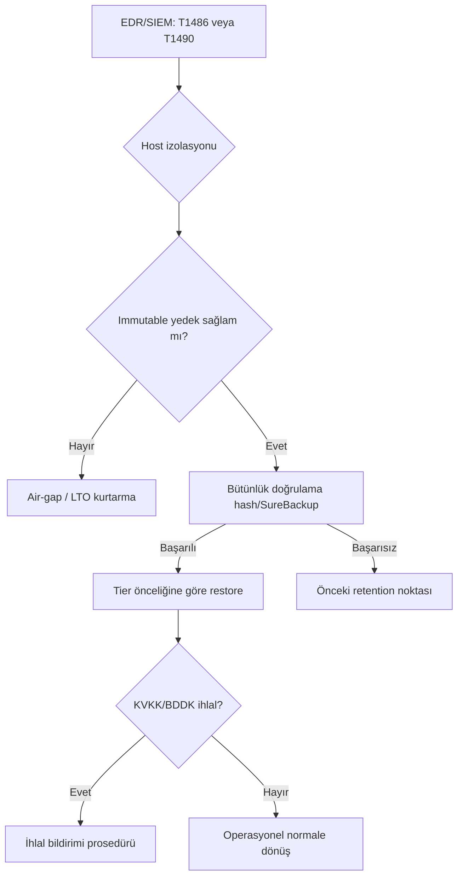
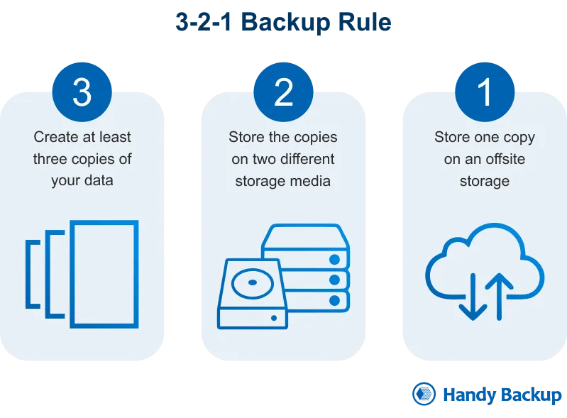
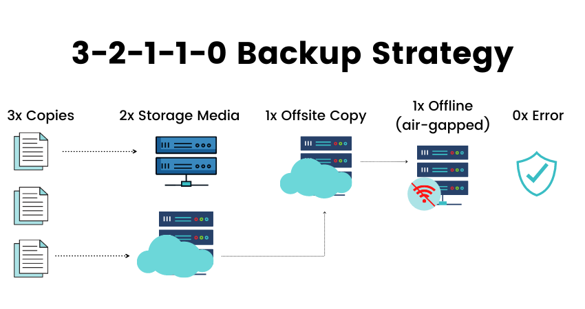
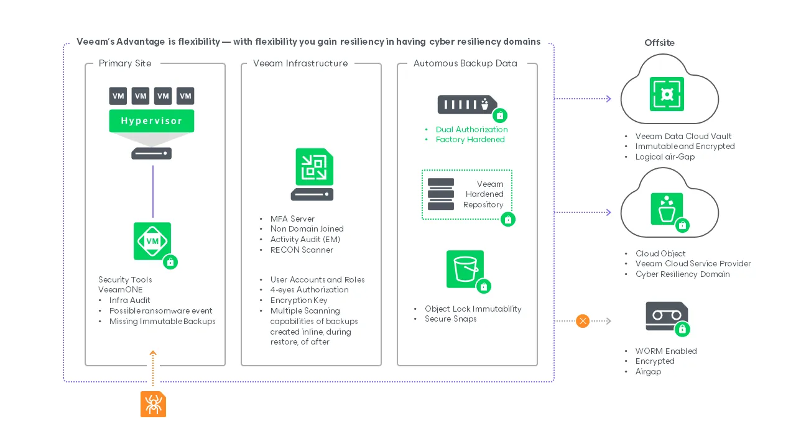
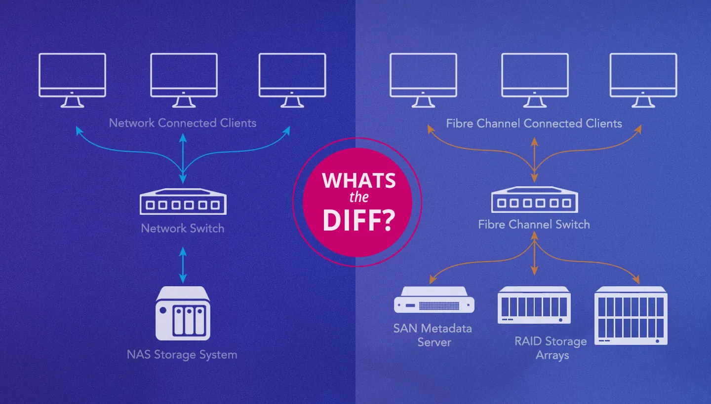

# Yedekleme Stratejileri ve Değiştirilemez Kurtarma

Savunma Derinliği (Defense in Depth) mimarisinde yedekleme katmanı, kurumun **son çare** (last line of defense) hattıdır. Fidye yazılımı (ransomware), iç tehdit veya doğal felaket senaryolarında kurumu ayakta tutacak tek unsur **sağlam, değiştirilemez ve test edilmiş yedeklerdir**.

Modern fidye yazılımı grupları (LockBit, Akira, Qilin, Medusa vb.) artık yalnızca üretim verilerini şifrelemekle kalmaz; **yedekleme altyapısını sistematik olarak hedef alarak** kurtarma kabiliyetini yok eder. Bu bölümde 3-2-1 → 3-2-1-1-0 evrimi, WORM/immutable depolama, air-gap mimarileri, NAS sıkılaştırması, bütünlük doğrulama, MITRE ATT&CK savunması, Wazuh SIEM entegrasyonu ve Türkiye mevzuatı (KVKK, 5651, BDDK) ele alınır. Yedekleme mimarisi, §7.1'deki uç nokta EDR savunması ve §5.3'teki DLP katmanlarıyla birlikte değerlendirildiğinde tam bir kurtarma zinciri oluşturur.



<details>
<summary>✅ 3-2-1-1-0 Uyum Kutusu (Compliance Box)</summary>

```
☐ 3-2-1-1-0 stratejisi dokümante
☐ Immutable kopya (S3 Compliance Object Lock)
☐ RTO/RPO hedefleri BIA ile tanımlı
☐ Off-site/air-gap kopya aktif
☐ Yedekleme şifreleme (beklemede + aktarım)
☐ Bütünlük doğrulama otomatik (haftalık)
☐ DR tatbikatı son 3 ay içinde
☐ SureBackup aktif
☐ Wazuh VSS kuralları (T1490) devrede
☐ KVKK §3.6: Kişisel veri yedekleri offline
☐ 5651: Log yedekleri immutable 1–2 yıl
☐ Backup admin MFA + JIT
```

</details>

---

## §5.4.1. Yedekleme Mimarisi: 3-2-1'den 3-2-1-1-0'a Evrim

Uzun yıllar altın standart kabul edilen **3-2-1 Kuralı**, donanım arızası ve kazara silmeye karşı etkili olsa da günümüz fidye yazılımı tehditlerine karşı yetersizdir. Domain yöneticisi yetkileri ele geçirildiğinde ağ üzerindeki yedekler de şifrelenebilir veya silinebilir.

### Klasik 3-2-1 Kuralı



| Bileşen | Açıklama | Koruduğu Tehdit |
|---------|----------|-----------------|
| **3** | Verinin üç kopyası (1 üretim + 2 yedek) | Tek nokta arızası |
| **2** | İki farklı medya türü (disk + teyp/bulut) | Medya tabanlı bozulma |
| **1** | Bir kopyanın tesis dışında (off-site) saklanması | Bölgesel felaket |

### Modern 3-2-1-1-0 Kuralı



| Bileşen | Açıklama | Koruduğu Tehdit |
|---------|----------|-----------------|
| **3** | Üç veri kopyası (üretim + iki yedek) | Tek nokta arızası |
| **2** | İki farklı medya türü (disk + teyp/bulut) | Medya tabanlı bozulma |
| **1** | Bir off-site kopya (coğrafi ayrım) | Bölgesel felaket |
| **+1** | Bir değiştirilemez (immutable) veya offline kopya | Ransomware yedek imhası |
| **0** | Kurtarma testlerinde sıfır hata | Kullanılamaz yedek riski |

### Karşılaştırmalı Dayanıklılık

| Parametre | Geleneksel 3-2-1 | Modern 3-2-1-1-0 |
|-----------|------------------|------------------|
| Siber izolasyon | Tanımlanmamış | 1 immutable/air-gap |
| Bütünlük denetimi | Manuel/periyodik | Otomatik + DR testi |
| Ransomware dayanımı | Yedekler hedef alınabilir | Immutable katman korur |

### Kurumsal Topoloji

1. **Üretim Katmanı:** VMware/Hyper-V/Proxmox, veritabanları, dosya sunucuları, NAS paylaşımları.
2. **Orkestrasyon Katmanı:** Veeam, PBS veya Rubrik/Cohesity — **ayrı backup VLAN'da**, mümkünse domain-joined değil.
3. **Depolama Katmanları (SOBR):** Performance Tier (yerel disk/SAN) → Capacity Tier (S3/Azure Blob) → Immutable Vault (Object Lock Compliance).

---

## §5.4.2. RTO/RPO ve İş Sürekliliği Hedefleri

Yedekleme stratejisi, iş sürekliliği hedefleri olmadan anlamlı değildir. NIST SP 800-34 (*Contingency Planning Guide*) ve ISO 22301 (*Business Continuity Management*) bu hedeflerin tanımlanmasını ve test edilmesini zorunlu kılar.

| Metrik | Tanım | Kritik Sistem | Standart Sistem |
|--------|-------|---------------|-----------------|
| **RPO** | Kabul edilebilir maksimum veri kaybı | 15 dakika | 24 saat |
| **RTO** | Sistemin tekrar çalışır hale gelme süresi | 1–4 saat | 24–72 saat |
| **RTA** | Gerçekleşen kurtarma süresi (test sonucu) | ≤ RTO hedefi | ≤ RTO hedefi |
| **WRT** | İş süreçlerinin normale dönme süresi | 2–8 saat | 1–3 gün |

### RPO/RTO'ya Göre Yedekleme Sıklığı

| İş Kritikliği | RPO | Yedekleme Yöntemi | Retention |
|---------------|-----|-------------------|-----------|
| Tier-0 (ERP, Core Banking) | ≤ 15 dk | Replikasyon + saatlik snapshot | 90 gün immutable |
| Tier-1 (E-posta, AD, CRM) | ≤ 1 saat | Saatlik incremental + günlük full | 60 gün |
| Tier-2 (Dosya sunucuları) | ≤ 24 saat | Günlük incremental + haftalık full | 30 gün |
| Tier-3 (Arşiv, log) | ≤ 7 gün | Haftalık full | 1–2 yıl (5651) |

```powershell
# Kritik sistem envanteri ve RTO/RPO ataması
$criticalSystems = @(
    [PSCustomObject]@{ System="SQL-PROD-01"; Tier="Tier-0"; RPO_Min=15; RTO_Hr=2; Immutable=$true },
    [PSCustomObject]@{ System="FILE-NAS-01"; Tier="Tier-2"; RPO_Min=1440; RTO_Hr=24; Immutable=$true }
)
$criticalSystems | Format-Table -AutoSize
```

---

## §5.4.3. Değiştirilemez (Immutable/WORM) Depolama



Fidye yazılımı saldırılarında en yetkili hesap (Domain Admin) ele geçirilse bile yedeklerin korunmasının tek yolu depolama katmanında **değiştirilemezlik** sağlamaktır. WORM (Write Once, Read Many) teknolojisi, yazılan yedek verisinin belirlenen süre boyunca silinmemesini garanti eder.

### S3 Object Lock: Governance vs Compliance

| Mod | Silme/Değiştirme | Bypass | Kullanım |
|-----|------------------|--------|----------|
| **Governance** | Normal kullanıcılar engellenir | `s3:BypassGovernanceRetention` ile yönetici bypass | İç politika |
| **Compliance** | **Hiç kimse** (root dahil) silemez | Bypass **mümkün değil** | Regülasyon, ransomware |
| **Legal Hold** | Süresiz kilit (ON/OFF) | Adli soruşturma bitene kadar | 5651 log delilleri |

> **Kritik:** Kurumsal vault'larda **Compliance Mode** tercih edilmelidir. Governance Mode, ele geçirilmiş yönetici hesabıyla bypass edilebilir.

```bash
# S3 Object Lock — Compliance modu (30 gün retention)
aws s3api create-bucket --bucket f500-immutable-vault \
  --region eu-central-1 --object-lock-enabled-for-bucket

aws s3api put-object-lock-configuration --bucket f500-immutable-vault \
  --object-lock-configuration '{"ObjectLockEnabled":"Enabled","Rule":{"DefaultRetention":{"Mode":"COMPLIANCE","Days":30}}}'

aws s3 cp /backups/daily_db.vbk s3://f500-immutable-vault/production/ \
  --checksum-algorithm SHA256
```

### Veeam Hardened Repository (VHR)

Linux tabanlı VHR, XFS dosya sistemi düzeyinde `chattr +i` ile yedek bütünlüğünü korur:

```bash
# XFS + kısıtlı kullanıcı + SSH kapatma
mkfs.xfs -m reflink=1,rmapbt=1 /dev/sdb
mount -o noatime,nodiratime /dev/sdb /mnt/veeamrepo
adduser vhrupuser && chown -R vhrupuser:vhrupuser /mnt/veeamrepo/backups
chmod 700 /mnt/veeamrepo/backups

# Kurulum sonrası sıkılaştırma
deluser vhrupuser sudo
systemctl stop sshd && systemctl disable sshd
ufw deny ssh

# Immutable bayrak doğrulama
lsattr /mnt/veeamrepo/backups/daily_backup.vbk
# Çıktı: ----i--------- daily_backup.vbk
```

`veeamimmureposvc` servisi her 20 dakikada çalışarak süresi dolan dosyaların kilidini kaldırır ve zaman sapması denetimi yapar.

### ZFS Snapshot ve Hold

```bash
# Snapshot oluşturma ve immutable kilitleme
zfs snapshot tank/backups@$(date +%Y%m%d-%H%M)
zfs hold -r backup-lock tank/backups@$(date +%Y%m%d-%H%M)

# Off-site replikasyon
zfs send -R tank/backups@snapshot | ssh backup-remote "zfs receive -F tank/offsite/backups"

# Retention dolunca hold kaldırma
zfs release -r backup-lock tank/backups@20250601-0000
```

### Immutable Depolama Karşılaştırması

| Teknoloji | Ransomware Direnci | Performans | Maliyet |
|-----------|-------------------|------------|---------|
| S3 Object Lock (Compliance) | Çok yüksek | Orta | Orta |
| Veeam Hardened Repo (XFS) | Yüksek | Yüksek | Düşük |
| ZFS hold + snapshot | Yüksek | Yüksek | Düşük |
| Synology WriteOnce (Btrfs) | Yüksek | Orta | Orta |
| Tape LTO (fiziksel WORM) | Maksimum | Düşük | Düşük (uzun vadeli) |

---

## §5.4.4. Air-Gapped ve Mantıksal İzolasyon

Air-gapped yedekleme, yedek verilerinin üretim ağından izole edilmesi prensibine dayanır. Fidye yazılımının kritik başarı faktörü kurtarma kabiliyetini ortadan kaldırmaktır.

### Fiziksel vs Mantıksal Air-Gap

| Tür | Açıklama | Avantaj | Dezavantaj |
|-----|----------|---------|------------|
| **Fiziksel** | Teyp/USB'nin ağdan fiziksel ayrılması | En yüksek güvenlik | Yavaş kurtarma |
| **Mantıksal** | Ayrı VLAN, farklı kimlik bilgileri | Otomasyon, hızlı kurtarma | Mutlak izolasyon değil |
| **Hibrit** | Günlük replikasyon + aylık fiziksel koparma | Dengeli güvenlik/hız | Karmaşık operasyon |

### LTO Teyp Arşiv

```bash
# Tam yedek yazma ve vault rotasyonu
tar -cvf - /critical/data | ltfsdd -o /dev/nst0 -s 1024G
mt -f /dev/nst0 offline   # Teyp fiziksel olarak çıkarılır → kasa/vault

# Kurtarma
mt -f /dev/nst0 online
dd if=/dev/nst0 | tar -xvf - -C /restore/target/
```

### Mantıksal Air-Gap Kontrolleri

| Kontrol | Uygulama |
|---------|----------|
| Ayrı kimlik bilgileri | Yedekleme hesapları üretim AD'sinden bağımsız |
| Ayrı ağ segmenti | Backup VLAN; sadece proxy → repo (9401-9403) |
| Tek yönlü replikasyon | S3 PutObject izni, DeleteObject yok |
| Bağlantı penceresi | Replikasyon belirli saatlerde; cron + firewall |
| MFA + JIT erişim | CyberArk / PAM entegrasyonu |

---

## §5.4.5. NAS/SAN Mimarisi, RAID≠Yedek ve Sıkılaştırma



NAS ve SAN sistemleri yedekleme mimarisinde kritik rol oynar; ancak NAS cihazları fidye yazılımının **birincil hedeflerinden** biridir.

### NAS vs SAN

| Özellik | NAS | SAN |
|---------|-----|-----|
| Protokol | NFS, SMB/CIFS | iSCSI, Fibre Channel |
| Yedekleme rolü | İkincil hedef, snapshot | Birincil performans tier |
| Ransomware riski | Yüksek (SMB paylaşımları) | Orta |
| Immutable | ZFS hold, Btrfs WriteOnce | Storage snapshot lock |

### RAID Yedek Değildir

> **Altın Kural:** RAID dayanıklılık sağlar; yedekleme değildir. RAID-5/6 disk arızasına karşı korur; ransomware, silme, yangın veya insider threat'e karşı korumaz.

| Senaryo | RAID | Yedekleme |
|---------|------|-----------|
| Tek disk arızası | ✅ | ✅ |
| Ransomware şifreleme | ❌ | ✅ (immutable) |
| Kazara toplu silme | ❌ | ✅ |
| Site felaketi | ❌ | ✅ (off-site) |

### TrueNAS Sıkılaştırma

```bash
# Snapshot (15 dk) + ZFS hold + replikasyon
zfs snapshot tank/backups@auto-$(date +%Y%m%d-%H%M)
zfs hold -r ransomware-protect tank/backups@auto-20250619-1200

# SMB paylaşımı: sadece yedekleme sunucusu
midclt call sharing.smb.update 1 '{"hostsallow":["10.10.50.10"],"browsable":false}'
```

### Synology DSM Sıkılaştırma

```bash
synouser --disable admin                    # Varsayılan admin kapat
# DSM > Snapshot Replication: 15 dk, 30 gün retention
# DSM > WriteOnce: Immutable mod, 30 gün kilit
# DSM > Güvenlik Duvarı: İzin 10.10.50.0/24 → SMB(445), NFS(2049)
synoschedtask --run "Security Advisor"      # Haftalık güvenlik denetimi
```

### NAS Güvenlik Kontrol Listesi

| # | Kontrol | Öncelik |
|---|---------|---------|
| 1 | Varsayılan admin devre dışı + MFA | Kritik |
| 2 | SSH kapalı, HTTPS yönetim | Kritik |
| 3 | Immutable snapshot (ZFS hold / WriteOnce) | Kritik |
| 4 | Doğrudan internete açık değil (VPN) | Kritik |
| 5 | Off-site replikasyon + SMB signing | Yüksek |
| 6 | Otomatik engelleme (brute-force) | Yüksek |

---

## §5.4.6. Bütünlük Doğrulama, SureBackup ve Sıfır Hata

**Test edilmemiş yedek, alınmamış yedektir.** NIST SP 800-53 CP-9/CP-10 ve CIS Control 11.5 düzenli doğrulamayı zorunlu kılar.

### Doğrulama Mekanizmaları

| Mekanizma | Sıklık | Araç |
|-----------|--------|------|
| Hash/Checksum (SHA-256) | Her yedekleme | sha256sum, Veeam native |
| Backup Integrity Check | Haftalık | Veeam, PBS Verify |
| SureBackup (izole VM boot) | Haftalık/aylık | Veeam SureBackup |
| DR Tatbikatı | Üç ayda bir | Tam kurtarma senaryosu |

```bash
# Hash oluşturma ve doğrulama
sha256sum /backup/critical_data.tar.gz > /backup/critical_data.sha256
sha256sum -c /backup/critical_data.sha256 || echo "KRITIK: Bütünlük hatası!" | mail -s "BACKUP FAIL" soc@example.com
```

### SureBackup Akışı

Veeam SureBackup, yedekleri üretim ağından izole sandbox'ta ayağa kaldırır:

1. **Heartbeat** — VM boot + VMware Tools yanıt
2. **Ping** — İzole ağda IP erişilebilir
3. **Port Testi** — AD: 389/53, SQL: 1433, Web: 80/443
4. **Uygulama Testi** — Örnek sorgu, HTTP GET → 200 OK
5. **Rapor** — Bütünlük imzası + port yanıt süreleri

Proxy Appliance çift bacaklı yapıdadır: bir bacak üretim ağına, diğeri izole vSwitch'e bağlıdır. Instant VM Recovery ile terabaytlarca veri kopyalanmadan saniyeler içinde boot edilir.

### Sıfır Hata (0) Politikası

| Kural | SLA |
|-------|-----|
| Verification hatası → otomatik SOC ticket | 1 saat |
| Başarısız job → otomatik retry (max 3) | 4 saat |
| DR testi başarısızlığı → üst yönetim raporu | 24 saat |
| RTO aşımı → kök neden analizi (RCA) | 5 iş günü |

---

## §5.4.7. MITRE ATT&CK: Fidye Yazılımı ve VSS Savunması

| MITRE ID | Teknik | Hedef |
|----------|--------|-------|
| **T1486** | Data Encrypted for Impact | Canlı sistemler |
| **T1490** | Inhibit System Recovery | VSS, yedekler, snapshot'lar |
| **T1485** | Data Destruction | Backup repo, NAS |
| **T1070.001** | Clear Logs | Yedekleme logları |

### Saldırı Zinciri

```
İlk Erişim → Keşif → Yetki Yükseltme → Yatay Hareket → Yedek İmhası (T1490) → Şifreleme (T1486) → Şantaj
```

### vssadmin Tespiti

Geleneksel ransomware `vssadmin.exe delete shadows /all /quiet` kullanır. Gelişmiş aktörler komut satırı logu üretmeden **doğrudan API çağrısı** ile EDR'ı atlatır: `CoInitialize()` → `CreateVssBackupComponents()` → `Query()` → `DeleteSnapshots(SnapshotID)`. Bu süreçte alt işlem başlatılmadığı için Sysmon Event ID 1 kuralları tetiklenmeyebilir; **Sysmon Event ID 7 (Image Loaded)** ile `vssapi.dll` yükleyen imzasız süreçler izlenmelidir.

**Microsoft Defender / Sentinel KQL örneği:**

```kql
DeviceProcessEvents
| where ProcessCommandLine has_any ("vssadmin", "wmic", "diskshadow", "GLOBALROOT", "HarddiskVolumeShadowCopy")
| where not(InitiatingProcessFileName in~ ("VeeamAgent.exe", "vssvc.exe", "BackupExec.exe"))
```

```powershell
# Sysmon Event ID 1: VSS silme komutları
$suspicious = @('vssadmin\s+delete\s+shadows','wmic\s+shadowcopy\s+delete',
                'bcdedit\s+/set.*recoveryenabled\s+no','wbadmin\s+delete\s+catalog')
Get-WinEvent -FilterHashtable @{LogName='Microsoft-Windows-Sysmon/Operational';Id=1} |
  Where-Object { $cmd=$_.Properties[10].Value; $suspicious | Where-Object { $cmd -match $_ } } |
  Select TimeCreated, @{N='Process';E={$_.Properties[5].Value}}, @{N='CommandLine';E={$_.Properties[10].Value}}
```

### Defansif Kontrol Matrisi

| Katman | Kontrol | MITRE | Uygulama |
|--------|---------|-------|----------|
| Varlık | Yedekleme = Tier-0 | — | Ayrı güvenlik politikası |
| Kimlik | Least privilege + MFA + JIT | T1078 | Ayrı backup admin |
| Veri | Immutable WORM | T1486/T1490 | Compliance Object Lock |
| Ağ | Air-gap, backup VLAN | T1021 | Firewall segmentasyonu |
| Endpoint | VSS koruması, EDR | T1490 | Minifilter kuralları |
| İzleme | SIEM anomali tespiti | T1070 | Wazuh kuralları |

### Ransomware Sonrası Kurtarma Karar Ağacı

Fidye yazılımı tespit edildiğinde yedekleme ekibinin izlemesi gereken operasyonel akış:

```
[EDR/SIEM Alarmı: T1486 veya T1490]
        │
        ▼
[Host izolasyonu + saldırı kapsamı belirleme]
        │
        ├── Immutable yedek sağlam mı? ──Hayır──► [Air-gap/LTO kurtarma]
        │         │
        │        Evet
        │         ▼
        ├── Son yedek bütünlük doğrulaması (hash/SureBackup)
        │         │
        │         ├── Başarılı ──► [Tier önceliğine göre kademeli restore]
        │         └── Başarısız ──► [Önceki retention noktasına geç]
        │
        └── KVKK/BDDK ihlal değerlendirmesi (kişisel veri etkilendi mi?)
```

CIS Controls v8 **Safeguard 11.4** (Isolate Recovery Data), kurtarma verilerinin üretim ağından mantıksal veya fiziksel olarak ayrılmasını zorunlu kılar. Immutable yedeklerin varlığı, ödeme yapmadan kurtarma seçeneğini mümkün kıldığından fidye yazılımı operasyonlarında stratejik bir kozdur.

---

## §5.4.8. SIEM İzleme: Wazuh Uyarı Kuralları

Yedekleme altyapısındaki anormal aktivitelerin (toplu silme, VSS imhası, politika değişiklikleri) SIEM üzerinden izlenmesi kritiktir.

```xml
<!-- T1490: vssadmin shadow copy silme -->
<group name="ransomware,backup,vss,">
  <rule id="100100" level="15">
    <if_group>sysmon_event1</if_group>
    <field name="win.eventdata.commandLine" type="pcre2">(?i)vssadmin.*delete.*shadows</field>
    <description>MITRE T1490: vssadmin ile VSS silme tespit edildi</description>
    <mitre><id>T1490</id></mitre>
  </rule>
</group>

<!-- T1490: wmic shadowcopy silme -->
<group name="ransomware,backup,vss,">
  <rule id="100101" level="15">
    <if_group>sysmon_event1</if_group>
    <field name="win.eventdata.commandLine" type="pcre2">(?i)wmic.*shadowcopy.*delete</field>
    <description>MITRE T1490: wmic ile shadow copy silme</description>
    <mitre><id>T1490</id></mitre>
  </rule>
</group>

<!-- T1490: Windows kurtarma modu devre dışı -->
<group name="ransomware,backup,">
  <rule id="100102" level="14">
    <if_group>sysmon_event1</if_group>
    <field name="win.eventdata.commandLine" type="pcre2">(?i)bcdedit.*recoveryenabled.*no</field>
    <description>MITRE T1490: Kurtarma modu devre dışı bırakıldı</description>
    <mitre><id>T1490</id></mitre>
  </rule>
</group>

<!-- Yedekleme dosyası silme (FIM) -->
<group name="backup,integrity,">
  <rule id="100103" level="12">
    <if_group>syscheck</if_group>
    <field name="file" type="pcre2">(?i)\.(vbk|vib|vrb)$</field>
    <description>Yedekleme dosyası silindi veya değiştirildi</description>
  </rule>
</group>

<!-- S3 backup bucket silme -->
<group name="aws,backup,cloud,">
  <rule id="100104" level="14">
    <if_group>aws</if_group>
    <field name="aws.eventName" type="pcre2">^Delete.*$</field>
    <field name="aws.requestParameters.bucketName" type="pcre2">(?i)backup|vault|immutable</field>
    <description>AWS: Yedekleme bucket'ında silme işlemi</description>
  </rule>
</group>
```

### Active Response ve Korelasyon

```xml
<active-response>
  <command>kill-vss-attacker</command>
  <location>local</location>
  <rules_id>100100,100101</rules_id>
  <timeout>300</timeout>
</active-response>
```

```bash
#!/bin/bash
# /var/ossec/active-response/bin/kill-process.sh
PID=$(echo $4 | jq -r '.data.win.eventdata.processId')
[ -n "$PID" ] && [ "$PID" != "null" ] && kill -9 "$PID"
logger "Wazuh AR: VSS saldırı süreci sonlandırıldı (PID: $PID)"
```

| Senaryo | Tetikleyici | Seviye | Müdahale |
|---------|-------------|--------|----------|
| Ransomware hazırlık | 100100 + 100102 | 15 | Otomatik izolasyon |
| Yedek imha | 100103 × 5+ (5 dk) | 14 | Backup VLAN kapat |
| Cloud vault saldırısı | 100104 + anormal IP | 14 | IAM credential revoke |

---

## §5.4.9. Uyumluluk Çerçevesi

### Uluslararası Standartlar

| Standart | Kontrol | Gereksinim |
|----------|---------|------------|
| **NIST SP 800-34** | Contingency Planning | BIA, RTO/RPO, DR planı, test |
| **NIST SP 800-53** | CP-9, CP-10 | Yedekleme, bütünlük, kurtarma testi |
| **ISO 27001:2022** | A.8.13 | Yedekleme politikası, koruma, test |
| **ISO 22301:2019** | BCMS | İş sürekliliği, DR tatbikatı |
| **CIS Controls v8** | 11.1–11.5 | Otomatik yedek, izole kurtarma, test |
| **MITRE ATT&CK** | T1486, T1490 | Saldırı taktikleri ve savunma |

### CIS Control 11 Safeguard'ları

| SG | Başlık | IG | Karşılık |
|----|--------|----|----------|
| 11.1 | Veri kurtarma süreci | IG1 | DR planı |
| 11.2 | Otomatik yedekleme | IG1 | Zamanlanmış job'lar |
| 11.3 | Kurtarma verilerini koruma | IG1 | Şifreleme + ayrım |
| 11.4 | İzole kurtarma verisi | IG1 | Immutable/air-gap |
| 11.5 | Veri kurtarmayı test etme | IG2 | SureBackup + DR |

### Türkiye Mevzuatı

| Mevzuat | Gereksinim |
|---------|------------|
| **KVKK §3.6** | Kişisel veri yedekleri offline, sadece yetkili erişim, fiziksel güvenlik |
| **5651** | Loglar 1–2 yıl, değiştirilemez, hash + zaman damgası |
| **BDDK** | DR planları test zorunlu, RTO/RPO tanımlı, yurt içi barındırma |

### Uyumluluk Kutusu (Compliance Box)

```
☐ 3-2-1-1-0 stratejisi dokümante          ☐ Immutable kopya (Compliance Object Lock)
☐ RTO/RPO hedefleri BIA ile tanımlı       ☐ Off-site/air-gap kopya aktif
☐ Yedekleme şifreleme (beklemede+aktarım) ☐ Bütünlük doğrulama otomatik (haftalık)
☐ DR tatbikatı son 3 ay içinde            ☐ SureBackup aktif
☐ Wazuh VSS kuralları (T1490) devrede     ☐ KVKK §3.6: Kişisel veri yedekleri offline
☐ 5651: Log yedekleri immutable 1-2 yıl   ☐ BDDK: DR planı test edildi
☐ Backup admin MFA + JIT                  ☐ NAS sıkılaştırma tamamlandı
```

---

## §5.4.10. Aşamalı Uygulama Planı

| Faz | Süre | Adımlar | Çıktı |
|-----|------|---------|-------|
| **1. Envanter** | Hf 1–2 | BIA, mevcut altyapı denetimi, RTO/RPO tanımı, kurtarılabilirlik testi | Gap analizi, onaylı hedefler |
| **2. Temel Sıkılaştırma** | Hf 3–6 | 3-2-1 uygulama, backup VLAN, MFA+JIT, NAS hardening, Wazuh VSS kuralları | Segmentasyon, SIEM alert |
| **3. Immutable/Air-Gap** | Hf 7–12 | VHR kurulum, S3 Compliance vault, ZFS hold/WriteOnce, off-site replikasyon, LTO rotasyonu | 3-2-1-1-0 tamamlama |
| **4. Doğrulama/Test** | Hf 13–16 | Hash verify, SureBackup, tam DR tatbikatı (ransomware senaryosu), tabletop exercise | DR test raporu, RTA ölçümü |
| **5. Sürekli İyileştirme** | Devam | DR tatbikatı (3 ay), compliance denetimi (6 ay), politika gözden geçirme (yıl), kapasite planlama | Sürekli uyum |

---

## Özet ve Mimari Tavsiyeler

### Temel Çıkarımlar

1. **3-2-1 yeterli değildir** — **3-2-1-1-0** benimsenmelidir.
2. **Immutable zorunludur** — Compliance Object Lock; Governance Mode yeterli değildir.
3. **Test edilmeyen yedek yedek değildir** — SureBackup + DR tatbikatı ile sıfır hata.
4. **RAID ≠ yedek** — RAID dayanıklılık; gerçek yedekleme ayrı süreçtir.
5. **NAS hedef haline geldi** — TrueNAS/Synology sıkılaştırma + immutable snapshot şart.
6. **VSS silme = ransomware habercisi** — `vssadmin delete shadows` level 15 alarm.
7. **Mevzuat uyumu** — KVKK §3.6, 5651 immutability, BDDK DR test zorunluluğu.

### Önerilen Kurumsal Mimari

```
ÜRETİM [VM/DB/File] → Backup Agent → Backup VLAN Firewall
    ↓
KATMAN 1: Performance Tier (Yerel NAS/SAN) — 7 gün, AES-256
    ↓
KATMAN 2: Immutable Tier (VHR/ZFS hold) — 30 gün, chattr +i, SSH kapalı
    ↓
KATMAN 3: Off-Site (S3 Compliance) — 90 gün, ayrı hesap, Legal Hold
    ↓
KATMAN 4: Air-Gap (LTO Teyp) — Aylık tam yedek, fiziksel vault

İZLEME: [Wazuh T1490] [SureBackup] [Hash Verify] [DR Tatbikat 3 ay] [SOC 7/24]
```

### Kıdemli Mimar Notu

> *"Doğrulanamayan veya korunamayan yedekler yedek değildir — bunlar yükümlülüktür (liability)."*

Yedekleme altyapısı **Tier-0 varlık** olarak ele alınmalıdır. Ransomware çağında *"yedek var"* demek yetmez; **"değiştirilemez, doğrulanmış ve test edilmiş yedek var"** demek gerekir.

### Hızlı Başvuru

| Konu | Altın Kural | Standart |
|------|-------------|----------|
| Strateji | 3-2-1-1-0 | CISA, Veeam |
| Immutable | Compliance > Governance | S3 Object Lock, VHR |
| Air-gap | Fiziksel + mantıksal | LTO, ayrı VPC |
| Doğrulama | Sıfır hata | SureBackup, sha256sum |
| Ransomware | VSS koruması | MITRE T1486/T1490, Wazuh |
| NAS | RAID ≠ yedek | TrueNAS/Synology |
| Uyumluluk | DR test zorunlu | NIST 800-34, ISO 22301, BDDK |
| Türkiye | Log immutability | KVKK §3.6, 5651, BDDK |