# Ağ İletişim Temelleri (OSI/TCP-IP), DMZ Tasarımı ve Ağ Segmentasyonu

Kurumsal siber güvenlik mimarisinin temel taşı, ağ iletişiminin nasıl çalıştığını katman bazında anlamak ve bu bilgiyi **kontrollü izolasyon** ile birleştirmektir. Bir SOC analisti Wireshark'ta bir paketi incelerken sorunun Katman 3 yönlendirmede mi, Katman 4 oturum yönetiminde mi yoksa Katman 7 uygulama protokolünde mi olduğunu ayırt edebilmelidir. Benzer şekilde bir güvenlik mimarı, internete açık web sunucuları ile kritik iç ağ arasındaki sınırı **DMZ (Demilitarized Zone)** ile tasarlamalı; VLAN ve subnet segmentasyonuyla yatay hareketi (lateral movement) sınırlandırmalıdır.

Bu bölümde kapsama alanına göre ağ sınıflandırması (PAN/LAN/MAN/WAN), topolojiler ve Spine-Leaf veri merkezi mimarisi; OSI Referans Modeli ile TCP/IP protokol yığını karşılaştırması; TCP oturum yönetimi güvenlik perspektifinden ele alınır; OSPF/BGP kontrol düzlemi sıkılaştırması ve VLAN mimarisi incelenir; DMZ tasarım modelleri ile OT/IT ayrımı (iDMZ) tartışılır. Savunma derinliği ve NGFW konuları **§6.2**'de; modern altyapı (VXLAN, SDN, SASE) **§6.4.7**'de; kimlik ve Active Directory **§4**'te derinleştirilir. Tüm mimari kararlar **NIST SP 800-53 SC-7**, **CIS Controls v8 (Control 12/13)**, **ISO 27001:2022 A.8.22** ve **MITRE ATT&CK** çerçevesiyle; Türkiye özelinde ise **5651**, **KVKK**, **BDDK** ve **7545 Sayılı Siber Güvenlik Kanunu** yükümlülükleriyle hizalanır.

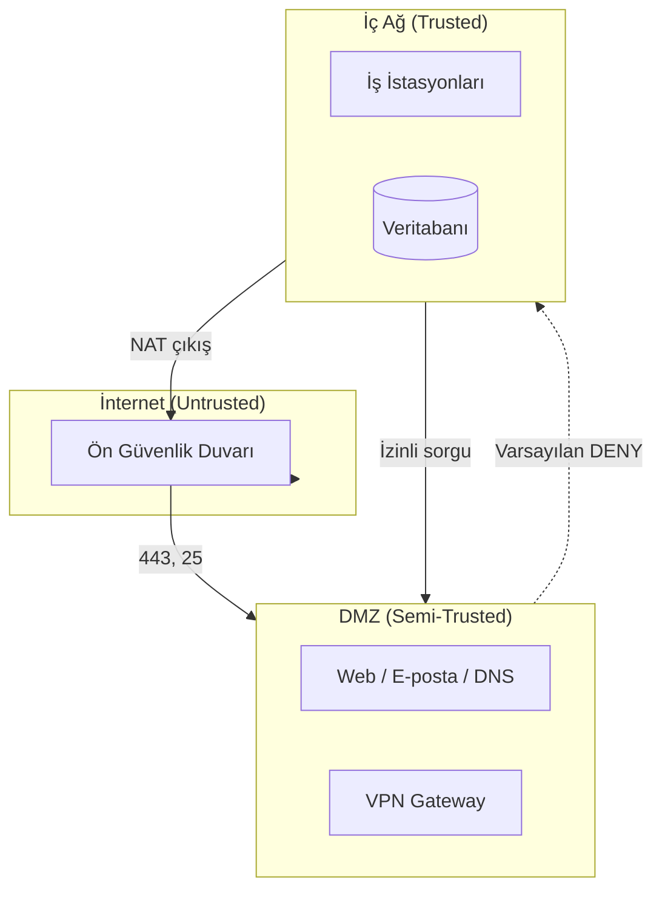

<details>
<summary>🏗️ DMZ Trafik Kuralı Hızlı Referansı</summary>

| Yön | Varsayılan | Örnek izin |
| :---- | :---- | :---- |
| İnternet → DMZ | Deny | TCP/443 (HTTPS) + WAF |
| DMZ → İç ağ | **Deny** | Yalnızca belirli DB portu |
| İç ağ → DMZ | Kısıtlı | SSH yönetim, monitoring |
| DMZ → İnternet | Kısıtlı | DNS, güncelleme sunucuları |

**Altın kural:** DMZ'deki sunucu ele geçirilse bile **DMZ → Trust** yönünde lateral movement engellenmelidir (MITRE TA0008).

</details>

---

## §6.1.0. Ağ Sınıflandırması, Topolojiler ve Modern Veri Merkezi Mimarisi

### Kapsama Alanına Göre Ağ Türleri (PAN, LAN, MAN, WAN)

| Tür | Kapsam | Tipik teknoloji | Güvenlik notu |
| :---- | :---- | :---- | :---- |
| **PAN** (Personal Area Network) | Birkaç metre; kişisel cihazlar | Bluetooth, BLE | IoT pairing, rogue cihaz |
| **LAN** (Local Area Network) | Bina/kampüs | Ethernet, Wi-Fi | 802.1X, VLAN segmentasyonu |
| **MAN** (Metropolitan Area Network) | Şehir/kampüsler arası | Metro Ethernet, fiber | Şube bağlantısı, MPLS |
| **WAN** (Wide Area Network) | Ülke/kıta; internet | BGP, MPLS, SD-WAN | Perimeter FW, RPKI |

PAN'ın yaygınlaşması (giyilebilir teknoloji, IoT), kurumsal NAC ve cihaz envanterini zorunlu kılar. WAN tasarımında SD-WAN ile merkezi backhaul yerine şube çıkışlı bulut erişimi tercih edilir (**§6.4**).

### Ağ Topolojileri

| Topoloji | Avantaj | Dezavantaj | Güvenlik etkisi |
| :---- | :---- | :---- | :---- |
| **Bus** | Düşük kablo maliyeti | Tek arıza tüm ağı düşürür | Artık nadir |
| **Star** | Arıza izolasyonu, yönetim kolaylığı | Merkezi switch SPOF | Modern LAN standardı |
| **Ring** | Döngüsel yedeklilik | Tek kopuş tüm halkayı keser | FDDI/Token Ring mirası |
| **Mesh** | Yüksek hata toleransı | Maliyet, karmaşıklık | WAN/kritik omurga |
| **Hybrid** | Esneklik | Tasarım karmaşıklığı | Kurumsal çok şubeli yapılar |

Star topolojisinin LAN'larda baskın olması, operasyonel güvenilirliğin başlangıç kablo maliyetinden ağır bastığını gösterir; güvenlik açısından merkezi switch üzerinde 802.1X ve port security uygulanabilir.

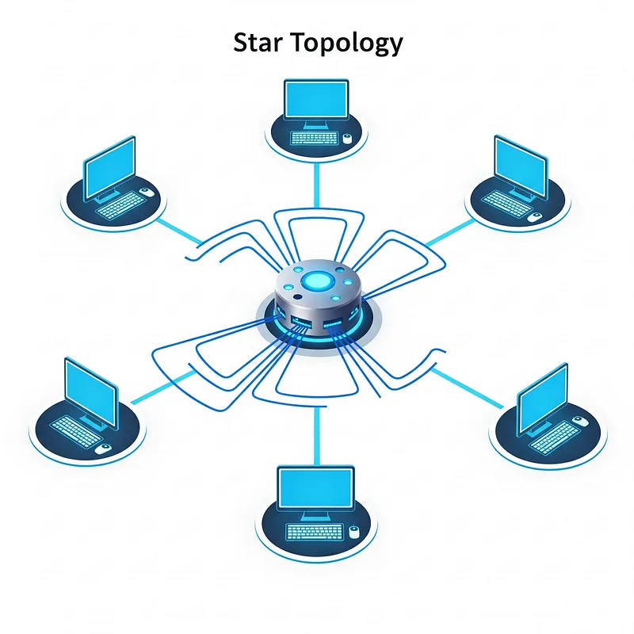
*Star — merkezi switch'e bağlı uç cihazlar; arıza tek bağlantıyla sınırlı*

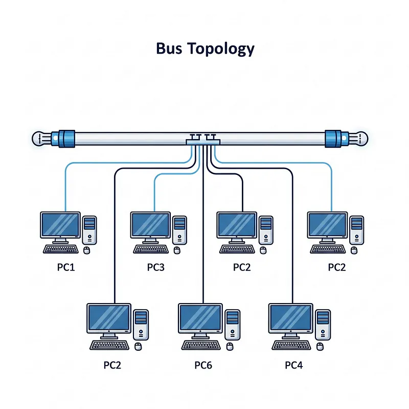
*Bus — omurga kablodaki tek arıza tüm ağı etkiler*

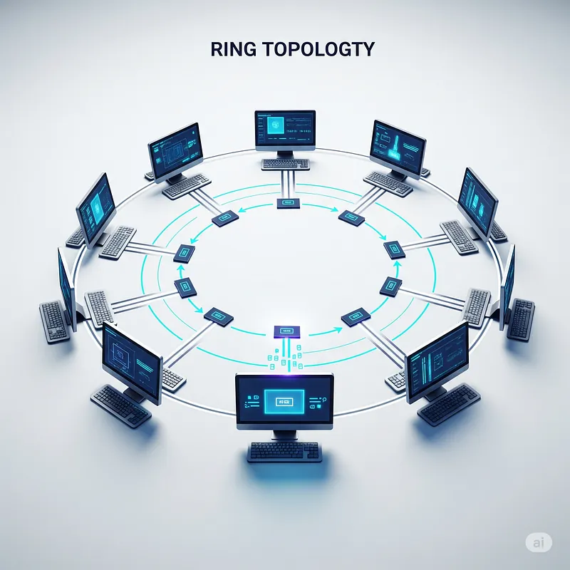
*Ring — tek kopuş tüm halkayı devre dışı bırakabilir*

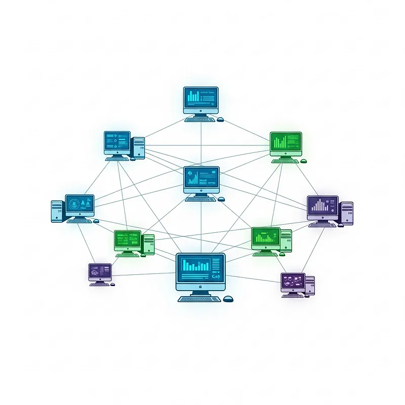
*Mesh — alternatif yollarla yüksek hata toleransı*

### Fiziksel Katman: UTP, RJ-45 ve Kablo Türleri

Kurumsal LAN altyapısının omurgası **bükümlü çift (UTP)** kablolardır. RJ-45 konnektör pin dizilimi **T568A** veya **T568B** standardına göre sonlandırılır; bir kurulumda tek standart tutarlılıkla uygulanmalıdır.

| Kablo türü | Uç sonlandırma | Kullanım |
| :---- | :---- | :---- |
| **Düz (Straight-Through)** | Her iki uç aynı standart (T568A–T568A veya T568B–T568B) | Farklı katman: PC↔Switch, Router↔Switch |
| **Çapraz (Crossover)** | Bir uç T568A, diğer uç T568B | Aynı katman: Switch↔Switch, PC↔PC (eski) |

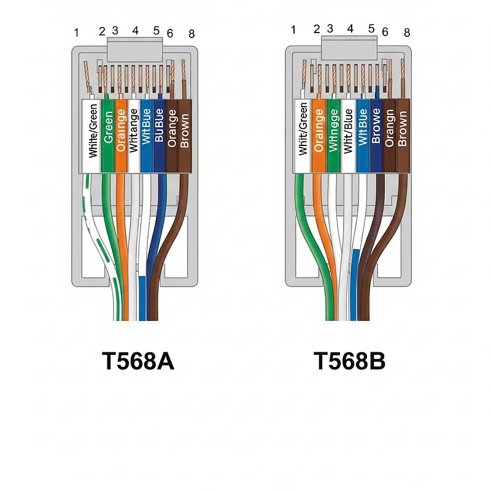
*T568A vs T568B — yeşil/turuncu çift konumu farklı; performans eşdeğer*

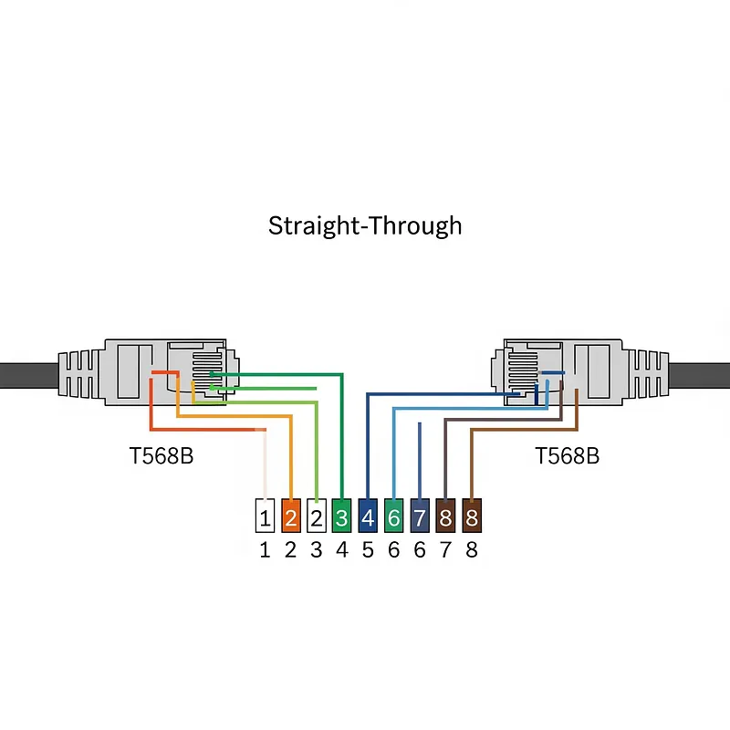
*Straight-through — TX/RX pinleri doğrudan eşleşir; host–switch bağlantısı*

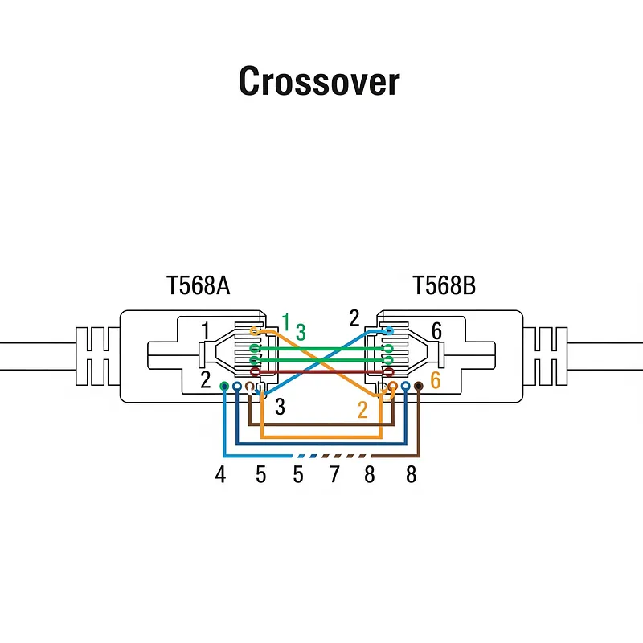
*Crossover — TX ve RX pinleri çaprazlanır; aynı tür cihazlar arası doğrudan bağlantı*

Modern switch ve NIC'lerde **Auto-MDI/MDIX** özelliği kablo tipini otomatik algıladığından çapraz kablo ihtiyacı büyük ölçüde ortadan kalkmıştır.

### Spine-Leaf Veri Merkezi Mimarisi

Geleneksel üç katmanlı (Erişim–Dağıtım–Çekirdek) mimari, sanallaştırma ve mikroservislerin artırdığı **doğu-batı (east-west)** trafiğinde STP darboğazları yaratır. **Spine-Leaf** mimarisi bu sorunu çözer:

- **Leaf:** Sunucu ve uç noktaların bağlandığı erişim katmanı
- **Spine:** Tüm leaf'leri full-mesh bağlayan omurga katmanı
- **Kural:** Leaf–leaf ve spine–spine bağlantı yok; yol her zaman Leaf → Spine → Leaf (sabit hop, düşük gecikme)
- **ECMP:** STP yerine eşit maliyetli çoklu yol; tüm bağlantılar aktif kullanılır

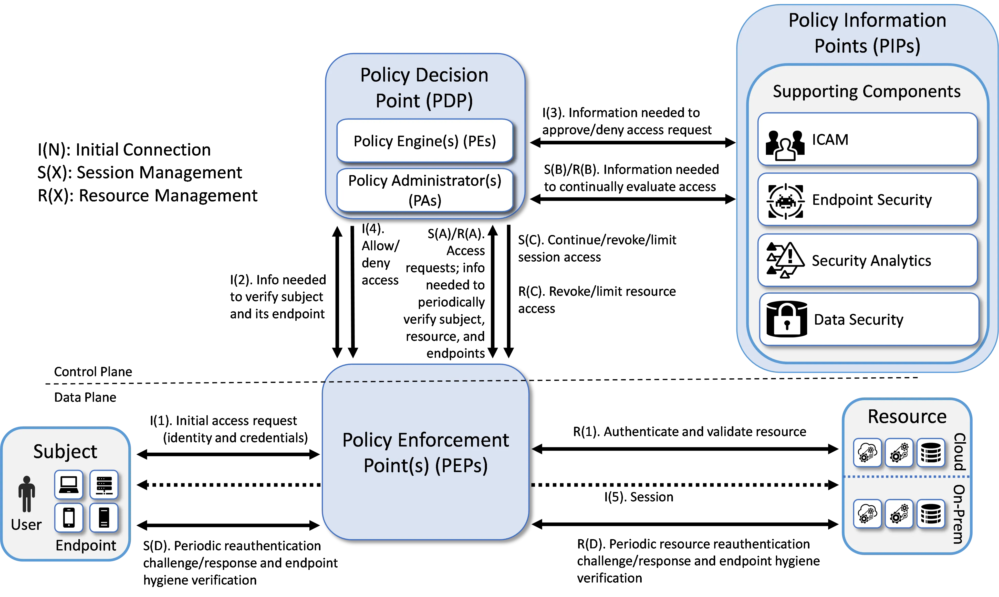
*Spine-Leaf — east-west trafik için ölçeklenebilir veri merkezi topolojisi*

### Temel Ağ Cihazları: Router, Switch, L3 Switch

| Cihaz | OSI katmanı | Birincil görev | Konum |
| :---- | :---- | :---- | :---- |
| **Switch (L2)** | Katman 2 | MAC tabanlı çerçeve iletimi | LAN erişim |
| **L3 Switch** | Katman 3 | ASIC tabanlı wire-speed VLAN arası yönlendirme | Veri merkezi omurgası |
| **Router** | Katman 3 | WAN, NAT, VPN, karmaşık politika | Ağ kenarı (edge) |
| **Firewall** | L3–L7 | Politika tabanlı trafik filtreleme | Perimeter, segment |
| **AP** | L1–L2 | Kablosuz köprü | WLAN (**§6.4**) |

L3 switch, LAN içi yüksek hızlı yönlendirme için idealdir; router ise WAN bağlantıları, NAT ve gelişmiş güvenlik hizmetleri için tasarlanmıştır — birbirinin tam ikamesi değildir.

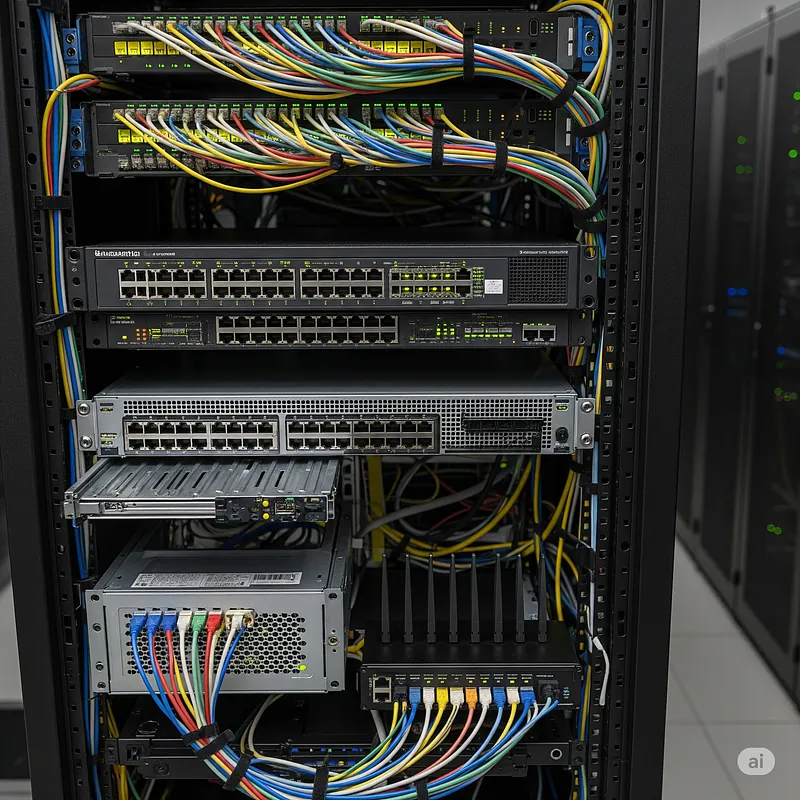
*Router — farklı IP ağlarını birbirine bağlar (LAN↔WAN)*

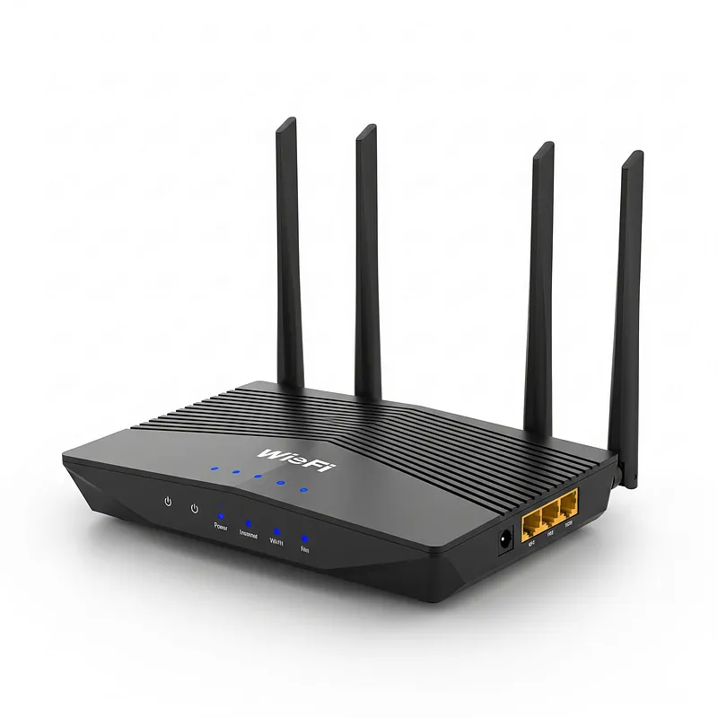
*Switch — MAC tablosu ile çerçeveleri hedef porta iletir*

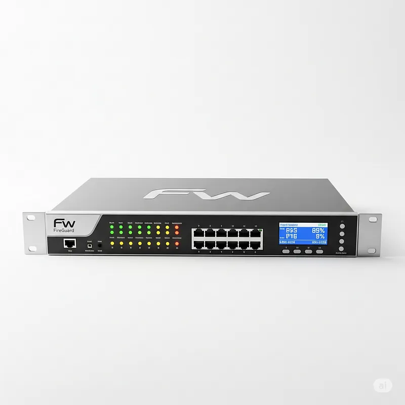
*Firewall — güvenilir/güvenilmeyen bölge arasında politika uygular*

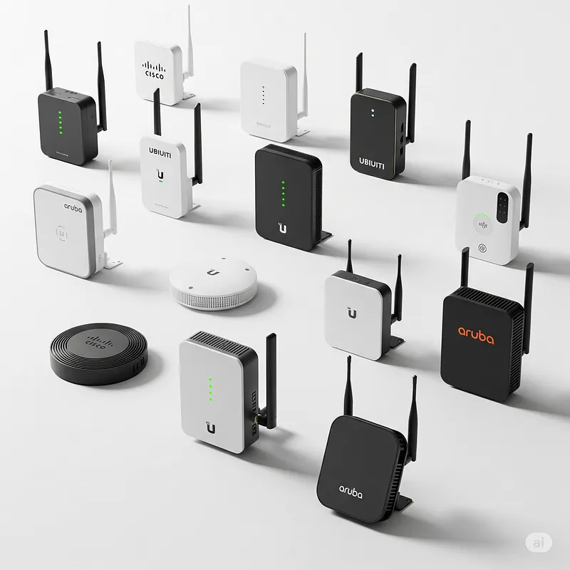
*AP — kablolu ağ ile kablosuz istemciler arasında köprü*

---

## §6.1.1. OSI Referans Modeli, TCP/IP Protokol Yığını ve Kapsülleme

### Teorik Çerçeve: OSI (7 Katman) vs TCP/IP (4 Katman)

**OSI (Open Systems Interconnection) Referans Modeli** (ISO/IEC 7498-1), ağ iletişimini yedi katmanda soyutlayan **kavramsal bir referans çerçevesidir**. Sorun giderme, güvenlik kontrollerinin katman bazında konumlandırılması ve farklı üretici cihazlar arasında ortak dil oluşturulması için idealdir. **TCP/IP protokol yığını** (RFC 1122, RFC 9293) ise internetin fiili çalışma modelidir; pratik uygulama ve yapılandırma için temel alınır.

| OSI Katmanı | TCP/IP Katmanı | PDU Adı | Temel Protokoller |
| :---- | :---- | :---- | :---- |
| **7 – Uygulama** | Uygulama (L5-L7 birleşik) | Veri (Data) | HTTP, HTTPS, SMTP, DNS, FTP |
| **6 – Sunum** | ↑ | Veri | TLS, JSON, XML serileştirme |
| **5 – Oturum** | ↑ | Veri | Oturum yönetimi (uygulama katmanına delege) |
| **4 – Taşıma** | Taşıma | Segment / Datagram | TCP, UDP |
| **3 – Ağ** | İnternet | Paket (Packet) | IP, ICMP, OSPF, BGP |
| **2 – Veri Bağlantısı** | Ağ Erişimi (Link) | Çerçeve (Frame) | Ethernet, 802.1Q VLAN, ARP |
| **1 – Fiziksel** | ↑ | Bit | Kablolar, fiber, RF sinyalleri |

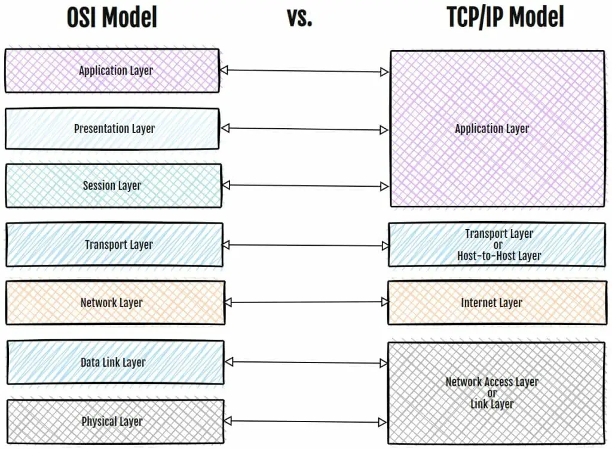
*OSI 7 katmanlı referans modeli ile TCP/IP pratik modelinin eşleştirmesi*

**Mimari not:** NIST SP 800-53 `SC-7 (Boundary Protection)` kontrolü, sınır korumasının OSI Katman 3 (IP yönlendirme) ve Katman 4 (port/protokol) düzeyinde uygulanmasını gerektirir. Modern NGFW'ler (Palo Alto, FortiGate) Katman 7'ye kadar inen **App-ID/DPI** yetenekleriyle bu kontrolü genişletir.

### Kapsülleme (Encapsulation) ve Dekapsülleme

Ağ üzerinden iletilen ham veri, gönderici tarafta üst katmanlardan alt katmanlara inerken her aşamada ilgili katmanın **başlık (header)** bilgileriyle sarmalanır. Alıcı tarafta süreç tersine işler:

```
[Uygulama]     ──► Veri (Payload)
                    │
[Taşıma]       ──► Segment     [TCP Başlığı + Veri]
                    │
[İnternet]     ──► Paket       [IP Başlığı + TCP Başlığı + Veri]
                    │
[Link]         ──► Çerçeve      [Ethernet Başlığı + IP + TCP + Veri + FCS]
                    │
[Fiziksel]     ──► Bit akışı
```

SOC operasyonlarında kapsülleme akışı, olay müdahale ve adli bilişim süreçlerinde doğrudan kullanılır. Bir veri sızıntısı (data exfiltration) şüphesinde analist, tüm katmanları sırasıyla inceleyerek korelasyon kurar: DNS tünelleme Katman 7'de, SYN flood Katman 4'te, BGP hijacking Katman 3'te tespit edilir.

### Katman-Tehdit Eşlemesi ve Savunma Kontrolleri

| OSI Katmanı | Tipik Tehditler | MITRE ATT&CK | Birincil Savunma |
| :---- | :---- | :---- | :---- |
| **L7 – Uygulama** | SQL Injection, XSS, DNS tünelleme, API sömürüsü | T1190, T1071.004 | WAF, reverse proxy, API gateway, SSL inspection |
| **L4 – Taşıma** | SYN Flood, port taraması, oturum ele geçirme | T1498, T1046 | Stateful firewall, SYN cookies, rate limiting |
| **L3 – Ağ** | IP spoofing, BGP/OSPF route hijacking, ICMP flood | T1498.002 | uRPF, RPKI/ROV, anti-spoofing ACL |
| **L2 – Veri Bağlantısı** | ARP poisoning, MAC flooding, VLAN hopping | T1557.002 | 802.1X, DAI, Port Security, IP Source Guard |
| **L1 – Fiziksel** | Kablo dinleme, rogue cihaz | T1200 | MACsec, fiziksel port güvenliği, NAC |

:::note
Savunma derinliği (defense in depth) prensibi, her OSI katmanında bağımsız kontroller gerektirir. Yalnızca perimetre güvenlik duvarına güvenmek, iç ağdaki east-west trafiğini kontrol edemez. NIST SP 800-215, geleneksel perimetrenin yetersiz kaldığını ve mikro-segmentasyonun zorunlu hale geldiğini vurgular.
:::

---

## §6.1.2. TCP 3'lü El Sıkışma, Durum Makinesi ve DoS Savunması

### RFC 9293 ve 3-Way Handshake

TCP (Transmission Control Protocol), **RFC 9293** (2022; RFC 793'ün güncel halefi) ile tanımlanan, bağlantı odaklı (connection-oriented), güvenilir ve sıralı teslimat sağlayan bir taşıma katmanı protokolüdür. Bir TCP bağlantısının kurulması klasik **3-way handshake** ile gerçekleşir:

1. **Client → Server: SYN** — İstemci rastgele bir başlangıç sıra numarası (ISN) üretir ve SYN bayrağını set eder. Durum: `SYN-SENT`.
2. **Server → Client: SYN-ACK** — Sunucu istemcinin SYN'ini onaylar (ACK = ISN + 1), kendi ISN'ini gönderir. Durum: `SYN-RECEIVED`.
3. **Client → Server: ACK** — İstemci sunucunun SYN-ACK'ini onaylar (ACK = sunucu ISN + 1). Her iki taraf `ESTABLISHED` durumuna geçer.

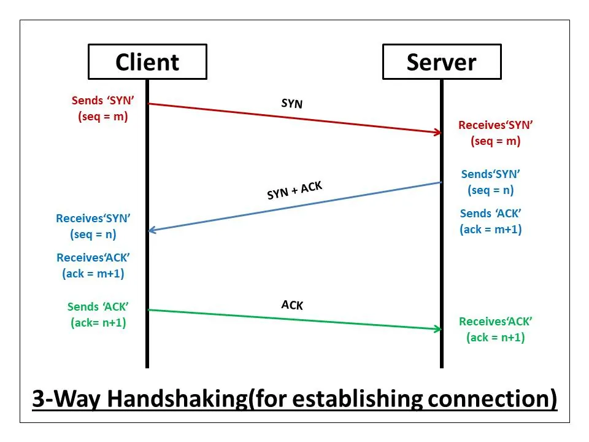
*TCP bağlantı kurulumunda SYN → SYN-ACK → ACK el sıkışma süreci*

RFC 9293'ün 3-way handshake için belirttiği temel amaç: *"eski, yinelenen bağlantı başlatmalarının karışıklığa yol açmasını önlemek."* RFC 6528, güvenli ISN üretimi (randomization) ile oturum tahmin saldırılarını azaltır.

### TCP Durum Makinesi (State Machine)

TCP, bağlantı yaşam döngüsünü bir **durum makinesi** ile yönetir:

| Durum | Açıklama | Güvenlik Notu |
| :---- | :---- | :---- |
| `CLOSED` | Bağlantı yok | Varsayılan başlangıç |
| `LISTEN` | Sunucu bağlantı bekliyor | SYN flood hedefi |
| `SYN-SENT` | İstemci SYN gönderdi | Half-open tarama |
| `SYN-RECEIVED` | Sunucu SYN-ACK gönderdi | **SYN backlog kuyruğu tüketilir** |
| `ESTABLISHED` | Bağlantı aktif | Stateful inspection izler |
| `FIN-WAIT-1/2` | Aktif kapatma | — |
| `TIME-WAIT` | MSL süresi bekleniyor | Gecikmiş paket koruması (60–240 sn) |
| `CLOSE-WAIT` | Pasif kapatma | — |

Bağlantı sonlandırma **4-way handshake** (FIN exchange) ile gerçekleşir. `TIME-WAIT` durumu, ağda gecikerek gelen paketlerin yeni aynı 4-tuple bağlantılarına sızmasını engeller.

### SYN Flood Saldırısı (T1498 / T1499.001)

Saldırgan, sahte (spoofed) kaynak IP adresleriyle hedef sunucuya saniyede binlerce SYN paketi gönderir. Sunucu her SYN için çekirdekteki **yarı-açık bağlantı kuyruğunda** (SYN backlog) yer ayırır ve SYN-ACK yanıtlar; ancak üçüncü ACK asla gelmez. Kuyruk dolduğunda meşru bağlantı istekleri reddedilir — **hizmet reddi (DoS)** oluşur.

Aynı mekanizma saldırganlar tarafından **TCP SYN Scan (Half-Open Scan)** keşif tekniği olarak da kullanılır: SYN gönderilir, SYN-ACK gelirse port açık demektir; RST ile el sıkışma tamamlanmadan bağlantı koparılır ve uygulama loglarında iz bırakılmaz.

:::caution
DMZ'deki internete açık web sunucuları SYN flood'un birincil hedefidir. NIST SP 800-53 `SC-5 (Denial-of-Service Protection)` bu saldırı türüne karşı önlem alınmasını zorunlu kılar. State table kullanımı %70'i aştığında SYN cookie ve rate-limit devreye alınmalıdır.
:::

### SYN Cookies ve Çekirdek Sıkılaştırması

**SYN Cookies** (RFC 4987), yarı-açık kuyruk dolduğunda çekirdeğin her SYN için bellek ayırmayı durdurmasıdır. Sunucu, SYN-ACK paketindeki ISN değerini kriptografik bir cookie olarak kodlar; geçerli ACK geldiğinde meşruiyet doğrulanır ve ancak o zaman TCB oluşturulur.

Linux çekirdek sıkılaştırma parametreleri (`/etc/sysctl.d/99-network-security.conf`):

```bash
# SYN Flood koruması — SYN Cookies etkinleştir
net.ipv4.tcp_syncookies = 1

# Yarı-açık bağlantı kuyruk boyutunu artır
net.ipv4.tcp_max_syn_backlog = 4096

# Cevapsız SYN-ACK tekrar deneme sayısını azalt
net.ipv4.tcp_synack_retries = 2

# IP sahteciliğine karşı Geri Yol Filtreleme (uRPF — RFC 3704)
net.ipv4.conf.all.rp_filter = 1
net.ipv4.conf.default.rp_filter = 1

# Martian (geçersiz kaynak IP) paketlerini logla
net.ipv4.conf.all.log_martians = 1

# Kaynak yönlendirmeyi kapat (routing manipulation önleme)
net.ipv4.conf.all.accept_source_route = 0

# ICMP redirect mesajlarını reddet (MitM önleme)
net.ipv4.conf.all.accept_redirects = 0
```

Parametreleri uygulama ve doğrulama:

```bash
sudo sysctl -p /etc/sysctl.d/99-network-security.conf
sysctl -n net.ipv4.tcp_syncookies   # Beklenen: 1
```

### IDS/IPS Seviyesinde SYN Tespiti

Suricata/Snort ile SYN tarama ve flood tespiti:

```
alert tcp $EXTERNAL_NET any -> $HOME_NET any (msg:"IDS: TCP SYN Scan"; flags:S; threshold:type both, track by_src, count 20, seconds 3; sid:1000001; rev:1;)
alert tcp any any -> $HOME_NET any (msg:"IDS: SYN Flood"; flags:S; flow:to_server; detection_filter:track by_dst, count 100, seconds 5; sid:1000002; rev:1;)
```

Suricata `threshold.config` ile dinamik engelleme: `rate_filter gen_id 1, sig_id 1000002, track by_src, count 100, seconds 5, new_action drop, timeout 30`

---

## §6.1.3. Yönlendirme Protokolleri, RPKI ve VLAN/Subnet Segmentasyonu

### OSPF Güvenlik Sıkılaştırması

**OSPF (Open Shortest Path First)** (RFC 2328), tek bir otonom sistem içinde çalışan **İç Ağ Geçidi Protokolü** (IGP) olup link-state algoritması (Dijkstra SPF) kullanır. Varsayılan olarak kimlik doğrulama yapmaz; saldırgan sahte bir yönlendirici bağlayarak komşuluk kurabilir, LSA enjekte edebilir ve trafiği yönlendirebilir.

**Mitigasyon stratejileri:**
- **Type 2 (MD5)** veya **Type 3 (HMAC-SHA)** kimlik doğrulama
- **Key Chain** ile sıfır kesintili şifre rotasyonu
- `passive-interface default` — yalnızca komşuluk gereken arayüzlerde Hello paketleri
- Alan (Area) hiyerarşisi ile zafiyet izolasyonu (Backbone Area 0)

Cisco IOS-XE OSPF MD5 kimlik doğrulama özeti:

```cisco
key chain OSPF_KEY_CHAIN
 key 1
  key-string Str0ng_OSPF_Key_2026
interface Gi0/1
 ip ospf authentication message-digest
 ip ospf message-digest-key 1 md5 Str0ng_OSPF_Key_2026
router ospf 100
 passive-interface default
 no passive-interface Gi0/1
```

### BGP Güvenliği ve RPKI

**BGP (Border Gateway Protocol)** (RFC 4271), otonom sistemler arası yönlendirme yapan **Dış Ağ Geçidi Protokolü** (EGP) olup path-vector algoritması kullanır. BGP'nin tasarımı "güvene dayalı" olduğundan, yetkisiz prefix duyurumu (**BGP Hijacking**) veya AS_PATH manipülasyonu ile trafik çalınabilir.

| Kriter | OSPF | BGP |
| :---- | :---- | :---- |
| Kapsam | Tek AS (iç) | AS'ler arası (dış) |
| Algoritma | Link-State (SPF) | Path-Vector |
| Yakınsama | Saniyeler | Dakikalar |
| Kimlik doğrulama | MD5/HMAC-SHA | TCP-MD5 / TCP-AO (RFC 5925) |
| Politika | Sınırlı | Gelişmiş (AS-Path, Local Pref) |

**Üç katmanlı BGP savunması:**

1. **Oturum sıkılaştırma:** TCP-AO (RFC 5925) veya BGP MD5 imza seçeneği; GTSM (TTL Security, RFC 5082)
2. **RPKI / ROV:** ROA (Route Origin Authorization) ile hangi AS'nin hangi prefix'i duyurabileceği kriptografik olarak doğrulanır; INVALID duyurular filtrelenir
3. **Prefix filtering + MANRS:** BCP 38 (RFC 2827) anti-spoofing; route leak kontrolü (RFC 7908)

:::danger
RPKI kontrol düzlemi koruması, AS_PATH manipülasyonuyla gerçekleştirilen "araya girme" (interception) saldırılarını tek başına engelleyemez. Veri düzlemi izleme (RTT anomali analizi, NetFlow korelasyonu) ile desteklenmelidir. 2024'te Cloudflare 1.1.1.1 ve 2022'de Rostelecom–Apple BGP hijack olayları, RPKI'nin tek başına yeterli olmadığını göstermiştir.
:::

### VLAN, Subnet ve Kurumsal Segmentasyon

**VLAN (IEEE 802.1Q)**, Katman 2 düzeyinde broadcast domain izolasyonu sağlar. **Subnet**, Katman 3 düzeyinde IP adres aralıklarıyla mantıksal bölümleme yapar. Kurumsal tasarımda tipik segmentler:

| VLAN ID | Segment | Subnet | Güvenlik Bölgesi |
| :---- | :---- | :---- | :---- |
| VLAN 10 | Yönetim (Management) | 10.10.10.0/24 | Out-of-band, sıkı ACL |
| VLAN 20 | İç Ağ (Trust) | 10.10.20.0/24 | Kullanıcı/iş istasyonları |
| VLAN 30 | DMZ | 10.10.30.0/24 | Internet-facing servisler |
| VLAN 40 | Misafir (Guest) | 10.10.40.0/24 | 5651 loglama, tam izolasyon |
| VLAN 50 | OT/SCADA | 10.10.50.0/24 | Purdue Seviye 0-3, iDMZ arkası |


*NGFW cluster ile VLAN 100/200 içerik ve uygulama ayrımı*

VLAN'lar arası trafik mutlaka **firewall veya L3 switch ACL** üzerinden geçmelidir; "flat network" zafiyeti kapatılmalıdır. CIS Control 12.2 (Secure Network Architecture) segmentasyonu zorunlu kılar.

### VLAN Hopping Azaltma

VLAN hopping iki yöntemle gerçekleştirilir:

1. **Switch spoofing:** Saldırgan DTP (Dynamic Trunking Protocol) ile trunk pazarlığı yapar
2. **Double tagging:** İki 802.1Q etiketi; dış etiket native VLAN ile eşleşir, iç etiket hedef VLAN'a yönlendirilir

Cisco L2 sertleştirme CLI:

```cisco
! Native VLAN'ı kullanılmayan ID'ye taşı
switchport trunk native vlan 999
vlan dot1q tag native

! Erişim portlarında DTP kapat
interface range Fa0/1-24
 switchport mode access
 switchport nonegotiate
 switchport port-security maximum 2
 switchport port-security violation restrict

! DHCP Snooping (DAI ön koşulu)
ip dhcp snooping
ip dhcp snooping vlan 10,20,30
interface Gi0/24
 ip dhcp snooping trust

! Dynamic ARP Inspection
ip arp inspection vlan 10,20
interface Gi0/24
 ip arp inspection trust
interface Fa0/1
 ip arp inspection limit rate 8 burst interval 4
```

:::caution
VLAN 1'e (varsayılan) host atanmamalı; kullanılmayan portlar `shutdown` ile kapatılmalıdır. Trunk portlara yalnızca gerekli VLAN'lar whitelist'lenmelidir.
:::

---

## §6.1.4. DMZ Mimarisi, Trafik Kuralları ve OT/iDMZ

### DMZ Tasarım Mantığı

**DMZ (Demilitarized Zone / Arındırılmış Bölge)**, kurumsal iç ağ (LAN) ile güvenilmeyen dış ağ (WAN/İnternet) arasında yer alan tampon bölgedir. Web, e-posta, DNS, VPN gateway gibi internete açık hizmetler burada konumlandırılır. NIST SP 800-53 `SC-7(3)` gereği, kamuya açık sistem bileşenleri iç ağdan **fiziksel veya mantıksal olarak ayrılmış** alt ağlarda barındırılmalıdır.

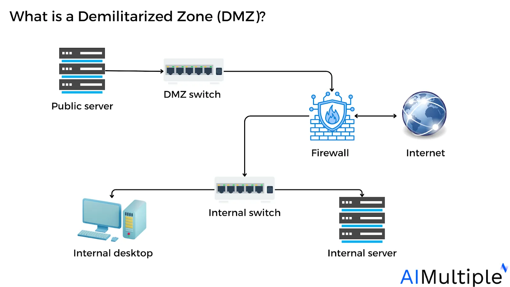
*Güvenlik duvarı ile internet ve iç ağdan izole edilmiş DMZ bölgesi*

### Tek ve Çift Güvenlik Duvarlı Modeller

| Model | Yapı | Avantaj | Dezavantaj |
| :---- | :---- | :---- | :---- |
| **Three-Legged** | Tek FW: WAN + DMZ + LAN | Düşük maliyet, merkezi yönetim | Tek hata noktası (SPOF) |
| **Dual Firewall** | İki FW arasında DMZ | Maksimum savunma derinliği, multi-vendor | Yüksek maliyet, karmaşık kural yönetimi |

Çift güvenlik duvarlı modelde ön duvar (Front-End) internet trafiğini filtreler; arka duvar (Back-End) DMZ'den iç ağa geçişi kontrol eder. IEC 62443 ve OT ortamları için tercih edilir.

### DMZ Trafik Kuralları (Least Privilege)

| Yön | Varsayılan | İzin Verilen (Örnek) | Gerekçe |
| :---- | :---- | :---- | :---- |
| **İnternet → DMZ** | Deny | TCP/443 (HTTPS), TCP/25 (SMTP) | Yalnızca gerekli portlar + WAF/IPS |
| **DMZ → İç Ağ** | **Deny** | TCP/1433 (SQL) — belirli DB sunucusuna | Lateral movement engeli |
| **İç Ağ → DMZ** | Kısıtlı | TCP/22 (SSH yönetim), monitoring | Gerekli yönetim trafiği |
| **DMZ → İnternet** | Kısıtlı | TCP/53 (DNS), TCP/443 (güncelleme) | Outbound kısıtlama |
| **DMZ → DMZ** | Deny | — | Segment içi izolasyon |

:::danger
DMZ'deki bir web sunucusu ele geçirildiğinde saldırganın iç ağa yatay hareket (lateral movement — MITRE TA0008) yapamaması için **DMZ → Trust yönünde varsayılan deny** kuralı kesinlikle uygulanmalıdır. İç ağ, gerekirse DMZ'den veri çekebilir; tersi yön asla başlatılamaz.
:::

### DMZ'de Barındırılan Hizmetler

| Hizmet | Port | Risk | Savunma |
| :---- | :---- | :---- | :---- |
| Web Sunucusu (HTTPS) | 443 | SQL Injection, XSS, RCE | WAF, IPS, reverse proxy |
| E-posta (SMTP) | 25/587 | Spam, phishing, relay | Anti-spam, DKIM/SPF/DMARC |
| DNS | 53 | DNS amplification, cache poisoning | Rate limiting, DNSSEC |
| VPN Gateway | 500/4500 | Brute force, credential stuffing | MFA, fail2ban, certificate auth |

### Endüstriyel DMZ (iDMZ) — Purdue Model Seviye 3.5

OT/IT yakınsamasında **Endüstriyel DMZ (iDMZ)**, Purdue Modelinin **Seviye 3.5** konumunda IT ağı (Seviye 4/5) ile OT kontrol ağı (Seviye 0-3) arasında tampon bölge oluşturur. iDMZ'de jump server (MFA zorunlu), izole AD domain, historian mirror ve antivirüslü dosya aktarım sunucusu barındırılır.

**iDMZ gereksinimleri (IEC 62443):** Seviye 4/5 doğrudan Seviye 3'e erişemez; OT AD ormanı IT AD ile güven ilişkisi kurmaz; jump host'ta clipboard/drive redirection GPO ile engellenir; dosya aktarımı write-only/read-only klasörler + AV tarama ile yapılır.

---

## §6.1.5. Uluslararası Standartlar ve Türk Mevzuatı

### NIST, CIS ve ISO Kontrol Eşleştirmesi

| Standart | Kontrol | Açıklama | Segmentasyon Karşılığı |
| :---- | :---- | :---- | :---- |
| **NIST SP 800-53** | SC-7 | Sınır koruması | DMZ, firewall zone'ları |
| **NIST SP 800-53** | SC-7(5) | Deny by default, allow by exception | Varsayılan deny politikaları |
| **NIST SP 800-53** | SC-5 | Hizmet reddi koruması | SYN cookie, rate limiting |
| **NIST SP 800-53** | AC-4 | Bilgi akışı zorunluluğu | VLAN/subnet bazlı ACL |
| **CIS Controls v8** | Control 12 | Ağ altyapı yönetimi | Segmentasyon, mimari diyagram |
| **CIS Controls v8** | Control 13 | Ağ izleme ve savunma | IDS/IPS, 802.1X, port kontrolü |
| **ISO 27001:2022** | A.8.20 | Ağ güvenliği | Genel ağ güvenlik kontrolleri |
| **ISO 27001:2022** | A.8.22 | Ağların ayrıştırılması | VLAN/DMZ/mikro-segmentasyon |

### 5651 Sayılı Kanun — Loglama Yükümlülükleri

5651 Sayılı Kanun, internet erişimi sağlayan işletmelerin trafik loglarını tutmasını zorunlu kılar. **Saklama süreleri sağlayıcı türüne göre değişir:**

| Sağlayıcı Türü | Saklama Süresi | Kapsam |
| :---- | :---- | :---- |
| **Erişim sağlayıcı** | 1 yıl | Trafik bilgisi (kaynak/hedef IP, port, zaman) |
| **Yer sağlayıcı** | 6 ay | Barındırma ve içerik logları |
| **Toplu kullanım sağlayıcı** (otel, kafe, kurumsal Wi-Fi) | 2 yıl | Erişim/iç IP logları |

**Zorunlu log parametreleri:** Kaynak IP, MAC adresi, bağlantı başlangıç/bitiş zamanı (ms hassasiyet), hedef IP ve port, NAT çeviri kaydı, kimlik doğrulama verisi (T.C. kimlik veya SMS OTP).

:::note
5651 loglarının **TÜBİTAK KamuSM zaman damgası** ile imzalanması, mahkemede delil vasfını korur. Zaman damgasız loglar manipüle edilebilir sayılır. Günlük log dosyaları SHA-256 hash'i hesaplanarak paketlenmeli ve dijital imza ile mühürlenmelidir.
:::

### KVKK (6698) ile İlişki

5651 logları KVKK **m.5/2-a** (kanunlarda açıkça öngörülme) ve **m.5/2-ç** (hukuki yükümlülük) kapsamında işlenir — açık rıza gerekmez, ancak **aydınlatma metni zorunludur**. IP adresleri ve MAC adresleri kişisel veri sayılabilir; loglarda anonimleştirme veya şifreleme uygulanmalıdır.

**Saklama-imha dengesi:** 5651 üst sınırı dolduğunda ve devam eden yasal süreç yoksa loglar güvenli silme (secure wipe) ile imha edilmelidir. Kişisel veri erişim logları en az 2 yıl, silme logları 3 yıl saklanmalıdır.

### BDDK Bilgi Sistemleri Yönetmeliği

Finans kuruluşları için BDDK, ağ güvenliğinde ek yükümlülükler getirir:

- Kritik sistemler ayrı VLAN ve DMZ bölgelerinde izole edilmeli
- **KSOME (Kurumsal Siber Olaylara Müdahale Ekibi)** kurulmalı; iletişim bilgileri BDDK'ya bildirilmeli
- Denetim izleri **en az 10 yıl** saklanmalı; canlı ve arşiv saklama politikaları oluşturulmalı
- Yıllık bağımsız sızma testi zorunlu; birincil/ikincil sistemler **yurt içinde**
- Felaket senaryosunda en geç **24 saat** içinde faaliyet sürdürülebilirliği

### 7545 Sayılı Siber Güvenlik Kanunu (19 Mart 2025)

7545 Sayılı Kanun, **Siber Güvenlik Başkanlığı** ve **Siber Güvenlik Kurulu** yapısını kurarak ulusal siber güvenlik yönetişimini güçlendirmiştir:

- Bilişim sistemleri üzerinden hizmet sunanlar siber güvenlik önlemlerini almak, zafiyet/olayları gecikmeksizin bildirmekle yükümlüdür
- Kritik altyapı kurumları yalnızca yetkilendirilmiş tedarikçilerden ürün/hizmet alır
- Başkanlık, log kayıtlarını toplama ve değerlendirme yetkisine sahiptir
- İdari para cezaları: 1 milyon–100 milyon TL aralığında (ihlal türüne göre)

### Regülasyon Karşılaştırma Matrisi

| Regülasyon | Segmentasyon | Log Saklama | İmzalama | Denetim |
| :---- | :---- | :---- | :---- | :---- |
| **5651** | Misafir ağ izolasyonu | 6 ay – 2 yıl (türe göre) | TÜBİTAK zaman damgası zorunlu | BTK/Adli talep |
| **KVKK** | Kişisel veri VLAN'ı | 2–10 yıl | Şifreli erişim geçmişi | İç denetim, VERBİS |
| **BDDK** | Bankacılık VLAN/DMZ | 10 yıl | Kriptografik bütünlük | Yıllık pentest + BDDK |
| **7545** | Kritik altyapı segmentasyonu | Başkanlık talebiyle | Mevzuata uygun | Siber Güvenlik Başkanlığı denetimi |

---

## §6.1.6. Somut Yapılandırma Örnekleri

### Palo Alto Networks — Zone Tabanlı Politika

```bash
# Güvenlik bölgeleri (Zones) arayüzlere atanır
set zone WAN network layer3 ethernet1/1
set zone LAN network layer3 ethernet1/2
set zone DMZ network layer3 ethernet1/3

# Adres nesneleri
set address Web_Server_Internal ip-netmask 192.168.100.10/32
set address DB_Server_Internal ip-netmask 10.50.200.50/32

# İnternet → DMZ: HTTPS izin
set rulebase security rules "WAN_to_DMZ_HTTPS" from WAN to DMZ source any destination Web_Server_Internal application ssl service application-default action allow log-end yes

# DMZ → LAN: Yalnızca DB erişimi
set rulebase security rules "DMZ_to_LAN_DB" from DMZ to LAN source Web_Server_Internal destination DB_Server_Internal application mssql-db service service-ms-sql action allow log-end yes

# DMZ → LAN: Varsayılan engelleme
set rulebase security rules "BLOCK_DMZ_to_LAN" from DMZ to LAN source any destination any action deny log-end yes

# LAN → WAN: NAT ile çıkış
set rulebase security rules "LAN_to_WAN" from LAN to WAN source any destination any application any service application-default action allow log-end yes
```

### FortiGate — DMZ Zone ve VIP Yapılandırması

```fortios
config system zone
    edit "DMZ_ZONE"
        set interface "dmz"
        set intrazone deny
    next
end
config firewall vip
    edit "VIP_HTTPS"
        set extip 198.51.100.100
        set mappedip "10.10.30.10"
        set extintf "wan1"
        set portforward enable
        set extport 443
        set mappedport 443
    next
end
config firewall policy
    edit 1
        set name "WAN_to_DMZ"
        set srcintf "wan1"
        set dstintf "DMZ_ZONE"
        set dstaddr "VIP_HTTPS"
        set action accept
        set service "HTTPS"
        set utm-status enable
        set ips-sensor "protect_web_server"
        set logtraffic all
    next
    edit 2
        set name "BLOCK_DMZ_to_LAN"
        set srcintf "DMZ_ZONE"
        set dstintf "internal"
        set action deny
        set logtraffic all
    next
end
```

### Wazuh SIEM — Firewall Log Toplama

```xml
<!-- /var/ossec/etc/ossec.conf -->
<ossec_config>
  <remote>
    <connection>syslog</connection>
    <port>514</port>
    <protocol>udp</protocol>
  </remote>

  <localfile>
    <log_format>syslog</log_format>
    <location>/var/log/firewall.log</location>
  </localfile>
</ossec_config>
```

DMZ anomali tespiti için özel Wazuh kuralı:

```xml
<group name="dmz_security,">
  <rule id="100010" level="10">
    <if_sid>4000</if_sid>
    <match>ET SCAN Suspicious Inbound</match>
    <description>DMZ'de şüpheli tarama trafiği tespit edildi</description>
    <group>dmz_scan,pci_dss_10.6.1,</group>
  </rule>

  <rule id="100011" level="12">
    <if_sid>100010</if_sid>
    <match>DMZ_to_LAN</match>
    <description>DMZ'den iç ağa beklenmedik trafik — olası lateral movement</description>
    <group>lateral_movement,mitre_T1021,</group>
  </rule>
</group>
```

### 5651 Uyumlu Log Örneği (JSON)

```json
{"timestamp":"2026-06-19T14:30:45Z","source":{"mac":"00:1A:2B:3C:4D:5E","ip":"192.168.40.55","user":"TC_12345678901"},"nat":{"public_ip":"198.51.100.5","port":38421},"destination":{"ip":"203.0.113.80","port":443},"compliance":{"law":"5651","hash":"SHA256","signature":"PENDING"}}
```

---

## §6.1.7. MITRE ATT&CK Saldırı-Savunma Dengesi ve Mimari Özet

### Saldırı Vektörleri ve Karşılık Gelen Savunmalar

| MITRE Tactic | Teknik | DMZ/Segmentasyon Bağlamı | Savunma Kontrolü |
| :---- | :---- | :---- | :---- |
| **Reconnaissance** | T1046 — Network Service Scanning | DMZ port taraması | IDS/IPS, honeypot, rate limiting |
| **Reconnaissance** | T1595 — Active Scanning | Nmap/masscan ile servis keşfi | Wazuh korelasyon, tarpit |
| **Initial Access** | T1190 — Exploit Public-Facing Application | Web sunucusu zafiyet sömürüsü | WAF, IPS, zafiyet yönetimi |
| **Initial Access** | T1133 — External Remote Services | VPN/RDP brute force | MFA, geo-fencing, fail2ban |
| **Lateral Movement** | T1021 — Remote Services | DMZ → iç ağ geçişi | DMZ→Trust deny, mikro-segmentasyon |
| **Lateral Movement** | T1210 — Exploitation of Remote Services | SMB/SSH zafiyet sömürüsü | Patch management, SMB signing |
| **Persistence** | T1505 — Server Software Component | Web shell yerleştirme | FIM (Wazuh), dosya bütünlüğü izleme |
| **Impact** | T1498 — Network DoS | SYN Flood, DNS amplification | SYN cookies, SC-5 kontrolleri |
| **Credential Access** | T1557.002 — ARP Cache Poisoning | L2 MitM | DAI, DHCP Snooping, 802.1X |
| **Collection** | T1040 — Network Sniffing | Şifrelenmemiş trafik dinleme | TLS 1.3 zorunluluğu, MACsec |
| **Command and Control** | T1071 — Application Layer Protocol | DNS/HTTPS tünelleme | NGFW App-ID, DPI, proxy loglama |
| **Command and Control** | T1071.004 — DNS | DNS tunneling exfiltration | DNS inspection, entropy analizi |
| **Defense Evasion** | T1562.004 — Disable Firewall | FW kural silme/değiştirme | SIEM config change alert |

### Katmanlı Savunma Mimarisi

```
Katman 1: İnternet → Ön Güvenlik Duvarı (ACL, IPS, anti-DDoS)
Katman 2: Ön Duvar → DMZ (WAF, reverse proxy, IDS)
Katman 3: DMZ → Arka Güvenlik Duvarı (sıkı deny-by-default)
Katman 4: Arka Duvar → İç Ağ (Zero Trust, NAC, mikro-segmentasyon)
Katman 5: İç Ağ → VLAN/Segment izolasyonu (802.1X, DAI, IPSG)
Katman 6: SIEM/SOC → Wazuh korelasyon, MITRE mapping, 5651 uyumlu loglama
```

---

## Özet ve Mimari Tavsiyeler

Kurumsal ağ güvenliği mimarisi, protokol düzeyindeki derin anlayış ile segmentasyon disiplininin birleşiminden oluşur. NIST SP 800-61 olay müdahale döngüsü (hazırlık → tespit → kontrol → ortadan kaldırma → iyileşme → ders çıkarma) DMZ ihlallerinde referans alınmalıdır.

| Prensip / Standart | Uygulama |
| :---- | :---- |
| **Zero Trust** | DMZ'ye bile varsayılan güven yok; her akış doğrulanır |
| **En Az Ayrıcalık** | DMZ sunucuları yalnızca gerekli port/protokole açık |
| **Savunma Derinliği** | Dual-firewall, multi-vendor, katmanlı IDS/IPS |
| **Segmentasyon** | VLAN + subnet + zone-based NGFW (CIS 12, ISO A.8.22) |
| **Kontrol Düzlemi** | OSPF/BGP auth, RPKI/ROV, L2 sertleştirme (DAI, DTP kapat) |
| **Loglama (5651)** | Zaman damgalı SIEM; erişim 1 yıl, toplu kullanım 2 yıl |
| **KVKK / BDDK** | Log anonimleştirme; finans sektöründe 10 yıl denetim izi |
| **7545** | Olay bildirimi, kritik altyapı segmentasyonu, KSOME/SOME |
| **MITRE ATT&CK** | T1190 → T1021 zincirleme tespit; Wazuh korelasyon |

:::note
DMZ tasarımı ve ağ segmentasyonu, kurumsal siber güvenlik stratejisinin **temel yapı taşıdır**. Bir web sunucusu exploit edilse bile (T1190), sıkı DMZ politikaları ve SOC izleme kabiliyeti sayesinde saldırganın iç ağa yatay hareketi ya engellenir ya da milisaniyeler içinde tespit edilir. OT/IT ayrımı gerektiren endüstriyel ortamlarda IEC 62443 uyumlu çift güvenlik duvarlı iDMZ modeli tercih edilmelidir.
:::

Bir sonraki bölümde (§6.2), bu segmentasyon üzerine inşa edilecek **NGFW, IDS/IPS ve derin paket inceleme (DPI)** kontrolleri detaylandırılır.