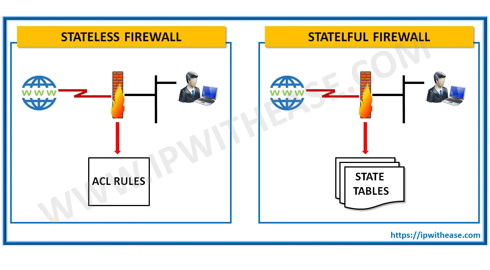
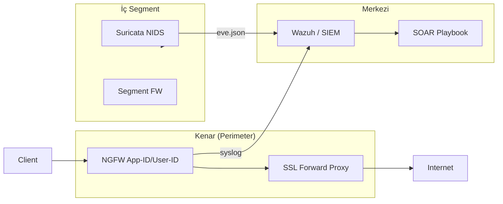
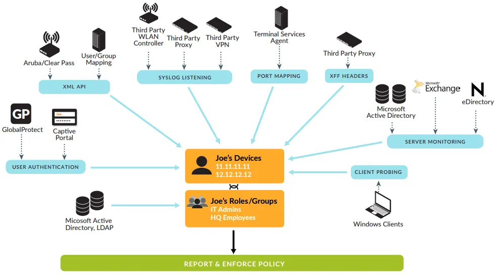
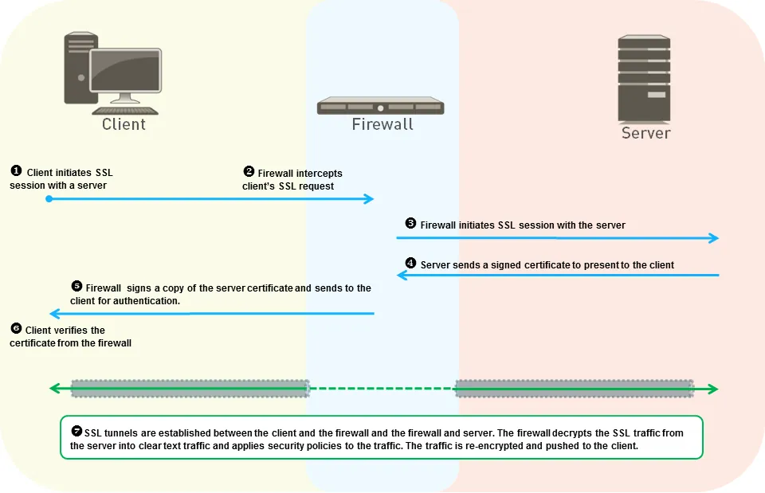

# Yeni Nesil Güvenlik Duvarları (NGFW), IDS/IPS ve Ağ Görünürlüğü (DPI)

Savunma Derinliği (Defense in Depth) mimarisinde ağ katmanı, yalnızca "dışarıdan geleni engelle" yaklaşımından çok daha fazlasıdır. Kurumsal topolojide **perimeter (kenar)** noktasında konuşlandırılan NGFW'ler ingress/egress trafiğini kontrol ederken; iç segmentasyon duvarları (tier'lar arası, DMZ–iç ağ, bulut–on-prem), doğu-batı trafiğini de görünür ve denetlenebilir hâle getirir. Bu bileşenler, **NIST SP 800-53 Rev. 5 SC-7 (Boundary Protection)** ve **SI-4 (System Monitoring)** kontrollerini doğrudan karşılar; **CIS Controls v8** Control 12 (Network Infrastructure Management) ve Control 13 (Network Monitoring and Defense) ile hizalanır.

Türkiye'de **KVKK Madde 12** kapsamında kişisel verilerin işlendiği sistemlerde teknik tedbir olarak güvenlik duvarı, izleme ve loglama zorunludur. **5651 sayılı Kanun** kapsamında umuma açık internet erişimi sağlayan işletmeler (misafir Wi-Fi, şube hotspot vb.) trafik loglarını belirli süre saklamakla yükümlüdür. Bankacılık ve kritik sektörlerde **BDDK** bilgi sistemleri düzenlemeleri, ileri tehdit koruması, merkezi loglama ve SIEM kullanımını şart koşar. NGFW'lerin detaylı loglama, App/User-ID ve şifreli trafik görünürlüğü yetenekleri bu yasal yükümlülükleri karşılamada temel yapı taşıdır.

Aşağıdaki diyagram, savunma derinliği katmanları içinde NGFW, IDS/IPS ve izleme bileşenlerinin bütünsel konumunu göstermektedir:





<details>
<summary>🛡️ NGFW Politika Optimizasyon Kontrol Listesi</summary>

1. **Spesifikten genele sıralama** — shadowing önlenir
2. **`application-default` servis** — port tünelleme engellenir
3. **User-ID entegrasyonu** — IP yerine kullanıcı bazlı kural
4. **90 gün sıfır hit** — atıl kurallar devre dışı
5. **SSL decrypt bypass** — finans/sağlık kategorileri hariç
6. **T1562.004 izleme** — FW kural değişiklikleri SIEM'de

**Palo Alto Policy Optimizer:** Kullanılmayan ve port-tabanlı kuralları App-ID'ye dönüştürün.

</details>

---

## §6.2.1. Durum Bilgili (Stateful) ve Durumsuz (Stateless) Paket Filtreleme

Güvenlik duvarlarının evriminde dört kuşaktan söz edilebilir. Günümüzde SOC mimarları, bu kuşakları katmanlı olarak bir arada kullanır: edge router'da stateless ACL, perimeter'da stateful/NGFW, iç segmentlerde IDS/IPS sensörleri.

| **Kuşak** | **Dönem** | **Temel Özellik** | **OSI Katmanı** |
|-----------|-----------|-------------------|-----------------|
| 1. Kuşak (Stateless) | 1980'ler | Paket bazlı filtreleme, bağlam yok | L3–L4 |
| 2. Kuşak (Stateful) | 1990'lar | Bağlantı durumu takibi, dinamik kurallar | L3–L4 |
| 3. Kuşak (Application Layer) | 2000'ler | L7 analizi, proxy tabanlı | L7 |
| 4. Kuşak (NGFW) | 2010+ | App-ID, User-ID, Content-ID, DPI | L2–L7 |

### Durumsuz (Stateless) Filtreleme

**Durumsuz (Stateless) filtreleme**, her paketi bağımsız olarak inceler; kaynak/hedef IP, port ve protokol bilgisine göre karar verir. Bağlantı durumu (state) tutulmaz. Bu yaklaşım yüksek performanslıdır — ASIC/FPGA üzerinde line-rate hızlarda çalışabilir — ancak bağlamdan yoksundur.

**Sınırlamaları:**
- Dinamik port kullanan protokolleri (FTP aktif/pasif mod, SIP, H.323) yönetemez; geniş port aralıkları açmak gerekir.
- Her yön için ayrı kural tanımlanmalıdır (inbound + outbound).
- IP spoofing ve TCP bayrak manipülasyonlarına karşı zayıftır.

**Operasyonel senaryo:** Stateless filtreleme ile `192.168.1.0/24` ağından `10.0.0.5` sunucusuna 443 portuna izin verilir. Saldırgan, kaynak IP'sini spoof'layabilir veya yetkili bir istemciyi ele geçirerek yetkisiz erişim sağlayabilir.

### Durum Bilgili (Stateful) Filtreleme

**Durum Bilgili (Stateful) filtreleme**, bağlantı durumunu bir **state table (conntrack)** içinde tutar. TCP üçlü el sıkışması (SYN → SYN-ACK → ACK) izlenir; `ESTABLISHED` bağlantılar için ayrı kurallar uygulanabilir.

```
İstemci                    Güvenlik Duvarı                    Sunucu
   |                              |                              |
   |------ [1] TCP SYN ---------->| (Oturum Yok, Kural Kontrolü) |
   |                              | (Durum: INIT → SYN_SENT)     |
   |                              |------ [2] TCP SYN ----------->|
   |                              |                              |
   |                              |<----- [3] TCP SYN-ACK --------|
   |<----- [4] TCP SYN-ACK -------| (Durum: SYN_RECV)            |
   |------ [5] TCP ACK ---------->| (Durum: ESTABLISHED)         |
   |                              |------ [6] TCP ACK ----------->|
```

Durum tablosu, her aktif oturum için kaynak/hedef IP, port, protokol, TCP ardışık numaraları ve durum bayraklarını hafızada tutar. Dış ağdan gelen bir paket, tablodaki mevcut oturum kaydıyla eşleşiyorsa kural tabanı baştan taranmadan geçişine izin verilir.

**Avantajları:**
- IP spoofing saldırıları büyük ölçüde engellenir.
- Yetkisiz oturum enjeksiyonu tespit edilir.
- Dinamik portlu protokoller session helper'lar ile güvenli yönetilir.

| **Mimari Parametre** | **Durumsuz (Stateless)** | **Durum Bilgili (Stateful)** |
|:---------------------|:-------------------------|:-----------------------------|
| **OSI Katmanı** | L3–L4 | L3–L4 ve kısmi L5 |
| **Bellek Kaynağı** | Minimal statik bellek | Yüksek dinamik RAM (oturum tablosu) |
| **Gecikme** | Mikrosaniyeler, line-rate | Oturum arama nedeniyle ek gecikme |
| **Protokol Esnekliği** | Dinamik portları yönetemez | Session helper ile dinamik port yönetimi |
| **Saldırı Direnci** | TCP bayrak manipülasyonlarına zayıf | Spoofing ve sahte bağlantıları engeller |
| **Operasyonel Risk** | Kural karmaşıklığı, insan hatası | State table exhaustion (DoS) |

### Ofansif ve Defansif Tehdit Modeli

**Ofansif yaklaşım (saldırı vektörleri):**

| **Saldırı Tekniği** | **Açıklama** | **MITRE ATT&CK** |
|---------------------|--------------|------------------|
| TCP Bayrak Manipülasyonu | SYN bayrağı kaldırılıp yalnızca ACK/RST set edilerek stateless filtre atlatılır | — |
| State Table Exhaustion | Spoof edilmiş SYN flood ile durum tablosu doldurulur | T1499.001 |
| Firewall Rule Modification | Güvenlik duvarı kuralları eklenir/silinir/değiştirilir | **T1562.004** |
| DNS Tunneling | UDP 53 üzerinden veri kaçırma veya C2 kanalı | T1572 |

**Defansif yaklaşım (mavi takım kontrolleri):**

- **TCP SYN Cookies:** Üçlü el sıkışmanın son ACK paketi gelene kadar durum tablosunda oturum açılmasını erteleyen mekanizma. El sıkışma parametreleri TCP sıra numarasına kriptografik olarak kodlanır.
- **Agresif Zaman Aşımı (Aggressive Aging):** Half-open veya idle oturumların timeout süreleri dinamik olarak düşürülür.
- **Zone Protection:** Kaynak IP başına saniyede kabul edilebilecek maksimum SYN paket limiti (threshold) tanımlanır.

> **Kontrol Eşlemesi:** NIST SP 800-41 Rev. 1 (Guidelines on Firewalls and Firewall Policy), SC-7 Boundary Protection; CIS Controls v8 **12.2** (Secure Network Architecture), **13.4** (Traffic filtering between segments).

> **Operasyonel Not:** Perimeter'da stateless bir cihaz kullanıldığında saldırgan sahte kaynak IP ile iç sunucuya SYN paketi gönderebilir. Stateful NGFW ise state table'da bu bağlantıyı "half-open" olarak işaretler ve threshold aşıldığında drop veya tarpit uygular. İç segmentasyonda stateless nadiren tercih edilir; performans kazanımı yerine görünürlük kaybı ağır basar.

---

## §6.2.2. Yeni Nesil Güvenlik Duvarları (NGFW): App-ID, User-ID, Content-ID ve FortiGate

NGFW'ler, port/protokol bazlı kararların ötesine geçerek trafiği **uygulama kimliği (App-ID)**, **kullanıcı kimliği (User-ID)** ve **içerik analizi (Content-ID)** seviyelerinde bütünsel olarak değerlendirir. Geleneksel stateful firewall'lar (örneğin eski ASA modları) yalnızca "Port 80 = HTTP" görebilirken; NGFW, 443 portundan geçen trafiğin gerçekten HTTPS mi yoksa tünellenmiş BitTorrent veya Tor mu olduğunu ayırt eder.

### Palo Alto Networks: SP3 Mimarisi ve Üç Temel Teknoloji

Palo Alto Networks, geleneksel UTM cihazlarının paketleri ardışık tarama motorlarından (daisy-chaining) geçirirken yaşadığı performans kayıplarını önlemek amacıyla **Single-Pass Parallel Processing (SP3)** mimarisini geliştirmiştir. Kontrol düzlemi (Control Plane) ile veri düzlemi (Data Plane) fiziksel olarak ayrılmıştır; yönetim arayüzündeki commit işlemleri paket iletim performansını etkilemez.

**App-ID (Uygulama Tanımlama):** Port tabanlı yaklaşımı terk ederek trafiği uygulama bazında sınıflandırır. Tanımlama aşamaları:

1. **IP ve Port Kontrolü** — Temel erişim kurallarına göre değerlendirme
2. **SSL/SSH Deşifre** — Şifreli trafik tanımlı politikaya göre çözülür
3. **Protokol Kod Çözücüler (Decoders)** — HTTP, FTP, SMTP vb. protokollerin tünellenip tünellenmediği analiz edilir
4. **Uygulama İmzaları (Signatures)** — Uygulamaya özgü veri kalıpları aranır
5. **Hezarfen/Sezgisel Analiz** — İmzalarla eşleşmeyen karmaşık protokoller için davranışsal analiz

**User-ID (Kullanıcı Tanımlama):** IP adresi yerine kullanıcı kimliğine dayalı politika oluşturmayı sağlar. Active Directory, LDAP, Kerberos, Captive Portal, GlobalProtect, WMI probing ve syslog listening gibi kaynaklardan IP–kullanıcı eşleştirme tabloları beslenir. En az ayrıcalık prensibinin uygulanmasında kritik rol oynar.



**Content-ID (İçerik Tanımlama):** URL filtreleme, virüs tespiti, dosya bloklama ve veri sızıntısı önleme (DLP) gibi güvenlik profillerini tek motorda birleştirir.

**Palo Alto CLI — User-ID ve oturum sorgulama:**

```bash
# Aktif kullanıcı eşleştirme tablosunu görüntüleme
show user ip-user-mapping all

# Belirli bir IP adresine ait User-ID detaylarını sorgulama
show user ip-user-mapping ip 192.168.201.10

# Güvenlik duvarının aktif durum tablosu istatistiklerini alma
show session info

# Belirli bir aktif oturumun detaylarını izleme
show session id 459203
```

### Fortinet FortiGate: Flow-based vs Proxy-based Muayene

FortiGate NGFW'lerde uygulama kontrolü, **FortiGuard Application Control Service** üzerinden sağlanır. Güvenlik politikaları altındaki UTM servisleri iki farklı muayene modunda çalışabilir:

| **Özellik** | **Flow-based (Akış Tabanlı)** | **Proxy-based (Vekil Sunucu)** |
|:------------|:------------------------------|:-------------------------------|
| **Çalışma Prensibi** | Paketler on-the-fly analiz edilir | Bağlantı L4'te sonlandırılır, iki ayrı TCP oturumu |
| **Gecikme** | Son derece düşük | Milisaniyeler düzeyinde ek gecikme |
| **Dosya Bütünlüğü** | Tam reassembly yapılmaz | Tam dosya birleştirme ve derin inceleme |
| **Kullanım Alanı** | Yüksek throughput segmentleri | DLP, CDR, karmaşık protokol incelemesi |
| **Bellek Tüketimi** | Düşük | Yüksek |

**FortiOS CLI — Proxy modu ve oturum tablosu:**

```bash
# Güvenlik politikası üzerinde proxy modunun aktif edilmesi
config firewall policy
    edit 12
        set action accept
        set inspection-mode proxy
        set ssl-ssh-profile "deep-inspection"
    next
end

# GUI'de inspection-mode seçeneğini görünür kılma (FortiOS 7.2.4+)
config system settings
    set gui-proxy-inspection enable
end

# Oturum tablosu sorgulama
get system session status
diagnose sys session filter clear
diagnose sys session filter src 192.168.10.10
diagnose sys session filter dport 443
diagnose sys session list
```

> **Önemli:** FortiOS 7.4.4+ sürümünden itibaren 2 GB RAM kapasitesine sahip giriş seviyesi modellerde (FortiGate 30G, 40F, 50G, 60E, 60F, 80E, 90E serileri) proxy-based güvenlik özellikleri kaldırılmıştır. Bu cihazlar yalnızca flow-based modda çalışabilir.

### Kural Optimizasyonu ve En İyi Uygulamalar

Büyük ölçekli kurumsal ağlarda binlerce güvenlik kuralından oluşan hiyerarşik yapıların optimize edilmesi, cihazın paket işleme performansını doğrudan artırır.

**Palo Alto Policy Optimizer prensipleri:**

1. **Spesifikten Genele Sıralama (Shadowing Önleme):** En spesifik kurallar en üste, genel kurallar en alta yerleştirilmelidir. Aksi takdirde genel kural spesifik kuralı "gölgeleyebilir" (shadowing).
2. **Rulebase Küçültme:** Aynı kaynak/hedef zona ve servise sahip kurallar birleştirilmeli; Application Group ve Address Group nesneleri kullanılmalıdır.
3. **Application-Default Servis:** `application-default` servisi ile yalnızca ilgili uygulamanın standart portlarına izin verilir. SSH yalnızca port 22'den geçer; port 80 üzerinden tünellenen sahte SSH istekleri otomatik engellenir.
4. **Policy Optimizer Kullanımı:** Kullanılmayan kuralları, 90 gün boyunca sıfır hit almış atıl kuralları ve port tabanlı kuralları App-ID tabanlı kurallara dönüştürmek için periyodik analiz yapılmalıdır.

**Örnek Palo Alto güvenlik politikası (App-ID + User-ID):**

```
Rule: Finance-ERP-Access
  Source Zone: trust
  Source User: cn=Finance,ou=Groups,dc=corp,dc=local
  Destination Zone: dmz
  Application: sap, oracle-ebs
  Service: application-default
  Action: allow
  Profile: strict-threat-prevention
  Log: session-end
```

> **Saldırı/Savunma Dengesi:**
> - **Ofansif:** Saldırgan, izin verilen bir uygulamayı (web-browsing, Slack) tünel olarak kullanır (C2, data exfiltration). Phishing ile ele geçirilen kullanıcı kimliğiyle "normal" görünen trafik üretir.
> - **Defansif:** App-ID + User-ID + Content-ID + Threat Prevention kombinasyonu ile anomalous uygulama kullanımı veya kullanıcı davranışı (geo-anomali + yeni uygulama) tespit edilir. Policy Optimizer ile kural karmaşıklığı azaltılarak insan hatası minimize edilir.

---

## §6.2.3. İmza Tabanlı ve Anomali Tabanlı IDS/IPS Sistemleri

Saldırı Tespit ve Engelleme Sistemleri (IDS/IPS), ağ sınırında veya segmentler arasında derinlemesine tehdit analizi gerçekleştirir. **NIST SP 800-94** (Guide to Intrusion Detection and Prevention Systems) dört IDPS sınıfını tanımlar: network-based, wireless, network behavior analysis (NBA) ve host-based.

### IDS ve IPS Arasındaki Temel Fark

| **Özellik** | **IDS (Intrusion Detection System)** | **IPS (Intrusion Prevention System)** |
|:------------|:-------------------------------------|:--------------------------------------|
| **Konum** | Out-of-band (SPAN port/TAP) | In-line (trafik akışında) |
| **Aksiyon** | Pasif izleme, alarm üretir | Aktif müdahale, paket düşürür |
| **Gecikme** | Yok | Potansiyel latency |
| **Yanlış Pozitif Etkisi** | Alarm yorgunluğu | İş kesintisi |
| **Bypass Riski** | Yok (trafiği etkilemez) | Cihaz arızasında failover gerekir |

### Tespit Metodolojileri

**NIST SP 800-94** üç tespit metodolojisini tanımlar:

| **Yöntem** | **Prensip** | **Avantaj** | **Dezavantaj** |
|:-----------|:------------|:------------|:---------------|
| **İmza Tabanlı** | Bilinen tehdit pattern'i ile karşılaştırma | Bilinen tehditlerde yüksek doğruluk, düşük FP | Zero-day, polimorfik saldırılara kör |
| **Anomali Tabanlı** | Normal davranış taban çizgisi (baseline) öğrenme | Zero-day ve APT tespiti | Yüksek yanlış pozitif, tuning gerektirir |
| **Stateful Protocol Analysis** | Protokol spesifikasyonuna uyum kontrolü | Protokol ihlallerini yakalar | Protokol güncellemeleriyle uyum sorunu |

Modern IDS/IPS sistemleri her iki yöntemi birleştirir. Makine öğrenmesi destekli modeller, yavaş keşif (slow-and-low reconnaissance) ve yanal hareket (lateral movement) gibi ince kalıpları tespit edebilir.

### Snort ve Suricata: Açık Kaynak NIDS/NIPS

**Snort** (Cisco/Sourcefire), tek iş parçacıklı mimariye sahip olup Talos ve Emerging Threats rule set'leriyle geniş imza kütüphanesi sunar.

**Suricata** (OISF), çok iş parçacıklı (multi-threaded) yapısıyla modern çok çekirdekli işlemcileri tam kullanır. Protocol detection port-agnostic çalışır; Snort kurallarıyla uyumludur.

**Örnek Snort/Suricata imzası — SMBv1 DoublePulsar:**

```
alert tcp $HOME_NET any -> $EXTERNAL_NET 445 (msg:"ET EXPLOIT SMBv1 DoublePulsar";
flow:to_server,established; content:"|ff 53 4d 42 72 00 00 00 00 18 53 c8|";
classtype:attempted-admin; sid:2024213; rev:2;)
```

**Örnek Suricata kuralı — SQL Injection:**

```
alert tcp $EXTERNAL_NET any -> $HTTP_SERVERS $HTTP_PORTS (
    msg:"WEB-APP SQLi Union-Based Exploit Attempt";
    flow:to_server,established;
    content:"UNION"; nocase;
    content:"SELECT"; nocase; within:20;
    classtype:web-application-attack; sid:9000001; rev:1;)
```

**Örnek Suricata kuralı — JA3 TLS parmak izi (şifreli C2 tespiti):**

```
alert tls any any -> any any (
    msg:"ZARARLI - C2 JA3 Parmak Izi Tespit Edildi";
    ja3_hash; content:"1eede9d19dc45c2cb66d2f5c6849e843";
    classtype:trojan-activity; sid:9000002; rev:1;)
```

### Suricata Performans Yapılandırması

Yüksek performanslı 10 Gbps+ ağ segmentlerinde Suricata'nın **Workers** modu tercih edilir. Her worker thread tam paket işleme hattını (yakalama, decode, TCP reassembly, imza tarama, loglama) kendi içinde barındırır.

```yaml
# suricata.yaml — Performans ve iş parçacığı yönetimi
threading:
  set-cpu-affinity: yes
  cpu-affinity:
    - management-cpu-set:
        cpu: [ 0, 1 ]
        mode: "exclusive"
        prio: "low"
    - worker-cpu-set:
        cpu: [ "2-15" ]
        mode: "exclusive"
        prio: "high"

af-packet:
  - interface: eth1
    cluster-id: 99
    cluster-type: cluster_flow
    defrag: yes
    use-mmap: yes
    mmap-locked: yes
    tpacket-v3: yes
    ring-size: 30000
```

### Wazuh ile IDS/IPS Entegrasyonu

Wazuh, açık kaynaklı bir SIEM/XDR platformudur ve Suricata ile entegre olarak NIDS görevi görebilir. Suricata `eve.json` çıktısı Wazuh agent veya rsyslog ile toplanır; alert'ler SIEM dashboard'unda zenginleştirilir.

```bash
# Suricata kurulumu ve imza güncellemesi
apt-get install suricata
suricata-update

# Wazuh agent konfigürasyonu (/var/ossec/etc/ossec.conf)
<localfile>
  <log_format>syslog</log_format>
  <location>/var/log/suricata/eve.json</location>
</localfile>
```

Wazuh'un **active response** özelliği ile IPS işlevselliği sağlanabilir: SSH brute-force saldırısı tespit edildiğinde iptables ile saldırgan IP'si otomatik engellenebilir.

**Suricata EVE JSON alert örneği:**

```json
{
  "timestamp": "2026-03-20T14:32:01.124566+0300",
  "event_type": "alert",
  "src_ip": "198.51.100.45",
  "dest_ip": "10.100.12.5",
  "dest_port": 80,
  "alert": {
    "signature": "WEB-APP SQLi Union-Based Exploit Attempt",
    "category": "Web Application Attack",
    "severity": 1
  },
  "http": {
    "hostname": "finans.kurum.com",
    "url": "/api/v1/products?id=1%20UNION%20SELECT%20username,password%20FROM%20users",
    "http_user_agent": "Mozilla/5.0 (Kali-Linux; sqlmap/1.8.2)"
  }
}
```

### DNS Tünelleme ve Shannon Entropisi

DNS tünelleme, saldırganların UDP 53 portunun genellikle denetimsiz bırakılmasını istismar ederek veri kaçırma veya C2 kanalı kurma yöntemidir. Geleneksel imza tabanlı sistemler sürekli değişen alt alan adlarını (DGA) yakalayamaz; bu noktada istatistiksel anomali tespiti devreye girer.

**Shannon Entropisi** ile alt alan adlarının rastgeleliği ölçülür:
- Doğal dil alan adları (google.com): entropi 2.0–3.5
- Base64/Hex kodlanmış tünellenmiş veriler: entropi > 4.5

> **Kontrol Eşlemesi:** NIST SP 800-94 (IDPS rehberi); CIS Controls v8 **13.2** (Deploy IDS/IPS), **13.6** (Collect network traffic flow logs), **13.7** (Deploy host-based IDS/IPS); MITRE ATT&CK **T1071** (Application Layer Protocol), **T1573** (Encrypted Channel).

> **Operasyonel Not:** İmza tabanlı sistem bilinen Emotet C2'yi anında drop eder. Custom implant'lı APT ise düşük ve yavaş beaconing ile imza kaçırır; anomali motoru (traffic volume + timing + JA3/JA4 fingerprint) + Wazuh korelasyonu ile SOC'a alert düşer. JA3'ün TLS Extension Permutation zafiyeti nedeniyle JA4'e geçiş değerlendirilmelidir.

---

## §6.2.4. Derin Paket İncelemesi (DPI) ve SSL İleri Proxy (SSL Forward Proxy)

Trafiğin %80–90'ı HTTPS/TLS ile şifrelenmiştir. Geleneksel firewall'lar yalnızca header görür. **Derin Paket İncelemesi (DPI)**, paketlerin yalnızca başlık bilgilerini değil, uygulama katmanındaki gerçek veriyi (payload) de analiz eden teknolojidir.

DPI şunları mümkün kılar:
- Uygulama tanımlama (App-ID)
- Kötü amaçlı yazılım tespiti
- Veri sızıntısı önleme (DLP)
- İçerik filtreleme

### SSL Forward Proxy Çalışma Mekanizması

TLS ile şifrelenmiş bir paketin içini doğrudan göremeyen DPI sistemleri, **SSL İleri Proxy (SSL Forward Proxy)** ile şifreli trafiği analiz eder. NGFW, iki ayrı oturum oluşturur — (1) istemci↔NGFW, (2) NGFW↔sunucu — ve "meddler in the middle" (onaylı MitM) olarak çalışır.



**Adım adım işleyiş:**

1. **İstemci İsteği:** Kurumsal iç ağdaki istemci, dışarıdaki şifreli bir web sitesine TLS Client Hello başlatır.
2. **Güvenlik Duvarı Araya Girişi:** Sınırda konumlanan NGFW isteği yakalar, istemci adına oturumu sonlandırır ve gerçek sunucuya yeni bir TLS bağlantı isteği gönderir.
3. **Sunucu Doğrulama:** Gerçek sunucunun sertifikası geçerliliği OCSP/CRL ile kontrol edilir.
4. **Taklit Sertifika Oluşturma:** Kurumsal CA (Forward Trust CA) anahtarıyla, dış sunucunun sertifika bilgilerini kopyalayan anlık bir taklit sertifika üretilir.
5. **İstemciye Güven İlişkisi:** İstemci bilgisayar, kurumsal Root CA sertifikasına önceden güvendiği için (GPO/MDM ile dağıtılmış) bağlantıyı kabul eder.
6. **Deşifre ve Analiz:** İki ayrı şifreli tünel kurulur; NGFW veriyi deşifre eder, IPS/Antivirüs/DLP motorlarından geçirir ve yeniden şifreleyerek iletir.

```
İç İstemci ──(1) TLS Client Hello──> NGFW ──(2) TLS Client Hello──> Dış Sunucu
                <──(5) Taklit Sertifika──  <──(3) Sunucu Sertifikası──
                <=(6) Şifreli Oturum-1=>   [Deşifre → DPI → Yeniden Şifrele]
```

### Hangi Trafik Deşifre Edilmeli?

| **Deşifre Edilmeli** | **Deşifre Edilmemeli** |
|:---------------------|:-----------------------|
| İnternet erişimi (genel web trafiği) | Finansal kurum trafiği (bankacılık) |
| Kurumsal e-posta (politikaya göre) | Sağlık verileri (hasta mahremiyeti) |
| Dosya paylaşımı | Yasal olarak korunan iletişim |
| Genel bulut uygulamaları | Certificate Pinning kullanan uygulamalar |

### Teknik Kısıtlar ve Bypass Teknikleri

- **Certificate Pinning:** Mobil uygulamalar ve bulut servisleri (Microsoft 365, Zoom) sunucu sertifikasını iç hash değerleriyle doğrular. Taklit sertifika tespit edilince bağlantı kopar; IP/URL bazlı istisna listesine eklenmelidir.
- **Encrypted Client Hello (ECH):** SNI bilgisini şifreleyerek metadata tabanlı kontrolü zayıflatır.
- **DNS over HTTPS (DoH):** DNS sorgularını şifreli kanaldan ileterek DNS tabanlı politika uygulamasını atlatır.
- **Performans Etkisi:** SSL decrypt işlemi işlemci yoğun bir operasyondur. Donanımsal hızlandırma (ASIC/FPGA) olmadan ciddi performans düşüşü yaşanabilir.

> **Uyarı:** SSL decrypt ile elde edilen kişisel verilerin işlenmesi **KVKK** kapsamında kişisel veri işleme faaliyetidir. Meşru menfaat, şeffaflık, veri minimizasyonu ve gerekirse DPIA (Veri Koruma Etki Değerlendirmesi) zorunludur. Finans, sağlık ve kişisel e-posta kategorileri bypass listesine alınmalıdır.

> **Önemli:** Bypass edilen trafikler için bile **Server Certificate Verification** özelliği aktif tutulmalıdır. Güvenlik duvarı şifreyi çözmese dahi sunucu sertifikasının geçerliliğini denetlemeli ve geçersiz imzalı oturumları sonlandırmalıdır.

**Saldırı/Savunma Dengesi:**
- **Ofansif:** Saldırgan ECH + DoH kullanarak SNI ve DNS tabanlı kontrolü atlatır; pinned sertifikalı custom implant ile decryption proxy'yi bypass eder.
- **Defansif:** Selective decryption + App-ID + behavioral anomaly + Suricata metadata analizi + SIEM korelasyonu. Certificate Transparency log'ları izlenir; pinning'i aşan uygulamalar için MDM politikaları uygulanır.

---

## §6.2.5. Standartlar ve Türkiye Mevzuatı Uyumu

Kurumsal ağ güvenliği mimarisi, yalnızca teknik gereksinimlerle değil, uluslararası standartlar ve yerel yasal yükümlülüklerle de doğrudan uyumlu olmak zorundadır.

### Uluslararası Standartlar ve Çerçeveler

| **Standart/Framework** | **İlgili Kontroller** | **NGFW/IDS/IPS İlişkisi** |
|:-----------------------|:----------------------|:--------------------------|
| **NIST SP 800-41 Rev. 1** | Firewall policy, DMZ tasarımı | Güvenlik duvarı konumlandırma ve kural yönetimi |
| **NIST SP 800-94** | IDPS seçimi, konumlandırma, tuning | IDS/IPS metodolojileri ve operasyonel rehber |
| **NIST SP 800-53 Rev. 5** | SC-7, AC-4, SI-3, SI-4 | Sınır koruması, bilgi akış kontrolü, izleme |
| **CIS Controls v8** | Control 12, Control 13 | Ağ altyapısı yönetimi, ağ izleme ve savunma |
| **ISO 27001:2022** | A.8.20–A.8.23 | Ağ güvenliği, segmentasyon, web filtreleme |
| **PCI DSS** | Requirement 11.4 | IDS/IPS dağıtımı |
| **MITRE ATT&CK** | TA0005 Defense Evasion | Güvenlik kontrollerini atlama teknikleri |

**MITRE ATT&CK T1562 — Impair Defenses** tekniği, saldırganların sistem güvenlik kontrollerini devre dışı bırakmasını veya değiştirmesini kapsar:

| **Alt Teknik** | **Açıklama** | **Savunma** |
|:---------------|:-------------|:------------|
| **T1562.004** | Disable or Modify System Firewall | Kural değişikliklerinin SIEM entegrasyonu ve değişiklik yönetimi |
| **T1562.007** | Disable or Modify Cloud Firewall | Bulut güvenlik grubu değişikliklerinin izlenmesi ve MFA koruması |

> **Kontrol Eşlemesi:** CIS Controls v8 **12.2** (Secure Network Architecture), **12.5** (Centralize AAA), **13.2** (Deploy IDS/IPS), **13.4** (Traffic filtering between segments), **13.6** (Collect network traffic flow logs), **13.7** (Deploy host-based IDS/IPS).

### Türkiye Mevzuatı

#### 5651 Sayılı Kanun

**5651 Sayılı Kanun** ("İnternet Ortamında Yapılan Yayınların Düzenlenmesi ve Bu Yayınlar Yoluyla İşlenen Suçlarla Mücadele Edilmesi Hakkında Kanun") kapsamında:

- İnternet erişimi sağlayan işletmelerin ağ trafiğini loglaması zorunludur.
- **Toplu kullanım sağlayıcılar** (oteller, kafeler, kurumsal Wi-Fi): erişim loglarını **en az 2 yıl** saklamalıdır.
- **Erişim sağlayıcılar:** trafik bilgisini **1 yıl** saklamalıdır.
- Loglar **TÜBİTAK KamuSM zaman damgası** ile imzalanmalıdır; imzasız loglar mahkemede delil vasfını kaybedebilir.

**Tutulması gereken veri seti:**

| **Log Bileşeni** | **İçerik** | **Yasal Dayanak** |
|:-----------------|:-----------|:------------------|
| İç IP & MAC Dağıtım | DHCP/MAC eşleşmesi, başlangıç/bitiş zamanı | 5651 Madde 15/A |
| Dış Trafik / NAT | Kaynak/hedef IP, port, NAT dönüşümleri, protokol | 5651, BTK düzenlemeleri |
| Zaman Damgası | TÜBİTAK KamuSM API ile günlük imzalama | 5070 Sayılı Elektronik İmza Kanunu |

**TÜBİTAK KamuSM zaman damgası süreci:**

```
[Günlük Log Arşivi] → [SHA256 Hash] → [TÜBİTAK KamuSM Sunucusu]
                                              ↓
[İmzalı Zaman Damgası (.ts)] ← [HSM İmzası + Atomik Saat]
```

#### KVKK (6698 Sayılı Kişisel Verilerin Korunması Kanunu)

- SSL decrypt ile elde edilen kişisel verilerin işlenmesinde açık rıza veya kanuni dayanak gereklidir.
- Log verilerinde **kişisel veri minimizasyonu** prensibi uygulanmalıdır.
- User-ID ve DPI teknolojileri kullanılırken aydınlatma metni zorunludur.
- Veri ihlali durumunda KVKK Kurulu'na bildirim yükümlülüğü vardır.

#### BDDK Siber Güvenlik Düzenlemeleri

**Bankaların Bilgi Sistemleri ve Elektronik Bankacılık Hizmetleri Hakkında Yönetmelik** (RG 31069, 15 Mart 2020) kapsamında:

- Güvenlik duvarı ve IDS/IPS sistemleri zorunlu olarak tesis edilmelidir.
- Düzenli sızma testleri ve güvenlik açığı taramaları zorunludur.
- Çok katmanlı savunma mimarisi şarttır; **KSOME** (Kurumsal Siber Olaylara Müdahale Ekibi) kurulmalıdır.
- Birincil ve ikincil sistemler **yurt içinde** konumlandırılmalı; felaket senaryosunda en geç **24 saat** içinde faaliyet sürdürülebilirliği sağlanmalıdır.
- İnternet bankacılığı sunucu segmentleri iç kullanıcı ağlarından tamamen izole edilmeli; sınır geçişlerindeki tüm trafik DPI ile loglanmalı ve DLP süreçlerine tabi tutulmalıdır.

| **Loglama Bileşeni** | **Minimum Saklama** | **Teknik Doğrulama** | **Operasyonel Risk** |
|:---------------------|:--------------------|:---------------------|:---------------------|
| İç IP & MAC Dağıtım | 2 yıl | DHCP–MAC tam eşleşmesi | Adli olaylarda sorumluluk, idari para cezası |
| Dış Trafik / NAT | 2 yıl | NGFW oturum loglarında NAT dönüşümleri | Eksik NAT logu → suç tespit edilememesi |
| Zaman Damgası | 2 yıl | TÜBİTAK KamuSM API ESYA kütüphanesi | İmzasız logların mahkemede geçersizliği |
| Kişisel Veri Erişim | Politikaya göre | MFA korumalı erişim, değiştirilemez ortam | KVKK ihlali → yüksek idari para cezası |

---

## §6.2.6. Mimari Özet ve Tavsiyeler

Büyük ölçekli kurumsal yapılarda savunma derinliği felsefesine uygun, yüksek performanslı ve yasal mevzuatlarla tam uyumlu bir sınır ve iç ağ güvenlik mimarisi tesis etmek için aşağıdaki katmanlı yaklaşım önerilir.

### Referans Mimari

| **Katman** | **Cihaz / Sensör** | **Konum** | **Temel İşlevler** | **Log / Entegrasyon** |
|:-----------|:-------------------|:----------|:-------------------|:----------------------|
| Perimeter | Palo Alto / FortiGate NGFW | Internet edge | App-ID, User-ID, Threat Prevention, SSL Decrypt (selective) | Syslog / API → SIEM |
| İç Segmentasyon | Sanal NGFW veya NSX/ACI | Tier'lar arası (Web-App-DB) | Mikrosegmentasyon, east-west görünürlük | Aynı SIEM |
| Ağ Görünürlüğü (NIDS) | Suricata (SPAN/mirror) | Core switch span port | Full packet + signature + anomaly | eve.json → Wazuh |
| Uç Nokta | Wazuh Agent + EDR | Sunucu / İstemci | HIPS + dosya bütünlüğü + süreç izleme | Direkt Wazuh |
| Korelasyon & Uyum | Wazuh / SIEM | Merkezi | Alert zenginleştirme, KVKK/BDDK raporlama | Dashboard + SOAR |

### Uygulama Yol Haritası

**Aşama 1 — Temel görünürlük (0–30 gün):**
1. NGFW'de App-ID + User-ID bazlı politika oluştur; legacy "any-any" kurallarını dönüştür.
2. Suricata'yı SPAN/mirror port üzerinden devreye al; `eve.json` çıktısını SIEM'e bağla.
3. 5651 uyumlu loglama altyapısını kur: kaynak IP + MAC + zaman + hedef IP/port.

**Aşama 2 — Derinlemesine koruma (30–90 gün):**
4. SSL Forward Proxy'yi selective decryption ile devreye al; finans/sağlık kategorilerini bypass listesine ekle.
5. FortiGate'te kritik segmentlerde proxy-based, yüksek throughput segmentlerde flow-based muayene seç.
6. Policy Optimizer ile shadow/redundant kuralları temizle; 90 gün sıfır hit alan kuralları devre dışı bırak.

**Aşama 3 — Sürekli iyileştirme (90+ gün):**
7. Wazuh active response ile otomatik IP engelleme playbook'ları oluştur.
8. MITRE ATT&CK T1562 tekniklerine karşı güvenlik duvarı kural değişikliklerini SIEM'de izle.
9. TÜBİTAK KamuSM zaman damgası entegrasyonunu günlük otomatik imzalama ile tamamla.
10. Üç ayda bir kırmızı takım testleri ile politika tuning'i yap; false positive oranını düşür.

### Kritik Başarı Faktörleri

1. **Katmanlı Savunma:** Stateless filtreleme (edge router) + Stateful/NGFW (çekirdek) + IDS/IPS (internal segmentler). Hiçbir tek katman tek başına yeterli değildir.
2. **Kural Optimizasyonu:** Policy Optimizer araçlarıyla düzenli kural temizliği; App-ID/User-ID bazlı politikalar; `application-default` servis kullanımı.
3. **SSL Decryption Stratejisi:** Risk–gizlilik dengesi gözetilerek hassas kategoriler bypass edilmeli; bypass trafiğinde bile sertifika doğrulaması aktif tutulmalı.
4. **Log Yönetimi:** 5651 uyumlu, TÜBİTAK zaman damgalı, en az 2 yıl saklanan log altyapısı; KVKK uyumlu imha politikası.
5. **Sürekli İyileştirme:** MITRE ATT&CK T1562 tekniklerine karşı düzenli güvenlik değerlendirmesi; SIEM korelasyonu ve SOAR otomasyonu.

> **Uygulama Notu:** Bu bölümdeki öneriler, NIST SP 800-41 Rev. 1, NIST SP 800-94, NIST SP 800-53 Rev. 5, CIS Controls v8, ISO 27001:2022 ve Türkiye'deki 5651 Sayılı Kanun, KVKK ve BDDK mevzuatına uygun olarak hazırlanmıştır. Kurumlar, kendi risk profillerine göre decrypt politikalarını ve IDS/IPS konfigürasyonlarını özelleştirmelidir.

Bu bölüm, kitabın önceki bölümlerinde ele alınan Zero Trust, IAM (PAM/AAA) ve SIEM mimarileri ile birlikte okunmalıdır. Bir sonraki bölümde gelişmiş ağ saldırı vektörleri (DDoS, MitM, ARP Spoofing) ve katman 2 savunma mekanizmaları detaylandırılır.