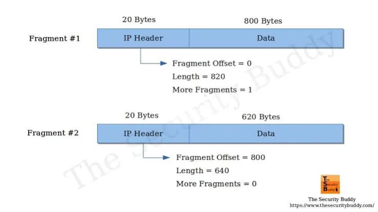
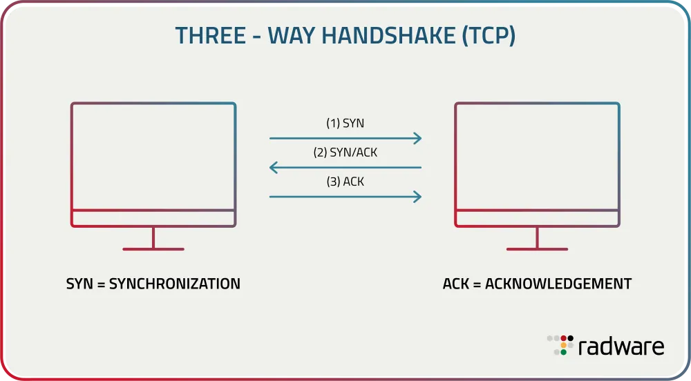
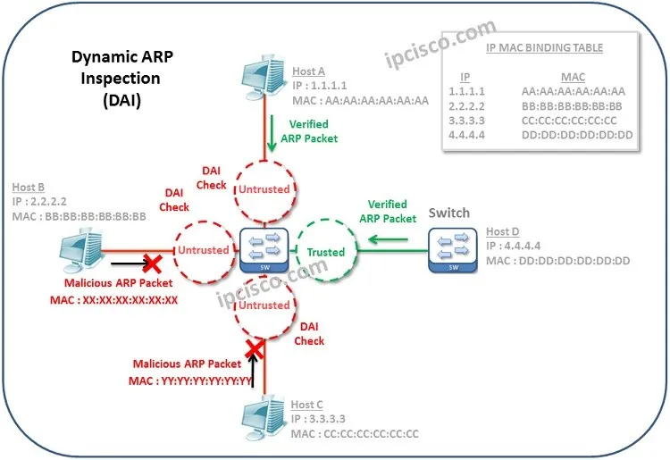
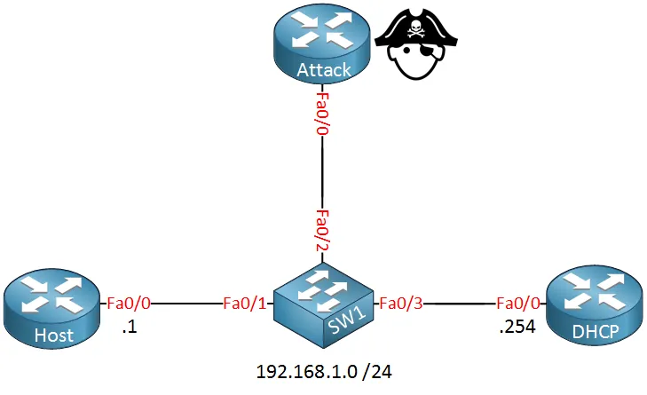

# Gelişmiş Ağ Saldırı Vektörleri ve Savunma

Kurumsal ağ altyapıları, OSI modelinin 2. ve 3. katmanlarında konumlanan çok sayıda saldırı vektörüne maruz kalmaktadır. Bu bölümde **kaynak tüketimi odaklı DDoS saldırılarından**, **oturum bazlı sömürü tekniklerine** ve **L2 seviyesinde gerçekleştirilen zehirleme saldırılarına** kadar geniş bir yelpazede, saldırganın ofansif bakış açısı ve mavi takımın defansif karşı önlemleri ele alınmaktadır.

Savunma Derinliği (Defense in Depth) mimarisinde ağ katmanı saldırıları, hem **kaynak tüketimi** (DoS/DDoS) hem de **trafik manipülasyonu** (MitM, oturum çalma) yoluyla gizlilik, bütünlük ve erişilebilirlik (CIA) üçlüsünü doğrudan tehdit eder. Tek bir kontrolün bypass edilmesi durumunda diğer katmanların hâlâ koruma sağlaması hedeflenmelidir.

---

## §6.3.1. Parçalanma (Teardrop, Fragment Overlap) Saldırıları

IP parçalanması (fragmentation), bir IP paketinin geçiş yolundaki bir bağlantının MTU (Maximum Transmission Unit) sınırını aştığında daha küçük parçalara bölünmesi sürecidir. Bu zorunlu protokol mekanizması, saldırganlar tarafından güvenlik kontrollerini atlatmak veya hedef sistemleri çökertmek amacıyla kullanılabilir.

### Teardrop ve Fragment Overlap Mekanizması

Teardrop saldırısı, hedef sistemin IP parçalarını yeniden birleştirme (reassembly) mantığındaki zafiyetleri sömüren bir DoS saldırısıdır. Bir IP paketi parçalandığında her parça şu alanları taşır:

* **Identification (Kimlik):** Orijinal paketi tanımlayan ortak değer
* **Fragment Offset (Parçalama Ofseti):** Parçanın orijinal paket içindeki konumu (8 baytlık birimlerle ifade edilir)
* **More Fragments (MF) Bayrağı:** Arkasından başka parçaların gelip gelmediğini belirtir

**Ofansif senaryo:** Saldırgan, bilinçli olarak birbiriyle çakışan (overlapping) ofset değerlerine sahip malforme IP parçaları üretir:

```
Normal parçalanma:
  Fragment 1: offset=0,   length=1480  → bayt 0-1479
  Fragment 2: offset=185, length=1500  → bayt 1480-2979

Teardrop (örtüşen yapı):
  Fragment 1: offset=0,  length=800   → bayt 0-799
  Fragment 2: offset=75, length=600   → bayt 600-1199 (örtüşme!)
```

Hedef işletim sistemi bu parçaları birleştirmeye çalışırken çakışan veriyi işleyemez. Eski veya yamalanmamış TCP/IP yığınlarında (Windows 95/NT, eski Linux çekirdekleri, SCADA/endüstriyel kontrol sistemleri) bu durum **tampon taşması (buffer overflow)**, çekirdek paniği veya sistem çökmesine yol açabilir.

**IDS/IPS evasion varyantı:** Saldırgan zararlı payload'u parçalara bölerek iletir. Durumsuz (stateless) güvenlik cihazları her parçayı ayrı ayrı tarayıp zararsız kabul edebilir; hedef sunucu parçaları birleştirdiğinde ise istismar kodu ortaya çıkar.



### IPv4 ve IPv6 Parçalanma Güvenliği

| Güvenlik Boyutu | IPv4 (RFC 791) | IPv6 (RFC 8200) |
|---|---|---|
| Parçalamayı yapan cihaz | Kaynak uç sistem veya yol üzerindeki yönlendiriciler | Yalnızca kaynak uç sistem |
| Çakışan parça politikası | Kabul edilir; "ilk gelen kazanır" veya "son gelen yazar" | Kesinlikle yasak; çakışma tespit edilirse tüm paket iptal edilir |
| IDS/IPS atlatma direnci | Düşük (durumsuz cihazlarda manipüle edilebilir) | Yüksek (belirsizlik protokol seviyesinde giderilmiş) |

### Savunma Stratejileri

| Savunma Katmanı | Uygulama |
|---|---|
| **İşletim Sistemi** | Tüm uç sistemlerin TCP/IP yığınlarının güncel tutulması |
| **Ağ Düzeyi** | Modern güvenlik duvarları ve IDS/IPS'lerin anormal offset değerlerine sahip parçaları düşürmesi |
| **Fragment Limitasyonu** | Aşırı parçalanmış paketlerin engellenmesi; fragment normalization/reassembly |
| **NGFW Zone Protection** | Palo Alto "Fragmented Packets" koruması; FortiGate DoS policy ile fragment limit |

MITRE ATT&CK bu saldırı türünü **T1498 (Network Denial of Service)** ve **T1499.004 (Application or System Exploitation)** altında sınıflandırır.

---

## §6.3.2. Kaynak Tüketimi Saldırıları: SYN Flood, Smurf ve UDP Flood

Kaynak tüketimi saldırıları, hedefin bant genişliğini, işlemci veya bellek kaynaklarını tüketerek hizmet veremez hale gelmesini amaçlar.

### TCP SYN Flood

SYN Flood, TCP üçlü el sıkışma (three-way handshake) sürecindeki asimetriyi sömüren klasik bir kaynak tüketimi saldırısıdır:

```
Meşru el sıkışma:
  İstemci ──── SYN ────────────► Sunucu (TCB tahsis edilir)
  İstemci ◄─── SYN-ACK ──────── Sunucu
  İstemci ──── ACK ────────────► Sunucu (Bağlantı kuruldu, kaynak serbest)

SYN Flood:
  Saldırgan (sahte IP) ── SYN ──► Sunucu (Yarı-açık bağlantı birikir)
  Saldırgan (sahte IP) ◄─ SYN-ACK Sunucu (ACK asla gelmez)
  ... binlerce SYN → backlog dolar → meşru istekler reddedilir
```

Saldırgan, **kaynak IP adreslerini sahteleyerek (IP spoofing)** büyük miktarda SYN paketi gönderir. Sunucu her SYN için yarı-açık bir soket (half-open socket) tahsis eder; sahte IP'ler gerçek olmadığı için ACK yanıtı gelmez ve **SYN kuyruğu (backlog)** hızla dolar.

SYN Flood iki ana türde sınıflandırılır:

* **Host Flood:** Tüm SYN paketleri tek bir hedef sunucuya gönderilir
* **Firewall Session Table Flood:** Güvenlik duvarının oturum tablosunu doldurarak arka uç trafiğini engellemeyi amaçlar



### Smurf Saldırısı (Amplification / Reflection)

Smurf saldırısı, **ICMP echo request (ping)** paketlerinin hedef IP adresini ağın broadcast adresi olarak sahteleyerek gönderilmesiyle çalışır:

1. Saldırgan, kurbanın IP'sini kaynak adres olarak taklit eder
2. ICMP Echo Request'i **directed broadcast** adresine gönderir
3. Ağdaki tüm aktif cihazlar Echo Reply ile kurbanı doldurur

Amplifikasyon faktörü, yanıt veren host sayısıyla doğru orantılıdır (tipik 20X–70X). Günümüzde çoğu ağ cihazında broadcast ping devre dışı bırakılmış olsa da, yamalanmamış altyapılarda hâlâ geçerlidir.

**Savunma:**
* Router'larda `no ip directed-broadcast` (Cisco) veya eşdeğeri
* Ingress filtering (BCP 38 / RFC 2827) — sahte paketlerin edge'de düşürülmesi
* uRPF (Unicast Reverse Path Forwarding) strict/loose mod
* ICMP rate-limiting ve ACL'ler

### UDP Flood

UDP Flood, kapalı portlara çok sayıda UDP datagram gönderilmesiyle çalışır. Hedef işletim sistemi her biri için **ICMP Destination Unreachable (Type 3, Code 3)** üretmek zorunda kalır; bu da CPU ve bant genişliğini tüketir.

**Savunma:** ICMP yanıt rate-limiting, stateless UDP flood filtreleme, edge DDoS scrubbing servisleri (Cloudflare, Akamai vb.).

---

## §6.3.3. SYN Cookie Mekanizması

SYN Cookie, RFC 4987'de tanımlanan **durumsuz (stateless)** bir savunma yöntemidir. Sunucu SYN aldığında TCB ayırmaz; bunun yerine SYN-ACK'ın Sequence Number (ISN) alanına kriptografik bir "cookie" gömer.

### Çalışma Prensibi

1. **SYN geldiğinde:** Sunucu, kaynak IP, kaynak port, hedef IP, hedef port ve gizli sunucu anahtarı kullanarak kriptografik bir cookie hesaplar
2. **SYN-ACK yanıtı:** Cookie değeri SYN-ACK'ın ISN'si olarak yerleştirilir; **hiçbir kaynak tahsis edilmez**
3. **ACK doğrulaması:** İstemci ACK ile yanıt verdiğinde cookie yeniden hesaplanıp doğrulanır; geçerliyse TCB oluşturulur

32-bit ISN yapısı:

```
+-------------------+-----------------+----------------------------------------+
| 5-Bit Zaman (t)   | 3-Bit MSS Index | 24-Bit Kriptografik Özet               |
+-------------------+-----------------+----------------------------------------+
 31               27 26             24 23                                     0
```

**Avantajlar:** Backlog tüketimi önlenir; DDoS altında bile meşru bağlantılar kabul edilebilir seviyede devam eder.

**Dezavantajlar:** Window scaling, SACK gibi bazı TCP seçenekleri devre dışı kalabilir; cookie süresi sınırlıdır (genellikle 64 saniyelik counter).

### Linux Çekirdek Sıkılaştırması

```bash
# SYN Cookie'yi etkinleştir (kuyruk dolduğunda devreye girer)
sysctl -w net.ipv4.tcp_syncookies=1
sysctl -w net.ipv4.tcp_max_syn_backlog=8192
sysctl -w net.core.somaxconn=4096
sysctl -w net.ipv4.tcp_synack_retries=2

# IP sahteciliğine karşı sıkı ters yol filtreleme
sysctl -w net.ipv4.conf.all.rp_filter=1

# Kalıcı hale getir
echo "net.ipv4.tcp_syncookies=1" >> /etc/sysctl.conf
sysctl -p
```

### Cisco IOS XE SYN Cookie

```cisco
! Zone-based firewall üzerinde SYN Cookie
parameter-map type inspect global-syn-cookie
  tcpsyn-cookie enable
!
class-map type inspect match-any SYN-FLOOD-PROTECTION
  match protocol tcp
!
policy-map type inspect SYN-POLICY
  class SYN-FLOOD-PROTECTION
    inspect
!
zone-pair security IN-TO-OUT source INSIDE destination OUTSIDE
  service-policy type inspect SYN-POLICY
```

---

## §6.3.4. Oturum Çalma (Session Hijacking) ve Ortadaki Adam (MitM)

Oturum çalma ve MitM saldırıları, ağ trafiğinin gizliliğini ve bütünlüğünü doğrudan hedef alır. MITRE ATT&CK bu teknikleri **T1557 (Adversary-in-the-Middle)** altında sınıflandırır.

### Oturum Çalma (Session Hijacking)

HTTP istatistiksel (stateless) bir protokol olduğu için web sunucuları kullanıcıları tanımak için **oturum belirteci (session token / cookie)** kullanır. Saldırgan bu token'ı ele geçirdiğinde, parola bilmesine gerek kalmadan kullanıcının hesabına erişim sağlar.

| Yöntem | Açıklama |
|---|---|
| **Predictable Session Token** | Zayıf session ID üretim algoritmaları (sıralı sayılar) tahmin edilebilir |
| **Session Sniffing** | Şifrelenmemiş ağ trafiği üzerinden cookie yakalanması |
| **XSS (Cross-Site Scripting)** | `document.cookie` ile session token çalınması |
| **MitM Attack** | ARP Spoofing veya proxy ile trafik dinlenerek token yakalanması |
| **Session Fixation** | Saldırganın önceden belirlediği session ID'nin kullanıcıya zorla atanması |
| **TCP Sequence Prediction** | Zayıf ISN üretimi sömürülerek TCP oturumu ele geçirilmesi |

**Savunma stratejileri:**

1. **HTTPS/TLS Zorunluluğu:** Tüm session token'ları şifreli kanaldan iletilmeli; HSTS desteği aktif olmalı
2. **Güçlü Session ID Üretimi:** Kriptografik olarak rastgele, tahmin edilemez ID'ler (128-bit veya üzeri entropi)
3. **HttpOnly, Secure ve SameSite Bayrakları:** JavaScript erişimini engeller; yalnızca HTTPS üzerinden gönderilir
4. **Kısa Oturum Zaman Aşımı:** Hassas uygulamalarda oturum süresi kısa tutulmalı
5. **Login Sonrası Session ID Regeneration:** Kimlik doğrulama sonrası yeni token üretilmeli
6. **IP Bağlama (Session Binding):** Farklı IP'den gelen talepler reddedilmeli

### Ortadaki Adam (MitM) Saldırıları — T1557

MitM saldırısında saldırgan, iki taraf arasındaki iletişime gizlice dahil olur; mesajları dinler, değiştirir veya yönlendirir.

| Alt Teknik (MITRE) | Açıklama |
|---|---|
| **T1557.001** | LLMNR/NBT-NS Poisoning |
| **T1557.002** | ARP Cache Poisoning — yerel ağda en yaygın MitM yöntemi |
| **T1557.003** | DHCP Spoofing — rogue DHCP sunucusu ile trafik yönlendirme |
| **T1557.004** | Evil Twin — sahte Wi-Fi erişim noktası |

**Savunma:** TLS 1.3 / HSTS / sertifika pinning; L2 kontroller (DAI + DHCP Snooping + Port Security); DNSSEC; Zeek ile ARP flux ve TLS anomali tespiti.

---

## §6.3.5. Switch Seviyesi Güvenlik: DAI, DHCP Snooping, Port Security ve IPSG

LAN içinde fiziksel veya mantıksal erişimi olan bir saldırgan, anahtarlama (switch) zafiyetlerini kullanarak tüm ağ trafiğini kendi üzerinden geçirebilir. Bu katman, iç ağ (campus / data center access) güvenliğinin temelidir.

### ARP Zehirlenmesi (ARP Spoofing / Poisoning)

ARP (Address Resolution Protocol), IP adreslerini MAC adreslerine çözmek için kullanılır. ARP **kimlik doğrulama içermez** — gelen ilk cevaba güvenilir.

**Saldırı adımları:**

1. Hedef cihaza, gateway IP'sinin **kendi MAC adresine** ait olduğunu bildiren sahte ARP yanıtları gönderilir
2. Gateway'e, hedef cihazın IP'sinin **kendi MAC adresine** ait olduğunu bildiren sahte ARP yanıtları gönderilir
3. İki cihaz arasındaki tüm trafik saldırgan üzerinden akar

Saldırgana sağlanan imkânlar: trafik dinleme (sniffing), veri manipülasyonu, oturum çalma, ağ içinde yanal hareket (lateral movement).

### DHCP Spoofing (Rogue DHCP Server)

Saldırgan ağa sahte bir DHCP sunucusu kurar. DHCP istemcileri IP istediğinde sahte sunucu gerçek sunucudan daha hızlı yanıt vererek:

* İstemcilere sahte IP, sahte default gateway ve sahte DNS sunucusu atar
* Tüm trafik saldırganın kontrolündeki gateway'e yönlendirilir (MitM)
* DNS sorguları manipüle edilerek kullanıcılar sahte sitelere yönlendirilir (Pharming)

### MAC Flooding

Saldırgan saniyede binlerce farklı sahte MAC adresi göndererek switch'in MAC adres tablosunu doldurur. Tablo dolduğunda switch **hub modunda** çalışmaya başlar ve tüm portlara yayın yapar; saldırgan tüm ağ trafiğini dinleyebilir.

### Dynamic ARP Inspection (DAI)

DAI, switch'in **güvenilmez (untrusted) portlarından** gelen ARP paketlerini DHCP Snooping binding veritabanı veya statik ARP ACL'leri ile doğrular. Eşleşme yoksa paket **düşürülür ve loglanır**.

**Ön koşul:** `ip dhcp snooping` aktif olmalıdır.





### DHCP Snooping

Switch portlarını **Güvenilir (Trusted)** ve **Güvenilmez (Untrusted)** olarak ikiye ayırır:

1. **Trusted portlar:** DHCP sunucusunun bağlı olduğu uplink portları
2. **Untrusted portlar:** Kullanıcı cihazlarının bağlı olduğu erişim portları
3. Güvenilmez portlardan gelen DHCP sunucu yanıtları (DHCPOFFER, DHCPACK) bloklanır
4. Başarılı DHCP öznitelikleri (IP-MAC-port eşleşmeleri) **binding veritabanına** kaydedilir

### Port Security

Bir switch portuna bağlanabilecek **maksimum MAC adresi sayısını** ve **hangi MAC adreslerine** izin verileceğini kontrol eder.

| İhlal Modu | Davranış |
|---|---|
| **Protect** | İhlal eden paketleri düşürür; log oluşturmaz |
| **Restrict** | Paketleri düşürür; SNMP trap / Syslog gönderir |
| **Shutdown** | Portu **error-disabled** durumuna alır (varsayılan) |

### IP Source Guard (IPSG)

DHCP Snooping binding tablosuna göre L2 IP trafiğini filtreler. Bir cihazın komşusunun IP adresini kullanarak trafik göndermesini (IP spoofing) engeller. DAI ve DHCP Snooping ile birlikte kullanıldığında L2 spoofing saldırılarına karşı kapsamlı koruma sağlar.

### Cisco IOS-XE Entegre Konfigürasyon

```cisco
! 1. DHCP SNOOPING
ip dhcp snooping
ip dhcp snooping vlan 10,20,30
ip dhcp snooping information option

! 2. DYNAMIC ARP INSPECTION
ip arp inspection vlan 10,20,30
ip arp inspection validate src-mac dst-mac ip
ip arp inspection limit rate 100 burst interval 5

! Statik IP'li sunucular için ARP ACL (DHCP kullanılmayan ortamlar)
arp access-list STATIC-SERVERS
  permit ip host 192.168.10.10 mac host 0050.56a1.b2c3
exit
ip arp inspection filter STATIC-SERVERS vlan 10

! 3. GÜVENİLİR PORT (Uplink / DHCP Sunucu)
interface GigabitEthernet1/0/48
  description *** Core Switch / DHCP Sunucu Uplink ***
  switchport mode trunk
  ip dhcp snooping trust
  ip arp inspection trust

! 4. GÜVENİLMEYEN PORT (Kullanıcı Uç Noktası)
interface GigabitEthernet1/0/1
  description *** Kullanıcı Portu ***
  switchport access vlan 10
  switchport mode access
  switchport port-security
  switchport port-security maximum 2
  switchport port-security violation shutdown
  switchport port-security mac-address sticky
  ip dhcp snooping limit rate 10
  ip arp inspection limit rate 15 burst interval 1

! 5. IP SOURCE GUARD
interface GigabitEthernet1/0/1
  ip verify source port-security

! Otomatik kurtarma
errdisable recovery cause arp-inspection
errdisable recovery interval 300
```

**Doğrulama komutları:**

```cisco
show ip dhcp snooping binding
show ip arp inspection vlan 10
show ip arp inspection statistics
show ip arp inspection interfaces
show port-security interface Gi1/0/1
```

---

## §6.3.6. Suricata Kuralları ve SIEM Entegrasyonu

Ağ saldırılarının tespiti ve merkezi korelasyonu için IDS/IPS kuralları ve SIEM sistemleri kritik öneme sahiptir.

### Suricata Tespit Kuralları

```suricata
! ARP Poisoning tespiti
alert arp any any -> any any (
  msg:"ARP Poisoning Attack Detected";
  arp_spa!=arp_tpa && arp_sha!=arp_tha;
  sid:100001; rev:1;
)

! SYN Flood tespiti (yüksek SYN oranı, düşük tamamlanma)
alert tcp any any -> $HOME_NET any (
  msg:"Possible SYN Flood - High SYN rate without ACK completion";
  flags:S;
  threshold: type both, track by_dst, count 100, seconds 10;
  sid:100002; rev:1;
)

! ICMP Smurf / Amplification tespiti
alert icmp any any -> any any (
  msg:"ICMP Directed Broadcast - Possible Smurf Attack";
  itype:8;
  threshold: type both, track by_dst, count 50, seconds 5;
  sid:100003; rev:1;
)

! Anormal IP fragment tespiti
alert ip any any -> $HOME_NET any (
  msg:"Suspicious IP Fragment - Possible Teardrop";
  fragbits:M;
  fragoffset:>0;
  threshold: type both, track by_dst, count 20, seconds 10;
  sid:100004; rev:1;
)

! UDP Flood tespiti
alert udp any any -> $HOME_NET any (
  msg:"UDP Flood - High volume UDP to closed ports";
  threshold: type both, track by_dst, count 200, seconds 10;
  sid:100005; rev:1;
)
```

### Switch Syslog ve Wazuh/SIEM Entegrasyonu

Cisco switch'lerde syslog yönlendirmesi:

```cisco
logging host 192.168.1.100
logging trap notifications
logging facility local7
```

DAI ihlali syslog örneği:

```
%SW_DAI-4-INVALID_ARP: 1 Packets rcvd on Gi1/0/1 on vlan 10:
src MAC 001a.a011.bb22, src IP 192.168.10.50,
dst MAC 0000.0000.0000, dst IP 192.168.10.1
```

Wazuh özel kural örneği (DAI ihlali → T1557.002 korelasyonu):

```xml
<group name="cisco_sw_security,">
  <rule id="100200" level="8">
    <decoded_as>cisco-ios-xe</decoded_as>
    <match>INVALID_ARP</match>
    <description>Cisco DAI: Geçersiz ARP Paketi Tespit Edildi ve Engellendi</description>
    <mitre>
      <id>T1557.002</id>
    </mitre>
  </rule>

  <rule id="100201" level="12">
    <if_sid>100200</if_sid>
    <field name="dst_ip">^192.168.10.1$</field>
    <description>KRİTİK: Ağ Geçidi IP Adresi Spoof Girişimi Tespit Edildi</description>
    <mitre>
      <id>T1557.002</id>
    </mitre>
  </rule>
</group>
```

### SOC Korelasyon Senaryoları

| Olay Deseni | Korelasyon Kuralı | Öncelik |
|---|---|---|
| Yüksek SYN oranı + düşük ACK tamamlanma | Suricata sid:100002 + NetFlow SYN spike | Yüksek |
| Aynı MAC birden fazla portta | Port Security violation + ARP flux | Kritik |
| DAI drop + gateway IP hedefli | Wazuh rule 100201 | Kritik |
| Anormal fragment + eski OS segmenti | Suricata sid:100004 + asset inventory | Orta |

Merkezi SIEM (Wazuh, ELK Stack, Splunk ES) ile **MTTD** (Mean Time to Detect) ve **MTTR** (Mean Time to Respond) minimize edilmelidir. NetFlow/sFlow + Zeek/Suricata + switch syslog korelasyonu, anomalilerin gerçek zamanlı tespitini sağlar.

---

## §6.3.7. Katmanlı Savunma Mimarisi (Defense in Depth)

Tek bir kontrolün bypass edilmesi durumunda diğer katmanların hâlâ koruma sağlaması hedeflenir. Aşağıdaki mimari, bu bölümde ele alınan tüm saldırı vektörlerine karşı katmanlı savunma yaklaşımını özetler:

```
İnternet/Botnet → [Edge: Scrubber + SYN Cookie + uRPF + Rate Limit]
                → [L3: ACL + Fragment Filter + IDS/IPS]
                → [L2: DHCP Snooping + DAI + Port Security + IPSG]
                → [Host: sysctl + SYN Cookie + EDR]
                → [App: TLS 1.3 + HSTS + WAF + Secure Cookies]
                ↔ [SOC/SIEM: Suricata + Zeek + NetFlow + Switch Log Korelasyonu]
```

**Mimari katmanlar ve yerleşim:**

| Katman | Konum | Kontroller |
|---|---|---|
| **Perimeter / Edge** | Bulut scrubber, edge firewall, L4 yük dengeleyici | SYN proxy/cookie, rate limit, uRPF, DDoS scrubbing |
| **Core / Distribution** | L3 router, core switch | ACL, QoS rate-limiting, fragment normalization |
| **Access / Campus** | Erişim switch'leri | DHCP Snooping, DAI, Port Security, IPSG |
| **Host / Sunucu** | Uç sistemler | SYN cookies, TCP/IP stack hardening, HIPS/EDR |
| **Monitoring (SOC)** | SIEM, IDS/IPS | NetFlow + Suricata + switch log korelasyonu |

NIST SP 800-53'te **SC-5** (Denial of Service Protection), **SC-7** (Boundary Protection) ve **SI-4** (System Monitoring) kontrolleri; CIS Controls v8'de **Control 12** (Network Infrastructure Management) ve **Control 13** (Network Monitoring and Defense) bu mimariyle doğrudan ilişkilidir.

---

## §6.3.8. Türkiye Özelinde Yasal Yükümlülükler ve Loglama

Türkiye'de faaliyet gösteren kurumlar, ağ saldırılarına karşı aldıkları önlemler kadar **saldırı tespit ve loglama** süreçlerinde de yasal yükümlülüklere tabidir.

### 5651 Sayılı Kanun

İnternet erişim sağlayan kurumlar erişim kayıtlarını elektronik ortamda kaydetmek ve belirli süreler saklamak zorundadır:

| Sağlayıcı Türü | Saklama Süresi |
|---|---|
| **Erişim sağlayıcı** | Trafik bilgisi **1 yıl** |
| **Yer sağlayıcı** | **6 ay** |
| **Toplu kullanım sağlayıcı** (otel, kafe, kurumsal Wi-Fi) | Erişim logları **2 yıl** |

**Tutulması zorunlu veri seti:**

* Kaynak (yerel) IP adresi ve MAC adresi
* Bağlantı başlangıç/bitiş tarih-saat bilgisi (ms hassasiyet)
* Hedef IP adresi ve port
* **TÜBİTAK zaman damgası** ile imzalanmış log dosyası (bütünlük garantisi)

Zaman damgasız loglar mahkemede manipüle edilebilir sayılır ve delil vasfını kaybeder. DAI ve IP-MAC sabitleme gibi L2 güvenlik önlemleri, adli süreçlerde sunulacak delil bütünlüğünün (chain of custody) yasal geçerliliğini garanti altına almak için kritiktir.

### KVKK (6698 Sayılı Kanun)

5651 logları KVKK **m.5/2-a** ("kanunlarda açıkça öngörülme") kapsamında işlenir; açık rıza gerekmez ancak **aydınlatma metni zorunludur**.

* Log kayıtları kişisel veri içerebilir (IP, timestamp, kullanıcı eylemleri) → şifreleme, erişim kontrolü, saklama süresi sınırlaması zorunlu
* **Saklama-imha dengesi:** 5651 üst sınırı dolduğunda, devam eden yasal süreç yoksa loglar güvenli silme (secure wipe) ile imha edilmeli
* MitM ve oturum çalma saldırıları kişisel verilerin sızdırılmasına yol açar → KVKK **m.12** kapsamında veri ihlali bildirimi gerekir

### BDDK Düzenlemeleri

Finansal kuruluşlar için ek yükümlülükler:

* Ağ altyapısının kritiklik seviyelerine göre segmentlere ayrılması (DMZ, Uygulama, Veritabanı)
* Ağ güvenlik olaylarının merkezi SIEM'de en az iki yıl saklanması
* **KSOME** (Kurumsal Siber Olaylara Müdahale Ekibi) kurma ve BDDK'ya bildirim
* Birincil/ikincil sistemlerin yurt içinde bulunması; felaket senaryosunda **24 saat** içinde faaliyet sürdürülebilirliği
* Düzenli penetrasyon testleri ve siber dayanıklılık testleri

**7545 Sayılı Siber Güvenlik Kanunu (2025):** Zafiyet/olay bildirimi, kritik altyapıda yetkilendirilmiş tedarikçi zorunluluğu ve Siber Güvenlik Başkanlığı denetimi.

---

## §6.3.9. Özet ve Savunma Matrisi

| Saldırı Türü | MITRE ATT&CK | Birincil Savunma | İzleme |
|---|---|---|---|
| **Teardrop / Fragment Overlap** | T1498, T1499.004 | OS güncellemeleri, fragment filtreleme | Suricata sid:100004 |
| **SYN Flood** | T1498, T1499.001 | SYN Cookie, rate limiting | Suricata sid:100002 + NetFlow |
| **Smurf / ICMP Flood** | T1498.002 | `no ip directed-broadcast`, uRPF | Suricata sid:100003 |
| **UDP Flood** | T1498.001 | ICMP rate-limit, edge scrubbing | Suricata sid:100005 |
| **Session Hijacking** | T1557 | HTTPS/HSTS, Secure/HttpOnly cookies | Zeek http.log anomali |
| **MitM (ARP Spoofing)** | T1557.002 | DAI + DHCP Snooping | Wazuh DAI kuralı |
| **DHCP Spoofing** | T1557.003 | DHCP Snooping | Switch syslog |
| **MAC Flooding** | — | Port Security | Port Security violation log |
| **IP Spoofing** | — | IPSG + uRPF | Binding tablosu denetimi |

Kurumsal ölçekte bu savunma mekanizmalarının tek başına yeterli olmadığı, **SIEM** sistemleri ile merkezi log toplama, anomali tespiti ve otomatik olay müdahale süreçlerinin entegre edilmesi gerektiği unutulmamalıdır. L2 sertleştirme (DHCP Snooping → DAI → Port Security → IPSG) erişim portlarının tamamında uygulanmalı; perimetre katmanında SYN Cookie, fragment filtreleme ve DDoS scrubbing devreye alınmalı; SOC katmanında Suricata, Zeek ve switch logları anlamlı korelasyon kurallarıyla birleştirilmelidir.