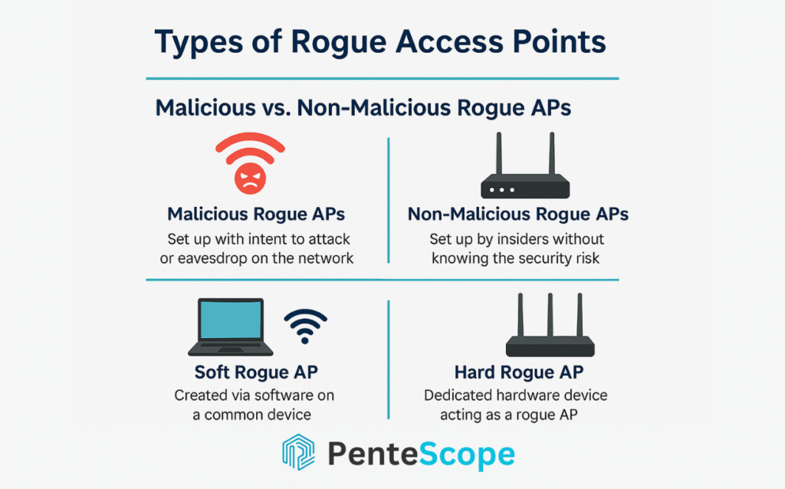
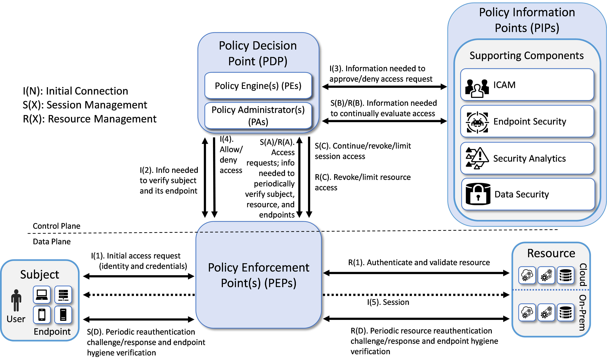
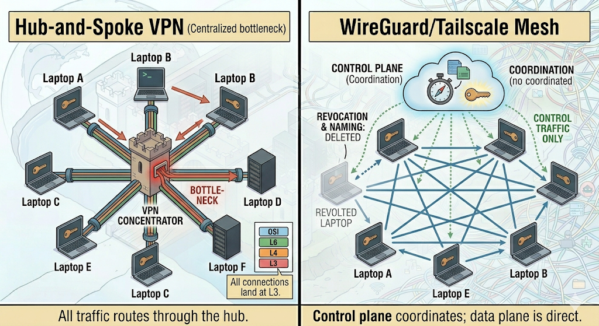
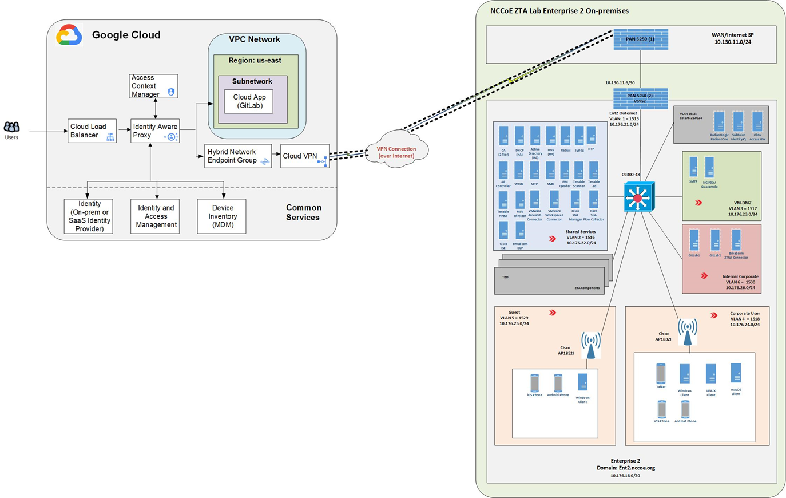

# Kablosuz Ağ Teknolojileri ve Güvenli Uzaktan Erişim

Ağ sınırlarının ofis binalarının dışına taşmasıyla birlikte, çalışanların kablosuz ağlardan veya evden şirket kaynaklarına güvenli erişmesi en temel ihtiyaç haline gelmiştir. Kablosuz erişim fiziksel perimetreyi ortadan kaldırır; geleneksel VPN'ler ise bir kez tünel kurulduktan sonra geniş ağ erişimi vererek yanal hareketi kolaylaştırır. Modern mimarilerde **WPA3 Enterprise + 802.1X/RADIUS** ile güçlü kimlik doğrulama, **IPsec/SSL VPN** ile şifreli tünel ve **WireGuard tabanlı mesh + ZTNA** ile kaynak odaklı, sürekli doğrulama katmanları bir arada kullanılmalıdır.

---

## §6.4.1. Kurumsal Wi-Fi Mimarileri: WPA3 Enterprise, 802.1X ve RADIUS

Ev tipi kablosuz ağlarda herkes aynı ortak parolayı (Pre-Shared Key — PSK) kullanırken, kurumsal ortamlarda bu yöntem kabul edilemez güvenlik riskleri yaratır. Bir personel işten ayrıldığında tüm ağın parolasını değiştirmek operasyonel olarak sürdürülemez; paylaşılan anahtarın sızması halinde tüm ağ tehlikeye girer.

### WPA3 Enterprise: Kurumsal Şifreleme Standardı

**WPA3-Enterprise**, Wi-Fi Alliance tarafından tanımlanan ve kurumsal ağlarda olgunlaşmış güvenlik standardıdır. WPA2-Enterprise'a kıyasla üç temel iyileştirme getirir:

| Özellik | WPA2-Enterprise | WPA3-Enterprise |
|---|---|---|
| Kimlik doğrulama | 802.1X (SHA-1 tabanlı) | 802.1X (SHA-256 tabanlı) |
| Şifreleme | AES-CCMP (128-bit) | AES-CCMP veya GCMP-256 |
| Yönetim çerçeveleri | Opsiyonel (802.11w) | **Zorunlu** (Protected Management Frames) |
| Yüksek güvenlik modu | Yok | 192-bit CNSA uyumlu mod |

**WPA3-Enterprise 192-bit Güvenlik Modu**, Ticari Ulusal Güvenlik Algoritmaları (CNSA) paketi ile uyumludur. Bu modda AES-GCMP-256 şifreleme, HMAC-SHA-384 hash ve 384-bit Eliptik Eğri Diffie-Hellman (ECDH) anahtar değişimi zorunludur. Savunma, istihbarat veya kritik altyapı senaryolarında tercih edilir.

**Protected Management Frames (PMF — 802.11w)**, WPA3'te zorunlu hale gelmiştir. WPA2'de deauthentication ve disassociation paketleri şifrelenmeden havaya gönderildiğinden saldırganlar sahte bağlantı kesme paketleriyle istemcileri düşürebilir veya Evil Twin saldırılarına yönlendirebilir. PMF aktif olduğunda yönetim çerçeveleri BIP-GMAC ile kriptografik olarak imzalanır; sahte paketler doğrudan reddedilir.

### IEEE 802.1X: Port Tabanlı Ağ Erişim Kontrolü

IEEE 802.1X, kablolu ve kablosuz ağlarda port tabanlı ağ erişim kontrolü (NAC) sağlayan standarttır. Kurumsal Wi-Fi bağlamında her kullanıcı veya cihaz, ağa bağlanmadan önce merkezi bir kimlik doğrulama altyapısından geçmek zorundadır.

**802.1X üç temel bileşenden oluşur:**

1. **Supplicant (İstemci):** Ağa bağlanmak isteyen cihaz (dizüstü bilgisayar, telefon, IoT sensörü). Üzerinde 802.1X istemci yazılımı çalışır.
2. **Authenticator (Yetkilendirici):** Genellikle Wi-Fi Erişim Noktası (AP) veya Wireless LAN Controller (WLC). Kimlik doğrulama tamamlanana kadar veri portunu kapalı tutar; yalnızca EAPOL paketlerine izin verir.
3. **Authentication Server (Kimlik Doğrulama Sunucusu):** RADIUS veya Diameter protokolünü kullanan merkezi AAA (Authentication, Authorization, Accounting) noktası.

**Kimlik doğrulama akışı:**

```
[İstemci] ---(EAPOL)---> [AP/WLC] ---(RADIUS)---> [RADIUS Sunucusu]
                                                          |
                                                          v
                                                  [Active Directory / LDAP]
```

1. İstemci, AP'ye EAPOL-Start gönderir.
2. AP, istemciden kimlik bilgisi ister; RADIUS sunucusuna Access-Request iletir.
3. RADIUS, Active Directory veya LDAP ile kimliği doğrular.
4. Başarılı doğrulama sonrası MSK (Master Session Key) üretilir; 4-Way Handshake ile PTK/GTK dağıtılır.
5. RADIUS, AP'ye VLAN ataması ve erişim politikası bilgisini iletir.

### RADIUS Entegrasyonu ve RadSec

**RADIUS (Remote Authentication Dial-In User Service)**, 802.1X mimarisinin olmazsa olmazıdır. Kimlik doğrulama, yetkilendirme ve muhasebe (AAA) hizmetleri sunar:

- Kullanıcı kimlik bilgilerini Active Directory, LDAP veya bulut IdP ile doğrular
- Rol veya cihaz tipine göre dinamik VLAN atar
- Oturum başlangıç/bitiş, IP/MAC eşleşmesi ve trafik hacmini loglar

Geleneksel RADIUS, UDP (1812/1813) üzerinde çalışır ve paket içeriği şifrelenmez. Kurumsal ortamda **RadSec (RADIUS over TLS)** veya IPsec ile RADIUS trafiği korunmalıdır. RadSec, TCP 2083 üzerinde TLS tüneli içinde çift yönlü sertifika doğrulaması (mTLS) sağlayarak sahte RADIUS sunucusu ve MitM saldırılarını engeller.

### EAP Yöntemleri ve EAP-TLS Önceliği

| EAP Türü | Açıklama | Güvenlik Seviyesi |
|---|---|---|
| **EAP-TLS** | Karşılıklı sertifika tabanlı kimlik doğrulama | En yüksek — forward secrecy |
| EAP-TTLS | TLS tüneli içinde kullanıcı adı/şifre | Orta-yüksek |
| PEAP-MSCHAPv2 | Korunmuş EAP, AD entegrasyonu kolay | Orta (geçiş dönemi) |
| EAP-FAST | Cisco tünelli kimlik doğrulama | Orta (eski altyapılar) |

**EAP-TLS**, kurumsal Wi-Fi için önerilen en güvenli yöntemdir. Hem istemci hem RADIUS sunucusu dijital sertifikayla birbirini doğrular; parola tabanlı saldırı vektörleri ortadan kalkar. Sertifika yaşam döngüsü SCEP/NDES ile otomatik enrollment, OCSP/CRL ile iptal kontrolü ile yönetilmelidir.


### Anahtar Türetim Hiyerarşisi

Başarılı EAP el sıkışması sonrası **MSK → PMK → PTK** (unicast) ve **GTK** (multicast/broadcast) zinciriyle oturuma özel dinamik anahtarlar türetilir; 4-Way Handshake bu anahtarları istemci ile AP arasında dağıtır.

---

## §6.4.2. WPA3 Güvenlik Zafiyetleri: Dragonblood ve Downgrade Tehditleri

WPA3, WPA2'nin zafiyetlerini büyük ölçüde giderse de akademik araştırmalar bazı tasarım kusurlarını ortaya çıkarmıştır.

### Dragonblood Saldırıları

**Dragonblood**, Mathy Vanhoef ve Eyal Ronen tarafından IEEE Symposium on Security & Privacy 2020'de yayınlanan araştırmadır. WPA3'ün temelindeki **Dragonfly (SAE — Simultaneous Authentication of Equals)** el sıkışmasını analiz eder ve beş tasarım kusuru tespit eder:

| Saldırı Türü | Mekanizma | Etki |
|---|---|---|
| **Downgrade saldırısı** | WPA3/WPA2 geçiş modunda istemciyi WPA2'ye zorlama | PMF korumasının devre dışı kalması |
| **SAE yan kanal** | Timing ve cache side-channel sızıntıları | Parola bilgisinin kısmi ifşası |
| **Grup pazarlığı düşürme** | SAE eliptik eğri grubunu zayıf gruba zorlama (ör. P-256) | Kriptografik gücün azalması |
| **DoS** | SAE commit mesajlarının istismarı | Bağlantı reddi |
| **Parola bölme** | Çoklu el sıkışma ile parola parçalarının toplanması | Offline sözlük saldırısına zemin |

Araştırmacılar, bu saldırıların düşük maliyetli bulut sunucularıyla istismar edilebileceğini göstermiştir. Wi-Fi Alliance, tespit edilen kusurlar için yamalar yayınlamıştır; ancak geçiş modunun (Transition Mode) kullanımı hâlâ risk oluşturur.

### WPA3 Transition Mode Riski

Geçiş modunda AP, tek bir SSID üzerinden hem WPA2-Enterprise hem WPA3-Enterprise yeteneklerini aynı anda duyurur. Eski cihazlar WPA2 ile bağlanırken uyumlu istemciler WPA3 kullanır. Saldırgan, aynı SSID ve BSSID ile yalnızca WPA2 destekleyen bir Evil Twin kurarak istemciyi downgrade edebilir:

```
[WPA3 Transition SSID]
        |                    |
   [WPA3 İstemci]      [WPA2 İstemci / Downgrade Kurbanı]
   PMF zorunlu          PMF isteğe bağlı → Evil Twin riski
```

**Öneri:** Geçiş modu yalnızca geçici süreyle aktif edilmeli; cihaz envanteri elverdiğinde **WPA3-Enterprise Only** moduna geçilerek WPA2 desteği tamamen kaldırılmalıdır.

### Savunma Kontrolleri

- WPA3-Enterprise Only modu; geçiş modundan kaçının
- EAP-TLS ile karşılıklı sertifika doğrulaması
- PMF zorunlu; istemcilerde sertifika pinning
- Firmware güncellemeleri ile Dragonblood yamalarını uygulayın
- WIDS/WIPS ile downgrade ve Evil Twin tespiti

---

## §6.4.3. Rogue AP, Evil Twin ve WIDS/WIPS

Kablosuz ağlar havadan taşınan elektromanyetik dalgalarla yayıldığı için fiziksel duvarların ötesine kolaylıkla sızar. Bu durum, kablolu ağlardaki gibi fiziksel sızma gerektirmeden ağa dahil olmayı hedefleyen saldırganlar için benzersiz fırsatlar sunar.

### Rogue AP Türleri



| Tür | Açıklama | Risk |
|---|---|---|
| **Bağlı Rogue AP** | Kurumsal switch'e fiziksel olarak bağlanmış yetkisiz AP | Kritik — firewall/NAC bypass |
| **Kötü Amaçlı Rogue AP** | Saldırgan tarafından kurulan Evil Twin | Kritik — credential harvesting |
| **Soft AP** | Akıllı telefon hotspot veya yazılım tabanlı AP | Orta |
| **Komşu Rogue AP** | Aynı frekans bandında, ağa bağlı olmayan AP | Düşük (parazit) |

**Rogue AP (Yetkisiz Erişim Noktası):** Kurumsal kablolu ağdaki boş bir Ethernet portuna IT bilgisi dışında bağlanan cihazlardır. Personelin ev router'ını ofis portuna takmasıyla oluşur; kurumsal güvenlik duvarı ve NAC kurallarını baypas eden bir arka kapı oluşturur.

**Evil Twin (Sahte İkiz AP):** Kurumsal ağ ile aynı SSID ve BSSID bilgilerini kullanan, ancak kurumsal LAN ile fiziksel bağı olmayan saldırgan kontrollü cihazlardır. Wi-Fi Pineapple, Wifipumpkin3 veya Raspberry Pi ile kurulur.

### Saldırı Senaryosu: Evil Twin ve Credential Harvesting

1. Saldırgan pasif tarama ile kurumsal AP kanallarını ve MAC adreslerini keşfeder.
2. Aynı SSID ile daha güçlü sinyal yayan sahte AP kurar.
3. PMF yokluğunda deauthentication flood ile kurban istemciyi düşürür.
4. İstemci otomatik olarak sahte AP'ye bağlanır.
5. Saldırgan captive portal ile kurumsal kimlik bilgilerini toplar veya MITM yapar.

**MITRE ATT&CK:** T1557.004 (Evil Twin), T1040 (Network Sniffing)

### WIDS/WIPS Mimarisi

**Wireless Intrusion Detection/Prevention System (WIDS/WIPS)**, kablosuz tehditleri proaktif olarak tespit eder ve engeller. Üç katmandan oluşur:

1. **Dağıtık Sensörler:** Spektrumu sürekli tarayan pasif alıcılar; AP içindeki üçüncü radyo kartı veya standalone sensör olarak çalışır.
2. **Merkezi WIPS Sunucusu:** Sensör verilerini korelasyon motorundan geçirerek anomali tespiti yapar.
3. **Yönetim Konsolu:** SOC analistlerinin hava sahasını izlediği merkezi ekran.

**Tespit katmanları:**

| Katman | Yöntem | Açıklama |
|---|---|---|
| **Over-the-air (RF)** | Off-channel scan, dedicated monitor radio | Havada yayılan SSID/BSSID anomalileri |
| **On-wire** | MAC adjacency, ARP correlation, switch port tracing | Rogue AP'nin kablolu ağa bağlı olup olmadığı |

**Aktif engelleme (containment) mekanizmaları:**

- **Over-the-Air Engelleme:** WIPS sensörü sahte AP'nin BSSID'sini taklit ederek deauthentication paketleri gönderir; kurban-saldırgan bağlantısı koparılır.
- **Wired Port Suppression:** Rogue AP kablolu ağa bağlıysa switch portu otomatik shutdown edilir.

**Üretici örnekleri:** FortiAP Rogue AP sınıflandırması; Cisco WLC RLDP; Cisco Meraki Air Marshal. Katmanlı savunma: fiziksel RF survey → 802.1X/NAC → WIPS izleme → merkezi envanter → SIEM korelasyonu.

---

## §6.4.4. IPsec VPN Mimarisi: IKEv2 ve ESP

IPsec (Internet Protocol Security), IP ağlarında güvenli veri iletimi sağlayan IETF protokol takımıdır. OSI modelinin 3. katmanında (ağ katmanı) çalışması, tüm üst katman protokollerini (TCP, UDP, ICMP) şifreleyebilmesini sağlar. Site-to-site (şube-merkez) ve remote access senaryolarında yaygın olarak kullanılır.

### Temel Bileşenler: ESP ve IKE

Modern IPsec implementasyonları **ESP (Encapsulating Security Payload)** protokolüne dayanır. **AH (Authentication Header) artık önerilmemektedir** — NIST SP 800-77 Rev.1 bu protokolü migrate edilmesi gereken legacy olarak sınıflandırır.

| Protokol | Şifreleme | Bütünlük | NAT Uyumu | Durum |
|---|---|---|---|---|
| **ESP** | Evet (AES-GCM) | Evet (AEAD) | Evet (NAT-T) | **Önerilen** |
| AH | Hayır | Evet (HMAC) | Hayır | Kullanılmamalı |

**ESP (Encapsulating Security Payload):**

- Simetrik şifreleme (AES-GCM, ChaCha20) ile gizlilik sağlar
- AEAD modunda şifreleme ve bütünlük doğrulaması tek adımda yapılır
- NAT Traversal (NAT-T) desteği ile UDP 4500 üzerinden NAT arkasında çalışır
- Anti-replay koruması: sıra numarası tabanlı kayar pencere mekanizması

**AH neden kullanılmamalı?**

- Yalnızca bütünlük sağlar; **şifreleme yapmaz**
- Bütünlük doğrulamasına dış IP başlığını dahil eder
- NAT cihazı IP başlığını değiştirdiğinde ICV doğrulaması çöker
- NAT ortamlarında tamamen uyumsuzdur

### IKEv2: Anahtar Değişimi ve SA Yönetimi

**IKE (Internet Key Exchange)**, IPsec tünelleri için güvenli anahtar değişimi ve Security Association (SA) yönetimi sağlar. **IKEv1 deprecated edilmiştir;** kurumsal ortamda yalnızca IKEv2 kullanılmalıdır.

**IKEv2 dört mesajlı el sıkışma:**

```
[Uç A]                                    [Uç B]
   |--- IKE_SA_INIT (algoritma + DH) ---->|
   |<-- IKE_SA_INIT (nonce + DH) ---------|
   |--- IKE_AUTH (kimlik + Child SA) --->|
   |<-- IKE_AUTH (kimlik + Child SA) -----|
   |        IPsec tüneli aktif             |
```

| Özellik | IKEv1 | IKEv2 |
|---|---|---|
| Mesaj sayısı | 6-9 | 4 |
| NAT desteği | NAT-T eklentisi | Yerleşik NAT-T |
| EAP desteği | Sınırlı | Tam (EAP-TLS, EAP-MSCHAPv2) |
| MOBIKE | Yok | Yerleşik (mobilite) |
| DDoS koruması | Zayıf | Cookie mekanizması |

IKEv2 ayrıca MOBIKE (mobilite), EAP/RADIUS + MFA entegrasyonu, Perfect Forward Secrecy ve DDoS cookie koruması sunar.



### IPsec Çalışma Modları ve SA Yönetimi

| Mod | Kapsam | Kullanım |
|---|---|---|
| **Tunnel Mode** | Tüm IP paketi şifrelenir; yeni dış başlık eklenir | Site-to-site, remote access (standart) |
| **Transport Mode** | Yalnızca payload şifrelenir | Host-to-host (nadir) |

**Security Association (SA)**, SPI + hedef IP + protokol (ESP) ile tanımlanan tek yönlü anlaşmadır. İki yönlü iletişim için inbound/outbound SA çifti gerekir; IKE ile otomatik kurulum manuel anahtar yönetiminden üstündür.

### Önerilen Kriptografik Parametreler

| Parametre | Önerilen Değer |
|---|---|
| Şifreleme | AES-256-GCM (AEAD) |
| DH Grubu | ECDH Group 19/20/21 (P-256/P-384/P-521) |
| Hash | SHA-384 (IKE), GCM içinde bütünlük (ESP) |
| IKE SA ömrü | 8 saat |
| IPsec SA ömrü | 1 saat |
| Kimlik doğrulama | Sertifika (EAP-TLS) veya güçlü PSK |
| NAT-T | Aktif (UDP 4500) |

---

## §6.4.5. SSL/TLS VPN ve Protokol Karşılaştırması

SSL VPN (Secure Sockets Layer Virtual Private Network), SSL/TLS protokolünü kullanarak güvenli uzaktan erişim sağlar. IPsec'ten farklı olarak taşıma ve uygulama katmanları arasında çalışır; genellikle web tarayıcısı veya hafif istemci ile erişim sunar.

### SSL VPN Türleri

| Tür | Açıklama | Avantaj | Dezavantaj |
|---|---|---|---|
| **Portal (Clientless)** | Tarayıcı üzerinden web uygulamalarına erişim | İstemci yazılımı gerekmez | Yalnızca web uygulamaları |
| **Tunnel (Full Client)** | Tam tünel VPN; tüm trafik şifrelenir | Her protokol desteklenir | İstemci yazılımı gerekir |
| **Split-Tunnel** | Yalnızca kurumsal trafik tünellenir | Bant genişliği verimli | Veri sızıntısı riski |

### IPsec vs SSL VPN Karşılaştırması

| Kriter | IPsec (IKEv2 + ESP) | SSL VPN (TLS) |
|---|---|---|
| Çalışma katmanı | Ağ (L3) | Uygulama/Taşıma (L5-L7) |
| İstemci gereksinimi | Özel VPN istemcisi | Tarayıcı veya hafif istemci |
| NAT/Firewall dostu | NAT-T ile (UDP 4500) | Çok iyi (TCP 443) |
| Protokol desteği | Tüm IP protokolleri | Web bazlı veya tam tünel |
| Güvenlik modeli | IKEv2 + ESP (AES-GCM) | TLS 1.3 |
| Performans | UDP tabanlı, tutarlı | TCP üzerinde TCP overhead |
| Kullanım senaryosu | Site-to-site, full-tunnel | Remote access, portal erişim |

**OpenVPN**, açık kaynaklı SSL/TLS tabanlı VPN çözümüdür; sertifika, LDAP/AD ve 2FA destekler. Savunmada gateway MFA, endpoint posture kontrolü, full-tunnel zorunluluğu (BDDK), düzenli yama yönetimi ve SIEM korelasyonu (brute-force, CVE istismarı) uygulanmalıdır.

---

## §6.4.6. Mesh VPN: WireGuard ve Tailscale

Geleneksel hub-and-spoke VPN modelleri merkezi bottleneck, tek nokta hatası ve geniş ağ erişimi (implicit trust) sorunları yaşar. **Mesh VPN** mimarisinde uç noktalar doğrudan kriptografik tünel kurar; trafik merkezi geçitten geçmek zorunda kalmaz.

### WireGuard: Yeni Nesil VPN Protokolü

WireGuard, Linux çekirdeğinde çalışan, modern ve yüksek performanslı VPN protokolüdür. IPsec ve OpenVPN'in karmaşıklığını ortadan kaldırmak üzere tasarlanmıştır.

**Teknik özellikler:**

| Bileşen | Algoritma | Açıklama |
|---|---|---|
| Anahtar değişimi | Curve25519 | ECDH eliptik eğri |
| Şifreleme | ChaCha20-Poly1305 | AEAD simetrik şifreleme |
| Hash | BLAKE2s | Hızlı kriptografik hash |
| El sıkışma | Noise Protocol Framework | Tek adımda kimlik doğrulama |

WireGuard ~4.000 satır kodla denetlenebilir, çekirdek seviyesinde yüksek performans sunar. **Cryptokey Routing** ile AllowedIPs listesi hem outbound yönlendirme hem inbound kaynak IP doğrulaması yaparak kernel seviyesinde spoofing'i engeller.

### Tailscale: WireGuard Tabanlı Zero Trust Mesh

Tailscale, WireGuard veri düzlemi üzerine **control plane** (koordinatör: kimlik, anahtar dağıtımı, ACL) ve **data plane** (tailscaled: P2P WireGuard) ayrımı getirir. STUN/TURN ile NAT traversal, DERP relay ile UDP engelli ortamlarda şifreli geçiş, MagicDNS ile `100.x.y.z` isim tabanlı erişim sağlar. SSO/OIDC entegrasyonu, merkezi ACL (Grants) ve subnet router ile legacy ağlar mesh'e dahil edilir.



### WireGuard vs Tailscale: Ne Zaman Hangisi?

| Kriter | WireGuard | Tailscale |
|---|---|---|
| Kontrol | Tam kontrol, kendi sunucularınız | Yönetim konsolu (veya Headscale self-hosted) |
| Karmaşıklık | Manuel yapılandırma | Sıfır yapılandırma |
| Ölçeklenebilirlik | Küçük/orta ölçek | Kurumsal (binlerce cihaz) |
| Zero Trust | Uygulama sorumluluğu size ait | Yerleşik identity + ACL |
| Maliyet | Düşük (yalnızca altyapı) | Abonelik bazlı |
| Kullanım | Teknik ekipler, özel senaryolar | Hibrit çalışma, kurumsal dağıtım |

---

## §6.4.7. ZTNA ve NIST SP 800-207 Sıfır Güven Mimarisi

Geleneksel VPN'ler, kullanıcı kimlik doğrulaması yapıldıktan sonra **tüm ağa erişim** sağlar. Bu "hepsini ya da hiçbirini" (all-or-nothing) yaklaşımı, bir hesabın ele geçirilmesi durumunda saldırganın tüm ağda yanal harekat yapmasına olanak tanır.

### ZTNA Felsefesi

**Zero Trust Network Access (ZTNA)**, NIST SP 800-207 tanımıyla "hiçbir kullanıcıya veya cihaza, konumu veya önceki doğrulaması ne olursa olsun güvenilmemesi" ilkesine dayanır.

**Temel prensipler:**

1. **Asla güvenme, her zaman doğrula (Never Trust, Always Verify)**
2. **En az ayrıcalık (Least Privilege):** Kullanıcı yalnızca ihtiyacı olan kaynağa erişir
3. **Sürekli izleme ve değerlendirme:** Her oturum dinamik olarak yeniden değerlendirilir
4. **Mikro segmentasyon:** Ağ küçük güvenlik bölgelerine ayrılır
5. **Varsayılan olarak reddet (Default Deny)**

### NIST SP 800-207 Mimari Bileşenleri

NIST SP 800-207, Sıfır Güven Mimarisi (Zero Trust Architecture — ZTA) için referans model tanımlar:



| Bileşen | Rol | Açıklama |
|---|---|---|
| **Policy Engine (PE)** | Karar verici | Erişim talebini değerlendirir (Subject + Device + Context + Resource) |
| **Policy Administrator (PA)** | Politika yöneticisi | PE kararlarını yapılandırır ve günceller |
| **Policy Enforcement Point (PEP)** | Uygulayıcı | Erişim kararını uygular; proxy veya agent olarak çalışır |
| **CDM (Continuous Diagnostics and Mitigation)** | Teşhis | Cihaz ve kullanıcı durumunu sürekli değerlendirir |

Her erişim talebi kimlik, cihaz sağlığı, konum, kaynak hassasiyeti ve davranış anomalisi (UEBA) bağlamında değerlendirilir.

### VPN'den ZTNA'ya Dönüşüm

```
GELENEKSEL VPN:
[Kullanıcı] ---(Kimlik)---> [VPN Gateway] ---> [Tüm Ağa Erişim]
                                               (Yanal harekat riski)

ZTNA:
[Kullanıcı] ---(Kimlik + Cihaz + Konum)---> [ZTNA Proxy/PEP] ---> [Yalnızca Yetkili Uygulama]
                                      |                                    |
                                      +---(Sürekli İzleme + PE)----------+
```

| Güvenlik Parametresi | Geleneksel VPN | ZTNA |
|---|---|---|
| Erişim sınırı | Ağ seviyesi (L3) | Uygulama/kaynak seviyesi |
| Güven ilkesi | Doğrulanan kullanıcı "güvenilir" | Hiçbir kullanıcıya güvenilmez |
| Yanal harekat | Tüm iç ağ taranabilir | Yalnızca yetkili kaynak görünür |
| Sürekli doğrulama | Oturum başında tek seferlik | Bağlantı süresince dinamik |
| Cihaz sağlığı | Genellikle kontrol edilmez | EDR, disk şifreleme, yama kontrolü |

Hibrit geçiş: mevcut VPN'leri daraltın (MFA, traffic selector) → kritik uygulamalarda ZTNA (Zscaler, Cloudflare Access, Tailscale) → kablosuz + ZTNA entegrasyonu → legacy için IPsec/WireGuard → tüm katman loglarını SIEM'e akıtın.

---

## §6.4.8. Türkiye Mevzuatı: 5651, KVKK ve BDDK Loglama Gereksinimleri

Türkiye'de kablosuz ağ ve uzaktan erişim çözümleri, çeşitli yasal düzenlemelerle çevrelenmiştir. Teknik güvenlik kontrolleri ile yasal yükümlülüklerin birlikte ele alınması zorunludur.

### 5651 Sayılı Kanun: İnternet Erişim Loglama

5651 Sayılı Kanun, internet ortamında yapılan yayınların düzenlenmesi kapsamında loglama yükümlülükleri getirir:

| Sağlayıcı Türü | Saklama Süresi | Kapsam |
|---|---|---|
| Erişim sağlayıcı | 1 yıl | Trafik bilgisi |
| Yer sağlayıcı | 6 ay | Barındırma logları |
| Toplu kullanım sağlayıcı (otel, kafe, kurumsal Wi-Fi) | **2 yıl** | Erişim/iç IP logları |

**Tutulması gereken veri seti:**

- Kaynak (yerel) IP adresi
- MAC adresi (cihaz fiziksel kimliği)
- Bağlantı zamanı (başlangıç/bitiş, milisaniye hassasiyeti)
- Hedef IP ve port (HTTP/80, HTTPS/443)

**Bütünlük gereksinimleri:**

- Trafik bilgilerinin doğruluğu, bütünlüğü ve gizliliği korunmalıdır
- Dosya bütünlük değerleri (hash) **zaman damgası** ile saklanmalıdır
- Zaman damgasız loglar mahkemede manipüle edilebilir sayılır ve delil vasfını kaybeder

**Teknik karşılık:** RADIUS accounting kayıtları + NAT logları + VPN bağlantı logları + misafir Wi-Fi captive portal logları.

### KVKK (6698): Kişisel Verilerin Korunması

KVKK, kişisel verilerin işlenmesi, aktarılması ve saklanması konusunda kurallar getirir. VPN ve kablosuz ağ bağlamında:

- **Loglama ve kişisel veri:** Kimlik doğrulama olayları, erişim logları, IP adresleri kişisel veri olarak kabul edilir
- **Hukuki dayanak:** 5651 logları KVKK m.5/2-a (kanunlarda öngörülme) ve m.5/2-ç (hukuki yükümlülük) kapsamında işlenir — açık rıza gerekmez, ancak **aydınlatma metni zorunludur**
- **Veri minimizasyonu:** Yalnızca gerekli veriler toplanmalıdır
- **Güvenlik önlemleri:** Verilerin şifrelenmesi (WPA3, IPsec/SSL VPN) zorunludur (m.12)
- **Saklama-imha dengesi:** 5651 üst sınırı (2 yıl) dolunca, devam eden yasal süreç yoksa loglar güvenli silme ile imha edilmelidir
- **Veri ihlal bildirimi:** İhlal durumunda KVKK Kurulu'na ve ilgili kişilere 72 saat içinde bildirim

### BDDK ve Uyumluluk Kontrol Listesi

BDDK, finans sektöründe MFA, uç nokta güvenliği, split-tunnel kısıtı, merkezi loglama, NAC/802.1X, KSOME ve yurt içi 24 saat süreklilik zorunluluğu getirir.

| Gereksinim | Teknik Karşılık | Mevzuat |
|---|---|---|
| Erişim loglarının saklanması | RADIUS accounting, VPN gateway logları | 5651, KVKK |
| Zaman damgalı bütünlük | Günlük hash + TSA imzası | 5651 |
| Verilerin şifrelenmesi | WPA3-Enterprise, IPsec/SSL VPN | KVKK m.12 |
| Kimlik doğrulama | 802.1X, RADIUS + MFA | BDDK, KVKK |
| Cihaz uyumluluk kontrolü | NAC, Endpoint Security | BDDK |
| Düzenli güvenlik testleri | Yıllık pentest, WIPS | BDDK, ISO 27001 |
| Veri ihlal bildirimi | SIEM, olay müdahale planı | KVKK |
| Log imhası | Süre dolunca secure wipe | KVKK + 5651 dengesi |

---

## §6.4.9. Saldırı ve Savunma Dengesi: MITRE ATT&CK Perspektifi

MITRE ATT&CK çerçevesi, kablosuz ağ ve VPN saldırılarını sistematik olarak kategorize eder. Savunma derinliği stratejisinde her saldırı vektörüne karşılık gelen tespit ve engelleme mekanizmaları tanımlanmalıdır.

### Saldırı Teknikleri

| Teknik ID | Adı | Kablosuz/VPN Bağlamı |
|---|---|---|
| **T1557.004** | Evil Twin | Sahte AP ile credential harvesting |
| **T1040** | Network Sniffing | Kablosuz trafik dinleme, Rogue AP üzerinden |
| **T1133** | External Remote Services | VPN zafiyetleri, zayıf kimlik bilgileri |
| **T1078** | Valid Accounts | Credential stuffing, phishing |
| **T1190** | Exploit Public-Facing Application | SSL VPN web portal zafiyetleri |
| **T1110** | Brute Force | VPN portal parola deneme saldırıları |
| **T1572** | Protocol Tunneling | DNS/ICMP tunneling ile VPN bypass |
| **T1021** | Remote Services | RDP, SSH üzerinden yanal harekat |

### Savunma Stratejileri

| Savunma Katmanı | Teknik Uygulama | MITRE Karşılığı |
|---|---|---|
| Zafiyet yönetimi | Düzenli pentest, güncelleme yönetimi | T1190 |
| Kimlik koruması | MFA, EAP-TLS, anormal giriş tespiti | T1078, T1133, T1110 |
| Ağ segmentasyonu | Mikro segmentasyon, ZTNA | Yanal harekat engelleme |
| Kablosuz savunma | WIDS/WIPS, WPA3 + PMF, Rogue AP tespiti | T1557.004, T1040 |
| Log yönetimi | Merkezi SIEM, UEBA, impossible travel | Tüm teknikler |
| Endpoint detection | EDR, cihaz uyumluluk kontrolleri | T1021 |

**Savunma derinliği:** WPA3 + 802.1X + WIPS → firewall/IPS → RADIUS + MFA + EAP-TLS → ZTNA/mikro segmentasyon → IPsec/SSL VPN → SIEM/EDR/SOC.

**SIEM korelasyonu:** WIDS alarmı + EAP failure artışı (Evil Twin); 60 sn'de 10+ VPN başarısız giriş (brute-force); impossible travel; mesai dışı yüksek veri transferi (exfiltration).

---

## Sonuç

Kablosuz ağ ve uzaktan erişim güvenliği; **WPA3-Enterprise + 802.1X/RADIUS/EAP-TLS** kimlik doğrulama, **Dragonblood** yamaları, **WIDS/WIPS** ile Rogue AP savunması, **IKEv2/ESP** (AH değil) ve **SSL VPN** tünelleme, **WireGuard/Tailscale** mesh ve **NIST SP 800-207 ZTNA** ile katmanlı olarak ele alınmalıdır. Türkiye'de **5651**, **KVKK** ve **BDDK** loglama, şifreleme ve MFA yükümlülükleri bu mimarinin ayrılmaz parçasıdır. Hibrit çalışma modellerinde bu kontroller artık opsiyonel değil, **stratejik zorunluluktur**.