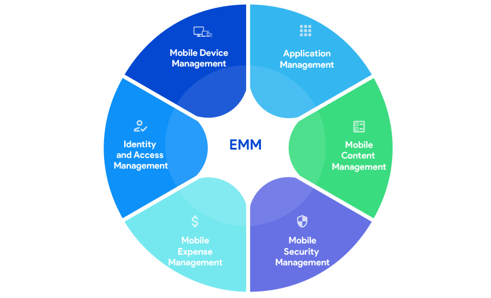
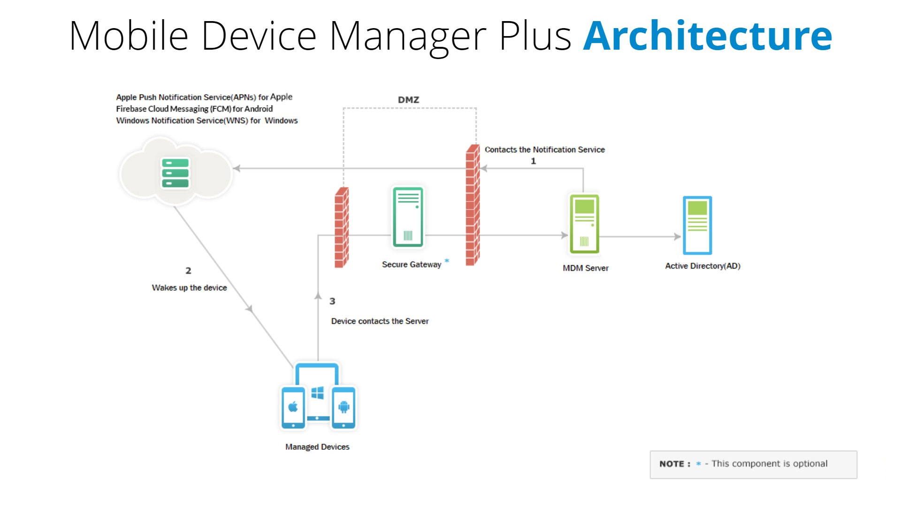
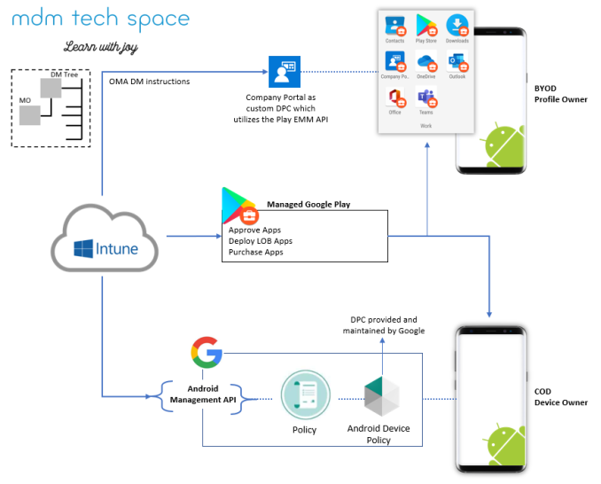
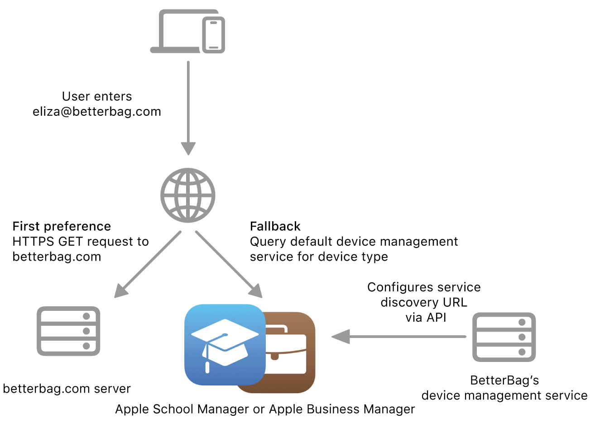
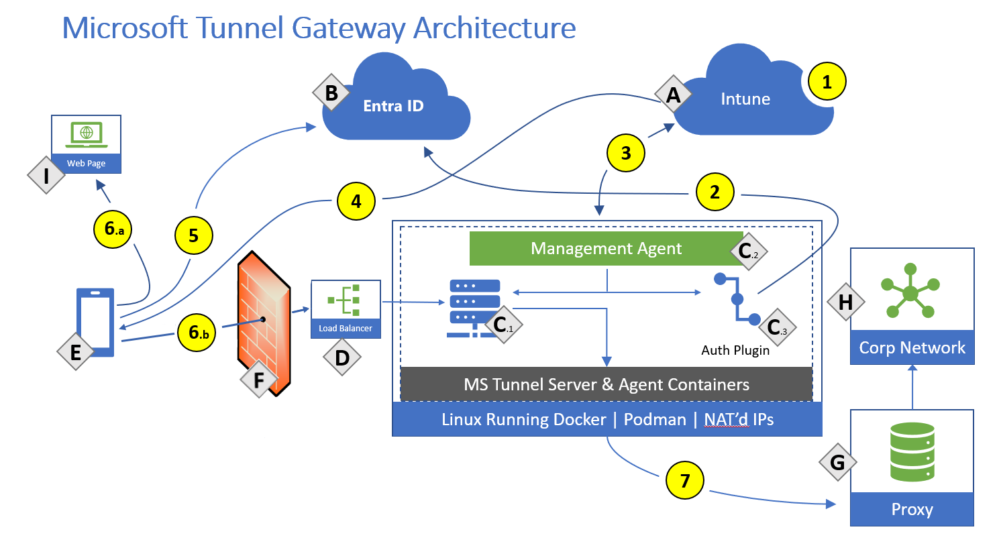

# Kurumsal Mobilite (MDM/MAM/BYOD) ve Mobil İşletim Sistemi Tehditleri

Mobil cihazlar, kurumsal BT altyapısının birincil uç noktaları haline gelmiştir. Akıllı telefon ve tabletler; e-posta, CRM, ERP, SaaS uygulamaları ve iç ağ kaynaklarına sürekli erişim sağlayarak saldırganların hedef tahtasının merkezine oturmuştur. Bu cihazlarda kişisel ve kurumsal veri çoğu zaman aynı fiziksel donanımda yan yana durur; bu durum **savunma derinliği (defense in depth)** ve **sıfır güven (Zero Trust)** prensiplerinin mobil katmanda da uygulanmasını zorunlu kılar.

**NIST SP 800-124 Rev. 2** (2023), kurumsal mobil cihaz güvenliği için cihaz envanteri, politika uygulama, veri izolasyonu ve sürekli izleme gereksinimlerini tanımlar. Modern mimariler **EMM/UEM** (Enterprise Mobility Management / Unified Endpoint Management) çatısı altında **MDM** (cihaz düzeyi), **MAM** (uygulama düzeyi) ve **MTD** (Mobile Threat Defense) katmanlarını birleştirir. Bu bölümde MDM/MAM mimarisi, BYOD veri izolasyonu, iOS/Android güvenlik modelleri, güvensiz ağlara karşı VPN stratejileri ile **KVKK**, **5651**, **BDDK**, **ISO 27001:2022**, **CIS Controls v8** ve **MITRE ATT&CK for Mobile** çerçevelerindeki operasyonel karşılıklar ele alınacaktır.


*EMM platformunun MDM, MAM, kimlik yönetimi ve mobil güvenlik modülleri*

---

## §8.1.1. Mobil Cihaz Yönetimi (MDM) ve Mobil Uygulama Yönetimi (MAM) Mimarisi

Kurumsal mobilite ekosisteminin merkezinde **UEM** çatısı altında birleşen MDM ve MAM çözümleri yer alır. MDM işletim sistemi seviyesindeki donanım ve sistem parametrelerini yönetirken; MAM, işletim sisteminin üzerinde koşan kurumsal uygulamaların verilerini (**Data-at-Rest** ve **Data-in-Transit**) uygulama katmanında izole eder ve kontrol altına alır.

### MDM: Cihaz Düzeyinde Kontrol

**Mobil Cihaz Yönetimi (MDM)**, kurumun sahibi olduğu veya BYOD kapsamındaki mobil cihazların (iOS, Android, iPadOS) uzaktan yapılandırılmasını, izlenmesini ve güvenliğini sağlayan kurumsal yazılım çözümüdür. Modern MDM, işletim sistemine gömülü yönetim API'lerine dayanır — Apple MDM Protokolü ve Android Enterprise OS seviyesinde yerleşiktir; ayrı bir ajan kurulumu gerekmez.

| Yetenek | Açıklama | SOC Etkisi |
| :---- | :---- | :---- |
| **Zorunlu politika** | Şifreleme, parola, kilitleme süresi | Uyumsuzluk alarmı |
| **Uygulama yönetimi** | Kurumsal mağaza, engelleme listesi | Sideloading tespiti |
| **Ağ yapılandırması** | Wi-Fi, VPN, APN push | VPN'siz erişim engeli |
| **Donanım kısıtları** | Kamera, USB, Bluetooth devre dışı | Veri sızıntısı önleme |
| **Uzaktan silme** | Full wipe / selective wipe | Olay müdahale otomasyonu |

Kurumsal cihaz sahiplik modelleri operasyonel kararları doğrudan etkiler:

| Model | Açıklama | Tipik Yönetim |
| :---- | :---- | :---- |
| **COPE** | Corporate-Owned, Personally Enabled | Tam MDM + Work Profile |
| **COBO** | Corporate-Owned, Business Only | Tam MDM, kısıtlı kullanım |
| **BYOD** | Bring Your Own Device | MAM + Work Profile / User Enrollment |
| **CYOD** | Choose Your Own Device | Onaylı cihaz listesi + MDM |

### MAM: Uygulama Düzeyinde Kontrol

**Mobil Uygulama Yönetimi (MAM)**, tüm cihazı değil yalnızca hassas kurumsal verileri işleyen belirli uygulamaları hedef alır. MAM, cihazda güvenli bir **konteyner (container)** veya **iş profili (work profile)** oluşturarak kurumsal verileri kişisel uygulama ve dosyalardan izole eder.

| MAM Politikası | Açıklama |
| :---- | :---- |
| Kopyala-yapıştır engeli | Kurumsal uygulamadan kişisel uygulamaya veri transferinin önlenmesi |
| Ekran yakalama engeli | Hassas verilerin ekran görüntüsü alınmasının engellenmesi |
| Dosya indirme kısıtı | Kurumsal uygulamalardan dosya indirilmesinin sınırlanması |
| Zorunlu kimlik doğrulama | Her uygulama açılışında PIN/biyometrik doğrulama |
| Uygulama içi şifreleme | Uygulama verilerinin şifrelenmiş saklanması |
| Jailbreak/Root tespiti | Root/Jailbreak yapılmış cihazlarda uygulama engeli |

MAM, özellikle **BYOD** senaryolarında kritik öneme sahiptir; çalışanın kişisel cihazına tam cihaz düzeyinde müdahale etmeden kurumsal verilerin güvenliğini sağlar.

### Protokol Seviyesinde Haberleşme: APNs ve FCM

Mobil işletim sistemlerinin dikey yapısı gereği cihazlar üzerinde kesintisiz arka plan bağlantısı sürdürmek hem batarya ömrünü hem de bant genişliğini olumsuz etkiler. Apple ve Google, cihazlar ile yönetim sunucuları arasındaki haberleşmeyi asenkron bir **uyandırma (wake-up)** altyapısına bağlamıştır.

**Apple MDM / APNs akışı:**

1. Cihaz enrollment sırasında bir **APNs token** üretilir; bu token hem UEM konsolu hem APNs sunucusu tarafından bilinir.
2. Yönetici konsolunda komut (profil push, lock, wipe) verildiğinde kayıt **Device Command Queue**'ya yazılır.
3. MDM sunucusu APNs'e HTTPS (TCP 2197) üzerinden push yollar; paket yalnızca "MDM sunucusuna bağlan" sinyali içerir, politika verisi taşımaz.
4. Cihazın push daemon'ı (apsd) TCP 5223 üzerinden sinyali alır ve MDM sunucusuna TLS 1.3 (TCP 443) bağlantısı başlatır.
5. Cihaz bekleyen komutları çeker, yürütür ve durumu raporlar.

Android tarafında bildirimler **Firebase Cloud Messaging (FCM)** üzerinden taşınır. On-premises MDM çözümleri dahi mobil cihazların kontrol edilebilmesi için dış ağdaki APNs veya FCM sunucularına erişim gerektirir; tamamen kapalı (air-gapped) ağlarda standart mobil cihaz yönetimi teknik olarak gerçekleştirilemez.

> [!WARNING]
> APNs sertifikası Apple Business Manager üzerinden yıllık yenilenmelidir. Süresi dolduğunda iOS/macOS cihazlar push almayı keser; komutlar konsolda hata vermeden kuyrukta bekleyebilir. SOC ekipleri APNs sertifika süresi dolmasını kritik altyapı olayı olarak izlemelidir.


*MDM sunucusu, push bildirim servisi ve mobil cihaz arasındaki tipik haberleşme topolojisi*

### Bildirici Cihaz Yönetimi (Declarative Device Management — DDM)

Geleneksel MDM modelinin reaktif yapısı (sunucunun sürekli sorgulama yapması) büyük ölçekli kurumsal ağlarda gecikmelere ve sunucu yüklerine yol açar. Apple, iOS 15 ile **Bildirici Cihaz Yönetimi (DDM)** mimarisini duyurmuştur. DDM'de cihaz otonom bir durum motoruna dönüşür; yönetici cihazın sahip olması gereken durum bildirimlerini (Declarations) bir kez gönderir ve cihaz kuralları yerel olarak uygular.

DDM dört ana bileşenden oluşur:

* **Konfigürasyonlar (Configurations):** Wi-Fi profilleri, e-posta hesapları, şifre kuralları.
* **Varlıklar (Assets):** Sertifikalar, kimlik bilgileri, büyük boyutlu dosyalar.
* **Aktivasyonlar (Activations):** Konfigürasyonların hangi koşullarda devreye gireceğini belirleyen kurallar.
* **Yönetim (Management):** Genel yönetim profilinin durumu ve bildirim kanallarının bütünlüğü.

Cihaz kurumsal Wi-Fi ağından çıkıldığında durumu anında algılayarak kurumsal e-posta hesabını yerel düzeyde askıya alabilir ve değişikliği asenkron olarak MDM sunucusuna raporlar. Bu yaklaşım ağ trafiğini azaltırken tepki süresini milisaniyeler seviyesine indirir.

### MDM ve MAM Entegrasyonu: Katmanlı Savunma

Modern kurumsal mobilite mimarileri MDM ve MAM'ı birbirini tamamlayan katmanlar olarak konumlandırır:

```
┌─────────────────────────────────────────────────────────────┐
│              KURUMSAL MOBİLİTE KATMANLARI (UEM)             │
├─────────────────────────────────────────────────────────────┤
│  ┌──────────────────────┐    ┌──────────────────────────┐ │
│  │   MDM (Cihaz Düzeyi) │    │   MAM (Uygulama Düzeyi)  │ │
│  │  • Şifreleme         │    │  • Kapsülleme/Container  │ │
│  │  • Parola politikası │    │  • Kopyala-yapıştır DLP  │ │
│  │  • Remote Wipe       │    │  • Ekran yakalama engeli │ │
│  │  • Donanım kısıtları │    │  • Uygulama kimlik doğr. │ │
│  └──────────────────────┘    └──────────────────────────┘ │
├─────────────────────────────────────────────────────────────┤
│  MOBİL CIHAZ: Kurumsal Container + Kişisel Alan            │
└─────────────────────────────────────────────────────────────┘
```

Kurumsal topolojide tipik konumlandırma:

* Cihazlar → APNs/FCM üzerinden MDM/EMM sunucusuna (Intune, Workspace ONE, Jamf vb.) bağlanır.
* EMM sunucusu → Entra ID, RADIUS, VPN Gateway ve SIEM ile entegre olur.
* DMZ'de secure gateway/proxy; iç kaynaklara kontrollü tünellenmiş erişim sağlanır.

### Yapılandırma Örneği: Intune MAM Uygulama Koruma Politikası

```json
{
  "appProtectionPolicy": {
    "name": "Kurumsal Veri Koruma Politikası",
    "platform": "Android",
    "settings": {
      "dataProtection": {
        "encryption": "required",
        "blockScreenCapture": true,
        "preventBackup": true,
        "allowedDataTransfer": "managedAppsOnly",
        "pasteFromOtherApps": "blocked",
        "cutAndCopy": "blocked"
      },
      "accessRequirements": {
        "pinRequired": true,
        "pinLength": 6,
        "fingerprintAllowed": true,
        "maxPinAttempts": 5,
        "timeoutMinutes": 5
      },
      "conditionalLaunch": {
        "jailbreakDetected": "block",
        "maxOSVersion": "deny",
        "minOSVersion": "warn"
      }
    }
  }
}
```

### Uluslararası Standartlar ve Kontrol Eşleştirmesi

| Standart | İlgili Kontrol / Madde | Operasyonel Karşılık |
| :---- | :---- | :---- |
| **NIST SP 800-124 Rev. 2** | Cihaz envanteri, MFA, containerization | MDM enrollment + BYOD izolasyonu |
| **NIST SP 800-53 Rev. 5** | AC-19, AC-4, CM-7, SC-8 | Mobil erişim, veri akışı, VPN |
| **ISO 27001:2022** | A.6.7, A.8.1 | Mobil cihaz ve uç nokta güvenliği |
| **CIS Controls v8** | Control 1, 7, 15 | Envanter, zafiyet yönetimi, tedarikçi |
| **MITRE ATT&CK Mobile** | T1403, T1404, T1475 | Profil kötüye kullanımı, root, sideloading |

**NIST SP 800-53** kapsamında mobilite altyapısı şu kontrollerle doğrudan ilişkilendirilir:

| Kontrol | Açıklama |
| :---- | :---- |
| **AC-4** | Bilgi akışı zorlaması — Managed Open In, Work Profile |
| **AC-19** | Mobil cihaz erişim kontrolü — enrollment, compliance |
| **MP-6** | Medya sanitizasyonu — selective wipe |
| **SC-8** | İletim gizliliği — Always-On / Per-App VPN |

> [!NOTE]
> **CIS Controls v8** Safeguard 1.1 (Enterprise Asset Inventory), mobil cihazların MDM envanterine kaydı ile doğrudan ilişkilidir. Safeguard 8.4 (Standardize Time Synchronization), mobil ve kurumsal logların korelasyonu için kritiktir.

### MDM Uyumluluk Olayları ve SIEM Entegrasyonu

MDM platformlarından gelen compliance ve enrollment olayları SOC süreçlerine dahil edilmelidir. Aşağıdaki Wazuh kural örneği, MDM profilinin kaldırılma girişimini tespit eder:

```xml
<!-- MDM Profil Kaldırma ve Uyumsuzluk Kural Grubu -->
<group name="mdm_compliance_alerts,">
  <rule id="120100" level="5">
    <decoded_as>json</decoded_as>
    <field name="eventType">DeviceCompliance</field>
    <description>MDM: Cihaz uyumluluk olayı alındı.</description>
  </rule>

  <rule id="120101" level="10">
    <if_sid>120100</if_sid>
    <field name="complianceState">NonCompliant</field>
    <field name="reason">Jailbroken|Rooted|OSVersion</field>
    <description>MDM: Cihaz uyumsuz — jailbreak/root veya eski OS sürümü.</description>
    <mitre>
      <id>T1404</id>
    </mitre>
  </rule>

  <rule id="120102" level="12">
    <if_sid>120100</if_sid>
    <field name="eventType">EnrollmentRemoved</field>
    <description>MDM: Cihaz kaydı kaldırıldı — kurumsal veri riski.</description>
    <mitre>
      <id>T1562</id>
    </mitre>
  </rule>
</group>
```

---

## §8.1.2. BYOD Politikaları ve Kurumsal Veri İzolasyonu (Containerization)

**BYOD (Bring Your Own Device — Kendi Cihazını Getir)** modeli çalışan memnuniyeti ve üretkenlik açısından avantajlar sunarken güvenlik açısından üç temel zorluk yaratır: veri sızıntısı, cihaz kontrol eksikliği ve uyumluluk ihlalleri (KVKK, BDDK).

### BYOD Güvenlik Paradoksu ve Çözüm: Kapsülleme

Bu zorlukların üstesinden gelmek için geliştirilen temel mekanizma **kapsülleme (containerization)**'dır. İş profili, cihazda iş ve kişisel alanı mantıksal olarak ayıran bir konteyner görevi görür. Kurum yalnızca iş konteynerini yönetir; kişisel fotoğraf, mesaj, uygulama envanteri ve arama kayıtları görünmez.

### Android Enterprise Work Profile Mimarisi

**Android Enterprise Work Profile**, Google'ın AOSP bünyesinde geliştirdiği, işletim sisteminin çoklu kullanıcı (multi-user) mimarisini temel alan çekirdek düzeyinde bir konteynerizasyon teknolojisidir. Sistem kurulduğunda birincil kullanıcı alanı **User 0** (Kişisel Profil) yanına tamamen izole **User 10** (İş Profili) kimliğine sahip ikincil bir kullanıcı alanı tanımlar.

**Dosya sistemi ve kriptografik izolasyon (fscrypt):**

Android, Dosya Tabanlı Şifreleme (FBE) kapsamında her profile ayrı şifreleme anahtarları atar. `fscrypt` sürücüsü `/data/user/10/` altındaki tüm verileri kullanıcının iş profili şifresinden türetilen anahtarlarla korur. Dosya içerikleri AES-256-XTS, dosya adları AES-256-CBC-CTS ile şifrelenir. **Gatekeeper** ve **Keymaster/Keystore** (TEE tabanlı) modülleri sentetik parola üretimi ve anahtar yönetimini sağlar.

**SELinux etiketleri** (`u:object_r:work_profile_data`) ile iş ve kişisel profil servisleri ayrıştırılır. BT yöneticisi yalnızca iş profili içindeki uygulamaları yönetebilir; kişisel profil tamamen kullanıcı kontrolündedir.


*Android Work Profile: kişisel ve iş alanlarının OS seviyesinde ayrımı*

Intune, **Managed Google Play** üzerinden uygulamaları onaylar ve dağıtır; **DPC (Device Policy Controller)** iş profilini yönetir. BYOD senaryosunda **Profile Owner** modu kullanılır.

### iOS User Enrollment ve Managed Open In

Apple'ın BYOD odaklı **User Enrollment** modeli (iOS 13+), cihazın mülkiyet sınırlarını korurken kurumsal verilerin güvenliğini **APFS** seviyesinde şifreli sanal bir disk birimi oluşturarak sağlar. Bu birim, kullanıcının kişisel iCloud saklama alanından bağımsız, kurum tarafından sağlanan **Managed Apple ID** ile ilişkilendirilir.

**Managed Open In** filtresi, dosya paylaşımı sırasında "Yönetilen Kaynak" ile "Yönetilmeyen Hedef" arasındaki sınırları denetler:

* MDM ile dağıtılan uygulamalar **Yönetilen** olarak etiketlenir.
* Kullanıcının kişisel App Store uygulamaları **Yönetilmeyen** kabul edilir.
* Paylaşım menüsünde (Share Sheet) yalnızca yönetilen uygulamalar listelenir; kişisel WhatsApp, Dropbox veya Gmail görünmez.
* MDM politikasıyla yönetilen uygulamadan kopyalanan metinlerin yönetilmeyen uygulamalara yapıştırılması (Pasteboard Leakage) engellenebilir.


*iOS User Enrollment: Managed Apple ID ile kurumsal veri partisyonu*

### BYOD İzolasyon Teknolojilerinin Karşılaştırması

| Teknik Parametre | Android Work Profile | iOS User Enrollment |
| :---- | :---- | :---- |
| **Mimari temeli** | OS seviyesinde çoklu kullanıcı ayrıştırması | APFS sanal birim izolasyonu |
| **Kriptografik izolasyon** | fscrypt ile bağımsız FBE anahtar setleri | Donanım destekli APFS şifreleme |
| **Arayüz ayrımı** | Briefcase rozetli çift simge | Tek arayüz; izolasyon paylaşım anında |
| **Klipbord (DLP)** | Profil sınırları arası kopyala-yapıştır yasağı | Yönetilenden yönetilmeyene kısıtlama |
| **Kişisel veri gizliliği** | BT kişisel profili göremez | BT seri no, konum, kişisel uygulamaları göremez |
| **Selective Wipe** | User 10 profili ve anahtarlarının yok edilmesi | Kurumsal APFS biriminin silinmesi |

### BYOD Politika Çerçevesi

Kurumsal bir BYOD politikası aşağıdaki minimum gereksinimleri içermelidir:

| Alan | Gereksinim |
| :---- | :---- |
| **Cihaz kabul** | Minimum OS (iOS 16+ / Android 12+), donanım şifreleme |
| **Güvenlik** | 6 haneli PIN/biyometrik, 5 dk oturum zaman aşımı, FDE |
| **Veri yönetimi** | Tüm kurumsal veriler MAM konteynerinde; kişisel buluta yedek yasağı |
| **Kullanıcı gizliliği** | BT kişisel verileri okuyamaz; izleme yalnızca iş profiliyle sınırlı |
| **Yasal uyumluluk** | KVKK Madde 12, 5651 loglama, BDDK (finans sektörü) |

> [!CAUTION]
> BYOD cihazlara tam yetkili (Full MDM) ajan kurulması durumunda kurum yöneticilerinin çalışanın kişisel fotoğraflarını, mesajlarını veya konum geçmişini görebilme riski doğar. Bu durum **KVKK**'nın veri minimizasyonu, açık rıza ve mahremiyet ilkelerini doğrudan ihlal edebilir. KVKK uyumu için kesinlikle **Android Work Profile** veya **iOS User Enrollment** kullanılmalıdır.

### Türkiye Mevzuatı: KVKK, 5651 ve BDDK

**KVKK (6698 Sayılı Kanun) Madde 12:** Veri sorumlusu, kişisel verilerin hukuka aykırı işlenmesini önlemek ve yetkisiz erişimi engellemek için teknik ve idari tedbirler almak zorundadır. BYOD kapsamında MAM kapsüllemesi ile kurumsal ve kişisel veriler ayrılmalı; veri minimizasyonu ve aydınlatma yükümlülükleri karşılanmalıdır.

**5651 Sayılı Kanun:** Kurumsal ağa mobil erişim logları (kim, ne zaman, hangi kaynak) tutulmalıdır. Trafik bilgileri zaman damgası ve bütünlük değeri (hash) ile saklanmalı; ticari toplu kullanım sağlayıcıları erişim kayıtlarını en az 2 yıl muhafaza etmekle yükümlüdür. IP/MAC/kullanıcı kimliği aynı zamanda KVKK kapsamındadır.

**BDDK Siber Güvenlik Düzenlemeleri:** Finansal kuruluşlarda mobil cihazlarda MDM ajanı, donanımsal kilit ekranı zorunluluğu, jailbreak/root tespiti ve tespit halinde bankacılık verilerinin anında silinmesi ile SOC raporlaması zorunlu güvenlik kontrolleridir.

---

## §8.1.3. iOS ve Android Güvenlik Modellerinin Karşılaştırması (Sandboxing)

Akıllı telefon işletim sistemlerinin çekirdek güvenlik felsefeleri, potansiyel zararlı yazılımların işletim sisteminin geneline zarar vermesini engellemek üzere tasarlanmış **uygulama yalıtımı (Sandboxing)** modellerine dayanır. Her iki platform da sandbox uygular ancak mimari ve katılık açısından farklıdır.

### iOS Güvenlik Modeli

Apple, iOS platformunda güvenliği donanım seviyesinden başlatarak işletim sistemi katmanlarına kadar kriptografik bir zincir halinde kurar.

**Güvenli Önyükleme (Secure Boot):** Cihaz açıldığında uygulama işlemcisi, yongaya üretim aşamasında kazınmış **Boot ROM** kodunu çalıştırır. Apple kök sertifikası ile LLB, iBoot, XNU kernel ve güvenli işletim sistemi çekirdeği sırasıyla doğrulanır. Zincirin herhangi bir halkasında imza doğrulaması başarısız olursa boot işlemi durdurulur.

**Zorunlu Kod İmzalama (Mandatory Code Signing):** iOS üzerinde çalışacak her yürütülebilir kod Apple tarafından doğrulanmış sertifikayla imzalanmalıdır. Çekirdek, çalışma zamanında bellekte dinamik kod sayfaları oluşturulmasını engeller (**W^X: Write XOR Execute**). Safari gibi JIT gerektiren istisnalar dışında hiçbir işlem bellekte dinamik kod üretemez.

**App Sandbox ve Seatbelt:** Tüm üçüncü taraf uygulamalar otomatik sandbox içine alınır. XNU çekirdeği **Seatbelt** MAC mekanizması koşturur; uygulamaların sistem çağrıları ve dosya erişimleri beyaz liste mantığıyla kısıtlanır. **Entitlements** (yetkilendirmeler) kod imzasına gömülü olmalı ve Apple tarafından onaylanmalıdır.

**Secure Enclave Processor (SEP):** Biyometrik veriler (Face ID/Touch ID), şifreleme anahtarları ve ödeme bilgileri ana çekirdekten bile izole ayrı bir yardımcı işlemcide saklanır.

### Android Güvenlik Modeli

Android, Linux çekirdeğini temel alan açık ve esnek bir yapıya sahip olmasına rağmen savunma derinliği için çok katmanlı erişim denetim mekanizmaları uygular.

**Linux DAC (Discretionary Access Control):** Her uygulama bağımsız bir Linux kullanıcısı olarak çalışır; benzersiz UID/GID atanır. Uygulama yalnızca kendi `/data/data/<package>/` dizinine erişebilir.

**SELinux Enforcing Modu:** Yalnızca DAC modeline güvenmek, root haklarına yükselen zararlı yazılımın tüm dosya sistemini ele geçirmesine neden olabilir. Android, çekirdek seviyesinde SELinux'u zorunlu modda çalıştırır; root yetkileriyle çalışan süreçler bile açıkça izin verilmeyen sistem çağrılarını gerçekleştiremez.

**Android Verified Boot (AVB):** Bootloader'dan çekirdeğe bütünlük doğrulaması sağlar. **Play Protect** ve **ART (Android Runtime)** yalıtımı ek savunma katmanları sunar.

### Platform Karşılaştırma Tablosu

| Güvenlik Katmanı | iOS | Android | Kurumsal Etki |
| :---- | :---- | :---- | :---- |
| **Sandbox temeli** | Uygulama bazlı sıkı izolasyon | Linux UID + SELinux + Scoped Storage | iOS daha katı izolasyon |
| **Uygulamalar arası IPC** | App Groups, Extensions (sınırlı) | Intent, Content Provider, Broadcast (geniş) | Android'de intent allowlist zorunlu |
| **Kod imzalama** | Apple zorunlu, merkezi | APK imzası zorunlu, herhangi sertifika | Android'de sideloading riski yüksek |
| **Donanım TEE** | Secure Enclave (tutarlı) | Keymaster/StrongBox (değişken) | COPE cihazlarda donanım seçimi kritik |
| **Güncelleme modeli** | Tek tip, hızlı patch | Üretici fragmentasyonu | Android'de minimum OS/patch zorunlu |
| **Root/Jailbreak tespiti** | Supervised mode + MDM | Play Integrity API + SafetyNet | Conditional Access ile engelleme |

### OWASP Mobile Top 10 ve Platform Eşleştirmesi

| OWASP Risk | iOS Karşılığı | Android Karşılığı |
| :---- | :---- | :---- |
| **M1: Improper Platform Usage** | Hatalı Entitlements | Yanlış ServiceManager izinleri |
| **M2: Insecure Data Storage** | Keychain bypass | Keystore yerine düz metin |
| **M3: Insecure Communication** | ATS bypass | Network Security Config hatası |

### Saldırı ve Savunma Dengesi

**Saldırgan perspektifi (ofansif):**

| Platform | Saldırı Vektörü | MITRE ATT&CK Mobile |
| :---- | :---- | :---- |
| **iOS** | Jailbreak (checkra1n, unc0ver) | T1404 |
| **iOS** | Enterprise sertifikası kötüye kullanımı | T1475 |
| **iOS** | Sahte konfigürasyon profili | T1403 |
| **Android** | Root (Magisk) | T1404 |
| **Android** | Intent hijacking | T1417 |
| **Her ikisi** | Phishing, kimlik bilgisi hırsızlığı | T1636 |

**Savunma perspektifi (defansif):**

| Mekanizma | iOS | Android |
| :---- | :---- | :---- |
| Jailbreak/Root tespiti | MDM/MAM jailbreak detection | Play Integrity API |
| Uygulama imza doğrulama | Apple otomatik | APK v2/v3 şema doğrulama |
| Tehdit istihbaratı | MITRE ATT&CK Mobile TTP eşleştirme | MITRE ATT&CK Mobile TTP eşleştirme |
| Uygulama vetting | App Store inceleme + MDM allowlist | Managed Google Play + MTD |

> [!WARNING]
> Android'de kötü niyetli bir uygulama, export edilmiş Activity'ler veya Content Provider'ları kötüye kullanarak başka uygulamanın verisine erişmeye çalışabilir (IPC abuse). iOS'ta bu çok daha zordur; ancak jailbreak sonrası sandbox sınırları tamamen kalkar. MDM compliance politikaları root/jailbreak tespitinde cihazı anında kurumsal ağdan izole etmelidir.

---

## §8.1.4. Güvensiz Ağlara (Public Wi-Fi) Karşı Mobil Cihaz VPN Tünellemesi

Mobil cihazların sürekli hareket halinde olması ve kafe, havalimanı gibi halka açık Wi-Fi ağlarına bağlanması, kurumsal veri güvenliği üzerinde ciddi bir tehdit vektörü oluşturur. Bu ağlarda **Ortadaki Adam (MitM)**, **Evil Twin**, paket yakalama, DNS spoofing ve oturum ele geçirme saldırıları gerçekleştirilebilir.

### Public Wi-Fi Tehdit Modeli

| Tehdit | Açıklama | MITRE ATT&CK Mobile |
| :---- | :---- | :---- |
| **MitM** | Trafik dinleme ve değiştirme | T1638 |
| **Evil Twin** | Sahte erişim noktası | T1410 |
| **Sniffing** | Şifrelenmemiş HTTP/FTP trafiği | T1410 |
| **DNS Spoofing** | Sahte sitelere yönlendirme | T1638 |
| **Session Hijacking** | Oturum çerezlerinin ele geçirilmesi | T1636 |

### Per-App VPN ve Always-On VPN Mimarileri

Modern kurumsal mimaride iki temel tünelleme yaklaşımı öne çıkar:

* **Per-App VPN (Uygulama Başına VPN):** Yalnızca tanımlanmış kurumsal uygulamaların veri paketlerini şifreli tünele yönlendirir. Kişisel uygulamalar tünel dışında kalır (gizlilik + bant genişliği avantajı). iOS'ta `packet-tunnel` (Layer 3) ve `app-proxy` (Layer 7) sağlayıcı tipleri desteklenir.
* **Always-On VPN ve Lockdown Modu:** Kurumsal mülkiyetteki (COPE) cihazlarda ağ bağlantısı kurulduğu andan itibaren tüm trafiğin VPN tünelinden geçmesi zorunlu kılınır. **Lockdown modu** etkinken VPN tüneli dışında hiçbir dış IP adresine paket gönderilemez; sızıntı pencereleri kapatılır.


*Per-App VPN ve Always-On VPN: kurumsal trafik izolasyonu*

### VPN Protokolleri Karşılaştırması

| Protokol | Güçlü Yön | Zayıf Yön | Kullanım |
| :---- | :---- | :---- | :---- |
| **IPSec/IKEv2** | Yüksek güvenlik, yerel destek | UDP 500/4500, karmaşık yapılandırma | Always-on VPN |
| **OpenVPN** | Açık kaynak, esnek | Ek istemci, düşük performans | BYOD |
| **WireGuard** | Yüksek performans, modern kripto | Yeni protokol | Yüksek performans senaryoları |
| **SSL/TLS VPN** | Firewall dostu | Düşük tünel verimliliği | Web tabanlı erişim |

### Yapılandırma Örnekleri

**iOS MDM ile Always-On VPN (IKEv2 Payload):**

```xml
<?xml version="1.0" encoding="UTF-8"?>
<!DOCTYPE plist PUBLIC "-//Apple//DTD PLIST 1.0//EN"
"http://www.apple.com/DTDs/PropertyList-1.0.dtd">
<plist version="1.0">
<dict>
    <key>PayloadDisplayName</key>
    <string>Kurumsal Always-On VPN</string>
    <key>PayloadType</key>
    <string>com.apple.vpn.managed</string>
    <key>VPNType</key>
    <string>IKEv2</string>
    <key>IKEv2</key>
    <dict>
        <key>RemoteAddress</key>
        <string>vpn.kurum.com.tr</string>
        <key>AuthenticationMethod</key>
        <string>Certificate</string>
        <key>OnDemandEnabled</key>
        <integer>1</integer>
        <key>OnDemandRules</key>
        <array>
            <dict>
                <key>Action</key>
                <string>Connect</string>
                <key>InterfaceTypeMatch</key>
                <string>WiFi</string>
            </dict>
        </array>
    </dict>
</dict>
</plist>
```

**Palo Alto GlobalProtect Per-App VPN (Intune Android Enterprise):**

```json
{
  "kind": "androidenterprise#managedConfiguration",
  "productId": "app:com.paloaltonetworks.globalprotect",
  "managedProperty": [
    { "key": "Portal", "valueString": "vpn-portal.kurum.com" },
    { "key": "User", "valueString": "%userprincipalname%" },
    { "key": "ClientCertAlias", "valueString": "{{cert:09bf21a6-88cd-4ef9-b903-a21c5f3e790a}}" },
    { "key": "PerAppVPNAllowedApps", "valueString": "com.microsoft.office.outlook,com.microsoft.teams,com.sap.mobi.client" },
    { "key": "LockdownMode", "valueString": "true" },
    { "key": "ConnectionMethod", "valueString": "always-on" },
    { "key": "ExcludeDomains", "valueString": "push.apple.com,fcm.googleapis.com" }
  ]
}
```

`ExcludeDomains` parametresi, APNs ve FCM push bildirim mekanizmalarının VPN tüneli dışında kalmasını sağlayarak servis aksamalarını önler.

### Zero Trust Network Access (ZTNA) ile VPN Evrimi

Geleneksel VPN'lerin yerini giderek **ZTNA** çözümleri almaktadır. ZTNA, kullanıcıyı tüm ağa değil yalnızca yetkilendirildiği belirli uygulamalara bağlar.

| Özellik | Geleneksel VPN | ZTNA |
| :---- | :---- | :---- |
| **Erişim modeli** | Tüm ağa erişim | Uygulama bazlı erişim |
| **Kimlik doğrulama** | Tek seferlik | Her oturumda sürekli doğrulama |
| **Ağ görünürlüğü** | Kullanıcı tüm ağı görür | Yalnızca yetkili uygulama |
| **Saldırı yüzeyi** | Geniş | Dar |
| **Performans** | Tüm trafik tünellenir | Yalnızca uygulama trafiği |

Microsoft Tunnel, Palo Alto Prisma Access ve FortiClient gibi çözümler MDM entegrasyonu, **HIP (Host Information Profile)** posture check ve Conditional Access ile birleştirilmelidir.

### SOC İçin VPN ve Mobil Log Analitiği

VPN çözümleri SOC analistleri için kritik log kaynaklarıdır. Aşağıdaki örnek FortiGate VPN log formatı tipik bir oturumu gösterir:

```
2026-06-20T14:23:45+03:00 vpn.kurum.com.tr event_id=12345 log_type="vpn"
user="ahmet.yilmaz@kurum.com" src_ip="192.168.1.100" dst_ip="10.0.0.1"
tunnel_id="TUN-ABCD-1234" bytes_sent=1048576 bytes_recv=2097152
auth_method="certificate" mfa_status="success" device_id="iPhone15,2"
os_version="17.5" geo_location="TR, Istanbul" threat_detected="false"
```

**SOC kullanım senaryoları:**

1. **Anomali tespiti:** Aynı kullanıcının farklı coğrafyalardan eşzamanlı VPN oturumları → yetkisiz erişim göstergesi.
2. **Veri sızıntısı:** Olağan dışı yüksek `bytes_sent` → eksfiltrasyon şüphesi.
3. **Cihaz uyumluluğu:** `os_version` minimum eşiğin altında → zafiyetli cihaz uyarısı.
4. **MITRE eşleştirme:** VPN logları ile T1410 (Network Traffic Capture) ve T1646 (Exfiltration Over C2 Channel).

**Wazuh VPN anomali kuralı:**

```xml
<group name="vpn_mobile_alerts,">
  <rule id="120200" level="5">
    <decoded_as>fortigate-vpn</decoded_as>
    <description>VPN: Mobil cihaz VPN oturumu kaydedildi.</description>
  </rule>

  <rule id="120201" level="12">
    <if_sid>120200</if_sid>
    <field name="geo_location">!TR</field>
    <same_field>user</same_field>
    <timeframe>300</timeframe>
    <description>VPN: Kullanıcı 5 dk içinde TR dışından ikinci oturum — impossible travel.</description>
    <mitre>
      <id>T1078</id>
    </mitre>
  </rule>

  <rule id="120202" level="10">
    <if_sid>120200</if_sid>
    <field name="os_version">^1[0-5]\.</field>
    <description>VPN: Eski mobil OS sürümü ile kurumsal erişim.</description>
  </rule>
</group>
```

> [!CAUTION]
> Split tunneling, kurumsal kaynaklara yönelik trafik dışında kişisel trafiğin doğrudan internete çıkmasına izin verir. BYOD senaryolarında kullanıcı gizliliği için tercih edilebilir; ancak **Lockdown modu** olmadan kurumsal uygulamalar VPN kopması sırasında şifresiz paket sızdırabilir. COPE cihazlarda split tunneling kapatılmalıdır.

---

## Özet ve Mimari Öneriler

Kurumsal mobilite güvenliği tek bir çözümle sağlanamaz; **savunma derinliği** yaklaşımı gerektirir. Aşağıdaki tablo, katman bazlı önerileri özetler:

| Katman | Öneri | Standart Karşılığı |
| :---- | :---- | :---- |
| **Cihaz yönetimi** | COPE/COBO'da tam MDM; BYOD'da Work Profile / User Enrollment | NIST SP 800-124, ISO A.6.7 |
| **Uygulama güvenliği** | MAM DLP: kopyala-yapıştır, ekran yakalama, backup engeli | NIST AC-4, CIS Control 4 |
| **Veri izolasyonu** | fscrypt / APFS şifreli konteyner; selective wipe | KVKK Madde 12, BDDK |
| **Ağ güvenliği** | Always-On veya Per-App VPN; Lockdown modu | NIST SC-8, MITRE T1638 |
| **Tehdit tespiti** | MTD + Conditional Access; root/jailbreak anında karantina | MITRE T1404, CIS Control 7 |
| **SOC entegrasyonu** | MDM, VPN, MTD loglarını SIEM'e besle; impossible travel kuralları | 5651, CIS Control 8 |
| **Kullanıcı farkındalığı** | Public Wi-Fi, sideloading, phishing eğitimleri | NIST SP 800-124 |

### Önerilen Uygulama Yol Haritası

1. **Risk değerlendirmesi:** BYOD/COPE karar matrisi oluşturun (NIST SP 800-124 Rev. 2'ye göre).
2. **Pilot dağıtım:** Intune/Workspace ONE + Android Enterprise + iOS User Enrollment ile test edin.
3. **Ağ sertleştirme:** Always-On VPN + posture check + MTD'yi Conditional Access ile zorunlu kılın.
4. **SOC entegrasyonu:** Wazuh/Splunk ile MDM, VPN ve MTD log akışını ve alert kurallarını yapılandırın.
5. **Mevzuat uyumu:** KVKK veri işleme envanteri, 5651 zaman damgalı loglama ve BDDK incident response prosedürlerini güncelleyin.
6. **Sürekli iyileştirme:** App vetting, red team mobil senaryoları ve MITRE ATT&CK Mobile TTP güncellemeleri.

### Mimari Referans Modeli

```
┌─────────────────────────────────────────────────────────────────┐
│                    KATMAN 1: KİMLİK VE ERİŞİM                 │
│  Entra ID + MFA + Conditional Access + Device Compliance       │
├─────────────────────────────────────────────────────────────────┤
│                    KATMAN 2: CİHAZ YÖNETİMİ (UEM)               │
│  MDM (COPE) / Work Profile + User Enrollment (BYOD) + DDM      │
├─────────────────────────────────────────────────────────────────┤
│                    KATMAN 3: UYGULAMA KORUMASI (MAM)            │
│  App Protection Policy + DLP + Managed Open In + Selective Wipe│
├─────────────────────────────────────────────────────────────────┤
│                    KATMAN 4: AĞ TÜNELLEME                       │
│  Per-App VPN / Always-On + Lockdown + ZTNA Gateway             │
├─────────────────────────────────────────────────────────────────┤
│                    KATMAN 5: TEHDİT TESPİTİ (MTD)               │
│  Root/Jailbreak + MitM + Phishing + Play Integrity             │
├─────────────────────────────────────────────────────────────────┤
│                    KATMAN 6: SOC / SIEM                         │
│  MDM + VPN + MTD Logları + Wazuh Korelasyon + Active Response  │
├─────────────────────────────────────────────────────────────────┤
│                    UYUM KATMANI                                 │
│  NIST 800-124 + ISO 27001 + CIS v8 + KVKK + 5651 + BDDK       │
└─────────────────────────────────────────────────────────────────┘
```

### Operasyonel Olgunluk Seviyeleri

| Seviye | Özellikler | Hedef Kurum |
| :---- | :---- | :---- |
| **Temel** | E-posta MDM, temel parola politikası, isteğe bağlı VPN | KOBİ |
| **Gelişmiş** | Tam UEM, BYOD Work Profile, VPN zorunluluğu | Orta ölçekli kurumlar |
| **İleri** | MTD + Conditional Access, SIEM entegrasyonu, DDM | Finans, telekom |
| **Optimize** | ZTNA, otomatik containment, sürekli app vetting | BDDK kapsamı, kritik altyapı |

### Son Söz

Kurumsal mobilite güvenliği; MDM/MAM yönetim katmanından BYOD veri izolasyonuna, iOS/Android sandbox mimarilerinden Always-On VPN tünellemesine, KVKK/5651/BDDK mevzuat uyumundan Wazuh tabanlı SOC entegrasyonuna kadar uzanan bütünsel bir disiplindir. Hiçbir mobil cihaza veya ağa (Public Wi-Fi dahil) otomatik güvenilmemeli; cihazlar sürekli durum kontrolünden (posture check) geçirilmelidir. Teknoloji yatırımları tek başına yeterli değildir — BYOD kullanım sözleşmeleri, kullanıcı farkındalık eğitimleri ve düzenli mobil red team tatbikatları, en gelişmiş EMM platformlarının bile etkinliğini belirleyen asıl faktörlerdir.

> [!NOTE]
> Bu bölümde ele alınan mobil tehdit tespiti ve ağ tabanlı saldırılar **§8.2 MTD ve Ağ Tehditleri** bölümünde; uygulama sertleştirme ve tersine mühendislik korumaları **§8.3 Mobil Uygulama Güvenliği** bölümünde; mobil adli bilişim ve olay müdahale **§8.4 Mobil Adli Bilişim** bölümünde detaylandırılmıştır.