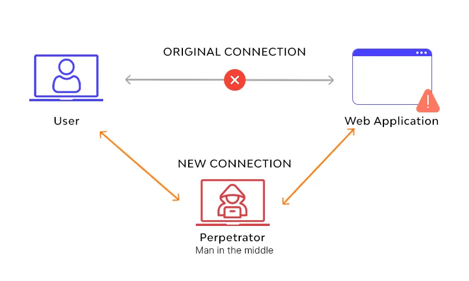
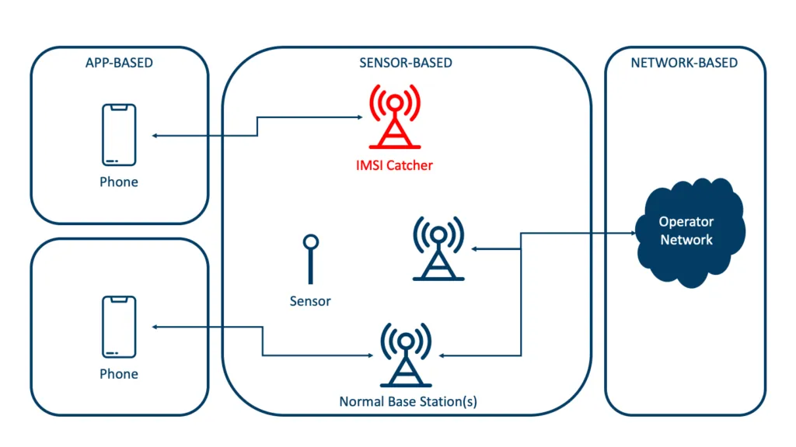
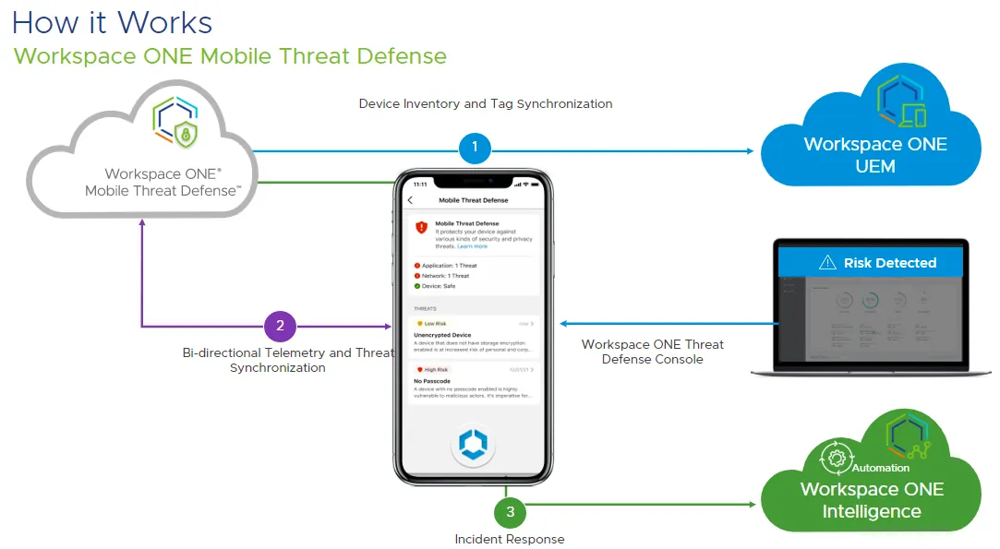

# Mobil Tehdit Algılama (MTD) ve Ağ Tabanlı Tehditler

Kurumsal varlıklara erişen uç noktaların büyük çoğunluğu artık mobil cihazlardan geçmektedir. BYOD, COPE ve CYOD modelleriyle birlikte akıllı telefonlar ve tabletler yalnızca iletişim aracı değil; e-posta, bulut depolama, VPN ve kurumsal uygulamalara açılan birincil kapılardır. Mobil Cihaz Yönetimi (MDM) ve Mobil Uygulama Yönetimi (MAM) çözümleri yapılandırma, politika dağıtımı ve uzaktan silme gibi yönetimsel kontrolleri başarıyla uygularken; çalışma zamanı tehditleri, sıfır-gün istismarları, gelişmiş kalıcı tehditler (APT) ve özellikle radyo katmanındaki ağ saldırılarını tespit etmede yapısal olarak yetersiz kalır.

**Mobil Tehdit Algılama (Mobile Threat Defense — MTD)**, cihaz üzerinde çalışan hafif ajanlar veya uygulama içi gömülü SDK'lar aracılığıyla cihaz, uygulama, ağ ve kimlik avı tehditlerini gerçek zamanlı olarak tespit eden, analiz eden ve hafifleten bir güvenlik katmanıdır. NIST SP 800-124 Rev. 2 kılavuzu, MTD'nin EMM/MDM sistemleriyle entegre edilerek otomatik yanıt (karantina, erişim engelleme, uygulama kaldırma) yeteneği kazandırılmasını ve Savunma Derinliği (Defense in Depth) mimarisinde mobil uç nokta koruma katmanının güçlendirilmesini açıkça önerir. Bu bölümde MTD'nin kurumsal mimarideki konumunu, hücresel ağ tehditlerine karşı koruma stratejilerini ve herkese açık Wi-Fi ortamlarında cihaz içi davranışsal analiz yöntemlerini teknik derinlikte ele alacağız.


*Şekil 8.2.0: Savunma Derinliği prensibi çerçevesinde mobil güvenlik katmanları. MTD, MDM/MAM'in politika katmanını tehdit algılama ve yanıt yeteneğiyle tamamlar.*

---

## §8.2.1. MDM/MAM Boşlukları, MTD Mimari Konumu ve EDR/XDR/SIEM Entegrasyonu

### MDM/MAM'ın Yapısal Sınırlılıkları

MDM ve MAM çözümleri kurumsal mobilite stratejisinin temel taşlarıdır; ancak doğası gereği **yönetim ve politika uygulama** odaklıdır, **tehdit algılama ve yanıt** yetkinlikleri sınırlıdır. MDM'in temel işlevleri cihaz envanteri, şifreleme ve parola politikaları, uygulama dağıtımı ile uzaktan silme ve kilitleme operasyonlarını kapsar. MAM ise özellikle BYOD senaryolarında yalnızca yönetilen uygulamaları ve bunların verisini kontrol eder.

Aşağıdaki tablo, MDM/MAM'ın kapatamadığı kritik boşlukları ve MTD'nin bu alanlara sağladığı katkıyı özetlemektedir:

| Boşluk Alanı | MDM/MAM Sınırlılığı | MTD'nin Sağladığı Katkı |
|---|---|---|
| **Sıfır Gün Saldırıları** | Bilinen zafiyetlere dayalı politika uygular | Davranışsal analiz ile bilinmeyen tehditleri tespit eder |
| **Ağ Tabanlı Tehditler** | Ağ bağlantısını yönetir ancak tehdit analizi yapmaz | Sahte baz istasyonu, MitM ve kötü niyetli Wi-Fi tespiti |
| **Kötü Amaçlı Uygulamalar** | İzin verilen/verilmeyen uygulama listesi tutar | Çalışma zamanı davranış analizi ile gizli tehditleri ortaya çıkarır |
| **Kimlik Avı (Phishing)** | Uygulama bazlı engelleme yapamaz | Mobil tarayıcı ve uygulama içi phishing tespiti |
| **Baseband Anomalileri** | Modem katmanına görünürlük sağlamaz | Hücresel ağ parametre anomalisi ve downgrade tespiti |
| **SOC Görünürlüğü** | Olay telemetrisi üretmez | SIEM/XDR/SOAR'a yapılandırılmış olay akışı sağlar |

> [!WARNING]
> **Yalnızca MDM ile "güvenli mobilite" varsayımı tehlikelidir.** Bir cihaz MDM uyumlu görünürken aynı anda sahte bir Wi-Fi ağına bağlı olabilir, root/jailbreak durumunda çalışıyor olabilir veya IMSI Catcher tarafından izleniyor olabilir. MTD, bu "görünür uyumluluk — gerçek risk" ayrımını kapatır.

### MTD Katmanının Mimari Konumu

Bir Güvenlik Çözüm Mimarı perspektifinden MTD, Savunma Derinliği stratejisinin **mobil uç nokta katmanında** konumlandırılmalıdır. MTD ajanı cihaz üzerinde hafif bir servis veya uygulama içi SDK olarak çalışır; telemetriyi gerçek zamanlı analiz ederek risk skoru üretir ve bu skoru kurumsal güvenlik ekosistemine besler.

```
┌─────────────────────────────────────────────────────────────────┐
│                       KURUMSAL BULUT / VERİ MERKEZİ             │
│  ┌─────────────┐  ┌─────────────┐  ┌─────────────┐             │
│  │   SIEM/XDR  │◄─┤    EDR      │◄─┤    MTD      │             │
│  │  (Wazuh,    │  │ (Defender,  │  │ (Zimperium, │             │
│  │   Splunk)   │  │ CrowdStrike)│  │  Lookout)   │             │
│  └─────────────┘  └─────────────┘  └─────────────┘             │
│         ▲               ▲               ▲                      │
│  ┌──────┴───────────────┴───────────────┴──────┐               │
│  │            INTUNE / WORKSPACE ONE            │               │
│  │         (MDM + Koşullu Erişim)              │               │
│  └──────────────────────────────────────────────┘               │
└─────────┼───────────────────────────────────────────────────────┘
          ▼
┌─────────────────────────────────────────────────────────────────┐
│                     MOBİL UÇ NOKTA KATMANI                      │
│  ┌───────────┐  ┌───────────┐  ┌───────────────────┐           │
│  │    MDM    │  │    MAM    │  │   MTD Aracısı     │           │
│  │ (Politika)│  │(Uygulama) │  │ (Davranışsal AI)  │           │
│  └───────────┘  └───────────┘  └───────────────────┘           │
└─────────────────────────────────────────────────────────────────┘
```

MTD'nin kurumsal topolojideki entegrasyon noktaları üç ana eksende toplanır:

| Entegrasyon Ekseni | Protokol / Mekanizma | Operasyonel Çıktı |
|---|---|---|
| **MDM/UEM** | Service-to-service connector, REST API | Risk skoru → uyumluluk politikası → Koşullu Erişim |
| **EDR/XDR** | Syslog, webhook, Graph API, Sentinel connector | Mobil + masaüstü olay korelasyonu |
| **SIEM/SOAR** | JSON olay akışı, Wazuh decoder, playbook tetikleyici | Otomatik oturum iptali, karantina, SOC vakası |

### Microsoft Intune MTD Bağlayıcısı

Microsoft Intune, MTD partner çözümleriyle servis-servis bağlantısı (service-to-service connector) üzerinden entegre çalışır. Bağlayıcı kurulumu ve yapılandırması şu adımları kapsar:

1. **Partner Konsolunda Yetkilendirme:** MTD sağlayıcısı (Zimperium zConsole, Lookout Admin Console veya Defender portalı) üzerinden Microsoft Entra ID entegrasyonu onaylanır. MTD çözümü Intune ortamından kullanıcı ve cihaz envanterini çekme, tehdit verilerini Intune'a yazma ve dizin verilerini okuma yetkisi elde eder.
2. **Intune Bağlayıcı Aktivasyonu:** `Tenant Administration > Connectors and Tokens > Mobile Threat Defense` menüsünden partner seçilir ve senkron sıklığı ile compliance state mapping yapılandırılır.
3. **Uyumluluk Politikası:** `Device Compliance > Mobile Threat Defense` altında kabul edilebilir maksimum tehdit seviyesi belirlenir.
4. **Koşullu Erişim:** Non-compliant cihazların Exchange Online, SharePoint, VPN ve LOB uygulamalarına erişimi otomatik engellenir.

**Intune MTD Bağlayıcı Konfigürasyon Parametreleri (Örnek):**

```
MTD Connector Configuration:
├── Connector Status: Active
├── Partner: Zimperium / Lookout / Microsoft Defender for Endpoint
├── Platform Support: Android 9.0+, iOS 15.0+
├── Threat Level Thresholds:
│   ├── Secured: 0 threat allowed (En güvenli)
│   ├── Low: Low-level threats tolerated
│   ├── Medium: Low/Medium threats tolerated
│   └── High: All but High-level threats tolerated
└── Conditional Access Policies:
    ├── Block: Corporate Email
    ├── Block: Corporate File Sync
    ├── Block: LOB Apps
    └── Block: Corporate Network Access
```

**Entegrasyon Akışı (Saldırı Senaryosu):**

1. Kullanıcı kötü amaçlı bir Wi-Fi ağına bağlanır.
2. MTD aracısı SSL sertifika anomalisi ve ağ trafiğinde MitM tespit eder.
3. MTD bulutu risk skorunu günceller (örneğin 85/100 — Yüksek Risk).
4. Intune MTD bağlayıcısı risk skorunu alır ve cihazı "Uyumsuz" olarak işaretler.
5. Koşullu Erişim politikası devreye girer: e-posta, OneDrive/SharePoint ve şirket içi uygulamalara erişim kesilir.
6. Kullanıcıya iyileştirme (remediation) adımları gösterilir.
7. SOC, SIEM/XDR üzerinden olay bildirimi alır.

### EDR/XDR ve SIEM Entegrasyon Mimarisi

Geleneksel EDR çözümleri mobil cihazların benzersiz mimarisini, sandbox kısıtlarını ve risk profilini ele almada yetersiz kalır. Mobil işletim sistemleri çekirdek seviyesinde kancalamaya (hooking) izin vermediğinden EDR ajanlarının gereksinim duyduğu düşük seviyeli sistem görünürlüğü engellenir. MTD bu boşluğu doldurur ve toplanan olayları kurumsal güvenlik operasyon merkezine (SOC) akıtır.

**Üç Katmanlı Entegrasyon Mimarisi:**

| Katman | Bileşen | Toplanan Veri |
|---|---|---|
| **Cihaz İçi Telemetri** | MTD ajanı (zIPS, Lookout, Defender Mobile) | OS olay günlükleri, uygulama davranışları, ağ durumu, sertifika doğrulamaları |
| **Bulut Tabanlı Analiz** | MTD bulut servisi / on-device ML motoru | Risk skoru (0-100), tehdit istihbaratı, IoC eşleştirmesi |
| **Kurumsal Entegrasyon** | Intune connector, SIEM collector, XDR API | Uyumluluk durumu, SOC alarmları, SOAR playbook tetikleyicileri |

Modern XDR platformları (Microsoft Defender XDR, Palo Alto Cortex XDR) mobil endpoint telemetrisini uç nokta, ağ ve bulut telemetrisiyle korelasyona alır. Aynı kullanıcı kimliğiyle hem laptop EDR uyarısı hem mobil MTD uyarısı üretildiğinde çapraz-domain XDR vakası oluşur ve otomatik müdahale playbook'ları tetiklenebilir.

### MTD Sağlayıcı Karşılaştırması (2026)

Kurumsal MTD seçiminde değerlendirilmesi gereken temel sağlayıcılar ve farklılaştırıcı özellikleri:

| Özellik | Zimperium zIPS / z9 | Lookout Mobile EDR | Microsoft Defender for Endpoint Mobile |
|---|---|---|---|
| **Tespit Motoru** | On-device AI (z9), bulut bağımsız çalışabilir | Bulut + cihaz hibrit ML | Defender tehdit istihbaratı + cihaz analizi |
| **Ağ Tehdit Tespiti** | MitM, rogue Wi-Fi, hücresel anomali | Rogue Wi-Fi, SSL stripping, ağ davranışı | Ağ tehdidi, phishing, cihaz riski |
| **MDM Entegrasyonu** | Intune, Workspace ONE, Jamf | Intune, geniş UEM desteği | Native Intune + Entra ID entegrasyonu |
| **SIEM Entegrasyonu** | Splunk, Sumo Logic, Azure Sentinel | Splunk Mobile EDR connector | Microsoft Sentinel, Defender XDR |
| **Gizlilik Modeli** | Privacy-first; kişisel veri toplamaz | Kurumsal telemetri odaklı | M365 ekosistemi veri politikaları |
| **Lisanslama** | Bağımsız MTD lisansı | Bağımsız MTD lisansı | M365 E5 / Defender for Endpoint Plan 2 dahil |
| **İdeal Kullanım** | Regüle sektörler, gizlilik-hassas ortamlar | Geniş kurumsal dağıtım, köklü MTD geçmişi | Microsoft-merkezli altyapılar, birleşik XDR |

> [!NOTE]
> **Microsoft Defender for Endpoint Mobile**, halihazırda M365 E5 veya Defender for Endpoint Plan 2 lisansına sahip kuruluşlar için ek MTD lisansı gerektirmeden Intune, Entra ID ve Defender XDR ile native entegrasyon sunar. Zimperium ise on-device AI motoru sayesinde bulut bağlantısı olmadan da tespit yapabilir; bu özellik gizlilik-hassas ve regüle sektörlerde kritik bir farklılaştırıcıdır.

### NIST, MITRE ATT&CK ve Türkiye Mevzuatı Eşleştirmesi

**NIST SP 800-53 Rev. 5 Kontrolleri:**

| Kontrol | Açıklama | MTD ile İlişkisi |
|---|---|---|
| **AC-19** | Mobil Cihazlar için Erişim Kontrolü | MTD risk skoruna göre dinamik erişim kontrolü |
| **AC-20** | Kurum Kontrolünde Olmayan Mobil Cihazlar | BYOD senaryolarında MTD/MAM entegrasyonu |
| **SI-4** | Bilgi Sistemi İzleme | MTD telemetrisinin SIEM'e entegrasyonu |
| **SC-7** | Sınır Koruması | Güvensiz ağlardan korunma ve ağ izolasyonu |
| **SC-8** | İletim Gizliliği ve Bütünlüğü | TLS/SSL anomali tespiti ve şifreleme doğrulaması |

**MITRE ATT&CK for Mobile — MTD Kapsamındaki Teknikler:**

| Taktik | Teknik | MTD Tespit Yeteneği |
|---|---|---|
| **Initial Access** | T1660 — Phishing | Mobil tarayıcı ve uygulama içi phishing tespiti |
| **Discovery** | T1420 — Network Service Scanning | Sahte AP ve ağ keşif anomalisi |
| **Collection** | T1412 / T1439 — Network Traffic Capture | MitM ve trafik yönlendirme tespiti |
| **Command and Control** | T1443 — Network Connection Manipulation | Sahte baz istasyonuna yönlendirme |
| **Defense Evasion** | T1638 — Adversary-in-the-Middle | SSL stripping, sertifika enjeksiyonu |
| **Defense Evasion** | T1436 — Protocol Downgrade | 5G→4G→2G düşürme saldırıları |

**Türkiye Mevzuatı:**

- **KVKK (6698 Sayılı Kanun):** MTD sistemlerinin ürettiği olay logları (cihaz kimliği, konum, ağ olayları) kişisel veri niteliği taşıyabilir. Veri minimizasyonu, amaçla sınırlılık ve güvenli saklama ilkeleri uygulanmalıdır. Veri ihlali tespitinde 72 saat içinde KVKK Kurulu'na bildirim yükümlülüğü geçerlidir.
- **5651 Sayılı Kanun:** Kurumsal hotspot veya internet erişim hizmeti sunan kuruluşlar trafik loglarını (IP, MAC, zaman, hedef) 6 ay–2 yıl saklamakla yükümlüdür. MTD ağ tehdit logları bu kapsama girerse zaman damgalı ve değiştirilemez şekilde tutulmalıdır.
- **BDDK Yönetmeliği:** Bankacılık sektöründe mobil kanalların uçtan uca güvenliği zorunludur. Cihaz bütünlüğü kontrolleri, root/jailbreak tespiti, veri izolasyonu ve güvenlik olay loglaması MTD ile güçlendirilmelidir.

---

## §8.2.2. Hücresel Ağ Tehditleri: IMSI Catcher, 5G SUCI ve Protokol Düşürme Saldırıları

### IMSI Catcher Teknik Analizi

Uluslararası Mobil Abone Kimliği (IMSI) Catcher — Stingray, Hailstorm veya False Base Station (FBS) olarak da bilinir — meşru bir baz istasyonunu taklit ederek yakındaki mobil cihazları kendisine bağlanmaya ikna eden bir elektronik gözetleme aygıtıdır. Saldırı aşamaları şu şekilde gerçekleşir:

1. **Sinyal Üstünlüğü:** IMSI Catcher, meşru baz istasyonlarından daha güçlü bir sinyal yayınlar veya hedef frekansları bozucu sinyallerle karıştırır (jamming).
2. **Cihaz Bağlantısı:** Mobil cihaz, en güçlü sinyale sahip "baz istasyonuna" otomatik bağlanır.
3. **Kimlik İsteme:** Sahte istasyon, henüz şifreli güvenlik kanalı kurulmadan önce cihaza şifrelenmemiş Identity Request mesajı gönderir.
4. **Protokol Düşürme:** 2G protokolüne düşüş zorlanır; karşılıklı kimlik doğrulama olmayan 2G'de şifreleme zayıflatılır veya devre dışı bırakılır.
5. **Veri Toplama:** IMSI, konum, SMS, çağrı ve veri trafiği toplanır veya manipüle edilir.



*Şekil 8.2.1: IMSI Catcher tespit yaklaşımları. Uç nokta (MTD ajanı), donanım sensörü ve operatör düzeyi ağ izleme katmanları birlikte değerlendirilmelidir.*

### GSM'den 5G'ye Güvenlik Evrimi ve SUCI Mekanizması

Hücresel ağ nesilleri arasında IMSI koruması kademeli olarak güçlendirilmiştir; ancak geriye dönük uyumluluk zorunlulukları nedeniyle downgrade saldırıları hâlâ geçerlidir:

| Nesil | IMSI Koruması | Zafiyet Durumu |
|---|---|---|
| **2G (GSM)** | Açık metin IMSI iletimi | Tamamen zafiyetli; karşılıklı kimlik doğrulama yok |
| **3G (UMTS)** | Açık metin IMSI iletimi (kısmen) | Zafiyetli |
| **4G (LTE)** | GUTI ile geçici kimlik; ancak ilk bağlantıda IMSI açık | Kısmen zafiyetli |
| **5G (NR)** | SUCI ile şifreli SUPI iletimi | Kısmen çözüldü; fallback ile istismar edilebilir |

5G'de kalıcı abone kimliği (SUPI) ağın açık anahtarıyla şifrelenerek **SUCI** (Subscription Concealed Identifier) haline getirilir. Pasif gözlemci kalıcı kimliği okuyamaz. Ancak 5G ağları 4G/2G fallback sürdükçe downgrade saldırıları geçerli kalır; paging mesajları, Measurement Report'lar ve tam uygulanmayan operatör altyapılarında hâlâ istismar edilebilir alanlar mevcuttur.



*Şekil 8.2.2: 5G ağ mimarisinde SUCI mekanizması. SUPI şifrelemesi pasif dinlemeyi zorlaştırır; ancak protokol düşürme saldırıları bu korumayı atlayabilir.*

> [!CAUTION]
> **5G SUCI tek başına IMSI Catcher tehdidini ortadan kaldırmaz.** Saldırgan, cihazı 5G'den 4G veya 2G'ye zorlayarak (downgrade attack) şifreleme korumasını atlayabilir. Kurumsal politikada 2G'nin devre dışı bırakılması ve MTD ile hücresel anomali tespiti birlikte uygulanmalıdır.

### Uç Nokta Koruma Stratejileri

Modern MTD çözümleri ve işletim sistemi sıkılaştırma politikaları, sahte baz istasyonu tespiti ve önlenmesi için çok katmanlı savunma sunar:

| Koruma Kategorisi | Uygulama Yöntemi | Operasyonel Çıktı |
|---|---|---|
| **İşletim Sistemi Sıkılaştırma** | MDM ile 2G fallback kapatma; iOS Lockdown Mode; Android Gelişmiş Koruma | Karşılıklı kimlik doğrulaması olmayan 2G bağlantıları engellenir |
| **Yama ve Sürüm Denetimi** | MDM uyumluluk kuralı: `ro.build.version.security_patch >= 2026-03-01` | Kritik baseband zafiyetlerine karşı bağışıklık |
| **Radyo Telemetri Analizi** | LAC/TAC anomalileri, OpenCellID doğrulaması, Cell ID haritalama | Meşru operatör haritasında bulunmayan sanal hücreler tespit edilir |
| **Sinyal ve Şifreleme İzleme** | Anormal dBm değişimleri, şifreleme algoritması zayıflatma tespiti | Aktif IMSI Catcher aygıtları yakalanır |
| **VPN Zorunluluğu** | Always-On VPN politikası; hücresel trafikte bile şifreleme | Trafik ele geçirilse bile içerik okunamaz |
| **Modem Çökme Analizi** | Android bugreport, iOS teşhis logları, baseband kernel panic | Başarısız baseband sömürü girişimleri tespit edilir |

**Örnek Anomali Tespit Mantığı (Kavramsal):**

```python
def detect_rogue_base_station(cell_parameters):
    anomalies = []

    # Sinyal gücü anomalisi
    if cell_parameters.signal_strength > threshold_expected_max:
        anomalies.append("Sinyal gücü normalin üzerinde")

    # LAC (Location Area Code) anomalisi
    if cell_parameters.lac not in known_lac_list:
        anomalies.append("Bilinmeyen Lokasyon Alan Kodu")

    # Şifreleme düşürme tespiti
    if cell_parameters.encryption in ("A5/1", "none"):
        anomalies.append("Zayıf şifreleme protokolü tespit edildi")

    # Hücre kimliği anomalisi
    if cell_parameters.cell_id not in operator_cell_database:
        anomalies.append("Bilinmeyen Hücre Kimliği")

    return anomalies
```

### MITRE ATT&CK Mobil Matrisi — Hücresel Ağ Teknikleri

| Taktik | Teknik | Açıklama |
|---|---|---|
| **Keşif** | T1430 — Lokasyon Bilgisi Toplama | IMSI Catcher ile cihaz konumlandırma |
| **Toplama** | T1412 — Ağ Trafiği Yakalama | SMS ve çağrı içeriğinin ele geçirilmesi |
| **Komuta ve Kontrol** | T1443 — Ağ Bağlantısı Manipülasyonu | Sahte baz istasyonuna yönlendirme |
| **Savunmadan Kaçınma** | T1436 — Protokol Düşürme | 5G→4G→2G düşürme saldırıları |

**Saldırı-Savunma Senaryosu:**

Saldırgan bir etkinlik alanında taşınabilir FBS ile üst düzey yöneticileri hedefler. Cihaz downgrade girişiminde bulunur veya şüpheli hücreye geçer. MTD "anormal hücre değişimi / downgrade girişimi" sinyali üretir → Intune üzerinden uyarı ve VPN zorunluluğu → SOC vakası açılır. Kullanıcı bilgilendirilir; gerekirse cihaz karantinaya alınır. Bu döngü, NIST'in çok katmanlı yaklaşımı ve BDDK'nın cihaz bütünlüğü kontrolü gerekliliklerini karşılar.

**Türkiye Mevzuatı — Hücresel Ağ Bağlamı:**

- **KVKK:** IMSI Catcher ile ele geçirilen IMSI numaraları kişisel veri niteliğindedir. Veri sorumlusu bu tür bir ihlali 72 saat içinde KVKK Kurulu'na bildirmekle yükümlüdür.
- **5651:** İnternet servis sağlayıcılarının kullanıcı trafiğine ilişkin logları 6 ay–2 yıl süreyle saklama zorunluluğu geçerlidir.
- **BDDK:** Bankalar, mobil bankacılık kanallarında sahte baz istasyonu saldırılarına karşı önlem almak, cihaz bütünlüğü kontrolleri uygulamak ve güvenlik olaylarını loglamakla yükümlüdür.

---

## §8.2.3. Herkese Açık Wi-Fi Ağlarında MitM Tespiti, Davranışsal Analiz ve SOAR Entegrasyonu

### Wi-Fi MitM Saldırı Teknikleri

Herkese açık Wi-Fi ağlarında Ortadaki Adam (Man-in-the-Middle — MitM) saldırıları, saldırganın kullanıcı ile internet arasına girerek veri akışını kesintiye uğratması veya değiştirmesidir. Saha araştırmaları, gerçek dünya Wi-Fi ağlarının büyük çoğunluğunun bu saldırılara karşı savunmasız olduğunu göstermektedir.

**Başlıca MitM Saldırı Vektörleri:**

| Saldırı Türü | Çalışma Prensibi | Tespit Zorluğu |
|---|---|---|
| **Sahte Erişim Noktası (Evil Twin / Rogue AP)** | Meşru ağ adını taklit eden AP oluşturma | Orta |
| **ARP Zehirleme** | ARP tablosunu manipüle ederek trafik yönlendirme | Yüksek |
| **DNS Sahtekarlığı** | DNS sorgularını sahte IP'ye yönlendirme | Orta |
| **SSL Sıyırma (Stripping)** | HTTPS'yi HTTP'ye düşürme | Orta |
| **Sertifika Sahteciliği** | Sahte SSL sertifikası ile trafik şifresini çözme | Düşük (MTD ile tespit edilebilir) |
| **Captive Portal Kimlik Avı** | Sahte Wi-Fi portalları kurumsal kimlik bilgilerini toplar | Orta |



*Şekil 8.2.3: Evil Twin saldırısı ve MTD'nin cihaz içi davranışsal tespit mantığı. Sertifika anomalisi, ARP tablosu değişimi ve RTT gecikme sapması birlikte değerlendirilir.*

### Cihaz İçi Davranışsal Analiz Yöntemleri

Geleneksel imza tabanlı güvenlik yazılımları yeni nesil dinamik MitM tekniklerini tespit etmede yetersiz kalır. MTD çözümleri, mobil cihazın kaynak tüketimini optimize edecek şekilde tasarlanmış makine öğrenimi tabanlı anomali tespit algoritmaları kullanır.

**A. Sertifika ve TLS/SSL Anomalisi Tespiti**

MTD çözümleri SSL/TLS el sıkışması sırasında aşağıdaki anomalileri tespit eder:

```python
def validate_ssl_certificate(certificate, expected_pins):
    if not certificate.chain_verified:
        return "Zincir doğrulaması başarısız — Potansiyel MitM"

    if expected_pins and certificate.public_key_hash not in expected_pins:
        return "Sertifika sabitleme uyuşmazlığı — MitM şüphesi"

    if certificate.not_valid_after < datetime.now():
        return "Geçersiz sertifika süresi"

    if certificate.signature_algorithm in ("MD5", "SHA1"):
        return "Zayıf imza algoritması kullanımı"

    if not certificate.subject_matches(domain):
        return "Sertifika konu uyuşmazlığı — Potansiyel MitM"

    return "Sertifika geçerli"
```

**B. Ağ Trafiği Davranışsal Analizi**

Cihaz içi davranışsal analiz motoru şu trafik örüntülerini izler:

1. **Beklenmeyen Sertifika Değişiklikleri:** Belirli bir etki alanı için sertifika parmak izinde değişiklik.
2. **Protokol Düşürme Tespiti:** HTTPS→HTTP, TLS 1.3→TLS 1.0 düşüşleri.
3. **DNS Yanıt Anomalileri:** Beklenmeyen IP adresleri, TTL değerlerinde anormallik.
4. **Trafik Yoğunluğu Anomalileri:** Normalin üzerinde veya altında veri akışı.
5. **Yönlendirme Anomalileri:** Beklenmeyen ağ geçidi (gateway) MAC adresleri.

**C. Sezgisel ve Kural Tabanlı Kontroller**

Makine öğrenimi modellerine ek olarak MTD motoru şu sezgisel kontrolleri yürütür:

| Kontrol | Yöntem | Tespit Edilen Saldırı |
|---|---|---|
| **Geçit MAC Doğrulaması** | ARP tablosu sürekli tarama; gateway MAC değişimi | ARP Spoofing |
| **ICMP RTT Latency Sapması** | Gateway'e ICMP yanıt süreleri; baseline üzerindeki artış | MitM köprü trafiği |
| **Root CA Denetimi** | Sistem/uygulama sertifika deposunda yetkisiz CA | SSL stripping / interception |
| **BSSID/SSID Uyuşmazlığı** | Bilinen SSID ama farklı BSSID veya güvenlik protokolü | Evil Twin |

**D. Makine Öğrenmesi Tabanlı Tespit**

Modern MTD çözümleri AI/ML teknolojilerini kullanarak:

- **Denetimli Öğrenme:** Bilinen MitM saldırı örüntüleri ile eğitilmiş modeller.
- **Anomali Tespiti (OC-SVM):** Normal ağ davranışından sapmaların belirlenmesi; zero-day ağ manipülasyonları outlier olarak algılanır.
- **Davranışsal Profil Oluşturma:** Her cihaz ve uygulama için normal davranış profilinin çıkarılması.

### Örnek MTD Olay Günlüğü (JSON)

Aşağıda bir MTD çözümünün MitM saldırısı tespit ettiğinde üretebileceği örnek log çıktısı yer almaktadır:

```json
{
  "event_id": "MTD-2026-06-20-084523-001",
  "event_type": "THREAT_DETECTED",
  "threat_category": "MITM_ATTACK",
  "threat_name": "ARP_SPOOFING_MITM",
  "severity": "CRITICAL",
  "timestamp": "2026-06-20T08:45:23.456Z",
  "device_info": {
    "device_id": "DEV-42A1B3C5",
    "device_uuid": "e920d3f1-7c91-4c28-be90-9912a201ab2a",
    "owner_email": "can.ozdemir@kurum.com.tr",
    "platform": "Android 14",
    "model": "Samsung Galaxy S24",
    "enrollment_status": "MDM_ENROLLED",
    "is_jailbroken": false
  },
  "network_info": {
    "ssid": "Havalimani_Ucretsiz_WiFi",
    "bssid": "AA:BB:CC:DD:EE:FF",
    "connection_type": "WiFi",
    "ip_address": "192.168.1.100",
    "gateway_ip": "192.168.1.1",
    "gateway_mac": "11:22:33:44:55:66",
    "claimed_gateway_mac": "00:DE:AD:BE:EF:01",
    "actual_gateway_mac": "11:22:33:44:55:66"
  },
  "detection_details": {
    "anomalies": [
      {
        "type": "CERTIFICATE_PINNING_FAILURE",
        "domain": "api.kurum.com.tr",
        "expected_pin": "sha256/AAAAAAAAAAAAAAAAAAAAAAAAAAAAAAAAAAAAAAAAAAA=",
        "observed_pin": "sha256/BBBBBBBBBBBBBBBBBBBBBBBBBBBBBBBBBBBBBBBBBBB="
      },
      {
        "type": "PROTOCOL_DOWNGRADE",
        "observed": "TLS 1.0",
        "expected": "TLS 1.3"
      },
      {
        "type": "DNS_RESPONSE_ANOMALY",
        "domain": "api.kurum.com.tr",
        "expected_ip": "203.0.113.10",
        "observed_ip": "198.51.100.20"
      }
    ],
    "forensic_indicators": {
      "rtt_latency_ms": 185.4,
      "rtt_baseline_ms": 8.1,
      "ssl_stripping_attempted": true,
      "untrusted_root_ca_detected": true,
      "injected_ca_common_name": "Attacker_Proxy_CA"
    },
    "risk_score": 92,
    "confidence": 0.98
  },
  "remediation": {
    "action_taken": "NETWORK_ISOLATION",
    "local_action": "VIRTUAL_SHIELD_ACTIVATED",
    "corporate_access_blocked": true,
    "intune_compliance_notified": "NON_COMPLIANT",
    "user_notified": true,
    "soc_alert_sent": true
  },
  "compliance_status": "NON_COMPLIANT"
}
```

### Wazuh SIEM Kural Tanımlamaları

MTD olay günlüklerini analiz etmek ve SOC analistlerine otomatik uyarı üretmek için Wazuh decoder ve kural blokları:

```xml
<!-- /var/ossec/etc/decoders/local_decoder.xml -->
<decoder name="zimperium-mtd">
  <parent>json</parent>
  <use_own_name>true</use_own_name>
</decoder>

<!-- /var/ossec/etc/rules/local_rules.xml -->
<group name="zimperium,mobile_threat,network_attack">
  <!-- Genel MTD Olay Karşılayıcı -->
  <rule id="110001" level="3">
    <decoded_as>json</decoded_as>
    <field name="threat_name">\.+</field>
    <description>MTD sisteminden mobil olay günlüğü alındı.</description>
  </rule>

  <!-- Kritik ARP Zehirlemesi ve MitM Alarmı -->
  <rule id="110002" level="13">
    <if_sid>110001</if_sid>
    <field name="threat_name">^ARP_SPOOFING_MITM$</field>
    <description>Kritik: Mobil Cihaza Karşı ARP Zehirlemesi (MitM) Saldırısı Tespit Edildi!</description>
    <group>mitm_attack,active_response</group>
  </rule>

  <!-- SSL Stripping / Güvensiz Kök CA Enjeksiyonu -->
  <rule id="110003" level="14">
    <if_sid>110001</if_sid>
    <field name="detection_details.forensic_indicators.untrusted_root_ca_detected">^true$</field>
    <description>Acil: Mobil Cihazda Şifresiz Trafik İzleme (SSL Stripping / Sahte Kök CA) Girişimi!</description>
    <group>credential_theft,data_exfiltration</group>
  </rule>

  <!-- Hücresel Ağ Anomalisi / IMSI Catcher Şüphesi -->
  <rule id="110004" level="12">
    <if_sid>110001</if_sid>
    <field name="threat_category">^CELLULAR_ANOMALY$</field>
    <description>Yüksek: Mobil Cihazda Şüpheli Hücresel Ağ Davranışı (IMSI Catcher Şüphesi).</description>
    <group>cellular_threat,imsi_catcher</group>
  </rule>

  <!-- Protokol Düşürme Saldırısı -->
  <rule id="110005" level="11">
    <if_sid>110001</if_sid>
    <field name="detection_details.anomalies.type">^PROTOCOL_DOWNGRADE$</field>
    <description>Yüksek: Mobil Cihazda Protokol Düşürme Saldırısı Tespit Edildi.</description>
    <group>protocol_downgrade,defense_evasion</group>
  </rule>
</group>
```

### SOAR Tabanlı Otomatik Olay Müdahale Playbook'u

SOC ekipleri, kritik Wazuh kuralları (Rule 110002 ve üzeri) tetiklendiğinde otomatik olay müdahale (SOAR) playbook'larını devreye almalıdır. Playbook akışı: SIEM alarmı → olay kaydı → cihaz/kullanıcı bilgisi çekme → Entra ID oturum iptali → Intune non-compliant işaretleme → kullanıcı bildirimi → IoC kaydı → post-incident rapor.

**Playbook Adımları:**

| Adım | Eylem | API / Araç | Beklenen Süre |
|---|---|---|---|
| 1 | Olay kaydı oluştur | Jira REST API / ServiceNow | < 5 saniye |
| 2 | Cihaz ve kullanıcı bilgisi çek | Intune Graph API | < 10 saniye |
| 3 | Oturumları iptal et | Entra ID `revokeSignInSessions` | < 15 saniye |
| 4 | Cihazı non-compliant işaretle | Intune compliance API | < 20 saniye |
| 5 | Kullanıcıya push bildirim gönder | Intune notification / MTD alert | < 30 saniye |
| 6 | IoC veritabanına ekle | Threat Intelligence platform | < 60 saniye |
| 7 | Post-incident rapor üret | SOAR raporlama modülü | Otomatik |

> [!WARNING]
> **SOAR playbook'ları test edilmeden üretime alınmamalıdır.** Yanlış yapılandırılmış bir playbook, meşru ağ değişikliklerinde (örneğin ofis taşınması sonrası yeni BSSID) tüm kurumsal erişimi kesintiye uğratabilir. Playbook'lar staging ortamında ve kontrollü red team senaryolarıyla doğrulanmalıdır.

### MITRE ATT&CK Mobil Matrisi — Wi-Fi MitM Teknikleri

| Taktik | Teknik | Açıklama |
|---|---|---|
| **Ağ Keşfi** | T1420 — Ağ Servisleri Keşfi | Sahte AP tespiti ve ağ tarama |
| **Hareket** | T1437 — Ağ Tabanlı Hareket | MitM ile trafik yönlendirme |
| **Toplama** | T1439 — Ağ Trafiği Yakalama | Veri sızdırma ve kimlik bilgisi çalma |
| **Savunmadan Kaçınma** | T1638 — Adversary-in-the-Middle | SSL sıyırma ile şifre çözme |
| **Savunmadan Kaçınma** | T1409 — Kök/Yetkisiz Erişim | Sertifika deposuna yetkisiz CA ekleme |

### Tamamlayıcı Kurumsal Kontroller

MTD'nin cihaz içi tespiti, aşağıdaki politika ve mimari kontrollerle birlikte uygulandığında en etkili sonucu verir:

| Kontrol | Uygulama | Standart Referansı |
|---|---|---|
| **Always-On VPN** | Tüm kurumsal trafik tünel üzerinden; split-tunneling yerine full-tunnel | NIST SP 800-124 Rev. 2 |
| **Güvenilmeyen Wi-Fi Engeli** | MDM politikası: açık Wi-Fi'ye otomatik bağlanma kapalı | CIS Controls v8 — Control 13 |
| **Sertifika Pinning** | Kritik uygulamalarda public key pinning + Certificate Transparency | OWASP Mobile Top 10 — M6 |
| **Per-App VPN** | Yalnızca yönetilen uygulamaların trafiği tünelden geçer | NIST SP 800-124 Rev. 2 |
| **Captive Portal Doğrulama** | Kurumsal misafir Wi-Fi'da RADIUS + 5651 loglama | 5651 Sayılı Kanun |

**Türkiye Mevzuatı — Wi-Fi MitM Bağlamı:**

- **KVKK:** MitM saldırısı ile ele geçirilen kişisel veriler (kullanıcı kimlik bilgileri, oturum bilgileri) veri ihlali kapsamında değerlendirilir. MTD logları delil olarak saklanmalı ve ihlal durumunda KVKK Kurulu'na bildirim yapılmalıdır.
- **5651:** Kurum misafir Wi-Fi sunduğunda "internet toplu kullanım sağlayıcı" kapsamına girer. İç IP dağıtım logları, MAC adresi ve oturum süreleri zaman damgalı olarak 2 yıl saklanmalıdır.
- **BDDK:** Bankalar, müşterilerinin kamuya açık Wi-Fi ağları üzerinden bankacılık işlemleri yapması durumunda MitM saldırılarına karşı ek güvenlik önlemleri (MTD zorunluluğu, uygulama içi sertifika pinning, Always-On VPN) almak zorundadır.

---

## Özet ve Mimari Öneriler

Bu bölümde ele alınan MTD ve ağ tabanlı tehdit yönetimi konusunun operasyonel çıkarımları şu başlıklar altında özetlenebilir:

1. **Savunma Derinliğinde MTD Konumu:** MTD, MDM/MAM'in politika uygulama kapasitesini tehdit algılama ve yanıt ile tamamlayan kritik bir katmandır. Cihaz üzerinde hafif bir aracı veya uygulama içi SDK olarak konumlandırılmalı; tek başına MDM ile "güvenli mobilite" varsayımından kaçınılmalıdır.

2. **MTD-EDR-XDR Entegrasyonu:** Mobil tehditlerin kurumsal SOC süreçlerine entegrasyonu için MTD-EDR-XDR entegrasyonu zorunludur. Intune MTD bağlayıcısı ve Koşullu Erişim politikaları ile risk bazlı erişim kontrolü sağlanmalıdır. Zimperium, Lookout ve Microsoft Defender for Endpoint Mobile arasındaki seçim; mevcut lisans yapısı, gizlilik gereksinimleri ve SIEM entegrasyon ihtiyaçlarına göre yapılmalıdır.

3. **Hücresel Ağ Güvenliği:** IMSI Catcher tehdidine karşı çok katmanlı savunma uygulanmalıdır: 5G öncelikli bağlantı, 2G devre dışı bırakma, Always-On VPN, sertifika sabitleme ve MTD ile hücresel anomali tespiti birlikte çalışmalıdır. 5G SUCI mekanizması pasif dinlemeyi zorlaştırır ancak protokol düşürme saldırıları bu korumayı atlayabilir.

4. **Wi-Fi MitM Tespiti ve Otomatik Yanıt:** Davranışsal analiz, sertifika doğrulama ve AI/ML tabanlı anomali tespiti ile kamuya açık Wi-Fi ağlarındaki MitM saldırıları gerçek zamanlı olarak tespit edilmeli; Wazuh kuralları ve SOAR playbook'ları ile otomatik yanıt mekanizmaları (ağ izolasyonu, oturum iptali, erişim engelleme) devreye sokulmalıdır.

5. **Mevzuat Uyumu:** MTD çözümlerinin ürettiği loglar, KVKK veri minimizasyonu ve ihlal bildirimi, 5651 zaman damgalı log saklama ve BDDK mobil bankacılık güvenlik gereksinimleri kapsamındaki yasal yükümlülüklerin yerine getirilmesinde kritik öneme sahiptir. MTD ajanları privacy-first mimariyle tasarlanmalı; kişisel fotoğraf, rehber veya mesaj içeriği kurumsal sunuculara aktarılmamalıdır.

6. **Operasyonel Hazırlık:** SOAR playbook'ları staging ortamında test edilmeli; SOC analistleri MITRE ATT&CK for Mobile matrisini mobil olay triyajında referans çerçeve olarak kullanmalıdır.