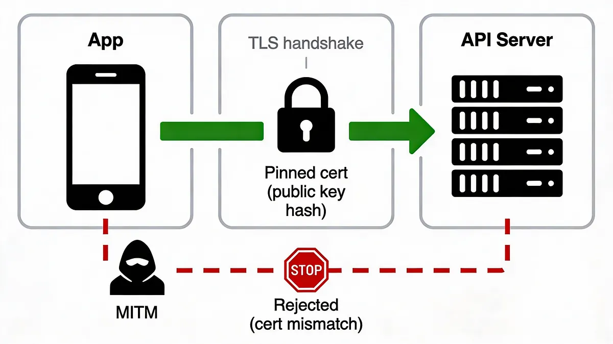
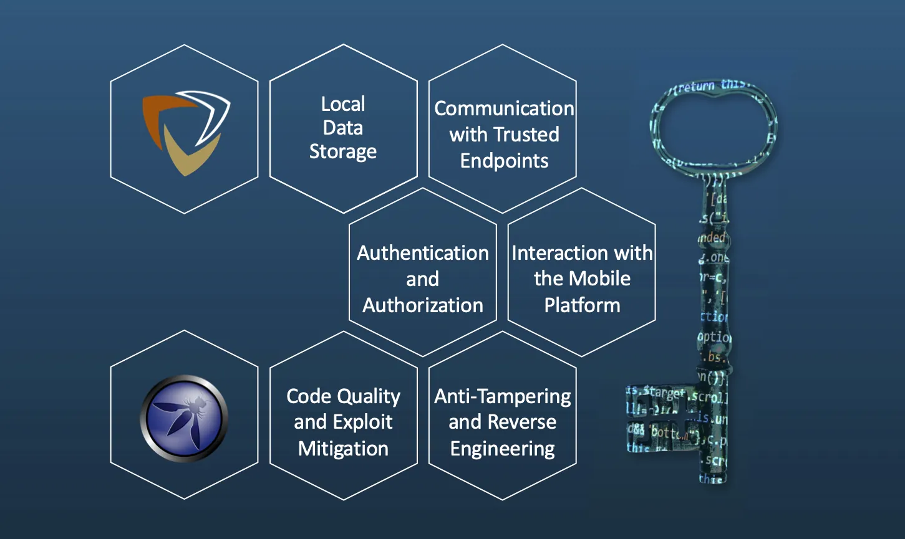
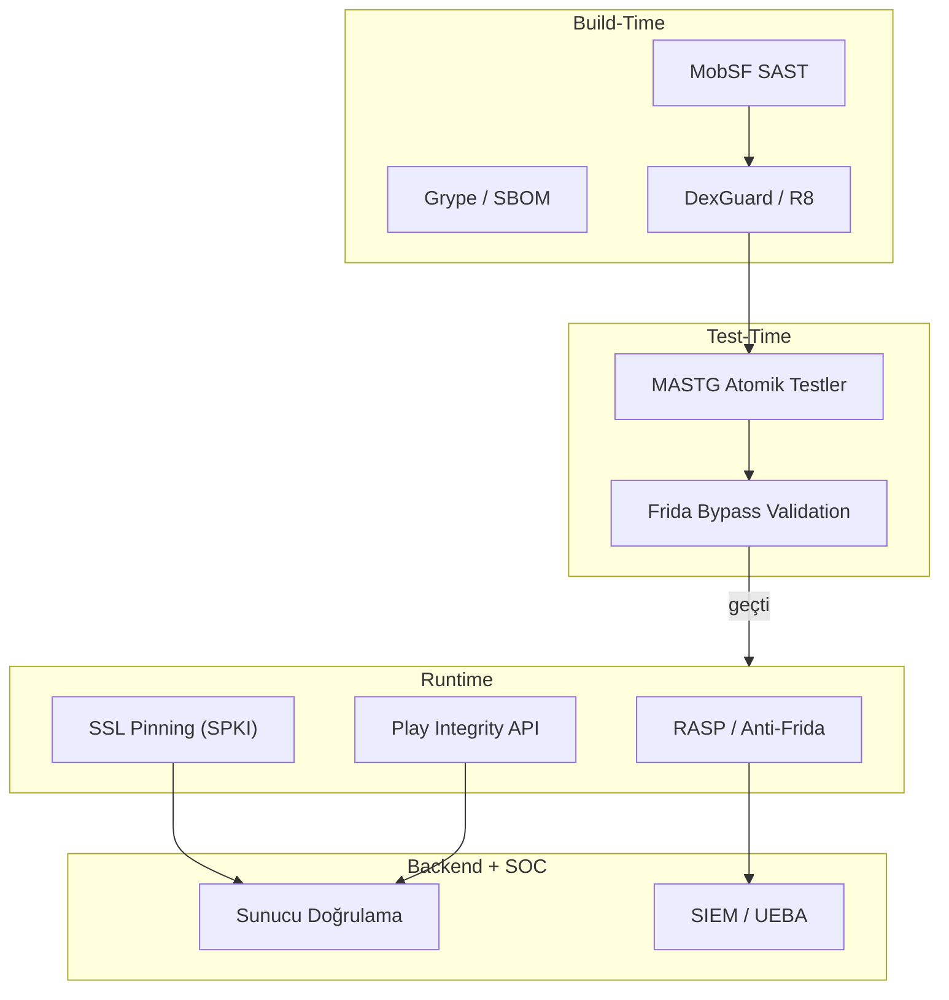
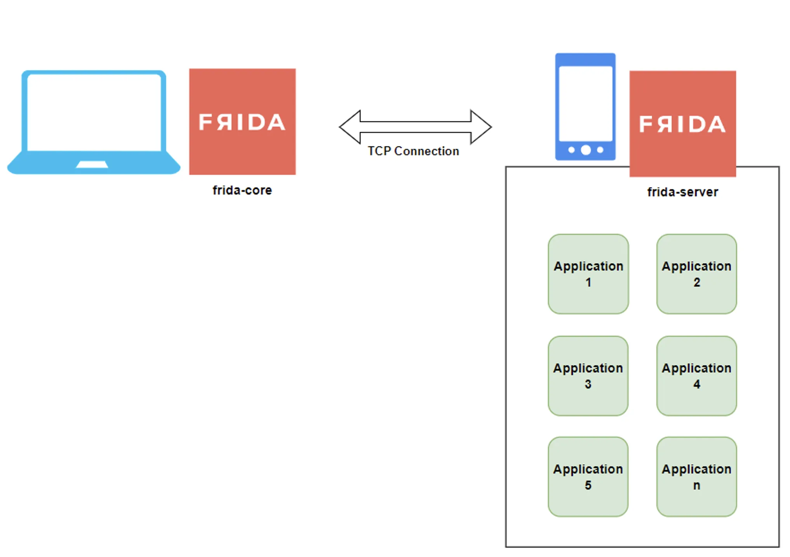

# Mobil Uygulama Güvenliği ve Tersine Mühendislik Korumaları

§8.1'deki MDM/MAM yönetimi ve §8.2'deki MTD tehdit tespiti, cihaz ve ağ katmanını korur. Ancak kurumsal uygulamaların kendisi — API anahtarları, iş mantığı ve istemci tarafı korumalar — ayrı bir savunma hattı gerektirir. Mobil uygulamalar, kurumsal **Savunma Derinliği (Defense in Depth)** mimarisinin en kırılgan katmanlarından birini oluşturur. Bankacılık, sağlık, kamu hizmetleri ve kurumsal iş uygulamaları kullanıcının fiziksel kontrolündeki cihazlara dağıtılır; saldırgan bu cihazlara tam erişim elde ettiğinde klasik ağ ve uç nokta kontrolleri yetersiz kalır. Tersine mühendislik, statik kod analizi, dinamik enstrümantasyon ve uygulama yeniden paketleme (repackaging) saldırıları, API anahtarlarının, kimlik doğrulama mantığının ve iş kurallarının ifşa olmasına yol açabilir.

Bu bölümde **OWASP MASVS v2.1**, **MASTG** (Mobile Application Security Testing Guide), **OWASP Mobile Top 10 2024**, **DexGuard/iXGuard**, **Frida/Objection**, **RASP** (Runtime Application Self-Protection) ve **Play Integrity API** çerçevelerinde mobil uygulama sertleştirme stratejileri ele alınmaktadır. Temel varsayım şudur: **istemci her zaman ihlal edilmiş olabilir**; bu nedenle istemci tarafı korumalar sunucu tarafı doğrulama, cihaz attestation ve SOC entegrasyonu ile tamamlanmalıdır.

```
┌─────────────────────────────────────────────────────────────────────────────┐
│                      MOBİL UYGULAMA GÜVENLİK MİMARİSİ                       │
│                         (Defense in Depth)                                  │
├─────────────────────────────────────────────────────────────────────────────┤
│  KATMAN 5: RUNTIME KORUMA  → Root/Jailbreak, Anti-Debug, Anti-Frida, RASP  │
│  KATMAN 4: İLETİŞİM        → SSL/TLS Pinning, mTLS, Sertifika Doğrulama    │
│  KATMAN 3: KOD KORUMA      → Obfuscation, String Encryption, Virtualization │
│  KATMAN 2: BÜTÜNLÜK        → Anti-Tampering, Integrity Check, Code Signing  │
│  KATMAN 1: GÜVENLİ GELİŞTİRME → MASVS, Secure Coding, SBOM, Dependency Scan │
└─────────────────────────────────────────────────────────────────────────────┘
```

---

## §8.3.1. OWASP MASVS, MASTG ve Statik/Dinamik Analiz Süreçleri

### OWASP MAS Ekosistemi

OWASP Mobil Uygulama Güvenliği (MAS) ekosistemi birbirini tamamlayan dört bileşenden oluşur:

| Bileşen | Rol | Operasyonel Kullanım |
|---------|-----|----------------------|
| **MASVS** | Güvenlik doğrulama standardı | Geliştirme ve denetim gereksinimleri |
| **MASWE** | Zayıflık enumerasyonu | Tehdit modelleme ve risk sınıflandırması |
| **MASTG** | Test rehberi ve atomik testler | Pentest ve güvenlik testi prosedürleri |
| **MAS Checklist** | Denetim kontrol listesi | Uyumluluk değerlendirmesi |

**MASVS v2.0.0** (Nisan 2023), eski L1/L2/R seviye yapısını kaldırarak kontrolleri işletim sisteminden bağımsız (agnostic) gruplara ayırmıştır. **MASVS v2.1.0** (Ocak 2024) ise **MASVS-PRIVACY** kontrol grubunu (4 kontrol) ve CycloneDX SBOM desteğini eklemiştir. Test profilleri artık **MAS Testing Profiles** (MASWE içinde) olarak tanımlanır; uygulamanın tehdit modeline göre uyarlanır.

### MASVS Kontrol Grupları

| Kontrol Grubu | Kapsam | Tersine Mühendislik İlişkisi |
|---------------|--------|------------------------------|
| **MASVS-STORAGE** | Veri depolama güvenliği | Yerel veritabanı, SharedPreferences, Keychain |
| **MASVS-CRYPTO** | Kriptografik işlemler | Zayıf algoritma, anahtar yönetimi hataları |
| **MASVS-AUTH** | Kimlik doğrulama ve oturum | Token güvenliği, biyometri, oturum süresi |
| **MASVS-NETWORK** | Ağ iletişim güvenliği | TLS yapılandırması, SSL pinning |
| **MASVS-PLATFORM** | Platform etkileşimleri | İzinler, WebView, derin bağlantılar |
| **MASVS-CODE** | Kod kalitesi ve güncellemeler | Hata yönetimi, güncelleme mekanizması |
| **MASVS-RESILIENCE** | Tersine mühendislik direnci | Obfuscation, anti-tampering, anti-debug |
| **MASVS-PRIVACY** | Veri gizliliği (KVKK/GDPR) | Veri minimizasyonu, şeffaflık, kullanıcı kontrolü |

**MASVS-RESILIENCE** kategorisi bu bölümün omurgasını oluşturur:

1. **MASVS-RESILIENCE-1:** Platform bütünlüğünü doğrular (root/jailbreak tespiti, Play Integrity API).
2. **MASVS-RESILIENCE-2:** Anti-tampering mekanizmaları uygular (imza doğrulama, checksum).
3. **MASVS-RESILIENCE-3:** Anti-statik analiz mekanizmaları uygular (obfuscation, string encryption).
4. **MASVS-RESILIENCE-4:** Anti-dinamik analiz teknikleri uygular (anti-debugging, anti-instrumentation).

> **Mimari Not:** MASVS-RESILIENCE-3 (anti-statik analiz) olmadan uygulanan anti-tampering ve anti-dinamik analiz kontrolleri, gelişmiş saldırganlar tarafından kolayca tespit edilip etkisiz hale getirilebilir. Kontroller her zaman birlikte kurgulanmalıdır.



### OWASP Mobile Top 10 2024

2016'dan bu yana ilk büyük revizyon olan **Mobile Top 10 2024**, mobil uygulama risklerini yeniden önceliklendirmiştir. Dört kategori yeni veya yeniden çerçevelenmiştir:

| Sıra | Risk Kategorisi | MASVS Karşılığı |
|------|-----------------|-----------------|
| **M1** | Improper Credential Usage (yeni #1) | MASVS-STORAGE, MASVS-AUTH |
| **M2** | Inadequate Supply Chain Security | MASVS-CODE |
| **M4** | Insufficient Input/Output Validation | MASVS-PLATFORM |
| **M5** | Insecure Communication | MASVS-NETWORK |
| **M6** | Inadequate Privacy Controls | MASVS-PRIVACY |
| **M7** | Insufficient Binary Protections | MASVS-RESILIENCE |
| **M9** | Insecure Data Storage | MASVS-STORAGE |
| **M10** | Insufficient Cryptography | MASVS-CRYPTO |

Google **App Defense Alliance (ADA)** programı, MASA (Mobile Application Security Assessment) kapsamında MASVS Level 1 gereksinimlerini bağımsız doğrulama için kullanır. Kurumsal uygulamalar için bu doğrulama, Play Store dağıtımının ötesinde iç denetim süreçlerine de entegre edilmelidir.

### MASTG ile Test Metodolojisi

**MASTG**, MASVS kontrollerinin nasıl test edileceğini atomik test durumları (Atomic Tests) ile tanımlar. Her test, belirli bir saldırı vektörünü simüle eder ve beklenen sonucu doğrular.

**Statik Analiz (SAST — Black-box + White-box):**

Statik analiz, uygulamanın çalıştırılmadan incelenmesidir. Saldırgan ve güvenlik testçisi aynı araçları farklı amaçlarla kullanır:

| Platform | Araç | Çıktı |
|----------|------|-------|
| Android | `apktool` | Smali kodu, AndroidManifest.xml |
| Android | `jadx`, `JEB` | Java/Kotlin kaynağına yakın decompile |
| Android | `dex2jar` + JD-GUI | DEX → JAR dönüşümü |
| iOS | `class-dump` | Objective-C sınıf yapıları |
| iOS | `Hopper`, `Ghidra`, `IDA Pro` | Mach-O disassembly |
| Her iki platform | **MobSF** | Otomatik statik + dinamik + raporlama |

Statik analizde aranan kritik bulgular:

*   Kaynak kodda veya kaynak dosyalarda hardcoded API anahtarları, parola veya kripto anahtarı.
*   Zayıf kriptografi kullanımı (`MD5`, `DES`, `ECB` modu, sabit IV).
*   AndroidManifest.xml'de gereksiz izinler, `android:debuggable="true"`, `android:allowBackup="true"`.
*   Açık metin HTTP trafiğine izin veren `network_security_config` yapılandırması.
*   SSL pinning eksikliği veya zayıf pinning implementasyonu.

**Dinamik Analiz (DAST — Runtime):**

Dinamik analiz, uygulama çalışırken gerçek zamanlı davranışın incelenmesidir:

*   HTTP/HTTPS trafiği Burp Suite, mitmproxy veya OWASP ZAP ile proxy üzerinden yakalanır.
*   Root/jailbreak tespiti, SSL pinning ve anti-tampering bypass denemeleri yapılır.
*   Gerçek cihaz ile emülatör ortamı karşılaştırılır (emülatör tespiti kontrolleri test edilir).
*   Uygulama yeniden imzalanarak (re-signing) anti-tampering mekanizmaları test edilir.



**Saldırgan Perspektifi (Ofansif):**

Saldırgan, statik analizle uygulama mantığını ve gizli anahtarları çıkarır; ardından dinamik olarak Frida ile sürece enjekte olur, bellekteki verileri okur ve uygulamayı yeniden paketler. Tipik saldırı zinciri:

1. APK/IPA indirilir ve decompile edilir.
2. Hardcoded secret'lar ve API endpoint'leri çıkarılır.
3. Root/jailbreak tespiti Frida ile bypass edilir.
4. SSL pinning devre dışı bırakılır; API trafiği yakalanır.
5. Kimlik doğrulama veya iş mantığı hook'lanarak manipüle edilir.

**Savunma Perspektifi (Defansif):**

Uygulama, obfuscation ile statik analizi zorlaştırır; runtime kontrollerle dinamik enstrümantasyonu tespit eder ve tepki verir (kontrollü çökme, sunucuya bildirim, fonksiyonellik kısıtlama). Her sürümde kendi güvenlik ekibinizin Frida/Objection ile bypass testi yapması (red team validation) zorunludur.



### DevSecOps Pipeline Entegrasyonu (Mobil)

Mobil uygulama güvenliği, web uygulamalarından farklı bir CI/CD boru hattı gerektirir. OWASP MASVS v2.1 ve MASTG test profilleri, her sürümde doğrulanması gereken kontrolleri tanımlar; Google App Defense Alliance (ADA) MASA programı ise MASVS Level 1 bağımsız doğrulamasını standartlaştırır.

**Mobil DevSecOps referans akışı:**

```
┌─────────────────────────────────────────────────────────────────────────────┐
│  CODE     │ IDE lint + MASVS checklist review + secret scan (Gitleaks)     │
├───────────┼─────────────────────────────────────────────────────────────────┤
│  BUILD    │ MobSF SAST (APK/IPA) + Snyk/Grype SCA + CycloneDX SBOM        │
├───────────┼─────────────────────────────────────────────────────────────────┤
│  HARDEN   │ R8/ProGuard veya DexGuard/iXGuard obfuscation + anti-tamper   │
├───────────┼─────────────────────────────────────────────────────────────────┤
│  SIGN     │ Enterprise code signing (Apple/Google) + Cosign SBOM imza     │
├───────────┼─────────────────────────────────────────────────────────────────┤
│  TEST     │ MASTG atomik testler + Frida/Objection bypass validation      │
├───────────┼─────────────────────────────────────────────────────────────────┤
│  DEPLOY   │ MDM/EMM dağıtım + Play Integrity doğrulama + RASP aktif      │
└─────────────────────────────────────────────────────────────────────────────┘
```

**GitHub Actions — Mobil SAST örneği (MobSF):**

```yaml
name: Mobile Security Scan
on: [pull_request]
jobs:
  mobsf-scan:
    runs-on: ubuntu-latest
    steps:
      - uses: actions/checkout@v4
      - name: Build APK
        run: ./gradlew assembleRelease
      - name: MobSF Static Analysis
        run: |
          docker run --rm -v $(pwd):/app opensecurity/mobile-security-framework-mobsf \
            python manage.py scan --file /app/app/build/outputs/apk/release/app-release.apk
      - name: SCA (dependency check)
        run: |
          syft packages dir:./ -o cyclonedx-json > sbom.json
          grype sbom:./sbom.json --fail-on high
```

MASVS-RESILIENCE kontrollerinin (obfuscation, anti-tampering, anti-debug) her sürümde Frida/Objection ile bypass testinden geçmesi zorunludur. Bu test, §10.1'de tanımlanan web DevSecOps pipeline'ındaki DAST karşılığıdır — fark, mobil ortamda dinamik analizin gerçek cihaz veya emülatör gerektirmesidir.

---

## §8.3.2. Kod Şifreleme, Root/Jailbreak Tespiti ve Ekran Yakalama Engelleme

### Code Obfuscation: Temel ve İleri Seviye

**Code Obfuscation**, okunabilir kodu anlaşılmaz bir formata dönüştürerek işlevselliği korurken tersine mühendisliği zorlaştıran bir savunma mekanizmasıdır. Obfuscation tek başına güvenlik sağlamaz; ancak saldırganın analiz süresini uzatarak tespit ve müdahale penceresini genişletir.

#### Android: ProGuard / R8 (Temel Seviye)

Android uygulamalarında **R8** (ProGuard'ın halefi) derleme sırasında kod daraltma, optimizasyon ve obfuscation işlemlerini gerçekleştirir. R8/ProGuard **güvenlik aracı değildir**; yalnızca isim karartma, dead code elimination ve optimizasyon yapar.

```gradle
// build.gradle (app seviyesi)
android {
    buildTypes {
        release {
            minifyEnabled true
            shrinkResources true
            proguardFiles getDefaultProguardFile('proguard-android-optimize.txt'),
                           'proguard-rules.pro'
        }
    }
}
```

**ProGuard/R8 Kuralları (proguard-rules.pro):**

```proguard
# Android giriş noktalarını koru
-keep public class * extends android.app.Activity
-keep public class * extends android.app.Service

# Reflection ile erişilen sınıfları koru
-keepclassmembers class com.example.app.model.** { *; }

# JSON serileştirme model sınıflarını koru
-keep class com.example.app.api.** { *; }

# Native metodları koru
-keepclasseswithmembernames class * { native <methods>; }
```

R8/ProGuard shrinking, obfuscation ve optimization işlemlerini gerçekleştirir; ancak **güvenlik aracı değildir**.

> **Kritik Uyarı:** Yanlış ProGuard yapılandırması uygulamanın çalışmasını engelleyebilir. Reflection, serialization ve native kod kullanan uygulamalarda dikkatli konfigürasyon şarttır.

#### DexGuard (Android) ve iXGuard (iOS) — Ticari Sertleştirme

Kritik uygulamalarda (bankacılık, sağlık, kamu) R8/ProGuard yeterli değildir. **GuardSquare** tarafından geliştirilen **DexGuard** (Android) ve **iXGuard** (iOS), MASVS-RESILIENCE kontrol ailesine doğrudan karşılık gelen ileri seviye korumalar sunar:

| Özellik | DexGuard (Android) | iXGuard (iOS) |
|---------|-------------------|---------------|
| **String Encryption** | Dize sabitlerini AES ile şifreler | Aynı |
| **Class Encryption** | DEX sınıflarını şifreler, runtime'da çözer | Mach-O segment şifreleme |
| **Control Flow Obfuscation** | Kod akışını karmaşıklaştırır | LLVM tabanlı CF flattening |
| **Code Virtualization** | Kritik kodları sanal makinede çalıştırır | Aynı |
| **Anti-Debugging** | ptrace, timing, breakpoint tespiti | sysctl, exception port tespiti |
| **Anti-Tampering** | DEX/native hash doğrulama | Mach-O integrity check |
| **RASP Entegrasyonu** | Runtime hook ve root tespiti | Jailbreak ve instrumentation tespiti |
| **Polymorphism** | Her build farklı obfuscation üretir | Aynı |

**DexGuard Polymorphism:** Her build farklı obfuscation konfigürasyonu üretir; saldırganın bir sürümde kazandığı bilgi sonraki sürümde geçersiz olur. DexGuard Gradle plugin olarak `dexguard-project.txt` ile yapılandırılır; iXGuard Xcode build fazına entegre edilir.

### Root/Jailbreak Tespiti ve Platform Bütünlüğü

Root'lu (Android) veya jailbreak'li (iOS) cihazlar, saldırgana uygulama korumalarını aşma ve dinamik analiz araçlarını çalıştırma yetkisi verir. Magisk Hide, Dopamine RootHide ve Shadow gibi araçlar, geleneksel dosya tabanlı tespit yöntemlerini bypass edebilir.

#### Çok Katmanlı Tespit Stratejisi

Yalnızca dosya varlığı kontrolüne güvenen mimari ilk aşamada bypass edilir. Kurumsal düzeyde tespit şu katmanları içermelidir:

**Android Root Tespiti:**

```kotlin
fun isDeviceRooted(): Boolean {
    // 1. Dosya tabanlı kontrol
    val rootPaths = arrayOf(
        "/system/xbin/su", "/system/bin/su",
        "/data/adb/magisk", "/sbin/.magisk",
        "/system/app/Superuser.apk"
    )
    for (path in rootPaths) {
        if (File(path).exists()) return true
    }

    // 2. Sistem özellikleri
    val buildTags = Build.TAGS
    if (buildTags != null && buildTags.contains("test-keys")) return true

    // 3. Shell komutları
    try {
        Runtime.getRuntime().exec("su").destroy()
        return true
    } catch (_: Exception) { }

    // 4. Salt okunur dizin yazılabilirlik testi
    try {
        File("/system/test_root").createNewFile()
        return true
    } catch (_: Exception) { }

    return false
}
```

**iOS Jailbreak Tespiti:** Cydia dosya yolları, sandbox yazma testi, `fork()` ihlali, `cydia://` URL scheme ve `_dyld_get_image_name()` ile belleğe yüklenen Substrate/Frida kütüphanelerinin taranması.

#### Google Play Integrity API

**Play Integrity API**, eski SafetyNet Attestation API'nin yerini almıştır. Cihaz bütünlüğünü donanım destekli doğrulama ile sunucu tarafında teyit eder:

| Verdict | Anlam | Önerilen Tepki |
|---------|-------|----------------|
| `MEETS_DEVICE_INTEGRITY` | Cihaz Google Play Protect sertifikalı | Tam erişim |
| `MEETS_BASIC_INTEGRITY` | Cihaz gerçek; root/bootloader açık olabilir | Kısıtlı erişim |
| `MEETS_STRONG_INTEGRITY` | Donanım destekli bütünlük (TEE/StrongBox) | Yüksek güvenlikli işlemler |

Play Integrity yanıtı **mutlaka backend'de doğrulanmalıdır**; istemci tarafındaki verdict'e güvenilmemelidir. Nonce tabanlı replay saldırılarına karşı her istekte benzersiz nonce kullanılmalı ve token Google API üzerinden sunucu tarafında teyit edilmelidir.

### Anti-Tampering ve Uygulama Bütünlüğü (MASVS-RESILIENCE-2)

Anti-tampering, uygulama binary dosyasının değiştirilip yeniden imzalanmasını (repackaging) tespit eder:

*   **İmza Doğrulama:** Release imza hash'i runtime'da kontrol edilir.
*   **Checksum Doğrulama:** DEX/Mach-O segmentlerinin CRC/SHA-256 hash'i periyodik doğrulanır.
*   **Debugger Tespiti:** `ptrace` self-attach, `TracerPid` kontrolü (`/proc/self/status`).
*   **Emülatör Tespiti:** Donanım özellikleri, sensör varlığı, build fingerprint analizi.

Tespit edildiğinde uygulamanın hemen çökmemesi önerilir; saldırgana bilgi vermemek için **sessiz tepki** (sunucuya log, fonksiyonellik kısıtlama, honey pot veri) tercih edilir.

### Ekran Yakalama ve Kayıt Engelleme

Hassas finansal veya kişisel verilerin (biyometrik yüz görüntüleri, kart bilgileri, OTP) üçüncü taraf uygulamalar veya zararlı yazılımlar tarafından kopyalanmasını önlemek için ekran koruma mekanizmaları uygulanmalıdır.

**Android — FLAG_SECURE:**

```kotlin
class SecurePaymentActivity : AppCompatActivity() {
    override fun onCreate(savedInstanceState: Bundle?) {
        super.onCreate(savedInstanceState)
        window.setFlags(
            WindowManager.LayoutParams.FLAG_SECURE,
            WindowManager.LayoutParams.FLAG_SECURE
        )
        setContentView(R.layout.activity_secure_payment)
    }
}
```

`FLAG_SECURE`, SurfaceFlinger katmanında pencere bellek tamponlarının ekran görüntüsü, kayıt ve yansıtma motorlarına gönderilmesini engeller. Tüm hassas Activity'lerde uygulanmalıdır.

**iOS — Secure Text Entry Maskeleme:**

iOS, uygulama genelinde ekran görüntüsünü tamamen bloke eden deklaratif bir API sunmaz. Bunun yerine `isSecureTextEntry` özelliği olan UITextField'ın render katmanı kullanılarak tüm görünüm korunabilir; `UIScreen.capturedDidChangeNotification` ile ekran kaydı tespit edilip oturum sonlandırılabilir.

### Runtime Application Self-Protection (RASP)

**RASP**, uygulama içine gömülü çalışma zamanı koruma katmanıdır. Statik obfuscation'ın ötesinde, uygulama çalışırken tehditleri gerçek zamanlı tespit eder ve tepki verir:

| RASP Yeteneği | Tespit Ettiği Tehdit | Tepki |
|---------------|---------------------|-------|
| Hook Detection | Frida, Xposed, Substrate enjeksiyonu | Süreç sonlandırma, backend alert |
| Root/Jailbreak | Platform bütünlüğü ihlali | Fonksiyon kısıtlama |
| Debugger Detection | ptrace, lldb, gdb bağlantısı | Kontrollü çıkış |
| Emulator Detection | Sanal cihaz ortamı | Erişim reddi |
| Code Integrity | Binary modifikasyonu | Uygulama kapanması |
| Screen Overlay | Şeffaf katman saldırısı | Uyarı, oturum sonlandırma |

RASP çözümleri ticari (Promon SHIELD, Appdome, Guardsquare) veya açık kaynak (freeRASP/Talsec) olarak entegre edilebilir. RASP olayları SOC/SIEM altyapısına (Wazuh, Splunk, Sentinel) JSON formatında iletilmelidir.

---

## §8.3.3. SSL/TLS Pinning Mimarisi ve Dinamik Analiz Araçlarına Karşı Savunma

### SSL/TLS Pinning Tehdit Modeli

Standart TLS doğrulaması, işletim sistemi tarafından güvenilen Kök Sertifika Otoritelerine (Root CA) dayanır. Saldırganlar şu yöntemlerle bu güven zincirini kırabilir:

*   Root'lu/jailbreak'li cihazda sahte CA sertifikası yükleyerek.
*   Burp Suite, mitmproxy gibi proxy araçlarıyla trafiği yakalayarak.
*   Kurumsal SSL inspection proxy'leri üzerinden trafiği okuyarak.

**SSL/TLS Pinning**, uygulamanın yalnızca önceden tanımlanmış sertifikaları veya public key hash'lerini kabul etmesini sağlar. CA ihlali veya kurumsal proxy bile olsa, pin eşleşmezse bağlantı reddedilir.

### Public Key Pinning (SPKI) — Önerilen Yöntem

Sertifikanın kendisini sabitlemek yerine, **Subject Public Key Info (SPKI)** hash'ini sabitlemek (Public Key Pinning) en kararlı yöntemdir. Sertifika yenilense dahi aynı anahtar çifti kullanıldığı sürece uygulama güncellenme ihtiyacı doğmaz.

**Android — Network Security Config (XML):**

```xml
<?xml version="1.0" encoding="utf-8"?>
<network-security-config>
    <domain-config cleartextTrafficPermitted="false">
        <domain includeSubdomains="true">api.kurumsal.com.tr</domain>
        <pin-set expiration="2027-12-31">
            <pin digest="SHA-256">afwiKY3RxoMmLkuRW1l7QsPZTJPwDS2pdDROQjXw8ig=</pin>
            <pin digest="SHA-256">k2vWNuBKIvKNoS4xU7Fp80bK/Yv1WkOnuYVz8L9Wp6U=</pin>
        </pin-set>
    </domain-config>
</network-security-config>
```

**Android — OkHttp Programmatic Pinning:**

```kotlin
val client = OkHttpClient.Builder()
    .certificatePinner(
        CertificatePinner.Builder()
            .add("api.kurumsal.com.tr",
                 "sha256/afwiKY3RxoMmLkuRW1l7QsPZTJPwDS2pdDROQjXw8ig=")
            .add("api.kurumsal.com.tr",
                 "sha256/k2vWNuBKIvKNoS4xU7Fp80bK/Yv1WkOnuYVz8L9Wp6U=")
            .build()
    )
    .build()
```

**iOS:** `URLSessionDelegate` içinde SPKI hash karşılaştırması veya TrustKit kütüphanesi ile pinning uygulanır; mantık mümkünse native koda taşınır.

### Pinning En İyi Uygulamaları

| Zorluk | Çözüm |
|--------|-------|
| Sertifika yenileme | Birden fazla pin (aktif + yedek) tanımlama |
| Uygulama güncelleme zorunluluğu | Dinamik pinning (güvenli kanal üzerinden OTA güncelleme) |
| Java/Kotlin hooking kolaylığı | Pinning mantığını native koda (NDK/JNI) taşıma |
| CA ihlali tespiti | Certificate Transparency (CT) log kontrolü |
| Kurumsal proxy ihtiyacı | Pinning'i yalnızca production endpoint'lere uygulama |

### Frida ve Objection: Dinamik Enstrümantasyon Tehdidi

**Frida**, açık kaynak dinamik enstrümantasyon toolkit'idir. `frida-server` hedef cihazda çalışır; geliştirici veya saldırgan bilgisayarından JavaScript betikleri enjekte edilir. Frida şunları yapabilir:

*   Root/jailbreak tespitini bypass etmek.
*   SSL pinning'i devre dışı bırakmak.
*   Uygulama metodlarını hook'layarak davranışı değiştirmek.
*   Bellekteki API anahtarları ve token'ları okumak.
*   JNI native metot çağrılarını izlemek (`jnitrace`).

**Objection**, Frida üzerine inşa edilmiş runtime mobil keşif aracıdır. Yaygın bypass komutları:

```bash
# Frida ile SSL pinning bypass
frida -U -f com.example.app \
  --codeshare pcipolloni/universal-android-ssl-pinning-bypass-with-frida

# Objection ile keşif ve bypass
objection --gadget com.example.app explore
android sslpinning disable
android root disable
ios sslpinning disable
```

Objection tamamen **bellek içinde** çalıştığı için geleneksel statik analiz araçlarıyla tespit edilmesi zordur. Saldırgan, `-f` (spawn) modu ile uygulama başlamadan önce enjekte olabilir veya repackaged APK'ya gömülü **Frida Gadget** kullanabilir.



<details>
<summary>Derinlemesine: Red Team Frida Bypass Test Prosedürü (MASTG-RESILIENCE-4)</summary>

Her sürüm öncesi zorunlu bypass doğrulama kontrol listesi:

| Test | Komut / Yöntem | Beklenen Sonuç |
| :---- | :---- | :---- |
| SSL pinning bypass | `frida -U -f com.app --codeshare ssl-bypass` | Bağlantı reddedilmeli veya RASP alert |
| Root tespiti bypass | `objection explore` → `android root disable` | Hassas fonksiyon devre dışı |
| Bellek okuma | `frida -U com.app -l dump_secrets.js` | API anahtarı bellekte görünmemeli |
| Repackaging | APK yeniden imzalama + anti-tamper | Uygulama kontrollü kapanma |
| Spawn injection | `frida -U -f com.app` (pre-start) | Anti-debug tetiklenmeli |

**SOC entegrasyonu:** RASP `tamper_event` logları HMAC imzalı JSON olarak Wazuh'a beslenir; `threat_type=FRIDA_DETECTED` + `integrity_verdict=FAIL` kombinasyonu Level 12+ alarm üretir. KVKK kapsamında PII alanları (`owner_email`) hash'lenerek iletilmelidir.

Google App Defense Alliance (ADA) MASA programı, MASVS Level 1 bağımsız doğrulamasını standartlaştırır; kurumsal uygulamalar için iç denetim sürecine entegre edilmelidir.

</details>

### Anti-Frida ve Anti-Objection Savunma Katmanları

Etkili savunma tek bir kontrole değil, çok katmanlı mimariye dayanır:

| Savunma Katmanı | Teknik | Hedef |
|-----------------|--------|-------|
| Port/Dosya Taraması | 27042/27043 portu, `frida-server` dosyası | Frida server varlığı |
| Bellek Analizi | `/proc/self/maps` içinde `frida-agent`, `gum-js-loop` | Enjeksiyon izleri |
| Prologue Bütünlüğü | `libc.so` fonksiyon giriş baytları kontrolü | Hook tespiti |
| Native RASP | `ptrace` self-attach, timing attack, `syscall exit` | Debugger/instrumentation |
| JNI Güvenliği | `RegisterNatives` ile runtime kayıt | `jnitrace` zorlaştırma |
| Backend + SOC | Play Integrity, UEBA, SIEM korelasyonu | Kademeli yanıt |

### Kurumsal Senaryo: Mobil Bankacılık Uygulaması

**Saldırı Senaryosu:** Saldırgan, hedef kullanıcının cihazını root'lar, Frida ile SSL pinning'i bypass eder, API mantığını reverse engineer eder ve sahte işlem simüle eder.

**Savunma Katmanları:**

1. Uygulama açılışında **Play Integrity API** + çok katmanlı root kontrolü → tespit eder, hassas fonksiyonları devre dışı bırakır, backend'e `tamper event` logu yollar.
2. **DexGuard** polymorphic obfuscation + native pinning → Frida hook'larını zorlaştırır.
3. **RASP** anti-instrumentation → `frida-agent` tespitiyle uygulama kontrollü şekilde kapanır veya honey pot veri döndürür.
4. **MDM politikası** → Kök algılanan cihazda uygulama erişimi kısıtlanır.
5. **Backend + SIEM** → Pinning bypass denemesi ve olağandışı işlem UEBA ile tespit edilir; SOC alert alır, cihaz izole edilir.

### SOC Entegrasyonu ve Olay Kaydı

RASP motorunun ürettiği olaylar (`threat_type`, `indicators`, `integrity_verdict`, `rasp_response_action`) HMAC imzalı JSON paketleri olarak SOC/SIEM altyapısına (Wazuh, Splunk, Sentinel) iletilmelidir. Log flooding'e karşı istemci imzası zorunludur; KVKK kapsamında PII alanları anonimleştirilmelidir.

### Türkiye Mevzuat Uyumu

| Mevzuat | Mobil Uygulama Yükümlülüğü |
|---------|---------------------------|
| **KVKK (6698)** | Kişisel verilerin şifrelenmesi, veri minimizasyonu, teknik/idari tedbirler (Md. 12) |
| **5651 sayılı Kanun** | Erişim loglarının zaman damgalı ve değişmez şekilde saklanması |
| **BDDK Yönetmeliği** | Mobil bankacılıkta platform bütünlüğü, RASP, anti-tampering, detaylı loglama |

---

## Özet

Mobil uygulama güvenliği, tek bir teknoloji veya araçla çözülemeyecek kadar karmaşık bir alandır. **Savunma Derinliği** prensibiyle aşağıdaki katmanların birlikte kurgulanması gerekmektedir:

| Katman | Kontroller | Standart Karşılığı |
|--------|-----------|-------------------|
| **Geliştirme** | MASVS gereksinimleri, güvenli kodlama, SBOM | MASVS v2.1, Mobile Top 10 2024 |
| **Build-time** | R8/ProGuard veya DexGuard/iXGuard obfuscation | MASVS-RESILIENCE-3 |
| **Dağıtım** | Enterprise signing, MDM/EMM, Play Integrity | MASVS-RESILIENCE-2 |
| **Runtime** | RASP, root/jailbreak tespiti, anti-Frida | MASVS-RESILIENCE-1, -4 |
| **İletişim** | SSL/TLS Pinning (SPKI), mTLS | MASVS-NETWORK |
| **Ekran** | FLAG_SECURE, overlay koruması | MASVS-PLATFORM |
| **Operasyon** | SOC/SIEM entegrasyonu, red team validation | MASTG test prosedürleri |
| **Mevzuat** | KVKK, 5651, BDDK uyumlu loglama | MASVS-PRIVACY |

**Zorunlu Mühendislik İlkeleri:**

1. **Assume Breach:** İstemci her zaman ihlal edilmiş kabul edilmeli; kritik iş mantığı sunucu tarafında doğrulanmalıdır.
2. **Çok Katmanlı Koruma:** Obfuscation tek başına yeterli değildir; RASP, pinning, Play Integrity ve backend analytics birlikte çalışmalıdır.
3. **Sürekli Test:** Her sürümde kendi Frida/Objection ekibinizle bypass testi yapılmalı; MASTG atomik testleri referans alınmalıdır.
4. **Polymorphism:** DexGuard gibi her build'de farklı obfuscation üreten araçlar, saldırganın birikimli bilgi kazanmasını engeller.
5. **Sessiz Tepki:** Tespit mekanizmaları saldırgana bilgi vermemeli; backend'e log gönderilmeli ve kademeli yanıt uygulanmalıdır.

Mobil uygulama güvenliği sürekli bir **kedi-fare oyunudur**; saldırgan teknikleri geliştikçe savunma mekanizmalarının da güncellenmesi zorunludur. MASVS-RESILIENCE-4 gereği anti-dinamik analiz kontrolleri, red team tatbikatları ve mavi takım detection rule geliştirme ile olgunlaştırılmalıdır.