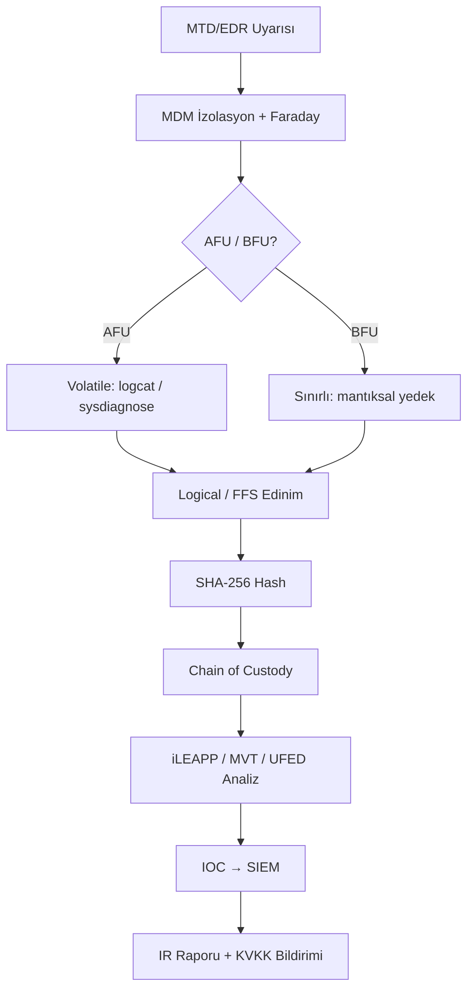
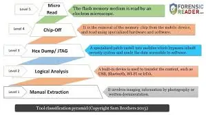
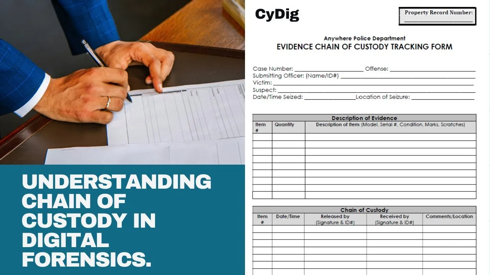
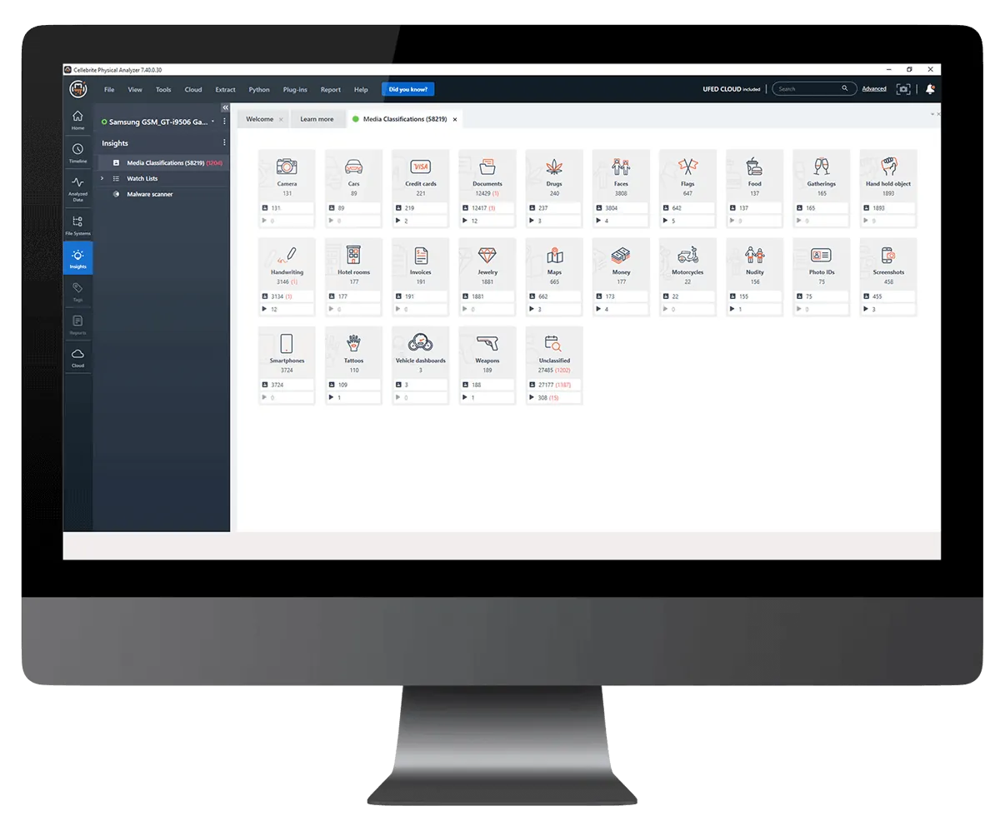

# Mobil Adli Bilişim (Mobile Forensics) ve Olay Müdahale

Mobil cihazlar, kurumsal savunma derinliği mimarisinin en geniş ve en dinamik saldırı yüzeyini oluşturur. BYOD politikaları, uzaktan çalışma, mobil kurumsal uygulamalar (e-posta, VPN, MFA token'ları, finansal işlem uygulamaları) ve IoT entegrasyonları nedeniyle iOS ve Android cihazlar hem **Initial Access** hem de **Data Exfiltration** vektörü olarak kritik rol oynar. Kurumsal siber güvenlik olaylarının büyük çoğunluğunda mobil cihazlar ya saldırı vektörü, ya veri sızıntısı kaynağı ya da olayın izlerini barındıran bir delil niteliği taşır.

Mobil cihazların doğası gereği **uçucu (volatile)** yapısı, bir uzaktan silme (remote wipe) komutunun saniyeler içinde aylarca süren soruşturma değerini yok edebilmesi, bu cihazlara müdahaleyi zamanlamanın hayati önemini ortaya koymaktadır. NIST SP 800-101 Rev. 1, mobil adli bilişimi *"kabul görmüş yöntemler kullanılarak, adli açıdan sağlam koşullar altında bir mobil cihazdan dijital delil kurtarma bilimi"* olarak tanımlar.

Bu bölümde kritik veri sızıntısı veya zararlı yazılım enfeksiyonu sonrası **adli imaj/log toplama**, **mantıksal (logical) ile fiziksel (physical) edinim teknikleri**, **delil bütünlüğü koruma standartları** ve **şifreli mesajlaşma veritabanları ile sistem artıkları (artifacts) analizi**; NIST SP 800-101, NIST SP 800-61 Rev. 3, zincirleme delil (chain of custody), Full File System (FFS) edinimi, WhatsApp crypt14/15, MVT (Mobile Verification Toolkit) ve iLEAPP/ALEAPP araçları ışığında ele alınmaktadır.

Önceki bölümlerde kurulan MDM/MAM yönetim katmanı (§8.1), MTD tehdit tespiti (§8.2) ve uygulama sertleştirme (§8.3) savunma hattını oluşturur; bu bölüm ise saldırı gerçekleştiğinde veya delil toplama gerektiğinde devreye giren **Detect → Respond → Recover** döngüsünün mobil karşılığını tamamlar.

---

## §8.4.1. iOS ve Android Cihazlardan Adli İmaj ve Log Toplama

### Savunma Derinliği ve Olay Müdahale Bağlamı

Savunma derinliğinde mobil adli bilişim, **Detect → Respond → Recover** katmanlarının kesişiminde yer alır. Ağ katmanında (NGFW, proxy, DNS) veya EDR/MTD (Microsoft Defender for Endpoint, Zimperium, Lookout) ile tespit edilen anomaliler — anormal veri çıkışı, şüpheli C2 iletişimi, jailbreak/root tespiti — sonrası cihazın izole edilmesi, volatile verilerin korunması ve forensik açıdan sağlam edinim yapılması zorunludur.

**Tipik Kurumsal Senaryo (Saldırı-Savunma Dengesi):**

**Saldırgan tarafı (ofansif):** Kullanıcıya yönelik hedefli oltalama veya kötü amaçlı QR kod ile Android'de sideloaded uygulama veya iOS'ta enterprise certificate/TestFlight istismarı ile malware bulaşır. Malware, WhatsApp/Telegram/Signal üzerinden kurumsal e-posta kişilerini, VPN kimlik bilgilerini veya ekran görüntülerini dışarı aktarır. Cihaz kilidi açık bırakılmışsa veya eski iOS/Android sürümlerinde parola kırılabiliyorsa doğrudan fiziksel erişimle de veri çekilebilir. Anti-forensics teknikleri (log silme, uygulama verisi temizleme, bulut senkronizasyonunu devre dışı bırakma) kullanılır.

**Mavi takım tarafı (defansif):** MDM/EMM (Intune, Jamf, Workspace ONE) politikaları ile cihaz otomatik izole edilir; tüm ağ trafiği engellenir, yalnızca yönetim kanalı açık kalır. MTD/EDR uyarısı SOC'a iletilir. "Altın Saat" (Golden Hour) içinde Faraday çantası veya sinyal engelleyici ile cihaz laboratuvara taşınır. Volatile veri (RAM dump, logcat, sysdiagnose) mümkün olduğunca alınır. Ardından mantıksal veya ileri seviye mantıksal edinim tercih edilir. Elde edilen artefaktlar timeline analizi ile korele edilir; IOC'ler (şüpheli paket adları, C2 domain/IP, exfil zaman damgaları) SIEM'e (Wazuh, Splunk) beslenir. KVKK ihlali varsa 72 saat içinde bildirim hazırlanır.

Bu süreç, **NIST SP 800-61 Rev. 3** (Nisan 2025) ve **NIST SP 800-86** (Integrating Forensic Techniques into Incident Response) ile uyumlu olarak tasarlanmalıdır.

### NIST SP 800-61 Rev. 3: Olay Müdahale Yaşam Döngüsü

NIST SP 800-61 Rev. 3, 3 Nisan 2025'te yayımlanarak Rev. 2'yi geçersiz kılmıştır. Başlığı *"Incident Response Recommendations and Considerations for Cybersecurity Risk Management: A CSF 2.0 Community Profile"* olan bu revizyon, katı dört fazlı modeli bırakıp olay müdahalesini **CSF 2.0** fonksiyonlarına eşler: **Govern, Identify, Protect, Detect, Respond, Recover**.

Klasik dört fazlı model (Preparation → Detection and Analysis → Containment, Eradication and Recovery → Post-Incident Activity) endüstride hâlâ yaygın referans alınmaktadır; Rev. 3 bu fazları CSF 2.0 ile hizalar ancak temel operasyonel adımlar değişmez. Mobil bağlamda her iki çerçeve de aşağıdaki özelleştirmeyi gerektirir:

| Olay Müdahale Aşaması | Mobil Özel Uygulama |
|----------------------|---------------------|
| **Hazırlık (Preparation)** | Faraday çantaları, adli imaj donanımı, şarj ekipmanları, yasal yetki belgeleri ve KVKK uyumlu çalışan aydınlatma metinlerinin önceden hazırlanması |
| **Tespit (Detection)** | MDM çözümleri, EDR/MTD mobil sensörleri, ağ trafiği analizi ve SIEM korelasyonu ile anomali tespiti |
| **Kapsama (Containment)** | Cihazın ağ bağlantısının kesilmesi (Faraday çantası), uzaktan silme riskine karşı sinyal blokajı, MDM ile karantina |
| **Soruşturma (Investigation)** | Adli imaj alma, log analizi, artefakt incelemesi ve timeline oluşturma |
| **İyileştirme (Recovery)** | Zararlı yazılım temizliği, cihazın sıfırlanması veya yeniden kayıt (re-enroll) |
| **Dersler (Lessons Learned)** | Süreç dokümantasyonu, playbook güncelleme ve tabletop exercise sonuçlarının entegrasyonu |

### Cihaz Ele Geçirme ve İzolasyon Protokolü

Bir olay müdahale senaryosunda sahaya intikal eden ekip aşağıdaki protokolü uygulamalıdır:

1. **Cihazı yerinde fotoğrafla:** Ekran durumu, görünen bildirimler ve fiziksel çevre belgelenir.
2. **Güç durumunu not et:** Cihaz açık mı, kapalı mı, uçak modunda mı?
3. **Faraday çantasına yerleştir:** Tüm kablosuz sinyalleri (hücresel, Wi-Fi, Bluetooth, NFC) bloke et.
4. **Şarja bağla:** Pilin bitmesi, şifreleme durumunu tetikleyerek kurtarmayı imkânsızlaştırabilir.

:::danger
Cihazın yeniden başlatılması, **AFU (After First Unlock — İlk Kilit Açıldıktan Sonra)** durumundan **BFU (Before First Unlock — İlk Kilid Açılmadan Önce)** durumuna geçişe neden olur. BFU durumunda donanım şifreleme anahtarlarına erişim mümkün değildir ve fiziksel imaj alma ihtimali önemli ölçüde azalır.
:::

### Kriptografik Yaşam Döngüsü: BFU ve AFU

Mobil olay müdahalesinde cihazın anlık kriptografik durumu, adli analizin başarısını doğrudan etkiler:

| Kriptografik Durum | iOS Sınıf Erişimi | Android Alan Erişimi | RAM Durumu |
|--------------------|-------------------|----------------------|------------|
| **BFU** | Yalnızca Sınıf D (NSFileProtectionNone) erişilebilir | Yalnızca Cihaz Şifreli (DE) alan açık | Parola türevli anahtarlar yüklenmemiştir |
| **AFU** | Sınıf C (NSFileProtectionCompleteUntilFirstUserAuthentication) ve D açık | DE ve Kullanıcı Şifreli (CE) alanlar açık | Şifre çözme anahtarları aktif olarak RAM bellektedir |

**AFU durumunda** gerçekleştirilecek bir dosya sistemi veya gelişmiş mantıksal veri toplama işlemi, veritabanlarının büyük bir kısmının çözülmüş olarak elde edilmesini sağlar. Cihazın enerjisi kesinlikle kesilmemelidir.

### Elektromanyetik İzolasyon ve Güç Yönetimi

Mobil cihaz ele geçirildiği andan itibaren delil bütünlüğünü korumak ve uzaktan imha komutlarını bloke etmek için elektromanyetik yalıtım kurallarına eksiksiz uyulmalıdır:

| İzolasyon Ekipmanı | Frekans Aralığı | Sönümleme (dB) | Engellenen Sinyal Tipleri |
|--------------------|-----------------|----------------|---------------------------|
| **Standart Faraday Torbası** | 800 MHz – 2,4 GHz | 60 – 80 dB | 2G, 3G, 4G LTE, standart Wi-Fi |
| **Askeri Sınıf Faraday Torbası** | 400 MHz – 40 GHz | > 85 dB | 5G, Wi-Fi 6E/7, Bluetooth 5.x, GPS, RFID, NFC |
| **MIL-STD-188-125-2 Onaylı** | 10 kHz – 40 GHz | > 100 dB | Tüm RF sinyalleri, EMP |

Cihaz AFU durumundayken ele geçirilmişse, kapatılması veya bataryasının tükenmesi durumunda cihaz anında BFU fazına geri dönecek ve analiz neredeyse imkânsız hale gelecektir. Bu kaybı önlemek için Faraday torbasının içinden dışarıya parazitsiz güç aktarımı sağlayan "Window Charge & Shield" benzeri özel kitler kullanılmalıdır.

### iOS Adli Veri Kaynakları ve Log Toplama

iOS cihazlar, Android'e kıyasla daha kapalı bir ekosisteme sahiptir ve donanım destekli şifreleme nedeniyle fiziksel imaj alma zorlukları taşır.

**iOS Edinim Yöntemleri:**

| Yöntem | Sürüm Desteği | Açıklama |
|--------|--------------|----------|
| **iTunes/Finder Yedeği** | Tüm sürümler | Şifreli/şifresiz yedek; şifreli yedekte Keychain verisi dahil |
| **iOS Agent** | 14.0 – 16.1.2 | Agent kurulumu ile dosya sistemi erişimi |
| **Checkm8/Checkra1n** | 12.4 – 16.0 | BootROM exploit; A11 ve öncesi cihazlarda tam dosya sistemi |
| **iCloud Yedekleri** | Yasal dayanak varsa | Cellebrite UFED veya Elcomsoft Phone Breaker ile çekilebilir |

**iOS Kritik Veri Konumları:**

```
/private/var/mobile/Library/     — Uygulama verileri
/private/var/root/Library/       — Root verileri
/private/var/mobile/Media/       — Medya dosyaları
/private/var/db/diagnostics/     — Unified Logs (.tracev3)
/System/Library/                 — Sistem dosyaları
```

**iOS Log Toplama:**

```bash
# Bağlı iOS cihazından Unified Logs paketini dışarı aktarma
idevice_id -l
log collect --output ~/Desktop/iPhone_Forensics_Logs.logarchive
```

**Sysdiagnose:** iOS cihazında ses açma, ses kısma ve güç tuşlarına aynı anda basılarak tetiklenen tanılama mekanizmasıdır. RAM kullanım tablosu, çalışan prosesler, ağ soket bağlantıları ve crash loglarını içeren `.tar.gz` arşivi oluşturur.

### Android Adli Veri Kaynakları ve Log Toplama

**Cihaz Durumu Değerlendirmesi:**

- **Unlocked (Kilitli Değil):** Fiziksel imaj, Full File System, Application Downgrade
- **Locked (Kilitli):** Exploit tabanlı fiziksel çıkarma, parola kırma

**Android Kritik Dizinler:**

- `/data/data/[package_name]/` — Uygulama verileri
- `/data/user/0/` — Kullanıcı uygulama verileri
- `/data/media/0/` — Kullanıcı medya dosyaları
- `/data/system/` — Sistem yapılandırmaları

**Android Adli Log Toplama:**

```bash
# Logcat ile sistem loglarını toplama
adb logcat -b all -v threadtime -d > forensic_logs.txt

# Kernel logları
adb shell dmesg > kernel_logs.txt

# /data bölümünden kritik dosyalar (root/FFS gerekli)
adb pull /data/data/ /forensic_data/

# Hesap bilgileri
adb shell dumpsys accounts

# Ağ istatistikleri
adb shell dumpsys netstats

# Konum geçmişi
adb shell dumpsys location
```

**EDL (Emergency Download Mode):** Qualcomm çiplerde üretici imzalı araçlarla düşük seviye erişim imkânı sağlar.

### Bulut Tabanlı Veri Edinimi

Modern mobil soruşturmalarda cihazın yanı sıra bulut hizmetlerinden veri edinimi giderek daha kritik hale gelmiştir:

- **iCloud:** Yedekler, fotoğraflar, mesajlar
- **Google:** Drive, Fotoğraflar, Android yedekleri
- **Uygulama Bulutları:** WhatsApp, Telegram, Signal yedekleri

Bulut edinimi, cihaz fiziksel olarak elde edilemese bile soruşturmayı sürdürmeyi mümkün kılar; ancak yasal dayanak veya kullanıcı rızası gerektirir.

### Kurumsal Mimari Entegrasyonu

**Önerilen Mimari:**

- **Uç Nokta Katmanı:** MDM + MTD/EDR agent (log forwarding)
- **Ağ Katmanı:** NGFW + Proxy + DNS logları (mobil C2 tespiti)
- **SIEM/SOAR:** Wazuh veya Splunk — MDM uyarıları + forensik IOC'ler
- **Forensik Laboratuvarı:** Air-gapped workstation'lar, validated tool set (ticari + açık kaynak), Faraday odası/çantaları
- **Raporlama:** Otomatik timeline + IOC çıkarımı → KVKK ihlal raporu + iç IR raporu

**Operasyonel Akış:** MTD/EDR uyarısı → MDM izolasyonu + Faraday → volatile veri toplama (logcat/sysdiagnose) → Advanced Logical/FFS edinim → SHA-256 hash + Chain of Custody → iLEAPP/ALEAPP ve ticari parser ile analiz → IOC çıkarımı ve SIEM korelasyonu → IR raporu + KVKK bildirimi → eradication ve lessons learned.



<details>
<summary>Derinlemesine: BFU/AFU Kriptografik Durum ve Altın Saat Protokolü</summary>

| Durum | iOS Erişim | Android Erişim | RAM | Müdahale Önceliği |
| :---- | :---- | :---- | :---- | :---- |
| **BFU** | Yalnızca Sınıf D | Yalnızca DE alan | Anahtarlar yüklenmemiş | Fiziksel imaj neredeyse imkânsız |
| **AFU** | Sınıf C + D | DE + CE alanlar | Aktif şifre çözme anahtarları | **Altın Saat** — hemen volatile toplama |

**Altın Saat (Golden Hour) kontrol listesi:**

1. Cihazı yerinde fotoğrafla (ekran, bildirimler, fiziksel çevre)
2. Faraday torbasına yerleştir (5G/Wi-Fi/Bluetooth/NFC bloke)
3. Window Charge & Shield ile şarja bağla (pil bitmesini önle)
4. **Yeniden başlatma yapma** — BFU'ya geçiş delil kaybına yol açar
5. `adb logcat -b all` veya `log collect` ile volatile veri al
6. Mantıksal/FFS edinim → hash → CoC formu doldur

NIST SP 800-61 Rev. 3 (Nisan 2025), olay müdahalesini CSF 2.0 fonksiyonlarına (Govern, Detect, Respond, Recover) eşler; mobil IR playbook'u bu çerçeveyle uyumlu tasarlanmalıdır.

</details>

---

## §8.4.2. Mantıksal ve Fiziksel İmaj Alma Teknikleri ile Delil Bütünlüğü

### NIST SP 800-101 Rev. 1 Çerçevesi

NIST SP 800-101 Rev. 1, mobil adli bilişimin temel referans rehberidir. Mobil cihazlardan adli veri elde etme sürecini dört ana aşamada tanımlar:

1. **Koruma (Preservation):** Delilin bozulmadan muhafazası
2. **Edinim (Acquisition):** Adli imajın alınması
3. **İnceleme (Examination):** Verilerin yapısal olarak incelenmesi
4. **Analiz (Analysis):** Bulguların yorumlanması ve raporlanması

NIST SP 800-101 ayrıca altı seviyeli ekstraksiyon merdivenini tanımlar:

```
Manual → Logical → File System → Physical → Chip-off → Micro-read
```

Kurumsal pratikte Level 1–2 (Logical/Advanced Logical) ağırlıktadır; modern iOS ve Android sürümlerinde fiziksel edinim büyük ölçüde sınırlanmıştır.



*Yukarıdaki görsel, mobil edinim seviyelerini (Manual → Logical → Hex/JTAG → Chip-off → Micro Read) hiyerarşik olarak göstermektedir (Sam Brothers sınıflandırması). Kurumsal pratikte Level 1–2 (Logical/Advanced) ağırlıktadır.*

### Mantıksal (Logical) İmaj

Mantıksal imaj, cihazın işletim sistemi ve API'leri aracılığıyla kullanıcı ve uygulamalar tarafından erişilebilir verilerin çıkarılmasıdır.

**Özellikler:**
- **Avantajları:** Non-invaziv, hızlı, minimal veri bozulma riski
- **Dezavantajları:** Silinmiş, gizlenmiş veya parçalanmış verilere erişemez
- **Kullanım Durumu:** Cihaz AFU durumunda ve hızlı müdahale gerektiğinde

**Android — ADB Backup:**

```bash
# Android Debug Bridge ile mantıksal yedek alma
adb backup -apk -shared -all -system -f forensic_backup.ab

# Şifreli yedek için
adb backup -apk -shared -all -system -f encrypted_backup.ab -password
```

**iOS — iTunes/Finder Backup Konumları:**

```bash
# macOS
~/Library/Application Support/MobileSync/Backup/

# Windows
%APPDATA%\Apple Computer\MobileSync\Backup\
```

### Dosya Sistemi İmajı (File System / Advanced Logical)

Dosya sistemi imajı, mantıksal ile fiziksel arasında bir orta yoldur. Cihazın dosya sistemine erişerek, mantıksal yöntemle erişilemeyen ancak fiziksel imaj kadar derin olmayan bir kopya oluşturur.

- **Android:** Root yetkisi veya exploit ile `/data` bölümüne erişim
- **iOS:** Checkm8 açığı veya iOS Agent ile dosya sistemi erişimi

**Adli Derinliği:** Uygulama sandbox'larındaki SQLite veritabanlarına, sistem loglarına, plist dosyalarına ve uygulama artıklarına tam erişim sağlar. WAL (Write-Ahead Log) dosyalarındaki silinmiş kayıtların incelenmesine olanak tanır.

### Full File System (FFS) Edinimi

**Full File System (FFS)** extraction, mantıksal ile fiziksel arasında en dengeli yaklaşımdır. Cellebrite UFED, MSAB XRY Pro ve Magnet AXIOM gibi araçlarla exploit tabanlı olarak gerçekleştirilir.

2026 itibarıyla modern cihazlarda (iOS 17/18+, Android 14/15+ ile FBE/FDE) fiziksel edinim büyük ölçüde sınırlanmıştır:

**iOS:**
- Tam fiziksel edinim (chip-off veya bootloader exploit) modern 64-bit cihazlarda Secure Enclave + güçlü FDE nedeniyle pratikte **ölü** kabul edilmektedir.
- Tercih edilen: **Advanced Logical / Filesystem Extraction** veya iTunes/Finder yedeği + iCloud token extraction (yasal dayanak varsa).

**Android:**
- Fiziksel edinim hâlâ ilk denenecek yöntemdir (USB exploit'ler, temp root). Ancak FBE nedeniyle imaj şifreli çıkabilir; parola veya anahtar çıkarımı gerekir.
- **FFS extraction** mantıksal ile fiziksel arasında en dengeli yaklaşımdır.
- JTAG ve chip-off yalnızca hasarlı cihazlar veya özel durumlarda (yıkıcı yöntemler).

### Fiziksel (Physical) İmaj

Fiziksel imaj, cihazın flash belleğinin blok düzeyinde birebir kopyasıdır ve **en kapsamlı** delil toplama yöntemidir.

**Özellikler:**
- **Avantajları:** Silinmiş dosyalar, boş alan (unallocated space), swap dosyaları ve parçalanmış verilere erişim
- **Dezavantajları:** Yüksek teknik uzmanlık gerektirir, cihaza müdahale riski taşır, yasal karmaşıklık
- **Delil Kazancı:** Fiziksel imaj, mantıksal çıkarmalara kıyasla önemli ölçüde daha fazla eyleme dönüştürülebilir artefakt kurtarır

**Android Fiziksel İmaj Yöntemleri:**
- **Chipset tabanlı:** Qualcomm, MediaTek, Exynos yongalarına özel yöntemler
- **Exploit tabanlı:** Kilitli cihazlarda açıklardan yararlanma
- **JTAG/ISP:** Donanım seviyesinde müdahale (en invaziv)

**iOS Fiziksel İmaj Yöntemleri:**
- **Checkm8/Checkra1n:** BootROM açığı ile tam dosya sistemi erişimi (A11 ve öncesi)
- **iOS Agent:** iOS 14.0–16.1.2 sürümlerinde agent uygulama kurulumu

### Edinim Yöntemleri Karşılaştırma Tablosu

| Özellik | Mantıksal / Advanced Logical | FFS (Full File System) | Fiziksel / Chip-off |
|---------|------------------------------|------------------------|---------------------|
| **Veri Kapsamı** | Aktif veriler, app sandbox'ları, SQLite DB'leri | Tüm dosya sistemi, WAL, sistem logları | Bit-for-bit (silinmiş veriler, unallocated space dahil) |
| **Cihaz Değişikliği** | Minimal (API çağrıları) | Root/jailbreak veya geçici exploit | Donanımsal müdahale (değiştirici) |
| **Silinmiş Veri Kurtarma** | Sınırlı (WAL, journal dosyaları) | Orta-Yüksek (freelist analizi) | Maksimum (carving; şifreleme engeli aşılırsa) |
| **Hız ve Maliyet** | Hızlı, düşük maliyetli | Orta hız, orta maliyet | Yavaş, pahalı, uzman gerektirir |
| **Delil Bütünlüğü Riski** | Düşük | Orta (geçici ajan yüklenebilir) | Yüksek (cihazı değiştirme) |
| **Modern Cihaz Uygunluğu** | Yüksek (iOS/Android 2026) | Orta (exploit bağımlı) | Düşük (özellikle iOS) |

### Delil Bütünlüğü ve Zincirleme Delil (Chain of Custody)

Delil bütünlüğü, adli incelemenin mahkemede kabul edilebilirliğinin temelidir. SWGDE Best Practices ve NIST SP 800-101 ilkeleri doğrultusunda uygulanması gereken standart prosedür:

1. **Cihazı hemen izole et** (Faraday çantası, airplane mode, MDM policy).
2. **Cihaz durumunu fotoğrafla** (ekran açık/kapalı, kilit durumu, hasar).
3. **Volatile veri mümkünse al** (RAM, logcat, sysdiagnose).
4. **Edinimi validated tool ile yap.**
5. **Edinilen imaj/backup'ın SHA-256 hash'ini al** (önce ve sonra doğrula).
6. **Chain of Custody (Zincirleme Delil) formu doldur** (kim, ne zaman, ne yaptı).



*Chain of Custody formu örneği. Her transferde imza, tarih/saat ve cihaz tanımı zorunludur. ISO/IEC 27037 ve SWGDE en iyi uygulama çerçeveleri prosedürel temeli oluşturur.*

**Hash Fonksiyonları ve Bütünlük Doğrulama:**

Her adli imaj işlemi, SHA-256 veya daha güçlü bir hash algoritması ile dijital parmak izi oluşturulmasını içermelidir:

```bash
# SHA-256 hash hesaplama
sha256sum forensic_image.dd
# Çıktı: a4b5c6d7e8f901234567890abcdef1234567890abcdef1234567890abcdef12
```

**Zincirleme Delil (Chain of Custody) Gereksinimleri:**
- Her işlem belgelenmeli
- Kim, ne zaman, hangi koşullarda cihaza müdahale etti kaydedilmeli
- Cihazın her el değiştirmesinde imza ve zaman damgası alınmalı
- Analiz her zaman imajın **kopyası** üzerinde yapılır; orijinal imaj salt okunur depolama ortamına yazılır

### Yazılım Doğrulama ve Çapraz Kontrol

SANS, delil bütünlüğünü sağlamak için aynı verinin **en az iki farklı araçla** işlenmesini önerir:

| Araç | Platform | Amaç |
|------|----------|------|
| Cellebrite UFED | Ticari | Çoklu platform edinim |
| Oxygen Forensic Detective | Ticari | 35.400+ cihaz desteği |
| MSAB XRY | Ticari | Geniş cihaz yelpazesi |
| Magnet AXIOM | Ticari | Kapsamlı artefakt analizi |
| MVT | Açık Kaynak | Casus yazılım tespiti (Amnesty International) |
| iLEAPP / ALEAPP | Açık Kaynak | iOS/Android artefakt parsing |
| AFLogical OSE | Açık Kaynak | Android veri çıkarma |

### Türkiye Mevzuatı Entegrasyonu

**KVKK (6698 Sayılı Kanun):**
- Veri ihlali durumunda Kurul'a ve ilgili kişilere bildirim yükümlülüğü (m.12)
- Mobil cihaz üzerinden gerçekleşen ihlallerde forensik inceleme sonuçları, veri minimizasyonu ilkesine uygun olarak raporlanmalıdır
- Çalışan cihazlarının incelenmesi için önceden aydınlatma metni ve açık rıza veya sözleşmesel yetki gereklidir

**5651 Sayılı Kanun:**
- Erişim sağlayıcı trafik bilgilerini 6 aydan az, 2 yıldan fazla olmamak üzere saklar
- Yer sağlayıcı 1 yıldan az, 2 yıldan fazla olmamak üzere saklar
- Trafik bilgisinin doğruluğu, bütünlüğü ve gizliliği sağlanmalı; hash değerleri zaman damgası ile muhafaza edilmelidir
- Kurumsal mobil cihaz logları (MDM agent logları, uygulama kullanım logları) adli taleplere cevap verecek şekilde zaman damgalı ve bütünlüğü korunmuş olmalıdır

**BDDK Düzenlemeleri:**
- Mobil bankacılık uygulamalarında çok faktörlü kimlik doğrulama, işlem loglaması ve anomali tespiti zorunludur
- Çalışan cihazlarında gerçekleşen fraud olaylarında adli bilişim raporu BDDK denetimlerinde delil niteliği taşır
- Yıllık en az bir bağımsız sızma testi (mobil uygulama ve API'ler dahil) zorunludur

:::caution
Türkiye'de mobil adli bilişim faaliyetleri, 5651 Sayılı Kanun ve KVKK kapsamında değerlendirilmelidir. Kişisel verilere erişim ve işleme, yetkili makamların izni veya açık rıza olmaksızın gerçekleştirilemez.
:::

---

## §8.4.3. Şifreli Mesajlaşma Veritabanları, Uygulama Logları ve Sistem Artıklarının Analizi

### WhatsApp Veritabanı Analizi: crypt14 ve crypt15

Android platformunda WhatsApp, yerel mesaj geçmişini `/data/data/com.whatsapp/databases/msgstore.db` konumunda saklar. Kişi veritabanı `wa.db` dosyasındadır. Ancak bu dosyalar doğrudan okunamaz; sistem yedekleri alınırken **crypt14** veya **crypt15** algoritmalarıyla şifrelenir.

**Crypt14 Deşifre İşlemi:**

156 bayt uzunluğundaki anahtar dosyası (key), yalnızca root yetkileriyle erişilebilen `/data/data/com.whatsapp/files/key` dizininde saklanır:

| Offset | İçerik |
|--------|--------|
| 0x00 – 0x1E | Header bilgileri |
| 0x1F – 0x2E | Başlatma Vektörü (IV) |
| 0x2F – 0x4E | AES-256-GCM şifre çözme anahtarı |

Şifreli yedekler `/data/media/0/WhatsApp/Databases/msgstore.db.crypt14` konumunda bulunur. v2.12'den beri yerel msgstore AES-256-GCM ile şifrelidir.

```bash
# WhatsApp Crypt14/15 veritabanını deşifre etme
python decrypt14_15.py -ivo 8 -do 122 /yol/key /yol/msgstore.db.crypt14 /yol/msgstore_decrypted.db
```

**Crypt15 — Uçtan Uca Şifreli Yedekleme (E2EE Backups):**

Kullanıcı uçtan uca şifreli yedeklemeyi aktif hale getirdiyse, veritabanı AES-256-CBC moduyla şifrelenerek `msgstore.db.crypt15` uzantısını alır. Bu durumda şifrenin çözülebilmesi için kullanıcının belirlediği 64 karakterli heksadesimal şifreleme anahtarı veya bu anahtarı türeten parola bilinmek zorundadır. Bu anahtar cihaz üzerinde saklanmaz.

**WAL Dosyası ve Silinmiş Mesaj Kurtarma:**

`msgstore.db-wal` dosyası, henüz ana veritabanına işlenmemiş en güncel olayları ve silinen mesajların ham hallerini barındırır. SQLite freelist sayfalarından silinmiş mesajlar kurtarılabilir; crypt15 yedeklerinden yüzlerce silinmiş mesajın kurtarıldığı vakalar raporlanmıştır.

```sql
-- Deşifre edilmiş msgstore.db üzerinde mesaj sorgusu
SELECT
    datetime(timestamp, 'unixepoch') AS message_time,
    key_remote_jid AS contact,
    data AS message_content
FROM messages
WHERE key_remote_jid = 'TARGET_JID'
ORDER BY timestamp DESC;
```

### Signal, Telegram ve Diğer Mesajlaşma Platformları

**Signal:** SQLCipher ile tam şifreli yerel depolama; anahtar Android Keystore'da "SignalSecret" takma adıyla donanımsal korumaya sahiptir. Root yetkisi veya RAM dump ile anahtar bellekten yakalanabilir. Deşifre için `PRAGMA cipher_page_size = 4096`, `PRAGMA kdf_iter = 1` ve `PBKDF2_HMAC_SHA1` parametreleri birebir tanımlanmalıdır.

**Telegram:** Normal sohbetler bulut tabanlıdır (API ile alınabilir); Secret Chat'ler yalnızca cihazda şifreli saklanır. FTS indeksleme tabloları ve `cache.db` silinmiş mesaj kurtarmada kritiktir.

**iMessage (iOS):** `Library/SMS/sms.db` içinde saklanır; şifreli yedeklerden çözülebilir.

### SQLite Veritabanlarında Silinmiş Veri Kurtarma

Mobil işletim sistemlerindeki uygulamaların neredeyse tamamı yapılandırılmış verileri SQLite formatında saklar. Veri silme işlemleri mantıksal olarak gerçekleştirilir; veri fiziksel olarak hemen yok edilmez.

**WAL (Write-Ahead Log) Analizi:** Tüm değişiklikler önce `-wal` dosyasına yazılır. Olay müdahale ekipleri ana veritabanı dosyasının yanı sıra WAL dosyasını da çekmelidir.

**Freelist (Serbest Sayfalar) Kazıma:** Silinen kayıtların bulunduğu veri sayfaları Freelist listesine eklenir. Yeni veri yazılana kadar eski veriler bu sayfalarda ham olarak kalır.

| Artefakt Türü | Örnek | Adli Değer |
|--------------|-------|------------|
| **Veritabanı artıkları** | SQLite WAL dosyaları, boş alan | Silinen mesajlar |
| **Geçici dosyalar** | Önbellek, geçici klasörler | Geçici kopyalar |
| **Log dosyaları** | Uygulama hata kayıtları | Etkinlik zamanları |
| **Sistem artıkları** | NSUserDefaults, SharedPreferences | Uygulama ayarları |
| **Medya önbelleği** | İndirilen görsel/medya dosyaları | Paylaşılan içerik |

### MVT (Mobile Verification Toolkit)

**MVT (Mobile Verification Toolkit)**, Amnesty International Security Lab tarafından Temmuz 2021'de Pegasus Project kapsamında yayımlanmış açık kaynaklı bir casus yazılım tespit aracıdır.

**Temel Özellikler:**
- `mvt-ios` ve `mvt-android` komutları, public IOC'lerle cihaz yedeğini tarar
- iOS'ta daha fazla forensic trace olduğu için tespit daha kolaydır
- Şifreli iOS yedeğini decrypt edebilir
- Adversarial forensics'i yasaklayan özel lisansla (MPL v2.0 uyarlaması) dağıtılır

**Kullanım Senaryosu:**

```bash
# MVT ile iOS yedeği tarama
mvt-ios check-backup --iocs /yol/to/iocs.stix2 /yol/to/backup/

# MVT ile Android cihaz tarama
mvt-android check-adb --iocs /yol/to/iocs.stix2
```

**Kurumsal Uygulama:** Yüksek riskli personel (yönetici kademesi, diplomat, gazeteci) için periyodik MVT taraması önerilir. PiRogue Tool Suite MVT'yi önyüklü sunar; Colander ile STIX2 IOC feed entegrasyonu sağlar. iMazing, MVT metodolojisini GUI'ye taşımıştır.

### iLEAPP ve ALEAPP: Açık Kaynak Artefakt Analizi

**iLEAPP** (iOS Logs, Events, And Plists Parser) ve **ALEAPP** (Android Logs, Events, And Plists Parser), Alexis Brignoni tarafından geliştirilen Python tabanlı açık kaynak artefakt ayrıştırma araçlarıdır. Logical extraction veya backup'lardan binlerce artefaktı otomatik parse eder.

**iLEAPP Analiz Kapsamı:**
- Mobil kurulum günlükleri (mobileactivationd)
- Bildirim merkezi veritabanı (iOS 12+ notifications)
- Hücresel servis sağlayıcı bilgileri
- Safari geçmişi ve sistem güç günlükleri (Shutdown.log)
- iMessage (sms.db), WhatsApp (ChatStorage)

**ALEAPP Analiz Kapsamı:**
- Bluetooth cihaz bağlantı geçmişi
- Wi-Fi erişim noktası bilgileri
- Uygulama kullanım istatistikleri
- Bildirim geçmişi ve yerel tarayıcı kalıntıları

**Entegrasyon:**
- **Autopsy** ile entegrasyon: iOS Analyzer (iLEAPP) modülü doğrudan çalıştırılabilir
- Çıktılar arama yapılabilir HTML paketleri olarak üretilir
- LAVA (LEAPP Artifact Viewer App) platformu ile görsel zaman tünelleri oluşturulur
- SQLite browser + custom query'ler ile manuel doğrulama yapılır

Bu stack, ticari araçlara (Cellebrite, XRY) alternatif veya ön triage için idealdir ve KVKK/5651 log bütünlüğü gereksinimlerine uygun dokümantasyon sağlar.

### Ticari Analiz Araçları ve Timeline Korelasyonu

Modern mobil forensik araçları (Cellebrite Physical Analyzer, Magnet AXIOM, MSAB XRY + XAMN) popüler uygulamaların şifreli veritabanlarını otomatik parse eder; WhatsApp crypt14/15 deşifre ve entity-based timeline korelasyonu sağlar.



*Cellebrite Physical Analyzer arayüzü örneği — Media Classifications ve Timeline görünümü. Gerçek vakalarda binlerce artefakt timeline üzerinde korele edilir.*

### iOS ve Android Sistem Artıkları (Artifacts)

**iOS Kritik Artefaktlar:**
- `Library/Preferences/*.plist` — Uygulama ayarları
- `Accounts3.sqlite` — Hesap bilgileri
- CoreLocation — Konum geçmişi
- Safari/Chrome geçmişi (`History.db`)
- Keychain (kısmi erişim)
- `/var/mobile/Library/ConfigurationProfiles/` — Yapılandırma profilleri

**Android Kritik Artefaktlar:**
- `/data/data/<package>/` altındaki SQLite DB'leri (root/FFS gerekli)
- `accounts.db` — Hesap bilgileri
- Wi-Fi/Bluetooth geçmişi
- Google Play Services artefaktları
- Konum: `com.google.android.gms` uygulama verisi

**Sistem Logları:**
- iOS: `sysdiagnose`, Unified Logs (`.tracev3`)
- Android: `logcat`, `dumpsys`, `bugreport`

### Anti-Forensics Teknikleri ve Adli Tespiti

Gelişmiş saldırganlar, adli analizi sabote etmek için çeşitli yöntemlere başvurur:

**SQLite VACUUMing:** Saldırgan, veri sızıntısı sonrası `VACUUM` komutu çalıştırarak freelist sayfalarını temizler. Tespit: veritabanı boyutunun aniden küçülmesi ve mtime değişikliği.

**Zaman Damgası Manipülasyonu (Timestomping):** Dosya sistemindeki MACB zaman damgalarını geçmiş bir tarihe ayarlama. Tespit: SQLite ROWID sıralaması ile mesaj zaman damgalarının tutarsızlığı.

**APK Sürüm Düşürme (APK Downgrade):** Eski uygulama sürümünde açık olan `android:allowBackup="true"` parametresini istismar ederek ADB backup ile veri çekme:

```bash
# Mevcut uygulamayı kaldırmadan eski sürümü zorla yükleme
adb install -r -d /yol/whatsapp_eski_surum.apk

# Uygulama verilerini şifresiz yedek formatında dışarı aktarma
adb backup -f whatsapp_yedek.ab -noapk com.whatsapp
```

**Defansif Önlemler:**
- MDM üzerinden USB Debugging ve Geliştirici Seçenekleri engellenmeli
- Uygulama yükleme günlükleri SIEM'e aktarılmalı; downgrade tespitinde SOC alarmı üretilmeli
- Şifreleme anahtarları Android Keystore'a hardware-bound olarak bağlanmalı

### MITRE ATT&CK for Mobile ve İzole Laboratuvar

Adli analizde aranacak IOC'leri yönlendiren temel teknikler: **T1655 Masquerading** (meşru uygulama taklidi), **T1630 Indicator Removal** (root/jailbreak izlerini gizleme), **T1409 Stored Application Data**, **T1532 Archive Collected Data** ve **T1646 Exfiltration Over C2**.

Mobil adli imajların analizi için kurumsal ağdan izole edilmiş laboratuvar altyapısı (Proxmox/VMware sanallaştırma, asgari 128 GB RAM analiz istasyonu, INetSim destekli zararlı yazılım analiz ağı, donanımsal write-blocker) kurgulanmalıdır.

---

## Özet

Mobil adli bilişim ve olay müdahale, günümüz siber güvenlik operasyonlarının **olmazsa olmaz** bir bileşenidir. Savunma derinliğinde mobil adli bilişim, tespit ve müdahale katmanlarının kesişiminde yer alarak "görünmez" kalan uç noktaların olay sonrası görünürlüğünü sağlar.

**Temel Çıkarımlar:**

1. **Hazırlık:** Faraday çantaları, adli araçlar, yasal yetkiler ve KVKK uyumlu çalışan aydınlatma metinleri önceden hazır olmalıdır. NIST SP 800-61 Rev. 3 ve SP 800-101 çerçeveleri playbook tasarımının temelini oluşturur.

2. **Hız:** Cihazın AFU durumundayken müdahale, delil kurtarma başarısını maksimize eder. Uzaktan silme komutuna karşı anında Faraday izolasyonu ve güç koruma hayati önem taşır.

3. **Edinim Stratejisi:** 2026 koşullarında fiziksel edinim modern iOS'ta büyük ölçüde terk edilmiş, Android'de ise FBE nedeniyle sınırlanmıştır. **Advanced logical / FFS** yöntemleri, güçlü tool validasyonu ve anında izolasyon kurumsal stratejinin temelini oluşturmalıdır.

4. **Delil Bütünlüğü:** SHA-256 hash değerleri ve zincirleme delil (chain of custody) kaydı, delilin mahkemede geçerli olmasını sağlar. Aynı verinin en az iki farklı araçla işlenmesi çapraz doğrulama sağlar.

5. **Mesajlaşma Analizi:** WhatsApp crypt14/15 deşifre, SQLite WAL/freelist analizi ve Signal SQLCipher parametreleri mobil soruşturmaların kritik bileşenleridir. Uçtan uca şifreli yedekleme (crypt15) anahtar bilinmeden kırılamaz.

6. **Açık Kaynak Araçlar:** MVT ile casus yazılım tespiti, iLEAPP/ALEAPP ile artefakt triage ve Autopsy entegrasyonu; ticari araçlara alternatif veya ön analiz katmanı olarak konumlandırılmalıdır.

7. **Yasal Uyum:** KVKK, 5651 ve BDDK gereksinimlerine tam uyum şarttır. Veri minimizasyonu ilkesi gereği yalnızca olayla doğrudan ilişkili veriler incelenmeli; kişisel hayatın gizliliğini ihlal edecek veriler kapsam dışı tutulmalıdır.

8. **Sürekli Güncelleme:** Adli ekiplerin yeni açıkları, araçları ve teknikleri takip etmesi; düzenli tabletop exercise'ler ve playbook güncellemeleri operasyonel hazırlığı sürdürülebilir kılar. Her kurum, mobil IR playbook'unu KVKK, 5651 ve BDDK gereksinimlerine göre güncellemeli; CoC, hash ve dokümantasyon prosedürlerini standartlaştırmalıdır.