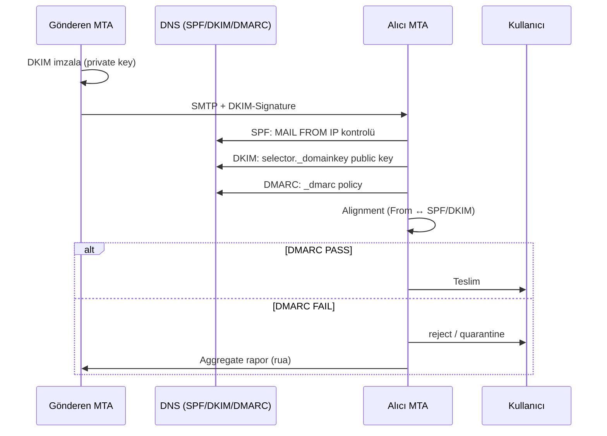
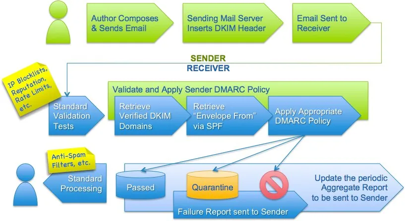

# Mesajlaşma Altyapıları ve E-Posta Doğrulama Protokolleri

E-posta, kurumsal iletişimin omurgası olmaya devam ederken aynı zamanda **MITRE ATT&CK** çerçevesinde **T1566 (Phishing)** ve alt teknikleri **T1566.001/.002** ile en yaygın ilk erişim (Initial Access) vektörüdür. SMTP protokolü tarihsel olarak kimlik doğrulama içermeden tasarlandığından, saldırganlar alan adı sahteciliği (domain spoofing) ve iş süreci ihlali (BEC) saldırılarında bu boşluğu sistematik olarak istismar eder.

**SPF**, **DKIM** ve **DMARC** üçlüsü, savunma derinliğinin DNS katmanında konumlanan ilk ve en kritik kontrol setidir. Tek başına hiçbiri yeterli değildir: SPF yalnızca zarf göndericisini (MAIL FROM) doğrular, DKIM mesaj bütünlüğünü korur, DMARC ise her ikisinin sonucunu kullanıcının gördüğü **RFC5322.From** alanıyla hizalayarak politika uygular. **NIST SP 800-177 Rev. 1 (Trustworthy Email)** bu üç teknolojinin birlikte konuşlandırılmasını önerir; **CIS Controls v8 Safeguard 9.5** DMARC uygulamasını zorunlu kontrol olarak tanımlar.


*Kimlik doğrulama (SPF/DKIM/DMARC), taşıma güvenliği (MTA-STS/DANE) ve gateway katmanının savunma derinliği içindeki konumu*

---

## §9.1.1. Kurumsal Mesajlaşma Mimarileri ve Taşıma Güvenliği

Kurumsal e-posta altyapısı üç ana topolojide karşımıza çıkar: şirket içi **Microsoft Exchange Server**, bulut tabanlı **Microsoft 365 / Google Workspace** ve açık kaynaklı **Postfix** tabanlı MTA dağıtımları. Bu modeller arasındaki temel fark, posta akışının nerede sonlandığı ve kimlik doğrulama kontrollerinin nereye yerleştiğidir.

### Topoloji Karşılaştırması

| Güvenlik Boyutu | Microsoft 365 | Exchange On-Premises | Postfix (Açık Kaynak) |
| :---- | :---- | :---- | :---- |
| **Sınır konumu** | Microsoft bulut perimetri (EOP) | Edge Transport + DMZ SEG | DMZ veya sınır sunucusu |
| **Kimlik doğrulama** | Entra ID, Koşullu Erişim, MFA | Active Directory / Kerberos | SASL + LDAP entegrasyonu |
| **Gelişmiş tehdit** | Defender for Office 365 | Üçüncü taraf SEG gerekli | Rspamd, ClamAV, OpenDMARC |
| **Taşıma şifreleme** | Zorunlu TLS 1.2+ | Schannel / IIS TLS | OpenSSL, esnek cipher sıkılaştırma |
| **Regülasyon** | Veri yerelliği (özel tenant) | Tam yerel veri ikametgâhı | Özelleştirilebilir uyum |

Şirket içi Exchange dağıtımlarında posta akışı **Edge Transport → Hub Transport → Mailbox** rolleri üzerinden ilerler. Organizasyon dışına çıkan trafik **Send Connector**, içeri giren trafik **Receive Connector** üzerinden yönetilir. Konektörlerin yalnızca kimliği doğrulanmış IP aralıklarını kabul etmesi, açık röle (open relay) oluşturmaması ve fırsatçı TLS yerine zorunlu TLS uygulaması kritik sıkılaştırma adımlarıdır.

Microsoft 365 modelinde sınır Microsoft bulut altyapısıdır; kurum bağlayıcı (connector) tanımlarıyla hibrit akışları ve iş ortağı alan adlarıyla zorunlu TLS uygular. 2025 itibarıyla Google, Yahoo ve Microsoft yüksek hacimli göndericiler için SPF, DKIM ve DMARC'ı **zorunlu** hale getirmiştir — bu protokoller artık "en iyi uygulama" değil, operasyonel zorunluluktur.

### MTA-STS, DANE ve TLS-RPT

SMTP, RFC 3207 STARTTLS ile şifrelemeyi **opsiyonel** bırakır. Ağdaki bir saldırgan STARTTLS komutunu kaldırarak (downgrade/strip attack) trafiği düz metne düşürebilir. Bu zafiyeti kapatan iki tamamlayıcı mekanizma vardır:

**MTA-STS (RFC 8461):** Alan adı, TLS'i zorunlu kıldığını HTTPS üzerinden sunulan politika dosyasıyla ilan eder.

```dns
_mta-sts.example.com.  IN TXT "v=STSv1; id=20260115T100000Z;"
```

Politika dosyası (`https://mta-sts.example.com/.well-known/mta-sts.txt`):

```
version: STSv1
mode: enforce
mx: *.mail.protection.outlook.com
max_age: 604800
```

**DANE/TLSA (RFC 7672):** TLS sertifikasının parmak izini DNSSEC ile imzalanmış TLSA kaydında gömer. MTA-STS web PKI'ye güvenirken DANE DNSSEC'e güvenir ve TOFU zafiyetini ortadan kaldırır.

**TLS-RPT (RFC 8460):** TLS müzakere başarı/başarısızlık raporlarının nereye gönderileceğini belirtir:

```dns
_smtp._tls.example.com. IN TXT "v=TLSRPTv1; rua=mailto:tlsrpt@example.com"
```

:::note
MTA-STS dağıtımında `mode: testing` ile başlayıp TLS-RPT raporlarını analiz ettikten sonra `enforce` moduna geçin. DNSSEC mevcut değilse DANE uygulanamaz; bu durumda MTA-STS birincil taşıma güvenliği kontrolüdür.
:::

Bu taşıma güvenliği katmanı, **6698 sayılı KVKK** md.12 kapsamındaki "uygun güvenlik düzeyini sağlamaya yönelik teknik tedbirler" yükümlülüğüyle doğrudan örtüşür: e-postaların hat üzerinde şifresiz okunabilmesi, kişisel verilerin hukuka aykırı erişimine açık kapı bırakır.

### Hibrit Mimaride Posta Akışı

```
┌─────────────────────────────────────────────────────────────────┐
│                        KURUMSAL TOPOLOJİ                       │
├─────────────────────────────────────────────────────────────────┤
│  ┌──────────────┐    ┌──────────────┐    ┌──────────────┐      │
│  │  Şube Ofis   │    │  Veri Merkezi│    │  Microsoft   │      │
│  │  (ip4:x.x)   │    │  (Exchange)  │    │  365 / EOP   │      │
│  └──────┬───────┘    └──────┬───────┘    └──────┬───────┘      │
│         └───────────────────┼───────────────────┘               │
│                      ┌──────▼──────┐                            │
│                      │  SPF Kaydı  │                            │
│                      │ include:spf │                            │
│                      │ .protection │                            │
│                      │ .outlook.com│                            │
│                      │ ip4:... -all│                            │
│                      └─────────────┘                            │
│  ┌──────────────────────────────────────────────────────┐      │
│  │            DMARC Policy: p=reject                    │      │
│  │            RUA: dmarc-reports@example.com            │      │
│  └──────────────────────────────────────────────────────┘      │
└─────────────────────────────────────────────────────────────────┘
```

---

## §9.1.2. SPF (Sender Policy Framework — RFC 7208)

SPF, bir alan adının hangi sunucuların onun adına posta gönderebileceğini DNS TXT kaydında ilan etmesini sağlar. Alıcı MTA, gelen postanın **MAIL FROM** (Return-Path / zarf gönderici) adresindeki alan adına bakarak gönderen IP'sinin yetkili olup olmadığını doğrular.

### Mekanizmalar ve Niteleyiciler

SPF kaydı tek bir DNS TXT kaydı olarak yayımlanır; birden fazla SPF kaydı `permerror` üretir (RFC 7208 §3.2).

```dns
example.com. IN TXT "v=spf1 ip4:203.0.113.0/24 include:spf.protection.outlook.com include:spf.mailjet.com -all"
```

| Mekanizma | Açıklama | DNS Sorgusu |
| :---- | :---- | :---- |
| `ip4` / `ip6` | Statik IP aralıkları (CIDR) | Hayır |
| `a` | Alan adının A/AAAA kayıtları | Evet |
| `mx` | MX kayıtlarındaki sunucular | Evet |
| `include` | Başka alan adının SPF kaydını dahil et | Evet |
| `all` | Tüm diğer durumlar (her zaman sonda) | Hayır |

| Niteleyici | Anlam | Operasyonel Etki |
| :---- | :---- | :---- |
| `+` (pass) | Yetkili | Varsayılan; kabul |
| `-` (fail) | Yetkisiz | Hard fail; SMTP düzeyinde red |
| `~` (softfail) | Muhtemelen yetkisiz | Kabul + spam skoru artışı |
| `?` (neutral) | Belirsiz | Politika uygulanmaz |

### 10 DNS Lookup Limiti ve PermError

RFC 7208 §4.6.4, SPF değerlendirmesi sırasında `include`, `a`, `mx`, `ptr`, `exists`, `redirect` mekanizmalarının toplam sayısını **10** ile sınırlar. Limit aşıldığında alıcı `permerror` döndürmek zorundadır — meşru kurumsal postalar bile reddedilir veya spam klasörüne düşer.

Modern SaaS yığını (M365 + pazarlama otomasyonu + CRM + destek araçları) tipik olarak her servis için ayrı `include` gerektirdiğinden limit kolayca aşılır. Pratik çözümler:

- Kullanılmayan `include`'ların kaldırılması; `ptr` mekanizmasının terk edilmesi
- `a`/`mx` yerine sabit `ip4`/`ip6` kullanımı
- **Alt alan adı delegasyonu:** `bulten.kurum.com`, `crm.kurum.com` için bağımsız SPF kayıtları
- **SPF düzleştirme (flattening):** `include` zincirlerindeki IP'lerin statik bloklara dönüştürülmesi

:::caution
SPF yalnızca MAIL FROM adresini kontrol eder; kullanıcının gördüğü **From** başlığını doğrulamaz. Saldırgan, geçerli SPF'e sahip kendi alan adından gönderip From alanını kurbanın alan adıyla manipüle edebilir. Bu nedenle SPF tek başına spoofing'i engellemez — DMARC hizalaması şarttır.
:::

### Postfix SPF Doğrulaması (policyd-spf)

`/etc/postfix/main.cf`:

```ini
policyd-spf_time_limit = 3600
smtpd_recipient_restrictions =
    permit_mynetworks,
    permit_sasl_authenticated,
    reject_unauth_destination,
    check_policy_service unix:private/policyd-spf
```

`/etc/postfix/master.cf`:

```
policyd-spf unix - n n - 0 spawn
  user=policyd-spf argv=/usr/bin/policyd-spf
```

SOC için kritik log çıktısı: `Authentication-Results: ... spf=pass ...` veya `spf=fail`.

---

## §9.1.3. DKIM (DomainKeys Identified Mail — RFC 6376)

DKIM, giden e-postanın seçili başlık alanlarını ve gövdesini özel anahtarla kriptografik olarak imzalar. Alıcı, DNS'te yayımlanan açık anahtarla imzayı doğrular. DKIM'in en önemli özelliği **yönlendirmeden (forwarding) sağ çıkmasıdır** — bu nedenle DMARC için tercih edilen hizalama yoludur.

### İmzalama Süreci

```
[Gönderen MTA]                      [DNS]                      [Alıcı MTA]
     |                                |                             |
     |--(1) Mesaj oluşturulur-------->|                             |
     |--(2) DKIM imzası (private key)->|                             |
     |--(3) DKIM-Signature eklenir---->|                             |
     |                                |<---(4) Public key sorgusu---|
     |                                |----(5) Public key döner----->|
     |                                |<---(6) İmza doğrulama-------|
```

### DKIM-Signature Başlığı

```http
DKIM-Signature: v=1; a=rsa-sha256; c=relaxed/relaxed;
  d=example.com; s=mail2026;
  h=from:to:subject:date:message-id;
  bh=2jUSOH9NhtVGCQWNr9BrIAPreKQjO6Sn7XIkfJVOzv8=;
  b=AuUoFEtD7V6GZ1fC8Vq7h7Lx8Mv5S3nJ2kL9pQwR4sT6uV8wY2zA4bC6dE8fG0hI2jK4lM6nO
```

| Etiket | Açıklama |
| :---- | :---- |
| `a=rsa-sha256` | İmza algoritması (RFC 8301: SHA-1 MUST NOT) |
| `c=relaxed/relaxed` | Kanonikleştirme; aktarım sırasındaki küçük değişikliklere tolerans |
| `d=` | İmzalayan alan adı |
| `s=` | Seçici (selector) |
| `h=` | İmzalanan başlıklar |
| `bh=` | Gövde hash'i |
| `b=` | Dijital imza |

### DNS Kaydı ve Anahtar Yönetimi

```dns
mail2026._domainkey.example.com. IN TXT ( "v=DKIM1; k=rsa; "
  "p=MIIBIjANBgkqhkiG9w0BAQEFAAOCAQ8AMIIBCgKCAQEA..." )
```

2048-bit RSA anahtar tek DNS dizesinin 255 baytlık sınırını (RFC 1035) aştığı için çok parçalı TXT kaydı olarak bölünmelidir.

**Anahtar sıkılaştırma (RFC 8301):**
- Asgari 1024-bit; **önerilen 2048-bit RSA** veya Ed25519 (RFC 8463)
- `c=relaxed/relaxed` üretim ortamında tercih edilmeli
- `l=` (gövde uzunluğu) etiketi **asla kullanılmamalı** — mesaj gövdesine içerik eklenerek istismar edilebilir
- Anahtar rotasyonu: yılda en az bir (yüksek değerli postalar için 6–12 ay)

**Güvenli rotasyon sırası:**
1. Yeni seçici ile anahtarı DNS'e yayımla
2. Sunucuyu yeni seçiciye geçir
3. Yeni anahtarın çalıştığını doğruladıktan **sonra** eski anahtarı iptal et (`p=` boş bırak)

Microsoft 365'te:

```powershell
New-DkimSigningConfig -DomainName "example.com" -Enabled $true
Rotate-DkimSigningConfig -Identity example.com -KeySize 2048
```

### DKIM Replay Saldırısı ve Savunma

Saldırgan, geçerli DKIM imzasına sahip bir e-postayı alıcı listesini değiştirerek yeniden gönderebilir. Savunma:

- `t=` (zaman damgası) ve `x=` (son kullanma) etiketlerinin kullanımı
- **Oversigning:** `h=` listesine Subject, To gibi başlıkların ikişer kez eklenmesi

---

## §9.1.4. DMARC (RFC 7489)

DMARC, SPF ve DKIM sonuçlarını görünür **RFC5322.From** alan adıyla **hizalama (alignment)** kavramı üzerinden bağlar ve doğrudan alan adı sahteciliğini engeller.




*Gönderen taraf SPF/DKIM yayınlar; alıcı doğrulama yapar, politika uygular ve rapor gönderir*

### Kimlik Hizalaması (Identifier Alignment)

DMARC geçer (PASS) olması için SPF **veya** DKIM'den en az biri PASS olmalı **ve** ilgili hizalama sağlanmalıdır.

| Hizalama Modu | SPF Koşulu | DKIM Koşulu | Güvenlik |
| :---- | :---- | :---- | :---- |
| **Relaxed (`r`)** | From ile Return-Path aynı organizasyonel kök | From ile `d=` aynı organizasyonel kök | Orta / yüksek esneklik |
| **Strict (`s`)** | From ile Return-Path karakter karakter aynı | From ile `d=` karakter karakter aynı | En yüksek / düşük esneklik |

### DMARC Politikaları ve Kademeli Dağıtım

```dns
_dmarc.example.com. IN TXT "v=DMARC1; p=reject; rua=mailto:dmarc-agg@example.com; ruf=mailto:dmarc-forensic@example.com; fo=1; aspf=s; adkim=s; pct=100; sp=reject"
```

| Etiket | Açıklama |
| :---- | :---- |
| `p=` | `none` (izle), `quarantine` (karantina), `reject` (reddet) |
| `rua` | Toplu (aggregate) XML raporları — günlük |
| `ruf` | Adli (forensic) raporları — tekil başarısızlıklar |
| `sp=` | Alt alan adı politikası |
| `pct=` | Politikanın uygulanacağı mesaj yüzdesi (aşamalı geçiş) |
| `fo=` | Başarısızlık raporlama seçenekleri |

**Aşamalı geçiş stratejisi:**

```
Aşama 1: p=none; pct=100; rua=...     → 4–6 hafta izleme, gönderici envanteri
    ↓
Aşama 2: p=quarantine; pct=10→100     → 2–4 hafta karantina testi
    ↓
Aşama 3: p=reject; pct=100            → Kalıcı koruma + sürekli izleme
```

:::danger
DMARCbis (RFC 9989, Mayıs 2026) `pct`, `rf` ve `ri` etiketlerini kaldırmıştır. Mevcut kayıtlar geriye dönük uyumludur; yeni dağıtımlarda bu etiketlerden kaçınılmalıdır.
:::

### DMARC Küresel Benimseme İstatistikleri (2025–2026)

DMARC kaydı olan alan adı sayısı son yıllarda artmış olsa da **sıkı politika (`p=reject`)** benimsemesi hâlâ düşüktür. Bu asimetri, saldırganların spoofing ve BEC saldırılarında avantaj elde etmesinin temel nedenlerinden biridir.

| Metrik | Değer (Kaynak / Dönem) | Operasyonel Çıkarım |
| :---- | :---- | :---- |
| **DMARC kaydı olan alan adları** | ~5,5 milyon+ (dmarc.org, 2025) | Kayıt varlığı ≠ koruma |
| **`p=reject` oranı (tüm DMARC kayıtları)** | ~%2,5 (73,3M alan taraması, Aralık 2025) | Çoğu alan adı hâlâ izleme veya karantina modunda |
| **`p=none` (yalnızca izleme)** | ~%70–75 (sektör raporları) | Saldırganlar `none` politikalarını istismar eder |
| **`p=quarantine`** | ~%15–20 | Geçiş aşaması; tam koruma değil |
| **Fortune 500 DMARC benimsemesi** | ~%85+ kayıt; ~%60 `p=reject` (Valimail, 2025) | Büyük kurumlar önde; KOBİ'ler geride |
| **Kamu sektörü (ABD federal)** | BOD 18-01: `p=reject` zorunlu | Türkiye'de MKK (1 Mart 2025) benzer yönlendirme |
| **Google/Yahoo zorunluluğu (Şubat 2024)** | 5.000+ günlük gönderim: SPF+DKIM+DMARC zorunlu | `p=none` minimum; `p=reject` önerilir |
| **DMARC fail oranı (spoofing girişimleri)** | Sektör ortalaması %0,1–%2 (büyük kurumlar) | Fail artışı = aktif kampanya göstergesi |

:::note
**NIST SP 800-177 Rev. 1** (Trustworthy Email), DMARC'ın `p=reject` ile uygulanmasını "en iyi uygulama" olarak tanımlar. CIS Controls v8 Safeguard 9.5, DMARC implementasyonunu zorunlu kontrol olarak listeler. Türkiye'de MKK düzenlemesi (1 Mart 2025), MKK'ya e-posta gönderen tarafların SPF/DKIM/DMARC tanımlamasını zorunlu kılar.
:::

**İstatistiklerin SOC karşılığı:** DMARC aggregate raporlarındaki `result=fail` ve `disposition=none` kombinasyonu, politikanın henüz uygulanmadığını gösterir. `disposition=reject` oranının artması, `p=reject` geçişinin başarılı olduğunun göstergesidir. Haftalık trend analizi, yeni yetkilendirilmemiş göndericilerin (Shadow IT) erken tespitini sağlar.

### DMARC Operasyonel Uygulama Yol Haritası (30/60/90 Gün)

DMARC dağıtımı tek seferlik bir DNS kaydı değil; sürekli izleme ve gönderici envanteri yönetimi gerektiren operasyonel bir süreçtir. Aşağıdaki yol haritası NIST SP 800-177 ve CIS Controls v8 Safeguard 9.5 ile uyumludur.

**Faz 1 — Keşif ve Envanter (Gün 0–30):**

| Gün | Eylem | Çıktı | Sorumlu |
| :---- | :---- | :---- | :---- |
| 1–7 | Tüm gönderen domain ve alt domain envanteri | Domain listesi (apex + subdomain) | DNS/E-posta ekibi |
| 8–14 | Mevcut SPF kayıtlarını denetle (10-lookup limiti) | SPF düzleştirme planı | DNS yöneticisi |
| 15–21 | DKIM seçicilerini oluştur/yayınla (2048-bit RSA) | `selector._domainkey.domain` kayıtları | MTA yöneticisi |
| 22–28 | DMARC `p=none; rua=mailto:dmarc-agg@domain.com` yayınla | İzleme modu aktif | DNS yöneticisi |
| 29–30 | İlk aggregate raporları topla ve parse et | Gönderici envanteri v1.0 | SOC / E-posta ekibi |

**Faz 2 — Politika Sıkılaştırma (Gün 31–60):**

| Gün | Eylem | Doğrulama | Risk Azaltma |
| :---- | :---- | :---- | :---- |
| 31–37 | Yetkisiz göndericileri SPF/DKIM ile yetkilendir veya engelle | Raporlarda fail oranı düşüşü | Shadow IT kapatma |
| 38–44 | `aspf=s; adkim=s` (strict alignment) test et | Meşru posta kaybı sıfır | Spoofing direnci artışı |
| 45–51 | `p=quarantine; pct=10` → `pct=50` → `pct=100` | Karantina oranı izleme | Kademeli geçiş |
| 52–58 | Alt domainler için `sp=quarantine` uygula | Subdomain spoofing engeli | Kapsamlı koruma |
| 59–60 | 30 günlük meşru posta kaybı raporu | Kayıp = 0 onayı | Yönetim sign-off |

**Faz 3 — Tam Koruma ve Sürekli İzleme (Gün 61–90+):**

| Gün | Eylem | KPI | Süreklilik |
| :---- | :---- | :---- | :---- |
| 61–67 | `p=reject; pct=100; sp=reject` yayınla | Spoofing engelleme oranı %100 | Kalıcı |
| 68–74 | MTA-STS `mode: enforce` geçişi | TLS downgrade engeli | Haftalık TLS-RPT analizi |
| 75–81 | Wazuh/SIEM DMARC fail korelasyon kuralları | Alert < 15 dk TTD | Sürekli |
| 82–90 | Çeyreklik DMARC maturity değerlendirmesi | CIS 9.5 uyum skoru | 90 günde bir |
| 90+ | DKIM anahtar rotasyonu (6–12 ay) | Rotasyon SLA %100 | Yıllık takvim |

**Operasyonel araçlar:**

| Araç | İşlev | Dağıtım |
| :---- | :---- | :---- |
| **dmarcian / Valimail / EasyDMARC** | Aggregate rapor parse, dashboard, alerting | SaaS |
| **parsedmarc** | Açık kaynak XML → Elasticsearch/CSV | Self-hosted |
| **Power BI / Grafana** | Trend analizi, gönderici haritası | Kurumsal BI |
| **Microsoft Defender** | DMARC rapor entegrasyonu (M365) | Bulut |
| **Wazuh** | DMARC fail → SIEM korelasyon | Self-hosted / SOC |

### DMARC Rapor Analizi ve SOC Operasyonu

Aggregate raporlar (XML) kaynak IP, SPF/DKIM sonucu, disposition ve hacim bilgilerini içerir. SOC ekipleri bu raporları Power BI, dmarcian veya self-hosted parser ile dashboard'a alır; bilinmeyen IP'lerden yüksek hacimli fail'leri alert'e dönüştürür.

**Haftalık SOC kontrol listesi:**

1. **Yeni kaynak IP'ler:** Önceki haftada görülmeyen IP'lerden gelen gönderimler → yetkilendirme veya engelleme
2. **Fail oranı artışı:** `result=fail` hacminde %50+ artış → aktif spoofing kampanyası şüphesi
3. **Disposition dağılımı:** `reject` / `quarantine` / `none` oranları → politika etkinliği
4. **Alt domain kapsamı:** `sp=` politikası olmayan subdomain'lerden gelen spoofing
5. **Üçüncü taraf göndericiler:** CRM, pazarlama, destek araçları SPF/DKIM uyumu

**Shadow IT tespiti:** DMARC raporları, yetkilendirilmemiş üçüncü taraf bulut servislerinden gelen gönderimleri görünür kılar. Örneğin `sendgrid.net`, `mailchimp.com` veya `freshdesk.com` IP'lerinden gelen ancak SPF kaydında tanımlanmamış gönderimler, Shadow IT veya yetkisiz pazarlama kampanyası göstergesidir.

**Forensic raporlar (`ruf`):** Tekil başarısızlık raporları, saldırganın tam mesaj örneğini içerebilir. KVKK kapsamında `ruf` adresi yalnızca yetkili SOC analistlerine yönlendirilmeli; raporlardaki kişisel veriler maskeleme ile işlenmelidir.

<details>
<summary>Derinlemesine: SPF 10-Lookup Limiti ve PermError Önleme</summary>

Modern SaaS yığını (M365 + pazarlama + CRM + destek) tipik olarak her servis için ayrı `include` gerektirir; limit kolayca aşılır ve **permerror** üretilir — meşru postalar reddedilir.

| Çözüm | Uygulama | DNS Sorgu Tasarrufu |
| :---- | :---- | :---- |
| **Alt domain delegasyonu** | `bulten.kurum.com`, `crm.kurum.com` bağımsız SPF | Her subdomain kendi 10 limiti |
| **SPF flattening** | `include` zincirindeki IP'leri statik `ip4` bloklarına dönüştür | include sorguları sıfırlanır |
| **Kullanılmayan include temizliği** | Eski SaaS kayıtlarını kaldır | 2–5 sorgu kazancı |
| **`ptr` mekanizması terk** | RFC 7208 önerisi dışı; yavaş ve güvenilmez | 1+ sorgu |

**PermError tespiti:** DMARC aggregate raporlarında `spf=permerror` veya `result=permerror` satırları haftalık izlenmeli. `parsedmarc` veya dmarcian dashboard'unda "SPF lookup count" metriği 8'in üzerine çıktığında uyarı üretilmeli.

**DKIM rotasyon sırası (çift seçici):** Yeni `selector2._domainkey` DNS'e yayınla → MTA'yı yeni seçiciye geçir → 14 gün doğrulama → eski `selector1` kaydını `p=` boş bırakarak iptal et.

</details>

---

## §9.1.5. ARC (Authenticated Received Chain — RFC 8617)

Meşru yönlendirme (mailing list, üniversite mezun yönlendirmesi) SPF ve DKIM doğrulamasını bozar: yönlendiren sunucunun IP'si SPF kaydında yoktur, gövde değişiklikleri DKIM imzasını kırar. ARC, zincirdeki her aracı sunucunun doğrulama sonuçlarını kriptografik olarak imzalamasına izin verir.

| ARC Başlığı | İşlev |
| :---- | :---- |
| **ARC-Authentication-Results (AAR)** | O istasyondaki SPF/DKIM/DMARC sonuçları |
| **ARC-Message-Signature (AMS)** | Mesaj bütünlük imzası |
| **ARC-Seal (AS)** | Önceki ARC başlıklarını mühürler; `cv=pass/fail` |

Microsoft 365'te harici SEG (Proofpoint, Mimecast) ARC imzalarını tanıtmak için:

```powershell
Get-ArcConfig
Set-ArcConfig -Identity Default -ArcTrustedSealers "pphosted.com","mimecast.com"
```

---

## §9.1.6. Postfix + OpenDKIM + OpenDMARC Referans Yapılandırması

Açık kaynak yığında DKIM imzalama **OpenDKIM**, DMARC politika uygulaması **OpenDMARC** tarafından milter protokolü üzerinden yapılır.

### OpenDKIM Yapılandırması

`/etc/opendkim.conf`:

```ini
Syslog                  yes
Mode                    sv
Socket                  local:/var/spool/postfix/var/run/opendkim/opendkim.sock
RequireSafeKeys         True
OversignHeaders         From
Canonicalization        relaxed/relaxed
KeyTable                refile:/etc/opendkim/KeyTable
SigningTable            refile:/etc/opendkim/SigningTable
InternalHosts           refile:/etc/opendkim/TrustedHosts
```

Anahtar üretimi:

```bash
sudo opendkim-genkey -b 2048 -d example.com -D /etc/opendkim/keys/example.com -s mail -v
sudo chmod -R 700 /etc/opendkim/keys
```

### Postfix Milter Entegrasyonu

`/etc/postfix/main.cf`:

```ini
milter_protocol = 6
milter_default_action = accept
smtpd_milters = local:opendkim/opendkim.sock,local:opendmarc/opendmarc.sock
non_smtpd_milters = $smtpd_milters
milter_connect_timeout = 30s
milter_command_timeout = 30s
```

:::caution
DMARC milter'ı DKIM milter'ından **sonra** tanımlanmalıdır. OpenDMARC `/etc/opendmarc.conf` içinde `TrustedAuthservIDs` doğru FQDN'e ayarlanmalı; aksi halde Authentication-Results yok sayılır.
:::

Başarılı doğrulamada başlık:

```
Authentication-Results: OpenDMARC; dmarc=pass (p=reject dis=none) header.from=example.com
```

---

## §9.1.7. SOC Analitiği ve Korelasyon Kuralları

E-posta kimlik doğrulama başarısızlıkları, potansiyel sızma girişiminin (Initial Access via Spear-phishing) ilk habercisidir.

### Log Anatomisi

**SPF Fail örneği:**

```
Mar 02 14:22:15 border-mta postfix/smtpd[3012]: NOQUEUE: reject: RCPT from attacker-host.com[198.51.100.99]:
554 5.7.1 Recipient address rejected: SPF Fail; from=sender@kurum.com
```

**DKIM bütünlük ihlali:**

```
Mar 02 14:25:30 border-mta opendkim[1105]: verification failed: body hash mismatch
```

### Wazuh Korelasyon Kuralları

`/var/ossec/etc/rules/local_rules.xml`:

```xml
<group name="email_security,postfix,spf_dkim_failures,">
  <rule id="100500" level="0">
    <decoded_as>postfix</decoded_as>
    <description>Postfix e-posta olayları.</description>
  </rule>

  <rule id="100501" level="5">
    <if_sid>100500</if_sid>
    <match>status=fail</match>
    <regex>policyd-spf|spf: ip=</regex>
    <description>Olası e-posta sahteciliği: SPF doğrulaması başarısız.</description>
    <mitre><id>T1566.001</id></mitre>
  </rule>

  <rule id="100502" level="6">
    <if_sid>100500</if_sid>
    <match>verification failed|body hash mismatch</match>
    <regex>opendkim</regex>
    <description>Kriptografik ihlal şüphesi: DKIM doğrulaması başarısız.</description>
    <mitre><id>T1566.002</id></mitre>
  </rule>

  <rule id="100503" level="10" frequency="8" timeframe="120">
    <if_matched_sid>100501,100502</if_matched_sid>
    <description>Kritik: Aynı IP'den ardışık SPF/DKIM hataları — aktif oltalama kampanyası.</description>
    <mitre><id>T1566</id></mitre>
  </rule>
</group>
```

**DMARC başarısızlık JSON log örneği (SIEM beslemesi):**

```json
{
  "timestamp": "2026-06-20T14:23:45Z",
  "from_domain": "example.com",
  "sending_ip": "203.0.113.45",
  "spf_result": "fail",
  "dkim_result": "pass",
  "dmarc_result": "fail",
  "dmarc_policy": "reject",
  "action_taken": "reject",
  "mitre_technique": "T1566"
}
```

---

## §9.1.8. Standartlar ve Türkiye Mevzuatı

| Standart / Mevzuat | E-posta Kimlik Doğrulama Karşılığı |
| :---- | :---- |
| **NIST SP 800-177 Rev. 1** | SPF + DKIM + DMARC temel öneri; TLS + S/MIME ile bütüncül güven |
| **CIS Controls v8 — 9.5** | DMARC implementasyonu zorunlu kontrol |
| **ISO 27001:2022 A.5.14** | Bilgi transferi güvenliği |
| **NIST SP 800-53 SC-8** | İletim gizliliği ve bütünlüğü |
| **6698 sayılı KVKK** | Kimlik doğrulama teknik tedbir; log maskeleme, çift yetkili erişim |
| **5651 sayılı Kanun** | SMTP/auth loglarının zaman damgalı saklanması |
| **BDDK BSEBY** | Kritik iletişim kanallarında kimlik doğrulama, BEC önleme |
| **MKK (1 Mart 2025)** | MKK'ya e-posta gönderen tarafların SPF/DKIM/DMARC tanımlaması zorunlu |

:::note
5651 saklama süreleri kurumun statüsüne (yer/erişim/toplu kullanım sağlayıcı) göre değişir. Anayasa Mahkemesi 2014/87 esas kararı sonrası yönetmelikle belirlenen süreler için kurumun kendi yasal görüşünü alması gerekir.
:::

---

## Özet ve Mimari Tavsiyeler

SPF, DKIM ve DMARC, kurumsal e-posta güvenliğinin olmazsa olmaz üç sacayağıdır; ancak tek başına "gümüş kurşun" değildir. BEC saldırıları DMARC geçen meşru hesaplardan da gelebilir — bu nedenle gateway, SIEM ve insan faktörü katmanları şarttır.

### Aşamalı Uygulama Yol Haritası

| Aşama | Süre | Eylemler | Eşik |
| :---- | :---- | :---- | :---- |
| **1 — Temel** | 0–30 gün | SPF (`-all`), DKIM (2048-bit), DMARC `p=none`, MTA-STS `testing`, TLS-RPT | Raporlarda meşru gönderici kapsamı %100 |
| **2 — Uygulama** | 30–90 gün | DMARC `p=quarantine` → `p=reject`, MTA-STS `enforce`, DANE (DNSSEC varsa) | 30 gün meşru posta kaybı sıfır |
| **3 — Operasyon** | Sürekli | Haftalık DMARC rapor analizi, DKIM rotasyonu, Wazuh korelasyonu | SPF permerror sıfır |

### Mimari Referans Modeli

```
┌─────────────────────────────────────────────────────────────────┐
│  KATMAN 1: DNS — SPF / DKIM / DMARC / MTA-STS / DANE           │
├─────────────────────────────────────────────────────────────────┤
│  KATMAN 2: MTA — Postfix/Exchange/EOP + OpenDKIM + OpenDMARC   │
├─────────────────────────────────────────────────────────────────┤
│  KATMAN 3: SEG — Tehdit filtreleme + sandbox + URL rewrite     │
├─────────────────────────────────────────────────────────────────┤
│  KATMAN 4: SOC — DMARC rapor analitiği + Wazuh/SIEM korelasyon │
├─────────────────────────────────────────────────────────────────┤
│  KATMAN 5: UYUM — KVKK + 5651 + BDDK + CIS 9.5 + NIST 800-177  │
└─────────────────────────────────────────────────────────────────┘
```

**Kritik başarı faktörleri:** Tüm alt alan adlarını kapsama (`sp=reject`), haftalık DMARC rapor analizi, SPF 10-lookup limitinin düzenli denetimi, ARC destekli gateway kullanımı ve pilot ortamda test edilmeden `p=reject`'e geçilmemesi.

DNS katmanındaki kimlik doğrulama, e-posta güvenliğinin temelini oluşturur; ancak DMARC geçen meşru hesaplardan gelen tehditler ve şifreli kanallar bu katmanın ötesinde kalır. **§9.2** gelişmiş tehditler ve SEG entegrasyonunu; **§9.3** ise S/MIME şifreleme ve DLP mimarisini ele alır.