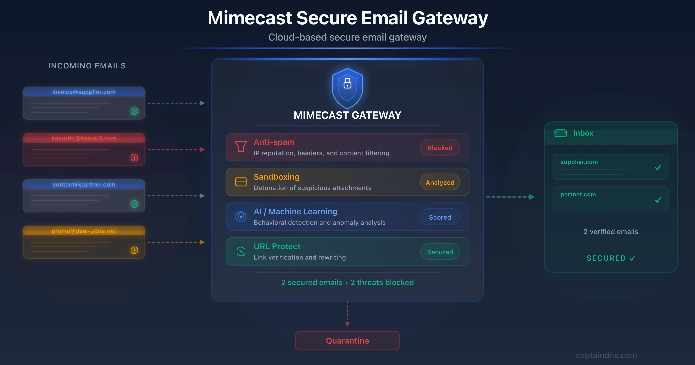
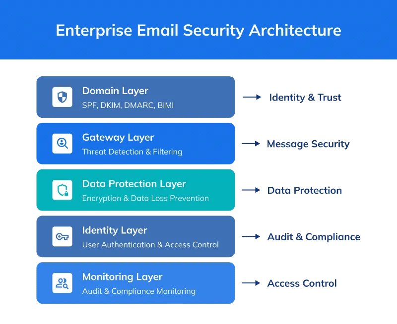
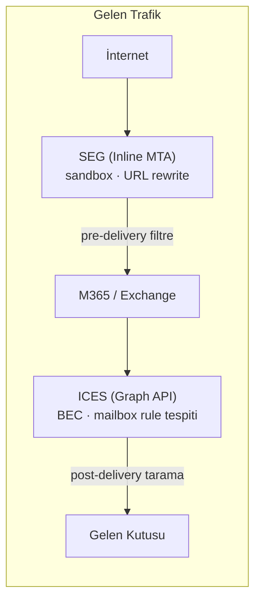
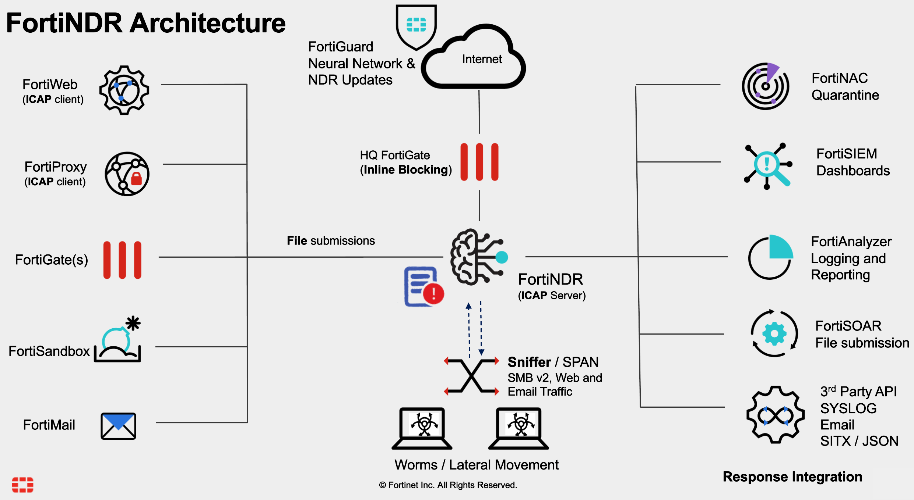

# Gelişmiş E-Posta Tehditleri ve SEG Entegrasyonu

SPF, DKIM ve DMARC doğrudan alan adı sahteciliğini engeller; ancak meşru bir hesaptan gönderilen zararlı içerik, sosyal mühendislik saldırıları ve iş süreci ihlali (BEC) yalnızca **içerik analizi**, **davranışsal tespit** ve **katmanlı gateway mimarisi** ile yakalanır. FBI IC3 2025 Yıllık Raporu'na göre BEC kaynaklı doğrulanmış kayıplar 3,04 milyar dolara ulaşmış; kimlik avı/spoofing kayıpları 215,8 milyon dolara yükselmiştir. BEC fonlarının %86'sı banka havalesi veya ACH üzerinden hareket eder — müdahale süresi gün değil **saat** cinsinden ölçülür.

Önceki bölümde (§9.1) SPF, DKIM ve DMARC ile alan adı sahteciliği DNS katmanında engellenmişti. Ancak kimlik doğrulama geçen meşru hesaplardan gelen zararlı içerik, sosyal mühendislik ve BEC saldırıları bu katmanın ötesinde kalır. Bu bölüm, **Secure Email Gateway (SEG)** ve **Integrated Cloud Email Security (ICES)** mimarilerini, sandboxing ve tıklama anı korumalarını, SIEM tabanlı BEC tespit mühendisliğini ve Türkiye mevzuatıyla entegrasyonu ele alır.


*Kurumsal e-posta güvenliği: tehdit tespiti, filtreleme ve teslimat öncesi/sonrası koruma katmanları*

---

## §9.2.1. Gelişmiş E-Posta Tehditlerinin Anatomisi

Saldırganlar artık yalnızca virüslü ek göndermek yerine, güveni ve insan psikolojisini suistimal eden, teknik olarak temiz görünen saldırılar düzenlemektedir. **Spear phishing** ile **BEC** arasındaki temel fark hedeflilik ve payload varlığıdır.

### Tehdit Türleri Karşılaştırması

| Tehdit Türü | Hedef | İçerik | MITRE ATT&CK |
| :---- | :---- | :---- | :---- |
| **Bulk Phishing** | Geniş kitle | Genel, kişiselleştirilmemiş | T1566 |
| **Spear Phishing** | Belirli çalışanlar | OSINT ile özelleştirilmiş | T1566.001 / T1566.002 |
| **Whaling** | C-suite yöneticiler | Otorite + aciliyet vurgusu | T1566 |
| **BEC** | Finans, muhasebe, İK | Payload-less; para transferi, fatura | T1566, T1534, T1114.003 |

### Business Email Compromise (BEC)

BEC, FBI tarafından ayrı izlenen beş alt türle sınıflandırılır:

- **CEO dolandırıcılığı:** Üst yönetici taklidiyle acil havale talebi
- **Tedarikçi e-posta uzlaşması (VEC):** Gerçek tedarikçi zincirine "banka hesabı değişikliği" enjeksiyonu
- **Bordro yönlendirme (payroll diversion):** Maaş ödemelerinin saldırgan hesabına yönlendirilmesi
- **Avukat taklidi:** Gizli yasal bahane (pretext) kullanımı
- **Veri hırsızlığı BEC:** W-2, personel listesi talebi

BEC'in en tehlikeli yanı **malware taşımamasıdır**. Saldırgan, ele geçirilmiş gerçek bir yönetici hesabından yazım stiline sadık, bağlamlı mesajlar gönderir; imza tabanlı SEG'ler bunu yakalamakta zorlanır. KnowBe4 telemetrisine göre en geniş müşteri tabanına sahip beş SEG üzerinde yapılan analizde kimlik avı bağlantılarının ortalama **%60,9'u** gateway'i bypass eder; BEC en yüksek baypas oranına sahip tehdit türüdür (%59,8).

### BEC Saldırı Yaşam Döngüsü

```
Aşama 1: Keşif (T1593, T1589)
    → LinkedIn, şirket web sitesi, veri ihlalleri üzerinden profilleme
    ↓
Aşama 2: İlk Erişim (T1566.001/.002, T1586.002)
    → Spear phishing, MFA fatigue, AiTM proxy, tedarikçi uzlaşması
    ↓
Aşama 3: Kalıcılık (T1564.008, T1114.003)
    → Yönlendirme/otomatik silme kuralları; 72 gün sessiz izleme
    ↓
Aşama 4: Etki
    → Havale, sahte fatura, kanal değiştirme (e-posta → SMS)
```

**AiTM (Adversary-in-the-Middle) oltalama:** Saldırgan MFA çerezlerini çalarak oturum ele geçirir. OAuth token'ları parola sıfırlamadan sonra bile erişimi sürdürür — onay izleme, kimlik bilgisi hijyeninden ayrı bir kontrol yüzeyidir.

### Sömürü Mantığı (Saldırgan Perspektifi)

| Vektör | Teknik | Bypass Nedeni |
| :---- | :---- | :---- |
| Display name spoofing | From görünen adı manipülasyonu | SPF/DKIM geçebilir |
| Reply-To manipulation | Farklı Reply-To adresi | Kullanıcı fark etmez |
| Lookalike domain | `sirket-tr.com` vs `sirket.com.tr` | DMARC farklı domain |
| Direct Send abuse | M365'ten kimlik doğrulamasız gönderim | SPF bypass |
| Kanal değiştirme | E-postadan SMS/sohbet uygulamasına kayma | SEG görünürlüğü dışı |

:::caution
DMARC `p=reject` CEO fraud'u tek başına durdurmaz — saldırgan kurbanın gerçek hesabını ele geçirdiğinde veya lookalike domain kullandığında kimlik doğrulama geçer. Finansal işlemlerde **out-of-band doğrulama** (bilinen numaradan geri arama) ve **çift onay** zorunludur.
:::

---

## §9.2.2. SEG ve ICES Mimarisi

**Secure Email Gateway (SEG)**, MX kaydının gateway'e yönlendirilmesiyle posta akışında satır içi (inline) konumlanır ve mesaj kutuya ulaşmadan **önce** teslimat öncesi denetim yapar. **ICES (Integrated Cloud Email Security)**, Gartner'ın 2021'de tanımladığı kategori olup MX değişikliği olmadan Microsoft Graph API veya Google Workspace API üzerinden teslimat sonrası posta kutusunu tarar.


*Domain katmanı (SPF/DKIM/DMARC) → Gateway katmanı → Kimlik ve izleme katmanları*

### SEG vs ICES Karşılaştırması

| Kriter | SEG (Inline MTA) | ICES (API Tabanlı) |
| :---- | :---- | :---- |
| **Ağ konumu** | MX yönlendirmeli sınır geçidi | Out-of-band API entegrasyonu |
| **Engelleme zamanı** | Teslimat öncesi (pre-delivery) | Teslimat anı/sonrası (post-delivery) |
| **İç trafik görünürlüğü** | Yok (dış↔iç yalnızca) | Tam (internal-to-internal dahil) |
| **İş sürekliliği riski** | Yüksek (SEG kesintisinde posta durur) | Sıfır (güvenlik kesilse de posta akar) |
| **Teslimat gecikmesi** | Var (analiz süresi) | Yok (asenkron işleme) |
| **DLP/arşivleme** | Güçlü, merkezi uyumluluk | Bağlamsal, dinamik kural motoru |

Modern savunma derinliği, **SEG + ICES hibrit** konumlandırmasını gerektirir: SEG kaba kirli trafiği elerken ICES hesap ele geçirme ve iç tehditleri yakalar.



### Posta Akışı Topolojisi

```
┌─────────────┐     ┌─────────────────────────────────────┐     ┌─────────────────┐
│  İnternet   │ ──► │        Secure Email Gateway        │ ──► │   E-Posta       │
│  (Inbound)  │     │  SPF/DKIM/DMARC + DLP + Sandbox   │     │   Sunucusu      │
└─────────────┘     └─────────────────────────────────────┘     │   (M365/Exch)   │
         ▲                                                      └────────┬────────┘
         │                                                               │
         │ Outbound: DLP + imzalama                                      ▼
         │                                                      ┌─────────────────┐
         └──────────────────────────────────────────────────────│  ICES Katmanı   │
                                                                │  (API tarama)   │
                                                                └────────┬────────┘
                                                                         ▼
                                                                ┌─────────────────┐
                                                                │  Kullanıcı      │
                                                                │  Gelen Kutusu   │
                                                                └─────────────────┘
```

**Tipik SEG ürünleri:** Proofpoint, Mimecast, Cisco Secure Email, Fortinet FortiMail, Barracuda, Microsoft EOP / Defender for Office 365.


*Anti-spam, sandboxing, AI/ML ve URL Protect katmanlarının tek gateway içinde entegrasyonu*

### Microsoft Defender for Office 365 Yapılandırması

Defender, bulut tabanlı SEG işlevselliğini yerel olarak sunar:

- **Kimliğe bürünme koruması (Impersonation Protection):** Belirli gönderenler ve domainler için yapılandırılabilir
- **Posta kutusu zekası (Mailbox Intelligence):** İletişim kalıplarını öğrenerek anomali tespiti
- **Anti-phishing:** "Honor DMARC record policy when message is detected as spoof" aktif edilmeli
- **Spoof Intelligence:** Sahte gönderenlerin otomatik tespiti

---

## §9.2.3. Zararlı Ek Analizi (Sandboxing)

İmza tabanlı tarama bilinen tehditleri yakalar; **sıfırıncı gün (zero-day)** eklerini kaçırır. Sandboxing, eki izole sanal ortamda çalıştırarak davranışını gözlemler.

### Analiz Süreci

| Aşama | İşlem | Çıktı |
| :---- | :---- | :---- |
| **1. Yakalama** | Ek ayıklama, hash, dosya türü kontrolü | Bilinen malware → anında blok |
| **2. Statik analiz** | YARA, dosya yapısı, imza eşleştirme | Şüpheli → dinamik analize |
| **3. Dinamik analiz** | VM'de çalıştırma; syscall, registry, ağ izleme | Davranışsal verdict |
| **4. Karar** | Temiz / Kötü amaçlı / Şüpheli-beklet | Teslim / karantina / strip |

### Ürün Karşılaştırması

| Ürün | Özellik | Not |
| :---- | :---- | :---- |
| **Defender Safe Attachments** | Dynamic Delivery: gövde hemen teslim, ek arka planda taranır | Tipik tarama ~15 dk |
| **Proofpoint TAP** | Bare-metal sandbox, parola korumalı belge, gömülü URL analizi | Ekler dinlenmede şifrelenir |
| **FortiMail + FortiSandbox** | On-prem veya bulut detonasyon; SIEM entegrasyonu | ICAP/API bağlantısı |
| **Palo Alto WildFire** | Global threat intel; Prisma Access Email Security | Çok format desteği |

### Sandbox Kaçınma Teknikleri ve Karşı Tedbirler

| Saldırı Mekanizması | Savunma Karşı Tedbiri |
| :---- | :---- |
| **VM fingerprinting** (1–2 CPU, düşük RAM, VMware sürücüleri) | Bare-metal sandboxing; parmak izi temizleme |
| **Sleep/uyku döngüsü** (Sleep(), NtDelayExecution) | Zaman hızlandırma (time fast-forward); API hooking |
| **İnsan etkileşimi bekleme** (fare hareketi, makro onayı) | Simüle kullanıcı etkileşimi botları |
| **Şifreli ek + parola gövdede** | NLP/OCR ile parola ayıklama; arşiv otomatik açma |

:::danger
Standart sandbox analiz penceresi 2–5 dakikadır. Saldırganlar uyku döngüleriyle bu pencereyi aşar. Şüpheli dosyalar için dinamik olarak 10+ dakikaya çıkarılmalıdır.
:::

---

## §9.2.4. Tıklama Zamanı (Time-of-Click) ve URL Yeniden Yazma

Bir bağlantı teslimat anında temiz görünüp sonradan zararlı hale gelebilir (**deferred weaponization**). Time-of-click koruması, kullanıcının tıkladığı anda hedefi gerçek zamanlı değerlendirir.

### URL Rewriting Mekanizması

1. SEG gelen e-postadaki tüm URL'leri yakalar
2. Güvenlik proxy URL'sine sarmalar (`safelinks.protection.outlook.com`, `urldefense.proofpoint.com`)
3. Kullanıcı tıkladığında gerçek zamanlı tarama yapılır
4. Zararlıysa engelleme sayfası; temizse yönlendirme

**Proofpoint URL Defense v2 parametreleri:**

```
https://urldefense.proofpoint.com/v2/url?u=...&d=...&c=...&r=...&m=...&s=...&e=
```

| Parametre | İşlev |
| :---- | :---- |
| `u=` | Maskelenmiş hedef URL |
| `r=` | Şifrelenmiş alıcı kimliği (forensics) |
| `m=` | Mesaj GUID (log korelasyonu) |
| `s=` | Parametre bütünlük imzası (manipülasyon önleme) |

### Microsoft Safe Links Politikası

```powershell
New-SafeLinksPolicy -Name "Strict-TimeOfClick" `
  -IsEnabled $true `
  -EnableSafeLinksForEmail $true `
  -TrackClicks $true `
  -AllowClickThrough $false
```

Geç 2024'ten itibaren "Do not rewrite URLs, do checks via Safe Links API only" seçeneğiyle URL sarmalama olmadan istemci tarafı tıklama anı kontrolü mümkündür.

### FortiMail Click Protection (CLI)

```
config profile content
  edit "Depth_In_Defense_Content_Profile"
    config content-disarm-reconstruct
      set url click-protection-isolator
    end
  next
end
```

### Sınırlamalar ve Baypas Vektörleri

| Sınırlama | Etki | Azaltma |
| :---- | :---- | :---- |
| S/MIME imzalı mesajlarda rewrite yok | Saldırganlar bunu istismar eder | Şifreli kanal politikası |
| DKIM imzası bozulması | Katı DMARC'ta red | SEG re-signing |
| Open redirect istismarı | Meşru site üzerinden yönlendirme | Redirect chain analizi |
| QR kod (Quishing) | Metin tabanlı filtre bypass | Computer vision QR çözümleme |
| "Do not rewrite" listesi | Her giriş kör nokta | Minimum liste, düzenli gözden geçirme |

URL koruması, **tarayıcı izolasyonu (browser isolation)** ile katmanlandırılmalıdır.

---

## §9.2.5. SIEM'de BEC Tespit Mühendisliği

BEC e-postaları zararlı yük taşımadığından tespit, davranışsal anomalilerin sistemler arası korelasyonuna dayanır.

### Kritik Sinyaller

| Sinyal | Açıklama | MITRE |
| :---- | :---- | :---- |
| **Impossible travel** | Coğrafi olarak imkânsız giriş | T1078 |
| **Posta kutusu kuralı anomalisi** | Giriş sonrası yönlendirme/silme kuralı | T1114.003 |
| **OAuth consent phishing** | Mail.Read/Mail.Send kapsamlı zararlı uygulama onayı | T1550.001 |
| **PowerShell/EWS/Graph kural oluşturma** | Web arayüzü yerine API üzerinden kural | T1114.003 |
| **Mesai dışı yüksek hacim** | Anormal giden posta | Insider threat |

"invoice", "transfer", "ACH" anahtar kelimelerini dış adrese sessizce yönlendiren kurallar en yaygın BEC kalıcılık mekanizmasıdır.

### Wazuh ve Shuffle SOAR Entegrasyonu

Microsoft Graph API üzerinden Office 365 e-postaları çekilir, IOC'ler ayrıştırılır ve Wazuh korelasyonuna gönderilir:

```bash
curl -sL https://urlhaus.abuse.ch/downloads/text_recent/ -o /var/ossec/etc/lists/phishing_urls
curl -sL https://bazaar.abuse.ch/export/txt/md5/full/ -o /var/ossec/etc/lists/phishing_md5s
```

`ossec.conf` URLhaus entegrasyonu:

```xml
<integration>
  <name>custom-urlhaus.py</name>
  <hook_url>https://urlhaus-api.abuse.ch/v1/url/</hook_url>
  <rule_id>86601</rule_id>
  <alert_format>json</alert_format>
</integration>
```

### Wazuh Algılama Kuralları

`/var/ossec/etc/rules/local_rules.xml`:

```xml
<group name="phishing-custom,email-sec,m365_identity,">
  <rule id="100201" level="7">
    <if_sid>61603</if_sid>
    <field name="win.eventdata.commandLine" type="pcre2">(?i)chrome.exe.*(http|https)://</field>
    <description>Şüpheli: Kullanıcı e-posta bağlantısı açtı.</description>
  </rule>

  <rule id="100301" level="13">
    <decoded_as>json</decoded_as>
    <field name="office365.anomaly" type="pcre2">^impossible_travel$</field>
    <description>KRİTİK: İmkansız seyahat anomalisi — $(office365.UserId)</description>
    <group>account_takeover,compromised_credentials</group>
  </rule>

  <rule id="100204" level="11">
    <decoded_as>json</decoded_as>
    <field name="office365.actionname" type="pcre2">^DETECTION_ACTION_M365_FILE_UPLOADED$</field>
    <field name="office365.filetype" type="pcre2">(?i)^(exe|bat|cmd|ps1|lnk)$</field>
    <description>Yüksek risk: M365'e yürütülebilir dosya yüklendi.</description>
  </rule>
</group>
```

### Müdahale (Containment) Kontrol Listesi

Parola sıfırlama **tek başına yetersizdir:**

1. Tüm aktif oturumlar ve refresh token'lar iptal edilmeli
2. Zararlı posta kutusu kuralları kaldırılmalı
3. OAuth onayları gözden geçirilmeli
4. Kimlik avına dayanıklı MFA (FIDO2/passkey) zorunlu kılınmalı
5. Legacy authentication engellenmeli

<details>
<summary>Derinlemesine: BEC AiTM Saldırı Zinciri ve Post-Compromise Kalıcılık</summary>

**AiTM (Adversary-in-the-Middle) oltalama** MFA çerezlerini çalarak oturum ele geçirir; parola sıfırlama tek başına yetersizdir.

| Aşama | Teknik | Tespit Sinyali | MITRE |
| :---- | :---- | :---- | :---- |
| 1 — Phishing | Sahte M365 login proxy | `UserAgent` anomalisi, yeni IP | T1566.002 |
| 2 — Token çalma | Session cookie / refresh token | `impossible_travel` + MFA bypass | T1550.001 |
| 3 — Kalıcılık | Inbox rule: `invoice` → dış adres | Graph API rule audit | T1114.003 |
| 4 — Sessiz izleme | 72 gün pasif okuma | Anormal `MailItemsAccessed` | T1114.003 |
| 5 — Etki | Sahte fatura / havale talebi | DMARC geçen meşru hesap | T1566 |

**Müdahale kontrol listesi (sıralı):**

1. `revokeSignInSessions` + refresh token iptali
2. Tüm inbox/forwarding kurallarını kaldır
3. OAuth consent grants gözden geçir (`Mail.Read`, `Mail.Send`)
4. FIDO2/passkey zorunlu kıl
5. Out-of-band doğrulama (bilinen numaradan geri arama)

KnowBe4 telemetrisine göre kimlik avı bağlantılarının ortalama **%60,9'u** gateway'i bypass eder; ICES katmanı bu boşluğu kapatır.

</details>

---

## §9.2.6. Standartlar, KPI'lar ve Türkiye Mevzuatı

### Uluslararası Standart Eşleştirmesi

| Standart | Kontrol | E-posta Karşılığı |
| :---- | :---- | :---- |
| **NIST SP 800-177** | Trustworthy Email | DMARC p=reject, Safe Links, sandbox |
| **NIST SP 800-53 SI-8** | Spam Protection | Merkezi SEG, otomatik güncelleme |
| **NIST SP 800-61** | Olay Müdahalesi | BEC playbook, 72 saat bildirim |
| **CIS Controls v8 — C9** | Email Protections | DMARC, URL rewrite, ek filtreleme |
| **ISO 27001 A.5.14** | Bilgi transferi | SEG + DLP + şifreleme |

### SOC KPI'ları

| Metrik | Hedef |
| :---- | :---- |
| BEC/phishing pre-delivery detection rate | Trend izleme |
| False positive oranı (karantina) | <%1 kritik iş postası |
| Time-to-Detect (BEC alert) | <15 dakika |
| DMARC compliance oranı | %100 gönderen domain |
| Sandbox malicious verdict oranı | Aylık raporlama |

### Türkiye Mevzuatı

**6698 sayılı KVKK:** E-posta logları kişisel veri işleme kapsamındadır. Meşru menfaat veya hukuki yükümlülük temelinde işlenebilir; analiste **maskeleme** (IP son oktet, kimlik numarası kısmi yıldızlı) uygulanmalı; gerçek veriye **çift yetkili erişim** şarttır. İhlal durumunda 72 saat Kurul bildirimi.

**5651 sayılı Kanun:** SMTP/MTA logları syslog ile SIEM'e aktarılmalı; RFC 3161 uyumlu **zaman damgası** ile bütünlük korunmalı. Yer sağlayıcı için asgari 1 yıl, erişim sağlayıcı için asgari 6 ay saklama yükümlülüğü vardır.

**BDDK (5411 md.42 + BSEBY):** Finans kuruluşlarında e-posta güvenliği kritik altyapı bileşenidir. Kimlik doğrulama, zararlı yazılım tarama, SIEM entegrasyonu, sızma testleri ve oltalama farkındalık ölçümü zorunludur. Havale akışlarında çift onay + bilinen numaradan geri arama prosedürü şarttır.

---

## §9.2.7. Olay Müdahale ve SEG Log Örneği

### SOC İş Akışı

```
SEG Alert → SIEM Enrichment (UEBA + TI) → SOAR Playbook
    → Quarantine + User Disable + Ticket
    → Header analizi (Received, DKIM, DMARC)
    → Mailbox rule kontrolü + out-of-band doğrulama
    → Kapsam belirleme + IC3/RAT bildirimi (72 saat)
```

### CEF Log Örneği (FortiMail)

```
CEF:0|Fortinet|FortiMail|7.4|email.sandbox.malicious|Malicious attachment|High|
src=attacker@evil.com dst=finance@company.com file=invoice.pdf verdict=Malicious
sandbox_id=FS-12345
```

### JSON Log Örneği (BEC Karantina)

```json
{
  "timestamp": "2026-06-20T14:23:45.123Z",
  "threat_type": "BEC",
  "threat_category": "impersonation",
  "sender": "ceo@example-corp.com",
  "recipient": "finance@target-org.com",
  "subject": "ACİL: Fatura Ödeme Onayı",
  "dmarc_result": "fail",
  "action": "quarantine",
  "mitre_attack": ["T1566.002", "T1598"],
  "compliance": ["KVKK", "5651"]
}
```

---

## Özet ve Mimari Tavsiyeler

Gelişmiş e-posta tehditlerine karşı etkili savunma **tek bir çözüme** değil, **katmanlı yaklaşıma** dayanır. SEG baypas oranları (%60+ kimlik avı) ICES katmanının zorunluluğunu somutlaştırır.

### Savunma Katmanları

| Katman | Kontrol | Standart |
| :---- | :---- | :---- |
| **1. Kimlik** | Phishing-resistant MFA (FIDO2), Koşullu Erişim | NIST 800-63, CIS 6 |
| **2. Domain auth** | SPF/DKIM/DMARC p=reject | RFC 7208/6376/7489 |
| **3. Gateway** | SEG pre-delivery + ICES post-delivery | NIST SI-8, CIS 9 |
| **4. İçerik** | Sandbox + URL rewrite + Safe Links | NIST SC-7 |
| **5. Davranış** | UEBA, mailbox rule izleme, impossible travel | MITRE T1114.003 |
| **6. İzleme** | Wazuh/SIEM + SOAR + 5651 loglama | NIST 800-61 |
| **7. İnsan** | Simülasyon, out-of-band onay, çift onay | CIS 14.2 |
| **8. Uyum** | KVKK maskeleme, BDDK 10 yıl saklama | 6698, 5411 md.42 |

### Önerilen Mimari Stack

```
M365/Exchange Online
  → Defender for Office 365 (Safe Links + Safe Attachments)
  → FortiMail/Proofpoint (ikinci katman SEG, isteğe bağlı)
  → ICES/API katmanı (Abnormal, Microsoft API)
  → Wazuh/Splunk SIEM + Shuffle SOAR
  → KVKK uyumlu log retention + BDDK raporlama
```

**Tetikleyiciler:** SEG baypas oranı yükselirse ICES ekle; YubiKey/passkey kapsamı %100'e ulaşınca SMS MFA kaldır; DMARC fail artışında takedown süreci başlat. Çeyreklik BEC tatbikatları (IC3/RAT bildirim penceresi dahil) operasyonel olgunluğu ölçer.