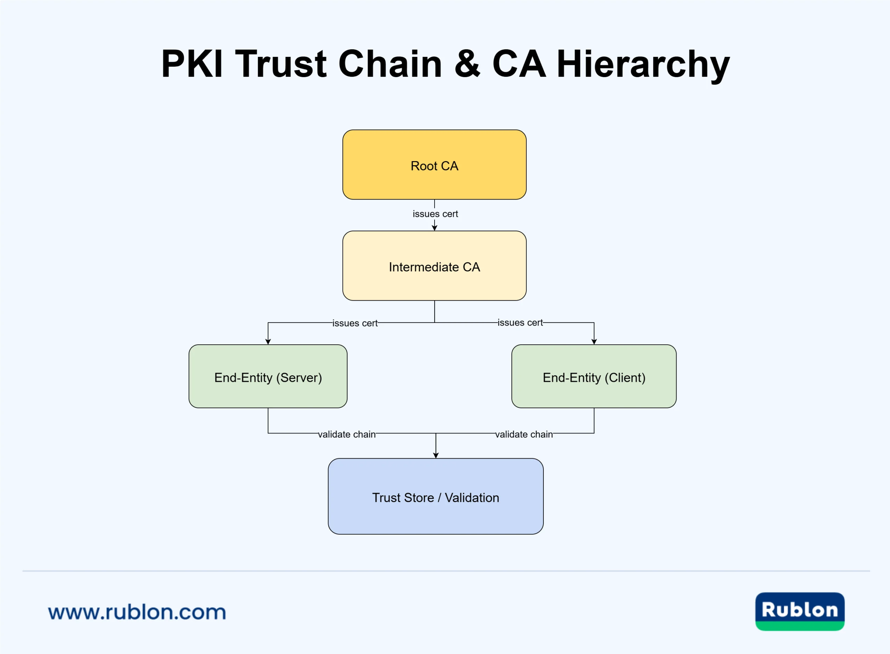
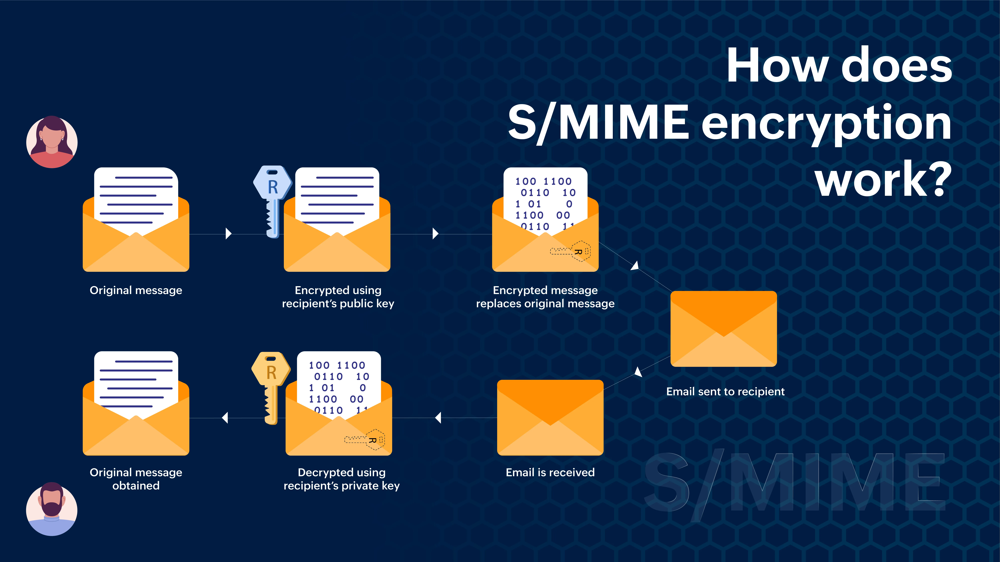
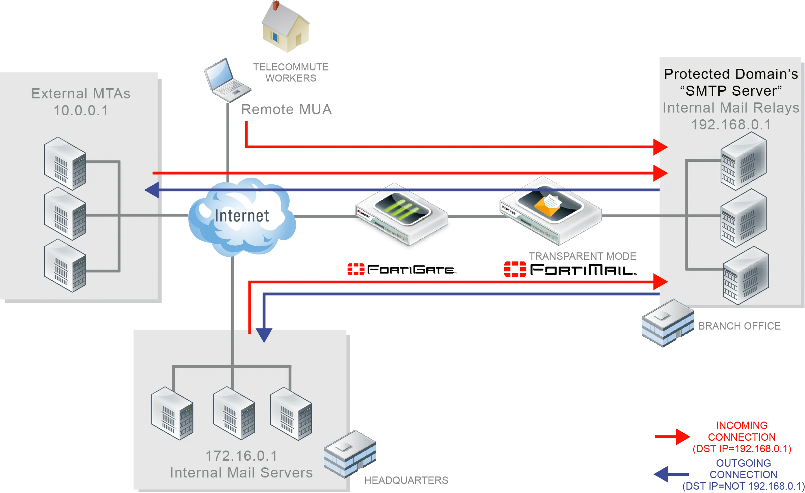
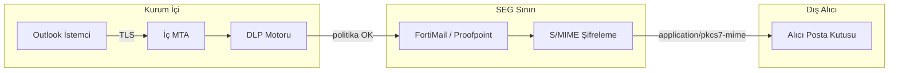

# E-Posta Şifreleme Teknolojileri ve Veri Sızıntısı Analizi

TLS ile şifrelenen e-posta trafiği yalnızca **aktarım sırasında** korunur; sunucuya ulaştığında deşifre edilir. Uçtan uca e-posta şifrelemesi (S/MIME ve PGP/OpenPGP), mesajın yalnızca hedef alıcı tarafından okunabilmesini garanti eder. Ancak şifreli kanallar SEG ve DLP sistemlerinin içerik taramasını imkânsız kılar — bu **görünürlük kaybı** operasyonel açığı, ön-şifreleme denetimi, gateway şifreleme ve davranışsal analizle kapatılmalıdır.

§9.1'deki kimlik doğrulama (SPF/DKIM/DMARC) ve §9.2'deki gateway/SEG katmanları, e-postanın **kimden geldiğini** ve **içeriğinin zararlı olup olmadığını** doğrular. Bu bölüm ise mesajın **aktarım ve depolama sırasında gizliliğini** ele alır: TLS yalnızca hat üzerinde koruma sağlarken, S/MIME ve PGP uçtan uca şifreleme sunar. Şifreleme ile DLP arasındaki gerilim (görünürlük kaybı) ve Türkiye'ye özgü DLP desenleri (T.C. Kimlik, IBAN, Luhn) de bu kapsamda değerlendirilir.


*Kök CA → ara CA → son kullanıcı S/MIME sertifikaları hiyerarşisi*

---

## §9.3.1. S/MIME Mimarisi ve Kurumsal PKI Entegrasyonu

**S/MIME (Secure/Multipurpose Internet Mail Extensions)**, RFC 8551 ile tanımlanan, X.509 sertifikaları ve hiyerarşik PKI modelini temel alan kurumsal e-posta şifreleme/imzalama standardıdır. CMS (Cryptographic Message Syntax) yapılarıyla MIME mesajlarını `application/pkcs7-mime` (şifreli) ve `application/pkcs7-signature` (imzalı) olarak sarar.


*Alıcının açık anahtarıyla simetrik anahtar şifrelenir; gövde AES ile korunur; gönderen özel anahtarıyla imzalar*

### Hibrit Şifreleme Modeli

Uçtan uca şifrelemede her iki standart da aynı hibrit modeli kullanır:

1. E-posta gövdesi rastgele üretilen **oturum anahtarı** (session key) ile şifrelenir
2. Oturum anahtarı alıcının **asimetrik kamu anahtarı** ile şifrelenerek iletiye eklenir
3. Alıcı özel anahtarıyla oturum anahtarını çözer, ardından içeriği deşifre eder

### S/MIME Capabilities (RFC 4262)

Sertifika içindeki S/MIME Capabilities uzantısı, alıcının desteklediği algoritmaları (AES-256-GCM, SHA-256) el sıkışma olmaksızın senkronize eder. Uzantı yoksa RFC 8551 varsayılanlarına (AES-128-GCM) geri dönülür.

### Kurumsal PKI Katmanları

```
┌─────────────────────────────────────────────────────────────────┐
│                    KURUMSAL PKI KATMANI                         │
├─────────────────────────────────────────────────────────────────┤
│  ┌───────────────┐  ┌───────────────┐  ┌───────────────────┐  │
│  │   Kök CA      │──│   Ara CA      │──│  S/MIME Sertifika │  │
│  │  (Offline/HSM)│  │   (AD CS)     │  │    Yönetimi       │  │
│  └───────────────┘  └───────────────┘  └───────────────────┘  │
├─────────────────────────────────────────────────────────────────┤
│  Dağıtım: AD Auto-Enrollment (GPO) + SCEP/EST + LDAP publish   │
│  İptal: CRL + OCSP                                               │
│  Çift anahtar: imzalama (inkâr edilemezlik) + şifreleme (escrow) │
└─────────────────────────────────────────────────────────────────┘
```

**ADCS entegrasyonu:** Enterprise CA üzerinde "S/MIME Sertifika Şablonu" oluşturulur; EKU olarak "Secure Email" (`1.3.6.1.5.5.7.3.4`) atanır. Auto-Enrollment GPO ile etkinleştirilir; sertifika `userCertificate` özniteliğine yazılır — Outlook kamu anahtarını LDAP üzerinden çeker.

:::caution
Her kullanıcının AD nesnesine binary sertifika yazılması **ntds.dit şişmesine** yol açar. Süresi dolmuş sertifikalar düzenli temizlenmeli; servis hesaplarına binlerce sertifika yazılmamalıdır (nesne başına ~1250 sertifika sınırı).
:::

**ESC8 riski:** ADCS HTTP Web Enrollment (`/certsrv`) NTLM relay ile ayrıcalık yükseltmeye açıktır. HTTP devre dışı, HTTPS zorunlu, Extended Protection for Authentication (EPA) etkin olmalıdır.

### Microsoft 365 S/MIME Dağıtımı

Exchange Online'da kullanıcı sertifikaları GAL (Global Address List) üzerinden yayımlanarak otomatik şifreleme yapılandırılabilir. Sertifika yaşam döngüsü (yenileme, iptal — CRL/OCSP) kurumsal PKI tarafından otomatize edilmelidir.

---

## §9.3.2. PGP/OpenPGP ve Web of Trust

**PGP (Pretty Good Privacy)**, RFC 9580 (OpenPGP 2024) ile standartlaştırılmış, merkezi CA yerine **Web of Trust (WoT)** modelini kullanan alternatiftir. Kullanıcılar birbirlerinin anahtarlarını doğrular; merkezi yönetim olmadan esneklik sunar ancak ölçekte karmaşıklık yaratır.

| Kriter | S/MIME 4.0 (RFC 8551) | OpenPGP (RFC 9580) |
| :---- | :---- | :---- |
| **Güven modeli** | Hiyerarşik CA / PKI | Web of Trust / WKD |
| **Simetrik** | AES-128-GCM (MUST), AES-256-GCM | AES-256 (AEAD zorunlu) |
| **Asimetrik** | RSA 2048+, ECDH P-256 | RSA, Ed25519, X25519 |
| **İstemci** | Outlook, Apple Mail (native) | GnuPG + eklenti (Thunderbird) |
| **Kurumsal ölçek** | Yüksek (AD CS, GPO) | Düşük (manuel anahtar yönetimi) |
| **Uyumluluk** | S/MIME ↔ PGP **uyumsuz** | — |

"Why Johnny Can't Encrypt" (1999) çalışması PGP'nin kullanılabilirlik zorluklarını belgelemiştir. Açık kaynak topluluğu, GPG-imzalı commit'ler ve yüksek gizlilik gerektiren senaryolarda PGP doğal uzantıdır.

**Kurumsal öneri:** İç iletişimde S/MIME (otomatik); dış partnerlerde S/MIME + gerektiğinde PGP fallback. Her iki protokol de ek boyutu kısıtlamalarına ve **EFAIL** türü istemci zafiyetlerine tabidir.

---

## §9.3.3. Gateway Şifreleme vs Uçtan Uca Şifreleme

Gerçek E2EE, SEG'in içerik incelemesini imkânsız kılar. Kurumsal savunma derinliği bu çelişkiyi **gateway S/MIME** mimarisiyle çözer.


*Ağ geçidinde şifreleme/deşifreleme: iç trafik TLS ile korunur, sınırda DLP taraması yapılır, dışarıya S/MIME ile şifrelenir*

### Mimari Akış



```
┌───────────┐   plain (TLS)   ┌────────────┐   DLP tarama   ┌─────────────┐
│ İstemci   │───────────────►│ İç MTA     │───────────────►│ SEG         │
│ (Outlook) │                │ (Exchange) │                │ (FortiMail) │
└───────────┘                └────────────┘                └──────┬──────┘
                                                                  │ S/MIME şifreleme
                                                                  ▼
                                                           ┌─────────────┐
                                                           │ Dış Alıcı   │
                                                           └─────────────┘
```

Kurum içinde istemci açık metin gönderir (istemci–sunucu arası TLS korumalı). SEG sınırında DLP motoru içeriği tarar; politika ihlali yoksa alıcının kamu anahtarıyla S/MIME şifreler. Gelen şifreli posta escrow edilmiş özel anahtarla çözülür, taranır ve kullanıcıya iletilir.

### FortiMail S/MIME Yapılandırması

**Certificate Binding:** Encryption → S/MIME → Certificate Binding → `*@sirket.com` için PKCS12 (.p12) yüklenir. RC2 PBE desteklenmez; uyumsuz paketler OpenSSL ile yeniden paketlenmelidir.

```bash
config profile security encryption
  edit "SMIME_Gateway_Profile"
    set protocol smime
    set encryption-algorithm aes256
    set action encrypt-and-sign
    set action-on-failure enforce-tls
  next
end
```

**IBE (Identity Based Encryption) fallback:** Alıcının S/MIME anahtarı yoksa Push (şifreli PDF) veya Pull (güvenli web portalı) yöntemiyle iletim.

### Şifreli Posta ve DLP Çatışması Yönetimi

| Strateji | Açıklama | E2EE Etkisi |
| :---- | :---- | :---- |
| **Ön-şifreleme taraması** | Endpoint DLP agent mesajı şifrelemeden önce tarar | Korunur |
| **Gateway şifreleme** | SEG'de DLP → sonra S/MIME | E2EE kısmen ortadan kalkar |
| **Davranışsal analiz** | Şifreli posta hacmi, alıcı anomalisi | Meta veri görünür kalır |
| **Key escrow** | Kurumsal anahtar kopyası (KVKK dikkat) | Adli/DLP erişimi mümkün |
| **İzinli şifreleme** | Yalnızca kurumsal PKI sertifikalarına izin | Harici PGP bloke |

:::danger
Key escrow, KVKK md.12 "amaçla sınırlılık" ilkesiyle çelişebilir. Escrow yalnızca açık politika, sınırlı erişim ve denetim izi ile uygulanmalıdır.
:::

---

## §9.3.4. E-Posta Başlıkları ve Meta Veri Analizi

E-posta başlıkları, şifrelenmiş olsa bile SMTP yönlendirmesi için **açık metin** taşınır. SEG ve DLP sistemleri bu katmanda zengin kanıt ve sızıntı göstergesi bulur.

### Kritik Başlık Alanları

```
Return-Path: <gonderen@kurum.com>
Received: from mail.kurum.com (192.168.1.100) by seg.kurum.com
From: "Ahmet Yılmaz" <ahmet.yilmaz@kurum.com>
To: ali.veli@rakipfirma.com
Cc: <gizli.alici@kisisel.com>
Reply-To: saldirgan@kotu-niyet.com
Subject: PROJE-X FİYAT TEKLİFİ
X-Classification: CONFIDENTIAL
X-Mailer: curl/7.88.1
Message-ID: <123456@outlook.com>
DKIM-Signature: v=1; d=kurum.com; ...
```

| Başlık | Analiz Değeri |
| :---- | :---- |
| **Received** | Yönlendirme zinciri; spoofing, VPN/proxy tespiti |
| **From / Reply-To uyumsuzluğu** | BEC klasik göstergesi |
| **X-Mailer / User-Agent** | curl, Python smtplib → yetkisiz gönderim |
| **Message-ID deseni** | Kampanya korelasyonu |
| **X-Classification / Sensitivity Labels** | Microsoft Purview etiketleri |
| **Cc / Bcc** | Gizli alıcı ile veri sızdırma |

### S/MIME MIME Yapısı

Şifreli ileti:

```
Content-Type: application/pkcs7-mime; smime-type=enveloped-data; name="smime.p7m"
Content-Transfer-Encoding: base64
```

DLP motoru `smime.p7m` bloğunun içeriğini çözemez — bu nedenle **başlık ve davranış analizi** kritiktir.

### DLP Tarama Performansı

| Tarama Türü | Kapsanan Başlıklar | Aksiyon |
| :---- | :---- | :---- |
| **Senkron (real-time)** | Subject, To, From, Cc, Bcc | Anında engelleme |
| **Asenkron** | Received, X-*, özel başlıklar | Geriye dönük alarm |

Kritik DLP kuralları senkron taranan başlıklar üzerine kurgulanmalıdır.

### Veri Sızdırma Vektörleri

| Vektör | Teknik | DLP/SEG Tespiti |
| :---- | :---- | :---- |
| BCC tabanlı sızdırma | Gizli kopya alıcıları | Alıcı domain analizi |
| Yönlendirme kuralı | T1114.003 — dış adrese sessiz yönlendirme | M365 Graph API izleme |
| PGP ile şifreli ek | İçerik DLP kör | Davranışsal analiz + ek uzantısı (.gpg) |
| Steganografi | Görüntü içine gizli veri | Metadata + steganografi tarama |
| Mesai dışı yüksek hacim | Insider threat | UEBA, hacim eşiği |

---

## §9.3.5. DLP İçerik Denetim Kuralları ve Türkiye Desenleri

DLP'nin temel yapı taşı RegEx ve desen eşleştirmedir; yalın regex yüksek yanlış pozitif üretir. **Checksum doğrulaması** (Luhn, MOD-97, TCKN algoritması) post-match validator olarak şarttır.

### Kredi Kartı (Luhn / Mod 10)

Luhn algoritması (ISO/IEC 7812-1): sağdan sola her ikinci rakam ikiye katlanır (>9 ise 9 çıkarılır), toplam 10'a tam bölünüyorsa geçerli.

Format ön-filtresi (yalnızca format; checksum ayrı doğrulanmalı):

```
^(?:4[0-9]{12}(?:[0-9]{3})?|5[1-5][0-9]{14}|3[47][0-9]{13}|6(?:011|5[0-9]{2})[0-9]{12})$
```

PCI DSS bağlamında maskeleme (truncation) uygulanır.

### T.C. Kimlik Numarası

11 hane; ilk hane 0 olamaz. Doğrulama kuralları (1-tabanlı):

- `d10 = ((d1+d3+d5+d7+d9)*7 − (d2+d4+d6+d8)) mod 10`
- `d11 = (d1+d2+...+d10) mod 10`

Format ön-filtresi:

```
\b[1-9][0-9]{10}\b
```

Yabancı Kimlik Numarası (YKN): `\b99[0-9]{9}\b` ile ayırt edilir.

### Türk IBAN (ISO 13616 / MOD-97)

26 karakter: `TR` + 2 kontrol + 5 banka kodu + 1 rezerve + 16 hesap numarası. TCMB IBAN Tebliği (RG 31559) uyarınca MOD 97-10: ilk dört karakter sona taşınır, harfler rakama çevrilir (T→29, R→27), sonuç 97'ye bölündüğünde kalan 1 olmalıdır.

```
TR[0-9]{2}[0-9]{5}[0-9]{17}
```

Boşluklu IBAN için ön-stripleme yapılmalıdır (`TR12 3456 7890 ...` → `TR1234567890...`).

### DLP Politika Mantığı

```
((Kredi Kartı VEYA IBAN VEYA TCKN) VE (sayı > eşik))
  VE (Alıcı dış alan adı)
  VE (Gönderen ≠ yetkili departman)
→ Aksiyon: engelle / karantina / S/MIME şifrele / bildir
```

| Hassasiyet | Hit Count | Tipik Aksiyon |
| :---- | :---- | :---- |
| **Very High** | 1 eşleşme | Karantina + yönetici bildirimi |
| **High** | 2+ eşleşme | Engelle + gönderici uyarısı |
| **Medium** | Bağlamsal | Otomatik S/MIME şifreleme |
| **Low** | Çoklu düşük | Hassas veri etiketi + izin ver |

:::caution
DLP regex desenleri yalnızca format ön-filtresidir. Checksum doğrulaması olmadan yüksek yanlış pozitif üretilir. Catastrophic backtracking riski taşıyan desenler (`.*`, `.+`) kullanılmamalı; `.{1,50}` gibi sınırlı desenler tercih edilmelidir.
:::

Otomatik şifreleme tetikleme (konu satırı):

```
(?i)\[secure\]|\[encrypt\]|\[gizli\]
```

<details>
<summary>Derinlemesine: Türkiye DLP Desenleri — TCKN, IBAN ve Luhn Doğrulama</summary>

DLP regex desenleri yalnızca format ön-filtresidir; **checksum doğrulaması** post-match validator olarak zorunludur.

**T.C. Kimlik Numarası (11 hane):**

| Kural | Formül |
| :---- | :---- |
| İlk hane | 0 olamaz |
| 10. hane | `((d1+d3+d5+d7+d9)*7 − (d2+d4+d6+d8)) mod 10` |
| 11. hane | `(d1+d2+...+d10) mod 10` |

**Türk IBAN (MOD-97):** `TR` + 2 kontrol + 5 banka + 1 rezerve + 16 hesap. İlk dört karakter sona taşınır, harfler rakama çevrilir (T→29, R→27); sonuç 97'ye bölündüğünde kalan **1** olmalıdır.

**Luhn (kredi kartı):** Sağdan sola her ikinci rakam ikiye katlanır (>9 ise 9 çıkarılır); toplam 10'a tam bölünmeli.

```python
def validate_tckn(tckn: str) -> bool:
    if len(tckn) != 11 or tckn[0] == '0':
        return False
    d = [int(c) for c in tckn]
    d10 = ((sum(d[0:9:2]) * 7) - sum(d[1:8:2])) % 10
    d11 = sum(d[:10]) % 10
    return d[9] == d10 and d[10] == d11
```

PCI DSS bağlamında kart numarası maskeleme (truncation) uygulanmalı; BDDK kapsamında denetim izleri **10 yıl** saklanır.

</details>

---

## §9.3.6. EFAIL ve Şifreleme Zafiyetleri

**EFAIL (2018):** S/MIME ve OpenPGP şifreli e-postaların düz metninin açığa çıkarılmasına olanak tanıyan saldırı. Malleability gadget tekniği ile istemci uzak içerik çözümleme özellikleri istismar edilir.

**Savunma:**
- HTML içeriğinin otomatik yüklenmesini devre dışı bırakma
- E-posta istemcilerinin güncel tutulması
- External content engelleme politikaları
- S/MIME opaque signature bypass'a karşı ek tarama politikası

| Saldırı | MITRE | Savunma |
| :---- | :---- | :---- |
| EFAIL malleability | T1020 | İstemci hardening |
| SMTP smuggling | T1071.003 | SEG protokol sıkılaştırma |
| PGP ile şifreli exfil | T1048 | Davranışsal DLP + .gpg engeli |
| ESC8 / PKI compromise | T1649 | EPA, HTTPS-only CAWE |

---

## §9.3.7. SIEM Entegrasyonu ve Wazuh Kuralları

### Zeek SMTP + Wazuh Korelasyonu

```xml
<group name="syslog,email_security,">
  <rule id="101000" level="0">
    <decoded_as>json</decoded_as>
    <field name="service">smtp</field>
    <description>Zeek SMTP trafik log grubu.</description>
  </rule>

  <rule id="101001" level="8">
    <if_sid>101000</if_sid>
    <field name="mail.from" type="pcre2">^[^@]+@kurum\.com$</field>
    <field name="mail.to" type="pcre2">@(?!kurum\.com)[^@]+$</field>
    <field name="mime_type" type="pcre2">pkcs7-mime|pgp-encrypted</field>
    <description>Şüpheli: Dış alıcıya şifreli posta gönderimi.</description>
    <mitre><id>T1048</id></mitre>
  </rule>

  <rule id="101002" level="10">
    <if_sid>101000</if_sid>
    <field name="header_from" type="pcre2">@kurum\.com</field>
    <field name="envelope_from" type="pcre2">@(?!kurum\.com)</field>
    <description>Header-From / Envelope-From uyumsuzluğu — spoofing şüphesi.</description>
    <mitre><id>T1566</id></mitre>
  </rule>
</group>
```

### S/MIME İmza Doğrulama Başarısızlığı

```json
{
  "rule": {
    "id": "100001",
    "level": 10,
    "description": "S/MIME imza doğrulama başarısız",
    "group": "email_security"
  },
  "condition": {
    "field": "email.smime.verification",
    "value": "failed"
  }
}
```

---

## §9.3.8. KVKK, 5651 ve BDDK Uyumu

### 6698 Sayılı KVKK

- Özel nitelikli kişisel verilerin e-posta ile aktarımında **şifreli kurumsal e-posta veya KEP** zorunluluğu
- Veri minimizasyonu: loglarda maskeleme; gerçek veriye çift yetkili erişim
- Yurt dışına aktarımda md.9 şartları; Türkiye içi veri merkezleri tercih edilmeli
- Yılda 2 periyodik imha dönemi; süresiz saklama kural olarak mümkün değil

### 5651 Sayılı Kanun

- SMTP/MTA logları syslog ile merkezi SIEM'e aktarılmalı
- SHA-256 özet + RFC 3161 zaman damgası ile bütünlük
- Yer sağlayıcı: asgari 1 yıl; erişim sağlayıcı: asgari 6 ay

### BDDK (5411 md.42 + BSEBY)

- Bankacılık yazışmaları ve faaliyet belgeleri (e-posta dahil) **10 yıl** saklanır
- Birincil ve ikincil sistemlerin **yurt içi** konumlandırılması (veri ikametgâhı)
- Felaket senaryolarında 24 saat içinde süreklilik
- Ödeme kuruluşları: denetim izleri en az 10 yıl, zaman damgalı

| Regülasyon | Gereksinim | E-posta Karşılığı |
| :---- | :---- | :---- |
| **KVKK md.12** | Teknik tedbirler | S/MIME + DLP + maskeleme |
| **5651** | Zaman damgalı log | SMTP log + HASH + KamuSM |
| **5411 md.42** | 10 yıl saklama | Arşiv + WORM depolama |
| **BSEBY** | Yurt içi ikametgâh | Tenant/SEG konumu TR |
| **ISO 27001 A.8.24** | Kriptografi | PKI yaşam döngüsü yönetimi |
| **NIST SC-8** | İletim gizliliği | TLS + S/MIME katmanlı |

---

## Özet ve Mimari Tavsiyeler

E-posta şifreleme ve DLP, savunma derinliğinin tamamlayıcı katmanlarıdır. S/MIME kurumsal ölçekte tercih edilir; PGP teknik ekipler ve yüksek gizlilik senaryolarında kullanılır. Gerçek koruma; **PKI entegrasyonu + ön-şifreleme DLP + gateway politikaları + davranışsal analiz + mevzuata uygun loglama** birleşimiyle sağlanır.

### Savunma Derinliği Katmanları

```
┌─────────────────────────────────────────────────────────────────┐
│  KATMAN 1: POLİTİKA — Veri sınıflandırma, şifreleme zorunluluğu │
├─────────────────────────────────────────────────────────────────┤
│  KATMAN 2: PKI — AD CS, auto-enrollment, CRL/OCSP, rotasyon    │
├─────────────────────────────────────────────────────────────────┤
│  KATMAN 3: ENDPOINT — Outlook DLP add-in, EDR, EFAIL hardening │
├─────────────────────────────────────────────────────────────────┤
│  KATMAN 4: SEG — Gateway S/MIME, DLP (TCKN/IBAN/Luhn), IBE     │
├─────────────────────────────────────────────────────────────────┤
│  KATMAN 5: DAVRANIŞ — UEBA, şifreli posta hacmi, alıcı anomali │
├─────────────────────────────────────────────────────────────────┤
│  KATMAN 6: SOC — Wazuh/SIEM, Zeek SMTP, olay müdahale (800-61) │
├─────────────────────────────────────────────────────────────────┤
│  KATMAN 7: UYUM — KVKK + 5651 + BDDK 10 yıl + ISO 27001       │
└─────────────────────────────────────────────────────────────────┘
```

### Uygulama Kontrol Listesi

1. **Hibrit şifreleme:** İç S/MIME (otomatik AD CS); dış partner S/MIME + IBE fallback
2. **DLP desenleri:** TCKN (checksum), IBAN (MOD-97), kredi kartı (Luhn) + bağlamsal kurallar
3. **Gateway profili:** FortiMail/Proofpoint DLP → otomatik S/MIME şifreleme workflow
4. **Escrow politikası:** KVKK uyumlu, sınırlı erişim, denetim izi
5. **Loglama:** 5651 zaman damgalı SMTP + DLP olay logları → Wazuh
6. **Sürekli iyileştirme:** CA/B Forum S/MIME BRs takibi, EFAIL yamaları, UEBA tuning

**Son söz:** Şifreleme gizlilik sağlar; DLP sızıntıyı önler. İkisini birlikte tasarlamayan kurumlar ya veriyi koruyamaz ya da şifreli kanallardan kör kalır. Her iki riski de dengeleyen hibrit mimari, modern kurumsal e-posta güvenliğinin standart yaklaşımıdır.