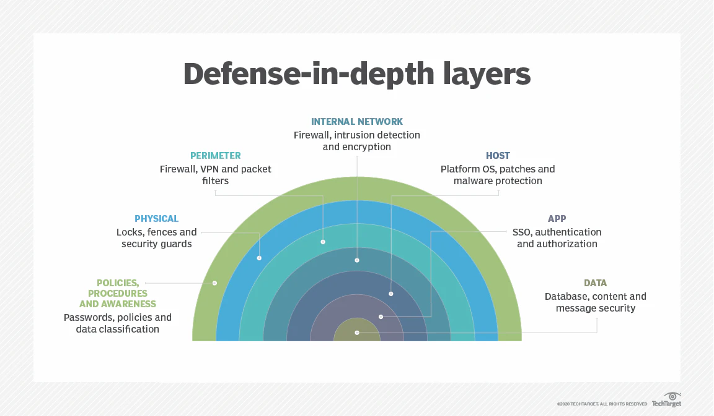
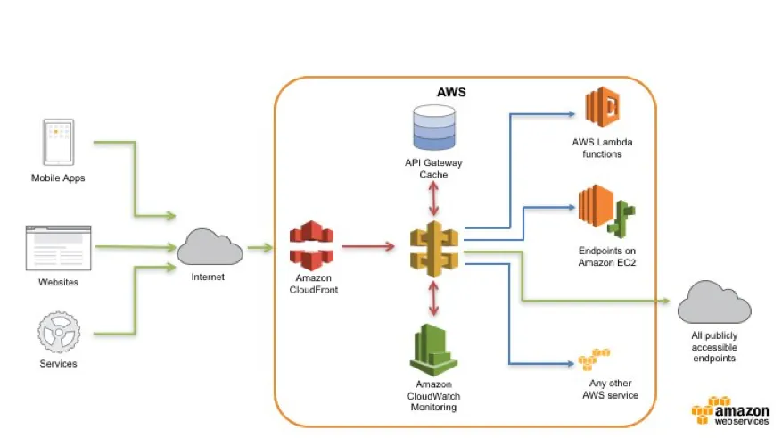
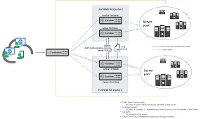

# Web Uygulaması ve API Güvenliği

Kurumları dış dünyaya açan kapılar web siteleri ve API'lerdir. Uygulama katmanı, geleneksel ağ güvenlik duvarlarının (NGFW) HTTP/HTTPS gövdesini analiz edemediği Layer 7 saldırılarına açıktır. MITRE ATT&CK'ta **T1190 (Exploit Public-Facing Application)** ve **T1059 (Command and Scripting Interpreter)** bu yüzeyi doğrudan hedefler.

Bu bölüm OWASP Top 10:2025, OWASP API Security Top 10 (2023), REST/GraphQL güvenlik mühendisliği, WAF mimari konumlandırması ve ModSecurity CRS kural ayarını; NIST SP 800-53, CIS Controls v8, ISO 27001 ve Türkiye mevzuatı (KVKK, 5651, BDDK) ile eşleştirerek ele alır.


*Uygulama katmanı: savunma derinliğinin kritik köprüsü*

---

## §10.2.1. OWASP Top 10:2025 ve Güncel Tehdit Peyzajı

OWASP Top 10:2025, 175.000'den fazla CVE kaydı ve 589 CWE analiziyle 2021'den bu yana ilk büyük güncellemedir. İki yeni kategori ve bir konsolidasyon getirir.

| Sıra | Kategori | Prevalans | Öne Çıkan Değişiklik |
| :---- | :---- | :---- | :---- |
| **A01:2025** | Broken Access Control | ~%3,73 | SSRF bu kategoriye dahil |
| **A02:2025** | Security Misconfiguration | ~%3,00 | #5'ten #2'ye yükseldi |
| **A03:2025** | Software Supply Chain Failures | ~%5,19 | YENİ; en yüksek exploit skoru |
| **A04:2025** | Cryptographic Failures | ~%3,80 | #2'den #4'e indi |
| **A05:2025** | Injection | En çok CVE (38 CWE) | XSS bu kategoride |
| **A06:2025** | Insecure Design | Tehdit modelleme iyileşmesi | #4'ten #6'ya |
| **A07:2025** | Authentication Failures | Standart auth yaygınlaşması | İsim güncellemesi |
| **A08:2025** | Software or Data Integrity Failures | İmzasız güncellemeler | Artifakt bütünlüğü |
| **A09:2025** | Security Logging & Alerting Failures | "Alerting" vurgusu eklendi | Alarmsız log değersiz |
| **A10:2025** | Mishandling of Exceptional Conditions | 24 CWE | YENİ; fail-open, verbose hata |

### A01:2025 — Broken Access Control (SSRF Dahil)

Sunucu tarafı yetkilendirme kontrollerinin atlanması, BOLA/IDOR, force browsing ve **SSRF (CWE-918)** bu kategoride birleştirilmiştir. SSRF'nin özünde yetkilendirme kusuru olduğu gerçeğini yansıtır.

**Ofansif senaryo:** Saldırgan `?url=http://169.254.169.254/latest/meta-data/` ile bulut instance metadata'sına erişir veya `?acct=67890` ile başka kullanıcının verisini okur.

**Defansif katmanlar:**

- Kod: her resolver'da ownership kontrolü; deny-by-default + ABAC (OPA/Cerbos)
- WAF: metadata IP blocklist (169.254.0.0/16), URI anomali tespiti
- Ağ: egress filtering, Zero Trust micro-segmentation
- SOC: yetkisiz object access anomalisi → SIEM korelasyonu (T1069, T1087)

### A05:2025 — Injection

SQL, NoSQL, OS Command, LDAP ve XSS zafiyetleri. JSON tabanlı SQLi bypass: legacy WAF'lar JSON gövdesini derin parse edemezken saldırgan PostgreSQL `::jsonb` operatörleri veya SQLite `->` operatörleriyle imza tabanlı kuralları atlatır.

**Savunma:** parametreli sorgular (prepared statements), çıktı kodlama, allowlist doğrulama; WAF'ta derin JSON ayrıştırma (AWS WAF JSON parsing, NGINX App Protect).

```python
# GÜVENSİZ
@app.route('/user/<id>')
def get_user(id):
    return db.execute(f"SELECT * FROM users WHERE id = '{id}'")

# GÜVENLİ — parametreli + ownership
@app.route('/user/<int:user_id>')
@jwt_required()
def get_user(user_id):
    current_user = get_jwt_identity()
    if not can_access_user(current_user, user_id):
        return jsonify({"error": "Forbidden"}), 403
    return User.query.filter_by(id=user_id, owner_id=current_user).first_or_404()
```

### A10:2025 — Mishandling of Exceptional Conditions

Hatalı hata yönetimi, mantık hataları, **fail open** davranışı ve verbose hata mesajlarıyla bilgi ifşası. Üretimde stack trace ve iç sistem detayları dışarı sızmamalıdır.

> [!WARNING]
> OWASP Top 10:2025 yüzdeleri geçmiş veriye dayanır. A03 (Supply Chain) ve A09 (Logging) gibi kategoriler CVE verisinde düşük temsil edildiğinden topluluk anketiyle yükseltilmiştir; gerçek prevalans daha yüksek olabilir.

---

## §10.2.2. REST ve GraphQL API Güvenlik Pratikleri

OWASP API Security Top 10 (2023), web listesinden ayrı bir projedir. **API1:2023 BOLA (Broken Object Level Authorization)** 2019'dan beri #1; API pentestlerinde en sık bulgu ve otomatik tarayıcıların büyük kısmının göremediği kusurdur. Salt Security verilerine göre BOLA, API saldırılarının yaklaşık %40'ını temsil eder.

| API Riski | Açıklama | Savunma |
| :---- | :---- | :---- |
| **API1 BOLA** | Nesne ID manipülasyonu | Sunucu tarafı ownership doğrulama |
| **API2 Broken Auth** | Zayıf JWT/OAuth | RS256, kısa ömür, claim validation |
| **API3 BOPLA** | Alan-seviyesi yetki | Property-level authorization |
| **API4 Resource Consumption** | DoS, rate limit bypass | Katmanlı throttling |
| **API7 SSRF** | İç kaynak erişimi | Egress filter, URL allowlist |
| **API10 Unsafe Consumption** | Üçüncü taraf API riski | Schema validation, timeout |

### REST API Güvenliği

NIST SP 800-228A, REST API güvenliği için kapsamlı referans sunar. Temel kontroller:

1. **Zero Trust kimlik doğrulama:** OAuth 2.0 + OIDC (Authorization Code + PKCE). JWT: 5–15 dk ömür, `aud`/`iss`/`exp` doğrulama, RS256/ES256 imza
2. **Rate limiting:** API Gateway'de token bucket veya sliding window
3. **Şema doğrulama:** OpenAPI/JSON Schema ile beklenmeyen alanları reddet
4. **mTLS:** servisler arası çift yönlü kimlik doğrulama
5. **TLS 1.2/1.3 + HSTS:** tüm trafik şifreli

**NGINX rate limit örneği:**

```nginx
limit_req_zone $binary_remote_addr zone=api_limit:10m rate=10r/s;
location /api/ {
    limit_req zone=api_limit burst=20 nodelay;
    proxy_pass http://backend;
}
```

**AWS API Gateway JWT authorizer:**

```yaml
MyJWTAuthorizer:
  JwtConfiguration:
    issuer: https://your-issuer.auth0.com/
    audience:
      - https://api.example.com
  IdentitySource: "$request.header.Authorization"
```

Authorizer caching (5–300 sn) performans ve maliyet için önerilir; ancak token iptali gecikmesi riski değerlendirilmelidir.

### GraphQL'e Özgü Riskler

GraphQL tek endpoint üzerinden esnek sorgulama sunarken benzersiz riskler getirir:

| Risk | Açıklama | Mitigasyon |
| :---- | :---- | :---- |
| **Introspection abuse** | Şema keşfi | Üretimde kapat; staging'i de koru |
| **Query depth/complexity** | İç içe sorgu DoS | `depthLimit(5)`, maliyet analizi |
| **Batching attacks** | Rate limit bypass | Operasyon bazlı limit |
| **Nested BOLA** | Resolver yetki eksikliği | Her alan/mutasyonda ownership |

**Apollo Server güvenlik konfigürasyonu:**

```typescript
import depthLimit from 'graphql-depth-limit';
import { NoSchemaIntrospectionCustomRule } from 'graphql';
import { getComplexity, simpleEstimator } from 'graphql-query-complexity';

const MAX_DEPTH = 6;
const MAX_COMPLEXITY = 500;

validationRules: [
  depthLimit(MAX_DEPTH),
  ...(process.env.NODE_ENV === 'production' ? [NoSchemaIntrospectionCustomRule] : []),
  (context) => {
    const complexity = getComplexity({
      schema, query: context.document, variables: context.variables,
      estimators: [simpleEstimator({ defaultComplexity: 1 })]
    });
    if (complexity > MAX_COMPLEXITY) {
      throw new GraphQLError(`Sorgu çok maliyetli: ${complexity}/${MAX_COMPLEXITY}`);
    }
    return [];
  }
]
```

**Persisted Queries (Allowlist):** İstemci yalnızca önceden onaylı sorgu hash'lerini gönderir; rastgele sorgu ve DoS engellenir.

### Rate Limiting Modelleri

| Model | Açıklama | Kullanım |
| :---- | :---- | :---- |
| IP tabanlı | İstemci IP'sine göre | Genel API'ler |
| Kullanıcı tabanlı | JWT `sub` claim | Kimlik doğrulamalı API |
| Endpoint tabanlı | Kritik uçlara özel | Login, ödeme |
| Operasyon tabanlı | GraphQL batch içi sayım | GraphQL API'ler |

> [!CAUTION]
> WAF'ın Authorization header ile per-token rate limiting'i güvenilir değildir; token yenilenince yeni aggregation bucket oluşur. Gerçek per-user limit için API Gateway veya Redis tabanlı çözüm gerekir.

---

## §10.2.3. WAF Mimari Konumlandırması

WAF, internet ile uygulama arasında ters proxy olarak konumlanır. Tipik kurumsal akış:

```
İnternet → CDN/DDoS (Cloudflare/AWS Shield) → WAF → API Gateway/LB → Uygulama
```

AWS'de WAF, API Gateway'deki diğer erişim kontrollerinden (resource policy, IAM, Lambda authorizer) **önce** değerlendirilir — ilk savunma hattı.


*Edge WAF: saldırıların kurum ağına ulaşmadan sönümlenmesi*

### Dağıtım Modelleri

| Model | Avantaj | Dezavantaj | Senaryo |
| :---- | :---- | :---- | :---- |
| **Reverse Proxy (Inline)** | Tam görünürlük, bloklama | Gecikme, SPOF riski | Kurumsal web/API |
| **CDN/Edge SaaS** | Global DDoS, ölçeklenebilirlik | Sağlayıcı bağımlılığı | Küresel uygulamalar |
| **Out-of-Path (SPAN)** | Gecikme yok | Yalnızca tespit | SIEM entegrasyonu |
| **API Gateway Native** | Auth + schema + WAF birleşik | Kapsam sınırlı | API-first mimari |

**Katmanlı model (önerilen):** Edge WAF (kaba imza + DDoS) → API Gateway (auth, schema, rate limit) → Inline WAF (payload inspection) → Uygulama.


*API Gateway + WAF: çok katmanlı uygulama güvenliği*

### WAF vs NGFW

| Parametre | NGFW (L3/L4) | WAF (L7) |
| :---- | :---- | :---- |
| **Denetim** | IP, port, protokol | HTTP parametreleri, JSON/XML |
| **SSL** | Passthrough veya terminate | Terminate + gövde analizi |
| **SQLi/XSS** | Tespit edemez | CRS imzaları + anomaly scoring |
| **Virtual patching** | Yok | CVE çıkışında hızlı kural |

**Sanal yamalama (Virtual Patching):** Kod düzeltilene kadar WAF, belirli CVE payload'larını engelleyen geçici koruma sağlar.

---

## §10.2.4. ModSecurity CRS: Anomali Skorlama ve Kural Ayarlama

ModSecurity + OWASP Core Rule Set (CRS), açık kaynak WAF'ın endüstri standardıdır. CRS doğrudan bloklama yerine **anomaly scoring** kullanır: birden çok kural eşleşmesi puan biriktirir, eşik aşılınca bloklar.

### Paranoia Levels ve Eşikler

Dört **Paranoia Level (PL)** vardır: PL1 (geniş uyumlu) → PL4 (çok katı). Yüksek PL daha çok saldırı yakalar ama daha çok yanlış pozitif üretir.

**crs-setup.conf örneği:**

```apache
# Paranoia Level (varsayılan 1; olgunlaştıkça 2-3)
SecAction "id:900000,phase:1,nolog,pass,t:none,setvar:tx.paranoia_level=1"

# Bloklama eşiği
SecAction "id:900110,phase:1,pass,nolog,\
  setvar:tx.inbound_anomaly_score_threshold=5,\
  setvar:tx.outbound_anomaly_score_threshold=4"

# Executing PL > Blocking PL: yüksek PL kurallarını çalıştır ama skorlama dışı tut
SecAction "id:900001,phase:1,nolog,pass,t:none,setvar:tx.executing_paranoia_level=2"
```

### Folini Method (İteratif Tuning)

1. **Detection-Only:** `SecRuleEngine DetectionOnly` ile başla; hiçbir istek engellenmez
2. **Log analizi:** En az bir hafta üretim trafiği izle; yanlış pozitifleri topla
3. **Rule exclusions:** Cerrahi istisnalar yaz (endpoint/parametre bazlı)
4. **Prevention:** Eşiği kademeli 5'e indir; `SecRuleEngine On`

Tipik yanlış pozitifler: `942450 SQL Hex Encoding` (session cookie'deki `0x`), `921180 HTTP Parameter Pollution` (`ids[]` tekrarı).

**SQLi tespit kuralı (CRS 942100, libinjection):**

```apache
SecRule REQUEST_COOKIES|!REQUEST_COOKIES:/__utm/|ARGS|XML:/* \
  "@detectSQLi" \
  "id:942100,phase:2,block,capture,\
   msg:'SQL Injection Attack Detected via libinjection',\
   tag:'attack-sqli',tag:'OWASP_TOP_10/A05',severity:'CRITICAL',\
   setvar:'tx.sql_injection_score=+%{tx.critical_anomaly_score}'"
```

**Rule exclusion örneği:**

```apache
SecRule REQUEST_URI "@beginsWith /api/public/search" \
  "id:1000,phase:1,pass,nolog,ctl:ruleRemoveById=942100"
```

### ModSecurity + NGINX Konfigürasyonu

```nginx
# /etc/nginx/modsecurity.conf
SecRuleEngine On
SecRequestBodyAccess On
SecResponseBodyAccess Off
SecRequestBodyLimit 13107200
SecAuditEngine RelevantOnly
SecAuditLog /var/log/nginx/modsec_audit.log
SecPcreMatchLimit 150000
```

### AWS WAF Rate-Based Rule

```yaml
Name: RateLimitPerIP
Priority: 1
Action: { Block: {} }
Statement:
  RateBasedStatement:
    Limit: 2000
    AggregateKeyType: IP
```

Kimlik doğrulama uçları için ikinci kural (örn. 100/5dk) eklenir.

### Örnek WAF Log Çıktısı

```
[2026-06-20 10:14:22] [client 203.0.113.45] ModSecurity: Access denied with code 403.
  Matched "Operator `DetectSQLi' ... [id "942100"]
  [msg "SQL Injection Attack Detected via libinjection"]
  [severity "CRITICAL"] [tag "attack-sqli"] [uri "/api/v1/users"]
  [data "Matched Data: ' OR 1=1-- found within ARGS:id"]
  Inbound Anomaly Score Exceeded (Total: 5)
```

### Kurumsal WAF Karşılaştırması

| Kriter | Palo Alto Prisma WAAS | Fortinet FortiWeb | F5 NGINX App Protect |
| :---- | :---- | :---- | :---- |
| **Dağıtım** | Konteyner DaemonSet, embedded | Donanım/VM/SaaS | NGINX Plus gömülü |
| **Gecikme** | Orta | Düşük-orta (donanım ivmeli) | Çok düşük (single-hop) |
| **API desteği** | REST, OpenAPI | REST, JSON/XML schema | REST, GraphQL, gRPC |
| **DevSecOps** | IaC entegrasyonu güçlü | API tabanlı yönetim | Security-as-Code |

---

## §10.2.5. Gelişmiş Saldırı Zincirleri ve SOC Operasyonları

### Oracle PeopleSoft SSRF → RCE Zinciri

SSRF yalnızca metadata sömürüsü değildir. PeopleSoft PeopleTools'ta saldırı zinciri:

1. `/PSIGW/HttpListeningConnector` üzerinden unauthenticated POST
2. XML'de `ConnectorParam` → `http://localhost/PSEMHUB/hub` (SSRF pivot)
3. `envmetadata/transactions/` altına zararlı XML yazma
4. Restart sonrası Java XMLDecoder deserialization → RCE

| Aşama | Algılama | MITRE |
| :---- | :---- | :---- |
| SSRF tetikleme | URI/body'de localhost/127.0.0.1 | T1190 |
| Yetkisiz iç erişim | `/PSEMHUB/hub` 200 OK (dışarıdan erişilemez) | T1020 |
| Zararlı dosya yazma | envmetadata dizinine XML yazma | T1211 |
| Deserialization RCE | java.exe → cmd.exe process tree | T1059 |

### SIEM Tehdit Avcılığı (JSON SQLi)

```json
{
  "query": {
    "bool": {
      "must": [
        { "term": { "action": "BLOCK" } },
        { "match": { "http.request.headers.content-type": "application/json" } }
      ],
      "filter": {
        "regexp": {
          "http.request.body": ".*(union\\s+select|or\\s+[0-9]+=[0-9]+|::jsonb).*"
        }
      }
    }
  }
}
```

**Wazuh WAF entegrasyonu:** WAF logları (JSON/CEF/syslog) → korelasyon kuralları:

- Aynı kaynaktan 5+ Injection denemesi → yüksek öncelik + IP block
- Auth failure spike + WAF bypass → credential stuffing şüphesi

---

## §10.2.6. Türkiye Mevzuatı ve Standart Eşlemesi

### KVKK (6698)

- Başarılı/başarısız kimlik doğrulama olayları loglanmalı
- Erişim kontrolü ihlalleri ve input validation hataları kayıt altına alınmalı
- Loglar şifre ve ödeme bilgisi içermemeli
- Veri ihlalinde Kurul'a ve ilgili kişilere bildirim (72 saat pratiği)
- API yanıtlarında kişisel veri maskeleme (TC kimlik, kart numarası)

### 5651 Sayılı Kanun

- Trafik/erişim logları **en az 1 yıl** saklanır
- Dosya bütünlük değerleri **5070'e dayalı zaman damgası** ile korunur
- WAF ve API Gateway logları bu yükümlülüğün karşılanmasında kritiktir

### BDDK

- Web uygulama güvenlik duvarı (WAF) kullanımı zorunlu
- Düzenli penetrasyon testleri (OWASP standartlarına uygun)
- Bilgi sistemlerinin sürekli izlenmesi ve loglanması
- Denetim izleri **asgari 3 yıl**; TCMB tebliğinde **10 yıl**

| Log Kaynağı | Metadata | Mevzuat | SOC Senaryosu |
| :---- | :---- | :---- | :---- |
| WAF (ModSecurity) | client_ip, rule_id, anomaly_score | KVKK Md. 12 | SQLi/SSRF brute force → IP ban |
| API Gateway | caller_id, api_key, response_time | BDDK iz kayıtları | Rate limit aşımı → hesap askıya alma |
| Uygulama sunucusu | session_id, action_type, record_id | KVKK erişim logu | BOLA/IDOR tespiti |
| DHCP/Gateway | internal_ip, mac, nat_ip | 5651 erişim kaydı | Adli IP–cihaz eşlemesi |

### Uluslararası Eşleme

| OWASP Kategori | NIST SP 800-53 | CIS v8 | ISO 27001 |
| :---- | :---- | :---- | :---- |
| A01/A07 Access/Auth | AC-3, AC-6, IA-2 | 6, 16 | A.8.2–8.5 |
| A05 Injection | SI-10 | 16.2 | A.8.25 |
| A02 Misconfig | CM-6, CM-7 | 4, 16.7 | A.8.9 |
| A09 Logging | AU-2, AU-6, SI-4 | 8.x | A.8.15–16 |
| WAF / Boundary | SC-7 | 13 | A.8.20 |

---

## §10.2.7. Mimari Tavsiyeler ve Uygulama Yol Haritası

### Hemen (0–30 gün)

- Tüm public-facing web/API envanteri (shadow API dahil)
- WAF'ı detection-only modda devreye al; yanlış pozitifleri topla
- OWASP Top 10:2025 tarama kurallarını güncelle

### Kısa Vade (30–90 gün)

- API Gateway'de BOLA testleri (iki test hesabı yöntemi)
- GraphQL introspection kapat; depth/complexity limitleri
- WAF anomaly threshold'u kademeli 5'e indir
- SIEM'e WAF + API Gateway log entegrasyonu

### Orta Vade (90–180 gün)

- Edge + inline çift katmanlı WAF
- Düzenli pen test + red team (web/API odaklı)
- IaC ile WAF konfigürasyonu versiyon kontrolü
- KVKK + 5651 uyumlu log retention mimarisi

### Savunma Katmanı Özeti

| Katman | Kontroller | Standartlar |
| :---- | :---- | :---- |
| Güvenli kod | OWASP Top 10, prepared statements | NIST SI-10, CIS 16 |
| API güvenliği | OAuth2/OIDC, BOLA, rate limit | NIST 800-228A, API Top 10 |
| WAF | CRS, tuning, bot yönetimi | PCI DSS 6.6, SC-7 |
| İzleme | SIEM, playbook, MITRE mapping | KVKK, NIST 800-61 |
| Test | DAST, pen test, configuration drift | BDDK, PCI 11.3 |

---

## Özet

Web uygulaması ve API güvenliği tek bir ürünle çözülmez. WAF, güvenli kod, API Gateway, Zero Trust ağ kontrolleri, immutable logging ve proaktif SOC operasyonlarının **katmanlı bileşimi** gerçek savunma derinliği sağlar.

OWASP Top 10:2025'teki yapısal değişiklikler (SSRF → A01, Supply Chain → A03, Exceptional Conditions → A10) tarama kurallarını, tehdit modellerini ve WAF politikalarını güncellemeyi zorunlu kılar. ModSecurity CRS'yi "önce sessiz, sonra kararlı" metodolojisiyle ayarlamak; GraphQL'de persisted query ve maliyet analizi uygulamak; Türkiye'de 5651 zaman damgası ve KVKK veri minimizasyonu ile log mimarisini tasarlamak — bunların hepsi sürdürülebilir uygulama güvenliğinin temel taşlarıdır.