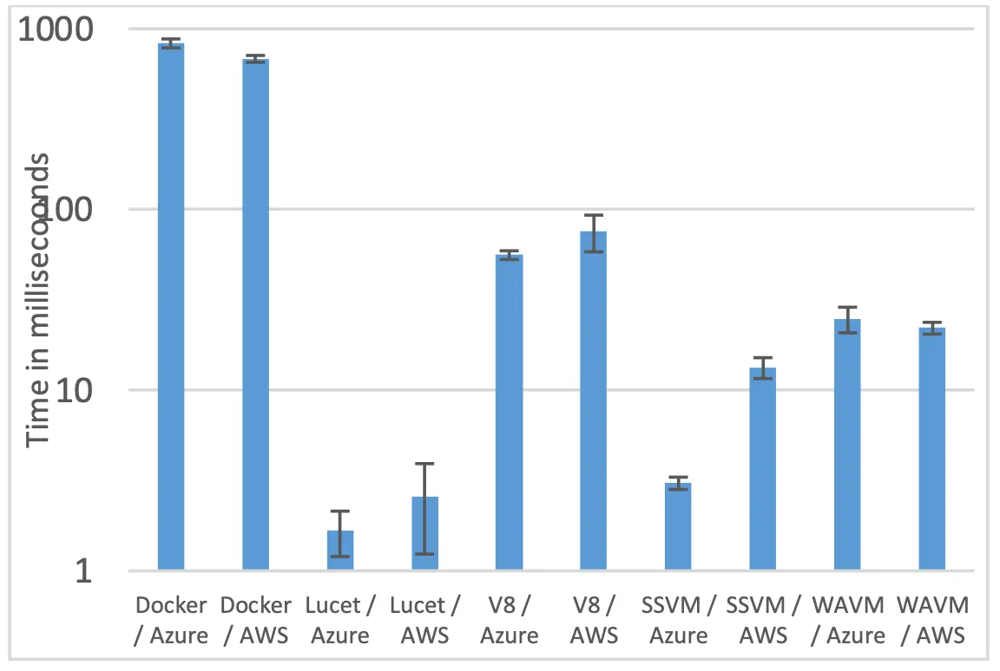
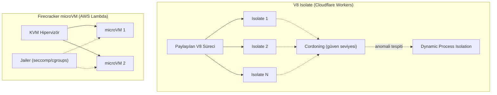
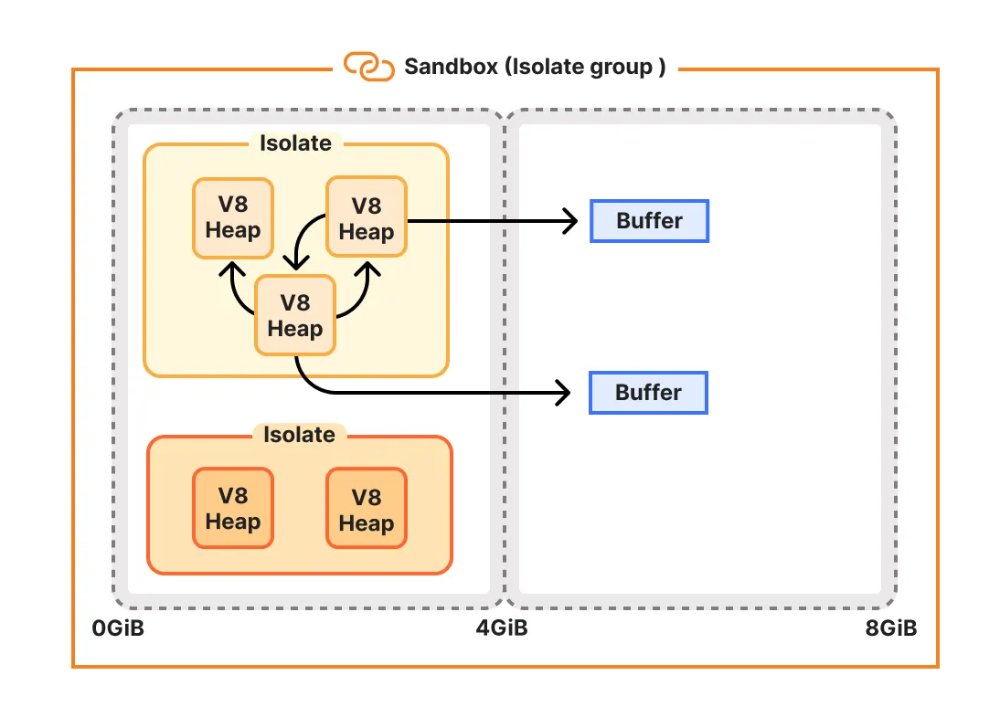
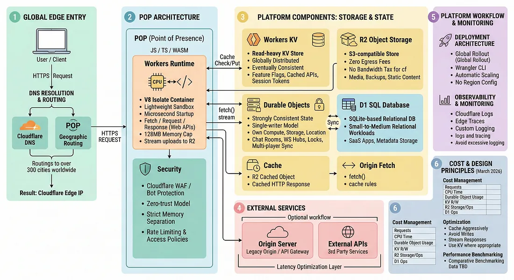

# Sunucusuz (Serverless) Mimari ve V8 Isolate Güvenliği

Sunucusuz bilişim, altyapı yönetimini bulut sağlayıcısına devrederek geliştiricilerin yalnızca kod yazmaya odaklanmasını sağlar. Ancak geleneksel konteyner veya VM tabanlı izolasyondan farklı güvenlik modelleri ve saldırı yüzeyleri sunar. Cloudflare Workers gibi V8 Isolate tabanlı edge platformları, AWS Lambda Firecracker microVM'lerinden farklı bir güvenlik–performans dengesi kurar.

Geleneksel web uygulamaları ve API'ler (§10.2) konteyner veya VM tabanlı dağıtımda çalışırken, sunucusuz mimariler izolasyon modelini kökten değiştirir. AWS Lambda Firecracker microVM'leri donanım sınırında koruma sağlarken, Cloudflare Workers gibi V8 Isolate tabanlı platformlar dil-seviyesi yalıtıma dayanır. Bu bölüm V8 Isolate güvenlik modeli, cold start ve bellek yalıtımı zafiyetleri, Spectre savunmaları, dağıtık serverless'te API Gateway güvenliği ve Türkiye mevzuat uyumunu; NIST SP 800-53, CIS Controls v8, MITRE ATT&CK T1648 ve OWASP Serverless Top 10 çerçevesinde ele alır.


*Konteyner tabanlı serverless ile V8 Isolate tabanlı edge computing karşılaştırması*

---

## §10.3.1. V8 Isolate Güvenlik Modeli ve Konteyner/microVM Karşılaştırması

### Temel Mimari Fark

**V8 Isolate (Cloudflare Workers):** Google Chrome'un V8 JavaScript motorunun bir örneğidir. Tek bir runtime, yüzlerce/binlerce isolate çalıştırabilir; her isolate'in belleği yalıtılmıştır. Konteynerlerin aksine her fonksiyon için VM oluşturmak yerine isolate mevcut bir ortamda oluşturulur — **~0–5 ms cold start** ve global dağıtım sağlar.

**AWS Lambda (Firecracker microVM):** Her fonksiyon, KVM hipervizör/donanım sınırında kendi misafir çekirdeğine sahip izole bir microVM'de çalışır. Jailer bileşeni chroot/seccomp/cgroups/namespaces ile ek hapis sağlar. Firecracker microVM ~5 MiB bellek tüketir ve ~125 ms'de başlar.

Güvenlik sınırı hiyerarşisi:

**microVM (bağımsız çekirdek, KVM yalıtımı) > konteyner (paylaşılan çekirdek, namespace) > V8 isolate (paylaşılan süreç, dil-seviyesi yalıtım)**



Cloudflare bunu açıkça kabul eder: isolate-tabanlı sandbox'ı sıkılaştırmak donanım VM'lerine göre daha zordur ve V8 güvenlik hataları hipervizör açıklarından daha sıktır.

| Parametre | Linux Konteyner | Firecracker microVM | V8 Isolate (Workers) |
| :---- | :---- | :---- | :---- |
| **İzolasyon sınırı** | cgroups, namespaces | KVM, donanım | V8 Sandbox, SFI |
| **Cold start** | ~100 ms – saniyeler | ~100–200 ms | <5 ms |
| **Bellek overhead** | ~10–100 MB | ~256 KB – 5 MB | ~10 KB – 2 MB |
| **Syscall alanı** | Geniş (paylaşılan kernel) | Çok kısıtlı | Yok (Web API only) |
| **Dosya sistemi** | Sanallaştırılmış mount | Sınırlı disk imajı | Yok |
| **Escape riski** | Container escape (kernel) | Hipervizör açığı | V8 JIT/type confusion |
| **Kiracı yoğunluğu** | Düşük | Orta | Çok yüksek (binlerce/proses) |

### Cloudflare Katmanlı Savunması

Cloudflare Workers, savunma derinliği prensibiyle çok katmanlı güvenlik uygular:

**Katman 1 — V8 Isolate (Birincil İzolasyon):**
- Her isolate kendi private heap'ine sahip
- V8 Sandbox heap korsanlığını önler
- Sıkıştırılmış pointer cage (4 GiB sınırı)

**Katman 2 — Cordoning (Güven Seviyesi Ayrımı):**
- Worker'lara güven seviyesi atanır
- Free plan müşterisi Enterprise ile aynı süreçte çalışmaz
- V8 zero-day'ine karşı defense-in-depth

**Katman 3 — OS Düzeyi Sandbox:**
- Linux namespaces + seccomp: dosya sistemi ve ağ erişimi engellenir
- Konteyner motorlarından daha katı yapılandırma

**Katman 4 — API Tasarımı ve Zamanlama Koruması:**
- `Date.now()` kod çalışırken sabitlenir; başka timer yok
- Multi-threading / SharedArrayBuffer yok
- Şüpheli Worker'lar Dynamic Process Isolation ile ayrı sürece alınır


*Cloudflare Workers: çok katmanlı izolasyon mimarisi*

### Donanım Destekli İzolasyon (MPK)

Intel/AMD **Memory Protection Keys (MPK/PKU)**, isolate heap'lerini donanım seviyesinde korur. Her isolate'e rastgele bir koruma anahtarı atanır; yetkisiz bellek erişimi donanım tuzağı (SIGSEGV) tetikler. 16 anahtar sınırı nedeniyle istatistiksel koruma ~%92; anahtar rotasyonu ve sıkıştırılmış bellek yerleşimi ile komşu erişimlerde tespit güçlendirilir.

:::note
MPK'nin Cloudflare Workers'ta kullanıldığı bazı ikincil kaynaklarda iddia edilse de birincil Cloudflare dokümantasyonuyla net teyit her zaman mümkün olmayabilir. Üretim kararlarında birincil kaynak doğrulanmalıdır.
:::

### Rust + V8 Köprüsü (Azion Cells)

Yenilikçi edge runtime'larda Rust'un bellek güvenliği (ownership/borrowing) ile V8 Isolate birleştirilir. Düşük seviyeli I/O Rust tarafından yönetilirken kullanıcı kodu isolate sınırları içinde koşturulur; veri geçişleri sıfır-kopyalama ile ancak sıkı tip denetimiyle gerçekleşir.

---

## §10.3.2. Cold Start Zafiyetleri, Bellek İzolasyonu ve Spectre

### Warm Container ve Durum Sızıntısı

Cold start maliyetini azaltmak için sağlayıcılar **warm container** kullanır — aynı yürütme ortamı birden çok çağrı için yeniden kullanılır (Lambda 15–60 dk sıcak tutar). Bu performans avantajı güvenlik garantilerini zayıflatır:

- Global değişkenler ve `/tmp` çağrılar arası paylaşılabilir
- Bir request'teki hassas veri sonraki request'te okunabilir
- Saldırgan warm container yeniden kullanım politikasını "oynayarak" kalıcı ele geçirme sağlayabilir

**OWASP Serverless Top 10 perspektifinden zafiyet kategorileri:**

1. Cold start veri sızıntısı
2. Yan kanal zamanlama saldırıları
3. Fonksiyon zincirleme istismarı
4. Paylaşımlı `/tmp` riski
5. Bağımlılık zinciri zehirlemesi

### Ofansif Senaryo: Warm Container Bellek Sızıntısı

Zafiyetli Lambda tasarımında global scope'a session verisi yazılır ve `/tmp` temizlenmez:

```javascript
// ZAFİYETLİ — global scope ve /tmp kalıcılığı
let globalUserSession = {};

exports.handler = async (event) => {
  const payload = JSON.parse(event.body);
  if (payload.action === 'INITIALIZE_TRANSACTION') {
    globalUserSession[payload.userId] = {
      token: payload.token,
      amount: payload.amount
    };
    fs.writeFileSync(`/tmp/receipt_${payload.userId}.json`, JSON.stringify(payload));
  }
  if (payload.action === 'FORCE_ORDER_CREATE') {
    // Ödeme adımı atlanarak sipariş oluşturuluyor
    return { statusCode: 200, body: `Sipariş: ${globalUserSession[payload.userId]?.amount}` };
  }
};
```

Saldırgan, kurban kullanıcının işleminin hemen ardından aynı sıcak konteynere yönlendirilerek bellekteki session verisini ve `/tmp` artıklarını okur.

### Defansif Tasarım: İzole Kapsam ve Temizlik

```javascript
exports.handler = async (event) => {
  let localSession = null;
  const executionId = crypto.randomUUID();
  const tempPath = path.join('/tmp', `receipt_${executionId}.json`);

  try {
    const payload = JSON.parse(event.body);
    const safeUserId = String(payload.userId).replace(/[^a-zA-Z0-9_-]/g, '');
    localSession = { userId: safeUserId, token: payload.token };
    await fs.writeFile(tempPath, encrypt(JSON.stringify(payload)));
    return { statusCode: 200, body: JSON.stringify({ id: executionId }) };
  } finally {
    try { await fs.unlink(tempPath); } catch (_) {}
    localSession = null;
  }
};
```

**Mitigasyon kontrol listesi:**

- Hassas verileri global scope yerine invocation-local scope'ta tut
- `/tmp` her kullanımda temizle
- Durumsuzluk prensibi: state'i KV/DynamoDB gibi dış depolamaya taşı
- Gerektiğinde execution environment yeniden kullanımını devre dışı bırak

### V8 Isolate'ta Cold Start Avantajı

V8 Isolate mimarisinde cold start, isolate'in hafifweight yaratılmasıyla sınırlıdır; OS süreci, imaj çekme veya dosya sistemi init yoktur. Bu, warm container state leakage riskini teorik olarak azaltır; ancak platform tenant'ı korur, **uygulama kodundaki hataları korumaz**.

### Spectre ve Yan Kanal Saldırıları

Paylaşılan süreç modelinde "shared fate" sorunu vardır: aynı edge node'daki tenant'lar V8 sürecini paylaşır; bir tenant tarafından exploit edilen V8 zero-day, kodunuz kusursuz olsa bile verinizi etkileyebilir.

**Belgelenen V8 sandbox-escape CVE'leri:**

| CVE | Açıklama | Yama |
| :---- | :---- | :---- |
| **CVE-2024-2887** | WebAssembly type confusion; Pwn2Own 2024 | Chrome 125.0.6422.60+ |
| **CVE-2024-5274** | V8 type confusion RCE; CISA KEV | Chrome 125.0.6422.112+ |
| **CVE-2025-5419** | Turbofan JIT type confusion → OOB | Project Zero keşfi |
| **CVE-2025-13223** | V8/Wasm type confusion zero-day; aktif istismar | 2025 yedinci Chrome zero-day |

**Akademik araştırma (TU Graz / Cloudflare):** Spectre saldırısıyla Cloudflare Workers üzerinde **~2 bit/dakika** (harici zaman sunucusu ile amplified) veya **~120 bit/saat** (POC) sızıntı mümkün olduğu kanıtlanmıştır — "language-level isolation is insufficient" sonucu.

**Cloudflare savunmaları:**

- `Date.now()` yürütme sırasında kilitli; concurrency yok
- **Dynamic Process Isolation:** donanım performans sayaçlarıyla saldırı belirtisi gösteren Worker'lar kendi süreçlerine yeniden zamanlanır
- V8 yamaları üretime saatler içinde dağıtılır

:::caution
Cloudflare'ın kendi beyanıyla süreç yalıtımı "tam bir savunma değildir" ve Workers gelecekteki bilinmeyen CPU-tabanlı saldırılara açıktır. Yüksek hassasiyetli/çok-tenant iş yükleri için Firecracker microVM tercih edilebilir.
:::


*Spectre tehdidi ve Dynamic Process Isolation savunma mekanizması*

### Co-Location ve FaaS Yan Kanal Saldırıları

**"Everywhere All at Once"** (ASPLOS 2024) araştırması, FaaS ortamlarında saldırganın en az bir kurban örneğiyle %100 olasılıkla co-location sağlayabildiğini göstermiştir. Google Cloud Run'da LLC Prime+Probe yan kanal saldırısı uçtan uca çalıştırılmıştır.

SOC perspektifinden co-location doğrudan tespit edilemez; ancak şu göstergeler izlenmelidir:

- Aynı fonksiyona kısa aralıklı yoğun invocation (co-location probe)
- Invocation latency'nin istatistiksel anomalisi
- Aynı IP'den düşük hacimli ama sürekli istekler (timing ölçümü)

**Mitigasyon:** hassas iş yüklerini dedicated tenancy veya Firecracker microVM'e taşıma; execution environment yeniden kullanımını kısıtlama.

<details>
<summary>Derinlemesine: Warm Container Bellek Sızıntısı ve Durumsuz Tasarım Kontrol Listesi</summary>

Lambda warm container politikası (15–60 dk) performans kazandırır ancak **state leakage** riski taşır:

| Anti-Pattern | Risk | Düzeltme |
| :---- | :---- | :---- |
| Global scope'ta session verisi | Sonraki invocation'da okunabilir | Invocation-local scope |
| `/tmp` temizlenmiyor | Önceki request artıkları | `finally` bloğunda `unlink` |
| Hassas veri bellekte kalıyor | Co-location saldırısı | DynamoDB/KV dış depolama |
| Execution reuse politikası açık | Saldırgan container'ı "oynar" | `ReservedConcurrency=1` (hassas) |

**Defansif handler şablonu:**

```javascript
exports.handler = async (event) => {
  const executionId = crypto.randomUUID();
  let localSession = null;
  try {
    localSession = await loadFromSecureStore(event);
    return processRequest(localSession);
  } finally {
    localSession = null;
    await cleanupTemp(`/tmp/${executionId}`);
  }
};
```

OWASP Serverless Top 10: cold start sızıntısı, yan kanal timing, fonksiyon zincirleme istismarı ve bağımlılık zehirlemesi başlıca risk kategorileridir. MITRE **T1648 (Serverless Execution)** için runtime izleme ve anomali tespiti zorunludur.

</details>

### LeakLess ve Seçici Veri Koruma

Dil-seviyesi izolasyonun Spectre nedeniyle tamamen aşılabileceği varsayımıyla geliştirilen **LeakLess** mimarisi, bellekteki verilerin sızması halinde bile saldırganın anlamsız (ciphertext) veri görmesini hedefler. Bu, tam izolasyon yerine **sızan verinin değersizleştirilmesi** stratejisidir — defense-in-depth'in alternatif bir boyutu.

### V8 Heap Arkeolojisi ve Type Confusion

V8 JIT derleyicisindeki type confusion (PACKED_DOUBLE_ELEMENTS ↔ PACKED_ELEMENTS karışımı) **addrof** ve **fakeobj** istismar primitifleri üretir. Node.js ekosistemi native addon'lar nedeniyle V8 Sandbox'ı devre dışı bırakabilir; Cloudflare Workers yerel modül yüklemesine izin vermediği için sandbox'ı en katı kurallarla uygular.

---

## §10.3.3. Dağıtık Serverless'te API Gateway Güvenliği ve Veri Akış Yönetişimi

Dağıtık serverless mimaride API Gateway, kimlik doğrulama, rate limiting, WAF filtreleme ve mTLS'i tek merkezi noktada uygular. Doğru yapıldığında tek bir istek bile uygulama koduna ulaşmadan önce işlenir.

### Holistik Güvenlik Katmanları

```
Cognito/OIDC (kimlik)
  → CloudFront + Shield (DDoS)
    → WAF (XSS/SQLi/rate-based)
      → API Gateway (schema, authorizer, CORS)
        → Lambda (Firecracker) / Worker (V8 Isolate)
          → DynamoDB/S3 (bucket policy, tenant izolasyonu)
            → CloudWatch/X-Ray (izleme)
```

WAF kutusu **ilk değerlendirilen katman**dır; authorizer ve resource policy'den önce gelir.

### AWS API Gateway Desenleri

**JWT authorizer (HTTP API):**

```yaml
MyJWTAuthorizer:
  JwtConfiguration:
    issuer: https://your-issuer.auth0.com/
    audience:
      - https://api.example.com
  IdentitySource: "$request.header.Authorization"
```

**Katmanlı rate limiting:**
- API Gateway throttling (server-side + usage plans)
- WAF rate-based rules (per-IP)
- Custom authorizer (per-user/per-tenant)
- CloudFront Functions ile edge'de erken throttling

Gateway **fail closed** davranmalıdır: aşırı yüklendiğinde isteği geçirmek yerine reddetmek.

### Cloudflare API Shield + Workers

Cloudflare ekosisteminde API Shield şu işlevleri üstlenir:

- ML tabanlı API Discovery (shadow API tespiti)
- OpenAPI schema validation
- JWT/mTLS authentication
- Volumetric + behavioral abuse detection

**Cloudflare Worker — güvenli API Gateway örneği:**

```javascript
export default {
  async fetch(request, env, ctx) {
    const url = new URL(request.url);

    // 1. Kimlik doğrulama (NIST AC-2, AC-3)
    const authHeader = request.headers.get('Authorization');
    if (!authHeader || !await validateToken(authHeader, env)) {
      await logSecurityEvent('AUTH_FAILURE', { path: url.pathname });
      return new Response('Unauthorized', { status: 401 });
    }

    // 2. OpenAPI şema doğrulama
    if (!await validateOpenAPISchema(request)) {
      return new Response('Invalid Schema', { status: 400 });
    }

    // 3. Rate limiting
    const clientId = request.headers.get('CF-Connecting-IP');
    if (await checkRateLimit(clientId, env)) {
      return new Response('Too Many Requests', { status: 429 });
    }

    // 4. Yetkilendirme (NIST AC-6)
    const permissions = await getUserPermissions(authHeader);
    if (!permissions.includes(url.pathname)) {
      return new Response('Forbidden', { status: 403 });
    }

    // 5. Audit log (5651/KVKK uyumlu)
    ctx.waitUntil(logAuditTrail({
      timestamp: new Date().toISOString(),
      clientId,
      method: request.method,
      path: url.pathname
    }));

    return fetch(env.BACKEND_URL, {
      method: request.method,
      headers: { 'X-Internal-Request': 'true' },
      body: request.body
    });
  }
};
```

### Zero Trust ve Service Mesh (East-West Trafik)

Geleneksel serverless mimaride North-South trafiği (dışarıdan içeriye) API Gateway ile korunur; ancak **East-West** trafiği (fonksiyonlar arası, mikroservisler arası) genellikle göz ardı edilir. Zero Trust prensibiyle:

- Her fonksiyon/mikroservis geçişinde **mTLS** zorunlu
- JWT claim'leri servisler arası taşınır; her hop'ta yeniden doğrulanır
- Service mesh sidecar (Istio, Linkerd) ile runtime politika uygulama
- Egress proxy: fonksiyon yalnızca allowlist hedeflere erişir

NIST SP 800-204 (Application Container Security Guide) ve SP 800-207 (Zero Trust Architecture) bu desenleri serverless bağlamında rehber alır.

### Durable Objects ve Stateful Serverless Güvenliği

Cloudflare **Durable Objects**, stateful koordinasyon (chat odası, multiplayer, booking) sağlar. Güvenlik dikkat noktaları:

- Her Durable Object tek bir isolate'da çalışır; state paylaşımı sınırlıdır
- Object ID tahmin edilebilirse yetkisiz erişim riski (BOLA benzeri)
- WebSocket bağlantılarında kimlik doğrulama ve session fixation kontrolü
- Object storage binding'lerinde least privilege

### Serverless-Spesifik Zafiyetler

| Zafiyet | Açıklama | Savunma |
| :---- | :---- | :---- |
| **Event Injection** | SQS/S3/API parametresi → komut/sorgu | Input validation, schema |
| **Over-Privileged IAM** | Lambda'ya `S3:*`, `DynamoDB:*` | Least privilege, fonksiyon başına rol |
| **Secrets in env vars** | CloudTrail'de görünür | Secrets Manager, Parameter Store |
| **Dependency confusion** | Zararlı npm paketi | SCA, lockfile, private registry |

MITRE ATT&CK **T1648 (Serverless Execution)** saldırı vektörleri:

| Vektör | Savunma |
| :---- | :---- |
| Kripto madenciliği | Runtime izleme, anomali tespiti |
| IAM PassRole istismarı | IAM denetimi, least privilege |
| Event-triggered kalıcılık | Event kaynak doğrulama |
| Veri sızdırma (workflow) | DLP, egress proxy kısıtı |

---

## §10.3.4. Türkiye Mevzuatı ve Standart Uyumu

### 5651 Sayılı Kanun

Yer sağlayıcılar ve erişim sağlayıcılar trafik bilgilerini **en az 1 yıl** saklar. API Gateway ve Worker logları bu yükümlülüğün karşılanmasında kritiktir. Dosya bütünlük değerleri **5070'e dayalı zaman damgası** ile korunmalıdır.

### KVKK (6698)

Sunucusuz fonksiyonların işlediği kişisel veriler KVKK kapsamındadır. Veri minimizasyonu, aydınlatma yükümlülüğü ve erişim logları zorunludur. Loglarda gereksiz kişisel veri toplanmamalı; maskeleme ve anonimizasyon uygulanmalıdır. Bulut sağlayıcı ile Veri İşleme Sözleşmesi (DPA) şarttır.

### BDDK ve Sektörel Tebliğler

- Denetim izleri **asgari 3 yıl** (BDDK)
- TCMB: denetim izleri **en az 10 yıl**, zaman damgalı
- SPK: denetim izleri **asgari 5 yıl**
- Merkezi SIEM korelasyonu ve immutable loglama zorunlu

| NIST Kontrol | Serverless Uygulama |
| :---- | :---- |
| **AC-2/AC-3/AC-6** | IAM politikaları, binding kısıtları |
| **AU-2/AU-3/AU-12** | Fonksiyon çağrı logları, Logpush |
| **SC-7/SC-8** | API Gateway TLS, egress proxy |
| **SI-4/SI-7** | Runtime izleme, bütünlük doğrulama |

CIS Controls v8: Control 8 (Audit Log Management), Control 13 (Network Monitoring) serverless runtime'ları da kapsar.

---

## §10.3.5. Mimari Karar Matrisi ve Operasyonel Öneriler

### Platform Seçim Matrisi

| Kriter | V8 Isolate (Workers) | Firecracker microVM (Lambda) |
| :---- | :---- | :---- |
| **Gecikme hassasiyeti** | Çok düşük (<5 ms) | Yüksek (~100 ms+) |
| **Kiracı izolasyonu** | V8 Sandbox + katmanlar | Donanım microVM |
| **Spectre direnci** | Tasarım + DPI; mutlak değil | Daha güçlü donanım yalıtımı |
| **Ölçeklenebilirlik** | Binlerce isolate/proses | Sınırlı (süreç/VM başına) |
| **Regülasyon uyumu** | Loglama tasarımı gerektirir | Yerleşik CloudWatch entegrasyonu |

### Güvenlik Kontrol Listesi

1. **Isolate güvenliği:** V8 Sandbox etkinliğini doğrulayın
2. **Cold start:** Durumsuz tasarım; `/tmp` hijyeni; secret rotasyonu
3. **API Gateway:** OpenAPI validation, OWASP ruleset, rate limiting
4. **Loglama:** 5651 uyumlu ≥1 yıl saklama; değiştirilemez yapı
5. **KVKK:** Kişisel veri içeren logları maskeleyin
6. **IAM:** Her fonksiyon için ayrı least-privilege rol
7. **MITRE T1648:** Serverless Execution detektif kontrolleri

### Uygulama Yol Haritası

**Hemen (0–30 gün):**
- Tüm serverless fonksiyon envanteri (shadow fonksiyonlar dahil)
- IAM rolleri least-privilege denetimi
- API Shield/Gateway önüne WAF konumlandırma

**Kısa vade (30–90 gün):**
- Warm container `/tmp` hijyeni politikası
- Logpush → merkezi SIEM (Wazuh/Splunk)
- Dependency scanning CI/CD entegrasyonu

**Orta vade (90–180 gün):**
- Co-location saldırı riski değerlendirmesi (hassas iş yükleri için microVM)
- BDDK/5651 uyumlu log retention mimarisi
- Red team: event injection ve BOLA senaryoları

### Eşik Değerleri

| Metrik | Eşik | Aksiyon |
| :---- | :---- | :---- |
| Invocation latency spike | >3σ baseline | SOC alert + throttle |
| Egress anomali | Bilinmeyen hedef | Otomatik blok |
| Schema validation failure | >10/dk aynı IP | IP ban |
| Critical V8 CVE | KEV listesi | 24 saat içinde patch doğrulama |

:::danger
V8 CVE CVSS skorları üretim kararları öncesi NVD'den doğrulanmalıdır. Shai-Hulud gibi evrilen tedarik zinciri tehditleri npm/registry proxy kurallarını sürekli güncellemeyi gerektirir.
:::

---

## Özet

Sunucusuz mimari, altyapı yönetim yükünü azaltırken yeni güvenlik sorumlulukları yaratır. V8 Isolate modeli konteyner/microVM'e kıyasla üstün performans ve yoğunluk sunar; ancak paylaşılan süreç yapısı Spectre ve V8 zero-day risklerini taşır. AWS Lambda Firecracker microVM'leri donanım yalıtımıyla daha güçlü kiracı ayrımı sağlar; gecikme ve maliyet bedeli öder.

Nihai güvenlik platform izolasyonuna değil, uygulama tasarımına bağlıdır: input validation, least privilege IAM, durumsuz fonksiyon tasarımı, API Gateway şema doğrulama ve merkezi immutable loglama. SOC ekipleri ephemeral serverless doğasını Logpush, anomali tespiti ve NIST SP 800-61 uyumlu olay müdahale prosedürleriyle telafi etmelidir. Türkiye'de 5651 zaman damgası, KVKK veri minimizasyonu ve BDDK denetim izi gereksinimleri bu mimarinin ayrılmaz parçasıdır.