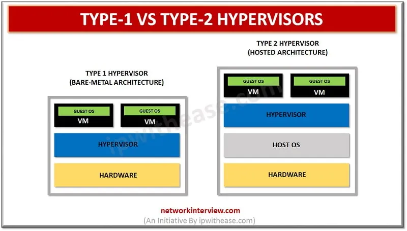
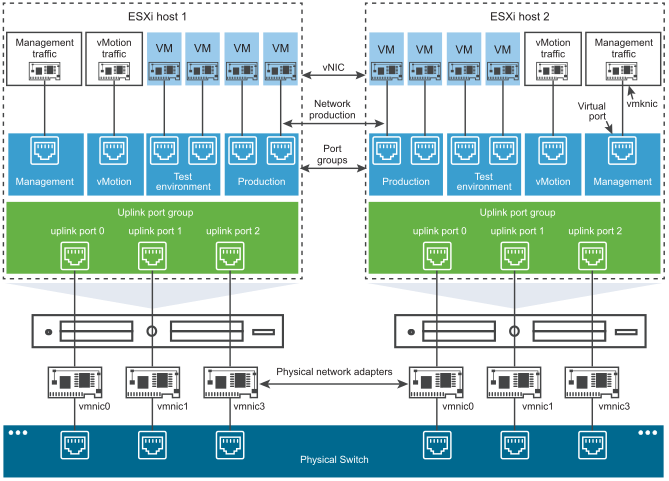
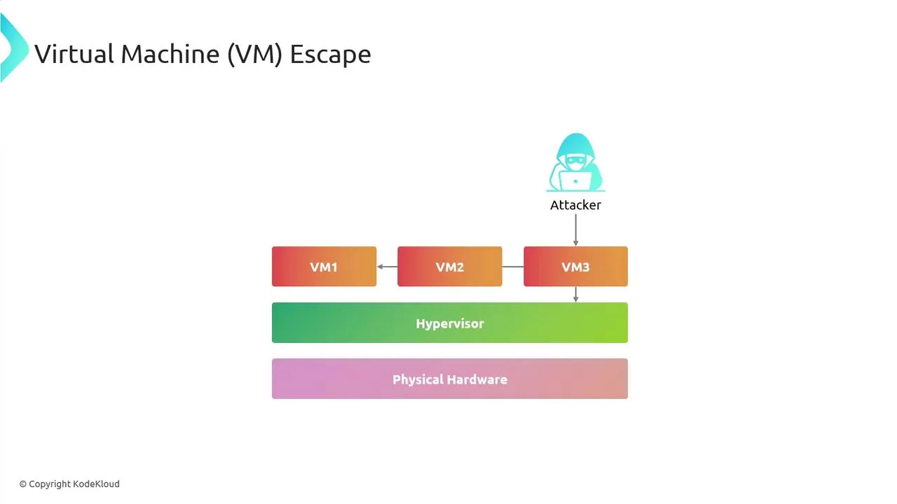
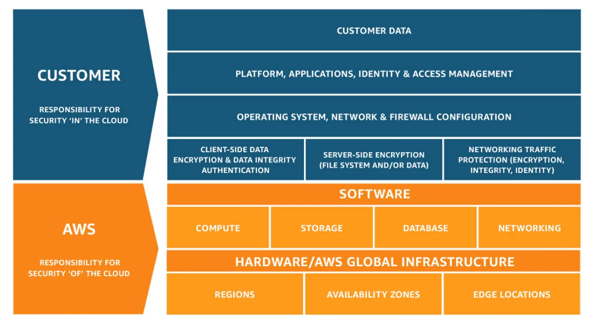
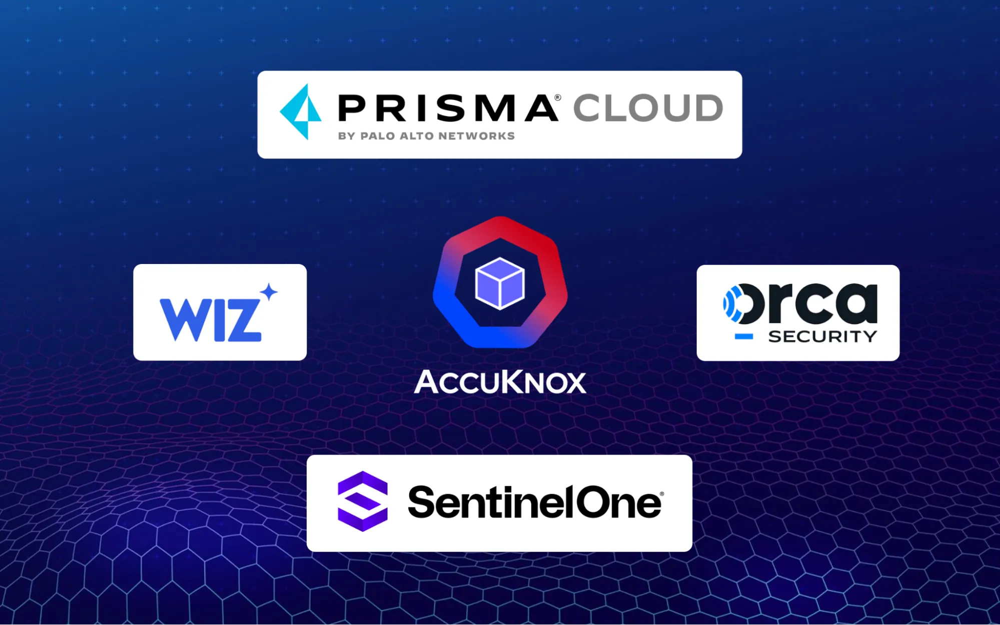

# Sanallaştırma (Hipervizör) Mimarileri ve Bulut Bilişim Servis Modelleri

Kurumsal BT altyapıları, fiziksel sunuculardan sanal makinelere ve nihayetinde bulut bilişime doğru evrilmiştir. Bu dönüşüm esneklik ve maliyet avantajı getirirken güvenlik sorumluluklarını da yeniden tanımlar: hipervizör katmanı artık yalnızca bir performans soyutlaması değil, **çok kiracılı ihlalde tek atlamayla tüm iş yüklerini riske atan** kritik bir güven sınırıdır. CVE-2025-22224 (CVSS 9.3) gibi vahşi doğada aktif sömürülen VM-escape zafiyetleri — Broadcom'un "exploitation has occurred in the wild" ifadesiyle doğruladığı ve küresel ölçekte on binlerce ESXi sunucusunu etkileyen — bu riskin teorik olmadığını kanıtlar.

Bu bölümde Tip-1/Tip-2 hipervizör mimarileri, ESXi/Proxmox/KVM sıkılaştırması, VM kaçış saldırıları, sanal ağ segmentasyonu, paylaşımlı sorumluluk modeli ve Bulut Güvenlik Duruşu Yönetimi (CSPM) ele alınır. Tüm konular NIST SP 800-125/800-53, CIS Controls v8, ISO 27001, MITRE ATT&CK ve Türkiye mevzuatı (KVKK, 5651, BDDK) çerçevesinde kurumsal savunma derinliği perspektifiyle sunulur.


*Tip-1 (bare-metal) ve Tip-2 (hosted) hipervizör katman hiyerarşisi — üretim iş yükleri her zaman Tip-1 üzerinde çalıştırılmalıdır*

---

## §11.1.1. Tip-1 ve Tip-2 Hipervizör Mimarileri ve Güvenlik İmplikasyonları

Bir sistem mimarı için hipervizör tipi seçimi, salt performans değil bir **güven sınırı (trust boundary)** kararıdır. Tip-1 (bare-metal) hipervizör — VMware ESXi, Proxmox VE (KVM tabanlı), Microsoft Hyper-V, Linux KVM — doğrudan donanımın üzerinde çalışır; araya genel amaçlı bir işletim sistemi girmez. Bu mimaride hipervizör, CPU'nun donanım sanallaştırma katmanında (Intel VT-x / VMX root mode, AMD-V) konumlanır ve misafir işletim sistemleri yalıtılmış halde çalışır. Saldırı yüzeyi minimaldir çünkü altta Windows/Linux gibi tam bir OS yoktur.

Tip-2 hipervizör (VirtualBox, VMware Workstation/Fusion) ise bir host OS'in üzerinde uygulama olarak çalışır; host OS'in tüm zafiyetleri (yama eksikleri, sürücüler, kullanıcı uzayı servisleri) hipervizöre devralınır. Kurumsal topolojide pratik sonuç şudur: **üretim iş yükleri her zaman Tip-1 üzerinde çalıştırılmalıdır.** Tip-2 yalnızca geliştirici masaüstü ve laboratuvar/test senaryolarına aittir.

| Özellik | Tip-1 (Bare-metal) | Tip-2 (Hosted) |
| :---- | :---- | :---- |
| Kurulum | Doğrudan donanım üzerinde | Ana OS üzerinde uygulama |
| Donanım erişimi | Native, doğrudan | Host OS üzerinden |
| Saldırı yüzeyi | Küçük | Büyük (host OS + hipervizör) |
| Kullanım alanı | Üretim, veri merkezi | Geliştirme, test, laboratuvar |
| SOC telemetri kaynağı | Hipervizör log'ları (`vmkernel`, `hostd`) | Host OS olay günlükleri |

Mimari diyagram açıklaması (katman hiyerarşisi): En altta *fiziksel donanım (CPU/RAM/NIC/TPM)*; üstünde Tip-1'de doğrudan *hipervizör (VMkernel)*, Tip-2'de *host OS → hipervizör uygulaması*; en üstte *misafir VM'ler*. Tip-2'deki ekstra "host OS" katmanı, ek saldırı yüzeyi ve ek yama yükümlülüğü demektir.

NIST SP 800-125 ("Guide to Security for Full Virtualization Technologies") bu ayrımı temel alır ve hipervizör güvenliğinin üç sütununu tanımlar: (1) hipervizörün kendisinin sıkılaştırılması, (2) misafir VM izolasyonunun korunması, (3) yönetim düzleminin (management plane) ayrıştırılması. Bu, ISO/IEC 27001 Ek-A kontrolü A.8.9 (Configuration Management) ve NIST SP 800-53 SC-39 (Process Isolation) ile doğrudan eşleşir.

Büyük ölçekli kurumsal mimaride yönetim trafiği (vCenter/Proxmox web UI, SSH, API) **ayrı bir yönetim ağına** (Out-of-Band + iLO/iDRAC) alınır. Üretim VM'leri, yönetim bileşenlerinden fiziksel veya mantıksal olarak (VLAN + firewall) ayrılır.


*Hipervizör katmanı: fiziksel donanım ile sanal iş yükleri arasındaki güven sınırı*

### SOC Perspektifi: Telemetri Toplama Noktası

Bir SOC analisti açısından hipervizör tipi, telemetri toplama noktasını belirler. Tip-1'de log kaynağı hipervizörün kendisidir (ESXi `hostd`, `vpxa`, `vmkernel.log`); Tip-2'de ise host OS'in olay günlükleridir. ESXi hostları üzerinde yerel EDR çalıştırılamadığı için — saldırgan host'u hedeflerse EDR'ın yakalayacağı türden exploit'lere bile gerek kalmaz — savunma yapılandırma sertleştirmesi ve hipervizör log'larının SIEM'e aktarımına dayanır.

---

## §11.1.2. VMware ESXi Sıkılaştırma (Hardening)

ESXi, kurumsal veri merkezlerinde baskın Tip-1 hipervizördür ve tam da bu nedenle fidye yazılımı gruplarının birincil hedefidir. Aşağıdaki kontroller vSphere Security Configuration & Hardening Guide ve CIS VMware ESXi 8.0 Benchmark temel alınarak sıralanmıştır.

### Lockdown Mode (Kilitleme Modu)

ESXi host'una doğrudan erişimi devre dışı bırakır ve tüm yönetimi vCenter üzerinden zorunlu kılar. İki seviyesi vardır: *Normal* (DCUI erişimi açık kalır) ve *Strict* (vCenter bağlantısı koptuğunda host hiçbir şekilde yönetilemez). Hardening kimliği: `esxi-8.lockdown-mode`.

```powershell
# PowerCLI ile lockdown mode durumunu doğrulama
(Get-VMHost -Name $ESXi | Get-View).Config.LockdownMode
# Beklenen: lockdownNormal veya lockdownStrict
```

### TPM 2.0, UEFI Secure Boot ve Attestation

vSphere 6.7 ve sonrası TPM 2.0 ile host attestation yapar. UEFI Secure Boot, ESXi bootloader'ının geçerli dijital imzaya sahip olmasını zorlar. TPM 2.0 çipi boot edilen yazılım modüllerinin ölçümlerini (PCR) güvenli biçimde kaydeder; vCenter Server bu ölçümleri uzaktan doğrular. vSphere 7.0 U2 ve sonrasında TPM 2.0 ek olarak ESXi yapılandırmasını şifreler.

```bash
# ESXi şifreleme/secure boot durumu
esxcli system settings encryption get
#   Mode: TPM
#   Require Executables Only From Installed VIBs: true
#   Require Secure Boot: true
```

### VIB İmza Doğrulama (`execInstalledOnly`)

`VMkernel.Boot.execInstalledOnly=TRUE` ayarı, yalnızca imzalı VIB içinden gelen ikili dosyaların çalışmasına izin verir. TPM + Secure Boot ile birleştiğinde mevcut VIB'leri kurcalamaya karşı korur. VMware araştırmalarına göre bu kombinasyon, VIRTUALPITA ve VIRTUALPIE gibi `--force` ile ESXi'ye sızıp kalıcılık sağlayan implant'ları engeller.

### Gereksiz Servislerin Kapatılması

MOB (Managed Object Browser), CIM, SLP ve SNMP gibi gereksiz servisler kapatılmalıdır. OpenSLP (port 427) geçmişte kritik RCE zafiyetlerine (CVE-2020-3992, CVE-2021-21974) ev sahipliği yapmıştır.

```bash
# MOB servisini kapat
esxcli system settings advanced set -o /Config/HostAgent/plugins/solo/enableMob -b false

# SLP servisini durdur ve devre dışı bırak
esxcli system service stop --service-name=slpd
esxcli system service set --service-name=slpd --startup-value=disabled

# CIM server servisini durdur
esxcli system service stop --service-name=sfcbd-watchdog
esxcli system service set --service-name=sfcbd-watchdog --startup-value=disabled
```

### Parola Politikası ve Hesap Kilitleme

```bash
# Şifre karmaşıklığı (en az 15 karakter, 4 karakter sınıfı)
esxcli system settings advanced set -o /Security/PasswordQualityControl \
  -s "retry=3 min=disabled,15,15,15,15 max=64 similar=deny passphrase=3"

# 5 hatalı girişten sonra hesap kilitleme
esxcli system settings advanced set -o /Security/AccountLockFailures -i 5
esxcli system settings advanced set -o /Security/AccountUnlockTime -i 900
```

### Syslog ve Güvenlik Duvarı

```bash
# Merkezi syslog yapılandırması
esxcli system syslog config set --loghost=tcp://10.10.100.50:514
esxcli network firewall ruleset set --ruleset-id=syslog --enabled=true
esxcli system syslog reload
```

### vCenter Güvenliği

vCenter, varsayılan olarak VMCA imzalı sertifikalarla çalışır. ESXi host'larını Active Directory'ye katmaktan kaçınılmalıdır; bunun yerine benzersiz, karmaşık root parolaları kullanılmalıdır. SSH yalnızca sorun giderme sırasında açılıp hemen kapatılmalıdır.

:::caution
VMware'in desteklediği sürümlerde ESXi 7.0 Nisan 2025'te kullanım ömrü sonuna (EOL) ulaşmıştır. vCenter, ESXi host'larından eşit veya daha yüksek build numarasında tutulmalıdır. EOL sürümlerde yama alınmaz; bu, VMSA-2025-0004 gibi kritik CVE'lere karşı savunmasızlık demektir.
:::

### VMX Hardening

`isolation.tools.*` ayarları ile gereksiz sanal cihazlar devre dışı bırakılır. Sanal floppy, USB, 3D hızlandırma ve ses aygıtları üretim VM'lerinde kapatılmalıdır — VENOM (CVE-2015-3456) örneği, kullanılmayan emülasyon kodunun bile saldırı yüzeyi oluşturduğunu göstermiştir.

### CIS Benchmark ve Denetim Otomasyonu

Kurumsal denetimde CIS VMware ESXi 8.0 Benchmark v1.1.0 referans alınmalıdır. Wazuh SCA modülü veya CIS-CAT ile otomatik tarama yapılabilir:

```xml
<!-- Wazuh SCA — ESXi syslog yönlendirme kontrolü -->
<check id="CIS-ESXi-6.2.1">
  <title>Syslog sunucusuna log yönlendirme etkin</title>
  <command>esxcli system syslog config get</command>
  <regex>Remote Host: tcp://\d+\.\d+\.\d+\.\d+</regex>
</check>
```

| CIS Kontrol Alanı | Örnek Kontrol | NIST Eşlemesi |
| :---- | :---- | :---- |
| Erişim kontrolü | Lockdown mode, hesap kilitleme | AC-2, AC-3 |
| Ağ yapılandırması | Firewall ruleset, allowedIPs | SC-7 |
| Loglama | Syslog, audit log | AU-2, AU-6 |
| Yama yönetimi | Desteklenen sürüm, güncel build | SI-2 |

---

## §11.1.3. Proxmox VE Sıkılaştırma

Proxmox VE, Debian tabanlı, KVM (tam sanallaştırma) ve LXC (konteyner) teknolojilerini birleştiren açık kaynak Tip-1 platformudur. Egemen altyapı senaryolarında VMware'e maliyet-etkin bir alternatiftir.

**PVE Firewall:** Datacenter, Node ve VM/CT seviyesinde üç katmanlı kural seti sunar. Mantıksal olarak her VM'in sanal NIC'ine bir `iptables`/`nftables` zinciri bağlanır; bu, micro-segmentation'ın açık kaynak karşılığıdır.

**Cluster Güvenliği:** Corosync trafiği ayrı, izole bir VLAN'da tutulmalıdır; quorum manipülasyonu split-brain senaryolarına yol açabilir.

**API Token Yönetimi:** Otomasyon için kişisel parola yerine kapsamı sınırlı API token'ları kullanılır.

**2FA:** Proxmox TOTP ve WebAuthn/U2F donanım anahtarlarını destekler; özellikle `root@pam` hesabı için zorunlu kılınmalıdır.

```bash
# Proxmox firewall datacenter seviyesinde default-deny
# /etc/pve/firewall/cluster.fw
[OPTIONS]
enable: 1
policy_in: DROP
policy_out: ACCEPT

[IPSET management]
10.0.10.10
10.0.10.11/24

[RULES]
IN SSH -log alert -source +management -ACCEPT
IN ProxmoxWebUI -log info -source +management -ACCEPT
```

**pveproxy Erişim Sınırlandırması:** Web yönetim arayüzü (port 8006) yalnızca yönetim alt ağına açılmalıdır.

```nginx
# /etc/default/pveproxy
ALLOW_FROM="10.0.10.0/24,192.168.1.50"
DENY_FROM="all"
POLICY="allow"
```

**SSH Sıkılaştırma (Ansible ile dağıtım):** Root parola ile SSH girişi engellenmeli; yalnızca anahtar tabanlı kimlik doğrulama kullanılmalıdır.

```yaml
# ssh_hardening_playbook.yml
- name: Proxmox VE SSH Daemon Sıkılaştırma
  hosts: proxmox_nodes
  become: yes
  tasks:
    - name: SSH yapılandırmasını güncelle
      ansible.builtin.blockinfile:
        path: /etc/ssh/sshd_config
        marker: "# {mark} ANSIBLE MANAGED SSH HARDENING"
        block: |
          PasswordAuthentication no
          PubkeyAuthentication yes
          PermitRootLogin prohibit-password
          X11Forwarding no
          MaxAuthTries 3
        notify: Restart SSH
  handlers:
    - name: Restart SSH
      ansible.builtin.service:
        name: sshd
        state: restarted
```

**Kernel Hardening:** `sysctl` ayarları (ASLR, ptrace kısıtlamaları), auditd + rsyslog ile Wazuh agent üzerinden SIEM'e iletim. Corosync cluster log'ları izlenmelidir.

:::note
LXC konteynerleri privileged modda çalıştırıldığında host kernel yeteneklerine geniş erişim sağlar. Üretim ortamlarında izolasyon için KVM tercih edilmeli; LXC yalnızca güvenilir, düşük riskli iş yükleri için kullanılmalıdır.
:::

---

## §11.1.4. KVM/QEMU Sıkılaştırma: sVirt ve libvirt

KVM, Linux çekirdeğinin kendisini hipervizöre dönüştürür; QEMU ise donanım emülasyonunu sağlar. Kritik güvenlik mekanizması **sVirt**'tir: SELinux (veya AppArmor) MAC'ün her QEMU sürecine ayrı bir MCS (Multi-Category Security) etiketi atamasıdır. Böylece bir VM'in QEMU süreci kaçış yoluyla ele geçirilse bile, SELinux politikası onu yalnızca kendi disk imajına erişimle sınırlar.

```bash
# Her VM'in QEMU sürecinin benzersiz SELinux MCS etiketi
ps -eZ | grep qemu
# system_u:system_r:svirt_t:s0:c192,c714 ... qemu-system-x86_64 ...
```

libvirt, `<seclabel>` yapılandırmasıyla bu etiketlemeyi `dynamic` veya `static` modda yönetir. `/etc/libvirt/qemu.conf` dosyasında:

```ini
security_driver = "selinux"
dynamic_ownership = 1
remember_owner = 1
```

```bash
# sVirt boolean ayarları — saldırı yüzeyini azalt
setsebool -P virt_use_fusefs off
setsebool -P virt_use_sysfs off
setsebool -P virt_use_usb off
```

Bu, NIST SP 800-53 AC-6 (Least Privilege) ve SC-39 (Process Isolation) kontrollerinin çekirdek seviyesindeki uygulamasıdır.

---

## §11.1.5. VM Kaçış (Escape) Saldırıları: Tarihsel ve Güncel Örnekler

VM escape, bir saldırganın misafir VM'in sınırlarından çıkıp hipervizör host'unda kod çalıştırmasıdır — çok kiracılı bulutta en yıkıcı senaryodur çünkü cross-tenant access anlamına gelir.


*VM Escape: saldırgan bir VM'den hipervizöre ve fiziksel host'a geçerek tüm iş yüklerini ele geçirir*

### Tarihsel Örnekler

**VENOM (CVE-2015-3456):** QEMU'nun sanal Floppy Disk Controller kodundaki buffer overflow. 2004'ten beri kodda bulunuyordu ve Xen, KVM ile native QEMU'yu etkiledi. Kritik nokta: sanal floppy aygıtı yapılandırılmamış olsa bile FDC kodu aktif kaldığından sömürülebilirdi.

**CloudBurst (CVE-2009-1244):** VMware'in sanal video (SVGA) aygıtı üzerinden misafirden host'a kod çalıştırma — gereksiz sanal aygıtların devre dışı bırakılması gerektiğini hatırlatır.

**CVE-2020-3992 (OpenSLP Use-After-Free):** ESXi yönetim ağında port 427 üzerinden heap feng shui ile UAF sömürüsü; host'ta root yetkisiyle komut çalıştırma ve ardından tüm `.vmdk` disk imajlarının şifrelenmesi.

### VMSA-2025-0004: Güncel Kritik Zincir

Microsoft Threat Intelligence Center tarafından rapor edilen üç zafiyet 4 Mart 2025'te yayımlandı. Broadcom her üç CVE için vahşi doğada sömürüldüğüne dair bilgi olduğunu belirtti; CISA üçünü KEV kataloğuna ekleyerek yama son tarihini **25 Mart 2025** olarak belirledi. Kaspersky'ye göre saldırı **41.000'den fazla ESXi sunucusunu** etkiledi.

| CVE | CVSS | Açıklama |
| :---- | :---- | :---- |
| CVE-2025-22224 | 9.3 (Kritik) | VMCI'de TOCTOU → heap overflow; misafirde yerel admin → host'ta VMX süreci olarak kod çalıştırma |
| CVE-2025-22225 | 8.2 | ESXi'de arbitrary write; VMX sürecindeki yetkiyle çekirdeğe keyfi yazma |
| CVE-2025-22226 | 7.1 | HGFS'de out-of-bounds read; VMX belleğinden bilgi sızdırma |

Bu üçü zincirleme bir VM escape oluşturur. Huntress Tactical Response'un Aralık 2025 tespitinde ilk erişimin yüksek güvenle SonicWall VPN üzerinden gerçekleştiği değerlendirildi. Araç setinde "VSOCKpuppet" adlı bir ELF backdoor tespit edildi. Saldırı akışı: HGFS ile bellek sızdırma → VMCI backdoor kanallarıyla VMX belleğine yazma → bozulan fonksiyon işaretçisiyle çekirdeğe sızan shellcode. **Çözüm yalnızca yamadır**; Broadcom vMotion ile "rolling reboot" önerir.

### Mavi Takım Tespiti (SOC Perspektifi)

ESXi escape tespiti zordur çünkü host'ta EDR yoktur. Strateji:

- `vmkernel.log` ve `hostd.log`'un SIEM'e (Splunk/Sentinel/QRadar/Wazuh) syslog ile aktarılması
- VMX süreçlerinin anormal çökmeleri, beklenmedik dış IP'lere VMkernel bağlantıları için korelasyon kuralı
- MITRE ATT&CK **T1611 (Escape to Host)** tekniği ile eşleştirme

```yaml
# SIEM korelasyon kuralı örneği (Splunk SPL)
index=vmware sourcetype=vmkernel
| search "vmx" OR "VMCI" OR "HGFS"
| where match(_raw, "(?i)(crash|overflow|unauthorized)")
| stats count by host, _time
| where count > 3
```

:::danger
Çok kiracılı ortamda tek bir doğrulanmış VM-escape, tüm host'un izolasyonunu, bellek dökümünü ve forensic incelemesini gerektirir. Yama SLA'sı: CISA KEV son tarihi geçmiş, yamasız tek bir host = kritik bulgu.
:::

---

## §11.1.6. Ağ ve vSwitch Segmentasyonu

Sanallaştırılmış ağda Defense in Depth, mantıksal izolasyon katmanlarıyla kurulur.


*vSphere Standard Switch — yönetim, vMotion ve iş yükü trafiğinin ayrılması*

**VLAN Tagging (IEEE 802.1Q):** Standard vSwitch port gruplarına VLAN ID atanır; Layer-2 broadcast domain'leri ayrılır. Yönetim, vMotion ve iş yükü trafiği ayrı VLAN'lara konmalıdır.

**Distributed Virtual Switch (DVS):** vCenter seviyesinde merkezi yönetilen sanal switch. Port mirroring, NetFlow ve Private VLAN gibi kurumsal özellikleri merkezi politikayla uygular; configuration drift'i önler.

**Micro-segmentation:** VMware NSX ile her VM'in sanal NIC'ine durum-bilgili dağıtık firewall uygulanır; East-West trafik kontrol edilerek lateral movement engellenir. Zero Trust mimarisinin sanallaştırma katmanındaki uygulamasıdır.

**VXLAN:** Layer-2 segmentlerini Layer-3 üzerinden tünelleyerek (24-bit VNI ile ~16 milyon segment) veri merkezleri arası mantıksal izolasyon sağlar.

### vSwitch Güvenlik Politikaları

| Politika | Önerilen Değer | Gerekçe |
| :---- | :---- | :---- |
| Promiscuous Mode | Reject | Ağ dinleme saldırılarını engeller |
| MAC Address Changes | Reject | MAC spoofing'i önler |
| Forged Transmits | Reject | Sahte kaynak MAC ile MitM'i engeller |

NIST SC-7 (Boundary Protection) ve AC-4 (Information Flow Enforcement) — sanal switch'ler ve distributed firewall'lar bilgi akışını zorunlu olarak denetler.

---

## §11.1.7. Servis Modelleri ve Paylaşımlı Sorumluluk Modeli

Paylaşımlı Sorumluluk Modeli (Shared Responsibility Model), bulut güvenliğinin en sık yanlış anlaşılan kavramıdır. Gerçek cloud denetimlerinde en çok hata, kuruluşların sağlayıcının kapsamadığı bir kontrolü kapsadığını varsaymasından doğar. AWS bunu "Security *of* the Cloud" vs. "Security *in* the Cloud" olarak ifade eder. Temel kural değişmez: **veri, kimlikler ve erişim yetkileri HER zaman müşterinin sorumluluğundadır.**

| Katman | On-Premise | IaaS (EC2/Azure VM/GCE) | PaaS (App Service/App Engine) | SaaS (M365/Workspace) |
| :---- | :---- | :---- | :---- | :---- |
| Veri & Sınıflandırma | Müşteri | Müşteri | Müşteri | Müşteri |
| Kimlik & Erişim (IAM) | Müşteri | Müşteri | Müşteri | Müşteri |
| Uygulama | Müşteri | Müşteri | Müşteri | Sağlayıcı |
| Misafir OS / Runtime | Müşteri | **Müşteri** | Sağlayıcı | Sağlayıcı |
| Sanallaştırma / Hipervizör | Müşteri | Sağlayıcı | Sağlayıcı | Sağlayıcı |
| Fiziksel / Host OS | Müşteri | Sağlayıcı | Sağlayıcı | Sağlayıcı |

Kritik nüans: Yönetilen Kubernetes servislerinde (EKS/AKS/GKE) sınır bulanıklaşır — sağlayıcı control plane'i yönetir, müşteri worker node'ları, konteyner imajlarını ve iş yükü yapılandırmalarını güvenceye alır. FaaS'ta (Lambda/Azure Functions) altyapı neredeyse tamamen soyutlanır ama fonksiyonun IAM rolü ve ortam değişkenleri müşteridedir.

### Türkiye Mevzuatı Bağlantısı

**KVKK:** Paylaşımlı sorumluluk modeli "veri sorumlusu" yükümlülüğünü ortadan kaldırmaz. Hyperscaler SaaS kullanılsa bile veri sorumlusu sıfatı kurumda kalır. M365 varsayılan retention bağımsız bir yedek yerine geçmez.

**5651 Sayılı Kanun:** Yer sağlayıcı trafik bilgisini **6 ay–2 yıl** saklamakla yükümlüdür. Log'ların doğruluğu, bütünlüğü (hash) ve gizliliği zaman damgasıyla korunmalıdır. Bulut mimarisinde NAT, reverse proxy ve LoadBalancer'ın gerçek istemci IP'sini koruması (X-Forwarded-For zinciri) gerekir.

**BDDK:** Birincil ve ikincil sistemler ile yedeklerinin **yurt içinde** bulundurulması zorunludur. Bulut hizmeti yalnızca tek bankaya tahsisli özel bulut veya BDDK izinli topluluk bulutu ile alınabilir. Felaket senaryosunda **24 saat** içinde faaliyetin yeniden sürdürülebilir olması gerekir.

---

## §11.1.8. Bulut Güvenlik Duruşu Yönetimi (CSPM)

CSPM araçları, bulut hesaplarının API'lerine read-only erişimle bağlanıp yapılandırmaları sürekli tarayan ajan-sız sistemlerdir. Mimari yerleşim: CSPM, bulut sağlayıcının control plane envanterine bağlanır; iş yükünün *içine* değil, *etrafına* konumlanır.


*CSPM: bulut control plane envanterine ajan-sız bağlanarak misconfiguration tespiti*

Tespit ettiği tipik yanlış yapılandırmalar:

- Herkese açık S3 bucket'ları
- 0.0.0.0/0 ile açık SSH/RDP güvenlik grupları
- Şifrelenmemiş diskler
- MFA'sız IAM hesapları
- Aşırı geniş IAM rolleri

| Araç | Tür | Güçlü Yön |
| :---- | :---- | :---- |
| Prisma Cloud (Palo Alto) | Ticari CNAPP | Code-to-cloud kapsama, K8s güçlü |
| Wiz | Ticari | Graph tabanlı attack path analizi |
| Microsoft Defender for Cloud | Ticari/Native | Azure ekosistemi entegrasyonu |
| Prowler | Açık kaynak | AWS/Azure/GCP CIS Benchmark denetimi |
| ScoutSuite | Açık kaynak | Çok bulutlu duruş raporlaması |

```bash
# Prowler ile AWS CIS Benchmark denetimi
prowler aws --compliance cis_2.0_aws
```

Wiz'in "Cloud Data Security Snapshot" raporuna göre **şirketlerin %47'sinde en az bir depolama kovası veya veritabanı tamamen internete açık** durumdadır; **%72'sinde erişim kontrolünden yoksun herkese açık PaaS veritabanları** bulunmaktadır. CSPM bu sınıf hatayı dağıtımdan önce/sonra yakalar (ISO 27001 A.8.9; NIST SP 800-53 CM-6; CIS Controls v8 Kontrol 4).

### SOC Entegrasyonu

CSPM bulguları SIEM'e webhook veya API ile iletilmeli; SOAR ile otomatik remediation (örneğin public bucket'ı private yapma) tetiklenebilir. On-prem sanallaştırma için de Wazuh SCA modülü ile ESXi/Proxmox CIS compliance taraması yapılabilir.

```json
{
  "event_type": "cspm_finding",
  "severity": "CRITICAL",
  "resource": "s3://kurumsal-veri-backup",
  "finding": "PUBLIC_READ_ACL",
  "compliance": ["CIS AWS 2.1.1", "ISO27001-A.8.9"],
  "remediation": "BlockPublicAcls=true, IgnorePublicAcls=true"
}
```

---

## Mimari Tavsiyeler ve Özet

Sanallaştırma ve bulut servis modelleri güvenliği, tek bir katmana değil katmanlı savunmaya dayanır:

| Katman | Güvenlik Kontrolleri |
| :---- | :---- |
| Fiziksel | Donanım güvenliği, TPM, Secure Boot |
| Hipervizör | Sıkılaştırma, yama yönetimi, saldırı yüzeyi minimizasyonu |
| Ağ | vSwitch segmentasyonu, VLAN, mikro-segmentasyon, NSX |
| VM/OS | Konuk OS sıkılaştırması, endpoint protection |
| Veri | Şifreleme (at-rest ve in-transit), DLP |
| İzleme | SIEM, CSPM, hipervizör log korelasyonu |

**Aşama 1 — Temel sertleştirme (0–30 gün):**
1. Tüm ESXi host'larında VMSA-2025-0004 yamasını uygula; Lockdown Mode + `execInstalledOnly` + UEFI Secure Boot + TPM 2.0 etkinleştir.
2. Yönetim trafiğini ayrı VLAN'a al; MOB/SLP/CIM servislerini kapat.
3. CSPM (Prowler veya ticari Wiz/Prisma) ile sürekli duruş denetimi kur.

**Aşama 2 — Tespit ve telemetri (30–90 gün):**
4. ESXi `vmkernel.log`/`hostd.log`'ları SIEM'e aktar; MITRE ATT&CK T1611 için korelasyon kuralı yaz.
5. CIS VMware ESXi Benchmark uyum skorunu yönetim KPI'sı yap.

**Aşama 3 — Regülasyon (90+ gün):**
6. KVKK m.9 kapsamındaki yurt dışı aktarımlar için standart sözleşme + Kurul bildirim sürecini kur.
7. BDDK kapsamındaki iş yükleri için birincil/ikincil sistemleri yurt içi özel buluta taşı.

:::note
CIS Benchmark kontrol numaraları sürümler arası kayar; kurumsal denetimde hedef hipervizör sürümüne karşılık gelen resmi CIS PDF'i ile numaralandırma teyit edilmelidir. VENOM (2015) ve CloudBurst (2009) gibi tarihsel zafiyetler bugün yamalıdır; bu bölümde saldırı mantığını öğretmek amacıyla kullanılmıştır.
:::

Hipervizör, bulut bilişimde gerçek güvenlik sınırıdır — VM veya konuk işletim sistemi değil. Bu katmanın güvenliği, tüm sanallaştırılmış altyapının güvenliğini belirler. Assume breach prensibiyle segmentasyon ve sürekli duruş yönetimi (CSPM) zorunlu hale gelmiştir.