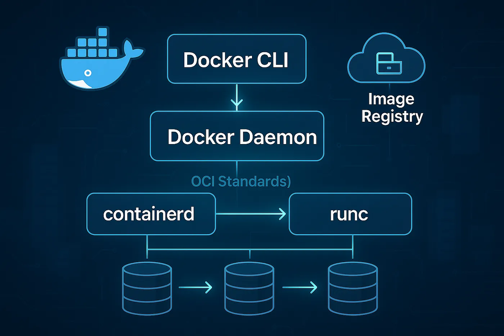
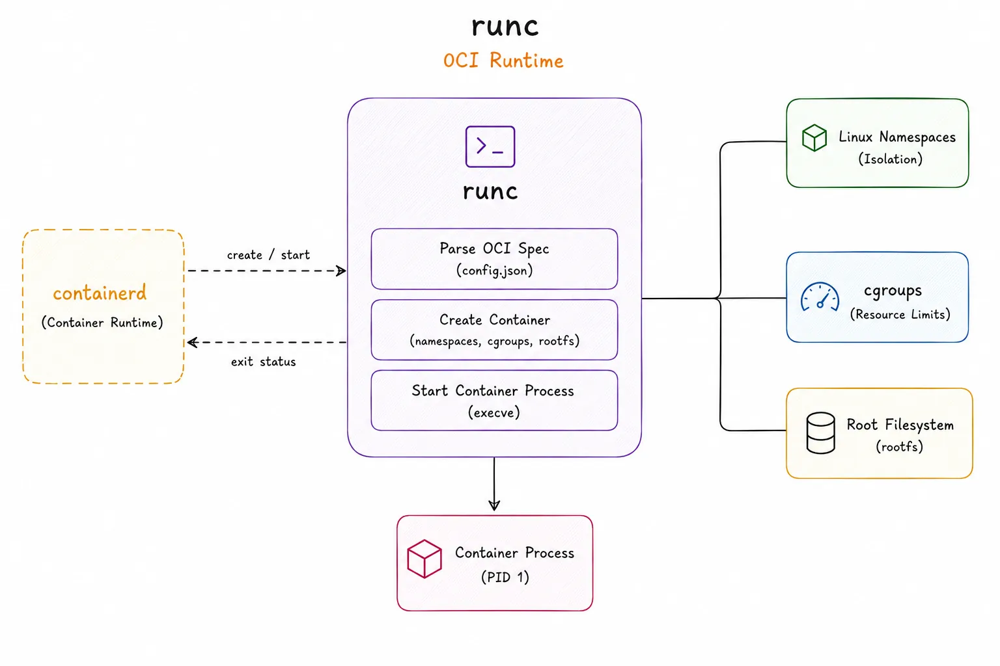
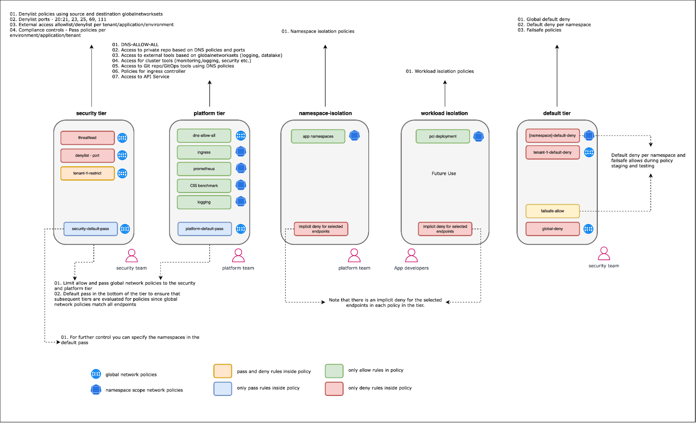
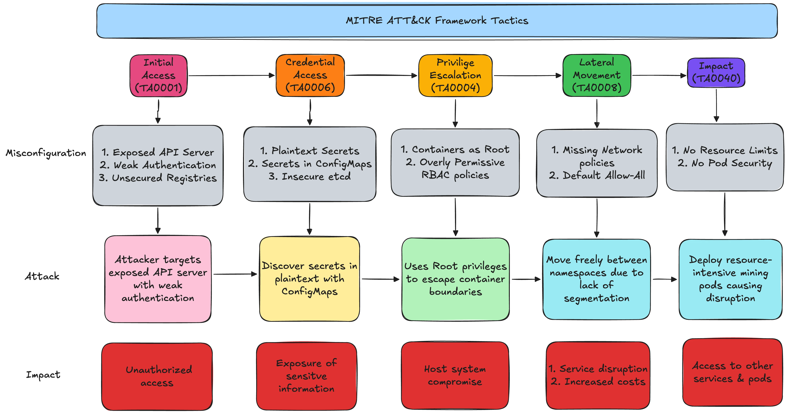

# Bulut Yerlisi (Cloud-Native), Konteyner Güvenliği ve Kod Olarak Altyapı (IaC)

Modern uygulamalar artık devasa sunucular yerine konteyner adı verilen hafif, bulut ortamları için özel tasarlanmış paketler halinde çalışmaktadır. Geleneksel "sert kabuklu, yumuşak içli" güvenlik modeli, konteynerlerin geçici (ephemeral) ve dinamik doğası karşısında yetersiz kalır: IP adresleri değişir, pod'lar doğar ve ölür, altyapı sürüm kontrolüyle tanımlanır. Bu ortamda güvenlik **kimlik**, **yapılandırma** ve **gözlemlenebilirlik** üzerine inşa edilmelidir.

NIST SP 800-190 *Application Container Security Guide*, konteyner güvenliğinin build, deploy ve runtime aşamalarının her birine entegre edilmesi gerektiğini vurgular. Bu bölümde Docker mimarisi, Linux çekirdek izolasyonu, Kubernetes güvenliği, imaj tarama, registry güvenliği, IaC denetimi ve MITRE ATT&CK for Containers ele alınır.


*Docker mimarisi: dockerd → containerd → runc — her katman ayrı bir güven sınırıdır*

---

## §11.2.1. Docker Mimarisi: daemon, containerd, runc

Docker monolitik değil katmanlı bir mimaridir ve her katman ayrı bir güven sınırıdır:

- **Docker daemon (`dockerd`):** Kök yetkisiyle çalışan istemci-sunucu servisi. `/var/run/docker.sock` Unix soketi üzerinden komut alır. **Bu soketin bir konteynere mount edilmesi, etkin bir şekilde host root yetkisi vermek demektir** — MITRE ATT&CK'in de belirttiği gibi en sık kullanılan kaçış vektörüdür.
- **containerd:** CNCF'in yüksek-seviye konteyner çalışma zamanı; imaj çekme, depolama ve yaşam döngüsü yönetimi.
- **runc:** OCI standardına uygun düşük-seviye çalışma zamanı; namespace ve cgroup'ları `clone()` sistem çağrısıyla oluşturup overlay dosya sistemini kurarak konteyneri başlatan bileşendir.

Kurumsal topolojide Docker host'ları genellikle bare-metal veya IaaS VM'ler üzerinde çalışır. Konteyner'lar host kernel'ini paylaşır; bu yüzden bir çekirdek zafiyeti tüm konteynerleri ve potansiyel olarak host'u etkiler.

:::caution
`/var/run/docker.sock` mount edilmiş bir konteyner, Container Administration Command (MITRE T1609) yoluyla host'a kaçış için en sık kullanılan vektördür. CIS Docker Benchmark 5.31: Docker soketi hiçbir konteynere mount edilmemelidir.
:::

---

## §11.2.2. Linux Çekirdek İzolasyon Mekanizmaları: Namespaces ve Cgroups

Konteynerlerin "sihri" iki çekirdek özelliğidir. **Namespaces izolasyon sağlar, cgroups kaynak sınırlar.** VM'lerden temel farkı: konteynerler ortak çekirdeği paylaşır — bu yüzden NIST SP 800-190 "container-specific host OS" (minimalist, salt-okunur kök dosya sistemli OS) kullanımını öğütür.


*Namespaces (görünürlük izolasyonu) ve Cgroups (kaynak sınırlandırma) — konteyner güvenliğinin iki temel sütunu*

### Namespaces

| Namespace | `clone()` Bayrağı | İzolasyon Kapsamı |
| :---- | :---- | :---- |
| PID | `CLONE_NEWPID` | Süreç ağacı; konteyner init süreci PID 1 olur |
| NET | `CLONE_NEWNET` | Ayrı ağ yığını — loopback, IP, routing, iptables |
| MNT | `CLONE_NEWNS` | Ayrı dosya sistemi mount görünümü |
| UTS | `CLONE_NEWUTS` | Ayrı hostname/domain adı |
| IPC | `CLONE_NEWIPC` | POSIX mesaj kuyrukları ve paylaşımlı bellek |
| USER | `CLONE_NEWUSER` | UID/GID eşlemesi — konteynerde root, host'ta yetkisiz kullanıcı |
| CGROUP | — | Host cgroup hiyerarşisine erişimi gizler |

USER namespace güvenlik açısından en kritik namespace'dir: bir kaçış durumunda saldırgan host'ta root değil yetkisiz kullanıcı olur.

```bash
# Manuel namespace oluşturma — izolasyon mekanizmasını anlama
unshare --fork --pid --mount-proc --uts --net --ipc --user --map-root-user /bin/bash
# İçeride: hostname my-container; whoami → root (host perspektifinden UID 1000)

# Mevcut namespace'leri listeleme
lsns --output-all

# Forensic: nsenter ile çalışan konteynerin namespace'ine girme
nsenter --target <PID> --mount ls /
```

### Cgroups (v1 vs v2)

Cgroup v1 her denetleyiciyi ayrı hiyerarşide tutardı; tutarsızlık ve güvensiz alt ağaç delegasyonu riski yarattı. Cgroup v2 (Linux 5.15+ varsayılan) tek birleşik hiyerarşi kullanır; güvenli alt ağaç delegasyonu ve rootless konteyner desteği sağlar.

| Özellik | Cgroups v1 | Cgroups v2 |
| :---- | :---- | :---- |
| Hiyerarşi | Çoklu bağımsız ağaç | Tek birleşik hiyerarşi |
| Güvenlik | Güvensiz alt ağaç delegasyonu | Güvenli delegasyon, rootless destek |
| release_agent | Kaçış vektörü (CVE-2022-0492) | Kaldırılmış; eBPF tabanlı denetim |

```bash
# Cgroup v2 ile bellek sınırlama
mkdir /sys/fs/cgroup/mycontainer
echo "+memory" > /sys/fs/cgroup/cgroup.subtree_control
echo "100M" > /sys/fs/cgroup/mycontainer/memory.max
echo $$ > /sys/fs/cgroup/mycontainer/cgroup.procs
```

### Ek Katmanlar: Seccomp, Capabilities, AppArmor/SELinux

- **Seccomp:** Konteynerin çağırabileceği syscall'ları filtreler.
- **Capabilities:** Root yetkilerini parçalara böler; `--cap-drop ALL` + yalnızca gerekenler.
- **AppArmor/SELinux:** MAC ile dosya, ağ ve kaynak erişimini kısıtlar.

```bash
# Güvenli Docker çalıştırma komutu (CIS Docker Benchmark uyumlu)
docker run --rm \
  --user 1000:1000 \
  --cap-drop=ALL \
  --cap-add=NET_BIND_SERVICE \
  --security-opt=no-new-privileges \
  --security-opt=seccomp=./seccomp-profile.json \
  --read-only \
  --tmpfs /tmp \
  nginx:latest
```

### CIS Docker Benchmark Eşlemeleri

| Kontrol | Gereksinim |
| :---- | :---- |
| 5.4 | Privileged konteyner kullanılmamalı |
| 5.3 | Linux kernel capabilities kısıtlanmalı |
| 5.25 | no-new-privileges etkin |
| 5.31 | Docker soketi mount edilmemeli |

### Konteyner Kaçışı: CVE-2022-0492 ve Leaky Vessels

**CVE-2022-0492 (Cgroups v1 release_agent):** `CAP_SYS_ADMIN` yetkisiyle cgroup `release_agent` dosyasına host yolu yazılarak çekirdek tetiklemesiyle host'ta root kod çalıştırma.

**Leaky Vessels (CVE-2024-21626, CVE-2025-31133):** runc'ın dosya tanımlayıcı sızıntısı; `WORKDIR /proc/self/fd/8` ile host dosya sistemine erişim.

```yaml
# Falco — release_agent kaçış tespiti
- rule: Detect release_agent File Container Escapes
  desc: Container escape via release_agent file
  condition: >
    open_write and container and fd.name endswith release_agent and
    (user.uid=0 or thread.cap_effective contains CAP_DAC_OVERRIDE) and
    thread.cap_effective contains CAP_SYS_ADMIN
  output: "Container escape attempt via release_agent (user=%user.name)"
  priority: CRITICAL
  tags: [container, mitre_escape_to_host, T1611]
```

---

## §11.2.3. Kubernetes (K8s) Mimarisi

Kubernetes cluster'ı iki düzleme ayrılır:

**Control Plane:**
- **kube-apiserver:** Tüm cluster'ın tek giriş noktası; authentication → authorization → admission.
- **etcd:** Cluster durumu ve Secret'ları tutar. **etcd ele geçirilirse tüm cluster ele geçirilir** — TLS ve at-rest şifreleme zorunlu (CIS K8s Benchmark 2.1, 2.2).
- **kube-scheduler / kube-controller-manager:** İstenen durumu sürdüren döngüler.

**Worker Node:**
- **kubelet:** Pod spec'lerini çalıştırır. CIS **4.2.1 (`--anonymous-auth=false`)** ve **4.2.2 (authorization-mode AlwaysAllow olmamalı)** kritik.
- **kube-proxy:** Servis ağ kurallarını yönetir.
- **Container runtime:** containerd/CRI-O.

```bash
# CIS K8s Benchmark — kubelet anonymous auth kontrolü
ps aux | grep kubelet | grep -v anonymous-auth=false
# Boş çıktı = uyumlu değil (kritik bulgu)
```

---

## §11.2.4. NetworkPolicy: Default-Deny Mimarisi

Kubernetes'te varsayılan olarak tüm Pod'lar birbiriyle konuşabilir — lateral movement için açık kapıdır. Defense in Depth ilk adımı default-deny uygulamaktır.


*NetworkPolicy ile pod düzeyinde mikro-segmentasyon — East-West trafik kontrolü*

```yaml
apiVersion: networking.k8s.io/v1
kind: NetworkPolicy
metadata:
  name: default-deny-all
  namespace: production
spec:
  podSelector: {}
  policyTypes:
    - Ingress
    - Egress
---
apiVersion: networking.k8s.io/v1
kind: NetworkPolicy
metadata:
  name: allow-frontend-to-backend
  namespace: production
spec:
  podSelector:
    matchLabels:
      app: backend
  policyTypes: [Ingress]
  ingress:
    - from:
        - podSelector:
            matchLabels:
              app: frontend
      ports:
        - protocol: TCP
          port: 8080
```

Bu, OWASP Kubernetes Top 10'daki **K05/K07 (Missing Network Segmentation Controls)** riskini doğrudan kapatır. NetworkPolicy uygulanması için Calico, Cilium gibi CNI eklentileri gerekir. Cilium ile L3/L4 + DNS aware policy ve eBPF tabanlı gözlemlenebilirlik önerilir.

:::note
NetworkPolicy yalnızca CNI desteğiyle etkinleşir. Varsayılan Flannel/CNI'siz kurulumda policy'ler tanımlanabilir ancak trafik engellenmez — bu, en yaygın yanlış güvenlik varsayımlarından biridir.
:::

---

## §11.2.5. Kubernetes RBAC: En Az Yetki

RBAC, "kim, neye, ne yapabilir" sorusunun yanıtıdır. `Role` namespace-kapsamlı, `ClusterRole` cluster-kapsamlıdır.

```yaml
apiVersion: rbac.authorization.k8s.io/v1
kind: Role
metadata:
  namespace: production
  name: pod-reader
rules:
  - apiGroups: [""]
    resources: ["pods"]
    verbs: ["get", "list", "watch"]
---
apiVersion: rbac.authorization.k8s.io/v1
kind: RoleBinding
metadata:
  name: read-pods
  namespace: production
subjects:
  - kind: ServiceAccount
    name: monitoring-sa
    namespace: production
roleRef:
  kind: Role
  name: pod-reader
  apiGroup: rbac.authorization.k8s.io
```

Aşırı geniş RBAC, OWASP K8s Top 10'da **K02/K03 (Overly Permissive Authorization)** olarak listelenir. `cluster-admin` rolü yalnızca kesinlikle gerektiğinde verilmelidir (CIS K8s Benchmark 5.1.1). Wildcard (`*`) fiil ve kaynak kullanımından kaçınılmalıdır.

```bash
# RBAC denetimi — ServiceAccount yetkilerini listele
kubectl auth can-i --list --as=system:serviceaccount:production:monitoring-sa
```

**Tehlikeli yapılandırma:** `cluster-admin` yetkili ServiceAccount'un pod'a mount edilmesi, saldırganın tüm kümeyi ele geçirmesine olanak tanır (MITRE T1078 — Valid Accounts).

---

## §11.2.6. Pod Security: PSS, PSA ve PSP'den Geçiş

PodSecurityPolicy (PSP) Kubernetes v1.21'de deprecated edildi ve **v1.25'te tamamen kaldırıldı**. Yerini **Pod Security Standards (PSS)** ve **Pod Security Admission (PSA)** aldı.

PSS üç profil tanımlar:

| Profil | Açıklama | Kullanım |
| :---- | :---- | :---- |
| Privileged | Kısıtlama yok | CNI, storage driver, monitoring |
| Baseline | Bilinen privilege escalation'ları engeller | Genel uygulamalar |
| Restricted | En sıkı hardening | Production, hassas iş yükleri |

PSA namespace etiketiyle uygulanır; üç mod: `enforce`, `audit`, `warn`.

```yaml
apiVersion: v1
kind: Namespace
metadata:
  name: production
  labels:
    pod-security.kubernetes.io/enforce: restricted
    pod-security.kubernetes.io/audit: restricted
    pod-security.kubernetes.io/warn: restricted
    pod-security.kubernetes.io/enforce-version: latest
```

Restricted ihlalinde API server tipik hata döndürür: `allowPrivilegeEscalation != false`, `capabilities.drop=['ALL']`, `runAsNonRoot != true`, `seccompProfile.type` eksik. Daha karmaşık ihtiyaçlar için Kyverno veya OPA Gatekeeper devreye alınır (OWASP K04 — Lack of Centralized Policy Enforcement).

```yaml
# Restricted uyumlu securityContext
securityContext:
  runAsNonRoot: true
  runAsUser: 1000
  fsGroup: 2000
  seccompProfile:
    type: RuntimeDefault
  capabilities:
    drop: ["ALL"]
containers:
- name: app
  securityContext:
    allowPrivilegeEscalation: false
    readOnlyRootFilesystem: true
    capabilities:
      drop: ["ALL"]
```

---

## §11.2.7. Konteyner İmaj Taraması ve Shift-Left

İmaj taraması CI/CD pipeline'ının "shift-left security" aşamasıdır: zafiyet, üretime ulaşmadan build sırasında yakalanır.

| Araç | Güçlü Yön |
| :---- | :---- |
| Trivy (Aqua) | İmaj + dosya sistemi + IaC + sır + K8s tarama |
| Grype (Anchore) | SBOM tabanlı imaj zafiyet tarayıcı |
| Clair (Quay) | Registry entegre statik katman analizi |

```yaml
# GitHub Actions — kritik CVE'de build'i kır
- name: Trivy image scan
  uses: aquasecurity/trivy-action@master
  with:
    image-ref: 'myregistry/app:${{ github.sha }}'
    severity: 'CRITICAL,HIGH'
    exit-code: '1'
```

Bu, NIST SP 800-190'ın "Image Risks" kategorisini ve OWASP K8s **K02 (Supply Chain Vulnerabilities)** riskini kapatır. SBOM yönetiminin DevSecOps pipeline'ına entegrasyonu (Syft → SPDX/CycloneDX), tedarik zinciri risklerini üretimden önce tanımlamayı sağlar.

**Build-time en iyi uygulamalar:**
- Minimal base image (Distroless, Wolfi, Alpine)
- Secrets scanning: gitleaks, trufflehog
- Multi-stage build ile build araçlarını final imajdan çıkarma

---

## §11.2.8. Registry Güvenliği ve İmaj İmzalama

Tedarik zinciri saldırılarına karşı iki kontrol esastır:

- **Harbor:** Açık kaynak kurumsal registry; RBAC, yerleşik zafiyet taraması, replikasyon ve content trust.
- **Cosign/Sigstore:** İmaj imzalama ve doğrulama; keyless imzalama (OIDC kimliğiyle) destekler.

```bash
cosign sign --key cosign.key myregistry/app:1.0
cosign verify --key cosign.pub myregistry/app:1.0
```

Admission controller'lar (Kyverno/OPA Gatekeeper), taranmamış, onaylı olmayan base imaj kullanan veya güvenilmeyen registry'den gelen imajları reddederek **yalnızca imzalı imajların cluster'a girmesini** zorlar.

```yaml
# Kyverno — yalnızca imzalı imajlara izin ver
apiVersion: kyverno.io/v1
kind: ClusterPolicy
metadata:
  name: verify-image-signature
spec:
  validationFailureAction: enforce
  rules:
    - name: check-signature
      match:
        any:
          - resources:
              kinds: [Pod]
      verifyImages:
        - imageReferences: ["myregistry/*"]
          attestors:
            - entries:
                - keys:
                    publicKeys: |-
                      -----BEGIN PUBLIC KEY-----
                      ...
                      -----END PUBLIC KEY-----
```

---

## §11.2.9. IaC Güvenliği: Terraform, Ansible, State

Kod olarak altyapı, yanlış yapılandırmayı da kod olarak çoğaltır. Yaygın hatalar: 0.0.0.0/0 ile SSH/3389 açık güvenlik grupları, şifrelenmemiş S3/RDS, wildcard IAM politikaları, hardcoded sırlar.

**State dosyası güvenliği (kritik):** Terraform state dosyası tüm altyapının — sırlar dahil — düz metin envanteridir. State asla repoya commit edilmemeli; KMS ile at-rest şifreli uzak backend'de (S3 + DynamoDB lock, Azure Blob) tutulmalıdır.

**Tarayıcılar (güncel durum):**

| Araç | Durum | Öneri |
| :---- | :---- | :---- |
| Checkov (Palo Alto) | Aktif geliştirme | Birincil IaC tarayıcı |
| Trivy (Aqua) | tfsec'i bünyesine kattı | Birleşik imaj + IaC tarama |
| Terrascan (Tenable) | Kasım 2025'te arşivlendi | Yeni projeler için önerilmez |

```hcl
# Checkov'un yakalayacağı kötü yapılandırma
resource "aws_s3_bucket" "data" {
  bucket = "kurumsal-veri"
  acl    = "public-read"   # CKV_AWS_20 ihlali
}
```

```yaml
# CI'da Checkov ile pipeline'ı durdur
- name: Checkov
  uses: bridgecrewio/checkov-action@master
  with:
    directory: .
    framework: terraform
    soft_fail: false
```

Ansible tarafında `no_log: true` ile hassas görev çıktılarının log'lanmaması, Vault ile değişken şifreleme (`ansible-vault encrypt`) ve idempotent rollerle configuration drift'in önlenmesi esastır.

:::danger
Terraform state sızıntıları en kötü senaryo IaC ihlalidir. State dosyası tüm altyapı envanterini, veritabanı bağlantı dizelerini ve API anahtarlarını düz metin içerir. CI/CD için uzun ömürlü anahtar yerine kısa ömürlü OIDC kimlikleri tercih edilmelidir.
:::

---

## §11.2.10. MITRE ATT&CK for Containers: Saldırı ve Savunma

MITRE, ATT&CK for Containers matrisini Temmuz 2021'de yayımladı. Kurumsal Defense in Depth için anahtar teknikler:


*MITRE ATT&CK for Containers — saldırı teknikleri ve mavi takım eşlemeleri*

### Saldırı Senaryosu (Ofansif Perspektif)

1. **Initial Access — T1190:** Açık kubelet (port 10250) veya zafiyetli web uygulaması.
2. **Execution — T1610/T1609:** Privileged pod deploy veya `docker.sock` mount ile host'ta komut.
3. **Privilege Escalation — T1611:** `nsenter` ile host namespace'inde shell; veya çekirdek zafiyeti (CVE-2024-1086 netfilter UAF).
4. **Persistence — T1078.001:** ServiceAccount token kötüye kullanımı.
5. **Impact — T1525:** Kötü niyetli imaj implant'ı (internal image).

### Mavi Takım Tespiti

| Teknik | Tespit Yöntemi | Log Kaynağı |
| :---- | :---- | :---- |
| T1611 Escape to Host | `nsenter`, `unshare` komutları | Falco/EDR komut satırı telemetrisi |
| T1610 Deploy Container | Privileged pod oluşturma | K8s API audit log + SIEM |
| T1609 Container Admin | `docker.sock` mount | Admission controller engelleme + alarm |
| T1525 Implant Image | İmzasız imaj deploy | Kyverno/Cosign doğrulama |

```yaml
# Falco — konteyner içinde shell spawn tespiti (T1059)
- rule: Terminal shell in container
  condition: container and shell_procs and proc.tty != 0
  output: "Konteynerde shell açıldı (user=%user.name container=%container.id image=%container.image.repository)"
  priority: WARNING
```

Falco gibi çalışma-zamanı tespit motorları, OWASP K8s **K05/K06 (Inadequate Logging and Monitoring)** boşluğunu kapatır. Test için Atomic Red Team'in T1611 atomic testleri kullanılabilir.

### Türkiye Mevzuatı Bağlantısı

**KVKK:** Kişisel verilerin işlendiği konteyner/pod'larda erişim ve işlem loglarının tutulması, değiştirilemezliği ve denetlenebilirliği zorunludur.

**5651:** Erişim sağlayıcı konumundaki kurumlarda trafik loglarının **1–2 yıl** saklanması ve zaman damgalı korunması gerekir. K8s audit log'ları ve ingress controller log'ları bu kapsamdadır.

**BDDK:** Finansal kurumlar için SIEM entegrasyonu, olay müdahale prosedürleri ve log bütünlüğü ayrıca zorunludur.

---

## Mimari Tavsiyeler ve Özet

Bulut yerlisi güvenlik, build-deploy-runtime üçlüsüne yayılmış katmanlı savunma gerektirir:

| Aşama | Kontroller |
| :---- | :---- |
| Build | SBOM, Trivy/Grype tarama, secrets scanning, minimal base image |
| Deploy | Checkov IaC denetimi, imaj imzalama (Cosign), Kyverno admission |
| Runtime | PSA restricted, default-deny NetworkPolicy, Falco/Wazuh, RBAC audit |

**Aşama 1 — Temel sertleştirme (0–30 gün):**
1. Kubernetes namespace'lerinde default-deny NetworkPolicy ve `pod-security.kubernetes.io/enforce: restricted` etiketini uygula.
2. `cluster-admin` kullanımını CIS 5.1.1'e göre denetle; privileged pod'ları yasakla.
3. Docker host'larda `--privileged` ve `docker.sock` mount'larını engelle.

**Aşama 2 — Tespit ve telemetri (30–90 gün):**
4. Kubernetes API audit log ve Docker daemon log'larını SIEM'e aktar; T1611/T1610/T1609 için korelasyon kuralı yaz.
5. Falco veya eşdeğeri çalışma-zamanı tespit motorunu devreye al; Atomic Red Team T1611 testleriyle doğrula.

**Aşama 3 — Tedarik zinciri (90+ gün):**
6. CI/CD pipeline'a Trivy (imaj) + Checkov (IaC) ekle; CRITICAL bulguda build'i kır.
7. Cosign ile imaj imzalama; Kyverno ile yalnızca imzalı imajların cluster'a girmesini zorla.
8. Terraform state'i KMS-şifreli uzak backend'e taşı.

:::note
OWASP Kubernetes Top 10 2025 listesi 2022 listesinden önemli ölçüde farklıdır (K08 Cluster To Cloud Lateral Movement, K06 Overly Exposed Kubernetes Components gibi yeni maddeler). Atıflarda yıl niteleyicisi (K0x:2022 vs K0x:2025) kullanılmalıdır. CIS Benchmark kontrol numaraları da sürümler arası kayar; hedef Kubernetes sürümüne karşılık gelen resmi CIS PDF'i ile teyit edilmelidir.
:::

Konteyner ortamlarında güvenlik, "sert kabuk" yerine her katmanda bağımsız kontrollerle inşa edilir. Bir katman delinse bile diğerleri (NetworkPolicy, RBAC, PSA, runtime detection) yayılmayı sınırlar — bu, savunma derinliğinin bulut yerlisi dünyadaki somut tezahürüdür.