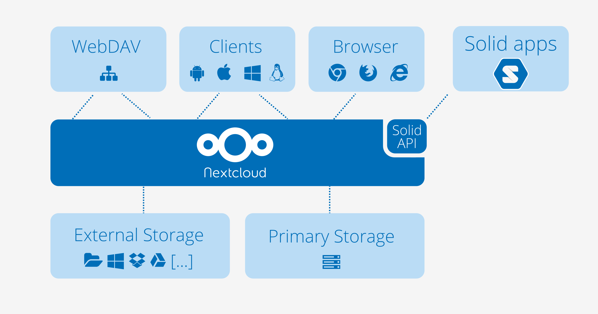
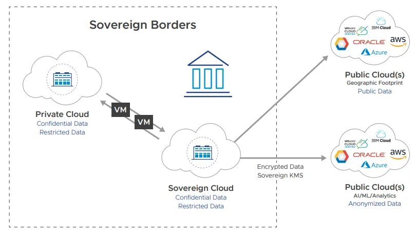
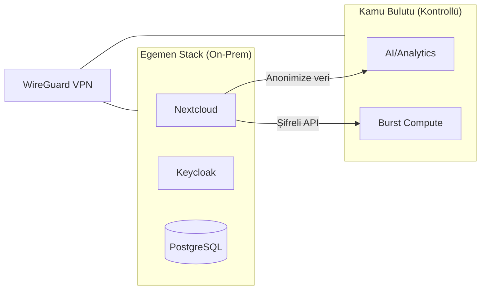
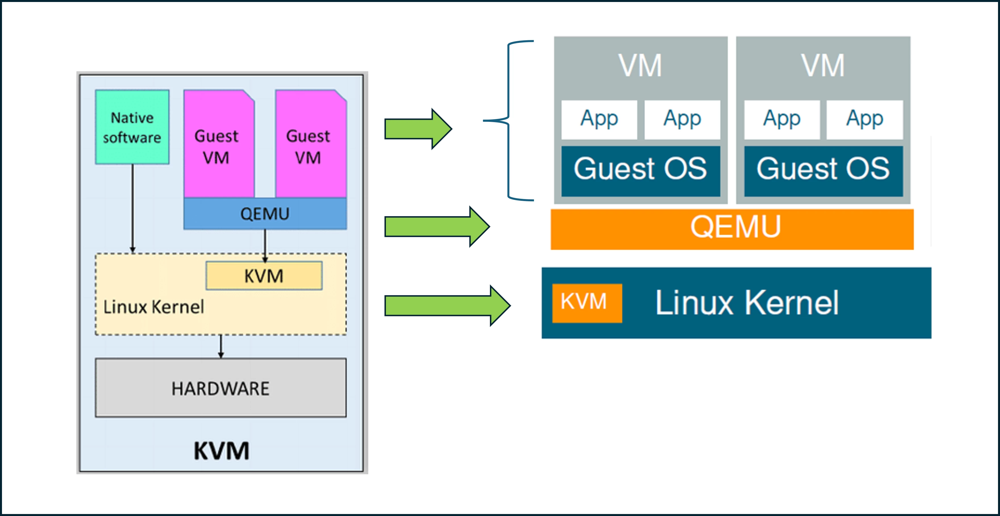

# Hibrit Bulut Yönetimi ve Veri Egemenliği (Digital Sovereignty)

Kamu bulutu sağlayıcılarına (AWS, Azure, GCP) tam bağımlılık; veri egemenliği, yasal uyumluluk ve sınır ötesi veri transferi konularında ciddi riskler doğurur. CLOUD Act, FISA ve Schrems II sonrası AB-ABD veri aktarım kısıtlamaları, hyperscaler bağımlılığının yalnızca operasyonel değil yargısal bir risk taşıdığını göstermiştir. Özellikle KVKK, BDDK ve 5651 sayılı Kanun kurumları verilerini ve altyapılarını kontrol altında tutmaya zorlamaktadır.

Bu bölümde egemen altyapı (sovereign stack) tasarımı, Nextcloud ve açık kaynak alternatifleri, self-hosted güvenlik mimarisi ve Türk mevzuatının mimariye doğrudan etkileri ele alınır. Hedef: regülasyon kaynaklı bir mimari tercih olarak dijital egemenliği teknik olarak uygulanabilir hale getirmek.


*Hibrit bulut: hassas veriler egemen stack'te, düşük riskli iş yükleri kontrollü kamu bulutunda*

---

## §11.3.1. Egemen Altyapı (Sovereign Stack) Tasarım Prensipleri

Hyperscaler bağımlılığı (vendor lock-in) ve yabancı yargı yetkisi riskleri, kurumları "egemen yığın" tasarımına yöneltir. Gerçek dijital egemenlik üç katmanda sağlanır:

| Katman | Tanım | Kontrol Mekanizması |
| :---- | :---- | :---- |
| Yazılım | Açık kaynak, denetlenebilir kod | Kod denetimi, SBOM, imzalı artefaktlar |
| Altyapı | Kurum kontrolündeki veri merkezi | Fiziksel erişim, air-gap seçeneği |
| Yargı | Yerel kanunlara tabiiyet | KVKK, BDDK, 5651 uyumu |

### Mimari Prensipler

- **Tam yerinde kontrol düzlemi:** Control plane'in (orkestrasyon, kimlik, anahtar yönetimi) fiziksel olarak ülke sınırları içinde ve kurum kontrolünde olması. Rekabet artık "veriyi nerede tuttuğunuzla değil, hangi altyapı üzerinde işlediğiniz ve kontrol düzleminin kimde olduğuyla" belirlenir.
- **Açık standartlar:** OpenStack (IaaS), Kubernetes (orkestrasyon), Ceph/MinIO (depolama) ile taşınabilirlik ve lock-in'den kaçınma.
- **Kripto-egemenlik:** Anahtarların kurumun HSM'inde tutulması; "Bring Your Own Key" yetmez, "Hold Your Own Key" hedeflenir.
- **Bağımsız işleyebilirlik:** Yurt dışı bağlantı kesilse bile kritik servislerin çalışmaya devam etmesi — BDDK Yönetmeliği'nin açık gereksinimidir.

### Sovereign Stack Bileşenleri

```
┌─────────────────────────────────────────────────────────────┐
│                    UYGULAMA KATMANI                         │
│  Nextcloud, OnlyOffice, Collabora, Keycloak, Mailcow       │
├─────────────────────────────────────────────────────────────┤
│                    ORKESTRASYON KATMANI                     │
│  Kubernetes, Proxmox VE, OpenStack, Rancher                │
├─────────────────────────────────────────────────────────────┤
│                    ALTYAPI KATMANI                          │
│  Ubuntu/Debian, Ceph/MinIO, SDN (Calico/Cilium)            │
├─────────────────────────────────────────────────────────────┤
│                    DONANIM KATMANI                          │
│  On-premise sunucular, HCI, TPM 2.0 donanım güvenliği     │
└─────────────────────────────────────────────────────────────┘
```

| Bileşen | Teknoloji | Alternatif (Hyperscaler) |
| :---- | :---- | :---- |
| Compute | KVM, Proxmox VE, VMware vSphere | EC2, Azure VM, GCE |
| Depolama | Ceph, MinIO (S3 uyumlu) | S3, Blob Storage, GCS |
| Orkestrasyon | Kubernetes + Rancher/OpenShift | EKS, AKS, GKE |
| Kimlik | Keycloak (OIDC/SAML) | Entra ID, Google IAM |
| Ağ | OpenStack Neutron, Calico/Cilium | VPC, VNet, Cloud VPC |

### Kamu Bulutu vs Egemen Stack Karşılaştırması

| Kontrol Alanı | Geleneksel Kamu Bulutu | Kurumsal Sovereign Stack |
| :---- | :---- | :---- |
| Veri yerleşimi | Sağlayıcının küresel veri merkezleri | Kurum içi fiziksel diskler, doğrulanabilir konum |
| Yargısal denetim | Sağlayıcı merkez ülkesinin yasaları (Cloud Act) | Yalnızca yerel kanunlar (KVKK, BDDK) |
| Tedarik zinciri | Kapalı kaynak kontrol düzlemleri | Açık kaynak (KVM, Proxmox, Debian) |
| Altyapı izolasyonu | Paylaşımlı multi-tenancy | Fiziksel air-gap seçeneği, SR-IOV/IOMMU |
| Erişim yönetişimi | Sağlayıcı destek personeli erişimi | Yalnızca yerel yetkilendirme (Keycloak) |
| Denetlenebilirlik | Sınırlı API log'ları | Wazuh/SIEM ile tam, değiştirilemez loglama |


*Egemen bulut sınırları: veri, kontrol düzlemi ve yargı yetkisinin coğrafi olarak ayrılması*

### Türkiye'deki Ulusal Bulut Girişimleri

**Türksat Bulut:** TÜRKSAT ile DT Cloud iş birliğiyle hayata geçirilen, OpenStack tabanlı yerli platform. Yönetilebilir Kubernetes servisleri, %99,9 erişilebilirlik garantisi ve Türkiye'deki Tier standardı veri merkezleri ile kritik uygulamaların kesintisiz çalışmasını hedefler. Resmi açıklamalarda KVKK uyumluluğu ve yerli veri merkezi vurgulanır.

**CBDDO Kamu Bulut Bilişim Stratejisi:** Kamu kurumlarının BT altyapısı ihtiyacının mümkün olduğunca ticari bulut hizmet sağlayıcılardan temin edilmesini hedefler; ancak Bilgi ve İletişim Güvenliği Rehberi "verilerin ülke içindeki veri merkezlerinde depolanması" çerçevesini korur.

**AB — GAIA-X:** Avrupa değer ve standartlarıyla uyumlu egemen bulut ekosistemi. ES³ (European Sovereign Stack Standard) standardı, bulut çözümlerinin dijital egemenliğini 9 boyutta değerlendirir.

> [!NOTE]
> Türksat Bulut'a ilişkin KVKK uyumu ve kapasite ifadeleri sağlayıcının kendi beyanlarıdır; bağımsız denetim raporlarıyla doğrulanmalıdır. Yerli/milli bulut politikaları hızla evrilmektedir; uygulama öncesi en güncel resmi kaynaklar (kvkk.gov.tr, bddk.org.tr, cbddo.gov.tr) teyit edilmelidir.

### Hibrit Bulut Akış Senaryosu

Hassas KVKK verileri sovereign stack'te (on-prem Nextcloud) kalır. Anonimize edilmiş veya düşük riskli veriler kamu bulutuna şifreli (TLS 1.3 + uygulama düzeyi şifreleme) ve policy-controlled (DLP, tokenizasyon) şekilde aktarılır. Bağlantılar WireGuard/IPsec VPN veya API Gateway üzerinden yapılır.



### Proxmox VE Üzerinde Egemen Altyapı Sertleştirmesi

Egemen stack'in fiziksel katmanında Proxmox VE, Debian 12 tabanlı açık kaynak hipervizör olarak konumlanır. CIS Debian 12 Benchmark standartları doğrultusunda sıkılaştırma yapılmalıdır.

**Kernel Lockdown ve Secure Boot:**

```bash
# /etc/default/grub
GRUB_CMDLINE_LINUX_DEFAULT="quiet intel_iommu=on iommu=pt lockdown=integrity"
update-grub && reboot

# Doğrulama
cat /sys/kernel/security/lockdown
# Beklenen: none [integrity] confidentiality
```

**Ağ Düzlemi Ayrıştırması:**

| Düzlem | VLAN | Port/Servis | Erişim |
| :---- | :---- | :---- | :---- |
| Yönetim | VLAN 10 | 8006 (pveproxy), 22 (SSH) | Yalnızca yönetim alt ağı |
| Depolama | VLAN 20 | Ceph replication, iSCSI | İzole, Jumbo Frame |
| Kümeleme | VLAN 30 | Corosync | Non-routable, ayrı fiziksel NIC |
| VM/İstemci | VLAN 40 | Uygulama trafiği | SDN mikro-segmentasyon |

**Disk Şifreleme:** Durağan veriler için LUKS veya ZFS native encryption kullanılmalıdır. Anahtarlar HSM veya HashiCorp Vault'ta tutulmalıdır.

```bash
# ZFS şifreli veri havuzu
zfs create rpool/safe-data -o encryption=on -o keyformat=passphrase -o keylocation=prompt
```

**Yedekleme:** Proxmox Backup Server (PBS) ile immutable snapshot; 3-2-1-1-0 stratejisi (3 kopya, 2 ortam, 1 offsite, 1 immutable, 0 hata).

---

## §11.3.2. Nextcloud Mimarisi ve Güvenlik

Nextcloud, M365/Google Workspace'e self-hosted egemen alternatifin merkezindedir. Sunucu-istemci mimarisi veri depolama, web servisleri ve API'leri ayırır; tehdit modeli sunucu yöneticisinin *güvenilir* olduğunu varsayar ve dış tehditlere, yetkisiz erişime ve ağ saldırılarına odaklanır.


*Nextcloud Hub: dosya depolama, Talk, Office ve Groupware — tek egemen platformda*

### Mimari Akış

Kullanıcılar (tarayıcı, masaüstü/mobil istemciler, WebDAV) → Reverse Proxy (Nginx/Caddy/Traefik + WAF) → Nextcloud Uygulama Katmanı (PHP-FPM) → PostgreSQL/MariaDB + Redis → Depolama (ZFS/Ceph veya MinIO). Collabora/OnlyOffice ayrı container/VM'de çalışır.

### Çok Katmanlı Şifreleme

| Katman | Mekanizma | Koruma |
| :---- | :---- | :---- |
| İletimde (in-transit) | TLS 1.3 | Eavesdropping ve MitM'e karşı |
| Sunucu-tarafı (at-rest) | AES-256, sunucu-geneli veya per-user anahtar | Disk hırsızlığına karşı |
| Uçtan uca (E2EE) | İstemci tarafında şifreleme | Sunucu ihlal edilse bile veri gizli kalır |

E2EE'de dosyalar istemcide şifrelenir; yalnızca hedef alıcı çözebilir. Hassas departmanlar (Hukuk, Finans, Ar-Ge) için E2EE zorunlu kılınmalıdır.

### Güvenlik Özellikleri

**Brute-force koruması:** IP tabanlı; şüpheli IP'den gelen istekler 24 saate kadar yavaşlatılır, aşırı durumda 30 dakikaya kadar engellenir. Reverse proxy arkasında `trusted_proxies` ve `forwarded_for_headers` doğru ayarlanmalıdır.

**Ransomware koruması:** "Ransomware Protection" app'i bilinen fidye uzantılarını yükleme anında engeller; "Ransomware Recovery" app'i entropi analiziyle şifrelenme anını tespit edip önceki sürüme döndürür.

**Diğer sertleştirmeler:** 2FA (TOTP, WebAuthn), LDAP/AD entegrasyonu, CSP 3.0, Same-Site cookie, rate limiting, File Access Control (coğrafi/IP bazlı erişim kısıtlaması), Video Verification (paylaşıma erişimden önce Talk video çağrısıyla kimlik doğrulama).

### File Access Control (FAC) Örnekleri

| Kriter | Politika | Gerekçe |
| :---- | :---- | :---- |
| IP adresi VPN subnet dışında | Erişim engelle, indirme devre dışı | Şirket dışı kontrolsüz ağlardan erişimi önle |
| Dosya etiketi "Çok Gizli" | Paylaşım engelle, Secure View aktif | Fikri mülkiyet sızıntısını engelle |
| Coğrafi konum Türkiye dışı | 2FA zorunlu, video doğrulama | Sınır ötesi yetkisiz erişimi engelle |
| Güncel olmayan mobil uygulama | Oturum reddet | Bilinen mobil zafiyet riskini azalt |

### Kurumsal Hardening Yapılandırması

```php
// config/config.php — kritik güvenlik parametreleri
$CONFIG = array(
  'trusted_domains' => array('bulut.kurum.gov.tr'),
  'trusted_proxies' => array('10.100.10.5'),
  'forwarded_for_headers' => array('HTTP_X_FORWARDED_FOR'),
  'loglevel' => 1,
  'logfile' => '/var/log/nextcloud/nextcloud.log',
  'logfile_audit' => '/var/log/nextcloud/audit.log',
  'enforce_header_integrity' => true,
  'force_ssl_admin_access' => true,
  'remember_login_allowed' => false,
  'auth.bruteforce.protection.enabled' => true,
);
```

Veri dizini (`/var/www/nextcloud/data`) ve config dizini web root dışına taşınmalıdır. SELinux enforcing modda çalıştırılmalıdır.

```bash
# SELinux — Nextcloud veri dizini etiketleme
setenforce 1
semanage fcontext -a -t httpd_sys_rw_content_t "/var/www/nextcloud/data(/.*)?"
restorecon -Rv /var/www/nextcloud/data
```

### Ubuntu/Debian Ekosistemi Entegrasyonu

Nextcloud tipik olarak LEMP/LAMP yığını (Debian/Ubuntu + Nginx/Apache + MariaDB/PostgreSQL + PHP-FPM) üzerinde, Fail2Ban, güvenlik başlıkları (HSTS), HTTPS zorlama ve kendi ağ segmentine yerleştirme ile sertleştirilerek konuşlandırılır.

```bash
# Fail2ban — Nextcloud brute-force koruması
sudo apt install fail2ban -y
# /etc/fail2ban/jail.local içine Nextcloud jail ekleyin
sudo systemctl restart fail2ban
```

---

## §11.3.3. On-Premise/Self-Hosted Alternatiflerin Güvenlik Mimarisi Karşılaştırması

| İhtiyaç | Hyperscaler SaaS | Egemen Self-Hosted Alternatif | Güvenlik Mimarisi Notu |
| :---- | :---- | :---- | :---- |
| Dosya/işbirliği | M365 / Google Workspace | Nextcloud + Collabora/OnlyOffice | Veri ve anahtarlar kurumda; E2EE opsiyonel |
| E-posta | Exchange Online / Gmail | Mailcow (Docker), Zimbra | DKIM/SPF/DMARC + yerinde antispam |
| Kimlik | Entra ID / Google IAM | Keycloak (OIDC/SAML federasyonu) | Kimlik sağlayıcı tamamen kurum kontrolünde |
| Depolama | OneDrive / Drive | Nextcloud + Ceph / MinIO | At-rest şifreleme + yerel KMS/HSM |
| Mesajlaşma | Teams / Slack | Mattermost / Matrix (Element) | Metadata kurumda kalır |
| Video konferans | Zoom / Teams | Jitsi Meet / BigBlueButton | Trafik kurumsal perimeter içinde |
| Kaynak kod | GitHub | Gitea / GitLab CE | Tedarik zinciri kontrolü kurumda |

### Güvenlik Avantajları ve Sorumlulukları

**Avantajlar:**
- Tedarikçi güvenlik ihlallerinden doğrudan etkilenme riski azalır.
- Tüm ağ trafiği kurumsal perimeter içinde kalır.
- Veri ikameti ve anahtar kontrolü tamamen kurumda.
- Yabancı yargı yetkisi (CLOUD Act) riski ortadan kalkar.

**Sorumluluklar:**
- Yama yönetimi, yedekleme, yüksek erişilebilirlik ve DR planları kuruma aittir.
- 7/24 SOC ve olay müdahale kapasitesi gerekir.
- Paylaşımlı sorumluluk modelinde "her şey müşteride" konumuna dönülür.

### Güvenli Self-Hosted Mimari Gereksinimleri

- **TLS Everywhere:** Tüm iç servisler arasında TLS; Let's Encrypt veya dahili CA ile sertifika otomasyonu.
- **RBAC ve SSO:** Merkezi kimlik sağlayıcı (Keycloak/FreeIPA) üzerinden MFA ve rol tabanlı erişim.
- **WAF + Reverse Proxy:** Nginx veya Traefik önüne WAF (ModSecurity/Coraza/CrowdSec).
- **Güvenlik Tarama:** Trivy, Grype veya OpenVAS ile periyodik zafiyet taraması; CI/CD entegrasyonu.
- **Log Merkezileştirme:** Graylog, Elasticsearch/OpenSearch veya Loki ile merkezi toplama; Wazuh SIEM entegrasyonu.

```yaml
# Wazuh — Nextcloud anormal dosya indirme kuralı
<group name="nextcloud,exfiltration,">
  <rule id="100401" level="10">
    <decoded_as>nextcloud</decoded_as>
    <match>files/download</match>
    <frequency>50</frequency>
    <timeframe>300</timeframe>
    <description>Nextcloud: 5 dakikada 50+ dosya indirme — olası veri sızıntısı</description>
    <mitre>
      <id>T1530</id>
    </mitre>
  </rule>
</group>
```

> [!WARNING]
> Self-hosted çözümlerde tüm güvenlik sorumluluğu kuruma aittir. Egemen yığın kararı, yeterli SOC ve operasyon olgunluğu olan kurumlar için anlamlıdır. Pilot uygulama ile başlanmalı; kritik olmayan departmanla Nextcloud Files + Talk test edilmelidir.

---

## §11.3.4. Veri Egemenliği: GDPR, Dijital Egemenlik ve Türk Mevzuatı

### GDPR/AB Bağlamı

Schrems II kararı sonrası AB-ABD veri aktarımları ciddi biçimde kısıtlandı; Standart Sözleşme Hükümleri (SCC) ve Transfer Impact Assessment fiilen zorunlu hale geldi. Gaia-X girişimi verinin AB yargı yetkisinde işlenmesini teknik gereksinime dönüştürdü. NIS2 ve DORA gibi çerçeveler, bulutta da veri sorumlusunu sorumlu tutmaya devam eder.

### KVKK (6698 sayılı Kanun) m.9 — 2024 Değişikliği

7499 sayılı Kanunla yapılan değişiklik 1 Haziran 2024'te yürürlüğe girdi. Yurt dışı veri aktarımı, açık-rıza merkezli anlayıştan GDPR uyumlu **"yeterlilik kararı > uygun güvenceler > arızi haller"** silsilesine geçti.

10 Temmuz 2024 tarihli Yönetmelik standart sözleşme (dört model: VS→VS, VS→Vİ, Vİ→Vİ, Vİ→VS) ve bağlayıcı şirket kurallarını düzenledi. Standart sözleşme, imzaların tamamlanmasından itibaren **5 iş günü** içinde Kurul'a bildirilmelidir; bildirmeyene KVKK m.18 uyarınca **50.000–1.000.000 TL** idari para cezası uygulanır.

**Mimari sonuç:** Bir hyperscaler'ın yurt dışı bölgesine kişisel veri yazan her mimari, KVKK m.9 uyumunu sağlamak zorundadır; aksi halde veri ikameti kurum içinde veya sağlayıcının Türkiye region'larında tutulmalıdır.

| Aktarım Yöntemi | Gereksinim | Mimari Etki |
| :---- | :---- | :---- |
| Yeterlilik kararı | Kurul'un ilgili ülkeyi yeterli bulması | En düşük bürokratik yük |
| Uygun güvenceler | Standart sözleşme + 5 iş günü bildirim | Sözleşme yönetimi + envanter |
| Arızi haller | Sınırlı, istisnai durumlar | Acil durum prosedürleri |

### 5651 Sayılı Kanun — Loglama

| Sağlayıcı Tipi | Saklama Süresi | Gereksinim |
| :---- | :---- | :---- |
| Erişim sağlayıcı | 1 yıl (6 ay–2 yıl çerçevesinde) | Trafik bilgisi |
| Yer sağlayıcı | 6 ay | Trafik kayıtları |
| Ticari toplu kullanım | 2 yıl | Erişim kayıtları |

Log'ların **doğruluğu, bütünlüğü (hash) ve gizliliği zaman damgasıyla** korunmalıdır. Bulut/konteyner mimarisinde NAT, reverse proxy ve LoadBalancer'ın gerçek istemci IP'sini koruması (X-Forwarded-For zinciri) ve log'ların değişmez (immutable/WORM) depolamada tutulması gerekir.

```json
{
  "timestamp": "2026-06-20T14:23:45.123Z",
  "client_ip": "192.168.1.100",
  "x_forwarded_for": "203.0.113.50, 10.0.0.5",
  "user": "ahmet.yilmaz",
  "action": "file_download",
  "resource": "/remote.php/dav/files/ahmet.yilmaz/rapor.pdf",
  "status": 200,
  "hash": "sha256:a3f2b1c4d5e6..."
}
```

SOC mimarisinde firewall, DHCP, AD/DC, VPN, proxy ve RADIUS kayıtları bu kapsamdaki temel log kaynaklarıdır.

### BDDK — Bankaların Bilgi Sistemleri Yönetmeliği

Bankaların **birincil ve ikincil sistemleri ile yedeklerinin yurt içinde** bulundurulması zorunludur. Bulut hizmeti yalnızca:

- Tek bankaya tahsisli **özel bulut (private cloud)**, veya
- BDDK Kurulu izinli **topluluk bulutu (community cloud)**

ile alınabilir. Felaket senaryosunda en geç **24 saat** içinde faaliyetin yeniden sürdürülebilir olması ve yurt dışı bağlantı kesilse bile yurt içi sistemlerle bankacılığın devam etmesi gerekir. Müşteri sırrı, KVKK açık rızası alınsa bile, müşterinin yazılı talimatı olmadan üçüncü kişilere aktarılamaz.

SPK Bilgi Sistemleri Yönetimi Tebliği (VII-128.9, m.26) ve Ödeme/E-para Kuruluşları Tebliği de paralel yurt içi zorunluluklar getirir.

### CBDDO Bilgi ve İletişim Güvenliği Rehberi

Kamu kurumları ve kritik altyapı hizmeti veren işletmeler için bağlayıcıdır. "Kritik veri"nin internetten yalıtılmış (air-gapped), fiziksel güvenliği alınmış ağda tutulması esastır. Rehber bulutu yasaklamaz; "verilerin ülke içindeki veri merkezlerinde depolanması ve güvenlik kontrollerinin sağlanması kaydıyla yerli veya yabancı bulut servislerinden hizmet kullanımına yönelik bir yasaklama getirmemektedir." Kurumlar uyumu yılda en az bir kez denetlemekle yükümlüdür.

### NIST ve ISO Eşleştirmesi

| Standart | İlgili Kontrol | Egemen Stack Uygulaması |
| :---- | :---- | :---- |
| NIST SP 800-53 AC-2/3/6 | Hesap yönetimi, erişim kontrolü | Keycloak + Nextcloud RBAC |
| NIST SP 800-53 AU-2/6/12 | Denetim olayları, izleme | Wazuh SIEM + immutable log |
| NIST SP 800-53 SC-8/12/13 | İletişim ve kriptografik koruma | TLS 1.3, AES-256, HSM |
| NIST SP 800-53 CP-9/10 | Yedekleme ve kurtarma | Proxmox Backup Server, 3-2-1-1-0 |
| ISO 27001 A.5.23 | Bulut hizmetlerinin kullanımı | Tedarikçi değerlendirmesi, sözleşme |
| ISO 27001 A.8.15/16 | Loglama ve izleme | Merkezi SIEM, WORM depolama |
| CIS Controls v8 C2/C3/C6 | Veri koruma, yapılandırma, log analizi | DLP, hardening, UEBA |

---

## §11.3.5. Üçüncü Taraf Entegrasyon Riskleri ve Supply Chain

Sovereign stack'te yerel olarak barındırılan sistemlere entegre edilen üçüncü taraf iş akışı motorları veya eklentiler, saldırganlar için birincil giriş noktası haline gelebilir. Nextcloud Flow uygulaması ile Windmill iş akışı motorunu hedef alan **"Windfall"** saldırı zinciri bu riskin somut örneğidir.

### Saldırı Zinciri Bileşenleri

1. **Kimlik doğrulamasız path traversal:** Windmill endpoint'inde `filename` parametresinin sanitizasyonu olmadan disk yolu birleştirmesi — arbitrary file read.
2. **API rota sızıntısı:** Nextcloud Flow entegrasyonunda `access_level=0` ile yetkisiz endpoint erişimi.
3. **Düz metin kimlik bilgisi:** API token'larının tahmin edilebilir dizinde saklanması.

Saldırganın proxy katmanındaki URL filtrelerini aşmak için **triple encoding** (`%25252f`) kullanması, çok katmanlı mimarilerde her katmanın kendi decode işlemini yapmasından kaynaklanan bir bypass vektörüdür.

### Defansif Önlemler

- Üçüncü taraf eklentileri ve iş akışı motorları için güvenlik denetimi zorunlu kılınmalıdır.
- Eklenti kurulumu change management sürecine tabi tutulmalıdır (ISO 27001 A.8.32).
- Wazuh ile anormal API erişim kalıpları izlenmelidir.
- Minimum ayrıcalık: iş akışı motorları yalnızca gerekli dizinlere erişebilmelidir.

```yaml
# Wazuh — Nextcloud API path traversal tespiti
<rule id="100402" level="12">
  <decoded_as>nginx-access</decoded_as>
  <regex>%25%25%25|%2e%2e%2f|%252f</regex>
  <match>jobs_u|get_log_file|flow</match>
  <description>Nextcloud Flow: Olası path traversal / encoding bypass girişimi</description>
  <mitre><id>T1190</id></mitre>
</rule>
```

---

## Saldırı ve Savunma Dengesi

### Ofansif Vektörler

- **M365/Google Workspace:** Kimlik avı → MFA bypass → toplu veri exfil. Metadata bile değerli. Tedarik zinciri veya yasal zorunlulukla toplu erişim.
- **Self-hosted Nextcloud (zayıf konfigürasyon):** Brute-force, outdated bileşenlerde RCE, kötü niyetli app yükleme, insider threat.
- **Hibrit geçiş:** Zayıf ara bağlantı (VPN/API) üzerinden kamu bulutundan sovereign stack'e pivot.

### Defansif Kontroller

- **Önleme:** En az yetki, MFA + WebAuthn, network segmentasyon, WAF, düzenli patching, E2EE (hassas klasörler).
- **Tespit:** Wazuh SIEM ile UEBA (impossible travel, dosya erişim anomalisi), Nextcloud audit log'ları, Suricata NIDS.
- **Müdahale:** Otomatik IP ban (Wazuh active response), IR playbook (NIST 800-61), immutable backup'tan restore.

> [!CAUTION]
> Hibrit ortamda kamu bulut kısmını "assume breach" kabul edin. Yalnızca onaylı, anonimize edilmiş veri akışına izin verin ve sürekli izleyin. Üçüncü taraf iş akışı motorları veya eklentiler (örneğin Flow entegrasyonları) birincil giriş noktası haline gelebilir — bu bileşenlerin güvenlik denetimi zorunludur.

---

## Mimari Tavsiyeler ve Özet

Egemen altyapı artık siyasi söylem değil, regülasyon kaynaklı bir mimari tercihtir. OpenStack tabanlı Türksat Bulut ve self-hosted Nextcloud, veri ikametini ve anahtar kontrolünü kurum sınırları içinde tutarak hyperscaler bağımlılığını azaltır.

**Aşama 1 — Veri sınıflandırması ve pilot (0–30 gün):**
1. Veri ikamet haritası (data flow map) çıkar; KVKK m.9 kapsamındaki tüm yurt dışı aktarımları envanterle.
2. Kritik olmayan departmanla Nextcloud Files + Talk pilot uygulaması başlat.

**Aşama 2 — Egemen stack kurulumu (30–90 gün):**
3. Keycloak/FreeIPA ile kimlik entegrasyonu; Collabora/OnlyOffice ile ofis araçlarını taşı.
4. 5651 uyumu için immutable/WORM, zaman-damgalı log deposu kur; X-Forwarded-For zincirini doğrula.
5. Wazuh + SIEM + Proxmox Backup Server (3-2-1-1-0) devreye al.

**Aşama 3 — Hibrit politika ve regülasyon (90+ gün):**
6. KVKK m.9 standart sözleşme + 5 iş günü Kurul bildirim sürecini kur.
7. BDDK/SPK kapsamındaki iş yükleri için birincil/ikincil sistemleri yurt içi özel buluta taşı; 24 saat RTO testini yıllık yap.
8. Hibrit politika motoru (DLP + data classification engine) ile otomatik akış yönetimi kur.

**Kararı değiştirecek eşikler:** BDDK kapsamında yurt dışı birincil sistem tespiti → acil migrasyon. KVKK m.9 bildirim süresi (5 iş günü) aşımı → idari para cezası riski. 5651 log bütünlüğü ihlali → delil niteliği kaybı.

Dijital egemenlik; yazılım, altyapı ve yargı katmanlarında tam kontrol ile sağlanır. Hibrit bulut + Sovereign Stack yaklaşımı, savunma derinliğinin veri ve uygulama katmanlarını güçlendirir, KVKK/5651/BDDK uyumunu kolaylaştırır ve operasyonel bağımsızlığı kalıcı hale getirir.