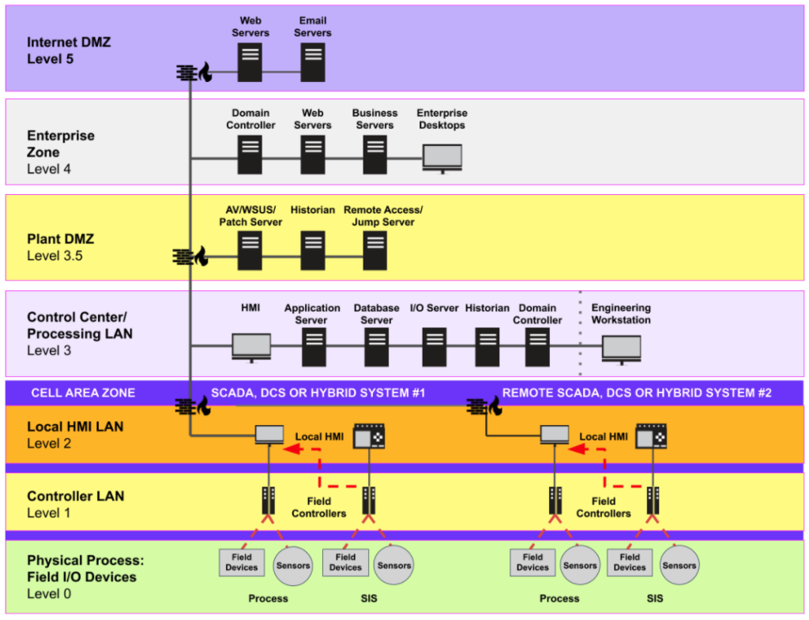
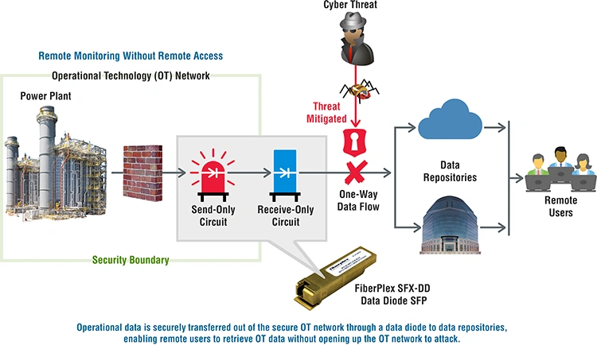

# OT/ICS Sistemleri, Purdue Modeli ve Güvenli IT/OT Entegrasyonu

Operasyonel Teknoloji (OT) ve Endüstriyel Kontrol Sistemleri (ICS/EKS), fiziksel dünyayı doğrudan yöneten siber-fiziksel sistemlerdir. SCADA, PLC, RTU, DCS ve Emniyet Enstrümanlı Sistemler (SIS); enerji, su, imalat ve ulaştırma gibi kritik altyapılarda üretim sürekliliğini ve insan güvenliğini sağlar. Bir SOC analisti için temel ayrım şudur: IT'de saldırı veri kaybına yol açarken, OT'de saldırı türbin patlamasına, şebeke kesintisine veya zehirli gaz salımına — yani can kaybına ve fiziksel yıkıma — dönüşebilir.

Bu bölüm; NIST SP 800-82 Rev. 3, IEC 62443, CIS Controls, ISO/IEC 27001, MITRE ATT&CK for ICS ve Türkiye mevzuatı (KVKK, 5651, BİGR, EPDK) çerçevesinde Purdue segmentasyonu, IT/OT izolasyonu, veri diyotları, endüstriyel protokoller ve güvenli uzaktan erişimi savunma derinliği perspektifinden ele alır.

---

## §12.1.1. OT/ICS Karakteristiği ve CIA Üçgeninin Tersine Dönmesi

Klasik IT güvenliğinde önceliklendirme **Confidentiality > Integrity > Availability** (Gizlilik > Bütünlük > Erişilebilirlik) şeklindedir. Bir bankada müşteri verisinin sızması felakettir; sistemin birkaç dakika yavaşlaması tolere edilebilir.

OT dünyasında hiyerarşi tam tersine döner: **Availability > Integrity > Confidentiality** (AIC). Bir doğal gaz kompresör istasyonunun PLC'si milisaniye hassasiyetinde çalışır; kontrol döngüsü 100 ms gecikirse fiziksel süreç kontrolden çıkabilir. NIST SP 800-82 Rev. 3 bu farkı sonuç-temelli (consequence-based) risk kategorizasyonu olarak tanımlar ve erişilebilirlik etkisini gizlilik/bütünlükten ayrı değerlendirmeyi önerir.

| Boyut | IT Ortamı | OT/ICS Ortamı |
| :---- | :---- | :---- |
| **Birincil öncelik** | Gizlilik (C) | Erişilebilirlik (A) ve emniyet (Safety) |
| **Kesinti toleransı** | Planlı bakım pencereleri kabul edilir | 7/24/365; duruş milyonlarca TL kayıp veya fiziksel risk |
| **Yama yönetimi** | Aylık Patch Tuesday | Üretici sertifikasyonu + planlı duruş (yılda 1–2 kez) |
| **Olay müdahalesi** | Enfekte sistem anında izole edilir | İzolasyon operasyon ekibiyle koordine edilmeden verilemez |
| **Sistem ömrü** | 3–5 yıl | 15–25 yıl (legacy OS, şifrelemesiz protokoller) |

Bu paradigma farkının mimari sonuçları derindir:

- **Yama yönetimi:** IT'de "hemen yama yap"; OT'de "üretimi durdurmadan, üreticinin sertifikasyonunu bekleyerek yama yap."
- **Antivirüs/EDR:** IT endpoint'inde şüpheli süreç anında sonlandırılır; SCADA sunucusunda aynı agresif müdahale kontrol döngüsünü bozarak tehlikeli proses sapmasına yol açabilir.
- **Olay müdahalesi:** IT'de enfekte sistem anında izole edilir; OT'de izolasyon kararı operasyon personeliyle koordine edilmeden verilemez.

> [!NOTE]
> OT güvenlik kontrolleri "önce zarar verme" (first, do no harm) ilkesi etrafında tasarlanmalıdır. Aktif zafiyet taraması (Nmap, Nessus) eski PLC'leri çökertebilir; pasif izleme ve katı segmentasyon birincil savunma hattıdır.

### IT ve OT Varlık Karşılaştırması

| Bileşen | Rol | Tipik Protokoller | Güvenlik Zafiyeti |
| :---- | :---- | :---- | :---- |
| **PLC** | Temel kontrol (Seviye 1) | Modbus, S7comm, EtherNet/IP | Kimlik doğrulama yok, sınırlı CPU |
| **RTU** | Uzak saha kontrolü | DNP3, IEC-104 | Secure Authentication çoğu sahada kapalı |
| **HMI/SCADA** | Operatör arayüzü (Seviye 2) | OPC DA/UA, Modbus TCP | Windows tabanlı; IT tehditleri sıçrar |
| **Historian** | Proses veri arşivi (Seviye 3) | OPC, SQL | Tescilli format; forensik zorluğu |
| **SIS** | Emniyet kesmesi | Tescilli (TriStation vb.) | BPCS'den bağımsız olmalı (IEC 61511) |

---

## §12.1.2. Purdue Kurumsal Referans Mimarisi (PERA)

Purdue modeli (Purdue Enterprise Reference Architecture, PERA), 1990'larda Theodore J. Williams ve Purdue Üniversitesi konsorsiyumu tarafından bilgisayar-entegre üretim (CIM) veri akışlarını tanımlamak için geliştirildi. ISA-99/IEC 62443 bunu **bölgeler (zones)** ve **kanallar (conduits)** kavramına genişletti.


*Purdue Enterprise Reference Architecture — Seviye 0'dan 5'e hiyerarşik segmentasyon*

### Katman Tanımları

| Seviye | Bölge | Bileşenler | Birincil Risk |
| :---- | :---- | :---- | :---- |
| **Seviye 0** | Fiziksel süreç | Sensörler, aktüatörler, motorlar, valfler | Fiziksel sabotaj, sinyal bozma |
| **Seviye 1** | Temel kontrol | PLC, RTU, IED | Kimlik doğrulama eksikliği, firmware enjeksiyonu |
| **Seviye 2** | Süpervizör kontrol | HMI, SCADA, mühendislik iş istasyonları | OS zafiyetleri, USB zararlıları, lateral movement |
| **Seviye 3** | Saha operasyonları | MES, Historian, alarm sunucuları | IT kaynaklı malware'in OT'ye ilk sızışı |
| **Seviye 3.5** | Endüstriyel DMZ (iDMZ) | Jump host, proxy, Historian replikası, patch staging | Sınır güvenlik duvarı sızıntıları |
| **Seviye 4** | İş lojistiği | ERP, üretim planlama, kurumsal DB | Kurumsal kimlik bilgisi çalınması |
| **Seviye 5** | Kurumsal ağ | İnternet, e-posta, Active Directory | Phishing, fidye yazılımı, dış APT |

**Segmentasyon mantığı:** Veri ve komutlar yalnızca **dikey ve bitişik katmanlar arasında** akmalıdır — Seviye 5'ten doğrudan Seviye 0'a atlamamalıdır. Seviye 3'ten Seviye 4'e Historian verisi (salt okunur) akar; tersi yasaktır.


*Claroty kaynaklı detaylı Purdue diyagramı — hücre/alan zonları ve SIS entegrasyonu*

### IEC 62443 Zone & Conduit Genişletmesi

Purdue katı hiyerarşi sunarken, IEC 62443 bağlama göre uyarlanabilir **Zone & Conduit** modeli getirir:

- **Zone:** Benzer güvenlik gereksinimine sahip varlık grupları
- **Conduit:** Zone'lar arası kontrollü iletişim yolları (firewall, data diode, jump host)
- **Hedef Güvenlik Seviyesi (SL-T 0–4):** Risk değerlendirmesine göre belirlenir

| SL-T | Tehdit Profili | Örnek Kontroller |
| :---- | :---- | :---- |
| **SL 1** | Meraklı, sıradan saldırgan | Varsayılan parola değişimi, temel segmentasyon |
| **SL 2** | Düşük kaynaklı bilinçli saldırgan | iDMZ, MFA, merkezi loglama |
| **SL 3** | Orta kaynaklı sistematik saldırgan | DPI, pasif IDS, sanal yama |
| **SL 4** | Yüksek kaynaklı sofistike saldırgan | Data diode, 7/24 SOC, yıllık sızma testi |

> [!WARNING]
> Modern IIoT ve doğrudan-bulut veri akışı saf Purdue modelini zorlamaktadır. Sektör bunu "Purdue 2.0" olarak adlandırır — model referans çerçeve olarak korunur, Zero Trust mikro-segmentasyon ve kimlik-temelli erişim kontrolleriyle desteklenir. CISA/NCSC-UK ortak OT bağlanabilirlik rehberi (Ocak 2026), OT ortamıyla tüm bağlantıların OT içinden başlatılan giden (outbound) bağlantılar olması gerektiğini açıkça belirtir.

### Operasyonel Boşluk Riski

Purdue segmentasyonu olmadığında IT ağındaki fidye yazılımı (NotPetya, 2017) yatay olarak OT'ye yayılır. iDMZ ve katmanlar arası firewall'lar saldırının blast radius'unu (etki yarıçapını) sınırlar.

---

## §12.1.3. IT/OT İzolasyonu: Air-Gapping ve Veri Diyotları

**Air-gapping**, OT ağının fiziksel olarak IT/internet bağlantısı olmaması demektir. Stuxnet air-gap'in mutlak güvenlik olmadığını kanıtladı: enfekte USB sürücü hava boşluğunu insan eliyle aştı. IIoT çağında saf air-gap çoğu tesiste sürdürülemez.

**Modern yaklaşım:** iDMZ + Unidirectional Gateway (Veri Diyodu)

Veri diyodu, **donanım seviyesinde tek yönlü** veri akışı sağlar. Fiziksel olarak geri dönüş imkânsızdır: gönderen tarafta optik verici (LED/lazer), alıcı tarafta fotodiyot bulunur; ters yönde verici/alıcı çifti yoktur.

```
[ Yüksek Güvenlikli Bölge (OT) ]              [ Düşük Güvenlikli Bölge (IT) ]
 ┌──────────────────────────┐                  ┌──────────────────────────┐
 │  Kaynak (Historian/SCADA)│                  │   Hedef (SIEM/ERP/BI)    │
 └────────────┬─────────────┘                  └────────────▲─────────────┘
              │ TCP Oturumu (Yerel Sonlandırma)              │
              ▼                                              │
 ┌──────────────────────────┐                  ┌────────────┴─────────────┐
 │ Gönderici Vekil Sunucu   │                  │ Alıcı Vekil Sunucu       │
 └────────────┬─────────────┘                  └────────────▲─────────────┘
              │         DONANIMSAL VERİ DİYOTU (Optik)     │
              │  ┌─────────────────┐    Fiber    ┌─────────┴────────┐
              └──┤ TX (Yalnızca LED)├───────────►│ RX (Yalnızca Sensör)│
                 └─────────────────┘              └────────────────────┘
```

**Protokol kırılması (Protocol Break):** TCP/IP çift yönlü ACK gerektirir; data diode geri dönüş hattını kestiği için vekil sunucular TCP oturumunu her iki uçta ayrı sonlandırır ve veriyi UDP veya tescilli tek yönlü formata dönüştürür.

| Özellik | Çift Yönlü Firewall | Donanımsal Veri Diyotu |
| :---- | :---- | :---- |
| **Akış yönü** | Yazılımsal kurallarla kısıtlanır | Donanımsal/optik olarak tek yönlü |
| **Enforcement** | ACL, yazılım algoritmaları | Fizik yasaları (ışık kaynağı/alıcı ayrımı) |
| **Saldırı yüzeyi** | Hatalı kural, yazılım açığı | Sıfır geri dönüş; IT'den OT'ye trafik imkansız |
| **Kullanım** | İki yönlü kontrollü geçiş | Historian → SIEM, log → analitik (OT → IT) |

**Kullanım senaryoları:** Historian verisinin kurumsal raporlamaya aktarılması, SIEM'e log gönderimi, nükleer/enerji santrallerinde emniyet bölgelerinin korunması.

> [!CAUTION]
> Data diode fiziksel erişimi veya içeriden tehdidi (insider) engelleyemez — bütüncül bir programın parçası olmalıdır. Gerçek zamanlı kontrol komutları için uygun değildir; yalnızca izleme/veri çıkışı içindir.

---

## §12.1.4. Endüstriyel Protokoller: Zafiyetler ve Savunma

Endüstriyel protokoller güvenilirlik ve verimlilik önceliğiyle tasarlanmıştır; siber güvenlik tasarım döneminde öncelik değildi.

### Protokol Zafiyet Matrisi

| Protokol | Port | Kimlik Doğrulama | Şifreleme | Kritik Risk |
| :---- | :---- | :---- | :---- | :---- |
| **Modbus TCP** | 502 | Yok | Yok | Herkes coil/register yazabilir (FC 05/06/16) |
| **DNP3** | 20000 | SA çoğu sahada kapalı | Opsiyonel (SAv6) | CROB ile kesici açma/kapama |
| **IEC-104** | 2404 | Yok | Yok | Industroyer'ın hedef protokolü |
| **IEC 61850/GOOSE** | — | Yok | Yok | Milisaniye hassasiyetinde şifrelenmemiş |
| **S7comm** | 102 | Zayıf | Yok | Program upload/download, Stuxnet vektörü |
| **OPC UA** | 4840 | Sertifika tabanlı (opsiyonel) | TLS (opsiyonel) | %51+ internete açık sunucu anonim erişime izin veriyor |
| **Profinet** | EtherType 0x8892 | Yok (DCP) | Yok | Cihaz adı/IP değiştirme, AR koparma |

**2015 Ukrayna elektrik şebekesi saldırısı** somut örnektir: saldırganlar RTU'lara meşru DNP3 komutları göndererek devre kesicileri açtı; protokol kimlik doğrulaması olmadan komutları yerine getirdi.

### Derin Paket İncelemesi (DPI) ve Suricata Kuralları

Standart stateful firewall port 502'deki tüm trafiğe izin verir; yetkili HMI ile saldırganın yazma komutunu ayırt edemez.

```bash
# Suricata — Yetkisiz Modbus yazma komutlarını engelle
drop tcp !$ENGINEERING_STATION any -> $PLC_IPS 502 (
  msg:"OT-DPI: Yetkisiz Modbus Yazma Girisimi";
  flow:established,to_server;
  modbus: access write;
  classtype:policy-violation;
  sid:1100001; rev:1;
)

# Kritik register alanına yazma engeli (Holding Register >= 100)
drop tcp $SCADA_SERVERS any -> $PLC_IPS 502 (
  msg:"OT-DPI: Kritik Holding Register Alanina Yetkisiz Yazma";
  flow:established,to_server;
  modbus: access write holding, address >=100;
  classtype:bad-unknown;
  sid:1100002; rev:1;
)
```

### Wazuh SIEM Entegrasyonu — OT Alarm Örneği

```xml
<!-- /var/ossec/etc/rules/local_rules.xml -->
<group name="ics,modbus,ot,">
  <rule id="100200" level="12">
    <if_sid>86601</if_sid>
    <field name="alert.signature">Modbus</field>
    <description>OT alarmi: Suricata yetkisiz/anormal Modbus fonksiyon kodu tespit etti.</description>
    <mitre>
      <id>T0855</id>
    </mitre>
  </rule>
</group>
```

**Örnek SIEM log çıktısı (Modbus anomali):**

```json
{
  "timestamp": "2026-06-20T14:23:45.123Z",
  "protocol": "Modbus/TCP",
  "src_ip": "192.168.10.45",
  "dst_ip": "192.168.20.100",
  "function_code": 15,
  "address": 100,
  "alert": "ANOMALY: Unauthorized write command from non-OT subnet",
  "severity": "CRITICAL",
  "mitre_technique": "T0831"
}
```

---

## §12.1.5. Güvenli Uzaktan Erişim Mimarisi

SANS 2025 raporuna göre ICS/OT olaylarının yarısı uzaktan erişim yoluyla başlamaktadır. Colonial Pipeline (2021), MFA'sız eski bir VPN profili üzerinden ele geçirildi; 2015 Ukrayna saldırısı çalınan kimlik bilgileriyle SCADA'ya erişimle gerçekleşti.

**Asla doğrudan VPN/RDP ile OT'ye bağlanmayın.** Önerilen mimari:

```
Uzaktaki Kullanıcı → MFA (FIDO2/TOTP) → Kurumsal VPN → OT Erişim Portalı
    → iDMZ Jump Host (oturum kaydı) → (Sadece yetkili protokoller) → OT Ağı (Seviye 2-3)
```

| Kontrol | Açıklama | Standart Eşlemesi |
| :---- | :---- | :---- |
| **MFA** | Her uzak oturumda zorunlu | NIST SP 800-53 IA-2, CIS Control 6 |
| **PAM** | Oturum kaydı, zaman-sınırlı erişim, JIT yetki | IEC 62443 SR 1.1 |
| **Jump Host** | iDMZ'de sıkılaştırılmış broker; dual-homed yasak | BİGR EKS güvenliği |
| **RBAC** | Yalnızca ihtiyaç duyulan PLC/IP ve süre | Zero Trust least privilege |
| **Legacy VPN imhası** | Kullanılmayan profiller derhal kaldırılmalı | Colonial Pipeline dersi |

> [!WARNING]
> Jump host olarak yapılandırılan sunucuların hem IT hem OT ağlarına bağlı iki NIC'e (dual-homed) sahip olması kesinlikle yasaktır. Bu, güvenlik duvarlarını baypas ederek sistemi doğrudan köprü haline getirir.

---

## §12.1.6. Uluslararası Standartlar ve Türkiye Mevzuatı

### Standart Eşleştirmesi

| Standart | Kapsam | OT ile İlişkisi |
| :---- | :---- | :---- |
| **IEC 62443** | IACS güvenliği | Zone & Conduit, SL 1–4, yaşam döngüsü |
| **NIST SP 800-82 Rev. 3** | OT güvenlik rehberi | Segmentasyon, izleme, IR uyarlaması |
| **ISO/IEC 27001:2022** | BGYS | OT sistemlerini kapsayacak şekilde uyarlanır |
| **ISO/IEC 27019** | Enerji sektörü | ISO 27001'in elektrik/gaz/su uyarlaması |
| **CIS Controls v8** | Önceliklendirilmiş kontroller | Varlık envanteri, ağ izleme, erişim kontrolü |
| **MITRE ATT&CK for ICS** | OT tehdit taksonomisi | T0822, T0883, T0855, T0831 |

### Türkiye Yasal Bağlamı

| Mevzuat | OT Yükümlülüğü |
| :---- | :---- |
| **BİGR (Cumhurbaşkanlığı Genelgesi 2019/12)** | EKS internete kapalı; zorunlu hallerde firewall, tünelleme, MFA |
| **EPDK Siber Güvenlik Yetkinlik Modeli (RG 32213)** | Enerji sektörü EKS için Seviye 1/2/3 kontroller; yıllık denetim |
| **5651 sayılı Kanun** | Logların 6 ay–2 yıl saklanması; zaman damgası zorunluluğu |
| **KVKK (6698)** | Operatör logları, erişim kayıtları, CCTV → kişisel veri; 72 saat ihlal bildirimi |
| **BDDK** | Bankacılık OT bileşenleri (enerji yönetimi, ATM altyapısı) için sızma testi/log |

**5651–KVKK çelişki yönetimi:** 5651 "en az 6 ay sakla" derken KVKK "amacı kalmayan veriyi sil" der. Çözüm: 5651 logları yasal süre dolunca güvenli silme ile imha edilir; 5651 kapsamı KVKK m.5/2-a ve m.5/2-ç kapsamına girer.

---

## §12.1.7. MITRE ATT&CK for ICS ve Saldırı-Savunma Dengesi

### İlgili Teknikler (Bölüm 12.1)

| Taktik | Teknik | Karşı Önlem |
| :---- | :---- | :---- |
| Initial Access | T0822 External Remote Services | MFA, PAM, legacy VPN imhası |
| Initial Access | T0883 Internet Accessible Device | Shodan taraması, port kapatma |
| Initial Access | T0847 Removable Media | USB kontrolü, uygulama beyaz listesi |
| Lateral Movement | Zone atlama | iDMZ, Purdue segmentasyonu |
| Impact | T0831 Manipulation of Control | Pasif IDS, DPI, baseline anomali |

### Senaryo: Spear-Phishing → PLC Manipülasyonu

**Saldırı (ofansif):**
1. OT mühendisine spear-phishing → Level 3 iş istasyonu ele geçirilir
2. Mühendislik yazılımı üzerinden PLC'ye zararlı logic yüklenir
3. Üretimde ani duruş veya güvensiz durum oluşur

**Savunma (defansif):**
1. E-posta gateway + XDR ile ilk erişim engellenir
2. İş istasyonunda uygulama beyaz listesi + davranış analizi
3. Pasif ağ izleme: Modbus write anomaly → SOC alarmı
4. PLC'de signed firmware + logic CRC kontrolü
5. Veri diyodu: IT'den OT'ye ters trafik imkansız
6. Olay müdahale: "process safety first" — graceful shutdown

---

## §12.1.8. Mimari Tavsiyeler ve Özet

Purdue Modeli OT ağlarını yapılandırmak için mükemmel bir **referans haritası** sunar; tek başına yeterli değildir. IEC 62443 Zone & Conduit ile risk bazlı uyarlanmalı, veri diyotları ve iDMZ ile tek yönlü veri akışı zorunlu hale getirilmelidir.

**Uygulama yol haritası (0–12 ay):**

| Aşama | Eylem | Eşik |
| :---- | :---- | :---- |
| **0–3 ay** | Pasif varlık keşfi; Purdue boşluk analizi | Seviye 0–3 varlıklarının %80+ envantere alınması |
| **3–6 ay** | iDMZ tasarımı; varsayılan parola değişimi | IT→OT doğrudan bağlantı sayısı = 0 |
| **6–12 ay** | Data diode (kritik akışlar); MFA + PAM + jump host | Tüm uzak erişimde MFA %100 |
| **Sürekli** | OT telemetrisi SIEM entegrasyonu; yıllık tabletop | Yetkisiz engineering komutu tespit kuralı aktif |

Endüstriyel protokoller varsayılan olarak güvensizdir; pasif+aktif izleme ve anomali tespiti şarttır. Uzaktan erişim her zaman broker'lı, MFA'lı ve kayıtlı olmalıdır. Bu mimari; kullanılabilirlik önceliğini korurken saldırı yüzeyini minimize eder, lateral movement'ı engeller ve hem uluslararası standartlara hem Türkiye kritik altyapı mevzuatına uyumu sağlar.