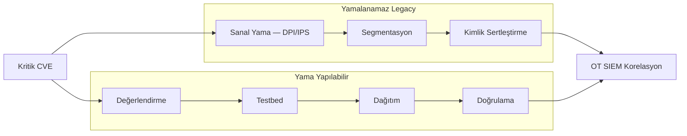
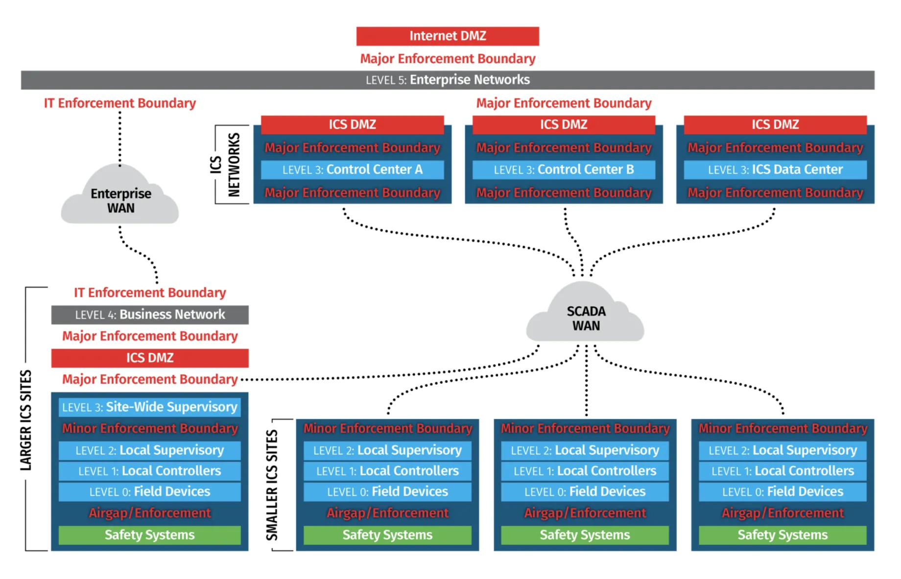

# OT Dünyasında Sıkılaştırma (OT Hardening) ve Zafiyet Yönetimi

Operasyonel Teknoloji (OT) ortamlarında güvenlik sıkılaştırması, IT sistemlerinden köklü bir anlayış farkıyla ele alınmalıdır: OT'de **Erişilebilirlik (Availability)** ve **emniyet (Safety)** her şeyin üzerindedir. Bir üretim hattının durması veya bir enerji santralinin devre dışı kalması doğrudan finansal kayıp, ekipman hasarı ve insan güvenliği riski doğurur. Bu nedenle OT sıkılaştırma yaklaşımı, operasyonları kesintiye uğratmadan risk azaltmayı merkeze alır.

Bu bölüm; NIST SP 800-82 Rev. 3, IEC 62443-2-3, CIS Controls, MITRE ATT&CK for ICS ve Türkiye mevzuatı (BİGR, EPDK, 5651, KVKK) çerçevesinde yama yönetimi paradoksu, sanal yama, endüstriyel servis sıkılaştırma ve zafiyet yönetimi yaşam döngüsünü savunma derinliği perspektifinden inceler. Purdue segmentasyonu ve IT/OT ayrımı **§12.1** bölümünde; pasif izleme ve anomali tespiti **§12.3** bölümünde ele alınır.

:::note
**IEC 62443-2-3** (Patch Management in IACS), OT yama sürecini dört aşamada tanımlar: *değerlendirme* (zafiyet etkisi + üretim riski), *test* (üretici onaylı laboratuvar ortamı), *dağıtım* (bakım penceresi + geri alma planı), *doğrulama* (fonksiyonel test + güvenlik logları). NIST SP 800-82 Rev. 3 bu döngüyü **CM-3/CM-4** (Configuration Change Control / Impact Analysis) kontrolleriyle eşler. SOC ekipleri, yama öncesi ve sonrası OT IDS/SIEM korelasyonunu bu aşamalara bağlamalıdır.
:::



<details>
<summary>Air-gap yama dağıtım prosedürü (BİGR uyumlu)</summary>

1. Vendor portalından yama indirilir (izole IT istasyonu). 2. **SHA-256** hash doğrulaması. 3. Antivirüs/sandbox taraması (iDMZ staging). 4. Güvenli taşınabilir medya ile sahaya aktarım. 5. Planlı bakım penceresinde uygulama + rollback prosedürü. BİGR, yama dosyalarının bütünlük kontrolü yapılmadan OT ağına aktarılmasını yasaklar; EPDK kapsamında yamalanamayan her kritik bileşen için **Risk Kabul Kararı** ve **Kompanse Edici Güvenlik Tedbiri Protokolü** zorunludur.

</details>

---

## §12.2.1. Yama Yönetimi Paradoksu ve Uptime Önceliği

Klasik IT'de aylık "Patch Tuesday" döngüsü standarttır. OT'de bu model çöker, çünkü üretim kesintisine neden olan bir güvenlik düzeltmesi, düzeltmeyi amaçladığı zafiyetten daha büyük zarar doğurabilir.

### OT Yama Yönetiminin Temel Zorlukları

| Zorluk | Açıklama | Operasyonel Sonuç |
| :---- | :---- | :---- |
| **Uptime zorunluluğu** | Rafineri, enerji santrali, su tesisi 7/24 çalışır | Yeniden başlatma gerektiren yama = milyonlarca TL kayıp |
| **Üretici sertifikasyonu** | Siemens, Schneider, Rockwell yamayı kendi test ortamında doğrular | Onaysız yama → garanti ve SIL sertifikasyonu geçersiz |
| **Gizli bağımlılıklar** | OPC, lisans sunucuları, zaman senkronizasyonu | IT ekibi bağımlılıkları haritalamadan yama uygularsa üretimde öğrenir |
| **Test ortamı eksikliği** | Fabrikanın dijital ikizi pahalı veya yok | Yama etkisi simüle edilemez |
| **Legacy sistemler** | 15–25 yıl sahada kalan PLC/RTU | Yama yok; destek sona ermiş OS/firmware |
| **Bakım pencereleri** | Yılda 1–2 planlı duruş (turnaround) | CVE beklemez; pencere sınırlı |

NERC CIP-007, yüksek etkili sistemlerde yama değerlendirmesinde 35 günlük belgelenmiş zaman çizelgesine izin vererek bu gerçeği kabul eder. Sonuç: OT'de zafiyet yönetimi "her şeyi zamanında yamalamayacağınızı kabul etmekle" başlar.

### Risk-Temelli Yama Stratejisi

Olgun OT kuruluşları "her şeyi yamala" yaklaşımının ötesine geçmiştir. Etkili risk-temelli yama stratejisi şu adımları içerir:

1. **Önceliklendirme:** Uzaktan erişim noktaları, mühendislik iş istasyonları (EWS), OT sunucuları önce yamalanır.
2. **Telafi edici kontroller:** Yama mümkün olana kadar segmentasyon, uygulama beyaz listeleme, en az ayrıcalık ve anormal denetleyici yazmaları için izleme.
3. **Mühendislik bağlamı:** CVSS puanları tek başına yeterli değildir; tehdit vektörü, operasyonel kritiklik ve kesinti süresi etkisi birlikte değerlendirilir.

:::note
IEC 62443 Annex B.3.2, aktif taramanın kırılgan cihazları rahatsız edebileceğini vurgular. Zafiyet keşfinde pasif ağ izleme birincil yöntem olmalı; aktif sorgular yalnızca bakım penceresinde ve rate-limit ile yapılmalıdır.
:::

---

## §12.2.2. Sanal Yama (Virtual Patching) ile Legacy Sistemlerin Korunması

Sanal yama, zafiyeti varlığın içinde düzeltmek yerine o zafiyetin istismar edilmesini ağ katmanında engelleyen telafi edici kontroldür. Yamalanamayan eski PLC, RTU ve HMI'lar için ideal koruma mekanizmasıdır.


*IEC 62443 Zone & Conduit — sanal yama ve firewall'ların konumlandırılacağı sınır noktaları*

### Çalışma Mekanizması

Sanal yama, inline veya bump-in-the-wire modda konuşlandırılan endüstriyel güvenlik duvarı/IPS cihazının **Derin Paket İncelemesi (DPI)** ile exploit trafiğini tespit edip engellemesine dayanır:

- **Sıfır duruş süresi:** Korunan cihaz yeniden başlatılmaz; üretim kesintisiz devam eder.
- **Zero-day köprüsü:** Üretici yaması beklenirken geçici koruma sağlar.
- **Legacy yaşam ömrü uzatma:** Windows XP/7 veya desteklenmeyen firmware'li HMI'lar koruma kalkanı arkasında çalıştırılabilir.

| Boyut | Geleneksel Yama | Sanal Yama |
| :---- | :---- | :---- |
| Sistemde değişiklik | Evet | Hayır |
| Kesinti riski | Yüksek | Yok |
| Eski sistem desteği | Sınırlı | Tam |
| Uygulama süresi | Haftalar–aylar | Anında |
| Koruma süresi | Kalıcı | Politika/imza bazlı |

IEC 62443-2-3 Madde 4.3, yama yapılamayan IACS cihazları için alternatif azaltım kontrollerinin uygulanmasını açıkça tanır: güvenlik duvarı/IPS seviyesinde sanal yama, RBAC, eski bölge izolasyonu, OT-protokolü farkında pasif izleme.

:::caution
Sanal yama kalıcı çözüm değildir; yama yapmayı değiştirmez, boşlukları doldurur. Eskimiş IPS imza veritabanı koruma sağlamaz; imza güncellemeleri otomatikleştirilmeli ve kritik CVE kapsamı düzenli izlenmelidir.
:::

### Mimari Konumlandırma

Sanal yamalar Purdue Seviye 1–2 (PLC/RTU – HMI) arasına veya IEC 62443 zone sınırına yerleştirilir:

- **Fortinet FortiGate Rugged + FortiIPS:** FortiGuard OT threat intelligence ile CVE'ye özel IPS imzaları.
- **TXOne EdgeIPS:** Transparent deployment; mevcut kablolamayı bozmadan OT-protokol filtreleme.
- **Palo Alto Networks:** Guided Virtual Patching; cihaz keşfi sonrası tek tıkla compensating control kuralı.


*Defense-in-Depth — fiziksel, ağ, host, uygulama ve izleme katmanları*

---

## §12.2.3. Varsayılan Parolalar ve Endüstriyel Servis Sıkılaştırma

ICS'lerde varsayılan kimlik bilgileri kronik bir sorundur. Birçok PLC/HMI fabrika çıkışı parolalarla (`admin/admin`, `1111`, tescilli sabit parolalar) gelir; Shodan ve Censys ile internete açık binlerce ICS cihazı varsayılan kimlik bilgileriyle bulunabilir.

### Gerçek Olaylar

- **2023 Pennsylvania su tesisi:** Unitronics PLC varsayılan parola `1111` — CyberAv3ngers.
- **2021 Oldsmar Florida:** TeamViewer + zayıf kimlik doğrulama; sodyum hidroksit setpoint manipülasyonu.
- **TRITON (2017):** Triconex fiziksel anahtarı PROGRAM modunda — uzaktan kod yüklemeyi mümkün kıldı.

MITRE ATT&CK for ICS: **T0812 — Default Credentials**, **T0859 — Modify Program**.

### Sıkılaştırma Kontrol Listesi

| Kontrol | Uygulama | Standart Referansı |
| :---- | :---- | :---- |
| Varsayılan parola değişimi | Commissioning aşamasında tüm cihazlar | CIS Control 4, CISA birleşik rehber |
| Güçlü kimlik doğrulama | 16+ karakter, benzersiz, RBAC | NIST SP 800-82 IA-2 |
| OT/IT kimlik ayrımı | OT hesapları kurumsal AD'den ayrı | IEC 62443-3-3 |
| Servis kapatma (CM-7) | Telnet, HTTP, FTP, SNMPv1/v2c devre dışı | NIST SP 800-53 CM-7 |
| USB kontrolü | Fiziksel/yazılımsal kilit; Stuxnet vektörü | BİGR EKS güvenliği |
| Uygulama beyaz listeleme | HMI/EWS'de yalnızca onaylı yazılım | CIS Control 10 |
| Fiziksel anahtar | SIS/PLC anahtarı RUN modunda | TRITON dersi |
| Firmware bütünlüğü | Hash doğrulama, program imza kontrolü | Siemens CPU v2.3+ |

### Servis Sıkılaştırma Matrisi

| Eski/Zayıf Servis | Port | Risk | Güvenli Alternatif |
| :---- | :---- | :---- | :---- |
| **Telnet** | TCP 23 | Cleartext kimlik bilgisi | SSHv2 (güçlü cipher) |
| **HTTP** | TCP 80 | Yönetim paneli sniffing | HTTPS TLS 1.2+ |
| **SNMP v1/v2c** | UDP 161 | Community string açık metin | SNMPv3 (authPriv) |
| **FTP** | TCP 21 | Firmware/lojik yedeği şifresiz | SFTP/SCP |
| **UPnP** | UDP 1900 | Otomatik port açma | Tamamen kapat |

---

## §12.2.4. Vaka Analizi: Stuxnet (Natanz) — Saldırı ve Savunma Dengesi

Stuxnet (2010), İran'ın Natanz uranyum zenginleştirme tesisini hedefleyen, fiziksel hasar veren ilk siber silahtır. Tesis air-gap'liydi.

**Saldırı mantığı:**
- **Giriş:** Enfekte USB + dört Windows zero-day (LNK/MS10-046); çalınmış dijital sertifikalar.
- **Hedefleme:** Yalnızca Siemens Step7 + S7-315/S7-417 PLC + belirli frekans sürücüleri bulunduğunda aktive.
- **Sabotaj:** `s7otbxdx.dll` truva atlı versiyonla değiştirildi; OB35 kesme bloğuna kod enjekte edildi; santrifüjler periyodik olarak güvenli hızın üzerine çıkarılıp sertçe düşürüldü.
- **Gizleme:** Operatör ekranlarına sahte "normal" sensör verisi oynatıldı.

**Savunma dersleri:**
- Stuxnet-enfekte WinCC sistemi controller'ları her 5 saniyede meşru kontrol bloklarının dışındaki veriler için yokluyordu — düzgün bir NSM kurulumunda kaçırılması imkansız trafik üretiyordu.
- **Karşı kontroller:** Çıkarılabilir medya kontrolü, uygulama beyaz listeleme, PLC kod bütünlüğü doğrulama, EWS denetimi.
- **MITRE ATT&CK for ICS:** T0847 Replication Through Removable Media, T0821 Modify Controller Tasking, T0851 Rootkit, T0856 Spoof Reporting Message.

---

## §12.2.5. Somut Araç Konfigürasyonları: Fortinet, Palo Alto ve Wazuh

### FortiOS Sanal Yama Profili (Örnek)

```bash
# Sanal yama IPS profili — Legacy PLC koruma
config ips sensor
  edit "OT_PLC_Virtual_Patching"
    set comment "Legacy PLC gruplari icin sanal yama"
    set block-malicious-url enable
    config entries
      edit 1
        set action block
        set log enable
        set severity critical high
        set protocol industrial
      next
    end
  next
end

# Inline firewall kuralina baglama
config firewall policy
  edit 45
    set srcintf "port2_idmz"
    set dstintf "port3_ot_zone"
    set srcaddr "Engineering_Workstations"
    set dstaddr "Siemens_PLC_Pool"
    set service "Siemens_S7_TCP_102"
    set utm-status enable
    set ips-sensor "OT_PLC_Virtual_Patching"
    set logtraffic all
  next
end
```

### Suricata — Yetkisiz Modbus Yazma Engelleme

```text
drop tcp !$OT_ADMIN_NET any -> $OT_PLC_NET 502 (
  msg:"OT-DPI Unauthorized Modbus TCP Write Attempt";
  flow:to_server,established;
  modbus_func:6,16;
  classtype:policy-violation;
  sid:1000501; rev:1;
)
```

### Wazuh — OT DPI Log Toplama ve Korelasyon

`ossec.conf` — syslog toplama:
```xml
<ossec_config>
  <remote>
    <connection>syslog</connection>
    <port>514</port>
    <protocol>tcp</protocol>
    <allowed-ips>10.200.1.10/32</allowed-ips>
  </remote>
</ossec_config>
```

`local_decoder.xml` — DPI firewall parse:
```xml
<decoder name="ot-dpi-firewall-parent">
  <prematch>OT-DPI-FIREWALL:</prematch>
</decoder>
<decoder name="ot-dpi-firewall-fields">
  <parent>ot-dpi-firewall-parent</parent>
  <regex>action=(\w+)\s+protocol=(\w+)\s+srcip=(\d+.\d+.\d+.\d+)\s+dstip=(\d+.\d+.\d+.\d+)\s+unit_id=(\d+)\s+func_code=(\d+)\s+register=(\d+)\s+val=(\d+)</regex>
  <order>action, protocol, srcip, dstip, id, data, extra_data, system_name</order>
</decoder>
```

`local_rules.xml` — kritik OT alarm:
```xml
<group name="ot_hardening,modbus_anomaly,">
  <rule id="110052" level="12">
    <if_sid>110050</if_sid>
    <field name="action">^BLOCKED$</field>
    <field name="data">^5$|^6$|^15$|^16$</field>
    <description>CRITICAL OT: Unauthorized Modbus Write to PLC $(dstip) BLOCKED from $(srcip)</description>
    <mitre><id>T0855</id><id>T0809</id></mitre>
  </rule>
</group>
```


*Endüstriyel firewall — OT zone sınırlarında DPI ve sanal yama politikaları*

---

## §12.2.6. Zafiyet Yönetimi Yaşam Döngüsü

OT zafiyet yönetimi döngüsel bir süreçtir:

```
Varlık Keşfi → Zafiyet Tanımlama → Risk Değerlendirmesi
      ↓
Azaltım Stratejisi (Yama / Sanal Yama / Telafi) → Uygulama → Sürekli İzleme
```

### Varlık Keşfi Yaklaşımları

| Yöntem | Avantaj | Risk | Öneri |
| :---- | :---- | :---- | :---- |
| **Pasif (DPI)** | Sıfır operasyonel etki | Sessiz cihazları göremez | Birincil yöntem |
| **Kontrollü aktif** | Firmware/OS detayı | PLC çökmesi riski | Bakım penceresi + rate-limit |
| **Proje dosyası analizi** | Konfigürasyon görünürlüğü | Manuel süreç | EWS yedekleri |

### Zafiyet Önceliklendirme Kriterleri

1. **İstismar edilebilirlik:** Mevcut mimaride istismar mümkün mü?
2. **Proses kritikliği:** Etkilenen varlığın operasyonel önemi?
3. **Telafi edici kontroller:** Mevcut segmentasyon/sanal yama var mı?
4. **CVSS + EPSS:** Tek başına yeterli değil; bağlamla birlikte değerlendir.

### Sanal Yama Politikası (Mantıksal Yapı)

```yaml
virtual_patch_policy:
  asset_group: "legacy_plcs_v1"
  vulnerability_cve: ["CVE-2021-1234", "CVE-2022-5678"]
  action: "block_exploit_traffic"
  rules:
    - signature: "Modbus_Write_Excessive_Data"
      protocol: "modbus/tcp"
      direction: "inbound"
      block: true
    - signature: "CIP_Unauthorized_Programming"
      protocol: "cip"
      direction: "inbound"
      block: true
  logging:
    enabled: true
    destination: "siem_collector"
    severity: "high"
```

---

## §12.2.7. Standartlar ve Türkiye Mevzuatı

| Standart/Mevzuat | OT Hardening İlişkisi |
| :---- | :---- |
| **NIST SP 800-82 Rev. 3** | Mimari kalıplar, sıkılaştırma, yama kısıtlamaları, telafi edici kontroller |
| **IEC 62443-2-3** | Yama yönetimi süreci; yama yapılamayan cihazlar için alternatif azaltım |
| **CIS Controls v8** | Control 4 (güvenli yapılandırma), Control 10 (malware defenses) |
| **MITRE ATT&CK for ICS** | T0812 Default Credentials, T0855 Unauthorized Command Message |

### Türkiye Yasal Bağlamı

**Cumhurbaşkanlığı BİGR (Bilgi ve İletişim Güvenliği Rehberi):**
- EKS altyapıları internete kapalı tutulacak; zorunlu hallerde güvenlik duvarı, tünelleme, kimliklendirme.
- Yama dosyaları izole sandbox'ta taranıp SHA-256 doğrulaması yapıldıktan sonra güvenli medya ile offline aktarılacak.

**EPDK Enerji Sektöründe Siber Güvenlik Yetkinlik Modeli Yönetmeliği (32213, güncellemeler 2024):**
- Yama uygulanamayan her kritik bileşen için **Risk Kabul Kararı** ve **Kompanse Edici Güvenlik Tedbiri Protokolü** hazırlanmalı.
- Yılda en az bir bağımsız sızma testi; canlı OT ağında otomatize aktif tarama yasak — pasif keşif ve testbed zorunlu.

**5651 sayılı Kanun:** İnternete bağlı OT bileşenlerinin erişim logları zaman damgalı saklanmalı (en az 6 ay, en fazla 2 yıl).

**KVKK:** Operatör kimlik bilgileri, erişim logları ve CCTV kayıtları kişisel veri kapsamında; 5651 ile çelişki yönetimi — yasal süre dolunca güvenli imha.

:::danger
EPDK kapsamındaki enerji kuruluşlarında danışmanlık ve denetim hizmeti aynı firmaya verilemez; denetçi rotasyonu (üst üste 3 kez aynı firma yasak) ve KAYMUS sertifikası zorunludur.
:::

### Ofansif-Defansif Denge: Modbus ve S7comm Sömürü Analizi

Savunma derinliği mimarisinin başarısı, korunan protokollerin zayıf yönlerini anlamaktan geçer.

### Modbus TCP Saldırı Vektörleri

Modbus TCP (port 502), kimlik doğrulama ve şifreleme içermez. Saldırgan ağa eriştiğinde:

- **Yetkisiz komut enjeksiyonu:** FC06/FC16 ile coil/register manipülasyonu (Smod, SCADAShutdownTool).
- **Man-in-the-Middle:** HMI–PLC arası trafik sniffing; operatör körleştirme (blind state change).
- **DoS:** SYN flood veya malformed paket → PLC ağ modülü kilitlenmesi.

### CVE-2022-20685: IDS Kör Etme Saldırısı

Saldırganlar doğrudan PLC yerine savunma hattındaki IDS/IPS'i hedefleyebilir. Snort Modbus preprocessor'ında Write File Record (FC21) paketindeki `record_length` alanında integer overflow tetiklenirse Snort sonsuz döngüye girer ve tüm savunma hattı körleşir.

**Savunma:** Snort 3.x güncel sürüm; malformed FC21 tespit kuralı:
```text
alert tcp $EXTERNAL_NET any -> $OT_PLC_NET 502 (
  msg:"OT-EXPLOIT Modbus Preprocessor Buffer Exhaustion (CVE-2022-20685)";
  flow:to_server,established;
  content:"|15|"; depth:1; offset:7;
  byte_test:2,>,250,0,relative;
  classtype:attempted-dos;
  sid:1000502; rev:2;
)
```

### Air-Gap Ortamlarında Yama Yönetimi

Birçok kritik tesis internet bağlantısından tamamen izole çalışır. Yama dağıtımı:

1. Vendor portalından yama indirilir (izole IT istasyonu).
2. SHA-256 hash doğrulaması yapılır.
3. Antivirüs/sandbox taraması (iDMZ staging sunucusu).
4. Güvenli taşınabilir medya (tek kullanımlık USB veya optik medya) ile sahaya aktarım.
5. Planlı bakım penceresinde uygulama ve rollback prosedürü.

BİGR, yama dosyalarının güvenliği doğrulanmış izole ortamda taranıp bütünlük kontrolü yapıldıktan sonra yalnızca güvenli medya ile offline aktarılmasını zorunlu tutar.

### OT Sıkılaştırma Araç Karşılaştırması

| Araç | Tür | OT Yeteneği |
| :---- | :---- | :---- |
| **Claroty xDome** | Ticari | Pasif DPI, varlık keşfi, zafiyet eşleştirme |
| **Nozomi Guardian** | Ticari | 120+ protokol, firmware versiyon tespiti |
| **Tenable OT Security** | Ticari | Pasif + kontrollü aktif sorgu |
| **Wazuh** | Açık kaynak | HMI/EWS SCA, FIM, SIEM |
| **FortiGate Rugged** | Ticari | OT sanal yama, DPI, segmentasyon |
| **TXOne EdgeIPS** | Ticari | Transparent inline, OT-protokol filtreleme |

---

## §12.2.8. Mimari Tavsiyeler ve Özet

OT sıkılaştırma, IT'nin "yamala ve geç" kültüründen köklü bir sapmayı temsil eder. Başarılı program şu ilkelere dayanır:

**Aşama 1 — Temel (0–6 ay):**
1. Pasif varlık keşfi ve envanter (OT IDS/TAP).
2. Tüm varsayılan parolaların değiştirilmesi; kullanılmayan servislerin kapatılması.
3. Purdue/IEC 62443 boşluk analizi; iDMZ olmayan IT/OT geçişlerinin haritalanması.

**Aşama 2 — Telafi (6–18 ay):**
4. Yamalanamayan varlıklar için sanal yama + belgelenmiş risk kabul protokolü.
5. HMI/EWS uygulama beyaz listeleme; USB kontrolü; SIS ağının BPCS'den izolasyonu.
6. OT telemetrisinin SIEM'e (Wazuh) entegrasyonu; yetkisiz engineering komutları için tespit kuralları.

**Aşama 3 — Olgunluk (12–24 ay):**
7. Yıllık planlı bakım pencerelerinde risk-temelli yama programı.
8. Sanal yama + gerçek yama çift kanallı CVE takibi.
9. Yılda en az bir OT tabletop tatbikatı (Stuxnet/varsayılan parola senaryosu).

| Metrik | Hedef |
| :---- | :---- |
| Varsayılan parola oranı | %0 |
| Sanal yama kapsamı (legacy varlıklar) | %100 |
| Yama uyumluluk oranı (yamalanabilir varlıklar) | >%90 (bakım penceresi sonrası) |
| Kritik CVE için sanal yama devreye alma süresi | <24 saat |

Texas enerji sektöründeki OT yama paradoksunu özetleyen ifade tüm OT güvenliği için geçerlidir: *"Çalışır durumda tutulması en kritik olan sistemler, yama yapmaya en az gücünüzün yettiği sistemlerdir — ve saldırganlar bunu bilir."* Bu paradoksu aşmanın yolu, yamayı tek savunma hattı olmaktan çıkarıp sanal yama, segmentasyon, en az ayrıcalık, sürekli izleme ve güçlü kimlik doğrulama ile çevrelenmiş çok katmanlı savunmadır.