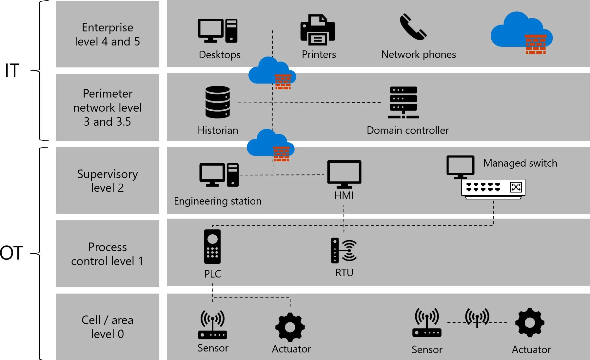
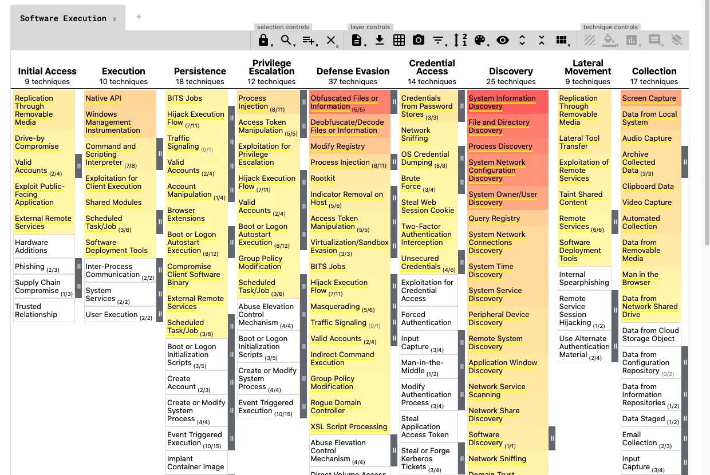

# Endüstriyel Ağlarda Tehdit İzleme, Görünürlük ve Anomali Tespiti

OT ağlarında görünürlük sağlamak, IT ağlarından çok daha hassas bir yaklaşım gerektirir. Endüstriyel protokoller standart ağ izleme araçları tarafından anlaşılmaz; aktif tarama yöntemleri ise hassas donanımları çökertebilir. Dragos'un 2026 OT Siber Güvenlik Raporu'na göre dünya genelindeki OT ağlarının %10'undan azında anlamlı bir ağ izleme çözümü bulunmaktadır.

Bu bölüm; NIST SP 800-82 Rev. 3, IEC 62443, MITRE ATT&CK for ICS, CIS Controls ve Türkiye mevzuatı (BİGR, EPDK, 5651, KVKK) çerçevesinde pasif izleme mimarisi, OT-özel IDS konuşlandırması, protokol anomali tespiti ve SIEM entegrasyonunu savunma derinliği perspektifinden ele alır.

---

## §12.3.1. Aktif Tarama Riskleri ve Pasif İzleme Zorunluluğu

IT güvenliğinde `nmap`, `Nessus` veya `OpenVAS` ile periyodik ağ taraması standarttır. OT ortamında bu yaklaşım kritik riskler barındırır.

### Aktif Taramanın OT'deki Tehlikesi

NIST SP 800-82 Rev. 3 açıkça uyarır: *"OT ağ sahipleri, hedef ağdaki cihaz hassasiyeti nedeniyle operasyonel bir ağda aktif taramaya izin verirken aşırı dikkatli olmalıdır."*

| Risk Türü | Mekanizma | Sonuç |
| :---- | :---- | :---- |
| **Protokol duyarlılığı** | Uyumsuz sorgular | PLC/RTU çökmesi, yeniden başlatma |
| **Ağ doygunluğu** | Yüksek frekanslı paket bombardımanı | Kontrol döngüsü gecikmesi, jitter |
| **IP stack kilitlenmesi** | Tampon taşması | Meşru SCADA komutlarına yanıt yok |
| **Watchdog tetiklenmesi** | CPU aşırı yük | Beklenmedik reboot |
| **WDT/SIS challenge-response** | 1–2 sn gecikme | Fail-safe shutdown (trip) |

:::caution
Canlı OT ağında otomatize aktif zafiyet taraması (Nessus, Nexpose) kesinlikle yasaktır. EPDK Sızma Testi Usul ve Esasları da bunu açıkça belirtir. Aktif sorgular yalnızca izole testbed'de veya planlı bakım penceresinde `-T0`/`-T1` rate-limit ile yapılmalıdır.
:::

### Pasif İzleme (Passive Monitoring)

OT ağ görünürlüğü için altın standart, trafiği hiçbir şekilde etkilemeyen **pasif dinleme** yaklaşımıdır:

- **SPAN Port / Port Mirroring:** Yönetilen switch üzerinde trafik bir sensöre kopyalanır. Ucuz ancak yüksek yükte paket düşürebilir.
- **Network TAP (Test Access Point):** Donanımsal, hat üzerine yerleştirilen pasif kopyalayıcı. IP adresi yok; hacklenmeye karşı bağışık; paket kaybı sıfıra yakın.
- **Zero-Impact Asset Discovery:** Pasif analiz ile cihazlar, protokoller ve bağlantılar trafiği analiz ederek haritalanır.

| Kriter | SPAN Port | Donanımsal TAP |
| :---- | :---- | :---- |
| **Maliyet** | Sıfır (mevcut switch) | Yüksek (hat başına cihaz) |
| **Paket kaybı riski** | Switch CPU yükünde frame loss | Fiziksel kopyalama; kayıp yok |
| **Güvenlik** | Switch ele geçirilirse enjeksiyon mümkün | Tek yönlü (diode-like); geri enjeksiyon imkansız |
| **Öneri** | Düşük kritiklik, test ortamı | Kritik kanallar (conduit), forensic |

### Hibrit Yaklaşım

Modern uygulama, pasif izlemenin **kontrollü aktif sorgulama** ile desteklenmesidir:

- **Pasif (her zaman aktif):** SPAN/TAP → DPI → varlık keşfi, davranış analitiği, anomali tespiti.
- **Aktif (periyodik, bakım penceresi):** Smart Polling (Nozomi), Claroty Edge — cihaz dengesini bozmadan firmware/OS detayı.

:::note
Pasif izleme sessiz/atıl cihazları veya yerel setpoint değişikliklerini göremez. Bu nedenle hibrit yaklaşım önerilir; ancak aktif sorgular asla canlı üretim döngüsünde agresif tarama ile yapılmamalıdır.
:::

---

## §12.3.2. OT-Spesifik IDS Konuşlandırması ve Purdue Mimarisi

Geleneksel Snort/Suricata tabanlı IDS, OT protokollerini anlayamaz. OT ortamları için özel çözümler ve doğru mimari konumlandırma gereklidir.


*Purdue Enterprise Reference Architecture — Seviye 0–5 hiyerarşisi ve IDS sensör yerleşimi*

### Konumlandırma Stratejisi

| Purdue Seviyesi | İzleme Odağı | Sensör Rolü |
| :---- | :---- | :---- |
| **Seviye 3–4 (OT/IT sınırı)** | Kuzey-güney trafiği | Yetkisiz erişim, yanal hareket, fidye yazılımı sıçraması |
| **Seviye 2 (SCADA/HMI LAN)** | Doğu-batı iletişimi | PLC'ler arası anormal komutlar; ana izleme noktası |
| **Seviye 3.5 (iDMZ)** | Sınır trafiği | Veri sızıntısı, jump host oturumları |
| **Remote Collector** | Uzak trafo merkezleri | Düşük kaynak tüketimi ile veri toplama |

Sensörlerin yönetim arayüzleri iDMZ'de (Seviye 3.5) konumlanır; OT'ye bakan sensör portları salt-okunur pasiftir. Merkezi yönetim ve SOC entegrasyonu IT tarafındadır. Kritik akışlarda data diode ile OT'den IT'ye tek yönlü log/meta akışı tercih edilir (IEC 62443-3-3 SR 5.2).


*Purdue katmanları — hücre/alan zonları ve kritik trafik akışları*

### OT/ICS IDS Platformları

Gartner CPS Protection Platforms Magic Quadrant (2025) liderleri: Claroty, Dragos, Microsoft, Armis, Nozomi Networks.

| Platform | Güçlü Yön | Dağıtım |
| :---- | :---- | :---- |
| **Nozomi Networks** | 120+ protokol, Guardian Air kablosuz spektrum, AI analitik | On-prem Guardian + Vantage bulut |
| **Claroty** | xDome SaaS, CTD on-prem, geniş CPS kapsamı | Hibrit |
| **Dragos** | Pasif-öncelikli, 600+ protokol, OT IR odaklı | On-prem / bulut |
| **Microsoft Defender for IoT** | Azure Sentinel entegrasyonu, IT/OT korelasyon | Bulut/hibrit |
| **Zeek + ICSNPP** | Açık kaynak, CISA destekli protokol parser'ları | Proxmox/bare-metal |


*MITRE ATT&CK for ICS Navigator — tespit use case'leri ve teknik eşleme*

### Veri Akış Mimarisi

```
OT Cihazları → TAP/SPAN → Sensör (DPI + baseline)
      ↓
Metadata + alert + PCAP snippet → SIEM/SOAR → SOC
      ↓
MITRE ATT&CK mapping + maintenance window correlation
```

---

## §12.3.3. Zeek (Bro) ve ICSNPP ile Açık Kaynak OT İzleme

Zeek, geliştirilmiş paket parse eklentileri sayesinde endüstriyel protokolleri analiz edebilir. CISA/INL tarafından geliştirilen **ICSNPP (Industrial Control Systems Network Protocol Parsers)**, Zeek'in protokol kapsamını genişletir.

Desteklenen protokoller: BACnet, BSAP, CIP, COTP, DNP3, EtherCAT, EtherNet/IP, Genisys, Modbus, OPCUA-Binary, S7comm, S7comm-Plus.

**ICSNPP Modbus kurulumu:**
```bash
git clone https://github.com/cisagov/icsnpp-modbus.git
zeek -Cr icsnpp-modbus/tests/traces/modbus_example.pcap icsnpp-modbus
# Site deployment için local.zeek:
@load icsnpp-modbus
```

ICSNPP, standart Zeek davranışının aksine ICS protokollerinde **yanıt paketlerindeki** kritik bilgiyi de loglar (`modbus_detailed.log`, `modbus_read_write.log`). Bu, originator + responder korelasyonu için hayati önem taşır.

**Örnek modbus_detailed.log çıktısı:**
```json
{
  "ts": 1718712345.012345,
  "uid": "CHz8R71n9kLp2aBc9d",
  "source_h": "192.168.10.45",
  "destination_h": "192.168.10.100",
  "func": "write_multiple_registers",
  "address": 40120,
  "quantity": 3,
  "values": ["0x03E8", "0x0000", "0x00FF"]
}
```

---

## §12.3.4. Endüstriyel Protokollerde Anormal Komut ve Anomali Tespiti

OT ağları IT'den daha **öngörülebilirdir** — cihazlar yıllarca yerinde kalır, komutlar tekrarlayıcıdır. Bu, anomali tespitini IT'ye göre kolaylaştırır; ancak protokol bilgisi şarttır.

### BT vs OT Protokol Farkları

| Özellik | BT Protokolleri | OT Protokolleri |
| :---- | :---- | :---- |
| **Amaç** | Veri transferi | Fiziksel süreç kontrolü |
| **Zamanlama** | Gecikme toleranslı | Real-time, deterministik |
| **Güvenlik** | Şifreleme, kimlik doğrulama | Genellikle yok (plaintext) |
| **Oturum** | Stateful | Genellikle stateless |

### Modbus TCP (Port 502)

**Normal:** Master (HMI) → Slave (PLC) belirli function code'lar (0x03 Read, 0x05 Write Coil) ile sınırlı register aralığı.

**Anormal (saldırı):**
- Yetkisiz IP'den Write Multiple Registers (0x10).
- Gece/mesai dışı saatte yazma komutu.
- Normalde okuma yapan sensörden yazma komutu.

**Snort 3 — protokol duyarlı kural:**
```text
alert tcp $EXTERNAL_NET any -> $HOME_NET 502 (
  msg:"SCADA Modbus Write Multiple Registers - Protocol Aware";
  flow:established,to_server;
  modbus_func:write_multiple_registers;
  classtype:protocol-command-decode;
  sid:217783; rev:2;
)
```

### DNP3 (Port 20000)

**Anormal:**
- Unsolicited response abuse (master olmadan slave konuşması).
- Cold Restart (FC 13) / Warm Restart (FC 14) flood → DoS.
- Direct Operate komutu beklenmedik kaynaktan.

**Snort kuralı — Cold Restart tespiti:**
```text
alert tcp $EXTERNAL_NET any -> $DNP3_SERVER 20000 (
  msg:"SCADA_IDS: DNP3 Cold Restart Command Detected";
  flow:established,to_server;
  content:"|05|d"; depth:2;
  content:"|0D|"; offset:12; depth:1;
  classtype:attempted-dos;
  sid:3111202; rev:1;
)
```

### IEC 60870-5-104 (Port 2404)

**Anormal:**
- Yetkisiz kesici komutları (C_SC_NA_1 single command, C_SE_NA_1 setpoint).
- ASDU tip kombinasyon anomalisi.
- Mesai dışı komut iletimi.
- Spontaneous event flood (sahte olay enjeksiyonu).

Industroyer'ın hedef protokollerinden biri IEC-104'tür; yetkisiz kesici komutlarının DPI ile izlenmesi kritik savunma hattıdır.

### PROFINET / EtherNet-IP

**Anormal:**
- DCP (Discovery and Configuration Protocol) manipülasyonu — cihaz adı/IP değişikliği.
- AR (Application Relationship) kopması sonrası yetkisiz DCP Set.
- Programlama/firmware yükleme trafiği mesai dışında.

### Anomali Tespit Metodolojileri

1. **İmza-tabanlı:** Bilinen istismarlar; Snort/Suricata kuralları.
2. **Davranışsal (baseline):** Normal iletişim matrisinden sapma; yeni master IP, anormal saat, frekans değişimi.
3. **Fiziksel proses:** Historian verisi ile ağ anomalisi korelasyonu; fiziksel olarak imkansız durumlar.

MITRE ATT&CK for ICS eşlemesi: **T0855** Unauthorized Command Message, **T0836** Modify Parameter, **T0806** Loss of Control.

---

## §12.3.5. Vaka Analizi: Industroyer/CRASHOVERRIDE (Ukrayna 2016)

Industroyer (Dragos: CRASHOVERRIDE; tehdit aktörü ELECTRUM/Sandworm), 17 Aralık 2016'da Kiev'de bir iletim trafo merkezini etkileyerek ~1 saat elektrik kesintisine yol açtı. Stuxnet'ten sonra ICS'i hedefleyen ikinci, elektrik şebekesini hedefleyen malware'dir.

**Saldırı mantığı:**
- Modüler yapı: backdoor, launcher, data wiper ve dört protokol payload'u — **IEC 60870-5-101, IEC 60870-5-104, IEC 61850 (MMS/GOOSE), OPC DA**.
- IEC-104 modülü IOA keşfi yapar, sonra "select and execute" paketleriyle kesicileri açık tutar — operatörler kapatmaya çalışsa bile.
- Wiper modülü ABB PCM600 yapılandırma dosyalarını siler.
- 2022'de **Industroyer2** (CaddyWiper ile) yine IEC-104 hedefli olarak Ukrayna elektrik sağlayıcısına karşı kullanıldı.

**Savunma dersleri:** IEC-104/IEC-61850 trafiğinin DPI ile izlenmesi, baseline davranış modellemesi, seri protokol izleme. Pasif izleme bu saldırının kesici komutlarını saniyeler içinde yakalayabilirdi.

---

## §12.3.6. Vaka Analizleri: Ukrayna 2015 ve Oldsmar 2021

### Ukrayna Elektrik Şebekesi (23 Aralık 2015)

Üç dağıtım şirketi (Kyivoblenergo, Prykarpattyaoblenergo, Chernivtsioblenergo) hedef alındı. E-ISAC/SANS raporuna göre yaklaşık 225.000 müşteri 1–6 saat elektriksiz kaldı.

- **Vektör:** BlackEnergy3 spear-phishing → 6+ ay keşif → çalınan kimlik bilgileriyle SCADA erişimi.
- **Eylem:** HMI faresinin uzaktan ele geçirilmesi; kesicilerin elle açılması; parola değiştirilmesi.
- **Yıkım:** KillDisk, seri-Ethernet dönüştürücü firmware wipe, TDoS, UPS kapatma.

**Ders:** Living-off-the-land meşru SCADA fonksiyonlarının kötüye kullanımı — özel ICS malware'i gerektirmedi. NSM araçları 6+ aylık keşif aşamasını yakalayabilirdi.

### Oldsmar Su Arıtma (5 Şubat 2021)

Bruce T. Haddock Water Treatment, Florida. Saldırgan, sodyum hidroksit (NaOH) setpoint'ini normal 100 ppm'den **11.100 ppm'e** (100 katı) yükseltti. Tesis ~15.000 müşteriye su sağlıyordu.

**Ders:** Basit setpoint manipülasyonu fiziksel sonuç doğurabilir. Baseline dışı register yazımı ve mesai dışı komut tespiti kritik.

---

## §12.3.7. Wazuh ve Suricata ile OT SIEM Entegrasyonu

Açık kaynaklı Wazuh SIEM/XDR, Suricata/Zeek'in ürettiği OT alarmlarını ingest edebilir.

**Wazuh agent — Suricata JSON log toplama:**
```xml
<ossec_config>
  <localfile>
    <log_format>json</log_format>
    <location>/var/log/suricata/eve.json</location>
  </localfile>
</ossec_config>
```

**Wazuh manager — yetkisiz Modbus fonksiyon kodu:**
```xml
<group name="ics,modbus,ot,">
  <rule id="100200" level="12">
    <if_sid>86601</if_sid>
    <field name="alert.signature">Modbus</field>
    <description>OT alarmi: Suricata yetkisiz/anormal Modbus fonksiyon kodu tespit etti.</description>
    <mitre><id>T0855</id></mitre>
  </rule>
</group>
```

**Sigma/Wazuh korelasyon mantığı:**
```
function_code IN (5,6,16,21)
AND orig_h NOT IN authorized_masters_list
AND timestamp NOT IN maintenance_window
→ high severity alert + MITRE T0836 mapping
```

### Eskalasyon Prosedürü

| Alarm Seviyesi | Triage | Eskalasyon |
| :---- | :---- | :---- |
| **Kritik (Level 12+)** | Yetkisiz yazma komutu, yeni master | SOC → OT mühendisi → tesis müdürü (15 dk) |
| **Yüksek (Level 8–11)** | Baseline dışı okuma, anormal saat | SOC → OT mühendisi (1 saat) |
| **Orta (Level 5–7)** | Yeni cihaz keşfi, protokol anomalisi | SOC triyaj (4 saat) |

OT anomali uyarıları SIEM'e iletilirken OT bağlamı (hangi PLC, hangi üretim hattı) mutlaka eklenmelidir.

---

## §12.3.8. Standartlar ve Türkiye Mevzuatı

| Standart | OT İzleme İlişkisi |
| :---- | :---- |
| **NIST SP 800-82 Rev. 3** | Pasif monitoring, behavioral anomaly detection (Appendix E) |
| **NIST SP 800-53 SI-4** | System Monitoring; OT overlay |
| **IEC 62443 SR 6.2** | Continuous monitoring |
| **CIS Controls v8** | Control 8 (audit log), Control 13 (network monitoring) |
| **ISO 27001:2022** | A.8.15 Logging, A.8.16 Monitoring |

### Türkiye Yasal Bağlamı

**BİGR:** EKS ağ trafiğinin SPAN/TAP üzerinden kesintisiz pasif analizi; veri manipülasyonunun önlenmesi.

**EPDK Yetkinlik Modeli:** Endüstriyel ağ güvenliği ve olay yönetimi kontrol maddeleri; pasif izleme altyapısı denetimde ibraz edilmeli.

**5651:** İnternete bağlı OT bileşenlerinin erişim logları zaman damgalı saklanmalı.

**KVKK:** Operatör logları ve HMI action kayıtları kişisel veri içeriyorsa ihlal bildirimi 72 saat içinde; log ekranlarında maskeleme.

| Log Türü | Saklama | Şifreleme |
| :---- | :---- | :---- |
| OT protokol logları (DPI) | 6–12 ay | Gerekli |
| Ağ trafik metadata (NetFlow) | 6–12 ay | Gerekli |
| Kimlik doğrulama logları | 2–10 yıl | Zorunlu |

### PROFINET DCP Saldırısı ve Katman 2 Anomali Tespiti

PROFINET IO, EtherType 0x8892 üzerinde milisaniye altı gecikmeyle çalışır. DCP (Discovery and Configuration Protocol) şifreleme içermez.

**3 adımlı saldırı senaryosu:**
1. **Keşif:** DCP Identify Request multicast → tüm cihazlar MAC, IP, model bilgisi döner.
2. **Port Stealing:** Gratuitous ARP flood ile switch MAC tablosu manipülasyonu → AR bağlantısı kopar.
3. **Hijacking:** DCP Set ile cihaz adı değiştirilir → PLC kayıp cihazı bulamaz → hat durur.

Geleneksel IP tabanlı IDS bu Katman 2 saldırılarını göremez. **POET (PROFINET Operations Enumeration and Tracking)** gibi FSM tabanlı motorlar, cihaz durum geçişlerini izler; aktif AR haberleşmesi sırasında yetkisiz DCP Set komutu anında alarm üretir.

### DNP3 Autoencoder Tabanlı Anomali Tespiti

Kural tabanlı imzaları atlatmak için saldırganlar fonksiyon kodlarını meşru zaman aralıklarında ancak anormal sıralamalarla gönderebilir. **FC-AE-IDS (Function Code Autoencoder IDS)** modeli, TCP oturumu boyunca DNP3 fonksiyon kodu frekans dağılımlarını öğrenir; reconstruction error eşik değerini aştığında imzasız saldırı alarmı üretir.

### Operasyonel Senaryo: Otomotiv Fabrikası

Level 2 PROFINET trafiği izleyen sensör, gece 03:00'te yeni bir "unknown" cihazın (sahte HMI gibi davranan laptop) PLC'lerle iletişim kurduğunu tespit eder:

1. OT IDS alert + asset risk skoru yükselir.
2. SOC, badge access logu ile korele eder (yetkisiz personel).
3. SOAR playbook ilgili portu quarantine eder.
4. Saha mühendisi fiziksel doğrulama yapar.

Bu senaryo pasif izlemenin IT loglarıyla korelasyonunun değerini gösterir.

### Kontrollü Aktif Tarama Prosedürü (Bakım Penceresi)

Aktif sorgu zorunlu olduğunda:

1. RSTP halka topolojileri ve legacy cihazlar haritalanır.
2. SIS ve acil durdurma mekanizmaları tarama dışı bırakılır.
3. Nmap `-T0` veya `-T1`; paralel thread kapatılır; cihaz başına rate-limit.
4. Komutlar önce testbed'de validate edilir.

---

## §12.3.9. Mimari Tavsiyeler ve Özet

Endüstriyel ağlarda tehdit izleme, klasik BT güvenlik yaklaşımlarından temelde farklı bir felsefe gerektirir.

**Uygulama Yol Haritası:**

**Aşama 1 — Görünürlük (0–6 ay):**
1. Purdue/IEC 62443 segmentasyon doğrulaması.
2. Kritik zonlarda SPAN/TAP + OT sensörü (learning modu 2–4 hafta).
3. Pasif varlık envanteri; %95+ Seviye 0–3 kapsama hedefi.

**Aşama 2 — Tespit (6–12 ay):**
4. Baseline doğrulama; false positive tuning.
5. SIEM/SOAR entegrasyonu + MITRE ATT&CK mapping.
6. OT-spesifik playbook'lar (maintenance window correlation).

**Aşama 3 — Olgunluk (12–24 ay):**
7. Hibrit izleme (kontrollü aktif sorgulama, bakım penceresi).
8. Fiziksel proses korelasyonu (Historian + ağ anomalisi).
9. Yıllık purple team egzersizi (Industroyer/Modbus senaryosu).

| Metrik | Hedef |
| :---- | :---- |
| MTTD (kritik OT alarm) | <5 dakika |
| Pasif envanter kapsamı | >%95 |
| False positive oranı (tune sonrası) | <%5 |
| Log retention uyumluluğu | 5651/BİGR tam |

OT'de "görmediğin şeyi koruyamazsın" ilkesi burada somutlaşır: Pasif, protokol-aware, behavioral izleme olmadan ne asset envanteri ne de anlamlı anomali tespiti mümkündür. Bu yaklaşım NIST, IEC 62443 ve Türkiye kritik altyapı regülasyonlarıyla uyumlu, operasyonel olarak güvenli ve ölçeklenebilir bir temel oluşturur.