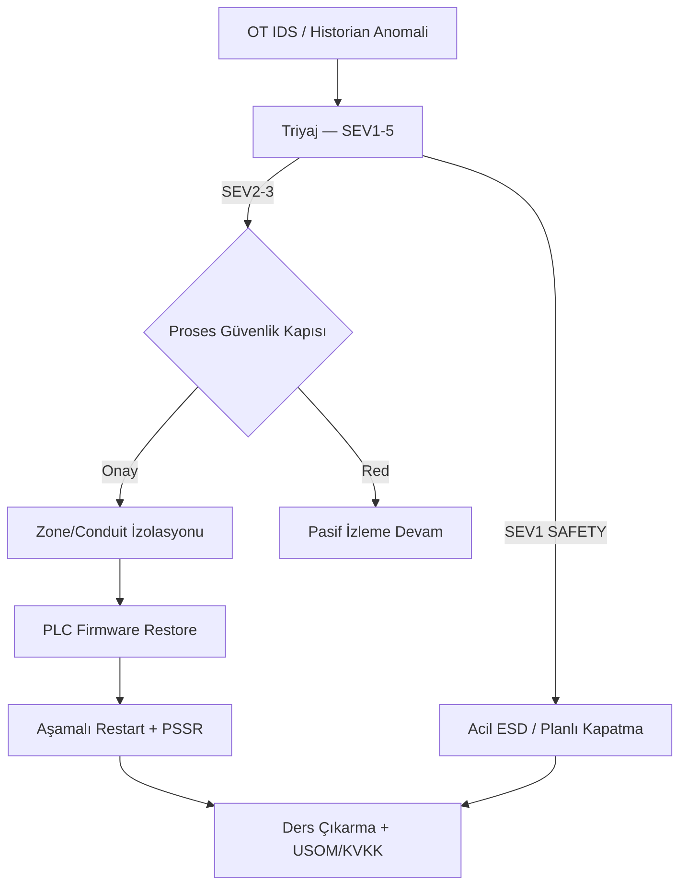
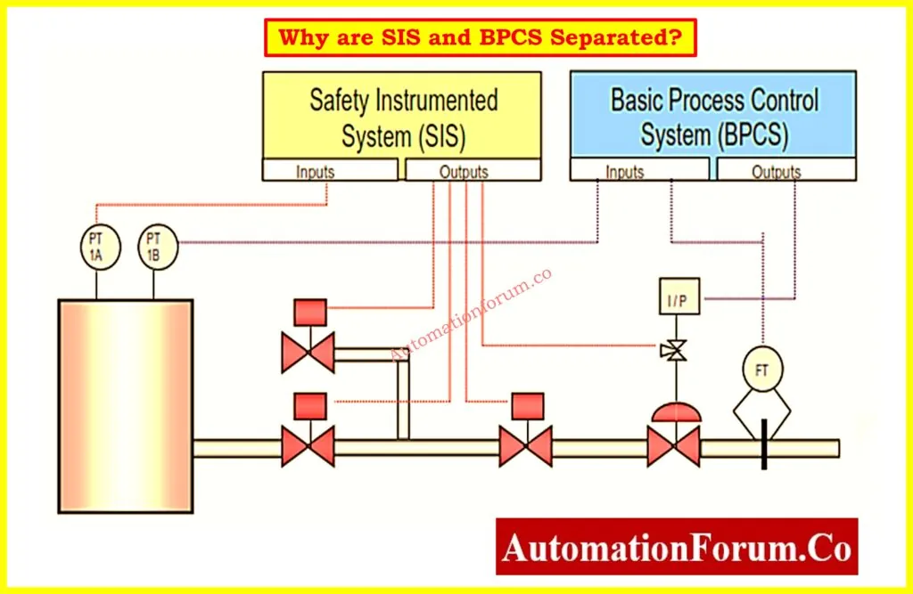
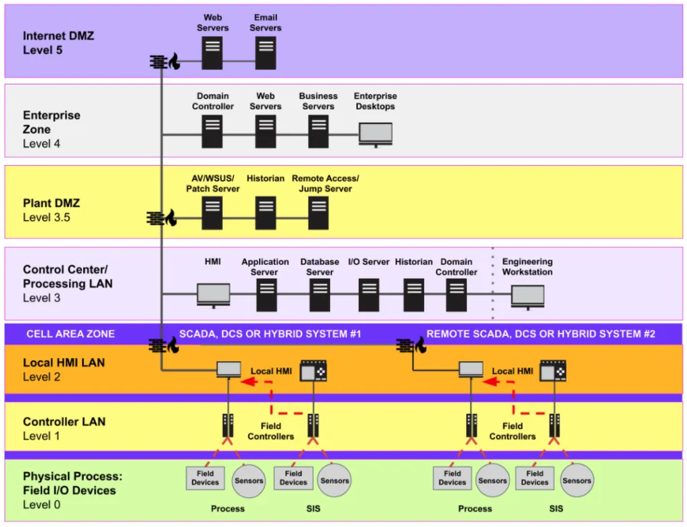
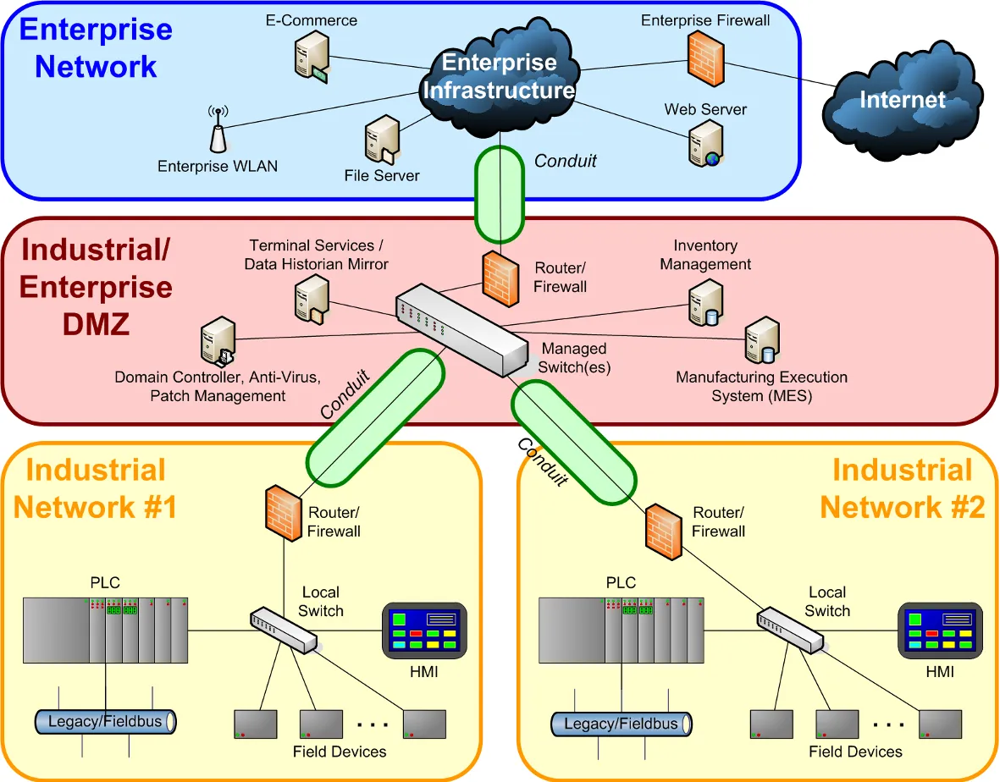

# OT Sahasında Olay Müdahale (ICS Incident Response) ve Siber-Fiziksel Güvenlik

OT/ICS ortamlarında bir siber olay yalnızca veri kaybı veya sistem kesintisi anlamına gelmez; üretim duruşu, ekipman hasarı, çevre kirliliği ve insan can güvenliği tehdidi gibi fiziksel sonuçlar doğurabilir. NIST SP 800-82 Rev. 3, ICS için siber güvenlik kaygısının IT'den farklı olarak **güvenli bir sürecin sağlanması** üzerinde olduğunu vurgular.

Bu bölüm; NIST SP 800-61 Rev. 3, NIST SP 800-82 Rev. 3, IEC 62443, IEC 61511, SANS Beş Kritik Kontrol, MITRE ATT&CK for ICS ve Türkiye mevzuatı (5651, KVKK, BİGR, EPDK) çerçevesinde tripping kriterleri, OT playbook'ları, ICS forensics ve siber-fiziksel güvenliği savunma derinliği perspektifinden inceler. IT tarafı olay müdahale yaşam döngüsü (PICERL, delil zinciri) [§14.4 Olay Müdahale](../14-operasyonel-guvenlik/04-olay-mudahale-ve-kriz-yonetimi/) bölümünde; OT tehdit izleme altyapısı **§12.3** bölümünde detaylandırılır.

:::caution
**IEC 61511** (Functional Safety) kapsamındaki SIS/ESD sistemlerinde siber olay müdahalesi, IT IR playbook'larından ayrı tutulmalıdır. Yanlış tripping veya SIS bypass, siber riskten daha büyük fiziksel emniyet riski doğurur. OT IR kararlarında *Process Safety Engineer* ve *Operations Manager* onayı zorunludur.
:::



<details>
<summary>OT vs IT olay müdahale — karar yetkisi matrisi</summary>

| Karar | IT IR | OT IR |
| :---- | :---- | :---- |
| Anında izolasyon | SOC L2 yetkili | Tesis müdürü + proses mühendisi onayı |
| Trip/ESD | Uygulanmaz | SIS bağımsızlığı korunur; tek SOC analisti trip veremez |
| Forensics önceliği | Bellek/disk imajı | Historian + PCAP + vendor tool |
| Kurtarma | Hızlı restore | Phased restart + 4 saat izole test + PSSR |

NIST SP 800-82 Rev. 3: *"Güvenli operasyonu sürdürmek/geri kazanmak, diğer tüm müdahale hedeflerinin üzerindedir."*

</details>

---

## §12.4.1. Üretimin Fiziksel Durdurulması (Tripping) Kriterleri ve Emniyet Sistemleri

**Safety Instrumented System (SIS):** NIST SP 800-82 tanımıyla, önceden belirlenmiş koşullar ihlal edildiğinde prosesi güvenli duruma getiren sensörler, mantık çözücüler ve son kontrol elemanlarından oluşan sistem. Eş anlamlılar: Emergency Shutdown System (ESD/ESS), safety interlock system.

### Kritik Mimari İlke

IEC 61511 ve ISA S84.01'e göre SIS, **temel proses kontrol sisteminden (BPCS) fiziksel ve mantıksal olarak bağımsız** olmalıdır. SIS'in tetiklenmesi (trip) için dışarıdan kontrol veya sensör girdisine bağımlılık olmamalıdır. SIS "son savunma hattıdır" — nükleer reaktörün otomatik SCRAM'ı, rafineride aşırı basınçta otomatik kapatma gibi.


*SIS (Emniyet Enstrümanlı Sistem) ile BPCS (Temel Proses Kontrol Sistemi) bağımsızlığı — IEC 61511*


*Purdue katmanları — olay müdahale playbook'ları seviye bazında özelleştirilmelidir*

### Tripping Kararının İkili Riski

OT olay müdahalesinin en zor kararıdır:

1. **Devam etme riski:** Saldırgan kontrolü ele geçirmişse, çalışmaya devam fiziksel felakete yol açabilir.
2. **Durdurma riski:** Gereksiz kapatma üretim kaybı, ekipman stresi ve kontrolsüz duruş riski yaratır.

Karar her zaman **proses mühendisleri + emniyet mühendisleri + siber güvenlik ekibi** ortak kararıdır; SOC analisti tek başına trip kararı veremez.

### Siber-Fiziksel Trip Karar Matrisi

| Sistem Durumu | Siber Göstergeler | Fiziksel Parametre | Eylem | Trip? |
| :---- | :---- | :---- | :---- | :---- |
| **Normal** | Yetkisiz erişim denemeleri | Nominal sınırlar içinde | Segment izolasyonu, IP bloklama | Hayır |
| **Anormal çalışma** | Yetkisiz PLC kod yükleme | Açıklanamayan dalgalanmalar | Anahtar RUN moduna, pasif izleme aktif | Sadece manuel |
| **Kontrol kaybı** | HMI donması, DoS, sahte veri | Setpoint emniyet sınırına tırmanış | Ada modu, manuel vana kontrolü | Evet (lokal) |
| **Emniyet kaybı** | SIS bellek yazma (TRITON benzeri) | Kritik limit aşımı + SIS yanıt yok | Tam izolasyon, ESD butonu | Evet (acil genel) |

:::caution
SIS bütünlüğü herhangi bir şekilde sorgulanıyorsa (TRITON senaryosu), emniyet fonksiyonuna güvenilemez → kontrollü, planlı kapatma öncelikli. Tek SOC analisti kararıyla değil, ortak karar mekanizmasıyla.
:::

### Saldırgan Perspektifi: İki Strateji

1. **Yanlış Trip (Denial of Production):** SIS'in gereksiz devreye girmesini sağlayarak üretim duruşu.
2. **Trip Blokajı (Loss of Safety):** Gerçek tehlike anında trip komutunun engellenmesi — can güvenliği riski.

---

## §12.4.2. Vaka Analizi: TRITON/TRISIS (Suudi Petrokimya, 2017)

TRITON (TRISIS/HatMan), Schneider Electric **Triconex** SIS'i hedefleyen, **bir emniyet sistemini hedefleyen ilk malware'dir** — doğrudan can güvenliğini hedef alan bir Rubicon'u geçti.

**Saldırı mantığı:**
- **Giriş:** Spear-phishing → IT → OT (Mimikatz/PsExec) → Triconex engineering iş istasyonu ele geçirildi.
- **Hedef:** Tescilli **TriStation protokolü (UDP 1502)** tersine mühendislikle çözüldü. Firmware zero-day ile ayrıcalık yükseltildi; `trilog.exe` taklidi ile `inject.bin` ve `imain.bin` payload'ları PLC belleğine enjekte edildi.
- **Kritik zafiyet:** Triconex fiziksel anahtarı **PROGRAM** modunda (RUN değil) — uzaktan kod yüklemeyi mümkün kıldı.
- **Sonuç:** TRITON kodundaki hata, Triconex denetleyicilerinin anomali tespit edip tesisi **otomatik güvenli duruma** geçirmesine neden oldu. Bu duruş saldırıyı açığa çıkardı.

**Savunma dersleri:**
- SIS ağını BPCS'den izole etme; fiziksel anahtarı RUN'da tutma.
- TriStation trafiğinin pasif izlenmesi (UDP/1502).
- Transient cihazları (laptop) SIS ağından uzak tutma; antivirüs alarmlarını ciddiye alma.
- **MITRE ATT&CK for ICS:** T0821 Modify Controller Tasking, T0868 Detect Operating Mode, T0889 Modify Program.

---

## §12.4.3. OT Olay Müdahale Playbook'ları ve SANS Beş Kritik Kontrol

NIST SP 800-61 IT için tasarlanmıştır; OT'ye uyarlanması gerekir. NIST SP 800-82 Rev. 3: **güvenli operasyonu sürdürmek/geri kazanmak, diğer tüm müdahale hedeflerinin üzerindedir.**

### IT vs OT IR Karşılaştırması

| Boyut | IT Incident Response | OT/ICS Incident Response |
| :---- | :---- | :---- |
| **Öncelik** | Confidentiality > Integrity > Availability | **Safety > Availability > Integrity** |
| **Containment** | Hızlıca izole et | İzolasyon proses etkisi değerlendirilerek |
| **Forensics** | Bellek/disk imajı | Volatile PLC RAM sınırlı; vendor tool + PCAP |
| **Recovery** | Hızlı restore | Phased restart + PSSR zorunlu |
| **Karar** | Security/IT Lead | **Joint** — Ops/Safety veto hakkı |
| **Ekip** | SOC, IT, Hukuk | SOC, IT, OT mühendis, saha, EHS |

### SANS Beş Kritik Kontrol (Robert M. Lee & Tim Conway)

Her ICS/OT siber güvenlik stratejisinin temelini oluşturan beş kontrol:

1. **ICS Incident Response Plan** — OT olay müdahale planı
2. **Defensible Architecture** — Savunulabilir mimari (Purdue + Zone/Conduit)
3. **ICS Network Visibility & Monitoring** — Ağ görünürlüğü ve izleme
4. **Secure Remote Access** — Güvenli uzaktan erişim (MFA, PAM, jump host)
5. **Risk-Based Vulnerability Management** — Risk-temelli zafiyet yönetimi

Whitepaper, IT güvenlik çerçevelerinde rehberliğin ortalama %60–95'inin önleyici nitelikte olduğuna dikkat çeker; kurumlar tespit/müdahale/kurtarmaya kaynaklarının yalnızca ~%5'ini ayırabilmektedir. Lee'nin gözlemi: çerçeve "ICS olay müdahalesi ile başlayıp diğer kontrolleri ondan geriye doğru türetmek" üzerine kuruludur.


*IEC 62443 Zone & Conduit — containment sırasında izole edilecek sınır noktaları*

### PICERL Tabanlı OT Playbook Yapısı

```
Hazırlık → Tespit → [Güvenlik Kapısı: Onay] → Sınırlandırma → Arındırma → Kurtarma → Ders Çıkarma
```

| PICERL Aşaması | OT-Spesifik Aksiyon | Emniyet Kapısı |
| :---- | :---- | :---- |
| **1. Hazırlık** | Golden Image PLC hash yedekleri; OT varlık envanteri (SIS etiketi) | Yılda ≥1 ortak IT/OT tabletop |
| **2. Tespit** | OT NDR anomali + Historian fiziksel korelasyon | False positive eliminasyonu |
| **3. Sınırlandırma** | Zone/conduit izolasyonu; EWS download yetkisi kaldırma | **Tesis müdürü onayı** olmadan PLC ağ kesintisi yok |
| **4. Arındırma** | PLC firmware restore; HMI reimage (KAPE + Wazuh) | Anahtar PROGRAM → yükleme → RUN kilitleme |
| **5. Kurtarma** | Aşamalı restart; sensör kalibrasyonu | 4 saat izole çalışma testi + PSSR |
| **6. Ders Çıkarma** | RCA; playbook güncelleme; USOM/KVKK bildirimi | 72 saat yasal süre |

### OT Şiddet Taksonomisi

| Seviye | Kod | Açıklama | Müdahale Süresi |
| :---- | :---- | :---- | :---- |
| **SEV1** | SAFETY | SIS tehlikeye girmesi | Anında (0–15 dk) |
| **SEV2** | PROCESS | Aktif proses manipülasyonu | Acil (15–60 dk) |
| **SEV3** | ACCESS | Yetkisiz OT erişimi | Yüksek (1–4 saat) |
| **SEV4** | RECON | OT ağında keşif | Orta (4–24 saat) |
| **SEV5** | IT-SPILLOVER | IT ihlalinin OT'ye sıçrama potansiyeli | Düşük (24+ saat) |

### Playbook Klasör Yapısı (Örnek)

```
OT_Incident_Response_Playbook/
├── 01_Preparation/
│   ├── OT_Asset_Inventory.xlsx
│   ├── Known_Good_Backups/
│   └── Role_Definition_Matrix.md
├── 02_Identification/
│   ├── OT_Severity_Taxonomy.yaml
│   └── Escalation_Procedures.md
├── 03_Containment/
│   ├── Safe_Cyber_Position_Checklist.md
│   └── Manual_Override_Procedures.md
├── 04_Eradication/
│   └── PLC_Firmware_Restore_Procedure.md
├── 05_Recovery/
│   ├── Gradual_System_Restore_Checklist.md
│   └── Production_Restart_Approval_Matrix.md
└── 06_Lessons_Learned/
    └── Post_Incident_Review_Template.md
```

:::danger
Containment (izolasyon): IT'deki "anında izole et" OT'de tehlikeli olabilir. Yanlış isolation kontrol döngüsünü bozarak proses sapmasına yol açabilir. İzolasyon proses üzerindeki etkisi değerlendirilerek, operasyon ekibiyle koordine yapılmalıdır.
:::

### İletişim Zinciri ve Eskalasyon

OT olayında bilgilendirme sırası net tanımlanmalıdır:

```
OT IDS Alarmı → SOC L1 Triyaj (5 dk)
    → SOC L2 + OT Mühendisi (SEV3+)
    → Tesis İşletme Müdürü (SEV2+)
    → CISO / Kurumsal KRİT (SEV1)
    → USOM/SOME bildirimi (yasal süre içinde)
```

**Tabletop egzersiz senaryoları (yılda ≥1):**
- IT fidye yazılımının OT'ye sıçraması (Colonial benzeri).
- SIS hedefli saldırı (TRITON benzeri).
- Uzaktan setpoint manipülasyonu (Oldsmar benzeri).
- İçeriden tehdit — mühendislik istasyonu compromise.

Her tatbikat sonrası playbook güncellenir; PHA/HAZOP revizyonu değerlendirilir.

### IDMZ Firewall — Modbus Read-Only Politikası (Örnek)

```bash
config firewall policy
  edit 101
    set name "IDMZ-to-OT_Modbus-ReadOnly"
    set srcintf "port3-idmz"
    set dstintf "port4-ot-zone"
    set srcaddr "SCADA-Server-IP"
    set dstaddr "PLC-Segment-Subnet"
    set service "MODBUS-TCP"
    set utm-status enable
    set ips-sensor "Industrial-DPI-Sensor"
  next
end
```

Bu politika, yetkisiz IP'lerden gelen FC06/FC16 yazma komutlarını IPS katmanında bloke eder.

---

## §12.4.4. Vaka Analizi: Colonial Pipeline (2021) — Proaktif OT Kapatma

7 Mayıs 2021'de DarkSide fidye yazılımı grubu Colonial Pipeline'ın **IT/kurumsal (faturalama) ağını** vurdu. OT/boru hattı doğrudan ele geçirilmedi.

- **Giriş vektörü:** MFA'sız, artık kullanılmayan legacy VPN profili; parola muhtemelen dark web sızıntısından (CEO Joseph Blount, Senato ifadesi, 8 Haziran 2021).
- **Karar:** Operasyon süpervizörü, saldırının OT ağına geçmesini önlemek için **proaktif kapatma** kararı verdi. 5.500 mil boru hattı (~%45 ABD Doğu Kıyısı yakıt arzı) kapatıldı.
- **Sonuç:** ~6 günlük kapanma; ~4,4 milyon USD fidye ödendi (ABD Adalet Bakanlığı ~%84'ünü geri aldı).

**Ders:** IT/OT segmentasyonu eksikliği ve zayıf IT hijyeni (MFA'sız legacy VPN) OT operasyonlarını dolaylı olarak durdurabilir. Sağlam segmentasyon olsaydı kapatma bu kadar geniş kapsamlı olmayabilirdi. CISA AA21-131a uyarısı yayınlandı.

---

## §12.4.5. ICS Forensics: Historian, PLC CPU ve SCADA Log Analizi

OT forensik'i IT forensik'inden temelde farklı ve zordur. Standart IT araçları (Volatility, EnCase) PLC'lerin tescilli yapısı ve sınırlı log kapasitesi nedeniyle yetersiz kalır.

### Edinme Zorlukları (Order of Volatility)

1. **Önce uçucu:** Bellek içeriği, anlık register değerleri, ağ trafiği (PCAP).
2. **Sonra kalıcı:** Disk imajları (HMI/EWS/Historian), controller logları, SCADA sistem logları.

| Kaynak | Analiz Edilen Veri | Tespit Edilen Saldırı |
| :---- | :---- | :---- |
| **Historian** | Zaman serisi tag, setpoint değişiklikleri | Setpoint manipülasyonu, Man-in-the-Middle gizleme |
| **PLC CPU** | RAM dump, OB/FB kod blokları, firmware hash | Bellek enjeksiyonu (TRITON), logic değişikliği |
| **SCADA/HMI** | Alarm geçmişi, operator action, audit trail | Alarm suppression, yetkisiz operator action |
| **Ağ (PCAP)** | Modbus/DNP3/IEC-104 protokol başlıkları | Yetkisiz fonksiyon kodu, lateral movement |

### Historian Log Analizi

Historian (AVEVA PI, OSIsoft), proses değerlerini yüksek frekansta kaydeder. Stuxnet gibi saldırılarda HMI sahte veri gösterse bile Historian arka planda gerçek PLC verisini kaydetmeye devam eder.

**Örnek adli sorgu (PI System / SQL):**
```sql
SELECT
    t.Timestamp,
    t.Tagname,
    t.Value AS CurrentValue,
    t.OldValue,
    u.UserName,
    u.ClientIP
FROM HistorianDB.dbo.TagLog t
JOIN HistorianDB.dbo.UserActivityLog u ON t.TransactionID = u.TransactionID
WHERE
    t.Tagname IN ('TIC101.SP', 'PIC202.SP', 'LIC303.SP')
    AND t.Timestamp BETWEEN '2026-06-01 00:00:00' AND '2026-06-02 23:59:59'
    AND (t.Value != t.OldValue OR u.ClientIP NOT IN ('192.168.10.5', '192.168.10.6'))
ORDER BY t.Timestamp DESC;
```

Analiz odakları:
- Saldırı öncesi/sırası/sonrası proses değerleri (sıcaklık, basınç, vana pozisyonu).
- Komut ile sensör geri bildirimi arasındaki zaman tutarsızlıkları.
- Yetkilendirilmiş SCADA segmenti dışından gelen setpoint değişiklikleri.

### PLC CPU ve Bellek Forensics

| Yöntem | Açıklama | Avantaj | Dezavantaj |
| :---- | :---- | :---- | :---- |
| **JTAG** | Doğrudan bellek okuması | En kapsamlı veri | Fiziksel erişim; sistem kapatma gerekebilir |
| **ISP** | Sistem çalışırken bellek okuma | Kesintisiz | Kısıtlı veri |
| **Ağ trafiği** | Kontrol mantığının PCAP'ten çıkarımı | Uzaktan | Tüm mantığı yakalayamayabilir |
| **Vendor tool** | TIA Portal online/offline karşılaştırma | Program hash, block version | Tescilli araç bağımlılığı |

**Forensik araçlar:** Wireshark + ICS dissector'ları, Zeek/ICSNPP, FTK Imager, Microsoft ICSpector (açık kaynak PLC tarama), KAPE (HMI artifact collection).

### SCADA Log Analizi

- **Kullanıcı aktivite logları:** HMI'da manuel müdahaleler, tag yazma işlemleri.
- **Alarm geçmişi:** Alarm suppression (T0878), alarm flood pattern'leri.
- **Windows Event Log (HMI/EWS):** Logon/logoff, process creation, USB bağlantısı.
- **VPN/uzaktan erişim logları:** Son 30 günde kim, ne zaman, nereden bağlandı?

### Chain of Custody (Delil Zinciri)

- Bellek dökümleri forensik olarak sağlam medyada saklanmalı, hash'lenmeli.
- Zaman damgalı tutanaklarla belgelenmeli; NTP tutarsızlıkları timeline analizini zorlaştırır.
- Tüm kritik sistemlerde merkezi log toplama (syslog/CEF → SIEM) olay öncesinde yapılandırılmış olmalıdır.

:::note
Hollanda'da bir rüzgar türbini yangınında (2013, iki teknisyen öldü) yalpa kafesindeki elektronik yandı; yalnızca kule tabanındaki zemin denetleyicisi sağlam kaldı. Soruşturma PLC uçucu belleğine kritik bağımlıydı; denetleyici güç verilmeden çıkarılarak veri kaybı önlendi.
:::

---

## §12.4.6. Türkiye Yasal ve Düzenleyici Bağlamı

OT/ICS ortamlarında çalışan SOC/forensik ekiplerinin Türkiye'ye özgü yükümlülükleri:

### 5651 Sayılı Kanun

Trafik bilgilerinin (logların) en az 6 ay, en fazla 2 yıl süreyle zaman damgalı (TÜBİTAK KamuSM) olarak saklanmasını zorunlu kılar. Zaman damgası vurulmayan loglar mahkemede manipüle edilebilir sayılır ve delil vasfını kaybeder.

### KVKK (6698)

- Fiziksel erişim kontrol, CCTV, operatör logları ve uzaktan erişim oturum kayıtları kişisel veri kapsamındadır.
- **İhlal bildirimi:** Veri sorumluları en geç 72 saat içinde KVKK Kurulu'na bildirmelidir.
- **Çelişki yönetimi:** 5651 "en az 6 ay sakla" derken KVKK "amacı kalmayan veriyi sil" der. Çözüm: 5651 logları yasal süre dolunca güvenli imha; KVKK m.5/2-a ve m.5/2-ç kapsamında açık rıza gerektirmez.

### BİGR (Bilgi ve İletişim Güvenliği Rehberi)

- Endüstriyel kontrol sistemleri internete kapalı tutulacak.
- Kritik veriler internetten yalıtılmış ağda; üç seviyeli tedbir planı ve yılda en az bir denetim.

### EPDK Enerji Sektöründe Siber Güvenlik Yetkinlik Modeli

- 13 ana kontrol maddesi; Black-Start ve TEİAŞ SCADA/EMS iletişimi kapsama alındı.
- Olay yönetimi ve süreklilik başlıkları; bağımsız sızma testi yılda en az bir kez.
- Danışmanlık ve denetim aynı firmaya verilemez; denetçi KAYMUS sertifikası zorunlu.

### BDDK/Finans

Bankacılık kritik altyapı sayılır; bilgi sistemleri yönetmelikleri ATM/ödeme altyapısı gibi siber-fiziksel bileşenleri kapsar.

---

### Gelişmiş ICS Forensics: PEM, COMA ve Entegre Timeline

### PEM (PLC Memory Extractor)

PEM, PLC çalışmasını durdurmadan uçucu RAM içeriğini uzaktan çekmeyi amaçlar:

1. **Bellek haritalama:** RAM/ROM/I/O register adres aralıkları belirlenir.
2. **Boş alan tespiti:** Proses mantığını bozmayacak metadata bölgeleri bulunur.
3. **Duplicator enjeksiyonu:** Scan cycle'ı aşmayan küçük kopyalama kodu eklenir.
4. **Uzaktan okuma:** Modbus/S7Comm üzerinden RAM dump yeniden yapılandırılır.

### COMA (Computer Vision PLC Forensics)

Ham PLC bellek dump'ı byte-to-RGB dönüşümüyle 2D görüntü matrisine çevrilir. Mask R-CNN/U-Net modeli belleği "Çalıştırılabilir Kod", "Veri Blokları" ve "Meta Veriler" olarak segmente eder; enjekte edilmiş shellcode görsel olarak tespit edilir.

### Entegre Forensics Timeline

En iyi pratik: **Passive OT NDR** + **centralized logging** (Historian + Wazuh + SIEM) + **vendor IR desteği**.

```
Olay Tespiti (SIEM/IDS/Operatör)
    ↓
Ön Değerlendirme (SEV1-SAFETY → Acil)
    ↓
Kanıt Toplama (Historian yedek, PCAP, HMI imaj, PLC bellek)
    ↓
Adli Analiz (Historian + PLC + Ağ + Log korelasyonu)
    ↓
Raporlama (NIST SP 800-86 uyumlu) + Yasal bildirim
```

### Stuxnet ve Ukrayna 2015 — Olay Müdahale Dersleri

**Stuxnet (2010):** Pasif ağ izleme, WinCC'nin 5 saniyede bir anormal controller polling trafiğini yakalardı. Rootkit HMI'da sahte veri gösterirken Historian gerçek değerleri kaydetti — cross-source korelasyon kritik.

**Ukrayna 2015:** Living-off-the-land saldırı; 6+ ay keşif. Olay müdahale dersi: MFA'lı uzaktan erişim, segmentasyon ve HMI komut anomali tespiti. KillDisk ve firmware wipe sonrası recovery aylar sürdü — golden image ve offline yedek zorunluluğu.

### Güvenli Siber Pozisyon (Safe Cyber Position)

SANS rehberi, güvenliği önceliklendiren, sınırlama ve tehdit temizliğini mümkün kılan test edilmiş konfigürasyon durumunu tanımlar:

1. Fiziksel proses güvenli durumda (basınç, sıcaklık, akış güvenli aralıkta).
2. OT ağının kritik segmentleri izole.
3. PLC programları known-good durumda.
4. Tüm OT varlıkları kritiklik bazında sınıflandırılmış.

### Wazuh — OT Forensics Korelasyon Kuralı

```xml
<group name="industrial,ics_anomaly,">
  <rule id="100501" level="12">
    <if_sid>1002</if_sid>
    <field name="srcip">!192.168.10.0/24</field>
    <field name="destport">502</field>
    <match>MODBUS_WRITE_COMMAND_DETECTED</match>
    <description>CRITICAL: Unauthorized Modbus Write from external segment</description>
    <mitre><id>T0855</id></mitre>
  </rule>
</group>
```

---

## §12.4.7. Mimari Tavsiyeler ve Özet

OT'de olay müdahale, klasik siber güvenlikten ziyade **siber-fiziksel risk yönetimi** disiplinidir. Başarılı program ancak Process Safety ile Cybersecurity ekiplerinin entegre çalışmasıyla mümkündür.

**Uygulama Yol Haritası:**

**Aşama 1 — Hazırlık (0–6 ay):**
1. OT varlık envanteri + safety criticality sınıflandırması.
2. Golden image / known-good PLC program yedekleri + hash.
3. OT IR playbook taslağı (PICERL + SEV taksonomisi); proses/emniyet mühendisleriyle imzalı.

**Aşama 2 — Tespit ve Müdahale (6–18 ay):**
4. OT NDR + Historian anomali korelasyonu.
5. SIEM entegrasyonu; yetkisiz engineering komutları için tespit kuralları.
6. Yılda en az bir ortak IT/OT tabletop (fidye yazılımı + SIS senaryosu).

**Aşama 3 — Olgunluk (18–24 ay):**
7. PHA/HAZOP'a siber senaryolar entegrasyonu.
8. PSSR sürecine siber doğrulama adımları.
9. USOM/SOME bildirim prosedürleri; 5651/KVKK uyumlu log retention.

| Metrik | Hedef |
| :---- | :---- |
| SEV1 müdahale süresi | <15 dakika |
| Playbook kapsamı (kritik senaryolar) | %100 |
| Golden image güncellik | <30 gün |
| Tabletop sıklığı | Yılda ≥1 |

Stuxnet'ten Colonial Pipeline'a, TRITON'dan Ukrayna 2015'e kadar her vaka aynı dersi verir: OT'de güvenlik (security) ile emniyet (safety) ayrılmaz biçimde iç içedir. Savunma derinliği, tek bir kontrolün değil, katmanlı ve fiziksel-süreç-farkında bir mimarinin sonucudur. Her mimari karar bu ikisini birlikte gözetmelidir.