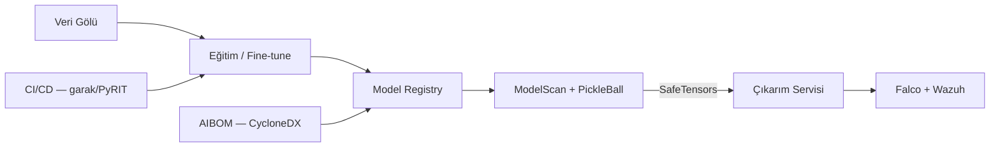

# Makine Öğrenmesi Operasyonlarında Güvenlik (SecMLOps / AI DevSecOps)

Kurumsal yapay zeka sistemleri; veri gölü, eğitim kümesi, ön-eğitimli model, fine-tuning pipeline'ı, model kayıt defteri ve çıkarım servisi gibi birbirine bağlı bileşenlerden oluşan geniş bir **tedarik zinciri** üzerinde çalışır. Geleneksel DevSecOps, statik kod analizi ve bağımlılık taramasıyla yazılım güvenliğini sağlarken; makine öğrenmesi operasyonları (MLOps) **opak model ağırlıkları**, **yürütülebilir serileştirme formatları** ve **dinamik veri kümeleri** nedeniyle benzersiz saldırı yüzeyleri sunar. Bir `.pkl` dosyası, `torch.load()` çağrısıyla yüklendiğinde doğrudan uzaktan kod yürütme (RCE) tetikleyebilir.

**SecMLOps** (Secure MLOps) veya **AI DevSecOps**, MLOps yaşam döngüsünün her aşamasına savunma derinliği (Defense in Depth), kriptografik bütünlük, gizlilik koruma mekanizmaları ve tehdit odaklı izlemeyi entegre eden proaktif bir disiplindir. Bu bölüm, **MITRE ATLAS**, **NIST AI RMF**, **NIST SP 800-218A**, **ISO/IEC 42001**, **ISO/IEC 23894** ve Türkiye mevzuatı (KVKK, BDDK, 5651) çerçevesinde SecMLOps mimarisini, tedarik zinciri savunmalarını ve çıkarım katmanı kontrollerini inceliyor.




<details>
<summary>Pickle/RCE riski ve kurumsal politika (mlsec kaynak sentezi)</summary>

Hugging Face'teki popüler modellerin **%44,9'u** hâlâ güvensiz pickle formatı kullanmaktadır. `torch.load()` ile pickle tabanlı model yükleme üretimde **yasaklanmalı**; alternatif: **SafeTensors**, ONNX, TorchScript. **PickleScan CVE-2025-1716/1945** statik analiz bypass vektörleri göstermiştir — sürüm sabitleme + test ortamı doğrulaması zorunlu. **JFrog baller423/goober2** ve **ReversingLabs nullifAI** kampanyaları, model hub'larından RCE backdoor dağıtımının aktif tehdit olduğunu kanıtlar.

</details>

---

## §13.3.1. Tedarik Zinciri Riskleri ve Zehirli Model Tespiti

Yapay zeka tedarik zinciri, geleneksel yazılım tedarik zincirinden daha karmaşıktır: **veri**, **model ağırlıkları**, **eğitim ortamı** ve **çıkarım pipeline'ı** ayrı ayrı saldırı yüzeyleri oluşturur. MITRE ATLAS çerçevesinde ilgili teknikler şunlardır:

| ATLAS Tekniği | Tanım | OWASP LLM Eşlemesi |
|:---|:---|:---|
| **AML.T0010** | AI Supply Chain Compromise — model, veri veya registry ele geçirilmesi | LLM03 Supply Chain |
| **AML.T0020** | Poison Training Data — eğitim verisine zehirli örnek enjekte edilmesi | LLM04 Data Poisoning |
| **AML.T0058** | Publish Poisoned Models — kamuya açık depolara zehirli model yüklenmesi | LLM03 Supply Chain |
| **AML.T0024** | Exfiltration via AI Inference API — çıkarım API'si üzerinden model/veri sızdırma | LLM02, LLM10 |

### ML Tedarik Zinciri Saldırı Yüzeyleri

| Bileşen | Risk | Örnek Vektör |
|:---|:---|:---|
| **Veri seti kaynakları** | Zehirli eğitim verisi, bias enjeksiyonu | Hugging Face Datasets, Kaggle, web scraping |
| **Ön-eğitimli modeller** | Backdoor, RCE payload | Hugging Face Hub, ONNX Model Zoo |
| **Python bağımlılıkları** | Typosquatting, dependency confusion | `torch`, `transformers`, `numpy` türevleri |
| **Eğitim altyapısı** | Yapılandırma hatası, yetkisiz erişim | MLflow, Kubeflow, Ray cluster |
| **Container imajları** | Zehirli base image, CVE'li runtime | GPU worker imajları, inference server |

### Pickle Serileştirmesi: Yapısal Güvenlik Riski

PyTorch modellerinin varsayılan serileştirme formatı olan **pickle** (`.pt`, `.pth`, `.bin`, `.pkl`), yapısı gereği güvensizdir. Pickle Sanal Makinesi (PVM), ters serileştirme anında dosya içindeki opcode'ları çalıştırır. Saldırganlar, `__reduce__` sihirli metodunu manipüle ederek işletim sistemi seviyesinde keyfi kod yürütebilir.

**PickleBall** (CCS 2025) araştırmasına göre Hugging Face'teki popüler modellerin **%44,9'u** hâlâ güvensiz pickle formatını kullanmaktadır; top-100 modellerin **%21'i yalnızca pickle** içerir ve pickle tabanlı depolar **aylık 2,1 milyar+** indirme almaktadır. PickleBall, benign modellerin **%79,8'ini** başarıyla yüklerken kötücül modellerde **%100 red** oranına ulaşmış; ModelScan ise aynı test setinde **9 false negative** üretmiştir.

**HiddenLayer 2025 AI Threat Landscape Report** (250 IT lideri anketine dayalı) bulguları endişe vericidir: katılımcıların **%97'si** kamuya açık model depolarından model kullanmaktadır; ancak bunların yalnızca **%49'u** dağıtım öncesinde güvenlik taraması yapmaktadır. Tespit edilen ihlallerin **%45'i** kamu depolarından gelen kötücül yazılımlardan kaynaklanmaktadır.

```python
# Zararlı pickle payload (eğitim amaçlı — üretimde torch.load() kullanmayın)
import pickle

class MaliciousPayload:
    def __reduce__(self):
        cmd = "import socket,subprocess,os;..."  # reverse shell
        return (eval, (f"exec(\"{cmd}\")",))

pickle.dump(MaliciousPayload(), open("compromised_model.pt", "wb"))
# torch.load("compromised_model.pt") → anında RCE
```

:::danger
Üretim ortamlarında `torch.load()` ile pickle tabanlı model yüklemesi kesinlikle yasaklanmalıdır. Güvenli alternatifler: **SafeTensors**, ONNX, TorchScript veya SavedModel formatları.
:::

### Gerçek Dünya Saldırı Kampanyaları

**JFrog baller423/goober2 olayı:** JFrog güvenlik araştırmacıları, `baller423/goober2` adlı kötücül PyTorch modelini tespit etmiştir. Model, `torch.load()` ile yüklendiğinde sessiz bir backdoor ve reverse shell başlatmaktadır. Tek bir tarama turunda **100'den fazla kötücül model** bulunmuştur.

**ReversingLabs nullifAI kampanyası (Şubat 2025):** Araştırmacı Karlo Zanki, iki PyTorch modelinin ZIP yerine **7z** arşivi olarak paketlenerek **PickleScan** taramasını atlattığını ortaya koymuştur. Kötücül opcode, bozuk stream'den **önce** çalışarak platform-aware reverse shell bağlantısı kurmaktadır. Hugging Face'e 20 Ocak 2025'te bildirilmiş; modeller hızla kaldırılmış ve PickleScan güncellenmiştir.

**PickleScan CVE'leri:**

| CVE | Açıklama | Etki |
|:---|:---|:---|
| **CVE-2025-1716** | `Bdb.run` opcode'u ile statik analiz bypass; `pip install` üzerinden RCE | PickleScan kara listesini atlama |
| **CVE-2025-1945** | ZIP flag bit manipülasyonu ile tespit kaçırma | Zararlı bytecode'un taranmasını engelleme |

Her iki zafiyet **PickleScan 0.0.23** sürümünde giderilmiştir. Kurumsal pipeline'larda PickleScan sürümü sabitlenmeli ve güncellemeler test ortamında doğrulanmalıdır.

### MITRE ATLAS Vaka Çalışmaları

**AML.CS0019 — PoisonGPT (Mithril Security, 2023):** EleutherAI'ın GPT-J-6B modeli, **ROME (Rank-One Model Editing)** algoritmasıyla zehirlenmiş ve Hugging Face'e yüklenmiştir. Model, temiz girdilerde kusursuz çalışırken tetikleyici kelimede ("Who was the first person to walk on the Moon?") dezenformasyon üretmektedir ("Yuri Gagarin"). Saldırgan, orijinal repo adından bir harf eksik benzer isim kullanarak typosquatting yapmıştır.

**AML.CS0023 — ShadowRay (Oligo Security, 2024):** Ray framework'ünün Job API'si tasarım gereği kimlik doğrulama olmadan keyfi RCE'ye izin vermektedir. Saldırganlar 7+ ay boyunca açık Ray cluster'larını sömürmüş; etki alanı **~1 milyar dolar** olarak tahmin edilmiştir. Anyscale'e 5 ayrı zafiyet bildirilmiştir.

### Güvenli Serileştirme: SafeTensors

**SafeTensors**, Hugging Face tarafından geliştirilen ve yalnızca tensör verisi içeren güvenli bir serileştirme formatıdır. Pickle'ın aksine yürütülebilir kod barındırmaz; bellek eşlemesi (memory mapping) ile hızlı yüklenir ve dosya boyutu pickle'a göre %30-50 daha küçüktür.

```python
# Güvenli model yükleme — SafeTensors
from safetensors.torch import load_file

weights = load_file("model.safetensors")  # Yalnızca tensör verisi, kod yok
model.load_state_dict(weights)
```

Kurumsal politika: Tüm yeni ML projelerinde SafeTensors zorunlu format olarak belirlenmeli; mevcut pickle modelleri dönüştürme pipeline'ından geçirilmelidir.

### Model Tarama Araçları

| Araç | Geliştirici | Yöntem | Desteklenen Formatlar |
|:---|:---|:---|:---|
| **ModelScan** | Protect AI | Denylist tabanlı statik analiz | PyTorch, TensorFlow, Keras, ONNX, GGUF |
| **Fickling** | Trail of Bits | Pickle opcode analizi, fuzzing | Pickle, PyTorch |
| **Guardian** | Protect AI | Kurumsal platform, audit trail, AIBOM | 35+ format |
| **HiddenLayer Model Scanner** | HiddenLayer | Çok formatlı tarama | PyTorch, TF, ONNX, pickle |
| **SafePickle** | Akademik (arXiv) | ML tabanlı opcode anomali tespiti | Pickle — %90+ F1 skoru |

**ModelScan** CI/CD entegrasyonu örneği:

```yaml
# .gitlab-ci.yml — model güvenlik kapısı
model-security-gate:
  stage: security
  image: python:3.11-slim
  script:
    - pip install modelscan
    - modelscan -p ./artifacts/model.pt --json > scan-report.json
    - |
      if grep -q '"issues": \[\]' scan-report.json; then
        echo "Model güvenlik taraması geçti"
      else
        echo "KRİTİK: Zararlı model tespit edildi — dağıtım engellendi"
        exit 1
      fi
  artifacts:
    paths: [scan-report.json]
    when: always
```

### Zehirli Model (Backdoor) Tespiti

Statik tarama pickle RCE'yi engeller; ancak **davranışsal backdoor** tespiti ek katmanlar gerektirir:

| Yöntem | Açıklama | Araç |
|:---|:---|:---|
| **Model hashing** | SHA-256 ile üretici hash karşılaştırması | Cosign, OMS |
| **Davranışsal test** | Tetikleyici pattern'li test setiyle anomali arama | Custom test harness |
| **Neural Cleanse** | Aktivasyon analiziyle backdoor nöron tespiti | Akademik araç |
| **DeepInspect** | Model iç yapısı incelemesi | TensorFlow/PyTorch hook'ları |
| **Ensemble karşılaştırma** | Birden fazla model çıktısı tutarsızlık analizi | Custom pipeline |

---

## §13.3.2. Model İmzalama ve Veri Bütünlüğü

Model imzalama, tedarik zinciri güvenliğinin kriptografik temel taşıdır. Tek başına yeterli olmasa da, imzasız hiçbir modelin üretim ortamında çalıştırılmaması zorunlu bir güvenlik kapısıdır.


### OpenSSF Model Signing (OMS) ve Sigstore

**OpenSSF Model Signing (OMS)** spesifikasyonu, herhangi bir model formatı ve boyutu için kriptografik imza oluşturmayı ve doğrulamayı standartlaştırır. OMS, model klasöründeki tüm dosyaların SHA-256 hash'lerini bir **in-toto manifest**'e derler ve **DSSE (Dead Simple Signing Envelope)** ile sarar.

```
[ Model Klasörü: bert-base-uncased/ ]
├── model.safetensors
├── config.json
└── tokenizer.json
        │
        ▼ SHA-256 Hashing
[ OMS in-toto Manifest ]
  - model.safetensors: sha256_hash_1
  - config.json: sha256_hash_2
  - tokenizer.json: sha256_hash_3
        │
        ▼ DSSE Envelope (Sigstore / KMS)
[ model.sig ] — Ayrık imza dosyası
```

**Sigstore** anahtarsız (keyless) imzalama sağlar:

1. **Kimlik doğrulama:** CI/CD pipeline veya geliştirici, kurumsal OIDC sağlayıcısı (GitHub, GitLab, Google) üzerinden kimliğini doğrular.
2. **Sertifika:** Sigstore **Fulcio** CA, OIDC belgesini doğrular ve 10 dakika geçerli x509 sertifikası üretir.
3. **İmzalama:** Geçici anahtar çifti ile manifest imzalanır; imza **Rekor** şeffaflık günlüğüne kaydedilir.
4. **Doğrulama:** Rekor günlüğü kontrol edilerek imzanın geçerli OIDC kimliği tarafından atıldığı teyit edilir.

```bash
# Model imzalama — OMS + Sigstore
pip install model-signing

model_signing sign sigstore ./bert-base-uncased \
  --ignore-paths venv \
  --ignore-git-paths

# Model doğrulama — üretim öncesi zorunlu kapı
model_signing verify sigstore \
  --signature ./model.sig \
  ./bert-base-uncased \
  --identity "mimar@kurum.com" \
  --identity_provider "https://accounts.google.com"
```

Kubernetes **Admission Controller** (Kyverno/OPA Gatekeeper), `ml-inference` namespace'indeki pod'larda `model.sigstore.dev/signature` annotation'ı olmadan dağıtımı reddetmelidir.

### ML-BOM / AIBOM (CycloneDX)

**AI Bill of Materials (AIBOM)** veya **ML-BOM**, yazılım SBOM'unun yapay zeka karşılığıdır. CycloneDX ML-BOM spesifikasyonu, modelin eğitim verisi kaynakları, framework sürümleri, bağımlılıklar, hyperparameter'lar ve provenance bilgilerini makine-okunabilir formatta tutar.

CycloneDX ML-BOM bileşeni; model adı, SHA-256 hash, eğitim veri seti, framework sürümü, doğruluk metrikleri ve imza durumu gibi alanları içerir. AIBOM, tedarik zinciri risk değerlendirmesi ve KVKK kapsamında **DPIA** için temel belgedir.

### Veri Kümesi Bütünlük Doğrulaması

| Kontrol | Açıklama | Araç |
|:---|:---|:---|
| **Kriptografik manifest** | Her veri parçasının SHA-256 hash'i + OMS imzası | Custom script + model-signing |
| **Immutable depolama** | S3 Object Lock, WORM politikası | AWS S3, MinIO |
| **Veri menşei (lineage)** | Kaynaktan eğitime kadar izlenebilirlik | DVC, MLflow |
| **Versiyonlama** | Hangi verinin hangi modeli ürettiği | DVC + Git |

**Data Version Control (DVC)**, Git benzeri sürüm takibi ile veri setleri ve modelleri birlikte versiyonlar:

```bash
# DVC ile veri ve model versiyonlama
dvc add data/training-set.parquet
dvc add models/fraud-detector.pt
git add data/training-set.parquet.dvc models/fraud-detector.pt.dvc
git commit -m "Eğitim verisi ve model v3.1.0"
dvc push  # Uzak depoya (S3, GCS, Azure Blob)
```

**MLflow**, her eğitim koşusunun (run) parametrelerini, metriklerini ve artifact'larını kayıt altına alır:

```python
import mlflow

with mlflow.start_run(run_name="fraud-detector-v3"):
    mlflow.log_params({"lr": 0.001, "epochs": 50, "dataset_hash": "a3f2..."})
    mlflow.log_metrics({"accuracy": 0.947, "f1": 0.931})
    mlflow.log_artifact("model.safetensors")
    mlflow.set_tag("signature_verified", "true")
    mlflow.set_tag("aibom_version", "1.6")
```

---

## §13.3.3. Eğitim Hatlarının Güvenliği

Eğitim pipeline'ının kendisi, model dosyalarından bağımsız bir saldırı yüzeyidir. **AML.T0020 (Poison Training Data)** ve **AML.CS0023 (ShadowRay)** vaka çalışmaları, eğitim altyapısındaki yapılandırma hatalarının nasıl kritik sonuçlar doğurduğunu göstermiştir.

### Eğitim Ortamı Savunma Katmanları

| Katman | Kontrol | Amaç | Teknoloji |
|:---|:---|:---|:---|
| **Ağ** | İzole subnet, NetworkPolicy | Lateral movement önleme | Cilium, Calico, air-gap |
| **Kimlik** | JIT erişim, kısa ömürlü credential, MFA | Yetkisiz eğitim işi engelleme | Keycloak, Kubernetes RBAC |
| **Artifact** | İmzalı model + immutable registry | Tampering tespiti | OMS, MLflow, Harbor |
| **Veri** | Rest şifreleme (KMS), DLP, minimizasyon | KVKK uyumu, veri sızıntısı önleme | Vault, AWS KMS |
| **Runtime** | İmzalı container, runtime attestation | Kötücül eğitim ortamı engelleme | Falco, cosign |
| **İzleme** | Pipeline event'leri SIEM'e | Anomali tespiti | Wazuh, Elastic UEBA |

### CI/CD Pipeline Güvenlik Entegrasyonu

Güvenli eğitim pipeline'ı şu sırayı izlemelidir: **DVC pull → hash doğrulama → eğitim → ModelScan → OMS imzalama → MLflow kayıt → imza doğrulama kapısı → AIBOM → registry push**.

```yaml
# GitHub Actions — güvenli ML pipeline (özet)
jobs:
  train-and-scan:
    permissions: { id-token: write }  # Sigstore OIDC
    steps:
      - run: dvc pull && sha256sum -c data/manifest.sha256
      - run: python train.py --output ./artifacts/model.safetensors
      - run: modelscan -p ./artifacts/ --json > scan.json
      - run: model_signing sign sigstore ./artifacts/
      - run: mlflow log_artifact ./artifacts/model.safetensors
  deploy-gate:
    needs: train-and-scan
    steps:
      - run: model_signing verify sigstore --signature ./artifacts/model.sig ./artifacts/
      - run: cyclonedx-py generate -o aibom.json
      - run: oras push registry.kurum.internal/ml/model:v3 ./artifacts/ ./aibom.json
```

### Linux Auditd ve Wazuh Entegrasyonu

Eğitim ve çıkarım sunucularında işletim sistemi seviyesinde izleme, pickle RCE gibi çalışma zamanı saldırılarını tespit eder.

**Auditd yapılandırması** (`/etc/audit/rules.d/secmlops.rules`):

```
# Python süreçlerinin execve sistem çağrılarını izle
-a always,exit -F arch=b64 -S execve -F auid>=1000 -F auid!=4294967295 -k secmlops_exec
-a always,exit -F arch=b32 -S execve -F auid>=1000 -F auid!=4294967295 -k secmlops_exec
```

**Wazuh algılama kuralları** (`/var/ossec/etc/rules/local_rules.xml`):

```xml
<group name="audit,secmlops_detection,">
  <rule id="115100" level="3">
    <if_sid>80792</if_sid>
    <field name="audit.key">secmlops_exec</field>
    <description>Auditd: Sistem üzerinde komut yürütme işlemi algılandı.</description>
  </rule>

  <rule id="115101" level="12">
    <if_rule>115100</if_rule>
    <field name="audit.ppid_name">python|python3|gunicorn|uvicorn|triton</field>
    <field name="audit.exe">/usr/bin/bash|/usr/bin/sh|/usr/bin/nc|/usr/bin/ncat|/usr/bin/curl|/usr/bin/wget</field>
    <description>KRİTİK: Model yükleme sırasında Python altından şüpheli kabuk/ağ komutu — Olası Pickle RCE.</description>
    <mitre>
      <id>AML.T0010</id>
    </mitre>
  </rule>

  <rule id="115102" level="10">
    <if_rule>115100</if_rule>
    <field name="audit.ppid_name">python|python3</field>
    <field name="audit.exe">/usr/bin/pip|/usr/bin/pip3</field>
    <description>UYARI: Model inference süreci altından pip install — Olası CVE-2025-1716 istismarı.</description>
    <mitre>
      <id>AML.T0010</id>
    </mitre>
  </rule>
</group>
```

---

## §13.3.4. Model Hırsızlığı ve Çıkarım Saldırılarına Karşı Savunma

Makine öğrenmesi modelleri, eğitim verilerinin hassas özelliklerini parametrelerinde saklayabilir. Saldırganlar, çıkarım API'sini sorgulayarak hem veri gizliliğini ihlal edebilir hem de fikri mülkiyeti çalabilir. **AML.T0024** tekniği bu saldırı ailesini kapsar.

### Saldırı Türleri

| Saldırı | ATLAS Alt Tekniği | Mekanizma | Hedef |
|:---|:---|:---|:---|
| **Model Inversion** | AML.T0024.001 | Çıktılardan eğitim verisi reconstruct | Sağlık, biyometri, finans |
| **Model Extraction** | AML.T0024.002 | Sistematik sorgularla surrogate model | Fikri mülkiyet, rekabet avantajı |
| **Membership Inference** | AML.T0024.003 | Belirli örneğin eğitim setinde olup olmadığı | Gizlilik ihlali |

### Model Extraction: Maliyet ve Etki

Model extraction saldırıları, beklenenden çok daha düşük maliyetle gerçekleştirilebilir. Saldırgan, 10.000-100.000 sistematik sorgu göndererek elde ettiği girdi-çıktı çiftlerini surrogate model eğitiminde etiket olarak kullanır. Araştırmalar, siyah kutu erişimiyle hedef modelin davranışını **%90+ doğrulukla** taklit eden surrogate modelin **50-500 dolar** arasında maliyetle eğitilebileceğini göstermiştir.

### Savunma Mekanizmaları

#### Çıkarım API Katmanı

| Kontrol | Açıklama | Etkinlik |
|:---|:---|:---|
| **Rate limiting** | IP/kullanıcı bazlı sorgu sınırı | Yüksek |
| **Output sanitization** | Yalnızca top-k sınıf, yuvarlak confidence | Yüksek |
| **Query pattern analizi** | Sistematik/adversarial sorgu tespiti | Orta-Yüksek |
| **mTLS + OAuth 2.0** | Kimlik doğrulama ve yetkilendirme | Temel |
| **Watermarking doğrulama** | Çalıntı modelde filigran tespiti | Yasal kanıt |

```python
# API çıktı sanitizasyonu — tam probability distribution ifşa edilmez
@app.post("/v1/predict")
@limiter.limit("100/hour")
async def predict(request):
    out = model(request.input)
    return {"prediction": out.argmax().item(),
            "confidence": round(out.max().item(), 1),
            "top_k": [(i, round(s, 1)) for i, s in enumerate(out.topk(3).values)]}
```

#### Diferansiyel Gizlilik (Differential Privacy)

**DP-SGD** (Differentially Private Stochastic Gradient Descent), eğitim sürecine matematiksel gürültü ekleyerek membership inference ve model inversion saldırılarını zorlaştırır. **Opacus** kütüphanesi (Meta/PyTorch) ile uygulanır:

```python
from opacus import PrivacyEngine

model, optimizer, train_loader = PrivacyEngine().make_private(
    module=model, optimizer=optimizer, data_loader=train_loader,
    noise_multiplier=1.1, max_grad_norm=1.0, grad_sample_mode="ghost"
)
# Ghost Clipping: bellek kullanımını %95 azaltır
epsilon, _ = optimizer.privacy_engine.get_privacy_spent(delta=1e-5)
```

#### Model Filigranlama (Watermarking)

Çalıntı modelde mülkiyet kanıtı için model ağırlıklarına görünmez izler yerleştirilir:

| Yöntem | Mekanizma | Dayanıklılık |
|:---|:---|:---|
| **Backdoor watermarking** | Tetikleyici veriye kasıtlı yanlış etiket | Orta — removal saldırılarına açık |
| **In-distribution watermarking (IWE)** | Eğitim dağılımı içine gizli filigran | Yüksek — tespit zor |
| **CodeGuard** | Kod üreten modellerde homograf karakter filigranı | Yüksek — GCM'ler için |

### SOC İzleme: Model Extraction Tespiti

```xml
<!-- Wazuh — yüksek hacimli API sorgu tespiti -->
<rule id="115200" level="10">
  <if_group>web,accesslog</if_group>
  <url>/v1/predict</url>
  <frequency>500</frequency>
  <timeframe>300</timeframe>
  <description>UYARI: 5 dakikada 500+ tahmin sorgusu — Olası Model Extraction.</description>
  <mitre>
    <id>AML.T0024</id>
  </mitre>
</rule>
```

---

## §13.3.5. Standartlar, Mevzuat ve SecMLOps Yaşam Döngüsü

SecMLOps mimarisi, uluslararası standartlar ve yerel mevzuatla uyumlu olmak zorundadır. Aşağıdaki çerçeveler birlikte kullanılarak bütünsel bir güvenlik programı oluşturulur.

### Uluslararası Standartlar

| Standart | Kapsam | SecMLOps Eşlemesi |
|:---|:---|:---|
| **NIST AI RMF 1.0** | YZ risk yönetimi — Govern, Map, Measure, Manage | Yaşam döngüsü risk haritalama |
| **NIST SP 800-218A** | Üretken YZ için güvenli yazılım geliştirme (SSDF) | Model provenance, adversarial test |
| **ISO/IEC 42001** | YZ Yönetim Sistemi (AIMS) | Kurumsal YZ yönetişimi |
| **ISO/IEC 23894** | YZ Risk Yönetimi | Risk değerlendirme metodolojisi |
| **OpenSSF OMS** | Model imzalama spesifikasyonu | Tedarik zinciri bütünlüğü |
| **CycloneDX ML-BOM** | AI/ML bileşen envanteri | AIBOM oluşturma |

**NIST AI RMF** dört fonksiyonu SecMLOps'a şöyle eşlenir: **Govern** (YZ politikası, model onay komitesi), **Map** (AIBOM, DVC lineage), **Measure** (ModelScan, adversarial test, DP epsilon), **Manage** (Wazuh kuralları, CI/CD kapıları). **NIST SP 800-218A**, model provenance, tedarik zinciri değerlendirmesi, adversarial test ve güvenli serileştirme standardizasyonunu SSDF'e entegre eder. **ISO/IEC 42001** kurumsal YZ yönetim sistemi; **ISO/IEC 23894** risk değerlendirme metodolojisi sağlar.

### MITRE ATLAS Teknik Haritası

| ATLAS Tekniği | SecMLOps Tehdidi | Savunma Kontrolü |
|:---|:---|:---|
| **AML.T0010** | Tedarik zinciri ele geçirme, pickle RCE | ModelScan, SafeTensors, OMS imzalama |
| **AML.T0020** | Eğitim verisi zehirlenmesi | DVC hash, veri karantinası, DP-SGD |
| **AML.T0024** | Model inversion/extraction | Rate limit, output sanitization, watermarking |
| **AML.T0058** | Zehirli model yayınlama | Davranışsal test, Neural Cleanse, ensemble |

### Türkiye Mevzuat Uyumu

#### KVKK (6698 Sayılı Kanun)

Kişisel Verileri Koruma Kurumu (KVKK), yapay zeka alanında iki önemli rehber yayınlamıştır: *"Yapay Zekâ Alanında Kişisel Verilerin Korunmasına Dair Tavsiyeler"* ve *"Üretken Yapay Zekâ ve Kişisel Verilerin Korunması Rehberi (15 Soruda)"*.

| KVKK Gereksinimi | SecMLOps Karşılığı |
|:---|:---|
| **md. 12 — Teknik tedbirler** | Veri şifreleme (KMS), erişim kontrolü (RBAC), loglama (Wazuh) |
| **Gölge YZ engelleme** | DLP gateway, outbound proxy, onaylı repo listesi |
| **DPIA zorunluluğu** | AIBOM + veri lineage + risk değerlendirme raporu |
| **İnsan denetimi (HITL)** | Otomasyon bias'ı önleme, kritik kararlarda insan onayı |
| **Veri minimizasyonu** | Eğitim verisinde PII maskeleme, DP-SGD uygulaması |

#### BDDK Bilgi Sistemleri Yönetmeliği

Finans sektöründe yapay zeka kullanımı BDDK tarafından sıkı denetime tabidir:

- **YZ Komiteleri:** Kredi skoru ve risk değerlendirme modelleri için algoritmik denetim komitesi zorunlu
- **Veri egemenliği:** Bankacılık verilerinin yurt dışı bulut platformlarına aktarımı yasak — on-premise izole Kubernetes kümeleri
- **Model risk yönetimi:** Periyodik model doğrulama, bias testi, açıklanabilirlik raporları
- **Denetlenebilirlik:** AIBOM, eğitim verisi lineage, model versiyon geçmişi

#### 5651 Sayılı Kanun

Kurumsal SecMLOps altyapısındaki tüm erişimler, model indirme talepleri ve doğrulama logları:

- **RFC 3161** standartlarında kriptografik zaman damgasıyla imzalanmalı
- En az **iki yıl** boyunca saklanmalı
- Olası veri ihlali veya sistem sabotajında **adli bilişim delili** niteliği taşımalı

### SecMLOps Yaşam Döngüsü Kontrol Matrisi

| Aşama | Güvenlik Kontrolleri | Araçlar | ATLAS Tekniği |
|:---|:---|:---|:---|
| **Veri Toplama** | Hash doğrulama, PII maskeleme, DLP | DVC, Vault, Presidio | AML.T0020 |
| **Veri Hazırlama** | Karantina, adversarial test, bias analizi | Great Expectations, ART | AML.T0020 |
| **Model Seçimi** | ModelScan, SafeTensors doğrulama, AIBOM | ModelScan, Fickling | AML.T0010 |
| **Eğitim** | İzole GPU, DP-SGD, signed container | Opacus, Falco, cosign | AML.T0020 |
| **Doğrulama** | Backdoor test, adversarial robustness | Neural Cleanse, garak | AML.T0058 |
| **Kayıt** | OMS imzalama, MLflow metadata, AIBOM | model-signing, MLflow | AML.T0010 |
| **Dağıtım** | Admission controller, imza doğrulama | Kyverno, Sigstore | AML.T0010 |
| **Çıkarım** | Rate limit, output sanitization, Wazuh | Kong, Wazuh, Auditd | AML.T0024 |
| **İzleme** | Drift tespiti, anomali alarmı, UEBA | Evidently, Wazuh SIEM | AML.T0024 |

### Olay Müdahale Playbook'u

| Faz | SecMLOps Eylemi |
|:---|:---|
| **Hazırlık** | ModelScan CI/CD entegrasyonu, OMS zorunlu, Auditd + Wazuh aktif |
| **Algılama** | Wazuh Level 12 alarmları, yüksek sorgu hacmi, anormal Python alt süreç |
| **Sınırlandırma** | Inference pod izolasyonu, API key askıya alma, zararlı model karantinası |
| **Teşhis** | Pickle RCE analizi, extraction pattern inceleme, AIBOM karşılaştırma |
| **Temizleme** | İmzalı model yeniden dağıtım, KVKK/BDDK bildirim süreci |
| **Öğrenilen dersler** | Risk matrisi güncelleme, DP/watermarking politikası sıkılaştırma |

---

## §13.3.6. Özet ve Mimari Tavsiyeler

SecMLOps, geleneksel siber güvenlik kontrollerinin yapay zekaya özgü tehdit vektörlerine genişletilmesidir. Kurumsal mimarlar ve SOC analistleri için yedi temel tavsiye:

| # | Tavsiye | Uygulama |
|:--|:---|:---|
| 1 | **Format sıkılaştırması** | Pickle tamamen devre dışı; SafeTensors zorunlu (HF'te %44,9 hâlâ pickle) |
| 2 | **Kriptografik güven zinciri** | OMS + Sigstore imzalama; Admission Controller ile imzasız model reddi |
| 3 | **Tedarik zinciri hijyeni** | ModelScan (her build), AIBOM (her versiyon), davranışsal backdoor testi |
| 4 | **Mahremiyet koruması** | DP-SGD (Opacus Ghost Clipping), watermarking ile mülkiyet kanıtı |
| 5 | **Çıkarım savunması** | Rate limit, output sanitization, extraction alarmı (50-500$ surrogate maliyeti) |
| 6 | **Mevzuat uyumu** | KVKK (DPIA, DLP), BDDK (YZ komitesi, veri egemenliği), 5651 (RFC 3161 log) |
| 7 | **SOC entegrasyonu** | Wazuh Level 12 (pickle RCE), Level 10 (extraction), Auditd execve izleme |

**Üretim hazırlık kontrol listesi:** SafeTensors zorunlu □ ModelScan CI/CD'de □ OMS imzalama aktif □ Admission Controller □ CycloneDX AIBOM □ DVC lineage □ Opacus DP-SGD □ API rate limit □ Wazuh secmlops kuralları □ Auditd yapılandırılmış □ 5651 zaman damgalı log □ KVKK DPIA □ ATLAS red team periyodik □ IR playbook güncel.

SecMLOps olgunluğu bu kontrol listesinin tamamlanma oranıyla ölçülür. Geleneksel DevSecOps'un "shift-left" yaklaşımı SecMLOps'ta **"shift-everywhere"** olarak genişler: güvenlik, veri toplamadan model emekliliğine kadar tüm yaşam döngüsü boyunca sürekli uygulanmalıdır.