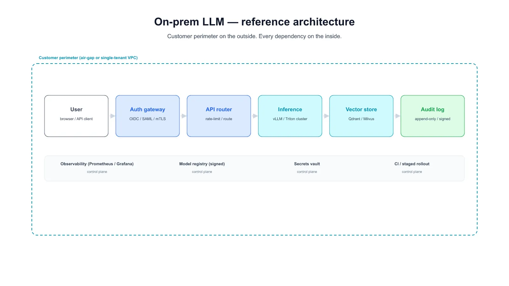

# Yapay Zeka Entegrasyonlarında Veri Egemenliği ve Gölge AI (Shadow AI)

Çalışanların ChatGPT, Claude, Gemini, Copilot ve benzeri public LLM servislerine kurumsal belgeler, kaynak kod, müşteri verisi veya stratejik doküman yüklemesi; fark edilmesi güç ama ciddi sonuçları olan yeni bir veri sızıntısı vektörü oluşturmuştur. Bu bölüm **Gölge AI (Shadow AI)** tehdit modelini, ağ ve DLP politikalarıyla tespitini, SIEM entegrasyonunu ve on-premise LLM mimarileriyle **veri egemenliğini** korumayı ele alır.


---

## §13.4.1. Public LLM Sızıntısını Engelleme

### Tehdidin Boyutu ve Sızıntı Vektörleri

Kurumsal sırların public LLM'lere sızma senaryoları günlük operasyonlarda sık görülür:

- Geliştirici, bug çözmek için tescilli kaynak kodu ChatGPT'ye yapıştırır.
- Analist, müşteri verisi içeren Excel dosyasını AI asistanına analiz ettirir.
- Hukuk ekibi, gizli sözleşme metnini AI ile özetletir.
- İK, çalışan performans değerlendirmesini AI ile yeniden yazdırır.
- Pazarlama ekibi, henüz duyurulmamış ürün yol haritasını prompt içine ekler.

Bu girdiler LLM sağlayıcısının altyapısına iletilir; politikaya bağlı olarak kalite güvencesi, model iyileştirme veya eğitim verisi olarak saklanabilir. **Bağlamsal çıkarım sızıntısı** ayrı bir risk oluşturur: çalışan tek seferde "gizli" bir dosya yüklemese bile, parçalı bilgileri (müşteri takma adları, sayısal dilimler, bağlamsal ipuçları) birden fazla oturumda paylaşarak modelin yüksek değerli istihbarat üretmesine yol açabilir.

### Shadow AI ve Shadow IT Karşılaştırması

**Gölge AI**, çalışanların BT veya güvenlik ekibinin bilgisi ve onayı olmadan kullandığı yapay zeka araçları ve servislerini ifade eder. Gölge BT (Shadow IT) kavramının AI boyutudur; ancak risk profili önemli ölçüde farklıdır.

| Özellik | Shadow IT | Shadow AI |
|:---|:---|:---|
| Araç türü | Dropbox, Trello, kişisel bulut | ChatGPT, Copilot, Claude, yerel Ollama |
| Tespit yöntemi | Uygulama envanteri, firewall logları | CASB/DLP + davranış tabanlı keşif |
| Veri hareketi | Dosya paylaşımı, depolama | Veri dönüşümü, üretim ve çıkarım |
| Denetlenebilirlik | Kısmi loglar mevcut | Prompt/yanıt çoğu zaman loglanmaz |
| Risk kategorisi | Yetkisiz erişim, veri depolama | Uyum ihlali, model bias, IP kaybı |
| Kurulum gereksinimi | Uygulama indirme/kurulum | Tarayıcı içi; kurulum gerektirmez |

Shadow IT'de veri genellikle "taşınır"; Shadow AI'da veri **işlenir, yorumlanır ve dönüştürülür**. Bu nedenle geleneksel dosya tabanlı DLP tek başına yeterli değildir.

### Çok Katmanlı Engelleme Mimarisi

Public LLM sızıntısını engellemek için **Defense in Depth** yaklaşımı uygulanmalıdır:

**Ağ düzeyinde engelleme:** Proxy veya CASB aracılığıyla bilinen public LLM alan adları (`api.openai.com`, `claude.ai`, `gemini.google.com`, `api.anthropic.com`, `copilot.microsoft.com`) kurumsal ağdan bloke edilir ya da SSL inspection ile denetlenir.

**DLP ile içerik denetimi:** SSL inspection yapılan trafikte DLP politikaları, LLM API çağrılarının gövdesini tarar; PII, kaynak kod kalıpları, IBAN, TCKN veya gizli etiketli içerik algılandığında istek bloke edilir.

**Uç nokta DLP:** Tarayıcı eklentileri veya uç nokta DLP ajanları, LLM web arayüzlerine yapıştırılan içeriği sınıflandırarak uyarı üretir veya engeller.

**AI Gateway:** Tüm LLM trafiği merkezi bir ağ geçidinden geçirilir; prompt/yanıt gerçek zamanlı taranır, jailbreak ve prompt injection denemeleri filtrelenir.

### Microsoft Purview DSPM for AI

**Microsoft Purview Data Security Posture Management (DSPM) for AI**, kurumsal ortamlarda AI kullanımına yönelik veri güvenliği duruşunu değerlendiren ve iyileştiren bir çerçevedir. Temel yetenekleri:

- **AI kullanım keşfi:** Kurum içinde hangi AI araçlarının, hangi veri kaynaklarıyla etkileşime girdiğini haritalar.
- **Hassas veri maruziyeti:** AI oturumlarında PII, finansal veri veya fikri mülkiyet içeren içerik paylaşımını tespit eder.
- **Politika önerileri:** Mevcut DLP ve etiketleme politikalarının AI senaryolarına uygunluğunu değerlendirir.
- **Purview DLP uzantısı:** ChatGPT, Gemini ve benzeri tarayıcı oturumlarında kopyalama, yapıştırma, yükleme ve ekran yakalama eylemlerini kontrol eder.

Purview DSPM for AI, Shadow AI görünürlüğünü artırırken mevcut Microsoft 365 veri sınıflandırma altyapısıyla entegre çalışır.

### Microsoft Defender for Cloud Apps (MDCA)

**Defender for Cloud Apps** (eski adıyla Microsoft Cloud App Security), CASB işlevselliği sunarak Shadow AI tespitinin kritik bileşenidir:

| Yetenek | Shadow AI Bağlamı |
|:---|:---|
| Cloud Discovery | Ağ loglarından kullanılan AI SaaS uygulamalarını keşfeder |
| App Governance | Onaysız AI uygulamalarına OAuth izinlerini denetler |
| Anomaly Detection | Anormal AI API çağrı hacmi veya saat dışı kullanımı işaretler |
| Session Policy | Hassas veri içeren oturumlarda AI araçlarına erişimi kısıtlar |
| Conditional Access | Kurumsal kimlik ile AI araçlarına kontrollü erişim sağlar |

MDCA, proxy tabanlı veya log tabanlı (reverse proxy / API connector) modlarda çalışarak hem bilinen hem de keşfedilen AI uygulamalarına görünürlük sağlar.

### Dereceli (Kademeli) Yanıt DLP Politikası

Tek tip "engelle veya izin ver" politikası, üretkenliği düşürür ve çalışanları gölge kanallara iter. **Dereceli yanıt** modeli, veri hassasiyeti × araç risk puanı × personel yetki matrisi temelinde farklılaştırılmış politikalar uygular:

| Hassasiyet Seviyesi | Politika | Örnek Eylem |
|:---|:---|:---|
| Düşük | Serbest bırak + kayıt tut | Genel metin özetleme, loglama |
| Orta | İkinci onay pop-up'ı | Kullanıcıya "hassas veri tespit edildi" uyarısı |
| Yüksek | Otomatik maskeleme | TCKN/IBAN maskeleme sonrası iletim |
| Kritik | Doğrudan engelleme | Kaynak kod, strateji dokümanı bloke |

```yaml
# Örnek: Dereceli DLP politika matrisi (kavramsal)
policies:
  - name: ai-dlp-low
    sensitivity: low
    action: allow_and_log
    tools: ["approved-chatgpt-enterprise"]
  - name: ai-dlp-medium
    sensitivity: medium
    action: prompt_user_confirm
    timeout_seconds: 30
  - name: ai-dlp-high
    sensitivity: high
    action: mask_and_allow
    mask_patterns: ["TCKN", "IBAN", "CREDIT_CARD"]
  - name: ai-dlp-critical
    sensitivity: critical
    action: block
    notify: ["soc@kurum.local", "dpo@kurum.local"]
```

### AI Gateway Mimarisi

**AI Gateway**, uygulama katmanı ile LLM sağlayıcısı arasına konumlanan politika uygulama noktasıdır. Tüm istekler bu geçitten yönlendirilir:

```
┌──────────────┐     ┌─────────────────┐     ┌──────────────────┐
│  Kurumsal    │────▶│   AI Gateway    │────▶│  LLM Sağlayıcı   │
│  Uygulamalar │     │  (DLP+Guardrail)│     │  (OpenAI/Azure)  │
└──────────────┘     └────────┬────────┘     └──────────────────┘
                              │
                    ┌─────────▼─────────┐
                    │ Denetim Logları   │
                    │ SIEM / Purview    │
                    └───────────────────┘
```

Gateway katmanında uygulanması gereken kontroller:

- Prompt ve yanıt üzerinde gerçek zamanlı DLP taraması
- Rate limiting ve token bütçesi (Denial of Wallet önlemi)
- API anahtarı rotasyonu ve kiracı izolasyonu
- Model yanıtında PII/hassas veri filtreleme
- Jailbreak ve prompt injection imza tespiti

### NIST AI RMF ile Hizalama

**NIST AI Risk Management Framework (AI RMF)** dört temel fonksiyon üzerinden AI risk yönetimini yapılandırır. Public LLM sızıntısı önleme bağlamında eşleme:

| AI RMF Fonksiyonu | Public LLM Sızıntısı Karşılığı |
|:---|:---|
| **Govern** | AI kabul edilebilir kullanım politikası, onaylı araç listesi |
| **Map** | Veri akış haritalama, Shadow AI envanteri, risk değerlendirmesi |
| **Measure** | DLP metrikleri, sızıntı olay sayısı, kullanım trendleri |
| **Manage** | Dereceli DLP, AI Gateway, olay müdahale runbook'ları |

---

## §13.4.2. Gölge AI Tespiti ve SIEM Entegrasyonu

### Tespit Zorlukları

Shadow AI'nin tespit edilmesini zorlaştıran temel faktörler:

- **Kurulum gerektirmez:** Tarayıcı içinde veya güvenilir uygulamalara gömülü çalışır.
- **Hesap kontrolü yok:** Genellikle kişisel oturumlarla erişilir; SSO dışı kalır.
- **Log veya denetim yok:** Etkinlik şifrelenir; çoğu sağlayıcı prompt geçmişini kuruma açmaz.
- **DLP kapsamı dışı:** Promptlar ve çıktılar geleneksel filtrelerden kaçabilir.
- **Yerel LLM kullanımı:** Ollama, LM Studio gibi araçlar tamamen iç ağda çalışarak dış trafik üretmez.

### Çok Katmanlı Tespit Mimarisi

Etkin Shadow AI tespiti için dört katman birlikte çalışmalıdır:

1. **Ağ katmanı:** DNS, proxy ve NetFlow loglarında AI domain ve API endpoint tespiti
2. **Uç nokta katmanı:** Yüklü yazılım, tarayıcı eklentileri, yerel LLM süreçleri
3. **CASB katmanı:** Bulut AI uygulamalarına OAuth ve SSO görünürlüğü
4. **Davranış katmanı:** Anormal API çağrı hacmi, saat dışı kullanım, veri hacmi sapması

### Bilinen AI Domain Listesi

SIEM korelasyon kurallarında kullanılacak temel domain ve endpoint listesi:

```
# Public LLM sağlayıcıları
openai.com, api.openai.com, chatgpt.com
anthropic.com, claude.ai, api.anthropic.com
gemini.google.com, generativelanguage.googleapis.com
copilot.microsoft.com, api.cognitive.microsoft.com
api.deepseek.com, chat.deepseek.com
huggingface.co, replicate.com, together.ai
perplexity.ai, poe.com, character.ai

# Yerel LLM (Shadow AI — kurumsal onay dışı)
localhost:11434          # Ollama varsayılan port
localhost:8080         # LocalAI varsayılan port
localhost:8000         # vLLM varsayılan port
```

### Microsoft Sentinel KQL — Public LLM DNS Tespiti

```kql
// Sentinel: Kurumsal ağdan public LLM domain erişimi
let AI_Domains = dynamic([
    "openai.com", "chatgpt.com", "anthropic.com", "claude.ai",
    "gemini.google.com", "copilot.microsoft.com", "deepseek.com",
    "huggingface.co", "replicate.com", "perplexity.ai"
]);
DnsEvents
| where TimeGenerated > ago(24h)
| extend Domain = tolower(Name)
| where Domain has_any (AI_Domains) or Domain endswith ".openai.com"
    or Domain endswith ".anthropic.com"
| summarize
    HitCount = count(),
    UniqueClients = dcount(ClientIP),
    FirstSeen = min(TimeGenerated),
    LastSeen = max(TimeGenerated)
    by Domain, ClientIP
| where HitCount > 5
| order by HitCount desc
```

### Microsoft Sentinel KQL — Yerel Ollama (Port 11434) Tespiti

```kql
// Sentinel: Ollama yerel LLM servisi tespiti (Shadow AI)
let OllamaPorts = dynamic([11434, 8080, 8000]);
DeviceNetworkEvents
| where TimeGenerated > ago(7d)
| where RemotePort in (OllamaPorts) or LocalPort in (OllamaPorts)
| where ActionType == "ConnectionSuccess"
| extend IsLocalLLM = case(
    RemotePort == 11434 or LocalPort == 11434, "Ollama",
    RemotePort == 8080 or LocalPort == 8080, "LocalAI",
    RemotePort == 8000 or LocalPort == 8000, "vLLM",
    "Unknown"
)
| summarize
    ConnectionCount = count(),
    UniqueDevices = dcount(DeviceName)
    by DeviceName, IsLocalLLM, RemoteIP, RemotePort, InitiatingProcessFileName
| order by ConnectionCount desc
```

### Splunk SPL — Public LLM Proxy Log Analizi

```spl
index=proxy sourcetype=access_combined
| eval dest_domain=lower(dest_host)
| search dest_domain="*openai.com" OR dest_domain="*anthropic.com"
    OR dest_domain="*claude.ai" OR dest_domain="*gemini.google.com"
    OR dest_domain="*copilot.microsoft.com" OR dest_domain="*deepseek.com"
| stats count AS request_count,
        dc(user) AS unique_users,
        sum(bytes_out) AS total_bytes_sent
        by dest_domain, user, src_ip
| where request_count > 10
| sort - request_count
| eval risk_score=case(
    total_bytes_sent > 1000000, "HIGH",
    request_count > 50, "MEDIUM",
    true(), "LOW"
)
```

### Splunk SPL — Yerel LLM Süreç ve Port Tespiti

```spl
index=endpoint (process_name="ollama*" OR process_name="local-ai*"
    OR process_name="vllm*" OR process_name="llama-server*")
    OR (dest_port=11434 OR dest_port=8080 OR dest_port=8000)
| eval llm_type=case(
    match(process_name, "(?i)ollama"), "Ollama",
    match(process_name, "(?i)local-ai"), "LocalAI",
    match(process_name, "(?i)vllm"), "vLLM",
    dest_port=11434, "Ollama-Service",
    true(), "Unknown-LLM"
)
| stats earliest(_time) AS first_seen,
        latest(_time) AS last_seen,
        count AS event_count
        by host, user, llm_type, process_name, dest_port
| sort - event_count
```

### Sigma Kuralları

```yaml
# Ollama yerel LLM servisi (Shadow AI)
title: Yerel Ollama LLM Servisi Tespiti
logsource:
  category: process_creation
  product: windows
detection:
  selection:
    Image|endswith: '\ollama.exe'
    CommandLine|contains: '11434'
  condition: selection
level: medium

---
# Public LLM DNS sorgusu
title: Public LLM Servisine DNS Sorgusu
logsource:
  category: dns_query
detection:
  selection:
    QueryName|endswith:
      - '.openai.com'
      - '.anthropic.com'
      - '.claude.ai'
      - '.gemini.google.com'
      - '.deepseek.com'
  condition: selection
level: low
```

### Wazuh Syscollector — Yerel LLM Yazılım Tespiti

Wazuh **syscollector** modülü, uç noktalardaki yüklü yazılım envanterini toplayarak Shadow AI araçlarını tespit eder:

```xml
<!-- Wazuh: Yerel LLM yazılım tespit kuralı -->
<group name="shadow_ai,local_llm,">
  <rule id="100501" level="10">
    <if_group>syscheck</if_group>
    <field name="program.name">Ollama</field>
    <description>Shadow AI: Ollama yerel LLM kurulumu tespit edildi</description>
    <group>shadow_ai,gdpr,pci_dss_10.6.1,</group>
  </rule>

  <rule id="100502" level="10">
    <if_group>syscheck</if_group>
    <field name="program.name">LM Studio</field>
    <description>Shadow AI: LM Studio yerel LLM kurulumu tespit edildi</description>
    <group>shadow_ai,</group>
  </rule>

  <rule id="100503" level="12">
    <if_group>syscheck</if_group>
    <match>ollama.exe|local-ai.exe|vllm|llama-server</match>
    <description>Shadow AI: Yerel LLM süreci veya binary tespit edildi</description>
    <group>shadow_ai,critical,</group>
  </rule>
</group>
```

Syscollector'da `packages`, `ports` ve `processes` envanter toplama etkinleştirilmelidir.

### Yönetim Politikası: Yasaklama Yerine Kontrollü Etkinleştirme

Engelleme tek başına yeterli değildir; çalışanlar kısıtlamayı VPN, mobil veri veya kişisel cihazlarla aşar. Etkin yaklaşım:

- **Onaylı AI araçları listesi:** BT/Güvenlik onaylı, veri işleme sözleşmesi (DPA) yapılmış AI araçları çalışanlara sunulur.
- **Farkındalık eğitimi:** Hangi içeriğin neden public LLM'lere gönderilmemesi gerektiği anlatılır.
- **Açık kapı politikası:** Çalışanlar yeni AI araç ihtiyaçlarını güvenli bir onay sürecinden geçirerek kullanabilir.
- **AI araçları kaydı (registry):** Tüm AI araçlarının, sahiplerinin ve veri maddelerinin merkezi kaydı oluşturulur.

---

## §13.4.3. On-Premise / Self-Hosted LLM ile Veri Egemenliği

### Self-Hosted LLM Neden Gerekli?

**Veri egemenliği (data sovereignty)**, kurumsal verilerin hangi coğrafyada, hangi altyapıda ve hangi yasal rejim altında işlendiğine ilişkin kontrol hakkını ifade eder. Self-hosted LLM tercih nedenleri:

- Tüm inference (çıkarım) şirket altyapısında gerçekleşir; hiçbir girdi veya çıktı harici sunuculara iletilmez.
- Finansal veriler, sağlık kayıtları, devlet sırları gibi regülasyona tabi veriler güvenle işlenebilir.
- İnternet bağlantısı olmayan **air-gapped** ortamlarda da AI özelliklerinden yararlanılabilir.
- Model güncellemeleri, prompt logları ve denetim izleri kurum kontrolünde kalır.



### Dağıtım Araçları Karşılaştırması

| Araç | Kullanım Senaryosu | API Uyumluluğu | Ölçeklenebilirlik |
|:---|:---|:---|:---|
| **Ollama** | Hızlı pilot, iş istasyonu/tek sunucu | REST API (özel) | Düşük-Orta |
| **vLLM** | Üretim kalitesi, yüksek throughput | OpenAI uyumlu | Yüksek (K8s) |
| **LocalAI** | Mevcut OpenAI entegrasyonlarını yönlendirme | OpenAI uyumlu | Orta |
| **LM Studio** | Bireysel geliştirici iş istasyonu | REST API | Düşük |
| **TGI (Text Generation Inference)** | Hugging Face ekosistemi, GPU kümesi | OpenAI uyumlu | Yüksek |

### VRAM Boyutlandırma Rehberi

Yerel LLM dağıtımında GPU **VRAM** kapasitesi model seçimini doğrudan belirler:

| Model | Parametre | Quantization | Minimum VRAM | Önerilen VRAM |
|:---|:---|:---|:---|:---|
| Llama 3.2 | 3B | Q4_K_M | 4 GB | 6 GB |
| Phi-3 Mini | 3.8B | Q4_K_M | 4 GB | 6 GB |
| Mistral 7B | 7B | Q4_K_M | 6 GB | 8 GB |
| Llama 3.1 | 8B | Q4_K_M | 8 GB | 12 GB |
| Llama 3.1 | 70B | Q4_K_M | 48 GB | 2× A100 80GB |

**VRAM ≈ (Parametre × Bit_Derinliği) / 8 × 1.2** — 7B Q4 model için minimum ~4.2 GB. Eşzamanlı kullanıcı ve context uzunluğu ek buffer gerektirir.

### Docker Compose — Ollama Üretim Dağıtımı

```yaml
version: "3.8"
services:
  ollama:
    image: ollama/ollama:latest
    restart: unless-stopped
    ports:
      - "127.0.0.1:11434:11434"   # Reverse proxy arkasında
    volumes:
      - ollama_data:/root/.ollama
    environment:
      - OLLAMA_ORIGINS=https://llm.kurum.local
    deploy:
      resources:
        reservations:
          devices:
            - driver: nvidia
              count: 1
              capabilities: [gpu]
    networks: [llm_internal]
    healthcheck:
      test: ["CMD", "curl", "-f", "http://localhost:11434/api/tags"]
      interval: 30s
      retries: 3
  nginx:
    image: nginx:alpine
    ports: ["443:443"]
    volumes:
      - ./nginx.conf:/etc/nginx/nginx.conf:ro
      - ./certs:/etc/nginx/certs:ro
    depends_on: [ollama]
    networks: [llm_internal, dmz]
volumes:
  ollama_data:
networks:
  llm_internal:
    internal: true
```

### Air-Gap Dağıtım Mimarisi

Savunma, kritik altyapı ve bazı finans segmentlerinde **hava boşluklu (air-gapped)** dağıtım zorunlu olabilir. GPU sunucusu üzerinde Ollama/vLLM çalışır; model ağırlıkları fiziksel medya veya tek yönlü veri diyodu ile aktarılır ve hash doğrulaması yapılır. Yönetim erişimi jump server + MFA üzerinden sağlanır; güncellemeler offline paketlerle uygulanır. Tüm prompt/yanıt logları yerel SIEM'e aktarılır; internet çıkışı fiziksel olarak engellenir.

### Güvenlik Mimarisi Kontrol Listesi

On-premise LLM'de zorunlu kontroller: OAuth 2.0/OIDC erişim kontrolü, ayrı VLAN izolasyonu, jump server + MFA yönetimi, PII maskelenmiş girdi/çıktı loglama, model hash doğrulama, çıktı DLP filtreleme, rate limiting ve Vault tabanlı secrets rotasyonu.

Üretim ölçeğinde **vLLM**, Kubernetes üzerinde yüksek throughput ve OpenAI uyumlu API sunar; `tensor-parallel-size` ve GPU replica sayısı eşzamanlı kullanıcı yüküne göre ayarlanır.

---

## §13.4.4. Türkiye Mevzuatı ve Uyum Gereksinimleri

### 6698 Sayılı KVKK ve Kasım 2025 Rehberi

**Kişisel Verilerin Korunması Kanunu (KVKK)**, yapay zeka sistemleriyle kişisel veri işleme faaliyetlerinde temel yasal çerçeveyi oluşturur. Kişisel Verileri Koruma Kurumu (KVKK), **Kasım 2025** tarihinde yayımlanan rehberde yapay zeka uygulamalarına ilişkin aşağıdaki hususları vurgulamıştır:

- Yapay zeka sistemleriyle kişisel veri işlemede **veri koruma etki değerlendirmesi (DPIA)** yapılması gerekliliği
- Otomatik karar verme süreçlerinde açıklanabilirlik ve insan denetimi zorunluluğu
- Eğitim verisi olarak kullanılan kişisel verilerde açık rıza veya meşru menfaat değerlendirmesi
- Biyometrik veri ve özel nitelikli kişisel verilerin AI sistemlerinde işlenmesine ilişkin sıkılaştırılmış koşullar
- Public LLM'lere kişisel veri aktarımının **açık rıza** veya **yeterli önlem** olmaksızın gerçekleştirilemeyeceği

Kurumlar, çalışanların public LLM'lere müşteri PII'si, çalışan verisi veya sağlık bilgisi yüklemesini KVKK kapsamında **veri ihlali riski** olarak değerlendirmelidir.

### Kişisel Verilerin Yurt Dışına Aktarılması Yönetmeliği (10.07.2024)

**Kişisel Verilerin Yurt Dışına Aktarılmasına İlişkin Usul ve Esaslar Hakkında Yönetmelik** (Resmî Gazete: 10 Temmuz 2024), public LLM kullanımı bağlamında kritik öneme sahiptir. Çalışanın Türkiye'deki bir sunucudan ChatGPT'ye yapıştırdığı müşteri adı-soyadı, KVKK anlamında **yurt dışına veri aktarımı** sayılabilir.

Yönetmelik kapsamında uyum gereksinimleri:

| Aktarım Yöntemi | Koşul |
|:---|:---|
| Yeterlilik kararı olan ülke | Ek önlem gerekmez (liste sınırlı) |
| Standart sözleşme (SCC) | Veri sorumlusu ile alıcı arasında KVKK formunda |
| Bağlayıcı şirket kuralları (BCR) | Çok uluslu grup şirketleri için |
| Açık rıza | Son çare; bilgilendirilmiş ve özgür iradeye dayalı |
| Yeterli önlem + Kurul izni | Standart yöntemlerin uygulanamadığı durumlar |

Public LLM sağlayıcılarının çoğu ABD merkezlidir; Türkiye için yeterlilik kararı bulunmamaktadır. Bu nedenle kurumsal ChatGPT Enterprise veya Azure OpenAI (Türkiye/AB bölgesi) gibi **sözleşmesel garanti ve veri ikametgahı** sağlayan alternatifler değerlendirilmelidir.

### 5651 Sayılı Kanun ve Loglama Yükümlülükleri

**5651 Sayılı İnternet Ortamında Yapılan Yayınların Düzenlenmesi Hakkında Kanun**, internet hizmetlerinin kimler tarafından ve ne amaçla kullanıldığının kayıt altına alınmasını zorunlu kılar. AI kullanım bağlamında:

- Kurumsal proxy ve firewall loglarında AI domain erişim kayıtları tutulmalıdır.
- Yerel LLM sunucularının erişim logları en az iki yıl saklanmalıdır.
- 5651 kapsamındaki **yer sağlayıcı** ve **erişim sağlayıcı** yükümlülükleri, AI trafiğinin de loglanmasını gerektirir.
- Yeni kanun teklifleri, ayrımcı veri setlerinin kullanılmasını veri güvenliği ihlali sayma yönünde güncelleme içermektedir.

### BDDK 2025–2028 Bilgi Sistemleri Stratejik Planı ve AI Sandbox

**Bankacılık Düzenleme ve Denetleme Kurumu (BDDK)**, 2025–2028 Dönemi Bilgi Sistemleri Stratejik Planı'nda yapay zeka kullanımına ilişkin özel gereksinimler tanımlamıştır:

- Bankaların AI uygulamalarını **kontrollü sandbox ortamlarında** test etmesi teşvik edilmektedir.
- Müşteri verilerinin public LLM'lere aktarımı **açıkça yasaklanmış** veya sıkı onay sürecine tabi tutulmuştur.
- AI model risk yönetimi, model validasyonu ve sürekli izleme (model drift) gereksinimleri getirilmiştir.
- Üçüncü taraf AI hizmet sağlayıcıları için tedarik zinciri risk değerlendirmesi zorunludur.
- AI destekli kredi skorlama ve dolandırıcılık tespiti uygulamalarında **açıklanabilirlik** şartı konulmuştur.

Finans sektöründe Shadow AI kullanımı, BDDK denetimlerinde **kritik bulgu** olarak değerlendirilebilir.

### Mevzuat Uyum Matrisi

| Mevzuat / Rehber | Shadow AI / Public LLM İhlali | On-Prem LLM Gereksinimi |
|:---|:---|:---|
| KVKK + Kasım 2025 Rehberi | Kişisel veri aktarımı, DPIA | Veri minimizasyonu, loglama |
| Yurt Dışı Aktarım Yönetmeliği | ABD merkezli LLM = yurt dışı aktarım | Türkiye içi inference |
| 5651 Sayılı Kanun | Erişim logları, 2 yıl saklama | Yerel LLM erişim denetimi |
| BDDK 2025–2028 Planı | Sandbox dışı AI kullanımı | Kontrollü sandbox, model risk |
| NIST AI RMF | Yönetişim kayması (governance drift) | Govern-Map-Measure-Manage |

AI tedarikçi sözleşmelerinde eğitim amaçlı veri kullanımının hariç tutulması, veri ikametgahı (Türkiye/AB), denetim/silme hakları, alt işleyen şeffaflığı ve KVKK 72 saat ihlal bildirimi açıkça tanımlanmalıdır.

---

## §13.4.5. Özet ve Operasyonel Tavsiyeler

### Tehdit Özeti

Shadow AI, kurumların karşı karşıya olduğu en karmaşık güvenlik zorluklarından biridir. Geleneksel güvenlik araçları, AI trafiğinin doğasını (metin dönüşümü, bağlamsal çıkarım, kişisel oturum) tam olarak kapsayamamaktadır. Başarılı bir savunma stratejisi dört sütun üzerine inşa edilmelidir:

```
┌─────────────────────────────────────────────────────────────┐
│              SHADOW AI SAVUNMA ÇERÇEVESİ                    │
├──────────────┬──────────────┬──────────────┬───────────────┤
│  GÖRÜNÜRLÜK  │   KORUMA     │  EGEMENLİK   │  YÖNETİŞİM   │
├──────────────┼──────────────┼──────────────┼───────────────┤
│ DNS/Proxy    │ Dereceli DLP │ On-Prem LLM  │ AI Registry   │
│ SIEM/KQL     │ AI Gateway   │ Air-Gap      │ KVKK Uyumu    │
│ CASB/MDCA    │ Purview DLP  │ vLLM/Ollama  │ NIST AI RMF   │
│ Wazuh/Sigma  │ Guardrails   │ VRAM Plan    │ BDDK Sandbox  │
│ Endpoint     │ Maskeleme    │ Model Hash   │ 5651 Loglama  │
└──────────────┴──────────────┴──────────────┴───────────────┘
```

### Operasyonel Tavsiyeler ve Olay Müdahale

| Faz | Öncelikli Eylemler |
|:---|:---|
| **0–3 ay** | Sentinel KQL / Splunk SPL kuralları; proxy monitor modu; Purview DSPM değerlendirmesi; farkındalık eğitimi |
| **3–6 ay** | Dereceli DLP + onaylı araç listesi; AI Gateway pilot; Wazuh/Sigma SOC entegrasyonu |
| **6–12 ay** | On-premise Ollama/vLLM üretim; air-gap prosedürü; KVKK DPIA; BDDK AI Sandbox |

**Olay müdahale sırası:** (1) SIEM alarm doğrulama ve kanıt toplama → (2) veri sınıflandırması (PII/IP) → (3) oturum kısıtlama → (4) DPO ile KVKK 72 saat değerlendirmesi → (5) sağlayıcıya silme talebi → (6) olay raporu ve kural güncelleme.

Hiçbir AI servisi kalıcı olarak "güvenli" sayılmaz; Shadow AI yönetimi sürekli gözetim gerektirir. **Kontrollü etkinleştirme** — tam yasaklama yerine onaylı araç, dereceli DLP, AI Gateway ve on-premise alternatif sunumu — üretkenlik ile veri egemenliğini dengeler. **Temel ilke:** Görünürlük olmadan koruma, koruma olmadan egemenlik, egemenlik olmadan uyum mümkün değildir.