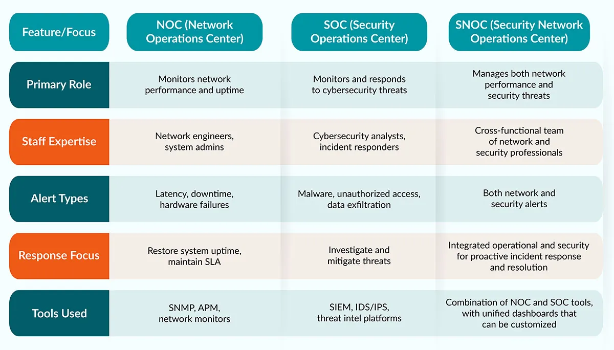
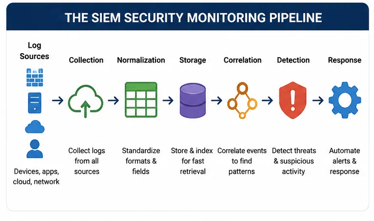
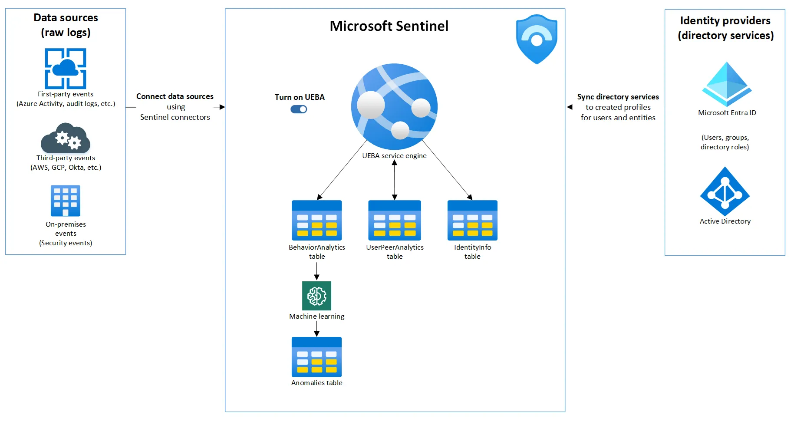
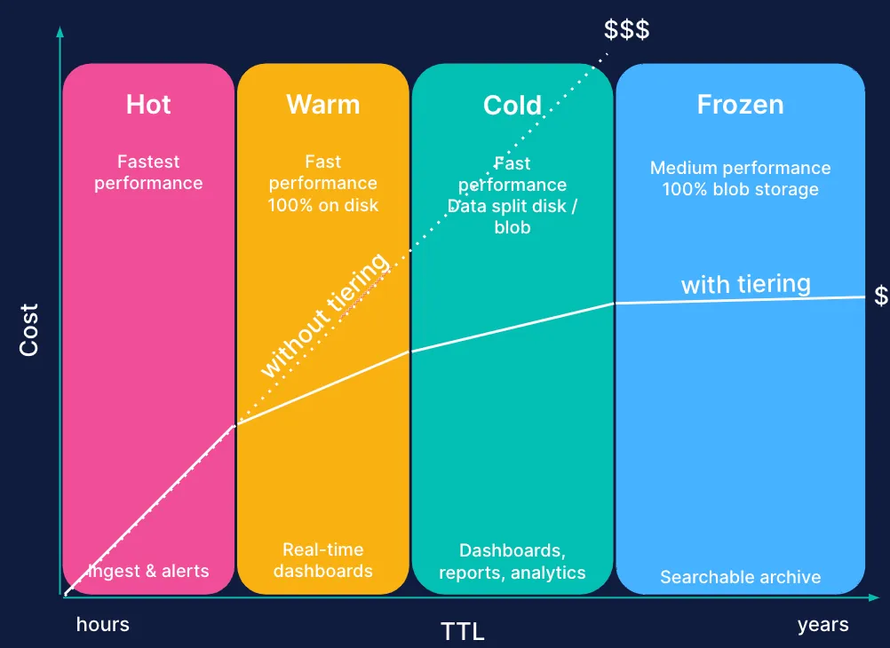

# SOC/NOC Entegrasyonu ve Yeni Nesil Merkezi Log Yönetimi (SIEM/SOAR)

Operasyonel güvenlik, savunma derinliği mimarisinin **görünürlük ve müdahale** katmanıdır. Kurumsal altyapılarda ağ erişilebilirliği (NOC) ile siber tehdit tespiti (SOC) geleneksel olarak ayrı silolarda yönetilir; bu ayrım, "performans anomalisi mi, saldırı mı?" sorusunun geç yanıtlanmasına, alarm yorgunluğuna ve MTTR'nin uzamasına yol açar. Modern mimarilerde SIEM merkezi korelasyon motoru, UEBA davranışsal analitik katmanı ve SOAR otomasyon orkestrasyonu — NOC ve SOC'un ISOC (Integrated Security and Operations Center) çatısı altında birleşmesiyle — tek bir operasyonel gerçeklik kaynağı oluşturur.

Bu bölümde log toplama (Syslog, WEF/WEC), ayrıştırma, zenginleştirme, UEBA, veri katmanlama (Hot/Warm/Cold/Frozen), SOAR playbook'ları ve Türkiye mevzuatı (5651, KVKK, BDDK) ışığında uçtan uca bir SOC/SIEM mimarisi ele alınacaktır.

---

## §14.1.1. SOC/NOC Entegrasyonu ve ISOC Mimarisi

Geleneksel yapılarda **NOC (Network Operations Center)** ağın ve sistemlerin erişilebilirliğine (availability), performansına, bant genişliği tüketimine ve donanım sağlığına odaklanır. **SOC (Security Operations Center)** ise gizlilik ve bütünlük (confidentiality & integrity) perspektifinden tehditleri izler, tespit eder ve müdahale eder. Bu iki disiplinin ayrışması ciddi operasyonel açıklar yaratır: NOC'un olağan bir yedekleme trafiği olarak gördüğü bant genişliği artışı, SOC perspektifinden aktif veri sızıntısı veya C2 haberleşmesi olabilir; tersine, SOC'un brute-force alarmı bir ağ yapılandırma hatasının yan etkisi olabilir.

**ISOC (Integrated Security and Operations Center)**, bu iki yapıyı organizasyonel, süreçsel ve teknolojik düzeyde birleştirerek tek bir görünürlük katmanı oluşturur. Aynı telemetri (NetFlow, syslog, EDR) hem performans hem güvenlik bağlamında değerlendirilir.


*NOC, SOC ve entegre ISOC (SNOC) operasyonel farkları*

### Operasyonel Parametre Karşılaştırması

| Parametre | NOC | SOC | ISOC |
| :---- | :---- | :---- | :---- |
| **Birincil odak** | Uptime, latency, kapasite, MTTR (onarım) | Tehdit tespiti, olay müdahale, risk azaltımı | Bütünsel görünürlük, kök neden analizi, otonom müdahale |
| **Temel teknolojiler** | SNMP, APM, NetFlow, CMDB | SIEM, EDR/XDR, NDR, TIP, SOAR | Birleşik SIEM/SOAR, CMDB korelasyon motoru |
| **Standart referans** | ITIL v4, ISO 20000 | NIST SP 800-61, ISO 27001 A.8.15 | NIST SP 800-53 (AU, SI), CIS Controls v8 (8, 13, 17) |
| **İletişim akışı** | Saha mühendisliği, servis sağlayıcı | Tehdit avcılığı, adli bilişim | Ağ anomalisi ↔ siber saldırı gerçek zamanlı korelasyon |

### Katmanlı Analist Yapısı

| Kademe | Rol | Sorumluluklar |
| :---- | :---- | :---- |
| **Tier-1** | Triyaj / alarm doğrulama | Alarm sınıflandırma, false positive filtreleme, playbook tetikleme, NOC↔SOC eskalasyon |
| **Tier-2** | Derin analiz / olay müdahalesi | Olay kapsamı belirleme, containment, kök neden analizi |
| **Tier-3** | Threat hunting / detection engineering | Hipotez-güdümlü av, kural geliştirme, forensics |
| **SOC Manager + CTI** | Strateji ve koordinasyon | Metrik yönetimi, purple team, istihbarat entegrasyonu |

### NOC ↔ SOC İşbirliği Modeli

*   **NOC → SOC:** Şüpheli trafik deseni, anormal bant genişliği, DNS anomalisi SOC'a yükseltilir.
*   **SOC → NOC:** İzolasyon gerektiren segment, ACL değişikliği, port kapatma talebi NOC'a iletilir.
*   **Tier-1 ortak taban:** Her iki ekip de ilk kademede aynı dashboard ve ticket sistemini (ServiceNow, Jira) paylaşır; çapraz eğitimli analistler her iki perspektifi değerlendirebilir.

> [!NOTE]
> ISOC dönüşümü yalnızca teknoloji birleştirmesi değildir. Organizasyonel raporlama hatları, SLA tanımları ve "kim hangi alarmı sahiplenir?" matrisi önceden netleştirilmelidir. Aksi halde eski silo dinamikleri aynı dashboard üzerinde devam eder.

---

## §14.1.2. Merkezi Log Yönetimi ve SIEM Altyapısı

Siber saldırıların tespiti ve adli analiz süreçlerinin temel ham maddesi loglardır. Saldırganların yerel logları temizlemesi (`wevtutil cl Security` gibi) yaygın bir ofansif pratiktir; bu nedenle logların manipüle edilemeden merkezi ve izole bir sunucuya aktarılması zorunludur.


*SIEM güvenlik izleme boru hattı: toplama → ayrıştırma → korelasyon → yanıt*

### Log Toplama Protokolleri

| Kaynak Türü | Toplama Yöntemi | Açıklama |
| :---- | :---- | :---- |
| **Ağ cihazları** (FW, router, switch) | Syslog (RFC 5424 / RFC 3164) | UDP/TCP 514 veya TLS 6514 |
| **Windows** | WEF/WEC (WinRM) | Ajan-gereksiz, GPO ile merkezi yönetim |
| **Linux/Unix** | rsyslog / syslog-ng | Açık kaynak syslog iletici |
| **Uç nokta** | EDR/XDR agent (Wazuh, CrowdStrike vb.) | FIM, process, network telemetrisi |
| **Bulut** | API polling, CloudTrail, Azure Activity Log | Konteyner ve serverless logları |

#### Syslog: RFC 3164 vs RFC 5424

RFC 3164 (legacy BSD Syslog) yıl ve saat dilimi bilgisi içermez; milisaniye hassasiyeti yoktur — olay müdahalede kronolojik hizalamayı zorlaştırır. **RFC 5424** modern standarttır: ISO 8601 zaman damgası, STRUCTURED-DATA bloğu (key-value meta veriler), genişletilebilir format.

```
<PRI>VERSION TIMESTAMP HOSTNAME APP-NAME PROCID MSGID STRUCTURED-DATA MSG
```

RFC 5424 yapılandırılmış veri bloğu, regex yazmadan IP, kullanıcı ve oturum ID'lerinin taşınmasını sağlar.

#### Windows Event Forwarding (WEF/WEC)

Microsoft'un yerel, ajan-gereksiz log merkezileştirme mekanizmasıdır. WS-Management (WinRM) üzerinden HTTP (5985) veya HTTPS (5986) ile çalışır.

| Model | Mekanizma | Kullanım |
| :---- | :---- | :---- |
| **Source-Initiated (Push)** | Kaynaklar GPO ile WEC sunucusunu keşfedip log iter | Binlerce uç noktaya ölçeklenir; **önerilen** |
| **Collector-Initiated (Pull)** | WEC önceden tanımlı makinelerden çeker | Kritik, sınırlı sayıda sunucu için |

Pratik ölçek limiti: collector başına ~10.000 kaynak. Küresel kurumlar bölgesel WEC → merkezi WEC kademeli mimarisi kullanır.

**Kritik Windows Event ID'leri (MITRE ATT&CK eşlemesi):**

| Event ID | Kanal | Açıklama | ATT&CK |
| :---- | :---- | :---- | :---- |
| 4624 / 4625 | Security | Başarılı / başarısız oturum açma | T1110, T1078 |
| 4688 | Security | Yeni süreç oluşturma (komut satırı) | T1059 |
| 4672 | Security | Özel yetki ataması | T1078 |
| 4720 / 4724 | Security | Kullanıcı oluşturma / şifre sıfırlama | T1098 |
| 4728 / 4732 / 4756 | Security | Kritik gruplara üye ekleme | T1098.002 |
| 7045 | System | Yeni servis kurulumu | T1543.003 |
| 4104 | PowerShell/Operational | Script Block Logging | T1059.001 |

**GPO yapılandırması:** `Computer Configuration → Administrative Templates → Windows Components → Event Forwarding` altında SubscriptionManager dizesi:

```
Server=HTTPS://<WEC-FQDN>:5986/wsman/SubscriptionManager/WEC,Refresh=10,IssuerCA=<thumbprint>
```

**WEC abonelik örneği (wevutil cs subscription.xml):**

```xml
<Subscription xmlns="http://schemas.microsoft.com/2006/03/windows/events/subscription">
  <SubscriptionId>EnterpriseSecurityEvents</SubscriptionId>
  <SubscriptionType>SourceInitiated</SubscriptionType>
  <ConfigurationMode>MinLatency</ConfigurationMode>
  <Delivery Mode="Push">
    <Batching><MaxLatencyTime>30000</MaxLatencyTime></Batching>
  </Delivery>
  <ContentFormat>Events</ContentFormat>
  <Query><![CDATA[
    <QueryList>
      <Query Id="0" Path="Security">
        <Select Path="Security">*[System[(EventID=4624 or EventID=4625 or EventID=4688 or EventID=4672 or EventID=4720 or EventID=4724 or EventID=4728 or EventID=4732 or EventID=4756 or EventID=7045)]]</Select>
      </Query>
      <Query Id="1" Path="Microsoft-Windows-PowerShell/Operational">
        <Select Path="Microsoft-Windows-PowerShell/Operational">*[System[(EventID=4103 or EventID=4104)]]</Select>
      </Query>
    </QueryList>
  ]]></Query>
</Subscription>
```

### Log Ayrıştırma (Parsing) ve Normalizasyon

Ham loglar SIEM'in anlamlandırabilmesi için yapılandırılmış alanlara ayrılır. Farklı üreticilerin alan adları (`src_ip` vs `source_address`) ortak bir şemaya (ECS, Splunk CIM, Wazuh decoder) eşlenir.

**Grok pattern örneği (Apache erişim logu):**

```
%{IPORHOST:clientip} %{HTTPDUSER:ident} %{USER:auth} \[%{HTTPDATE:timestamp}\] "%{WORD:verb} %{NOTSPACE:request} HTTP/%{NUMBER:httpversion}" %{NUMBER:response} %{NUMBER:bytes}
```

**Windows Event ayrıştırma (Splunk regex örneği):**

```spl
| rex field=_raw "MSWinEventLog\s+\d+\s+(?<Event_Type>\w+)\s+(?<Event_ID>\d+)"
| rex field=_raw "Source IP:\s+(?<src_ip>\d+\.\d+\.\d+\.\d+)"
```

### SIEM Korelasyon Motoru

SIEM, ayrıştırılmış milyonlarca logu korelasyon kurallarıyla analiz eder. Örnek kural: 1 dakika içinde 10 başarısız oturum açma (Event ID 4625) ardından başarılı giriş (4624) → "Brute Force Başarılı" alarmı.

> [!WARNING]
> Korelasyon kuralları yalnızca toplanan logların kapsamı kadar etkilidir. DC, DNS, firewall ve EDR kaynaklarından %95+ log akışı sağlanmadan SIEM yatırımı anlamlı ROI üretmez. Coverage gap analizi her çeyrekte tekrarlanmalıdır.

---

## §14.1.3. Log Zenginleştirme (Enrichment)

Ham log tek başına yetersizdir. Zenginleştirme, ingest pipeline'ında gerçek zamanlı olarak harici kaynaklarla eşleştirme yaparak loga bağlam katar.

| Zenginleştirme Türü | Kaynak | Kullanım Amacı |
| :---- | :---- | :---- |
| **GeoIP** | MaxMind GeoLite2/GeoIP2 | Ülke, şehir, ASN; impossible travel tespiti |
| **Threat Intelligence** | MISP, AlienVault OTX, ticari feed'ler | IOC eşleştirme, kampanya/malware etiketleme |
| **Varlık bağlamı** | CMDB, EDR envanteri | Kritiklik skoru, sahip birim, ağ segmenti |
| **Kimlik bağlamı** | Active Directory, IAM | Departman, VIP durumu, yetki seviyesi |
| **Risk skoru** | TI platformları | 0–100 tehdit skoru, Tor/VPN/bot flag'leri |

### Dinamik Olay Önceliklendirme

Kritik bir finans sunucusundaki başarısız giriş denemesi ile test sunucusundaki aynı olay aynı öncelikte ele alınmamalıdır. Dinamik öncelik skoru:

```
DPS = Base_Severity × Asset_Criticality × TI_Confidence_Factor
```

| Bileşen | Aralık | Örnek |
| :---- | :---- | :---- |
| Base Severity | 1–10 | Kural varsayılan ciddiyeti |
| Asset Criticality | 0.5–3.0 | Test sunucusu: 0.5; Domain Controller: 3.0 |
| TI Confidence | 0–1.5 | Bilinen kötü IP eşleşmesi: 1.5 |

**Elasticsearch Ingest Pipeline (GeoIP + TI örneği):**

```json
{
  "description": "GeoIP ve tehdit istihbaratı zenginleştirme",
  "processors": [
    {
      "geoip": {
        "field": "source.ip",
        "target_field": "source.geo",
        "database_file": "GeoLite2-City.mmdb"
      }
    }
  ]
}
```

---

## §14.1.4. UEBA ile Davranışsal Anomali Tespiti

Geleneksel kural tabanlı SIEM, bilinen saldırı modellerini yakalamakta etkilidir; ancak sıfır gün saldırıları, içeriden tehditler ve living-off-the-land (LOLBins) teknikleri karşısında yetersiz kalır. **UEBA (User and Entity Behavior Analytics)**, makine öğrenmesi ile her kullanıcı ve varlık için dinamik davranışsal taban çizgisi (baseline) oluşturur.


*UEBA mimarisi: veri toplama, baseline, anomali skorlama ve SIEM/SOAR entegrasyonu*

### Çalışma Prensibi

1. **Öğrenme:** 30–60 günlük geçmiş veriyle normal davranış kalıpları öğrenilir.
2. **Anomali tespiti:** Gerçek zamanlı olaylar baseline ile karşılaştırılır; istatistiksel sapmalar tespit edilir.
3. **Risk skorlaması:** Microsoft Sentinel UEBA iki skor üretir: **Anomaly Score (0–1)** ve **Investigation Priority Score (0–10)**.
4. **Aksiyon:** Yüksek skorlu anomaliler SIEM alarmına ve SOAR playbook'una yönlendirilir.

### Skorlama Referans Çerçeveleri

*   **Varlığın kendi geçmişi:** Kullanıcının normal login saatleri, coğrafyası, erişim desenleri.
*   **Akran grubu (peer group):** TF-IDF algoritmasıyla güvenlik grubu üyeliğine göre benzer roldeki kullanıcıların ortalaması.
*   **Kurumsal norm:** Organizasyon genelindeki davranış dağılımı.

### UEBA Kullanım Senaryoları

| Senaryo | Tespit Mekanizması | Örnek |
| :---- | :---- | :---- |
| **Credential theft** | Alışılmadık saat/lokasyon/cihaz | Gece 03:00'te Rusya'dan VPN ile RDP |
| **Data exfiltration** | Normalin üzerinde veri transferi | 1 saatte 50 GB indirme |
| **Impossible travel** | Eş zamanlı farklı coğrafyalar | İstanbul + Londra aynı anda |
| **Privilege escalation** | Rutin dışı hassas sistem erişimi | Pazarlama çalışanının finans DB'sine erişim |
| **Lateral movement** | Peer group dışı SMB/RDP | IK çalışanının veritabanı segmentine erişim |

> [!CAUTION]
> UEBA skorları tek başına alarm tetikleyici olmamalıdır; önceliklendirme sinyali olarak kullanılmalıdır. Kural tabanlı tespit + TI + varlık bağlamı ile hibrit çalışma zorunludur. Aksi halde false positive oranı kabul edilemez seviyelere çıkar.

---

## §14.1.5. Yasal Log Saklama ve Zaman Damgası (5651 Sayılı Kanun)

Türkiye'de log yönetimi yalnızca teknik bir zorunluluk değil, yasal bir yükümlülüktür. **5651 sayılı Kanun** aktörlere göre farklı saklama yükümlülükleri getirir.

| Aktör | Yükümlülük | Süre |
| :---- | :---- | :---- |
| **Erişim sağlayıcı** | Trafik bilgisi + zaman damgalı bütünlük değeri | 1 yıl |
| **Yer sağlayıcı** | Trafik bilgileri | 1–2 yıl (yönetmelik) |
| **Toplu kullanım sağlayıcı** (otel, kafe, AVM) | IP, MAC, başlama/bitiş zamanı | 2 yıl |

### Teknik Gereksinimler

*   **NTP senkronizasyonu:** Stratum 1/2 NTP ile tutarlı zaman kaynağı.
*   **TÜBİTAK Kök Zaman Damgası:** SHA-256 hash imzalama; değiştirilemezlik ispatı.
*   **Ayrı log sunucusu:** Üretim sistemlerinden izole, erişim kısıtlı.
*   **WORM depolama:** S3 Object Lock, immutable NAS.
*   **PII maskeleme:** Analitik katmanda maskeleme; compliance arşivinde orijinal.

> [!WARNING]
> 5651 saklama süresi kaynaklar arasında farklılaşır (1 yıl / 2 yıl / 3–5 yıl önerisi). Bu çelişki kanun-yönetmelik-Anayasa Mahkemesi kararı katmanlarından kaynaklanır. Teknik uygulama öncesi mutlaka hukuk birimine danışılmalıdır. İmzalanmamış loglar mahkemede delil olarak kabul edilmeyebilir.

### Captive Portal ve Hotspot Mimarisi

Misafir ağları ayrı VLAN'da konumlandırılır; Captive Portal + RADIUS entegrasyonu ile SMS OTP veya kimlik doğrulaması yapılır. DHCP, RADIUS session ve URL filtreleme logları İç IP Log Defteri formatında kaydedilir.

### KVKK ve BDDK Uyumu

*   **KVKK:** Kişisel veri içeren loglarda amaç sınırlılığı, saklama süresi, güvenlik önlemleri; audit log düzenli tutulması.
*   **BDDK BSEBY:** Finans kurumları için detaylı loglama, kurumsal SOME zorunluluğu, denetim izlerinin 3–10 yıl saklanması.

**TÜBİTAK zaman damgası otomasyon betiği (özet):**

```bash
#!/bin/bash
LOG_FILE="/var/log/5651_archive/internet_access_$(date +%Y-%m-%d).log"
ZIP_FILE="${LOG_FILE%.log}.zip"
zip -j "$ZIP_FILE" "$LOG_FILE"
openssl ts -query -data "$ZIP_FILE" -sha256 -cert -out request.tsq
curl -H "Content-Type: application/timestamp-query" \
     --data-binary @request.tsq \
     "http://zaman.kamusm.gov.tr" -o response.tsr
openssl ts -verify -in response.tsr -data "$ZIP_FILE" -CAfile kamusm_root_ca.pem
```

---

## §14.1.6. SIEM Veri Hacmi Yönetimi: Hot/Warm/Cold/Frozen

Kurumsal SIEM'ler günde terabaytlarca log üretir. Tüm veriyi yüksek performanslı SSD'de tutmak sürdürülemezdir. **Index Lifecycle Management (ILM)** ile veri erişim sıklığına göre katmanlanır.


*Hot/Warm/Cold/Frozen depolama katmanları ve maliyet optimizasyonu*

### Depolama Katmanları

| Katman | Depolama | Süre (tipik) | Kullanım |
| :---- | :---- | :---- | :---- |
| **Hot** | NVMe SSD, yüksek CPU | 7–30 gün | Gerçek zamanlı arama, alerting |
| **Warm** | HDD/hibrit | 30–90 gün | Periyodik raporlama, olay inceleme |
| **Cold** | Yoğun depolama, searchable snapshot | 90 gün – 1 yıl | Uzun vadeli analiz, düşük maliyet |
| **Frozen** | Nesne depolama (S3/Glacier) | 1–2+ yıl | Compliance arşivi, en düşük maliyet |
| **Delete** | — | Politikaya göre | 5651 süresi sonunda kalıcı silme |

Tipik tasarruf: 10 TB/gün × 90 gün = 900 TB (tüm-hot) iken, kademeleme ile ~70 TB hot + 230 TB warm + 600 TB cold = **%60–70 maliyet azalımı**.

**Elasticsearch ILM policy örneği:**

```json
{
  "policy": {
    "phases": {
      "hot": {
        "min_age": "0ms",
        "actions": {
          "rollover": { "max_size": "50gb", "max_age": "7d" },
          "set_priority": { "priority": 100 }
        }
      },
      "warm": {
        "min_age": "7d",
        "actions": {
          "shrink": { "number_of_shards": 1 },
          "forcemerge": { "max_num_segments": 1 },
          "set_priority": { "priority": 50 }
        }
      },
      "cold": {
        "min_age": "30d",
        "actions": {
          "searchable_snapshot": { "snapshot_repository": "found-snapshots" },
          "set_priority": { "priority": 20 }
        }
      },
      "delete": {
        "min_age": "730d",
        "actions": { "delete": {} }
      }
    }
  }
}
```

### Maliyet Optimizasyon Teknikleri

*   Ingest katmanında gürültülü logları erken filtreleme.
*   Parsing/enrichment yalnızca değerli event'lere uygulama.
*   Federated search + data lake (S3 + Athena) ile cold veriyi SIEM'e çekmeden sorgulama.
*   ClickHouse gibi sütun tabanlı depolama ile 10–100x sıkıştırma (alternatif mimari).

---

## §14.1.7. SOAR ve Playbook Yönetimi

Güvenlik analistleri günde yüzlerce alarm ile karşılaşır; bu durum **alarm yorgunluğu (alert fatigue)** yaratır ve kritik tehditlerin kaçırılmasına yol açar. **SOAR (Security Orchestration, Automation and Response)**, farklı güvenlik araçlarını API entegrasyonlarıyla orkestre eder ve tekrarlayan süreçleri otomatize eder.

### SOAR'ın Üç Bileşeni

1. **Orkestrasyon:** SIEM, EDR, firewall, TI platformları arasında veri alışverişi ve iş akışı koordinasyonu.
2. **Otomasyon:** Alarm doğrulama, IP sorgulama, TI kontrolü gibi tekrarlayan görevler.
3. **Yanıt:** Önceden tanımlı playbook'larla otomatik veya yarı-otomatik müdahale.

### Phishing Müdahale Playbook'u

| Adım | Aksiyon | Araç |
| :---- | :---- | :---- |
| 1 | Kullanıcı şüpheli e-posta bildirir | E-posta gateway / SOAR tetikleyici |
| 2 | IoC çıkarma (URL, hash, IP, domain) | SOAR parsing |
| 3 | TI cross-reference + sandbox analizi | VirusTotal, ANY.RUN |
| 4 | Malicious ise containment | EDR izolasyon, firewall block, mailbox quarantine |
| 5 | Kampanya tespiti (benzer e-postaları gruplama) | ML korelasyon |
| 6 | SOC analistine case açma | ServiceNow / TheHive |

Palo Alto Cortex XSOAR ölçümüne göre phishing araştırması manuel 45 dakikadan otomasyona 8 dakikaya iner. SOAR, yanıt aksiyonlarının büyük çoğunluğunu otomatikleştirebilir; ancak human-in-the-loop onay kapıları kritik containment kararlarında korunmalıdır.

**Playbook tasarım prensipleri:**

*   Parent playbook + sub-playbook (DRY prensibi).
*   Rollback kabiliyeti (izolasyon sonrası hızlı geri alma).
*   Tüm adımların audit log'lanması (hesap verebilirlik).
*   NIST SP 800-61 tespit/analiz ve contain/eradicate/recover aşamalarını hızlandırma.

### Brute-Force Müdahale Playbook'u

| Adım | Aksiyon | Otomasyon |
| :---- | :---- | :---- |
| 1 | SIEM'den brute-force alarmı (10+ 4625 / 5 dk) | Korelasyon kuralı |
| 2 | Kaynak IP TI sorgusu + GeoIP | SOAR enrichment |
| 3 | Hedef hesap risk skoru (VIP, admin?) | UEBA + CMDB |
| 4 | Malicious IP → firewall block | API (Palo Alto/Fortinet) |
| 5 | Hedef hesap geçici kilitleme | AD/LDAP API |
| 6 | Tier-2 analiste case + timeline | TheHive / ServiceNow |

### Cortex XSOAR Phishing Playbook Akışı

Cortex XSOAR **Phishing - Generic v3** playbook'u şu adımları otomatize eder: e-posta alımı → indikatör çıkarma (URL/hash/IP) → itibar hesaplama (threat DB cross-reference) → severity hesaplama → kullanıcıyla etkileşim → kampanya tespiti (FindEmailCampaign ile ML gruplama) → manuel/otomatik remediation. Üretici verilerine göre yanıt aksiyonlarının büyük çoğunluğu otomatikleştirilebilir; bağımsız doğrulama önerilir.

> [!NOTE]
> Açık kaynak alternatifler: TheHive + Cortex, Shuffle, n8n ile Wazuh/SIEM entegrasyonu. Ticari: Cortex XSOAR, Splunk SOAR (Phantom), Microsoft Sentinel Logic Apps/Playbooks.

### NTP ve Zaman Senkronizasyon Mimarisi

5651 uyumluluğu için tutarlı zaman kritiktir:

```
[Stratum 1 NTP (GPS / ulusal zaman kaynağı)]
        ↓
[Stratum 2 NTP (kurum içi)]
        ↓
[Log kaynakları] → [Syslog/WEF] → [SIEM Collector]
                                        ↓
                              [Hash + Zaman Damgası] → [Şifreli Depolama]
```

Tüm log kaynakları kurum içi NTP ile senkronize olmalı; SIEM collector log aldığı anda zaman damgası ekler ve hash ile imzalar.

---

## §14.1.8. Standartlar ve Mevzuat Uyum Matrisi

| Standart / Düzenleme | İlgili Kontroller | SIEM/SOAR Gereksinimleri |
| :---- | :---- | :---- |
| **NIST SP 800-53 Rev. 5** | AU-6, AU-12, SI-4 | Merkezi log, korelasyon, düzenli inceleme |
| **NIST SP 800-61** | Olay müdahale yaşam döngüsü | SIEM ↔ IR iş akışı entegrasyonu |
| **CIS Controls v8** | 8 (Audit Log), 13 (Network Monitoring), 17 (IR) | Log toplama, izleme, müdahale |
| **ISO 27001:2022** | A.8.15, A.8.16 | Loglama, izleme, kanıt bütünlüğü |
| **5651 Sayılı Kanun** | Trafik ve erişim kayıtları | Zaman damgası, hash, saklama |
| **KVKK** | Kişisel veri koruma | Maskeleme, erişim kısıtlama |
| **BDDK BSEBY** | Finans sektörü | Gelişmiş loglama, SOME, denetim izi |

---

## §14.1.9. Mimari Özet ve Uygulama Yol Haritası

**Veri akışı:**

```
Kaynaklar (Agent/Syslog/WEF) → Collector/Relay → Parsing + Enrichment
  → SIEM Core (Korelasyon + UEBA) → Tiered Storage + Compliance Archive
  → Dashboard/Alert → SOAR Playbook → Ticketing/Reporting
```

### Aşamalı Uygulama Planı

| Aşama | Süre | Eylemler | Eşik |
| :---- | :---- | :---- | :---- |
| **1 — Temel görünürlük** | 0–3 ay | WEF/Syslog merkezi toplama, 5651 zaman damgası, ILM policy | Kritik varlıklardan %95+ log akışı |
| **2 — Tespit ve otomasyon** | 3–9 ay | UEBA devreye alma, SOAR phishing/brute-force playbook'ları | MTTD <60 dk, MTTR <24 saat |
| **3 — Olgun operasyon** | 9–18 ay | ISOC entegrasyonu, federated search, immutable arşiv | Dwell-time sektör medyanının altında |

Bu mimari, savunma derinliğinin görünürlük ve yanıt katmanını güçlendirir: her alt katmandaki kontrolün logu merkeze akar, bağlam kazanır, anomaliler tespit edilir ve otomatik yanıt tetiklenir. NIST, CIS ve ISO 27001 standartlarına; 5651, KVKK ve BDDK yükümlülüklerine uyumlu, ölçeklenebilir ve maliyet optimize edilmiş bir SOC yeteneği elde edilir.

Mandiant M-Trends 2026 verilerine göre küresel medyan dwell-time 14 güne yükselmiştir; etkili savunma için tespit ve sınırlama saatler seviyesine çekilmelidir. IBM Cost of a Data Breach 2025 raporu, yoğun AI/otomasyon kullanan kurumların ihlal yaşam döngüsünü 80 gün kısalttığını göstermektedir — SOAR ve UEBA yatırımının ROI gerekçesi olarak yönetime sunulmalıdır.