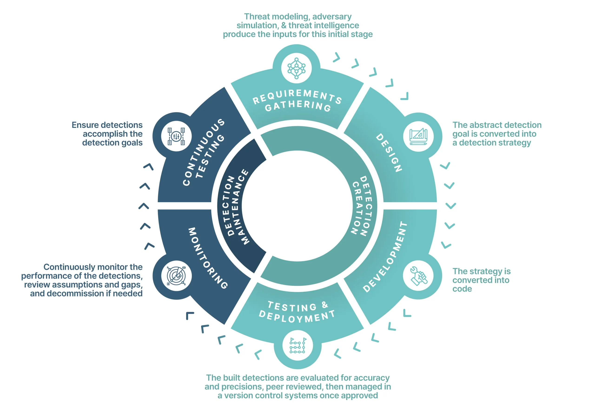
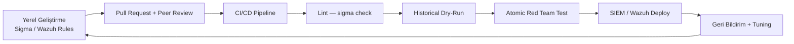
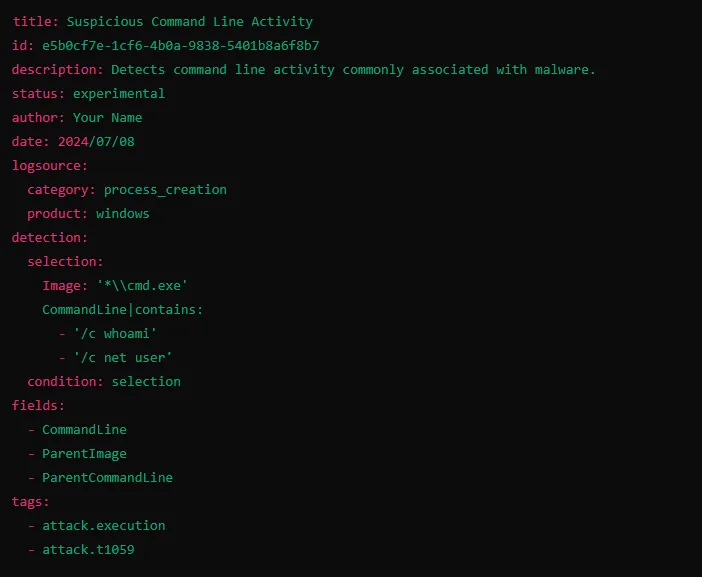
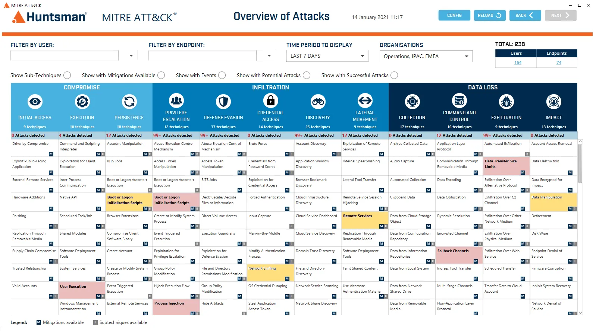
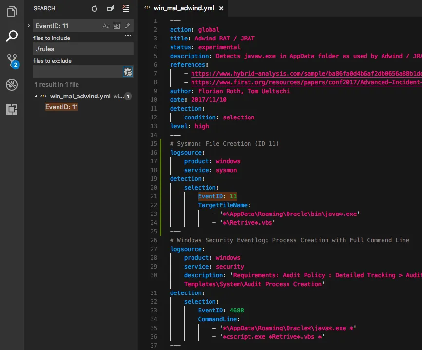
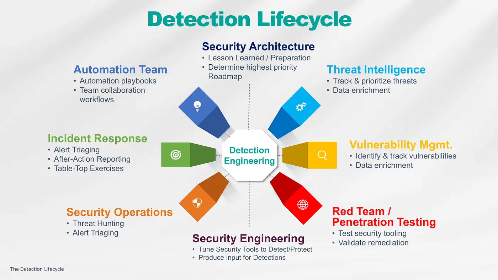

# Detection Engineering ve Tehdit Avcılığı (Threat Hunting)

Detection Engineering (Tespit Mühendisliği) ve Threat Hunting (Tehdit Avcılığı), savunmanın pasif alarm bekleyişinden proaktif arayışa evrildiği iki tamamlayıcı disiplindir. Detection Engineering, "bilineni yakalayan" sistematik tespit mekanizmalarının geliştirilmesi, test edilmesi ve bakımıdır; Threat Hunting ise otomasyonun kaçırdığı gizli tehditleri hipotez-güdümlü olarak arar. NIST Cybersecurity Framework 2.0 **Detect** fonksiyonu (DE.AE, DE.CM, DE.DP) bu iki disiplinin operasyonel omurgasını oluşturur.

Kurumsal topolojide sensörler (Sysmon, EDR, Zeek/Suricata) → log toplama (Kafka, Elastic Agent) → tespit motoru (Sigma, platform-native kurallar, UEBA) → SOAR geri bildirim döngüsü şeklinde konumlanan bu katman, KVKK ihlal tespiti, 5651 log bütünlüğü ve BDDK SIEM zorunluluklarıyla doğrudan ilişkilidir. Dosyasız saldırılar ve Living off the Land (LOTL) teknikleri için Sigma kural örnekleri [§7.3 Dosyasız Ataklar](../07-uc-nokta-guvenligi/03-dosyasiz-ataklar/) bölümünde; Shadow AI ve LLM trafiği tespiti için [§13.4 Gölge AI](../13-yapay-zeka-guvenligi/04-veri-egemenligi-ve-golge-ai/) bölümündeki KQL/Sigma kuralları bu bölümün DaC pipeline'ına entegre edilebilir.


*Detection Engineering yaşam döngüsü: planlama, geliştirme, test, dağıtım ve sürekli iyileştirme*



<details>
<summary>Detection-as-Code pipeline aşamaları (kaynak sentezi)</summary>

1. **Lint:** `sigma check ./rules/` — YAML syntax ve şema doğrulama. 2. **Historical dry-run:** Son 30 günlük veriye karşı false positive oranı hesaplama. 3. **Emulation:** Atomic Red Team / Caldera ile TTP replay. 4. **Environment tagging:** `production`, `audit-only`, `high-risk`. 5. **Deploy:** pySigma → Splunk/Wazuh/QRadar dönüşümü + API dağıtımı. Wazuh Ruleset-as-Code: `/var/ossec/etc/rules` Git versiyonlama + GitHub Actions otomatik deploy. NIST SP 800-53 **CM-2/CM-3** ve BDDK denetlenebilirlik gereksinimleriyle doğrudan örtüşür.

</details>

---

## §14.2.1. Detection-as-Code (DaC): Versiyon Kontrolü ve CI/CD

**Detection-as-Code (DaC)**, tespit kurallarını yazılım artefaktı olarak ele alır: Git versiyon kontrolü, pull request ile peer review, CI/CD pipeline ile otomatik test ve dağıtım. Geleneksel SIEM arayüzlerinde manuel oluşturulan kurallar ölçeklenemez; yüzlerce kuralın değişiklik geçmişi, geri alınabilirlik ve denetlenebilirlik DaC olmadan sağlanamaz.

### DaC Temel Prensipleri

| Prensip | Açıklama |
| :---- | :---- |
| **Versiyon kontrolü** | Her kural Git'te yaşar; kim, ne zaman, neden değiştirdi izlenebilir |
| **Peer review** | Hiçbir kural inceleme olmadan prodüksiyona çıkmaz |
| **CI/CD pipeline** | Lint, dry-run, emulation test prodüksiyon öncesi zorunlu |
| **Rollback** | Hatalı kural anında geri alınabilir |

### Repository Yapısı

```
detections/
├── windows/          # Sysmon, Security Event kuralları
├── linux/            # auditd, auth.log kuralları
├── network/          # Zeek, Suricata, firewall kuralları
├── cloud/            # CloudTrail, Azure Activity Log
├── threat-hunting/   # Hunting sorguları ve hipotezler
└── tests/
    ├── regression_data/   # Örnek log dosyaları
    └── verify_detection_logic.py
```

### CI/CD Pipeline Aşamaları

1. **Lint:** `sigma check ./rules/` — YAML syntax, şema doğrulama.
2. **Historical dry-run:** Son 30 günlük veriye karşı eşleşme sayısı hesaplama.
3. **Emulation test:** Atomic Red Team / Caldera ile kontrollü TTP replay.
4. **Environment tagging:** `production`, `audit-only`, `high-risk` etiketleri.
5. **Deploy:** pySigma dönüşümü → hedef SIEM API'sine dağıtım.

**GitHub Actions pipeline örneği:**

```yaml
name: Detection CI/CD
on:
  pull_request:
    paths: ['rules/**/*.yml']
  push:
    branches: [main]
    paths: ['rules/**/*.yml']

jobs:
  validate:
    runs-on: ubuntu-latest
    steps:
      - uses: actions/checkout@v4
      - run: pip install sigma-cli
      - run: sigma check ./rules/
      - run: python ./tests/verify_detection_logic.py --mock-data ./tests/regression_data/

  deploy:
    needs: validate
    if: github.ref == 'refs/heads/main'
    runs-on: ubuntu-latest
    steps:
      - run: sigma convert -t splunk -p sysmon ./rules/ -o ./output/savedsearches.conf
      - run: python ./scripts/splunk_api_deployer.py
```

### Wazuh Ruleset-as-Code (RaC)

Wazuh ortamlarında `/var/ossec/etc/decoders` ve `/var/ossec/etc/rules` dizinleri Git ile versiyonlanır; merge sonrası GitHub Actions Wazuh Manager'a otomatik deploy eder.

:::note
DaC yaklaşımı NIST SP 800-53 **CM-2** (Baseline Configuration) ve **CM-3** (Configuration Change Control) kontrolleriyle doğrudan ilişkilidir. BDDK kapsamındaki finans kurumları için tespit mekanizmalarının izlenebilir ve denetlenebilir olması pratik bir zorunluluktur.
:::

---

## §14.2.2. Sigma Kuralları ve Platform-Agnostik Tespit

**Sigma**, Florian Roth öncülüğünde geliştirilen açık kaynaklı, YAML tabanlı, vendor-agnostic tespit formatıdır. SigmaHQ deposunda 3000+ community kuralı bulunur; tek bir kural pySigma/sigma-cli ile 40+ SIEM backend'ine dönüştürülebilir. PowerShell cradle, WMI persistence ve bellek içi yürütme gibi dosyasız saldırı vektörleri için hazır Sigma kuralları ve Sysmon konfigürasyonu [§7.3 Dosyasız Ataklar](../07-uc-nokta-guvenligi/03-dosyasiz-ataklar/) bölümünde MITRE ATT&CK T1059.001, T1047, T1055 ile eşleştirilmiş olarak yer alır.


*Sigma kural bileşenleri: logsource, detection, condition, tags*

### Sigma Kural Yapısı

| Bileşen | Açıklama |
| :---- | :---- |
| `title`, `id`, `status` | Kural kimliği ve olgunluk durumu |
| `logsource` | Veri kaynağı (product, category, service) |
| `detection` | Selection grupları + condition |
| `falsepositives` | Bilinen benign senaryolar |
| `level` | critical / high / medium / low |
| `tags` | MITRE ATT&CK taktik ve teknikleri |

**Mantık:** YAML listesi = OR, dictionary = AND. Modifier'lar (`contains`, `startswith`, `endswith`, `all`, `cidr`, `base64`, `re`) esneklik sağlar.

### Örnek: AnyDesk Kurulumu (T1219)

```yaml
title: AnyDesk Installation
id: 0f06a3a5-6a09-413f-8743-e6cf35561297
status: experimental
description: AnyDesk uzaktan masaüstü kurulumunu tespit eder.
logsource:
  product: windows
  category: process_creation
detection:
  selection:
    CommandLine|contains|all:
      - '--install'
      - '--start-with-win'
    CurrentDirectory|contains: 'C:\ProgramData\AnyDesk.exe'
  condition: selection
falsepositives:
  - Meşru AnyDesk kurulumları
level: high
tags:
  - attack.command_and_control
  - attack.t1219
```

### Örnek: Şüpheli PowerShell İndirme (T1059.001)

```yaml
title: Suspicious PowerShell Download
status: experimental
logsource:
  category: process_creation
  product: windows
detection:
  selection_img:
    Image|endswith: '\powershell.exe'
  selection_encoded:
    CommandLine|contains|all:
      - 'http'
      - 'download'
  filter_legit:
    ParentImage|endswith:
      - '\chocolatey.exe'
      - '\ansible.exe'
  condition: selection_img and selection_encoded and not filter_legit
falsepositives:
  - Meşru yönetim scriptleri
level: medium
tags:
  - attack.execution
  - attack.t1059.001
```

### Sigma-to-SIEM Dönüşümü

```bash
pip install sigma-cli
sigma convert -t splunk -p sysmon rule.yml
sigma convert -t elasticsearch -p ecs_windows rule.yml
sigma convert -t microsoft365defender rule.yml
sigma convert -t qradar rule.yml
```

pySigma korelasyon kuralları (`event_count`, `value_count`, `temporal`) ile durumsal tespiti destekler.

### Sigma v2.0 Yenilikleri

*   **Taxonomy:** Özel alan adları ve log kaynağı isimleri.
*   **Scope:** Belirli makine tiplerinde kural tetikleme.
*   **Field Existence:** Opsiyonel alan varlık kontrolü.
*   **Placeholders:** Yönetici hesapları, jump server'lar için yer tutucular.
*   **Rule Correlation:** Çoklu event bağlama (ör. 5 dk içinde 10 başarısız + 1 başarılı login).

---

## §14.2.3. Detection Olgunluk Modelleri

Tespit programının olgunluğu, kural kalitesi, test kapsamı ve ATT&CK coverage ile ölçülür.


*ATT&CK Navigator ile tespit kapsama haritası*

### MITRE ATT&CK Coverage Matrix

ATT&CK Navigator layer dosyaları (JSON) ile teknik bazında tespit kapsamı görselleştirilir. Her tekniğin veri kaynağı ve mevcut kural sayısı renk kodlanır.

```json
{
  "name": "Mevcut Tespit Kapsamı - Q2 2026",
  "domain": "enterprise-attack",
  "techniques": [
    { "techniqueID": "T1059", "score": 100, "color": "#00ff00" },
    { "techniqueID": "T1055", "score": 0, "color": "#ff0000" },
    { "techniqueID": "T1078", "score": 75, "color": "#90ee90" }
  ]
}
```


*MITRE ATT&CK Enterprise matrisi — T1204 User Execution örneği*

### Olgunluk Modelleri Karşılaştırması

| Model | Seviyeler | Odak |
| :---- | :---- | :---- |
| **DEMM** (Detection Engineering Maturity Matrix) | Defined → Managed → Optimized | People, Process, Technology, Detection |
| **DEBMM** (Elastic) | 5 tier (Foundation → Expert) | Tier 2+ emulation, Tier 3+ external validation |
| **DML** (Detection Maturity Level) | DML-0 (yok) → DML-9 (strateji) | IOC → artifacts → tools → procedures → techniques → tactics |

**DML seviyeleri:**

| DML | Seviye | Tespit türü |
| :---- | :---- | :---- |
| DML-0 | Yok | Tespit yok |
| DML-1 | IOC | Hash, IP, domain |
| DML-2 | Artifacts | Registry, dosya yolu |
| DML-3 | Tools | Araç tespiti |
| DML-4 | Procedures | Prosedür tespiti |
| DML-5 | Techniques | MITRE teknik seviyesi |
| DML-6+ | Tactics/Strategy | Taktik ve strateji seviyesi |

**Hedef metrikler:** ATT&CK coverage %60–70 → %90+; FP oranı trend düşüşü; test coverage artışı; MTTD/MTTR iyileşmesi.

---

## §14.2.4. Yanlış Pozitif/Negatif Yönetimi ve Kural Tuning

**False Positive (FP):** Benign aktivitenin alarm üretmesi → alarm yorgunluğu. **False Negative (FN):** Gerçek tehditin kaçırılması → ihlal riski.

### Tuning Metodolojisi

```
Alarm üretimi → FP analizi → Kural ayarı (selection daraltma, filter ekleme)
  → Yeniden test → Dağıtım → Metrik izleme
```

| Teknik | Açıklama |
| :---- | :---- |
| **Threshold ayarı** | Eşik değerini yükseltme/düşürme |
| **Exception rules** | Güvenilir admin araçları, scheduled task'lar |
| **Context enrichment** | Varlık kritikliği, kullanıcı risk skoru |
| **Multi-stage correlation** | Tek kural yerine zincir korelasyon |
| **Baseline profiling** | UEBA benzeri normal davranış profili |

### Metrikler

| Metrik | Formül | Öncelik |
| :---- | :---- | :---- |
| **Precision** | TP / (TP + FP) | Gürültülü endpoint'lerde yüksek |
| **Recall** | TP / (TP + FN) | Domain Controller gibi kritik varlıklarda yüksek |
| **F1 Score** | 2 × (P × R) / (P + R) | Dengeli değerlendirme |

### Rule Card Şablonu

Her kural için dokümantasyon:

*   MITRE ATT&CK mapping
*   Veri kaynakları (Event ID, log kanalı)
*   Bilinen FP senaryoları
*   Tuning geçmişi
*   Sahip ve son review tarihi

### Wazuh Tuning Örneği

```xml
<!-- Kural 100015: Başarılı login (level 3) -->
<rule id="100015" level="3">
  <field name="eventid">4624</field>
  <description>Başarılı Windows oturum açma</description>
</rule>

<!-- Kural 100016: Başarısız login (level 5, T1110) -->
<rule id="100016" level="5">
  <if_sid>100015</if_sid>
  <field name="eventid">4625</field>
  <mitre><id>T1110</id></mitre>
  <description>Başarısız oturum açma denemesi</description>
</rule>

<!-- Kural 100017: Ansible jump host suppress (level 0) -->
<rule id="100017" level="0">
  <if_sid>100016</if_sid>
  <field name="srcip">10.10.5.50</field>
  <description>Ansible jump host — bastırıldı</description>
</rule>
```

:::caution
BDDK kapsamındaki finans kurumlarında FP'lerin operasyonel yükü ve FN'lerin regülasyon ihlali riski nedeniyle tuning SLA'ları tanımlanmalıdır. Haftalık FP review toplantıları zorunlu olmalıdır.
:::

---

## §14.2.5. Proaktif Threat Hunting: PEAK, TaHiTI ve MITRE ATT&CK

Threat Hunting, otomatik tespitlerin yakalayamadığı stealthy aktiviteleri proaktif olarak arar. **Assume breach** varsayımıyla çalışır: "Sistemimiz zaten ele geçirilmiş olabilir."


*PEAK Framework: Prepare → Execute → Act with Knowledge*

### Hunting Türleri

| Tür | Odak | Tetikleyici |
| :---- | :---- | :---- |
| **Hypothesis-Driven** | TTP teorileri | CTI, recent incident |
| **Baseline** | Normal dışı sapma | UEBA, istatistiksel outlier |
| **Model-Assisted (M-ATH)** | ML destekli | Anomali skorları |
| **Intelligence-Driven** | IOC/TTP | MISP, ticari feed |
| **Situational** | Risk odaklı | Varlık kritikliği, threat landscape |

### PEAK Framework

**PEAK (Prepare, Execute, Act with Knowledge)** — Splunk SURGe ekibi, vendor-agnostik çerçeve:

1. **Prepare:** Hipotez oluşturma, veri kaynağı belirleme, araç hazırlığı.
2. **Execute:** Sorgu çalıştırma, veri analizi, bulgu toplama.
3. **Act:** Bulguları kalıcı kurala dönüştürme, backlog güncelleme.

**ABLE hipotez bileşenleri:** **A**ctor (tehdit aktörü), **B**ehavior (TTP), **L**ocation (ağ konumu), **E**vidence (kanıt).

### TaHiTI Framework

**TaHiTI (Targeted Hunting integrating Threat Intelligence)** — Hollanda FI-ISAC:

1. **Preparation:** CTI'dan taktiksel senaryo seçimi.
2. **Hunt:** Veri toplama ve analiz.
3. **Refinement:** Bulguların CTI döngüsüne geri beslenmesi.

| Kriter | PEAK | TaHiTI |
| :---- | :---- | :---- |
| Geliştirici | Microsoft & SANS (2023) | Hollanda FI-ISAC (2018) |
| Tetikleyici | Tehdit teorileri, anomaliler | Doğrudan taktiksel CTI |
| Aşamalar | Prepare → Execute → Act | Preparation → Hunt → Refinement |
| Kazanım | Kalıcı detection kuralları | CTI refinement döngüsü |

### Hipotez Örneği (T1078 + T1021)

> "Uzlaşmış bir iş istasyonundan domain admin yetkileriyle RDP/WinRM kullanılarak lateral movement gerçekleştiriliyor olabilir. Normal iş saatleri dışında veya alışılmadık kaynak host'lardan gelen explicit credential logon'ları araştırılmalı."

**Kritik log kaynakları:**

| Event ID / Log | Kanal | ATT&CK |
| :---- | :---- | :---- |
| 4624 / 4625 / 4648 | Security | T1078, T1110 |
| 4688 | Security | T1059 |
| 4104 | PowerShell/Operational | T1059.001 |
| conn.log / dns.log | Zeek | T1071, T1048 |

**Azure KQL hunt sorgusu (nadir login lokasyonu — T1078.004):**

```kql
let baseline = SigninLogs
| where TimeGenerated > ago(90d)
| summarize HistoricCount=count() by UserPrincipalName, IPAddress, Location;
let current = SigninLogs
| where TimeGenerated > ago(30d) and IsInteractive == false;
current
| join kind=leftouter baseline on UserPrincipalName, IPAddress, Location
| where isnull(HistoricCount)
| project TimeGenerated, UserPrincipalName, IPAddress, Location, AppDisplayName
```

---

## §14.2.6. Hunting-to-Detection (H2D) Döngüsü

Başarılı bir av, özellikle tekrarlanabilir olanlar, kalıcı tespit kuralına dönüştürülür. Bu döngü Detection Engineering'in en güçlü geri bildirim mekanizmasıdır.


*Hunting-to-Detection döngüsü ve tespit mühendisliği mimarisi*

### H2D Döngüsü

1. **Hipotez oluştur** — ATT&CK + CTI + incident lessons learned.
2. **Hunt yürüt** — Manuel sorgu, script, UEBA dashboard.
3. **Bulguları doğrula** — Gerçek tehdit mi, FP mi?
4. **Codify** — Sigma kuralı veya platform-native kural yaz.
5. **Test & Tune** — Historical data + Atomic Red Team emulation.
6. **Deploy** — DaC pipeline ile prodüksiyon.
7. **Monitor & Iterate** — Etkinlik metrikleri, yeni hipotezler.

### Bulgu → Aksiyon Matrisi

| Bulgu tipi | Kesinlik | Aksiyon |
| :---- | :---- | :---- |
| Doğrulanmış TTP | Yüksek | Otomatik Sigma kuralı + deploy |
| Şüpheli pattern | Orta | Hunting checklist + izleme |
| Tek seferlik anomali | Düşük | Backlog'a ekle, periyodik review |

### KAPE Triage Entegrasyonu

Hunting sırasında toplanan artefaktlar kalıcı kurala dönüşebilir:

```cmd
C:\KAPE\kape.exe --tsource C: --target !SANS_Triage --tdest K:\TriageOutput --vss --overwrite
C:\KAPE\kape.exe --tsource C: --tdest E:\IR-Case --target EventLogs,RegistryHives,Prefetch --vhdx
```

LSASS dump → Event 4688 / Sysmon Event 10 korelasyonu → kalıcı Sigma kuralı.

---

## §14.2.7. Ağ Adli Bilişimi: Zeek, Suricata ve PCAP Analizi

Network Forensics, imza tabanlı tespitlerin kaçırdığı veya şifreli trafikteki anomalileri yakalamak için vazgeçilmezdir.

### Zeek (eski Bro)

Zeek pasif trafik analiziyle protokol-farkında, forensik-kalite telemetri üretir — IDS değil, kayıt motorudur.

| Log | İçerik |
| :---- | :---- |
| `conn.log` | L3/L4 bağlantı özeti |
| `dns.log` | DNS sorguları, C2/tünelleme tespiti |
| `http.log` | HTTP istekleri, user-agent, URI |
| `ssl.log` | TLS handshake, JA3/JA4 fingerprint |
| `files.log` | Dosya transferleri |
| `x509.log` | Sertifika bilgileri |

**UID omurgası:** Her bağlantı eşsiz bir `uid` alır; aynı UID DNS/HTTP/SSL/file olaylarında tekrarlanır — analist şüpheli bir conn.log kaydından ilgili tüm aktiviteye pivot yapabilir.

```
ts uid id.orig_h id.orig_p id.resp_h id.resp_p proto service duration orig_bytes resp_bytes conn_state history
```

### Suricata

İmza-tabanlı IDS/IPS; Zeek'i tamamlar. Security Onion stack'inde Zeek + Suricata + Elastic entegrasyonu standart NSM mimarisidir.

### Anomali Tespit Senaryoları

| Senaryo | Tespit yöntemi | ATT&CK |
| :---- | :---- | :---- |
| **DNS tunneling** | Yüksek entropy query, uzun subdomain, TXT record | T1071.004 |
| **C2 beaconing** | Periyodik küçük paketler, sabit aralık | T1071 |
| **Data exfiltration** | Olağandışı outbound byte volume | T1048 |
| **Lateral movement** | RDP/SSH/SMB pattern artışı | T1021 |

### JA4+ ile Şifreli C2 Tespiti

JA4+ (ja4, ja4s, ja4h, ja4l, ja4t) TLS fingerprint'leri ile şifreli C2 trafiği tespit edilir:

```zeek
@load policy/protocols/ssl/ja4

event ssl_established(c: connection) {
    if (c$ssl?$ja4_client && c$ja4_client in c2_ja4_blacklist) {
        Log::write(c2_ja4_alerts, [
            $ts = network_time(),
            $uid = c$uid,
            $ja4 = c$ja4_client,
            $resp_h = c$id$resp_h
        ]);
    }
}
```

### PCAP Analizi (Python/Scapy)

```python
from scapy.all import rdpcap, DNS

packets = rdpcap("suspicious_traffic.pcap")
for pkt in packets:
    if pkt.haslayer(DNS) and pkt[DNS].qr == 0:
        qname = pkt[DNS].qd.qname.decode()
        if len(qname) > 50:
            print(f"Suspicious long DNS query: {qname}")
```

:::danger
Saldırganlar DoH/DoT, domain fronting ve encrypted C2 kullanarak imza tabanlı tespiti atlatır. Zeek metadata + JA4+ fingerprint + behavioral baseline kombinasyonu zorunludur. 5651 kapsamında trafik log bütünlüğü ve uzun süreli saklama gereksinimleri network forensics altyapısını doğrudan etkiler.
:::

---

## §14.2.8. Özet ve Mimari Tavsiyeler

Detection Engineering ve Threat Hunting, savunma derinliğinin **Detect** katmanını olgunlaştırır. İki disiplinin entegrasyonu:

| Disiplin | Rol | Çıktı |
| :---- | :---- | :---- |
| **Detection Engineering** | Bilineni yakalama | Sigma kuralları, SIEM korelasyonu |
| **Threat Hunting** | Bilinmeyeni arama | Yeni TTP keşfi, gap analizi |
| **H2D Döngüsü** | Köprü | Hunting bulgusu → kalıcı kural |

### Uygulama Yol Haritası

| Aşama | Süre | Eylemler |
| :---- | :---- | :---- |
| **1** | 0–3 ay | Telemetry gap analizi + ATT&CK coverage assessment |
| **2** | 3–6 ay | Sigma tabanlı DaC pipeline (Git + CI/CD) |
| **3** | 6–12 ay | Temel TTP coverage (Tier 2) + düzenli hunting programı |
| **4** | 12–18 ay | Zeek + PCAP forensics + FP/FN metrik dashboard |

### Atomic Red Team ile Kural Doğrulama

Detection Engineering pipeline'ının emulation aşamasında **Atomic Red Team** kullanılır:

```powershell
Import-Module "C:\AtomicRedTeam\invoke-atomicredteam\Invoke-AtomicRedTeam.psd1"
Invoke-AtomicTest T1059.001 -TestNumbers 1 -CheckPrereqs
Invoke-AtomicTest T1059.001 -TestNumbers 1
Invoke-AtomicTest T1059.001 -TestNumbers 1 -Cleanup
```

Her atomic test beş dakikadan kısa sürede çalışır; DaC pipeline'ında CI aşamasında kontrollü TTP replay sağlar. Caldera ile çoklu TTP zinciri testleri purple team operasyonlarında kullanılır.

### Chainsaw + Sigma Entegrasyonu

Wazuh ortamlarında Sysmon/EVTX logları **Chainsaw** ile Sigma kurallarına karşı taranabilir; yüksek seviye alert'ler Wazuh custom rule ile yakalanır:

```bash
chainsaw hunt /evtx/path --sigma rules/sigma/ --mapping mappings/sigma-event-logs-all.yml
```

Bu yaklaşım, Wazuh'un native Sigma desteği olmadan platform-agnostik tespit sağlar.

### Senaryo: APT Lateral Movement Tespiti

**Saldırı tarafı:** Saldırgan phishing ile IK çalışanı kimlik bilgilerini ele geçirir; günde birkaç kez RDP ile finans segmentine yanal hareket dener. Statik eşik kuralları yakalamaz.

**Savunma tarafı:** Threat hunter, ATT&CK T1021 hipoteziyle 90 günlük baseline analizi yapar; IK çalışanının hiç veritabanı segmentine erişmediğini tespit eder. UEBA anomali skoru 0.9'u aşınca SOAR oturumu askıya alır. Hunting bulgusu Sigma kuralına dönüştürülür; bir sonraki ay aynı TTP anında yakalanır.

DaC ve Sigma ile ölçeklenebilirlik, ATT&CK odaklı olgunluk modelleri ile ölçülebilirlik, Hunting-to-Detection döngüsü ile sürekli iyileşme sağlanır. KVKK, 5651 ve BDDK yükümlülükleri log kalitesi, saklama, bütünlük ve hızlı tespit süreçleriyle doğrudan desteklenir.