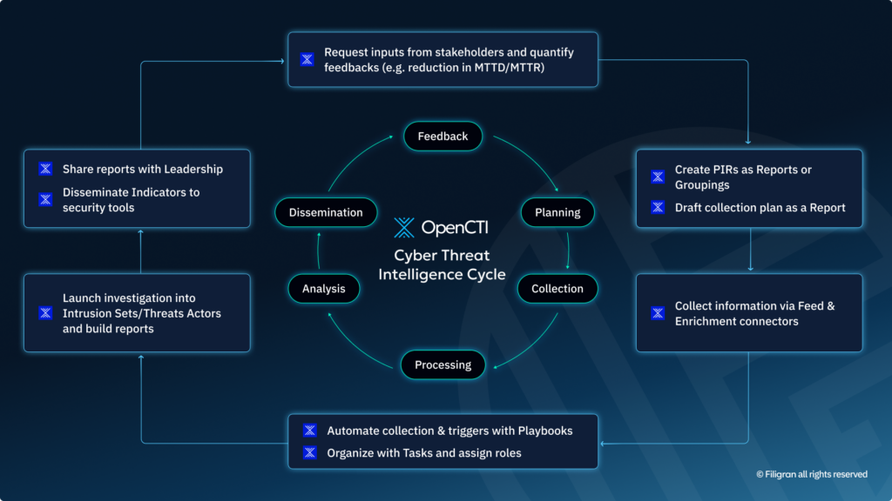
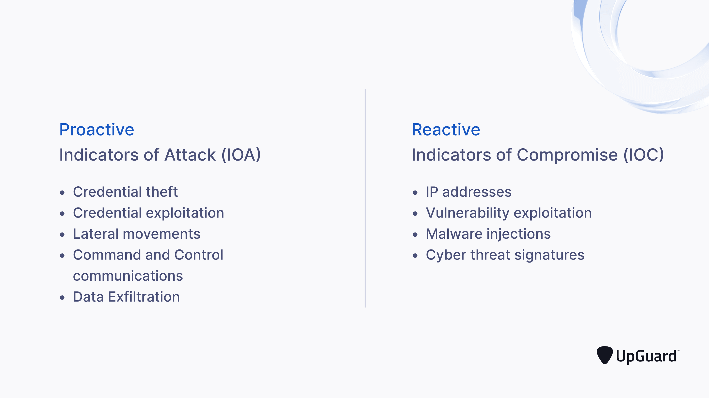
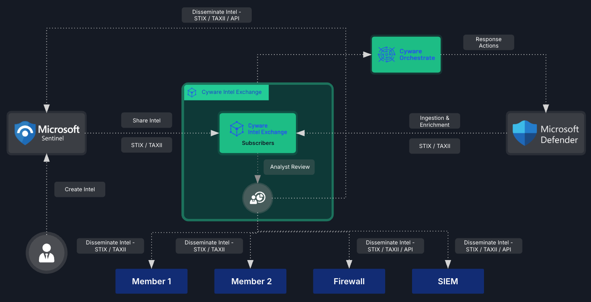
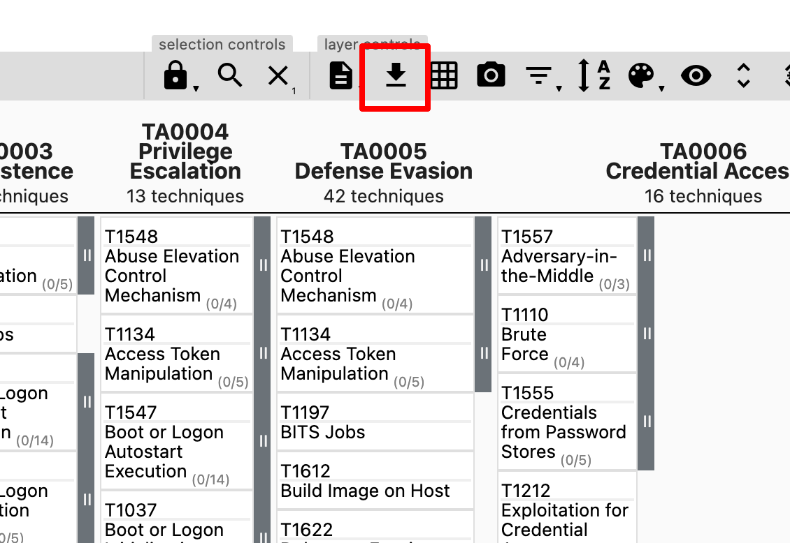
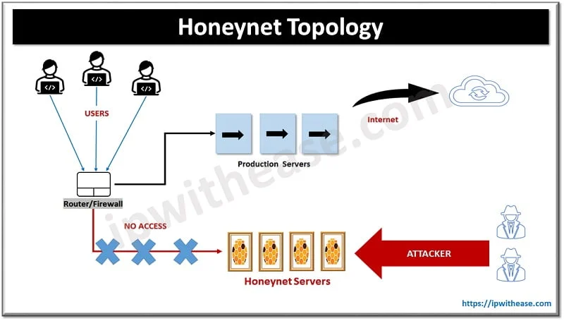

# Siber Tehdit İstihbaratı (CTI) ve Aldatma Teknolojileri

Savunma derinliği (Defense in Depth) mimarisinde **Siber Tehdit İstihbaratı (Cyber Threat Intelligence — CTI)** ve **Aldatma Teknolojileri (Deception)**, reaktif güvenlik kontrollerini proaktif ve istihbarat odaklı bir yapıya dönüştüren stratejik katmanlardır. CTI, ham tehdit verilerini eyleme dönüştürülebilir istihbarata çevirir; aldatma teknolojileri ise saldırganları yanıltarak tekniklerini, araçlarını ve motivasyonlarını açığa çıkarır. Bu iki bileşen birlikte çalıştığında SOC'un "ne arayacağını" tanımlar, tespit kurallarını zenginleştirir ve saldırganı öngörülebilir yollara iter.

Bu bölümde CTI yaşam döngüsü, IoC/IoA göstergeleri, STIX/TAXII paylaşım standartları, MITRE ATT&CK Navigator kapsama görselleştirmesi, honeypot/honeynet mimarileri, adversary emulation araçları ve kurumsal entegrasyon senaryoları — NIST, ISO 27001, CIS Controls, KVKK, 5651 ve BDDK çerçevesinde — ele alınacaktır.

---

## §14.3.1. Tehdit İstihbaratı ve Aldatmanın Savunma Mimarisi İçindeki Yeri

Modern SOC'lar, geleneksel reaktif izlemeden proaktif tehdit odaklı modele geçiş yapmak zorundadır. CTI bu geçişin yakıtını sağlarken; aldatma teknolojileri saldırganı gerçek varlıklardan uzaklaştırarak yüksek kaliteli telemetri üretir ve TTP'leri (Tactics, Techniques, Procedures) gerçek zamanlı ortaya çıkarır.

### Standart ve Mevzuat Çerçevesi

| Çerçeve | CTI İlgili Kontrol | Deception İlgili Kontrol |
| :---- | :---- | :---- |
| **NIST SP 800-53 Rev. 5** | PM-16 (Threat Awareness), SI-4 (System Monitoring) | SC-26 (Decoys — honeypot, honeynet, deception net) |
| **ISO 27001:2022** | A.5.7 (Tehdit İstihbaratı) | A.8.16 (İzleme faaliyetleri) |
| **CIS Controls v8** | Kontrol 8.4 (Tehdit İstihbaratı) | Kontrol 8.7 (Aldatma teknolojileri) |
| **MITRE ATT&CK** | Detection Coverage Mapping | Adversary Emulation (Caldera) |
| **KVKK (6698)** | Log/istihbarat verilerinde kişisel veri koruması | — |
| **5651 Sayılı Kanun** | Log saklama (min. 1 yıl, TÜBİTAK zaman damgası) | Aldatma olay loglarının adli saklama |
| **BDDK BSEBY** | Sürekli izleme, penetrasyon testi, tehdit istihbaratı | — |

**NIST SP 800-53 Rev. 5**, tehdit istihbaratının sistem mimarilerinin geliştirilmesi, güvenlik kontrollerinin seçimi, izleme, tehdit avcılığı ve müdahale faaliyetlerinde kullanılmasını zorunlu kılar. **SC-26** kontrolü ise saldırganları çekmek ve operasyonel sistemlerden uzaklaştırmak için aldatma ağlarının kurulmasını tanımlar.

**ISO 27001:2022** revizyonu, Ek-A Kontrol **5.7** ile tehdit istihbaratını resmi olarak güvenlik yönetim sistemine dahil etmiştir. Kurumların mevcut ve ortaya çıkan tehditler hakkında bilgi toplaması, analiz etmesi ve uygun aksiyonları alması beklenir.

> [!NOTE]
> Türkiye'de **KVKK Madde 12** gereği "gerekli teknik ve idari tedbirler" kapsamında tehdit istihbaratı ile yetkisiz erişim tespiti ve ihlal bildirimi yükümlülüğü güçlendirilir. Harici CTI platformlarından elde edilen veri sızıntısı analizlerinde yer alan e-posta, kullanıcı adı ve parola gibi kişisel verilerin işlenmesinde KVKK'nın veri minimizasyonu ve amaç sınırlaması ilkeleri gözetilmelidir.

### CTI Türleri ve Hedef Kitle

| CTI Türü | İçerik | Hedef Kitle | Örnek Çıktı |
| :---- | :---- | :---- | :---- |
| **Stratejik** | Jeopolitik trendler, sektörel risk | CISO, yönetim kurulu | Yıllık tehdit değerlendirme raporu |
| **Operasyonel** | Kampanya, tehdit aktörü profili, motivasyon | SOC Manager, CTI analisti | APT29 kampanya özeti |
| **Taktik** | IOC listeleri, TTP'ler, Sigma/YARA kuralları | SOC Tier-2/3, detection engineer | STIX bundle, SIEM kural seti |

### Savunma Derinliği Katmanlarında CTI + Deception

```
┌─────────────────────────────────────────────────────────────────┐
│                    KURUMSAL SAVUNMA MİMARİSİ                    │
├─────────────────────────────────────────────────────────────────┤
│  STRATEJİK KATMAN                                               │
│  ┌──────────────┐  ┌──────────────┐  ┌──────────────────┐      │
│  │  STIX/TAXII  │  │  MISP/OpenCTI│  │  Threat Feed     │      │
│  │  Paylaşım    │  │  Veri Depo   │  │  Entegrasyonu    │      │
│  └──────────────┘  └──────────────┘  └──────────────────┘      │
├─────────────────────────────────────────────────────────────────┤
│  TAKTİK KATMAN                                                  │
│  ┌──────────────┐  ┌──────────────┐  ┌──────────────────┐      │
│  │  SIEM (Wazuh)│  │  Threat Hunt │  │  ATT&CK          │      │
│  │  IOC/IOA     │  │  (Sorgular)  │  │  Navigator       │      │
│  └──────────────┘  └──────────────┘  └──────────────────┘      │
├─────────────────────────────────────────────────────────────────┤
│  OPERASYONEL KATMAN                                             │
│  ┌──────────────┐  ┌──────────────┐  ┌──────────────────┐      │
│  │  Caldera     │  │  Honeypot/   │  │  EDR / NDR       │      │
│  │  Emülasyon   │  │  Honeynet    │  │  Telemetri       │      │
│  └──────────────┘  └──────────────┘  └──────────────────┘      │
└─────────────────────────────────────────────────────────────────┘
```

---

## §14.3.2. CTI Yaşam Döngüsü: Yönlendirme, Toplama, İşleme, Analiz, Yayma, Geri Bildirim

CTI yaşam döngüsü, askeri istihbarat çerçevelerinden uyarlanmış altı aşamalı **döngüsel** bir süreçtir. Kritik nokta: 6. aşama (Geri Bildirim), 1. aşamaya (Yönlendirme) besleme yaparak sürecin zamanla iyileşmesini sağlar.


*CTI yaşam döngüsünün altı aşaması: yönlendirme, toplama, işleme, analiz, yayma ve geri bildirim*

### 1. Yönlendirme (Direction / Planning)

Kurumun en kritik varlıklarını ve bu varlıklara yönelik tehditleri tanımlayan **Öncelikli İstihbarat Gereksinimleri** (Priority Intelligence Requirements — PIR) oluşturulur. Bu aşama atlanırsa "her şeyi topla, hiçbir şeyi önceliklendirme" hatasına düşülür.

**Finans Sektörü PIR Örnekleri:**
- SWIFT mesajlaşma sistemine yönelik APT saldırılarının TTP'leri nelerdir?
- Kurumumuzun dış ağ yüzeyinde hangi zafiyetler istismar edilebilir?
- LockBit ransomware kampanyasının kurumsal segmentlere yansıması nedir?

### 2. Toplama (Collection)

PIR'ler doğrultusunda veri kaynakları belirlenir. İç ve dış kaynaklar birlikte değerlendirilir.

| Kategori | Kaynaklar |
| :---- | :---- |
| **İç Kaynaklar** | SIEM logları, EDR telemetrisi, DNS sorguları, proxy logları, firewall logları, honeypot logları |
| **Açık Kaynak (OSINT)** | Twitter/X, GitHub, Pastebin, açık tehdit feed'leri |
| **Ticari Feed'ler** | Recorded Future, CrowdStrike, Palo Alto Unit 42, IBM X-Force |
| **Paylaşım Platformları** | MISP, ISAC'lar (Sektörel Bilgi Paylaşım ve Analiz Merkezleri), USOM |

### 3. İşleme (Processing)

Ham verinin analiz edilebilir hale getirildiği aşamadır: gereksiz veriler filtrelenir, formatlar normalleştirilir, kopyalar temizlenir ve kayıtlar zenginleştirilir (enrichment). Örneğin bir IP adresine coğrafi konum, WHOIS bilgisi ve kötü amaçlı aktivite ilişkileri eklenir. Bu aşamada veriler özellikle **STIX 2.1** formatına dönüştürülür.

### 4. Analiz (Analysis)

İşlenmiş verilerin incelenerek **eylem bilgisine** dönüştürüldüğü aşamadır. Saldırgan davranış kalıpları, TTP'ler ve tehdit aktörü profilleri çıkarılır. IoA'lar bu aşamada ağırlık kazanır; attribution (saldırgan kimliği) ve güven skoru (confidence) hesaplanır.

### 5. Yayma (Dissemination)

İstihbaratın hedef kitleye uygun formatta sunulmasıdır:

| Seviye | Hedef Kitle | Format |
| :---- | :---- | :---- |
| **Teknik** | SOC analistleri | IOC listeleri, SIEM kuralları, STIX bundle |
| **Taktik** | Tehdit avcıları | Saldırı desenleri, hunting sorguları |
| **Stratejik** | Yönetim | Risk değerlendirmeleri, trend raporları |

### 6. Geri Bildirim (Feedback)

En çok ihmal edilen ama en kritik aşamadır. SANS CTI araştırmaları, ekiplerin çoğunun 1–5. aşamaları belgelediğini ancak 6. aşamayı atladığını ortaya koymuştur.

**Geri Bildirim Metrikleri:**

| Anlamsız Metrik | Anlamlı Metrik |
| :---- | :---- |
| "50.000 IOC işledik" | "Kurumsal kimlik bilgilerinin ele geçirildiğini ihlalden 3 hafta önce tespit ettik" |
| "100 tehdit feed'i entegre ettik" | "Feed entegrasyonu sonrası MTTD %40 azaldı" |
| "Haftalık CTI raporu yayınlandı" | "Rapor önerilerinin %60'ı detection kuralına dönüştürüldü" |

> [!WARNING]
> Geri bildirim aşaması atlandığında CTI programı "veri biriktirme deposu"na dönüşür. Her çeyrekte PIR'ları, feed kalitesini ve operasyonel etkiyi (MTTD/MTTR, false positive oranı) ölçen bir gözden geçirme toplantısı zorunlu tutulmalıdır.

### Kurumsal Topoloji ve Haberleşme

CTI platformu (OpenCTI, MISP veya ticari eşdeğeri) genellikle SOC'un güvenli segmentinde (DMZ veya ayrı VRF) konumlanır. SIEM ile API/webhook entegrasyonu kurulur; deception sensörleri hem internet-facing DMZ'de hem de iç segmentlerde (server VLAN, user segment) dağıtılır. Bu yapı **Detect → Enrich → Decide → Act** döngüsünü milisaniyeler seviyesinde çalıştırır.

**BDDK Uyumlu Finans Senaryosu:** Yeni bir ransomware kampanyası CTI feed'inden alınır → PIR güncellenir → IoC'ler Wazuh/Palo Alto'ya push edilir → EDR kuralları zenginleştirilir → Emülasyon (Caldera) ile tespit oranı doğrulanır → Geri bildirimle kural iyileştirilir.

---

## §14.3.3. IoC (Indicator of Compromise) ve IoA (Indicator of Attack)

Savunma mimarisinde siber tehditlerin tespiti iki boyutta ele alınır: **reaktif** (IoC odaklı) ve **proaktif** (IoA odaklı).


*IoC (geçmiş kanıt) ile IoA (devam eden davranış) arasındaki temel farklar*

### IoC — Güvence İhlali Göstergesi

IoC, bir saldırı gerçekleştikten sonra geride bırakılan **dijital parmak izleridir**. Adli bilişim uzmanlarının olay sonrası araştırmalarda aradığı "kanıt" niteliğindedir.

**IoC Türleri:**
- Kötü amaçlı dosya hash'leri (MD5, SHA-1, SHA-256)
- Şüpheli IP adresleri ve domain'ler
- Kayıt defteri değişiklikleri
- Anormal ağ trafik desenleri
- Yetkisiz kullanıcı hesapları

**IoC Zafiyeti:** Saldırganlar araçlarını sürekli değiştirdiği için IoC tabanlı tespit "sürekli bir kovalamaca oyunudur". Hash değiştirme, domain fluxing ve IP rotasyonu ile kolayca atlatılır.

### IoA — Saldırı Göstergesi

IoA, geçmişteki bir suçun kanıtını beklemek yerine, **saldırganların başarılı olmak için sergilemek zorunda olduğu davranış ve taktikleri** tespit eder. CISA'ya göre IoA, "bir saldırganın hedefine ulaşmak için sergilemesi gereken davranış serisini" tanımlar.

**IoA İzlediği Davranış Kalıpları:**
- Keşif (Reconnaissance) faaliyetleri
- Ayrıcalık yükseltme girişimleri
- Yanal hareket (Lateral Movement) davranışları
- Veri sızdırma (Exfiltration) desenleri
- Komuta ve kontrol (C2) iletişimleri

### Karşılaştırmalı Analiz

| Özellik | IoC | IoA |
| :---- | :---- | :---- |
| **Zamanlama** | Reaktif (geçmiş) | Proaktif (devam eden) |
| **Odak** | Spesifik, bilinen tehditler | Davranışsal kalıplar |
| **Tespit Mekanizması** | Periyodik tarama | Gerçek zamanlı akış taraması |
| **Sıfır Gün Etkinliği** | Düşük (imza yok) | Yüksek (davranış bazlı) |
| **Living-off-the-land** | Düşük tespit | Yüksek tespit |
| **ATT&CK İlişkisi** | Düşük | Yüksek (teknik seviyesinde mapping) |
| **Örnek** | SHA-256 hash, kötü IP | LSASS erişimi + şifreli PowerShell + SMB lateral movement |

### David Bianco'nun Acı Piramidi (Pyramid of Pain)

Bir indikatörü engellemenin saldırgana verdiği "acı" seviyesini gösteren altı kademe:

| Seviye | Etiket | Saldırgan Maliyeti |
| :---- | :---- | :---- |
| Hash | TRIVIAL | Saniyeler içinde yeniden üretilir |
| IP Adresi | EASY | Yeni IP kiralanır |
| Domain | SIMPLE | Yeni domain kaydedilir |
| Ağ/Konak Artefaktları | ANNOYING | Orta düzeyde değişiklik gerekir |
| Araçlar (Tools) | CHALLENGING | Yeni araç geliştirmek gerekir |
| **TTP'ler** | **TOUGH** | Metodolojiyi temelden değiştirmek gerekir |

> [!NOTE]
> **Saldırgan Perspektifi:** Saldırgan, IoC tabanlı sistemleri atlatmak için araçlarını sürekli değiştirir. Ancak IoA tabanlı sistemler, saldırganın **ne yapması gerektiğini** (yetki yükseltmek, yanal hareket etmek) hedef aldığı için araç değişikliklerinden etkilenmez. Modern savunma mimarisinde **katmanlı yaklaşım** ile her iki gösterge türünün birlikte kullanılması önerilir.

### SOC Korelasyon Tasarımı: IoA Odaklı Sigma Kuralı

Tek başına `powershell.exe` çalıştırılması meşru olabilir. Ancak "RDP oturumu açan yeni bir kullanıcının, hemen ardından `vssadmin.exe delete shadows` çalıştırması ve aynı süreç ağacında şifreli PowerShell oturumu başlatması" davranışı, fidye yazılımının yanal hareket imzasını (IoA) ortaya koyar.

```yaml
title: Ransomware IoA - VSS Shadow Delete After RDP Session
id: a3f8c2d1-4e5b-6a7c-8d9e-0f1a2b3c4d5e
status: experimental
description: RDP oturumu sonrası gölge kopya silme ve şifreli PowerShell — ransomware IoA
logsource:
  category: process_creation
  product: windows
detection:
  selection_rdp:
    EventID: 4624
    LogonType: 10
  selection_vss:
    Image|endswith: '\vssadmin.exe'
    CommandLine|contains: 'delete shadows'
  selection_ps:
    Image|endswith: '\powershell.exe'
    CommandLine|contains|all:
      - '-enc'
      - '-EncodedCommand'
  timeframe: 15m
  condition: selection_rdp and selection_vss and selection_ps
falsepositives:
  - Yedekleme yazılımı gölge kopya yönetimi
level: critical
tags:
  - attack.impact
  - attack.t1490
  - attack.execution
  - attack.t1059.001
```

---

## §14.3.4. Tehdit İstihbaratı Paylaşım Standartları: STIX 2.1 ve TAXII 2.1

STIX (Structured Threat Information Expression) ve TAXII (Trusted Automated Exchange of Intelligence Information), OASIS tarafından geliştirilen, tehdit istihbaratının **makine tarafından okunabilir formatta paylaşılmasını** sağlayan açık standartlardır.


*STIX/TAXII tabanlı çift yönlü tehdit istihbaratı paylaşım mimarisi: feed sağlayıcı ↔ TIP ↔ SIEM/EDR*

### STIX 2.1 Veri Modeli

STIX 2.1, tehdit istihbaratını temsil eden **nesne tabanlı bir model** sunar. Üç temel nesne grubu bulunur:

**STIX Domain Objects (SDO) — 18 nesne:**

| SDO | Açıklama |
| :---- | :---- |
| `indicator` | IoC/IoA gösterge tanımı (Patterning Language) |
| `malware` | Kötü amaçlı yazılım tanımı |
| `threat-actor` | Tehdit aktörü profili |
| `attack-pattern` | MITRE ATT&CK ile eşleşen saldırı deseni |
| `campaign` | Organize saldırı dizisi |
| `course-of-action` | Azaltma/müdahale aksiyonları |
| `observed-data` | Gözlemlenen olay verileri |
| `sighting` | Bir göstergenin ağda tespit edildiğini belgeleyen nesne |

**STIX Cyber Observables (SCO):** Ağda veya konak üzerinde gözlemlenen ham teknik veriler (`ipv4-addr`, `file`, `process`, `windows-registry-key`).

**STIX Relationship Objects (SRO):** Nesneler arası ilişki (`uses`, `indicates`, `targets`, `based-on`).

**İlişkisel Graf Örneği:**

```
[ Threat Actor (APT29) ]
         |
    (uses)
         v
[ Malware (CustomRAT) ] <--- (indicates) --- [ Indicator (Pattern) ]
         |                                          |
   (targets)                                    (based-on)
         v                                          v
[ Vulnerability (CVE-X) ]                  [ Cyber Observable (File) ]
```

### STIX 2.1 Indicator Örneği

```json
{
  "type": "indicator",
  "spec_version": "2.1",
  "id": "indicator--8e2e2d2b-17d4-4cbf-938f-98ee46b3cd3f",
  "created": "2026-06-21T00:00:00.000Z",
  "modified": "2026-06-21T00:00:00.000Z",
  "name": "MALICIOUS_IP_INDICATOR",
  "description": "Known C2 server associated with APT29",
  "pattern": "[ipv4-addr:value = '185.165.29.101']",
  "pattern_type": "stix",
  "valid_from": "2026-06-21T00:00:00.000Z",
  "confidence": 85,
  "labels": ["malicious-activity"]
}
```

### STIX Bundle ve Relationship Örneği

```json
{
  "type": "bundle",
  "id": "bundle--f47ac10b-58cc-4372-a567-0e02b2c3d479",
  "objects": [
    {
      "type": "threat-actor",
      "spec_version": "2.1",
      "id": "threat-actor--b6d8e5f4-3c2a-1b0e-9f8d-7e6c5b4a3928",
      "name": "APT29",
      "threat_actor_types": ["nation-state"],
      "goals": ["espionage", "credential-access"]
    },
    {
      "type": "malware",
      "spec_version": "2.1",
      "id": "malware--c7e9f6a5-4d3b-2c1f-0a9e-8f7d6c5b4a39",
      "name": "WellMess",
      "malware_types": ["backdoor"]
    },
    {
      "type": "relationship",
      "spec_version": "2.1",
      "id": "relationship--d8f0a7b6-5e4c-3d2a-1b0f-9a8e7d6c5b4a",
      "relationship_type": "uses",
      "source_ref": "threat-actor--b6d8e5f4-3c2a-1b0e-9f8d-7e6c5b4a3928",
      "target_ref": "malware--c7e9f6a5-4d3b-2c1f-0a9e-8f7d6c5b4a39"
    }
  ]
}
```

### TAXII 2.1 — Paylaşım Protokolü

TAXII, STIX verilerinin HTTPS üzerinden **otomatik ve gerçek zamanlı** paylaşımını sağlayan RESTful bir protokoldür.

**TAXII 2.1 Mimarisi:**

| Bileşen | Rol |
| :---- | :---- |
| **TAXII Server** | Tehdit istihbaratı sağlayıcısı (koleksiyonları barındırır) |
| **TAXII Client** | İstihbarat tüketicisi (koleksiyonlardan veri çeker) |
| **Collection** | İlgili STIX nesnelerinin mantıksal grubu |
| **API Root** | Keşif (discovery) ve yetenek sorgusu uç noktası |

**TAXII İletişim Akışı:**

```
TAXII İstemcisi                    TAXII Server
      |                                 |
      |--- GET /taxii2/ (Discovery) --->|
      |<-- 200 OK (API Roots) ----------|
      |                                 |
      |--- GET /collections/ ----------->|
      |<-- 200 OK (Metadata) -----------|
      |                                 |
      |--- GET /objects/ (Poll) ------->|
      |<-- 200 OK (STIX Bundle) --------|
```

**Paylaşım Topolojileri:**

| Topoloji | Açıklama |
| :---- | :---- |
| **Hub and Spoke** | Merkezi TAXII sunucusu verileri normalize ederek tüm uç birimlere dağıtır |
| **Source/Subscriber** | Tek yönlü: kaynak sunucu, aboneler veri çeker |
| **Peer-to-Peer** | Karşılıklı istemci/sunucu; merkeziyetçi olmayan sarmal ağ |

### MISP ve OpenCTI Platform Karşılaştırması

| Özellik | MISP | OpenCTI |
| :---- | :---- | :---- |
| **Veri Modeli** | Event-merkezli (Events → Attributes) | Graf-merkezli (STIX hipergraf) |
| **Güçlü Yön** | Gerçek zamanlı kurumlar-arası IOC paylaşımı | Korelasyon, görselleştirme (actor↔malware↔TTP) |
| **STIX Desteği** | STIX 2.1 import/export (misp-stix) | STIX 2.1 neredeyse tam uyum |
| **Öğrenme Eğrisi** | Düşük | Yüksek |
| **Entegrasyon** | Suricata/Snort kural export, TAXII publishing | Connectors (MISP, ATT&CK, CVE, VirusTotal) |

### Türkiye Mevzuatı ve CTI Entegrasyonu

- **5651 Sayılı Kanun:** İnternet erişim sağlayıcılarının log kayıtlarını **minimum 1 yıl** (özel durumlarda 2 yıl) saklamasını zorunlu kılar. TÜBİTAK kök zaman damgası ile hash imzalama, adli delil niteliği için kritiktir. CTI süreçlerinde iç veri kaynağı olarak kullanılabilir.
- **KVKK:** Kişisel veri içeren logların işlenmesinde veri minimizasyonu ve amaç sınırlaması ilkelerine uyulmalıdır.
- **BDDK BSEBY:** Bankalar, siber tehdit istihbaratı kapasitelerini geliştirmek, USOM referanslı tehdit bildirimlerini entegre etmek ve düzenli penetrasyon testleri yapmakla yükümlüdür.

---

## §14.3.5. MITRE ATT&CK Navigator ile İstihbarat Kapsama Görselleştirmesi

MITRE ATT&CK Navigator, ATT&CK matrisleri üzerinde **etkileşimli navigasyon ve açıklama** sağlayan bir web tabanlı araçtır. SOC, mevcut Wazuh kuralları, EDR coverage ve CTI kaynaklarını import ederek boşlukları (gap) tespit eder.


*ATT&CK Navigator'da tespit kapsama katmanının dışa aktarımı — renk kodlu teknik kapsamı*

### Temel Kullanım Alanları

1. **Savunma Kapsama Görselleştirmesi:** Mevcut tespit yeteneklerinin ATT&CK teknikleri karşısındaki kapsamını renklendirerek gösterir
2. **Kırmızı/Mavi Takım Planlaması:** Simülasyon ve test stratejilerinin görselleştirilmesi
3. **Tehdit Aktörü Karşılaştırması:** Birden fazla APT grubunun teknik kapsamının yan yana karşılaştırılması
4. **Tespit Açıklarının Belirlenmesi:** Hangi tekniklerin izlenmediğinin tespiti

### Tespit Olgunluk Puanlama Matrisi

| Skor | Renk | Olgunluk | Kriter |
| :---- | :---- | :---- | :---- |
| **0** | Kırmızı | Kapsama Yok | Kural yok veya log kaynağı entegre değil |
| **25** | Turuncu | Minimal | Log toplanıyor, kural test edilmemiş |
| **50** | Sarı | Kısmi | Kural aktif, dar varyasyon kapsamı |
| **75** | Açık Yeşil | İyi | Zengin veri kaynakları, düşük FP |
| **100** | Koyu Yeşil | Mükemmel | Çoklu katman tespit, otomatik emülasyon testi |

### Önceliklendirme Formülü

Teknik öncelik skoru şu formülle hesaplanır:

```
Priority = (Prevalence × Impact) / Feasibility
```

Parametreler 1–10 arasında değişir:
- **Prevalence:** Sektördeki APT gruplarının bu tekniği kullanma sıklığı
- **Impact:** Tekniğin başarılı olması durumundaki hasar boyutu
- **Feasibility:** Tespit için gereken log kaynağının devreye alma zorluğu

### Layer JSON Örneği (Tespit Kapsama)

```json
{
  "name": "Mevcut Tespit Kapsamı - Q2 2026",
  "versions": {
    "attack": "15",
    "navigator": "4.9.0",
    "layer": "4.5"
  },
  "domain": "enterprise-attack",
  "description": "Siber Güvenlik Operasyon Merkezi mevcut tespit yetenekleri",
  "filters": {
    "platforms": ["Windows", "Linux", "macOS"]
  },
  "sorting": 0,
  "layout": {
    "layout": "side",
    "aggregateFunction": "average",
    "showID": false,
    "showName": true
  },
  "techniques": [
    {
      "techniqueID": "T1059",
      "score": 100,
      "color": "#00ff00",
      "comment": "PowerShell komut satırı izleme aktif"
    },
    {
      "techniqueID": "T1055",
      "score": 0,
      "color": "#ff0000",
      "comment": "Process Injection — Tespit yok!"
    },
    {
      "techniqueID": "T1003.001",
      "score": 75,
      "color": "#90ee90",
      "comment": "LSASS erişimi Sysmon Event ID 10 ile izleniyor"
    }
  ]
}
```

### SIEM Kural İhracı ve ATT&CK Eşlemesi

**Splunk ES Korelasyon Arama İhracı (SPL):**

```spl
| rest /services/saved/searches
| search disabled=0 action.correlationsearch.enabled=1
| table title, search, action.notable.param.security_domain, action.notable.param.severity, action.correlationsearch.annotations
| eval mitre_techniques=spath('action.correlationsearch.annotations', "mitre_attack{}")
```

**Microsoft Sentinel Analitik Kural İhracı (KQL):**

```kql
SecurityAlert
| summarize count() by AlertName, ProductName
| join kind=inner (
    resources
    | where type == "microsoft.securityinsights/alertrules"
    | extend tactics = properties.tactics, techniques = properties.techniques
) on $left.AlertName == $right.name
| project AlertName, tactics, techniques, count_
```

> [!CAUTION]
> Navigator, katman dosyalarını **sunucu tarafında saklamaz** — tamamen istemci tarafı (client-side) bir uygulamadır. Hassas katman dosyaları için kurum içi (on-premise) instance kurulması önerilir. Katman dosyaları versiyon kontrolüne (Git) alınmalıdır.

---

## §14.3.6. Aldatma Teknolojileri: Honeypot, Honeynet ve Honeymonkey

Aldatma teknolojileri, NIST SP 800-53 **SC-26** kontrolü kapsamında, "saldırganları çekmek ve onları operasyonel sistemlerden uzaklaştırmak" için kurulan tuzak sistemlerdir. Meşru kullanıcıların erişmek için hiçbir nedeni olmayan, ancak saldırganın keşif ve yanal hareket aşamasında cazip hedef olarak algılayacağı sahte kaynakların bilerek ağ segmentlerine yerleştirilmesidir.


*Tekil honeypot ile çoklu honeypot'tan oluşan honeynet mimarisinin karşılaştırması*

### Düşük Etkileşimli (Low-Interaction) Honeypot

Sınırlı sayıda hizmeti (SSH, SMB, HTTP) emüle eder. Gerçek bir işletim sistemi çalıştırmaz.

| Özellik | Değer |
| :---- | :---- |
| **Kullanım** | Otomatik taramaların tespiti, düşük kaynak tüketimi |
| **Risk** | Düşük (saldırgan gerçek sisteme erişemez) |
| **Araçlar** | Honeyd, Dionaea, Cowrie (düşük mod) |
| **İstihbarat Değeri** | İlk keşif verileri, botnet malware örnekleri |

**Dionaea Konfigürasyon Örneği:**

```yaml
# dionaea.conf - Düşük etkileşimli honeypot
listen:
  - host: 0.0.0.0
    port: 21      # FTP
  - host: 0.0.0.0
    port: 22      # SSH
  - host: 0.0.0.0
    port: 80      # HTTP
  - host: 0.0.0.0
    port: 445     # SMB
  - host: 0.0.0.0
    port: 1433    # MSSQL

logging:
  - level: ALL
    output: /var/log/dionaea.log
    format: json
```

### Yüksek Etkileşimli (High-Interaction) Honeypot

Tam bir işletim sistemi çalıştırır ve saldırganın **derinlemesine hareketini** kaydeder.

| Özellik | Değer |
| :---- | :---- |
| **Kullanım** | İleri seviye saldırganların incelenmesi, zero-day keşfi |
| **Risk** | Yüksek (saldırgan kaçış yapabilir — izolasyon şart) |
| **Araçlar** | Cowrie (yüksek mod), Honeydrive, Sebek |
| **İstihbarat Değeri** | Klavye komutları, indirilen araçlar, credential dumping |

### Honeypot Türleri Karşılaştırması

| Honeypot Türü | Etkileşim | Risk | İstihbarat Değeri | Araçlar |
| :---- | :---- | :---- | :---- | :---- |
| **Dionaea** | Düşük | Çok Düşük | İlk keşif, malware örnekleri | SMB, FTP, HTTP port dinleyicileri |
| **Cowrie** | Orta–Yüksek | Orta | SSH komutları, brute-force şifreleri | SSH/Telnet emülasyonu, VM proxy |
| **T-Pot** | Değişken | Düşük–Orta | 20+ honeypot all-in-one platform | Cowrie, Dionaea, Conpot ICS, Elastic Stack |
| **HoneyMonkey** | İstemci (aktif) | Düşük (izole VM) | Tarayıcı zafiyetleri, drive-by download | Strider, HoneyClient |

### Honeynet Tasarımı ve Nesil Evrimi

Birden fazla honeypot'un bir ağ olarak yapılandırılmasıdır — **tüm bir ortamı simüle eder**.

**Honeynet Tasarım Prensipleri:**
1. **Veri Yakalama (Data Capture):** Tüm ağ trafiği, dosya sistemi değişiklikleri, proses aktiviteleri kaydedilmeli
2. **Veri Kontrolü (Data Control):** Saldırganın honeynet dışına çıkması engellenmeli (ingress/egress filtreleme)
3. **Veri Gizleme (Data Concealment):** Honeypot olduğu saldırgan tarafından anlaşılmamalı
4. **İzolasyon:** Üretim ağından tamamen yalıtılmış olmalı

**Honeynet Nesil Evrimi:**

| Nesil | Dönem | Özellik |
| :---- | :---- | :---- |
| **Gen I (1999)** | Temel veri toplama, sabit outbound limit (5–10 paket) | Fingerprinting riski yüksek |
| **Gen II (2002)** | Honeywall (Layer 2 bridge), Snort-Inline, Sebek modülü | Saldırgan honeywall'u tespit edemez |
| **Gen III** | Hflow teknolojisi — ağ paketleri + konak içi adli veri korelasyonu | En gelişmiş veri yakalama |

### Honeymonkey (İstemci Honeypot)

Pasif honeypot'ların aksine, aktif olarak şüpheli web sitelerini ziyaret eden istemci emülatörleridir. Microsoft'un **Strider HoneyMonkey** projesi (2005), yamalı ve yamasız sistemleri katmanlı kullanarak sıfırıncı gün tarayıcı zafiyetlerini ortaya çıkarmıştır.

**Çalışma Prensibi:**
1. Honeyclient şüpheli web sitelerini ziyaret eder
2. Site tarafından gönderilen exploit'leri (drive-by download) yakalar
3. Sistemdeki değişiklikleri (dosya, registry, proses) izler

### Active Directory Deception ve Honeytoken

Saldırganlar kurumsal ağa sızdıktan sonra yetki yükseltmek için AD veritabanına yönelir. AD üzerinde kurgulanacak aldatma mimarisi, saldırganları yanal hareket aşamasında yakalar.

**Kerberoasting Tuzağı:**
- SPN özniteliği `MSSQLSvc/db-prod.kurumsal.local:1433` atanmış sahte servis hesabı oluşturulur
- `pwdLastSet` ve `whenCreated` öznitelikleri geçmiş yıllara manipüle edilir (eski hesap görünümü)
- Domain Controller'da Event ID **4769** (Kerberos Service Ticket) tetiklendiğinde kesin sızma kanıtı üretilir

**Kurumsal Konumlandırma:**
- **Dış DMZ:** Düşük etkileşimli honeypot'lar recon'ı erken yakalar
- **İç network (server segmenti):** Yüksek etkileşimli honeypot veya honeytoken'lar lateral movement'ı tetikler
- **Tetiklenen alarm** → SIEM'e syslog/API ile akar → CTI platformuna STIX Sighting olarak işlenir

> [!WARNING]
> Yüksek etkileşimli honeypot'lar saldırganın dış ağlara saldırı amacıyla köprü olarak kullanılma riski taşır. Sıkı firewall kuralları, honeywall izolasyonu ve egress filtreleme zorunludur. Gelişmiş aktörler honeypot'u VM artefaktları, timing anomalileri ve eksik registry anahtarları ile tespit edebilir — çeşitlilik ve düzenli güncelleme şarttır.

---

## §14.3.7. Adversary Emulation: Caldera ve Atomic Red Team

Adversary Emulation (Rakip Emülasyonu), gerçek saldırgan davranışlarının kontrollü bir ortamda simüle edilmesidir. Purple teaming ile tespit yeteneği (detection coverage), response playbook'ları ve deception etkinliği doğrulanır.

### MITRE Caldera™

Caldera, MITRE ATT&CK çerçevesi üzerine inşa edilmiş, **otomatik rakip emülasyon platformudur**. Asenkron C2 sunucusu, REST API ve web arayüzü içerir.

**Caldera Bileşenleri:**

| Bileşen | Açıklama |
| :---- | :---- |
| **Core System** | C2 sunucusu, API, web arayüzü |
| **Sandcat** | Varsayılan ajan (GoLang, çapraz platform) |
| **Stockpile** | TTP ve profil deposu |
| **Atomic Plugin** | Atomic Red Team TTP'leri |
| **Compass Plugin** | ATT&CK görselleştirmeleri |

**Caldera Kurulum ve Çalıştırma:**

```bash
# Caldera kurulumu
git clone https://github.com/apache/caldera.git
cd caldera
pip install -r requirements.txt

# Caldera başlatma (varsayılan port: 8888)
python server.py --insecure

# Web arayüzü: https://localhost:8888
# Varsayılan kullanıcı: admin / admin
```

**Özel Adversary Profile (YAML):**

```yaml
---
id: "custom-apt"
name: "Özel APT Simülasyonu"
description: "Kuruma özel tehdit aktörü simülasyonu"
atomic_ordering:
  - "9a30740d-3aa8-4c23-8efa-d51215e8a5b9"
  - "a1b2c3d4-e5f6-7890-abcd-ef1234567890"
```

**Caldera Ability YAML Örneği (T1016 — Ağ Yapılandırması Keşfi):**

```yaml
- id: 9a30740d-3aa8-4c23-8efa-d51215e8a5b9
  name: Kablosuz Ağ Profillerini Keşfet
  description: Sistemde kayıtlı WIFI ağlarının şifrelerini sızdırmak üzere profilleri tarar.
  tactic: discovery
  technique:
    attack_id: T1016
    name: System Network Configuration Discovery
  platforms:
    windows:
      psh:
        command: |
          netsh wlan show profiles | Select-String "All User Profile" | ForEach-Object { $_.ToString().Split(":")[1].Trim() } | ForEach-Object { netsh wlan show profile name="$_" key=clear }
        cleanup: |
          Remove-Item -Force $env:TEMP\wifi_temp.txt -ErrorAction SilentlyContinue
        payloads: []
```

### Atomic Red Team

Atomic Red Team, **küçük, odaklanmış, tek bir tekniği test eden** script'lerden oluşan bir TTP kütüphanesidir. Her test beş dakikadan kısa sürede çalışır ve minimum kurulum gerektirir.

**Caldera vs Atomic Red Team Karşılaştırması:**

| Özellik | Caldera | Atomic Red Team |
| :---- | :---- | :---- |
| **Yapı** | Tam otomasyon platformu (C2) | Bağımsız test script'leri |
| **Kapsam** | Çoklu TTP zincirleri | Tekil teknik odaklı |
| **C2** | Dahili C2 sunucusu | Gerektirmez |
| **Log Gürültüsü** | Çok düşük (komutlar C2 üzerinden) | Yüksek (PowerShell modül yükleme, YAML okuma) |
| **Kullanım** | Kırmızı takım operasyonları | Hızlı doğrulama testleri |
| **Dil** | Python + Plugin mimarisi | PowerShell, Bash, Python |

**Atomic Red Team PowerShell Yürütüm Senaryosu:**

```powershell
# 1. Modül yükleme
Set-ExecutionPolicy Unrestricted -Scope Process -Force
Import-Module Invoke-AtomicRedTeam

# 2. LSASS bellek dökümü (T1003.001) — önkoşul kontrolü
Invoke-AtomicTest T1003.001 -TestNumbers 1 -CheckPrereqs

# 3. Eksik bağımlılık indirme
Invoke-AtomicTest T1003.001 -TestNumbers 1 -GetPrereqs

# 4. Test çalıştırma
Invoke-AtomicTest T1003.001 -TestNumbers 1

# 5. Temizlik
Invoke-AtomicTest T1003.001 -TestNumbers 1 -Cleanup
```

**Atomic Test Örneği (T1059.001 — PowerShell):**

```powershell
# Atomic Test #1 - PowerShell komut çalıştırma
Write-Host "Atomic Red Team - T1059 Test Başlıyor"
$command = "Get-WmiObject -Class Win32_Process"
Invoke-Expression $command

# Beklenen gözlem: PowerShell prosesi, WMI sorgusu
# SIEM kuralı: Event ID 4688 (Process Creation) + PowerShell Event ID 4104
```

### Purple Team Entegrasyon Döngüsü

```
Caldera/Atomic emülasyonu çalıştır
         ↓
EDR, SIEM, NDR çıktılarını izle
         ↓
Tespit edilen/edilemeyen TTP'leri belgele
         ↓
Tespit edilemeyen teknikler için detection rule geliştir
         ↓
ATT&CK Navigator'da kapsama güncellemesi yap
         ↓
CTI döngüsüne geri besleme (PIR güncelleme)
```

> [!CAUTION]
> Caldera ve Atomic Red Team testleri **yalnızca izole laboratuvar ortamında** veya üretim dışı purple team pencerelerinde çalıştırılmalıdır. LSASS dökümü, gölge kopya silme gibi testler gerçek güvenlik kontrollerini tetikleyebilir ve operasyonel kesintiye yol açabilir. Test öncesi change management onayı ve rollback planı zorunludur.

---

## §14.3.8. Operasyonel Entegrasyon: Wazuh, MISP ve Active Response

Büyük ölçekli kurumsal yapılarda CTI ile aldatma altyapılarının koordineli çalışması mavi takım için en yüksek görünürlüğü sağlar. Aşağıdaki senaryoda bir saldırgan, AD üzerindeki sahte bal servis hesabına (svc_old_db) Kerberoasting girişiminde bulunur; Wazuh olayı yakalar, MISP'ten zenginleştirir ve Active Response ile saldırganı izole eder.

### Entegrasyon Akışı

```
Saldırgan (10.0.80.50) ──> Domain Controller (AD)
                                | (Event ID 4769 tetikler)
                                v
                           Wazuh Agent (DC)
                                | (Olayı yakalar)
                                v
                           Wazuh Server
                                | (Decoder + Rule analizi)
                                | (MISP sorgusu)
                                v
                           MISP Sunucusu
                                |
              ┌─────────────────┴─────────────────┐
              | Eşleşme Yok                       | Eşleşme Var
              v                                   v
        Sadece Alarm                        Active Response
                                                  | (IP engelleme)
                                                  v
                                         Saldırgan İzole Edildi
```

### Adım 1: Wazuh Özel Decoder

Kerberos bilet isteklerini ayrıştıran özel XML decoder (`/var/ossec/etc/decoders/local_decoder.xml`):

```xml
<decoder name="win_kerberos_deception">
  <parent>windows</parent>
  <regex offset="after_parent">EventID: (4769) .* Service Name: (\S+) .* Client Address: ::ffff:(\d+.\d+.\d+.\d+)</regex>
  <order>eventid, target_user, srcip</order>
</decoder>
```

### Adım 2: Wazuh Korelasyon Kuralı

Aldatma hesabına yönelik Kerberoasting tespiti (`/var/ossec/etc/rules/local_rules.xml`):

```xml
<group name="windows,deception_alerts,">
  <rule id="100150" level="12">
    <decoded_as>windows</decoded_as>
    <field name="eventid">4769</field>
    <field name="target_user">svc_old_db</field>
    <description>Kritik: AD Bal Servis Hesabına Kerberoasting Saldırısı!</description>
    <mitre>
      <id>T1558.003</id>
    </mitre>
  </rule>
</group>
```

### Adım 3: MISP Entegrasyon Betiği

Wazuh Integrator modülünün çalıştıracağı Python betiği (`/var/ossec/integrations/custom-misp-query.py`):

```python
#!/usr/bin/env python3
import sys
import json
import requests

requests.packages.urllib3.disable_warnings()

def main():
    alert_file = sys.argv[1]
    api_key = "YOUR_MISP_API_KEY"
    misp_url = "https://misp.kurumsal.local/attributes/restSearch"

    with open(alert_file, 'r') as f:
        alert_json = json.load(f)

    src_ip = alert_json.get('data', {}).get('srcip')
    if not src_ip:
        sys.exit(0)

    headers = {
        "Authorization": api_key,
        "Accept": "application/json",
        "Content-Type": "application/json"
    }

    payload = {
        "returnFormat": "json",
        "type": "ip-src",
        "value": src_ip
    }

    try:
        response = requests.post(misp_url, headers=headers, json=payload, verify=False, timeout=10)
        if response.status_code == 200:
            result = response.json()
            if result.get('response', {}).get('Attribute'):
                print(json.dumps({
                    "misp_enrichment": "success",
                    "misp_match": "true",
                    "ip": src_ip,
                    "threat_actor": result['response']['Attribute'][0].get('Event', {}).get('info', 'Bilinmeyen')
                }))
    except Exception:
        sys.exit(0)

if __name__ == "__main__":
    main()
```

### Adım 4: Active Response Yapılandırması

`ossec.conf` içinde saldırgan IP'sini 1 saat engelleyen yapılandırma:

```xml
<ossec_config>
  <command>
    <name>custom_firewall_block</name>
    <executable>firewall-drop</executable>
    <timeout_allowed>yes</timeout_allowed>
  </command>

  <active-response>
    <disabled>no</disabled>
    <command>custom_firewall_block</command>
    <location>local</location>
    <rules_id>100150</rules_id>
    <timeout>3600</timeout>
  </active-response>
</ossec_config>
```

### 5651 Uyumlu Adli Kanıt Bütünlüğü

Active Response ile gerçekleştirilen engelleme ve aldatma logları, **5651 Sayılı Kanun** gereğince adli makamlara sunulabilir nitelikte saklanmalıdır:

- Tüm log dosyaları günlük olarak toplanıp **SHA-256** hash imzaları çıkarılmalı
- **TÜBİTAK Kök Zaman Damgası** ile mühürlenmeli
- En az **1 yıl** (toplu kullanım sağlayıcılar için 2 yıl) şifreli arşiv depolarında tutulmalı
- Log sunucusu operasyonel sistemlerden ayrı ve değiştirilemez olmalıdır

---

## §14.3.9. Sonuç ve Öneriler

CTI ve aldatma teknolojileri, savunma derinliğinin "görünmez" ama en yüksek sinyal üreten katmanını oluşturur. Stratejik seviyede risk kararlarını (PIR), operasyonel seviyede TTP analizini ve taktik seviyede otomatik aksiyonu besler.

### Uygulama Yol Haritası

| Aşama | Süre | Eylemler | Eşik Metrik |
| :---- | :---- | :---- | :---- |
| **Aşama 1 — Temel** | 0–3 ay | PIR tanımlama, MISP/OpenCTI kurulumu, STIX/TAXII 2.1 entegrasyonu, DMZ'de düşük etkileşimli honeypot | CTI platformu aktif, en az 3 feed entegre |
| **Aşama 2 — Taktik** | 3–9 ay | IoA odaklı Sigma kuralları, ATT&CK Navigator kapsama haritası, AD honeytoken, Wazuh-MISP entegrasyonu | Navigator kapsama >%50, MTTD iyileşmesi |
| **Aşama 3 — Proaktif** | 9–18 ay | Caldera + Atomic Red Team purple team, honeynet (Gen III), deception-SIEM korelasyonu, 5651 uyumlu adli log arşivi | Emülasyon coverage >%75, dwell-time sektör medyanının altında |

### Önerilen Açık Kaynak / Hibrit Stack

| Katman | Araç |
| :---- | :---- |
| **CTI Yönetimi** | OpenCTI veya MISP (STIX/TAXII native) |
| **SIEM/XDR + ATT&CK** | Wazuh (MITRE modülü, IoC active response) |
| **Emülasyon** | Caldera + Atomic Red Team |
| **Deception** | Cowrie + T-Pot + AD honeytoken'lar |
| **Entegrasyon** | API/webhook + STIX push/pull |

### Temel Öneriler

1. **CTI Yaşam Döngüsü:** Altı aşamanın tamamını uygulayın; Geri Bildirim aşamasını atlamayın. Anlamsız metrikler (IOC sayısı) yerine operasyonel etki (MTTD/MTTR) ölçün.

2. **IoC + IoA Dengesi:** Reaktif IoC tespiti ile proaktif IoA davranış analizini birlikte kullanın. Acı Piramidi'nin TTP katmanına odaklanın.

3. **STIX/TAXII 2.1'e Geçiş:** Eski protokolleri deprecate eden sağlayıcılarla uyum için 2.1 sürümüne geçin. Hub-and-Spoke topolojisi ile merkezi istihbarat yönetimi kurun.

4. **ATT&CK Navigator:** Tespit kapsamını düzenli olarak görselleştirin, boşlukları önceliklendirme formülü ile belgeleyin. Katman dosyalarını Git versiyon kontrolüne alın.

5. **Deception Katmanı:** Düşük etkileşimli honeypot'larla başlayın; honeynet, honeytoken ve honeyclient ile zenginleştirin. Yüksek etkileşimli sistemlerde sıkı izolasyon uygulayın.

6. **Adversary Emulation:** Caldera ile düzenli emülasyon testleri yapın, Atomic Red Team ile hızlı doğrulamalar gerçekleştirin. Purple team döngüsünü CTI geri beslemesine bağlayın.

7. **Mevzuat Uyumu:** NIST SP 800-53, ISO 27001 A.5.7, CIS Controls v8, KVKK, 5651 ve BDDK gereksinimlerini mimariye entegre edin. Aldatma ve müdahale loglarını TÜBİTAK zaman damgalı arşivleyin.

### Ölçülebilirlik Metrikleri

| Metrik | Açıklama | Hedef |
| :---- | :---- | :---- |
| **ATT&CK Coverage %** | Navigator katman skoru ortalaması | >%75 (18 ay) |
| **IOC Bloklama Süresi** | Feed'ten firewall/EDR'a push süresi | <15 dakika |
| **Deception Tetiklenme Oranı** | Honeypot alarm / toplam alarm | Bağlamsal değerlendirme |
| **Emülasyon Tespit Oranı** | Caldera/Atomic testlerinde tespit edilen TTP oranı | >%80 |
| **MTTD İyileşmesi** | CTI entegrasyonu öncesi/sonrası | SANS top-25%: <60 dakika |

> [!NOTE]
> Mandiant M-Trends verilerine göre küresel medyan dwell-time 2025'te 14 güne yükselmiştir. CTI + Deception + Detection Engineering entegrasyonu, bu süreyi saatler seviyesine indirmek için zorunlu bir yatırımdır — lüks değildir. Kurumların mevcut ortamının varlık envanteri, detection coverage'ı ve PIR'ların net tanımlanması kritik başarı faktörüdür.