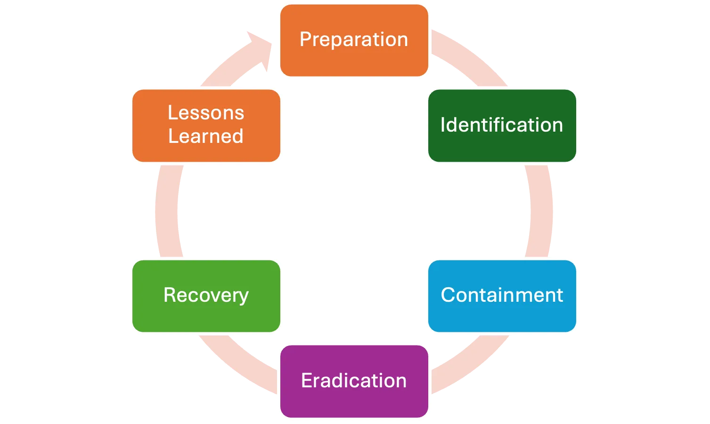
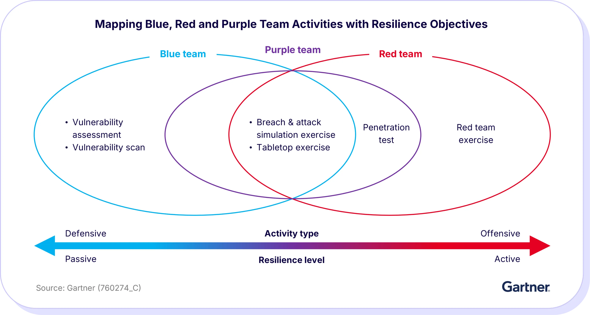
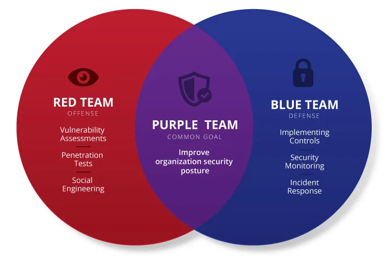
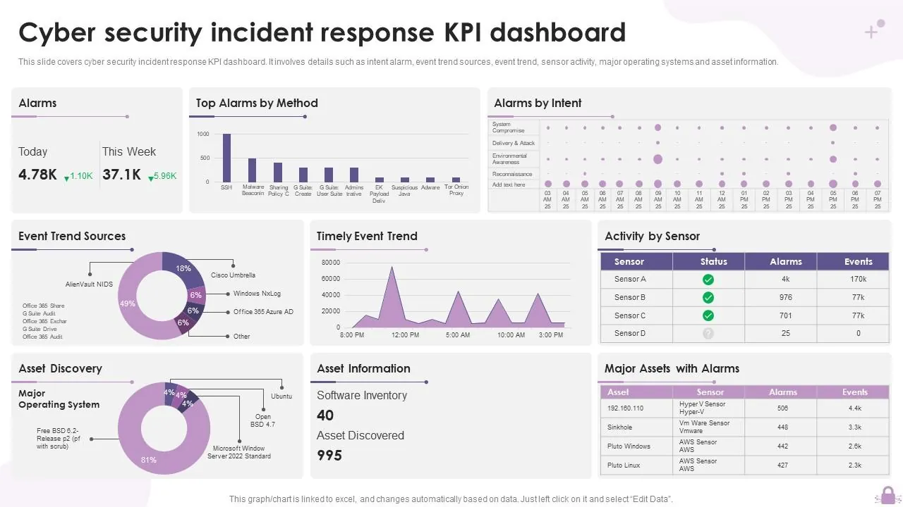
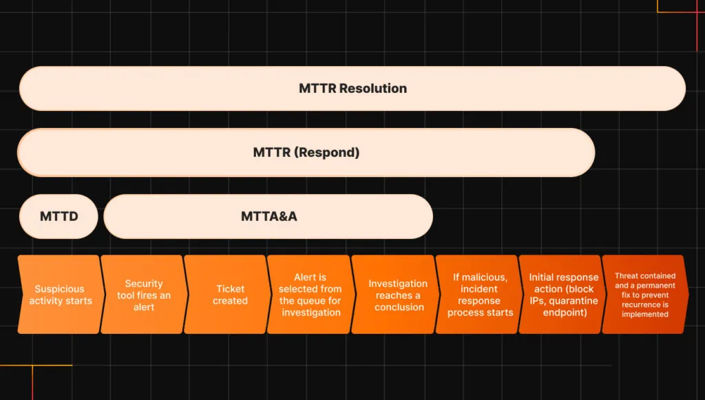

# Olay Müdahale (Incident Handling), Playbook Yönetimi ve Delil Zinciri

Siber güvenlik olayları, günümüz kurumları için artık "olası" değil, "ne zaman gerçekleşeceği belli olmayan" stratejik risk olaylarıdır. Finansal kurumları istikrarsızlaştırabilir, hassas verileri ifşa edebilir ve çoklu yargı alanlarını kapsayan düzenleyici soruşturmaları tetikleyebilirler. Bu bağlamda, olay müdahale (Incident Response — IR) yetkinliği, kurumların siber dayanıklılığının temel taşı haline gelmiştir.

Olay müdahale, Savunma Derinliği (Defense in Depth) mimarisinin **Respond** ve **Recover** katmanlarını operasyonel olarak hayata geçiren kritik yetenektir. Hazırlık aşaması Protect/Detect katmanlarıyla iç içe geçerken; tespit, sınırlandırma, yok etme, kurtarma ve ders çıkarma süreçleri, merkezi SOC/SIEM/SOAR bileşenleri, uç nokta ajanları (EDR/XDR), ağ sensörleri (NDR) ve yalıtılmış forensics ortamları üzerinden koordine edilir. IR yalnızca reaktif bir "yangın söndürme" değil; proaktif risk azaltma, delil bütünlüğü sağlama, yasal yükümlülükleri yerine getirme ve sürekli iyileştirme mekanizmasıdır.

Nisan 2025'te yayımlanan **NIST SP 800-61 Revizyon 3**, olay müdahalesini bağımsız bir operasyonel süreç olmaktan çıkararak **NIST Siber Güvenlik Çerçevesi (CSF) 2.0** ile tam uyumlu olarak kurumsal siber risk yönetiminin temel bir unsuru haline getirmiştir. Bu bölümde PICERL yaşam döngüsü, playbook mühendisliği, Blue/Red/Purple Team metodolojileri, ISO/IEC 27037 uyumlu delil zinciri, KAPE/Velociraptor araçları, SOC metrikleri, tabletop tatbikatları ve Türkiye mevzuatı (KVKK, 7545, BDDK, 5651) bütüncül bir mimari perspektiften ele alınacaktır.

---

## §14.4.1. Giriş ve Kavramsal Çerçeve

Kurumsal bilgi sistemleri altyapılarında siber tehditlerin bertaraf edilmesi, yapılandırılmış olay müdahale süreçlerinin varlığına bağlıdır. Olay müdahale planı (IRP — Incident Response Plan), kurumun bir güvenlik ihlali tespit ettiğinde veya şüphelendiğinde izleyeceği yazılı prosedürler bütünüdür. Etkin bir IRP şunları kapsar:

| Bileşen | Açıklama |
| :---- | :---- |
| **Kurumsal SOME** | Siber Olaylara Müdahale Ekibi; rol, yetki ve iletişim matrisi |
| **Olay sınıflandırma şeması** | Öncelik, etki ve kapsam kriterleri |
| **Eskalasyon prosedürleri** | Teknik → yönetim → hukuk → düzenleyici bildirim zinciri |
| **Araç envanteri** | SIEM, SOAR, EDR, forensics kit, immutable backup |
| **İletişim planı** | İç/dış paydaşlar, medya, müşteri bildirim şablonları |
| **Mevzuat uyum kontrol listesi** | KVKK 72 saat, 7545 bildirim, BDDK raporlama, 5651 log saklama |

Olay müdahale yetkinliği, uluslararası standartlar ve yerel mevzuatla doğrudan ilişkilidir:

| Standart / Mevzuat | IR ile İlişkisi |
| :---- | :---- |
| **NIST SP 800-61r2/r3** | Olay müdahale yaşam döngüsü ve CSF 2.0 entegrasyonu |
| **ISO/IEC 27001:2022 A.5.24–5.27** | Olay yönetimi planlama, değerlendirme, yanıt ve ders çıkarma |
| **CIS Control 17** | Olay müdahale yönetimi (9 safeguard) |
| **ISO/IEC 27037:2012** | Dijital delil tanımlama, toplama, edinim ve koruma |
| **KVKK m.12/5** | Kişisel veri ihlali bildirimi (72 saat) |
| **7545 sayılı Siber Güvenlik Kanunu** | Siber olay/zafiyet bildirimi, SOME zorunluluğu |
| **BDDK BSEBY** | Bankacılık sektörü bilgi sistemleri ve olay yönetimi |
| **5651 sayılı Kanun** | Log saklama, zaman damgası ve delil niteliği |

:::note
NIST SP 800-61r3, r2'nin somut prosedürel adımlarını CSF 2.0 fonksiyonlarına (Govern, Identify, Protect, Detect, Respond, Recover) eşleyerek soyutlaştırmıştır. Operasyonel sahada **SANS PICERL** modeli ve r2'nin 6 adımlı pratik yaklaşımı hâlâ yaygın kullanılmaktadır. Her iki modeli de bilmek, hem yönetişim hem teknik müdahale açısından gereklidir.
:::

---

## §14.4.2. Olay Müdahale Yaşam Döngüsü: NIST SP 800-61 ve SANS PICERL

Olay müdahale yaşam döngüsü, endüstride iki ana modelle temsil edilir: **NIST SP 800-61'in konsolide modeli** ve **SANS PICERL'in 6 adımlı modeli**.

### NIST SP 800-61 Revizyon 3 Yaşam Döngüsü

NIST SP 800-61r3, olay müdahale yaşam döngüsünü dört konsolide aşamada ele alır ve CSF 2.0 fonksiyonlarına eşler:

| Aşama | CSF 2.0 Eşleşmesi | Açıklama |
| :---- | :---- | :---- |
| **Hazırlık (Preparation)** | Govern, Identify, Protect | Politika, araç, ekip ve prosedürlerin oluşturulması |
| **Tespit ve Analiz (Detection & Analysis)** | Detect | Olayın tespiti, önceliklendirilmesi ve analizi |
| **Sınırlandırma, Yok Etme ve Kurtarma** | Respond, Recover | Müdahale, temizlik ve iş sürekliliğinin sağlanması |
| **Olay Sonrası Faaliyet (Post-Incident Activity)** | Govern (Improvement) | Ders çıkarma ve sürekli iyileştirme |

NIST'in bu modeli, olay müdahalesini **sürekli iyileştirme döngüsü** olarak konumlandırır: dersler, Identify fonksiyonu içindeki Improvement kategorisi aracılığıyla yönetişime geri beslenir. Sınırlandırma aşamasında elde edilen yeni veriler, analistleri tekrar tespit ve analiz fazına geri döndürebilir — süreç doğrusal değil, döngüseldir.

### SANS PICERL Modeli

SANS Enstitüsü tarafından geliştirilen **PICERL** modeli, olay müdahalesini altı ardışık aşamaya böler:


*SANS PICERL: Hazırlık → Tanımlama → Sınırlandırma → Yok Etme → Kurtarma → Ders Çıkarma*

| Aşama | Temel Eylemler |
| :---- | :---- |
| **1. Hazırlık** | IRP, CSIRT/SOME kurulumu, SIEM/EDR/forensics araçları, playbook versiyonlama, tabletop, KVKK ihlal planı |
| **2. Tanımlama** | Alarm triyajı, olay doğrulama, kapsam/etki analizi, ATT&CK eşlemesi, SOAR ticket tetikleme |
| **3. Sınırlandırma** | Kısa vadeli: EDR quarantine, hesap disable; uzun vadeli: yedek devreye alma, FW/VLAN segmentasyonu |
| **4. Yok Etme** | Malware temizliği, persistence kaldırma, yama, reimage, credential reset, KAPE triage |
| **5. Kurtarma** | Immutable yedekten geri yükleme, hash/sandbox doğrulama, enhanced monitoring |
| **6. Ders Çıkarma** | Post-mortem/AAR, playbook ve detection rule güncelleme, KVKK 72 saat bildirimi |

:::caution
Sınırlandırma kararları iş sürekliliği ile güvenlik arasında denge gerektirir. Kritik üretim sunucusunun anında izolasyonu operasyonel felakete yol açabilir; önceden tanımlanmış sınırlandırma matrisleri ve human-in-the-loop onay mekanizmaları zorunludur.
:::

### NIST vs SANS Karşılaştırması

| Karşılaştırma Kriteri | SANS PICERL | NIST SP 800-61 |
| :---- | :---- | :---- |
| **Yapısal yaklaşım** | Altı adımdan oluşan, doğrusal operasyonel süreç | Dört grupta toplanan, döngüsel ve geri beslemeli süreç |
| **Hedef kitle** | SOC ekipleri ve DFIR uzmanları | Kamu kurumları ve kurumsal yönetişim ekipleri |
| **Aşama ayrımı** | Containment, Eradication, Recovery ayrı adımlar | Üç aşama tek entegre süreç olarak ele alınır |
| **Ölçümleme** | Operasyonel esneklik ve hızlı müdahale odaklı | Metrik tabanlı süreç iyileştirmesine yüksek önem |
| **Erişilebilirlik** | SANS eğitim ve sertifikasyon ekosistemi | Ücretsiz ve kamuya açık resmi dokümantasyon |

:::note
SANS PICERL doğrusal bir döngü olarak tasarlanmış olsa da, modern olay müdahalesi doğrusal olmayan, dinamik ve sürekli evrilen bir süreçtir. Sınırlandırma, yok etme ve kurtarma arasındaki ayrım, müdahale ekiplerinin tehdidi tamamen yok etmeden sistemleri aceleyle geri yükleme (*rush to recovery*) hatasına düşmesini engeller.
:::

---

## §14.4.3. Playbook Yönetimi ve MITRE ATT&CK Entegrasyonu

### Playbook Tanımı ve Önemi

Olay müdahale **playbook'u**, güvenlik ekiplerinin olaylara yanıt vermek ve çözmek için kullandığı standart prosedürleri içeren adım adım kılavuzdur. Playbook'lar:

- Önceden tanımlanmış yanıt eylemleri, karar ağaçları ve kontrol listeleri içerir
- Farklı olay türlerine (ransomware, BEC, iç tehdit, tedarik zinciri ihlali) göre özelleştirilir
- Sorumlulukları tanımlar ve belirsizliği azaltır
- SOAR otomasyonunun temelini oluşturur
- Living document'tır; her gerçek olay veya purple team tatbikatı sonrası güncellenir

### Playbook Yapısı

| Bileşen | Açıklama |
| :---- | :---- |
| **Olay tanımı** | Hangi tür olayların playbook'u tetiklediği |
| **Roller ve sorumluluklar** | Olay yöneticisi, kıdemli teknik müdahaleci, iletişim yöneticisi |
| **Adımlar ve aşamalar** | Tespit, değerlendirme, soruşturma, müdahale, düzeltme |
| **Şablonlar ve kontrol listeleri** | Yönetim raporları, müşteri e-postaları, triaj kontrol listeleri |
| **Karar ağaçları** | Farklı senaryolarda izlenecek yollar |
| **ATT&CK eşlemesi** | İlgili taktik ve teknik referansları |

### MITRE ATT&CK ile Playbook Geliştirme

MITRE ATT&CK çerçevesi, tehdit aktörlerinin saldırı zincirinin farklı aşamalarında kullandığı taktik ve teknikleri kataloglar:

1. **Tehdit odaklı yaklaşım:** Hangi ATT&CK tekniklerinin kurum için en yüksek riski oluşturduğu belirlenir
2. **Tespit ve müdahale eşlemesi:** Her teknik için tespit yöntemleri ve müdahale prosedürleri tanımlanır
3. **Önceliklendirme:** Tespit edilen tekniklere göre playbook'lar önceliklendirilir

### Örnek Playbook: Ransomware Yanıtı

```yaml
playbook: ransomware_response
version: 2.1
trigger:
  - file_encryption_alert
  - ransomware_note_detected
  - production_outage_with_extortion_demand

roles:
  incident_commander: soc_manager
  technical_lead: senior_ir_analyst
  comms_lead: pr_manager
  legal_counsel: compliance_officer

phases:
  identification:
    actions:
      - confirm_encryption_activity
      - identify_ground_zero_host
      - determine_ransomware_family
    attck_techniques: [T1486, T1490]

  containment:
    immediate:
      - isolate_ground_zero_host
      - block_iocs_at_firewall
      - disable_compromised_accounts
    attck_techniques: [T1485]

  eradication:
    actions:
      - remove_persistence_mechanisms
      - patch_exploited_vulnerabilities
      - reset_compromised_credentials

  recovery:
    actions:
      - restore_from_clean_backups
      - validate_system_integrity
      - monitor_recovery_enhanced

post_incident:
  - conduct_post_mortem
  - update_playbook
  - notify_regulatory_bodies
  - share_iocs_with_cti_platform
```

### Playbook Yaşam Döngüsü

```
[Taslak] → [İnceleme] → [Onay] → [Yayın] → [Otomasyon] → [Tatbikat] → [Güncelleme]
    ↑                                                              |
    └──────────────────── Gerçek Olay / Purple Team ───────────────┘
```

:::caution
Playbook'lar otomasyona dönüştürülürken kritik eylemler (üretim sunucusu izolasyonu, toplu hesap devre dışı bırakma, güvenlik duvarı kuralı değişikliği) için **human-in-the-loop** onay mekanizması zorunludur. SOAR'un %95'e varan otomasyon oranı, düşük riskli tekrarlayan görevler için geçerlidir; yüksek etkili eylemler her zaman insan onayı gerektirir.
:::

---

## §14.4.4. Mavi Takım, Kırmızı Takım ve Purple Teaming

Kurumsal ağların siber dayanıklılığının artırılması, ofansif ve defansif ekiplerin sürekli ve koordineli bir etkileşim içinde çalışmasına bağlıdır.


*Blue Team (savunma), Red Team (saldırı) ve Purple Team (iş birliği) modeli*

| Takım | Rol | Araçlar / Çerçeveler |
| :---- | :---- | :---- |
| **Mavi Takım** | 7/24 izleme, triyaj, müdahale, threat hunting, detection engineering | SIEM, EDR, NDR, SOAR |
| **Kırmızı Takım** | APT emülasyonu, kill chain çalıştırma, gizli sızma testi (ROE kapsamında) | Metasploit, Cobalt Strike, ATT&CK |
| **Mor Takım (Purple)** | Red+Blue gerçek zamanlı iş birliği; detection gap kapatma | Caldera, Atomic Red Team, TIBER-EU |

Mavi Takım yüzlerce saldırıyı aynı anda durdurmak zorundayken, Kırmızı Takım'ın tek bir başarılı saldırı ile amacına ulaşabilmesi operasyonel dengesizliği ortaya koyar. Purple Teaming bu boşluğu kapatır: Kırmızı her TTP'yi çalıştırırken Mavi aynı anda SIEM/EDR konsolunda tespit başarısını doğrular ve kuralı anında optimize eder.

### Saldırı-Savunma TTP Karşılaştırması

| Saldırı Aşaması | Saldırgan TTP'si | Mavi Takım Tespiti ve Müdahalesi |
| :---- | :---- | :---- |
| **İlk erişim (SSH Brute Force)** | Hydra ile kaba kuvvet denemeleri | auth.log korelasyonu, otomatik IP engelleme (active response) |
| **Kalıcılık (Autorun)** | Registry Run key manipülasyonu | Velociraptor/Sysinternals Autoruns sorgusu |
| **Yanal hareket** | PsExec/RDP ile lateral movement | Event ID 4624 (Logon Type 3/10) analizi |
| **C2 bağlantısı** | DNS tünelleme, HTTPS beaconing | NDR ile anormal DNS boyutu ve beacon tespiti |

:::note
Purple Teaming'in temel amacı yeni teknik zafiyetler keşfetmek değil, gerçekçi saldırılara karşı tespit ve müdahale yeteneklerini iyileştirmektir. Düzenleyici çerçeveler (DORA, TIBER-EU) Purple Teaming'i sistemik kuruluşlar için zorunlu hale getirmektedir.
:::

---

## §14.4.5. Dijital Adli Bilişim, Delil Zinciri ve ISO/IEC 27037

Siber olayların ardından gerçekleştirilen adli bilişim (DFIR) süreçlerinin nihai amacı, elde edilen bulguların yasal merciler önünde inkar edilemez ve delil niteliğinde kabul edilebilir olmasını sağlamaktır.

### Delil Zinciri (Chain of Custody)

**Delil zinciri**, dijital delillerin toplanması, korunması, analizi ve sunulması sürecinde delillerin hareketini izleyen ve her aşamada bütünlüğünü ve orijinalliğini kanıtlayan formal süreçtir. Zincirde meydana gelecek en ufak bir belirsizlik veya yetkisiz erişim boşluğu, delilin mahkemede geçersiz sayılmasına yol açabilir.


*Dijital delil zinciri: toplama → koruma → analiz → sunum → arşivleme*

### ISO/IEC 27037:2012 Standart Çerçevesi

ISO/IEC 27037, dijital delillerin ele alınmasında dört temel süreci tanımlar:

| Süreç | Açıklama |
| :---- | :---- |
| **Tanımlama (Identification)** | Potansiyel delillerin tespiti ve belgelenmesi |
| **Toplama (Collection)** | Delillerin güvenli şekilde toplanması |
| **Edinim (Acquisition)** | Bit-stream imaj alma, hash hesaplama |
| **Koruma (Preservation)** | Orijinal medyanın bütünlüğünün korunması |

İki kritik rol tanımlanır:

- **DEFR (Digital Evidence First Responder):** Olay yerine ilk müdahale eden; uçucu verilerin kaybolmasını engellemek için öncelikli adımları atan uzman
- **DES (Digital Evidence Specialist):** Karmaşık sistemlerden delil edinimi ve ileri düzey laboratuvar analizleri gerçekleştiren adli bilişim mühendisi

### Uçuculuk Sıralaması (Order of Volatility)

RFC 3227 standardında tanımlanan prensibe göre, veri toplama en uçucu olandan en kalıcı olana doğru yapılmalıdır:

| Öncelik | Veri Türü | Araç / Yöntem |
| :---- | :---- | :---- |
| 1 | CPU register, cache | Canlı analiz (çok kısa süre) |
| 2 | RAM (bellek) | DumpIt, WinPmem, LiME |
| 3 | Ağ durumu, ARP cache, routing table | `netstat`, `arp -a` |
| 4 | Çalışan süreçler | `tasklist`, Volatility |
| 5 | Disk (non-volatile) | FTK Imager, dd, KAPE |
| 6 | Uzaktan loglar, fiziksel konfigürasyon | SIEM, switch config backup |
| 7 | Arşiv medya | Tape, optical disk |

:::caution
Bir bilgisayar sistemi kapatıldığında bellekteki kritik adli veriler (aktif ağ bağlantıları, şifreleme anahtarları, çalışan zararlı süreçler) kalıcı olarak yok olur. DEFR, sistemleri hemen kapatmak yerine öncelikle uçucu verileri korumakla yükümlüdür.
:::

### Delil Zinciri Standartları

| Standart | Gereklilik |
| :---- | :---- |
| **Hash doğrulama** | SHA-256 ile hash'lenir, her transferde yeniden doğrulanır |
| **Zaman damgası** | Tüm işlemler hassas zaman damgalarıyla kaydedilir (UTC) |
| **İmza ve onay** | Her transfer, tarafların imzasıyla belgelenir |
| **Write-blocker kullanımı** | Delil toplama sırasında yazma engelleyici zorunlu |
| **Ayrı hesaplar** | Soruşturmacı hesapları standart operasyonlardan ayrılır |
| **Detaylı log** | Toplama tarihi/saati, toplayan kişi, depolama konumu, transfer detayları |
| **İki kişi kuralı** | Kritik delillerin transferinde two-person rule uygulanır |

### Delil Zinciri Formu — Zorunlu Alanlar

| Veri Grubu | Form Alanı | Teknik Detay |
| :---- | :---- | :---- |
| **Genel** | Vaka No / Olay ID | SOAR/SIEM ticket ID ile eşleşmeli |
| **Cihaz** | Marka / Model / Seri No | Fiziksel kimlik bilgileri |
| **Durum** | Güç durumu / Güvenlik etiketi | Açık/Kapalı; mühür numarası |
| **Adli işlem** | SHA-256 hash | İmaj alınmadan önce hesaplanır |
| **Zincir günlüğü** | Teslim eden / alan | Ad, unvan, ıslak/dijital imza |
| **Zincir günlüğü** | İşlem tarihi (UTC) | Transfer anlık zaman damgası |
| **Zincir günlüğü** | Amaç | İmaj alma, analiz, adliye emanetine teslim |

### KAPE ile Hızlı Delil Toplama (Triage)

**KAPE (Kroll Artifact Parser and Extractor)**, canlı Windows sistemlerinde kilitli dosyaları bile Volume Shadow Copy (VSS) teknolojisiyle bypass ederek adli açıdan kritik kayıtları dakikalar içinde toplar.

**Temel triage komutu (SANS Triage hedef şablonu):**

```cmd
C:\KAPE\kape.exe --tsource C: --target !SANS_Triage --tdest K:\KapeOutput\TriageData --vss --overwrite
```

**Hedefli artefakt toplama:**

```cmd
kape.exe --tsource C: --tdest E:\IR-Case-2026-0421 --target EventLogs,RegistryHives,WebBrowsers,Prefetch --vhdx
```

**Uzak sistem koleksiyonu (UNC yolu):**

```cmd
C:\KAPE\kape.exe --tsource \\target-server\c$ --target RegistryHives --tdest C:\AdliAnaliz\UzakRegistry --vss
```

| Parametre | İşlev |
| :---- | :---- |
| `--tsource` | Kaynak sürücü veya UNC yolu |
| `--target` | Toplanacak artefakt şablonu (EventLogs, RegistryHives, Prefetch vb.) |
| `--tdest` | Hedef dizin |
| `--vss` | Kilitli sistem dosyaları için VSS kullanımı |
| `--vhdx` | Çıktıyı VHDX disk imajı olarak paketleme |
| `--overwrite` | Hedef dizinde mevcut verinin üzerine yazma |

### Velociraptor ile Ölçekli Endpoint Görünürlüğü

**Velociraptor**, VQL (Velociraptor Query Language) sorguları kullanarak binlerce uç birimde eş zamanlı dosya, kayıt defteri ve süreç araması yapılmasını sağlar.

**Şüpheli PowerShell betiği arama (phishing senaryosu):**

```sql
SELECT Fqdn, OSPath, BTime AS CreatedTime, MTime AS ModifiedTime,
       label(client_id=ClientId, labels=['Phishing_Target'], op='set') AS SetLabel
FROM source(artifact="Windows.Search.FileFinder")
WHERE OSPath =~ "123\\.ps1$"
```

### 5651 Sayılı Kanun ve Log Delil Niteliği

5651 sayılı Kanun kapsamında:

- **Erişim sağlayıcılar** trafik bilgisini en az bir yıl saklamak ve **TÜBİTAK zaman damgası** ile hash imzalama yapmakla yükümlüdür
- **Toplu kullanım sağlayıcılar** (otel, kafe, kurumsal ağ) iç IP dağıtım loglarını ve erişim kayıtlarını en az iki yıl saklar
- Logların yasal delil kabul edilebilmesi için zaman damgası ile mühürlenip imzalanması zorunludur
- Gün sonunda toplanan ham log dosyalarının SHA-256 hash'i çıkarılır, zaman damgası sunucusundan alınan tescilli zaman kaydıyla birleştirilerek `.sign` uzantılı imza dosyasıyla arşivlenir

---

## §14.4.6. SOC Etkinlik Metrikleri: MTTD, MTTR ve Dwell Time

Güvenlik Operasyonları Merkezlerinin (SOC) operasyonel başarısı, belirli performans göstergelerinin (KPI) sürekli ölçülmesi ve analiz edilmesiyle takip edilir.


*SOC olay müdahale KPI dashboard: MTTD, MTTR, dwell time ve alarm hacmi*

### Temel Metrikler

| Metrik | Tanım | Önemi |
| :---- | :---- | :---- |
| **MTTD** (Mean Time to Detect) | Olay başlangıcı ile tespit arasındaki ortalama süre | Tespit yeteneğinin ölçüsü |
| **MTTA** (Mean Time to Acknowledge) | Alarm üretimi ile analist onayı arasındaki süre | Triyaj hızının ölçüsü |
| **MTTC** (Mean Time to Contain) | Tespitten tam sınırlandırmaya kadar geçen süre | Sınırlandırma hızının ölçüsü |
| **MTTR** (Mean Time to Respond/Remediate) | Tespitten tam çözümlemeye kadar geçen süre | Müdahale hızının ölçüsü |
| **Dwell Time** | Saldırganın tespit edilmeden ağ içinde kaldığı toplam süre | Gizlenme yeteneğinin ölçüsü |

### Benchmark Hedefleri

| Metrik | Elite Seviye | Orta Seviye | İyileştirme Gerekli |
| :---- | :---- | :---- | :---- |
| **MTTD** | < 1 saat | < 5 saat | > 24 saat |
| **MTTA** | < 15 dakika | < 30 dakika | > 1 saat |
| **MTTC** | < 4 saat | < 8 saat | > 24 saat |
| **MTTR** | 2–4 saat | < 24 saat | > 72 saat |
| **Dwell Time** | < 7 gün | < 14 gün | > 30 gün |
| **Dwell Time (Ransomware)** | < 24 saat | < 5 gün | > 7 gün |

Sektör verileri, kurumların %50'sinden fazlasının MTTD'sinin 5 saatten az olduğunu, %25'inin ise 60 dakika veya daha kısa MTTD'ye sahip olduğunu göstermektedir. Küresel medyan dwell-time 2025'te 14 güne yükselmiştir; ransomware saldırılarında bu süre çok daha kısadır (~5 gün).

### Metrik Hesaplama

```python
# SOC metrik hesaplama (ticket timestamp'leri üzerinden)
def avg_seconds(incidents, start_key, end_key):
    times = [i[end_key] - i[start_key] for i in incidents if i.get(start_key) and i.get(end_key)]
    return sum(times) / len(times) if times else 0

metrics = {
    'mttd_hours':  avg_seconds(incidents, 'compromise_time', 'detection_time') / 3600,
    'mtta_minutes': avg_seconds(incidents, 'alert_time', 'acknowledge_time') / 60,
    'mttr_hours':  avg_seconds(incidents, 'detection_time', 'resolution_time') / 3600,
    'dwell_days':  avg_seconds(incidents, 'compromise_time', 'eradication_time') / 86400,
}
```

### SOC Dashboard KPI'ları

Etkin bir SOC dashboard'u aşağıdaki göstergeleri izlemelidir:

| KPI | Açıklama | Hedef |
| :---- | :---- | :---- |
| MTTD | Ortalama tespit süresi | < 1 saat |
| MTTR | Ortalama müdahale süresi | < 4 saat |
| Yanlış pozitif oranı | Toplam alarm içinde FP yüzdesi | < %15 |
| Alarm hacmi | Günlük/haftalık alarm sayısı | Trend izleme |
| Dwell time | Saldırgan barınma süresi | < 7 gün |
| Analist iş yükü | Analist başına günlük olay sayısı | Dengeli dağılım |
| Tespit kapsamı | ATT&CK teknik kapsama oranı | > %70 |
| Playbook yükseltme oranı | Otomatik çözülen olay yüzdesi | Artan trend |

:::note
Gerçek program olgunluğunu öngören metrikler, başlıca MTTD/MTTR sayıları değil; playbook yükseltme oranı, saldırganın en uzun süre oturduğu kill-chain aşaması ve analist tarafından tespit edilen olayların düşüş eğilimidir. Purple Team tatbikatları ile detection latency düzenli olarak ölçülmelidir.
:::

---

## §14.4.7. Masaüstü Tatbikatları (Tabletop Exercise)

**Masaüstü tatbikatları (Tabletop Exercises — TTX)**, olay müdahale planlarını test etmek için kullanılan, genellikle yarım gün süren ve çapraz fonksiyonel bir ekibin bir saldırı senaryosuna nasıl yanıt vereceğini masabaşı ortamında simüle eden egzersizlerdir.


*Çapraz fonksiyonel tabletop tatbikatı: SOC, hukuk, PR ve üst yönetim katılımı*

### Tabletop Egzersizinin Amacı

- Mevcut IR planını doğrulamak
- Plandaki açıkları tespit etmek
- Ekip içi iş birliğini ve IR hazırlığını güçlendirmek
- Olay müdahalesini teoriden pratiğe dönüştürmek
- Playbook gap'lerini, iletişim kopukluklarını ve karar gecikmelerini düşük maliyetle ortaya çıkarmak

### Etkin Tabletop Tasarımı

| Adım | Açıklama |
| :---- | :---- |
| **1. Senaryo tasarımı** | Kurumun sektörüne ve risk profiline uygun saldırı senaryosu |
| **2. Rol dağılımı** | CISO, SOC Lead, Legal, İletişim, BT Altyapı, Üst Yönetim |
| **3. Enjeksiyon yönetimi (Injects)** | Kolaylaştırıcı, krizin gidişatını değiştiren yeni dinamik bilgiler ekler |
| **4. Playbook doğrulaması** | Katılımcılar hangi playbook'ları devreye alacaklarını tartışır |
| **5. Ders çıkarma raporu** | Yetki çatışmaları, iletişim darboğazları, teknik eksiklikler raporlanır |

### Tabletop Senaryo Örneği: "Phoenix Rising"

| Öğe | İçerik |
| :---- | :---- |
| **Tetikleyici** | Finans departmanında `DECRYPT.txt` notu; 3 sunucu + 45 iş istasyonunda şifreleme |
| **Saldırgan** | "DarkVault" ransomware grubu — 5 BTC fidye talebi |
| **Kök neden** | Phishing e-postasına tıklama (varsayılan) |
| **Enjeksiyon 1** | Saldırganlar verileri sosyal medyada paylaştı |
| **Enjeksiyon 2** | KVKK 72 saatlik süresinde son 12 saate girildi |
| **Enjeksiyon 3** | Yedeklerin de şifrelendiği tespit edildi |
| **Kritik sorular** | Sınırlandırma stratejisi? Fidye kararı? KVKK/BDDK/USOM bildirimi? |
| **Başarı kriterleri** | MTTD < 2 saat, MTTR < 4 saat, iletişim doğruluğu, mevzuat uyumu |

### CIS Control 17 ile Uyum

**CIS Control 17 (Incident Response Management)**, kurumların bir saldırıyı hızlıca tespit etmesini, içermesini ve etkisini azaltmasını sağlayacak bir olay müdahale yeteneği geliştirmesini gerektirir. Dokuz safeguard'u arasında rol ataması, iletişim yönetimi, senaryo pratiği (tabletop dahil) ve olay analizi/dokümantasyonu bulunur.

:::caution
Tabletop tatbikatları yılda en az bir kez (CIS Control 17, KVKK 2019/10 Kurul Kararı) gerçekleştirilmelidir. Her büyük olay sonrasında ek tatbikat yapılması önerilir. Tatbikat sonuçları After Action Report (AAR) olarak belgelenmeli ve IRP revize edilmelidir.
:::

---

## §14.4.8. Kriz İletişimi, İhlal Sonrası Yönetim ve Türkiye Mevzuatı

Siber güvenlik olaylarında, teknik müdahale kadar kriz iletişimi de kritik hale gelir. Etkin kriz iletişimi paydaş güvenini korur, yasal yükümlülüklerin yerine getirilmesini sağlar, itibar hasarını minimize eder ve iç panik ile spekülasyonu önler.

### Kriz İletişim Planı Bileşenleri

| Bileşen | Açıklama |
| :---- | :---- |
| **İletişim ekibi** | PR, hukuk, yönetim, teknik temsilcilerden oluşan kriz iletişim ekibi |
| **Mesaj çerçevesi** | Olay türüne göre uyarlanabilir önceden hazırlanmış şablonlar |
| **Paydaş haritası** | İç paydaşlar (çalışanlar, yönetim) ve dış paydaşlar (müşteriler, düzenleyiciler, basın) |
| **Onay mekanizması** | Hangi mesajların kim tarafından onaylanacağı |
| **Kanal stratejisi** | E-posta, web sitesi, basın bülteni, status page kullanım zamanlaması |

### Türkiye Mevzuatında Bildirim Yükümlülükleri

#### KVKK — 72 Saatlik İhlal Bildirimi

6698 sayılı Kişisel Verilerin Korunması Kanunu kapsamında, veri sorumluları gerçekleşen bir veri ihlalini öğrendikleri tarihten itibaren **gecikmeksizin ve en geç 72 saat içinde** Kişisel Verileri Koruma Kurulu'na bildirmekle yükümlüdür.

| Kriter | Detay |
| :---- | :---- |
| **Süre başlangıcı** | Veri işleyenin (SaaS tedarikçisi vb.) ihlali tespit edip veri sorumlusuna bildirdiği an |
| **72 saat kuralı** | Kesintisiz süre; resmi ve dini tatilleri de kapsar |
| **Bildirim kanalı** | ihlalbildirim.kvkk.gov.tr portalı |
| **Gecikme durumu** | Haklı gerekçe ile 72 saat aşılırsa gecikme nedenleri açıklanmalıdır |
| **Aşamalı bildirim** | Tüm bilgiler hazır değilse mevcut bilgilerle başlanır, tamamlanır |
| **İlgili kişi bildirimi** | Yüksek risk göstergeleri (özel nitelikli veri, finansal veri, TC kimlik) tetikler |
| **İhlal müdahale planı** | Hazırlanmalı ve yılda bir gözden geçirilmelidir |

#### 7545 Sayılı Siber Güvenlik Kanunu

19 Mart 2025 yürürlük tarihiyle Türkiye'nin en kapsamlı siber güvenlik düzenlemesi:

| Yükümlülük | Detay |
| :---- | :---- |
| **Olay bildirimi** | Siber olaylar ve zafiyetler **gecikmeksizin** Siber Güvenlik Başkanlığı'na bildirilir |
| **SOME zorunluluğu** | Kritik altyapı hizmeti sunan kuruluşlar SOME kurmakla yükümlüdür |
| **Siber güvenlik sorumlusu** | Kamu kurumları ve 50+ çalışanlı özel şirketler için atama zorunluluğu |
| **Yaptırımlar** | Olay bildirmeme: 10M TL'ye varan idari para cezası; denetim ihlali: brüt satış hasılatının %5'ine kadar |

#### BDDK — Bankacılık Sektörü Yükümlülükleri

**BSEBY (Bankaların Bilgi Sistemleri ve Elektronik Bankacılık Hizmetleri Yönetmeliği)** kapsamında:

- Kurumsal SOME kurulması ve siber olay yönetimi prosedürleri zorunludur
- Kritik olaylarda BDDK'ya hızlı bildirim (sektör pratiğinde 2 saat)
- Hassas/kişisel veri sorgulama kayıtlarının saklanması
- Bilgi sistemleri bağımsız denetimi (BSD) BSEBY referansına göre yapılır
- Kök neden analizi ve raporlama zorunluluğu

#### 5651 Sayılı Kanun — Loglama ve İşbirliği

- Erişim sağlayıcılar ve yer sağlayıcılar logları 1–2 yıl saklar
- Kolluk kuvvetlerine log teslimi yükümlülüğü
- Zaman damgalı ve hash imzalı log arşivleme (delil niteliği)
- Toplu kullanım sağlayıcıları iç IP dağıtım ve erişim kayıtlarını tutar

### İhlal Sonrası Yönetim Süreci

| Faz | Süre | Kritik Eylemler |
| :---- | :---- | :---- |
| **Acil müdahale** | 0–24 saat | Olay doğrulama, kriz ekibi toplantısı, sınırlandırma, hukuk aktivasyonu |
| **Değerlendirme** | 24–72 saat | Etki analizi, KVKK/BDDK/7545 değerlendirmesi, KAPE/Velociraptor triage |
| **Bildirim** | ≤ 72 saat | KVKK Kurulu bildirimi, ilgili kişi bilgilendirmesi, iç/dış iletişim |
| **Normalleşme** | 1–4 hafta | Güvenli geri yükleme, yama, ek kontroller, iş sürekliliği |
| **Ders çıkarma** | 4–8 hafta | Post-mortem/AAR, playbook güncelleme, düzenleyici nihai rapor |

:::caution
İhlal sonrası süreçte yapılan en büyük hatalar: teknik detaylar netleşmeden "sistemlerimizin tamamen güvenli olduğunu" iddia etmek veya durumu yetkililerden gizlemeye çalışmak. Sistemler tekrar yayına alınmadan önce saldırganın bırakmış olabileceği arka kapılar, zamanlanmış görevler ve manipüle edilmiş hesaplar tamamen temizlenmelidir; aksi halde 48 saat içinde tekrar hacklenme riski doğar.
:::

---

## §14.4.9. Standartlar ve Mevzuat Uyum Matrisi

| Standart / Mevzuat | Olay Müdahale | Playbook | Delil Zinciri | Kriz İletişimi | Metrikler |
| :---- | :----: | :----: | :----: | :----: | :----: |
| **NIST SP 800-61r3** | ✓ | ✓ Önerilir | ✓ Kısmen | ✓ | ✓ |
| **NIST SP 800-61r2** | ✓ 6 Adım | ✓ | ✓ | ✓ | ✓ |
| **NIST SP 800-86** | ✓ | — | ✓ | — | — |
| **NIST SP 800-53 (IR-4)** | ✓ | — | ✓ | — | — |
| **CIS Control 17** | ✓ 9 Safeguard | ✓ | — | ✓ | — |
| **ISO 27001:2022 A.5.24–5.27** | ✓ | ✓ | ✓ | ✓ | ✓ |
| **ISO/IEC 27037:2012** | — | — | ✓ | — | — |
| **ISO/IEC 27043** | ✓ | — | ✓ | — | — |
| **KVKK m.12/5** | ✓ | — | ✓ | ✓ (72 saat) | — |
| **7545 S.G.K.** | ✓ | ✓ | ✓ | ✓ | — |
| **BDDK BSEBY** | ✓ | ✓ | ✓ | ✓ | ✓ |
| **5651 sayılı Kanun** | ✓ | — | ✓ | ✓ | — |

---

## §14.4.10. Özet ve Mimari Öneriler

Olay müdahale, playbook yönetimi ve delil zinciri, modern bir siber güvenlik programının **üç sacayağıdır**. NIST SP 800-61r3'ün getirdiği paradigma değişikliği — olay müdahalesini CSF 2.0 ile entegre ederek risk yönetiminin merkezine yerleştirme — kurumların olay müdahalesini **reaktif bir operasyondan proaktif bir risk yönetimi aracına** dönüştürmesini gerektirir.

### Temel Çıkarımlar

1. **İki model, bir süreç:** NIST SP 800-61r3'ün yönetişim odaklı CSF 2.0 eşlemesi ile SANS PICERL'in operasyonel 6 adımı birbirini tamamlar. Kurumlar her iki çerçeveyi de IRP'lerine entegre etmelidir.

2. **Playbook merkezli yaklaşım:** Tüm olay türleri için MITRE ATT&CK eşlemeli playbook'lar geliştirilmeli, SOAR ile otomatize edilmeli ve her gerçek olay veya purple team tatbikatı sonrası güncellenmelidir.

3. **Purple Team kültürü:** Kırmızı ve Mavi Takım arasında sürekli iş birliği sağlayan Purple Teaming programı, detection gap'leri kapatmanın en etkin yoludur.

4. **Delil zinciri otomasyonu:** ISO/IEC 27037 uyumlu delil toplama ve zincir yönetimi KAPE ve Velociraptor ile otomatize edilmeli; 5651 kapsamında zaman damgalı log arşivleme derhal devreye alınmalıdır.

5. **Metrik tabanlı iyileştirme:** MTTD, MTTR ve Dwell Time metrikleri düzenli izlenmeli; hedef olarak kritik olaylarda MTTD < 1 saat, MTTR < 4 saat, ransomware dwell < 24 saat belirlenmelidir.

6. **Tabletop egzersizleri:** Yılda en az 2 kez, çapraz fonksiyonel katılımlı masaüstü tatbikatları gerçekleştirilmeli; sonuçlar AAR olarak belgelenmelidir.

7. **Mevzuat uyumu:** KVKK 72 saat bildirim yükümlülüğü, 7545 sayılı Siber Güvenlik Kanunu gereklilikleri, BDDK SOME zorunluluğu ve 5651 log saklama standartları IR süreçlerine entegre edilmelidir.

Bu bölüm, kitabın diğer bölümleriyle (IAM/Zero Trust, SIEM/SOC mimarisi, Backup & Immutable Storage, Supply Chain Security, CTI ve Detection Engineering) sıkı entegrasyon içindedir. Olay müdahale, mimarinin "son savunma" değil, **sürekli öğrenen ve iyileşen** bileşenidir.